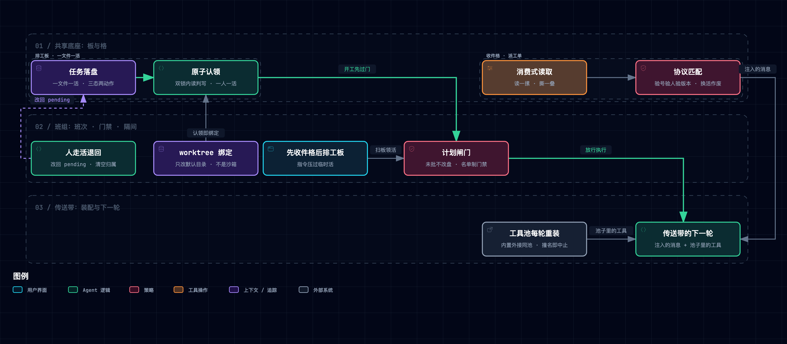

# ⑤ 多 Agent 平台：从一个到一群

> **一句话本质**：把「多 Agent」拆开，全是朴素物件——一张板、几个格子、带编号的单据、各自的隔间；而循环还是那一个。

> [!WARNING] **读前必看：本章两轨分歧是五层里最大的**
> 课程站点（20 章旧修订）在本层反复自陈三条「教学版缺陷」——无文件锁、无执行门禁、并发认领有竞态——**这三条在仓库 main 整合版里已全部补上**【一】。本章凡涉及「教学实现缺什么」的断言，一律写明是**站点旧修订**还是 **main 轨**；不写轨别的句子，默认指 main 轨（`s10_task_system` / `s13_agent_teams` / `s14_mcp_plugin` / `s15_integrated_harness`，固定提交 `f9e8b28`）。

---

## 1. 这一层要解决什么问题

上一层把时间还回来了，可整间工坊自始至终只有一位师傅、一条传送带。一个人只有一双手：两件互不依赖的活串着做，慢的拖住快的；而待办、台面、工序卡全是**会话内的物件**，进程一关什么都不剩。要「从一个到一群」，缺的不是更聪明的模型，是一整套**共享的朴素物件**：活要放在人人可见处（排工板）、传话不能挤进同一张台面（收件格）、拍板要留凭证（派工单）、各自的活各自改（隔间）、别人家的机器要接得进来（标准插口）。课程把这些物件一件件造出来，模型还是那个模型。

| 上一层留下的缺口 | 本层机制 | 大白话 |
|:---|:---|:---|
| 活与待办都是会话内的，进程一关全没 | 排工板：一文件一任务落盘，三态两动作 | 活挂在磁盘上，不挂在谁的脑子里 |
| 谁在干哪张活、先后顺序说不清 | 认领原子性 + 依赖 fail-closed | 发现可以一起看，认领必须一个一个来 |
| 一群人传话会挤爆同一张台面 | 每人门口的消费式收件格 | 通信挪出台面 |
| 口说无凭的「批准了」「收工了」 | 带编号、验身份、绑工序版本的派工单 | 单子只认得出自己那份回执 |
| 没人盯着时队友干什么、人没了活怎么办 | 先收件格后排工板的班次；人走活退回 | 指令压过临时活 |
| 几个人同时改一个目录必打架 | 各自的隔间（worktree） | 隔的是工作副本，不是权限 |
| 别人家的机器怎么接进工坊 | 标准插口（MCP）：重起名进同一个池子 | 自我介绍不构成放行理由 |

---

## 2. 机制全景



> 图源（可 diff 文本）：[`claude-code-multiagent--collab-panorama.mmd`](../../assets/mermaid/agent-harness/claude-code-multiagent--collab-panorama.mmd) · 交互版（下载到本地打开）：[`claude-code-multiagent--collab-panorama.html`](../../assets/architecture/agent-harness/claude-code-multiagent--collab-panorama.html)

读法：排工板与收件格是**两件底座**（共享的状态、共享的信道），派工单长在收件格之上，隔间绑定与外接工具各自挂进认领与分发两条路径——全部最终汇入同一个循环。

---

## 3. M1 · 入口排工板：任务图

> [!TIP] **类比**
> 工坊入口挂一块排工板，每张活是一张卡片钉在板上：写清干什么、被谁挡着、被谁领走。卡片在板上而不在任何人口袋里——人来了读板，人走了板还在。

**不变式一 · 一文件一活，跨会话即重读目录。** 任务是磁盘上的 JSON 文件（`Task` 含 id / subject / description / status / owner / blockedBy，团队版另带 worktree 字段），没有任何内存态；重启恢复＝重新扫目录【一】。

**不变式二 · 三态两动作，所有权是钥匙。** 状态机严格 `pending →claim→ in_progress →complete→ completed`；认领要求 status 为 pending，完成要求 in_progress **且 task.owner == owner**——不是自己的活，结不了【一】。

**不变式三 · 依赖判坏是 fail-closed。** 依赖的文件缺失、ID 非法、状态非法，一律判「未完成 → 阻塞」，而不是「无依赖 → 可开始」。坏掉的前提不会变成放行的理由【一】。

**不变式四 · 开工之后不许改前提。** 添加依赖边要求目标任务 `status == pending` **且 owner 为空**，否则抛错——依赖图是排产前提，改了前提，已认领的活就凭空失效【一】。

**不变式五 · 两阶段建图。** 同一轮回复里的多个工具调用，是在任何工具结果产生**之前**就确定的，所以 `create_task` 拿不到同轮另一个 `create_task` 的 ID——必须先建全部节点、拿到运行时 ID、再连边。这条契约在系统提示词与工具描述两处同时固化【一】。ID 本身是随机十六进制串加排他创建（撞了重摇），配正则校验与路径归属校验双重挡穿越【一】。

**不变式六 · 环检测：新增边时做反向可达性判定。** 每连一条新边，就遍历一次「这条依赖是否已经传递地依赖我」，命中即拒绝并报环；自依赖单独拦。实现是**带 visited 集合的迭代式深度优先遍历**（显式栈），不是递归【一】。

**不变式七 · 认领必须原子。** `claim_task` 整体在 `task_store_lock()` 内完成「读 → 判 → 写 owner」；这把锁是**双层**的——进程内可重入锁 + 打在任务目录锁文件上的跨进程文件锁【一】。另有「一人一活」两道互斥：名下已有租约、或名下仍有进行中的活，都拒绝认领第二张【一】。写入用临时文件加原子替换【一】。

**一处跨章回退值得记下**：`s10` 完成任务前先拍一张「当前已就绪任务」快照，完成后再拍一次做差集，只播报**刚刚**被解锁的下游；团队版删掉了差集，改为全量重列当前所有就绪任务——完成第二张活时，第一张活早就解锁却无人认领的下游会被**再播报一次**。精确到增量是单 Agent 版的行为【一】。

与待办的分工（README 给了完整对照【二】）：待办是会话内、整表替换、无依赖无归属——帮单个师傅不漂移；排工板是跨会话、单条 CRUD、带依赖与归属——支撑班组协作。整合版两者并存【一】。

产品侧另有两处结构性差异（课程作者拆过闭源源码后指出，属其分析【三】）：产品的任务 ID 是**递增整数加高水位标文件**，删除后编号也不复用；产品的认领**只设归属不改状态**（状态迁移由另一工具负责），且在锁内重读以防「检查与使用之间被抢」。

> [!IMPORTANT] **实景**
> `s13_agent_teams/code.py @ f9e8b28`
>
> ```python
> @contextmanager
> def task_store_lock():
>     """Serialize task mutations across threads and host processes."""
>     with task_lock:
>         ...
>         handle = TASK_LOCK_PATH.open("a+")
>         fcntl.flock(handle.fileno(), fcntl.LOCK_EX)   # 跨进程文件锁
>         ...
>
> def claim_task(task_id: str, owner: str = "agent") -> str:
>     """Atomically claim one task and bind the owner's filesystem cwd."""
>     with task_store_lock():
>         task = load_task(task_id)
>         if task.status != "pending":
>             return f"Task {task_id} is {task.status}, cannot claim"
>         ...
>         task.owner = owner
>         task.status = "in_progress"
>         save_task(task)
>         teammate_assignments[owner] = {"task_id": task.id, "cwd": cwd}
>         advance_assignment_version(owner)
> ```
>
> 全部判据与全部写入都在同一把锁内——「发现与认领分离、认领原子」不是口号，是缩进。

**口播落点**：发现可以一起看，认领必须一个一个来。

---

## 4. M2+M3 · 收件格与派工单：消息总线与协议

> [!TIP] **类比**
> 每个工位门口钉一个收件格：传话就往对方格子里投一张条，读的人把整摞条一起拿走，格子清空才算读过。要人拍板的事不走口传——填一张一式两份的派工单，编号与经手人写得清清楚楚，批复也凭编号认领。

**不变式一 · 消费式读。** 一人一个 JSONL 收件格；发送是追加一行，读取是**读出全部行然后删掉整个文件**——「读一条撕一条」的物理形态是「读一摞撕一叠」【一】。收件格名走白名单正则加路径归属校验（与任务 ID 同一套防穿越思路），`lead` 与 `agent` 是运行时保留名【一】。

**不变式二 · 事件不是工具。** 查收件格**不是模型工具**：消息的到达与消费属于运行时，模型只处理「已被投递进上下文的事件」。因果很直白——若消费是工具，模型就会轮询，而轮询既占轮次又占台面；系统提示词因此明写「启动队友后结束本轮，别轮询状态」【一】【二】。

**不变式三 · 进程内线程安全（站点旧修订的竞态已修）。** main 轨的消息总线自带可重入锁与条件变量，发送、读取、窥视、阻塞等待全部在锁内，类文档自陈线程安全【一】。站点旧修订自陈的「读取加删除两步之间有竞态」，在 main 轨不成立【二】——但留下一处**真实的不对称**：任务库有**跨进程**文件锁，收件格只有**进程内**锁，而 README 自己承认「另一个使用同一任务目录的进程」是可能场景【一】。

**不变式四 · 禁止嵌套与禁止改图，是同一处工具集边界。** 队友的工具表＝基础工具组＋`send_message`＋`submit_plan`＋列表/认领/完成三件任务工具；`spawn_teammate` 与建图改图工具只在 Lead 的工具表里。队友生不了队友、也改不了排工板——**靠的是发给他什么工具，不是运行时拦他什么调用**【一】。站点另以闭源实现佐证产品同样禁止嵌套生成【三】。队友与副台的分工（README 四轴对照【二】）：副台一次性、只服一个任务、只带回一张回执；队友常驻、跨任务保留上下文、收发事件、双向协作——整合版两者并存，前者解决上下文隔离，后者解决长期并行【一】。

**派工单的四步与四重校验。** ① 生成编号并登记一条 pending 状态；② 编号随元数据发进对方收件格；③ 回复带**同一编号**与批准布尔；④ 匹配时依次校验：**编号存在、回复类型与请求类型配对相符、回复人身份对得上（发件人须为请求目标、收件人须为请求发起人）、该请求仍是 pending**——第四项使已结案的请求对重复回复免疫（幂等）【一】。四项缺一不可，其中身份校验正是防冒名批复的那条。

**陈旧审批作废（main 轨独有，本章设计感最强的一处）。** 提交计划时，队友把**当时的任务 ID 与工序版本号**一并写进请求；Lead 审批与队友应用回复**双端各自**重核这两项仍与当前一致，不一致直接判「属于更早的一次派工」丢弃。而认领、释放、完成都会递增版本号——**换了活，旧批条自动作废**【一】。

**先路由后返回。** Lead 消费收件格的函数在同一次调用内，先对所有协议回复完成状态翻转，再把**全部**消息返回给调用方——不存在「消息读走了、协议状态没翻」的中间态【一】。

**执行门禁是真的（站点 s16 说没有，那是旧修订【二】）。** main 轨的工具分发层在执行前查计划闸门状态：处于「要求中 / 待审批 / 已驳回」任一态时，`bash`、`write_file`、`edit_file` 三个修改型工具被直接拦下返回 Blocked 串；`read_file`、`glob` 不拦。`complete_task` 查同一道门——**计划没批，活也结不了**【一】。这条完整往返——要求计划 → 提交 → 待审 → 人批复 → 同编号回执 → 应用 → 门开/门关——是全章唯一真正跑完「请求—人判断—回复—恢复」全程的链路。与之相对，**权限不冒泡**：队友遇到需人工确认的命令，拿到的是一条权限错误串（不排队、不挂起），由 Lead 与用户处置；整合版更进一步，非主线程的审批请求直接拒绝，不去与主 CLI 争抢输入【一】。产品侧（课程作者的分析【三】）确有权限门控、审批可附带模式与反馈。

**两个事件分开报。** 队友完成一项活后，运行时顺序发两条消息：结果（产出了什么）与空闲通知（还能不能接活）——一句含糊的「完成了」无法同时表达两种状态【一】。关机同走协议：Lead 发关机请求 → 队友校验（发件人须为 lead、收件人须为本人、请求仍 pending、本人未在停机中）→ 回复同编号批准 → 循环退出【一】。

> [!IMPORTANT] **实景**
> `s13_agent_teams/code.py @ f9e8b28`
>
> ```python
> def match_response(response_type, request_id, approve,
>                    from_agent, to_agent) -> bool:
>     """Match one protocol response to one pending request."""
>     with team_lock:
>         state = pending_requests.get(request_id)
>         if not state:
>             return False
>         expected = {"shutdown": "shutdown_response",
>                     "plan_approval": "plan_approval_response"}[state.type]
>         if response_type != expected:
>             return False
>         if from_agent != state.target or to_agent != state.sender:
>             return False
>         if state.status != "pending":
>             return False
>         state.status = "approved" if approve else "rejected"
>     return True
> ```
>
> 四段早退对应四重校验；第三段（身份）是总纲式提法里最常被漏掉、却防着最险的那件事：别人替你批复。

**口播落点**：单子凭编号和身份认回执；换了活，旧批条自动作废。

---

## 5. M4 · 班次：队友的自治

> [!TIP] **类比**
> 队友不是招之即来的临时工，是常驻工位的师傅：干完手上的活不散伙，坐回工位等两样东西——门口格子里的新指令，或板上没人领的新活。他收工只有一种方式：工坊正式叫他走。

**班次是两拍加一个终止态（纠错）。** main 轨队友的外层循环在 `work()` 与 `wait_for_work()` 之间摆动，`work()` 返回三取一：继续（还有工具要跑）、空闲（进入待命）、停止（退出）；README 明说不设固定的工具轮数上限，队友**不因空闲超时自行退出**，只在收到关机请求时退【一】。站点旧修订那张「工作 / 待命 / 收工」三段表，连同轮询秒数、空闲超时、每轮调用上限等常数，在 main 轨全部不存在（那些常数随修订漂移，本文不固化）【二】。

**不变式一 · 先收件格，后排工板。** 待命循环先**阻塞等消息**；有消息就处理并回到工作拍；**只有等消息超时还空手**，才去排工板扫活。因果：关机与审批指令必须压过临时发现的活【一】。

**不变式二 · 扫描资格的合取（最容易读错的一条）。** 候选＝`pending` 且无主 且依赖**全部已完成**。注意第三项判的是「每条依赖都完成了」，不是「没有依赖」——**有依赖不等于不合格，被没完成的依赖挡着才算**【一】【二】。main 轨还有第四个条件：任务的隔间绑定必须解析得出——绑定坏了的活**不进候选**，认领时也会直接失败，**绝不悄悄退回仓库根目录**。这是 fail-closed 的第二次出场【一】。扫描只产生快照候选，所有权变更全部收进认领那把锁——多个队友可以同时看见同一候选，只有一个能把它推进进行中【一】。

**不变式三 · 人走活退回。** 队友线程的收尾块把该队友名下仍进行中的活**改回 pending 并清空归属**，退回排工板——人没了，活不能跟着没【一】。站点旧修订曾明说省略了这条释放路径，main 已补齐【二】。

**不变式四 · 租约还到轮次边界。** 完成任务后**不立即释放**目录租约，要等到模型轮次边界才释放——好让本轮剩余的工具调用仍落在同一个隔间里【一】。

**不变式五 · 身份不放在会被压缩的地方。** 队友的 system 提示是每次模型调用单独传的参数，**从不进消息数组**，压缩管线碰不到它；而且 main 轨的队友根本不跑压缩（压缩只在 Lead 一侧做）【一】。站点旧修订把身份塞进消息流、再用「消息太少就重新插一条」打补丁，并自陈产品是靠压缩时保住 system 提示解决的【二】——把这条提炼成不变式应是：**身份若不放进会被压缩的地方，就不需要事后补救**；补救本身正是先前放错位置的供词。

**Lead 侧的自治（整合版）。** 独立事件线程按固定节拍巡视定时队列、Lead 收件格与后台任务，任一有货就在会话锁内**自行起一轮**主循环——没有用户按开始；定时任务注入的请求还会并入「权威请求」字段，保证压缩之后目标不丢【一】。

> [!IMPORTANT] **实景**
> `s13_agent_teams/code.py @ f9e8b28`
>
> ```python
> def wait_for_work(self) -> bool:
>     """Wait for a message or atomically claim the next ready Task."""
>     while True:
>         inbox = BUS.wait_for_messages(self.name, IDLE_SCAN_INTERVAL)
>         if inbox:
>             if self.handle_inbox(inbox):
>                 return False          # 关机指令 → 退出
>             ...
>             return True               # 有新指令 → 回到 WORK
>         task = claim_next_task(self.name)   # 空手超时 → 才去扫板
>         ...
>
> def run(self):
>     try:
>         state = "continue"
>         while state != "stop":
>             if state == "idle" and not self.wait_for_work():
>                 break
>             state = self.work()
>     ...
>     finally:
>         release_teammate_assignment(self.name)   # 人走，活退回板上
> ```

**口播落点**：待命先看门口的格子，看完才抬头找活。

---

## 6. M5 · 各自的隔间：worktree 隔离

> [!TIP] **类比**
> 几位师傅同时改东西，工坊就给每张活隔出一个带独立门牌的小隔间，各改各的工作副本。但这只是一堵轻质墙：它换的是你放工具的位置，不是你能拿到钥匙的范围。

**铁律一 · 名字按路径的规矩审。** 隔间名走白名单正则（首字符限字母数字、长度有界），再显式拒绝含连续两个点的名字；解析出的路径必须落在隔间根目录之内且不得等于根本身。工具的 JSON Schema 里**再用一条正则把同样的约束重复一遍**——运行时与模型侧双保险。分支名统一派生自隔间名，并过一次 Git 的分支名合法性检查【一】。

**铁律二 · 开工之后不许开隔间。** 创建前的全量前置校验一处不过全不做：名字 → 路径 → 任务存在 → **任务须 pending 且无主** → 未绑过隔间 → 该隔间名未被占用 → 路径不存在 → 当前目录必须是仓库根 → 分支名合法 → 分支不存在 → 路径未注册进 Git 登记册。全过才真正创建【一】。

**铁律三 · 部分失败不删数据、不隐瞒。** Git 创建失败后**回查登记册与分支**，把留下的残留物逐项列进返回串，明确告知任务保持未绑定、**没有删除任何 Git 数据**、请人工处置；绑定写入失败同样报部分成功并保留 Git 数据【一】。

**铁律四 · 有改动默认不拆；目录能删，分支不能删。** 拆除前跑一次状态检查，**已跟踪、未跟踪、已忽略三类文件任一非空就拒绝**，要显式要求丢弃才强制删；另有三道前置拒绝（未绑任务、绑着未完成的活、仍有租约指向它）。两条移除路径**都保留分支**——目录可以没有，提交不能丢【一】。而 `remove_worktree` **不在任何工具表里**，只作宿主函数存在：系统提示词与 README 都明写移除留给宿主或用户——**能开隔间的手，不给它拆隔间的权**【一】。

**租约每次重验。** 每次取工作目录都重新校验：任务仍属该队友、状态仍在进行中或已完成、解析出的目录与租约里记的**逐字节一致**，任一不符直接抛错；没认领任务的队友连工作区工具都用不了【一】。

**诚实边界（三处自陈，含金量高）。** 系统提示词、队友提示词、README 同时写明：隔间只改工具的**默认工作目录，不是沙箱**，shell 命令仍能访问父进程能访问的一切；进程组清理也管不住另起会话的进程——所以拆除才留给宿主【一】。

**任务—隔间绑定要分两轨说，且论点方向常被讲反。** main 轨教学实现里绑定是**硬机制**：任务带隔间字段＋租约登记＋每次取目录重验＋绑定坏了拒绝认领——谁在哪个隔间干哪张活，有机制保证【一】。而课程作者拆过闭源源码后指出，**上游产品并没有这条绑定**：产品的持久化隔间会话里没有任务标识，两个系统靠 Agent 的上下文理解去关联；站点还把教学版的绑定字段直接标注为**简化**【三】。所以正确的论点是：**教学版为了把机制讲清楚而强行绑定并 fail-closed，上游反倒没绑**——这是全章教学版比生产版更严格的一处（另见下文第 9 节）。同理，worktree 的事件日志只在站点旧修订里存在（且确实只在 Git 命令成功后落笔），main 轨全仓检索零命中，不能当普遍特征讲【一】【二】。产品的隔间有两条路径：一条切换整个会话的工作目录并在退出时恢复，一条只给子 agent 套一层目录覆盖、不动全局会话状态【三】。

> [!IMPORTANT] **实景**
> `s13_agent_teams/code.py @ f9e8b28`
>
> ```python
> ok, status = run_git(["status", "--porcelain", "--ignored"], cwd=path)
> if status != "(no output)" and not discard_changes:
>     changed = len([line for line in status.splitlines() if line.strip()])
>     return (f"Error: Worktree '{name}' has {changed} uncommitted "
>             "change(s); preserve or discard them manually")
> args = ["worktree", "remove"]
> if discard_changes:
>     args.append("--force")
> ```
>
> 连「已忽略的文件」都算数——默认答案是不拆；显式要求丢弃，才会带上强制旗标。

**口播落点**：有一点没提交的改动它就不拆；目录能删，分支不能丢。

---

## 7. M6 · 标准插口：MCP

> [!TIP] **类比**
> 标准插口上外接别人家的机器：接上就进同一个转接号码簿，名字统一重起。但外接机器递来的自我介绍——说自己是只读的——在门禁那里一句都不算数，放行与否只看工坊自己的登记表。

**不变式一 · 工具池每轮重装。** 装配函数在主循环的**每一轮之内**被调用（整合版进循环前装一次、每轮做完上下文准备再装一次）。因果：接上新服务，**下一轮**工具池自然含新工具，循环本身一行不改【一】。

**不变式二 · 命名空间加归一化。** 外接工具名为 `mcp__{服务名}__{工具名}`，两段**各自**过归一化——工具名字母表之外的字符统一替换，归一化成空串则报错【一】。

**不变式三 · 归一化之后必须查碰撞（因果最容易讲反的一半）。** 装配时维护一张来源表，内置工具先占位；每个外接工具名入池前查表，一旦撞名——外接撞外接、或外接撞内置——**直接抛错中止装配**，错误串同时点名冲突双方；另查名字长度上限、并校验入参 schema 必须是对象类型的字典【一】。因果链是：归一化把**不同的名字压成同一个名字**，所以归一化本身**制造**了碰撞可能，碰撞检测是它必须配套的后半句——只说「归一化以防注入」，等于把防线只讲了一半。

**不变式四 · 授权只认宿主配置。** 源码注释直白写着授权来自宿主配置、绝不来自服务端自述；宿主侧是一张「（服务， 工具）→ 放行/需确认」的硬策略表，**查不到的外部工具默认需确认**。mock 服务端在工具定义里确实提供了只读/破坏性提示标注，而权限逻辑一眼都不看它们——README 补上因果：这些信息来自服务端，不能作为授权依据【一】。与站点形成一处张力：课程作者对闭源产品的分析称，产品**让** MCP 工具声明自身权限需求、宿主再据这些结构化标注决定是否确认【三】——即**教学实现比它所解释的产品更保守**，这种对位全篇少见。

**提示缓存要分三层说（常见混淆）。** main 轨全仓无任何提示缓存标记，「被迫取消」无从谈起【一】；站点旧修订自陈在讲 MCP 的那一章**主动去掉**了前面章节用的缓存，理由是缓存里的工具列表是旧的、会让模型调不到新工具，代价是多花序列化时间——那是那一版教案的取舍【二】；而课程作者的分析称【三】，产品**保留**缓存，做法是把全局缓存断点放在最后一个内置工具之后——**正因如此，内置工具与外接工具必须分开排序而不能混排**【三】。真正的机制不是「取消缓存」，而是**把会变的排在不会变的后面、断点卡在中间**——顺序纪律在五层里第三次登场。

产品侧的复杂度（课程作者的分析【三】，数字随修订漂移不固化）：传输方式多种（本地子进程、多种 HTTP 形态、IDE 内嵌、进程内），本地与远程分批并发连接且批量大小不同，完整 OAuth 2.0 授权码流程加系统密钥库与到期前刷新，服务端可反向推送通知唤醒 agent，连接错误分级处理——而教学版完全没有鉴权，假定服务端不需要。

> [!IMPORTANT] **实景**
> `s14_mcp_plugin/code.py @ f9e8b28`
>
> ```python
> prefixed = f"mcp__{safe_server}__{safe_tool}"
> origin = f"MCP tool {server_name!r}/{raw_name!r}"
> if prefixed in origins:
>     raise ValueError(
>         "MCP tool name collision after normalization: "
>         f"{prefixed!r} maps both {origins[prefixed]} and {origin}"
>     )
> ...
> policies[prefixed] = MCP_HOST_POLICY.get((server_name, raw_name), "confirm")
> ```
>
> 上一半是碰撞即中止，下一行是授权查宿主表、查不到默认要确认——一装一授权，全在同一个函数里。

**口播落点**：外接机器的自我介绍，不构成放行的理由。

---

## 8. M7 · 传送带：机制很多，循环一个

> [!TIP] **类比**
> 班组搭起来了、隔间隔好了、外接机器插上了——可车间中央那条传送带还是原来那一条，一步没改。新机制全都在它边上找了个挂点。

整合版主循环一轮的**实际执行序**（逐行读出【一】）：

1. 消费定时队列——到点的活注入消息，并并入本轮**权威请求**；
2. 注入后台完成通知（叫号器）；
3. 待办提醒（连续若干轮没动工序卡就插一条提醒）；
4. 收台与记忆——裁剪、微压缩、超限才整段压缩，随后记忆索引与挑出的记忆条目；
5. 重新装配工具池（内置 + 已连接的外接服务）；
6. 调用模型（system 提示每轮重建、带重试与降级）；输出触顶则先抬额度重试、再要求续写；
7. **续轮判据照旧是看内容块里有没有工具调用**——没有，则收工钩子、提炼记忆、释放租约、返回；有，则逐块执行（压缩特判、前置钩子、后台派发、分发、后置钩子），结果与后台通知一并追加，回到第 1 步。

注意这份清单里**没有任何一行是「多 Agent 逻辑」**：队友、收件格、协议、隔间、外接服务，全部以「注入的消息」和「池子里的工具」两种身份出现在同一条传送带上。课程站点的收尾讲法与此一致：复杂度不是「另一个 agent 大脑」的复杂度，而是**一间成熟工坊**的复杂度；难点不在堆机制，在看清每个机制挂在循环的哪个位置；分工是模型负责判断与动作选择，harness 负责把环境、工具、权限、记忆、班组与外部能力组织好【二】。

仓库随附的纲领性参考文档（仅转述【一】）把这层意思说得更彻底：模型已经会当 agent，工程要做的是**给它造一个值得行动的世界**——不是「别挡道」的退让，是积极建造；同一份文档还给出两条判词——**循环属于 agent，机制属于 harness**；最好的 harness 代码几乎是**乏味**的：简单的循环、清楚的工具定义、干净的上下文管理。

> [!IMPORTANT] **实景**
> `s15_integrated_harness/code.py @ f9e8b28`
>
> ```python
> while True:
>     fired = consume_cron_queue()
>     ...
>     inject_background_notifications(messages)
>     ...
>     prepare_context(messages, active_request)
>     context = update_context(context, messages)
>     tools, handlers = assemble_tool_pool()
>     response = call_llm(messages, context, tools, state, max_tokens)
>     ...
>     if not has_tool_use(response.content):
>         trigger_hooks("Stop", messages)
>         remember_after_turn(messages)
>         release_completed_assignment("agent")
>         return
> ```
>
> 五层机制在一轮里的全部出场方式：注入（定时、叫号器）、收拾台面（压缩、记忆）、装配（工具池）、分发（执行）、验活动作（看内容块）——循环体从头到尾没有为「多 Agent」写过一支分支。

**口播落点**：机制堆了这么多，那个循环一行没改。

---

## 9. 教学版与生产版的距离

先重申轨道：**「教学版缺什么」的自陈，全部属于站点旧修订，main 轨已把自陈的三条缺陷（无文件锁、无执行门禁、并发认领竞态）全部补上**【一】【二】。这不是三处孤立的修补——站点整站落后于 main，且落后的方向高度一致：**落后的恰好全是「教学版缺什么」的句子**。读站点这一层时，每条自陈缺陷都要先问一句「main 补了没」。

结构性结论有三条：

1. **教学版能简化，是因为它不需要活的产品环境。** 单进程单用户，所以收件格只需进程内锁；宿主自备 mock 服务端，所以 MCP 完全无鉴权；队友不与主 CLI 争抢输入，所以审批不冒泡、非主线程直接拒绝【一】。产品的对应物（OAuth 流程、多传输、审批附带模式与反馈【三】）都是在多用户、多会话、真网络里才被迫长出来的。
2. **有两处教学版不是产品的简化，而是产品的理想化。** 其一，任务—隔间硬绑定：教学版绑得很硬且 fail-closed，上游产品没有绑定、靠模型理解关联【一】【三】；其二，外接工具授权：教学版只认宿主策略表、无视服务端自述标注，产品则让结构化标注参与判定【一】【三】。两处都极易被读者误当成产品行为——尤其前者，机制讲得越清楚，误读越顺理成章。
3. **「缓存被取消」是教案取舍，不是机制必然。** 产品的解法（内置在前、外接在后、断点卡中间）说明顺序纪律与缓存可以并存【三】；站点那一版去掉缓存，是因为它不想在本章同时教排序纪律。

---

## 10. 关键实证

（表中【三】条目均出自课程作者对闭源源码的分析，归属不逐行重述。）

| 事实 | 一句话读法 | 证据级 | 随修订漂移 |
|:---|:---|:---:|:---:|
| 认领整体在「进程内锁 + 跨进程文件锁」内完成读—判—写 | 发现可以并发，认领必须独占 | 【一】 | 否 |
| 依赖文件缺失、ID 非法一律判为「阻塞」而非「无依赖」 | 坏掉的前提不会变成放行的理由 | 【一】 | 否 |
| 依赖边只能在任务 pending 且无主时添加 | 开工之后不许改前提 | 【一】 | 否 |
| 连边时对每条新边做一次反向可达性判定，命中即拒 | 排工板不接受自己等自己的活 | 【一】 | 否 |
| 站点讲任务图时明说没有环检测，仓库实现里有 | 页面与它旁边的代码不在同一个时刻 | 【一】【二】 | 否 |
| 收件格读取是「读完即删」，发送与读取同锁 | 消息只被读到一次，谁读走谁负责 | 【一】 | 否 |
| 任务库有跨进程文件锁，收件格只有进程内锁 | 两件共享物，只有一件挡得住第二个进程 | 【一】 | 否 |
| 消费收件格与更新协议状态在同一次调用内完成 | 不存在「消息读走了、状态没翻」的中间态 | 【一】 | 否 |
| 回复匹配同时校验编号、类型、回复人身份、是否已结案 | 一张单子只认得出它自己那一份回执 | 【一】 | 否 |
| 计划请求带上提交时的活与工序版本，双端各核一次；换活即作废 | 上一件活批下来的条子，管不到下一件活 | 【一】 | 否 |
| 计划未批时，修改型工具在工具分发层被直接拦下 | 谈判不只是谈判，门是真的锁着的 | 【一】 | 否 |
| 队友的工具表里没有生成队友的工具，也没有改任务图的工具 | 不许生队友、不许改排工板，靠发什么工具决定 | 【一】 | 否 |
| 待命时先阻塞等收件格，超时空手才去扫排工板 | 指令永远排在临时发现的活前面 | 【一】 | 否 |
| 扫描资格 = pending + 无主 + 依赖全完 + 隔间绑定可解析 | 有依赖不算不合格，被挡着才算 | 【一】 | 否 |
| 队友线程退出时把名下未完成的活改回 pending | 人走了，活退回板上，不跟着人一起消失 | 【一】 | 否 |
| 完成后目录租约保留到模型轮次边界才释放 | 活干完了，隔间还要用完这一轮 | 【一】 | 否 |
| 隔间名走白名单、首字符限字母数字、另拒路径穿越段，模型侧与运行时侧各校一遍 | 名字是路径，名字就得按路径的规矩审 | 【一】 | 正则会漂 |
| 拆隔间时任一非空改动即拒绝，需显式表态才丢弃 | 默认答案是不拆 | 【一】 | 否 |
| 两条移除路径都保留分支；移除函数不在任何工具表里 | 目录可以没有，提交不能丢 | 【一】 | 否 |
| 源码与提示词三处自陈：隔间不是沙箱 | 它隔的是工作副本，不是权限 | 【一】 | 否 |
| 上游产品没有任务与隔间的绑定，教学实现有 | 这一处，教学版比产品更严 | 【一】【三】 | 否 |
| 工具池在循环每一轮内重新装配 | 接上新机器，下一轮它就在号码簿上 | 【一】 | 否 |
| 外部工具名归一化后必须查碰撞，撞了就中止装配 | 归一化会把两个名字压成一个，所以它必须自己收拾 | 【一】 | 否 |
| 授权只查宿主那张策略表，服务端自述的只读标注一眼不看；产品则让标注参与判定 | 外接机器的自我介绍，不构成放行理由 | 【一】／【三】 | 否 |
| 产品把缓存断点卡在内置工具之后，因此内置与外部必须分开排序 | 会变的排在不会变的后面 | 【三】 | 否 |
| 全仓无提示缓存；站点教学版在讲 MCP 的那一章主动去掉了缓存 | 「缓存被取消」是那一版教案的取舍，不是机制必然 | 【一】【二】 | 是 |
| 产品的任务 ID 是递增整数加高水位标，删掉的编号不复用 | 编号一旦发出去，就永远不回收 | 【三】 | 否 |
| 产品认领只设归属不改状态，且锁内重读防抢先 | 认领与推进是两件事，产品把它们拆开了 | 【三】 | 否 |
| 全章材料无任何横向对照实验 | 它证明的是机制自洽，不是效果更优 | 【一】 | 否 |

---

## 11. 批判性边界

全局五条跨章成立，见[总纲 · 全局批判性边界](./170-claude-code-harness-overview.md)；以下五条是这一层独有的。

1. **锁的保护范围不对称，且两侧都没有并发压测。** 任务库有跨进程文件锁，收件格只有进程内锁——而 README 自己承认「另一个使用同一任务目录的进程」是可能场景，同场景下收件格没有第二把锁【一】。更根本的：全仓测试目录里没有任何并发用例，「认领原子」这条不变式从未被并发压测验证过，它只被代码结构保证。
2. **机制自洽与效果更优是两件事。** 执行门禁有了、队友有了，但全章材料唯一的质量对照是「相对上一章的变化」自比表——没有任何基准测试、A/B 或与外部框架的头对头【一】【二】。连「一个循环」这条主论点本身也没有反例实验：材料证明的是这些机制**可以**都挂在一条循环上，不是**必须**。
3. **门禁是名单制，不是能力制。** 分发层拦的是三个**字面工具名**；任何日后新增的修改型工具，只要不叫这三个名字，就自动绕过闸门【一】。这与①层「硬拒绝表按命令前缀、不做能力判定」是同一个结构性弱点的复现。
4. **教学版有一处是产品的理想化，极易被误读成产品行为。** 任务—隔间硬绑定加 fail-closed（绑定坏了拒绝干活），上游产品并没有——产品靠模型的上下文理解去关联【一】【三】。机制写得越漂亮，这条边界越需要在引用时显式声明。
5. **仓库自己的纲领文档在引自己的旧章号。** 随附参考文档的渐进复杂度分级表，引用的是已被取代的旧课程轨编号，与仓库现行根级章节对不上【一】——这不是外部读者才会踩的坑：仓内导航陷阱（总纲第 7 节）至此有了第三条链。

---

## 12. 与本仓的关联

| 课程机制 | 本仓对应 | 判定 |
|:---|:---|:---|
| 任务图：一文件一活、认领原子、依赖 fail-closed | [Routine 系统](../../concepts/subsystems/039-the-routine-system.md) | ✅ 已对齐（本仓为进程外调度，闭环语义同源） |
| 队友运行时：消费式收件格 + 验编号/身份/工序版本的协议握手 | [Routine 多 Agent 归因](../../concepts/subsystems/040-routine-multi-agent-faculty.md) | 🔶 值得落地（本仓无对等的消费式收件格，也无带身份校验与幂等的请求/响应协议） |
| 陈旧审批作废（请求绑定活与工序版本，换活即作废） | 同上 | 🔶 值得落地（对「跨轮审批是否仍属于当前那件活」是一等解法） |
| 计划未批即锁修改型工具的执行门禁 | 无直接对应 | ⏸ 暂缓（方向可取，但名单制门禁的结构性弱点须先解决，见上节第 3 条） |
| 外接工具授权只认宿主策略表 | [Claude Code 集成设计](../../concepts/subsystems/038-claude-code-integration.md) | ✅ 原则已对齐（闸门由宿主侧承担，服务端自述不构成放行） |

---

## 13. 验收问答

1. **为什么「发现」与「认领」必须分成两步？** 扫描只产生某一时刻的快照候选，多个队友（甚至另一个进程）可以同时看见同一张活；而所有权变更全部收进认领那把双层锁内的「读—判—写」——**发现可以并发，认领必须独占**。并成一步「看见即领走」，两个进程会各自认为自己领到了。
2. **计划审批怎么做到「换了活，旧批条作废」？** 提交计划时把当时的任务 ID 与工序版本号写进请求；审批与应用两端各自重核这两项；认领、释放、完成都会递增版本号。于是任何人换了活，之前批下的计划在双端都对不上号，直接判为更早一次派工的回执丢弃——不需要任何人记得去撤销。
3. **队友的身份为什么不会被压缩吃掉？** 因为它从一开始就没放进会被压缩的地方：system 提示是每次模型调用单独传的参数，从不进消息数组，且队友不跑压缩管线。站点旧修订把身份塞进消息流、再靠「消息太少就重插一条」补救，恰恰反证了这条不变式——**补救是放错位置的供词**。
4. **说「教学版比生产版更严」，指哪一处、为什么危险？** 指任务与隔间的绑定：教学实现是硬绑定加 fail-closed（绑定解析不出就拒绝干活，绝不退回仓库根目录），上游产品没有绑定、靠模型理解关联【一】【三】。危险在于它是「理想化」而非「简化」——机制讲得越自洽，读者越容易把它当成产品行为照搬。

---

## 参考

[1] shareAI-lab, "learn-claude-code — Bash is all you need: a nano claude code–like agent harness, built from 0 to 1," GitHub repository, commit `f9e8b280`, Aug. 18, 2026. License MIT. [Online]. Available: https://github.com/shareAI-lab/learn-claude-code

[2] 本文, "Learn Claude Code 五层 Harness 精读总览," [`170-claude-code-harness-overview.md`](./170-claude-code-harness-overview.md)

[3] 本文, "最小原型 cc_harness_lab," [`assets/cc_harness_lab.py`](./assets/cc_harness_lab.py)
