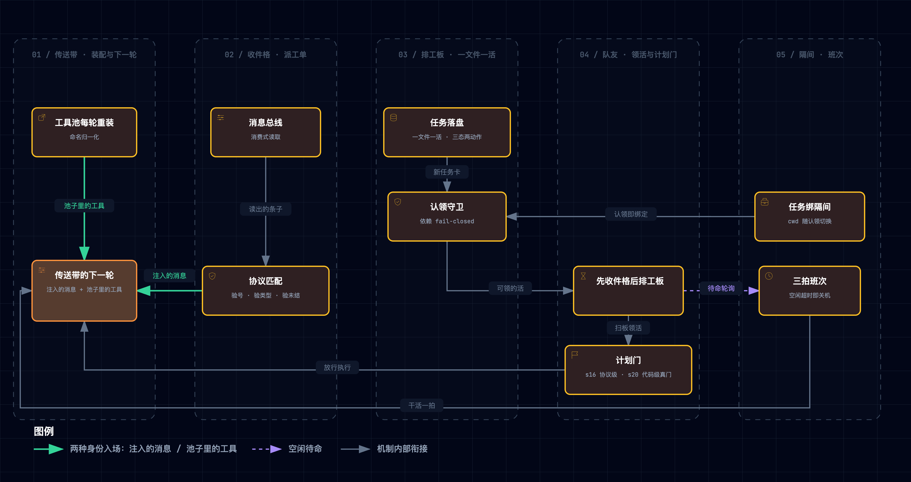

# ⑤ 多 Agent 平台：从一个到一群

> [1] shareAI-lab, "learn-claude-code," GitHub 仓库，站点 20 章轨 @ 提交 `67a9126c`（分支 `fix/s08-s20-sync-frontmatter-parser`，2026-07-29；本文写作时复验该分支头未再前进）。「钉点」即这个把所据版本钉死的提交编号，后文一切「据课程分析」都指这一版；线上站点与本钉点逐字一致（写作时经代码特征串比对核验）。课程同名站点中文版见 [1]。

**一句话定位**：一个 AI 干活代理变成一群，靠的不是更大的大脑，而是七样挂在文件上的共享物件——任务板、信箱、编号握手、空闲自取、各自的目录、外接工具插座，最后全部装回同一条工作循环。

**导读**。共识背景：Claude Code 这类干活代理的骨架是一条很短的循环——调用模型，看回答里有没有「要用工具」的块，有就执行并把结果追加回对话，再调用模型 [1]（站点轨 s20 章全称）。痛点：单个代理做大项目时，对话记忆装不下所有模块细节 [1]（s15 章全称），把任务交给「一次性帮工」又没法持续协作 [1]（s15 章全称），外部服务的能力还得逐个手写成工具 [1]（s19 章全称）。本文回答的问题是：**从「一个」到「一群」，工程上到底要添什么、不添什么**。第 1 节列要解决的问题，第 2 节给全貌，第 3 到 9 节逐个拆七样物件（每节都有一条具体输入的走查），第 10 到 13 节给数字、动手实验室、规律与边界。文末动手实验室给出全部实验的复跑方式。

> [!TIP]
> **白话主线**：单个代理做大项目先塌在「记不住、排不开」——记忆有限、一次一件、工具全手写。课程连造七样共享物件：跨会话的任务板、异步信箱、凭编号的握手、空闲自取、各自的目录、外接插座，最后装回同一条循环。难在「不添新大脑」：每样都只是磁盘文件加几条守卫，判断仍归模型。验证靠每章可运行的教学码，加上本文的本地原型与拆守卫实验，亲眼看「没有它会怎么坏」。

## 1. 它要解决什么问题

先把两个词就地讲清。**工作循环**（agent loop）：代理反复做四件事——调模型、找工具调用块、执行、把结果拼回对话；本文所有机制都挂在这条循环的某个位置上。**上下文窗口**：模型一次能「看见」的对话总量有上限，超了就丢；多代理协作的动机和压缩机制都是它逼出来的 [1]（s15 章全称）。

想象一个代理接到「重构整个后端」：认证、数据库、路由、测试四个模块的细节根本放不进一份对话记忆，写到一半回头补表、接口签名又变了 [1]（s12/s15 章全称）。就算拆成清单，旧办法（课程前文的待办工具）也只是存在当前会话里的一份执行清单——换会话就没、别的代理看不见、更没有先后依赖 [1]（s12 章全称）。

于是七章各认领一个缺口，合成一张设计规格表：

| 规格 | 通俗版 | 对应机制（章节） |
|---|---|---|
| 目标可恢复 | 重开一局还能接着干 | 任务板落盘（§3） |
| 通信异步可观察 | 不用同时在线也能递话 | 文件信箱（§4） |
| 协调有凭据 | 关机、审批不靠口头 | 编号握手（§5） |
| 派活可扩展 | 不用队长挨个指派 | 空闲自取（§6） |
| 并行不互踩 | 各改各的，改完再合 | 目录隔离（§7） |
| 能力可外接 | 外部服务不用重写一遍 | 标准协议插座（§8） |
| 一切归位 | 机制再多，循环一条 | 全集成（§9） |

## 2. 全貌解剖

七章合起来分三层。**最核心的一层是七个机制本体**：任务板是一张共享的磁盘任务清单，带依赖和认领；信箱是每个代理一个文件收件箱；握手是带编号的请求与回执；自取是空闲代理自己看板领活；隔离是一个任务一个工作目录；插座让外部工具按统一前缀接入；集成把前六样挂回循环的正确位置。

第二层是证据：各章「相对上一章的变更」表记录演进，章末深读区是课程对闭源产品源码的分析——后者只能算课程自述，本文一律标「据课程分析」。第三层是坐标：课程其余部分（工具执行、规划协调、记忆、并发四个章群）只当已知背景，不重述 [1]。

把因果链拉直来看。先是观察到单代理失控：记忆丢模块、串行慢、同目录互踩、工具手写。归因下来，是「谁干什么、怎么通信、在哪干、用什么家伙」全被压在同一个进程的同一份会话内存里。于是设计规格就是六条：状态要落盘、通信要异步、协调要凭据、派活要自取、并行要隔离、能力要外接。对应的机制落成六样磁盘痕迹——`.tasks/`、`.mailboxes/`、请求单、轮询看板、`.worktrees/`、`mcp__` 前缀——**外加一条始终不变的工作循环**。证据闭环靠每章可运行的教学码、章际演进对账、官方文档三处印证（§10）与本文的破坏实验 [1][2][3][4]。

最值得关注的学习焦点按价值排序：第一位是收官章的「组件在循环中的位置」表——学通「每个机制挂在循环哪个位置」等于学通全组，这也是课程收官章自己点明的立意 [1]（s20 章全称）。第二位是任务板加自取——共享状态与认领守卫是协作地基。第三位是信箱加握手——异步通信的正确性藏在消费语义与编号幂等里。第四位是隔离与外接——知道形态即可。前置概念已在 §1 就地讲清，后文不再补课。

> 图源（可 diff 文本）：[`claude-code-multiagent--collab-panorama.mmd`](../../assets/mermaid/agent-harness/claude-code-multiagent--collab-panorama.mmd) · 交互版（下载到本地打开）：[`claude-code-multiagent--collab-panorama.html`](../../assets/architecture/agent-harness/claude-code-multiagent--collab-panorama.html)

这张全景图的结论一句话就能说完：每一轮都按同一个顺序走——先过输入钩子、通知注入、压缩、组装系统提示这四道准备（它们是什么，读到 §9 会逐一展开，此处只需记住「调模型之前有四道准备」），再调模型，然后只问一个问题「回答里有没有工具调用块」；没有就经停止钩子收尾，有就先过权限拦截、再分发执行、把结果回填，进入下一轮。后台慢任务完成后以通知的形式回到下一轮的准备阶段；任务板、信箱、工作树这三类共享文件不在循环里，它们是被工具读写的外部状态。看懂了每个机制住在这条顺序的哪一步，七章就串成了一体 [1]（s20 章全称）。

## 3. 任务板：把目标拆成磁盘上的单子

要解决的事很具体：待办清单得跨会话活下来，任务之间有先后（数据库表没建，接口写不动），多代理还得知道哪个活被谁占了 [1]（s12 章全称）。

机制是一张磁盘上的看板。每个任务是一个 JSON 小文件，放在 `.tasks/` 目录里，六个字段：编号、标题、描述、状态、占有人、前置清单 [1]（s12 章全称）。状态机只有两个动作三个状态：认领把「待办」变「进行中」并写下占有人，完成把「进行中」变「已完成」，同时扫一遍全板，把刚刚解锁的下游任务名字附在返回报告里 [1]（s12 章全称）。认领前有两道守卫：占有人必须为空；前置清单里每一项都必须「存在且已完成」——**引用了一个不存在的编号，按「还没完成」处理**，宁可不放行也不崩溃，这是失败关闭式的设计 [1]（s12 章全称）。

走查一条具体输入。创建四个任务：建库表（无前置）、写接口（前置=建库表）、写测试（前置=写接口）、写文档（前置=建库表）。第一步，代理认领建库表：状态检查通过、无占有人、无前置，写盘后任务变「进行中」。第二步，完成建库表：写盘置「已完成」，扫板发现写接口和写文档的前置都齐了，完成报告附上一行「解锁：写接口、写文档」。第三步，另一个代理此时尝试认领写测试——前置写接口还没完成，被拒并收到「被阻塞 [写接口]」。跨会话时，目录里的 JSON 还在，新代理读文件就能接着干 [1]（s12 章全称）。

真实产品的距离（据课程分析）：官方的每任务一文件同构，但字段更全（九个，含进行时态描述与下游清单），认领用双重文件锁防竞争，另有高水位标文件保证编号永不复用；官方把「认领」与「改状态」拆成两步，教学版合成一步是合理简化 [1]（s12 章深读区）。官方文档侧印证了产品形态：当前的任务工具是四个（创建、查单、更新、列单），旧的会话内待办工具默认让位给这四个，可用环境开关换回 [4]。

迁移指纹：看到「多执行方要认领同一批活、且要跨会话恢复」就该上任务板；拆掉无主守卫或前置守卫的坏法见 §11 实验；越过「高并发无锁直用」这条红线前，先看 §13。

## 4. 信箱：让多个干活代理互相说话

一次性帮工解决不了持续协作：帮工干完就走，中间没法递话（官方文档里这类帮工叫子代理——独立上下文、只回最终结果 [5]）[1]（s15 章全称）。要的是能留在场上、能收发消息的队友。收官章把两种委托并列：一次性子代理解决上下文隔离，持久队友解决长期并行协作 [1]（s20 章全称）。

机制极简：每个代理（队长和队友都算）有一个信箱文件，路径形如 `.mailboxes/名字.jsonl`。**发一条消息等于往对方文件末尾追加一行**；收信等于把整个文件读走并删除——谁读到谁拿走，箱子里不重复留底，这叫消费式收信 [1]（s15 章全称）。还有个不动箱子的探测动作：只看信箱是否非空，用来决定要不要唤醒一轮，真正取信仍走消费式读取 [1]（s15 章全称 code.py）。

队友本身是一条后台线程——与主程序并行独立跑的一小段程序——有自己的系统提示、自己的对话、以及一组精简工具（执行命令、读文件、写文件、发消息）[1]（s15 章全称）。队长侧有一个一秒一次的探测，发现信箱有信或后台任务完成，就把这些内容拼成一条新输入交给模型——用户敲键盘和异步消息汇入同一个事件队列，谁先到谁先触发一轮 [1]（s15 章全称 code.py）。

走查：队长让队友甲建一个表、队友乙检查这个表。队长发出两条创建队友的指令，两条线程各自带着自己的初始任务跑起来；甲写完文件，把自己的结论（课程示例形态如「表建好了：users、orders 两张」）追加到队长信箱；乙检查完同样追加一行。下一秒队长的探测命中，两行一起被取走、拼进对话，模型看到两份结果并决定下一步。并行与汇合都不需要任何人等在场 [1]（s15 章全称）。

真实产品的距离（据课程分析）：官方同样用文件收件箱，路径在用户主目录的团队目录下，但写入有文件锁，消息类型有十五种结构化形态，文本消息包在专门的标签里交付；队友跑在终端窗格或进程内（据课程分析；官方文档注明默认显示形态是进程内，分屏窗格为可选），互相不能嵌套生成 [1]（s15 章深读区）。官方文档侧：这套团队机制目前**实验性、默认关闭**，要用环境开关打开；每个代理的收件箱是一个 JSON 文件，读取时逐条校验，坏条目报错移除、好条目照常投递 [2]。注意分清两层：一行一条追加的 `.jsonl` 是**课程教学版**的实现；讲真实产品时，课程深读区与官方文档说法一致——每个代理一个 JSON 文件（课程称其为 JSON 数组、追加时读出再写回，官方称读取时逐条校验）[1][2]。两边都没说明的只有一件事：产品里读信之后是否同样取走即消费。

迁移指纹：看到「多方异步协作、消息要可观察可审计」就该用文件信箱；坏法是拆掉消费语义——§11 实验里同一条消息被反复注入的红灯；红线是「无锁多写方高频写同一信箱」。

## 5. 编号握手：协调从此有凭据

信箱只保证话能到，不保证回话对得上号。两个场景逼出协议：队长想让队友关机，直接杀线程会留下写了一半的文件；队友要动高风险的事，应该先交计划等批复 [1]（s16 章全称）。这两个场景结构完全一样：一方发请求，另一方给回执，靠同一个编号关联。

机制是一张请求单登记簿。发起方先开一张带唯一编号的单子（类型是关机或计划审批，状态是待定），把编号随请求信发出；收信方按消息类型路由到对应处理动作——收到关机请求就回一张带同一编号的同意回执，收到计划批复就把批复内容注入自己的对话 [1]（s16 章全称）。发起方收信时做三道核验：按编号找到单子；回执类型与单子类型对得上；单子还是待定状态。三道都过才销账，同一张单子的第二次回信不再理会 [1]（s16 章全称）。

为什么第二道核验不可省：所有回执混落在同一个信箱里，如果只对编号不验类型，一张写错类型的回执可能被当成另一类协议的答复——比如关机类的回执格式碰巧出现在计划单的编号下。类型校验就是防错配的第二道闸，加上「已决单不再改」防重复翻烧饼 [1]（s16 章全称）。

走查（含一处容易忽视的诚实边界）：队友提交计划后，教学版这一章**并不真拦**它继续动手——交计划只是发了一封信，线程照跑，靠的是模型自觉等批复；课程自己注明真实产品里有代码级拦截，教学版只演示消息流 [1]（s16 章全称）。到收官章这个缺口才合上（§9）。队长侧还有个统一收信入口：查看信箱的工具和主循环末尾的注入都调同一个函数，先路由协议回执再返回剩余消息，避免「信被读走了、单子却没销账」[1]（s16 章全称）。

真实产品的距离（据课程分析）：官方的关机是三向通信——请求、同意（或附原因的拒绝）、再由系统广播移除通知，确认后自动清窗格、把未完成任务释放回待办、从团队注册表除名；计划审批在当前版本里由系统自动回写批复并把请求转交队长参考；字段命名在不同协议间并不统一（一处用下划线命名、一处用驼峰命名），消息有模式校验 [1]（s16 章深读区）。

迁移指纹：看到「必须对方确认才许动」的协调就上编号握手；坏法见 §11（错类回执销错单、重复回执翻烧饼）；红线是拿它当强一致保证——它是消息层凭据，不是锁。

## 6. 空闲自取：队长不再挨个派活

任务板有了、通信有了，但每张单还得队长手动指派——板上有十张无主单，就得指派十次，这扩展不动 [1]（s17 章全称）。

机制把队友生命周期从两段变三段：干活（收信、调模型、执行工具的循环）、**空闲（每五秒一次的轮询）**、收工 [1]（s17 章全称）。空闲轮询的次序有讲究：先看信箱——有关机请求立即回执退出，有普通消息就带回干活状态；信箱空才看任务板 [1]（s17 章全称）。看板只认三个条件全满足的单：待办、无主、前置全部完成；找到第一个就认领，认领失败也不当作成功 [1]（s17 章全称）。六十秒（十二次轮询）没等到新活就收工，把最后一条结论发给队长 [1]（s17 章全称）。

走查：板上三张单——打地基（无前置）、盖楼（前置=打地基）、内装（前置=打地基），两个空闲队友。第一次轮询，甲先扫到打地基并写名占住，乙同轮晚到只剩被阻塞的两张，领不到、继续轮询；甲完成打地基的瞬间，返回报告附「解锁：盖楼、内装」；下一轮乙扫到盖楼可领，领走；再下一轮谁先空闲谁领内装；最后无单可领的一方在六十秒后收工。先到先得靠的是「写名占住」这道守卫，不是调度器 [1]（s12/s17 章全称）。

两个容易被问的点。其一，对话被压缩后身份会不会丢：教学版在每轮干活前检查对话长度，过短说明被压缩过，就地重注入一条身份说明 [1]（s17 章全称）。其二，认领会不会撞车：检查与写盘是两步、中间没有锁，教学版自认并发下有竞争窗口，靠「无主」检查挡住最明显的后写覆盖 [1]（s17 章全称）——本文 §11 用实验把这个窗口演给你看。

真实产品的距离（据课程分析）：官方没有统一的轮询函数，而是四件事的组合。一是空闲时主动通知队长；二是约五百毫秒一次的信箱轮询，关机请求优先处理、不会被普通消息饿死；三是文件系统监听任务目录变化，一秒防抖；四是等待期间主动领单。认领在双重文件锁内完成，且官方**没有固定超时**，关不关机由队长决定 [1]（s17 章深读区）。官方文档侧印证共享任务列表与认领完成的产品形态 [2]。

迁移指纹：看到「执行方数量会变、派活方不想当瓶颈」就该让执行方自取；坏法见 §11（拆守卫与拆超时）；红线是把「五秒轮询」当性能保证——它只是教学取值。

## 7. 各自的房间：并行不互踩

分工和通信都顺了，剩下的乱子在「在哪干」：两个队友在同一个目录里改同一个文件，互相覆盖，而且分不清哪些改动是谁的，回滚都回不干净 [1]（s18 章全称）。

机制借用版本控制的原生能力——工作树（git worktree）。版本控制（git 是其最常用的名字）可以粗略理解为管三样东西：仓库是整个项目的中央账本，改动历史都记在里面；提交是把一批改动记进账本的动作；分支是账本里的一条独立线，各改各的、互不见面。工作树让同一个仓库可以同时挂多个工作目录、每个目录各连一条分支，互不干扰 [1]（s18 章全称）。看板上给任务加一个「工作树」字段做绑定。创建工作树时先校验名字：只许字母、数字、点、下划线和短横线，长度一到六十四位，不许是点号本身，以防路径逃逸。校验过了才执行版本控制命令建出目录和新分支；绑定只写字段、**不改任务状态**，任务仍是待办，等队友自取 [1]（s18 章全称）。

队友认领到带工作树的任务后，自己的执行命令、读写文件都自动切到那个目录下执行；完成后切回，下一张单再按新绑定切换 [1]（s18 章全称 code.py）。收尾二选一：**保留**（留着分支等人审后合并）或**移除**——移除前先数一遍未提交改动和未推送提交，有就默认拒绝，必须显式带上「丢弃改动」标记才肯强删；每次生命周期操作追加一行事件日志，形成可审计的事件流 [1]（s18 章全称）。

走查（含一处版本差异的诚实记录）：队长建单「改电路」并绑定工作树，空闲队友自取认领。在收官章的集成版里，认领成功的同时队友的工具目录就切了过去；**但在本章与下一章的钉点版本里，自取认领只把「工作目录」路径写进注入消息提醒模型，工具目录并不自动切换** [1]（s18 章全称 code.py）。另据本文写作时核查仓库分支所得（课程内容之外的仓库侧信息）：存在一条补此缺口的修复分支，未合并进站点所据版本。读教学码时要盯住「自动认领」与「目录切换」是不是真在一步完成。

真实产品的距离（据课程分析）：官方有两条路径——会话级切入（建完直接改整个进程的工作目录，退出时恢复）与子代理级隔离（只给子代理套一个目录覆盖，不动全局）；路径与分支命名不同（`.claude/worktrees/` 下、分支名带前缀、斜杠换加号），建树优先基于远端默认分支；**官方没有任务-工作树绑定**，两者是独立系统，靠代理理解上下文来关联 [1]（s18 章深读区）。

迁移指纹：看到「多方并行修改同一份资产」就给每方一个副本目录加归还纪律；坏法是跳过「有改动拒删」——亲手误删未提交工作的那一天会想起来；红线是没有评审纪律却滥用「保留」，工作树会堆积成灾。

## 8. 外接插座：标准协议接外部工具

最后一个缺口：代理的能力受限于你给它写的工具。公司内部的问题跟踪服务、自建部署系统、知识库——每个都重写一套接入代码不现实 [1]（s19 章全称）。

机制是一个「先连接、后发现」的插座。外部服务实现两个动作：报工具清单（名字、说明、参数）与执行工具调用 [1]（s19 章全称）。代理用一个连接工具接上某个服务，服务报出的工具随即并入代理的工具池。命名统一加前缀 `mcp__服务名__工具名`，服务名与工具名里不在白名单的字符一律替换成下划线；前缀防的是不同服务的同名工具相撞 [1]（s19 章全称）。

有一个不显眼但关键的联动：前几章的系统提示带缓存（同样的上下文不重复拼装），这一章把缓存去掉了。原因写在代码里——连接新服务后工具池变了，缓存里的旧工具清单会让模型看不到新工具，所以每轮重组工具池与提示，连接动作发生后立刻再组一次 [1]（s19 章全称）。

走查：接上文档服务，返回已发现的工具清单 search、get_version；此刻工具池里多了 `mcp__docs__search`；再接部署服务，又多出 `mcp__deploy__status` 与 `mcp__deploy__trigger`——两个服务即便都有叫 search 的工具也不会相撞。工具说明里带着「只读」或「破坏性」的文字标注，本章教学版只标注不拦截（到收官章，权限钩子才对部署类外接工具先问人）[1]（s19/s20 章全称）。注意：教学版里外接工具只给队长用，队友仍是固定八件套；据课程分析，官方的子代理会继承外接配置 [1]（s19 章全称）。

真实产品的距离（据课程分析）：官方支持六种传输方式（子进程管道、多种网络长连接、进程内），本地与远程服务分批并发连接；工具池合并时内置工具排前、去重保内置——为了在固定位置放全局缓存断点，混排会破坏这个设计；权限系统对外接工具独立判断，按工具的声明决定是否需要用户确认；配置有五级优先级，企业托管配置存在时其余全被排除；还支持服务反向给代理推通知，以及完整的授权码认证流程 [1]（s19 章深读区）。官方文档侧印证：前缀命名同规则（插件捆绑的服务还有更长的前缀形态）、三层安装范围、授权认证全链路在册 [3]。

迁移指纹：看到「第三方能力要热插拔、来源会撞名」就上「连接-发现-前缀」三件套；坏法是留着旧缓存不放（模型调不到新工具）；红线是把「文字标注」当权限系统用——标注不拦截。

## 9. 全部挂回同一条循环

前六章每章只带一个机制运行，真实系统不会这么拆着跑。收官章把前面所有教学组件装回一个可运行的完整系统，并给出全组最重要的一张表——**每个机制挂在循环的哪个位置** [1]（s20 章全称）。表里的「钩子」指挂在循环固定位置、每轮路过时必跑的小段检查或处理代码，输入前、工具前、工具后、停止时各挂一处。

循环本体仍然是那四步，连判断条件都没变复杂：课程特别注明，判断「要不要继续工具轮」看的不是模型返回的停止原因字段，而是**回答里实际出现没出现工具调用块** [1]（s20 章全称）。位置表把十二类组件归位：用户输入前后有输入钩子；调模型前依次是定时任务与后台完成通知的注入、压缩管线、系统提示组装（记忆、技能目录、已连接服务状态）；模型调用包着失败恢复；工具执行前有权限与前置钩子拦截；执行时有内置、外接、后台三种分发去向；执行后有后置钩子；本轮没有工具调用块时触发停止钩子收尾 [1]（s20 章全称）。

有五样机制只在集成版里才完整，下面逐一点名。

- **权限成了钩子**，不再写死在工具里：危险命令黑名单直接拒，疑似破坏性命令和越界路径先问人，拦截结果作为工具结果回给模型 [1]（s20 章全称 code.py）。
- **计划门从消息约定变成真门**：队友提交计划后，线程直接停掉模型与工具步。同一回答里排在后面的工具调用块被丢弃，直到批复信到达才解冻，§5 留下的诚实边界在这里合上 [1]（s20 章全称 code.py）。
- **压缩是四层管线**：先给超大工具结果设预算，超预算的整段落盘、只留预览；再裁掉中段旧消息，头尾保留、工具调用与结果配对不拆散；再把较早的工具结果换成占位一句话，保留最近三条原文；全部做完仍超限，才调模型把历史压成一段摘要，转录先落盘 [1]（s20 章全称 code.py）。
- **失败恢复有梯子**：限流错误指数退避重试，连续过载可切备用模型；回答被截断，先提高输出上限再请求续写；提示超长，触发反应式压缩后重试 [1]（s20 章全称 code.py）。
- **自取认领也会切目录了**：空闲轮询认领到带工作树的任务，同时把队友的工具目录切过去，§7 记录的钉点版缺口在此修复 [1]（s20 章全称 code.py）。

走查一条慢命令：模型要求执行一个安装命令，分发层判定为慢操作，立刻返回「后台任务已启动，结果将以通知到达」的占位回执，主循环不等；后台线程跑完后，下一轮循环把完成通知注入对话，模型继续。同一条循环里，定时到点的提醒以「计划内」前缀注入并自动触发一轮——用户没敲键盘，代理也自己动了 [1]（s20 章全称 code.py）。

收官的话值得整段照抄：「Claude Code 的复杂性不是“另一个 agent 大脑”，而是一个成熟 harness 的复杂性。模型负责判断和行动选择；harness 负责把环境、工具、权限、记忆、团队和外部能力组织好。」「这就是全书的终点：机制很多，循环一个。」[1]（s20 章全称「结束亦是开始」）harness 即本文通篇所说的装置层。

## 10. 关键实证数字

| 实验/来源 | 关键数字 | 条件·截至 | 一句话读法 |
|---|---|---|---|
| 课程教学码 [1]（s20） | 内置工具 27 个 | 钉点 67a9126c | 收官章一张表数得清的能力面 |
| 课程教学码 [1]（s17） | 空闲轮询 5 秒一次、60 秒超时（12 次） | 同上 | 自取节奏与收工纪律的教学取值 |
| 据课程分析 [1]（s15/s17 深读区） | 队长信箱探测约 1 秒、队友信箱轮询约 500 毫秒、任务目录监听防抖 1 秒；结构化消息类型 15 种 | 据课程对闭源源码的分析 | 产品侧延迟量级，非教学取值 |
| 课程教学码 [1]（s20 code.py） | 工具结果预算 200_000、落盘阈值 30000、全量压缩线 50000（这三线按字符数计）；输出上限 8000→16000（按 token 计）；截断续写至多 2 次 | 钉点 67a9126c | 压缩与恢复梯子的具体档位 |
| 本文原型实测（§11，实际运行日志） | 拆「无主」守卫：占坑任务被顶占、终态占有人被覆盖；交错窗口两人检查同时通过、终态归后写者 | 2026-10-01 本地确定性原型 | 守卫与锁各自挡的乱子不一样 |

三条核心宣称的独立证据情况：团队机制「实验性默认关、收件箱为 JSON 文件」由官方文档直接支撑 [2]；前缀命名与三层范围由官方文档直接支撑 [3]；「官方用四任务工具取代旧待办工具」由官方文档直接支撑 [4]。课程对闭源源码的一切行号级断言（锁结构、消息类型数等）无独立信源可核，只能以「据课程分析」转述——详见 §13。

## 11. 动手实验室

原型是一个纯标准库、无随机数的确定性脚本，所有代理角色都用写好的脚本替代，只证明机制自洽、不证明模型能力。脚本随本文入库，位于 [`assets/multiagent_lab.py`](./assets/multiagent_lab.py)。运行方式：`uv run --no-project python multiagent_lab.py --selftest`（无 uv 时 `python3` 直跑），自检 34 项断言秒级全绿；`--break B1` 等参数逐个拆守卫；交错窗口演示用 `--demo t5race` 复跑。

机制到代码行号速查（行号为原型文件行号）：任务创建 L34、前置检查 L44、认领三守卫 L56、完成与解锁报告 L70；信箱发送 L88、消费式收信 L94、非消费探测 L100；请求单 L114、回执核验 L123；看板扫描 L143、空闲轮询 L149；工作树创建 L182、拒删移除 L192；服务连接 L211、工具池组装 L218；权限门 L230；脚本化队友（含计划门）L238；交错窗口演示 L456。

破坏实验每次只拆一个守卫、改动一两行，逐字记录实测退化（运行 `--break` 即可逐字复现以下输出）：

| 实验 | 改动 | 实测观察到什么（实际运行日志） | 教训 |
|---|---|---|---|
| 拆前置检查 | 前置判定恒真 | 「被阻塞任务『盖楼』在『打地基』pending 时认领结果 = 认领 task_0002（盖楼）」——依赖乱序直接开工 | 失败关闭没了，先后顺序形同虚设 |
| 拆无主守卫（含状态闸变体） | 认领跳过占有人检查 / 跳过状态检查 | 「zed 占着的 pending 任务被 dave 认领结果 = 认领 task_0001（遗留单）；终态 owner=dave」；变体「已完成且无人占的任务被再认领 = 认领；终态 status=in_progress」 | 占坑被顶、完成品被重开 |
| 拆消费语义 | 收信后不删 | 「第一读 2 条；第二读仍 2 条、『干完报告 A』再现 1 次（同批消息被二次注入）」 | 不消费就重复注入，旧信反复当新信 |
| 拆回执核验 | 不验类型、不看已决 | 「关机类回执对计划单 = 销账 → approved；重复否决回执 = 销账 → rejected；终态 = rejected」 | 错类回执销错单、重复回执翻烧饼 |
| 拆空闲超时 | 轮询无上限（演示 120 步截断） | 「板上无可领任务时返回 timeout；步进时钟走到 t=600（基线 12 步/t=60 即 timeout 收工，拆掉后多转 10 倍仍不停）」 | 没有超时纪律，空闲代理永不收工 |

再演一个真实代码才有的交错窗口（与课程自认的「检查与写盘两步、中间无锁」同型）：「alice 检查通过=True，落笔 owner=alice；bob 检查通过=True（读到的仍是旧盘），落笔 owner=bob；终态 owner=bob」——两个认领者都在对方落笔前通过了检查，这就是教学版承认的那个竞争窗口（实际运行日志）。

## 12. 底层规律与核心争议

**规律一：状态落盘方可共享。** 要跨会话、跨执行方共享的东西必须放在进程外的磁盘上；放在对话记忆里的清单，换个会话或换个执行方就没了 [1]。没有它，任务板退化成便签，重开一局全部归零。演示即 §3 的跨会话恢复与 §11 拆守卫实验的理论锚点 [a][b]。

**规律二：一次性交付靠消费语义。** 想让一条消息只被处理一次，最省事的办法是取走即清箱；靠事后标记区分新旧，迟早重复处理 [1]。演示即 §11 拆消费语义的同批二次注入 [a][b]。

**规律三：异步协调的正确性来自凭据与核验。** 请求带唯一编号出门、回执带同一编号回家、类型对得上才销账、同一单子只销一次——这是分布式过程调用里过滤重复应答的老办法在新衣服里的重现 [a]。拆掉核验的实测翻烧饼见 §11。

**规律四：高风险变更先过守卫再放行。** 认领、完成、删目录这些改共享状态的动作，前置条件不满足就拒绝，宁可不动不可错动 [a]。三道守卫各挡一种坏法，§11 逐一拆给你看。

**规律五：接口与环境决定能力上限。** 同一个模型，干活上限取决于挂在它外面的装置——工具、权限、记忆、协作规矩；装置复杂不等于换了个更聪明的大脑 [1]（s20 章全称）。课程全组的教学立意与收官断言都在这条上，外部研究也支持「接口设计显著影响代理表现」的判断 [a][b]。

五条规律分别管状态、消息、协调、变更、架构五个正交维度，合起来是「共享-通信-协调-防护-装置」的一张领域地图。

**争议一：门控放协商层还是执行层。** 一派把「先批后动」当消息层面的君子协定（s16 教学版：交计划只是发信，线程照跑，靠模型自觉停）；另一派要执行层硬拦（s20 集成版：提交后冻结模型与工具步；据课程分析，官方还有整套权限拦截）[1]。分歧来自看到不同的失败模式——课堂要概念的形状，生产要防不可信的执行者；工程上可弥合（s20 证明了教学码也能做真门，代价是状态机复杂一截）。

**争议二：空闲感知靠轮询还是靠监听。** 教学派用一个五秒轮询函数讲清「空闲找活」的语义；产品派用「空闲通知 + 约 500 毫秒信箱轮询 + 文件监听」的组合压延迟、防空转、防关机请求被饿死（据课程分析）[1]。这也是延迟与开销的经典旋钮，教学版用六十秒超时兜底，官方不设固定超时、由队长决定关机 [1]。

（按实取数只有这两条真实分歧；「文件看板对中心化服务」业界虽有此争，但本批材料与补读信源中未见中心化一方的一手表述，不造伪争议。）

## 13. 适用边界

**成立条件**：本组材料以单机、本地文件系统、一个人类操作者、少量执行方为架构假设；机制的正确性在单线程时序下成立。最佳适用区间是「任务可文件化描述、协作可用共享文件加守卫表达清楚」的场景——比如本仓库这类研究与内容生产流水线。

**非目标（课程明确不做或不适用外推的）**：后台任务与定时调度两章属并发章群，本组只作集成层引用；模型训练与能力改进不在范围；高并发下的锁与性能、多机分布式、成本经济学，材料均无数据；「官方产品内部如何实现」无法脱离课程转述独立核实。

**材料没有证明的事**：

1. 课程对闭源产品源码的全部行号级断言（锁的重试参数、十五种消息类型、各文件行号）无独立信源；官方文档只印证产品层行为（实验性开关、收件箱形态、任务工具默认、命名规则）[2][3][4]，锁与内部结构仍是「据课程分析」。
2. 并发正确性未被证明：教学版自认信箱读写有竞态、认领无文件锁，「单线程下对」不等于「并发下对」[1]。
3. 钉点版本上，自动认领不自动切换队友工具目录（仅注入路径提示），「自取即进屋」仅在收官章集成版成立 [1]；另据本文写作时的仓库分支核查（课程外信息），存在补此缺口的修复分支但未合并进站点所据版本。
4. 成本与性能无任何量化：轮询频率、每轮重组提示、多方并行的开销，材料一个数字都没给。
5. 计划审批在产品里的现状并不等于教学版的「交计划—等批复」：据课程分析，当前产品由系统自动回写批复、把请求交给队长作参考 [1]（s16 章深读区）；这一行为无官方文档独立印证，产品侧计划门到底多硬，本批材料没有证明。

## 14. 用户自测与费曼研讨套件

读完后不妨自测三题（与考核题不重用，欢迎带着答案来对练）：

1. 不看笔记，画出收官章那张「位置表」的骨架——循环的哪几个位置分别过哪些机制？漏掉哪一格你最没把握？
2. 用「检查与写盘两步、中间无锁」解释：为什么教学版的「无主」守卫挡得住重复认领的显然后果，却挡不住真正并发下的抢写？两道防线各在什么时候起作用？
3. 如果要把这套文件看板搬进你自己的多代理系统，最先要补的三样东西是什么？提示：分别对付「并发写」「消息可信」「目录归属」。

## 参考（IEEE）

- [1] shareAI-lab, "learn-claude-code," GitHub repository, site 20-chapter track @ commit 67a9126c, branch fix/s08-s20-sync-frontmatter-parser, Jul. 29, 2026. [Online]. Available: https://github.com/shareAI-lab/learn-claude-code/tree/67a9126c and https://learn.shareai.run/zh/ (accessed Sep. 30, 2026). 所引章节：站点轨 s12 任务系统、s15 团队、s16 协议、s17 自治、s18 工作树隔离、s19 MCP 工具、s20 综合循环（含各章 code.py）。
- [2] Anthropic, "Agent teams," Claude Code Docs, 2026. [Online]. Available: https://code.claude.com/docs/en/agent-teams (accessed Sep. 30, 2026).
- [3] Anthropic, "MCP," Claude Code Docs, 2026. [Online]. Available: https://code.claude.com/docs/en/mcp (accessed Sep. 30, 2026).
- [4] Anthropic, "Tools reference," Claude Code Docs, 2026. [Online]. Available: https://code.claude.com/docs/en/tools-reference (accessed Sep. 30, 2026).
- [5] Anthropic, "Sub-agents," Claude Code Docs, 2026. [Online]. Available: https://code.claude.com/docs/en/sub-agents (accessed Sep. 30, 2026).
