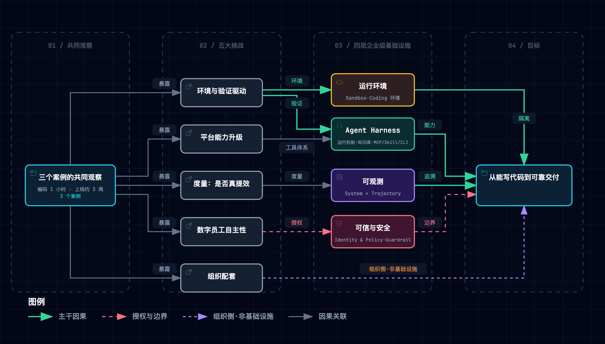
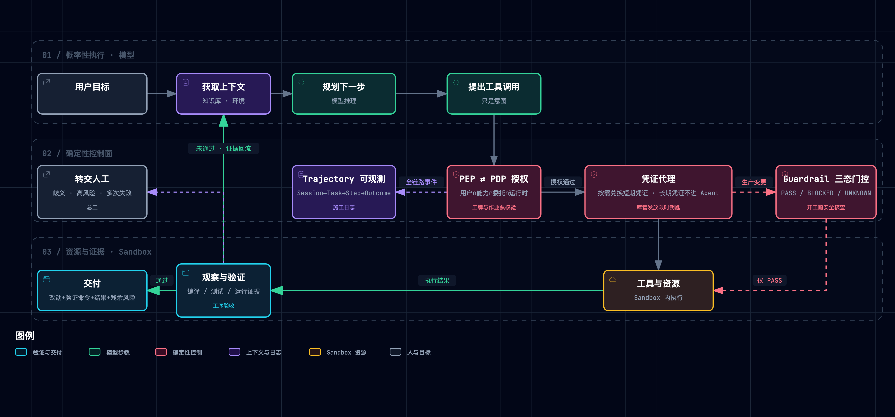

# 精读：《AI Native 研发范式实践手册》

> [!NOTE] **核心精读范围**
>
> - 许晓斌（主编）等，《AI Native 研发范式实践手册》，阿里巴巴（「阿里技术」公众号发布），2026 年 9 月。全 68 页通读；页码为手册印刷页码，PDF 不入库。
> - 配套最小原型：[`assets/ai_native_lab.py`](./assets/ai_native_lab.py)（纯标准库，`--selftest` 秒级）；机制映射见 [181](./181-ai-native-mapping-negentropy.md)。

**一句话定位**：模型已会写代码，交付却卡在代码之外。手册的解法是一层**确定性控制面**：模型只提意图，程序判定放行，证据判定完成。

**总类比**：企业研发是一个**施工总包工地**，角色全文不换脸：

| 工地角色 | 对应概念 |
|---|---|
| 施工队长（手快但不熟本工地） | 模型 |
| 项目部 | Harness |
| 工序验收 | 验证 |
| 工牌加作业票 | Identity & Policy |
| 开工前安全核查（只核清单，不判业务） | Guardrail |
| 施工日志 | 可观测 |
| 总工 | 人 |

## 1. 全貌：三案例 → 五挑战 → 四层基础设施



*图源：[.mmd](../../assets/mermaid/agent-harness/ai-native--handbook-panorama.mmd) · 交互版 [HTML](../../assets/architecture/agent-harness/ai-native--handbook-panorama.html)*

三个案例（AIDC 数字投手、千问用增、万有无界）指向同一个观察：一个需求编码只要 1 小时，上线却要约 3 周（p17）。压缩小头环节，收益有上限（阿姆达尔定律）。因果链如下：

- **观察**：编码只是小头。
- **归因**：企业内部缺少「机器能自己判对错」的反馈（p17–18）。
- **规格**：五大挑战。
- **机制**：四层基础设施。
- **证据**：案例前后对比；第三章几乎没有量化。

最值得精读的是第三章：它把门禁从提示词搬进了程序。

## 2. 五条底层规律



*图源：[.mmd](../../assets/mermaid/agent-harness/ai-native--harness-control-loop.mmd) · 交互版 [HTML](../../assets/architecture/agent-harness/ai-native--harness-control-loop.html)*

末列为原型实测，标「材料」者为手册自述。

| # | 规律（维度） | 手册机制 | 拆掉会怎样 |
|---|---|---|---|
| R1 | 模型提意图，确定性系统做决策（决策）[1][2] | PDP 判定，PEP 在资源侧执行，只信已验证的身份（p52–53） | **D2**：PEP 采信上下文里的授权声明，跨服务越权写被执行 |
| R2 | 证据先于结论（验证）[3][4] | 「已修复」要由编译、测试给证据；交付附验证命令和残余风险（p35–36） | **D1**：改信自报，未过测试的补丁被交付；修不好的任务也被「交付」，转人工出口消失 |
| R3 | 权限逐级收敛（权限）[1][5] | 有效权限 = 用户 ∩ 能力 ∩ 策略 ∩ 委托 ∩ 运行时；长期凭证不进 Agent（p45、p53） | **D5**：令牌写进环境变量，出站拦截仍然生效，令牌却经构建日志泄露 |
| R4 | 结论绑定现场，不确定就拒绝（状态）[1] | Guardrail：固定规则版本 + 动作快照摘要 + 时效 + 三态机械聚合（p55–58） | **D3**：UNKNOWN 当 PASS，撞上监控故障的批次照常恢复发布；**D4 / D6** 各放行一个过期结论，二者互不替代 |
| R5 | 环境与知识是第一类上下文（上下文）[4][6] | 运行上下文六项；知识链路加使用反馈回流（p39、p47） | **材料**：只交付仓库时，下一个 Agent 会把同样的三次失败再踩一遍（p48，手册虚构案例） |

五条规律恰好覆盖五个正交维度。

## 3. 两个核心争议

### 争议一：Workflow 嵌入，还是 Agentic 自取验证信号

- **分歧**：项目部是发一本固定的工序手册，还是教队长自己看验收结果往前推？
- **手册立场与自相矛盾**：手册站后者，把 SDD、Skills 判为「把人的流程固化给 AI」的过渡形态（p18）。可它自己的案例重度依赖 Skill（1.1 约八成能力已 Skill 化，p4）。
- **性质**：两派见过的失败不同（固定流程在返工中推翻正确判断 / 无约束 Agent 在高风险业务里失控），本质是「约束放在流程还是验证里」的选址问题，属工程问题，可对冲。

### 争议二：度量看用量，还是看交付质量

- **分歧**：数进场的人头，还是数验收合格的工序？
- **手册立场与自相矛盾**：手册主张用量、质量、交付三层合看（p25），却在 1.3 拿 80 余万行代码展示成果（p12）。
- **难点**：交付层要沿「会话 → 提交 → 变更 → 需求」逐级归因，任何一段断开，指标就失真。
- **性质**：这是本质难题，只能对冲，不能消除。

## 4. 关键数字

均无基线与对照，只读作方向。

| 数字 | 出处 | 读法 |
|---|---|---|
| 编码 1 小时，上线约 3 周 | p17 | 图中各分段相加实为 20–29 天 |
| 编码占研发 20–30% | p17、p33 | 同页的图写的是 <1%，口径不一 |
| 周期减半，缺陷率 −70%，变更失败率 −90%+ | p8 | 三个多月，没有基线 |
| 一次修复成功 89% | p13 | 限视觉类缺陷；日清率只从 53% 升到 63%（p14） |
| 用户约承担 70% 规划，Agent 约承担 80% 执行 | p36 | 外引 Anthropic 约 40 万次会话，属单一产品样本 |

## 5. 动手实验室

`--selftest` 全绿；`--break all` 跑 D1–D6，实际运行输出摘录：

```text
== D3 · 三态聚合把 UNKNOWN 当 PASS ==
  退化：M3 resume 136/137/138/139  (True, False, False, False)  →  (True, False, True, False)
== D5 · 真实令牌写进 Sandbox 环境变量 ==
  退化：M4 真实令牌出现在构建日志  False  →  True
  X1 手册 p24 示例 SQL 重放（真值 → 示例 SQL 实得）：
    ai_sessions            3.000 →  13.000  （×4.33）
    change_failure_rate    0.667 →   0.538  （×0.81）
```

两条意外结论：

- **D5**：出站拦截从未失守，泄露走的是日志，「默认拒绝出站」与「凭证不进环境」是两道独立保险。
- **D4 / D6**：各漏不同批次，摘要绑定与时效也是两道独立保险。

## 6. 批判性边界：材料没有证明的事

1. 第三章讲的 OpenSandbox、Agent Ground、Guardrail 都没有效果数据，Guardrail 只是「初步表明」可行（p58）。
2. 案例里的提效数字缺少基线、样本和对照，也没有剥离混杂因素。
3. 编码占比在三处口径冲突。
4. 手册自相矛盾：既把 Skill 判为过渡形态，又重度依赖它；既批评「代码量」指标，又用代码量展示成果。
5. p24 的度量示例 SQL 按 repo 做三表 JOIN，会产生多对多扇出。X1 实测：会话数被放大 4.33 倍，变更失败率被低估为真值的 0.81 倍。手册未提示此风险。

## 7. 费曼考评实录

| 轮次 | 学徒表现 | 导师诊断 |
|---|---|---|
| Q1 白话讲清三道关 | 讲清了「前一关漏了，后一关兜住」 | ✅ 通过 |
| Q2 与「Prompt 写规则 + 大权限账号」比较 | 把「资源侧重新解析目标」算成了增量 | 🔶 方案混淆：那是「困惑的代理人」经典防御 [7]；真增量是授权第三态（补手续）与「意图固定、搜证开放」 |
| Q3 夜间批量发布遇监控故障 | 首个退化点准确定位在 Agent 判三态；作废结论只靠摘要 | 🔶 边界模糊：漏了时效（p57 `validForSeconds: 300`）；以气体检测单时效类比补课，D6 佐证 |
| V 变式（支付库迁移） | 指出摘要、时效、证据协议三道独立防线；承认「格式合规、内容为空」的情况兜不住 | ✅ 全绿放行 |

## 8. 用户自测

1. 如果把 Guardrail 的聚合改由 LLM「综合判断」，R4 的哪一环会最先失效？
2. 手册说 CLI 缺少统一的授权标准（p41），在你的系统里，CLI 调用的授权由谁承担？
3. D5 的出站拦截从未失守，令牌为什么还是漏了？再举一条同类的旁路通道。

## 9. 关联与参考

逐条映射见 [181](./181-ai-native-mapping-negentropy.md)；Harness 循环逐层精读见 [170](./170-claude-code-harness-overview.md)。

[1] J. H. Saltzer and M. D. Schroeder, "The protection of information in computer systems," *Proc. IEEE*, vol. 63, no. 9, pp. 1278–1308, 1975.
[2] S. Rose et al., "Zero trust architecture," NIST SP 800-207, 2020.
[3] C. E. Jimenez et al., "SWE-bench," in *Proc. ICLR*, 2024.
[4] J. Yang et al., "SWE-agent," in *Proc. NeurIPS*, 2024.
[5] M. Jones et al., "OAuth 2.0 token exchange," RFC 8693, 2020.
[6] OpenTelemetry, "[Semantic conventions for generative AI](https://opentelemetry.io/docs/specs/semconv/gen-ai/)," 2025.
[7] N. Hardy, "The confused deputy," *ACM SIGOPS Oper. Syst. Rev.*, vol. 22, no. 4, pp. 36–38, 1988.
