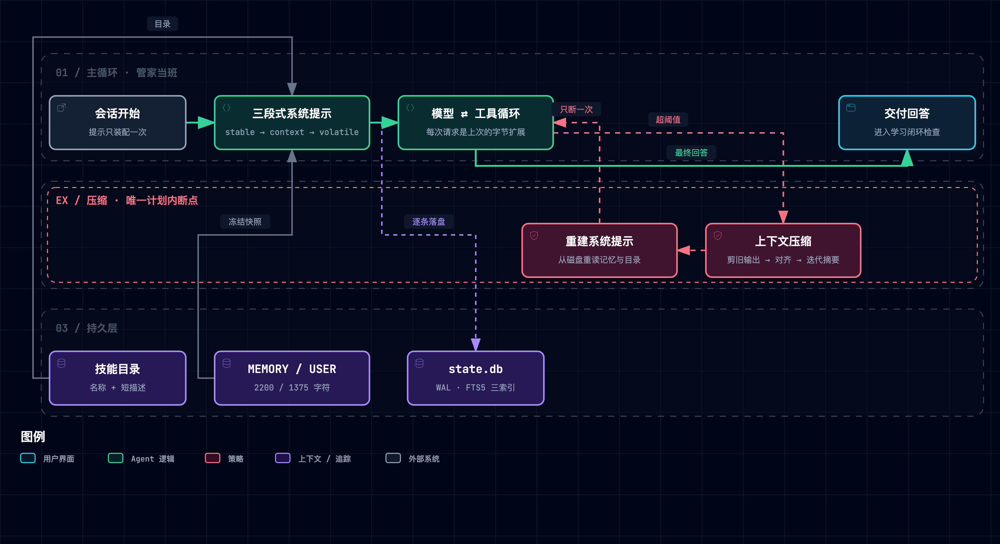
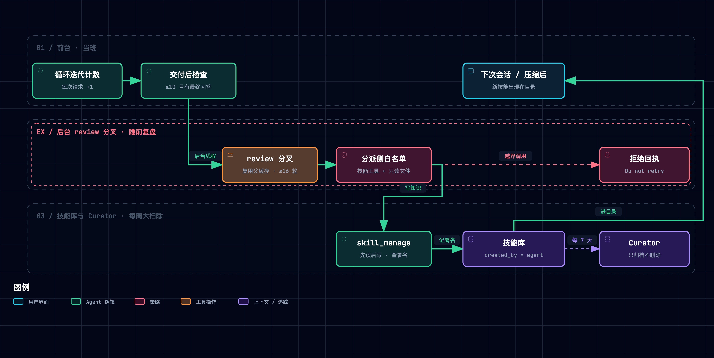

# 精读：Nous Research Hermes Agent

> [!NOTE] **核心精读范围**
>
> - 代码：[`NousResearch/hermes-agent`](https://github.com/NousResearch/hermes-agent) 固定提交 [`068db016`](https://github.com/NousResearch/hermes-agent/tree/068db016fbfb3e9b44169de154781908f91bceae)（2026-09-24，`main`；最近 release `v2026.9.21` = v0.21.4；MIT）。
> - 文档：官方站 [Features Overview](https://hermes-agent.nousresearch.com/docs/user-guide/features/overview) 及其链接的 user-guide / developer-guide 页（2026-09-24 抓取）。
> - 配套最小原型：[`assets/hermes_lab.py`](./assets/hermes_lab.py)（纯标准库，`--selftest` 秒级）；机制映射见 [191](./191-hermes-agent-mapping-negentropy.md)。

**一句话定位**：Hermes 给通用 Agent 装了一条**经验写回通道**。每次交付之后，它在旁路复盘：可复用的做法写成按需加载的技能，少量关键事实写进有硬上限的常驻记忆。所有写回都服从一条更高的约束：**会话内系统提示字节稳定，唯一计划内的断点是上下文压缩**。

**总类比**：一座大宅的**住家管家**。管家服务一位主人，全文角色不换脸（遴选纪要见[附录 B](#附录-b总类比遴选纪要)）：

| 剧场角色 / 道具 | 对应实体 | 同构依据 |
|---|---|---|
| 管家当班干活 | Agent 主循环（`AIAgent`） | 按守则办事，边做边记 |
| 主人 | 用户 | 偏好会变，说过的话要记住 |
| 上岗守则 | 系统提示 stable 段 | 天天一样，从不改 |
| 当日小卡 | 会话开始冻结的 volatile 段 | 早上抄一次，白天不改 |
| 随身小本 / 主人档案卡 | `MEMORY.md` / `USER.md` | 页数有限，写满只能合并旧条 |
| 家务手册 / 手册柜目录页 | 技能正文 / 技能目录 | 一类活一册；平时只看目录 |
| 睡前复盘 | 交付后分叉的后台 review | 伺候完主人才复盘，只拿笔和手册 |
| 每周手册大扫除 | Curator | 旧册进储藏室不烧，只动自己署名的册子 |
| 门房日志柜 | `state.db` 会话库 | 翻原话，不靠回忆 |
| 当班流水簿 / 并页 | 对话上下文 / 上下文压缩 | 写满时留头尾、中间浓缩成一页 |
| 临时工 | 委派子代理 | 只给干活钥匙，干完交完工单 |
| 定时家务闹钟 | cron | 闹钟叫起的活不许再定新闹钟 |
| 家规红线 / 先请示 | hardline / 审批 | 谁授权都不干 / 危险活先问 |

术语直讲区（不硬比）：prompt caching 的前缀匹配机制；FTS5 分词器（unicode61 / trigram / CJK bigram）。

> [!TIP] **怎么读这篇笔记**
>
> - 每个机制按三拍展开：**类比**（一两句点火）→ **机制**（术语与代码实值）→ **原型实景**（[`hermes_lab.py`](./assets/hermes_lab.py) 的实际运行输出）。
> - **代码裁决文档**。证据分四级：【一】固定提交代码实值；【二】仓内 `AGENTS.md` 与 developer-guide；【三】user-guide 文档站；【四】README 与落地页营销语。
> - 引用速记：`path:line` 一律指固定提交 `068db016` 的 Hermes 源码。

## 1. 它要解决什么问题：每天从零上岗的管家

通用 Agent 的日常失败很朴素：同一个坑踩第二遍，主人的偏好说了又忘。原因是经验**没有写回通道**，每次会话都从零上岗。

朴素的补法是「每轮把记忆和历史塞进提示」，它会同时击穿三样东西：

- **缓存前缀**：提示前部每轮都变，前缀缓存每轮作废。
- **上下文预算**：常驻内容随使用时长线性膨胀。
- **可信边界**：自动写回的东西下次会被当作指令执行。

Hermes 的设计规格可以收成四条：

| 规格 | 通俗版 | 对应机制 |
|---|---|---|
| S1 前缀字节稳定 | 当日小卡白天不改 | §3 三段式装配 + 冻结快照 |
| S2 常驻有上限，其余按需 | 小本有页数，手册只看目录 | §4 两级记忆 |
| S3 写回在交付后旁路进行，只写知识不做事 | 伺候完才复盘，复盘只拿笔 | §5 学习闭环 |
| S4 自动化扩张有硬边界 | 临时工不许转包，闹钟不许定闹钟 | §6 历史与压缩、§7 受控扩张 |

## 2. 全貌：两相与因果脉络



*图 1 · 在线相：缓存优先的回合循环。图源 [.mmd](../../assets/mermaid/agent-harness/hermes-agent--turn-loop.mmd) · 交互版 [HTML](../../assets/architecture/agent-harness/hermes-agent--turn-loop.html)*



*图 2 · 后台相：交付之后的学习闭环。图源 [.mmd](../../assets/mermaid/agent-harness/hermes-agent--learning-loop.mmd) · 交互版 [HTML](../../assets/architecture/agent-harness/hermes-agent--learning-loop.html)*

### 2.1 最重要的几个部分（分层矩阵）

| 层级 | 部分 | 回答的问题 | 性质 |
|---|---|---|---|
| Tier 1 | M1 缓存优先的三段式装配 | 写回为什么不能「随写随见」 | 第一约束，反向塑形其余机制 |
| Tier 1 | M2 两级记忆 | 什么常驻、什么按需、谁来收敛 | 容量设计 |
| Tier 1 | M3 学习闭环 | 何时学、学什么、谁能改哪本 | **真增量** |
| Tier 1 | M4 会话库、检索与压缩 | 历史怎样既可查又不破结构 | 历史设计 |
| Tier 1 | M5 受控扩张 | 自动化怎样不失控 | 边界设计 |
| Tier 2 | 证据链 | 数字可信吗、学习有效吗 | 代码实值 + 测试；**无学习效果评测**；21 处文档漂移 |
| Tier 3 | 领域坐标 | 它还有什么 | 30+ 平台消息网关、7 种终端后端、MCP、ACP/TUI/桌面端、batch 轨迹、可插拔外部记忆（含 openviking 插件） |

### 2.2 核心关系与因果脉络链

```text
观察：通用 Agent 每次会话从零开始，同一个坑踩第二遍，偏好说了又忘
  ↓ 归因
经验没有写回通道；朴素写回会同时击穿缓存前缀、上下文预算与可信边界
  ↓ 设计规格
S1 前缀稳定 × S2 常驻有界 × S3 交付后旁路、只写知识 × S4 扩张有边界
  ↓ 机制
M1 三段式装配（冻结）──约束──▶ M2 两级记忆 ──供料──▶ M3 学习闭环（nudge → review → skill_manage → Curator）
                         └──约束──▶ M4 压缩 = 唯一计划内断点（顺带重读记忆，完成接力）
M5 受控扩张：委派 / cron / 命令守卫各自设硬上限
  ↓ 证据闭环
代码实值 + e2e 前缀稳定测试 + 分件单测；没有端到端学习效果评估
```

### 2.3 基础层 vs 学习焦点

**(a) 前置门槛**（融合 Phase 0 学徒自测，三题主干皆对，补课三项）：

1. **前缀缓存的粒度**：缓存命中按「从开头到断点的整段前缀」判定，顺序是 tools → system → messages。断点之前任何一个字节变化，该断点及其后全部失效。
2. **记忆分型**：按 CoALA [3] 的分法，小本和档案卡是常驻的语义记忆，技能是按需的程序性记忆，会话库是可检索的情景记忆，上下文是工作记忆。
3. **中文分词**：FTS5 默认的 unicode61 把一串连续汉字当成一个 token，所以 Hermes 另建 CJK bigram 与 trigram 两套索引。

**(b) 最值得学的五个焦点**（按价值排序）：

1. M3 学习闭环：真增量所在。它的 review prompt 本身就是一份「经验该怎么写」的规约。
2. M1 如何反向塑形 M2、M3、M4：记忆冻结、review 复用父缓存、压缩兼任重读点，都出自同一条约束。
3. M2 的「常驻有界、目录无界」：Curator 为什么是结构性必需。
4. M4 压缩的结构不变式：工具组不拆；清洗兜底只能把崩溃换成静默丢信息。
5. M5 边界：每条上限背后的失败模式。

**(c) 批判性边界**：见 [§12](#12-批判性边界材料没有证明的事)。

## 3. 机制一：缓存优先的三段式装配——当日小卡白天不改

**类比**：管家早上把守则、今天要看的手册目录和小本摘抄抄成一张当日小卡，白天不改。下午新记的事写进小本，但小卡不动。

**机制**：

- **三段式装配**：`build_system_prompt_parts`（`agent/system_prompt.py:727`）按 stable → context → volatile 三段组装。
  - stable：SOUL.md 或默认身份、工具与执行指南。
  - context：AGENTS.md 等上下文文件、工作区快照。
  - volatile：技能目录打头，其后是记忆块（`:776`）、插件段和只到日期粒度的时间戳（`:780`）。
- **只装配一次**：模块头注释写明「Built once per session and reused across turns (only context compression triggers a rebuild)」（`system_prompt.py:3-4`）。换模型、能力面变化会主动重建并声明「一次性前缀断点」。
- **记忆冻结快照**：`MemoryStore.format_for_system_prompt` 返回会话开始时抓取的快照，注释是「NOT live state — mid-session writes don't touch」（`tools/memory_tool_store.py:407-409`）。
- **缓存断点**：Anthropic 路由用 4 个 cache_control 断点：静态前缀、系统提示末尾、最后 2 条消息（`agent/prompt_caching.py:3-5`），TTL 默认 5 分钟。
- **避开系统提示**：子目录提示（进入新目录时发现的 AGENTS.md）追加到**工具结果**而非系统提示（`agent/subdirectory_hints.py:3-4`）。
- **e2e 断言**：`tests/e2e/core/history/test_prefix_stability.py:174` 要求每次请求都是上一次的字节扩展，唯一允许的断点是压缩后第一次请求，且只断一次。

**会中写入怎样不丢**：记忆工具那张派活单和它的回执留在对话记录里，本会话靠它接力。压缩时，`invalidate_system_prompt`（`system_prompt.py:802`）会从磁盘重读记忆（`:819-820`），新条目随之进入重建后的提示。摘要前缀还写明「persistent memory … is ALWAYS authoritative」（`agent/context_compressor.py:283-285`）。会话内有对话记录，压缩后有重建的提示，新会话有新快照，三个载体接力，没有空窗。

**原型实景**（实际运行输出）：

```text
  会话1 缓存 {'hit': 13, 'miss': 1}  会中写 USER 后本会话提示含偏好=False
  会话2 起始可见偏好=True 目录含新技能=True  缓存 {'hit': 16, 'miss': 2}
  会话2 压缩后可见会中写入 pnpm=True  孤儿 tool 结果=0  清洗丢弃=0
```

会话 2 的两次 miss 分别是首请求和压缩后那一次。原型的口径是每次请求都重新装配，用来单独度量「冻结快照」这把锁；Hermes 本体还多一把锁，即整段提示缓存在 agent 上，并在会话库持久化原字节。

## 4. 机制二：两级记忆——小本有页数，手册只看目录

**类比**：随身小本和主人档案卡页数有限，写满只能合并旧条；家务手册一类活一册，平时只翻目录页。

**机制**：

**声明式记忆**（`tools/memory_tool_store.py`）：

- `MEMORY.md` 上限 2200 字符，`USER.md` 上限 1375 字符（`:88`），条目以 `\n§\n` 分隔（`:23`），合计约 1300 token。
- 超限写入直接报错，并返回当前条目，要求先 replace 或 remove 合并（`:276-277`）。同一轮失败 3 次后改为终止性结果，防止模型为存一条记忆卡死整轮（`:86`）。
- 每次写入过 36 条威胁模式的全集（`tools/threat_patterns.py:25-105`），另查 17 个零宽与双向控制字符。加载时命中的条目在快照里替换为 `[BLOCKED: …]`，live 列表保留原文，让用户看得见、删得掉（`memory_tool_store.py:124-136`）。

**程序性技能**：

- 形态：`~/.hermes/skills/<category>/<name>/SKILL.md`，可带 `references/`、`templates/`、`scripts/`、`assets/`，兼容 [agentskills.io 规范](../agent-infra/090-agent-skills-spec.md)。
- 渐进披露：提示里只有目录，由 `skills_list` 列出、`skill_view` 按需加载正文。
- **目录不设条数上限**：`agent/prompt_builder.py:1353` 注释是「NEVER drop entries」，描述截到 57 字加省略号（`agent/skill_utils.py:775`）。
- 结论：常驻部分有两块。小本有硬上限；目录没有上限，只能靠 Curator 回收（§5）。

**原型实景**（D2 拔掉上限，实际运行输出）：

```text
== D2 · 拔掉记忆字符上限 ==
  退化：20 会话后 MEMORY 2073 → 3457 字符；系统提示 2171 → 3555 字符
```

## 5. 机制三：学习闭环——伺候完才复盘，复盘只拿笔

**类比**：管家连干十步活还没修过手册，就提醒自己：等把活交给主人，睡前坐下来复盘。复盘时只拿笔和手册，不碰家务工具；只改自己署名的册子。

**机制**（图 2）：

**① 计数**：

- 每次循环迭代（包括最后那次纯文本回答）计数 +1（`agent/turn_iteration_prep.py:136-137`）。
- 前台自己调用过 `skill_manage` 就清零（`agent/tool_executor.py:712-715`）。
- 默认阈值 10（`agent/agent_init.py:1342-1344`）。
- 另有记忆 nudge：每 10 个用户轮一次（`hermes_cli/config_defaults.py:1295`），用过记忆工具也清零。

**② 触发**：

- 条件：本轮有最终回答、未被打断、未设 `skip_background_review`，且任一 nudge 到期（`agent/turn_finalizer.py:682-708`）。
- 在后台 daemon 线程启动（`run_agent.py:853`）。子代理不触发（`run_agent.py:795`），cron 显式关闭。
- 已有 review 在跑则丢弃新请求；新的前台回合会取消在跑的 review。
- 源码注释给出代价：一次分叉约 30K token。

**③ 分叉**（`agent/background_review.py`）：

- 同模型时复用父代理的缓存系统提示与同一份工具表（`:1011-1012`、`:954`），重放完整对话，走热缓存读取。
- 工具限制**只在分派侧**：白名单是技能工具加 `read_file`/`search_files`，记忆 nudge 触发时才加入 memory（`:1088-1093`）。注释的说法是「advertising is not permission」。
- 越界调用收到拒绝回执「Background review denied non-whitelisted tool … Do not retry」（`:1160-1167`）。
- 上限 16 轮（`:150`）。输入 token 总预算取 600K 与窗口 75% 的较小者（`:157-159`）。

**④ 写什么**：review prompt 是这套机制里最有价值的一份规约（`:352-498`）。

- 要求「Be ACTIVE — most sessions produce at least one skill update」（`:418-419`）。
- 优先级：先补本会话用过的技能，再补已有的伞形技能，再加支撑文件，最后才新建类级技能。
- 一条坑 = 可泛化规则 + 一句原因；不记 PR 号、日期、原话。
- **禁止固化**环境性失败、「某工具不能用」这类负面结论、没解决的失败。注释解释：这些会硬化成 Agent 对自己的长期拒绝。

**⑤ 写入守卫**（`tools/skill_manager_tool.py`、`tools/skill_manager_guards.py`）：

- 先读后写强制执行（`skill_manager_guards.py:220-230`）。
- review 只能改 `created_by: agent` 的技能；用户、内置、Hub、置顶技能一律拒绝（`:170-211`）。
- review 发起的删除改为归档（`skill_manager_tool.py:537-547`）。
- 新建时描述不超过 60 字（`agent/skill_utils.py:763`）。

**⑥ Curator**（`agent/curator.py`）：

- 默认每 7 天且空闲 2 小时（`:30`）；但 CLI 启动与网关传入的空闲时长是 ∞，实际只看间隔。
- 14 天未用标 stale，30 天归档进 `.archive/`，重新使用即复活（`:31`、`:188-242`）。
- 从未用过的新技能有宽限：「use_count == 0 is absence of evidence, not staleness」（`:227-229`）。
- 置顶技能与 cron 引用的技能不动。永不删除，彻底清除只能走显式 `hermes curator purge`。
- 大模型合并默认关闭（`:34`）。

**⑦ 回流**：`skill_manage` 成功后清目录缓存（`skill_manager_tool.py:738`），新技能在下次会话或压缩重建后出现在目录里，不打断本会话的前缀。

**原型实景**（实际运行输出）：

```text
  review: terminal: not in review toolset | skill_manage create static-site-deploy: ok | skill_manage patch family-recipes: protected skill (user/bundled) | skill_view static-site-deploy | skill_manage patch static-site-deploy: ok
  Curator@第45天 {'stale': ['unit-convert'], 'archived': ['static-site-deploy'], 'reactivated': [], 'skipped': ['family-recipes']}  归档可恢复=True  用户技能在=True
```

## 6. 机制四：会话库、检索与压缩——翻原话，并页不拆单

**类比**：门房有一柜家务日志，要查就翻原话，不靠回忆。当班流水簿写满时并页：留开头和最近几页，中间浓缩成一页摘要；派活单和它的回执必须留在同一侧。

**机制**：

**会话库**：

- 单个 SQLite 文件 `state.db`，WAL 模式，一写多读（`hermes_state.py:457`）。schema 版本 30（`hermes_state_common.py:239`）。
- 消息行带 `active`、`compacted` 标志，以及精确发送字节 `api_content`（`:422-424`）。
- 三套 FTS5 索引：基础 `messages_fts`（`:722`）、`trigram`（`:842-847`）、`cjk_unicode61` bigram（`hermes_state_fts.py:46-52`）。
- 写锁竞争用抖动重试，20–150ms 起步，2 秒后转 250ms–1s，每 50 次写入做一次被动 WAL checkpoint。

**检索**：

- `session_search` 注释是「No LLM calls — every shape returns actual DB messages」（`tools/session_search_tool.py:8`）。默认返回 3 条，最多 10 条（`:603`）。
- 命中按谱系归并到根会话后去重（`_resolve_to_parent`，`:107`）；子代理、kanban、工具会话隐藏，cron 会话降权（`:23`、`:32`）。
- 首条结果带前后各 5 条消息的上下文。

**压缩**（`agent/context_compressor.py`）：

- **四阶段**：剪旧工具输出（每条换成一行摘要）→ 定头尾边界并对齐工具组（`_align_boundary_backward`，`:4490`）→ 辅助模型在上一版摘要上**迭代更新**结构化摘要 → 重组并清洗孤儿工具对（`_sanitize_tool_pairs`，`:4416`）。
- **阈值**：50%（`config_defaults.py:565`），但窗口小于 512K 时抬到至少 75%（`:2601-2605`），并以 256K token 封顶。
- **头部保护**：前 3 条（`config_defaults.py:636`），首次压缩后衰减为 0，注释是「so early turns don't fossilize」（`:4468-4472`）。
- **尾部预算**：lean 模式取窗口 2.5%，夹在 10K–25K 之间（`:903-904`、`:2130`）。
- **默认原地压缩**：`in_place: True`（`config_defaults.py:663`），同一会话 ID，旧行软归档为 `active=0, compacted=1`（`hermes_state_messages.py:63`）。只有旧式轮换路径才生成带 `parent_session_id` 的续接会话。
- **micro-compaction 默认关**：理由是每一次压缩都改写前缀、打断缓存（`agent/micro_compaction.py:4-5`）。

**原型实景**（D3 与 D6，实际运行输出）：

```text
== D3 · 压缩尾界不对齐工具组 ==
  退化：会话2 孤儿 tool 结果 0 → 0（清洗兜住，不报错）；但被清洗丢弃的最近工具结果 0 → 1
== D6 · 会话检索不做谱系上溯 ==
  退化：search('CDN', limit=2) ['s2', 's3'] → ['s2b', 's2']
```

D3 揭示两道独立保险：对齐保住信息，清洗保住 API 不报错。只剩清洗时，崩溃变成静默丢失最近那条工具结果。D6 走的是旧式轮换路径；默认原地压缩用「沿用的尾部行标记为 inactive」达成同一目的。两者守的是同一条规律：检索的单位是对话，不是存储碎片。

## 7. 机制五：受控扩张——临时工、闹钟与家规红线

**类比**：临时工只拿干活钥匙，不许转包、不许翻小本、不许直接找主人，干完交一张完工单。闹钟叫起的活不许再定新闹钟。家规红线谁授权都不越。

**机制**：

**委派**（`tools/delegate_tool*.py`）：

- 深度上限 1、并发 10（`delegate_tool_config.py:17,21`）。`role` 参数被忽略，角色由深度推导（`delegate_tool.py:187-191`）。
- 子代理禁用 `delegate_task`、`clarify`、`memory`、`send_message`、`cronjob_manage`（`delegate_tool_toolsets.py:14-22`），`skip_memory=True`（`delegate_tool.py:241`），不触发 review。
- **`skill_manage` 未禁**：子代理若继承 skills 工具集，仍可写技能。
- 每个子代理有独立的 250 次迭代预算（`:71`）。顶层委派一律在后台运行（`:719-720`）。
- 回给父代理的不止摘要，还有状态、token、工具轨迹（`delegate_tool_child_run.py:594-607`）。摘要上限 24000 字符，同时受父代理剩余上下文的一半约束。

**cron**：

- 每 60 秒 tick 一次（`cron/jobs.py:84`）。每个任务用全新 agent 运行，加载记忆但不做 review（`cron/scheduler.py:2437-2438`）。
- 默认不许 cron 里的 agent 排新任务（`config_defaults.py:1767`，执行于 `scheduler.py:454-457`）。
- 输出含 `[SILENT]` 则不投递（`:547`）。

**命令守卫**（`tools/approval.py`）：

- 检查顺序：hardline 底线 → sudo 守卫 → 用户拒绝规则 → yolo / off → 允许清单 → 无人值守模式 → tirith 扫描与危险模式 → 人工或 smart 裁决（`:1159-1218`）。
- 12 条 hardline 连 `--yolo` 也拦（`approval_detection.py:88-121`，`approval.py:1053-1054`）。另有 107 条危险模式（`approval_detection.py:209-450`）。
- smart 模式由辅助模型给出 APPROVE / DENY / ESCALATE，其他输出一律按 ESCALATE 处理（`approval_smart.py:17-33`）。
- cron、单次查询、无人值守三种场景默认 deny（`config_defaults.py:1652-1656`）。
- **容器后端整体跳过，连 hardline 在内**：singularity、modal、daytona、vercel_sandbox，以及没有主机访问的 docker（`approval.py:1027-1029`）。前提是「容器即边界」。它兜得住破坏，兜不住外发。

**原型实景**（D4、D5 与委派自证，实际运行输出）：

```text
== D4 · 后台 review 不限工具集 ==
  退化：后台 review 副作用 [] → ['rm -rf ./dist']
== D5 · Curator 不看 provenance（created_by） ==
  退化：Curator 归档 ['static-site-deploy'] → ['family-recipes', 'static-site-deploy']；用户技能在 True → False
  委派 子={'ok': True, 'tools': ['file_read', 'terminal'], 'summary': 'done: 查构建日志'}  孙=depth 1 >= max 1: leaf cannot delegate
```

## 8. 五条底层规律

五条规律恰好覆盖**缓存 / 容量 / 写回 / 历史 / 边界**五个正交维度，这个分解本身就是自学习 Harness 的领域地图。

### 规律 1：前缀稳定是一等约束（Cache-First Invariance）

- **最简解释**：会话内提示只在计划好的时刻变一次，其余时间一个字节都不动。
- **理论锚点**：前缀 KV 复用 [8]；Anthropic 提示缓存 [9]。
- **解决什么问题**：没有它，每次写回都让整段历史按原价重新计算。
- **演示**：e2e 测试断言「只断一次」。原型 D1 让记忆读 live 状态后，两个会话的 miss 从 3 升到 5，每次会中写记忆都断一次。
- **类比**：当日小卡白天不改。

### 规律 2：常驻必有上限，按需才能无界，目录需要回收者（Bounded Residency）

- **最简解释**：天天带在身上的必须薄；手册可以很多，但目录页也在身上，所以得有人定期清。
- **理论锚点**：陈述性与程序性记忆的分离 [13]；CoALA 记忆分型 [3]。
- **解决什么问题**：没有上限，常驻部分随使用时长线性膨胀；没有回收，目录代替记忆成为新的膨胀点。
- **演示**：记忆上限合计约 1300 token；目录「NEVER drop entries」。原型 D2 拔掉上限后，20 个会话里记忆从 2073 涨到 3457 字符。
- **类比**：小本有页数，手册柜靠每周大扫除。

### 规律 3：学习是交付之后的旁路，只写知识不做事（Out-of-band, Knowledge-only Write-back）

- **最简解释**：先把活交了再复盘，复盘时手里只有笔。
- **理论锚点**：语言反思式学习 [6]；经验归纳 [7]；Voyager 技能库 [5]。
- **解决什么问题**：复盘若插在当班中，会和用户抢时间、弄脏上下文；复盘若能动手，会在无人审批的线程里产生副作用。
- **演示**：原型 D4 放开白名单后，后台复盘执行了 `rm -rf ./dist`。
- **类比**：睡前复盘只拿笔和手册。

### 规律 4：压缩保结构，检索回原文、以对话为单位（Structure-preserving History, Verbatim Recall）

- **最简解释**：并页不能把派活单和回执拆开；查旧账要翻原话，一段对话只算一条。
- **理论锚点**：BM25 [10]；MemGPT 的召回存储 [4]。
- **解决什么问题**：拆开工具组，轻则 API 报错，重则静默丢信息；按碎片检索，名额被同一段对话占满。
- **演示**：原型 D3 只剩清洗时丢了最近一条工具结果；D6 中 limit=2 的两个名额被同一对话的两块碎片占满。
- **类比**：并页不拆单，翻日志柜查原话。

### 规律 5：自动化扩张必须收敛，且只动自己的东西（Bounded Autonomy, Provenance-scoped Maintenance）

- **最简解释**：临时工不许转包，闹钟不许定闹钟，大扫除只动自己写的册子，而且只进储藏室不烧。
- **理论锚点**：最小权限原则 [11]。
- **解决什么问题**：没有深度上限，委派会失控递归；没有署名边界，自动维护会吞掉用户资产。
- **演示**：原型 D5 不看署名后，主人亲写的菜谱被归档；孙代委派被拒。
- **类比**：家规红线与封面署名。

## 9. 三个核心争议

### 争议一：运行中自写技能，还是离线门控进化——没有判卷人时，一次成功不等于方法对

- **通俗版**：管家每晚自己改手册，第二天就用。另一派主张改手册要先试做一遍、由主人验收。
- **分歧为什么产生**：两派看到不同的失败。
  - 在线派看到的是：经验不写就丢，门控太慢。Hermes 要求「Be ACTIVE」，没有写前验证，Agent 自建技能默认也不做威胁扫描（`skills.guard_agent_created` 默认关，`skill_manager_tool.py:42-47`）。
  - 门控派看到的是：错误经验被固化、负面结论硬化成自我设限。Voyager 式环境验证 [5]、[DGM/GEPA 式评测门](../self-evolution/130-self-evolving-agents-team.md)都属于这一派。Hermes 自己的「禁止固化」清单恰好证明这类失败真实存在。
- **难以克服吗**：属于**本质难题**，只能对冲，不能消除。没有外部判卷人时，「这次成功」分不清是方法对还是运气好。Hermes 的对冲手段是 prompt 自律，加 Curator 按使用信号事后回收。

### 争议二：小本加原文检索，还是大容量语义记忆

- **通俗版**：管家自己带一本薄小本、翻日志柜查原话；另一派主张请一位档案员帮你「回忆」。
- **分歧为什么产生**：
  - 前者看到的失败是提示膨胀和回忆幻觉。检索零 LLM，返回的永远是原话。
  - 后者看到的失败是小本放不下、字面检索找不到换了说法的内容。
- **难以克服吗**：分层看。
  - 中文分词、查询放宽（OR 回退、trigram 回退）是**工程问题**，Hermes 已经处理。
  - 语义召回与成本、可解释性的取舍是**资源结构问题**。Hermes 的折中是外部记忆提供者可插拔，但一次只能挂一个。

### 争议三：缓存优先，还是每轮相关性注入

- **通俗版**：当日小卡白天不改，还是每接一件新活都按这件活重抄一遍小卡。
- **分歧为什么产生**：
  - 每轮按当前问题检索记忆、注入提示，相关性更高，却每轮断前缀。
  - 缓存优先便宜、快、可复现，却让会中新事实只能暂住在对话记录里。
  - Hermes 选了缓存优先，连 micro-compaction 都默认关，理由是每轮改前缀的代价可能超过它省下的。
- **难以克服吗**：属于**成本结构的连续谱选址**，取决于提供方的缓存定价与会话长度。本仓当前站在相关性一侧，见 [191 M1](./191-hermes-agent-mapping-negentropy.md)。

## 10. 关键实证数字（证据分级）

### 10.1 代码实值与测试【一】

| 项 | 数字 | 一句话读法 |
|---|---|---|
| 记忆上限 | 2200 / 1375 字符，约 1300 token | 常驻部分刻意做薄 |
| nudge | 10 次迭代 / 10 个用户轮 | 学习触发的是「频率」，不是「成败」 |
| review | ≤16 轮，约 30K token/次 | 学习有显性成本 |
| Curator | 7 天 / 14 天 stale / 30 天归档 | 回收按使用信号，不按内容质量 |
| 压缩 | 50%（<512K 窗口抬到 75%）/ 256K 封顶 / 头 3 / 尾 10K–25K | 头条宣传的「50%」在多数窗口下并不成立 |
| 委派 | 深度 1 / 并发 10 / 250 次迭代 | 扁平，防递归 |
| 命令守卫 | 12 hardline / 107 危险模式 | 容器后端整体跳过 |
| 测试 | `tests/` 下 4754 个 `test_*.py`；前缀稳定 e2e | 分件覆盖密；**无「nudge → 写技能 → 后续复用」端到端测试** |
| 评测 | `evals/` 69 个条目（去掉 `__init__.py` 与说明文档为 67 项） | 全是回归探针与复现脚本，**没有一项度量学习闭环对成功率的提升** |

### 10.2 文档与营销声明【二】–【四】

| 声明 | 出处 | 裁决 |
|---|---|---|
| 「only agent with a built-in learning loop」 | README:19【四】 | 营销语，不可验证 |
| 「FTS5 session search with LLM summarization」 | README:26【四】 | 与代码矛盾：检索零 LLM |
| review 换便宜模型「~3–5× cheaper, identical memory capture」 | user-guide memory【三】 | 未给测量方法 |
| 缓存「~75%」节省、lean 模式约 49K vs 162K | developer-guide 压缩页【二】 | 未给测量方法 |

### 10.3 文档↔代码漂移（代码核实 21 处，选录 12 处）

| # | 文档说法 | 代码事实 |
|---|---|---|
| 1 | README:26 检索带 LLM 摘要 | `session_search_tool.py:8` 零 LLM |
| 2 | overview.md:27 默认 3 个并发子代理 | `delegate_tool_config.py:17` = 10 |
| 3 | agent-loop.md:185 子代理 50 次迭代 | `delegate_tool.py:71` = 250 |
| 4 | agent/AGENTS.md:15 默认 500 次迭代且与子代理共享 | `run_agent.py:266` 为 `sys.maxsize`（其行内注释也写着「shared with subagents」，同样漂移）；子代理各自独立 250（`delegate_tool.py:71`、`:237`） |
| 5 | cli-config.yaml.example:1113 `creation_nudge_interval: 15` | `agent_init.py:1342-1344` = 10 |
| 6 | agent/AGENTS.md:113 cron `skip_memory=True` | `cron/scheduler.py:2437` 为 False |
| 7 | tools/AGENTS.md:135 `max_spawn_depth` 默认 2 | `delegate_tool_config.py:21` `MAX_DEPTH = 1` |
| 8 | sessions.md:300 压缩新建续接会话 | `config_defaults.py:663` 默认原地压缩、同 ID |
| 9 | curator.md:305 30 天 stale / 90 天归档 | `curator.py:31` 为 14 / 30（同页 :38 却写对了） |
| 10 | 压缩页:78「Fires at 50%」 | <512K 窗口实为 ≥75%（`context_compressor.py:2601-2605`） |
| 11 | AGENTS.md:203 与 architecture.md:109 列 6 种后端 | `terminal_tool_backends.py:54` 为 7 种 |
| 12 | configuration.md:2930 委派深度「1-3 clamped」 | `delegate_tool_config.py:152` 只设下限 |

其余 9 处包括：文档把 leaf / orchestrator 写成可选角色而代码忽略 `role` 参数、改由深度推导（`delegate_tool.py:187-191`），toolset 键名 `messaging`/`moa`/`rl` 不存在、禁用工具名实为 `cronjob_manage`、顶层委派恒为后台运行、cron 禁用了一个不存在的 `messaging` 工具集（空操作）等。漂移集中在 `AGENTS.md` 与配置示例，user-guide 主体页多数与代码一致。

## 11. 动手实验室

运行（仓库根目录）：

```bash
uv run --no-project python docs/research/agent-harness/assets/hermes_lab.py --selftest
uv run --no-project python docs/research/agent-harness/assets/hermes_lab.py --break all   # 或 --break D3
```

原型把 LLM 角色全部换成确定性脚本：主循环的工具序列、reviewer 的五步动作、压缩摘要都是固定的。它回答「机制是否自洽」，不回答「模型是否聪明」。

**机制 → 代码速查**：

| 机制 | 原型位置 |
|---|---|
| 有界记忆 + 冻结快照 + 威胁扫描 | `MemoryStore`（`:61`，`add` `:82`，`block` `:101`） |
| 目录 + 先读后写 + 署名保护 | `SkillStore`（`:127`，`index` `:136`，`manage` `:147`） |
| Curator 只归档、宽限新技能 | `curator_pass`（`:165`）、`restore`（`:188`） |
| FTS5 + 谱系上溯 | `SessionDB.root` / `search`（`:215` / `:225`） |
| 对齐 + 清洗两道保险 | `align_tail`（`:243`）、`sanitize`（`:250`）、`compress`（`:257`） |
| 委派深度与禁用工具 | `delegate`（`:274`） |
| 迭代计数、交付后 review、分派侧白名单 | `Harness.request` / `turn` / `review`（`:301` / `:308` / `:331`） |

**selftest 全绿**（实际运行输出末行）：`SELFTEST PASSED ✔`

**破坏性实验**（`--break all` 实际运行输出）：

| 实验 | 改了什么 | 实测退化 | 教训 |
|---|---|---|---|
| D1 | 记忆读 live 状态 | miss 3 → 5；会中写入立刻进提示 | 冻结快照挡住的正是「随写随见」 |
| D2 | 拔掉字符上限 | 20 会话后记忆 2073 → 3457 字符 | 没有上限，常驻部分就随时间线性膨胀 |
| D3 | 尾界不对齐工具组 | 孤儿 0 → 0（清洗兜住），但丢弃最近工具结果 0 → 1 | 对齐保信息、清洗保不报错，两道保险各管一件事 |
| D4 | review 不限白名单 | 副作用 `[]` → `['rm -rf ./dist']` | 旁路线程里没有审批，只能靠白名单 |
| D5 | Curator 不看署名 | 用户技能被归档 | 自动维护的边界是所有权，不是使用频率 |
| D6 | 检索不做谱系上溯 | `['s2','s3']` → `['s2b','s2']` | 检索单位必须是对话 |

**意外发现**：D3 原本预期是「API 报错」，补上 Hermes 的第二道保险（清洗）后，崩溃变成了静默丢信息，比报错更难察觉。

## 12. 批判性边界：材料没有证明的事

1. **学习闭环有效**：没有端到端测试，也没有任何评测度量「写回的技能让后续任务更好」。「only agent with a built-in learning loop」是营销语。
2. **写入偏置不会积累坏经验**：「Be ACTIVE」加上「默认不扫 Agent 自建技能」，技能库质量只靠 prompt 自律和按使用信号的事后归档。常用的坏手册不会被 Curator 收走。
3. **注入防护足够**：间接提示注入 [12] 的威胁面在这里被放大——写回会把外来文本持久化。记忆扫描是字面启发式（文档自认「heuristics, not semantic intent detection」），外发类模式要求命令里出现密钥变量，白话式外发指令大概率不命中。容器后端连 hardline 一并跳过，tirith 默认 fail-open。
4. **默认参数有依据**：10 次、10 轮、14 / 30 天、2200 / 1375 字符都没有给出调参实验；文档对同一参数常有两三种说法（§10.3）。
5. **适用于多人与长期会话**：网关里一个群聊就是一个永不重置的会话。几个月下来要经历成百上千次在旧摘要上的迭代压缩，头部保护在首次压缩后即衰减为 0。材料没有评估长期漂移，也没有「群里谁的话算数」的身份模型。

## 13. 双 Agent 费曼考评与推演实录

| 轮次 | 学徒表现 | 导师诊断 |
|---|---|---|
| P0 前置自测 | 前缀因果依赖、记忆分型、FTS vs 向量主干皆对 | 补课：缓存按断点整段失效、Hermes 检索不调 LLM |
| P1 脉络复述 | 主线完整；主动追问压缩重建是否重读磁盘 | ✅ 通过（确认会重读，无空窗） |
| F1 白话讲清「越用越懂你又不越用越贵越乱」 | 讲清三件套与缓存折扣 | ✅ 通过 |
| F2 对比 Voyager 与 MemGPT | 写回代价讲清；漏了「取手册」方式的差异 | 🔶 方案混淆：Voyager 按向量召回前 5 个，Hermes 整张目录进提示、没有召回器 ⇒ 目录线性增长 ⇒ Curator 是结构性必需。**导师自纠**：把「每轮自动注入」挂在 MemGPT 名下是出题错误，MemGPT 与 Hermes 的「小本 + 翻日志柜」近乎同构，差在缓存优先 |
| F3 Telegram 群 6 个月推演 | 独立指认「curl 外发指令」是首个出事点 | 🔶 因果断裂：漏推「群聊 = 永不重置会话 ⇒ 迭代压缩稀释」；🔶 边界模糊：不知道记忆必扫而技能默认不扫，也不知道外发模式要求密钥变量 |
| V 同构变式（Slack 值班 3 个月 + Modal 后端） | 三题因果清晰；推出 Modal 让执行点守卫整体跳过 | ✅ 全绿放行（导师补注：容器兜得住删除、兜不住外发） |

完整问答与补课三板斧见[附录 A](#附录-a费曼考评全录)。

## 14. 用户自测与费曼研讨套件

1. 如果把 review 的工具限制从「分派侧拦截」改成「从广播的工具表里删掉」，行为上看似更安全。缓存上会付出什么代价？这笔代价由谁承担？
2. Curator 按使用信号回收，而不按内容对错。请设计一个「常用但错误」的技能在 Hermes 里存活一年的场景，并提出一个不破坏缓存约束的补救机制。
3. 你的系统在会话中途写入的一条事实，下一次模型请求看得到吗？它住在哪个载体里？压缩或重启时会不会丢？请对照 §3 的接力链路自查。

## 15. 与本仓的关联

- 机制映射报告：[191 Hermes Agent ↔ negentropy](./191-hermes-agent-mapping-negentropy.md)。
- 同分部：
  - [170 Claude Code 五层 Harness 总览](./170-claude-code-harness-overview.md)：技能渐进披露见 [172](./172-claude-code-planning-coordination.md)，收台与持久记忆见 [173](./173-claude-code-memory-management.md)。
  - [180 AI Native 手册](./180-ai-native-handbook.md)：企业级控制面。
- 相邻研究：
  - [090 Agent Skills 开放规范](../agent-infra/090-agent-skills-spec.md)：Hermes 技能目录兼容该规范。
  - [014 OpenViking](../cognitive-context/014-openviking.md)：Hermes 自带 openviking 记忆提供者插件。
  - [130 自进化 Agents](../self-evolution/130-self-evolving-agents-team.md) 与 [144 Dream-RSI](../self-evolution/144-dream-rsi.md)：争议一的门控派。

## 附录 A：费曼考评全录

**P0 前置自测**（Learner 无材料作答）：三题主干皆对。自评「一般」处集中在缓存粒度与 Hermes 是否在检索后做摘要。导师补课三项（见 §2.3a）。

**P1 脉络复述**：学徒按「第一天部署 → 睡前复盘写手册 → 第二天抄卡 → 流水簿并页 → 一个月后大扫除」复述正确，并提出三个追问，导师逐一作答：

1. 压缩重建是否从磁盘重读：是，`invalidate_system_prompt` 显式调用 `load_from_disk`。
2. 「已交付」是否等于成功：否，只要有最终回答且未被打断即触发；「未解决的失败不许写成推荐流程」一条正是为此兜底。
3. 越界调用看到什么：一张写明「Do not retry」的拒绝回执。

**F2 补课三板斧**：

- **微类比**：Voyager 的管家是请图书管理员按题目先挑 5 本递过来；Hermes 的管家是自己站在书柜前扫目录页。
- **第一性溯源**：没有召回器，就没有「召回漏掉正确那本」的失败，也不用维护向量索引；代价是目录随册数线性增长，而且目录在 volatile 段，每新增一册，下一次重建就断一次前缀。
- **反例**：关掉 Curator，在「Be ACTIVE」下半年可积累数百册。

**F3 补课三板斧**：

- **因果**：网关会话不按空闲或每天重置，只有 `/new`、`/reset` 才开新会话。每次压缩都在上一版摘要上迭代，头部保护首次压缩后衰减为 0。没被提升进小本或手册的事实，会在一次次并页中被逐步稀释。
- **边界**：记忆写入必过 36 条模式，但外发模式是 `curl … $XXX_KEY` 这种字面形态。技能写入默认不扫，理由是「terminal() 能不经门控跑同样的代码」；Hub 安装的第三方技能则按 `INSTALL_POLICY` 扫描。最大的洞是「复盘把外来指令写成手册」这条路；真正在执行点兜底的是命令守卫，而它在容器后端整体跳过。

**V 变式**（Slack 值班 3 个月，每周一 cron 周报，负责人口授「磁盘满直接删 /var/log 下所有 .gz」，webhook 转入「贴出 ~/.ssh」，Modal 后端）：

- **V1**：学徒推出 300 册时目录线性常驻、每新增一册断一次前缀；Curator 只能收走久不用的，收不走常用的重复册。
- **V2**：学徒指出口头规矩、事故处置要点、长期关键事实三类会被稀释，应分别住进档案卡、手册、小本。
- **V3**：学徒逐条区分两条指令的写入通道与拦截机制，并指出 Modal 使执行点守卫整体跳过。

判定全绿。导师补注：容器能兜住破坏性命令，但兜不住外发。

## 附录 B：总类比遴选纪要

- **候选池**（36 个，12 个生活域）：
  - 家政：大宅管家、住家阿姨、冰箱贴便签、家庭相册
  - 厨房：餐厅后厨、老卤汤、家传菜谱本、备料台
  - 医疗：住院医交接班、家庭医生档案、临床路径手册
  - 交通：机组飞行讲评、老司机路书、网约车熟客备注
  - 教育：错题本、老师傅、实验记录本、教练战术本
  - 体育：赛后录像复盘、训练日志、棋手打谱
  - 城市：物业维修手册、城市档案馆、施工日志
  - 侦探：案件笔记、办案手册
  - 物流：快递片区小本、拣货 SOP
  - 自然：蚂蚁信息素、免疫记忆、树的年轮
  - 办公：私人秘书、连锁店 SOP、便利店交班本
  - 游戏：RPG 技能树、游戏存档
- **否决**（按四类）：
  - 表面相似、因果不同构：老卤汤、年轮、游戏存档
  - 需先具备专业知识：交接班 SBAR、临床路径、免疫记忆
  - 会诱发错误推论：RPG 技能树（技能是预设解锁，不是经验写就）、蚂蚁信息素（群体而非个体）
  - 剧场承载不了机制主线：冰箱贴、错题本、档案馆、施工日志等只覆盖一两个机制
- **决赛圈**（五维加权）：
  - 大宅管家 4.35（贴切 4 / 传神 5 / 生动 4 / 覆盖 5 / 低失配 3）
  - 餐厅后厨 4.10
  - 住家阿姨 3.90
- **压力测试**：管家 0 断点；后厨 1 断点（「多位客人」会诱发多租户误读）；阿姨 3 断点（手册体系、大扫除、临时工都要硬凑）。
- **胜出理由**：「越用越懂你」的私人属性、「只动自己署名的册子」、「家规红线」三处与材料的核心增量同构。
- **失配边界**：管家不能分身，review 分叉只借「睡前复盘」表达时序与权限，不表达并行；prompt caching 与分词器转入术语直讲区。

## 参考（IEEE）

[1] Nous Research, "Hermes Agent," GitHub repository, commit 068db016, Sep. 2026. [Online]. Available: https://github.com/NousResearch/hermes-agent

[2] Nous Research, "Hermes Agent documentation: Features overview," 2026. [Online]. Available: https://hermes-agent.nousresearch.com/docs/user-guide/features/overview (accessed Sep. 24, 2026).

[3] T. R. Sumers, S. Yao, K. Narasimhan, and T. L. Griffiths, "Cognitive architectures for language agents," *Trans. Mach. Learn. Res.*, 2024.

[4] C. Packer, S. Wooders, K. Lin, V. Fang, S. G. Patil, I. Stoica, and J. E. Gonzalez, "MemGPT: Towards LLMs as operating systems," arXiv:2310.08560, 2023.

[5] G. Wang *et al.*, "Voyager: An open-ended embodied agent with large language models," *Trans. Mach. Learn. Res.*, 2024.

[6] N. Shinn, F. Cassano, A. Gopinath, K. Narasimhan, and S. Yao, "Reflexion: Language agents with verbal reinforcement learning," in *Proc. Adv. Neural Inf. Process. Syst. (NeurIPS)*, 2023.

[7] A. Zhao, D. Huang, Q. Xu, M. Lin, Y.-J. Liu, and G. Huang, "ExpeL: LLM agents are experiential learners," in *Proc. AAAI Conf. Artif. Intell.*, 2024.

[8] W. Kwon *et al.*, "Efficient memory management for large language model serving with PagedAttention," in *Proc. ACM Symp. Oper. Syst. Princ. (SOSP)*, 2023.

[9] Anthropic, "Prompt caching," Claude API documentation. [Online]. Available: https://docs.claude.com/en/docs/build-with-claude/prompt-caching

[10] S. Robertson and H. Zaragoza, "The probabilistic relevance framework: BM25 and beyond," *Found. Trends Inf. Retr.*, vol. 3, no. 4, pp. 333–389, 2009.

[11] J. H. Saltzer and M. D. Schroeder, "The protection of information in computer systems," *Proc. IEEE*, vol. 63, no. 9, pp. 1278–1308, 1975.

[12] K. Greshake, S. Abdelnabi, S. Mishra, C. Endres, T. Holz, and M. Fritz, "Not what you've signed up for: Compromising real-world LLM-integrated applications with indirect prompt injection," in *Proc. ACM Workshop Artif. Intell. Secur. (AISec)*, 2023.

[13] L. R. Squire, "Memory systems of the brain: A brief history and current perspective," *Neurobiol. Learn. Mem.*, vol. 82, no. 3, pp. 171–177, 2004.
