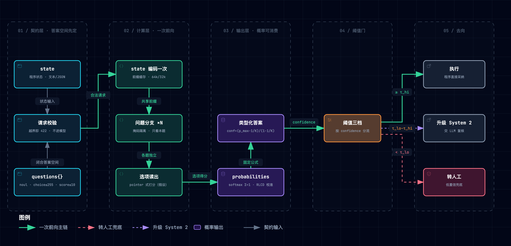
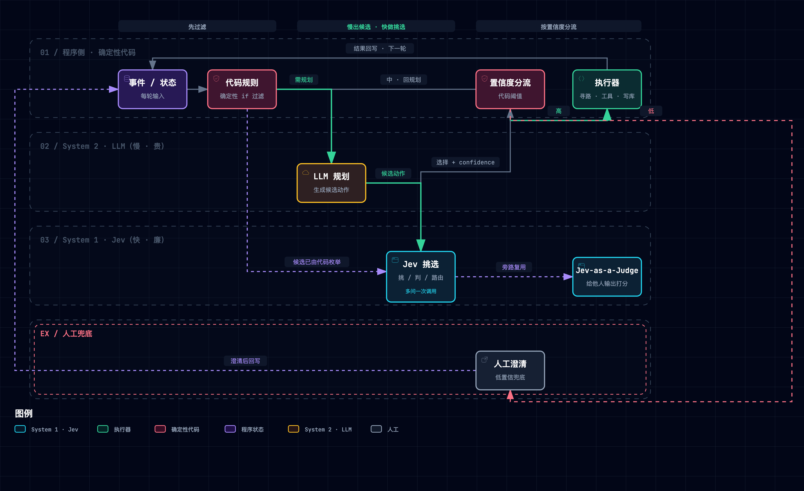

# Jev 精读笔记

> [TypeSafe AI, "Introducing System One Models & Jev," typesafe.ai, 2026-09-15](https://typesafe.ai/blog/introducing-system-one-models-and-jev) · 文档站 [docs.typesafe.ai](https://docs.typesafe.ai/)（jev-1.13.0）· 评测站 [evals.typesafe.ai](https://evals.typesafe.ai/) · 官方适配器 [system-one-adapter-python](https://github.com/typesafe-ai/system-one-adapter-python)（钉点 `e1d4cc9`，2026-09-22）。独立信源：A. Hume 逆向分析（2026-09-17，约 1 万次探针调用）、[jaredpalmer/kev](https://github.com/jaredpalmer/kev)（`b8aa777`，Apache-2.0）、[NandhaKishorM/laya](https://github.com/NandhaKishorM/laya)（`76361c8`，Apache-2.0）、LangChain Jev-as-a-Judge（2026-09-20）、nibzard / AbdelStark / scienthoon 三组第三方基准，以及 6 篇公众号文章（【四】，§9.2）。Jev 本体闭源：无论文、无权重，「新架构 / 并行采样器 / RLCD」只有名字。

**一句话定位**：Jev 把「让 LLM 写一段文字、再由程序去解析」的小判断，改成「程序先把答案空间写死，模型一次前向给每个选项打出带概率的分数」——它交付的不是更聪明，而是**让判断变成软件可直接消费、便宜到可以随处调用的函数调用**；代价是放弃生成，且校准只在分布内成立。

**总类比**：**一座快递分拣中心**。调度员（System 2 LLM）会规划线路、会写说明，但慢且贵；老分拣员（Jev）扫一眼面单（state 只编码一次），同时填好几张分拣小票（noul 是非 / choice 选格口 / score 打等级），**只能往已挂牌的格口里投**（闭合输出空间），心里的把握分配就是概率、把握集中度读数就是 confidence；分拣中心定期对账（校准），爱说「十拿九稳」就给他统一打折（温度缩放）；三条去向按把握分流——直投格口（执行）、送调度员复核（升级 System 2）、滑向人工异常台（转人工）；传送带与推杆（代码）照单执行。分拣越便宜，拿来分拣的东西越多（杰文斯效应）。

> [!TIP] **怎么读这篇笔记**
> - **三拍结构**：每个机制按「类比 → 机制 → 原型实景」走；原型实景取自配套最小原型 [`assets/jev_lab.py`](./assets/jev_lab.py)（纯标准库、无随机数、无网络，399 行），`--selftest` 秒级跑完，`--break B1..B6` 复现破坏性实验。文中日志均为实际运行输出。
> - **证据分级**：【一】钉点代码或本仓原型实测可复现 /【二】官方文档与博客陈述（含自曝缺陷）/【三】厂商自报基准与营销（凡引用必带归属）/【四】第三方实测与分析（须标样本与立场；公众号二手转述同属此级）。
> - **裁决口径**：闭源模型没有「代码胜出」可依，代之以「多源对账」——官方数字与第三方实测冲突时并列呈现（§9.2），不裁决为单一真相。
> - **替身声明**：原型中的「判读」是确定性关键词打分器（结构取 Hume 探针假设与 kev 开源实现），confidence 公式逐式照抄官方 adapter 代码（§5）。原型回答「机制是否自洽」，不回答「Jev 准不准」。
> - **配套产物**：[Jev ↔ negentropy 机制映射报告](./191-jev-mapping-negentropy.md)（16 条映射 + 7 处取证漂移 + ISSUE-196）。

## 1. 它要解决什么问题：让会写专著的人去盖章

Agent 里塞满了「小判断」：这条工单归谁、这个动作要不要放行、这次输出及格没、这个候选选哪个。今天它们大多交给 LLM：**慢**（3–329 秒【三】，对照 [llm-benchmarks](https://llm-benchmarks.diegoromero.es/)）、**贵**（$0.20–10/MTok 输入【三】）、**类型不稳**（生成的是字符串，要解析，会越界、截断、概率和不为 1）、**口头概率不可信**（RLHF 为「辅助人」优化，偏好对齐压扁了诚实的不确定性【二】）。

老分拣员一句话点破：这不是模型不够聪明，是**错配**——判断的答案空间本来就是封闭可枚举的，却用开放字符串逐 token 表达。Jev 的设计规格：

| 规格 | 通俗版 | 对应机制 |
| --- | --- | --- |
| 答案空间先定 | 只能往已挂牌的格口里投 | M1 类型契约：state + questions（criteria 即全部可能答案） |
| 输入只读一次 | 扫一眼面单，几张小票共用这一眼 | M2 共享前缀编码 + 问题分支隔离 + 选项读出 |
| 概率能当错误率读 | 自称九成把握，就该十次对九次 | M3 RLCD 校准目标 + confidence 固定公式 + 温度 |
| 按把握分流 | 直投 / 复核 / 人工异常台 | M4 快慢分工编排（代码规则 + 窄问题 + 阈值三档） |

接口契约【二】：`POST /v1/systemone`，请求 = `state` + 命名问题集（key 不发给模型）；三种题型——`noul`（是非，返回 0–1，无 confidence）、`choice`（≤255 选项，返回选项 + 全概率 + confidence）、`score`（≥2 级、API 接受 ≤10 级，返回概率加权期望值——可落在级间——+ 概率 + confidence）；同一请求内问题互不可见；上下文 64k/请求、32k = state + 最长单问；输入仅文本；价格 $42/十亿输入 token、输出免费；官方自认英文为主、CJK 较弱。

## 2. 全貌：分层矩阵与因果链


*图 1 · Jev 推理相（dataflow）。图源：[.mmd](../../assets/mermaid/agent-infra/jev--one-pass-decision.mmd) · 交互版 [HTML](../../assets/architecture/agent-infra/jev--one-pass-decision.html)（下载到本地打开）*

### 2.1 分层矩阵

| 层级 | 部分 | 回答的问题 | 性质 |
| --- | --- | --- | --- |
| Tier 1 | 接口契约（state / questions / criteria / 422） | 答案空间谁来定 | 【二】 |
| Tier 1 | 一次编码 · 分支隔离 · 选项读出 | 为什么快、为什么问 100 题和问 1 题差不多 | 【四】逆向 + 复刻代码【一】 |
| Tier 1 | 概率与校准（RLCD / confidence 公式 / 温度） | 概率能不能当错误率用 | 公式【一】；RLCD 配方【三】未公开 |
| Tier 1 | 快慢分工编排（规则 + 窄问题 + 阈值三档） | 在系统里放在哪 | 【二】【三】 |
| Tier 2 | evals（4 workflow）与发布数字 | 厂商证据可信吗 | 【三】自报 |
| Tier 2 | 第三方实测（nibzard / AbdelStark / scienthoon / Kev / LangChain）与 jaggedness 自曝 | 独立证据说了什么、哪里会坏 | 【四】/【二】 |
| Tier 3 | 领域坐标：零样本 NLI 分类、logprob 打分、SetFit、pointer network、共享前缀注意力（Hydragen / DeFT）、温度缩放、适当评分规则、RLHF / RLVR | 技术谱系位置 | 文献 |

### 2.2 因果脉络链

```
观察：Agent 里大量小判断交给 LLM——慢、贵、输出要解析、口头概率不可信
  ↓ 归因
「判断」被塞进「生成」通道：封闭可枚举的答案空间，用开放字符串逐 token 表达
  ↓ 设计规格
答案空间先定 × 输入只读一次、多问并行 × 概率要能当错误率读 × 按把握分流
  ↓ 机制
M1 闭合输出空间（criteria 即全部可能答案）
M2 一次编码 → 问题分支隔离 → 选项对决策位打分
M3 概率校准（RLCD 训练目标；confidence 固定公式；温度只做整体收放）
M4 快慢分工（规则 + 窄问题 + 阈值三档；System 2 出候选，System 1 挑）
  ↓ 证据闭环
厂商：evals 准确率 67.8%（9 模型第 4）· $0.0004/例 · 0.4s/例 · 不报校准
第三方：分布内 ECE ≈0.03 → 分布外 0.107 → 强制不确定 0.246 · 选项乱序 13% 翻转
逆向与复刻：隔离探针 0.00 vs 0.90 · 100 问内延迟近平坦 · Kev/Laya 复刻同一接口
```

### 2.3 基础层 vs 学习焦点（含类比遴选纪要）

前置门槛（Phase 0 体检结论，三条补课已融入正文）：自回归逐 token vs 一次前向打分；校准与温度缩放；约束解码只保证形式。架构未公开，故 Tier 1 的「计算形状」以 Hume 探针【四】+ kev/laya 开源代码【一】为最可信假设。

焦点排序：①闭合输出空间 ≠ 正确（最易被营销带偏）；②校准的边界（自动化执行的生死线）；③一次编码 + 隔离的计算形状（成本结构 + 「跨问题无不变量」的根因）；④快慢分工编排（真正落地价值所在）；⑤厂商数字的口径拆解。

**类比遴选纪要**：候选池 40 个、覆盖 10 个生活域，一票否决 16 个（因果不同构如硬币分拣机、需专业知识如塔台管制、诱发错误推论如膝跳反射）；决赛圈五维加权（贴切 25 / 传神 25 / 生动 20 / 覆盖 20 / 低失配 10）——快递分拣中心 **4.70**（断点 1：模型内部实现直讲）＞ 急诊分诊台 4.10（断点 3）＞ 足球裁判 + VAR 3.65（断点 4）。胜出理由：唯一把「闭合选项 / 一次扫描多判断 / 255 上限与两级分拣 / 把握度分流 / 分布外面单」放进同一日常场景且因果同构。**失配边界**（读者警惕，学徒复述时自行检出）：①人是跨小票统一思考的，Jev 的隔离是硬约束；②「手指点格口」暗示稳定与自知——实际选项乱序 13% 翻转、confidence 是固定公式机械读数、模型察觉不到分布外；③「对账」只对应事后温度缩放，RLCD 是训练期奖惩（未公开）。真实分拣靠条码查表，Jev 靠前沿预训练的语义理解——剧场里的老分拣员是「看得懂手写地址与备注的熟练工」，不是扫码机。

## 3. 机制一：闭合输出空间——合法 ≠ 正确

**类比**：只能往已挂牌的格口里投——绝不会投进不存在的格口，但可能投错格口。一面墙最多 255 个格口；再多就先分大区、再分小区（两阶段）。

**机制**：Choice 的 `criteria` 就是全部可能答案，模型输出的是对每个选项的概率打分，「给出选项之外的答案」在类型层面无法表达。由此两个推论：①「零幻觉 / 零类型错误」是**构造保证**而非实测——官方自己声明 0% 不是经验数字【二】；②它消灭的是**形式类错误**（越界标签、截断、不可解析、概率和不为 1），保留的是**语义类错误**（合法格口里指错）。官方 evals 准确率 67.8%【三】——约三分之一的案例是在合法选项里选错。HN 上最有力的批评正在于此：批评者指出「合法但错误的值」仍然可能（jacobgold、StevenWaterman），Almeida 以「随机森林也不会『幻觉』」回应让步【四】。选项间还会互相影响（加入无关选项使两个既有选项的对数几率移动 −0.28【四】），选项乱序导致 13% 答案翻转【四】——「读出」并非对每个选项独立打分。

> 255 上限的出处与裂缝：官方文档写校验错误返回 422【二】；nibzard 实测 256 个选项收到的是 `400 Too many choices`【四】。

**原型实景**（S1 / S4 / B2，实际运行输出）：

```text
== S1 契约校验（422）
  256 选项 → 422: q Choice 须 2..255 个选项，实为 256
  11 级   → 422: q Score 须 2..10 级，实为 11
== S4 闭合输出空间：合法 ≠ 正确
  [陷阱·字面误读] → 'billing'      conf=1.00 合法 ✘ 应为 technical
== B2 拆掉闭合输出空间（生成文本 + 宽松解析）
  拆后：
      [正常] → 'Billing team' conf=0.86 越界! ✘ 应为 billing
      [边缘·双类信号] → 'Billing team' conf=0.93 越界! ✘ 应为 billing
```

S4 的陷阱单是「This is not about refunds, charges or invoices: the login page」——关键词打分器字面命中 billing，以满格把握投错格口，正是官方 jaggedness 第 1 类「字面理解」的复刻【二】。B2 把闭合解码换成「生成文本 + 宽松解析」（模拟本仓 `loads_lenient` 路径），标签漂移（'billing'→'Billing team'）立即越界——类型安全不是属性，是**选择**。

## 4. 机制二：一次编码、分支隔离、选项读出

**类比**：扫一眼面单，几张小票共用这一眼；小票互不相看；作答时手指在挂出的格口里比较着点一个。

**机制**（Hume 探针假设 + kev 代码【四】【一】，Jev 本体未公开）：state 只编码一次（前缀 KV 缓存，参照 Hydragen / DeFT 的共享前缀注意力）；每个问题是一条独立分支，注意力掩码保证它只读 state 与本题——kev 的实现里每问 position ID 在 state 之后重启、`</opt>` 选项隐状态对 `<decide>` 决策位打分（pointer 式读出）；laya 则用双向编码器 + 选项位 MLP 打分，证明同一接口可以由完全不同的骨架承载。三条实测证据链【四】：①延迟对问题数近平坦（1 问 86.5ms → 1,500 问 610ms，约 100 问内基本不变），对 state 长度线性（360 token 57.5ms → 29,835 token 218ms）；②`output_tokens` 是由响应序列化长度算出的**计费口径**（4 + 每个是非 15 + 问题 ID 长度），延迟并不随它增长——200 选项（1,911 output tokens）与 2 选项一样快；③隔离探针：暗号放进兄弟问题，本问题判「state 里有暗号」的概率 0.00；放进 state，0.90–0.92。

**反面代价：跨问题无不变量**。隔离意味着每个问题的答案分布只基于 state，「哪些答案组合合法」在计算里无处表示。官方自曝【二】：同一退款问题，Noul 问得 0.22，yes/no Choice 问得 yes=0.01；「退款」「不退款」两个 Noul 分问，概率 0.72 + 0.47 = 1.19。**编排解**：互斥判断合并为单个 Choice（只挂合法组合的选项），或由代码做事后校验——而不是指望模型自觉。

**原型实景**（S5 / S6 / B1 / B5 / B6，实际运行输出）：

```text
== S5 分支隔离探针（复刻 Hume：暗号放兄弟问题 vs 放 state）
  暗号在兄弟问题 → P=0.047；暗号在 state → P=0.924
== S6 共享前缀：13 问 × 2000 token state
  一次调用处理 2078 token（state 编码 1 次）；逐问分调 26078 token → 12.5×
  （官方 cookbook 自报 13 问合并 12.2× 便宜【三】）
== B1 拆掉问题分支隔离
  正常：{'暗号在兄弟问题': 0.047, '暗号在state': 0.924}
  拆后：{'暗号在兄弟问题': 0.924, '暗号在state': 0.924}
== B5 拆掉共享前缀缓存
  正常：{'one_call': 2078, 'encodes': 1, 'separate': 26078, 'ratio': 12.5}
  拆后：{'one_call': 26078, 'encodes': 13, 'separate': 26078, 'ratio': 1.0}
== B6 互斥决策拆成两个 Noul（本就无跨问题不变量）
  正常：{'probs': {'refund': 0.953, 'deny': 0.047}, 'sum': 1.0, 'actions': ['refund']}
  拆后：{'probs': {'refund': 0.924, 'deny': 0.924}, 'sum': 1.85, 'actions': ['refund', 'deny']}
```

B6 值得多看一眼：把互斥决策拆成两个 Noul 后，「退款」与「拒退」同时过线执行——这不是模型犯错，是**编排**把「互斥」这个本该由 Choice 构造保证的性质丢给了两次独立判断。

## 5. 机制三：校准概率——能当错误率读，但只在分布内

**类比**：老分拣员心里对每个格口各有几成把握，把握的集中度就是 confidence 读数；分拣中心定期**对账**——自称九成把握的件是否真有九成投对；查账发现他爱说「十拿九稳」，就给他的口头把握统一打折（温度缩放）。

**机制**：RLCD（Reinforcement Learning for Calibrated Decisions）被官方定义为与 RLHF（人类偏好）、RLVR（可验证奖励）并列的第三条训练路线，目标是「认知上诚实的概率」——0.8 就是约 80% 正确【二】。配方未公开；两个开源复刻给出了两条可行路径：kev 用**交叉熵**（log score 本身就是严格适当评分规则，直接梯度下降即可，无需 RL）+ 每个 checkpoint 一个后验温度（约 2.1–2.4）【一】；laya 用 GRPO 式策略梯度，奖励 = log score + 0.5×spherical score − 1.0×ranked probability score 的组合【一】。**confidence 不是模型学得的**——官方 adapter 的代码逐式给出【一】：Choice 用 `(p_max − 1/K)/(1 − 1/K)`，Score 用 `1 − 离众数期望距离 / 均匀分布平均绝对偏差`；文档示例（choice 0.88/0.12/0 → 0.81、score [0,0.95,0.05] → 0.92、score 值 1.05）均可由公式复算到舍入带内。它只是概率分布的另一种读数，不是新信息。

**校准的领地**：分布内与分布外是两个世界——公开基准上 ECE 0.024–0.032【四】；合成工单（分布外）0.107，为噪声底的 4.4×【四】；nibzard 的「强制不确定题」上 ECE 0.246 为实测最差，Jev 仅 49.7% 承认「不知道」，LLM 是 97.3–100%【四】；不可知题上仍有 9% 以 ≥0.9 置信作答【四】；DAIR Emotion 上 16% 的样本给**真标签零概率**【四】。温度缩放能修整体的过度自信，修不了排序（准确率不动，见 S8），更修不了分布漂移——Ovadia et al. 的经典结论在决策模型上复现。

**原型实景**（S8 / S9，实际运行输出；替身设定：声明概率锋利度 2.4，真实区分力为 1.0，OOD 降到 0.45，不可知题 1/3）：

```text
== S8 校准：原始 vs 温度缩放（分布内）
  拟合温度 T=2.40（替身锋利度 2.4）
  raw {'ece': 0.141, 'acc': 0.77, 'conf_err': 0.103, 'act_share': 0.68, 'act_err': 0.12, 'act_claimed': 0.007}
  cal {'ece': 0.013, 'acc': 0.77, 'conf_err': 0.023, 'act_share': 0.197, 'act_err': 0.059, 'act_claimed': 0.034}
== S9 分布外与不可知题
  OOD 沿用分布内 T {'ece': 0.195, ..., 'act_share': 0.195, 'act_err': 0.231, 'act_claimed': 0.034}
  OOD 自有切片重拟 T=5.45 {'ece': 0.016, ..., 'act_share': 0.0, 'act_err': None}
  不可知题（真实正确率 1/3）{'ece': 0.433, 'act_share': 0.197, 'act_err': 0.661, 'act_claimed': 0.034}
```

读法：`act_share` 是按「概率 ≥0.95 即自动执行」策略的直投份额，`act_err` 是直投决策的**实际**错误率，`act_claimed` 是**自称**错误率。未校准时：68% 的决策被直投，自称只错 0.7%，实际错 12%——账面好看，车间失火。温度缩放后 ECE 归位，且**准确率一字不变**（温度不改排序）。OOD 沿用分布内温度：直投 19.5%、实际错 23.1%、自称 3.4%。诚实重校准的结局是「学会闭嘴」——直投归零，全部升级；不可知题上嘴硬依旧（实际错 66.1%）。

## 6. 机制四：快慢分工——收益在编排，不在模型

**类比**：三条去向——把握高直投格口（执行）、不足送调度员复核（System 2）、再低滑向人工异常台；调度员负责规划线路、开当日格口、写异常备注（生成），老分拣员只在格口里挑（判断）。分拣越便宜，拿来分拣的东西越多——连内部传阅件都要「过一遍分拣」，判断密度上升，这就是杰文斯效应（Jevons, 1865：煤的利用效率提高，煤耗总量反增）。

**机制**：官方 evals 的 workflow 模式展示了标准编法——每个决策拆成**代码规则 + 窄问题**（close/escalate/contain 等），参考答案由 GPT-6 Astra 与 Fable 5.1 平均给出【三】。结果：Jev 准确率 67.8%（9 个模型中第 4），但 $0.0004/例、0.4s/例，成本与时间是两个数量级的优势；「让 LLM 在思维链里做全部逻辑」（prompt 模式）普遍更差——haiku 4.5 从 53.6% 跌到 18.1%【三】。社区案例同构：Minecraft 速通里 Astra 做高层规划（约 15 秒一次）、Jev 从程序生成的候选动作里挑、执行代码负责寻路放置，一次成功运行 131 次 Jev 决策 + 35 次 LLM 调用【四】；浏览器 Agent「读页面 → 生成候选 → Jev 选 → 执行」约 7 秒完成航班查询【四】。Jev-as-a-Judge 是同一机制的换位应用：LangChain 用 5 个固定输出 × 100 次重复对照一名人工评审，Jev 一致率 100%（500/500）、评分方差比 LLM 评委低 92–913×、$0.00035/次【四，注意：样本极小、单一评审人、与厂商联合营销】。


*图 2 · Jev 编排相（workflow）。图源：[.mmd](../../assets/mermaid/agent-infra/jev--fast-slow-harness.mmd) · 交互版 [HTML](../../assets/architecture/agent-infra/jev--fast-slow-harness.html)（下载到本地打开）*

**原型实景**（S10 / B3，实际运行输出；单价取 evals 自报口径【三】：Jev $0.0004/0.4s、terra $0.0304/10.1s；System 2 替身准确率 0.97；人工档视作全对、成本不计）：

```text
== S10 快慢分工：阈值三档（≥0.95 执行 / 0.6–0.95 升级 LLM / <0.6 转人工）
  {'act': 118, 'llm': 346, 'human': 136, 'acc': 0.972, 'cost': 10.758, 'sec': 3734.6,
   'all_llm_cost': 18.24, 'all_llm_sec': 6060.0}
== B3 拆掉温度校准
  正常：{'T': 2.4, 'test': {'ece': 0.013, 'acc': 0.77, 'conf_err': 0.023, 'act_share': 0.197, 'act_err': 0.059, 'act_claimed': 0.034}, 'gate': {'act': 118, 'llm': 346, 'human': 136, 'acc': 0.972, 'cost': 10.758, ...}}
  拆后：{'T': 1.0, 'test': {'ece': 0.141, 'acc': 0.77, 'conf_err': 0.103, 'act_share': 0.68, 'act_err': 0.12, 'act_claimed': 0.007}, 'gate': {'act': 408, 'llm': 144, 'human': 48, 'acc': 0.91, 'cost': 4.618, ...}}
```

S10 读法：替身数据里只有 19.7% 的决策够自信直投，346 条升级、136 条转人工——省下的成本（10.8 vs 18.2）远小于厂商「444.6×」的想象，因为**省多少取决于「有把握的大多数」有多大**，而不是模型单价。B3 读法：拆掉校准后账面成本从 10.8 降到 4.6（直投从 118 涨到 408），但整体准确率 0.972 → 0.91，直投决策实际错 12% 而自称 0.7%——**校准拆掉的是你看得见的成本，烧掉的是你看不见的质量**。

## 7. 五条底层规律（正交分解：输出空间 / 计算形状 / 概率语义 / 分布边界 / 编排分工）

| # | 规律 | 最简解释 | 理论锚点 | 没有它会坏在哪 |
| --- | --- | --- | --- | --- |
| 1 | 答案空间先于答案 | 先列出全部可能答案、只许在里面挑，就永远不会「格式错」，但照样会「挑错」 | Vinyals et al., Pointer networks, NeurIPS 2015 | 生成式判断要事后解析与修复（官方 adapter 全套纠错重试就是它的账单）；本仓 10 处宽松解析静默填默认值是同款病（[191 #2](./191-jev-mapping-negentropy.md)） |
| 2 | 读一次、问多次，但各问各的 | 输入只读一次最省；每问只看输入不看别问，否则互相污染 | Juravsky et al., Hydragen, arXiv:2402.05099 | 分开调用成本随问题数线性涨（原型 12.5×）；不隔离则串线（B1 暗号 0.047→0.924）；隔离的代价是跨问题无不变量（0.72+0.47=1.19【二】、B6 和 1.85） |
| 3 | 概率要能当错误率读 | 说九成把握就该十次对九次，否则不能直接拿概率设自动执行门槛 | Guo et al., ICML 2017；Gneiting & Raftery, JASA 2007 | 未校准直投：自称错 0.7%、实际错 12%（S8）；温度不改排序——准确率是能力问题，校准是诚实问题，两服药治两种病 |
| 4 | 校准有领地 | 熟活上校准好，不等于换类活还老实；越陌生越嘴硬 | Ovadia et al., NeurIPS 2019 | 分布外直投实际错 23.1% 自称 3.4%（S9）；第三方 0.03 → 0.107 → 0.246 的台阶；诚实重校准的代价是自动化率归零——那是它该有的样子 |
| 5 | 快慢分工的收益在编排 | 便宜的快判断处理有把握的大多数，没把握的升级；省多少取决于「有把握的大多数」有多大 | Kahneman 2011；Chen et al., FrugalGPT, 2023；Madras et al., NeurIPS 2018 | 全量走 LLM 太贵、全量走快模型错太多；拆掉校准的分流「更省」却更错（B3：成本 4.6 但 acc 0.91） |

## 8. 三个核心争议

### 争议 1：「这不就是个分类器吗？」——零样本前沿判读 vs 专用小模型

**通俗版**：老分拣员 vs 专门为一个中心训练的扫码分拣机——机器在固定格口上又快又准，换一批格口就得重训；老分拣员看得懂任何面单，换块牌就能上岗。
**分歧为什么产生**：怀疑派（HN「it's a classifier」、r/LocalLLaMA「就是 NLI」）看的是稳定高频任务——专用模型确实更便宜，laya 微调后在 typed-decisions 上 0.766 > Jev 0.727（该 Jev 数来源不明，laya README 自注为第三方发布未实测；且 laya 基座零样本 0.36/0.34 近随机、多数类基线 0.461，Banking77 上 0.425 vs Jev 0.870）【四】；支持派看的是长尾多变任务——业务逻辑一变，专用模型要重新标注、托管、盯漂移。取样不同，两派都对。
**难以克服吗**：工程与经济问题——按「任务稳定度 × 调用量 × 标注成本」连续谱选址；知识差来自底座（Kev MMLU-Pro 0.52 vs Jev 0.84【四】），属资源问题，不属本质难题。

### 争议 2：自报基准的信度——193.6× / 444.6× 该信几分

**通俗版**：分拣中心自家出考核卷、拿两位资深调度员答案的平均当标准答案，还让竞争对手按自家流程答题（adapter 要求 LLM 一次生成写出每题完整概率分布，更慢更贵）。
**分歧为什么产生**：厂商看到公开基准会被刷（antibenchmaxxing：只发带日期、会退役的快照【二】）；怀疑派看到参考标签由 LLM 生成、workflow 由自家团队写、不报校准、倍数疑为各轴取最大比值——首页 demo 数字复算仅约 75×/171×【三】，第三方 p50 只比 Cerebras 上 gpt-oss-120b 快 1.2×【四】。
**难以克服吗**：验证信号信度问题——可对冲（预注册第三方基准、CI 核验声明如 kev 的 claims.json），闭源前提下不可消除。

### 争议 3：校准能外推吗——「0.85 就是 85 次对」是承诺还是分布内统计

**通俗版**：本地线路上对账极准的老分拣员，面对外文面单，还该信他的「九成把握」吗？
**分歧为什么产生**：厂商与部分二手媒体把 RLCD 讲成普遍承诺（InfraLink 文甚至写成「可验证地 100 次对 85 次」——强于官方表述）；第三方看到的是 0.03 → 0.107 → 0.246 的台阶，且公开基准可能本就在训练分布里。
**难以克服吗**：本质难题——新分布上没有标签就无法验证校准；只能对冲（自有数据重校准 + 分布外检测 + 保守阈值 + 升级路径），不可消除。原型 B4 给出对冲的真实代价：诚实重校准使直投归零。

## 9. 关键实证数字与跨源口径冲突

### 9.1 数字分级表

| 数字 | 值 | 级 | 读法 |
| --- | --- | --- | --- |
| 契约上限 | Choice ≤255 选项 / Score ≤10 级 / 64k·32k 上下文 / 问题互不可见 | 【二】 | 答案空间由请求方定义 |
| 定价 | $42/十亿输入 token，输出免费；限流 250k TPS / 1200 RPM | 【二】【三】 | 官方自认无法证明没有补贴 |
| 端到端延迟 | 官方 70–500ms（40–200×）【三】；第三方 p50 236–276ms【四】；仅比 Cerebras 上 gpt-oss-120b 快 1.2×【四】 | 三四级并列 | 绝对快，相对倍数取决于对照 |
| evals 总表 | Jev 67.8% / $0.0004 / 0.4s；sol 74.1%、opus 5 73.1% 更准但 209–440× 贵 | 【三】 | 准确率第 4；优势在成本与时间；无校准指标 |
| 首页头条 | 193.6× 快 / 444.6× 便宜；首页自家 demo 约 75×/171× | 【三】 | 疑为各轴对不同基线取最大比值 |
| 问题数平坦性 | 1 问 86.5ms → 100 问近平坦 → 1,500 问 610ms | 【四】 | 多问合调的结构性红利 |
| 隔离探针 | 兄弟问题暗号 0.00 vs state 暗号 0.90–0.92 | 【四】 | 分支隔离成立 |
| confidence 公式 | Choice (p_max−1/K)/(1−1/K)；文档示例 0.81/0.92 可复算 | 【一】 | 固定公式，非模型学得 |
| 分布内校准 | MMLU ECE 0.0313（1,200 题）；公开基准 0.024–0.032 | 【四】 | 分布内概率可当错误率 |
| 分布外校准 | 合成工单 0.107（4.4× 噪声底）；强制不确定 0.246、承认不知道 49.7% | 【四】 | 越远离分布越嘴硬 |
| 选项顺序敏感 | 乱序 13% 翻转；无关选项移对数几率 −0.28 | 【四】 | 选项非独立打分 |
| 一次性组合调用 | 13 问合并 12.2× 便宜、10.0× 快（官方 cookbook） | 【三】 | 与原型 12.5× 同构 |
| Judge 一致性 | 5×100 次对照 1 名人工 100% 一致、方差低 92–913×、$0.00035/次 | 【四】 | 样本极小 + 厂商联合营销，方向参考 |
| jaggedness 自曝 | Noul 0.22 vs Choice 0.01；0.72+0.47=1.19；计数/日期/间接引用弱 | 【二】 | 官方承认的九类失败模式 |

### 9.2 跨源口径冲突（官方 vs 公众号 vs 第三方）

| 主题 | 口径 A | 口径 B | 裁定 |
| --- | --- | --- | --- |
| 延迟区间 | 官方 70–500ms【三】 | InfraLink 图 70–300ms、LLM 对照 3–15s/$3–15【四】 | 官方为准；InfraLink 系旧稿且夸大对照 |
| 「0% 错误率」 | 官方：非实测、构造保证【二】 | InfraLink「基准测试中确实是 0%」【四】 | 官方口径；二手转述失真 |
| 校准含义 | 官方 primer：「0.8 应约 80% 正确」（训练目标）【二】 | InfraLink「0.85 可验证地 100 次对 85 次」【四】 | 官方是目标陈述；频率保证只在分布内成立（争议 3），二手转述把目标升格为可验证承诺 |
| 创始人履历 | 「参与 InstructGPT/RLHF 早期工作」 | 向风飞扬「奠基人之一」【四】 | InstructGPT（arXiv:2203.02155）合著之说见于多方转述（本次未逐一手核）；RLHF 更早有 Christiano et al. 2017，「奠基人之一」偏强 |
| 开放状态 | 09-15 early access；09-21 取消候补【三】 | InfraLink（09-24 转载）仍写需候补【四】 | 旧稿未更新 |
| 社区规模 | 「36 小时 14 万开发者」「600+ 开源项目」「3,700 万围观」【四】 | 无原始出处 | 存疑，引用须带「社区流传」 |
| 交易机器人亏损 | $31,680（向风飞扬）≈ 3 万美元（华尔街见闻）【四】 | 无原始出处 | 两文互证但均无源头，当轶闻 |

## 10. 动手实验室：把机制亲手拆坏六次

运行方式（仓库根目录，秒级完成）：

```bash
uv run --no-project python docs/research/agent-infra/assets/jev_lab.py --selftest
uv run --no-project python docs/research/agent-infra/assets/jev_lab.py --break B1   # B1..B6
```

机制 → 代码速查（`jev_lab.py`）：

| 机制 | 代码 |
| --- | --- |
| 契约校验（422） | [`validate_request` L66](./assets/jev_lab.py#L66) |
| confidence 固定公式（照抄 adapter） | [`choice_confidence` L79](./assets/jev_lab.py#L79) · [`score_confidence` L86](./assets/jev_lab.py#L86) |
| 闭合解码 vs 生成 + 宽松解析 | [`decide` L118](./assets/jev_lab.py#L118) · [`verbalize` L102](./assets/jev_lab.py#L102) · [`loads_lenient` L109](./assets/jev_lab.py#L109) |
| 一次编码 + 隔离 + 选项读出 | [`ask` L136](./assets/jev_lab.py#L136) · [`score_options` L97](./assets/jev_lab.py#L97) |
| 确定性决策流 + 温度拟合 + ECE | [`decision_stream` L158](./assets/jev_lab.py#L158) · [`fit_temperature` L181](./assets/jev_lab.py#L181) · [`ece` L172](./assets/jev_lab.py#L172) |
| 阈值三档分流 | [`gate` L202](./assets/jev_lab.py#L202) |

破坏性实验实测（每项一句教训）：

| 实验 | 改动 | 实测退化（实际运行日志见 §3–§6） | 教训 |
| --- | --- | --- | --- |
| B1 拆分支隔离 | 兄弟问题文字并入可见上下文 | 暗号泄漏 0.047 → 0.924 | 隔离挡的是「别的题的暗示」，不是噪音 |
| B2 拆闭合输出空间 | 换「生成 + loads_lenient」 | 5 单 3 单输出越界 'Billing team' | 类型安全是选择，不是属性；宽松解析把越界静默放行 |
| B3 拆温度校准 | 直接信原始声明概率 | ECE 0.013→0.141；直投 19.7%→68%；自称错 0.7% 实际 12%；gate 成本 10.8→4.6 但 acc 0.972→0.91 | 校准拆掉的是看得见的成本，烧掉的是看不见的质量 |
| B4 拆自有数据重校准 | OOD 沿用分布内温度 | 直投 19.5%、实际错 23.1%、自称 3.4%；重拟后直投归零 | 分布外要么嘴硬要么闭嘴，没有免费的中庸 |
| B5 拆共享前缀缓存 | 每问重编码 state | token 比 12.5× → 1.0× | 多问合调的全部红利来自「读一次」 |
| B6 互斥决策拆两个 Noul | choice → 两个独立 noul | 概率和 1.85，refund 与 deny 同时执行 | 互斥是 Choice 的构造性质，不能外包给两次独立判断 |

## 11. 批判性边界（材料没有证明的事）

1. **架构与 RLCD 零公开**：「新模型架构 / 并行采样器 / RLCD」只有名字；Hume 的重建自称「相当推测性」，其 MoE 与 ~10B 激活参数的规模猜测是最弱的一环【四】。
2. **「0% 幻觉」不是实测**：是 schema 构造保证，且不等于答对（evals 67.8%）；第三方已给出反例数据（16% 真标签零概率）。
3. **倍数口径未对齐**：193.6× / 444.6× 疑为各轴对不同基线的最大比值；官方 evals 无校准指标、参考标签由两个 LLM 平均、workflow 自家编写；首页自家 demo 仅约 75×/171×。
4. **中文 / CJK 未证明**：官方自认 CJK 较弱【二】；本笔记全部第三方证据都是英文任务。中文场景的校准、准确率均无数据。
5. **「并行采样」的机制证据是间接的**：延迟平坦性、token 计费口径、隔离探针都来自外部黑盒探针【四】，而非实现披露；kev/laya 只证明「这个接口可以那样实现」，不能证明 Jev 就是这样实现的。

## 12. 双 Agent 费曼考评与推演实录（Feynman Mastery Archive）

> 由 Mentor（严格导师）与 Learner Subagent（求知学徒，上下文隔离、盲答）在本仓 `.context/jev-study/` 完成；以下为浓缩实录，工作稿含逐字作答。

**研究范围界定（先行）**：Jev 的定义域是封闭、可枚举答案空间上的判断（路由 / 分类 / 打分 / 是非 / 候选挑选 / 评估），输入为文本或可文本化的程序状态。成立工况：选项 ≤255 / 级 ≤10、state + 最长单问 ≤32k、任务分布与训练分布相近（英文为主）、决策可按把握分流且有升级兜底。明确不适用：任何需要生成文字的任务、开放答案空间、计数 / 算术 / 日期比较（官方 jaggedness 自曝）、跨问题需要逻辑约束的联合决策（须编排成单个 Choice 或由代码校验）、分布外与中文场景的校准承诺、图像输入、对抗注入。

**第一轮三维盲答**：
- **白话转述**：学徒以分拣中心剧场讲「老分拣员一个字不写」——换来「程序接得住（只可能点到挂牌格口）/ 便宜（扫一眼答完几张小票）/ 把握读得出（格口间比较着指，把握合成一整份）」，失去「写的能力」与「说『我看不懂』的出口」（必须点一个格口，示弱的唯一方式是把握变低，而把握只在熟悉线路上对过账）；并自行点破最脆弱处——「点得出 ≠ 点得对」。全程零术语违禁。
- **因果与最近邻**：约束解码只治「要解析」一个症状，仍吃亏在计算形状（多题串线或线性：1 问 86.5ms → 1,500 问 610ms vs 一次合调）与把握含义（verbalized 概率更慢更贵）；Jev 并不比 (a) 更好的三处（答对率 67.8% 第 4 / 强制不确定题诚实度 49.7% vs LLM 97.3–100% / 独立实测仅快 1.2×）；与专用分类器 (b) 的本质差异「格口牌放在哪」（固化进权重 vs 当作调用参数现场读），各赢工况以 laya 微调 0.766 vs 零样本 0.36、Banking77 0.425 vs 0.870 钉死。
- **极限推演**（中文电商客服 + 新政策分布位移）：逐环推演，判第一退化点在「理解变形（不可见）→ 置信读数不降（造成后果）」；给出监控三重盲区（闭合空间拆掉了越界警铃 / 自动执行率衡量量不衡量对 / 抽检按旧政策误判「合理」）与两道防线（分片分布外闸 + 重拟温度 / 传送带层跨题否决 + 政策上线即改牌）；并在「最没把握」里诚实指出核心预测「读数塌 vs 嘴硬」证据两面——两种退化混合出现，监控漏掉的恰是代价最高的「笃定地错」。

**《薄弱点诊断》**（四类归因）：整体无行话复读、无方案混淆；两处轻度缺陷——
- **W1 因果断裂（轻）**：把「noul 没有 confidence 字段」误推为「该题不参与门控」。noul 返回的 0–1 概率本身就是门控量——少一个读数不等于少一个门。
- **W2 边界模糊（轻）**：把「重拟温度后直投归零」当纯收益引用，未计运营账单（自动化率坍塌 ⇒ 全量涌向 LLM / 人工的容量洪峰）。

**针对性补课（三板斧）**：①世界观微类比——涉诉小票是「红色易碎贴」，贴上就走人工通道，规则写进分拣流程而非指望分拣员自觉；②第一性溯源——门控的本质是「用什么量触发升级」，choice/score 有答案 + confidence 两个量，noul 只有一个（概率本身）；③破坏性反例——原型 B4 重拟后直投 0/600、328 件涌向人工通道（账单是容量洪峰，不是美元成本），诚实是有账单的。

**同构变式复考**（全新场景：代码审查护栏，Rust 新模块 + 新安全规范，options 无对应牌）——**判定全绿通过**：
- **R1（W1 修正）**：破坏性命令 noul 概率 ≥0.3 做**硬门**、一票否决自动执行、写死在编排层；两道门拦不同错误（noul 门拦「不可逆灾难」，false negative 是数据没了，代价不对称故宁紧勿松、且不依赖校准；confidence 门拦「模型没把握」的普通越权）；顺序上 noul 单向降级门在前——先保命，再谈效率。
- **R2（W2 修正）**：容量按「切片 100% 落人工通道」上限预备（保守化会把升级通道的量也压向人工，不是只补两成缺口）；最危险的隐性指标是「护栏变慢后团队绕开流程的比例」（杰文斯反向）；分片恢复按 PR 画像影子跑 → 攒人工标签对账（自称错误率 vs 实测错误率）→ 实测错误率入预算才开直投。
- **R3（综合）**：新规范无牌时模型把 PR 塞进语义最近的桶且可能带体面 confidence——「合法 ≠ 正确」，责任在牌不在分拣员；改牌时机 = 政策上线即改牌（过渡期用编排层确定性规则堵真空 + 新旧牌并行影子跑）；关键连锁是**改牌本身就是分布位移**——选项集一变全部概率重排（乱序 13% 翻转的前车之鉴），旧温度与旧阈值全部作废，须按 R2 账单重校准；严重度小票（score）confidence 公式与 choice 不同、分布外同样退化，只用于排序路由、永不作为自动执行依据。

**出闸判定**：同构变式复考因果清晰、边界明确、表达通俗——门禁全绿，结业放行进入 Phase 3 原型实验（本文 §3–§6、§10 的全部实测日志即其产物）。

## 13. 用户自测与费曼研讨套件（Self-Assessment Kit）

1. 你的团队想把「用户消息是否含 PII」从 LLM 判断换成 Jev 类决策模型。请设计一个**三周内可完成、不依赖厂商数字**的验收实验：用什么数据、测什么指标、阈值定在哪、上线后监控什么信号？说清为什么「抽检准确率一直 95%+」不足以放行自动执行。
2. 官方 adapter 要求 LLM 一次性口述所有问题的完整概率分布（而不是读 logprob）。请推演：这种「verbalized probabilities」会在哪两类问题上系统性失真？它与「Jev 声明概率」在证据等级上有何本质区别？
3. 反向思考：如果明天所有前沿 LLM 的 API 都免费提供**校准过的全选项 logprob**（等价于一次前向的概率读出），Jev 还剩下什么不可替代的价值？哪些会归零？（提示：从 M2 的成本形状与 M4 的接口形态两方面想，再对照本仓 [191](./191-jev-mapping-negentropy.md) 的 ⏸ 判定。）

## 14. 与本仓的关联

[Jev ↔ negentropy 机制映射报告](./191-jev-mapping-negentropy.md)：16 条映射（✅4 / 🔶6 / ⏸6）。最大真增量是「闭合输出空间」纪律——Claude Code 自动作答不校验选项成员、Judge/PlanReviewer 解析失败静默降 0 分、`global_search` 哨兵漏入 reduce；直接接入 Jev 暂缓（CJK / 闭源 / 模型类型体系无位），触发条件是「可自托管 + 中文校准经本仓数据验证」。取证副产物 7 处漂移登记 [ISSUE-196](../../.agents/issue.md)。本仓唯一的「不生成、只打分」先例是 `LocalReranker`（bge cross-encoder）——决策模型若引入，应沿用 rerank 的接入形态。

## 参考（IEEE）

[1] TypeSafe AI, "Introducing System One Models & Jev," typesafe.ai, Sep. 2026. [Online]. Available: https://typesafe.ai/blog/introducing-system-one-models-and-jev
[2] TypeSafe AI, "API reference," docs.typesafe.ai, 2026. [Online]. Available: https://docs.typesafe.ai/api.md
[3] TypeSafe AI, "Jev 1.13 jaggedness," docs.typesafe.ai, Sep. 2026. [Online]. Available: https://docs.typesafe.ai/model-jaggedness/jev-1.13.md
[4] TypeSafe AI, "Workflow evals," evals.typesafe.ai, 2026. [Online]. Available: https://evals.typesafe.ai/
[5] A. Hume, "Jev's architecture unmasked," archerhume.com, Sep. 2026. [Online]. Available: https://archerhume.com/posts/jevs-architecture-unmasked
[6] TypeSafe AI, system-one-adapter-python, GitHub, commit e1d4cc9, Sep. 2026. [Online]. Available: https://github.com/typesafe-ai/system-one-adapter-python
[7] J. Palmer, kev, GitHub, commit b8aa777, Sep. 2026. [Online]. Available: https://github.com/jaredpalmer/kev
[8] Nandakishor M., laya, GitHub, commit 76361c8, Sep. 2026. [Online]. Available: https://github.com/NandhaKishorM/laya
[9] nibzard, decision-model-benchmark, GitHub, commit 8404980, Sep. 2026. [Online]. Available: https://github.com/nibzard/decision-model-benchmark
[10] AbdelStark, jev-benchmarks, GitHub, commit 0d610cc, Sep. 2026. [Online]. Available: https://github.com/AbdelStark/jev-benchmarks
[11] scienthoon, jev-ood-calibration, GitHub, commit 914d87a, Sep. 2026. [Online]. Available: https://github.com/scienthoon/jev-ood-calibration
[12] D. Shea and S. Roche, "Jev-as-a-Judge for Agent Evals," LangChain Blog, Sep. 2026. [Online]. Available: https://www.langchain.com/blog/jev-agent-evals-langsmith
[13] D. Kahneman, *Thinking, Fast and Slow*. New York, NY, USA: Farrar, Straus and Giroux, 2011.
[14] C. Guo, G. Pleiss, Y. Sun, and K. Q. Weinberger, "On calibration of modern neural networks," in *Proc. Int. Conf. Mach. Learn. (ICML)*, 2017.
[15] T. Gneiting and A. E. Raftery, "Strictly proper scoring rules, prediction, and estimation," *J. Amer. Stat. Assoc.*, vol. 102, no. 477, pp. 358–378, 2007.
[16] O. Vinyals, M. Fortunato, and N. Jaitly, "Pointer networks," in *Proc. Adv. Neural Inf. Process. Syst. (NeurIPS)*, 2015.
[17] J. Juravsky et al., "Hydragen: High-throughput LLM inference with shared prefixes," arXiv:2402.05099, 2024.
[18] Y. Ovadia et al., "Can you trust your model's uncertainty? Evaluating predictive uncertainty under dataset shift," in *Proc. Adv. Neural Inf. Process. Syst. (NeurIPS)*, 2019.
[19] L. Chen, M. Zaharia, and J. Zou, "FrugalGPT: How to use large language models while reducing cost and improving performance," arXiv:2305.05176, 2023.
[20] W. S. Jevons, *The Coal Question*. London, U.K.: Macmillan, 1865.
[21] 腾讯技术工程（mason），《聊聊最近爆火的 Jev 模型，到底是个啥？》，微信公众号，2026-09-21.
[22] 新智元，《刚刚，Jev 全网解禁！1.2 亿 Token 限时免费用》，微信公众号，2026-09-21.
[23] 机器之心，《刷屏了！前 OpenAI 研究员做的 Jev，大家为啥抢着用？》，微信公众号，2026-09-20.
[24] 向风飞扬，《Jev 火了：我把它背后的「快慢分工」搬进了自己的 AI 流水线》，微信公众号，2026-09-24.
[25] InfraLink（转载），《Jev 模型解析：比前沿 LLM 快 200 倍、便宜 400 倍的结构化决策引擎》，微信公众号，2026-09-24.
[26] 华尔街见闻（nashnova），《最近爆火的 Jev，到底能帮我干点啥？》，微信公众号，2026-09-22.
