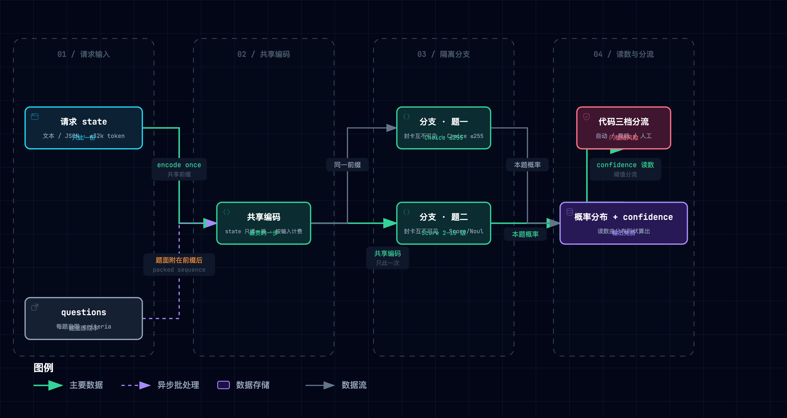
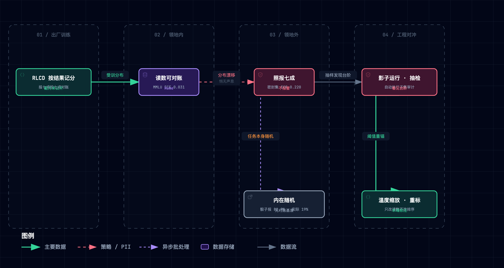

# Jev（TypeSafe System One Model）精读笔记

> TypeSafe AI, "Introducing System One Models and Jev," typesafe.ai 博客，2026-09-15（[原文](https://typesafe.ai/blog/introducing-system-one-models-and-jev)）；docs.typesafe.ai 全站快照（2026-09-26 抓取归档）。第三方一手证据：A. Hume 黑盒探测（独立研究者的架构逆向，2026-09-17，约 1 万次调用）、LangChain judge 实验（拿 Jev 当评审员的对照实验，repo 固定 `adfea749`）、JevBench v1.4.2（含密封题的第三方基准，tag `1df665e3`）、distil labs 付款决策拆解（与微调小模型的对照）、K. Hayashi 骰子实验（内在随机事件测试，repo `2ef26b64`）；另有 Di Zhang（RLCD 理论重构）与 A. Molas（校准不可普适的论证）两篇分析。代码取证与开源复刻：TypeSafe 官方 adapter `e1d4cc9`（confidence 公式钉点）、kev `58d9438`（Qwen 底座的开源复刻）、laya `4066d5d`（encoder 底座的开源复刻）、nibzard `8404980`（公开原始响应的第三方基准，可复算）。本笔记全部数字与结论可溯源至上述信源的归档笔记（file:line）。

一句话定位：Jev 改变了「判断」的交付方式，从「写一段话再由程序解析」改成「在预先定好的选项上直接交出一张概率表」。换来的是结构确定、一次多问、按量对账的便宜判断；它不保证判断正确，**只保证判断的形状与不确定性可以被代码消费**。

怎么读这篇笔记：模型聊天早已超人，软件却没有因此自动化起来。官方博客把病灶拆成四条：自由文本要解析，口头把握不是概率，逐字生成又慢又贵，RLHF 优化的是人类偏好而不是机器可信度（§1）。Jev 的回答是上面那张概率表；本文要回答的是，这种交付形态保证了什么、不保证什么、会在哪里先坏。§1 从问题与设计规格讲起，§2 给出全貌地图。§3–§6 依次拆四个机制，每个机制按「类比点火 → 机制 → 实景」三拍走；类比只占 1–3 句，随即回到契约、术语与数据。§7 把四个机制收拢为五条规律与三个争议，§8–§9 汇总实证数字与原型实验，§10 列出材料没有证明的五件事。文中还有三条约定：

- **原型**：实景取自配套最小原型 [`assets/jev_lab.py`](./assets/jev_lab.py)。它是纯标准库、确定性（无随机数）的契约复刻，判读器是关键词打分 mock。玩具域是客服工单分诊：六张工单（正常三张、陷阱两张、边缘一张）各问「归哪个部门」（Choice：billing / technical / account / other）与「多紧急」（Score 三级），分流动作取 reply（低风险）、refund 与 approve_transfer（高风险）。自检 S1–S11 依次演示正常归位、闭合输出、边缘分布平、否定句陷阱（S3b）、读数复算、隔离、共享计费、无跨题不变量、温度缩放、风险分流、契约校验与领地失效；破坏实验 B1–B5 见 §9。文中标注「实际运行日志」的行均为真实运行输出。
- **引用记号**：「官方 docs / blog / evals / 首页」指 typesafe.ai 归档快照；`adapter@e1d4cc9`、`kev@58d9438`、`laya@4066d5d`、`nibzard@8404980` 指钉死提交的代码取证（原始文件可复算）；「Hume / LangChain / JevBench / distil labs / Hayashi / AbdelStark」指第三方实测；学术引用以 [n] 对应文末参考。
- **二手信源纪律**：中文技术社区转述存在 15 处口径失真（逐条对账存档于本次信源归档，举例见 [§10](#10-批判性边界材料没有证明的五件事)），本文正文不使用任何二手转述数字。

> [!TIP]
> **总类比：城市气象台。** 一座城市气象台：一位只填格、不写稿的判读员，把当班资料在大屏上看一遍，就在预报单每行的预印格子里按把握分配 100%，行尾计算栏自动算出集中度；停不停课、停不停航从不由他决定，而由首席预报员起草、应急办签发的应急预案，按读数与风险分三道处置。
>
> | 技术实体 | 气象台角色 |
> | --- | --- |
> | Jev（System One model） | 判读员：只在预报单上落笔，从不写稿 |
> | 聊天型 LLM（RLHF） | 电视天气主播：口才一流、逐字念稿、按观众喜好调教 |
> | state | 当班资料包（云图、雷达、站点读数），大屏只放一遍 |
> | 三原语 | 预报单的三类行：单选行 = Choice；等级行（可报「小到中雨」）= Score；是否行 = Noul |
> | criteria（≤ 255） | 每行预印的格子，出单方印好 |
> | 闭合输出空间 | 预报单没有空白处：报不出「紫色的雨」，但可能把雨报成晴 |
> | 一次编码 · 多问隔离 | 资料只放一遍；每行一张封卡，卡与卡互不可见 |
> | 无跨问题不变量 | 「会下雨 0.72」+「不会下雨 0.47」两张封卡各填，合计 1.19 |
> | 概率分布 / confidence | 柱高分 100%；行尾「集中度」计算栏按固定公式算出，判读员从不填 |
> | RLCD 校准训练 | 岗前实况记分牌：报七成按七成对账，虚高虚低都扣分，诚实最划算 |
> | 分布外失效 | 调往高原照样报「七成」，记分牌出台阶，他自己不报警 |
> | 三档分流 + 代码控制流 | 应急预案三道闸（自动 / 复核 / 人工），「带伞提醒」门槛低、「停课停航」门槛高 |
> | System 2 推理模型 | 首席预报员：慢而贵，起草预案与预报单、接手疑难 |
> | Jevons 效应 | 判读一次从一百块降到一分钱，城市沙盘冒出成千上万个询问气泡 |
>
> 类比在五处主动失效（各机制节内均已拦截）：预测未来 ≠ 判读当下；岗前训练后不再学习；confidence 是计算栏不是自信心；不越界 ≠ 不会错；「封卡」是剧场规则（真实机制推断为共享前缀 + 独立后缀，非官方披露）。

<details><summary>总类比遴选纪要（48 候选 → 气象台）</summary>

候选池 48 个、覆盖 12 个生活域（气象：气象台、降水、地震、观鸟；医疗：分诊、化验、毒检、影像；交通：道岔、收费站、电子眼、陆空；体育：VAR、越位、跳水、鹰眼；教育：涂卡、押注、三考、阅卷、阅读；餐饮：点心单、出菜口、拍瓜、PLU、杯测；城市：垃圾、12345、消防、IVR；司法：安检、列队、陪审、指纹、法医；金融：信用分、评级、赔率、验钞；人体：五味、缉毒犬、快慢脑；娱乐：百万富翁、文游、导播；工农：分拣、照蛋、通止规）——聚类去重 48 → 38；一票否决 24（仅表面相似 4、外行门槛 5、诱发错误推论 5、剧场承载不了主线 10）。五维加权（贴切 25 / 传神 25 / 生动 20 / 覆盖 20 / 低失配 10）后决赛圈：**城市气象台 4.60（断点 1）**、安检判图员 3.85（断点 4）、三类考试 3.75（断点 4）。胜出理由：唯一原生「输出概率并按实况对账」的日常剧场，13 个核心实体中 12 个有自然角色；唯一断点是「封卡」（题间隔离需剧场规则硬凑，对应共享 state 前缀的推断）。回退序列：安检判图员 → 三类考试；三席皆失配则补充发散重跑。
</details>

---

## 1. 它要解决什么问题：主播早已超人，城市仍未自动化

暴雨夜里，演播室的天气主播口若悬河，城市的停课决定却仍要有人守着电视手动拍板。这是官方博客给出的观察：模型聊天早已超人，软件却没有因此自动化起来（官方 blog）。病灶被拆成四条：自由文本要 parse + validate；口头「应该不会下太大」不是概率；逐 token 顺序生成慢且贵；RLHF 优化的是人类偏好而不是机器可信度（官方 blog 对比表）。口头置信那条有专门实证：RLHF 模型自报的把握是「念出来的字」，随措辞系统性漂移 [3][4]。TypeSafe CEO 本人就是 InstructGPT 论文的合著者之一 [1]（官方 team 页自述「co-invented RLHF and InstructGPT」）。「讨好与可信是两个优化目标」这记回马枪出自方法的原作者，而 RLHF 的偏好学习谱系可回溯到 [2]。

应急办给新岗位立了四条硬要求，这就是全文的设计规格总纲：

| 规格 | 通俗版 | 对应机制 |
| --- | --- | --- |
| 只填格（闭合输出） | 预报单没有空白处，报不出「紫色的雨」 | §3 三原语 + criteria |
| 报几成兑现几成（校准） | 说七成的那批日子里约七成真下了 | §5 RLCD + 概率分布 |
| 一屏资料全单作答（并行） | 资料在大屏只放一遍，每行一张封卡 | §4 共享读 · 隔离问 |
| 秒回且便宜（快廉） | 读大屏最费工夫，落笔免费 | 按输入计费 + 并行采样（§4 / §6） |

交付形态是一个 HTTP 契约：`POST /v1/systemone`。请求携带 `state`（文本：字符串、JSON 对象或文本数组，每请求 64k tokens、state 加最长单题 ≤ 32k）、`model` 与 `questions`，响应返回每题答案、概率分布与 token 用量（官方 docs api）。价格 $0.042/Mtoken、只按输入计费、输出免费，限流 250k tokens/s（官方 docs models）。四条规格合起来买到的并非「更聪明」，**而是「判断的形状与不确定性可以被代码消费」**。

## 2. 全貌解剖：三层地图与一条枢纽

四条规格落到实现上，是四个核心机制，外加两层用来判断真伪、定位坐标的材料。下表按「精读核心 / 评判证据 / 领域坐标」三层列出：

| 层级 | 部分 | 回答的问题 |
| --- | --- | --- |
| Tier 1 核心 | M1 闭合输出空间（三原语 + criteria ≤ 255） | 为什么不会越界，这又不意味着什么 |
| Tier 1 核心 | M2 共享读 · 隔离问（一次编码、题间互不可见、无跨题不变量） | 为什么多问近乎免费，代价是什么 |
| Tier 1 核心 | M3 校准概率与 confidence（RLCD + 分布形状的固定公式读数） | 不确定性怎么变成代码可用的信号 |
| Tier 1 核心 | M4 快慢分工与分流编排（代码持有控制流、System 2 兜底） | 它在整个系统里站在哪 |
| Tier 2 证据 | 官方 workflow evals；第三方实测（Hume / LangChain / JevBench / distil / 骰子）；官方 jaggedness 九类边界清单（官方自列的「能力参差」毛病表）；开源复刻 kev、laya | 厂商数字怎么读、它会在哪先坏、能不能自己造一个 |
| Tier 3 坐标 | RLHF→RLVR（可验证奖励强化学习）→RLCD 谱系 [1][2]；Kahneman 双系统 [16]；proper scoring rules [12][13]；selective prediction / cascade [18]；conformal prediction [19]；零样本分类与 listwise 单 token 重排 [7][8]；共享前缀推理（Hydragen [5]、DeFT [6]） | 它在领域地图的哪个位置 |

把这些部分按因果串起来，就是全篇的脉络：从观察到归因，从规格到机制，最后由四类证据相互对账。

```
观察：模型聊天超人，城市（软件）没自动化
  ↓ 归因（四个病灶：解析兜底 / 口头置信 / 逐字慢贵 / RLHF 讨好）
设计规格：只填格 × 报几成兑现几成 × 一屏资料全单作答 × 秒回且便宜
  ↓ 机制
M1 预印格子（三原语 + criteria）→ M2 大屏放一遍 · 封卡互不可见
  → M3 柱高分 100% · 计算栏算集中度 · 实况记分（RLCD）→ M4 应急预案三道闸（System 2 兜底）
  ↓ 证据闭环
本台自评（193.6× 自认偏上限）⇄ 外部抽检（分布内校准好、分布外出台阶、多跳弱）
  ⇄ 毛病清单（官方 jaggedness 九类）⇄ 原型破坏实验 + laya 复刻实测
```

四个机制里最值得学的焦点，按价值排序如下：

1. 「形状保证」与「内容保证」的切分：全篇最常被误读的一点。
2. 校准的领地：「分布内对账漂亮、分布外出台阶且不报警」（出台阶：换到陌生数据后，报出的把握不变，实际命中率却陡降一截）决定了阈值能否搬家，这里也是第三方数据最集中的战场。
3. 隔离的代价：并行换来「没有跨问题不变量」，互斥约束要交给代码或并成一道 Choice。
4. 收益在编排不在模型：同一 LLM 在 workflow 里比裸 prompt 更准更快更便宜（官方 evals），Jev 只是把这种编排的单位成本压到够低。

这四点有一条闭环约束：M4 的分流门槛只在 M3 的校准成立时才有意义，而校准只在训练分布内成立。所以，**换场景先重标门槛**，是「便宜判断」能否真落地的枢纽。

## 3. 机制一：闭合输出空间——先钉死「能答什么」

预报单的每一行都是预印好的格子，判读员只往格里填数。这对应 Jev 的第一根支柱：把输出空间钉进请求本身。三种题型对应预报单三类行：Choice 是单选行（criteria 为选项映射，最多 255 个选项）；Score 是等级行（有序数组，至少 2 级、API 上限 10 级）；Noul 是是否行（返回 P(yes)，不带 confidence）（官方 docs api）。答案在构造上只能落在 criteria 内。官方称此为类型保证，同时自己补上另一句：「guarantees the shape of its answers, not that every decision is correct」（官方 FAQ）。

Score 的答案是概率加权期望而非某个等级，可以合法地落在两级之间。文档示例 `0×0.0 + 1×0.57 + 2×0.43 = 1.43`，对应「小到中雨」这种填法；且模型看不到级号与相邻级（官方 docs primitives）。question id 不送入模型、不参与推理，但选项名与描述会送入（官方 docs api）。官方建议单选行记得印一个「其他 / 都不是」格。255 上限（恰为 2⁸ − 1，此为本文注解）由服务端校验执行：第三方实测 256 个选项返回 400。

这种「先定答案空间」的思路在认知上要先于输出，也早有先例：指针网络把「输出位置」变成输入的一部分 [9]，零样本分类把「分类」改写成「蕴含判定」[7]。

契约是真的会拒绝的。原型里 256 个选项被校验层直接打回（实际运行日志 `S10 契约 256 选项 → 拒绝：Too many choices. Must have at most 255 choices.`），nibzard 的公开原始响应里有 225 条同因 400（nibzard@8404980）。没有这层契约时的世界，由破坏实验 B1 演示：拆掉闭合输出、改走「拼一句话再宽松解析」，六张工单 6/6 越界，下游 switch 全部落空。

但形状保证从不等于内容保证。原型六张工单越界 0/6、内容错 2/6（实际运行日志 `S2 闭合输出 越界 0/6 · 但内容错 2/6`）。陷阱工单「There is no error… I just want my refund」被字面读成技术故障，集中度 0.981 照样自动执行（实际运行日志 S3b）：集中也会集中地错。AbdelStark 的 Emotion 任务里 16% 样本对真标签给出零概率，格子全对、填的是错格（AbdelStark）。所以官方把「0% hallucinations」画进图表时自己声明「Our number is not empirical」（官方 blog）。「零幻觉」**只能紧跟「仅指格式与类型层」使用**。

## 4. 机制二：共享读 · 隔离问——资料一遍，各行封卡

当班资料只在大屏上放一遍，判读员对着一排封卡同时落笔，卡与卡互不可见：暗号写在别的卡上读不到，写进大屏人人读得到。对应的机制是：`state` 只被编码一次，每个问题各自挂在这份共享编码上独立作答（官方 docs models「ingests the state once」；官方 docs primitives「Every answer is independent」）。这落在一条已有研究谱系上：共享前缀推理（Hydragen [5]、DeFT [6]）与无交叉污染的序列打包 [10]。它们都把「N 个独立请求各自重读 state」变成「一次前缀 + N 个轻量分支」。

计费口径把拓扑变成了经济学。$0.042/Mtoken 只按输入计费、输出免费；读大屏最费工夫，多一张卡只多看一眼。官方 cookbook 实测批量 13 题合一请求便宜 12.2×、快 10.0×（官方 docs cookbook）；Hume 的黑盒探测里 1,500 道题的单次请求仍只需数百毫秒（Hume）。多数查询约 100ms 完成（官方 docs how-to-build）。「共享 state 前缀 + 各题独立后缀 + 概率 readout」的实现细节属第三方推断而非官方披露（Hume）。

隔离要分两层讲，混讲必错。第一层是**行间互不可见**：Hume 把秘密写进兄弟题读出 0.00、写进 state 读出 0.90–0.92（Hume）。其代价是没有跨问题不变量。官方 jaggedness 自己登记了 `refund` 与 `not_refund` 两个 Noul 相加 1.19，同一问题换 Noul / yes-no Choice 问法也会不一致（0.22 对 0.01）（官方 docs jaggedness）。

第二层是**行内格子互相影响**：加入一个无关选项后对数几率平均下降 0.28（95% CI −0.36 ~ −0.19，IIA 被违背；IIA 即「无关选项独立性」：加一个无关选项不应改变原有两个选项的相对比值）。选项顺序也移动概率：参照项放末位 16/16 复现、放首位只剩 12/16（Hume）。选项顺序敏感本是 LLM 多选任务上的老现象 [11]。所以，互斥、跨题一致性这类约束，要么并成一道 Choice，要么交给代码去对账。

下图把两层边界画在同一张拓扑上：



*图 1（[图源](../../assets/mermaid/agent-infra/jev--shared-read-isolated-branches.mmd) · [交互版](../../assets/architecture/agent-infra/jev--shared-read-isolated-branches.html)）：state 只编码一次，各题共享同一份前缀、彼此互不可见；多问的边际成本只剩题面 token。行内选项相互影响（IIA 违背），行间没有任何不变量。*

原型把两条各演一遍：加兄弟题不改本题答案（实际运行日志 `S5 隔离 单问 == 多问`）、state 的 9 个 token 只计一次（`S6 共享编码 1 问 19 tok → 3 问 36 tok`）；正反两个 Noul 相加 1.504（S7）。破坏实验给出代价的反面：拆掉隔离，同一工单的 billing 概率从 0.001 被兄弟题面改写到 0.499（实际运行日志 B2）；拆掉共享编码，六问计费 ×1.71（B3：63 → 108 token）。官方 patterns 里的 speculative fan-out 正是这套拓扑的用法——一次带上所有可能用到的题，由代码事后取舍（官方 docs patterns）。

## 5. 机制三：校准概率与 confidence——分布可对账，读数只是统计

每行把 100% 分成柱高，行尾计算栏「咔哒」一声按固定公式算出集中度，判读员的手从不碰这一栏；岗前训练每天按实况记分，报七成就按七成对账，虚高虚低都扣分，诚实最划算。先看记分牌，它对应 RLCD（按校准数据做强化学习）。官方 primer 只给目标合同、配方未公开。它明确校准是群体意义上的承诺：「0.2 应约 20% 发生」说的是 groups of predictions，不担保任何单条答案（官方 primer / concepts）。**这条目标在统计上有完整地基**，即 proper scoring rules。Brier 评分本就诞生于降水预报检验 [12]，严格 proper 性质保证诚实报告是最优策略 [13]；现代神经网络的校准度量与温度缩放方法论见 [14]。

再看计算栏。读数和概率是两个对象。官方明说「confidence is a statistic computed from the probability distribution」，且「you are never locked into our definition」（官方 docs confidence）。官方参考 adapter 把这条算术钉死了：Choice 为 `(p_max − 1/K)/(1 − 1/K)`，Score 为 `max(0, 1 − Σᵢ pᵢ·|i − mode|/D)`（D 为均匀分布的平均绝对离差）（adapter@e1d4cc9:src/system_one_adapter/_utils/confidence_metrics.py:4-24）。拿 nibzard 公开的原始响应逐行核对：在「概率按两位小数取整、不重归一化」的假设下，80–100% 的行能对上，残差 ≤ 0.029。服务端大概率就是这个公式，**但这是推断不是证实**（nibzard@8404980 复算）。

读 confidence 时有两处要留意。其一，读数依赖选项数 K：K = 2 时 confidence 0.9 对应 p_max 0.95，K = 10 时对应 0.91。把「集中度 0.9」翻译成「九成会对」，是最常见的误读。其二，度量对象要盯住：第三方常引的「Jev ECE 0.246」（ECE 为期望校准误差：按置信度分箱，逐箱比较「报的把握」与「实际命中率」的差，再按样本占比加权）是在 confidence 字段上算的，同一批数据改用 p(chosen) 算是 0.347（nibzard@8404980）。

校准还有领地。分布内：Hume 在 MMLU 1,200 题上测得 ECE 0.031、990 题落在 0.9–1.0 箱（Hume）。分布外：JevBench 密封集准确率 36.7%（与公开集差 49.9 个百分点）、ECE 0.220、置信 ≥ 0.9 的子集只对 42%（该子集仅占密封题的 8.4%）（JevBench）。内在随机事件：公平骰子 Choice 报 82.9%、实际 19%（Hayashi）。

这不止是实现瑕疵，而是结构性质。校准是「模型 × 分布」的联合性质 [15]，而同一套权重服务所有账户、不做 per-account 微调（官方 docs models）。「对所有人都校准」在原理上不可能（Molas《Jev can't be calibrated》，第三方论证：把输出当排序分数、自行做 Platt 重校准）。对冲手段是工程纪律：温度缩放（单标量、在分布内开发集拟合、不改排序只改读数）；影子运行与抽样审计自动执行子集；监控分布漂移。

下图画出这片领地的边界，以及温度缩放能修到哪里：



*图 2（[图源](../../assets/mermaid/agent-infra/jev--calibration-territory.mmd) · [交互版](../../assets/architecture/agent-infra/jev--calibration-territory.html)）：校准承诺只覆盖受训分布（领地内频率对账成立）；出了领地读数照旧、台阶不报警。温度缩放能把读数拉回对角线，但只改读数、不改排序。*

原型把这一节全部演成可复算的数字。读数是纯算术：`probs=[0.996, 0.001, 0.001, 0.001] → conf=0.995`，公式逐位一致（实际运行日志 S4）。温度缩放拟合 T* = 0.9 后，检验集准确率 0.867 纹丝不动，Brier 从 0.350 修到 0.326（S8）；laya 复刻同样用分桶温度，把 49 个 suite 的 ECE 均值从 0.466 修到 0.081（laya@4066d5d）。而「领地」长这样：同一温度、同一门槛 p ≥ 0.8，分布内放行错 19%、分布外放行错 100%，读数全程不报警（实际运行日志 S11）。

## 6. 机制四：快慢分工与分流编排——收益在编排，不在模型

停不停课从不由判读员决定，而由首席预报员起草、应急办签发的应急预案按读数分三道闸处置：「带伞提醒」门槛低，「停课停航」门槛高。放回系统里，这条原则叫 code owns the workflow：Jev 是「smart if-statements」里的那个判断，不是流程的持有者（官方 docs how-to-build；官方 blog）。官方推荐的三档分流为自动执行 / 复核后执行 / 不执行转人工或上报，且「thresholds scale with risk」。confidence 页示例用 0.5 下限、routing pattern 用 0.6，高风险动作配更高阈值（官方 docs confidence / patterns）。

慢而贵的 System 2 推理模型负责起草问题与预案、接手疑难。命名来自 Kahneman 的双系统 [16]，AI 版快慢分工见 [17]，级联省钱的先例见 FrugalGPT [18]。反面教材是让 LLM agent 自己持有控制流。官方的原话是：「every loop introduces another opportunity to go off the rails」（官方 docs how-to-build）。

原型一屏演完分流：conf = 0.8 时 reply 自动执行、refund 进复核（实际运行日志 `S9 风险分流 conf=0.8：reply→auto · refund→review`）；拆掉风险分档改成一刀切，refund 0.62 与 approve_transfer 0.7 全部 auto（B5）。官方 workflow evals 的核心结论并非 Jev 最准，它的四任务均值 67.8%，低于 sol（官方 evals 图例里的一个 OpenAI 模型配置）的 74.1%。这里的 workflow 指按官方拆好的问题清单逐题提问、由代码组合答案，prompt 指把同一套规则写成一段提示让模型一次答完。真正的核心结论是「every model is more accurate, cheaper and faster in the workflow than with the same policy as a prompt」（官方 evals）。

判断变便宜之后，**被判断的东西会变多**。判读一次从一百块降到一分钱，城市沙盘冒出成千上万个询问气泡（Jevons 效应，官方 blog FAQ）；官方 Doom demo 以每秒约 10 次查询跑了约 $7/小时（官方 blog）。但便宜只对「拆对了对象」的流水线兑现。distil labs 把付款决策逐行拆问后，32/32 个批准判断全对，16 例金额错误却一例没抓到。拆错维度，便宜也白搭（distil labs）。

## 7. 五条底层规律与三个核心争议

四个机制各讲了一件事：答案空间怎么钉死，读与问怎么分摊，不确定性怎么对账，判断放在系统的哪里。本章把它们收拢成五条可迁移到别处的规律，再看围绕 Jev 的三个核心争议各自卡在哪里。

### 五条底层规律

#### 规律 1：输出空间先于输出（output space before output）

先把「能答什么」钉死，答案就不可能越界；但越界之外的错一个都没少。它消掉的是解析与截断兜底，因为表示层不存在第 N + 1 个出口；它消不掉填错格，Emotion 16% 零概率就是「格子全对、填错格」的实例。pointer networks [9] 与零样本分类即蕴含判定 [7] 是这条思路的理论先例。

#### 规律 2：共享一次读，隔离每道题（shared read, isolated branches）

资料只读一遍、每题各自落笔互不偷看，多问近乎免费，代价是题与题之间没有任何默契（Hydragen [5]、DeFT [6]、无交叉污染打包 [10]）。13 题 12.2× 便宜与正反 Noul 相加 1.19 是同一枚硬币的两面。

#### 规律 3：概率要可对账，读数只是统计（accountable probabilities, derived readouts）

训练奖励「报几成兑现几成」，而 0–1 的把握度只是对概率表形状的一道算术，不是模型另外长出的自信（Brier [12]、Gneiting & Raftery [13]、Guo [14]）。「同一批数据 ECE 0.246 对 0.347」的口径分叉，就是两个对象并存的直接证据。

#### 规律 4：校准有领地（calibration has a territory）

「报七成兑现七成」只对受训那类资料成立；换了地方照报七成，且不会自己报警（分布偏移下的不确定性 [15]、conformal prediction [19]）。阈值是校准曲线上的一个索引：曲线一换，同一个 0.9 可能对应 99% 也可能对应 42%（JevBench）。

#### 规律 5：收益在编排，不在模型（the win is in the workflow）

把大判断拆成代码能拼装的一秒钟小判断，任何模型都会更准更快更便宜；便宜的判断模型只是把这种拆法的单位成本压到够低（Kahneman [16]、Booch [17]、FrugalGPT [18]）。

五条规律恰好覆盖五个独立维度：输出空间形状、读与问的计算拓扑、概率语义、分布边界、系统分工。前三条回答「一次判断内部」，后两条回答「判断放进世界之后」。分解本身就是领域地图。

### 三个核心争议

#### 争议 1：新物种，还是老分类器换了件衣服？

支持方看输出接口与训练目标（RLCD、不生成字符串、可对账概率），看到面向机器的新契约。质疑方看计算图：Hume 与 Di Zhang 的黑盒重构都指向已知组件组合（共享前缀 KV + tree mask + 读出头）。Di Zhang 还给出一个可证伪预测：RLCD 若是 schema 条件化的 Plackett–Luce [20]，就该满足 IIA。而 Hume 实测 IIA 被违背（log-odds −0.28）。且 primer 自述「从预训练 LM 后训练」，与官方「neither small nor an LLM」相抵（Hume / Di Zhang / 官方 primer 与 FAQ）。

这里有个常被混为一谈的细分：约束解码分三层。词法层（JSON 语法）与枚举层（logit mask 钉死合法值）都可堵死；语义层（自报把握可信吗、多题之间自洽吗）是生成式范式的固有属地，堵不住。Jev 的真增量**在第三层里「把握可对账」这一半与计费形状**，不在前两层；「多题自洽」那一半 Jev 同样没补上（§4 的 1.19），仍要交给代码。

分歧本质是命名与创新位置之争：若创新在「任务定义与训练目标」，「老组件」恰恰是主张而不是反驳。架构保密（CEO 在 HN：「architecture is close to the chest」）使其短期不可证伪。工程决策看契约与实测，不看血统。

#### 争议 2：193.6× 是真实世界的倍数吗？

分歧来自口径。官方 workflow evals 的参照答案是两位最强模型的均值，题目由自家团队编写，LLM 对照组要套 adapter 输出概率（更慢更贵）且开推理；官方自认「higher end of real world gains」。且 193.6×/444.6× 无法由 evals 公开数据点复现：workflow 路线的均值点只给出 97.8× 时间 / 149.2× 成本（官方 blog / evals 及本地复算）。

第三方独立测速约 2–6×。LangChain 0.44s 对 2.16–2.83s、JevBench 0.65s 对 Luna 1.48s（LangChain / JevBench）。博客所引「LLM 需 3–329 秒」在所链数据源的发布当天快照里最大只有 187.5s（第三方复核）。量级上的便宜是真的（$0.042/Mtok、输出免费、~100ms 级），倍数须自测。

#### 争议 3：「诚实的概率」能外推吗？

支持方取样分布内（MMLU ECE 0.031、LangChain 二元判定 500/500），质疑方取样分布外与内在随机（密封集 36.7% / ECE 0.220、骰子 83% 对 19%；Molas 从原理论证「对所有人校准不可能」）。分歧本质是连续谱选址：校准是模型 × 分布的联合性质，同一套权重服务所有账户，不可能对每个账户的分布都对齐。这是本质难题，只能对冲、不可消除；「诚实」的代价是自动化率下降，这笔账必须由开发者按风险自己付。

## 8. 关键实证数字

前文散在各章的数字汇总如下，每行附一句读法：

| # | 实验 | 关键数字 | 一句话读法 |
| --- | --- | --- | --- |
| 1 | 官方 workflow evals（四任务，240/117/150/204 例） | Jev 67.8% / $0.0004 / 0.4s；sol 74.1%、opus 5 73.1% | Jev 不是最准，占的是成本-时间前沿（官方 evals） |
| 2 | 官方「193.6× / 444.6×」 | evals 数据点复算只得 97.8× / 149.2×（workflow 路线均值） | 倍数是口径的函数，官方自认「偏上限」（官方 blog + 复算） |
| 3 | 官方首页 demo | $0.000081 / 0.114s vs LLM $0.013880 / 8.566s | 171× / 75×——比宣传倍数更接近可复现量级（官方首页） |
| 4 | 官方 cookbook 批量 13 题 | 便宜 12.2×、快 10.0× | 多问近乎免费是实测不是口号（官方 docs） |
| 5 | Hume MMLU 黑盒（1,200 题） | ECE 0.031，990 题落 0.9–1.0 箱 | 分布内校准确实好（Hume） |
| 6 | Hume 隔离实验 | 秘密写兄弟题 0.00 → 写入 state 0.90–0.92 | 题间隔离是真的（Hume） |
| 7 | JevBench 密封集（308 题） | 36.7%（与公开集差 49.9pp）、ECE 0.220、conf ≥ 0.9 只对 42% | 分布外出台阶且不报警（JevBench） |
| 8 | 骰子 / 硬币（全集 1,941 条离线复算，骰子与硬币占 1,000 条） | Choice 报 82.9% 实际 19%；硬币 92% 对 52% | 内在随机被压扁成过度自信（Hayashi） |
| 9 | LangChain judge（5 任务 × 100 次） | does_pass 500/500、方差低 92–913×、$0.00035 / 0.44s；但 quality MAE 0.106 为最差 | 稳定不等于更准（LangChain） |
| 10 | distil labs 分诊 / 付款 | 分诊 200/200、$0.029 每千次；付款 79/100 vs 微调 4B 98/100 | 窄任务强、多跳弱（distil labs） |
| 11 | nibzard 五套件（题组编号为该基准自有，非原型 S 编号） | p50 264–276ms；S1 76.3% / S2 93.0% / S4 76.7%；256 选项 225 条全 400 | 独立延迟与准确率基线（nibzard@8404980） |
| 12 | kev 对拍（dev 集 11 任务加权） | Jev 0.857 / Brier 0.211；5% 错误预算自动化率 Jev 0.70 vs Kev 0.45–0.57 | 双方高置信错误率接近（4.0% 对 3.7%），自动化率差距来自排序能力——单一温度无法重排置信（kev@58d9438） |
| 13 | laya feishu_zh（唯一中文配对数据） | Jev 64/64 vs Laya 20/64 | 中文差距真实存在，但 64 例是合成题（laya@4066d5d） |
| 14 | laya 温度修复（49 suite 均值） | ECE 0.466 → 0.081 | 出厂过度自信可在读数层修复（laya@4066d5d） |
| 15 | AbdelStark BTZSC（n = 100 × 3） | AG News 0.910 / Banking 0.870 / Emotion 0.480；16% 真标签零概率 | 格子对、内容错的实证（AbdelStark） |
| 16 | 原型 S11 领地 | 同一 T*、p ≥ 0.8：分布内错 19% → 分布外错 100% | 领地失效的最小复现（实际运行日志） |
| 17 | 原型 B4 拆校准 | ECE 0.252 → 0.213（反而更低），p ≥ 0.9 放行错 0 → 8 条 | 单看 ECE 会误判，Brier 与风险-覆盖才是对账对象（实际运行日志） |

## 9. 动手实验室：把四个机制「演」出来

原型 [`assets/jev_lab.py`](./assets/jev_lab.py) 是纯标准库、确定性的最小复刻：判读器是关键词打分 mock（无随机数），验证的是机制自洽而非模型聪明。它有三种跑法：

- `python3 assets/jev_lab.py --selftest` 秒级跑完 S1–S11 全部断言；
- `--break B1..B5` 每次只扳一个机制开关、打印实测退化；
- `--dump` 输出批量结果 JSON。

本笔记所有「实际运行日志」均来自真实运行。

机制 → 函数行号速查（行号以随笔记入库的版本为准）：

| 机制 | 函数（行号） |
| --- | --- |
| 契约校验（255 上限 / Score 2–10 级） | `validate()` L69（`MAX_CHOICES` L26） |
| M1 闭合输出 | `decide()` L106 |
| M2 共享读 · 隔离问 | `ask()` L128、`encode_state()` L78 |
| M3 读数 / 温度 / 度量 | `confidence()` L91、`fit_temperature()` L157、`ece()` L168、`brier()` L220 |
| M4 风险分档 | `route()` L147 |
| 领地场景（分布外语料） | `shifted_corpus()` L205 |

破坏性实验对照（实际运行日志，`.break.log` 原文）：

| 实验 | 拆什么 | 实测退化 |
| --- | --- | --- |
| B1 | 闭合输出 → 自由文本 + 宽松解析 | 越界 6/6（产出 'Billing team' 等不在 criteria 内的值），下游 switch 全部落空 |
| B2 | 题间隔离 → 兄弟题面泄漏 | 同一工单 billing 0.001 → 0.499，题面改写答案 |
| B3 | 共享编码 → 每题重收 state | 6 问计费 ×1.71（63 → 108 token） |
| B4 | 校准温度 → 虚高读数 | 准确率不变（0.867 两边相同），p ≥ 0.9 放行 28 条错 0 → 48 条错 8 |
| B5 | 风险分档 → 一刀切 0.5 | refund 0.62、approve_transfer 0.7 全部 auto，高风险动作被放行 |

领地场景（S11）值得单独看。温度在分布内开发集拟合、门槛定在 p ≥ 0.8，搬到分布外语料后读数不降、放行数反增，错误率从 19% 跳到 100%。这正是「阈值是校准曲线的索引、曲线换了索引就失效」的最小复现。**现实里没有「调令」**：分布漂移悄无声息、训练分布也不公开，能看见台阶的手段只有影子运行与抽样审计。

### laya 复刻实测

laya 是唯一能本地完整跑起来的开源复刻（encoder + marker head + 「GRPO 式 RL + 等权 CE」混合训练，laya@4066d5d）。安装面已核验：PyPI `laya` 0.3.20（wheel 118,520 B），权重走 HF `convaiinnovations/laya`（Apache-2.0、非 gated），只加载 `model.safetensors`（842 MB）、不需要 `trust_remote_code`。建议钉 `revision=55cf4c4…` 并传 `expected_sha256`，因为发布方 9 天内发了 28 个版本，迭代极快（laya@4066d5d 安装核验）。

仓内自报数字先立预期：基座 checkpoint 在 typed-decisions 上接近随机（0.362，随机基线 0.318）、微调后 0.766、`act_probability` 的 AUROC 只有 0.30，README 明说 Jev 的阈值不能直接搬用。下面是本仓在这台真实实现上复核同样三个机制的实机实测结果（复刻模型实测，非 Jev）。复跑脚本 [`assets/jev_laya_replica.py`](./assets/jev_laya_replica.py)（固定种子 20260926，只装 torch / transformers / safetensors / huggingface_hub / numpy，权重只取钉版 safetensors、全程离线、不启用 `trust_remote_code`），全部数字见 [`assets/jev_laya_results.json`](./assets/jev_laya_results.json)。

- **隔离成立且暴露精度伪影**：同一 state 下，问题单独问与 5 题同请求，fp32 逐位相同；出厂 MPS 配置（≥5 行触发 fp16 autocast）差 0.0026——「同请求概率会变」是精度分档，不是信息泄漏。暗号探针复现：写在兄弟问题 p=0.080（基线 0.101），写进 state p=0.865。
- **闭合输出把「无解」改写成「选项内高置信」**：真答案不在选项内时输出恒在选项内（结构性保证），错误选项 mean p_max=0.512、16.7% 样本 ≥0.9；补印 none of the above 后 p(none)=0.972。
- **confidence 是可替换统计量**：`1−H/log k` 重算与返回值 24/24 一致；与 adapter 公式 Spearman ρ=0.785、mean|Δ|=0.123。
- **复刻侧新发现**：否定词基本失效（10 对互否 Noul，p(X)+p(¬X) 均值 1.377，双双高置信）；选项集漂移违反 IIA（无关选项使 top-2 log-odds 移动 0.386）；公平骰子 mean p(选中)=0.692（理论 0.167）——与 Jev 同族病灶（第三方测 Jev 0.829），幅度较小。
- **同批无解题对照**（选项集合与顺序 200/200 对齐）：laya ECE 0.348、≥0.9 高置信子集 4 条全错；Jev（第三方逐行）ECE 0.396、≥0.9 共 17 条全错——两家同现「过度自信 + 高置信全错」台阶。

## 10. 批判性边界：材料没有证明的五件事

1. **没有证明「同等智能」的普适性**。支持证据集中在「答案可直接从输入读出」的任务（MMLU 样本复算 91.8%（1,200 题，Hume 校准数据）、LangChain 二元判定 100%、distil 分诊 200/200）；密封集 36.7%、付款多跳 0.79 对微调 4B 的 0.98 是明确反例。
2. **没有证明分布外校准**。官方「All answers are accompanied with calibrated probabilities」未加分布外限定；JevBench 密封集 ECE 0.220、置信 ≥ 0.9 只对 42%、骰子 83% 对 19%。
3. **没有证明两个数量级的真实提速**。193.6×/444.6× 出自自建 evals 且无法由公开数据点复现；独立实测约 2–6×；「LLM 需 3–329 秒」在所链数据源的发布当天快照最大只有 187.5s。
4. **没有证明「新架构」**。架构保密；第三方重构均为已知组件组合；「not an LLM」与 primer「从预训练 LM 后训练」相抵，短期不可证伪。
5. **没有证明中文可用性**。官方只说「English is the primary training language… CJK scripts are handled but not equally well」，零量化；唯一配对数据 feishu_zh 64 例是合成题。

另外，中文技术社区转述存在 15 处口径失真。例如把构造性的「0% 结构化错误」改写成实测零错误，把官方 70–500ms 收窄成 70–300ms，抬高对照模型价格下限 15 倍。本笔记正文一律不用二手数字，逐条对账存档于本次信源归档。

## 11. 研究范围与《费曼考评实录》

- **定义域**：给定一段文本 state 与若干预定义答案空间的问题（Choice ≤ 255 / Score 2–10 级 / Noul），一次请求返回每题在其答案空间上的概率分布与（Choice / Score）集中度读数，供代码分支；输入仅文本、64k/32k 上下文、输出无字符串。
- **最佳适用区间**：答案可从 state 直接读出、一个懂行的人一秒钟能拍板的窄判断（分诊、路由、打标、守门、评审子项）；分布接近训练分布（英文为主）；高吞吐实时且可由代码编排、按阈值分流。
- **非目标（Out-of-Scope）**：多跳推理、计数与数值计算、日期比较、任何文本生成；分布外（新领域 / 新语言）的校准不作承诺；内在随机事件的概率；对抗注入的鲁棒性；跨问题一致性（正反 Noul、Noul vs Choice）；「两个数量级提速」的普适性；架构细节（保密，仅第三方推断）。

以下为对抗考评的过程存档（白话转述、最近邻差异、极限推演三轮），仅作知识资产，不影响正文结论。

<details><summary>考前摸底：三题作答实录（2026-09-26）</summary>

- Q1 校准：答对「群体频率承诺 / 单条无承诺 / 换分布失效且典型过自信、不自动报警」，并自行补出「分辨力 vs 校准的区分」（基率 80% 全报 0.8 仍校准但无区分力）——超出预期。
- Q2 生成 vs 打分：答对「软 / 硬约束皆有缝（正则抽取、枚举不管、流式截断）」「封闭输出 = 表示上不存在第 N + 1 出口」「不越界 ≠ 答对，错误从格式崩坏变成规整地错、可测量可设门槛」。
- Q3 分流：答对「覆盖率单调降、错误率通常降但过自信照样超标」「风险-覆盖曲线取点、收益递减」「需同分布标注 + 分箱校准 + 按代价定门槛」「跨场景搬运 = 校准曲线索引失效，须重标重测 + 抽样审计」。
- 自评薄弱点 → 补课：confidence 从哪来（分布派生 vs 独立打分头）；校准的正式度量（ECE 分箱、Brier 分解、proper scoring rules）；受约束解码的漏点清单（logit mask 边界、结构化输出 API 保障范围）。
</details>

<details><summary>第一轮考评：作答实录（2026-09-26）</summary>

**Q1 白话机制转述（老账房版）**：只打勾不写字的老账房——读单一遍、30 行勾选单各行摊比例、按字数收钱打勾免费；「要打包 0.7 + 不要打包 0.5 = 1.2」各行互不偷看，须代码对齐。集中度 = 表格固定算式的「一边倒程度」，量偏不量准：两格 0.95 对应最高格 97.5%、十格对应 95.5%；比例只管一批不管单张、只在练过的单子上灵；真数自己对——200 张已知旧单数命中率。

**Q2 因果与最近邻差异**：旧方案三处病——出口（JSON 约束常只管词法、截断要解析抢救；严格枚举约束能堵，Jev 省的是解析与截断）；自报把握是「念出来的字」，训练奖励人爱听、0.9 是修辞；成本（多题重读或挤一张表互相带偏）。Jev 未更好处：答对率不保证（67.8% vs 74.1%）、跨题自洽更弱（封卡 1.19）、换资料不报警。

**Q3 极限场景（退货欺诈初筛）**：首个崩溃点 =「是否欺诈」行（新话术骗字面读、中英偏弱、可被注入带偏）；与门任一行读偏即漏判、形态是安静漏判；一片绿的三重原因（格式合规 / 损失滞后浮现 / 自动拒率反降像好转 + 大促当季节性）；防线：出题层加「其他」格 + 代码算好天数金额、分流层代码核三行打架 + 高金额转人工、监控层双端各抽 2% 标注 + 盯「其他」占比与新词突变。

**学徒自评薄弱点**：①「与门 ⇒ 漏判先于误拒」当因果断言缺数据佐证，对偶路径（正常群体漂移 → 误拒真客）未对称展开；②「confidence 写在答案后 ⇒ 圆场」是一阶推断，严格枚举约束解码的破坏面可能讲重；③ Score 集中度公式细节未掌握，中英混杂只有定性。
</details>

<details><summary>第一轮考评：薄弱点诊断与补课（2026-09-26）</summary>

总体判定：三个维度全部达标，无行话复读、因果链完整、边界意识强（两处自察先于考官）。三处轻微薄弱点与补课：

- **W1 边界模糊（轻）**：把「与门 ⇒ 漏判先于误拒」当确定因果，未显式化前提。微类比补课：与门像双保险锁——新撬棍专撬一把锁时另一把锁记录全正常，门被撬开反而更难发现；第一性：P(自动拒) = P(欺诈读数过线) × P(严重度过线 | 前者)，新话术冲击第一项、第二项不动 ⇒ 自动拒率下降、大盘看像好转。失败反例：大促同时改变正常买家画像 ⇒ 对偶路径变成「误拒真客、申诉涌入」。两条路径必须在抽检里分开计数。
- **W2 方案混淆（轻，已自察）**：「严格枚举约束解码已能堵越界」与「约束解码处处有缝」表面冲突。分层补课：词法层（JSON 语法，可堵死）、枚举层（logit mask 钉死合法值，可堵死）、语义层（自报把握是否可信、多题之间是否自洽，生成式范式固有属地，堵不住）。Jev 的真增量在第三层 + 计费形状。
- **W3 讲义缺口（非学徒缺陷）**：Score 的 confidence 公式空白。直讲（TypeSafe adapter，钉 e1d4cc9）：confidence = max(0, 1 − Σᵢ pᵢ·|i − mode| / D)，D 为均匀分布的平均绝对离差（K 级时 D = (K² − 1)/(4K) 的整数算术版）；实测复算 docs 示例 {0: 0, 1: 0.95, 2: 0.05} → 1 − 0.05/0.667 = 0.925 ≈ 0.92。它量的是「柱子往众数档聚拢的程度」，同样不是准确率。
</details>

<details><summary>第二轮：同构变式复考（2026-09-26，全部通过）</summary>

场景：内容审核平台（Noul 违规 ≥0.85 且 严重度集中度 ≥0.8 → 自下架），新形态「谐音梗引流」占真实违规 20%。

1. **前提显式化（W1 已消）**：四条前提逐条写出（新形态主要压低 Noul 读数/正常画像不漂移/阈值标于旧分布/无自动放行支路）；P(自动下架)=P(Noul≥0.85)×P(集中度≥0.8|前者)，新形态专打第一项。首个退化点=Noul 读数校准漂移（0.85 是旧校准曲线索引）。对偶路径：漏判→队列量↑/判违率↑/处置时延↑（内部日级可见）；误伤→仅当「梗传染正常用户」时激活，自动道无人复核，先显形于申诉量与申诉胜率（外部、滞后、自选择）。
2. **混门危险（W3 已消）**：四档集中度=max(0,1−Σpᵢ|i−mode|/D)——量「序数紧致度」且**众数无关**：{轻微0.9}≈0.89 过线（自信判轻），{严重0.55,一般0.3,极重0.15}≈0.52 不过线（尽管 P(≥严重)=0.70）。Noul 0.85 是可对账的兑现频率；复合读数无人担保（两读数 ECE 0.246 vs 0.347 实证）。正确门槛：执法门只压校准量 P(违规)≥τ₁ 且 P(严重度≥处罚档)≥τ₂，τ 按误伤/漏判成本矩阵定；集中度降为二级路由提示（分裂→资深审）。
3. **三层防线（W2 应用层已消）**：出题层——执法门改压校准量 + 显式探针 Noul「是否用谐音/变体字规避审核」（闭合空间只保证形状，问题里没有的概念永远答不出）；分流层——三档（自动/灰带快审/常规）+ 自动道强制抽样复审 + 每月新标注重锚阈值；监控层——分道计数双路同屏（漏判看队列判违率/积压/自动化召回，误伤看自动道抽样精确率+申诉量与胜率）+ 盯门输入侧漂移（Noul 直方图、集中度分布、other 占比=新形态最先堆积处）。

**Mentor 判定：同构变式复考全绿，Phase 2c 结业。**（W2 纯解码场景属残余暴露面，已在 200 §3 以「约束解码三层」补讲，非学徒缺陷。）

</details>

## 12. 用户自测与费曼研讨套件

通览全篇后，可用这三道全新高阶题自检（无标准答案，检验的是因果链与边界意识）：

1. **白话 + 边界**：你要给中文电商客服的「仅退款自动审结」接入 Jev 风格的判断接口。请用气象台剧场向产品经理解释：为什么三道闸必须由代码持有、而「集中度 0.9」不能翻译成「九成会对」？延伸追问：运营要求把自动审结率从 60% 提到 85%，在不改模型的前提下你有哪些合法手段（提示：出题层 / 分流层 / 监控层各至少一个）？每个手段各自放大了什么风险？
2. **最近邻差异**：团队现有一条「LLM + JSON Schema 约束解码 + 答案后追加 0–100 自报把握」的管线，有人主张这就等价于 Jev。请按词法层 / 枚举层 / 语义层分别指出该方案堵住了什么、堵不住什么，并解释自报把握在 RLHF 训练目标下为什么会系统性漂移。延伸追问：温度缩放能否救回自报把握？为什么它只改读数、不改排序——这对风险-覆盖曲线意味着什么？
3. **极限场景**：一条「共享读 · 隔离问」流水线用于信贷催收分级：一次请求对同一用户问 12 个 Score / Noul（还款意愿、还款能力、失联风险……），代码加权出动作。三个月后新话术出现，坏账率上升而自动放行率不降反升。请推演链路上最先失守的环节、大盘指标为何「假好转」、你会布设哪三个观测点。延伸追问：正反两个 Noul 的和可以是 1.19，这对你的加权公式意味着什么？「与门」结构下漏判与误拒两条路径如何分开计数？

## 13. 与本仓的关联

本仓的自治面（Routine、patrol、judge 一线）早已是「代码持有控制流 + 模型窄判断」的形态，也长期面对「评分口径、阈值与分布」的三重纠缠。本篇笔记有三条可迁移机制：闭合输出空间（把自由文本裁决钉进枚举）、校准领地（先对齐分布再谈阈值）、风险分档（自动化率按动作风险伸缩）。它们与 negentropy 现状的逐条对照、代码锚点与落地建议，见《Jev ↔ negentropy 机制映射报告》（[201](./201-jev-mapping-negentropy.md)）。

## 参考

（下列条目均经 arXiv API / ACL Anthology / Crossref 核实，元数据存第三方信源归档；[15][18] 为本次直接在 arXiv 复核后补入。）

[1] L. Ouyang *et al.*, "Training language models to follow instructions with human feedback," 2022, *arXiv:2203.02155*.
[2] P. Christiano *et al.*, "Deep reinforcement learning from human preferences," in *Adv. Neural Inf. Process. Syst. (NIPS)*, vol. 30, 2017. [Online]. Available: https://arxiv.org/abs/1706.03741
[3] S. Kadavath *et al.*, "Language models (mostly) know what they know," 2022, *arXiv:2207.05221*.
[4] M. Xiong *et al.*, "Can LLMs express their uncertainty? An empirical evaluation of confidence elicitation in LLMs," in *Proc. ICLR*, 2024. [Online]. Available: https://arxiv.org/abs/2306.13063
[5] J. Juravsky *et al.*, "Hydragen: High-throughput LLM inference with shared prefixes," 2024, *arXiv:2402.05099*.
[6] J. Yao *et al.*, "DeFT: Decoding with flash tree-attention for efficient tree-structured LLM inference," in *Proc. ICLR*, 2025. [Online]. Available: https://arxiv.org/abs/2404.00242
[7] W. Yin, J. Hay, and D. Roth, "Benchmarking zero-shot text classification: Datasets, evaluation and entailment approach," in *Proc. EMNLP-IJCNLP*, 2019, pp. 3914–3923, doi: 10.18653/v1/D19-1404.
[8] R. G. Reddy *et al.*, "FIRST: Faster improved listwise reranking with single token decoding," in *Proc. EMNLP*, 2024, pp. 8642–8652, doi: 10.18653/v1/2024.emnlp-main.491.
[9] O. Vinyals, M. Fortunato, and N. Jaitly, "Pointer networks," in *Adv. Neural Inf. Process. Syst. (NIPS)*, vol. 28, 2015. [Online]. Available: https://arxiv.org/abs/1506.03134
[10] M. M. Krell, M. Kosec, S. P. Perez, and A. Fitzgibbon, "Efficient sequence packing without cross-contamination: Accelerating large language models without impacting performance," 2021, *arXiv:2107.02027*.
[11] P. Pezeshkpour and E. Hruschka, "Large language models sensitivity to the order of options in multiple-choice questions," in *Findings ACL: NAACL*, 2024, pp. 2006–2017, doi: 10.18653/v1/2024.findings-naacl.130.
[12] G. W. Brier, "Verification of forecasts expressed in terms of probability," *Mon. Weather Rev.*, vol. 78, no. 1, pp. 1–3, 1950, doi: 10.1175/1520-0493(1950)078<0001:VOFEIT>2.0.CO;2.
[13] T. Gneiting and A. E. Raftery, "Strictly proper scoring rules, prediction, and estimation," *J. Amer. Statist. Assoc.*, vol. 102, no. 477, pp. 359–378, 2007, doi: 10.1198/016214506000001437.
[14] C. Guo, G. Pleiss, Y. Sun, and K. Q. Weinberger, "On calibration of modern neural networks," in *Proc. 34th Int. Conf. Mach. Learn. (ICML)*, PMLR vol. 70, 2017, pp. 1321–1330. [Online]. Available: https://arxiv.org/abs/1706.04599
[15] Y. Ovadia *et al.*, "Can you trust your model's uncertainty? Evaluating predictive uncertainty under dataset shift," 2019, *arXiv:1906.02530*.
[16] D. Kahneman, *Thinking, Fast and Slow*. New York, NY, USA: Farrar, Straus and Giroux, 2011, ISBN 978-0-374-27563-1.
[17] G. Booch *et al.*, "Thinking fast and slow in AI," in *Proc. AAAI Conf. Artif. Intell.*, vol. 35, no. 17, 2021, pp. 15042–15046, doi: 10.1609/aaai.v35i17.17765.
[18] L. Chen, M. Zaharia, and J. Zou, "FrugalGPT: How to use large language models while reducing cost and improving performance," 2023, *arXiv:2305.05176*.
[19] A. N. Angelopoulos and S. Bates, "A gentle introduction to conformal prediction and distribution-free uncertainty quantification," 2021, *arXiv:2107.07511*.
[20] R. L. Plackett, "The analysis of permutations," *J. Roy. Statist. Soc. C (Appl. Statist.)*, vol. 24, no. 2, p. 193, 1975, doi: 10.2307/2346567.
