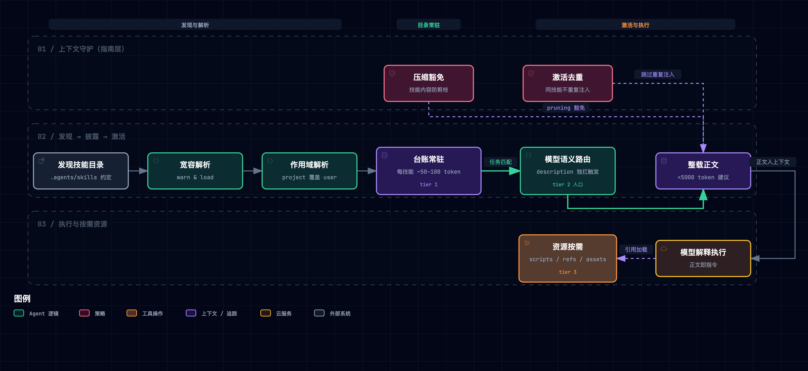
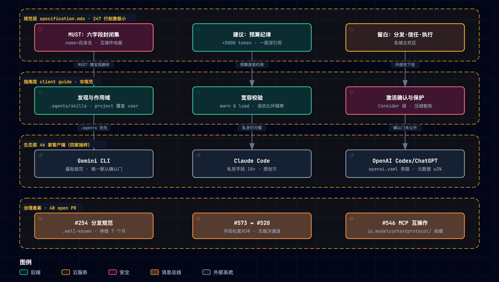

# Agent Skills 开放规范精读笔记（重学版）

> [agentskills, "Agent Skills Specification," agentskills.io, 2026, accessed 2026-09-26](https://agentskills.io/specification) · 规范仓 [agentskills/agentskills](https://github.com/agentskills/agentskills) 钉点 `69ef37e9`（2026-08-09，此后至 2026-09-26 零提交；代码 Apache-2.0、文档 CC-BY-4.0）· 官方指南 6 篇（quickstart / best-practices / optimizing-descriptions / evaluating-skills / using-scripts / adding-skills-support）· 生态抽样：[Claude Code](https://code.claude.com/docs/en/skills)、[OpenAI Codex/ChatGPT](https://developers.openai.com/codex/skills/)、[Gemini CLI](https://github.com/google-gemini/gemini-cli/blob/main/docs/cli/skills.md)、[VS Code Copilot](https://code.visualstudio.com/docs/copilot/customization/agent-skills)（均 accessed 2026-09-26）。上一轮精读见 [090](./090-agent-skills-spec.md)/[091](./091-agent-skills-mapping-negentropy.md)（同一钉点；本轮**完全重来**：新类比体系、新规律分解、新实验组，旧结论仅作复核对照）。

**一句话定位**：Agent Skills 是一个刻意做小的知识打包开放标准——一个文件夹 + 一个 SKILL.md（六字段 YAML 头 + 自由正文），用「目录常驻、按需整载」把模型的知识成本从装机量改成使用量，用一根 description 字符串独扛路由，把分发、信任、执行全部留在标准之外；**而这些留白恰恰是它被 46 家客户端（含全部竞争对手）采纳的原因**。

**总类比：知识的港口（海运集装箱体系）**。标准（=ISO 668）只规定箱体角件（=frontmatter 六字段），不管箱内装什么（=正文自由）、不管船走哪条航线（=发现路径留给客户端约定）、不管海关检疫（=信任层各港自理）。技能包=集装箱（箱内装的是**作业指导书+工具**，不是货）；name=箱号铭牌必须与舱位登记名逐字一致（=目录名）；description=货签面单；catalog=调度室船期表台账（每箱一行，~100 token 常驻）；激活=提箱开箱（整册上台）；tier-3 资源=箱内隔层；客户端=港口；模型=调度员兼作业组长（先读台账决定提哪箱、开箱后按册作业）；`.agents/skills`=各港互认的堆场布局约定；信任=海关检疫（ISO 不管）；skills-ref=官方验箱师（只验箱体不验货，手册与 ISO 条文有 13 处出入）。完整单射映射表（全篇类比唯一事实源）：

> [!TIP]
> | 技术实体 | 港口角色 | 同构依据 |
> | --- | --- | --- |
> | 技能包（folder+SKILL.md） | 集装箱（箱内是**作业指导书+工具**） | 标准化知识载体单元 |
> | frontmatter 六字段 | 箱体角件与标贴 | 唯一被标准化的部分 |
> | name | 箱号铭牌=舱位登记名 | 身份借登记系统（文件系统） |
> | description | 货签面单 | 路由决策的全部信息 |
> | catalog（tier 1 常驻） | 船期表台账 | ~50–100 token/技能常驻 |
> | 激活（tier 2 整载） | 提箱开箱 | 正文整载入上下文 |
> | 资源（tier 3 按需） | 箱内隔层工具 | references/scripts/assets |
> | 客户端 | 港口（自己的吊机与章程） | 实现自由，标准只管箱体 |
> | 模型 | 调度员兼作业组长 | 同一模型先路由后执行 |
> | 规范 | ISO 668（只定角件） | 刻意极简主义 |
> | `.agents/skills` | 各港互认的堆场布局 | 事实互操作锚点 |
> | 信任层（缺位） | 海关检疫（ISO 不管） | Consider 而非 MUST |
> | skills-ref | 官方验箱师 | 只验箱体不验货，与条文有 13 处出入 |

<details>
<summary>遴选纪要（44 候选 → 决赛圈 → 定锚）</summary>

11 域 44 候选脑暴（邮政物流/餐饮零售/师徒教育/城市建筑/交通出行/信息科技/自然生态/体育竞技/侦探破案/金融收藏/出版文化，每域 ≥3）；一票否决 3 项（孢子因果不同构、git hooks 机制不同构、闭架索引与旧版剧场近亲）；决赛圈五维加权（贴切 25%/传神 25%/生动 20%/覆盖 20%/低失配 10%）：集装箱港口 4.65 > 驾驶舱 QRH 4.08 > 菜谱盒 3.85；压力测试 12 实体全有自然角色、断点 2 处（evals→子类比区、压缩保护→术语直讲）。失配边界：集装箱运「物」vs 技能传「行」——以「箱内是作业指导书」在剧场内消解；港口多主体 vs 单模型——调度员兼组长单射。

</details>

**怎么读**：§1–2 是问题与全貌；§3–8 六个机制节一律「类比 → 机制 → 原型实景」（实景引自 [agent_skills_lab2.py](./assets/agent_skills_lab2.py) 实际运行日志，token 为 chars/4 近似口径仅作同口径相对比较）；§9 规律与争议；§11 可亲手重跑。引用记号：`S:` 指 [specification.mdx](https://github.com/agentskills/agentskills/blob/69ef37e9424c0a7ea9dd2293b559e43ec8176379/docs/specification.mdx)、`G:` 指客户端指南 [adding-skills-support.mdx](https://github.com/agentskills/agentskills/blob/69ef37e9424c0a7ea9dd2293b559e43ec8176379/docs/client-implementation/adding-skills-support.mdx)、`D:` 指官方 skill-creation 指南四篇、`V:`/`P:`/`T:` 指 skills-ref 的 validator/parser/prompt 源码（均钉 `69ef37e9`）。

## 1. 它要解决什么问题

模型通识能干，但「把活干对」的工序上下文——团队规矩、领域惯例、工具链细节、踩过的坑——每次会话都要重建。两条老路都死：让模型自己猜（不可靠），把全部手册塞进开场白（成本随**装机量**增长：20 个技能 × 3000 token ≈ 60k token 常驻，且彼此稀释注意力）。Agent Skills 的设计规格：

| 规格 | 通俗版 | 对应机制 |
| --- | --- | --- |
| 成本按使用付费 | 台账一行常驻，提箱才占作业台 | 三级渐进披露（§4） |
| 身份去中心 | 箱号=舱位登记名，无需注册中心 | name=目录名（§3） |
| 路由一句话 | 分拣员只看货签 | description 独扛触发（§5） |
| 格式极小可被竞对采纳 | ISO 只定角件 | 六字段+留白（§3/§8） |
| 知识可携带 | 同一箱全球港口通用 | 文件夹即包，git 即分发半层（§8） |

## 2. 全貌解剖

| 层级 | 部分 | 回答的问题 | 性质 |
| --- | --- | --- | --- |
| T1 格式契约 | 目录结构、六字段、渐进披露、一层深引用、validate | 「包里装什么」 | 精读 |
| T1' 客户端契约（指南层，非规范） | 发现路径约定、宽容解析、目录注入、激活双通道、压缩保护、allowlist | 「港口怎么用箱」 | 精读 |
| T2 证据链 | 46 家四家实测、token 成本结构、48 条 PR 动向、X1–X5 实验 | 标准真的运转了吗 | 评判 |
| T3 领域坐标 | vs MCP（SEP-2640 Skills over MCP 工作组）、vs AGENTS.md、vs 传统插件 | 版图位置 | 地图 |

因果脉络链：观察（工序知识每次会话重建）→ 归因（上下文稀缺且按会话计价；预载成本随装机量增长）→ 设计规格（按使用付费 / 身份路由去中心 / 极小才被采纳）→ 机制（发现→披露→激活→执行→生命周期）→ 证据（四家五问实测口径、成本结构、PR 四向压力、X1–X5 实测退化）。

学习焦点排序：F1 渐进披露经济学（格式存在的理由）→ F2 description 独扛路由（写法工艺+评测法）→ F3 信任真空的结构 → F4 极简主义与生态采纳的因果 → F5 规范↔实现↔生态三层漂移。

## 3. 机制一：包格式与身份——角件与箱号

**类比**：ISO 只定角件与箱号规则；箱号必须与舱位登记名逐字一致，登记系统（文件系统）免费送唯一性。

**机制**：技能=目录；唯一必需文件 SKILL.md；`scripts/`/`references/`/`assets/` 是组织建议非强制。frontmatter 六字段：`name`（必填，1–64 字符、小写字母数字连字符、无首尾/连续连字符、**必须等于目录名**）、`description`（必填，≤1024 字符，写「做什么+何时用」）、`license` / `compatibility`（≤500）/ `metadata`（string→string）/ `allowed-tools`（空格分隔、实验性、"support may vary"）。正文「no format restrictions」；文件引用相对技能根、一层深；`skills-ref validate` 校验。治理宪法在仓 AGENTS.md：「Keep the format small: new requirements … should address demonstrated interoperability needs, not hypothetical completeness」。

**原型实景（X1）**：拆除「name=目录名 + 作用域优先级（project 覆盖 user，机制见 §6）」后，两个扫描顺序不同的客户端对同一堆技能目录解析出的**同名不同版**：

```text
实际运行日志（uv run --no-project python agent_skills_lab2.py --break X1）：
[X1] 拆除 project>user 优先级（纯按扫描序解析） -> 客户端A(字典序) 与 客户端B(目录长度序)
同名不同版的技能 2 项：{'release-notes': ('project', 'user'),
'same-scope-dupe': ('project', 'project2')} —— 同一任务两家加载不同版本，
行为跨客户端不可复现（identity 由扫描顺序决定）
```

教训：身份不锚定在规范层（name=目录名 MUST + 作用域优先级约定），就锚定在文件系统的偶然属性（枚举顺序）上。

## 4. 机制二：三级渐进披露——按使用付费的经济学

**类比**：船期表台账每箱一行常驻调度室（便宜、天天看）；拆箱才把整册作业书搬上作业台；箱内隔层工具用到哪层取哪层。

**机制**：①元数据（name+description，即「目录」catalog——港口剧场的船期表台账，下文统称台账，~50–100 token/技能）会话开始常驻；②激活时整载正文（建议 <5000 token / <500 行）；③`scripts/`/`references/`/`assets/` 按需加载。OpenAI ChatGPT 侧给同一定律的实现口径：技能元数据合计 ≤ 上下文窗口 **2% 或 8000 字符**，超限先截短 description——独立实现的同一预算纪律，是该机制跨厂商成立的最强旁证。

**原型实景**：玩具目录 10 只技能，台账常驻 ≈ 数百 token（近似口径），全载正文为台账的 4 倍以上；selftest 断言 `total_bodies > 4 * tokens`（成本结构成立）。上一轮在 20 技能规模实测：全载 39,222 vs 台账 2,321 token（**16.9×**）；其 B1 拆除实验（含破坏样本）为 16.3×（090 §9，本轮不重跑、直接引用）。




*运行相：[图源 .mmd](../../assets/mermaid/agent-infra/agent-skills-disclosure-lifecycle.mmd) · [交互版 HTML](../../assets/architecture/agent-infra/agent-skills--disclosure-lifecycle.html)*

## 5. 机制三：一根字符串的路由——货签工艺

**类比**：分拣员（模型）只凭货签决定提哪箱；「内装货物」四个字的面单永远没人提。

**机制**：主流实现是模型读 catalog 语义自判（client guide：most implementations rely on the model's own judgment … rather than harness-side trigger matching）。description 是路由决策的**全部**信息面。官方工艺（optimizing-descriptions 指南）：祈使句写「Use when…」；覆盖用户不说关键词的场景；**近失配负例**（near-miss）比无关负例有效；~20 query × 3 run 算 trigger rate（0.5 阈值）；train/validation 6:4 分割防过拟合；**按验证集选优——最优迭代未必是最后一版**。不可触发面：一行 description 合规却永不命中（"Helps with PDFs."），静默退化无任何报错。

**本体论细节**：agents 通常只为「超出自身能力」的任务查技能——"read this PDF" 可能不触发 PDF 技能，因为基础工具就够；真正的价值区是陌生 API、领域工序、罕见格式。

## 6. 机制四：多客户端集成面——堆场、遮蔽与宽容

**类比**：各港自己的堆场布局（发现路径）、两个堆场同名箱就近优先（遮蔽）、验箱从严还是从宽各自章程（宽容度）。

**机制**（均属**指南层** `G`，非规范）：

- **发现**：扫 project/user 级客户端专属目录 + `.agents/skills/` 互操作约定（部分兼容扫 `.claude/skills/`）。
- **同名解析**：project 覆盖 user 是 universal convention；同作用域内 first/last-found 任选但须稳定，并 **log a warning**（shadowed）。
- **宽容校验**：name 不匹配/超长 warn & load，description 缺失才跳过（"deliberately relaxes these to improve compatibility"）。
- **激活双通道**：模型读文件 / 专用工具（`activate_skill` 参数收敛为枚举防幻觉名）+ 用户显式 `/skill-name`。
- **生命周期**：压缩保护（技能内容 exempt from pruning，丢失即静默降级）、激活去重、子代理委托（skill 在独立子代理会话执行）。

**原型实景（X2/X5）**：

```text
实际运行日志（--break X2）：12 只技能中严格口径拒载 4 只（extra-field / name-mismatch /
long-name / empty-desc），宽容口径全数可载 12 只 —— 严格门把「为别人客户端写的技能」
整体拒之门外，互操作面损失 33%
实际运行日志（--break X5）：有效目录仍为 10 项（功能不变），但 1 处遮蔽对用户不可见：
「agent 用的是哪一版」成为静默分歧 —— 事故形态是知情权丢失而非数据丢失
```

## 7. 机制五：被解释的文本——安全面在哪

**类比**：箱内是作业指导书，工人照单作业；一张恶意指导书不需要「运行」就能让工人把货卸错地方。

**机制**：正文是写给模型的指令，模型自己执行；带 `scripts/` 也只是「指导书叫模型去开机器」（经工具调用与权限层）。因此信任对象与传统插件完全不同——不是「代码无害」而是「文本不被恶意利用」。规范正文**无安全章节**；客户端指南仅 "Consider gating project-level skill loading on a trust check"；四家实测（2026-09-26）：**仅 Gemini CLI 默认逐技能确认门**（激活前 UI 展示技能名/用途/将授权的目录）；Claude Code 的 `allowed-tools` 明示不受 workspace trust 门控；四家均无签名/来源校验。skills-ref 的 `html.escape` 只防显示层。

**原型实景（X4，上一轮映射报告 [091-M5](./091-agent-skills-mapping-negentropy.md)「目录注入防护」项的首次实测）**：

```text
实际运行日志（--break X4）：description 内嵌「缩进伪字段」通过宽容解析混入元数据 ->
注入文本进入 frontmatter 区=True；解析后 allowed-tools/Bash(rm:*) 泄漏进字段=True ——
若客户端把 allowed-tools 当预授权读，恶意预授权经由 description 通道成立
（转义/行锚定缺失的实测代价）
```

## 8. 机制六：生态与治理——46 家就范与四个悬而未决

**采纳**：Client Showcase 46 家（源码级清点，含 Claude/Claude Code、ChatGPT & Codex、Gemini CLI、GitHub Copilot、VS Code、Cursor、JetBrains Junie、OpenHands、Goose、Spring AI、Snowflake、Pulumi 等；格式由 Anthropic 发起后开放）。收录门槛（CONTRIBUTING）要求产品**当下可发现并执行技能**（不接受宣布意向），logo 由 Anthropic 团队审——所以这是「自报+审核」名单，不保证实现深度。四家实测差异：Gemini 最贴规范（仅 name/description，且 `.agents/skills` 别名优先）；Claude Code 私货字段最多（`context: fork`/`agent`/`paths`/`hooks` 等 10+）；OpenAI frontmatter 最小但用 `agents/openai.yaml` 旁路承载策略；VS Code 复用 CC 字段语义、路径通吃 `.github/.claude/.agents`。

**治理实况（48 条 open PR，2026-09-26 编目）**：四向压力——①分发与版本化是最大缺口（#254 `.well-known` 分发规范停摆 7 个月、#380 semver 版本化排队其后）；②字段语义松紧对冲并存（#573 放宽 allowed-tools 允许 YAML 数组 vs #520 锁死空格串，无人裁决）；③跨规范互操作阻力最小（#546 为 MCP SEP-2640 保留 `io.modelcontextprotocol/` metadata 前缀；#169 JSON Schema、#500 Python SDK——机器可读化是明牌）；④维护带宽不足（三份重复的 skills-ref UTF-8 修复挂 5 个月）。**判定：标准大概率「先成事实、后补条文」**——正如集装箱史：箱体标准先行，海关协作（CSI）与航线联盟是几十年后的事故倒逼产物。

**原型实景（X3，metadata 私货通道的暗面）**：规范给私货留了唯一正门 `metadata`（string→string），解析端普遍 str() 强转——

```text
实际运行日志（--break X3）：作者写 enabled: false；解析后得到字符串 'false'；
客户端 bool('false') == True —— 被禁用的技能被判定为启用。
强转让「类型即语义」的配置在跨端往返后翻转
```




*治理相：[图源 .mmd](../../assets/mermaid/agent-infra/agent-skills-governance-layers.mmd) · [交互版 HTML](../../assets/architecture/agent-infra/agent-skills--governance-layers.html)*

## 9. 底层规律与核心争议

五条规律（正交分解：**载体 / 经济 / 控制 / 本体 / 治理**，恰为五个独立变化轴）：

1. **身份与载体借道文件系统**——目录即单元、name=目录名，登记免费、git 即半层分发。拆除→身份由扫描顺序决定（X1 实测）。
2. **知识装载按使用付费**——三级披露把成本函数从装机量换成使用量；OpenAI 2%/8000 字符预算是跨厂商旁证。
3. **路由是一根语义字符串**——description 独扛触发，写法=「做什么+何时用+边界」，近失配负例验证、按验证集选优。
4. **技能是被解释的文本，不是被执行的代码**——执行者是模型；信任对象是「文本不被恶意利用」；注入面在目录与正文两处（X4 实测）。
5. **互操作压倒完备**——MUST（跨端互操作地基）/建议（作者自担）/留白（各端主权）三档按外部性分层；管得越少越被采纳，代价是治理债（对冲 PR 并存、分发停摆）。

三个争议：

- **严格校验 vs 宽容加载**：两派取样不同（坏技能污染目录的尾部风险 vs 误杀他端技能的日常摩擦）；本质是「互操作最小公分母 vs 客户端差异化」的连续谱选址；工程可调和（`--allow-field`、metadata 正门），治理缺裁决通道是真问题。
- **模型自主路由 vs 显式点名**：注意力控制权分配——概率性语义泛化 vs 确定性人工控制；`disable-model-invocation` 类开关的存在=标准承认两派都真实；残差是信任分配，不可消除。
- **信任真空谁来填**：安全是公共品而采纳是私利；极简标准把安全外部性推给客户端；四家仅 Gemini 设默认门；签名/digest 提案停摆。判定：等一次标志性注入事故倒逼（集装箱 CSI 的历史原型）。

## 10. 关键实证数字

| 实验/口径 | 关键数字 | 一句话读法 |
| --- | --- | --- |
| X1 拆作用域优先级 | 2/10 技能同名不同版跨客户端漂移 | 身份不锚规范就锚扫描序 |
| X2 严格 vs 宽容 | 严格拒 4/12（33% 互操作面损失） | 严格门的代价是他端技能 |
| X3 metadata 强转 | `bool('false') == True` | 类型即语义，往返即翻转 |
| X4 换行伪字段注入 | allowed-tools 伪字段泄漏=True | M5 首测：description 是注入面 |
| X5 去遮蔽告警 | 1 处遮蔽 0 可见 | 事故形态=知情权丢失 |
| 090 §9（引用） | 全载/台账 16.9×；B1 拆除 16.3× | 台账与全载的成本比（含破坏样本口径） |
| OpenAI ChatGPT 口径 | 元数据 ≤ 窗口 2% 或 8000 字符 | 同一预算纪律的独立实现 |
| catalog 常驻 | ~50–100 token/技能（官方） | 台账一行的价格 |
| 正文预算 | <5000 token / <500 行（建议） | 开箱一次的作业台占用 |
| 生态 showcase | 46 家客户端（源码清点） | 自报+审核名单，非深度保证 |
| 治理 | 48 open PR；#254 停摆 7 个月 | 分发是最大缺口 |

## 11. 动手实验室

- 运行：`cd .temp/agent-skills-lab2 && uv run --no-project python agent_skills_lab2.py --selftest`（无 uv 用 python3；秒级）。入库副本 [assets/agent_skills_lab2.py](./assets/agent_skills_lab2.py)（含 13 只 fixture 技能：正常/野生风格/恶意/边缘；`--break X1..X5` 单拆一机制；`--audit-repo <dir>` 对盘上技能跑 strict/lenient 对照——本仓 `.agent/skills` 实测全 OK）。
- 机制→代码速查：`parse_frontmatter`（解析+str() 强转）/ `validate_spec`（规范 MUST）/ `validate_lenient`（指南口径）/ `resolve_scopes`（作用域优先级+遮蔽+撞名裁决）/ `build_catalog`（台账成本）/ `route`（确定性路由 mock）/ `break_x`（五实验）。
- X1–X5 三件套（改了什么/实测/教训）见 §3/§6/§7/§8 内嵌日志；逐条退化表如上。

## 12. 批判性边界（材料未证明的 5 件事）

1. 渐进披露的收益**无官方量化基准**——~100 token、<5000 token 均为工程约定；16.9×（090）与 >4×（本轮 lab2 selftest 断言）是两个自建玩具口径。
2. 「模型自主路由优于规则触发」**无对照实验**——指南只有断言；确定性场景的需求被让位。
3. 46 家 showcase 是**自报+logo 审核**名单——不保证实现深度与一致性（四家已见 10+ 私货字段、发现路径四套并存）。
4. 安全 "Consider" 的**实际效果未知**——四家仅一家默认确认门；项目级技能注入风险在规范层零机制。
5. 极简治理的**长期效能未验证**——对冲提案并存、分发停摆、修复悬置；「先成事实后补条文」是推断不是证明。

## 13. 研究范围与《费曼考评实录》

**研究范围**：输入=技能目录（SKILL.md+可选资源），输出=注入模型上下文的指令与可执行资源；假设=具备文件读取与工具执行能力的 LLM agent。成立工况：本地/沙箱可访问文件系统、知识可文字化、任务-技能匹配可由描述语义承载。**Out-of-Scope（勿外推）**：分发与版本（仍是提案）、签名与来源验证、权限强制执行（allowed-tools 实验性）、运行时 API/多 agent 语义、一切性能与安全基准。

**实录（Learner Subagent 全程代管，双代理对抗协议）**：

- **Phase 0 门槛自测**：3 题全对（上下文成本三重代价+按需调页直觉 / 语义路由 vs 正则 / 文件系统即注册表），无阻塞盲区。
- **Phase 1 脉络复述 + 2 因果题**：复述零失配；「极简↔采纳」答出「入盟成本趋零+把吓跑港口的决策权主动归还+规定死就沦为阵营、互通价值归零」；「严格度分层」答出外部性分层（角件错=跨港传染所以 MUST，面单丑=箱主自担所以建议，海关=主权区所以留白）。甲类比一次定锚，未触发回退。
- **Phase 2c 费曼三维考评**：题 1（白话转述）用「管家口袋清单」剧场把三级披露讲给外行并诚实交代「两行都写修东西会开错箱」；题 2（最近邻差异）三条轴判明与传统插件的本质差异——「manifest 是机器契约、SKILL.md 是语义说明书」「300 个扩展撑爆内存，300 个技能撑爆判断力」「代码安全 vs 对抗文本」；题 3（极限推演）预测 300 技能/5000 人公司两个崩溃点（描述趋同→路由退化；无版本锁定→静默变脑）并给出可证伪实验（100 任务金标 × 30/150/300 三档 × 5 run，判定阈值 15pp）。
- **诊断与复考**：题 3 暴露一处**边界模糊**——把跨作用域重名说成「互相覆盖」（实为 project-over-user 遮蔽+告警约定）。三板斧补课（双堆场微类比 / 唯一性作用域=单父目录的第一性因果 / 指南原文 shadowed+log a warning 反例）后，同构变式复考（连锁餐厅私改菜谱场景）全绿：就近裁决双向正确、合规告警要求（点名生效版/被遮蔽版/路径+清单披露命中来源）完整。**出闸：全绿。**

## 14. 用户自测与费曼研讨套件

1. 你的同事说：「既然 description 是路由的全部信息，那把 1024 字符写满关键词，触发率一定最高。」哪里错了？（提示：想想 near-miss 负例与「pushy」的边界，以及 OpenAI 的 2% 预算对满写策略的惩罚。）
2. 如果明天 OpenAI 与 Anthropic 各自给 SKILL.md 加一个互不兼容的必填字段，46 家生态会发生什么？用「互操作压倒完备」规律推演三轮：客户端、技能作者、标准仓库各自的第一反应。（对照材料：#573 vs #520 对冲、metadata 正门、AGENTS.md 宪法条。）
3. X4 证明 description 通道可注入伪 allowed-tools。仅靠客户端能否根治？分别评估三道防线（激活确认门 / 目录构建时行锚定+转义 / 签名与 digest 分发）各自的成本、有效性与「谁出钱」问题。

## 15. 与本仓的关联

机制映射（含 ISSUE-194 复核、X4 对 M5 防护的落地建议）见 [211-agent-skills-mapping-negentropy.md](./211-agent-skills-mapping-negentropy.md)。上一轮映射 [091](./091-agent-skills-mapping-negentropy.md) 的 13 条判定与本轮差异在 211 末尾对账。

## 参考（IEEE）

[1] agentskills, "Agent Skills Specification," agentskills.io. [Online]. Available: https://agentskills.io/specification. Accessed: 2026-09-26（钉点 `69ef37e9`）.
[2] agentskills, "Adding skills support to your agent," agentskills.io. [Online]. Available: https://agentskills.io/client-implementation/adding-skills-support. Accessed: 2026-09-26.
[3] agentskills, "Optimizing skill descriptions," "Evaluating skill output quality," "Best practices for skill creators," "Using scripts in skills," agentskills.io. Accessed: 2026-09-26.
[4] Anthropic, "Claude Code Skills documentation," code.claude.com. [Online]. Available: https://code.claude.com/docs/en/skills. Accessed: 2026-09-26.
[5] OpenAI, "Codex Skills," developers.openai.com. [Online]. Available: https://developers.openai.com/codex/skills/. Accessed: 2026-09-26.
[6] Google, "Gemini CLI Skills," github.com/google-gemini/gemini-cli. [Online]. Available: https://github.com/google-gemini/gemini-cli/blob/main/docs/cli/skills.md. Accessed: 2026-09-26.
[7] Microsoft, "Agent Skills in VS Code," code.visualstudio.com. [Online]. Available: https://code.visualstudio.com/docs/copilot/customization/agent-skills. Accessed: 2026-09-26.
[8] 集装箱标准史对照：ISO 668:2020 Series 1 freight containers；M. Levinson, *The Box*, Princeton Univ. Press, 2006（类比锚点，非技术信源）.
