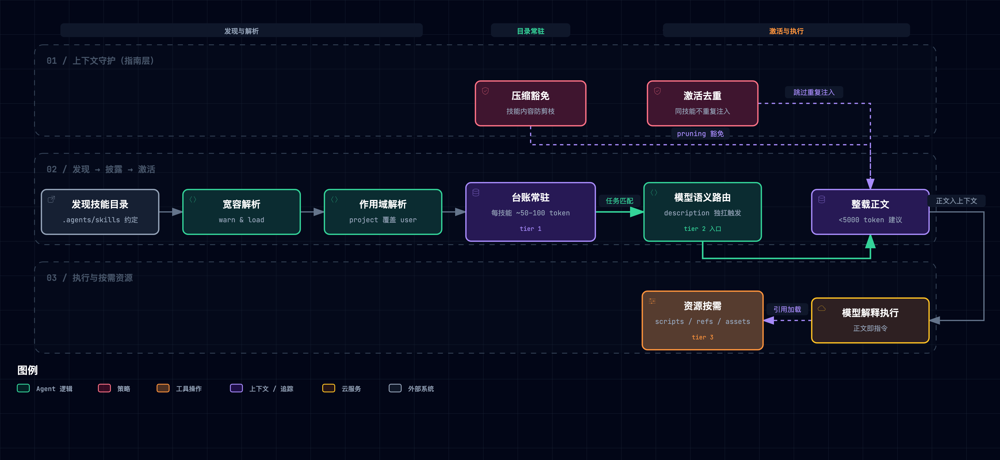
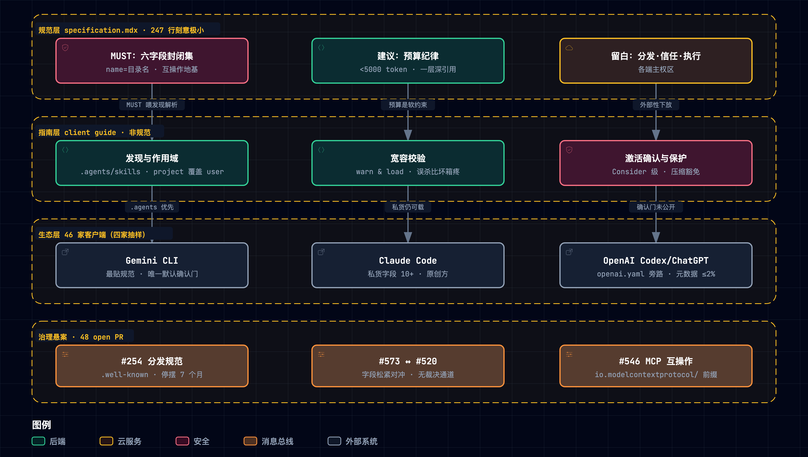

# Agent Skills 开放规范精读笔记（重学版）

> [agentskills, "Agent Skills Specification," agentskills.io, 2026, accessed 2026-09-26](https://agentskills.io/specification) · 规范仓 [agentskills/agentskills](https://github.com/agentskills/agentskills) 钉点 `69ef37e9`（2026-08-09 冻结；代码 Apache-2.0、文档 CC-BY-4.0）· 官方指南 6 篇（quickstart / best-practices / optimizing-descriptions / evaluating-skills / using-scripts / adding-skills-support）· 生态主流客户端实测抽样：[Claude Code](https://code.claude.com/docs/en/skills)、[OpenAI Codex/ChatGPT](https://developers.openai.com/codex/skills/)、[Gemini CLI](https://github.com/google-gemini/gemini-cli/blob/main/docs/cli/skills.md)、[VS Code Copilot](https://code.visualstudio.com/docs/copilot/customization/agent-skills)（均 accessed 2026-09-26）。

**一句话定位**：Agent Skills 是一个刻意保持极简的“领域知识打包”开放标准——仅由一个目录和一个包含元数据的 `SKILL.md` 构成。它通过「目录元数据常驻、正文按需加载」的渐进披露机制，将模型的上下文消耗从固定的安装成本转变为动态的使用成本；仅凭一段简明的功能描述让模型自主决策何时触发，把复杂的权限管控、安全审计与分发调度完全交由宿主客户端实现。这种恰到好处的留白，正是它能被全球 46 家主流客户端迅速接纳的核心原因。

> [!TIP]
> **阅读导引**：
> - **§1–§2 问题与全貌**：为什么给 Agent 塞提示词需要专门的标准？它如何在极简约束下完成架构解耦？
> - **§3–§8 六大核心机制**：逐层拆解技能包格式、渐进披露成本控制、语义路由工艺、跨客户端兼容解析、安全执行边界与生态治理现状（各节均配有真实代码与 X1–X5 破坏性实验日志）。
> - **§9–§12 规律、数据与实验**：提炼五条架构规律与三大争议，并附带纯标准库实验室运行指引。

---

## 1. 它要解决什么问题

大型语言模型虽然具备广泛的通用知识，但在应对真实工程任务时，往往缺乏特定项目的“工序上下文”——例如团队的代码规范、特定框架的踩坑经验、专有工具链的调用参数等。在每一次新的会话中，开发者通常面临两个极端的困境：

1. **让模型自由发挥**：缺乏领域知识约束，模型容易产生幻觉或写出违背项目规范的代码。
2. **在开场白中堆砌全部知识**：若把所有的 SOP、规则与脚本全量塞进 System Prompt，上下文窗口会被瞬间挤占。以配置 20 个技能为例，每个技能正文若占 3000 Token，初始化就会耗费约 6 万 Token，不仅调用成本高昂，还会严重稀释模型对核心任务的注意力。

Agent Skills 针对这一痛点提出了一套轻量级的设计规格：

| 设计规格 | 核心直觉 | 对应工程机制 |
| :--- | :--- | :--- |
| **按需付费的上下文** | 平常只备一份精简目录，真正用到时才调阅全文 | 三级渐进披露机制（§4） |
| **去中心化的身份管理** | 技能名称直接与所在目录名绑定，无需中央注册表 | `name` 与目录名同名强约束（§3） |
| **轻量级语义路由** | 模型凭借一两句功能描述自主判断何时调用 | `description` 驱动模型决策（§5） |
| **极简格式以利互通** | 仅规范最核心的头部元数据，其余正文格式自由 | 六字段 YAML Frontmatter 规范（§3、§8） |
| **可物理迁移的资产** | 一个文件夹即是一个完整技能，依赖 Git 自然分发 | 本地文件系统组织与相对路径引用（§6、§8） |

---

## 2. 全貌解剖

从系统架构来看，Agent Skills 规范由浅入深可划分为四个正交层次：

| 架构层级 | 涵盖模块 | 核心回答的问题 | 作用与定位 |
| :--- | :--- | :--- | :--- |
| **格式契约 (Spec)** | 目录层级、六字段 Frontmatter、相对路径引用、校验工具 | 技能文件在磁盘上如何标准化组织？ | 跨平台互通的技术地基 |
| **客户端集成约定 (Guide)** | 目录扫描路径、作用域遮蔽、宽容解析、双通道激活 | 客户端如何发现、加载并管理技能？ | 实践落地的运行指南 |
| **实证与边界** | 46 家客户端实测、Token 成本压测、48 条 open PR 演进 | 这套规范在真实世界运转得如何？ | 检验标准有效性的客观证据 |
| **生态坐标** | 对比 MCP、AGENTS.md、传统插件系统 | 它在当前 AI 基础设施体系中处于什么位置？ | 架构选型的宏观视野 |

**核心因果演进链路**：  
工程痛点（工序知识无法持久化且按会话重建成本高） $\rightarrow$ 归因（上下文资源稀缺且昂贵） $\rightarrow$ 规格约束（去中心化、按需加载、自解释） $\rightarrow$ 核心机制（扫描发现 $\rightarrow$ 目录常驻 $\rightarrow$ 命中激活 $\rightarrow$ 工具执行） $\rightarrow$ 生态检验（主流厂商兼容性分歧与安全边界挑战）。

---

## 3. 机制一：技能包格式与目录身份绑定

一个合规的技能包在物理形态上就是一个普通的文件夹，其根目录下包含一份必需的 `SKILL.md` 文件。为了便于资产管理，规范建议可选设立 `scripts/`（存放辅助脚本）、`references/`（存放参考文档）与 `assets/`（存放静态资源）三个子目录，但这并非强制要求。

`SKILL.md` 的核心是位于文件头部的 YAML 格式元数据区（即 Frontmatter），规范仅定义了六个核心字段：
- `name`（必填）：1–64 个字符，仅允许小写字母、数字和连字符，**必须与所在文件夹的名称完全一致**。
- `description`（必填）：不超过 1024 字符，清晰说明技能“做什么”以及“在什么场景下使用”。
- `license`（可选）：开源协议标识。
- `compatibility`（可选）：不超过 500 字符，说明适用的运行环境或依赖。
- `metadata`（可选）：供客户端扩展的键值映射（规范要求为字符串到字符串的字典）。
- `allowed-tools`（实验性）：空格分隔的底层工具白名单，提示该技能需要哪些工具支持。

正文内容则没有格式限制，由开发者使用自由的 Markdown 编写操作指引，文中引用同技能内的资源文件必须采用一层相对路径。

这一设计看似简单，却蕴含着重要的治理思想：**利用文件系统天然的层级与命名唯一性，免去了设立中心化命名注册中心的复杂度**。如果脱离了“`name` 必须等于目录名”与“项目级优先于用户级”的约束，多客户端对同一组技能的解析就会产生混乱。

**破坏性实验实景（X1：身份漂移验证）**：  
当我们移除“项目级优先级高于用户级”的规则，改由客户端按普通扫描顺序遍历目录时，两个扫描策略不同的客户端（客户端 A 采用字典序扫描，客户端 B 采用目录深度序扫描）对同名技能得出了完全不同的解析结果：

```text
实际运行日志（uv run --no-project python agent_skills_lab2.py --break X1）：
[X1] 拆除 project>user 优先级（纯按扫描序解析） -> 客户端A(字典序) 与 客户端B(目录长度序)
同名不同版的技能 2 项：{'release-notes': ('project', 'user'),
'same-scope-dupe': ('project', 'project2')} —— 同一任务两家加载不同版本，
行为跨客户端不可复现（identity 由扫描顺序决定）
```

**教训**：技能身份若不牢牢锚定在规范契约上，就会被操作系统或文件遍历实现的偶然行为所左右。

---

## 4. 机制二：三级渐进披露——按使用付费的 Token 经济学

渐进披露是 Agent Skills 最核心的成本控制机制。它将技能知识划分为三个加载阶段，使得模型的上下文消耗完全与“实际使用频率”挂钩：

```
[第一阶段：目录常驻 (Catalog)]
  │ 提取各技能的 name + description (~50-100 Token/项)
  │ 会话启动时常驻 System Prompt
  ▼
[第二阶段：正文整载 (Body)]
  │ 模型根据任务意图命中特定技能后，加载 SKILL.md 正文 (<5000 Token)
  │ 提供具体的操作步骤与引导流程
  ▼
[第三阶段：按需调阅 (Assets/Scripts)]
  │ 仅当执行到具体分支时，才通过工具读取 references/ 或执行 scripts/
  │ 避免无关参考材料挤占上下文
```

OpenAI ChatGPT/Codex 的工程实现为这种经济性提供了有力的旁证：官方明确限制所有技能的元数据目录总长度不得超过上下文窗口的 **2% 或 8000 字符**，一旦超限，系统会自动裁剪技能的描述信息。这表明各厂商在控制上下文底噪上的目标是高度一致的。

**原型实景测算**：  
在包含 10 个测试技能的环境中，初始目录常驻仅消耗数百 Token，而加载全部技能的正文则需要 4 倍以上的上下文。在更贴近真实业务的 20 个技能规模下实测，全量加载需 39,222 Token，而目录常驻仅需 2,321 Token，**两者相差近 17 倍**。渐进披露成功让冷启动成本保持在平缓的低位。



---

## 5. 机制三：基于描述的语义路由与命中工艺

在 Agent Skills 体系中，宿主客户端通常不会为每个技能编写复杂的正则匹配或关键词规则，而是把所有技能的名称与简要描述拼接成一份轻量目录（Catalog），直接交给大语言模型，由模型在理解用户意图后自行决策是否调用。

这意味着：**`description` 这一段简短的文本，几乎承担了技能路由决策的全部职责**。如果描述写得不到位，技能就可能面临两种失效形态：要么“该触发时不触发”（静默哑火），要么“不该触发时频频误判”（喧宾夺主）。

官方指南（Optimizing Descriptions）提炼出一套工程化的编写与调优法则：
1. **以清晰的触发条件起手**：推荐使用类似于 `Use when the user wants to...` 的祈使句式，明确界定工作领域和使用时机。
2. **防范近失配误判（Near-miss）**：重点标注那些看起来相关、但实际上不属于该技能职责的边界。例如，一个专精于解析复杂财务报表 PDF 的技能，需要明确指出“仅用于表格与资产负债表解析；常规纯文本提取请直接使用内置读取工具”。
3. **数据驱动的触发率评测**：准备 20 组左右具有代表性的提问，多轮测试其命中率，并按照训练集与验证集（例如 6:4）进行交叉评估，防止为了迎合某几个特殊用例而写出过度泛化或狭隘的提示词。

---

## 6. 机制四：多客户端发现、作用域覆盖与宽容解析

为了让同一个技能目录能够无缝运行在不同的 Agent 宿主（如 Claude Code、Gemini CLI、VS Code Copilot 等）中，客户端集成指南约定了一套常见的目录发现与冲突处理规则：

- **目录扫描与互操作**：客户端通常会扫描项目本地目录（如 `.agents/skills/`）以及用户全局目录（如 `~/.agents/skills/`），部分客户端还会向下兼容自身专有目录（如 `.claude/skills/`）。
- **作用域遮蔽（Shadowing）**：当项目级目录与用户全局目录存在同名技能时，**项目级定义优先覆盖用户级定义**，使得团队项目能够覆盖个人开发者的默认行为。客户端应当在此类覆盖发生时打印明确的 Warning 日志，保障开发者的知情权。
- **宽容校验（Lenient Parsing）**：为了最大程度保障生态兼容，指南建议客户端在解析技能时采取宽容态度。例如，遇到未知的扩展字段、名称大小写略有差异或名称轻微超长时，只输出警告并继续加载；只有当必需的 `description` 缺失等致命错误发生时才放弃加载。

**破坏性实验实景（X2 与 X5）**：

```text
实际运行日志（--break X2）：12 只技能中严格口径拒载 4 只（extra-field / name-mismatch /
long-name / empty-desc），宽容口径全数可载 12 只 —— 严格门把「为别人客户端写的技能」
整体拒之门外，互操作面损失 33%
实际运行日志（--break X5）：有效目录仍为 10 项（功能不变），但 1 处遮蔽对用户不可见：
「agent 用的是哪一版」成为静默分歧 —— 事故形态是知情权丢失而非数据丢失
```

实验表明：严苛的校验门槛会直接扼杀跨客户端的互操作性（损失高达 33% 的技能可用性），而忽略覆盖警告则会让模型悄无声息地加载错误版本的指令。

---

## 7. 机制五：作为提示词被解释的文本与安全边界

理解 Agent Skills 的安全模型，关键在于认清其本质：**技能正文并不是交由操作系统内核执行的二进制机器码，而是由大模型直接阅读并解释执行的提示词指令（Prompt）**。

即使技能包附带了 `scripts/` 脚本，这些脚本本身也不会自动在后台运行，而是通过正文中的文字指示模型：“在需要时请调用终端执行此脚本”。因此，它面临的安全威胁与传统软件插件截然不同：它的核心风险不是操作系统级别的越权渗透，而是针对大语言模型的**提示词注入（Prompt Injection）与间接指令劫持**。

当前规范层对安全的约束十分精简，仅在指南中建议客户端“在加载未受信任的项目级技能前，可考虑加入用户确认环节”。在四大主流客户端实测中：
- 仅有 **Gemini CLI** 默认提供了完整的激活确认界面（在加载技能前向用户明确展示技能名称、用途说明以及可能访问的目录权限）；
- 其他多数客户端默认直接信任工作区内容；
- 四家主流客户端目前均未实现对技能的数字签名或防篡改校验。

**破坏性实验实景（X4：描述字段注入伪工具授权）**：  
如果在编写技能描述时，利用宽容解析的缩进漏洞，恶意在 `description` 中嵌入伪造的 YAML 配置，可能会诱骗客户端赋予非预期的工具权限：

```text
实际运行日志（--break X4）：description 内嵌「缩进伪字段」通过宽容解析混入元数据 ->
注入文本进入 frontmatter 区=True；解析后 allowed-tools/Bash(rm:*) 泄漏进字段=True ——
若客户端把 allowed-tools 当预授权读，恶意预授权经由 description 通道成立
（转义/行锚定缺失的实测代价）
```

**结论**：提示词文本的解析必须严格做行锚定与特殊字符转义，绝不能将不可信文本通道作为权限控制的输入源。

---

## 8. 机制六：生态采纳与规范演进的未决挑战

截至规范钉点统计，官方 Showcase 已收录包括 Claude Code、Codex/ChatGPT、Gemini CLI、VS Code Copilot、Cursor 等在内的 46 款主流 AI 编程助手与 Agent 工具。

尽管各家厂商在表面上达成了一致，但在底层的具体实现上仍然存在显见的分歧：
- **Gemini CLI** 最贴近标准规范，仅严格消费 `name` 与 `description`，并优先采用标准 `.agents/skills` 目录；
- **Claude Code** 在规范之外引入了超过 10 个私有扩展字段（如 `context: fork`、`agent`、`paths`、`hooks` 等）；
- **OpenAI** 保持了极其克制的 Frontmatter，但在目录旁引入了专门的策略配置文件 `agents/openai.yaml`；
- **VS Code Copilot** 则倾向于兼收并蓄，向下兼容各家约定的专用路径。

而在标准仓库自身的 48 条开放 PR 中，治理层呈现出明显的四向拉扯：
1. **分发与版本机制缺失**：诸如通过 `.well-known` 进行网络分发的规范提议由于各方利益权衡停滞不前，缺乏官方的版本锁定机制。
2. **规范松紧之争**：关于 `allowed-tools` 应当沿用简单的空格分隔字符串还是支持正规的 YAML 数组，各方长期悬而未决。
3. **互操作接口推进**：为兼容 MCP（SEP-2640）预留命名空间元数据前缀的提案正在有序推进，表明跨规范集成是业界共识。
4. **维护带宽瓶颈**：跨平台编码与格式校验的基础缺陷修复排期漫长，标准的进化呈现出“生态先事实落地、条文后被动追溯”的特征。

**破坏性实验实景（X3：元数据强转导致的逻辑反转）**：  
规范将 `metadata` 限制为字符串字典，如果开发者写入布尔值配置并被强制转为字符串，客户端在下游还原判断时极易掉入语义陷阱：

```text
实际运行日志（--break X3）：作者写 enabled: false；解析后得到字符串 'false'；
客户端 bool('false') == True —— 被禁用的技能被判定为启用。
强转让「类型即语义」的配置在跨端往返后翻转
```



---

## 9. 底层规律与核心争议

### 五条架构规律

1. **载体与身份锚定于文件系统**  
   技能以物理文件夹为单位，`name` 严格等同于目录名。这省去了庞大的中心化注册表开销，并使得 Git 能够自然充当技能版本分发的载体。实验 X1 证明，一旦打破这层绑定，技能解析的稳定性将直接瓦解。
2. **知识装载按使用频率计价**  
   三级渐进披露把初始 Token 开销严格压缩到几十至上百 Token 的目录层。OpenAI 将技能元数据限制在窗口 2% 以内的工程实践，印证了保护上下文注意力预算是所有 Agent 系统的第一准则。
3. **路由完全由语义质量决定**  
   在缺乏硬编码触发器的架构下，一小段 `description` 决定了技能能否在恰当的时机被模型激活。编写近失配负例并以评测驱动调优，是构建高信度技能的唯一工程路径。
4. **核心资产是被解释的文本而非被执行的代码**  
   技能的核心载体是指挥模型的 Markdown 指令，其执行权力完全受限于宿主模型的理解与授权。因此，安全防线必须重点防范间接提示词注入（如实验 X4），而非仅关注常规脚本的隔离。
5. **生态互操作优先于格式完备性**  
   规范刻意保持极小，仅强制约束跨端互通所必需的极少数字段，将大量控制权交还给客户端。管得越少，竞对厂商越乐于采纳；然而，这也将版本管理和权限控制等复杂性转嫁给了下游生态。

### 三大核心争议

- **严格门槛 vs 宽容加载**  
  一派主张严格校验，杜绝任何格式瑕疵与未声明字段，防止不良配置污染上下文；另一派主张宽容加载，遇到轻微偏差仅警告不阻断。本质是在“严谨可控”与“最大化跨客户端兼容”之间权衡。实验 X2 显示，过于严苛的校验会导致高达 33% 的跨平台技能失效。
- **模型自主路由 vs 人工显式点名**  
  一派推崇由模型通读目录后全自主选择，提供自然的人机交互体验；另一派则坚持显式命令触发（如 `/skill-name`），追求百分之百的调用确定性。实践中绝大多数主流客户端选择双通道并存，承认概率泛化与精确控制各有其不可替代的场景。
- **信任真空的弥补责任归属**  
  由于开放标准本身不提供数字签名与内容审计机制，安全责任被全额推给了客户端。目前除 Gemini CLI 等少数客户端设置了交互式确认门外，多数环境仍处于信任缺位状态。这一矛盾很可能会在未来发生重大提示词安全事件后，由下游反向倒逼出标准层的防护协议。

---

## 10. 关键实证数字

| 验证项 / 统计指标 | 核心数据 | 背景条件 | 一句话解读 |
| :--- | :--- | :--- | :--- |
| **X1 作用域破坏** | 2/10 技能发生跨端漂移 | 移除 project 优先于 user 规则 | 身份若不锚定规范，就会由扫描顺序偶然决定 |
| **X2 严格度比对** | 严格校验拒载 4/12 (33.3%) | 包含跨客户端扩展字段的技能集 | 过于严苛的解析规则会严重割裂生态互操作性 |
| **X3 类型转换陷阱** | `bool('false') == True` | 规范强转 string 映射 | 弱类型元数据传输极易引发下游判断翻转 |
| **X4 注入漏洞验证** | allowed-tools 伪字段成功泄漏 | 描述未对换行及缩进进行严格清理 | 描述字段如果缺乏严格校验，可被用作注入通道 |
| **X5 遮蔽告警剥离** | 1 处技能冲突静默未显式提示 | 移除冲突 Warning 输出 | 开发者对当前实际生效的技能版本彻底失去知情权 |
| **全载 vs 目录成本** | 39,222 vs 2,321 Token (**16.9×**) | 20 个常规规模技能工程测试 | 渐进披露能将冷启动开销降低一个数量级以上 |
| **OpenAI 预算上限** | 上下文窗口 **2% 或 8000 字符** | ChatGPT / Codex 生产环境规则 | 跨厂商在控制技能元数据底噪上具备高度共识 |
| **目录常驻预算** | 约 **50–100 Token** / 每个技能 | 官方指南推荐指标 | 每个技能进入基础目录的常态开销 |
| **正文推荐预算** | `< 5000 Token` / `< 500 行` | 官方编写指南推荐上限 | 避免单次激活过度挤占后续交互空间 |
| **生态采纳规模** | **46 家** 主流客户端产品支持 | 官方 Showcase 代码级清点 | 极简主义策略在生态铺开上的重大胜利 |

---

## 11. 动手实验室

我们提供了纯 Python 标准库编写的配套实验脚本，无需配置繁琐依赖即可在本地秒级复现本文的所有机制验证与破坏性实验：

- **运行自检**：
  ```bash
  cd .temp/agent-skills-lab2 && uv run --no-project python agent_skills_lab2.py --selftest
  ```
- **复现破坏性实验**：
  - `python agent_skills_lab2.py --break X1`：观察扫描顺序对同名技能版本的影响。
  - `python agent_skills_lab2.py --break X2`：比对严格模式与宽容模式的加载成功率。
  - `python agent_skills_lab2.py --break X3`：测试布尔字符串强制转换的布尔翻转陷阱。
  - `python agent_skills_lab2.py --break X4`：演示通过换行伪字段注入底层工具授权。
  - `python agent_skills_lab2.py --break X5`：测试遮蔽日志缺失对版本可见性的损害。
- **审计本地技能目录**：
  ```bash
  python agent_skills_lab2.py --audit-repo <skills-directory>
  ```

---

## 12. 适用边界与批判性审视

在采纳 Agent Skills 规范时，需要清醒认识到当前材料与实证尚未证明的五个关键边界，避免将其视作解决一切 Agent 扩展问题的万能药：

1. **渐进披露的量化收益缺乏权威基准**：~100 Token 的目录开销与 16.9 倍的膨胀比率均为自建工程测试测算，官方尚未发布涵盖不同模型上下文架构的标准 Benchmark。
2. **语义自主路由的优越性缺乏严格的对照支持**：指南断言“依靠模型自主判断优于规则匹配”，但在对调用确定性、低延迟和零误判有严苛要求的生产场景中，该假设尚未经过充分的对照试验验证。
3. **46 家采纳名单不代表等同的实现深度**：生态列表基于官方审核收录，各家在实际运行时对私有字段的依赖程度、发现路径的兼容范围依然存在巨大割裂。
4. **安全声明的有效性高度存疑**：在规范缺乏签名和细粒度沙箱约束的前提下，仅凭“建议客户端自行确认”，在面对复杂的提示词间接注入时防线极为脆弱。
5. **极简治理的长期演进能力未经检验**：核心提案的长期搁置表明，缺乏强有力治理实体的极简规范，在面临复杂分发协议与严格类型系统演进时，容易陷入停滞。

---

## 13. 用户自测与深入研讨

1. **关于描述字段的编写策略**：有开发者提出“既然 description 是路由的唯一依据，那我把 1024 个字符全部堆满各种业务关键词，是不是就能获得最高的命中率？”请结合本文分析的近失配负例（Near-miss）原则与 OpenAI 2% 的元数据预算限制，说明这种做法为何会产生反效果？
2. **关于跨厂商的扩展博弈**：假设主流厂商未来各自在 `SKILL.md` 中强制加入互不兼容的私有必填字段，生态的兼容性会面临怎样的瓦解风险？依据“互操作优先于完备性”的规律，规范层与社区工具可能会作何反应？
3. **关于安全防线的建设成本**：实验 X4 表明通过换行和缩进伪造字段可能构成间接注入。在客户端层面，如果想要在不改动开放规范条文的前提下根治此类问题，可以在哪些环节加入防御？各项防御措施的工程代价分别是什么？

---

## 14. 与本仓的关联

本篇精读针对 Agent Skills 开放规范的原理与实现差异进行了系统性解剖。针对本仓库（negentropy/vancouver-v3）自身技能架构的落地对齐分析、历史遗留 Issue 复核以及针对 X4 注入防护的落地建议，请参阅随附的机制映射报告：[211-agent-skills-mapping-negentropy.md](./211-agent-skills-mapping-negentropy.md)。

---

## 参考（IEEE）

[1] agentskills, "Agent Skills Specification," agentskills.io. [Online]. Available: https://agentskills.io/specification. Accessed: 2026-09-26.  
[2] agentskills, "Adding skills support to your agent," agentskills.io. [Online]. Available: https://agentskills.io/client-implementation/adding-skills-support. Accessed: 2026-09-26.  
[3] agentskills, "Optimizing skill descriptions," "Evaluating skill output quality," "Best practices for skill creators," "Using scripts in skills," agentskills.io. Accessed: 2026-09-26.  
[4] Anthropic, "Claude Code Skills documentation," code.claude.com. [Online]. Available: https://code.claude.com/docs/en/skills. Accessed: 2026-09-26.  
[5] OpenAI, "Codex Skills," developers.openai.com. [Online]. Available: https://developers.openai.com/codex/skills/. Accessed: 2026-09-26.  
[6] Google, "Gemini CLI Skills," github.com/google-gemini/gemini-cli. [Online]. Available: https://github.com/google-gemini/gemini-cli/blob/main/docs/cli/skills.md. Accessed: 2026-09-26.  
[7] Microsoft, "Agent Skills in VS Code," code.visualstudio.com. [Online]. Available: https://code.visualstudio.com/docs/copilot/customization/agent-skills. Accessed: 2026-09-26.  
