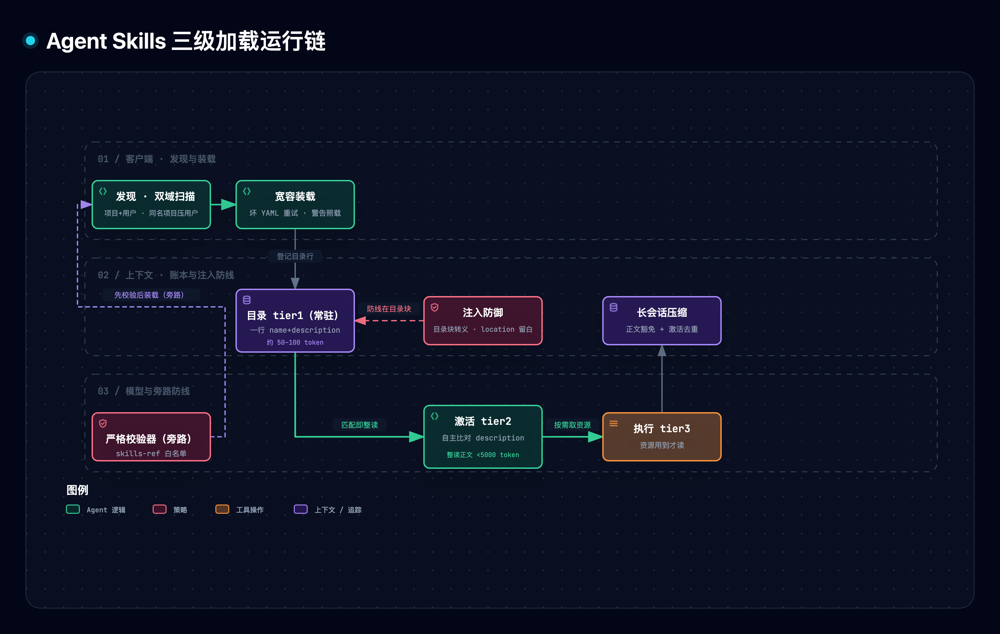
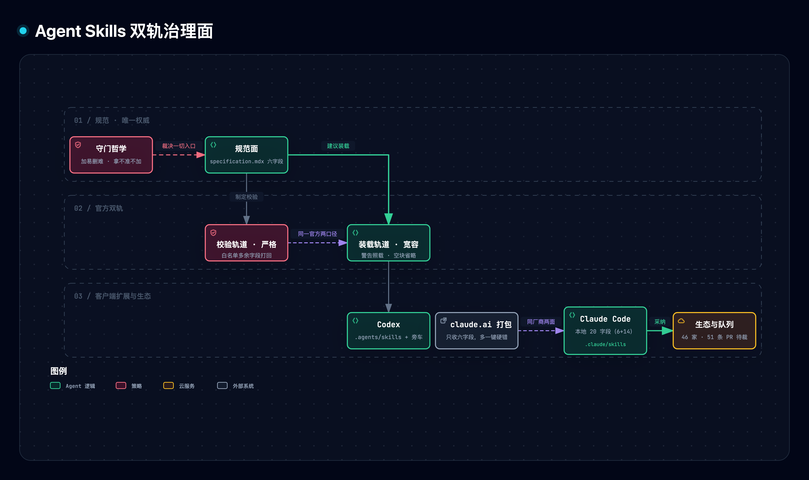

# Agent Skills 开放标准精读与通俗拆解

> [1] agentskills community (originated by Anthropic), "Agent Skills: Specification, guides, and reference implementation," GitHub repository `agentskills/agentskills`, commit `69ef37e9` (Aug. 9, 2026, frozen since), documentation site agentskills.io (accessed Sep. 30, 2026, verified byte-equivalent to the pinned commit up to rendering). 本篇为对该标准的完全重读：全部结论由独立重读规范、指南、参考实现源码与三家客户端官方文档得出，关键断言逐条对回信源原文。

**一句话定位**：Agent Skills 是一个刻意做小的「知识打包」开放格式——一个文件夹 + 一份 `SKILL.md`（两行必填元数据 + 自由正文），把「教 AI（agent，能自己动手干活的 AI 程序）把活干对」的操作说明变成任何兼容客户端（运行这类 AI 的软件工具）都能装、都能按同一套记账方式加载的标准包裹；标准只钉死包裹的形状与身份规则，分发、信任、执行全部留给生态。

**SCQA 导读**（按「背景—冲突—问题—答案」展开）。共识：模型越来越能干，通用知识几乎不缺。痛点：但「按你家的规矩把活干对」的工序知识——团队约定、工具链细节、踩过的坑——每次会话都要重新交代：让模型自己猜不可靠，把手册全塞进开场白又贵、而且塞得越多指令彼此稀释越笨。问题：能不能把这类知识做成一个标准包裹，让任何工具都能装、装很多也不贵、换工具还能继续用？回答：能——这就是 Agent Skills：§3 讲包裹的形状与身份，§4 讲装载的记账方式（本格式的经济学核心），§5 讲「什么时候用」这一句话怎么写怎么测，§6–§7 讲客户端怎么用包裹、包裹里怎么带工具，§8 讲官方给出的校验器与规范、指南之间的口径分歧，§10 是可以亲手重跑与再拆的实验室。

> [!TIP]
> **白话主线**：模型缺的不是聪明而是「你家怎么干活」的工序知识；这类知识写成标准化的技能包（文件夹+一份说明书），客户端启动时只给每个包登记一行目录（约百 token），任务对上号才整份读入、用到附带文件才去读——常驻的只有目录，用多少付多少；格式小到只有六个约定字段、不管分发不管信任，连竞争对手都愿意采纳（46 家登记）；规范仓自带参考实现可以校验包裹，本篇用 458 行纯标准库原型复刻了全链路，并逐个拆核心约束实测拆掉会坏什么。

## 1. 它要解决什么问题

「模型能干」与「把活干对」之间隔着一层工序上下文：法务审查的流程口径、数据管道的团队约定、某个内部 API 的调用坑位。这层知识有两个致命属性——**每次会话都要重新在场**（模型不会替你记住），以及**塞进上下文就有代价**（占额度、且互相抢注意力）。两条老路都死：让模型猜（不可靠、不可复现）；把手册塞进开场白（成本随「装了多少知识」增长而非「用了多少知识」增长，且指令越多彼此稀释越严重）[1]。

Agent Skills 给出的设计规格：

| 规格 | 通俗版 | 对应机制 |
| --- | --- | --- |
| 成本按使用付费 | 台账一行常驻，提箱才占作业台 | 三级渐进披露（§4） |
| 身份去中心 | 箱号=舱位登记名，无需注册中心 | name 必须等于目录名（§3） |
| 路由一句话 | 分拣只看货签 | description 独扛触发（§5） |
| 格式极小可被竞对采纳 | ISO 只定角件，不管箱内与航线 | 六字段+大量留白（§3、§11） |
| 知识可携带 | 同一箱全球港口通用 | 文件夹即包，git 即半层分发（§6） |

## 2. 全貌解剖

| 层级 | 部分 | 回答的问题 | 性质 |
| --- | --- | --- | --- |
| 格式契约（唯一权威源 `specification.mdx`） | 目录结构 / 六字段 / 身份规则 / 三级渐进披露 / 一层深引用 / 校验入口 | 「包裹长什么样、身份怎么定」 | 精读 |
| 客户端契约（实现指南，建议而非强制） | 目录扫描 / `.agents/skills` 约定 / 宽容解析 / 目录注入 / 激活双通道 / 压缩保护 / 权限放行 | 「港口怎么用包裹」 | 精读 |
| 创作方法论（四篇官方指南） | 真专长提取 / 上下文花费纪律 / 控制校准 / 指令模式 / 描述优化与评测 / agent 友好脚本 | 「包裹怎么写才值得装」 | 精读 |
| 证据链 | 46 家登记数据 / 仓史 145 提交节奏 / 三家客户端口径实测 / 规范↔参考实现分歧 / 原型全链路与破坏实验 | 「标准真的运转了吗」 | 评判 |
| 领域坐标 | vs MCP（工具连接 vs 知识打包）/ vs CLAUDE.md 类常驻记忆 / vs 传统插件系统 | 「它站在哪」 | 地图 |

**因果脉络链**：观察（工序知识会话级在场且常驻有代价）→ 归因（知识的「装机成本」与「使用成本」未分离；「何时需要」的路由信号无标准载体）→ 设计规格（五条：按使用付费、身份去中心、路由一句话、格式极小可被竞对采纳、知识可携带，见 §1 表）→ 机制（发现→目录→激活→执行四步，§4–§7）→ 证据闭环（三级 token 口径 + 生态登记 + 三家客户端实测 + 原型实验）。

**最值得关注的五个焦点**（按价值排序）：①三级渐进披露——整个格式的经济学核心；②description 路由与触发评测法——最薄也最致命的约定，方法论可迁移到任何信号层设计；③规范↔实现的边界——「竞对为何敢用」的答案，也是读任何开放标准的通用视角；④创作方法论四支柱——对写技能的人最直接可用；⑤治理哲学——一个开放标准如何管住自己的复杂度。

在展开之前，把三个背景词就地讲清（后文直接使用）：**token** 是模型读写的计件单位，模型每轮「看到」的文字总量有硬上限（上下文窗口），塞进去的每段文字都占额度、且互相抢注意力；**system prompt** 是每轮都在场的开场文字，技能目录就常驻其中；**frontmatter** 是文件开头两行 `---` 之间的「属性卡」，机器只从这里取元数据。

## 3. 格式契约：文件夹即包裹，目录名即身份

一个技能就是一个文件夹，里面必须有一个 `SKILL.md`：开头是属性卡（frontmatter），后面是写给模型读的说明书。说明书本身没有任何格式限制——规范原文只有一句「写任何有助于 agent 完成任务的内容」[1]。属性卡一共六个约定字段 [1]：

| 字段 | 必填 | 约束 | 一句话职责 |
| --- | --- | --- | --- |
| `name` | 是 | 1–64 字符；Unicode 小写字母/数字/连字符；不首尾连字符、无连续连字符；**必须逐字等于父目录名** | 身份 |
| `description` | 是 | 1–1024 字符；应同时说「做什么+何时用」 | 路由信号（§5） |
| `license` | 否 | 建议短（许可名或捆绑许可文件引用） | 法律标签 |
| `compatibility` | 否 | 1–500 字符；仅在确有环境要求时写 | 环境声明 |
| `metadata` | 否 | 任意 string→string 映射 | 客户端私有扩展的标准去处 |
| `allowed-tools` | 否 | 空格分隔的预批准工具串；**实验性**，各家支持不一 | 回合级权限预授（语义见 §7） |

目录里除 `SKILL.md` 外可以放任何东西；三个约定俗成的子目录是 `scripts/`（可执行代码）、`references/`（按需加载的参考文档）、`assets/`（模板、图、数据）[1]。身份规则是这个格式最省事的一笔：技能叫什么名字，不由任何机构分配，而是**直接借用操作系统的目录树**——就像门牌必须跟户口登记名一致：标准不设发牌机构，`name` 与所在文件夹名逐字一致才算同一个技能，改了名（挪了文件夹）就是另一个门牌。这个比方只说到这里：与门牌不同，技能名的唯一性只在单个客户端的扫描范围内成立，跨范围重名由各客户端自定优先级处理（§6）。官方参考实现（规范仓自带的示范代码 skills-ref）还把「像不像同一个名字」做了一层归一：`café` 的两种 Unicode 写法（组合字符与分解字符）经 NFKC 归一后视为一致，中文名「技能」、俄文名「навык」都是合法 name——身份规则按 Unicode 字母表设计，不只服务英文 [2]。

**端到端走查**（材料自带的 quickstart 例 [1]）：在项目里建 `.agents/skills/roll-dice/SKILL.md`，属性卡写 `name: roll-dice`、`description: Roll dice using a random number generator. Use when asked to roll a die (d6, d20, etc.)…`，正文给一条 bash 命令 `echo $((RANDOM % <sides> + 1))`（Windows 给 PowerShell 等价物）。整个技能不到 20 行。用户问「Roll a d20」——目录里那行 description 对上了，正文整份读入，模型把 `<sides>` 替换成 20 执行命令，返回 1–20 的随机数。反向走查：若把属性卡写成 `name: roll-dice-x` 而文件夹还叫 `roll-dice`，官方校验器立即报「Directory name 'roll-dice' must match skill name 'roll-dice-x'」[2]。

## 4. 渐进披露：装多少技能，只为用过的付钱

这套记账方式像一家餐厅的菜单：每道菜在菜单上只占一行（菜名+一句话介绍），这一行常驻不占厨房；客人（模型）自己看菜单决定点哪道，点了厨房才为这道菜开火占灶；菜谱之外的备料手册放在后厨架子上，做这道菜要用到才去翻。注意比方到此为止、有一处必须掐断：这道「菜」点过之后并不像菜出锅即撤——整份说明书会一直留在本会话的上下文里直到会话结束，中途清理桌面（上下文压缩）也不许把它收走（原因见本节末尾）。落到规范里就是三级记账 [1]：

| 级 | 加载什么 | 何时 | 量级 |
| --- | --- | --- | --- |
| 1 目录 | name + description | 会话启动，常驻 | 每技能约 50–100 token |
| 2 正文 | 整份 SKILL.md body | 模型判断任务匹配、激活时 | 建议 <5000 token、正文 <500 行 |
| 3 资源 | scripts/references/assets 里被引用的文件 | 指令执行到需要那一刻 | 按需 |

指南给过一笔明账：装 20 个技能不等于预付 20 份正文——只有当轮对话真正用到的技能才占用正文额度 [1]。反面的账：若全塞开场白，成本按装机量线性增长且指令彼此稀释 [1]——按每份正文约 3000 token、装 20 份估算即约 6 万 token 常驻（本篇推断示意算式，3000 为取值于规范建议上限内的示意值）。真实客户端把这套记账硬化成了预算门：Codex 规定初始技能目录最多占模型上下文窗口的 2%、窗口未知时 8000 字符，超限时先截短各技能的 description，技能很多时可能省略部分技能并给出警告 [4]。正文激活后的留存规则同样重要：指南要求客户端在上下文压缩时把已激活技能的内容列为**不可裁剪的保护内容**——否则模型会继续干活但悄悄失去专门指令，性能退化且**没有任何报错**；同时建议做激活去重（同一技能不重复注入）[1]。

**端到端走查**（实际运行日志；token 按「约四个字符折一个 token」的粗略换算计（字符数除以 4），仅作同口径相对比较）：6 个技能的目录块共 420 token 常驻；一次换班任务激活 1 份正文 +55、按需读 1 份参考文件 +10，常驻合计 485；另一个从未被用到的技能始终只占目录一行。拆掉按需性（激活时把资源全部预载）后，常驻从 485 涨到 797（+64%）——盘点任务从未读过任何参考文件却背上了成本（实际运行日志）。



（图源：[agent-skills-std-lifecycle.mmd](../../assets/mermaid/agent-infra/agent-skills-std-lifecycle.mmd) · 交互版 [HTML](../../assets/architecture/agent-infra/agent-skills-std-lifecycle.html)。图一句话结论：四步生命周期里只有目录是常驻成本，正文与资源都在「用上」那一刻才记账，压缩环节是唯一的例外保护点。）

## 5. 路由：一句话决定技能何时被启用

技能什么时候被用起来，靠的全是属性卡里那句 description——像店门口的招牌：一句话说清「卖什么、什么情况该进来」；写窄了该来的客人路过没进（该触发没触发），写得太宽泛不该进的也进来问（误触发）；调招牌的办法是拿一批真实过路场景试，而不是记住某几个熟客的长相。具体机制是：客户端把每个技能的 name+description 登记进目录块（注入 system prompt 或专用工具的描述里），模型每轮看到任务时拿任务与这句话比对，觉得对得上就把整份说明书读进来 [1]。判断完全交给模型自主——实现指南明确说，多数实现**不做 harness 侧的关键词匹配或触发器** [1]。这句话有 1024 字符的硬上限 [1]。写法四原则：祈使句（「当…时使用」）、对用户意图而非内部实现、宁可写 pushy（把用户没点名领域的场景也列进来）、保持简洁 [1]。

一句话扛路由意味着两头的失败模式都得自己防：写窄漏触发、写宽误触发。官方给的评测法是一套小型的「招牌测试」[1]：

1. **出题**：约 20 条真实用户请求，一半应触发、一半不应；最有价值的负例是「近失」——话题沾边但实际要干别的（「更新 Excel 预算表里的公式」对 CSV 分析技能就是近失负例）；正例要沿措辞正式度、领域点名与否、细节多少、单步/多步四轴变化。
2. **跑分**：每条跑 3 次算触发率（模型行为非确定），阈值 0.5；「触发」的判定是 SKILL.md 是否真的被读入。
3. **防背题**：请求集按 60/40 分训练/验证；改 description 只看训练集的失败，最后按验证集通过率选版本——绝不把失败查询的关键词抄进描述，那是把招牌调成只认识这 20 个人的脸。
4. **收敛**：约五轮通常够；卡住时换描述的结构而非继续微调。

一个如实的边界：材料没有给出「模型自行判断为何足够可靠」的依据，也没有跨客户端触发一致性的实测（各家注入方式与模型不同；Codex 明言超预算时会截短 description [4]）。这记入 §12 的「材料没有证明的事」。

## 6. 客户端契约：扫描、宽容、注入、放行

实现指南（建议层，非规范）给出五步生命周期 [1]。**发现**：至少扫两个作用域——项目级（随仓库走）与用户级（跨项目），每域同时扫客户端私有目录与 `.agents/skills/` 约定目录；同名时项目级压用户级、并告警；实用细节包括跳过 `.git`/`node_modules`、设合理扫描边界（指南举例：深度 4–6 层、约 2000 个目录）；项目级技能可能来自不可信仓库，指南建议挂信任门。**解析**：frontmatter 提取后按宽容原则装载——名字与目录不符或超长→警告照载；description 缺失或 YAML 完全不可解析→跳过并记日志；坏 YAML（典型如未加引号的冒号）建议包裹引号重试。**披露**：目录块用 XML/JSON/列表皆可，量级同 §4 三级表；被禁用/被权限拒绝/退出模型激活的技能应整条隐藏而非「列出再拦截」；一个技能都没有时应整块省略（空目录块会让模型困惑）。**激活**：两通道——模型用普通文件读工具直接读 `SKILL.md`，或客户端注册专用激活工具（可控制返回内容、加结构化包裹标签、枚举约束技能名防幻觉、做权限与埋点）；用户侧应有 `/技能名` 式显式调用；返回全文或去 frontmatter 的正文皆可（多数实现剥头）；技能目录应加入权限白名单，否则读附带文件每一步都弹确认框。**长会话管理**：压缩豁免（§4）+ 激活去重 + 可选的子代理委派（复杂技能放独立会话跑，回传摘要）。

`.agents/skills/` 的地位值得单说：指南称它「已成为广泛采纳的跨客户端约定」——规范本身不管技能放哪，但扫这个目录意味着别家客户端装的技能自动可见 [1]。实测口径是**不对称**的：Codex 原生只用 `.agents/skills`（项目链 CWD→仓库根 + 用户 `$HOME` + 管理员 `/etc/codex/skills` + 系统内置四级）[4]；VS Code 教程也用它 [1]；但发起方自家的 Claude Code 文档列的是自家一整套位置体系——`.claude/skills`（企业/个人/项目/嵌套）、插件内 `skills/` 目录、claude.ai 账号同步——全文未提 `.agents/skills` [3]——互操作实际靠「别人多扫我」（指南也称一些实现会兼容扫描 `.claude/skills`）达成，而非统一路径。

**端到端走查**：quickstart 的 VS Code 场景——技能放进 `.agents/skills/` 后，聊天面板输入 `/skills` 确认在列；问「Roll a d20」，agent 可能请求运行终端命令的许可，放行后得到随机数；材料同时提醒：工具调用可靠性随模型而异，模型可能不跑命令自行作答，可换模型重试 [1]。

## 7. 资源层与脚本：包裹里的工具怎么带

先说引用纪律：`SKILL.md` 里引用文件一律用相对技能根目录的路径，且**保持一层深**（`references/REFERENCE.md` 可以，`references/a/b/c.md` 再被 `b.md` 引用的长链不建议）——模型按需读文件时，浅引用意味着确定的一跳 [1]。

**一次性命令**：现成工具直接引用（规范建议钉版本、声明前置），六大通道各配一句示例：`uvx`/`pipx`（Python 包隔离执行）、`npx`/`bunx`（npm）、`deno run npm:`（带权限旗标）、`go run pkg@version` [1]。**自含脚本**：把可复用逻辑放进 `scripts/` 并内联声明依赖——Python 用 PEP 723 的 `# /// script` 块配 `uv run`，Deno 的 `npm:`/`jsr:` 导入天然自含，Bun 自动装包，Ruby 用 `bundler/inline` [1]。

**agent 友好脚本十则**（指南整节，浓缩）[1]：禁交互提示（agent 跑在非交互 shell，等待输入=永久挂起，这是硬要求）；`--help` 就是接口文档（agent 学接口的第一入口）；报错要带「错在哪/期望什么/下一步试什么」；结构化输出（JSON/CSV 优先，数据走 stdout、诊断走 stderr）；幂等（agent 会重试）；输入用闭合集拒绝歧义；破坏性操作给 `--dry-run`；退出码区分失败类型并写进 `--help`；危险默认要显式确认旗标；输出尺寸可控（多数 harness 会对超阈值的工具输出自动截断，指南举例 1–3 万字符；大输出默认给摘要，或不宜分页时落盘）。**判断该不该写成脚本的信号**：多次运行各自重新发明同一逻辑（画图、解析、校验）——写一次测好的脚本进 `scripts/`，比让模型每次即兴重写可靠 [1]。

`allowed-tools` 的语义在 Claude Code 的文档里有完整定义（规范只标了「实验性」）：调用该技能的那个回合内，所列工具免审批可用，下一条用户消息即失效；它不缩小可用工具池，也不受工作区信任门管——因此官方同页提醒：**仓库里签入的技能可以给自己授予宽工具权限，用前先审它的 `allowed-tools`** [3]。语法 `Bash(git:*)` 即 Claude Code 的权限规则写法 `Tool(说明符)`，规范例句直接借用了这套自家语法而未在标准内定义语法 [3]。

## 8. 校验与双轨：同一官方面孔的严格面与宽容面

规范指定 `skills-ref validate` 为官方校验入口：检查 frontmatter 合法与命名约定 [1]。参考实现（解析器 strictyaml、六字段白名单、Unicode 身份规则、NFKC 目录名比对）自带三命令：`validate` / `read-properties` / `to-prompt`（生成 `<available_skills>` 目录块）[2]。像交警路面执法与车辆年检的关系：客户端装载是路面执法——车牌样式不对、车长超标，警告一句照放行，先保路上通（技能能用）；官方校验器是年检——多一个没登记的字段就打回，保的是「这车完全合规」（格式纯净）。两轨服务的目标不同，并行不悖；且年检是自愿的——校验器打回的技能，宽容客户端照样能跑，两轨没有强制联动。

重读源码后锚定的**规范↔参考实现↔客户端三方分歧**（全部可在钉点源码定位）：

| # | 分歧 | 规范/指南口径 | 另一面口径 |
| --- | --- | --- | --- |
| 1 | 未知字段 | 规范字段表未禁止第七个字段；指南建议宽容装载 | 校验器六字段白名单，多余字段一律报错 [2]；claude.ai 上传/打包同样只收六字段、多一键硬错 [3]；而 Claude Code 本地收 **20 个字段**（规范 6 + 扩展 14）[3] |
| 2 | 文件名大小写 | 指南扫描口径「名为 exactly `SKILL.md` 的目录」[1] | 参考实现大写优先、兼收小写 `skill.md`（`find_skill_md`）[2] |
| 3 | 空目录块 | 指南：无技能时应整块省略 [1] | `to_prompt` 空列表仍输出空 `<available_skills>` 块 [2] |
| 4 | 注入面 | 指南未提目录块的转义要求 | `to_prompt` 对 name/description 做 `html.escape`（转义），**location 字段不转义**——路径含特殊字符的注入面留给客户端 [2] |
| 5 | 归一化 | 规范未提 Unicode 归一 | 校验器对 name 与目录名做 NFKC 归一后再比对 [2] |
| 6 | 必填字段 | 规范：name 与 description 必填 [1] | Claude Code：name 可选（默认取目录名）、description 仅「推荐」（缺省取正文第一行）[3] |

分歧 1 是三个争议（§11）的实证底座：同一厂商在「上传面」收六字段、在「本地面」收二十字段，恰好演示了规范面与扩展面的边界怎么画。



（演示见 §10 实验 X3。图源：[agent-skills-std-dual-track.mmd](../../assets/mermaid/agent-infra/agent-skills-std-dual-track.mmd) · 交互版 [HTML](../../assets/architecture/agent-infra/agent-skills-std-dual-track.html)。图一句话结论：规范只钉六字段与目录形状，装载面宽容、校验面严格、扩展面各家自理，三条轨道各自服务连通性、纯净度与功能诉求。）

## 9. 关键实证数字

把散落各章的数字收拢成一张查找表（出处编号随行标注，时效一律截至 2026-09-30）：

| 数字 | 条件·截至 | 一句话读法 |
| --- | --- | --- |
| 目录 ~50–100 token/技能；正文建议 <5000 token；SKILL.md 建议 <500 行 | 规范/指南口径 [1] | 三级记账的官方量级；是建议值而非实测 |
| Codex 初始目录 ≤ 上下文窗口 2%（未知时 8000 字符），超限先截 description | Codex 文档，2026-09-30 [4] | 渐进披露在真实客户端硬化成的预算门 |
| Claude Code 收 20 个 frontmatter 字段；目录中 description+when_to_use 合计 1536 字符截断 | Claude Code 文档，2026-09-30 [3] | 扩展面的实测宽度；截断口径与规范 1024 并存 |
| 46 家客户端登记（45 家带说明文档链接、26 家开源、14 家需 logo 缩放） | 仓内登记数据，截至 2026-09-30 [1] | 自报口径：登记门槛是「今日即可发现并执行」，logo 由 Anthropic 团队审核 |
| 仓史 145 提交：2025-12-16 init、12-18 文档与参考实现落地；2026-03 达峰 42 条；8-09 后冻结；25,811 stars、51 条 open PR | gh api + git log，2026-09-30 [5] | 前期密集定标、后期放缓收门；冻结 52 天而 PR 队列仍在排队 |
| 原型账本：目录 420 / 激活 +55 / 按需 +10；预载拆法常驻 485→797（+64%） | 本篇原型实测（chars/4 近似口径） | 按需性不是优化项而是成本模型本身 |

46 家采纳无独立第三方计数；开放标准发布日期（2025-12-18）以仓史一手证据为准（init 12-16、文档与参考实现 12-18 落地）[5]。

## 10. 动手实验室

原型：[agent_skills_lab4.py](./assets/agent_skills_lab4.py)——纯标准库、458 行、确定性，「模型」由关键词匹配器替身，回答的是机制自洽而非模型聪明；token 为 chars/4 近似口径。复刻全链路：发现（项目/用户双域、同名项目压用户、宽容装载、目录名身份）→ 目录块（XML、转义）→ 激活（整读正文、去重）→ 按需资源 → 压缩保护，外加镜像 skills-ref 的严格校验器（六字段白名单、Unicode 身份、NFKC）。

```bash
# 在仓库根目录运行（上文 ./assets/ 链接即此文件在仓内的相对位置）
uv run --no-project python docs/research/agent-infra/assets/agent_skills_lab4.py --selftest
uv run --no-project python docs/research/agent-infra/assets/agent_skills_lab4.py --break X1  # X1..X5
```

机制→代码行号速查：`build_fixtures`（玩具域夹具）L32 · `parse_frontmatter`/`load_skill`（宽容装载）L82/L101 · `strict_validate`（严格校验镜像）L129 · `discover`（双域扫描+同名优先级）L167 · `to_prompt`（目录块+转义）L188 · `Ledger`（三级账本）L202 · `mock_route`（路由替身）L218 · `activate`/`load_resource`（tier2/3）L254/L269 · `compaction`（压缩保护）L278 · `run_task` L289。

破坏性实验三件套（改什么 / 实测看到什么 / 教训）：

| 实验 | 改了什么 | 实测退化（实际运行日志） | 教训 |
| --- | --- | --- | --- |
| X1 拆「name=目录名」 | 装载改按 frontmatter 名建档 | 目录 6→5；「合并周报」技能静默消失、任务 no-match，无任何告警 | 身份不借文件系统，名字漂移等于技能蒸发 |
| X2 严格门当装载门 | 六字段白名单挪用到装载路径 | 带扩展字段的技能整体消失，装载面 6→5（-1/6） | 出厂检验的门不能当店门：严格保纯净、宽容保连通 |
| X3 拆目录转义 | 目录块不再 `html.escape` | 恶意 description 单行夹带 `</skill><skill>…` 后，目录行解析出伪造技能 1 处（注入成功） | 目录块是被解释的文本，转义是唯一边界；`location` 至今未转义 |
| X4 拆按需加载 | 激活时资源全部预载 | tier2 55→240、常驻 485→797（+64%），未用资源的任务也背上成本 | 「按需」是成本模型本身，不是可选优化 |
| X5 拆压缩保护 | 压缩不再豁免技能正文 | 「技能正文留存 0 份」；延续任务策略遵守 False→silent-fail，**报错信号：无** | 技能内容被裁不是错误而是静默退化——指南要求保护的原因正在于此 |

## 11. 底层规律与核心争议

前面各章拆的是机制与证据；这一章把它们收拢成五条底层规律——每条各管一个维度（成本结构、信号路由、身份、执行模型、治理边界），合起来回答「这个格式为什么长这样、生态为什么愿意长这样」——再讲三个仍悬而未决的争议。

**规律 1 · 成本按使用付费**：知识的常驻成本与使用成本分离——每个技能只占目录一行，激活才付正文，用到资源才付第三级。没有它，装机量=常驻成本且指令互相稀释 [1]（量级见 §4 的推断示意算式）。演示：三级口径与原型账本；生态硬化：Codex 的 2%/8000 预算门 [4]。

**规律 2 · 一根字符串的路由**：「何时用」的全部信号压在 ≤1024 字符的 description 上，由模型自主比对、实现方不做关键词引擎 [1]。路由若由客户端各自实现，同一技能包行为随客户端分化、可携带性死亡；压成一根字符串，路由逻辑跟着模型走。演示：近失负例、触发率、60/40 训验分治；反面：抄关键词=背题王 [1]。

**规律 3 · 身份借文件系统**：name=目录名，身份借现成的目录树而不设注册中心 [1]。没有中心发牌，标准才能无主、竞对才敢押注；重名从全局仲裁降维成本地优先级。演示：校验器的目录名比对与 NFKC 归一 [2]；反面：X1 拆除后技能静默蒸发。

**规律 4 · 被解释的文本，不是被执行的代码**：技能主体是写给模型读的说明书，「执行」=模型读后照办，执行权与安全责任留在模型和客户端 [1]。若技能是代码，沙箱/权限/签名就得成为格式第一公民，格式做不小；做成文本，信任问题整体推给客户端（信任门、白名单、审批）。演示：目录块的转义防线 [2]；反面：X3 注入实测。

**规律 5 · 互操作压倒完备**（互操作＝各家产品彼此直接通用）：标准刻意只钉六字段与目录形状，分发/信任/版本/执行留白——每个新要求都是所有实现方的永久成本 [1]。演示：CONTRIBUTING 的关门哲学（「加易删难…拿不准宁可不加」）[1]；同厂商两面：claude.ai 收六字段、本地收二十 [3]；反面：若规范强制统一目录路径，固守私有路径的客户端即无法合规。

**争议 1 · 严格还是宽容**：装载方怕「装不上」（连通性），校验方怕「悄悄烂」（纯净度），同一官方两面下注（校验器白名单 [2] vs 指南宽容装载 [1] vs Claude Code 二十字段 [3]）——本质是互操作纯净度与现实兼容性的连续谱选址，标准自己未裁决。**争议 2 · 关门哲学与功能排队**：复杂度成本全体承担、收益提案方独享（账本不对称）；「51 条 PR」指排队待合并的公开修改建议，官方「宁缺」的代价是功能以客户端私有扩展的形式旁路生长（Claude 的 model/hooks/context、Codex 的 openai.yaml 策略文件 [3][4]），长期反噬互操作面——main 冻结 52 天而 51 条 PR 排队是实证 [5]。**争议 3 · 互操作约定与私有目录**：`.agents/skills` 约定在非发起方中扩散（VS Code [1]、Codex [4]），发起方固守自家位置体系（文档零提约定目录 [3]）；互操作由「宽容多扫」而非「统一路径」达成——是规律 5 在目录层的重演。

## 12. 适用边界

**成立条件**：研究对象为格式规范（钉 `69ef37e9`）、官方七篇指南、skills-ref 参考实现与登记口径的生态现状；「把工序知识打包、给模型按需加载」的场景收益最大（团队约定、工具细节、领域流程）；本地客户端与云沙箱均适用（发现机制不同、生命周期相同）。**Out-of-Scope**：供应链专题（签名/分发渠道/版本治理只如实记录规范内留白，不做深挖）；MCP 集成与协议级提案细节；46 家客户端逐一盘点（抽样三家定形态）；任何模型的路由准确率评测。

**材料没有证明的事**：
1. 「46 家支持」是自报登记：有「今日即可发现并执行」门槛与 logo 审核 [1]，但无第三方复核各家的实际兼容深度。
2. 三级 token 口径（~50–100、<5000）是规范/指南的估算与建议值，材料未给实测方法或跨模型实测数据 [1]。
3. 「description 路由有效」未提供跨客户端触发一致性的实测证据；指南明言把判断交给模型、不做触发器 [1]，但「模型判断为何足够可靠」无依据；Codex 超预算截短描述 [4] 进一步引入口径差。
4. 「跨产品复用」的实际程度未证明：同名冲突各家自裁（指南建议项目压用户 [1]；Codex 同名不合并双列 [4]）、扩展字段互不兼容（六字段 [2] vs 二十字段 [3]）、描述可能被截断 [4]——同一技能包在不同客户端行为可能不同。
5. 信任与完整性基本缺席：指南仅「考虑信任门」「审阅 allowed-tools」两处建议级文字 [1][3]；实测三家客户端文档均未提及签名或完整性校验，材料也未证明任何一家有。

## 13. 用户自测与费曼研讨套件（Self-Assessment Kit）

1. **费曼题**：不用本篇任何比方，纯机制语言向同事解释「为什么这个标准只有六个字段，却值得 46 家客户端（包括几家互为竞争对手的厂商）采纳」——把「留白」与「采纳」的因果链讲完整。
2. **决策题**：你的团队打算把内部规约写成技能包引入日常工作流。按本篇的评测方法论，上线前应先做什么对照实验来验证技能包的「真增量」？若不做了这个对照，最可能高估什么？
3. **争议研讨**：假设你是标准守门人，面对一条「给规范加版本字段」的 PR。按 CONTRIBUTING 的门槛与「互操作压倒完备」的规律，你会怎么裁决？写出裁决理由与要求提案方补齐的证据。

## 参考（IEEE）

- [1] agentskills community (originated by Anthropic), "Agent Skills: Specification, skill-creation guides, and client implementation guide," agentskills.io / GitHub repository `agentskills/agentskills`, commit `69ef37e9`, Aug. 9, 2026 (frozen since; site accessed Sep. 30, 2026, verified equivalent to the pinned commit). [Online]. Available: https://agentskills.io/specification
- [2] agentskills community, "skills-ref: reference library for Agent Skills (parser / validator / prompt / cli, with tests)," GitHub repository `agentskills/agentskills`, path `skills-ref/` @ `69ef37e9`, Aug. 9, 2026. [Online]. Available: https://github.com/agentskills/agentskills/tree/main/skills-ref
- [3] Anthropic, "Extend Claude with skills," Claude Code documentation. [Online]. Available: https://code.claude.com/docs/en/skills (accessed Sep. 30, 2026)
- [4] OpenAI, "Build skills," Codex documentation. [Online]. Available: https://developers.openai.com/codex/skills/ (accessed Sep. 30, 2026)
- [5] GitHub, "Repository metadata and commit history for agentskills/agentskills," GitHub REST API and git clone @ `69ef37e9`, snapshot Sep. 30, 2026. [Online]. Available: https://api.github.com/repos/agentskills/agentskills
