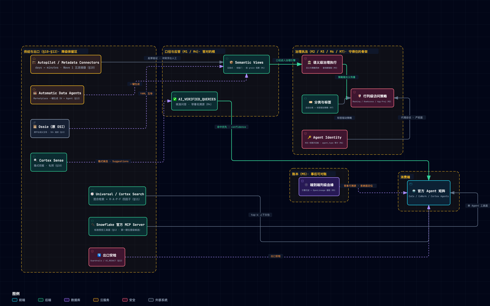
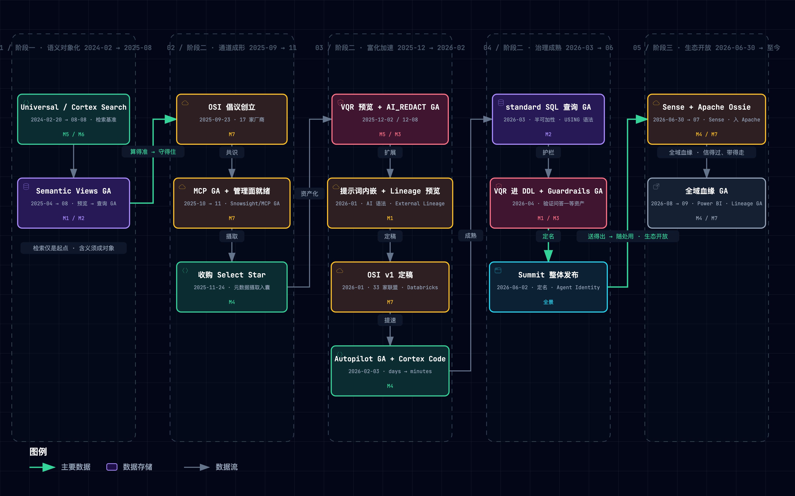
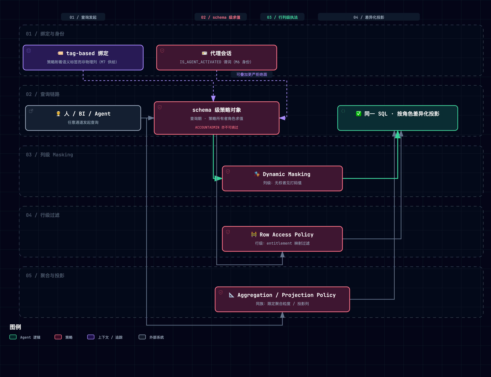
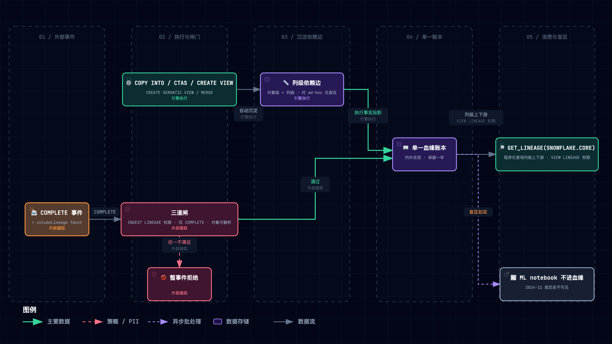
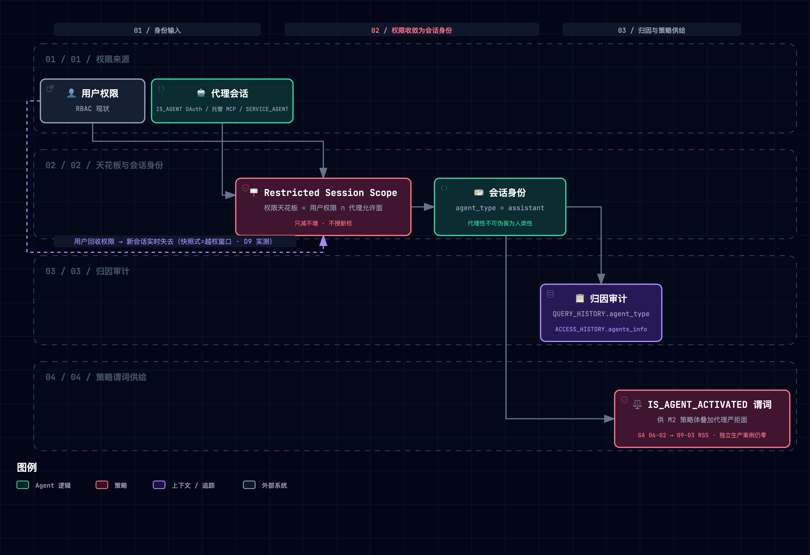
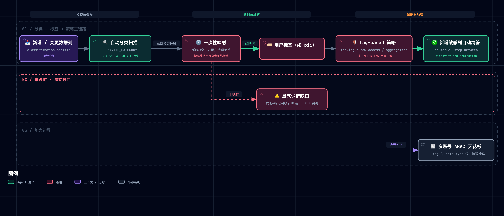

> [!NOTE] **核心精读范围**
>
> - [Snowflake, "Horizon Context — Governed Semantic Layer & Data Catalog," 产品页, 2026](https://www.snowflake.com/en/product/features/horizon-context/)
> - [公告博客 "The Governed Context Layer for AI, BI and Apps," 2026-06](https://www.snowflake.com/en/blog/horizon-context-governed-context/)
> - [Summit 26 新闻稿, 2026-06-02](https://www.snowflake.com/en/news/press-releases/snowflake-advances-trusted-ai-with-snowflake-horizon-catalog-centralizing-governance-context-and-security-across-the-enterprise/)
> - [docs: 语义视图](https://docs.snowflake.com/en/user-guide/views-semantic/overview) / [CREATE SEMANTIC VIEW](https://docs.snowflake.com/en/sql-reference/sql/create-semantic-view) / [validation-rules](https://docs.snowflake.com/en/user-guide/views-semantic/validation-rules) / [物化](https://docs.snowflake.com/en/user-guide/views-semantic/materializations)
> - [docs: Autopilot](https://docs.snowflake.com/en/user-guide/views-semantic/autopilot) / [Verified Query Repository](https://docs.snowflake.com/en/user-guide/views-semantic/verified-query-repository) / [建模与开发最佳实践](https://docs.snowflake.com/en/user-guide/views-semantic/best-practices-modeling)
> - [docs: 行列级策略](https://docs.snowflake.com/en/user-guide/security-column-ddm-intro) / [分类与标签](https://docs.snowflake.com/en/user-guide/classify-intro) / [External lineage](https://docs.snowflake.com/en/user-guide/external-lineage) / [Restricted Session Scope](https://docs.snowflake.com/en/user-guide/restricted-session-scope)
> - [docs: Snowflake 官方 MCP Server](https://docs.snowflake.com/en/user-guide/snowflake-cortex/cortex-agents-mcp)
> - [Cortex Sense 博客, 2026-06-30](https://www.snowflake.com/en/blog/enterprise-ai-agents-grounded-context/)
> - [工程博客 "Why Do We Need Semantic Views?", 2026-03](https://www.snowflake.com/en/blog/engineering/why-we-need-semantic-views/)
> - [Cortex Search 检索工程博客（混合排序基准）](https://www.snowflake.com/en/engineering-blog/cortex-search-and-retrieval-enterprise-ai/)
> - [OSI 创立新闻稿, 2025-09-23](https://www.snowflake.com/en/news/press-releases/snowflake-salesforce-dbt-labs-and-more-revolutionize-data-readiness-for-ai-with-open-semantic-interchange-initiative/) / [Apache Ossie 孵化记录](https://incubator.apache.org/clutch/ossie.html)
> - 执行语义跨工具对比：[Looker symmetric aggregates](https://docs.cloud.google.com/looker/docs/reference/param-explore-symmetric-aggregates) · [Honeydew 对比](https://honeydew.ai/blog/dbt-semantic-layer-vs-looker-lookml/) · [Datus MetricFlow 拆解](https://datus.ai/blog/dbt-semantic-layer-metricflow/)

**一句话定位**：Snowflake Horizon Context 是 **嵌在 Data 治理引擎层、在查询时强制执行** 的 Context Layer —— 把业务定义、指标、关系、血缘、用法沉淀为受治理的元数据对象，让人、BI 工具、AI Agent 从同一份定义推理，而不是各自猜测。

> [!TIP] **怎么读笔记**
>
> 每个机制节按「类比 → 机制 → 原型」三拍进行记录和实践。本篇机制集经过 2026-09-17 的**全局重评选校准**（方法与判据见 §16 重评审记录）：M1–M7 七个机制是重评选后的「全局最重要承重组件」——口径与应答两席（M1/M4），治理执法四席（M2/M3/M6/M7），账本一席（M5）；富化、检索排序、开放互操作三族因证据成熟度不足**降级为专章保留**（§10–§12，内容不删、降级理由与重评触发器随文写明）。M1–M7 各配一张动效工程图，§2 另配组件全景与演进时间线两张总览图（交互版下载到本地打开，默认经典视图可切主题/缩放/聚焦，trace 动画按主路径逐边点亮）。实践取自配套的最小原型 [`assets/horizon_context_lab.py`](./assets/horizon_context_lab.py)（约 1170 行纯标准库代码，M1–M7 七机制 + 场景矩阵 + 十次破坏性实验；另有 MCP 服务原型 [`assets/horizon_context_mcp.py`](./assets/horizon_context_mcp.py) 验证平台集成路径）。

配套产物：[Context Layer 基础设施设计蓝图](./013-context-layer-blueprint.md) · [Horizon Context ↔ negentropy 机制映射报告](./012-horizon-context-mapping-negentropy.md)。

---

## 1. Horizon Context 解决了什么问题？

> [!TIP] **Horizon Context 解决了什么问题？**
>
> 初级 Data Agent 就像一位 **每天都在重新入职、毫无业务常识的天才实习生**：他满腹经纶、数学和逻辑推理满分，但完全不懂企业的方言黑话与合规底线。
>
> Horizon Context 要做的，是为这位天才实习生配备一套嵌入大厦基座的「受治理带教中枢」（终极入职包：全套规章、工具与安防体系），让他秒变懂业务、守规矩的业务老司机：
>
> - 可执行的规章手册：语义视图——口径单点定义 × 查询期重算（M1）；
> - 闸机的逐页验放规则：行列级访问策略，机密页打码、越权行扣留（M2）；
> - 闸机焊死承重墙的拓扑：语义级治理执行，所有通道共用同一执法点（M3）；
> - 核准题库与盖章底稿：应答层验证锚定，命中核准题直接出示底稿（M4）；
> - 全楼出入库台账：端到端列级血缘，谁产出谁消费事后可对账（M5）；
> - 实习生专用工牌：Agent Identity，权限是带教人的子集、刷卡可归因（M6）；
> - 机密自动贴标系统：分类与标签驱动策略传播，新文件进楼自动纳管（M7）。
>
> 带教体系还有三组配角（速记秘书与见习助教、智能前台与评估尺、工作护照与安全插座与海关安检），分别落在 §10–§12 三个专章——它们仍是剧场的一员，只是不在这七件承重主列。
>
> 用 Snowflake 官方的话讲：*Without context, an agent guesses. With context built natively into the platform, an agent acts. With context that is also governed natively, an agent can be trusted.*

销售负责人说 Q3 收入 **\$14.2M**，CFO 报的却是 **\$12.8M** —— Snowflake 官方拿这组对账数字开场：同一份数据，两个答案。

没有人算错数，错的是 **语义无人治理**。

企业底层数据库躺着的，往往是密码般的物理列名（如毛收入叫 `amt_ttl_pre_dsc`）；真实业务指标（如净利润）的计算口径也散落在不同报表各自的 `CASE WHEN` 逻辑里。不同业务域子系统各有一套方言黑话，谁也不懂谁。

据 Snowflake 实测，**让缺乏语义治理的初级 Data Agent 直接回答企业数据问题，准确率仅有 ~25%（Snowflake 内测）/ 21%（Anthropic 独立复测）**。这并非初级 Data Agent 所使用的模型笨，而是语义没有对齐。具体体现为这三个不可自愈的系统性病灶：

1. **口径打架（含义散落）**：指标口径写在各自的散落业务里，同一个业务指标问两个子系统，能得出两套不同数字；
2. **定义漂移（脱节失效）**：外挂语义层独立于 Context Layer，底层数据表的变更会令语义立即脱节，Agent 会按过期的语义手册瞎猜；
3. **门禁穿透（治理虚设）**：权限规则只浮在外部系统，拦不住绕过中间层直查物理底表，安全防线形同虚设。

初级 Data Agent 就像一位智商超群的天才实习生，他满腹经纶、理解力极强，但完全不懂贵司的标准流程与方言黑话。

要把这位天才实习生真正培养成懂业务、守规矩的“业务老司机”，Snowflake Horizon Context 的解法是，**把业务 Context 与安全守则铸入底层引擎，使其无法被篡改与绕过****。2026-09-17 重评选校准后，Horizon Context 的七条承重机制（评选判据与过程见 §16）：

| 设计规格                 | 底层机制                        | 大白话                                                                       |
| :----------------------- | :------------------------------ | :--------------------------------------------------------------------------- |
| **定义一次、处处生效**   | M1 语义视图（口径单点×查询期重算） | 权威规章只印一本且本身就是计算器：翻到哪条，当场按底层原始凭证套算给你看     |
| **敏感数据分级验放**     | M2 查询期行列级访问策略         | 闸机逐页验放：机密页自动打码、越权行直接扣下，任何窗口同一套规则             |
| **治理不可绕过**         | M3 语义级治理执行               | 闸机焊死在承重墙上：全部通道共用同一执法点，语义层成不了治理旁路             |
| **应答可信分层**         | M4 应答层验证锚定               | 核准题库：命中核准题出示盖章底稿；未核准的答案显式标注，不冒充已背书         |
| **事后可对账**           | M5 端到端列级血缘               | 全楼出入库台账：谁产出、谁消费、经谁转手，引擎自动记录、程序可查             |
| **代理可归因**           | M6 Agent Identity               | 实习生专用工牌：权限是带教人的子集（只减不增），每次刷卡记录在案             |
| **新敏感数据自动纳管**   | M7 分类与标签驱动策略传播       | 自动贴标系统：文件进楼自动识别密级，贴标即联动验放规则，盘点间隙不裸奔       |

## 2. Horizon Context 全景与三阶段演进

> [!TIP] **Horizon Context 的演进**
>
> 这套带教体系的演进，是大厦知识与风控中枢的三次认知升维：
>
> - **阶段一（起草规章：从找得到到算得准）**：起初大厦只有一本冰冷的「机房资产登记簿」（只记录底层有哪些物理表）；后来为拯救四处碰壁的实习生，编制了第一部装订成册的《业务规章手册》（把含义做成受治理元数据对象）；
> - **阶段二（筑牢闸机与配强助手：守得住、填得满、送得出）**：光有手册不够，大厦直接把门禁体系焊进了机房承重墙（治理内嵌），同时配备速记秘书与见习助教协同补全长尾规章（双轨富化），并与行业盟友敲定通用工作护照的签发框架（Ossie 创立）+ 在门口装上标准工业安全插座（MCP GA）；
> - **阶段三（跨企盟约：随处用）**：护照正式签发通行（Ossie 捐入 Apache 孵化）、外部特聘专家持护照进驻协同，全楼出入库台账合流运营（生态开放）。

### 2.1 定位：从「登记簿」到「业务的 Working Model」

Horizon Context 并非一款孤立的单点产品，而是围绕 **Horizon Catalog**（Snowflake 官方定位为 "the agentic catalog"）长出的一整套能力底座。Snowflake 给这条演进线确立的核心目标只有一个：把 Catalog 从「记录有哪些表的登记簿」升维为「真正理解业务含义的认知中枢」（**"from a system of record into a system of understanding"**）。

其背后的野心边界更为直白：为整套业务运转构建可计算、自解释的活模型，而不仅是给冷冰冰的数据表建索引（*"building a working model of your entire business, not just a catalog of your tables"*）。

一个值得记录的命名学事实：**「Horizon Context」这个伞名在 docs.snowflake.com 全站零命中**——文档面把它实例化为 Horizon Catalog 文档树下的两大章节（["Build your AI context layer"](https://docs.snowflake.com/en/user-guide/snowflake-horizon) 与 "Deploy governed, trustworthy AI"）；Metadata Connectors、OSI/Ossie、popularity 信号等发布线能力在文档站均无专页（文档滞后带约一个季度），Cortex Sense 更是尚无任何文档页（私有预览期）。读官方材料时须区分「博客/新闻稿的伞叙事」与「文档面的实例化」两个层次。



> 图源（可 diff 文本）：[`horizon-context--component-panorama.mmd`](../../assets/mermaid/cognitive-context/horizon-context--component-panorama.mmd) · 交互版（下载到本地打开）：[`horizon-context--component-panorama.html`](../../assets/architecture/cognitive-context/horizon-context--component-panorama.html)

Horizon Context 所含组件与七大机制（M1–M7）的对应关系如下：

| 组件                                                                        | 一句话职责                                                     | 机制锚点           |
| :-------------------------------------------------------------------------- | :------------------------------------------------------------- | :----------------- |
| **Semantic Views**（五段式对象 + 查询时执行）                               | 把表、关系、事实、维度、指标固化为带校验门的受治理元数据，按查询 grain 现算 | M1                 |
| **Dynamic Masking / Row Access / Aggregation / Projection Policy**          | schema 级策略对象在查询期按策略所有者角色强制求值             | M2                 |
| **引擎原生治理**（RBAC / 策略随含义传播 / PRIVATE 隔离）                    | 治理与语义同体：定义活在与策略同一引擎内，查询期强制           | M3                 |
| **AI_VERIFIED_QUERIES**（VQR）                                              | 将专家审核通过的基准问答对沉淀为一等资产，供检索优先激活复用   | M4                 |
| **External Lineage + OpenLineage 摄取**（含原生列级血缘）                   | 跨异构系统完整记录「谁产出、谁消费」的端到端列级数据血缘       | M5                 |
| **Agent Identity**（Restricted Session Scope / agent_type 审计）            | 为智能体签发独立可归因身份，会话权限只减不增                  | M6                 |
| **Classification + Tag-based Policies**                                     | 自动分类打标，标签驱动策略一处生效、新数据自动纳管            | M7                 |
| **Autopilot / Semantic Studio**                                             | 聚合多路信号自动起草并验证语义视图，将建模周期从数天压至数分钟 | §10（富化）        |
| **Metadata Connectors**（源自 Select Star）                                 | 将 Tableau、Power BI、dbt 等外部存量语义资产统一摄取进目录     | §10（富化）        |
| **Cortex Sense**                                                            | 从真实查询历史与 BI 行为中无感提炼隐式上下文并自动纠偏         | §10（富化）        |
| **Universal Search / Cortex Search**                                        | 关键词与向量混合检索，精准定位元数据及高基数文本列             | §11（检索）        |
| **四因子信号排序**                                                          | 融合相关性、权威度、流行度与新鲜度综合评分，压出精准 top-k     | §11（检索）        |
| **Snowflake 官方 MCP Server**                                               | 将语义视图与检索能力打包为标准受控工具面，无缝对接外部 Agent   | §12（生态）        |
| **Ossie**（原 OSI）                                                         | 开放统一的 YAML/JSON 语义规范，支持跨平台自由互导              | §12（生态）        |
| **CoCo / CoWork / Cortex Agents**                                           | 消费这份 Context 的 Snowflake 官方原生 Agent 矩阵              | §11 / §12          |
| **Automatic Data Agents**                                                   | 针对 Marketplace 共享数据一键自动生成语义视图与配套 Agent      | §12（生态）        |
| **出口安检**（Cortex AI Guardrails / AI_REDACT）                            | 拦 prompt injection / 越狱；PII / PHI 出口脱敏                 | §12（出口）        |

**系统解构与阅读心法**（重评选后的四簇）：
- **口径与应答（M1 / M4）**：答对的根——定义唯一、计算正确、答案可信分层；
- **治理执法（M2 / M3 / M6 / M7）**：守得住的骨架——客体可见性、定义出口、主体身份、标记-执行供给链四轴正交；
- **账本（M5）**：事后可对账的底座——预防类机制之外的事后问责链；
- **供给与出口（§10–§12）**：体系的自愈血液与开放抓手——富化让 Context 变厚、检索让它送得准、互操作让它带得走（重评选中因证据成熟度降级为专章，降级理由与触发器见各章）。

### 2.2 演进 Timeline：先造对象，再装治理与富化，最后开生态

**纵观全景**：两年半的演进轨迹呈现出清晰的重心迁移——前期重在**寻址召回（找得到）**，中期深耕**语义对象与引擎治理（算得准、守得住）**，后期聚焦**跨端互通与全域血缘（信得过、带得走）**。



> 图源（可 diff 文本）：[`horizon-context--evolution-timeline.mmd`](../../assets/mermaid/cognitive-context/horizon-context--evolution-timeline.mmd) · 交互版（下载到本地打开）：[`horizon-context--evolution-timeline.html`](../../assets/architecture/cognitive-context/horizon-context--evolution-timeline.html)

**阶段一 · 语义对象化（2024-02 → 2025-08）：从「找得到」到「算得准」**

Snowflake 早期的 Universal Search（2024-02-20 预览）与 Cortex Search（2024-08-08 预览）共同暴露了一个痛点：Agent 面对物理裸表就像盲人摸象，哪怕找得到表名与列名，依然会编造出漏洞百出的 SQL。这促成了它们一个关键认知升级：**检索仅是起点，业务含义本身必须变成带严格校验门的受治理元数据对象**。

随着 Semantic Views 完成定义 GA（2025-06 Summit）与查询 GA（2025-08，9.25 版本 release note 标题 "Querying semantic views (General availability)"，正文 "The ability to query semantic views is now generally available"），M1（口径单点×查询期重算）正式成形，彻底封堵了指标口径打架与跨粒度扇形陷阱。这精准契合了企业客户的刚性诉求：“我们不需要更多看花眼的仪表盘，我们需要一套能确保数学绝对正确的统一语言”（*don't need more dashboards — we need a unified language that ensures the math is right*）。

**阶段二 · 治理内嵌与双轨富化（2025-09 → 2026-06-02）：守得住、填得满、送得出**

有了语义对象后，系统必须正面回答工程落地的三个核心挑战：

- **守得住（引擎原生合规）**：治理规则从表级下沉至语义层（AI_REDACT GA 2025-12-08、Cortex AI Guardrails GA 2026-04-20），做到 Snowflake 官方强调的 *“enforced at the meaning level, not just the table level”*，无论何种查询通道均无法穿透；
- **填得满（双轨加速供给）**：人工建模成本高昂，显式轨道借力 Select Star（2025-11-24）技术整合与 Autopilot GA（2026-02-03），将建模周期从数天压缩至数分钟（*“from days to minutes”*）；隐式轨道则交由 Cortex Sense，直接从企业全量真实查询行为中逆向萃取沉睡的暗知识；
- **送得出（通道标准成形）**：OSI（2025-09-23）跨厂商语义联盟创立，Snowflake 官方 MCP Server 正式 GA（2025-11-04），双向打通外部 Agent 交互通道。在 2026-06-02 Summit 上，这一切被正式整合收拢并定名为 **Horizon Context**（同日 Agent Identity GA）。如分析机构 HFS 所断言：*“AI 工作负载之战，最终将赢在元数据、血缘与信任（metadata、lineage and trust）。”*

**阶段三 · 生态开放与运营化（2026-06-30 → 至今）：走向跨生态**

完成单仓闭环后，Context 进一步升维为**随数据流动且可审计的生态通货**：

- **标准开源沉淀**：Cortex Sense 亮相（2026-07 私有预览）；OSI 捐赠至 Apache 基金会孵化为 Ossie（官方起始 2026-06-19、clutch 记录进入 2026-06-22、Snowflake 更名公告 2026-07-08——三个口径并存，引用时注明），联合 50+ 顶级组织共建开放语义格式；
- **原生终端就位**：面向开发者的 CoCo 与面向业务分析的 CoWork 全面就位，Cortex Analyst 顺利平滑演进为 Cortex Agents（2026-08-28）；
- **全链路血缘运营**：Power BI（2026-08-18）资产摄取与 External Lineage（2026-09-03）全面 GA，不仅把「谁在用、谁喂谁」沉淀为清晰的运营资产，更依托 Automatic Data Agents 实现“数据产品出厂即自带 Context 与 Agent”。

Snowflake 官方的运营哲学是：上下文只有在真实业务流中高频流转，才能真正释放价值（*“Context only works if it gets used.”*）。

> [!TIP] **两个 Snowflake 官方 Agent 的分工与定位**
>
> - **CoCo**：数据原生 AI 编程代理（前身 Cortex Code，2026-02-03 发布；提供 Snowsight / Desktop / CLI 三种交互形态）；
> - **CoWork**：面向知识工作者的日常业务分析助手（前身 Snowflake Intelligence，2025-11-04 GA；其 Automations 能力已于 2026-09-11 GA）；
>
> - **协同定位**：二者是 Cortex Sense 隐式上下文的核心验证者与直接消费者。Sense 从历史轨迹中提炼出的隐式规则，正是在这类 Agent 的实际交互闭环中被验证与消耗。

下表归纳了两年半间 Horizon Context 演进的关键里程碑（机制详解参见 M1–M7 各节与 §10–§12 专章）：

| 时点                     | 里程碑                                                        | 一句话意义                                         | 笔记落点 |
| :----------------------- | :------------------------------------------------------------ | :------------------------------------------------- | :------- |
| **2024-02-20**           | Universal Search 预览                                         | 检索先行：解决「Agent 找不到表和列」的基础寻址问题 | §11      |
| **2024-08-08**           | Cortex Search 公开预览 + 检索基准发布                         | 确立文本列检索与混合排序基准                       | §11      |
| **2025-04-17 → 2025-08** | Semantic Views 预览 → 定义 GA（Summit）→ 查询 GA（9.25 版）  | 语义正式铸造为带校验门的受治理元数据对象           | M1       |
| **2025-09-23**           | 联合 17 家厂商发起 OSI 倡议                                   | 「语义可携带」成为跨厂商开放共识                   | §12      |
| **2025-10-02**           | Snowsight 管理面 GA + MCP Server 预览                         | 统一管理控制台就绪，开放接口起跑                   | §12      |
| **2025-11-04**           | Snowflake 官方 MCP GA + Snowflake Intelligence (后 CoWork) GA | 以标准工具面安全开放给外部 Agent                   | §12      |
| **2025-11-13**           | OSI 扩至 28 家（AWS/Collibra/DataHub/JPMC/Starburst 等）      | 联盟跨出创始圈                                     | §12      |
| **2025-11-24**           | 宣布收购 Select Star                                          | 将外部存量语义资产摄取能力收入囊中                 | §10      |
| **2025-12**              | VQR 调优预览（12-02）；AI_REDACT GA（12-08）                  | 专家问答对资产化；出口端敏感数据脱敏上线           | M4 / §12 |
| **2026-01**              | AI 提示词内嵌语法落地（01-12）；External Lineage 预览（01-16）| Prompt 纳入受治理定义；数据血缘向仓外延伸          | M1 / M5  |
| **2026-01-27**           | OSI v1 规范定稿（33 家联盟，Databricks 入局）                 | 跨厂商语义格式定稿，核心竞对加入共建               | §12      |
| **2026-02-03**           | BUILD London：Autopilot GA + Cortex Code 发布                 | 显式建模周期实现 "from days to minutes" 跨越       | §10      |
| **2026-03**              | standard SQL 查询 GA；半可加性支持；USING 语法                | 语义执行面成熟，聚合安全保障全面齐备               | M1       |
| **2026-04**              | AI_VERIFIED_QUERIES 进 DDL（04-05）；Cortex AI Guardrails GA（04-20） | 人工验证问答成为一等资产；Prompt 安全护栏就绪 | M4 / §12 |
| **2026-06-02**           | Summit：**Horizon Context 整体发布**（Agent Identity GA）     | 整合收拢为能力伞：从「登记簿」蜕变为「理解系统」   | 全景/M6  |
| **2026-06-22**           | Ossie 进入 Apache 孵化器（07-08 为 Snowflake 更名公告日）     | 开放规范迈入顶级开源基金会                         | §12      |
| **2026-06-30 → 2026-07** | Cortex Sense 发布与私测；RSS（权限天花板）能力补齐（07-27 agent_type，09-03 RSS GA） | 隐式行为挖掘亮相；代理身份闭环成形           | §10 / M6 |
| **2026-08 → 2026-09**    | Power BI 摄取 GA（08-18）；Semantic Studio 预览（08-26）；Cortex Analyst→Agents（08-28）；External Lineage GA（09-03） | 跨系统血缘与多端消费全面落地，生态运营常态化 | M5 / §10 / §11 |
| **2026-09-11 → 09-16**   | CoWork Automations GA（09-11）；Cortex AI Gateway 预览（09-15）；Ossie Power BI 转换器合入（09-16，apache/ossie #329） | 消费端自动化、推理网关与转换器矩阵持续加码 | §10 / §12 |

## 3. M1 · 语义视图：口径单点 × 查询期重算

> [!TIP] **类比**
>
> 过去企业散落的业务口径，就像工位隔板上贴满的私人便利贴与杂乱草稿，写满了硬编码的 SQL 片段，天才实习生看一眼就晕头转向；
>
> 这套机制为实习生配发的，是一本**「可执行的官方规章手册」**——它同时守护两条独立的底线：
>
> - **口径单点（手册只印一本）**：明确界定核准账本（TABLES）、勾稽路径（RELATIONSHIPS）、原始凭证量（FACTS）、切片维度（DIMENSIONS）与官方指标（METRICS）；每条规章都标明责任人与版本号；
> - **查询期重算（手册本身就是计算器）**：手册里的指标不是预先抄死的固定数字（死报表），实习生翻到哪条，规章就当场拿机房里最底层的原始单据凭证、按当下的统计需求现场套算——先汇总再拼接、按人头去重、先合总盘再求商、期末结余取末快照，四个防错逻辑焊死在计算过程里。
>
> 手册与计算器是同一本册子的两半：**定义即计算**（"A glossary describes things. A semantic layer executes."）。

> [!NOTE] **机制**
>
> **为什么把「对象模型」与「查询正确性」并列为一个机制的两条不变量**：重评选的对抗验证给出了硬证据——声明唯一性与计算正确性是**两条可各自独立失效的不变量**。机制先祖 Looker 的 `symmetric_aggregates` 是 Explore 级参数、**可显式关闭**：关闭时同一套完全合法的 LookML 定义在 fanout join 下照样算错聚合——「定义被接受而计算语义错」是语义层设计空间中**已文档化的状态**，不是引擎 bug。跨工具的自然实验同向：dbt MetricFlow 遇 fan-out join 直接**拒答**（fail-fast）、Cube pre-aggregation 无匹配即**回退底表**、Snowflake 则 grain 前置聚合 + distinct 跨 join 安全 + `NON ADDITIVE BY`——四家在「定义层」上趋同（各家都是文本声明的指标模型），**差异化恰恰全部发生在「执行半边」**（typedef 对 Snowflake 的评语："It goes further than most semantic layers... A layer that recomputes from base data is better than one that stores frozen totals."）。Snowflake 把两半铸进同一个 DDL 对象（CREATE SEMANTIC VIEW）不可分售，因此并为一个机制；但读者必须知道本章承重两条不变量，旧 M2（查询时语义正确性）时代的规则明细绝不是附属细节。
>
> **不变量 A · 口径单点（五段式声明 + 注册期校验门）**：
>
> - **TABLES**（带 PRIMARY KEY/UNIQUE 约束）
> - **RELATIONSHIPS**（声明式 join，FK 必须指向键列）
> - **FACTS**（行级量，可 `PRIVATE`）
> - **DIMENSIONS**（切片维度，可挂 Cortex Search）
> - **METRICS**（命名聚合）
>
> 语义视图：**Snowflake 官方明确定义为元数据**（"Semantic views are considered metadata"），与数据同库同治理。
>
> 注册校验门的完整规则面（validation-rules 文档）：FK 必须指向键列；禁止循环关系（含传递路径）；传递关系自动推导且基数有律（1-1 链保持 1-1，1-1 + 多对一 → 多对一）；自引用暂不支持；两表间存在多条关系路径时互相不可引用对方语义表达式，metric 必须显式指定路径；跨粒度引用须嵌套聚合（如 `AVG(SUM(orders.o_totalprice))`）；窗口函数 metric 不可行级计算、不可被引用。这套规则把「语义注册」从自由文本变成**可判定的结构**——不变量 B 的执行保障全部依赖这里注册的基数与路径信息。
>
> 对象字段里藏着的五个设计：
>
> 1. **`WITH SYNONYMS`**：Agent 召回所需的别名本身就是受治理上下文（「毛收入/营收/sales」写进定义）。Snowflake 官方最佳实践对此相当克制：synonyms "generally add little accuracy"，自动生成的别名常降质、须人工精修；真正第一位的是 descriptions——"the single most important element for accuracy"；
> 2. **`AI_VERIFIED_QUERIES`**：人验证过的问答对成为一等资产（完整激活口径见 M4）；
> 3. **`AI_SQL_GENERATION / AI_QUESTION_CATEGORIZATION`**：给 Agent 的提示词内嵌在定义里，随定义分发、随定义治理（2026-01-12 落地）；
> 4. **`PRIVATE | PUBLIC`**：事实与指标级可见性；
> 5. **`NON ADDITIVE BY (dims)`**：半可加性声明（不变量 B 的组成部分）。
>
> **DDL 治理位（一行式）**：`CREATE OR ALTER`（2026-05-04 新增，幂等更新且保授权）· `TAG`（治理标签）· `COPY GRANTS`（重建时保留授权）· `LABELS=(FILTER)`（指标可过滤标签，2026-05 落地）· relationship 支持 `ASOF` 与 range join。
>
> 四层 Context（Snowflake 官方 FAQ）：**Structural**（有什么、怎么连）/ **Operational**（查询、新鲜度、性能）/ **Semantic**（定义、指标、本体）/ **Behavioral**（热度、用法模式）——四层是在 Collect → Enrich → Activate 三段流水线上流转的原料（§10）。
>
> **不变量 B · 查询期重算（聚合正确性四保障 + 消歧 + 性能后手）**：
>
> Snowflake 官方定性一针见血："SQL is a literal language, but business logic is contextual."——**“语法完全合法，但业务答案全错”（*that was valid SQL, but it was not valid analytics*）**：
>
> 1. **先聚后连（agg-before-join）**：防“金额被动翻倍”（fan trap / 扇形陷阱，$100 订单因关联 3 条送货记录被放大成 $300）；
> 2. **按集合去重（distinct 聚合跨 join 安全）**：防“重复虚增人数”（数集合不数物理行）；
> 3. **先合总数再相除（derived 先聚后除）**：防“平均数的平均数”（真实 4.8 vs 朴素 16.0）；
> 4. **半可加性末快照（NON ADDITIVE BY）**：防“账户余额跨天累加”（期末取末快照而非求和）；
> 5. **显式指定关联路径（USING relationship）**：防“笛卡尔积爆炸”（chasm trap，订单同时含发货/收货地址时显式消歧）；
> 6. **物化与自动改写（性能后手，非正确性保障）**：同一份定义两个执行策略——默认按查询 grain 重算（保正确）；物化 + 引擎自动改写（保性能），代价受 `MAX_STALENESS` 契约约束（最小 120 秒）。2026-09 现状：官方特性名「Materializing dimensions and metrics in semantic views」，**Public Preview（Open）**；已支持 `DROP / SUSPEND / RESUME MATERIALIZATION`（早先「配置后不可取消」的口径已失效）；可再聚合的聚合仅限 SUM/COUNT/MIN/MAX（AVG、COUNT(DISTINCT)、MEDIAN、百分位不可物化重算）。
>
> Snowflake 官方对这套对象的一句话定位："A semantic view isn't just a technical layer; it's an insurance policy for your data's integrity."


> 图源（可 diff 文本）：[`horizon-context--declaration-execution.mmd`](../../assets/mermaid/cognitive-context/horizon-context--declaration-execution.mmd) · 交互版（下载到本地打开）：[`horizon-context--declaration-execution.html`](../../assets/architecture/cognitive-context/horizon-context--declaration-execution.html)

> [!IMPORTANT] **原型实践**
>
> 结构校验门与聚合保障的实际运行输出（B 场景 5 组陷阱 + D6/D7 破坏实验）：
>
> ```text
> [PASS] D6: 拆结构校验（relationship 指向非键列）→ relationship bad: referenced column
> customers.plan is not PRIMARY KEY/UNIQUE—— 无门则垃圾定义静默入库（行数失控的注册期引信）
> [PASS] B1: fan trap: 引擎 Jan=200 vs 朴素 Jan=440（o1 的 3 条事件把 $100 变 $300）
> [PASS] B2: average of averages: 先聚后除 108.33 vs 月均值的均值 122.22
> [PASS] B3: 拆 distinct: 退化为数事件行 [6,1,2]（对照 [3,1,2]）
> [PASS] B4: NON ADDITIVE: 末快照 [5,6,7] vs 求和 [11,6,7]；全期 7 vs 24
> [PASS] D7: 拆 derived 先聚后除 → 122.22（对照 108.33）
> ```

## 4. M2 · 查询期行列级访问策略：闸机的逐页验放规则

> [!TIP] **类比**
>
> 大厦闸机不只有一道身份门，还有一套**逐页验放规则**：实习生调取的每一份文件，都会在出闸前逐页过检——机密页自动打码（列掩码）、与身份不符的整行直接扣下（行访问）、不许看的汇总口径按限定口径给出（聚合/投影策略）。
>
> 这套规则写在 schema 级的「策略对象」里而不是写在某个应用的代码里：无论实习生从哪个窗口递件（人、BI、语义视图、共享清单、外部 Agent），**过检的都是同一套规则**；哪怕 ACCOUNTADMIN 亲自来递件，规则照样生效。

> [!NOTE] **机制**
>
> Snowflake 官方给出的核心准则是：**治理策略直接在查询引擎层执行，而不是在应用层做样子**（*Governance policies execute at the query engine layer, not the application layer. They apply automatically to every caller: human analyst, BI tool, or AI agent. There is no separate governance configuration for AI workloads.*）。
>
> 本机制守护的是**数据本体的可见性**（客体轴）：
>
> 1. **Dynamic Masking**：列级脱敏策略在查询期以**策略所有者角色**求值——无权者看到打码值，有权者看到明文，同一 SQL 对不同角色返回不同投影；
> 2. **Row Access Policy**：行级过滤策略同理，entitlement 映射表决定哪些行可见；
> 3. **同族策略全景（重评选补全）**：Aggregation Policy（限定可输出的聚合粒度）与 Projection Policy（限定可投影的列集合）是同一查询期策略对象家族的成员，tag-based 形态可把策略绑到标签而非单列（与 M7 的标签供给链衔接）；
> 4. **不可绕过的工程含义**：策略所有权与对象所有权、APPLY 权限三权分立；策略求值发生在引擎内——第三方外挂层（应用侧过滤、BI 内权限）拦不住 agent 直连生成的另一条 SQL，这是「外挂治理可被绕过」的标准死法；
> 5. **代理会话叠加更严拒绝面**：`IS_AGENT_ACTIVATED` 可作为策略体谓词——同一条策略对代理会话可以更严（身份语义本身归 M6，本机制只消费这个谓词）。
>
> 权限同源的一个例外要记牢：Cortex Agents 走语义视图时，非 owner 需语义视图的 **REFERENCES + SELECT**，Agent 场景另需底表 SELECT（纯 SELECT 查询语义视图本身不需要底表权限）。



> 图源（可 diff 文本）：[`horizon-context--row-column-policy.mmd`](../../assets/mermaid/cognitive-context/horizon-context--row-column-policy.mmd) · 交互版（下载到本地打开）：[`horizon-context--row-column-policy.html`](../../assets/architecture/cognitive-context/horizon-context--row-column-policy.html)

> [!IMPORTANT] **原型实践**
>
> D5 破坏实验实际运行输出（执行层拒绝被拆除后的泄露）：
>
> ```text
> [PASS] D5: 拆 RBAC → intern 按 plan 拿到 [90,560]（泄露发生）；装回 → blocked
> ```

## 5. M3 · 语义级治理执行：闸机焊死承重墙，语义层成不了旁路

> [!TIP] **类比**
>
> 传统的外挂治理，就像在公司大堂立了一块“闲人免进”的塑料易拉宝，或者雇了个外包保安在门口查工牌。表面看似合规，但只要有人绕过大堂从侧门溜进地下原始凭证机房（直查物理底表），核心机密就会被看个精光；
>
> 本机制守护的是**拓扑本身**：把闸机**焊死在大厦唯一的承重墙通道上**——全部窗口（人、BI、语义视图、共享清单、外部插座）共用同一执法点，规章的**解释权与执法权同体**：规章手册（语义定义）就住在闸机里，谁引用规章谁就自动过检，不存在「引用规章但绕开执法」的通道。

> [!NOTE] **机制**
>
> 1. **defined-once-enforced-everywhere 拓扑**：语义定义活在与 RBAC / 行列级策略同一治理引擎内、查询期强制执行而非拷贝缓存（"semantics live inside the governance engine and are enforced at query time, not copied or cached"）；
> 2. **定义出口约束不弱于数据本体**：底表的 masking / row-access policy 自动传播到语义视图并强制执行——治理是 "enforced at the meaning level, not just the table level"；权限与安全标签随数据产品一路携带（即使分享到外部 Marketplace 也不会丢失策略）；PRIVATE 资产在检索面对无权者直接不可见（体验层过滤），在执行层直接拒绝（底线）——「检索藏起来但执行层照样跑」是外挂治理层的标准死法；
> 3. **对人与 AI 一视同仁**：不设立孤立脆弱的“AI 专用防线”，无单独 AI 治理配置；
> 4. **跨引擎一致执行**：无论是本地查询还是通过开放格式（如 Iceberg REST 兼容引擎）调用，策略均在引擎深处刚性生效（具体边界见批判性边界第 3 条）；
> 5. **定义变更纪律刚性**：除 `COMMENT` 外不可原地 ALTER，改定义须 `CREATE OR REPLACE` 重建（配合 `COPY GRANTS` 保留授权，或 2026-05-04 起的 `CREATE OR ALTER`）；semantic models 无批量转换路径。


> 图源（可 diff 文本）：[`horizon-context--engine-governance.mmd`](../../assets/mermaid/cognitive-context/horizon-context--engine-governance.mmd) · 交互版（下载到本地打开）：[`horizon-context--engine-governance.html`](../../assets/architecture/cognitive-context/horizon-context--engine-governance.html)

> [!IMPORTANT] **原型实践**
>
> 双层防御自证（C2 破坏性实验实际运行输出）：
>
> ```text
> [PASS] C2: RBAC 双层: 检索层对 intern 过滤 plan 建议（["dim_filtered (PRIVATE): ['plan']"]，
> 降级总量 {(): 650}）；直闯执行层 → AccessDenied（引擎是最后防线）
> ```

## 6. M4 · 应答层验证锚定：核准题库与盖章底稿

> [!TIP] **类比**
>
> 实习生答业务题不能只靠临场发挥。带教中枢有一本**「资深前辈核准的题库」**：每道核准题都附盖章底稿——谁核的、何时核的、标准答案是多少。
>
> 实习生接题先查题库：命中核准题，直接出示盖章底稿作答（连现场推算都省了，但底稿随答附上）；题库里没有的题，可以现场推算，但答案必须显式标注「未经核准」，**绝不冒充已背书**。企业敢不敢把 Agent 接进决策流，分的正是这一层：哪个数字有人背书过、哪个没有。

> [!NOTE] **机制**
>
> 本机制守护的是**应答层的信任分层**——它与 M1 正交：「语义视图完全正确，但 LLM 生成的 SQL 错误地引用了它」是真实存在的独立失效面。第三方（typedef）对 Horizon Context 最重的批判恰好落在这里："Governing a definition, and labeling it, is still not the same as verifying the calculation an agent runs against it"——治理定义 ≠ 验证计算。本机制是这道**验证缺口「已交付的一半」**；缺的另一半（Cortex Agent Evaluations）是独立 opt-in 的事后评分、不在 Horizon Context 内（见批判性边界第 4 条）。
>
> **今日交付载体：Verified Query Repository（AI_VERIFIED_QUERIES）**：
>
> - **字段面（现行文档口径）**：`name / question / verified_at / verified_by / use_as_onboarding_question / sql`；REST 响应带 confidence 字段可查命中情况；
> - **命中优先**：相似问题命中已验证问答对时，系统**以已验证查询为生成依据**（官方原话 "leverages relevant SQL queries ... to generate the SQL query"）——拿验证过的 SQL 作底稿生成，而非盲目照抄重放；
> - **候选入选三条标准**（VQR Suggestions）：高频使用、有语义信息量（剔除极简单问题）、相对存量新颖；
> - **规模护栏**：>20 条 VQR 会拖慢优化特性（参与匹配与生成，过量反噬）；
> - **信任的另一半证据来自社区双向实践**：正向——从业者「只信命中 VQ 的回答」的信任边界行为；负向——Snowsight 管理 20 个语义视图的 VQ 版本混乱，社区解法是迁去 dbt/CICD 管理。管理成本的抱怨恰是重度使用的真实痕迹。
>
> **跨厂商同构**（说明「验证锚定墙」是行业命题，载体可替换）：Google Looker verified queries（Conversational Analytics，核心功能已 GA——2026-07 官方口径，dashboard 查询/triggered workflows 等子功能仍 Preview）、Databricks Genie certified answers（锚 UC 对象并透出 trusted status）、ThoughtSpot curated answers。VQR 的不可外挂增量不在「挂问答对」（任何 RAG 都能挂），而在**核验态作为库内可撤销、可审计、随定义分发的一等状态**——但注意官方文档未载明 VQR 专属治理特性（verified_by 仅是可选字段），这一增量按「定义继承治理」理解，勿拔高。


> 图源（可 diff 文本）：[`horizon-context--resolve-activation.mmd`](../../assets/mermaid/cognitive-context/horizon-context--resolve-activation.mmd) · 交互版（下载到本地打开）：[`horizon-context--resolve-activation.html`](../../assets/architecture/cognitive-context/horizon-context--resolve-activation.html)

> [!IMPORTANT] **原型实践**
>
> A1 验证问答命中、A1b 引擎重算对账与 C1 无覆盖告警实际运行输出：
>
> ```text
> [PASS] A1: verified 短路重放 + 溯源: verified_query {'2026-01': 200, '2026-02': 150,
> '2026-03': 300} by ( data_governance = data-team@acme.com )
> [PASS] A1b: 引擎重算 == 验证答案（对账一致）: [200, 150, 300]
> [PASS] C1: 新表无 SV: inferred 条目胜出 + 警告 ['no_governed_coverage']；覆盖 4/5 表
> ```

## 7. M5 · 端到端列级血缘：全楼出入库台账

> [!TIP] **类比**
>
> 大厦地下机房里有一本**自动记录的「全楼出入库台账」**：每份文件从哪个机房产出、经谁转手、最后被谁领用，记录由搬运动作本身触发（工人搬一箱记一行），而不是靠人工事后补登记。
>
> 台账记到**页级**（列级）而非只记箱号（表级）——事故追查时「这个数字从哪张表的哪一列流过来」一查便知；楼外系统（上游 ETL、外部 BI）的转手记录，凭完整签收单（OpenLineage 事件）也汇入同一本台账，不分家。

> [!NOTE] **机制**
>
> 本机制守护的是**事后问责链**：预防类机制（M2/M3/M6/M7）拦事前，台账管事后——agent 答案数字对不上时能溯源、上游变更时爆炸半径能定位。没有它，治理只剩事前拦、没有事后账。
>
> 1. **原生列级血缘（引擎执行副产品）**：查询引擎在执行 COPY INTO、CTAS、CREATE VIEW / SEMANTIC VIEW、MERGE 等语句时**自动沉淀对象级与列级依赖边**（非人工登记、非 SQL 解析推断——对 ad-hoc 查询无盲区），Snowsight 图谱可视化 + `GET_LINEAGE(SNOWFLAKE.CORE)` 表函数程序化取数；对象与列级血缘保留一年，2024-11 之前的历史数据流不可见，访问需 VIEW LINEAGE 权限（Enterprise Edition）；
> 2. **外部血缘摄取（OpenLineage REST 端点，GA 2026-09-03）**：以 OpenLineage 开放标准为契约把 Snowflake 之外的 ETL/dbt/Airflow/BI 血缘（含 columnLineage facet 列级映射）汇入**同一张血缘图**；三道门：调用方须持账户级 INGEST LINEAGE 权限、只接受 COMPLETE 事件、事件中每个 Snowflake 对象必须可解析——任一不满足整事件拒绝；限额如实：外部边事件保留一年、dataset 全限定名 ≤1000 字符、单事件 ≤15,000 边、账户 ≤20,000 条外部边、不支持 OpenLineage v2；
> 3. **内外单一账本是差异化所在**（跨厂商对照的准确口径）：Databricks UC 内部列级血缘同位但**外部血缘弱一档**（手工声明、不入 system tables、有上限）；Microsoft Fabric 原生列级血缘仍缺位（社区补位）；Snowflake 的「外部 OpenLineage 事件并入 GET_LINEAGE 同一账本」当前是领先点；
> 4. **盲区如实**：ML notebook 不进血缘（社区实测）、上游数据质量问题定位仍止步仓库边界。
>
> 置信度分轴（对齐 M6 的处理）：重要性轴——官方叙事明确把血缘锚定为 AI 应答可溯源的支柱；置信度轴——独立第三方口径（a16z）零提及 lineage、社区实证集中于单一来源（50K 表 45s→2s 列级系统实测 + 「表级无用、列级才行」一线判语），**承重地位官方定调先行、独立确认待积**。



> 图源（可 diff 文本）：[`horizon-context--lineage-ledger.mmd`](../../assets/mermaid/cognitive-context/horizon-context--lineage-ledger.mmd) · 交互版（下载到本地打开）：[`horizon-context--lineage-ledger.html`](../../assets/architecture/cognitive-context/horizon-context--lineage-ledger.html)

> [!IMPORTANT] **原型实践**
>
> E1/E1b 同账本与三道闸、D8 破坏实验实际运行输出：
>
> ```text
> [PASS] E1: 列级血缘同账本: 引擎沉淀 orders.total→sales_sv.metric:revenue；OpenLineage
> 摄取 app_db.users.tier→customers.plan（origin 各异、账本唯一）
> [PASS] E1b: 摄取三道闸: 非 COMPLETE / 对象不可解析 / 无 INGEST 权限 → 整事件拒绝
> ['rejected', 'rejected', 'rejected']（账本零污染）
> [PASS] D8: 拆血缘解析闸 → 虚构对象入账（raw.y→ghost.x）——账本与真实数据流脱钩，
> 事后对账从此不可信
> ```

## 8. M6 · Agent Identity：实习生专用工牌

> [!TIP] **类比**
>
> 天才实习生上门带教，大厦不发给他带教人的脸（完整权限），而是发一张**「实习生专用工牌」**：
>
> - **权限只减不增**：工牌权限 = 带教人权限 ∩ 实习生岗位允许面——带教人中途收回某项权限，工牌立即失效该项，不存在「上次办的工牌还能用」的窗口；
> - **刷卡可归因**：每次刷卡自动记录「这是谁的实习生（哪个代理）、代表谁、做了什么」——事后审计分得清「人干的」和「代理干的」；
> - **闸机认得出代理**：工牌过闸时，验放规则（M2）可以对代理身份叠加更严的拒绝面——同一张表，人能看、其代理未必能看。

> [!NOTE] **机制**
>
> 本机制守护的是**主体轴（who）**——与 M2（客体轴 what）正交。没有它，每条治理承诺在消费方为 agent 时都静默降级为「以人类全权执行的不可审计自动化」：agent 借用用户全权裸奔、事后无法归因。
>
> 1. **入口级代理性标记**：原生代理（IS_AGENT=TRUE 的 OAuth 集成）、托管 MCP 会话、`SERVICE_AGENT` 用户类型（与既有 SERVICE 类型并列的新一等用户类型，`agent_type` 列区分 `EXTERNAL_AGENT`）；
> 2. **Restricted Session Scope（RSS，权限天花板）**：官方定义原文——"A Restricted Session Scope (RSS) is a privilege ceiling that limits what an agent can do on behalf of a user. An RSS doesn't replace RBAC and can't grant privileges the user doesn't already have"——只做交集、绝不做并集；
> 3. **审计三件**：`QUERY_HISTORY.agent_type`、`ACCESS_HISTORY.agents_info` 审计列、Account Usage 专属 agent activity 视图；
> 4. **IS_AGENT_ACTIVATED 策略谓词**：策略体可感知「本次执行是否代理发起」（身份语义归本机制，消费面在 M2）；独立走查的评价：**"identifies how the query is being executed rather than who is running it"**，最有效用法是最小权限原则而非人类识别。
>
> **GA 时间线四级锚点**（复合不变量全面 GA 至今仅数周，读材料时勿混）：2026-06-02 Summit 新闻稿（Agent Identity GA）→ 2026-07-27 agent_type release note → 2026-07-28 官方博客 GA 重申 → 2026-09-03 RSS GA。
>
> **置信度分轴（必须写明）**：重要性轴——重评选 4/4 独立人格入集（agent 时代的代理借权+不可归因是新增硬失败，且 who 轴无其他成员覆盖）、竞对机制类同构（Entra Workload ID 等生态）；置信度轴——独立动手验证已出现（Classmethod 实测走查 2026-09-04、Aimpoint 2026-08-19 等），**具名客户 Agent Identity 生产案例仍为零**、docs 页无状态横幅。第三方评价锚点：*"separating agent from human sessions is something most agentic deployments today handle clumsily or not at all"*。**重评触发器：首份具名客户生产案例或首份独立安全评估发布。**
>
> 相关对照机制（备查）：**Multi-Party Approval**（多方审批，GA 2026-08-04）——敏感操作强制第二审批人，属治理工作流而非身份机制；**Intent-Driven Governance**（意图驱动治理，私有预览）——按代理声明的使用意图动态放宽/收紧权限，依赖身份轴，独立不变量未定型故不入集。



> 图源（可 diff 文本）：[`horizon-context--agent-identity.mmd`](../../assets/mermaid/cognitive-context/horizon-context--agent-identity.mmd) · 交互版（下载到本地打开）：[`horizon-context--agent-identity.html`](../../assets/architecture/cognitive-context/horizon-context--agent-identity.html)

> [!IMPORTANT] **原型实践**
>
> E2/E2b 天花板与归因、D9 破坏实验实际运行输出：
>
> ```text
> [PASS] E2: 代理身份: 会话权限=用户∩代理面 ['select:orders', 'use:sales_sv']（只减不增）；
> 审计 agent_type=assistant；IS_AGENT_ACTIVATED 下 select:customers 被拒（用户本人可查）
> [PASS] E2b: 天花板实时性: 用户回收 select:orders → 新会话立即失去（权限无缓存过期窗口）
> [PASS] D9: 拆权限天花板 → 用户已回收 select:orders，旧代理会话仍持权（越权窗口）；
> 对照：天花板会话实时失去
> ```

## 9. M7 · 分类与标签驱动策略传播：机密自动贴标系统

> [!TIP] **类比**
>
> 靠人工盘点全楼机密文件永远盘不完——盘点间隙新进楼的文件就在裸奔。
>
> 大厦装了一套**「机密自动贴标系统」**：文件进楼自动识别密级并贴上系统标签；贴标通过一张**一次性配置的对照表**联动到治理标签，治理标签直接驱动验放规则（M2）——**贴一处标签，全楼规则即时生效**；下周新进的一箱身份证复印件，进楼那一刻就自动贴标纳管，不等下一次盘点。

> [!NOTE] **机制**
>
> 本机制守护的是**「发现→标记→执行」供给链的完整性**：被自动分类识别为敏感的列，经一次性映射配置绑定治理标签并驱动策略——新增敏感数据自动纳入保护，保护规模不再随数据量线性增加人工。
>
> 1. **自动分类（Classification，GA / 分类 AI 模式 Public Preview，Enterprise Edition）**：以元数据+采样为输入识别敏感列，输出系统分类标签（SEMANTIC_CATEGORY / PRIVACY_CATEGORY，隐私类别三级）；classification profile 对新增/变更数据**持续**分类；
> 2. **一次性映射（官方限制要写准）**：**掩码策略不能直接绑定系统标签**（docs 原话 "A masking policy cannot be assigned to a system tag"）——必须先把用户定义标签映射到系统分类标签，策略绑在用户标签上；官方原话："You can map user-defined tags to system-defined classification tags ... As new data is added to a database, the tag-based masking policies are automatically assigned to the columns"；
> 3. **标签驱动策略（tag-based masking / row access / aggregation / projection）**：策略附着点是语义标签而非物理列——一处 `ALTER TAG` 绑定全库生效；实现限制如实：一个 tag 对每个 data type 仅能绑一个掩码策略；社区实操摩擦（Reddit：Data Classification 与 tag-based masking 的配置兼容问题）是真实使用痕迹；
> 4. **跨源证据**：独立第三方 Atlan 把「自动分类识别 PII/PHI」列为 Snowflake Horizon 五大 key capability 之第二位；竞对同构且口径一致——Databricks（governed tags + classification GA："the attribute foundation that ABAC policies build on ... no manual step between discovery and protection"）、Microsoft Purview（sensitivity labels 是保护核心机制）；
> 5. **边界如实**：多账号企业 ABAC 有规模天花板（社区判语 "virtually worthless in a real enterprise"——单仓替代 Collibra 的成本叙事成立、跨账号角色映射缺失）；本席承重于 Horizon 的 **governance 半边**而非 context 半边（产品页 context 叙事柱不含它）——它的入选理由是治理供给链完整性，不是上下文供给。



> 图源（可 diff 文本）：[`horizon-context--classification-tagging.mmd`](../../assets/mermaid/cognitive-context/horizon-context--classification-tagging.mmd) · 交互版（下载到本地打开）：[`horizon-context--classification-tagging.html`](../../assets/architecture/cognitive-context/horizon-context--classification-tagging.html)

> [!IMPORTANT] **原型实践**
>
> E3 自动纳管与缺口、D10 破坏实验实际运行输出：
>
> ```text
> [PASS] E3: 分类标签: 漂移新列 phone/ssn 自动分类→pii→MASK_FULL（无需人工登记）；
> plan→BUSINESS_INFO 未映射=显式缺口（掩码不可直绑系统标签，须先配一次性映射）
> [PASS] D10: 拆标签映射（只分类不绑策略）→ phone 已贴系统标签仍明文出楼
> ——发现→标记→执行 链条断在最后一环
> ```

## 10. 上下文供给与富化（专章保留）

> [!TIP] **类比**
>
> 仅靠资深专家手写规章手册（语义视图）权威严谨，但耗时耗力，在庞大的大厦里往往只能覆盖不到 5% 的核心业务，绝大多数长尾提问在手册里根本翻不到。
>
> 为此，大厦为规章编撰配备了「一明一暗」两条自动化富化轨道：**显式速记起草（Autopilot）**——高效的速记秘书把现成外部报表模型与历史问答对快速起草成规章草案，经校验后补充入册；**隐式随行偷师（Cortex Sense）**——见习助教在绝不窥探机密凭证（不碰真实数据行）的前提下，观察资深前辈每天的上千条查询习惯，把沉睡的暗知识提炼成册。
>
> 整个体系有一条**铁打的纪律底线**：起草的规章与助教提炼的民间习惯口径打架时，系统**绝对不准自作主张瞎蒙一个**，必须向业务主管亮红灯（冲突浮出），交人工裁定。

> [!NOTE] **机制与降级理由**
>
> Snowflake 内部实测揭示了一个残酷现实：全司 9,685 张数据表中，人工构建的语义视图覆盖率**不足 5%**——注意这个数字的正确读法（重评选校准）：它是 Autopilot GA **之后**的内部现态（原文 "This certainly helped, but even so"），证明的是**显式轨道单独不闭合供给缺口**（这恰是 Snowflake 自己立 Sense 的论据），**不是 Autopilot 无价值**的证据。
>
> **显式轨道：Autopilot（GA 2026-02-03）**。六路输入面（从零 / 与 CoCo 对话 inline diff / Tableau TWB·TDS / Power BI pbit·pbix / 自然语言+SQL 对或两列 CSV / YAML 上传）；每条候选过**验证门**：自动验证丢弃无效查询、提取表/列/关系，有效者自动入库 verified queries；主键靠元数据分析或 distinct 计数推断。官方口径收益 "from days to minutes"；规模护栏为**建议非硬限**（"<10 表、≤50 列" 标注 "not a hard limit"）。具名客户证言（eSentire/HiBob/Simon AI/VTS，出自新闻稿）；Gartner 首席分析师 Rita Sallam 独立称其 "a game changer"。管理面 Semantic Studio 已于 2026-08-26 公开预览。目录级外部资产摄取走 Metadata Connectors（Wave 1 五连接器：PostgreSQL、SQL Server、Tableau、Power BI、dbt，源自 Select Star 收购，仍私有预览）。
>
> **隐式轨道：Cortex Sense（2026-07 私有预览，无 docs 页）**。从查询历史、转换工具模型和 BI 指标自动拼装隐式理解；官方定位 "designed to work alongside semantic views, not instead of them"；隐私边界 "will only ingest metadata and usage patterns, not your actual data rows"。实证数字 24.1% → 86.3%、成本 $1.76 → $0.59/query（Cortex Sense 博客）与 CoWork 博客的 83/47/23 ——**全部为 Snowflake 内部基准自报口径**（第三方目录厂商明确标注 not independently verified），读法见 §13 与批判性边界第 1 条。行研层背书如实记：Gartner 2026-05 "Context with semantic coherence will become a cost-control and trust strategy"；Futurum 对等支柱表述 "Horizon Context defines and governs the truth; Cortex Sense makes that truth immediately consumable by agents"。
>
> **三层纪律防线**（降级后作为智识资产完整保留）：①eval 自纠环（金标准问答集/用户反馈/自检薄弱区三路输入，错配即修正）；②冲突强制浮出人工（同名异义 → CONFLICT 卡片并列两定义、无数值、拒答待裁，**禁止按 popularity 自动选**）；③信号分层排序（governed 金标准权威权重压倒性高于推断口径，排序细节见 §11）。
>
> **降级理由（重评选结论，非重要性否定）**：两条轨道在四份独立盲评提名中双双 0/4 入集——降的是**证据成熟度置信度轴**（Autopilot 被官方文档面自判工具级产物、Sense 私预且数字全自报、载体今日不可被外部 agent 消费验证），不是「供给在架构上次要」。跨厂商镜像句防止结构性误读：Databricks 的旗舰应答 Genie Ontology 正是 "an automatic context store"（自动化富化为地基），但其 84.5% 准确率同为 28 题内部基准——本笔记的证据纪律对两家对称适用。**重评触发器：Cortex Sense GA + 首次独立实测出现即重估**（届时以 Futurum 的 "3.5x unproven" 警句作独立怀疑锚点先行对表）。


> 图源（可 diff 文本）：[`horizon-context--collect-enrich-activate.mmd`](../../assets/mermaid/cognitive-context/horizon-context--collect-enrich-activate.mmd) · 交互版（下载到本地打开）：[`horizon-context--collect-enrich-activate.html`](../../assets/architecture/cognitive-context/horizon-context--collect-enrich-activate.html)


> 图源（可 diff 文本）：[`horizon-context--autopilot-loop.mmd`](../../assets/mermaid/cognitive-context/horizon-context--autopilot-loop.mmd) · 交互版（下载到本地打开）：[`horizon-context--autopilot-loop.html`](../../assets/architecture/cognitive-context/horizon-context--autopilot-loop.html)

> [!IMPORTANT] **原型实践**
>
> C3 冲突隔离与 C4 自纠环实际运行输出：
>
> ```text
> [PASS] C3: 冲突浮出: CONFLICT 卡片 [('governed', 'count_distinct(orders.customer_id)'),
> ('inferred', 'count(events.id) by total')]（无数值）；agent 拒答；compile → ConflictingDefinitionError
> [PASS] C3b: 人工裁决（governed 胜）后恢复: [3, 1, 2]
> [PASS] C4: 自纠环: 错配前 top1=active_users（sum(dau)=[11,6,7] 错）→ 补 synonym + 调信号
> → top1=active_customers（count_distinct=[3,1,2] 对）
> [PASS] D4: 冲突改 auto_popularity → 推断层(count events) 胜出 [6,1,2]（对照 [3,1,2]）
> —— 477 vs 48 事故的玩具版
> ```

## 11. 检索与发现（专章保留）

> [!TIP] **类比**
>
> 面对浩瀚的规章手册与海量历史用数记录，带教大厅的**「智能前台调度员」**绝不会把整座档案库一股脑砸向实习生——那不仅会瞬间撑爆新人的大脑（上下文窗口超载并诱发严重幻觉），还会浪费极高的沟通与算力成本；前台调度员极懂分寸：迅速从海量规章中撕下最精准的 2~3 页递给新人。
>
> 前台案头还有一套**「四维评估尺」**：契合度（贴不贴提问）、权威度（正式法条还是民间习惯）、流行度（前辈实战公认度）、新鲜度（本月新规还是两年前老黄历）——四杆秤齐压，权威压过声量。

> [!NOTE] **机制与降级理由（理由经对抗验证重写）**
>
> **先正一条工程结论（防误读）**：检索与选择**是正确性的前置环节，不是可选优化**。独立证据链：Spider 2.0 上最强通用模型崩崖（GPT-4o 在 Spider 1.0 86.6% → Spider 2.0 10.1%），其最难失败不是语法错而是**建错表**（"queries built on the wrong tables"——Colrows 分析）；Anthropic 工程实践：上下文检索增强 + 重排可把检索失败率再降 49%→67%；企业检索市场对「找对上下文」的定价（Glean ARR 九个月翻倍至 $200M、估值 $7.2B）证明它是企业第一预算优先级。**降级的真实依据只有两条**：Snowflake 侧该族能力的全部量化证据均为官方自报（NDCG 阶梯无独立复现）；其实现（混合检索+重排+信号）是**商品化组件**（Elasticsearch/OpenSearch/Vertex AI Search 同类），可外挂近似（但以 ACL 镜像漂移为代价）。
>
> 机制面：
>
> 1. **Universal Search 混合匹配**（GA；estate 级搜索预览扩展中，对象类型已含 semantic views 与 agents）：关键词+语义向量混合排名，配合 OBJECT_VISIBILITY 权限内发现；
> 2. **Cortex Search**：面向高基数文本列的托管混合检索（GA；Stage 子能力预览中）；官方建议只挂 >~10 distinct 的列；
> 3. **四因子信号排序**：relevance / authority / popularity / freshness——量化底座出自 **Cortex Search 工程博客**（注意口径：该文本身未提及 Universal Search；NDCG@10 0.22（纯词法）→ 0.49（向量）→ 0.53（混合）→ 0.59（+重排器），hit rate@1 0.79 → 0.83（+popularity）→ 0.86（+recency），**全部官方自报**）。CoCo 与 CoWork 是消费这套排序的代理，不是排序器本身；
> 4. **top-k 精选是硬约束**：整视图 ~100,000 token 上限（官方 guideline，超限被 Cortex Agents 剪枝——延迟与质量双伤）；
> 5. **与 M4 的类目边界**（消除表面矛盾）：VQR 检索的候选集**全部是人工核验对象**（错误面天然窄），通用元数据检索的候选集是全目录（错误面宽）——前者晋级为验证锚定、后者留在本节，是「候选集性质」之别而非「检索不重要」。
>
> **重评触发器**：Universal Search 出现面向 agent 选择路径的独立评测（企业级 Spider 类基准显示选择环节提升），或 OBJECT_VISIBILITY 出现独立安全研究，即重估。


> 图源（可 diff 文本）：[`horizon-context--four-factor-ranking.mmd`](../../assets/mermaid/cognitive-context/horizon-context--four-factor-ranking.mmd) · 交互版（下载到本地打开）：[`horizon-context--four-factor-ranking.html`](../../assets/architecture/cognitive-context/horizon-context--four-factor-ranking.html)

> [!IMPORTANT] **原型实践**
>
> C5 新鲜度隔离实际运行输出；排序对行为反馈的动态响应见 MCP 原型 T6：
>
> ```text
> [PASS] C5: freshness 隔离: 'sales' → governed revenue(fresh=0.96) 压过 legacy(0.00):
> [('revenue', 'governed', 0.854), ('revenue', 'legacy', 0.826)]
> ```

## 12. 生态与出口（专章保留）

> [!TIP] **类比**
>
> 如果这套精密的带教体系被锁死在企业内网定制的特制终端机里，外部聘请的高级智囊专家（如 Claude、Cursor 等外部 Agent）就根本无法接入大厦协同作战，沦为封闭的“认知孤岛”；
>
> 现代企业为此配发**「全球通用工作护照与标准工业安全插座」**（Ossie 开放语义规范 + Snowflake 官方 MCP Server），并在出口设**海关安检**（Guardrails 拦注入、AI_REDACT 脱敏）——外部专家插上插头就能协同，且全程佩戴安全缰绳，受承重墙闸机（M2/M3/M6）监管。

> [!NOTE] **机制与降级理由**
>
> 1. **静态定义互通：OSI → Apache Ossie**：2025-09-23 创立（17 家，Tableau CPO 称 "the Rosetta Stone for business data"）→ 28（2025-11-13）→ 33（2026-01-27 v1 定稿，Databricks 入局）→ 50+（Summit 口径；"54" 未见官方页面确认）→ 入 Apache 孵化器（**clutch 记录 2026-06-22**，Snowflake 更名公告 2026-07-08）；下设 Metric Language / Catalog / Ontology 三工作组；dbt MetricFlow（Apache 2.0）为初始参考实现，另有 Apache Polaris 与 Snowflake Semantic Model 转换器；窗口内动态：Power BI↔Ossie 转换器合入（apache/ossie #329，2026-09-16）、规格变更单文档单语义模型（#383）、dbt 转换器与校验器修复（#331/#375/#379/#373）；Dremio 2026-09 报告：1,800+ stars / 13 committers / 7 PPMC，**首个 source release 尚未切出**。语义视图可经 `SYSTEM$CREATE_SEMANTIC_VIEW_FROM_YAML` 从规范 YAML 创建（转换是工具级操作，别按「导入即用」预期）；Datus 实测桥接保真度损失如实记：ASOF/RANGE 等非等值 join 在导出中被静默丢弃（"The export succeeded; the AI behavior diverged."）。**产品化进程更新（2026-09 核验）**：Strategy One 自 2026-06 起可导入 Ossie YAML（预览）、Strategy 2026-07 起导入/导出开箱即用（GUI "Export to Ossie YAML File"）——「零产品原生支持」已成历史，但仍非普遍；**重评触发器：任一 tier-1 BI/仓产品原生 in-product Ossie 导入导出 GA + 独立保真度等价实测通过**；
> 2. **运行时互通：官方 MCP Server（GA 2025-11-04；docs 页与产品页外部 agent bullet 的状态标注存在差异，以 docs GA 口径为准）**：5 类工具面（`CORTEX_AGENT_RUN` / `CORTEX_SEARCH_SERVICE_QUERY` / `CORTEX_ANALYST_MESSAGE` / `SYSTEM_EXECUTE_SQL` / `GENERIC`）；官方建议只暴露单个 Cortex Agent 作为面向客户端的唯一工具；协议对齐 MCP revision 2025-11-25；OAuth scopes（`session:role:*`，建议 `OAUTH_USE_SECONDARY_ROLES=NONE`）；每 server ≤50 工具；GENERIC/SQL 响应 250KB 截断；2026-08-20 起 tools/call 走 SSE 流；server 不随 failover 组复制；Native Apps 可携带 MCP（2026-08 GA）；只支持 semantic views、不支持 semantic models；Claude Desktop / Claude Code / Cursor 添加自定义连接器即可受控问数；
> 3. **生态分发面：Automatic Data Agents（Preview Open）**：对 Marketplace 清单/共享数据一键生成 semantic view + Cortex Agent，生成约 10 分钟、重建会覆盖手工修改——context 首次成为随数据产品自带的「出厂附件」；
> 4. **出口安检（两个指称要分开）**：拦 prompt injection / jailbreak 的是 **Cortex AI Guardrails**（GA 2026-04-20）；PII/PHI 实时脱敏是 **AI_REDACT**（GA 2025-12-08；输入+输出合计 4096 token、输出上限 1024）与 Cortex Guard。重评选判定两者为**概率性/专用性卫星**而非承重机制（Guardrails 属 WAF-for-agents 红海可外挂；AI_REDACT 专攻非结构化文本）——但 sample values 不脱敏的缝仍在（元数据经 `GET_DDL WITH EXTENSION` 暴露，官方仅建议，见批判性边界第 6 条）。
>
> **降级理由与定位声明**（回应「Context Layer 本义」质疑）：互操作战略真实、激活面成立（官方叙事自认 "The last mile of context"）——但激活层的**正确性硬保证全部派生自 M1（口径与计算）+ M2/M3/M6（治理与身份）+ M4（验证锚定）**；MCP/Ossie 是传输件与格式件，属可替代商品（竞对全员同构）。传输之战与含义之战是两场战争（Colrows："transport war vs meaning war"——赢含义战者才配谈激活）。**MCP 是第一顺位晋级候选**，双触发器：①平台层面封锁直连凭证路径（使其承重本体从「派生」升为「原生」）；②与 Cortex AI Gateway（2026-09-15 预览）GA 合流成独立控制面。
>
> **负面案例备查（CoCo 命令门）**：消费侧的命令白名单/沙箱类防线不属承重机制——PromptArmor 独立研究演示绕过，Simon Willison 的判语 "I don't trust them at all" 与 HN 社区的 "A sandbox that can be toggled off is not a sandbox"（2026-03）同向；它是「确定性防线承重、概率性/可自关机制不承重」这一重评选判据的最佳反例，登记于此。
>
> 与 dbt 的分工，Snowflake 官方给了一句干净话术："Use dbt to transform; use Horizon Context to govern meaning."


> 图源（可 diff 文本）：[`horizon-context--open-interop.mmd`](../../assets/mermaid/cognitive-context/horizon-context--open-interop.mmd) · 交互版（下载到本地打开）：[`horizon-context--open-interop.html`](../../assets/architecture/cognitive-context/horizon-context--open-interop.html)

> [!IMPORTANT] **原型实践**
>
> MCP 服务原型跨进程通信与安全内控实际运行输出（assets/horizon_context_mcp.py）：
>
> ```text
> [PASS] T3: resolve_context: {'name': 'spend', 'score': 0.73, 'source': 'inferred'} + ['no_governed_coverage']
> [PASS] T5: 引擎层 RBAC 经 MCP 仍生效: plan is a PRIVATE fact
> [PASS] T6: 行为反馈闭环: feedback down 后 'sales' 解析 governed → legacy（popularity 参与排序）
> [PASS] T8: 子进程 stdio 往返: 2 响应行, active_customers=[3, 1, 2]
> ```

## 13. 关键实证数据

读表先记两条纪律：①除 21%（Anthropic 复测）与 477 vs 48（Typedef 复现）外，其余数字均为 Snowflake 官方或原厂自报——增益端始终没有独立复现；②**dbt 2026 基准（下方 dbt 行）是品类卖方自报基准（dbt Labs 兼 Ossie 创始伙伴，利害关系如实标注）**，社区亦有「配置不全」质疑；本表新增的中立锚是 arXiv 一行。

| 实验                                         | 关键数据                                                                    | 一句话读法                                                                   |
| -------------------------------------------- | --------------------------------------------------------------------------- | ---------------------------------------------------------------------------- |
| 无 Context 基线（Cortex Sense 博客）         | ~25%（Snowflake 内测）；21%（Anthropic 复测）                               | 两家独立测出同一结论：缺业务含义时 agent 就是瞎猜                            |
| CoCo + Cortex Sense（同上）                  | 准确率 24.1% → 86.3%；成本 $1.76 → $0.59/query（内部基准口径）              | Context Layer 把准确率抬 3.6 倍、成本砍 2/3（自家基准）                      |
| Sense 第二组基准（CoWork 博客，2026-06-02）  | 83% vs 47% vs 23%（internal testing、complex enterprise queries）           | 与上一行不是同一组实验；同为自报                                             |
| 覆盖率现实（Cortex Sense 博客）              | 9,685 表 semantic view 覆盖 <5%（Autopilot GA 后现态）                      | 纯手工金标准覆盖不动——供给缺口的动机性统计                                  |
| 检索分层增益（Cortex Search 工程博客）       | NDCG@10 0.22→0.49→0.53→0.59；hit rate@1 0.79→0.83→0.86（全自报）            | 词法→向量→混合→重排，每加一层涨一截                                          |
| fan trap（工程博客）                         | $100 → $300（join 复制后）                                                  | valid SQL ≠ valid analytics                                                  |
| average of averages（同上）                  | 16.0 vs 4.8                                                                 | 无加权平均把大小团队同权                                                     |
| distinct 跨时间相加（Typedef 复现）          | 玩具 4 vs 3；生产 477 vs 48                                                 | governed 定义在塌缩 grain 上照样错——治理 ≠ 验证                              |
| 执行语义跨工具分化（Honeydew/Cube/docs）     | Looker 可关对称聚合；dbt 遇 fan-out 拒答；Cube 无匹配回退底表               | 定义层商品化，执行半边才是差异化竞争轴（M1 双不变量的证据）                  |
| 语义层中介的 agent（arXiv 2606.31041）       | Spider2-snow 547 任务 94.15% 执行准确率                                     | 学术侧对「语义层中介」路径的中立量化锚（对照裸 text-to-SQL 的崩崖）          |
| dbt 2026 复跑（品类卖方基准，COI 标注）      | 全集 32.7%（2023 模型）→ 64.5%（2026 模型）；语义层覆盖内 100%              | 模型两年大踏步，裸奔仍在「看起来对」区间（利害关系见读表纪律②）             |
| OSI → Apache Ossie                           | 17 → 28 → 33（v1）→ 50+；100+ commits / 35 PRs；首 release 未切出           | 语义可携带已成行业共识，非单一厂商私产；孵化仍在早期                         |
| Automatic Data Agents（Snowflake 官方 docs） | 一键生成语义视图 + Cortex Agent；生成约 10 分钟；重建会覆盖手工修改         | context 随 Marketplace 数据产品分发的生态通货                                |
| 本原型                                       | 200 vs 440；7 vs 24；[3,1,2] vs [6,1,2]；108.33 vs 122.22；ghost 入账；旧工牌持权 | M1–M7 机制在玩具域的逐点复现（见 §14）                                       |

## 14. 动手实践

把机制亲手拆坏十次，运行方式（秒级，仓库根目录执行）：

```bash
uv run --no-project python docs/research/cognitive-context/assets/horizon_context_lab.py --selftest
uv run --no-project python docs/research/cognitive-context/assets/horizon_context_mcp.py --selftest
```

机制 → 代码位置速查（`horizon_context_lab.py`；生态章的原型在 MCP 文件）：

| 机制                                   | 位置                                                                                                                     |
| -------------------------------------- | ------------------------------------------------------------------------------------------------------------------------ |
| M1 口径单点：五段式对象 + 校验门       | `SemanticView` :160 · `VerifiedQuery` :151 · `validate_view` :235（FK→键列 / 循环关系 / ≥1 dim+metric / NON ADDITIVE 维度存在） |
| M1 查询期重算：查询引擎 + 破坏开关     | `compile_query` :378 · `_naive_joined_rows` :319（反事实）· `_aggregate` :345 · USING 消歧 `_dim_value` :291              |
| M2 行列级策略（执行面拒绝）            | `compile_query` :378 内 `enforce_rbac` 分支（PRIVATE 拒绝）；代理严拒面 `session_allows` :776                             |
| M3 语义级治理（双层防线）              | 检索层过滤 `resolve` :536 的 `dim_filtered`（体验）+ 执行层拒绝（底线，同上）                                             |
| M4 应答层验证锚定                      | `VerifiedQuery` :151 · `resolve` :536 命中路由 · `mock_agent` :600（verified 短路 / compile / cannot_answer）             |
| M5 端到端列级血缘                      | `record_lineage` :680（执行自动沉淀）· `ingest_external_lineage` :704（三道闸）· `get_lineage` :692                       |
| M6 Agent Identity                      | `agent_session` :759（天花板只减不增）· `audit_log`（agent_type 归因）· `session_allows` :776（严拒面）                   |
| M7 分类与标签驱动                      | `classify` :794 · `policy_for` :800（一次性映射）· `project_cell` :808                                                    |
| §10 富化（冲突浮出 + 自纠环）          | `detect_conflicts` :497 · `adjudicate` :513 · `eval_loop` :633                                                            |
| §11 检索（四因子排序）                 | `rank` :467 · `freshness` :456（REF_DATE 固定字面量）                                                                     |
| §12 生态（MCP 开放互操作）             | `horizon_context_mcp.py`（stdio 服务 + T1–T8 场景自测）                                                                  |

**破坏性实验**（均为实测，每个只改一个 flag / 一行）：

| #   | 拆什么                       | 实测退化                                              | 教训                                                          |
| --- | ---------------------------- | ----------------------------------------------------- | ------------------------------------------------------------- |
| D1  | `agg_before_join=False`      | Jan 收入 440（对照 200）                              | join-then-aggregate 是 fan trap 的标准死法，LLM 也会踩        |
| D2  | `distinct_safe=False`        | [6,1,2]（对照 [3,1,2]）                               | distinct 的安全性来自「数集合不数行」，退化即双计             |
| D3  | `last_snapshot=False`        | DAU [11,6,7]（对照 [5,6,7]）                          | 半可加指标求和 = 同一台服务器按天重复计数（477 vs 48 的机制） |
| D4  | 冲突策略改 `auto_popularity` | 推断层 count(events) 胜出 [6,1,2]（对照 [3,1,2]）     | 「不自动选」保住的正是多数派错误不碾压正确口径                |
| D5  | `enforce_rbac=False`         | intern 按 plan 拿到 [90,560]（泄露发生）              | 执行层拒绝是底线，应用层过滤拦不住直连                        |
| D6  | 跳过 validate 注册坏视图     | relationship 指向非键列被拦下；无门则垃圾定义静默入库 | 结构校验是行数失控的注册期前置防线                            |
| D7  | `derived_post_agg=False`     | aov 122.22（对照 108.33）                             | 平均的平均不是平均——derived 必须先聚后除                      |
| D8  | 血缘摄取 `strict_resolve=False` | 虚构对象 ghost 入账（raw.y→ghost.x）               | 账本与真实数据流脱钩，事后对账从此不可信                      |
| D9  | 会话 `ceiling=False`         | 用户已回收权限，旧代理会话仍持权                      | 天花板必须实时求值，快照式权限是越权窗口                      |
| D10 | 标签映射置空                 | phone 已贴系统标签仍明文出楼                          | 发现→标记→执行 链条断在最后一环，分类不等于保护               |

十次实验合起来的实践心得与 PG 一致：每个组件单拎出来都不神奇，**拆掉任何一个都有具体的、可复现的坏法**——这是判别「工程组合创新」成色的试金石。

十次实验与规则面一一对应：D1/D2/D7 打 M1 的重算保障 1–3，D3 打 NON ADDITIVE BY，D6 打注册校验门，D5 打 M2 执行面，D4 打 §10 冲突纪律，D8 打 M5 摄取门，D9 打 M6 天花板，D10 打 M7 供给链。

玩具域之外，Snowflake 官方「建模最佳实践」给了真上生产的七条护栏：

| Snowflake 官方建议                              | 一句话理由                                  |
| ----------------------------------------------- | ------------------------------------------- |
| 首个语义视图 5–10 表、≤50 列起步（建议非硬限）  | 小闭环先跑通，巨无霸视图是反模式            |
| 整视图控制在 ~100,000 token 内（guideline）     | 超限会被 Cortex Agents 剪枝——延迟与质量双伤 |
| 生产规模按 50+ 视图规划                         | 分域拆视图，不是一个视图装天下              |
| eval 集准备 ~10 题                              | 先建小而准的验收闭环                        |
| VQR 不是越多越好：>20 条会拖慢优化              | 验证问答参与匹配与生成，过量反噬            |
| Cortex Search 只挂高基数文本列（>~10 distinct） | 低基数列挂检索是浪费                        |
| 首个用例避开 Finance/Legal                      | 高敏域试点等于自找最严审查                  |

上线后的可观测性也有 Snowflake 官方面板：

| 面板         | 入口                                                                                                                  |
| ------------ | --------------------------------------------------------------------------------------------------------------------- |
| 语义对象清单 | INFORMATION_SCHEMA / ACCOUNT_USAGE 各 6 张 `SEMANTIC_*` 系统表（VIEWS/TABLES/RELATIONSHIPS/FACTS/DIMENSIONS/METRICS） |
| 指标维度展开 | `SHOW SEMANTIC DIMENSIONS FOR METRIC`                                                                                 |
| 血缘         | `GET_LINEAGE(SNOWFLAKE.CORE)` 表函数（列级；保留一年）                                                                |
| 代理活动     | `QUERY_HISTORY.agent_type` / `ACCESS_HISTORY.agents_info` 审计列                                                      |
| 治理随行     | 随 schema 克隆、随账号复制、可经 Marketplace 共享                                                                     |

## 15. 批判性边界（材料没有证明的事）

1. **86.3% 与 83/47/23 都是 Snowflake 自家基准**——自家数据、自家评测口径；Anthropic 只独立复现了 21% 的**基线端**，增益端无第三方复现。两组数字都只能当「Snowflake 官方能力演示」读，不能当中立评测。
2. **状态时点（2026-09-17）**——Metadata Connectors 仍在私预（Wave 1 五连接器；Summit 架构图上画了 Iceberg/Delta/Glue/Unity Catalog/OneLake 等更多来源，但承诺集只有 5 个）；Cortex Sense 私预且无 docs 页；物化（Materializations）Public Preview（Open）；Semantic Studio 公开预览（2026-08-26）；External lineage GA（2026-09-03，Enterprise Edition）；Power BI 摄取 GA（2026-08-18）；OpenLineage 摄取公开预览。Business Glossary「H2 2026」为第三方转述、无一手出处，维持降级存疑。BlackRock 是早期采用证言，不是效果数据。Select Star 收购带来 MySQL 连接器、产品化重做为 SQL Server 的考据**无公开出处可核，降级存疑**。
3. **「不可绕过」只在引擎周界内成立**——直查底层数据库、导出数据即绕过；Ossie 决定定义**携带**，不解决定义在别家引擎的**执行**（且 Datus 实测桥接会静默丢 ASOF/RANGE）。
4. **governance ≠ verification**——`NON ADDITIVE BY` 是人填的声明非系统推导；上游 dbt 已把 grain 塌缩（日汇总）后，semantic view 的正确算式照样产出 477 vs 48 的错误数字；lineage 是查询日志观察到的「谁喂谁」记录，不是「这么算合法吗」的校验（Cortex Agent Evaluations 是独立 opt-in 的事后评分，不在 Horizon Context 内）。M4 是这道缺口「已交付的一半」，不是全部。
5. **信号排序可能放大多数派错误**——popularity 权重下，被 500 条查询使用的错误 join 模式压过 3 条查询的正确模式；per-role context 未交付（私测期单角色全量）。
6. **出口安检有两条缝**——sample values 是元数据、不脱敏（经 `GET_DDL WITH EXTENSION` 暴露，官方仅建议放代表性非敏感值、无强制）；AI_REDACT 输入+输出合计 4096 token 上限（输出 1024），超长文本的脱敏覆盖存疑。
7. **方法论边界（重评选自身）**——§16 的机制重评选基于 2026-09-17 可得的**业界公开口径**：学术轴仅最小检索（一条 arXiv 锚）、第三方来源中治理/目录厂商占多数（引用处已标利害关系）、社区证据以 Reddit/HN 快照为主。L2「官方叙事」透镜一处用语与旧框架词撞形（已核为自然用语巧合、非泄漏）；编排示例中一处竞对名经检索不存在（不入笔记）。结论的效力以「该时点可得证据」为限。

## 16. 重评审记录（2026-09-17 全局重评选）

本节是 M 集的审计痕迹：为什么是这七个、旧七条去了哪、争议怎么裁的。

**方法**：无锚定四阶段——①五透镜扫源（官方文档面/官方叙事/第三方批判/时效核对/社区信号，产出 25 个归并候选模块，全程不知道旧 M 集的存在，事后机械泄漏审计零命中）；②四人格独立提名（平台架构师/数据治理官/Agent 应用开发者/怀疑者，各自盲评 Top 5–7）；③三视角裁决（判据严苛/正交分解/因果链完整性，同时持有提名与旧 M 集）；④八路对抗验证（每个争议裁决配独立搜索的怀疑者，双向怀疑：既驳「拟改动」也驳「拟维持」）+ 完备性批判家。

**五判据**：C1 承重性（去掉哪条承诺坍塌，须点名失败模式）/ C2 不可替代性（能否外挂不损失保证）/ C3 跨源共识 / C4 独立实证（仅自报降档）/ C5 机制正交性（不同不变量、可独立失效）。

**提名共识矩阵**（四人格盲评 Top-6/6/7/7 的交集）：语义视图、行列级策略、语义级治理、Agent Identity 四席 4/4 全票；VQR、血缘 3/4；分类标签 3/4；MCP 1/4；旧 M4 双轨、M6 排序、M7 互操作 **0/4**；检索发现面一致第 8–9 名。

**逐条 verdict**（旧 → 新）：

| 旧机制 | verdict | 处置 |
| --- | --- | --- |
| M1 五段式对象模型 + M2 查询时语义正确性 | merge（对抗验证改造） | 合并为新 M1「口径单点 × 查询期重算」双不变量机制；「不可独立失效」论证被 Looker symmetric_aggregates 反例驳倒，改为双不变量并置 + 跨工具执行语义对比段 |
| M3 引擎原生治理 | split | 拆为新 M2（行列级策略，客体可见性轴）+ 新 M3（语义级治理，定义出口轴）；出口安检（Guardrails/AI_REDACT）降为 §12 小节；分类标签析出为新 M7 |
| M4 双轨富化与自纠 | demote | §10 专章；置信度轴降档非重要性否定；三层纪律作为智识资产保留；触发器=Sense GA+独立实测 |
| M5 检索激活 | split | VQR 部分升格为新 M4（经对抗验证改锚「验证锚定墙」）；发现面降 §11，降级理由经对抗验证重写（检索是正确性前置环节，降级依据只有自报证据+商品化组件） |
| M6 信号排序 | demote | 并入 §11；四因子数字全程标「自报口径」 |
| M7 开放互操作 | demote | §12 专章；MCP 记第一顺位晋级候选（双触发器）；激活层机制锚=新 M1+M2/M3/M6+M4 |
| （全景级角色）Agent Identity | promote | 新 M6；4/4 提名；置信度分轴陈述（独立动手验证已有、具名生产案例零） |
| （全景级角色）External Lineage + 原生血缘 | promote | 新 M5；3/4 提名；内外单一账本为差异化证据 |

**争议裁决记录**：①M1+M2 合并（J3 异议「两个不变量」部分成立——合并保留但论证改写、双不变量并置）；②分类标签第 7 席（J3 反对论据「无第三方点名」被新证据证伪——Atlan 列 Horizon key capability 第二位、官方产品页有 classify/tag 叙事）；③VQR 对象级晋级被驳（C2 不足：跨厂商载体同构、「DDL 一等治理」无文档支撑）→ 改锚不变量本身（验证锚定墙）保席。

**25 候选去向全覆盖**（无一无声丢弃）：入集 7（上表）；降级专章 6（Autopilot、Cortex Sense、Metadata Connectors、Universal Search、四因子排序、Ossie/MCP/Automatic Data Agents）；并入在集成员边界 5（物化→M1 性能小节、出口安检→§12、AI 指令面→M1、联邦采集私预缺口→§10 缺口地图、IDG 私预→M6 备查）；留档不参选 5（产品/套件/界面类：Horizon Context 本身、Semantic Studio、CoWork Automations、Deep Research、Catalog Explorer UI）；域外 2（Cortex AI Gateway——独立控制面；CoCo 命令门——负面案例入 §12）。

**勘误记录**：J1 裁决曾以「L2 透镜被旧框架污染」折损 L2-only 证据——经核为自然用语撞形的误报，该折损逻辑撤销（受波及候选按原证据面复算，不改判）；编排示例中一处不存在的竞对名（"Colly"）未入笔记。

## 17. 验收问答（自测答案要点）

1. **为什么 M1 必须是双不变量**：口径单点（定义唯一）与查询期重算（计算正确）各自可独立失效——Looker symmetric_aggregates 可关闭、dbt 遇 fan-out 拒答、Cube 回退底表：定义合法而执行算错是语义层设计空间中的已文档化状态；Snowflake 把两半铸进同一 DDL 对象不可分售，但读它必须知道有两条底线（原型 B1–B4/D1–D3/D7 实测计算半边；D6 实测声明半边）。
2. **M2 与 M3 怎么分**：同一套闸机的两件事——M2 是验放规则本身（客体轴：这个角色能看到哪些列哪些行），M3 是拓扑（定义出口轴：任何通道引用语义定义都必经同一执法点，语义层成不了旁路）。前者失效=越权看到明文；后者失效=受限口径经 BI/共享/agent 出口静默脱限（原型 D5 vs C2）。
3. **M4 为什么值得独立一席**：语义视图正确但 LLM 生成 SQL 错误引用它是独立失效面；企业接不接决策流分的是「哪个数字有人背书」这一层。它同时是 typedef 批判的验证缺口「已交付的一半」（A1/A1b 实测命中+对账）。
4. **M6 的天花板为什么必须实时求值**：快照式权限在用户回收后留下越权窗口（D9 实测）；RSS 的定义就是「不替代 RBAC、只做交集」。
5. **M7 为什么必须经一次性映射**：官方限制掩码策略不能直绑系统标签——分类识别到的敏感列必须经「系统标签→用户标签」映射才能驱动策略，链条断在映射处则分类形同虚设（D10 实测）。
6. **降级三族为什么降、怎么回来**：富化（§10）与互操作（§12）降在证据成熟度置信度轴（私预+全自报+载体不可外部消费验证 / 传输件格式件可替代），检索（§11）降在自报证据+商品化组件——都不是「不重要」；三族各带显式重评触发器，触发即重估。
7. **预测题（两周前新表）**：纯 SV 路径的 Cortex Agent 拒答（无覆盖即不猜）；CoCo+Sense 给推断口径的答案（authority 低、可带 warning）；直连库的通用 agent 可能自信错。第一步观察：Sense 给推断定义的 authority 与警告（原型 C1：`no_governed_coverage` + inferred 条目胜出）。

## 18. 与本仓的关联

- 机制级对照（definitions registry ↔ context objects、patrol/Judge ↔ eval 自纠环、三层渐进披露 ↔ verified query 分发等 16 条）见 [Horizon Context ↔ negentropy 机制映射报告](./012-horizon-context-mapping-negentropy.md)。
- 本仓的上下文治理织物方案（Collect/Enrich/Activate 三相 × 四信号层 × Context Catalog/Router/Guard）见 [Context Layer 技术方案](../../concepts/design/context-layer.md)；通用可复刻基础设施的架构设计见 [Context Layer 基础设施设计蓝图](./013-context-layer-blueprint.md)。
- Snowflake 数据云调研中的 Horizon Catalog 章节见 [研究文档 §D7](../retrieval-storage/034-snowflake-data-cloud.md)。

## 参考

[1] Snowflake, "Horizon Context — Governed Semantic Layer & Data Catalog," *Snowflake Product*, 2026. [Online]. Available: https://www.snowflake.com/en/product/features/horizon-context/

[2] Snowflake, "Snowflake Horizon Context: The Governed Context Layer for AI, BI and Apps," *Snowflake Blog*, Jun. 2026. [Online]. Available: https://www.snowflake.com/en/blog/horizon-context-governed-context/

[3] Snowflake, "Snowflake Advances Trusted AI with Snowflake Horizon Catalog Centralizing Governance, Context, and Security Across the Enterprise," *Press Release*, Snowflake Summit 26, Jun. 2, 2026. [Online]. Available: https://www.snowflake.com/en/news/press-releases/snowflake-advances-trusted-ai-with-snowflake-horizon-catalog-centralizing-governance-context-and-security-across-the-enterprise/

[4] Snowflake Documentation, "Overview of semantic views," "CREATE SEMANTIC VIEW," "How Snowflake validates semantic views," "Materializing dimensions and metrics in semantic views," "Snowflake Horizon Catalog," "External lineage," *docs.snowflake.com*, 2026. [Online]. Available: https://docs.snowflake.com/en/user-guide/views-semantic/overview; "Materializations," https://docs.snowflake.com/en/user-guide/views-semantic/materializations; "External lineage," https://docs.snowflake.com/en/user-guide/external-lineage

[5] Snowflake, "Introducing Cortex Sense: Grounded Context for the Data You Never Modeled," *Snowflake Blog*, Jun. 30, 2026. [Online]. Available: https://www.snowflake.com/en/blog/enterprise-ai-agents-grounded-context/

[6] Snowflake, "Why Do We Need Semantic Views? Avoiding Subtle Mistakes in Complex Calculations," *Snowflake Engineering Blog*, Mar. 2026. [Online]. Available: https://www.snowflake.com/en/blog/engineering/why-we-need-semantic-views/

[7] Snowflake, "Snowflake, Salesforce, dbt Labs and More Revolutionize Data Readiness for AI with Open Semantic Interchange Initiative," *Press Release*, Sep. 23, 2025. [Online]. Available: https://www.snowflake.com/en/news/press-releases/snowflake-salesforce-dbt-labs-and-more-revolutionize-data-readiness-for-ai-with-open-semantic-interchange-initiative/; Apache Software Foundation, "Apache Ossie (Incubating) clutch record," *incubator.apache.org*, 2026. [Online]. Available: https://incubator.apache.org/clutch/ossie.html

[8] Typedef, "What Is Horizon Context? Snowflake's Governed Context Layer Explained," Jun. 12, 2026. [Online]. Available: https://www.typedef.ai/blog/what-is-horizon-context-snowflakes-governed-context-layer-explained（治理≠验证批判、477 vs 48 复现与「查询时重算第一优先」口径；属该赛道创业公司，引用已标利害）

[9] Atlan, "Snowflake Horizon Context vs the Enterprise Context Layer" 与 "Snowflake Horizon 101," Jun. 2026. [Online]. Available: https://atlan.com/know/snowflake/snowflake-horizon-context/; https://atlan.com/know/data-governance/snowflake-horizon-101/（分类能力 key capability 第二位出处；目录厂商，引用已标利害）

[10] A. K. Dey, "Understanding and Using Context," *Personal and Ubiquitous Computing*, vol. 5, no. 1, pp. 4–7, 2001.（上下文的经典学术定义）

[11] Snowflake Documentation, "Semantic view Autopilot," *docs.snowflake.com*, 2026. [Online]. Available: https://docs.snowflake.com/en/user-guide/views-semantic/autopilot; Snowflake, "Snowflake Delivers Semantic View Autopilot as the Foundation for Trusted, Scalable, Enterprise-Ready AI," *Press Release*, Feb. 3, 2026. [Online]. Available: https://www.snowflake.com/en/news/press-releases/snowflake-delivers-semantic-view-autopilot-as-the-foundation-for-trusted-scalable-enterprise-ready-AI/

[12] Snowflake Documentation, "Verified query repository," *docs.snowflake.com*, 2026. [Online]. Available: https://docs.snowflake.com/en/user-guide/views-semantic/verified-query-repository

[13] Snowflake Documentation, "Cortex Agents MCP server," *docs.snowflake.com*, 2026. [Online]. Available: https://docs.snowflake.com/en/user-guide/snowflake-cortex/cortex-agents-mcp

[14] Snowflake Documentation, "Best practices for modeling semantic views," "Best practices for developing with semantic views," *docs.snowflake.com*, 2026. [Online]. Available: https://docs.snowflake.com/en/user-guide/views-semantic/best-practices-modeling; https://docs.snowflake.com/en/user-guide/views-semantic/best-practices-dev

[15] Snowflake, "Cortex Search and Retrieval for Enterprise AI," *Snowflake Engineering Blog*, 2024. [Online]. Available: https://www.snowflake.com/en/engineering-blog/cortex-search-and-retrieval-enterprise-ai/

[16] Snowflake, "Snowflake CoWork: Your Personal Work Agent," *Snowflake Blog*, Jun. 2026. [Online]. Available: https://www.snowflake.com/en/blog/snowflake-cowork-personal-work-agent/

[17] Snowflake, "Snowflake to Acquire Select Star," *Snowflake Blog*, Nov. 24, 2025. [Online]. Available: https://www.snowflake.com/en/blog/snowflake-acquire-select-star/

[18] Snowflake Documentation, "Automatically generated data agents," *docs.snowflake.com*, 2026. [Online]. Available: https://docs.snowflake.com/en/collaboration/auto-generated-data-agents

[19] Google, "symmetric_aggregates," *Looker Reference*, 2026. [Online]. Available: https://docs.cloud.google.com/looker/docs/reference/param-explore-symmetric-aggregates（执行语义可开关的先祖反例）

[20] Honeydew, "dbt Semantic Layer vs. Looker LookML," 2026. [Online]. Available: https://honeydew.ai/blog/dbt-semantic-layer-vs-looker-lookml/（fan-out 处理四策略分化的对比证据）

[21] Datus, "The dbt Semantic Layer and MetricFlow," 2026. [Online]. Available: https://datus.ai/blog/dbt-semantic-layer-metricflow/; "OSI vs. Warehouse-Native Semantics," Aug. 7, 2026. [Online]. Available: https://datus.ai/blog/osi-vs-warehouse-native-semantics/（定义↔运行时两分；桥接保真度损失实测）

[22] arXiv, "Semantic-Layer-Mediated Agents on Spider2-snow," paper 2606.31041, 2026. [Online]. Available: https://arxiv.org/abs/2606.31041（547 任务 94.15% 执行准确率的中立锚）

[23] dbt Labs, "Semantic Layer vs. Text-to-SQL: 2026 Benchmark Update," *dbt Blog*, 2026. [Online]. Available: https://docs.getdbt.com/blog/semantic-layer-vs-text-to-sql-2026（**品类卖方自报基准，引用须带 COI 标注**）

[24] Snowflake Documentation, "Restricted Session Scope," "Agent Identity," "Classify," "Tag-based masking policies," *docs.snowflake.com*, 2026. [Online]. Available: https://docs.snowflake.com/en/user-guide/restricted-session-scope; https://docs.snowflake.com/en/user-guide/agent-identity; https://docs.snowflake.com/en/user-guide/classify-intro; https://docs.snowflake.com/en/user-guide/tag-based-masking-policies

[25] Classmethod, "Restricted Session Scope Hands-on with CoCo," Sep. 4, 2026. [Online]. Available: https://dev.classmethod.jp/en/articles/snowflake-restricted-session-scope-coco-permission-limit/（Agent Identity 独立动手验证）

[26] Strategy, "Importing and Exporting Data Using an Apache Ossie YAML File," *Product Help*, 2026. [Online]. Available: https://www2.strategy.com/producthelp/Current/Mosaic/en-us/Content/mosaic_osi_import.htm（Ossie 产品化首个案例）

[27] Dremio, "State of the Open Lakehouse, September 2026," *Dremio Blog*, Sep. 3, 2026. [Online]. Available: https://dremio.com/blog/state-of-the-open-lakehouse-september-2026/（Ossie 孵化早期第三方确认）

[28] Spider 2.0 Team, "Spider 2.0: Evaluating Language Models on Real-World Enterprise Text-to-SQL Workflows," 2024. [Online]. Available: https://spider2-sql.github.io/（GPT-4o 86.6%→10.1% 崩崖；检索章正确性前置证据）

[29] Anthropic, "Introducing Contextual Retrieval," *Anthropic Engineering*, 2024. [Online]. Available: https://www.anthropic.com/engineering/contextual-retrieval（检索失败率 -49%→-67%）

[30] Glean, "Glean Raises $150M Series F at $7.2B Valuation," *Press Release*, 2025. [Online]. Available: https://www.glean.com/press/glean-raises-150m-series-f-at-7-2b-valuation-to-accelerate-enterprise-ai-agent-innovation-globally（企业检索市场定价证据）
