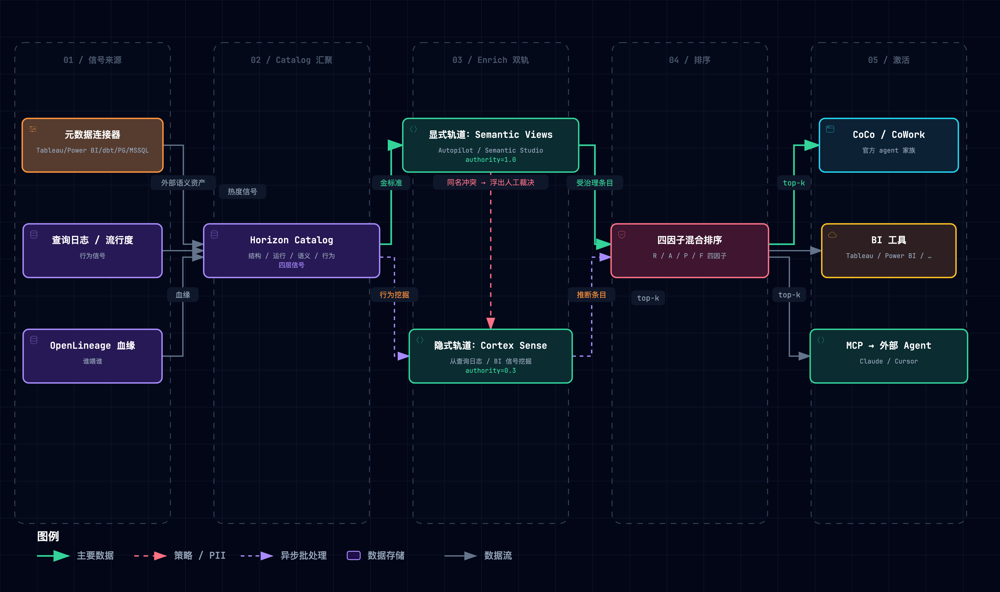
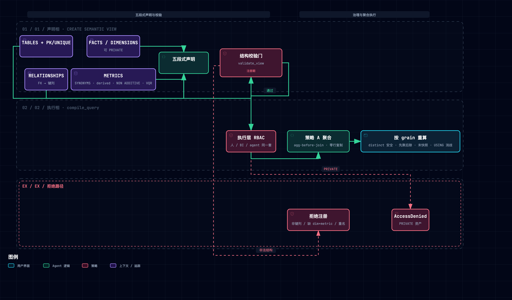
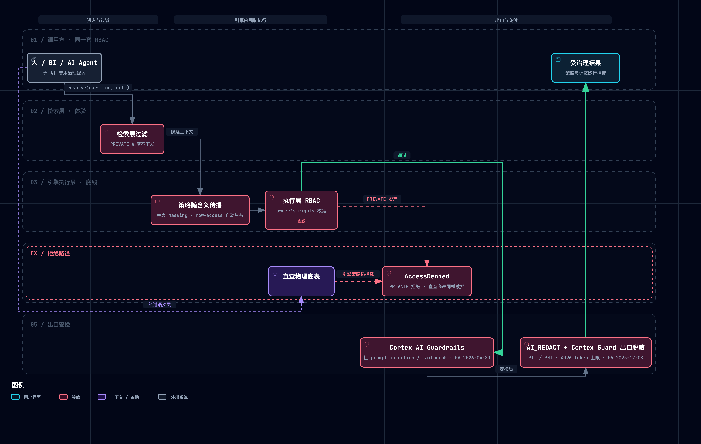
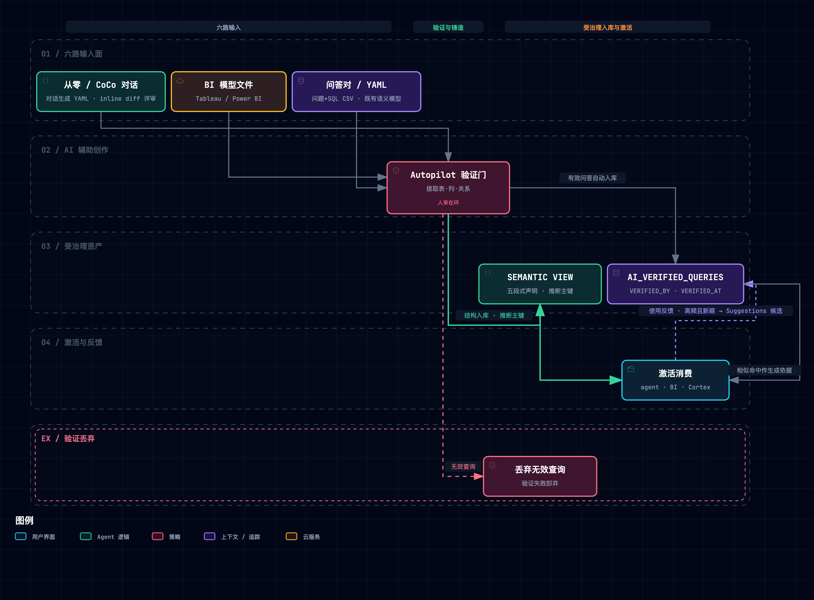
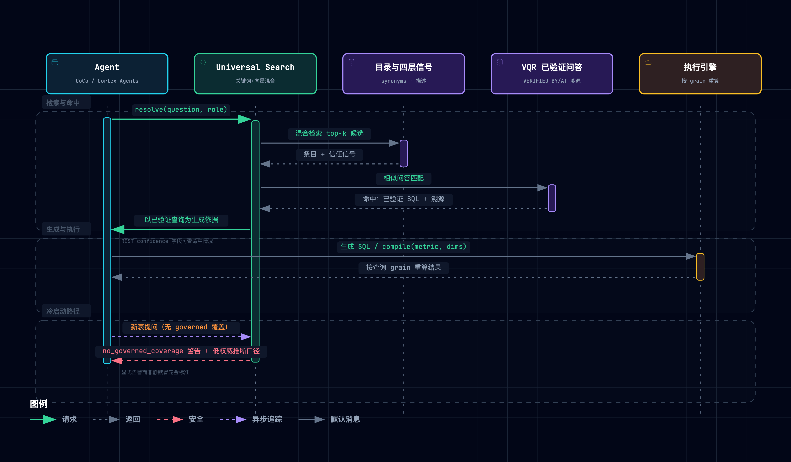
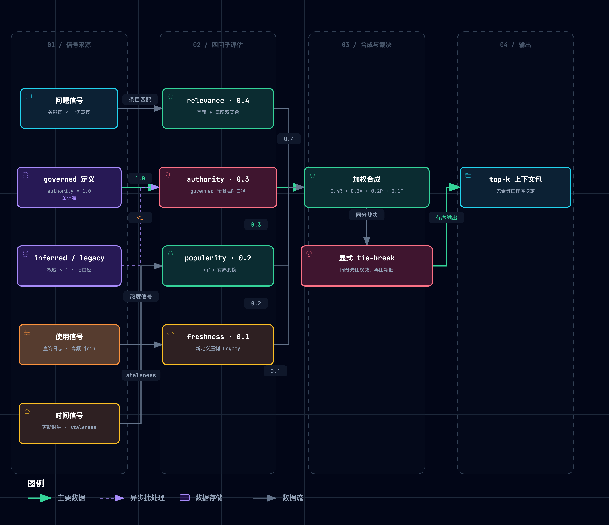
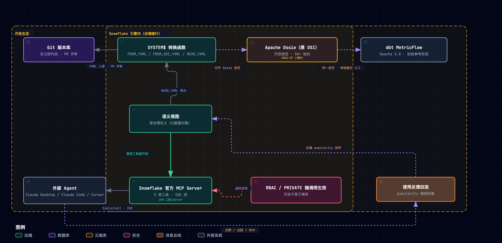

> [!NOTE] **核心精读范围**
>
>
> - [Snowflake, "Horizon Context — Governed Semantic Layer & Data Catalog," 产品页, 2026](https://www.snowflake.com/en/product/features/horizon-context/)
> - [公告博客 "The Governed Context Layer for AI, BI and Apps," 2026-06](https://www.snowflake.com/en/blog/horizon-context-governed-context/)
> - [Summit 26 新闻稿, 2026-06-02](https://www.snowflake.com/en/news/press-releases/snowflake-advances-trusted-ai-with-snowflake-horizon-catalog-centralizing-governance-context-and-security-across-the-enterprise/)
> - [docs: 语义视图](https://docs.snowflake.com/en/user-guide/views-semantic/overview) / [CREATE SEMANTIC VIEW](https://docs.snowflake.com/en/sql-reference/sql/create-semantic-view) / [validation-rules](https://docs.snowflake.com/en/user-guide/views-semantic/validation-rules)
> - [docs: Autopilot](https://docs.snowflake.com/en/user-guide/views-semantic/autopilot) / [Verified Query Repository](https://docs.snowflake.com/en/user-guide/views-semantic/verified-query-repository) / [建模与开发最佳实践](https://docs.snowflake.com/en/user-guide/views-semantic/best-practices-modeling)
> - [docs: Snowflake 官方 MCP Server](https://docs.snowflake.com/en/user-guide/snowflake-cortex/cortex-agents-mcp)
> - [Cortex Sense 博客, 2026-06-30](https://www.snowflake.com/en/blog/enterprise-ai-agents-grounded-context/)
> - [工程博客 "Why Do We Need Semantic Views?", 2026-03](https://www.snowflake.com/en/blog/engineering/why-we-need-semantic-views/)
> - [Cortex Search 检索工程博客（混合排序基准）](https://www.snowflake.com/en/engineering-blog/cortex-search-and-retrieval-enterprise-ai/)
> - [OSI 创立新闻稿, 2025-09-23](https://www.snowflake.com/en/news/press-releases/snowflake-salesforce-dbt-labs-and-more-revolutionize-data-readiness-for-ai-with-open-semantic-interchange-initiative/)
> - [OSI→Apache Ossie](https://www.snowflake.com/en/blog/apache-ossie-open-semantic-interchange-incubator/)

**一句话定位**：Snowflake Horizon Context 是 **嵌在 Data 治理引擎层、在查询时强制执行** 的 Context Layer —— 把业务定义、指标、关系、血缘、用法沉淀为受治理的元数据对象，让人、BI 工具、AI Agent 从同一份定义推理，而不是各自猜测。

> [!TIP] **怎么读笔记**
>
> 每个机制节按「类比 → 机制 → 原型」三拍进行记录和实践，M1–M7 七个机制节各配一张 archify 动效工程图（交互版下载到本地打开，默认经典视图可切主题/缩放/聚焦，trace 动画按主路径逐边点亮）。其中实践取自配套的最小原型 [`assets/horizon_context_lab.py`](./assets/horizon_context_lab.py)（约 916 行纯标准库代码，M1–M6 六机制 + 场景矩阵 + 破坏性实验；另有 MCP 服务原型 [`assets/horizon_context_mcp.py`](./assets/horizon_context_mcp.py) 验证平台集成路径）。

配套产物：[Context Layer 基础设施设计蓝图](./013-context-layer-blueprint.md) · [Horizon Context ↔ negentropy 机制映射报告](./012-horizon-context-mapping-negentropy.md)。

---

## 1. 解决什么问题：为天才实习生配发「终极入职包」，让他秒变业务老司机

销售负责人说 Q3 收入 **$14.2M**，CFO 报的却是 **$12.8M**——Snowflake 官方拿这组对账数字开场：同一份数据，两个答案。没有人算错数，错的是**含义无人治理**：企业底层数据库躺着的，往往是密码般的物理列名（如毛收入叫 `amt_ttl_pre_dsc`）；真实业务指标（如净利润）的计算口径也散落在不同报表各自的 `CASE WHEN` 逻辑里。各业务域子系统自说自话，谁也不懂谁。

据 Snowflake 实测，**让缺乏 Context Layer 治理的初级 Data Agent 直接回答企业数据问题，准确率仅有 ~25%（Snowflake 内测）/ 21%（Anthropic 独立复测）**。这并非初级 Data Agent 所使用的模型笨，而是缺了 Context Layer 对语义的有效治理。具体体现为这三个不可自愈的系统性病灶：

1. **口径打架（含义散落）**：指标口径写在各自的散落业务里，同一个业务指标问两个子系统，能得出两套不同数字；
2. **定义漂移（脱节失效）**：外挂语义层独立于 Context Layer，底层数据表的变更会令语义立即脱节，Agent 会按过期的语义手册瞎猜；
3. **门禁穿透（治理虚设）**：权限规则只浮在外部系统，拦不住绕过中间层直查物理底表，安全防线形同虚设。

初级 Data Agent 就像一位智商超群的天才实习生，他满腹经纶、理解力极强，但完全不懂贵司的标准流程与方言黑话。

要把这位天才实习生真正培养成懂业务、守规矩的“业务老司机”，Horizon Context 的解法是，**把业务 Context 与安全守则铸入底层引擎，使其无法被篡改与绕过**。Horizon Context 为此确立了五条硬核设计：

| 设计规格                 | 底层机制                   | 大白话                                                                |
| :----------------------- | :------------------------- | :-------------------------------------------------------------------- |
| **定义一次、处处生效**   | M1 五段式 Context 对象模型 | 权威术语手册只印一份，人、报表与 Agent 全部照章引用，不再各自抄写抄错 |
| **动态现算、保真不走样** | M2 查询时语义正确性        | 发智能公式按需现算，绝不拿预先拼凑的二手死报表将就应付                |
| **原生治理、杜绝穿透**   | M3 引擎原生治理            | 门禁直接装在机房承重墙上，无论谁走哪条路查数据，安全锁底层强制生效    |
| **行为挖掘、覆盖长尾**   | M4 双轨富化与自纠          | 手册没写全的暗规则，系统通过日常观察老分析师的用数习惯自动补全自愈    |
| **标准开放、随处插拔**   | M7 开放互操作              | 入职包采用通用插头与开放格式，任何外部智能体和工具拿来就能立刻用      |

> [!TIP] **入职包里都有什么**
>
> 初级 Data Agent 就像一个 **每天都在重新入职、毫无经验沉淀的天才实习生**；Horizon Context 要做的，是给这位天才员工配备一份 **永远最新的入职包**：
>
> - 公司术语表：Semantic Views 显式定义；
> - 前台问询处：CoCo（数据原生 AI 编程代理，前身 Cortex Code）混合检索；
> - 门禁卡与权限：引擎级 RBAC；
> - 「大家实际都在用什么」的行为统计：Cortex Sense 隐式挖掘；
> - 前辈验证过的 FAQ：AI_VERIFIED_QUERIES 带署名与日期。
>
> 用 Snowflake 官方的话讲：*Without context, an agent guesses. With context built natively into the platform, an agent acts. With context that is also governed natively, an agent can be trusted.*

## 2. 全景与三阶段演进：Horizon Context 是怎么长出来的

> [!TIP] **类比**
>
> 这套系统的演进史，像一座图书馆的进化史：起初只有一本登记簿（记录馆里有哪些书）；后来馆里编了权威的分类法与索引卡（把含义做成对象）；再后来装了门禁、请了馆长，还派学徒照着读者的真实习惯补卡（治理内嵌与双轨富化）；最后图书馆加入城市联盟，一张通借通还卡谁都能用（生态开放）。

### 2.1 伞下定位：从「表的登记簿」到「业务的 working model」

Horizon Context 不是一款孤立产品，而是 **Horizon Catalog**（Snowflake 官方称 "the agentic catalog"）长出的能力伞。Snowflake 给这条演进线的定调只有一句：把目录 **"from a system of record into a system of understanding"**——从「记录有哪些表的登记簿」变成「理解业务含义的知识体」。

再补半句就是它的野心边界："building a working model of your entire business, not just a catalog of your tables"（给整个业务建一个可运转的模型，而不只是给表建目录）。伞下组件与七机制的对应关系：

| 组件 | 一句话职责 | 机制锚点 |
| --- | --- | --- |
| Semantic Views（五段式对象） | 把表/关系/事实/维度/指标铸成带校验门的受治理元数据 | M1 |
| 查询时执行（standard SQL） | 按查询 grain 现算聚合，四大保障拦「合法 SQL 错误答案」 | M2 |
| 引擎原生治理（RBAC/masking/row access/AI Guardrails/AI_REDACT） | 策略在引擎层对每个调用方强制执行 | M3 |
| Autopilot / Semantic Studio | 六路输入自动起草并验证语义视图，from days to minutes | M4 |
| Metadata Connectors（源自 Select Star 收购） | 把 Tableau/Power BI/dbt 等外部语义资产摄取进目录 | M4 |
| Cortex Sense | 从查询历史与 BI 指标自动拼装隐式理解并自纠 | M4 |
| AI_VERIFIED_QUERIES（VQR） | 人验问答对成为一等资产，供检索激活复用 | M5 |
| Universal Search / Cortex Search | 关键词+向量混合检索元数据与高基数文本列 | M5 |
| 四因子信号排序 | 相关性/权威度/流行度/新鲜度压出 top-k | M6 |
| Snowflake 官方 MCP Server | 把语义视图与检索以受控工具面开放给外部 agent | M7 |
| Ossie（原 OSI） | 开放 YAML/JSON 语义规范，跨平台互导 | M7 |
| CoCo / CoWork / Cortex Agents | 消费这份 context 的 Snowflake 官方 agent 家族 | M5/M7 |
| Automatic Data Agents | 对 Marketplace/共享数据一键生成语义视图 + Cortex Agent | M7 |
| External lineage | 跨系统记录「谁喂谁」的血缘（2026-09-03 GA） | 全景（Structural） |

读表方法：M1–M3 是「定义与执法」的骨干（伞的骨架），M4 是「进料与富化」（伞不断变厚的原因），M5–M6 是「分发」（伞面），M7 是「出口」（把伞借给别人的把手）。表外还有两个角色：Agent Identity（2026-06-02 GA，给 agent 发可治理的独立身份、进同一套 RBAC）与 OpenLineage 摄取（External lineage 的输入侧，公开预览）。

### 2.2 三阶段叙事：先造对象，再装治理与富化，最后开生态

**阶段一 · 语义对象化（2024-02 → 2025-08）**。这条弧从检索开始：Universal Search（2024-02-20 预览）先暴露了真问题——agent 连「有哪些表、列叫什么」都找不到；Cortex Search（2024-08-08 公开预览并发布检索基准）把文本列检索做成服务。两者的共同结论是：光有检索不够，**含义本身必须成为带校验门的元数据对象**。

于是 semantic views 走完预览（2025-04-17）→ Summit GA（2025-06）→ 查询 GA（2025-08）（GA = General Availability，正式发布），本笔记 M1/M2 的对象模型与查询保障在此成形。客户侧的拉力同样直白："We don't need more dashboards — we need a unified language that ensures the math is right"。

**阶段二 · 治理内嵌与双轨富化（2025-09 → 2026-06-02）**。对象有了，接下来是三个问题：谁守护它、谁来填满它、怎么送出去。**守护**——治理策略迁进引擎并在含义层强制执行（AI_REDACT GA 2025-12-08、Cortex AI Guardrails GA 2026-04-20），Snowflake 官方口径 "enforced at the meaning level, not just the table level"。

**填满**——显式轨道配加速器：收购 Select Star（2025-11-24，创始人 Shinji Kim 的团队与技术整体入仓；同一年 Snowflake 还收了 6 月的 Crunchy Data 与 11 月的 Datometry）拿到外部语义资产摄取，Autopilot GA（2026-02-03）把建视图周期从数天压到数分钟（"from days to minutes"）；隐式轨道交给 Cortex Sense 从行为里挖。**送出**——OSI 创立（2025-09-23）与 Snowflake 官方 MCP GA（2025-11-04）两条管道同期打通。2026-06-02 Summit 把这一切收拢成伞并命名 Horizon Context；外部世界的注脚是 InfoWorld 转述 HFS 的判断——「AI 工作负载之战将赢在 metadata、lineage 与 trust」。

**阶段三 · 生态开放与运营化（2026-06-30 → 今）**。单仓治理做完，context 开始变成**随数据产品分发的生态通货**：Cortex Sense 亮相（2026-06-30 博客、2026-07 私有预览）；OSI 捐入 Apache 孵化器更名 Ossie（2026-07-08，50+ 组织）；消费端 CoWork（知识工作者个人代理，前身 Snowflake Intelligence）就位、Semantic Studio 公开预览（2026-08-26）、Snowflake 官方建议 Cortex Analyst 用户迁往 Cortex Agents（2026-08-28，语义视图与 VQR 沿用）。

运营侧 Power BI 摄取 GA（2026-08-18）、agent 数据血缘（2026-09-02）与 External lineage GA（2026-09-03）把「谁在用、谁喂谁」变成可运营的资产；Automatic Data Agents 对 Marketplace 清单一键生成语义视图加 Cortex Agent，context 随数据产品自带。客户侧 BlackRock、Indeed、Simon AI、Wix 是早期采用证言；伙伴侧 Tableau、Looker、Alation、Collibra 等十家表态接入，Looker 称将 "support analytical models hosted in-database"。Snowflake 官方的运营哲学一句话："Context only works if it gets used."

> [!NOTE] **两个 Snowflake 官方 agent 的名字**
>
> - **CoCo**：数据原生 AI 编程代理（前身 Cortex Code，2026-02-03 发布；Snowflake 官方从不展开这个缩写；Snowsight / Desktop / CLI 三形态）；
> - **CoWork**：面向知识工作者的个人代理（前身 Snowflake Intelligence，2025-11-04 GA）；
> - 二者是 Cortex Sense 的典型受试方与消费方——Sense 挖出的隐式 context，最终经这类 agent 在真实工作流里被用掉。

### 2.3 时间线速览

同弧合一行；各里程碑的机制详解见 M1–M7 各节。

| 时点 | 里程碑 | 一句话意义 | 笔记落点 |
| --- | --- | --- | --- |
| 2024-02-20 | Universal Search 预览 | 检索先行：先解决「agent 找不到数据」 | M5 |
| 2024-08-08 | Cortex Search 公开预览 + 检索基准 | 文本列检索底座与排序基准的起点 | M5/M6 |
| 2025-04 → 2025-08 | SV 预览（04-17）→ Summit GA → 查询 GA | 含义铸成带校验门的元数据对象 | M1/M2 |
| 2025-09-23 | OSI 创立（17 家） | 语义可携带成为跨厂商共识 | M7 |
| 2025-10-02 | Snowsight 管理 GA + MCP server 预览 | 管理面就绪，开放通道起跑 | M7 |
| 2025-11-04 | Snowflake 官方 MCP GA + Snowflake Intelligence（后 CoWork）GA | 受控工具面开放给外部 agent | M7 |
| 2025-11-24 | 宣布收购 Select Star | 外部语义资产摄取能力入仓 | M4 |
| 2025-12 | VQR 优化预览（12-02）；AI_REDACT GA（12-08） | 验证问答与出口脱敏上线 | M5/M3 |
| 2026-01 | AI_SQL_GENERATION/QUESTION_CATEGORIZATION（01-12）；External lineage 预览（01-16） | 提示词入定义、血缘外扩 | M1 |
| 2026-01-27 | OSI v1 定稿（33 家，Databricks 加入） | 规范定稿、竞对入局 | M7 |
| 2026-02-03 | BUILD London：Autopilot GA + Cortex Code 发布 | 显式轨道 "from days to minutes" | M4 |
| 2026-03 | standard SQL 查询 GA（03-02）；NON ADDITIVE BY + Tableau TDS 导出（03-05）；工程博客（03-09）；USING relationship path（03-13） | 查询面与聚合保障齐装满员 | M2 |
| 2026-04 | AI_VERIFIED_QUERIES 进 DDL（04-05）；Cortex AI Guardrails GA（04-20） | 验证问答一等资产化；prompt 安检上线 | M1/M3 |
| 2026-06-02 | Summit：Horizon Context 发布（Studio/Connectors/Advanced Semantics 私预；Agent Identity GA；54 OSI） | 收拢成伞：登记簿变理解系统 | 全景 |
| 2026-06-30 → 2026-07 | Cortex Sense 博客与私预；OSI→Apache Ossie（50+） | 隐式轨道亮相；规范捐入基金会 | M4/M7 |
| 2026-08 → 2026-09 | Power BI 摄取 GA（08-18）；Studio 公预（08-26）；Analyst→Agents 建议（08-28）；agent 血缘（09-02）；External lineage GA（09-03） | 生态开放与运营化 | M4/M7 |

换个读法：两年半里检索类事件 4 个、对象类 6 个、治理类 5 个、生态类 8 个——重心肉眼可见地从「找得到」移向「信得过、带得走」。

## 3. M1 · 五段式 Context 对象模型：把语义便利贴装订成册

> [!TIP] **类比**
>
> 初级 Data Agent 系统所面对的 Context 就像钉满墙面的便利贴，上面记录了散落的 SQL/prompt 硬编码等；而 Context Layer 负责为这些便利贴标记 Owner、版本、权限属性等，装订成一本规章制度手册。手册里甚至夹着「agent 使用说明」（AI_SQL_GENERATION）和「前辈验证过的 FAQ」（AI_VERIFIED_QUERIES）等。

> [!NOTE] **机制**
>
> 五段式声明：
>
> - **TABLES**（带 PRIMARY KEY/UNIQUE 约束）
> - **RELATIONSHIPS**（声明式 join，FK 必须指向键列）
> - **FACTS**（行级量，可 `PRIVATE`）
> - **DIMENSIONS**（切片维度，可挂 Cortex Search）
> - **METRICS**（命名聚合）
>
> 语义视图（`SEMANTIC VIEW`）：**Snowflake 官方明确定义为元数据**（"Semantic views are considered metadata"），与数据同库同治理。
>
> 对象字段里藏着的五个设计：
>
> 1. **`WITH SYNONYMS`**：Agent 召回所需的别名本身就是受治理上下文（「毛收入/营收/sales」写进定义）。Snowflake 官方最佳实践对此相当克制：synonyms "generally add little accuracy"，自动生成的别名常降质、须人工精修；真正第一位的是 descriptions——"the single most important element for accuracy"；
> 2. **`AI_VERIFIED_QUERIES`**：人验证过的问答对成为一等资产：`QUESTION + SQL + VERIFIED_AT + VERIFIED_BY (purpose=contact)`，**答案样例带审计溯源**（完整激活口径见 M5）；
> 3. **`AI_SQL_GENERATION / AI_QUESTION_CATEGORIZATION`**：给 Agent 的提示词内嵌在定义里，随定义分发、随定义治理；
> 4. **`PRIVATE | PUBLIC`**：事实与指标级可见性；
> 5. **`NON ADDITIVE BY (dims)`**：半可加性声明（见 M2）。
>
> **注册校验门的完整规则面**（validation-rules 文档）：
>
> - FK 必须指向键列（原型 D6 演示的就是这道门）；
> - 传递关系自动推导：line_items → orders → customer 一跳可达；基数合成有律——1-1 链保持 1-1，1-1 + 多对一 → 多对一；
> - 自引用暂不支持（employee/manager 一类的层级）；
> - 两表间存在多条关系路径时，两表互相不可引用对方的语义表达式，metric 必须显式指定路径（与 M2 的 USING 消歧同源）；
> - 跨粒度引用须嵌套聚合（如 `AVG(SUM(orders.o_totalprice))`）；维度可引用更高粒度表，metric 不能引用本表 metric；
> - 窗口函数 metric 不可行级计算、不可被引用。
>
> 这套规则的价值要倒过来读：校验门不是为了拒绝而拒绝，而是把「语义注册」从自由文本变成**可判定的结构**——M2 的执行保障全部依赖这里注册的基数与路径信息。
>
> **DDL 治理位（一行式）**：`CREATE OR ALTER`（幂等更新定义）· `TAG`（治理标签）· `COPY GRANTS`（重建时保留授权）· `LABELS=(FILTER)`（指标可过滤标签，2026-05 落地）· relationship 支持 `ASOF` 与 range join（时点对齐类关联）。
>
> 四层 Context（Snowflake 官方 FAQ）：
>
> - **Structural**：有什么、怎么连
> - **Operational**：查询、新鲜度、性能
> - **Semantic**：定义、指标、本体
> - **Behavioral**：热度、用法模式
>
> 这四层 Context 是在 Collect → Enrich → Activate 三段式流水线上流转的原料。最后一个伏笔：这套对象的输入面后来被一场收购大幅拓宽——Snowflake 官方明说 Horizon Context 的相关能力「建立在 Select Star 收购之上」（2025-11-24 宣布；Wave 1 五个元数据连接器 PostgreSQL、SQL Server、Tableau、Power BI、dbt 即源于此，见 M4 与时间线）。



> 图源（可 diff 文本）：[`horizon-context--collect-enrich-activate.mmd`](../../assets/mermaid/cognitive-context/horizon-context--collect-enrich-activate.mmd) · 交互版（下载到本地打开）：[`horizon-context--collect-enrich-activate.html`](../../assets/architecture/cognitive-context/horizon-context--collect-enrich-activate.html)

> [!IMPORTANT] **原型实践**
>
> 结构校验门拦下「指向非键列的 relationship」（D6 实验，实际运行输出）：
>
> ```text
> [PASS] D6: 拆结构校验（relationship 指向非键列）→ relationship bad: referenced column
> customers.plan is not PRIMARY KEY/UNIQUE—— 无门则垃圾定义静默入库（行数失控的注册期引信）
> ```

## 4. M2 · 查询时语义正确性：发「防错公式」不发「死报表」，保现场推导不保原料残缺

> [!TIP] **类比**
>
> 指标在系统里不是预先算好的存储值（死报表），而是一套**现场按需推导的智能算式（命名聚合）**。无论分析师或 Agent 想要哪个维度的切片，系统都拿着底层原始明细、按当下的统计需求现场套用公式重算。
>
> 就像入职包里给实习生配发了一台**「内置财务防错逻辑的智能计算器」**：无论老板要查哪条业务线，实习生只要套用标准公式现场算，绝不会算错；但若上游交接工作时早已把原始凭证碎掉、只扔来一张粗暴汇总好的二手旧账（如 dbt 已把日活预聚合成日汇总），计算器再聪明也逆向推导不出明细流水。
>
> **这套机制确保「只要给出的原始单据与查询粒度合理，系统底层自动算对」，但无法拯救「上游预处理过早丢失明细的残缺数据」**。

> [!NOTE] **机制**
>
> 为什么让初学者或 LLM 自己写关联查询（JOIN）极易翻车？Snowflake 官方的定性一针见血："SQL is a literal language, but business logic is contextual."——数据分析领域存在一个隐蔽杀手：**“语法完全合法，但业务答案全错”（*that was valid SQL, but it was not valid analytics*）**。大模型在工业级基准测试（如 TPC-DS）中也频频踩坑。为此，Horizon Context 在底层内嵌了“四大聚合保障 + 一个消歧路径 + 一条性能后手”，彻底封堵常见算错陷阱：
>
> 1. **先聚后连（agg-before-join）**：防“金额被动翻倍”。两表关联时，各自指标先在本地汇总再做拼接；防止一笔 $100 的订单因关联了 3 条送货记录而被机械复制放大成 $300（行业经典的 **fan trap / 扇形陷阱**，如 Sam Waters 案）；
> 2. **按集合去重（distinct 聚合跨 join 安全）**：防“重复虚增人数”。`COUNT(DISTINCT)` 跨表关联时，严格按去重集合而非物理行数统计，即使底层因连接膨胀出多行，活跃客户等去重指标依然准确；
> 3. **先合总数再相除（derived 先聚后除）**：防“平均数的平均数”。计算客单价或利润率等派生指标时，强制先汇总总分子与总分母再做除法 `DIV0(total_revenue, total_cost)`，防止各部门平均值直接相加求二次平均产生荒谬失真（如真实平均为 4.8，朴素均值却算成 16.0 的 **average of averages 陷阱**）；
> 4. **半可加性末快照（NON ADDITIVE BY）**：防“账户余额跨天累加”。银行账户余额可以跨部门相加，但绝不能把 30 天的余额当流水相加；系统识别半可加指标，按时间序列自动取**最新期末快照**而非机械求和（该子句出自 CREATE SEMANTIC VIEW 文档、2026-03-05 落入 DDL，工程博客并未提及）；
> 5. **显式指定关联路径（USING relationship）**：防“笛卡尔积爆炸”。当两张表之间存在多条连接通道（如订单表同时包含“发货地址”与“收货地址”）时，显式指定唯一关系路径，消除歧义，避开两眼一抹黑的 **chasm trap（深渊陷阱）**；
> 6. **按需物化与自动改写（Advanced Semantics，私有预览）**：解「重算保正确 vs 物化保性能」的两难。同一份定义可以有两个执行策略——默认按查询 grain 重算（保正确）；用户自定义物化 + 引擎自动改写查询、无感命中物化（保性能），另含 level-of-detail 计算与可组合定义。代价受 `MAX_STALENESS` 约束：最小 120 秒、一旦配置物化便不可取消——用受控的过期容忍换性能，业务定义始终只有一份。
>
> Snowflake 官方对这套对象的一句话定位："A semantic view isn't just a technical layer; it's an insurance policy for your data's integrity."



> 图源（可 diff 文本）：[`horizon-context--declaration-execution.mmd`](../../assets/mermaid/cognitive-context/horizon-context--declaration-execution.mmd) · 交互版（下载到本地打开）：[`horizon-context--declaration-execution.html`](../../assets/architecture/cognitive-context/horizon-context--declaration-execution.html)

> [!IMPORTANT] **原型实践**
>
> B 场景 5 组陷阱破坏性实验实际运行输出（对照值均为引擎正确路径）：
>
> ```text
> [PASS] B1: fan trap: 引擎 Jan=200 vs 朴素 Jan=440（o1 的 3 条事件把 $100 变 $300）
> [PASS] B2: average of averages: 先聚后除 108.33 vs 月均值的均值 122.22
> [PASS] B3: 拆 distinct: 退化为数事件行 [6,1,2]（对照 [3,1,2]）
> [PASS] B4: NON ADDITIVE: 末快照 [5,6,7] vs 求和 [11,6,7]；全期 7 vs 24
> [PASS] A3: distinct 跨 join 安全: 正常 [3,1,2]；fan-join 下 SUM=440 而 distinct 仍 [3,1,2]；月格相加 6 ≠ 总体重算 5
> ```

## 5. M3 · 引擎原生治理：门禁焊在大楼承重墙，杜绝任何绕道直查

> [!TIP] **类比**
>
> 传统的第三方外挂治理，就像在公司大堂摆了一块“闲人免进”的塑料告示牌，或者雇了个外包保安在门口登记。表面看似合规，但只要有人从后门直接溜进地下机房与档案室（直查物理底表），里面的商业机密就能被看个精光。
>
> Horizon Context 则是直接把**生物识别门禁焊进了机房承重墙**——不管是老员工、BI 分析软件，还是 AI 实习生，任何人只要调取数据，都必须在数据库引擎底层刷卡验身，没有任何“后门”可抄。

> [!NOTE] **机制**
>
> Snowflake 官方给出的核心准则是：**治理策略直接在查询引擎层执行，而不是在应用层做样子**（*Governance policies execute at the query engine layer, not the application layer. They apply automatically to every caller: human analyst, BI tool, or AI agent. There is no separate governance configuration for AI workloads.*）。系统对人与 AI 一视同仁，不设立孤立脆弱的“AI 专用防线”，并在底层铸造了四重刚性约束：
>
> 1. **权限同源（owner's rights + 统一 RBAC 与私密隔离）**：AI Agent 与真实员工共享同一套权限体系；语义视图按 owner's rights 执行——查询者无需逐个底表授权；被标记为 `PRIVATE` 的敏感指标在底层对无权者直接不可见、不可查。一个例外要记牢：Cortex Agents 走语义视图时须同时持有语义视图与底表的 SELECT；
> 2. **策略随含义传播**：底表的 masking / row-access policy 自动传播到语义视图并强制执行——治理是 "enforced at the meaning level, not just the table level"；语义“住”在治理引擎里、查询时执行而非拷贝缓存（"semantics live inside the governance engine and are enforced at query time, not copied or cached"）。权限与安全标签随数据产品一路携带（即使分享到外部 Marketplace 也不会丢失策略）；
> 3. **出口安检（两个指称要分开）**：拦 prompt injection / jailbreak 攻击面的是 **Cortex AI Guardrails**（GA 2026-04-20，2026-05-14 扩展）；PII / PHI 实时脱敏是 **AI_REDACT**（GA 2025-12-08，单次 4096 token 上限）与 Cortex Guard 的职责——两件事常被混为一谈，实际是两套机制；
> 4. **底层兜底不可绕过（跨引擎一致执行）**：无论是本地查询还是通过开放格式（如 Iceberg REST 兼容引擎）调用，所有安全策略均在引擎深处刚性生效。Snowflake 官方一针见血指出：第三方外挂层根本拦不住直接查物理表，而内嵌于引擎的治理谁也绕不过去（*cannot be circumvented*，具体边界见批判性边界第 3 条）。定义变更的纪律同样刚性：除 `COMMENT` 外不可原地 ALTER，改定义须 `CREATE OR REPLACE` 重建（配合 `COPY GRANTS` 保留授权）；semantic models 亦无批量转换路径。
>
> 一条例外要盯住：**sample values 是元数据、不脱敏**——它经 `GET_DDL WITH EXTENSION` 暴露，Snowflake 官方仅「建议」放代表性非敏感值而无强制（见批判性边界第 6 条）。



> 图源（可 diff 文本）：[`horizon-context--engine-governance.mmd`](../../assets/mermaid/cognitive-context/horizon-context--engine-governance.mmd) · 交互版（下载到本地打开）：[`horizon-context--engine-governance.html`](../../assets/architecture/cognitive-context/horizon-context--engine-governance.html)

> [!IMPORTANT] **原型实践**
>
> 实际运行输出的双层防御自证（C2 破坏性实验）：
>
> ```text
> [PASS] C2: RBAC 双层: 检索层对 intern 过滤 plan 建议（["dim_filtered (PRIVATE): ['plan']"]，
> 降级总量 {(): 650}）；直闯执行层 → AccessDenied（引擎是最后防线）
> ```

## 6. M4 · 双轨富化与自纠：手册写不全看习惯补，两轨冲突绝不盲猜

> [!TIP] **类比**
>
> 入职包里的官方手册（手工 Semantic Views）就像专家定期编撰的《百科全书》：权威严谨，但耗时耗力，在庞大企业里往往只能覆盖不到 5% 的核心业务，绝大多数长尾提问都在手册外。
>
> 真正的老司机必须像持续演化的 Wikipedia 一样走向群智进化。系统不仅读死手册，更会从老分析师们每天提的查询历史、常用报表里“观察习惯、偷师学艺”（行为挖掘），自动补齐剩下的 95%。
>
> 但这套偷师机制有一条**绝不可破的纪律底线**：当发现专家手册与民间习惯口径打架时，系统**绝对不准自作主张瞎蒙一个**，必须老老实实把冲突摆上台面交由人工裁定。

> [!NOTE] **机制**
>
> Snowflake 内部实测揭示了一个残酷现实：全司 9,685 张数据表中，人工构建的语义视图覆盖率**不足 5%**——“手册内的问题答得极好，但大多数日常提问都落在手册外的荒原”。为此，Horizon Context 给「把手册写厚」配了两条轨道。
>
> **显式轨道的加速器：Autopilot（GA 2026-02-03）**。专家手写 YAML 的产能是瓶颈，Autopilot 以六路输入面接管起草：
>
> 1. 从零开始；
> 2. 与 CoCo 对话生成 YAML，以 inline diff 逐条接受或拒绝；
> 3. 导入 Tableau 文件（TWB/TWBX/TDS/TDSX）；
> 4. 导入 Power BI 文件（.pbit/.pbix）；
> 5. 自然语言问题 + SQL 对（或两列 CSV）；
> 6. YAML 上传。
>
> 起草不是终点，每条候选都过**验证门**：自动验证并丢弃无效查询、提取表/列/关系，**有效者自动入库 verified queries**；主键靠元数据分析或 distinct 计数推断；还会从创建角色的查询历史建议常用查询。Snowflake 官方口径的收益："from days to minutes"。规模护栏：首个视图 <10 表、≤50 列；其管理面 Semantic Studio 已于 2026-08-26 公开预览。（文件级导入之外，目录级的外部资产摄取走 Metadata Connectors——Wave 1 五连接器源自 Select Star 收购，见 M1。）
>
> **隐式轨道：Cortex Sense（2026-07 私有预览）**。从日常查询历史、转换工具模型和 BI 指标中自动拼装隐式理解。Snowflake 官方对其定位说得很清楚——"designed to work alongside semantic views, not instead of them"。
>
> 隐私边界同样明确："will only ingest metadata and usage patterns, not your actual data rows"（只摄取元数据与使用模式，不碰真实数据行）。
>
> 两条轨道的交汇点是 verified queries：Autopilot 把验证过的问答直接铸进语义视图，Sense 把行为里挖出的候选提交 Suggestions；一显一隐，最终汇入同一份受治理资产（候选入选标准见 M5）。
>
> 为了彻底防范“自动挖掘会导致系统自信满满地胡说八道（confidently wrong）”，两轨共享三层纪律防线：
>
> 1. **反馈自纠环（Eval Loop）**：接入金标准问答集、用户点赞/点踩反馈与系统自检薄弱区三路输入，一旦识别出理解错配即自动修正；
> 2. **冲突强制浮出（Conflict Escalation）**：当挖掘出互相矛盾的指标口径（如不同团队对活跃用户的定义冲突）时，系统主动拒答，并向数据团队弹出冲突卡片，由人工自然语言指认归属。Snowflake 官方强调：*这种敢于承认不知道的诚实底线，彻底拉开了它与那些“搜到什么就硬答什么”的普通 RAG 之间的本质差距*；
> 3. **信号分层排序**：赋予受治理金标准更高的权威权重（详见 M6）。
>
> **实证成效**：在“口径过时”与“未人工覆盖”两个长尾地带，自动化富化的准确率反超纯人工标注 10 个百分点；整套上下文底座的搭建耗时从数月缩短至单日内。



> 图源（可 diff 文本）：[`horizon-context--autopilot-loop.mmd`](../../assets/mermaid/cognitive-context/horizon-context--autopilot-loop.mmd) · 交互版（下载到本地打开）：[`horizon-context--autopilot-loop.html`](../../assets/architecture/cognitive-context/horizon-context--autopilot-loop.html)

> [!IMPORTANT] **原型实践**
>
> C3 冲突隔离拦截与 C4 自纠环实际运行输出：
>
> ```text
> [PASS] C3: 冲突浮出: CONFLICT 卡片 [('governed', 'count_distinct(orders.customer_id)'),
> ('inferred', 'count(events.id) by total')]（无数值）；agent 拒答；compile → ConflictingDefinitionError
> [PASS] C3b: 人工裁决（governed 胜）后恢复: [3, 1, 2]
> [PASS] C4: 自纠环: 错配前 top1=active_users（sum(dau)=[11,6,7] 错）→ 补 synonym + 调信号
> → top1=active_customers（count_distinct=[3,1,2] 对）
> ```

## 7. M5 · 检索激活：懂分寸的智能前台，按需精选绝不填鸭

> [!TIP] **类比**
>
> 面对浩瀚的公司规章手册与海量的历史用数记录，前台向导绝不会把整栋档案库一股脑全塞给实习生——那不仅会把新人撑爆（上下文窗口超载、产生严重的混淆幻觉），还会浪费极高的算力成本。
>
> 这位经验老到的前台极有分寸：当你提问时，他会飞速掂量「跟问题多贴近、谁盖章更权威、平时多少人用、最近有没有更新」（掂量的方法见 M6 的四因子），只撕下最精准的两页递给你；更聪明的是，如果发现这道题前辈早已核准过标准答案（带署名的权威 FAQ），前台便以它为底稿作答，连推导计算都免了。

> [!NOTE] **机制**
>
> 当 Agent 提出自然语言数据问题时，系统采用 **“关键词 + 语义向量”混合匹配**（Universal Search 混合排名），在海量元数据中精选出 top-k 的上下文知识包（包含字段定义、分析指令与验证问答），据此激活 Agent 生成精准 SQL。
>
> 精选不是优化项而是硬约束：Snowflake 官方建模实践给整视图设了 ~100,000 token 上限（见动手实践），超出即被 Cortex Agents 剪枝、延迟与质量双伤。
>
> **验证问答（VQR）的 Snowflake 官方口径**：相似问题命中已验证问答对时，系统**以已验证查询为生成依据**——Snowflake 官方原话是 "leverages relevant SQL queries ... to generate the SQL query"，即拿验证过的 SQL 作底稿生成，而非盲目照抄重放。
>
> 每条 VQR 的完整字段：`QUESTION + SQL + VERIFIED_AT + VERIFIED_BY (purpose=contact) + ONBOARDING_QUESTION`（引导期问题标志，2026-04-05 进 DDL）；REST 响应带 confidence 字段可查命中情况。VQR Suggestions 的三条入选标准：高频使用、有语义信息量（剔除极简单问题）、相对存量新颖。
>
> **新表冷启动兜底**：面对两周前刚上线、尚无人工语义视图覆盖的新表，纯 Semantic View 路径的 Agent 会直接“拒答”，通用 Agent 会“自信答错”，而本机制能以推断口径结合风险告警（`no_governed_coverage`）平稳破局。
>
> **第二组 Snowflake 官方基准（注意口径）**：CoWork 博客（2026-06-02）给出 "83% accuracy rate when using Cortex Sense compared to 47% for CoCo and CoWork alone, and 23% for Frontier Coding Agents"（using Snowflake MCP；internal testing、complex enterprise queries）——它与 Cortex Sense 博客的 24.1% → 86.3% 是**两组不同口径的自报基准**，读法见关键实证数据与批判性边界第 1 条。



> 图源（可 diff 文本）：[`horizon-context--resolve-activation.mmd`](../../assets/mermaid/cognitive-context/horizon-context--resolve-activation.mmd) · 交互版（下载到本地打开）：[`horizon-context--resolve-activation.html`](../../assets/architecture/cognitive-context/horizon-context--resolve-activation.html)

> [!IMPORTANT] **原型实践**
>
> A1 验证问答命中、A1b 引擎重算对账与 C1 无手工覆盖推断胜出实际运行输出（原型实现为直接复用验证答案，故 lab 输出沿用「短路重放」字样；Snowflake 官方产品口径是「以已验证查询为生成依据」）：
>
> ```text
> [PASS] A1: verified 短路重放 + 溯源: verified_query {'2026-01': 200, '2026-02': 150,
> '2026-03': 300} by ( data_governance = data-team@acme.com )
> [PASS] A1b: 引擎重算 == 验证答案（对账一致）: [200, 150, 300]
> [PASS] C1: 新表无 SV: inferred 条目胜出 + 警告 ['no_governed_coverage']；覆盖 4/5 表
> ```

## 8. M6 · 信号排序：主编的四杆秤，权威压过声量

> [!TIP] **类比**
>
> 同一话题的来稿堆成山，决定谁上头版的是一位资深主编。她心里有四杆秤：跟今天的题贴得有多紧（相关性）；消息源是官方通稿还是路边小报（权威度）；多少读者已经在转发（流行度）；是今天的最新消息还是上周旧闻（新鲜度）。四杆秤一起压，压出排序——不是谁的嗓门大谁上，是越压得住的越靠前。

> [!NOTE] **机制**
>
> 先正一个归属：这套混合排序的工程出处是 **Universal Search / Cortex Search 的检索栈**（Snowflake 工程博客给出完整量化曲线）；CoCo 与 CoWork 是消费这套排序的代理，不是排序器本身。
>
> 在此之上，Cortex Sense 引入类似顶级网页检索的 **四因子信号排序体系**：
>
> 1. **相关性（Relevance）**：字面关键词与深层业务意图双重高契合；
> 2. **权威度（Authority）**：数据团队人工治理的正式语义视图，权重压倒性高于从零星查询推断出的民间口径；
> 3. **流行度（Popularity）**：在 500 条生产 SQL 中千锤百炼的高频关联模式，权重远重于只出现过 3 次的偶发写法；
> 4. **新鲜度（Freshness）**：本月新修订的最新指标定义，果断压制两年前早已失效的历史旧逻辑（Legacy）。
>
> 为什么排序值得单列一机制：富化解决「有没有」，检索解决「给多少」，排序解决「先给谁」——三件事正交，且排序的权重错配会直接放大 M4 警惕的多数派错误。
>
> **四因子有效性的唯一 Snowflake 官方量化证据**（Cortex Search 工程博客）：NDCG@10（前 10 名结果的排序质量分）从 0.22（纯词法）→ 0.49（向量）→ 0.53（混合）→ 0.59（+重排器）步步抬升；hit rate@1（首位命中率）从 0.79 → 0.83（+流行度）→ 0.86（+新鲜度）。
>
> 每加一层信号就涨一截——这就是把排序独立成机制的实证理由。
>
> 权威度权重与 M4 的冲突纪律互为双保险：即便某条民间口径流行度更高，governed 定义仍排其前；真到了口径打架的地步，则交 M4 的冲突浮出机制人工裁决，排序绝不代裁。



> 图源（可 diff 文本）：[`horizon-context--four-factor-ranking.mmd`](../../assets/mermaid/cognitive-context/horizon-context--four-factor-ranking.mmd) · 交互版（下载到本地打开）：[`horizon-context--four-factor-ranking.html`](../../assets/architecture/cognitive-context/horizon-context--four-factor-ranking.html)

> [!IMPORTANT] **原型实践**
>
> C5 新鲜度隔离实际运行输出；排序对行为反馈的动态响应见 M7 原型实践的 T6：
>
> ```text
> [PASS] C5: freshness 隔离: 'sales' → governed revenue(fresh=0.96) 压过 legacy(0.00):
> [('revenue', 'governed', 0.854), ('revenue', 'legacy', 0.826)]
> ```

## 9. M7 · 开放互操作：配发「通用转换插头」，打破厂商私有围墙

> [!TIP] **类比**
>
> 如果这套权威的入职包（受治理语义层）被锁死在特定品牌的专用办公电脑里，外部优秀的专家智囊或现代智能工具（如 Claude、Cursor 等外部 Agent）就根本无法接入，沦为封闭的“数据孤岛”。
>
> 真正的老司机必须配发**「通用的国际护照与万能转换插头」**：
>
> - **护照通用（标准文件规范）**：业务术语手册不写成厂商加密的私房暗号，而是采用全球通行的开源开放格式，无论走到哪个系统都能直接翻阅；
> - **插座通用（标准连接协议）**：在数据中心安装标准的万能通信插座，任何外部先进工具只要插上插头，就能在戴着安全锁链的前提下与企业数据自由对话。

> [!NOTE] **机制**
>
> 语义可携带性已成为跨厂商的行业共识。Horizon Context 通过两条开放路径，彻底打破了厂商锁定（Vendor Lock-in）：
>
> 1. **静态定义互通：OSI → Apache Ossie（开源通用语义规范）**：
>    - **起点是 2025-09-23**：Snowflake、Salesforce、dbt Labs 等 17 家联合创立 Open Semantic Interchange，Tableau CPO 称其为 "the Rosetta Stone for business data"；
>    - **增长曲线**：17 → 28（2025-11-13，AWS/Collibra/DataHub/JPMC/Starburst 等加入）→ 33（2026-01-27 v1 定稿，AtScale/Databricks/JetBrains/Qlik 等加入）→ 54（2026-06 Summit）→ 50+（2026-07-08 捐入 Apache 孵化器更名 Ossie）；
>    - **组织形态**：下设 Metric Language、Catalog、Ontology 三个工作组（2025-10-17 首次工作组会议）；
>    - **治理转轨**：入 Apache 后交由 foundation-led governance；dbt MetricFlow 以 Apache 2.0 许可成为初始参考实现（已交付的转换器还有 Apache Polaris 与 Snowflake Semantic Model）；Snowflake 官方迁移承诺："If you've been building on Open Semantic Interchange, nothing breaks. The name changed, but the spec didn't."；
>    - 语义视图可经 `SYSTEM$CREATE_SEMANTIC_VIEW_FROM_YAML` 从规范 YAML 创建（转换是工具级操作，别按「导入即用」预期）；
> 2. **运行时动态互通：模型上下文协议（MCP）标准连接器（GA 2025-11-04）**：
>    - **5 类工具面**：`CORTEX_AGENT_RUN` / `CORTEX_SEARCH_SERVICE_QUERY` / `CORTEX_ANALYST_MESSAGE` / `SYSTEM_EXECUTE_SQL` / `GENERIC`；Snowflake 官方推荐只暴露单个 Cortex Agent 作为面向客户端的唯一工具；
>    - **安全边界**（这组限制的共同逻辑：把「能经 MCP 做的事」收窄到可审计的最小面）：协议随 MCP revision 2025-11-25 对齐；OAuth scopes（`session:role:*`，建议 `OAUTH_USE_SECONDARY_ROLES=NONE`）；每 server ≤50 个工具；GENERIC/SQL 响应 250KB 截断；2026-08-20 起 tools/call 走 SSE 流；server 不随 failover 组复制；Native Apps 可携带 MCP（2026-07/08 GA）；
>    - **能力边界**：只支持 semantic views、不支持 semantic models（Snowflake 官方原话 "only supports using semantic views with Cortex Analyst. It does not support semantic models."）；Snowflake 官方并建议 Cortex Analyst 用户迁移到 Cortex Agents（2026-08-28，语义视图与 VQR 沿用）；
>    - 无论是桌面端的 Claude Desktop，还是开发环境中的 Claude Code、Cursor，添加自定义连接器即可在受控前提下直接问数。
>
> **生态分发面：Automatic Data Agents（Preview Open）**——对 Marketplace 清单/共享数据一键生成 semantic view + Cortex Agent，生成约 10 分钟、重建会覆盖手工修改：context 首次成为随数据产品自带的「出厂附件」。
>
> 与 dbt 的分工，Snowflake 官方给了一句干净话术："Use dbt to transform; use Horizon Context to govern meaning."
>
> **闭环安全保障**：外部工具调用绝不等于“安全裸奔”。即使通过外部 MCP 跨协议调用，底层引擎的 RBAC 与私密过滤（PRIVATE）依然刚性生效。
>
> 同时外部交互产生的使用反馈，会实时回流反哺内部热度排序——M6 的 popularity 因子在开放生态里继续积累训练样本。



> 图源（可 diff 文本）：[`horizon-context--open-interop.mmd`](../../assets/mermaid/cognitive-context/horizon-context--open-interop.mmd) · 交互版（下载到本地打开）：[`horizon-context--open-interop.html`](../../assets/architecture/cognitive-context/horizon-context--open-interop.html)

> [!IMPORTANT] **原型实践**
>
> MCP 服务原型跨进程通信与安全内控实际运行输出（assets/horizon_context_mcp.py）：
>
> ```text
> [PASS] T3: resolve_context: {'name': 'spend', 'score': 0.73, 'source': 'inferred'} + ['no_governed_coverage']
> [PASS] T5: 引擎层 RBAC 经 MCP 仍生效: plan is a PRIVATE fact
> [PASS] T6: 行为反馈闭环: feedback down 后 'sales' 解析 governed → legacy（popularity 参与排序）
> [PASS] T8: 子进程 stdio 往返: 2 响应行, active_customers=[3, 1, 2]
> ```

## 10. 关键实证数据

读表先记一条：除 21%（Anthropic 复测）与 477 vs 48（Typedef 复现）外，其余数字均为 Snowflake 官方或原厂自报——两组第三方数字恰好都打在「基线与陷阱」上，增益端始终没有独立复现（见批判性边界第 1 条）。

| 实验 | 关键数据 | 一句话读法 |
| --- | --- | --- |
| 无 Context 基线（Cortex Sense 博客） | ~25%（Snowflake 内测）；21%（Anthropic 独立复测） | 两家独立测出同一结论：缺业务含义时 agent 就是瞎猜 |
| CoCo + Cortex Sense（同上） | 准确率 24.1% → 86.3%；成本 $1.76 → $0.59/query | Context Layer 把准确率抬 3.6 倍、成本砍 2/3（自家基准，见批判性边界第 1 条） |
| Sense 第二组基准（CoWork 博客，2026-06-02） | 83%（Sense 加持）vs 47%（CoCo/CoWork 裸用）vs 23%（Frontier Coding Agents） | internal testing、complex enterprise queries 口径——与上一行不是同一组实验 |
| 覆盖率现实（Cortex Sense 博客） | 9,685 表 semantic view 覆盖 <5% | 纯手工金标准覆盖不动——隐式轨道的存在理由 |
| 检索分层增益（Cortex Search 工程博客） | NDCG@10 0.22→0.49→0.53→0.59；hit rate@1 0.79→0.83→0.86 | 词法→向量→混合→重排，每加一层涨一截（M6 四因子的量化底座） |
| fan trap（工程博客） | $100 → $300（join 复制后） | valid SQL ≠ valid analytics |
| average of averages（同上） | 16.0 vs 4.8 | 无加权平均把大小团队同权 |
| distinct 跨时间相加（Typedef 复现） | 玩具 4 vs 3；生产 477 vs 48 | governed 定义在塌缩 grain 上照样错——治理 ≠ 验证 |
| OSI → Apache Ossie | 17（2025-09-23 创立）→ 28 → 33（v1 定稿）→ 54 → 50+；100+ commits / 35 PRs | 语义可携带已成行业共识，非单一厂商私产 |
| Automatic Data Agents（Snowflake docs） | 一键生成语义视图 + Cortex Agent；生成约 10 分钟；重建会覆盖手工修改 | context 随 Marketplace 数据产品分发的生态通货 |
| 本原型 | 200 vs 440；7 vs 24；[3,1,2] vs [6,1,2]；108.33 vs 122.22 | M1–M6 机制在玩具域的逐点复现（见动手实践） |

## 11. 动手实践

把机制亲手拆坏七次，运行方式（秒级，仓库根目录执行）：

```bash
uv run --no-project python docs/research/cognitive-context/assets/horizon_context_lab.py --selftest
uv run --no-project python docs/research/cognitive-context/assets/horizon_context_mcp.py --selftest
```

机制 → 代码位置速查（`horizon_context_lab.py`；M7 的原型在 MCP 文件）：

| 机制                     | 位置                                                                                                                |
| ------------------------ | ------------------------------------------------------------------------------------------------------------------- |
| M1 五段式对象 + 验证问答 | `SemanticView` :157 · `VerifiedQuery` :148 · `build_sales_view` :170                                                |
| M1 结构校验门            | `validate_view` :232（FK→键列 / ≥1 dim+metric / 重名 / NON ADDITIVE 维度存在）                                      |
| M2 查询引擎 + 破坏开关   | `compile_query` :375 · `_naive_joined_rows` :316（策略 B 反事实）· `_aggregate` :342 · USING 消歧 `_dim_value` :288 |
| M3 双层 RBAC             | 执行层 `compile_query` :375 内 `enforce_rbac` 分支；检索层 `resolve` :532 的 `dim_filtered`                         |
| M4 冲突隔离 + 自纠环     | `Catalog.detect_conflicts` :493 · `adjudicate` :509 · `eval_loop` :629                                              |
| M5 检索 + mock agent     | `resolve` :532 · `mock_agent` :596（verified 短路 / compile / cannot_answer）                                       |
| M6 四因子排序            | `rank` :463 · `freshness` :452（REF_DATE 固定字面量）                                                               |
| M7 MCP 开放互操作        | `horizon_context_mcp.py`（stdio 服务 + T1–T8 场景自测，运行命令见上）                                               |

**破坏性实验**（均为实测，每个只改一个 flag / 一行）：

| #   | 拆什么                       | 实测退化                                              | 教训                                                          |
| --- | ---------------------------- | ----------------------------------------------------- | ------------------------------------------------------------- |
| D1  | `agg_before_join=False`      | Jan 收入 440（对照 200）                              | join-then-aggregate 是 fan trap 的标准死法，LLM 也会踩        |
| D2  | `distinct_safe=False`        | [6,1,2]（对照 [3,1,2]）                               | distinct 的安全性来自「数集合不数行」，退化即双计             |
| D3  | `last_snapshot=False`        | DAU [11,6,7]（对照 [5,6,7]）                          | 半可加指标求和 = 同一台服务器按天重复计数（477 vs 48 的机制） |
| D4  | 冲突策略改 `auto_popularity` | 推断层 count(events) 胜出 [6,1,2]（对照 [3,1,2]）     | 「不自动选」保住的正是多数派错误不碾压正确口径                |
| D5  | `enforce_rbac=False`         | intern 按 plan 拿到 [90,560]（泄露发生）              | 检索层过滤是体验，执行层拒绝才是治理                          |
| D6  | 跳过 validate 注册坏视图     | relationship 指向非键列被拦下；无门则垃圾定义静默入库 | 结构校验是行数失控的注册期前置防线                            |
| D7  | `derived_post_agg=False`     | aov 122.22（对照 108.33）                             | 平均的平均不是平均——derived 必须先聚后除                      |

七次实验合起来的实践心得与 PG 一致：每个组件单拎出来都不神奇，**拆掉任何一个都有具体的、可复现的坏法**——这是判别「工程组合创新」成色的试金石。

七次实验与 Snowflake 官方规则面一一对应：D1/D2/D7 打 M2 的保障 1–3，D3 打 NON ADDITIVE BY，D4 打冲突纪律，D5 打引擎执法，D6 打注册校验门。

玩具域之外，Snowflake 官方「建模最佳实践」给了真上生产的七条护栏：

| Snowflake 官方建议 | 一句话理由 |
| --- | --- |
| 首个语义视图 5–10 表、≤50 列起步 | 小闭环先跑通，巨无霸视图是反模式 |
| 整视图控制在 ~100,000 token 内 | 超限会被 Cortex Agents 剪枝——延迟与质量双伤 |
| 生产规模按 50+ 视图规划 | 分域拆视图，不是一个视图装天下 |
| eval 集准备 ~10 题 | 先建小而准的验收闭环 |
| VQR 不是越多越好：>20 条会拖慢优化 | 验证问答参与匹配与生成，过量反噬 |
| Cortex Search 只挂高基数文本列（>~10 distinct） | 低基数列挂检索是浪费 |
| 首个用例避开 Finance/Legal | 高敏域试点等于自找最严审查 |

上线后的可观测性也有 Snowflake 官方面板：

| 面板 | 入口 |
| --- | --- |
| 语义对象清单 | INFORMATION_SCHEMA / ACCOUNT_USAGE 各 6 张 `SEMANTIC_*` 系统表（VIEWS/TABLES/RELATIONSHIPS/FACTS/DIMENSIONS/METRICS） |
| 指标维度展开 | `SHOW SEMANTIC DIMENSIONS FOR METRIC` |
| 治理随行 | 随 schema 克隆、随账号复制、可经 Marketplace 共享 |

## 12. 批判性边界（材料没有证明的事）

1. **86.3% 是 Snowflake 自家基准**——自家数据、自家评测口径；Anthropic 只独立复现了 21% 的**基线端**，增益端无第三方复现。**83/47/23 同为 Snowflake 官方自报**（CoWork 博客，internal testing、complex enterprise queries），且与 24.1% → 86.3% 口径不同——两组数字都只能当「Snowflake 官方能力演示」读，不能当中立评测。
2. **状态时点（2026-09）**——Metadata Connectors 仍在私预（Wave 1 五连接器；Summit 架构图上画了 Iceberg/Delta/Glue/Unity Catalog/OneLake 等更多来源，但承诺集只有 5 个，Atlan 核对；一个考据细节：Select Star 收购带来的是 MySQL 连接器，产品化后重做成了 SQL Server）、Advanced Semantics 私预；已 GA/公预的有 External lineage GA（2026-09-03）、Semantic Studio 公开预览（2026-08-26）、Power BI 摄取 GA（2026-08-18）、OpenLineage 摄取公开预览。此前笔记所记 Business Glossary「H2 2026」为第三方转述、无一手出处，此处降级存疑。BlackRock 是早期采用证言，不是效果数据；Snowflake 官方博客自带 forward-looking 声明。
3. **「不可绕过」只在引擎周界内成立**——直查底层数据库、导出数据即绕过；OSI 决定定义**携带**，不解决定义在别家引擎的**执行**。
4. **governance ≠ verification**——`NON ADDITIVE BY` 是人填的声明非系统推导；上游 dbt 已把 grain 塌缩（日汇总）后，semantic view 的正确算式照样产出 477 vs 48 的错误数字；lineage 是查询日志观察到的「谁喂谁」记录，不是「这么算合法吗」的校验（Cortex Agent Evaluations 是独立 opt-in 的事后评分，不在 Horizon Context 内）。
5. **信号排序可能放大多数派错误**——popularity 权重下，被 500 条查询使用的错误 join 模式压过 3 条查询的正确模式；per-role context 未交付（私测期单角色全量）。
6. **出口安检有两条缝**——sample values 是元数据、不脱敏（经 `GET_DDL WITH EXTENSION` 暴露，Snowflake 官方仅建议放代表性非敏感值、无强制）；AI_REDACT 单次 4096 token 上限，超长文本的脱敏覆盖存疑。

## 13. 验收问答（自测答案要点）

1. **为什么语义层必须住进治理引擎**：外挂层每次查询对账两套系统→漂移；治理外挂可被直查绕过；引擎级执行对每个调用方自动生效、无单独 AI 配置（Snowflake 官方博客 + docs 原话；原型 C2 演示双层防线）。
2. **为什么按查询 grain 重算**：存储的总数冻结了粒度与过滤条件；按 grain 重算让 distinct 聚合跨 join 安全（数集合不数行）、derived 先聚后除；而 SUM 在复制行上必然膨胀（B1/B3/A3 实测）。
3. **为什么冲突必须浮出人工**：自动选择（哪怕按 popularity）会让多数派错误碾压正确口径（D4 实测 [6,1,2]）；「诚实度」正是与 RAG「找到什么用什么」的分界（Snowflake 官方原话）。
4. **OSI 没解决什么**：可携带 ≠ 可执行（别家引擎不替你 enforce）；可携带 ≠ 已验证（validator 只查 schema 合法性，不查计算合法性）。
5. **预测题（两周前新表）**：纯 SV 路径的 Cortex Agent 拒答（无覆盖即不猜）；CoCo+Sense 给推断口径的答案（authority 低、可带 warning）；直连库的通用 agent 可能自信错。第一步观察：Sense 给推断定义的 authority 与警告（原型 C1：`no_governed_coverage` + inferred 条目胜出）。
6. **Autopilot 与 Cortex Sense 怎么分工**：Autopilot 是显式轨道的加速器——六路输入面起草、验证门丢弃无效查询、有效者自动入库 verified queries、元数据推断主键，产出仍是受治理对象（"from days to minutes"）；Sense 是隐式轨道——从查询历史与 BI 指标拼装理解、eval loop 自纠、冲突浮出人工。交汇点在 VQR：Autopilot 直接铸造入库，Sense 从行为里建议候选；口径冲突时 governed 胜出（原型 C3/C3b）。
7. **重算与物化矛盾吗**：不矛盾，Snowflake 官方解法是「同一份定义、两个执行策略」——默认按查询 grain 重算保正确（M2）；Advanced Semantics（私预）允许用户自定义物化 + 自动查询改写保性能，代价受 `MAX_STALENESS` 约束（最小 120 秒、配了物化不可取消）。物化的是执行策略，不是第二套业务定义。

## 14. 与本仓的关联

- 机制级对照（definitions registry ↔ context objects、patrol/Judge ↔ eval 自纠环、三层渐进披露 ↔ verified query 分发等 10 条）见 [Horizon Context ↔ negentropy 机制映射报告](./012-horizon-context-mapping-negentropy.md)。
- 本仓的上下文治理织物方案（Collect/Enrich/Activate 三相 × 四信号层 × Context Catalog/Router/Guard）见 [Context Layer 技术方案](../../concepts/design/context-layer.md)；通用可复刻基础设施的架构设计见 [Context Layer 基础设施设计蓝图](./013-context-layer-blueprint.md)。
- Snowflake 数据云调研中的 Horizon Catalog 章节见 [研究文档 §D7](../retrieval-storage/034-snowflake-data-cloud.md)。

## 参考

[1] Snowflake, "Horizon Context — Governed Semantic Layer & Data Catalog," *Snowflake Product*, 2026. [Online]. Available: https://www.snowflake.com/en/product/features/horizon-context/

[2] Snowflake, "Snowflake Horizon Context: The Governed Context Layer for AI, BI and Apps," *Snowflake Blog*, Jun. 2026. [Online]. Available: https://www.snowflake.com/en/blog/horizon-context-governed-context/

[3] Snowflake, "Snowflake Advances Trusted AI with Snowflake Horizon Catalog Centralizing Governance, Context, and Security Across the Enterprise," *Press Release*, Snowflake Summit 26, Jun. 2, 2026. [Online]. Available: https://www.snowflake.com/en/news/press-releases/snowflake-advances-trusted-ai-with-snowflake-horizon-catalog-centralizing-governance-context-and-security-across-the-enterprise/

[4] Snowflake Documentation, "Overview of semantic views," "CREATE SEMANTIC VIEW," "How Snowflake validates semantic views," "Snowflake Horizon Catalog," "External lineage," *docs.snowflake.com*, 2026. [Online]. Available: https://docs.snowflake.com/en/user-guide/views-semantic/overview; "External lineage," https://docs.snowflake.com/en/user-guide/external-lineage

[5] Snowflake, "Introducing Cortex Sense: Grounded Context for the Data You Never Modeled," *Snowflake Blog*, Jun. 30, 2026. [Online]. Available: https://www.snowflake.com/en/blog/enterprise-ai-agents-grounded-context/

[6] Snowflake, "Why Do We Need Semantic Views? Avoiding Subtle Mistakes in Complex Calculations," *Snowflake Engineering Blog*, Mar. 2026. [Online]. Available: https://www.snowflake.com/en/blog/engineering/why-we-need-semantic-views/

[7] Snowflake, "Snowflake, Salesforce, dbt Labs and More Revolutionize Data Readiness for AI with Open Semantic Interchange Initiative," *Press Release*, Sep. 23, 2025. [Online]. Available: https://www.snowflake.com/en/news/press-releases/snowflake-salesforce-dbt-labs-and-more-revolutionize-data-readiness-for-ai-with-open-semantic-interchange-initiative/; "Apache Ossie (Incubating): The New Name for Open Semantic Interchange," *Snowflake Blog*, Jul. 2026. [Online]. Available: https://www.snowflake.com/en/blog/apache-ossie-open-semantic-interchange-incubator/

[8] Typedef, "What Is Horizon Context? Snowflake's Governed Context Layer Explained," Jun. 12, 2026. [Online]. Available: https://www.typedef.ai/blog/what-is-horizon-context-snowflakes-governed-context-layer-explained

[9] Atlan, "Snowflake Horizon Context vs the Enterprise Context Layer," Jun. 2026. [Online]. Available: https://atlan.com/know/snowflake/snowflake-horizon-context/

[10] A. K. Dey, "Understanding and Using Context," *Personal and Ubiquitous Computing*, vol. 5, no. 1, pp. 4–7, 2001.（上下文的经典学术定义）

[11] Snowflake Documentation, "Semantic view Autopilot," *docs.snowflake.com*, 2026. [Online]. Available: https://docs.snowflake.com/en/user-guide/views-semantic/autopilot; Snowflake, "Snowflake Delivers Semantic View Autopilot as the Foundation for Trusted, Scalable, Enterprise-Ready AI," *Press Release*, Feb. 3, 2026. [Online]. Available: https://www.snowflake.com/en/news/press-releases/snowflake-delivers-semantic-view-autopilot-as-the-foundation-for-trusted-scalable-enterprise-ready-AI/

[12] Snowflake Documentation, "Verified query repository," *docs.snowflake.com*, 2026. [Online]. Available: https://docs.snowflake.com/en/user-guide/views-semantic/verified-query-repository

[13] Snowflake Documentation, "Cortex Agents MCP server," *docs.snowflake.com*, 2026. [Online]. Available: https://docs.snowflake.com/en/user-guide/snowflake-cortex/cortex-agents-mcp

[14] Snowflake Documentation, "Best practices for modeling semantic views," "Best practices for developing with semantic views," *docs.snowflake.com*, 2026. [Online]. Available: https://docs.snowflake.com/en/user-guide/views-semantic/best-practices-modeling; "Best practices for developing with semantic views," https://docs.snowflake.com/en/user-guide/views-semantic/best-practices-dev

[15] Snowflake, "Cortex Search and Retrieval for Enterprise AI," *Snowflake Engineering Blog*, 2026. [Online]. Available: https://www.snowflake.com/en/engineering-blog/cortex-search-and-retrieval-enterprise-ai/

[16] Snowflake, "Snowflake CoWork: Your Personal Work Agent," *Snowflake Blog*, Jun. 2026. [Online]. Available: https://www.snowflake.com/en/blog/snowflake-cowork-personal-work-agent/

[17] Snowflake, "Snowflake to Acquire Select Star," *Snowflake Blog*, Nov. 24, 2025. [Online]. Available: https://www.snowflake.com/en/blog/snowflake-acquire-select-star/; InfoWorld, "Snowflake to acquire Select Star to enhance its Horizon Catalog," Nov. 2025. [Online]. Available: https://www.infoworld.com/article/4095809/snowflake-to-acquire-select-star-to-enhance-its-horizon-catalog.html

[18] Snowflake, "Trusted Data, Trusted AI," *Snowflake Blog*, 2026. [Online]. Available: https://www.snowflake.com/en/blog/trusted-data-trusted-ai/

[19] Snowflake Documentation, "Automatically generated data agents," *docs.snowflake.com*, 2026. [Online]. Available: https://docs.snowflake.com/en/collaboration/auto-generated-data-agents
