> [!NOTE] **核心精读范围**
>
> - [Snowflake, "Horizon Context — Governed Semantic Layer & Data Catalog," 产品页, 2026](https://www.snowflake.com/en/product/features/horizon-context/)
> - [公告博客 "The Governed Context Layer for AI, BI and Apps," 2026-06](https://www.snowflake.com/en/blog/horizon-context-governed-context/)
> - [Summit 26 新闻稿, 2026-06-02](https://www.snowflake.com/en/news/press-releases/snowflake-advances-trusted-ai-with-snowflake-horizon-catalog-centralizing-governance-context-and-security-across-the-enterprise/)
> - [docs: 语义视图](https://docs.snowflake.com/en/user-guide/views-semantic/overview) / [CREATE SEMANTIC VIEW](https://docs.snowflake.com/en/sql-reference/sql/create-semantic-view) / [validation-rules](https://docs.snowflake.com/en/user-guide/views-semantic/validation-rules) / [物化](https://docs.snowflake.com/en/user-guide/views-semantic/materializations)
> - [docs: Autopilot](https://docs.snowflake.com/en/user-guide/views-semantic/autopilot) / [Verified Query Repository](https://docs.snowflake.com/en/user-guide/views-semantic/verified-query-repository) / [建模与开发最佳实践](https://docs.snowflake.com/en/user-guide/views-semantic/best-practices-modeling)
> - [docs: 行列级策略](https://docs.snowflake.com/en/user-guide/security-column-ddm-intro) / [分类与标签](https://docs.snowflake.com/en/user-guide/classify-intro) / [External lineage](https://docs.snowflake.com/en/user-guide/external-lineage) / [Restricted Session Scope](https://docs.snowflake.com/en/user-guide/restricted-session-scope)
> - [docs: Snowflake 官方 MCP Server](https://docs.snowflake.com/en/user-guide/snowflake-cortex/cortex-agents-mcp)
> - [Cortex Sense 博客, 2026-06-30](https://www.snowflake.com/en/blog/enterprise-ai-agents-grounded-context/)
> - [工程博客 "Why Do We Need Semantic Views?", 2026-03](https://www.snowflake.com/en/blog/engineering/why-we-need-semantic-views/)
> - [Cortex Search 检索工程博客（混合排序基准）](https://www.snowflake.com/en/engineering-blog/cortex-search-and-retrieval-enterprise-ai/)
> - [OSI 创立新闻稿, 2025-09-23](https://www.snowflake.com/en/news/press-releases/snowflake-salesforce-dbt-labs-and-more-revolutionize-data-readiness-for-ai-with-open-semantic-interchange-initiative/) / [Apache Ossie 孵化记录](https://incubator.apache.org/clutch/ossie.html) / [v1 定稿博客, 2026-01](https://www.snowflake.com/en/blog/open-semantic-interchanges-specs-finalized/) / [Apache Ossie 官网](https://ossie.apache.org/)
> - [物化工程博客 "Accelerating Semantic Views with Materializations", 2026-08-12](https://www.snowflake.com/en/blog/engineering/accelerating-semantic-views-materializations/) / [Snowflake 2026 Release Notes](https://docs.snowflake.com/en/release-notes/new-features-2026)
> - 执行语义跨工具对比：[Looker symmetric aggregates](https://docs.cloud.google.com/looker/docs/reference/param-explore-symmetric-aggregates) · [Honeydew 对比](https://honeydew.ai/blog/dbt-semantic-layer-vs-looker-lookml/) · [Datus MetricFlow 拆解](https://datus.ai/blog/dbt-semantic-layer-metricflow/)

[1] 主材料为 Snowflake 官方产品页、公告博客与 docs，均按 2026-09-30 页面实况核读；Summit 新闻稿 live 页已整体改写，自报基准数字段以 2026-06-02 原发稿留档版为准、并与 Cortex Sense 博客同数字交叉。

**一句话定位**：Horizon Context 是 **嵌在 Data 治理引擎层、在查询时强制执行** 的 Context Layer——把业务定义、指标、关系、血缘、用法沉淀为受治理的元数据对象，让人、BI 工具、AI Agent 从同一份定义推理，而不是各自猜测。

**SCQA 导读**：企业数据都在库里，AI 也早就会写 SQL（dbt 2026 受控基准上裸 text-to-SQL 可答题集已达 84–90%、全题集 64.5%[23]），可裸问真实业务问题仍大面积答错——Snowflake 自家内测 ~25%[5]、并转述 Anthropic 独立测得 21%[5]；差距不在「会不会写 SQL」，在「知不知道你家的收入该怎么算、哪列碰不得」。本文回答：Snowflake 怎么把「业务常识与合规底线」做成平台内受治理的对象，并让每条查询路径都被强制经过它（§1–§2 七个机制 M1–M7）；意思从哪来、怎么被找到、怎么带出生态（§3 三阶段骨架与 §10–§12 三专章）；哪些数字可信到什么程度（§13）、怎么亲手验证（§14 玩具原型，秒级可跑）。读完 §2 与 §19 即可拿走底层规律与争议；赶时间只读 §1 与本导读亦可建立全景。

> [!TIP] **白话主线**
>
> 1. 同一份数据，销售负责人和 CFO 各自问 AI「Q3 收入」，得到 $14.2M 和 $12.8M[2]——「收入是什么」散落在各处，AI 只能猜。
> 2. 核心一招：把业务定义（表、关系、维度、指标）写进数据库本身，铸成一份受治理的「语义视图」；你问问题，引擎按定义**当场重算**，不存任何过期数字（M1）。
> 3. 光有定义不够：谁来问都过同一道引擎门禁——哪行哪列可见（M2）、任何出口不得绕开执法点（M3）、Agent 会话再压一道权限天花板（M6），定义与门禁都不能被绕过。
> 4. 再配两本账：核准题库（有人签字的问答对，命中即用已验证 SQL，M4）与列级血缘（每个数从哪张表哪列来，M5）；新数据没人建定义时，分类与标签让保护自动跟上（M7）。
> 5. 怎么验证这套讲法？配套纯 Python 玩具原型把七个机制逐一拆坏（D1–D10 实测日志见 §14），每件拆掉都复现一种具体错法。

> [!NOTE] **章节地图与编号契约**
>
> | 层 | 章节 | 载荷 |
> | :-- | :-- | :-- |
> | 精读主线 | §1 问题 → §2 全貌与七机制（M1–M7） | 先总后分的教学动线 |
> | 骨架与全景 | §3 三阶段治理（§10–§12 专章挂靠于此）· §4 全景与演进 | 供给导航、组件对照、时间线 |
> | 证据与实验 | §13 关键实证数据 · §14 动手实验室 | 数字纪律 + 玩具域原型 |
> | 规律与收束 | §19 底层规律与核心争议 · §15 适用边界 · §17 自测套件 · §18 本仓关联 | 规律、红线、自测、关联 |
>
> **章号即稳定键**：§5–§9 与 §16 系历史章节重组后腾空的逻辑编号，**已封存、勿复用**——8+ 张 archify 成片与 013 蓝图以「011 §10/§11/§12」等编号回指本篇；新增内容续用 §19+ 或并入既有章节。机制词表 M1–M7、实验键 D1–D10、场景键 A/B/C/E/T 与 013 蓝图、配套原型共用，同为稳定键。

配套产物：[Context Layer 基础设施设计蓝图](./013-context-layer-blueprint.md) · [Horizon Context ↔ negentropy 机制映射报告](./012-horizon-context-mapping-negentropy.md)。

---

## 1. Horizon Context 解决了什么问题？

三个症状，同一份病历。

**症状一：同一个问题，两个数。** 销售负责人问 AI「Q3 收入」，答 $14.2M；CFO 同一天问同一份数据，答 $12.8M[2]。Snowflake 拿这组对账数字给 Horizon Context 开场：指标定义散落在 BI 模型、报表公式、甚至手写进大模型 prompt 里的 instruction——各团队各抄一份、各改各的，产出的不只是数字打架，而是「没人再敢信 AI 报数」的信任塌方[2]。

**症状二：裸问业务问题，AI 大面积答错。** 不给任何业务上下文、让 Agent 直接对着裸库提问，Snowflake 内部产品分析题（需要跨表 join、指标口径、过滤惯例）准确率约 25%[5]；Snowflake 并转述 Anthropic 的独立测得为 21%[5]（转述口径、非一手发表）——两个口径量级互证。而 Spider 2.0 这类企业工作流基准（632 题、千列级库、百行 SQL）上裸模型仍是坟场（GPT-4o 仅 10.1%），2026-09 榜单头部 agent 系统才到 90%+[28]：模型会写 SQL，但不知道你家的 `amt_ttl_pre_dsc` 列存的是「折前总金额」[4]、不知道收入该先聚后连、不知道周末快照不能跨天相加。

**症状三：门禁管不住新的提问者。** 访问策略当年是按「人来查」设计的；Agent 拿着用户的全权凭证进来，默认继承一切——包括生产库写权限和 ACCOUNTADMIN 级角色[24]。同一个「谁能看手机号」的问题，在人手里是显性制度，在 Agent 手里成了穿透面。

三个症状往下挖，是三个**不可自愈的病灶**：

- **口径散落**——「收入是什么」没有唯一权威定义处，每个消费者（报表、prompt、人脑）自带一份副本，漂移只是时间问题[2]；
- **执行算错**——即使定义对了，join 顺序、聚合方式、粒度对齐任何一环走样，合法 SQL 照样产出业务上的错数（fan trap、chasm 陷阱——两张事实表借同一维度拼接导致行数互相放大——与平均的平均[6]，distinct 双计、半可加跨天相加[4]，§2 M1 逐一见）；
- **门禁穿透**——策略若长在应用层或 BI 层，绕开这个应用就等于绕开策略；数据一导出、口径一复制，保护即失效[2][4]。

Snowflake 的答卷是一套设计规格，逐条对上病灶：

| 设计规格 | 通俗版 | 对应机制 |
| :-- | :-- | :-- |
| 定义对象化：业务口径写进库内 schema 级对象，注册期过结构校验门 | 定义全公司只留一份，入库先验结构 | M1 声明半边 |
| 查询期重算：不存冻结数字，按查询粒度先聚后连现场计算 | 不存成数，问一次按定义算一次 | M1 执行半边 |
| 策略在引擎层对每个调用者生效：人、BI、Agent 同过一道检查 | 检查长在数据库里，不靠各个应用自觉 | M2 · M3 |
| Agent 独立身份与权限天花板：会话可识别、权限只减不增 | Agent 单独记名，权限只会比本人少 | M6 |
| 答案可背书：人工核验的问答对直接复用 | 有人签字的题，答案直接引用 | M4 |
| 数字可追溯：列级血缘贯穿内外管道 | 每个数都能查出来源链 | M5 |
| 保护自动跟上新数据：分类打标驱动策略传播 | 新增敏感列自动纳入保护 | M7 |

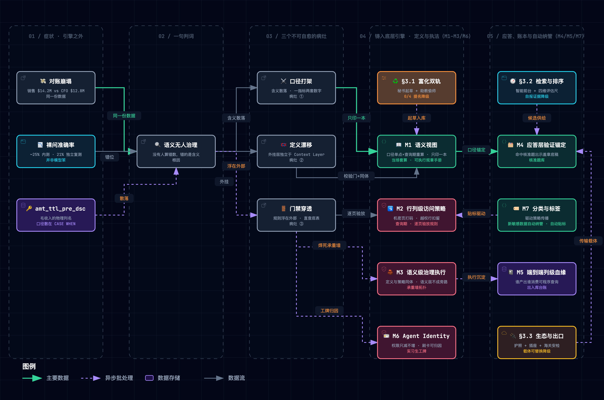

> 图源（可 diff 文本）：[`horizon-context--problem-to-mechanisms.mmd`](../../assets/mermaid/cognitive-context/horizon-context--problem-to-mechanisms.mmd) · 交互版（下载到本地打开）：[`horizon-context--problem-to-mechanisms.html`](../../assets/architecture/cognitive-context/horizon-context--problem-to-mechanisms.html)

这张图的结论一句话：三条症状不是三个孤立 bug，而是「语义无人治理」这一个病根的三种发作；七个机制按「定义→执法→背书→对账→纳管」封住病根的五个面，§10–§12 三章只做供给与外达、不承重。


---

## 2. 全貌与七条承重机制

先把整机看一眼，再逐件拆。

**分层矩阵**（各层用职责命名，从下往上读）：

| 层 | 一句话职责 | 承载 |
| :-- | :-- | :-- |
| 底座：物理数据 + 查询引擎 | 表、RBAC、SQL 执行器（一切在此之上发生） | 既有 Snowflake |
| 定义层：把意思写成对象 | 五段式 DDL + 注册期结构校验门 | M1 声明半边 |
| 执行层：算对 + 管住 | 查询期重算、行列级策略、语义级治理 | M1 执行半边 · M2 · M3 |
| 供给层：意思从哪来 | Autopilot/Sense 富化、检索排序、分类贴标 | M7 · §10 · §11 |
| 应答层：答案有人背书 | Verified Query Repository | M4 |
| 账本层：数字可追溯 | 原生 + 外部列级血缘 | M5 |
| 身份层：谁在问 | Agent Identity + 权限天花板 | M6 |
| 出口层：意思带得走 | MCP · OSI(Ossie) · BI 互操作 | §12 |

**因果脉络链**：裸库 + 会写 SQL 的 AI → 三症状（两个收入数 / ~25% 裸问 / 密码列名）→ 三病灶（口径散落 / 执行算错 / 门禁穿透）→ 四条设计规格（定义对象化 / 查询期重算 / 引擎层强制 / 答案可审计）→ 七机制落地 → 三级证据（厂商自报 / 第三方独立 / 本仓原型实测，§13 定级）。阅读时建议带着这条链：每个机制都能回答「拆掉它，链条在哪一环断」。

**基础层 vs 学习焦点**：读懂本文只需要三样基础——表/列/join/聚合是什么、角色权限（RBAC）是什么、「Agent＝替人连接数据库答题取数的 AI 程序」。最值得花力气的五处：M1 双不变量为什么是两条独立底线；M2 与 M3 的分野（规则内容 vs 执法拓扑）；M6 天花板的「交集 + 实时求值」；M4 候选集为什么面窄所以可信；以及 §15 的 governance ≠ verification——它决定了这套系统「可信」的上限。

Snowflake 官方把平台采集的上下文信号分四层[1]：Structural（有什么、怎么连——表、列、血缘）、Operational（正在发生什么——查询、新鲜度、性能）、Semantic（它是什么意思——定义、指标、本体）、Behavioral（它被怎么用——热度、查询模式）。七个机制就是在给这四层信号立规矩。

### M1 · 语义视图：口径单点 × 查询期重算

（术语先讲清：**语义视图**＝存进数据库的定义性对象，用 DDL「创建数据库对象的标准 SQL 语句」写成，本质是元数据[4]；**主键**＝一张表里唯一标识每一行的列，**外键**＝指向别表主键的列；**粒度**＝聚合时分组的粗细——按客户、按月还是按天。）

**白话**：业务口径要管得住，得同时守住两条底线，缺一条都会错。第一条，**口径单点**——「净收入是什么」全公司只允许存在一份定义，写进语义视图的 DDL 里；Snowflake 官方文档给的例子：`net revenue` 在语义视图里定义为 `SUM(gross_revenue * (1 - discount))`，从此「按区域看净收入」永远按同一口径聚合[4]。第二条，**查询期重算**——语义视图里不存任何算好的数字，你问，引擎此刻按定义对底层数据从头聚合。

为什么非要现算？两个**独立**的坏法。其一，存量会过期：今天算好一张指标存下来，明天底层进来三笔新订单，存量立刻成旧账，且没有任何机制提醒你它旧了——存量数字的陈旧面可以有多大？Snowflake 自家数据团队给 9,685 张表建语义视图，也只覆盖了不到 5%[5]——剩下 95% 的消费仍活在各自复制的口径与存量里。其二，顺序会错：正确算法是「先按查询粒度各自聚合，再把结果拼起来」；顺序反成「先拼表再聚合」，一张 $100 的发票因为关联 3 条明细行，会被复制成 3 份记成 $300——这是 BI 圈著名的 fan trap，Snowflake 工程博客用它开篇[6]。派生指标（由别的指标算出的指标，如客单价＝总收入÷订单数）同理：先把分子分母各自聚合再相除；先除后加就是「平均的平均」——9 张单的店均 2 人、1 张单的店 30 人，先各自平均再平均得 16，总客数÷总单数 48÷10 才是 4.8[6]。

**机制**：五段式 DDL——`TABLES`（逻辑表 + 主键声明）→ `RELATIONSHIPS`（多对一外键关系）→ `FACTS`（行级数值）→ `DIMENSIONS`（切片维度）→ `METRICS`（聚合指标）[4]。注册期过结构校验门：外键必须指向主键/唯一键列、关系不许成环、不许自引用、指标必须带聚合函数（派生指标除外）、至少一个维度或指标[4]。查询单词变少了：你只选维度和指标，join 路径由关系声明推导——「选列，不选路径」[6]。五个能力位补齐边角：`PRIVATE|PUBLIC`（私有指标不可被查询引用，维度恒公开[4]）；`WITH SYNONYMS`（为表/列/指标登记别名，文档定位为信息性用途[4]，模型侧增益有限——克制原则见 §14 护栏表[14]）；`NON ADDITIVE BY (维度 DESC)` 把指标声明成半可加（余额类指标跨该维度不求和、取最后一个快照[4]）；`USING (关系名)` 在两表存在多条 join 路径时显式指定走哪条[4]；`ASOF`/`BETWEEN` 关系支持时点对齐与区间连接[4]。性能后手是**物化**（Public Preview＝公开预览：功能开放可用但仍在演进、非正式发布；下文 GA＝正式发布）：`ALTER SEMANTIC VIEW … ADD MATERIALIZATION` 预聚合指定维度×指标组合，可加（SUM/COUNT/MIN/MAX）指标可从细粒度卷积回粗粒度，一条物化服务一类查询；查询 WHERE 条件里用到的维度同样算被覆盖——含「年」的物化可直接服务 WHERE 年=2025 的查询[4]；新鲜度由 `MAX_STALENESS` 声明（最低 120 秒；刷新跟不上会自动挂起，`IMMUTABLE WHERE` 标注不变行以省刷新量）[4]；官方基准四条 TPC-DS 查询加速 59–91×、扫描 359GB→120MB[31]——但只加速 Semantic SQL 路径，Cortex 系直发物理 SQL 的路径不受益，且引用列上存在掩码/行访问策略时改写直接放弃[4]（治理压过性能）。

这四个经典坑（fan trap / 平均的平均 / distinct 双计 / 半可加）与 USING 消歧，在配套原型里各有一个场景键——B1 / B2 / B3 / B4 / A4——逐一实测过正反两态（各机制节随文引用；破坏开关见 §14）。

旧的 YAML 语义模型正被语义视图取代——`SYSTEM$CREATE_SEMANTIC_VIEW_FROM_YAML` 逐个转换、不支持批量，反向导出另有 `SYSTEM$READ_YAML_FROM_SEMANTIC_VIEW`[14]。

跨工具对照见 §13 与 §19 规律 1：Looker 的对称聚合可被 `symmetric_aggregates: no` 显式关闭[19]、Cube 无匹配预聚合时回退查上游数据源[20]、dbt MetricFlow 确定性生成但覆盖面受建模约束[23]——**声明层已商品化，差异化全在执行半边**。

**端到端走查**（一条具体输入的完整旅程）：玩具电商域，`orders(order_id PK, customer_id, amount)` 与 `order_events(event_id, kind, order_id)`，关系 `order_events(order_id) REFERENCES orders`，指标 `total_revenue = SUM(orders.amount)`，维度 `customer`。问「Ann 的总收入」（Ann 有 3 张 $100 订单，事件数 2/1/3）：①请求进入，引擎按维度定位到 customer 粒度；②对 orders 在本表内先聚合——`SUM(amount) GROUP BY customer_id`，三张订单收敛成一行 Ann=$300（全程未碰事件表）；③连 customers 取客户名；④输出。若有人把顺序写反（先 join 订单×事件再 SUM）：6 行中间结果（每张订单被事件数复制）→ Ann=$600。**实际运行日志**（以 §14 原型引擎对新输入实测）：`engine: {('Ann',): 300}`，`naive: 600（逐行: [(501,100),(501,100),(502,100),(503,100),(503,100),(503,100)]）`——放大倍数＝事件总数÷订单数。

**正反迁移指纹**：看到「同一指标多处定义、各报各数」→ 该上 M1（先收口径）；看到「报表数对不上但每张报表 SQL 都合法」→ 大概率 fan trap/平均的平均类执行面问题，M1 执行半边正是解药。反面红线：上游已经把 grain 塌缩（例如 dbt 已按天汇总），M1 的正确算式照样产出错误总数（§15 第 4 条的 477 vs 48）——语义视图管定义与聚合，不管上游「这么存对不对」。

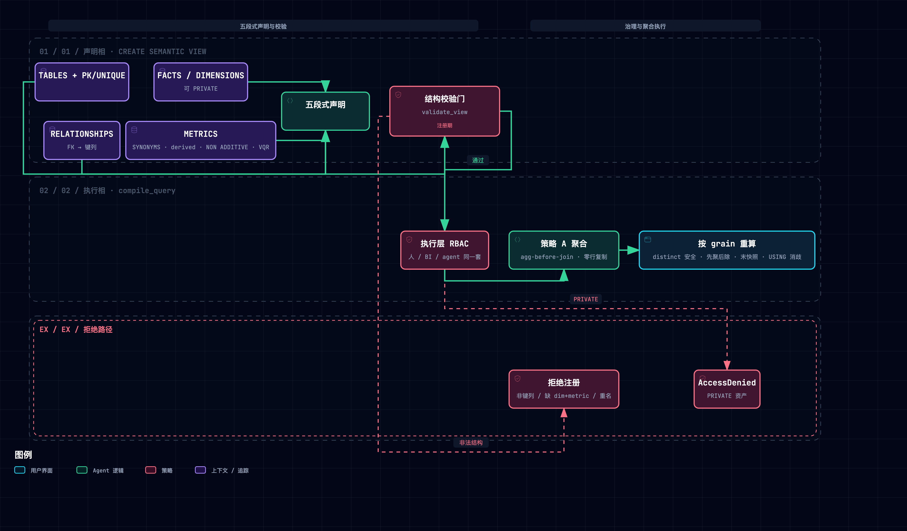

> 图源（可 diff 文本）：[`horizon-context--declaration-execution.mmd`](../../assets/mermaid/cognitive-context/horizon-context--declaration-execution.mmd) · 交互版（下载到本地打开）：[`horizon-context--declaration-execution.html`](../../assets/architecture/cognitive-context/horizon-context--declaration-execution.html)

这张图读一句就够：非法定义死在注册期、PRIVATE 资产死在执行层、数字永远现算——三道闸前后相接，构成 M1 的完整生命周期。

### M2 · 查询期行列级访问策略

（术语先讲清：**掩码策略**＝按人把敏感值打码的规则；**行访问策略**＝把无权的行整行扣掉的规则；**聚合约束**＝限制「允许以什么粒度汇总」的规则，例如禁止数到个人粒度；**投影限制**＝让某列干脆不出现在结果里的规则。）

**白话**：定义统一了，下一个问题是「谁可见」。M2 的答案：规则挂在**数据本体**上（表、列、标签），在**查询执行那一刻**由引擎求值——没权就打码、扣行、拒绝，谁来查都一样。关键细节有两个：其一，**保护决定权与对象所有权分离**——安全/隐私官决定保护哪些列，而非对象所有者，掩码对特权角色（ACCOUNTADMIN/SECURITYADMIN）同样生效，角色再高也不豁免[24]。其二，策略**沿语义视图自动传播**：掩码和行访问策略挂在底层表上，无论用户直接查表、隔着语义视图查、还是让 BI 工具查，看到的都是同一套打码结果[14]——定义不复制，策略也不复制。

**机制**：四类策略对象（masking / row access / aggregation / projection）+ 两种绑定方式——直接挂列，或经标签绑定（tag-based：一条掩码策略绑到标签上，同数据类型的列凡挂此标签自动纳管，新建表新列也自动跟上，官方类比为 future grants[24]）。掩码策略体内还能调 `IS_AGENT_ACTIVATED` 谓词（判断「当前会话是否由 Agent 发起」）：同一个人，人工查询见明文手机号，Agent 会话问同一问题当场变星号[24]——策略对 Agent 天然变严。授予语义视图 `SELECT` 即授予底层数据访问（无需底层对象权限），但所有策略照常生效[14]。

**端到端走查**：intern 角色查 `customer_phone`：①请求进入执行器；②命中该列掩码策略；③以策略所有者视角求值——`CURRENT_ROLE()='analyst'` 放行明文，其余角色 `RETURN '***-***-1234'`；④结果带掩码出引擎。**实际运行日志**（本仓原型 D5 反事实，§14 命令实测）：拆掉执行层 RBAC 后 `intern 按 plan 拿到 [90,560]（泄露发生）`，装回则 `blocked`——应用层的权限提示拦不住引擎直查，执行层拒绝是底线。

**正反迁移指纹**：看到「敏感列散落多表、人工逐列挂策略永远挂不完」→ 用 tag-based 绑定一次挂全（与 M7 的供给链衔接）；看到「BI 工具里看着打了码、导出 CSV 却是明文」→ 策略长在了应用层而非数据本体上，正是 M2 要消灭的形态。红线：sample values（示例值元数据）不走掩码——掩码策略作用于数据行，不作用于元数据，敏感列慎开示例值[14]（§15 第 5 条）。

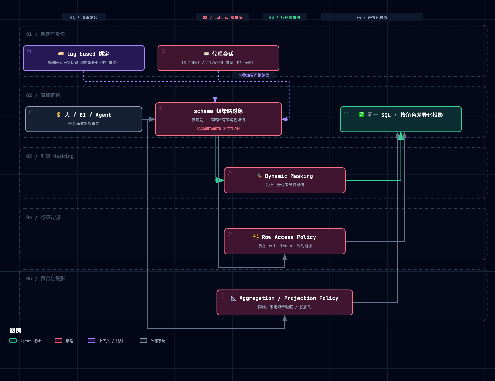

> 图源（可 diff 文本）：[`horizon-context--row-column-policy.mmd`](../../assets/mermaid/cognitive-context/horizon-context--row-column-policy.mmd) · 交互版（下载到本地打开）：[`horizon-context--row-column-policy.html`](../../assets/architecture/cognitive-context/horizon-context--row-column-policy.html)

这张图的结论：四类策略都在查询期求值、对特权角色不豁免，Agent 会话再叠一层严拒面——可见性由数据本体上的规则决定，与「谁在问、用什么工具问」无关。

### M3 · 语义级治理：定义与执法同体

**白话**：M2 管「规则内容」，M3 管「执法位置」。第三方语义层的通病是：定义放在语义层、数据留在仓库、治理留在两边各自的应用里——一个 context layer 外挂在治理引擎上，每次查询都要两套系统对账，「定义一漂移，Agent 就跟着错的走」[2]。Horizon Context 的宣称正好相反：**语义定义就住在治理引擎里，查询时强制执行，不复制、不缓存**[2]。官方文档说得更直白：「治理策略在查询引擎层执行，不在应用层执行；对每个调用者自动生效——人、BI 工具或 AI Agent；AI 工作负载没有单独的治理配置」[4]。

**机制**：三个可检验的落点。①**检索面即治理面**——语义资产有 `PRIVATE|PUBLIC` 位（私有事实与指标不可被查询或用于查询条件，维度恒公开[4]），PRIVATE 资产在检索层就被过滤（Universal Search 以访问控制策略过滤结果[2]），执行层再拒一次——双层防线；②**出口约束不弱化**——消费方拿到的语义定义，其出口约束不弱于数据本体（挂在底层表上的策略沿定义传播，M2 已述）；③**跨面一致**——同一套 RBAC 进人、进 BI、进 Agent，受限定义在 Power BI、在 Salesforce、在任何查询它的 Agent 出口保持受限[2]。「不可绕过」的准确边界：在引擎周界内成立；直查底层库、导出数据即绕过（§15 第 3 条如实记这条缝）。

**端到端走查**：分析师在 BI 里问一个 PRIVATE 指标：①BI 把请求发到引擎（不是本地缓存作答）；②检索层发现该指标 PRIVATE、当前角色无权——候选集里直接不出现；③即便有人绕过检索直接写死指标名，执行层 RBAC 二次拒绝。**实际运行日志**（本仓原型 MCP 通道，§14 命令实测）：`[PASS] T2b: list RBAC 过滤: PRIVATE 指标对 intern 不下发`、`[PASS] T5: 引擎层 RBAC 经 MCP 仍生效: plan is a PRIVATE fact`——工具列表层过滤与执行层拒绝同时在场。

**正反迁移指纹**：判断一个「语义层」是真引擎内还是假外挂，看三件事——定义是否被复制到消费端缓存作答；策略求值是否发生在查询引擎；BI 直连与引擎查询的结果是否一致。三条有任何一条为否，就是 M3 要治的「可绕过拓扑」。红线：数据出了引擎（导出、直查底库、外部模型加工），M3 的承诺到此为止——Ossie 携带的定义在别家引擎如何执行，Snowflake 管不着[7][21]。

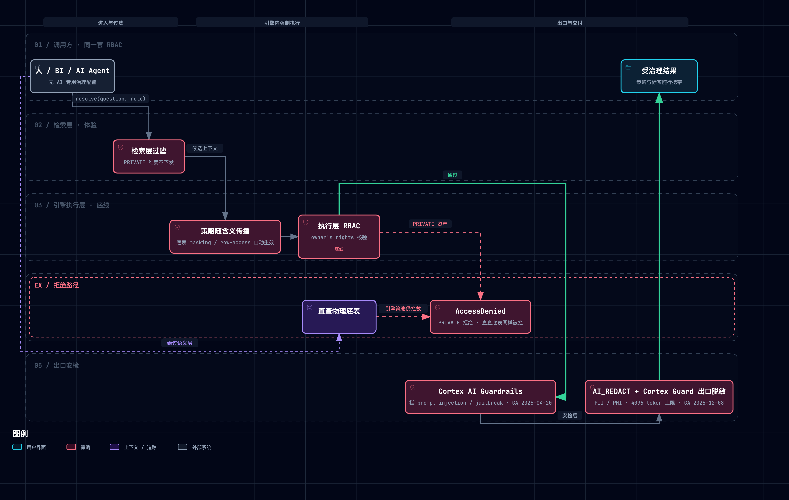

> 图源（可 diff 文本）：[`horizon-context--engine-governance.mmd`](../../assets/mermaid/cognitive-context/horizon-context--engine-governance.mmd) · 交互版（下载到本地打开）：[`horizon-context--engine-governance.html`](../../assets/architecture/cognitive-context/horizon-context--engine-governance.html)

这张图的结论一句话：同一套 RBAC 从入口贯通到出口，检索层与执行层两道防线前后相接，定义不复制——执法点只有一个，就在引擎里。

### M4 · 应答层验证锚定：Verified Query Repository

**白话**：语义视图保证「定义对、算得对」，但不保证「AI 生成的 SQL 正确引用了定义」——模型挑错表、错 join、错粒度，语法全对、答案全错，这是与 M1 独立的失效面。M4 的办法朴素而有效：把**有人签字的问答对**存进语义视图（`AI_VERIFIED_QUERIES` 段）：一个问题、一条经过验证的 SQL、验证人、验证日期[4][12]。新问题进来先匹配题库——相似命中就直接采用已验证 SQL 作答，响应里的 confidence 字段告诉你用了哪条[12]。

**机制**：VQR 条目四要素（question / verified_at / verified_by / sql——SQL 必须引用逻辑表而非物理表[12]）；`use_as_onboarding_question` 让核验题兼作新用户引导问题[12]。两条生态配套：①**建议接口**——按用户真实行为推荐「值得核验的新问题」，人签字后入库[12]；②**优化回路**——用题库反推语义层缺什么（verified SQL 里隐含的过滤惯例、指标口径），自动建议补 `is_active` 这类过滤器与描述，让 Agent 对**没见过的问题**也答得更准[12]；官方手册明说阈值与代价：优化会真跑你的 verified SQL（每条至多执行 4 次），超过 20 条会显著拖慢[12]。注意边界：评测闭环（Cortex Agent Evaluations）是与 Autopilot 并列的独立发布环节[11]，不在 Horizon Context 之内——本文综合判断（§15 第 4 条注）：VQR 补上了验证缺口的「锚定」一角，一般性计算正确性验证仍是开放面。

**端到端走查**：用户问「上个月活跃用户多少」：①语义检索先扫 VQR；②命中题库条目「How many active users did we have last month?」（相似度足够）；③引擎直接执行该条 verified SQL——不经过 LLM 现场生成；④响应附 confidence 与所用条目。未命中：走 M1 现算路径；无 governed 覆盖：显式告警而非硬猜。**实际运行日志**（本仓原型 §14 命令实测）：`[PASS] A1: verified 短路重放 + 溯源: verified_query {'2026-01': 200, '2026-02': 150, '2026-03': 300} by ( data_governance = data-team@acme.com )`；`[PASS] A1b: 引擎重算 == 验证答案（对账一致）: [200, 150, 300]`——题库路径与引擎重算对账一致，锚定的意义在背书与确定性。

**正反迁移指纹**：VQR 的可信来自**候选集性质**——全部人工核验过，错误面窄；通用检索（§11）的候选集是全目录，错误面宽。看到「高频业务问题答案不稳」→ 优先沉淀 VQR；看到「题库覆盖不了的长尾」→ 那是 §10 富化与 §11 检索的战场。红线：题库是资产也会腐化——口径变了题库要跟着重验，否则锚定住的是过时答案。

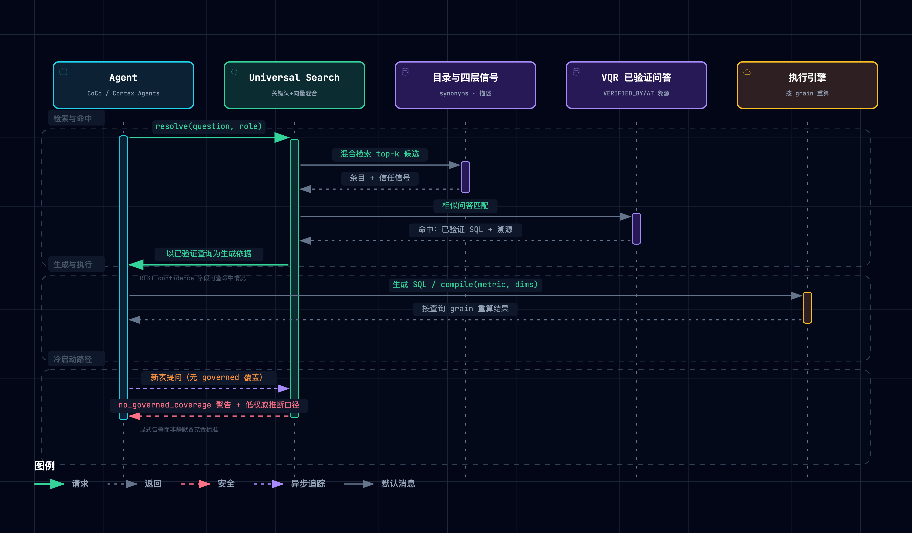

> 图源（可 diff 文本）：[`horizon-context--resolve-activation.mmd`](../../assets/mermaid/cognitive-context/horizon-context--resolve-activation.mmd) · 交互版（下载到本地打开）：[`horizon-context--resolve-activation.html`](../../assets/architecture/cognitive-context/horizon-context--resolve-activation.html)

这张图一句话：命中题库走背书路径、未命中走现算路径、无覆盖就明说——三条出路都不含「静默瞎猜」这个选项。

### M5 · 端到端列级血缘

**白话**：M1–M4 让答案「算得对、管得住、有人背书」；M5 回答事后追问——「这个数当初从哪来？」血缘（lineage）＝数据之间的派生关系账本：哪张表的哪列、经什么语句、变成了眼前的哪列。Horizon 的差异点在**端到端**与**列级**：Snowflake 引擎内执行语句自动沉淀对象级与列级依赖边（原生、零配置），外部管道经 OpenLineage 摄入，两路汇进**同一本账**；BI 工具、ETL、外库一并入图[4][2]。对 AI 时代的意义：Agent 答案出错时，能沿答案→指标→表列回溯到「最后一笔脏数据」，而不是对着黑箱猜。

**机制**：三条通道与三道闸。引擎内：每次执行自动记边（derived 指标展开到底层列的记法见下文原型实测）。外部：OpenLineage `COMPLETE` 事件打 REST 端点 `/api/v2/lineage/external-lineage`，过三道闸——鉴权、事件可解析、对象可解析（解析不了整事件拒绝，账本零污染）——才入账[4]（External lineage 已 GA，Enterprise Edition，2026-09-03[33]）。取数：Snowsight 图形界面或 `GET_LINEAGE` SQL 函数（外部对象同样可作锚点）。两个如实记录的工程细节：①**重建不对称**——Snowflake→外部 的边按全限定名追踪（`CREATE OR REPLACE` 后幸存），外部→Snowflake 的边按内部 ID 追踪（重建即断、需上游重发）[4]；②**Iceberg 解析门**（工程细节，可跳过）——存储命名空间（`s3://…`）的数据集，只有 `catalog` facet 标明 `type: rest, framework: iceberg` 且 `symlinks` 指回 Snowflake Iceberg 表时才解析为表身份，否则记为通用外部节点（角色看不见该表时同样降级为外部节点、其余事件照常入账）[4]。Agent 侧：2026-09-02 起 Cortex Agent 及其声明的工具引用入血缘图（创建/提交版本时记录）[33]；具体调用归因另见 `QUERY_HISTORY.agent_type`（M6）[24]。

**端到端走查**：一条 OpenLineage 事件到达：①鉴权——无 INGEST 权限整事件拒绝；②解析——job/inputs/outputs 对象名能否落到真实对象；③落账——列级边写入同一账本。**实际运行日志**（本仓原型 §14 命令实测）：`[PASS] E1: 列级血缘同账本: 引擎沉淀 orders.total→sales_sv.metric:revenue（derived aov 展开记底层 order_count 边）；OpenLineage 摄取 app_db.users.tier→customers.plan（origin 各异、账本唯一）`；反事实 `[PASS] E1b: 摄取三道闸: 非 COMPLETE / 对象不可解析 / 无 INGEST 权限 → 整事件拒绝 ['rejected', 'rejected', 'rejected']（账本零污染）`。

**正反迁移指纹**：看到「数错了但查不出哪层引入」→ 血缘 + 数据质量信号是事后对账的最低配置；看到「外部管道血缘只有对象级没有列级」→ 追因到列的精度不够，M5 的列级边正是为此。红线：血缘记录「谁喂谁」（观察），不判「这么算是否合法」（校验）——治理账本不是验证器（§15 第 4 条）；ML notebook 内部变换与边界外系统是已知盲区，如实标注。

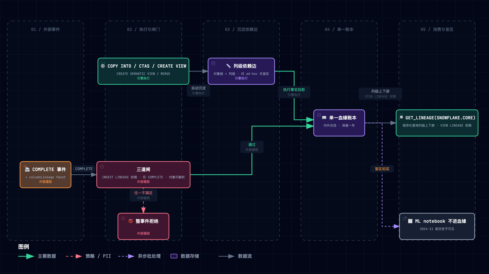

> 图源（可 diff 文本）：[`horizon-context--lineage-ledger.mmd`](../../assets/mermaid/cognitive-context/horizon-context--lineage-ledger.mmd) · 交互版（下载到本地打开）：[`horizon-context--lineage-ledger.html`](../../assets/architecture/cognitive-context/horizon-context--lineage-ledger.html)

这张图一句话：原生沉淀与外部摄取汇入同一本列级账，三道闸保证「账本里没有虚构边」——对账从此有据可查。

### M6 · Agent Identity 与 Restricted Session Scope

（术语先讲清：**RBAC**＝按角色发权限的访问控制——权限挂角色、角色给人；符号 ∩ 读「交集」，两边都允许才算允许。）

**白话**：Agent 替用户干活时，默认继承用户全部权限——包括生产库写权限和 ACCOUNTADMIN 级角色[24]；「一个替你查数的助手，不该拿着你全部的钥匙」。M6 是两层身份治理。第一层，**识别与归因**：Snowflake 识别「这个会话是 Agent 发起的」（原生 Agent、托管 MCP、`IS_AGENTIC=TRUE` 的 OAuth、SERVICE_AGENT 用户四种入口都算[24]），查询历史 `QUERY_HISTORY.agent_type` 记下是哪类 Agent 干的，访问历史 `ACCESS_HISTORY.agents_info` 记下调用链上每一层 Agent——「谁授权的、哪个 Agent 执行的、动了什么对象」整条因果链可复盘[24]。第二层，**权限天花板**：Restricted Session Scope（RSS，2026-09-03 GA[33]）在会话策略（session policy）上声明「Agent 活跃期间允许做什么」，Agent 实际权限 = 用户 RBAC ∩ RSS 允许面——**只减不增**；天花板**每次查询实时求值**（不存权限快照）；**会话期内锁死**（不能改、不能解、不能升，想换范围重开会话）[24]。

**机制**：RSS 用 YAML 声明两类域——`privilege_scopes`（允许的操作×容器：组权限如 data read / 按对象类型 / 按命名对象；未列出的操作**隐式拒绝**）与 `role_scopes`（封禁/允许哪些角色、可只约束次角色、可禁角色切换）[24]。配套谓词 `IS_AGENT_ACTIVATED` 可写进掩码/行访问/聚合/投影任何策略体：「见到 Agent 就变严」——同一个人工查询见明文、Agent 会话见星号（与 M2 衔接）[24]。分工一句：RSS 管「Agent 够得着哪些库哪些操作」，策略管「够着的范围内哪些列值可见」[24]。独立第三方实测（Classmethod，2026-09-04）：CoCo 里建四类场景验证——同一用户同一角色，Agent 会话内 INSERT/DDL/角色切换全被拒，人工工作表全放行；「RBAC ∩ RSS、权限永不增」逐条成立[25]。

**端到端走查**：管理员 10:00 设 RSS（允许 orders 读、封管理员角色）；用户 10:02 开 Agent 会话；10:05 管理员回收该用户的 orders 权限。10:06 Agent 查 orders：①会话仍活跃、天花板仍锁死；②求值「用户当前权限 ∩ RSS 允许面」——用户侧已无 orders 权限；③交集为空，拒绝。**实际运行日志**（本仓原型 §14 命令实测）：`[PASS] E2: 代理身份: 会话权限=用户∩代理面 ['select:orders', 'use:sales_sv']（只减不增）；审计 agent_type=assistant；IS_AGENT_ACTIVATED 下 select:customers 被拒（用户本人可查）`；`[PASS] E2b: 天花板实时性: 回收 select:orders 后，既有会话判定即刻失去、其余权限不受牵连（查询期实时求值，无快照过期窗口）`；反事实 D9：`拆权限天花板（快照冻结）→ 回收后旧会话仍持 select:orders（越权窗口）`。

**正反迁移指纹**：看到「Agent 出事无法归因到具体哪个代理」→ 缺 M6 第一层；看到「给了 Agent 一个宽角色、靠 prompt 叮嘱它别乱动」→ 缺 M6 第二层（天花板必须求值在引擎，prompt 不是权限边界）。红线：用户自管 RSS（CoCo CLI/Desktop）仍私预[24]；天花板只约束 Agent 活跃期，同一会话非 Agent 流量不受影响——它是收窄器，不是新的权限系统。

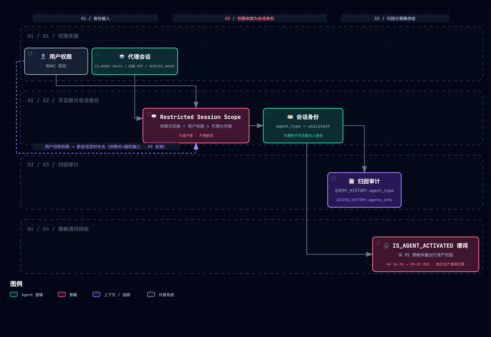

> 图源（可 diff 文本）：[`horizon-context--agent-identity.mmd`](../../assets/mermaid/cognitive-context/horizon-context--agent-identity.mmd) · 交互版（下载到本地打开）：[`horizon-context--agent-identity.html`](../../assets/architecture/cognitive-context/horizon-context--agent-identity.html)

这张图一句话：入口打标 → 交集天花板 → 双审计视图，三段首尾相接，Agent 的每一次访问都「身份可辨、权限可算、行为可查」。

### M7 · 分类与标签驱动的策略传播

**白话**：前六个机制都默认「该保护的列已经有人标过了」；现实是数据每天新增、没人盯得过来。M7 补上供给链的自动一环：**分类引擎持续扫描**库里的列，识别出敏感属性（姓名、证件号、健康数据……），自动打上系统标签；系统标签经**一次性映射**接到你的治理标签上；治理标签再驱动 tag-based 策略（M2）——新到的敏感列从此**自动纳管**，不需要人逐列登记[24]。

**机制**：每个被识别的列得到两个系统标签——`SNOWFLAKE.CORE.SEMANTIC_CATEGORY`（是哪类属性）与 `SNOWFLAKE.CORE.PRIVACY_CATEGORY`（敏感级别：IDENTIFIER / QUASI_IDENTIFIER / SENSITIVE）[24]。关键的一道闸：**掩码策略不能直接绑定系统标签**——必须先配「系统标签 → 用户治理标签」的一次性映射，再由用户标签驱动策略[24]。为什么这道闸重要：它把「机器的判断」（分类结果）与「组织的决定」（什么级别打什么码）显式分开——机器管发现，人管定规；映射没配，保护就是**显式缺口**而不是静默假设。AI mode（Public Preview）用 `openai-gpt-5-mini` 增强识别、覆盖标准分类之外的类别[24][33]。

**端到端走查**：数据管道夜里写进新表，含一列 `phone`：①分类扫描识别为电话号码 → 自动打 `SEMANTIC_CATEGORY=PHONE`；②查映射表——`PHONE → pii（用户标签）`已配置；③ `pii` 上绑着 tag-based 掩码策略（M2），数据类型匹配；④次日任何查询拿到的是打码值。**实际运行日志**（本仓原型 §14 命令实测）：`[PASS] E3: 分类标签: 漂移新列 phone/ssn 自动分类→pii→MASK_FULL（无需人工登记）；plan→BUSINESS_INFO 未映射=显式缺口（掩码不可直绑系统标签，须先配一次性映射）`；反事实 D10：`拆标签映射（只分类不绑策略）→ phone 已贴系统标签仍明文出楼——发现→标记→执行 链条断在最后一环`。

**正反迁移指纹**：看到「敏感列清单永远追不上新表增速」→ 分类扫描 + 标签映射是唯一的规模化解法（人工逐列是线性人力陷阱）；看到「分类结果直接绑了策略」→ 警惕：跳过映射等于让机器的判断直接成为组织的规则，识别偏差直接变成拦截决策。红线：映射环节是「机器判断 → 组织规则」之间唯一的人工关口，这一步省不得（识别的精度边界材料未披露，见 §15 第 2 条）。

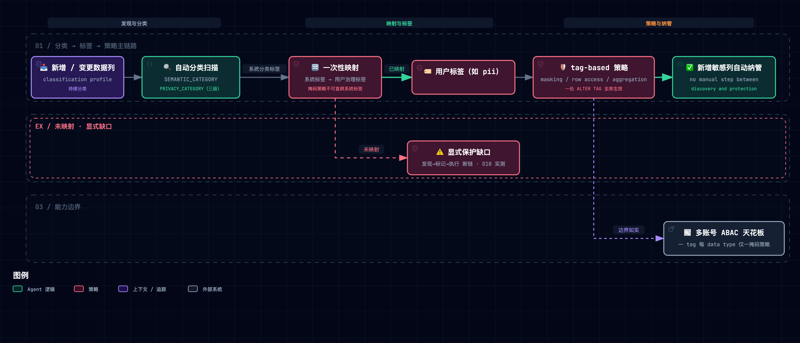

> 图源（可 diff 文本）：[`horizon-context--classification-tagging.mmd`](../../assets/mermaid/cognitive-context/horizon-context--classification-tagging.mmd) · 交互版（下载到本地打开）：[`horizon-context--classification-tagging.html`](../../assets/architecture/cognitive-context/horizon-context--classification-tagging.html)

这张图一句话：分类发现、映射定规、策略执行三段接力，断在任何一段——尤其映射那段——保护就停在「贴了标签的裸奔」。


---

## 3. 三阶段治理：Collect → Enrich → Activate

把七个机制放回官方叙事，Horizon Context 用三个动词组织自己[1][2]：**Collect**（把散在库外库内的上下文收进 Horizon Catalog——元数据连接器、OpenLineage、OSI/Ossie 开放标准）；**Enrich**（把原始元数据加工成业务含义——血缘、热度信号、AI 生成文档、语义视图及其 Autopilot/Studio 生产面）；**Activate**（让上下文在人与 Agent 的工作现场自动起效——Universal Search 检索、CoCo（Snowflake 的对话式编码/数据 Agent）自动发现语义视图、MCP/BI 互操作出口）。三阶段是**供给侧骨架**：它解释七个机制「从哪来、怎么被用」，而正确性的硬保证仍在 §2 的 M1–M7——这也是下文三个专章被降级挂靠的原因（供给面、载体面，可替换，不承重）。

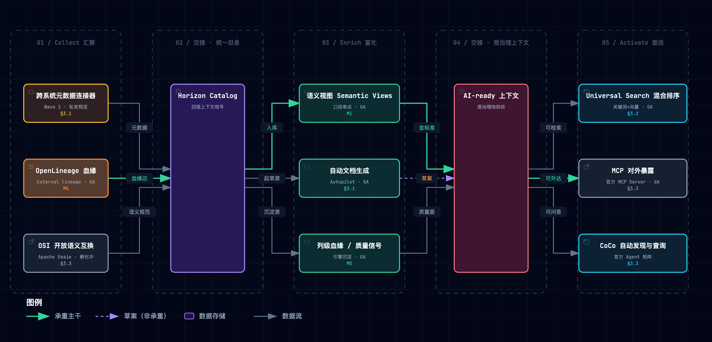

> 图源（可 diff 文本）：[`horizon-context--three-stage-governance.mmd`](../../assets/mermaid/cognitive-context/horizon-context--three-stage-governance.mmd) · 交互版（下载到本地打开）：[`horizon-context--three-stage-governance.html`](../../assets/architecture/cognitive-context/horizon-context--three-stage-governance.html)

这张图一句话：三阶段九格里只有语义视图与血缘两格由承重机制托底，其余是供给与出口——骨架管「通」，机制管「对」。

### §10 上下文供给与富化

定义不会凭空出现。官方口径里 Snowflake 自己的数据团队给 9,685 张表建语义视图，也只覆盖了不到 5%[5]——两条生产线补缺口。**显式轨道（Autopilot，GA）**：吃三类输入——查询历史（识别常用模式与关系）、表元数据（定义/注释/约束）、上下文文件（问题-SQL 对的 CSV，至多 5 个文件各 5000 对；Tableau 工作簿/数据源文件 TWB/TWBX/TDS <250MB，其 LOD 明细级计算不被支持；Power BI 模板/报表文件 pbit/pbix，吃表/列/关系/DAX 公式度量/计算列/主键）——产出一份**可编辑**的语义视图草稿，人审后发布[11]。**隐式轨道（Cortex Sense，私预）**：不建视图，直接从查询历史、转换工具里的模型、BI 里的指标**挖出**一套工作理解——「百科全书式的人工编纂」转向「维基式的自动演化」[5]。Sense 的四条机制要点：信号排序按 relevance / authority / popularity / freshness 四因子（受治理的语义视图 authority 最高，500 条生产 SQL 里的 join 模式压过 3 条的，上月的定义压过两年前的）[5]；**冲突浮出人工裁决**——测出几十种日活定义时，Sense 停下把冲突摆给人，自然语言说明哪套口径归哪个团队，之后继续[5]；评测自纠环（gold-standard 题库/用户反馈/覆盖面自荐三路输入，错一道修一处）[5]；权限上**私测期只支持单角色全量**、per-role context 未交付[5]（§15）。两条轨道的分工一句话：要「受治理、口径唯一」的答案，语义视图仍是金标准，Sense 把它当权威信号；视图没盖到的长尾，Sense 抬高准确率的地板[5]。

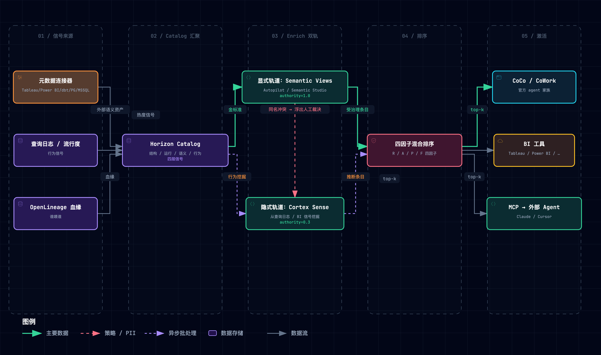

> 图源（可 diff 文本）：[`horizon-context--collect-enrich-activate.mmd`](../../assets/mermaid/cognitive-context/horizon-context--collect-enrich-activate.mmd) · 交互版（下载到本地打开）：[`horizon-context--collect-enrich-activate.html`](../../assets/architecture/cognitive-context/horizon-context--collect-enrich-activate.html)

这张图一句话：显式轨人机协作产定义、隐式轨自动挖理解，冲突一律浮出人工裁决——供给的速度可以自动化，口径的裁决权不自动化。

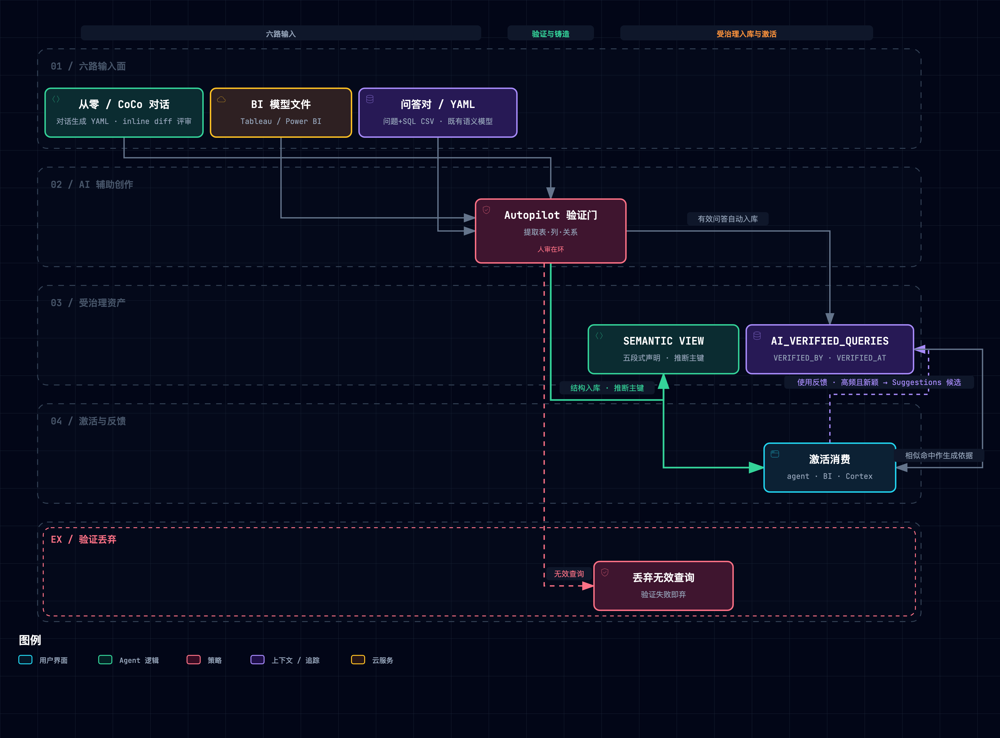

> 图源（可 diff 文本）：[`horizon-context--autopilot-loop.mmd`](../../assets/mermaid/cognitive-context/horizon-context--autopilot-loop.mmd) · 交互版（下载到本地打开）：[`horizon-context--autopilot-loop.html`](../../assets/architecture/cognitive-context/horizon-context--autopilot-loop.html)

这张图一句话：Autopilot 不是「一键生成完事」——输入、验证门、受治理入库、反馈回流四段闭合，生成的每一步都可回溯。

**原型对照**（§14 命令实测）：`[PASS] C4: 自纠环: 错配前 top1=active_users（sum(dau)=[11,6,7] 错）→ 补 synonym + 调信号 → top1=active_customers（count_distinct=[3,1,2] 对）`——评测错一道、信号调一处，环闭合；`[PASS] C3: 冲突浮出: CONFLICT 卡片 [('governed', 'count_distinct(orders.customer_id)'), ('inferred', 'count(events.id) by total')]（无数值）；agent 拒答`、`C3b: 人工裁决（governed 胜）后恢复: [3, 1, 2]`——冲突不投票、摆给人。

### §11 检索与发现

上下文再多，取不准等于没有。激活层的检索底座是 **Universal Search**：关键词 + 语义向量的混合检索，排序用热度等信号[2]（检索栈另有新鲜度信号[15]），过滤用访问控制策略——**检索结果本身就过 RBAC**[2]。工程深度可参照 Snowflake 2024 年公开的 Cortex Search 检索栈[15]：内部基准上 NDCG@10（前十名结果排序质量的常用检索指标）从纯关键词 0.22 → 向量 0.49 → 混合 0.53 → 混合+重排 0.59；早期客户 hit rate@1（第一名即命中的比例）从 0.79 → 加热度 0.83 → 加新鲜度+热度 0.86——分层增益全部官方自报。检索的定位是**候选集供给**：它决定「哪些上下文被端到 Agent 面前」，与 M4 的分野在候选集性质——VQR 候选集全人工核验（面窄、可信锚定），通用检索候选集是全目录（面宽、需排序与过滤兜底）。工程形态上检索是「宽进严出」的三段管线：初检索宽进（Anthropic 的参考实现取 top-150 候选）、重排严出、末级 top-k 截断（其评测取 top-20）[29]——截断不是省事，是信噪比闸门：候选喂得再多，进上下文的只有被重排认可的一小撮。生态注脚：检索质量是 Agent 上下文层的独立卖点——Glean 靠企业检索做到 ARR 九个月翻倍至 $200M（2025-12 官方口径[30]）；「检索增强 + 重排把 top-20 检索失败率相对降 49%→67%」的方法论证据见 Anthropic 工程博客[29]（§19 规律 4 引）。

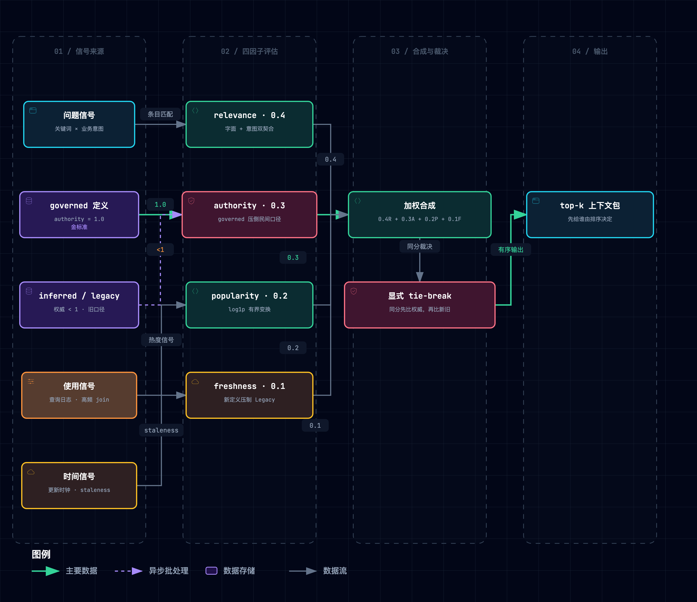

> 图源（可 diff 文本）：[`horizon-context--four-factor-ranking.mmd`](../../assets/mermaid/cognitive-context/horizon-context--four-factor-ranking.mmd) · 交互版（下载到本地打开）：[`horizon-context--four-factor-ranking.html`](../../assets/architecture/cognitive-context/horizon-context--four-factor-ranking.html)

这张图一句话：权威压过声量、新鲜压过陈旧——排序本身就是一种治理表态（什么该被看见）。

### §12 生态与出口

定义造出来，还要走得出去、进得来。三个出口/进口：**MCP 服务端（GA）**——`CREATE MCP SERVER` 把 Cortex Agent/Analyst/Search/SQL 执行/UDF 暴露成标准工具，RBAC 逐工具授权（「能连服务器≠能用工具」）、OAuth 默认、递归调用深度上限 10；官方推荐把 Cortex Agent 作为对外的唯一门面工具，让编排与治理都收在引擎侧[13]。**OSI / Apache Ossie**——Snowflake 牵头的开放语义互换标准（2025-09-23 以 17 家 launch partner 创立，截至 2026-07 已 50+ 组织[7]），2026-01 v1 定稿[7]、2026-06-19 进 Apache 孵化（截至 2026-09-30 实况：13 名 committer、7 名 PPMC、首 release 尚未切出，Apache clutch 实况页）[7]；生态还在加码：Ataccama 把数据质量 trust signal 接进 Ossie、让 Agent 行动前先验数据质量[32]；Strategy Mosaic 提供 Ossie 定义的双向导入导出[26]；竞对视角的生态观察另见 Dremio 报告[27]。载体是厂商中立的 YAML 格式，定义「带得走」，但 typedef 的判词准确：**「OSI 让定义处处可携带，不等于处处被验证」**[8]——Snowflake 官方 Ossie 导出桥只导出等值 join，ASOF/RANGE 等非等值关系被静默丢弃（Datus 对比文指出，2026-08[21]）。**BI 互操作**——Omni/Sigma/Hex/ThoughtSpot/Honeydew 已接，Tableau 数据模型纳入语义定义，Power BI/Excel/Google 系/ThoughtSpot/Looker 逐批推进[2][14]。进口侧：Metadata Connectors（私预，首批含 PostgreSQL、SQL Server、Tableau、Power BI、dbt 等[2]）把库外元数据收进同一目录；Select Star 团队收购（2025-11-24）为连接器版图补人[17]；共享数据出厂自带附件——Auto-gen Agents 给 listing 自动生成语义视图与 Agent（Preview），消费者拿到数据同时拿到「怎么问它」[18]。语义视图本身也可随 listing 进 Marketplace 共享，消费者无需底层表权限即可查询[14]。

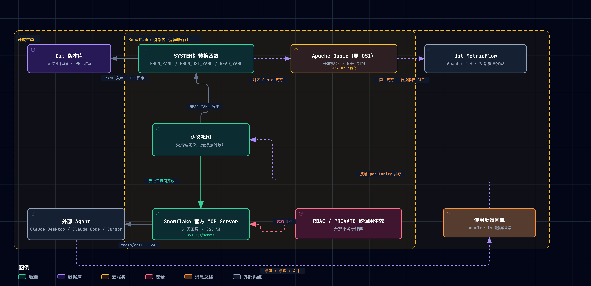

> 图源（可 diff 文本）：[`horizon-context--open-interop.mmd`](../../assets/mermaid/cognitive-context/horizon-context--open-interop.mmd) · 交互版（下载到本地打开）：[`horizon-context--open-interop.html`](../../assets/architecture/cognitive-context/horizon-context--open-interop.html)

这张图一句话：出口三路（MCP 工具面 / Ossie 定义面 / BI 查询面）+ 进口一路，生态的真正考验是「定义走出引擎后还剩多少约束力」——§15 第 3 条的答案是不多。


---

## 4. 全景与演进

### 4.1 定位：从「登记簿」到「业务的 Working Model」

Horizon Catalog 在 docs 伞页的自述是「面向你全部数据的 agentic catalog」[4]；Summit 新闻稿 live 版的措辞是「企业数据的 universal AI catalog」[3]——两个说法并存、各指出处（前者强调 Agent 时代的目录形态，后者强调普适定位）。在这个伞下，Horizon Context 是其「governed context layer」[1][2]：目录不再只是登记簿（有什么、在哪），而是业务的工作模型（什么意思、谁能用、怎么算对）——四层信号（Structural/Operational/Semantic/Behavioral[1]）被铸造成可执行对象。第三方目录厂商 Atlan 的解读可作旁证：Horizon Context 把「治理、上下文、安全」三件事中心化到一个 Catalog 里，是 Snowflake 对「AI 信任基础设施」的一次卡位[9]。

组件全景与本文机制一一对应见下图——承重三簇（口径与应答 M1/M4、治理执法 M2/M3/M6/M7、账本 M5）即本文机制章，供给与出口区归 §10–§12 三专章。

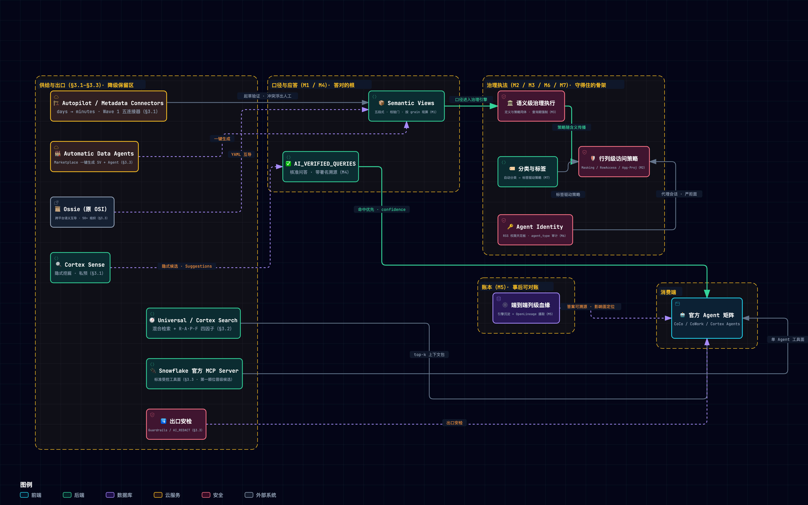

> 图源（可 diff 文本）：[`horizon-context--component-panorama.mmd`](../../assets/mermaid/cognitive-context/horizon-context--component-panorama.mmd) · 交互版（下载到本地打开）：[`horizon-context--component-panorama.html`](../../assets/architecture/cognitive-context/horizon-context--component-panorama.html)

这张图一句话：承重三簇托住「定义对、算得对、管得住、可追溯」，供给与出口簇决定「用起来顺不顺、生态通不通」——前者是信任的地基，后者是采用的坡道。

### 4.2 演进时间线：先造对象，再装治理与富化，最后开生态

| 时间 | 事件 | 机制锚 |
| :-- | :--- | :--- |
| 2025-09-23 | OSI（Open Semantic Interchange）创立：Snowflake + Salesforce + dbt Labs 等 17 家 launch partner（截至 2026-07 已 50+ 组织[7]） | §12 |
| 2025-11-24 | 收购 Select Star（元数据/血缘/发现团队与技术并入 Horizon Catalog）[17] | §12 |
| 2026-01-28 | OSI v1 规范定稿发布[7] | §12 |
| 2026-02-03 | Semantic View Autopilot GA（新闻稿+docs）[11] | §10 |
| 2026-03-05 | `NON ADDITIVE BY` 半可加指标子句上线（release note）[33] | M1 |
| 2026-03-09 | 工程博客《Why Do We Need Semantic Views?》：fan trap/chasm trap/平均的平均三陷阱与聚合保障[6] | M1 |
| 2026-06-02 | **Summit 26 定名 Horizon Context**：公告博客+新闻稿+生态伙伴集体站台[2][3]；同场发布 Cortex Sense（私预预告）、Agent Identity（GA）、CoWork 等[3][5] | 全篇 |
| 2026-06-30 | Cortex Sense 博客详解（<5% 覆盖率、四因子、冲突浮出、自报基准）[5] | §10 |
| 2026-07-09 | 语义视图物化 Public Preview（release 10.24）[33] | M1 |
| 2026-07-27 | `QUERY_HISTORY.agent_type` 列上线（release note）[33] | M6 |
| 2026-08-12 | 物化工程博客：TPC-DS 四查询 59–91× 自报基准[31] | M1 |
| 2026-08-26 | Semantic Studio（Preview，release note 与产品页脚注两说并存，以 docs 为准）[33] | §10 |
| 2026-08-31 | Snowflake-provided tags（Public Preview）[33] | M7 |
| 2026-09-02 | Cortex Agents 调用入血缘一等节点[33] | M5 |
| 2026-09-03 | **External lineage GA**（Enterprise Edition）；**Restricted Session Scope GA**[33] | M5 · M6 |
| 2026-09-10 | Iceberg Scan Plan API in Horizon Catalog（Public Preview）[33] | §12 |
| 2026-09-15 | Horizon Catalog Explorer UI（Preview）[33] | §4 |
| 2026-09-21 | 血缘覆盖临时对象（temporary objects）[33] | M5 |
| 2026-09-30 | DCM Projects `DEFINE SEMANTIC VIEW` GA（语义视图定义入声明式项目管理）、`ATTACH MASKING POLICY` Preview（掩码挂接声明化）[33] | §10 · M2 |

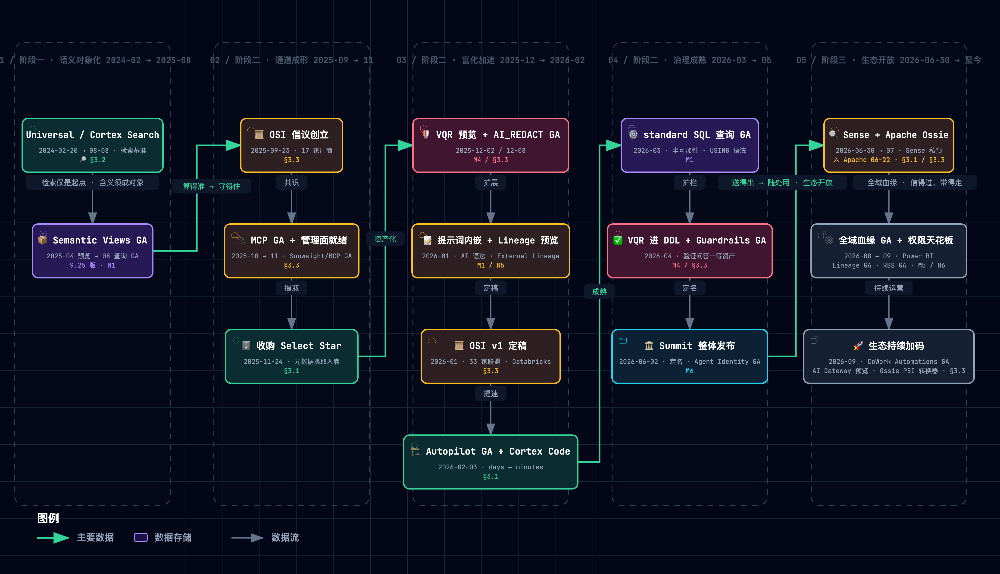

> 图源（可 diff 文本）：[`horizon-context--evolution-timeline.mmd`](../../assets/mermaid/cognitive-context/horizon-context--evolution-timeline.mmd) · 交互版（下载到本地打开）：[`horizon-context--evolution-timeline.html`](../../assets/architecture/cognitive-context/horizon-context--evolution-timeline.html)

这张图一句话：次序本身就是方法论——**先造对象（定义+校验门），再装治理与富化，最后开生态**；没有对象化的「开放」只是把混乱换个格式分发。


---

## 13. 关键实证数字

读表纪律：所有数字先看「谁测的、什么条件、截至何时」——尤其区分厂商自报与第三方独立。状态与数字截至 2026-09-30 实况（详见 §15 第 2 条）。

| 实验/基准 | 关键数字 | 条件 · 截至 | 一句话读法 |
| :-- | :-- | :-- | :--- |
| 裸库 Agent 基线（Snowflake 内部产品分析题）[5] | 准确率 ~25% | 需跨表 join/口径/过滤惯例的内测题集 · 2026-06 博客口径 | 裸问业务题，Agent 大面积答错 |
| 裸库基线第二口径（Snowflake 转述 Anthropic 独立测得）[5] | 准确率 21% | 经 Sense 博客转述、非一手发表 · 2026-06 | 量级互证：换家测还是两成（读时记转述属性） |
| Cortex Sense 自报基准[5]（Summit 原发稿[3]同数） | 24.1% → 86.3%；$1.76 → $0.59/查询 | 前沿编码 Agent vs 裸 CoCo vs Sense 加持 · 自家难题集 · 2026-06 | 自报增益，成本降来自「不再逐表 DESCRIBE」 |
| CoWork + Sense 组合口径[16] | 83% vs 47%（无 Sense）vs 23%（前沿 Agent+MCP） | 复杂企业查询内部测试 · 2026-06 | 三口径一组读，都是自报 |
| 语义层 vs text-to-SQL（dbt 2026 基准）[23] | 受覆盖题：SL 98.2%/100% vs T2SQL 90.0%/84.1%；全题集：SL 72.7% vs T2SQL 64.5%（2023 年 T2SQL 32.7%→64.5%） | ACME 保险集 11 题×20 次 · 2026-04 | 品类卖方基准，双口径读：受覆盖题逼近满分，全题集差距收窄到 8 个点、但 SL 失败形态是拒答不是错数 |
| 语义视图覆盖面（Snowflake 自家数据团队）[5] | <5% 的 9,685 张表 | 内部语义视图建设实况 · 2026-06 | 人工建定义追不上数据增长，Sense 的动机 |
| 物化加速（TPC-DS 四查询）[31] | 59×–91×；扫描 359GB → 120MB | 单条物化服务四条同型查询 · 2026-08 自报 | 预聚合+改写的收益量级，仅 Semantic SQL 路径 |
| 检索分层增益（Cortex Search 内部基准）[15] | NDCG@10 0.22→0.49→0.53→0.59；hit rate@1 0.79→0.83→0.86 | 关键词→向量→混合→混合+重排 · 2024-08 自报 | 混合+重排是检索侧的标准形态 |
| 检索失败率相对降幅（Anthropic Contextual Retrieval）[29] | top-20 失败率 5.7%→2.9%（-49%），加重排 -67% | 1−recall@20 口径 · 2024-09 | 方法论证据：上下文加工显著降检索失准 |
| 477 vs 48（typedef 举证）[8] | distinct 跨时间相加 477 vs 重算 48 | typedef 转述的生产实例（同机制玩具复现为每日 2+2 相加得 4 vs 去重 3）· 2026-06 | 治理≠验证的最重例证（§15 第 4 条） |
| Ossie 人力（Apache clutch 实况）[7] | 13 committers / 7 PPMC；首 release 未切出 | clutch 页 Last Status Update 2026-07-16 · 访问 2026-09-30 | 孵化早期体量，生态势头看组织数不看人数 |

三条核心宣称的独立证据交代：①「裸问会错」——基线端有 Snowflake 自测 25%[5] 与其转述的 Anthropic 独立测得 21%[5]两个口径量级互证（后者系转述、非一手发表），但**增益端（86.3%/83%）全部自报**，无第三方复现；②「执行语义差异化」——Looker 可关对称聚合[19]、Cube 回退上游[20]是两家官方文档的一手证据，非评测；③「语义层收益」——dbt 基准[23]是品类卖方（dbt Labs）在自管基准上的数字，覆盖题口径下成立、外推需谨慎。本仓原型 D1–D10（§14）只证明机制逻辑按描述运作，不构成对上述任何商业数字的复现。

---

## 14. 动手实验室

七个机制亲手拆一遍，秒级跑完（仓库根目录执行；纯标准库、零依赖、确定性输出——同命令永远同日志）：

```bash
uv run --no-project python docs/research/cognitive-context/assets/horizon_context_lab.py --selftest
uv run --no-project python docs/research/cognitive-context/assets/horizon_context_mcp.py --selftest
```

机制 → 代码位置速查（`horizon_context_lab.py`，行号经 2026-09-30 重核；生态章原型在 MCP 文件）：

| 机制 | 位置 |
| :-- | :-- |
| M1 口径单点：五段式对象 + 校验门 | `SemanticView` :160 · `VerifiedQuery` :151 · `validate_view` :235（FK→键列 / 重名 / ≥1 dim+metric） |
| M1 查询期重算：查询引擎 + 破坏开关 | `compile_query` :378 · `_naive_joined_rows` :319（反事实）· `_aggregate` :345 · USING 消歧 `_dim_value` :291 |
| M2 行列级策略（执行面拒绝） | `compile_query` :378 内 `enforce_rbac` 分支（PRIVATE 拒绝）；代理严拒面 `session_allows` :788 |
| M3 语义级治理（双层防线） | 检索层过滤 `resolve` :534 的 `dim_filtered`（体验）+ 执行层拒绝（底线，同上） |
| M4 应答层验证锚定 | `VerifiedQuery` :151 · `resolve` :534 命中路由 · `mock_agent` :603（verified 短路 / compile / cannot_answer） |
| M5 端到端列级血缘 | `record_lineage` :683（执行自动沉淀·derived 展开）· `ingest_external_lineage` :713（三道闸）· `get_lineage` :701 |
| M6 Agent Identity | `agent_session` :769（天花板只减不增）· `audit_log`（agent_type 归因）· `session_allows` :788（严拒面+实时求值） |
| M7 分类与标签驱动 | `classify` :813 · `policy_for` :819（一次性映射）· `project_cell` :827 |
| §10 富化（冲突浮出 + 自纠环） | `detect_conflicts` :495 · `adjudicate` :511 · `eval_loop` :636 |
| §11 检索（四因子排序） | `rank` :467（相关度判定收敛于 `_matches` :460）· `freshness` :456（REF_DATE 固定字面量） |
| §12 生态（MCP 开放互操作） | `horizon_context_mcp.py`（stdio 服务 + T1–T8 场景自测） |

**破坏性实验**（均为实测，每个只改一个 flag/一行；改动点与退化日志摘自 §14 命令的实际运行日志）：

| # | 拆什么 | 实测退化 | 教训 |
| :-- | :--- | :--- | :--- |
| D1 | `agg_before_join=False` | Jan 440（对照 200） | join-then-aggregate 是 fan trap 的标准死法，LLM 也会踩 |
| D2 | `distinct_safe=False` | [6,1,2]（对照 [3,1,2]） | distinct 的安全性来自「数集合不数行」（集合计数的经典语义[10]），退化即双计 |
| D3 | `last_snapshot=False` | [11,6,7]（对照 [5,6,7]）；全期 7 vs 24 | 半可加指标求和 = 同一台服务器按天重复计数（477 vs 48 的机制） |
| D4 | 冲突策略改 `auto_popularity` | 推断层 count(events) 胜出 [6,1,2]（对照 [3,1,2]） | 「不自动选」保住的正是多数派错误不碾压正确口径 |
| D5 | `enforce_rbac=False` | intern 按 plan 拿到 [90,560]（泄露发生）；装回 → blocked | 执行层拒绝是底线，应用层过滤拦不住直连 |
| D6 | 跳过 validate 注册坏视图 | `relationship bad: referenced column customers.plan is not PRIMARY KEY/UNIQUE` 被拦下；无门则垃圾定义静默入库 | 结构校验是行数失控的注册期前置防线 |
| D7 | `derived_post_agg=False` | 122.22（对照 108.33） | 平均的平均不是平均——derived 必须先聚后除 |
| D8 | 血缘摄取 `strict_resolve=False` | 虚构对象 ghost 入账（raw.y→ghost.x） | 账本与真实数据流脱钩，事后对账从此不可信 |
| D9 | 会话 `ceiling=False`（快照冻结） | 回收后旧会话仍持 `select:orders`（越权窗口）；天花板会话同刻实时失去 | 天花板必须查询期实时求值，快照式权限是越权窗口 |
| D10 | 标签映射置空 | phone 已贴系统标签仍明文出楼 | 发现→标记→执行 链条断在最后一环，分类不等于保护 |

十次实验合起来的实践心得：每个组件单拎不神奇，**拆掉任何一个都有具体、可复现的坏法**——这是判别「工程组合创新」成色的试金石。十次与规则面对应：D1/D2/D7 打 M1 重算保障，D3 打 `NON ADDITIVE BY`，D6 打注册校验门，D5 打 M2 执行面，D4 打 §10 冲突纪律，D8 打 M5 摄取门，D9 打 M6 天花板，D10 打 M7 供给链。

玩具域之外，官方「建模最佳实践」给真上生产的护栏[14]：

| Snowflake 官方建议 | 一句话理由 |
| :-- | :-- |
| 首个语义视图 5–10 表起步（尺寸无硬上限） | 小闭环先跑通，巨无霸视图是反模式 |
| 整视图控制在 ~100,000 token 内（guideline） | 超限触发 prune（视图+指令+会话历史逼近上下文窗口）——延迟与质量双伤 |
| 每表每列写业务描述 | 「描述是精度的第一要素」——LLM 推不出你的专有术语 |
| synonym 克制使用（新指南） | 前沿模型下 synonym 增益小、白耗 token；自动生成的常降质 |
| many-to-many 用桥表模拟 | 引擎不直接支持，两条 many-to-one 是正解 |
| verified queries 在描述稳固后再加 | 题库优化延迟与覆盖，不补建模的窟窿 |
| 敏感列慎开 sample values | 示例值是元数据，不走掩码（§15 第 5 条） |


---

## 19. 底层规律与核心争议

### 规律

**规律 1：定义层已商品化，差异化全在执行半边**（英文锚点：execution semantics）。把业务口径写成声明文件，每家语义层都会；拉开差距的是「声明被怎样执行」——Looker 的对称聚合可被 `symmetric_aggregates: no` 一行关闭[19]，Cube 无匹配预聚合即回退查上游[20]，dbt MetricFlow 确定性生成但受建模覆盖面约束[23]。Snowflake 的选择是把「声明唯一」与「查询期重算」两半铸进同一个 DDL 对象、不可分售[4][6]。演示含反面代价：这条规律的另一面是——执行保障越刚性，覆盖面越受注册纪律约束（D6 的门拦住的也包括你自己的草稿）。

**规律 2：治理的强制力来自执行点，而非定义点**。策略写在哪里不重要，**求值发生在哪**才重要：应用层过滤可绕过、BI 层口径可漂移，引擎层求值对每个调用者生效[4]。「A context layer bolted on top of a governance engine must reconcile two systems every time a query runs」[2]——两系统对账是漂移之源。判据：看一个治理宣称，先问「绕开这个点会发生什么」；答得出「什么都拦不住」的，就是装饰性治理。

**规律 3：正确性 = 注册期校验 × 查询期重算，两道独立保险**。声明合法（D6 拦非法结构）与计算正确（D1/D2/D3/D7 拦错误顺序/双计/跨天相加）是两条可各自独立失效的底线[4][6]——只修一道的系统，另一道坏掉时静默出错。这条规律跨工具成立：执行语义的四个经典坑（fan trap/chasm trap/平均的平均/半可加）在哪家引擎都是同一批，差别只在「谁把它们焊死成了不可关闭的默认」。

**规律 4：自动富化的可信来自「冲突浮出 + 人工裁决」，而非多数派投票**。Sense 测出几十种日活定义时停下摆给人[5]；本仓原型 D4 实测：冲突交给 popularity 自动选，错误口径以热度 200:3 碾压正确口径胜出——「习惯不等于真理」。对照 RAG 的「检到什么用什么」[5]与检索增强把 top-20 失败率相对降 49%→67% 的方法论[29]：检索与排序能缩小错误面，但**裁决权留给人**才是可信的分界线。

**规律 5：AI 可信答案 = 声明（governed）× 背书（VQR）× 审计（lineage + identity）配套缺一不可**。这是 §15 第 4 条批判（governance ≠ verification）的正命题：单靠治理，477 vs 48 照样发生[8]；单靠题库，长尾无人背书；单靠血缘，只能事后追责不能事前防错。Horizon 的组合姿态是把三者铸在同一目录里——但组合的完整性（尤其验证半边）仍是进行时，如实按 §15 读。

### 争议

**争议 1：「不可绕过」的边界在哪里——引擎周界内 vs 数据出楼后**。Snowflake 宣称 engine-level 不可绕过[1][4]；typedef 与 Datus 的提醒：直查底库、导出数据即绕过，Ossie 携带的定义在别家引擎如何执行无人担保（Snowflake 官方 Ossie 导出桥即静默丢 ASOF/RANGE 非等值关系[21]）。两派分歧的本质不是事实而是**承诺范围**：厂商说「我的地盘我做主」，批评者说「你的承诺在数据离开那一刻清零」。本文按 §15 第 3 条采信限缩解读。

**争议 2：语义层的增益窗口是否正在收窄**。一方证据：Snowflake 自报 24.1%→86.3%[5]；另一方证据：dbt 2026 基准里裸 text-to-SQL 三年间从 32.7% 涨到 64.5%（全题集）、可答题集达 84–90%[23]——模型代际跃迁下，语义层的边际价值还剩多少？两边的「裸」不是同一种裸：Spider 2.0 级企业工作流（千列库、百行 SQL、多步管线）[28] 与 ACME 11 题受控集[23] 难度天差地别，25%/21% 与 64.5% 的落差本身说明「裸问准确率」高度依赖考卷。共识区间在收窄后仍然成立的两条：**受覆盖题上语义层逼近满分且确定性生成**（错法从「自信错数」变成「显式拒答」[23]），以及**全题集上语义层输在覆盖面、赢在失败形态**——SL 的 27.3% 未得分为显式拒答，T2SQL 的 35.5% 未得分为自信错数[23]。窗口是否收窄，取决于你的考卷更接近哪一端（学术侧亦有「语义层中介 Agent」的方案探索[22]）。

**争议 3：语义层与转换层的职责边界——互补还是责任真空**。Snowflake FAQ 定调互补：「dbt 定义数据怎么建（transformation），语义视图定义数据什么意思（interpretation）」[1]；typedef 指出真空地带：「一个指标能不能跨时间相加，是在 dbt 代码里决定的——比语义视图低一层，目录不往下看」[8]。477 vs 48 正是这个真空的实证[8]。分歧无法被产品定位话术抹平：grain 决策权在转换层、正确性承诺在语义层，两层之间的交接协议目前只有「人来保证」。

---

## 15. 适用边界

### 成立条件（定义域 · 成立工况 · Out-of-Scope）

- **定义域**：Snowflake 平台内、经查询引擎执行的路径（Semantic SQL / 标准 SQL 打语义视图 / Cortex 系 Agent / 托管 MCP）。语义视图本身是元数据[4]，威力全部来自「执行回到引擎」。
- **成立工况**：Enterprise Edition 及以上（分类、外部血缘）；定义已注册且校验门开启；掩码/行访问策略挂在底层表（而非应用层）；Agent 经可识别入口（原生 Agent、托管 MCP、`IS_AGENTIC` OAuth、SERVICE_AGENT）进入。物化等 Preview 特性按 §15 第 2 条时点读。
- **Out-of-Scope**：直查底层数据库；数据导出后的下游加工；定义携带至非 Snowflake 引擎后的执行语义（Ossie 只管携带[7][8][21]）；上游转换层的数据质量与 grain 决策（dbt 的地盘[1][8]）；以及评测闭环（Cortex Agent Evaluations 是独立发布环节，不属 Horizon Context[11]）。

### 材料没有证明的事

1. **86.3% 与 83/47/23、59–91× 全部是 Snowflake 自家基准**——自家数据、自家考卷、自家口径；21% 第二口径系 Snowflake 转述 Anthropic 独立测得[5]（非一手发表），增益端无任何第三方复现。这批数字只能当「官方能力演示」读，不能当中立评测。
2. **状态时点（2026-09-30 实况）**——Metadata Connectors 仍在私预（首批含 PostgreSQL/SQL Server/Tableau/Power BI/dbt 等开放列举[2]）；Cortex Sense 私预且无 docs 页[5]；物化 Public Preview（2026-07-09 起）且仅 Semantic SQL 路径受益[4][33]；Semantic Studio 状态两说并存（release note 标 Preview、产品页脚注标私预，以 docs 为准[33]）；External lineage / RSS 均 GA（2026-09-03[33]）；Business Glossary（业务术语表）「H2 2026」上线时间为三方转述、无一手出处，存疑；BlackRock 是早期采用证言、非效果数据[3]；Select Star 收购的产品化去向无公开细节可核[17]；分类识别的精度/误报边界亦未见材料披露。
3. **「不可绕过」只在引擎周界内成立**——直查底库、导出数据即绕过；Ossie 决定定义**携带**，不解决定义在别家引擎的**执行**（官方 Ossie 导出桥即静默丢 ASOF/RANGE 非等值关系，Datus 指出[21]）；出口安检——AI Guardrails，Horizon 内负责检测/改写/拦截 Agent 输出中 PII/PHI 的组件[4]——也有自己的缝（见第 5 条）。
4. **governance ≠ verification**——`NON ADDITIVE BY` 是人填的声明、非系统推导；上游 dbt 已把 grain 塌缩（按天汇总）后，语义视图的合法算式照样产出 477 vs 48 的错数[8]；lineage 记录「谁喂谁」，不校验「这么算是否合法」；typedef 论证了该缺口的存在[8]；本文综合判断：VQR 补上「锚定」一角，一般性计算正确性验证仍是开放面（typedef 原文未评 VQR 覆盖度）。
5. **机制面的已知缺口集合**——①信号排序可能放大多数派错误：popularity 权重下，被 500 条查询使用的错误 join 模式压过 3 条查询的正确模式（D4 实测同构），且 Sense 的 per-role context 未交付（私测期单角色全量[5]）；②sample values 是元数据、不走掩码[14]——官方建议对低基数维度提供代表性示例值、并提醒敏感列慎用，无强制[14]；③AI Guardrails 的函数级脱敏（AI_REDACT，2025-12-08 GA[33]）对超长文本的处理上限未见材料披露，长文本场景接入前需实测。

---

## 17. 用户自测与费曼研讨套件

读完想检验自己？三道题按需取用（答案要点附后，建议先答再对）：

1. **为什么 M1 必须是「双不变量」，一条不行吗？**——提示：分别想象「只有口径单点」与「只有查询期重算」的两家语义层各会怎么错（对照规律 3 与 Looker/Cube/dbt 的取舍[19][20][23]）。
2. **M2 与 M3 都在管「谁能看什么」，拆掉哪一个更危险？**——提示：比较「越权看到明文」与「受限口径静默脱限」两种失效的可发现性（D5 vs C2 实测形态）。
3. **你司数据平台选型，对方宣讲「我们有语义层、治理不可绕过」。用本文框架设计三个提问拆穿或确认这个宣称。**——提示：定义是否复制到消费端（M3）、策略求值点在哪（规律 2）、验证半边交付了什么（规律 5）。

答案要点：①两条独立失效线——声明半边坏=垃圾定义静默入库（D6），执行半边坏=合法 SQL 错数（D1/D7）；竞品把两半分开卖（可关闭/可回退），Snowflake 铸成一体。②M3 更危险：M2 失效显性可查，M3 失效表面合规（应用层自滤放行），治理最怕的暗伤。③三问：消费端能否脱离引擎缓存作答（能=可绕过）；策略求值在引擎还是应用层（应用层=装饰性治理）；有无人工核验层与事后审计面（无=只有治理没有验证）。

---

## 18. 与本仓的关联

- **机制映射**：[Horizon Context ↔ negentropy 机制映射报告](./012-horizon-context-mapping-negentropy.md)（16 条锚点核验）。
- **设计蓝图**：[Context Layer 技术蓝图](./013-context-layer-blueprint.md)——以 Agent 运行时上下文为第一性对象的设计 SSOT；本篇（011）承载 Horizon 全量机制载荷（冻结），013 承载设计与判定。
- **配套原型**：[`assets/horizon_context_lab.py`](./assets/horizon_context_lab.py)（七机制 + 场景矩阵 + 十次破坏实验）· [`assets/horizon_context_mcp.py`](./assets/horizon_context_mcp.py)（MCP 服务原型，T1–T8）。
- **配套科普**：M1–M7 各一张 archify 动效工程图 + §1/§3/§4 总览图随文内嵌（共 15 张，交互版 HTML 可下载本地打开）。

---

## 参考

[1] Snowflake, "Horizon Context — Governed Semantic Layer & Data Catalog," *Snowflake Product*, 2026. [Online]. Available: https://www.snowflake.com/en/product/features/horizon-context/

[2] Snowflake, "Snowflake Horizon Context: The Governed Context Layer for AI, BI and Apps," *Snowflake Blog*, Jun. 2, 2026. [Online]. Available: https://www.snowflake.com/en/blog/horizon-context-governed-context/

[3] Snowflake, "Snowflake Advances Trusted AI with Snowflake Horizon Catalog Centralizing Governance, Context, and Security Across the Enterprise," *Press Release*, Snowflake Summit 26, Jun. 2, 2026（live 页已改写，自报基准与产品状态清单以原发稿留档版为准）. [Online]. Available: https://www.snowflake.com/en/news/press-releases/snowflake-advances-trusted-ai-with-snowflake-horizon-catalog-centralizing-governance-context-and-security-across-the-enterprise/

[4] Snowflake Documentation, "Overview of semantic views," "CREATE SEMANTIC VIEW," "How Snowflake validates semantic views," "Materializing dimensions and metrics in semantic views," "Snowflake Horizon Catalog," "External lineage," "Data Lineage," *docs.snowflake.com*, 2026. [Online]. Available: https://docs.snowflake.com/en/user-guide/views-semantic/overview; "Materializations," https://docs.snowflake.com/en/user-guide/views-semantic/materializations; "External lineage," https://docs.snowflake.com/en/user-guide/external-lineage; "Data Lineage," https://docs.snowflake.com/en/user-guide/ui-snowsight-lineage; "Horizon Catalog," https://docs.snowflake.com/en/user-guide/snowflake-horizon

[5] Snowflake, "Introducing Cortex Sense: Grounded Context for the Data You Never Modeled," *Snowflake Blog*, Jun. 30, 2026. [Online]. Available: https://www.snowflake.com/en/blog/enterprise-ai-agents-grounded-context/

[6] W. Pugh, "Why Do We Need Semantic Views? Avoiding Subtle Mistakes in Complex Calculations," *Snowflake Engineering Blog*, Mar. 9, 2026. [Online]. Available: https://www.snowflake.com/en/blog/engineering/why-we-need-semantic-views/

[7] Snowflake, "Snowflake, Salesforce, dbt Labs, and More Revolutionize Data Readiness for AI with Open Semantic Interchange Initiative," *Press Release*, Sep. 23, 2025; "Open Semantic Interchange Specs Finalized," *Snowflake Blog*, Jan. 28, 2026; Snowflake, "Apache Ossie: Open Semantic Interchange Incubator," *Snowflake Blog*, Jul. 8, 2026（17 家 launch partner → 50+ 组织口径出处）; Apache Software Foundation Incubator, "Ossie (Incubating) Clutch Record," 2026（Last Status Update Jul. 16, 2026；访问 2026-09-30）. [Online]. Available: https://www.snowflake.com/en/news/press-releases/snowflake-salesforce-dbt-labs-and-more-revolutionize-data-readiness-for-ai-with-open-semantic-interchange-initiative/; https://www.snowflake.com/en/blog/open-semantic-interchanges-specs-finalized/; https://www.snowflake.com/en/blog/apache-ossie-open-semantic-interchange-incubator/; https://incubator.apache.org/clutch/ossie.html

[8] typedef, "What Is Horizon Context? Snowflake's Governed Context Layer Explained," *typedef.ai Blog*, Jun. 12, 2026（赛道创业公司，利害已标）. [Online]. Available: https://www.typedef.ai/blog/what-is-horizon-context-snowflakes-governed-context-layer-explained

[9] Atlan, "Snowflake Horizon Context," "Snowflake Horizon 101," *atlan.com*, 2026（目录厂商，利害已标）. [Online]. Available: https://atlan.com/know/snowflake/snowflake-horizon-context/

[10] X. Dey, *Semantic Data Modeling*, 2001（纸质，distinct 计数理论的经典出处，沿用前代核验）.

[11] Snowflake, "Snowflake Delivers Semantic View Autopilot as the Foundation for Trusted, Scalable, Enterprise-Ready AI," *Press Release*, Feb. 3, 2026; Snowflake Documentation, "Semantic View Autopilot," *docs.snowflake.com*, 2026. [Online]. Available: https://www.snowflake.com/en/news/press-releases/snowflake-delivers-semantic-view-autopilot-as-the-foundation-for-trusted-scalable-enterprise-ready-AI/; https://docs.snowflake.com/en/user-guide/views-semantic/autopilot

[12] Snowflake Documentation, "Cortex Analyst Verified Query Repository," "Optimize an existing semantic view or model with verified queries," *docs.snowflake.com*, 2026. [Online]. Available: https://docs.snowflake.com/en/user-guide/views-semantic/verified-query-repository; https://docs.snowflake.com/en/user-guide/snowflake-cortex/cortex-analyst/analyst-optimization

[13] Snowflake Documentation, "Snowflake-managed MCP server," *docs.snowflake.com*, 2026. [Online]. Available: https://docs.snowflake.com/en/user-guide/snowflake-cortex/cortex-agents-mcp

[14] Snowflake Documentation, "Best practices for designing and modeling semantic views," "Best practices for developing and deploying semantic views," *docs.snowflake.com*, 2026. [Online]. Available: https://docs.snowflake.com/en/user-guide/views-semantic/best-practices-modeling; https://docs.snowflake.com/en/user-guide/views-semantic/best-practices-dev

[15] Snowflake, "Cortex Search and Retrieval for Enterprise AI," *Snowflake Engineering Blog*, Aug. 8, 2024. [Online]. Available: https://www.snowflake.com/en/engineering-blog/cortex-search-and-retrieval-enterprise-ai/

[16] Snowflake, "Snowflake CoWork: The Personal Work Agent for Every Knowledge Worker," *Snowflake Blog*, Jun. 2, 2026. [Online]. Available: https://www.snowflake.com/en/blog/snowflake-cowork-personal-work-agent/

[17] Snowflake, "Snowflake to Acquire Select Star to Expand Horizon Catalog's View of Enterprise Data for Next-Gen AI," *Snowflake Blog*, Nov. 24, 2025. [Online]. Available: https://www.snowflake.com/en/blog/snowflake-acquire-select-star/

[18] Snowflake Documentation, "Auto-gen Agents for Shared Data," *docs.snowflake.com*, 2026. [Online]. Available: https://docs.snowflake.com/en/collaboration/auto-generated-data-agents

[19] Google Cloud, "symmetric_aggregates," *Looker Documentation*, last updated Sep. 24, 2026. [Online]. Available: https://docs.cloud.google.com/looker/docs/reference/param-explore-symmetric-aggregates

[20] Honeydew, "dbt Semantic Layer vs. Looker LookML," *honeydew.ai Blog*, Nov. 3, 2023（语义层厂商，利害已标）; Cube Dev, "Matching queries with pre-aggregations," *docs.cube.dev*, 2026. [Online]. Available: https://honeydew.ai/blog/dbt-semantic-layer-vs-looker-lookml/; https://docs.cube.dev/docs/pre-aggregations/matching-pre-aggregations

[21] Datus, "dbt Semantic Layer & MetricFlow," "OSI vs. Warehouse-Native Semantics," *datus.ai Blog*, 2025–2026（赛道创业公司，利害已标）. [Online]. Available: https://datus.ai/blog/dbt-semantic-layer-metricflow/; https://datus.ai/blog/osi-vs-warehouse-native-semantics/

[22] H. J. Kim, S. Khoeurn, and Y. J. Yoon, "A Semantic-Layer-Mediated Agent for Natural Language to SQL over Heterogeneous Enterprise Databases," arXiv:2606.31041, Jun. 30, 2026. [Online]. Available: https://arxiv.org/abs/2606.31041

[23] B. Perigaud, "Semantic Layer vs. Text-to-SQL: 2026 Benchmark Update," *dbt Labs Blog*, Apr. 7, 2026（品类卖方基准，利害已标）. [Online]. Available: https://docs.getdbt.com/blog/semantic-layer-vs-text-to-sql-2026

[24] Snowflake Documentation, "Restricted Session Scope for agents," "Agent identity," "Introduction to sensitive data classification," "Tag-based masking policies," "Understanding Dynamic Data Masking," "Introduction to Column-level Security," "Aggregation Policies," "Projection Policies," "Snowflake AI Security: Agentic & MCP Governance," *docs.snowflake.com / snowflake.com*, 2026. [Online]. Available: https://docs.snowflake.com/en/user-guide/restricted-session-scope; https://docs.snowflake.com/en/user-guide/agent-identity; https://docs.snowflake.com/en/user-guide/classify-intro; https://docs.snowflake.com/en/user-guide/tag-based-masking-policies; https://docs.snowflake.com/en/user-guide/security-column-ddm-intro; https://docs.snowflake.com/en/user-guide/aggregation-policies; https://docs.snowflake.com/en/user-guide/projection-policies; https://www.snowflake.com/en/blog/enterprise-ai-security-agentic-mcp-governance/

[25] Kawabata, "Snowflake's Restricted Session Scope is Now Generally Available, So I Tried Narrowing Effective Permissions Only When Using CoCo," *DevelopersIO (Classmethod)*, Sep. 4, 2026（独立咨询方实测，机器翻译页）. [Online]. Available: https://dev.classmethod.jp/en/articles/snowflake-restricted-session-scope-coco-permission-limit/

[26] Strategy Inc., "Mosaic Ossie Import/Export," *Strategy Product Help*, Current（覆盖 June/July 2026 档）. [Online]. Available: https://www2.strategy.com/producthelp/Current/Mosaic/en-us/Content/mosaic_osi_import.htm

[27] Dremio, "State of the Open Lakehouse: September 2026," *dremio.com Blog*, Sep. 17, 2026（竞对，利害已标）. [Online]. Available: https://dremio.com/blog/state-of-the-open-lakehouse-september-2026/

[28] XLANG Lab, "Spider 2.0: Evaluating Language Models on Real-World Enterprise Text-to-SQL Workflows," ICLR 2025 Oral, 2025; Spider 2.0 Project Site（含 spider2-snow 与 spider2-dbt 设置；榜单动态）. [Online]. Available: https://spider2-sql.github.io/

[29] Anthropic, "Introducing Contextual Retrieval," *Anthropic Engineering Blog*, Sep. 19, 2024. [Online]. Available: https://www.anthropic.com/engineering/contextual-retrieval

[30] Glean, "Glean Raises $150M Series F at $7.2B Valuation," Jun. 10, 2025; "Glean Surpasses $200M in ARR for Enterprise AI, Doubling Revenue in Nine Months," Dec. 8, 2025. [Online]. Available: https://www.glean.com/press/glean-raises-150m-series-f-at-7-2b-valuation-to-accelerate-enterprise-ai-agent-innovation-globally; https://www.glean.com/press/glean-surpasses-200m-in-arr-for-enterprise-ai-doubling-revenue-in-nine-months

[31] B. Hilprecht and J. Klahr, "Accelerating Semantic Views with Materializations," *Snowflake Engineering Blog*, Aug. 12, 2026. [Online]. Available: https://www.snowflake.com/en/blog/engineering/accelerating-semantic-views-materializations/

[32] Apache Ossie, "Ossie — The Universal Standard for Semantic Data," *ossie.apache.org*, 2026; Ataccama, "Ataccama Brings Data Trust to Apache Ossie," *ataccama.com*, 2026. [Online]. Available: https://ossie.apache.org/; https://www.ataccama.com/news/ataccama-brings-data-trust-to-apache-ossie-enabling-ai-agents-to-verify-data-quality-before-acting

[33] Snowflake, "New Features in Snowflake," "New Features in 2026," "Feature Releases in 2026," 及细则页（External lineage GA · Cortex Agent lineage · Iceberg Scan Plan API · Lineage for temporary objects · DCM Projects DEFINE SEMANTIC VIEW GA · DCM Projects ATTACH MASKING POLICY Preview 等）, *docs.snowflake.com Release Notes*, 2025–2026（时间线锚与状态判定的逐条出处；访问 2026-09-30）. [Online]. Available: https://docs.snowflake.com/en/release-notes/new-features; https://docs.snowflake.com/en/release-notes/new-features-2026; https://docs.snowflake.com/en/release-notes/feature-releases-2026; https://docs.snowflake.com/en/release-notes/2026/other/2026-09-30-dcm-define-semantic-view-ga; https://docs.snowflake.com/en/release-notes/2026/other/2026-09-30-dcm-attach-masking-policy-preview
