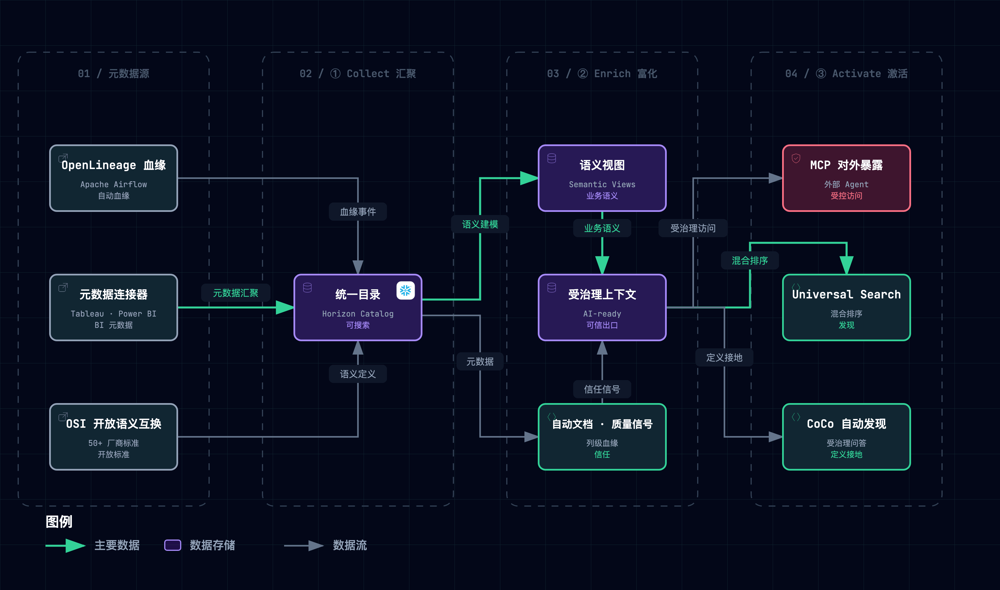
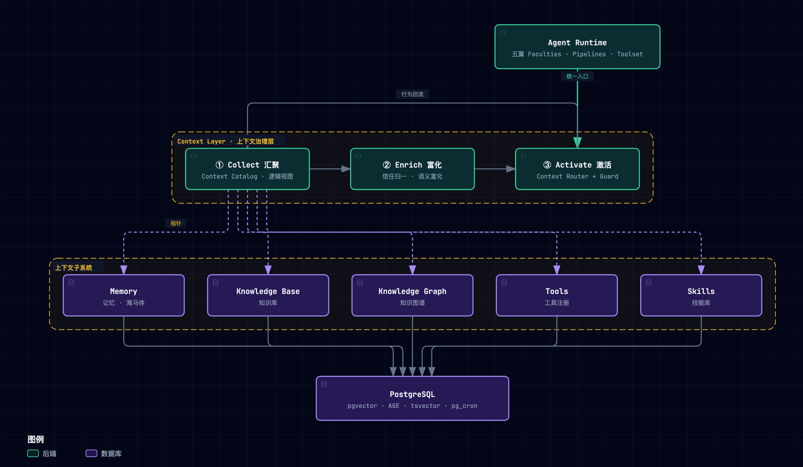

> **定位**：Context Layer 的**精炼设计蓝图 SSOT**——以 [Snowflake Horizon Context](https://www.snowflake.com/en/product/features/horizon-context/) 为范本，可独立部署、可实例化进任意宿主（本文以 negentropy 为实例）的受治理上下文层设计。**文档族分工**：**013（本文）= 设计与判定**（规格、状态、决策、路线）；[011 精读笔记](./011-horizon-context.md) = **全量机制载荷**（精读笔记终稿，冻结——机制详解、组件全景、时间线、实证；过程性内容已于 2026-09-22 裁撤、审计存 git 史）；[012](./012-horizon-context-mapping-negentropy.md) = 锚点核验快照（结论已并入 §12.7）。`concepts/design/context-layer.md` 已于 2026-09-21 删除并入本文。
>
> **编号稳定键**：M1–M7 · D1–D10 · #1–#16 映射 · ADR-1/2/3 · P0–P3 · Phase 1–3。章号无前缀指本文；011 §10/§11/§12 三专章（富化/检索/生态，为其 §3 三子节）在本文落点 §6/§8.2/§8.3。

## 0. 为什么需要：Agent 在自信地猜数

先认识主角：初级 Data Agent——**每天重新入职、毫无业务常识的天才实习生**，数学逻辑满分，却不懂企业方言与合规底线。把数据平台想象成一栋受治理的大厦：本文回答，怎样为他配一套「终极入职包」。

瓶颈不在模型，在**含义的供给方式**。同一份数据，销售报 \$14.2M、CFO 报 \$12.8M——Snowflake 官方开场：同一份数据，两个答案。没有人算错数——错的是**语义无人治理**——物理列名如密码（毛收入叫 `amt_ttl_pre_dsc`），口径散落在各报表的 `CASE WHEN` 里，无人裁决「净收入怎么算」。两家独立实测：**缺乏语义治理的 agent 裸问企业数据，准确率仅 ~25%（Snowflake 内测）/ 21%（Anthropic 复测）**——缺的不是推理力，是受治理的含义。三个**不可自愈**病灶由此裂出：

- **口径打架（含义散落）**：指标无唯一权威定义源，口径散落各子系统，两个部门两套数字，对账崩塌必然；
- **定义漂移（脱节失效）**：外挂语义层独立于底表维护，底表一变语义立即脱节且无从察觉，agent 按过期语义自信作答；
- **门禁穿透（治理虚设）**：权限只浮在外部中间层，拦不住 agent 直查底表，防线虚设。

官方判词：*Without context, an agent guesses. With context built natively into the platform, an agent acts. With context that is also governed natively, an agent can be trusted.*（「没有上下文只能瞎猜；原生内嵌进平台才能行动；同时被原生治理才值得托付。」——Snowflake 官方）

七件承重装备如下（重评选见 §14.3，详解见 011）——即后文五层各章骨架：

| 设计规格 | 机制 | 本质 | 落点 |
| :--- | :--- | :--- | :--- |
| 定义一次、处处生效 | M1 语义视图（口径单点×查询期重算） | 规章一本且即计算器 | §4 |
| 敏感数据分级验放 | M2 查询期行列级策略 | 闸机逐页验放 | §7.1 |
| 治理不可绕过 | M3 语义级治理执行 | 闸机焊死承重墙 | §7.2 |
| 应答可信分层 | M4 应答层验证锚定 | 核准题库：命中出底稿，未核准标注 | §4+§8.1 |
| 事后可对账 | M5 端到端列级血缘 | 出入库台账，程序可查 | §5 |
| 代理可归因 | M6 Agent Identity | 工牌：权限只减不增 | §7.4 |
| 新敏感数据自动纳管 | M7 分类标签驱动策略 | 自动贴标即联动验放规则 | §7.3 |

第三方实证如下，纪律先行：**增益端始终缺独立复现**（分级与完整口径见实证章）。首释：text-to-SQL 即把自然语言翻译成 SQL 查原始库表；语义层即把口径定义成库内一等对象、统一供数；MCP（Model Context Protocol）即让 AI 应用标准化连接外部工具与数据的开放协议：

- 语义层覆盖内 **100%** vs text-to-SQL 从 32.7% 升至 64.5%（dbt 复跑基准，卖方 COI 标注）；
- raw 21% → 查语义层 ~95%（AtScale×Anthropic 同向）；
- 「语义层失败报错，text-to-SQL 失败是看起来对的错数」（业界转述）；
- Spider 2.0 最强 21.3% vs 1.0 时代 91.2%（论文口径）；
- Gartner：2028 年 60% 纯 MCP 项目因缺语义层失败、40%+ agentic 项目 2027 年底前取消；
- Atlan：「context layer 相比仅语义视图 5x」；
- IBM：13% 组织报告过 AI 泄露、97% 缺访问控制；shadow-AI（员工私用未批准 AI 工具）违约成本均值 \$4.63M。

## 1. 术语与范围

semantic layer（语义层）由 Business Objects 在 1990s 创立；2020–23 年 headless BI（不带界面、只给下游供口径）幻灭——「不在执行路径上」是其结构性死因之一，也是后文格局判据的前身；2026-03-10 a16z 定名 **context layer**（context ⊃ semantic），随后 Gartner 称其为 "new critical infrastructure"，2026-06-02 Snowflake 发布 Horizon Context。三派并存：超集（Atlan：目录全家桶都算）/ 并行（Airbyte：独立一层）/ 内核（Cube：必须可执行）。行业自嘲：「每个厂商的 context layer 都长成它已经在卖的那个产品」（业界转述）。**本文立场**：术语收 a16z 宽定义，工程落 Cube 纪律——定义可以宽，执行必须硬。学术锚两条：Context Engineering 三段与 Horizon 三相同构；Dey 经典定义——上下文 = 刻画实体（当前任务）状态的任何信息。

| 维度 | 是什么 | 不是什么 | negentropy 口径 |
| ---- | ---- | ---- | ---- |
| 定位 | 跨子系统治理+编排织物 | 替代子系统的新引擎 | 横亘 Memory/KB/KG/Tools/Skills |
| 存储 | 复用宿主存储（视图+指针） | 新建向量库/图库 | 复用 PostgreSQL |
| 检索 | 统一路由+归一化排名 | 重写各子系统算法 | Router 双通道 |
| 数据 | 逻辑视图+指针 | 物理复制（防 Split-Brain 脑裂） | ADR-1 三视图 |
| 治理 | 引擎级执行（含回退路径） | 应用层可选检查 | ContextGuard 必经 |

> [!WARNING] **范围外**：identity resolution（同一实体的多源身份归并）与长期记忆不纳入本体（宿主承担；部族知识以 verified Q&A / instructions 受治理承接）；不替代各子系统检索；不做数据平面与训练。本仓改动全部 **additive（只增不改既有路径）+ 特性开关 + fail-soft（出错时降级放行而非崩溃）**（§12.6）。

## 2. 业界格局：四条路线与一个异类

格局判据先立：四条路线的功能清单越来越像，真正分野在**治理这道工序发生在哪一层**——装错层的路线各自预置了失败模式。

| 路线 | 治理发生处 | 代表 |
| ---- | ---- | ---- |
| 平台内嵌 | 引擎内 | Databricks UC+Genie One；Fabric IQ（Ontology+动作写回）；Looker（§8.1）；AWS Context+开源 Accelerator（新席） |
| 定义即代码 | 转换层 | dbt MetricFlow（YAML 同仓版本化、PR 评审；已并入 Fivetran） |
| 独立可执行层 | SQL 生成前 | Cube（「治理在 SQL 产生之前；post-hoc 扫描被子查询/CTE 绕过」）；AtScale（Horizon=system of record，它=consumption） |
| 跨系统元数据平面 | 元数据平面 | Atlan Context Studio 产品族；Alation；DataHub |

异类 **Palantir Ontology**：semantic（描述世界）+ kinetic（做动作）双层、decision lineage 贯穿——终点不止「答对数」还有「做对动作」。预置失败模式：内嵌绑死引擎；定义即代码不在执行路径、价值后置；元数据平面只描述不执行；独立层要自己挣采用。四条路线却在同一处收敛：**把治理往 SQL 生成之前挪**。2026-09 增量：Forrester 定调「语义层与知识图谱的下一步演化」（引用卫生：Gartner「+80%」原始出处是 2025-06，勿当新预测）。**本文落位**选第三条（可独立部署的可执行层），吸收各家长处——版本化纪律（§4）、四层信号（§5）、出口治理与动作思想（§7）——理由两句：不绑引擎才服务任意平台，治理在 SQL 之前才防得住绕行。


> 图源：[`context-layer-blueprint--industry-landscape.mmd`](../../assets/mermaid/cognitive-context/context-layer-blueprint--industry-landscape.mmd) · 交互版：[`html`](../../assets/architecture/cognitive-context/context-layer-blueprint--industry-landscape.html)

## 3. 总体架构：五个正交层与它的范本

五层口诀：**对象（放什么）、目录（怎么找）、富化（怎么养）、治理（怎么信）、激活（怎么用）**——依次是规章手册、统一索引总账、双轨编纂、焊入承重墙的风控、前台向导与标准插座。拆五层理由：五个维度各自独立变化（换检索算法不动权限模型），机制与策略分离，各层才可独立演进；negentropy 的实例化即让治理织物横亘 Memory/KB/KG/Tools/Skills 五个子系统（实例化总装章）。


> 图源：[`context-layer-blueprint--architecture.mmd`](../../assets/mermaid/cognitive-context/context-layer-blueprint--architecture.mmd) · 交互版：[`html`](../../assets/architecture/cognitive-context/context-layer-blueprint--architecture.html)

### 3.1 spine：层 × 机制 × 实例的总映射

两个易误读判定先讲明：其一，M4 是**双落点**——验证问答的字段登记在对象层（在册），出示行为在激活层（应答）；其二，M5 血缘在 Horizon 是独立承重席，蓝图落位于目录层 Structural 信号位——**归位非降格**：事后问责链职责不变，只是并进了统一索引总账。

| 蓝图层 | 机制锚 | negentropy 承载（核验 2026-09-20） |
| ---- | ---- | ---- |
| §4 对象层 | M1 | definitions registry ✅；三字段纪律 / verified QA 🔶 |
| §5 目录层 | M5 + 四层信号 | 三视图 + 信任归一 🔶 |
| §6 富化层 | 011 §10 | patrol/Judge 闭环 ✅；冲突浮出面 🔶 |
| §7 治理层 | M2/M3/M6/M7 + 威胁模型 | scoped & accessible ✅；ContextGuard / 策略对象化 / 身份天花板 🔶 |
| §8 激活层 | M4 + 011 §11/§12 | 三层披露 ✅；Router / KB 接地 / MCP 供给 🔶 |


> 图源：[`context-layer-blueprint--layer-mechanism-map.mmd`](../../assets/mermaid/cognitive-context/context-layer-blueprint--layer-mechanism-map.mmd) · 交互版：[`html`](../../assets/architecture/cognitive-context/context-layer-blueprint--layer-mechanism-map.html)

### 3.2 范本速览：Horizon Context

范本速览 Horizon Context：围绕 **Horizon Catalog**（"the agentic catalog"——「面向 agent 的目录」）长出的能力底座，目标是把 Catalog 从「记录有哪些表的资产登记簿」升维为「理解系统」（*"a working model of your entire business"*）。命名学事实：伞名在 docs 全站零命中——须区分「博客伞叙事」与「文档实例化」。状态词图例：GA=正式可用，Preview=公开预览，私预=私有预览。组件↔机制对应与四簇解构见 [011 §4.1](./011-horizon-context.md)。演进三阶段各一句：①语义对象化（2024→2025-08，Semantic Views GA）——把含义铸成受治理对象；②治理内嵌与双轨富化（策略下沉语义层、Autopilot GA、OSI+MCP GA、2026-06-02 定名）——守得住、填得满；③生态开放（Sense 预告、Ossie 入 Apache、External Lineage GA）——带得走。里程碑时间线见 [011 §4.2](./011-horizon-context.md)。官方双 Agent：CoCo（编程）/ CoWork（分析）。

### 3.4 三相流水线 × 四层信号

**Collect → Enrich → Activate** 三段（与 Context Engineering 三段同构）：Collect 汇聚元数据与血缘，Enrich 养厚含义（双轨富化），Activate 把受治理上下文送到消费者手里。五层归位：Collect→对象+目录、Enrich→富化、Activate→激活+治理。



> 图源：[`context-layer--collect-phase.mmd`](../../assets/mermaid/cognitive-context/context-layer--collect-phase.mmd) · 交互版：[`html`](../../assets/architecture/cognitive-context/context-layer--collect-phase.html)

四层信号是流经三段的**原料**，各配一句白话：Structural（有什么、怎么连）/ Operational（查询与新鲜度）/ Semantic（定义与指标）/ Behavioral（热度与用法）（含义与作用详见 011）。本仓表级来源见 §12.2；Behavioral/Operational 是一等信号的设计后果见 §5。

---

## 4. 对象层：规章手册

### 4.1 机制 · M1 口径单点 × 查询期重算（双不变量）

语义视图（语义层在 Horizon 的落地：把表、关系、指标装成受治理的库内对象）这本规章手册是同一本册子的两半：**前半本「口径单点」**——权威规章只印一本，五段式即手册的五个章节（`TABLES` / `RELATIONSHIPS` / `FACTS` / `DIMENSIONS` / `METRICS`）；**后半本「查询期重算」**——手册本身就是计算器：翻到哪条规章，当场按最底层原始凭证套算，而非抄算死的数字。为什么两半合一？**声明唯一与计算正确是两条可各自独立失效的底线**：先祖 Looker 的对称聚合参数可显式关闭——合法定义在 fanout join 下照样算错；dbt MetricFlow 遇 fan-out 直接拒答；Cube 无匹配预聚合即回退底表。四家定义层趋同，**差异化全在执行半边**（typedef："A layer that recomputes from base data is better than one that stores frozen totals"）。Snowflake 把两半铸进同一 DDL 对象不可分售，故一机制两不变量。

**A · 口径单点**。五段式只是入场券，把注册变成**可判定结构**的是校验门：FK 指向键列、禁循环、传递基数有律、多路径显式指定、跨粒度嵌套聚合（`AVG(SUM(..))`）、窗口函数不可级联——非法结构注册期被拒、不进运行时（完整规则见 011 §2 M1）。语义视图官方定位为元数据、与数据同库同治理。字段五设计：`WITH SYNONYMS`（别名是受治理上下文；官方克制：descriptions 才是第一位）；`AI_VERIFIED_QUERIES`（人工核验问答对，§8.1 主角）；`AI_SQL_GENERATION / QUESTION_CATEGORIZATION`（提示词内嵌定义、随定义治理）；`PRIVATE|PUBLIC`；`NON ADDITIVE BY`（半可加声明）。DDL 治理位一行清单：`CREATE OR ALTER` / `TAG` / `COPY GRANTS` / `LABELS` / `ASOF`（按时间就近匹配的关联）。

**B · 查询期重算**（*"that was valid SQL, but it was not valid analytics"*——语法合法而业务答案全错）。六条保障里两条最典型，因果讲透：①**先聚后连（fan trap 扇形陷阱）**：\$100 订单关联多条送货记录时，先 join 再求和即按行数放大成 \$300——聚合必须先于 join；④**半可加末快照**：余额类指标跨天相加没有业务含义，`NON ADDITIVE BY` 让引擎期末取末快照而非求和。其余四条压成判定（明细见精读笔记）：②distinct 数集合不数行；③derived 先聚后除（4.8 vs 16.0）；⑤USING 显式消歧防笛卡尔积；⑥物化（把算好的结果预存成物理表）是性能后手非正确性保障（Preview；`MAX_STALENESS`≥120s；仅 SUM/COUNT/MIN/MAX 可再聚合）。官方定位："an insurance policy for your data's integrity."（「数据完整性的一张保单。」）

### 4.2 设计 · 通用对象模型

五段式的泛化——任何「agent 推理所需的受治理含义」都是对象：

```yaml
# 对齐 Apache Ossie YAML 风格示意
id: metrics/net_revenue
kind: metric                      # definition | metric | doc | skill | qa | policy
synonyms: [净收入, net sales]      # 召回别名是受治理上下文
spec: {metrics: [{name: net_revenue, agg: sum, expr: "gross*(1-discount)", non_additive_by: [day]}]}
instructions: "聚合先于 join；默认走 buyer 关系"   # 随定义分发的 agent 指令
verified_queries: [{question: "net revenue by month", verified_by: "data-team@…", verified_at: 2026-08-20}]
visibility: {level: public}       # public | private | roles
tags: {domain: finance, owner: data-platform}
provenance: {source: governed, authority: 1.0}    # governed | inferred | legacy
version: 12
```

三条字段纪律（#1 增量）：①**synonyms 必填意识**——无别名即检索面隐形；②**instructions 随对象走**——指令随定义分发才能随定义治理，写死 prompt 等于治理外开第二个口径源；③**verified Q&A 带溯源**——人工核验问答对是信任最便宜的来源，谁核的、何时核的随对象携带。结构校验门：引用命中键约束、至少一个可用面、名字唯一——**非法结构注册期被拒，不进运行时**。生命周期：


> 图源：[`context-layer-blueprint--object-lifecycle.mmd`](../../assets/mermaid/cognitive-context/context-layer-blueprint--object-lifecycle.mmd) · 交互版：[`html`](../../assets/architecture/cognitive-context/context-layer-blueprint--object-lifecycle.html)

行业实践：对象格式对齐 Apache Ossie YAML（开放语义互换规范，50+ 组织，携带是今日唯一现实通道，边界见 §8.4）；dbt 定义即代码与之同构；a16z 称「人工精修」为落地最关键一步——机器起草、人类盖章。

#### 4.2.1 Data Contract

数据契约五件套 = **schema + 质量阈值 + 语义（绑 canonical）+ lineage + 访问**；per-agent 授权在交付点执行。破坏性变更走弃用纪律（触发→评审→窗口→通知），不许静默改口径。边界如实：**没有结构性工具原生在推理时强制语义契约**——锁必须焊在激活层与治理层的执行路径上。

### 4.3 negentropy 实例化：definitions registry

| 项 | 状态（2026-09-20） | 锚点 |
| ---- | ---- | ---- |
| 4 类定义 SSOT | ✅ | [`models/definition.py:27`](../../../apps/negentropy/src/negentropy/models/definition.py)；迁移 0095–0099 |
| 注册期领域校验（422 拒入库） | ✅ #2 | [`registry.py:117`](../../../apps/negentropy/src/negentropy/agents/definitions/registry.py) |
| 定义激活物化（DB→`.agent/skills` 幂等渲染） | ✅ #3 | [`harness_materializer.py:137`](../../../apps/negentropy/src/negentropy/agents/definitions/harness_materializer.py) |
| synonyms/instructions/verified QA 三字段纪律 | 🔶 #1 | `definitions.meta` JSONB 可承载 |
| 声明式聚合纪律 | ⏸ #4 | 触发：出现「派生口径」类资产 |

判定：definitions 表已是 4 类定义 SSOT（与 semantic view 元数据对象同构）；物化=定义即查即用、消费端持指针。差异在字段面：Horizon 把 agent 检索面做成对象字段，本仓 meta 可承载但无纪律。

## 5. 目录层：统一索引总账

### 5.1 机制 · M5 端到端列级血缘

台账的类比：大厦机房有一本自动记录的**全楼出入库台账**——谁产出、经谁转手、被谁领用，记录由搬运动作本身触发，不靠人工补登记；记到页级（列级）而非只记箱号（表级）。本机制守护**事后问责链**：预防类机制（§7 四机构）拦事前，台账管事后——答案对不上时能溯源，上游变更时爆炸半径能定位。①原生列级血缘——引擎执行语句自动沉淀对象/列级依赖边（非人工登记，ad-hoc 无盲区），`GET_LINEAGE` 程序化取数；②外部摄取——OpenLineage（血缘开放标准）把仓外 ETL/BI 转手记录汇入**同一本台账**，三道门把关（INGEST 权限/只收 COMPLETE/对象可解析，任一不满足整事件拒绝）；③内外单一账本是差异化（Databricks 外部血缘弱一档、Fabric 原生列级缺位）；④盲区如实：ML notebook 不进血缘。置信度分轴：官方定调先行、独立确认待积。

### 5.2 设计 · 逻辑视图与四层信号

为什么是逻辑视图：目录只 UNION 元数据与指针，不复制数据行——新建物理表即同一事实两处存储、谁新谁旧无从判定（Split-Brain，脑裂），是副本式设计的固有引信。四层信号入库；血缘记「谁喂谁」，属观察型记录，与「这么算是否合法」的校验是两件事（对策见 §9）。knowledge graph 记 what/who、context graph 记 how/why——按后者设计；目录永不碰数据行。

> [!WARNING] **边界**：只 UNION 元数据与指针，不复制数据行、不接管写路径；全量双向同步是集成项目非目录职责；无法 UNION 时退化联邦查询（只做路由与权限标注）。

### 5.3 negentropy 实例化：三视图与信任归一（未落地）

> **ADR-1：Context Catalog 用 PostgreSQL VIEW 实现，不新建物理表。**
> 理由：元数据已存于 PG，新表=副本=Split-Brain 引信；引用一律轻量指针；Horizon Catalog 本身也是元信息层。

三视图（纯 SQL 只读；🔶 迁移目录无对应 CREATE VIEW）：`context_catalog_unified`（UNION 五子系统资产目录）/ `context_trust_signals`（信任+新鲜度归一 0–1）/ `context_access_log`（行为审计）。信任归一（`staleness=min(1,days/90)`，`∥` 空值回退；权重初值可进化 §12.5）：

| item_type | 信任分 |
| ---- | ---- |
| Memory | `0.4·retention + 0.3·importance + 0.3·(1−staleness)` |
| KB chunk | `0.4·(quality∥0.5) + 0.3·min(1,retrieval/10) + 0.3·(1−staleness)` |
| KG entity | `0.5·confidence + 0.5·(importance∥0)` |
| Tool | `0.6·success_rate + 0.4·(1−min(1,p95/5000))` |
| Skill | `1.0 if active_version else 0.7` |

三纪律（#11）：①authority 区分 governed/inferred；②popularity log1p 有界；③freshness 单一 staleness。子系统现存缺口见 §12.3。资产依赖图（#14）⏸——执行史是运行日志非依赖图；触发：出现派生关系图需求时优先「写入时自动沉淀依赖边」。

## 6. 富化层：双轨编纂、民间经验与人工裁决

### 6.1 机制 · 双轨富化（专章，详解 011 §10）

双轨的类比：专家手写规章权威但覆盖不动长尾，为此配一明一暗两条轨道：**速记秘书**（Autopilot，显式轨）把现成报表模型与历史问答对起草成规章草案，**见习助教**（Cortex Sense，隐式轨）在绝不窥探机密凭证的前提下从查询习惯里偷师提炼暗知识。现实缺口：Snowflake 内部实测，全司 9,685 张表人工语义视图覆盖 **<5%**——正确读法：这是 Autopilot GA 之后的现态，证明**显式轨道单独不闭合供给缺口**，不是 Autopilot 无价值。显式轨道 **Autopilot**（GA 2026-02-03）：六路输入、候选过验证门（"from days to minutes"，Snowflake 官方口径）；隐式轨道 **Cortex Sense**（预告期，docs 零命中无可验证入口）：从查询历史与 BI 行为拼装隐式理解（"only ingest metadata and usage patterns, not your actual data rows"——只摄取元数据与使用模式，不碰数据行）；实证数字全部自报。**三层纪律**：①eval 自纠环（三路输入→修正→重排复测）；②**冲突强制浮出人工**——起草规章与民间口径打架时，系统绝对不准自作主张选一个：CONFLICT 卡片并列两定义、无数值、拒答待裁，**禁按 popularity 自动选**（D4 实测：自动选让错误口径胜出）；③governed 权重压倒推断。降级理由：盲评 0/4 入集（证据成熟度轴）；**触发器：Sense GA + 首次独立实测**。学术同构：arXiv 2609.19615。

### 6.2 设计 · 双轨与冲突契约

两条轨道权威度显式分层：显式轨道 authority=1.0（人审后转 governed）；隐式轨道低于 1.0——从日志痕迹拼装的是「解」，只补覆盖、永不覆盖既有定义。**冲突契约是本层核心**，四步因果：同名异义 → 两个定义**双双置 `conflict`** → CONFLICT 卡片（并列两定义、无数值、needs_adjudication）→ 执行层拒答 → 人工裁决后恢复。行业同向：DataHub「被看到 50 次的 join 是晋升候选，不是自动答案」——热度只能提名，不能拍板。覆盖是动态资产而非一次性工程：缺口榜（§11）就是富化工单队列。边界：富化修**含义**，不修数据。

### 6.3 negentropy 实例化：patrol 巡检闭环

| 项 | 状态 | 锚点 |
| ---- | ---- | ---- |
| eval 自纠环同构（评分→终态→失败记忆→reconcile） | ✅ #7 | [`evaluator.py:188`](../../../apps/negentropy/src/negentropy/engine/routine/evaluator.py) · [`pdf_fidelity_patrol.py:655`](../../../apps/negentropy/src/negentropy/engine/schedulers/handlers/pdf_fidelity_patrol.py) |
| 冲突浮出面 | 🔶 #8 | patrol_memory 有 unfixable 记忆（[`patrol_memory.py:42`](../../../apps/negentropy/src/negentropy/engine/routine/patrol_memory.py)）无裁决面 |
| 验证问答供给侧（巡检 done 沉淀问答对） | 🔶 #10 | 沉淀后激活面按 §8.1 命中短路 |
| 隐式挖掘轨道 | ⏸ | 触发：显式覆盖不动（<5% 现象） |

真缺口是**冲突浮出**：巡检结论 vs memory 信念矛盾时无「并列呈现+人工裁决」契约。

---

## 7. 治理层：焊入承重墙的风控体系

治理层是大厦的风控体系：四家机构各守一条正交不变量，每条不变量都配了亲手拆坏它的破坏实验（表中破坏实验列）：

| 机构（机制） | 不变量 | 破坏实验 |
| ---- | ---- | ---- |
| 闸机（M2） | 客体可见性 | D5（拆执行面→泄露） |
| 承重墙（M3） | 定义出口必经同一执法点 | C2（双层防线自证） |
| 贴标（M7） | 发现→标记→执行不断链 | D10（拆映射→明文出楼） |
| 工牌（M6） | 代理会话权限只减不增 | D9（快照式→越权窗口） |

### 7.1 闸机 · M2 行列级策略（客体轴）

闸机的类比：实习生调取的每份文件出闸前逐页过检——机密页自动打码（Dynamic Masking 列掩码）、与身份不符的整行扣下（Row Access 行过滤）。官方准则钉死执行位置：**"Governance policies execute at the query engine layer, not the application layer. They apply automatically to every caller: human analyst, BI tool, or AI agent. There is no separate governance configuration for AI workloads."**（治理在查询引擎层执行、对每个调用方自动生效——Snowflake docs）掩码与行过滤都以**策略所有者角色**查询期求值，同一 SQL 对不同角色返回不同投影；同族 Aggregation/Projection Policy 可 tag-based 绑定（衔接 §7.3）。策略所有权、对象所有权与 APPLY 权限三权分立；外挂层拦不住 agent 直连生成的另一条 SQL——外挂治理的标准死法，故必须焊在引擎内；`IS_AGENT_ACTIVATED` 谓词可对代理会话叠加更严拒绝面。权限例外如实：Cortex Agents 非 owner 需 REFERENCES+SELECT。

### 7.2 承重墙 · M3 语义级治理（定义出口轴）

先消一个易混点：**闸机的规则**（客体轴）与**闸机的焊位**（定义出口轴）是同一台闸机的两件事——规则写在闸机里，闸机焊死在承重墙通道上，全部窗口共用同一执法点。机制五条：①defined-once-enforced-everywhere——语义定义活在与 RBAC/策略同一治理引擎内、查询期强制执行而非拷贝缓存（*"semantics live inside the governance engine and are enforced at query time, not copied or cached"*——Snowflake）；②定义出口约束不弱于数据本体——底表掩码/行过滤策略自动传播到语义视图，PRIVATE 资产检索面不可见（体验）、执行层直接拒绝（底线），「检索藏起来但执行层照样跑」是外挂治理标准死法；③对人与 AI 一视同仁；④跨引擎一致执行；⑤变更纪律刚性——不可原地 ALTER，须 CREATE OR REPLACE / OR ALTER 重建。

### 7.3 贴标 · M7 分类标签（供给链轴）

贴标系统的类比：人工盘点全楼机密永远盘不完——盘点间隙新进楼的文件在裸奔；自动分类让文件进楼即被识别密级、贴上系统标签。机制五条：①自动分类持续为新增/变更列打系统标签（SEMANTIC / PRIVACY_CATEGORY）；②**一次性映射（官方限制要写准）**：掩码策略**不能直绑系统标签**，须先把用户定义标签映射到系统分类标签、策略绑用户标签（"As new data is added … automatically assigned"）——新敏感数据因此自动纳管；③一处 `ALTER TAG` 全库生效（一 tag 每数据类型仅一掩码）；④跨源同构（Atlan 列其为五大能力第二位；Databricks/Purview 同款）；⑤边界如实：基于属性的访问控制（ABAC）在多账号企业有规模天花板（社区判语 "virtually worthless in a real enterprise"）。本席承重于 governance 半边而非 context 半边。

### 7.4 工牌 · M6 Agent Identity（主体轴）

工牌的类比：大厦不给实习生发带教人的脸（完整权限），而发**实习生专用工牌**——权限 = 带教人权限 ∩ 岗位允许面，**只减不增**、刷卡可归因；带教人中途收回权限，工牌立即失效。本机制守护主体轴（who），与 M2 的客体轴（what）正交——缺了它，治理承诺在 agent 消费时静默降级为「人类全权的不可审计自动化」。①入口级代理标记（IS_AGENT OAuth / 托管 MCP / SERVICE_AGENT）；②**RSS（Restricted Session Scope，权限天花板）官方定义**："a privilege ceiling that limits what an agent can do on behalf of a user. An RSS doesn't replace RBAC and can't grant privileges the user doesn't already have"（只做交集、绝不做并集）；③审计三件：`QUERY_HISTORY.agent_type` / `ACCESS_HISTORY.agents_info` / agent activity 视图；④`IS_AGENT_ACTIVATED` 最有效用法是最小权限。GA 线：2026-06-02 发布 → 2026-09-03 RSS 补全（中间锚见 011 §2 M6）。置信度分轴：重要性 4/4 入集、独立走查已现、**具名生产案例为零**；触发器：首份具名案例或独立安全评估。备查：Multi-Party Approval（治理工作流非身份）、Intent-Driven Governance（私预不入集）。

### 7.5 通用设计 · 双层防线与配套三件

升格为通用原则——**双层防线**：检索层过滤是体验（resolve 不让无权者见 private 对象），执行层拒绝是底线（execute 必经 RBAC），缺一不可、互不替代。配套三件：出口 guardrails（两指称区分与参数以 §8.3(4) 为 SSOT）；per-role context（未交付，后置）；审计日志。

### 7.6 供给面威胁模型

经 MCP 开放供给面，等于把攻击面前移成三级链路「客户端→供给面→执行层」。这不是理论威胁——2025 六起具名安全事件为证；最重要的教训：**官方/受信组件也必须当不可信组件对待**（Anthropic 官方 Git MCP Server 缺陷）。

| 威胁 | 拦截位 |
| ---- | ---- |
| 工具描述投毒 / rug pull | 定义哈希钉住 + 注册期评审 |
| 间接注入 | 监控响应中的指令式语言并告警 |
| confused deputy | 动作点风险分级强确认 + 编译期 RBAC |
| token 透传/窃取 | 禁 passthrough；自签发校验 audience |

控制清单：per-client consent · 最小权限拆工具 · 破坏性/涉资金/外发三类动作人工确认 · egress 白名单 · 短命会话 · 定义哈希钉住。编译期共识：治理必须在 SQL 产生前评估——「营销 agent 若有全库 SELECT，会顺理成章查财务表——不是恶意，是不知道边界」（本文编译期共识，非引语）。**2026 加码**（逐条带归属）：LiteLLM CVE-2026-30623 衍生 CVE-2026-42271 已入 CISA KEV（已武器化）；仓库 `.mcp.json` 是零点击 RCE 向量（Checkmarx）；MCPTox 实测平均投毒成功率约 36.5%、82% 路径穿越、43% 命令注入、仅 8.5% 涉 OAuth；NSA 设计指南；MCP 协议 revision 2026-07-28 硬化（Token Passthrough MUST NOT 等）。引用防错：Anthropic 2026-09-10 报告经核查未提及 MCP 投毒，不得引作证据。


> 图源：[`context-layer-blueprint--mcp-threat-model.mmd`](../../assets/mermaid/cognitive-context/context-layer-blueprint--mcp-threat-model.mmd) · 交互版：[`html`](../../assets/architecture/cognitive-context/context-layer-blueprint--mcp-threat-model.html)

> [!WARNING] **边界**：「不可绕过」只在引擎周界内；per-role 未交付；排序可能放大多数派错误——以 §14 第 3/5 条为 SSOT。

### 7.7 negentropy 实例化

| 项 | 状态 | 锚点 |
| ---- | ---- | ---- |
| 检索层过滤 | ✅ #5/6 前半 | `scoped & accessible` 交集（[`hybrid_planner.py:223`](../../../apps/negentropy/src/negentropy/agents/tools/hybrid_planner.py)）；强制交集 [`unified_search.py:100`](../../../apps/negentropy/src/negentropy/knowledge/retrieval/unified_search.py) |
| ContextGuard 出口守卫（含代码回退必经） | 🔶 #6 | 落点 `engine/context/guard.py`（不存在）；PII 扫描 + corpus 校验；空上下文平凡通过、非空必扫 |
| 策略对象化 | 🔶 #5 | `accessible_corpus_ids` 是调用约定参数非策略对象 |
| 调用方身份纳入守卫 | 🔶 #15 | `agent_type` 是 preset 元数据（[`agents_api.py:44`](../../../apps/negentropy/src/negentropy/interface/agents_api.py)）非权限天花板契约 |
| 定义敏感分级 | ⏸ #16 | 触发：规模化对外供给需求 |

## 8. 激活层：前台向导、核准题库与标准插座

### 8.1 核准题库 · M4 应答层验证锚定

核准题库的类比：实习生答业务题不能只靠临场发挥——带教中枢备有一本**资深前辈核准的题库**，每题附盖章底稿（谁核、何时核、答案几何）；命中核准题出示底稿作答，未核准可现场推算，但必须显式标注「未经核准」、**绝不冒充已背书**。本机制与 M1 正交——「语义视图完全正确，但 LLM 生成的 SQL 错引它」是独立失效面；企业敢不敢把 agent 接进决策流，分的就是「哪个数字有人背书」。typedef 最重批判落在这里："Governing a definition, and labeling it, is still not the same as verifying the calculation an agent runs against it"——M4 是这道验证缺口**已交付的一半**（另一半 Agent Evaluations 墙外 opt-in）。载体 **VQR**（Verified Query Repository，人工核验的「问题—SQL—答案」题库）：字段 `name/question/verified_at/verified_by/sql` + confidence；**命中优先**——命中时以已验证查询为生成依据，而非重放；候选三标准（高频/有信息量/新颖）；**>20 条反噬**——验证题参与匹配与生成，超过二十条反而拖慢优化；社区双向（正向：从业者只信命中 VQ；负向：版本混乱迁 dbt/CICD——管理成本的抱怨恰是重度使用痕迹）。跨厂商同构：Looker verified queries（核心已 GA 2026-07 口径）、Genie certified、ThoughtSpot curated。不可外挂增量：**核验态作为库内可撤销、可审计、随定义分发的一等状态**（按定义继承治理理解，勿拔高）。

### 8.2 金牌前台 · 检索与发现（专章，详解 011 §11）

前台的类比：智能前台调度员绝不把整座档案库砸向实习生——那会上下文超载并诱发幻觉；前台只撕下最精准的两三页递出去。先立工程结论：**检索是正确性的前置环节，不是可选优化**。三条独立证据：Spider 2.0 最强通用模型崩崖（从 86.6% 到 10.1%），最难失败不是语法错而是**建错表**（*"queries built on the wrong tables"*——Colrows 分析）；Anthropic 工程实践：检索增强+重排把检索失败率再降 49%→67%（口径：降幅区间，非失败率终值）；Glean 估值 \$7.2B——企业检索是第一预算优先级的市场定价。降级依据如实：Snowflake 量化全为自报（NDCG 从 0.22 到 0.59，检索质量指标）；实现是商品化组件、可外挂近似（以 ACL 镜像漂移为代价）。机制面：Universal Search 混合匹配（GA）；Cortex Search 托管混合检索（>~10 distinct 高基数列才挂）；四因子信号排序（relevance/authority/popularity/freshness）；**top-k 硬约束**（整视图 ~100K token，超限被剪枝、延迟与质量双伤）。与 M4 的类目边界：VQR 候选集全部人工核验（错误面窄），故晋级验证锚定；通用检索候选集是全目录（错误面宽）——候选集性质之别。重评触发器：agent 选择路径独立评测或 OBJECT_VISIBILITY 安全研究。

### 8.3 护照与插座 · 生态与出口（专章，详解 011 §12）

1. **OSI → Apache Ossie**（工作护照）：成员阶梯 17→28→33（v1 定稿）→ 50+；入孵化器日期三口径并存（06-19/06-22/07-08，引用时注明）；**OSI v1 ≠ Apache 版本线**（core-spec 0.2.0.dev0 未发布）；converters 16 目录、**首 release 未切出**；7 个往返缺陷全开放 + Datus 实测静默丢 ASOF/RANGE（*"The export succeeded; the AI behavior diverged."*——导出成功而 AI 行为已变）——可携带已成共识，但携带≠执行≠保真。产品化仅 Strategy One in-product。触发器：任一 tier-1 原生 in-product GA + 独立保真度实测。
2. **官方 MCP Server**（GA 2025-11-04，标准插座）：5 类工具面；官方建议只暴露单个 Cortex Agent 作为唯一工具；协议 revision 2026-07-28（无状态核心、MRTR、DCR 废弃、旧传输 12 个月弃用）；scopes `session:role:*`；≤50 工具；250KB 截断；SSE 流；仅 semantic views；Claude/Cursor 可受控接入。
3. **Automatic Data Agents**（Preview）：对 Marketplace 数据一键生成 SV+Agent——context 第一次成为随数据产品自带的「出厂附件」。
4. **出口安检（两指称必须分开）**：拦 prompt 注入的是 **Guardrails**（GA 2026-04-20）；PII/PHI 脱敏是 **AI_REDACT**（GA 2025-12-08；输入+输出合计 4096 token、输出上限 1024）——两者均属概率性卫星设施而非承重机制；sample values 不脱敏的缝仍在。

**降级定位**：激活层的正确性硬保证全部派生自 M1（口径与计算）+ M2/M3/M6（治理与身份）+ M4（验证锚定）；MCP/Ossie 是传输件与格式件，属可替代商品——传输之战与含义之战是两场战争（"transport war vs meaning war"——Colrows）。**MCP 是第一顺位晋级候选**，双触发器：①平台封锁直连凭证；②与 Cortex AI Gateway GA 合流。反面备查（CoCo 命令门）：可自关的沙箱不承重（"A sandbox that can be toggled off is not a sandbox"——HN 社区）。dbt 分工金句："Use dbt to transform; use Horizon Context to govern meaning."（「用 dbt 做转换；用 Horizon Context 治理含义。」）

### 8.4 通用设计 · resolve 契约与三重边界

**resolve 契约**是 agent 侧唯一入口：`resolve(question, role) → ContextPackage{top-k, instructions, verified_query?, warnings, conflict_card?}`——问题与角色进，上下文包出：top-k 对象、随定义分发的指令、命中的验证题（带溯源即短路）、警告与冲突卡。无 governed 覆盖时显式返回 `no_governed_coverage` 而非静默用推断。**排序公式**：`0.4·relevance + 0.3·authority + 0.2·popularity + 0.1·freshness`；三条纪律：authority 区分 governed/inferred、popularity 取 log1p 有界、tie-break 显式声明。**四工具**：

| 工具 | 职责 | 治理 |
| ---- | ---- | ---- |
| `list_context_objects(role)` | 目录+信任信号 | RBAC 过滤 |
| `resolve_context(q, role)` | top-k 包 | 含 CONFLICT 路径 |
| `execute/compile(...)` | 受治理执行 | **引擎层 RBAC 兜底** |
| `report_feedback(name, verdict)` | 回写 popularity | 同名带 source 消歧 |

公论一句：「MCP 是传输层、语义层是逻辑层」。**互操作三重边界（公理）**：可携带 ≠ 可执行 ≠ 已验证 ≠ 已普及——能把定义带出楼，不等于别家引擎会执行它；执行了，不等于有人验证过算得对；验证过，也不等于业界都在用。因此导出必带 provenance/authority，导入一律降 authority、过校验门（对应 P3）。

### 8.5 negentropy 实例化：双通道统一（方案）

现状：**双通道割裂**——

| 通道 | 载体 | 缺口 |
| ---- | ---- | ---- |
| 自动注入 | [`ContextAssembler.assemble()`](../../../apps/negentropy/src/negentropy/engine/adapters/postgres/context_assembler.py)（:61；Core Block :92→Reflection :100→记忆窗口 :126） | 无 KB 接地；KG 摘要挂 `get_memory_summary()`（:274）不在 assemble 管线 |
| 按需检索 | [`HybridPlanner._seed_retrieval()`](../../../apps/negentropy/src/negentropy/agents/tools/hybrid_planner.py)（:322；Intent→并行种子→图扩展→RRF） | **不含 Memory** |


> 图源：[`context-layer--auto-channel.mmd`](../../assets/mermaid/cognitive-context/context-layer--auto-channel.mmd) · 交互版：[`html`](../../assets/architecture/cognitive-context/context-layer--auto-channel.html)

> **ADR-2：升级 HybridPlanner 为统一检索骨架，不新建 Router 类**——它已具备正确架构，Memory 作第 4 路种子源是增量扩展。

两处扩展（additive + 开关 + fail-soft，🔶）：①**HybridPlanner 接 Memory**——`_seed_retrieval` 追加记忆种子源，`PlannerConfig` 增 `memory_enabled=False`/`memory_top_k=5`，入口 `search_memory`（[`memory_service.py:642`](../../../apps/negentropy/src/negentropy/engine/adapters/postgres/memory_service.py)），纳入统一 RRF（倒数排名融合）、单源 fail-soft；②**ContextAssembler 接 KB 接地**——复用 `_collect_kg_context()` 范式增 `_collect_kb_grounding()`：top-3 chunks 各 1 行摘要 ~200 token，消除「记忆过期而 KB 新鲜未被检索」幻觉。**ADR-3 收敛语义**：自动通道给接地摘要（轻量必出）、按需通道给深度检索（显式触发），共享归一信任排名（§5.3）。


> 图源：[`context-layer--assembler-planner.mmd`](../../assets/mermaid/cognitive-context/context-layer--assembler-planner.mmd) · 交互版：[`html`](../../assets/architecture/cognitive-context/context-layer--assembler-planner.html)

其余状态：三层渐进披露 ✅ #9（L1/L2/L3，[`skills_injector.py:342`](../../../apps/negentropy/src/negentropy/agents/skills_injector.py)）；MCP 供给面 🔶 #13（本仓是客户端 [`mcp_client.py:307`](../../../apps/negentropy/src/negentropy/interface/mcp_client.py)，需转供给）；Ossie ⏸ #12。

---

## 9. 边界对策：治理 ≠ 验证

治理与验证是两件事，先看事故。上游 dbt 已把 grain（粒度，数据聚合的层级）塌缩成日汇总，semantic view 里完全正确的算式照样算出 477 vs 48 的错误数字（typedef 复现）——governed 定义在塌缩粒度上照样错；`NON ADDITIVE BY` 也是人填声明、非系统推导。三级对策：①表达式级 derived 校验（注册期标记）；②verified Q&A 作出口对账资产（验证答案 vs 引擎重算不一致即告警）；③eval 事后评分 + 血缘回溯（兜底）。行业命名 **compiler in the loop**——编译期推导计算合法性尚无成熟方案，以 eval 环兜底，不假装解决。

## 10. 评测：怎么知道它有效

known-answer（已知正确答案的考题集）评测四原则：①考题=业务问题×人工签字的期望值；②用例四类齐全（歧义/隐晦 join/空结果/**越权**——越权用例期望「拒绝+审计」而非数值，最反直觉也最重要）；③golden queries（人工认定的标准参考查询）一等资产；④覆盖内/外分开判卷。KPI 唯一：**报错优于错数**。~10 题起步即可建闭环。**P2 标尺**：覆盖内命中 verified 且重算一致；覆盖外全告警；越权全拒留审计；CONFLICT 全程无数字。两条警示：基准自身会错（Spider2-Snow 错标 62.8%、修正前后排名 Spearman 相关仅 0.32——CIDR 论文口径），引用基准前先审基准；eval 集会腐化，当活资产运营、锁版本。

## 11. 组织与运营：谁有权拍板官方口径

- **工作流**：metric owner=Accountable、steward=Responsible；Propose→…→Certify 全程留审计。反模式：glossary theatre（术语表剧场——术语库建了没人用）、影子查询、无主 metric、过度治理。
- **采用处方**：5–10 指标起步；业务方 day one 参与；赞助人拍板；按基础设施运营而非项目制。
- **失败史三死因**：BI 厂商激励相悖；迁移数学不成立；**不在执行路径上**（与格局判据、激活层降级互为呼应，最结构性）。业界同向转述：「对齐定义比微调模型还难」「要么 100% 要么崩」。
- **可观测三刻度**：覆盖缺口榜（§11，=富化工单队列）、命中率、越权拒绝率——拒绝不是故障，是治理在工作。

## 12. negentropy 实例化总装：治理织物横亘五系部

核心论断：**不从零造上下文引擎，而是把已有子系统收敛到一个治理织物（Context Fabric）之下**——五系部的上下文信号已分散存在、被各自组装，缺的不是原料，是统一的治理与编排层。各系部位置：Engine=调度中枢；Perception+KB/KG=最大供源；Internalization+Memory=记忆供源；Contemplation=eval 消费方；Action+Tools=工具信号供源；Influence=出口消费端；definitions/Skills=对象层载体（✅）。

### 12.1 现状盘点

无统一上下文层，运行期由解析链路分散组装（60s TTL + 代码回退）：


> 图源：[`context-layer--request-injection.mmd`](../../assets/mermaid/cognitive-context/context-layer--request-injection.mmd) · 交互版：[`html`](../../assets/architecture/cognitive-context/context-layer--request-injection.html)

**9 路来源**：身份/Skills/Tools/Model/记忆/会话状态/定义 SSOT/偏好/引用协议。三缺口（锚点以 §8.5 为 SSOT）：①检索未统一（Planner 无 Memory）；②双通道割裂（无 KB 接地）；③信任未归一（§5.3 未落地；回退绕过由 ContextGuard 对冲 §7.7/§12.6）。后果：过期记忆作答、幻觉、排名失效。

### 12.2 运行时分层与四信号来源



> 图源：[`context-layer--runtime-layering.mmd`](../../assets/mermaid/cognitive-context/context-layer--runtime-layering.mmd) · 交互版：[`html`](../../assets/architecture/cognitive-context/context-layer--runtime-layering.html)

| 信号 | negentropy 来源 |
| ---- | ---- |
| Structural | agents · definitions · corpus/knowledge · kg_* · memories/facts · skills · builtin_tools |
| Operational | memory_retrieval_logs · tool_invocations/stats · knowledge_feedback · retrieval/access 计数 · OTel |
| Semantic | definitions · 6 类 memory_type · 8+13 实体关系类型 · skill 模板 |
| Behavioral | retention/importance · quality/retrieval · PageRank+confidence · feedback · 成功率/延迟 |

### 12.3 五子系统上下文契约

（深潜见 [记忆白皮书](../../concepts/subsystems/026-memory-whitepaper.md) 与 [联邦 KG](../../concepts/subsystems/037-federated-kg.md)；各子系统进化杠杆：Memory=`retrieval_config`/`memory_pipeline_prompt`、KB/KG=`knowledge_strategy`、Tools=`builtin_tool_config`、Skills=`skill_template`——第 7 杠杆 context_strategy 见 §12.5）

| 子系统 | 提供 | 信任信号 | 治理 | 缺口 |
| ---- | ---- | ---- | ---- | ---- |
| [Memory](../../concepts/subsystems/025-the-memory-system.md) | 6 类记忆+Core Block | retention·importance·access | PII 检测·AGM 冲突消解·衰减 | 无单一 staleness |
| [KB](../../concepts/subsystems/035-the-knowledge-base.md) | chunks+corpus 元数据 | quality·retrieval | accessible 过滤·feedback | 缺 last_accessed_at；quality 多 NULL |
| [KG](../../concepts/subsystems/036-the-knowledge-graph.md) | 实体/关系/规范实体/社区 | confidence·PageRank | 评审·溯源·双时态 | 未合成归一复合分 |
| Tools | 工具定义 | 成功率/延迟/成本 | 白名单·HIGH_RISK·enforcement | 低频工具 stats 稀疏 |
| Skills | 三层披露 | active_version·visibility | 沙箱校验·提升审批 | 有效性信号未回流 |

### 12.4 SSOT 边界：复用 vs 新增

| 组件 | 状态 | 角色 |
| ---- | ---- | ---- |
| [ContextAssembler](../../../apps/negentropy/src/negentropy/engine/adapters/postgres/context_assembler.py) / [HybridPlanner](../../../apps/negentropy/src/negentropy/agents/tools/hybrid_planner.py) | ✅ 复用+🔶 扩展 | 双通道；扩 KB 接地 / Memory 源（§8.5） |
| [definitions Registry](../../../apps/negentropy/src/negentropy/agents/definitions/registry.py) / model_resolver / [UnifiedRetrievalService](../../../apps/negentropy/src/negentropy/knowledge/retrieval/unified_search.py) | ✅ 原样复用 | 语义层 / 缓存 / KB 后端 |
| 6 个 [evolution handlers](../../../apps/negentropy/src/negentropy/engine/evolution/handlers/) | ✅+🔶 | 6 面 + context_strategy（§12.5） |
| 三视图 / Context Router / ContextGuard | 🔶 新增 | 目录归一 / 路由 / 守卫 |

### 12.5 进化集成：第 7 杠杆 context_strategy

6 个 TargetHandler 天然映射为进化杠杆；新增第 7 面 `context_strategy`，沿用同一状态机与 [`decision.py`](../../../apps/negentropy/src/negentropy/engine/evolution/decision.py) 纯函数护栏：


> 图源：[`context-layer--evolution-levers.mmd`](../../assets/mermaid/cognitive-context/context-layer--evolution-levers.mmd) · 交互版：[`html`](../../assets/architecture/cognitive-context/context-layer--evolution-levers.html)

可进化参数：预算比·接地片段数·信任权重·Router 阈值——影响全部激活路径，每步人工审批。闭环：归一信任 + 行为审计反哺 proposer——「采集→归一→激活→行为→进化」。

### 12.6 风险对策与架构自洽

| 风险 | 对策 |
| ---- | ---- |
| TTL 一致性 | 接地沿用 60s 窗口；复用 `invalidate_cache` |
| 回退绕过治理 | Guard 部署所有路径；空上下文平凡通过、非空必扫 |
| token 压力 | 接地封顶 ~200 token；预算比可进化；压力下关开关 |
| 进化交互 | 每 target 至多 1 非终态提案；decision.py 裁定 |
| 检索延迟 | PG 查询同量级；并行；`timeout=12s` 不变 |

自洽：[一核五翼](../../concepts/framework.md) 只收敛供给不改拓扑；[自进化四层](../../concepts/design/self-evolving-agents.md) 参数属 Evolvable-3；[skills 披露](../../concepts/design/skills.md) Activate 复用；[AG-UI](../../concepts/conversation-foundation.md) 不引入新协议。

### 12.7 机制 ↔ 本仓 16 条映射总表

（源自 [012](./012-horizon-context-mapping-negentropy.md) 2026-09-17，2026-09-20 重校；✅ 对齐 / 🔶 值得落地 / ⏸ 暂缓）

| # | 机制 | 本仓对应 | 判定 |
| --- | --- | --- | --- |
| 1 | M1 五段式（§4） | definitions SSOT | 🔶 部分 |
| 2 | M1 校验门（§4） | parse_definition 422 拒落库 | ✅ |
| 3 | M1 物化（§4） | harness_materializer 渲染 | ✅ |
| 4 | M1 重算（§4） | 无（非指标栈） | ⏸ |
| 5 | M2 策略（§7） | accessible 过滤（非策略对象） | 🔶 |
| 6 | M3 双层（§7） | 检索过滤有；Guard 在方案 | 🔶 |
| 7 | 011 §10 自纠环（§6） | patrol/Judge 全链 | ✅ 同构 |
| 8 | 011 §10 冲突裁决（§6） | 无显式裁决面 | 🔶 |
| 9 | 011 §11 top-k（§8） | L1/L2/L3 披露 | ✅ |
| 10 | M4 验证问答 | done 文档未沉淀问答对 | 🔶 |
| 11 | 011 §11 四因子 | 归一未实现；缺 staleness | 🔶 |
| 12 | 011 §12 Ossie | 无 | ⏸ |
| 13 | 011 §12 MCP | 方向相反（客户端） | 🔶 供给面 |
| 14 | M5 血缘 | 执行史≠依赖图 | ⏸ |
| 15 | M6 身份 | agent_type 有、天花板无 | 🔶 |
| 16 | M7 标签 | 无分类策略链 | ⏸ |

**做**：①Guard 随 Phase 2（#6）②验证问答绑 patrol done（#10）③信任归一三纪律（#11）④身份归因（#15）。**写**：⑤三字段纪律交叉引用（#1）⑥策略对象化（#5）。**暂缓**（带触发）：⑦#4 ⑧#12 ⑨隐式挖掘 ⑩#14 ⑪#16。

---

## 13. 实证数字与动手实验室

### 13.1 关键实证

纪律：除 21%（Anthropic）与 477 vs 48（typedef）外全部官方自报——**增益端无独立复现**；dbt 行卖方基准 COI 标注；中立锚是 arXiv。

| 实验 | 数据 | 读法 |
| ---- | ---- | ---- |
| 无 Context 基线 | ~25% / 21% | 缺含义即瞎猜 |
| CoCo+Sense | 24.1→86.3%；\$1.76→\$0.59 | 自家基准 |
| 语义层中介（arXiv 2606.31041） | 547 任务 94.15% | 中立锚（注明骨干） |
| OSI→Ossie | 17→50+；首 release 未切 | 孵化早期 |
| 本原型 | 200 vs 440 等 | M1–M7 逐点复现 |

### 13.2 动手实验室

```bash
uv run --no-project python docs/research/cognitive-context/assets/horizon_context_lab.py --selftest
uv run --no-project python docs/research/cognitive-context/assets/horizon_context_mcp.py --selftest
```

（机制→代码行号速查与完整运行输出见 011 §14；MCP 文件另含 T1–T8 场景自测。）

十次破坏性实验（每个只改一个 flag；完整输出见 011 机制章）：

| # | 拆什么 | 退化 | 教训 |
| --- | --- | --- | --- |
| D1 | `agg_before_join=False` | 440 vs 200 | fan trap 标准死法 |
| D2 | `distinct_safe=False` | [6,1,2] vs [3,1,2] | 数集合不数行 |
| D3 | `last_snapshot=False` | [11,6,7] vs [5,6,7] | 477 vs 48 机制 |
| D4 | 冲突改 auto_popularity | 错误口径胜出 | 不自动选 |
| D5 | `enforce_rbac=False` | intern 泄露 | 执行层是底线 |
| D6 | 跳过 validate | 垃圾静默入库 | 注册期前置防线 |
| D7 | `derived_post_agg=False` | 122.22 vs 108.33 | 先聚后除 |
| D8 | 血缘 `strict_resolve=False` | ghost 入账 | 账本脱钩 |
| D9 | 天花板快照式 | 回收后仍持权 | 实时求值 |
| D10 | 标签映射置空 | 明文出楼 | 链条断最后一环 |

心得：每个组件单拎出来都不神奇，但拆掉任何一个都有具体、可复现的坏法——判别「工程组合创新」成色的试金石（退化列口径：拆坏后的值 vs 未拆对照值）。

### 13.3 生产护栏

起步护栏逐条：首个语义视图 5–10 表、≤50 列——小闭环先跑通；整视图 ~100K token 内——超限被剪枝；生产按 50+ 视图规划——分域拆分；eval ~10 题；VQR ≤20 条；检索只挂高基数列；首用例避开 Finance/Legal——高敏域审查最严。可观测面：`SEMANTIC_*` 系统表 · `GET_LINEAGE` · agent 审计列；治理属性随克隆/复制/共享自动延续。

## 14. 批判性边界

1. **86.3% 等增益数字全为厂商自家基准**——增益端无第三方复现，引用必须带归属。
2. **状态时点（2026-09-20 复核）**——以 docs 为准：Connectors 私预（Wave 1）；Sense 无验证入口；物化 Preview；Semantic Studio 预览；External lineage GA 09-03；Power BI 摄取 GA 08-18；Business Glossary「H2 2026」系转述存疑；BlackRock 是采用证言、不是效果数据。
3. **「不可绕过」只在引擎周界内成立**——直查底层数据库、导出数据即绕过；Ossie 只决定定义可携带，不解决定义在别家引擎的执行。
4. **governance ≠ verification**——`NON ADDITIVE BY` 是人填声明非推导；477 vs 48 是已复现的事故形态；lineage 是观察记录而非合法性校验；M4 只交付了这道缺口的一半（对策见 §9）。
5. **排序可能放大多数派错误**——popularity 权重下，被 500 条查询使用的错误 join 压过 3 条的正确模式；per-role context 未交付。
6. **出口安检有两条缝**——sample values 属元数据、不脱敏；AI_REDACT 有 4096 token 上限。
7. **方法论边界**——重评选基于 2026-09-17 公开口径：学术侧检索面最小、厂商利害关系已标注、社区证据以快照为主。

边界索引：§1 范围外 · §4.2.1 契约锁在执行层 · §5 UNION 周界 · §6 修含义不修数据 · §7.6 引擎周界 · §8.4 三重边界 · §10 eval 腐化。

### 14.3 重评审记录（压缩版）

M1–M7 与三专章源于 2026-09-17 全局重评选（五透镜扫源 25 候选→四人格盲评→三视角裁决→八路对抗验证；五判据：承重性/不可替代性/跨源共识/独立实证/正交性）。关键 verdict：旧 M1+M2 合为双不变量 M1；引擎治理拆 M2+M3、标签析出 M7；富化/检索/互操作降级专章（证据成熟度轴，各带触发器）；VQR 晋级「验证锚定墙」。25 候选去向全覆盖。**全过程审计存于 git 历史（PR #1149；2026-09-22 自 011 裁撤）。**

## 15. 验收问答（要点）

1. **M1 双不变量 / M2 vs M3 / M4 独立席**：定义合法而执行算错是已文档化状态（Looker/dbt/Cube 三家自然实验）；M2 是闸机里的验放规则本身（客体轴），M3 是闸机焊在哪的拓扑（定义出口轴）；M4 守「哪个数字有人背书」的独立失效面。
2. **M6 实时求值 / M7 一次性映射**：快照式天花板在回收后留越权窗口（D9）；掩码不可直绑系统标签、须经用户标签一次性映射（D10）。
3. **ADR-1/2 与双轨共享设计**：新表即 Split-Brain 引信，故目录用逻辑视图；HybridPlanner 扩展是增量；两条轨道是同一图纸的两种施工（§16）。

## 16. 双轨演进路线：样板间与本楼改造

**同一张图纸（§4–§8）的两种施工**：「样板间」（P0–P3，[`assets/horizon_context_mcp.py`](./assets/horizon_context_mcp.py) 零依赖种子原型——先在独立小屋把七机制全验证一遍）与「本楼改造」（Phase 1–3，全部 additive 只增不改 + 特性开关 + fail-soft 出错降级——在住着人的生产仓里动工，每步可回退）。


> 图源：[`context-layer-blueprint--dual-track-roadmap.mmd`](../../assets/mermaid/cognitive-context/context-layer-blueprint--dual-track-roadmap.mmd) · 交互版：[`html`](../../assets/architecture/cognitive-context/context-layer-blueprint--dual-track-roadmap.html)

| 能力 | 样板间 | 本楼 | 状态 |
| ---- | ---- | ---- | ---- |
| 七机制原型 + MCP stdio | P0 | — | ✅ 全绿 |
| CRUD+resolve+四工具+RBAC+审计 | P1 | 复用 definitions | 🔶 |
| 三视图 + 信任归一 | P2 前置 | Phase 1 ①② | 🔶 |
| Memory 入 Planner | — | Phase 1 ③ | 🔶 |
| Router+接地+Guard+context_strategy | P2 | Phase 2 | 🔶 |
| verified QA+冲突浮出+反馈 | P2 | Phase 2 | 🔶 |
| Universal Search+溯源+per-role | P3 | Phase 3 | 🔶/⏸ |
| Ossie 导入导出 | P3 | — | ⏸ |

样板间：P0 ✅ 机制验证 → P1 最小服务 → P2 信任自纠（标尺 §10）→ P3 互操作（转换器级+per-role+derived 校验）。

| Phase | 改动 | 风险/验证 |
| ---- | ---- | ---- |
| **1 目录+归一+Memory**（低风险） | 三视图；`trust.py` 归一；Planner 接 Memory（`memory_enabled` 默认关） | `=False` 既有测试全过；`=True` 返 memory+KB+KG；信任分∈[0,1] |
| **2 Router+接地+Guard**（核心，中险） | router / kb_grounding / guard 接两路径 / context_strategy | 热路径→开关渐进+fail-soft；Guard 阻断 PII 与越权 corpus |
| **3 深度治理+溯源**（中高险） | Universal Search（opt-in）；进化优化参数（shadow+canary）；chunks 增 last_accessed_at；溯源日志（append-only async）；质量指标 | opt-in 端点；async 不阻塞 |

独立部署：对象层落 PostgreSQL、激活层以单进程 stdio/HTTP MCP server 起步——「可独立部署」的兑现，也是那套「终极入职包」的交付形态。

## 参考

[1] a16z, "Your Data Agents Need Context," Mar. 10, 2026. https://a16z.com/your-data-agents-need-context/

[2] Cube, "Semantic Layer for AI Agents," 2026. https://cube.dev/articles/semantic-layer-for-ai-agents-2026

[3] AtScale, "What Is Snowflake Horizon Context?," 2026. https://snowflake.atscale.com/glossary/snowflake-horizon-context/

[4] AtScale (D. Mariani), "The Semantics of the Semantic Layer," 2022. https://www.atscale.com/blog/the-semantics-of-the-semantic-layer/

[5] Colrows, "MCP Is Not Enough," 2026. https://colrows.com/blogs/mcp-governed-semantic-layer/

[6] IBM, "13% of Organizations Reported Breaches of AI Models," Jul. 30, 2025. https://newsroom.ibm.com/2025-07-30-ibm-report-13-of-organizations-reported-breaches-of-ai-models-or-applications,-97-of-which-reported-lacking-proper-ai-access-controls

[7] Authzed, "A Timeline of MCP Security Breaches," May 2026. https://authzed.com/blog/timeline-mcp-breaches

[8] Checkmarx, "MCP Security: Risks, Incidents and Controls," May 2026. https://checkmarx.com/learn/mcp-security-risks-real-world-incidents-and-security-controls/

[9] "Semantic-Layer-Mediated Agents on Spider2-snow," arXiv:2606.31041, 2026. https://arxiv.org/abs/2606.31041

[10] T. Jin et al., "Pervasive Annotation Errors Break Text-to-SQL Benchmarks," *CIDR* 2026. https://arxiv.org/abs/2601.08778

[11] J. M. Hellerstein et al., "Ground: A Data Context Service," *CIDR* 2017.

[12] Apache Ossie (Incubating), 2026. https://ossie.apache.org/

[13] Snowflake, "OSI Initiative Press Release," Sep. 23, 2025; ASF, "Ossie clutch record," 2026. https://incubator.apache.org/clutch/ossie.html

[14] Anthropic, "Model Context Protocol," 2024. https://modelcontextprotocol.io/

[15] MCP, "Specification revision 2026-07-28," Jul. 28, 2026. https://modelcontextprotocol.io/specification

[16] MCP, "Security Best Practices," 2026. https://modelcontextprotocol.io/docs/2026-07-28/tutorials/security/security_best_practices

[17] MCP, "MCP Roadmap," Aug. 22, 2026. https://blog.modelcontextprotocol.io/posts/mcp-roadmap/

[18] CSA, "MCP Attack Surface: Tool Poisoning and IDE Auto-Execution," Jul. 1, 2026. https://labs.cloudsecurityalliance.org/research/csa-research-note-mcp-tool-poisoning-auto-execution-20260701

[19] Checkmarx, "MCP Config Poisoning," Jul. 27, 2026. https://checkmarx.com/zero-post/mcp-configuration-poisoning-owning-your-machine-with-just-a-text-file

[20] CISA, "KEV Catalog," 2026. https://www.cisa.gov/known-exploited-vulnerabilities-catalog

[21] NSA, "MCP: Security Design," Jun. 2, 2026. https://media.defense.gov

[22] Forrester (B. Evelson, I. Bandyopadhyay), "The Next Evolution Of AI Will Rely On Context Layers," Aug. 20, 2026. https://www.forrester.com/blogs/the-next-evolution-of-ai-will-rely-on-context-layers/

[23] AWS, "Context Ontology Accelerator," Jul. 31, 2026. https://github.com/aws/context-ontology-accelerator

[24] dbt Labs, "Ossie Semantic Models," 2026. https://docs.getdbt.com/docs/build/ossie-semantic-models

[25] Classmethod, "Cortex Sense at World Tour Tokyo," Sep. 19, 2026. https://dev.classmethod.jp/en/articles/bs1170-cortex-sense-swttokyo26

[26] Y. Jia and A. Anaissi, "Automated Business Semantic Layer Construction," arXiv:2609.19615, 2026. https://arxiv.org/abs/2609.19615

[27] Peliqan, "Context Layer Comparison," Jul. 12, 2026. https://peliqan.io/blog/context-layer-comparison

[28] Gartner, "Top D&A Predicts," 2025; "D&A Summit 2026."（付费墙，转引）


> Horizon 精读共用参考（Snowflake 官方文档与博客、Autopilot/VQR/RSS 各 docs 页、dbt 基准、Spider 2.0、Contextual Retrieval、Glean 等 30 条）见 [011 §参考](./011-horizon-context.md)。
