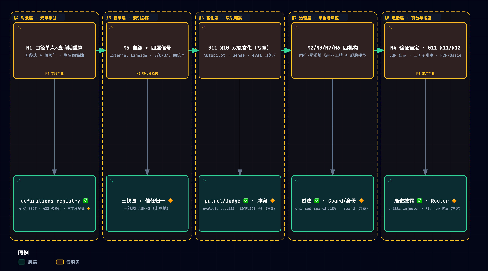
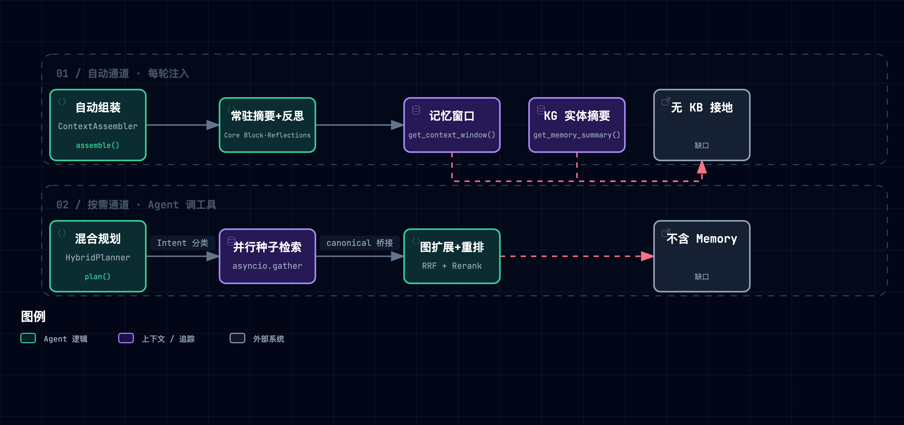
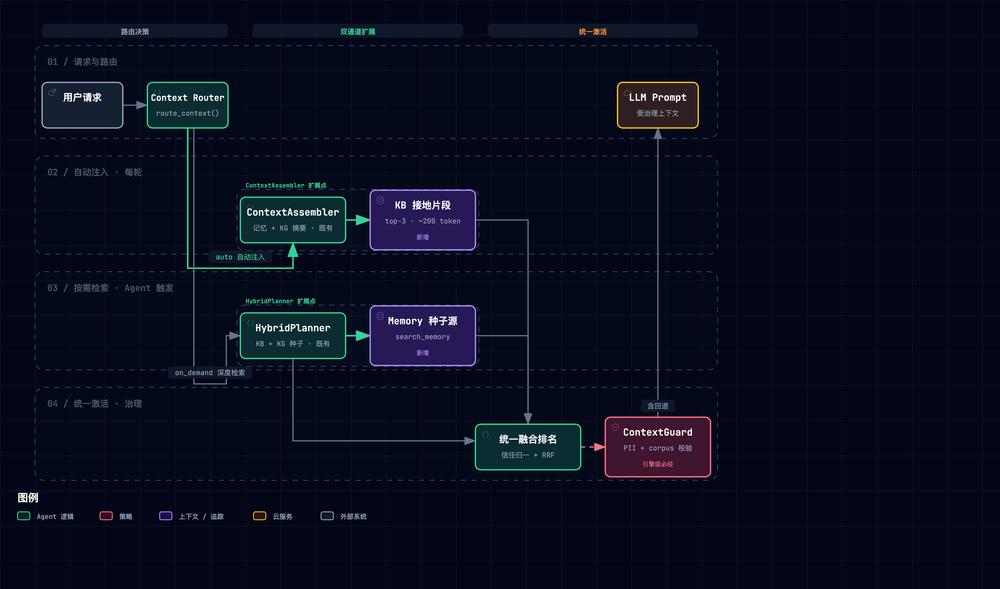
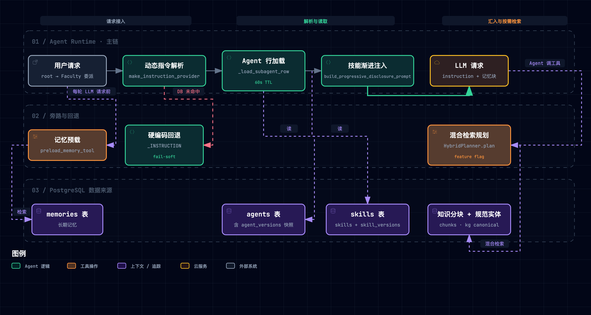
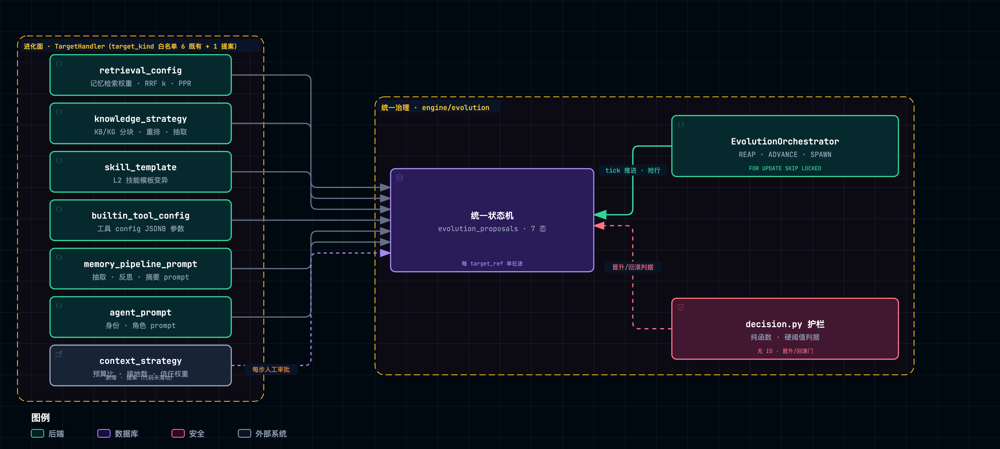
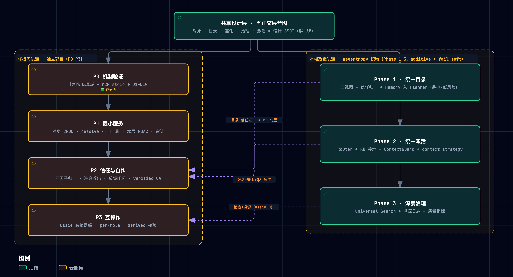

> **一句话定位**：本文是 Context Layer 的**技术蓝图与方案合一的全量文档**——以 [Snowflake Horizon Context](https://www.snowflake.com/en/product/features/horizon-context/) 为范本，给出一个可独立部署、面向 Agents 研发与平台集成、并可实例化进任意宿主系统（本文以 negentropy 为实例）的**受治理上下文层**的完整设计：机制原理（M1–M7 精读载荷）→ 通用蓝图（五正交层）→ 实例化方案（negentropy 治理织物）→ 证据与边界 → 演进路线。
>
> **重设计说明（2026-09-20）**：本文由三份文档全量重织而成——[Horizon Context 精读笔记](./011-horizon-context.md)的机制载荷与实证、[Context Layer · 上下文治理层技术方案](../../concepts/design/context-layer.md)的 negentropy 实例化设计、旧版通用蓝图的行业全景与五层架构。011 自此文起冻结为**精读过程与重评审审计档案**（其 §16 重评审全过程审计痕迹仅存于彼处，本文收压缩版）；context-layer.md 瘦身为**实施入口页**（定位与指针，设计正文已并入本文）；[机制映射报告](./012-horizon-context-mapping-negentropy.md)的 16 条判定已校准并入本文 §12 状态总表。**设计与知识以本文为单一事实源（SSOT）**；四方互链，引用一律走相对直链。
>
> 循证基础：Horizon 机制详解、Snowflake 官方基准数字与批判性边界见 [精读笔记](./011-horizon-context.md)（其 M 集已于 2026-09-17 经全局重评选校准）；行业格局、第三方实证与失败史的出处见文末参考；本仓代码锚点均经 2026-09-20 实测核验；**2026-09-20 另经六路并行重调研复核**（Horizon 增量 / Apache Ossie / MCP 规范与安全 / 业界格局 / 学术 / 存量外链存活——30 条关键引用全部存活，增量与勘误已织入 §2/§6.1/§7.6/§8.3/§13/§14 各处，标注「重调研增量」「复核」或「实测」字样）。最小原型（M1–M7 七机制 + MCP 服务，约 1195 行纯标准库，十次破坏性实验）随精读笔记入库：[`assets/horizon_context_lab.py`](./assets/horizon_context_lab.py) 与 [`assets/horizon_context_mcp.py`](./assets/horizon_context_mcp.py)。

> [!TIP] **怎么读本蓝图**
>
> 全文贯穿一个总类比：**为数字化大厦里每天重新入职的「天才实习生（Data Agent）」搭建一套受治理的「中枢带教与风控体系」**。五个正交层各是剧场里的一个子系统：对象层是装订成册的《业务规章手册》（每条定义有责任人、有效边界、版本演进与盖章底稿，白纸黑字写清口径算式，没立项入册的野定义绝不准上岗）；目录层是全楼机房的「统一索引总账」与「出入库台账」（只维护「索引指针 → 物理单据」的逻辑映射，绝不在各机房外另建孤岛物理账本，从源头杜绝脑裂与对账崩塌）；富化层是带教中枢的「双轨编纂机制」（专家正式编写 5% 核心骨架，见习助教在不窥探机密凭证的前提下暗中观察老法师用数习惯补齐长尾；一旦民间习惯与官方规章冲突，必须亮红灯交人工裁决）；治理层是焊在大厦唯一承重墙必经之路上的「风控体系」（认工牌的逐页验放闸机、机密自动贴标、实习生专用工牌、外来件安检口——不是大堂里立着的塑料告示牌）；激活层是带教大厅的「金牌前台向导与标准工业插座」（面对提问绝不把整座档案库倒在新人桌上撑爆大脑，只精准撕下最相关的两页；遇到考证过的经典 FAQ 直接出示盖章底稿；对外提供标准插座 MCP，让外部特聘专家即插即用协同问数；出口另设海关安检）。
>
> 每个层章按**五拍**展开：**类比** → **机制**（Horizon 范本 + 实证 + 破坏实验）→ **设计**（通用蓝图规格）→ **行业实践** → **negentropy 实例化**（✅ 已落地 / 🔶 方案未落地 / ⏸ 暂缓，均带核验日期）；按需追加**边界声明**。
>
> **编号稳定键**（全文唯一，与源文档零转译）：M1–M7 机制 · D1–D10 破坏实验 · #1–#16 机制↔本仓映射 · ADR-1/2/3 架构决策 · P0–P3 独立部署阶段 · Phase 1–3 本仓实施阶段。**章号约定**：无前缀章节号一律指本文；引 011 精读笔记的三个专章（富化/检索/生态）时带「011」前缀（011 §10/§11/§12），其本文落点为 §6 / §8.2 / §8.3。
>
> **三级阅读航路**：
>
> | 航路         | 时长   | 章节                                                                       | 面向             |
> | ------------ | ------ | -------------------------------------------------------------------------- | ---------------- |
> | **T1 速览**  | ~15 min | 导读 + §0 + §3 spine 表 + §16 + 各章 TIP 首行                              | 决策者 / 评审者  |
> | **T2 设计主线** | 2–3 h | §1–§11 + §16                                                               | 复刻者           |
> | **T3 全量**  | ~半天  | 全文（另加 §12 实例化总装 + §13 证据实验室 + §14 边界 + §15 问答）         | 本仓维护者 / 深读评审者 |
>
> **四方文档分工**：
>
> | 文档                                                               | 重设计后角色                                                       | 维护策略                                         |
> | ------------------------------------------------------------------ | ------------------------------------------------------------------ | ------------------------------------------------ |
> | **013（本文）**                                                    | Context Layer **知识与设计 SSOT**：机制原理 + 通用蓝图 + 实例化设计 + 证据 + 边界 + 路线 | 唯一活跃设计维护点                               |
> | [011 精读笔记](./011-horizon-context.md)                           | 精读过程与重评审审计档案（guided-learn 过程产物）                  | 冻结；Horizon 后续版本跟踪以增量并入本文         |
> | [012 映射报告](./012-horizon-context-mapping-negentropy.md)        | 锚点核验快照（2026-09-17）                                         | 结论已并入本文 §12；再核验直接更新本文并刷新日期 |
> | [context-layer.md 实施入口页](../../concepts/design/context-layer.md) | negentropy 实施入口（定位 + 指针）                                 | 设计正文已并入本文，该页保留入口与状态指针       |

---

## 0. 为什么需要：Agent 在自信地猜数

> [!TIP] **一句话结论**
>
> 瓶颈不在模型，在**含义的供给方式**——初级 Data Agent 就像一位每天都在重新入职、毫无业务常识的天才实习生：满腹经纶、推理满分，但完全不懂企业的方言黑话与合规底线。本文要建的，是为这位实习生配备的整套受治理带教与风控体系。

销售负责人说 Q3 收入 **\$14.2M**，CFO 报的却是 **\$12.8M** —— Snowflake 官方拿这组对账数字开场：同一份数据，两个答案。没有人算错数，错的是**语义无人治理**。企业底层数据库躺着的往往是密码般的物理列名（如毛收入叫 `amt_ttl_pre_dsc`），真实业务指标（如净利润）的计算口径散落在不同报表各自的 `CASE WHEN` 逻辑里，不同业务域子系统各有一套方言黑话。

据 Snowflake 实测，**让缺乏语义治理的初级 Data Agent 直接回答企业数据问题，准确率仅有 ~25%（Snowflake 内测）/ 21%（Anthropic 独立复测）**。这并非模型笨，而是语义没有对齐——具体体现为三个**不可自愈**的系统性病灶：

| 病灶             | 表征                                                                 | 为什么不可自愈                                             |
| ---------------- | -------------------------------------------------------------------- | ---------------------------------------------------------- |
| **口径打架**     | 指标口径写在各自散落的业务逻辑里，同一指标问两个子系统得出两套数字   | 没有唯一权威定义源，每处修一处、其余处照旧                 |
| **定义漂移**     | 外挂语义层独立于数据层，底层数据表变更令语义立即脱节                 | Agent 按过期语义手册瞎猜，且无从察觉自己拿的是旧册         |
| **门禁穿透**     | 权限规则只浮在外部系统，拦不住绕过中间层直查物理底表                 | 安全防线形同虚设，越权访问不产生任何报警                   |

用 Snowflake 官方的话讲：*Without context, an agent guesses. With context built natively into the platform, an agent acts. With context that is also governed natively, an agent can be trusted.*

把「带教与风控体系」拆成可验收的设计规格，即本文七条承重机制（评选判据与过程见 §14.3）：

| 设计规格                 | 底层机制                            | 大白话                                                                       | 蓝图落点 |
| :----------------------- | :---------------------------------- | :--------------------------------------------------------------------------- | :------- |
| **定义一次、处处生效**   | M1 语义视图（口径单点×查询期重算）  | 权威规章只印一本且本身就是计算器：翻到哪条，当场按底层原始凭证套算给你看     | §4 对象层 |
| **敏感数据分级验放**     | M2 查询期行列级访问策略             | 闸机逐页验放：机密页自动打码、越权行直接扣下，任何窗口同一套规则             | §7.1    |
| **治理不可绕过**         | M3 语义级治理执行                   | 闸机焊死在承重墙上：全部通道共用同一执法点，语义层成不了治理旁路             | §7.2    |
| **应答可信分层**         | M4 应答层验证锚定                   | 核准题库：命中核准题出示盖章底稿；未核准的答案显式标注，不冒充已背书         | §4 + §8.1 |
| **事后可对账**           | M5 端到端列级血缘                   | 全楼出入库台账：谁产出、谁消费、经谁转手，引擎自动记录、程序可查             | §5      |
| **代理可归因**           | M6 Agent Identity                   | 实习生专用工牌：权限是带教人的子集（只减不增），每次刷卡记录在案             | §7.4    |
| **新敏感数据自动纳管**   | M7 分类与标签驱动策略传播           | 自动贴标系统：文件进楼自动识别密级，贴标即联动验放规则，盘点间隙不裸奔       | §7.3    |


> 图源（可 diff 文本）：[`horizon-context--problem-to-mechanisms.mmd`](../../assets/mermaid/cognitive-context/horizon-context--problem-to-mechanisms.mmd) · 交互版（下载到本地打开）：[`horizon-context--problem-to-mechanisms.html`](../../assets/architecture/cognitive-context/horizon-context--problem-to-mechanisms.html)

这套体系要兑现的需求规格与本文章节的对应：

| 设计规格           | 通俗版                                         | 蓝图对应            |
| ------------------ | ---------------------------------------------- | ------------------- |
| 定义一次、处处生效 | 规章手册只写一遍，处处引用不抄写               | §4 对象层 + §5 目录层 |
| 治理内嵌、不可绕过 | 闸机焊死在承重墙必经通路上，杜绝大堂告示牌摆设 | §7 治理层           |
| 双轨养上下文       | 手册编纂（显式）+ 助教偷师（隐式），冲突必见人 | §6 富化层           |
| 通用接入           | 任何 agent/BI/应用用标准工业插座消费           | §8 激活层（MCP）    |
| 对冲「治理≠验证」  | 规章合法 ≠ 算式无误，底层单据捣碎时出口须对账  | §9 边界对策         |

**第三方实证**（每行出处见参考；增益端始终缺独立复现，读表纪律见 §13）：

| 证据                                                                                                | 出处                        | 一句话读法                                                       |
| --------------------------------------------------------------------------------------------------- | --------------------------- | ---------------------------------------------------------------- |
| dbt 2026 复跑（ACME 11 问 × 20 次）：text-to-SQL 全集 32.7%（2023 模型）→ 64.5%（2026 模型）；**语义层覆盖内 100%**；补 3 个 dbt 模型后覆盖全部考题 | dbt Labs（品类卖方基准，COI 标注） | 模型两年大踏步，裸奔仍在「看起来对」区间；进覆盖内则是确定性的   |
| 「语义层失败表现为报错，text-to-SQL 失败表现为看起来对的错数」                                      | dbt Labs                    | 本文「报错优于错数」KPI 的出处                                   |
| raw 直查 21% → 先查语义层 ~95%                                                                      | AtScale × Anthropic         | 两家独立复测同向：语义层是台阶不是装饰                           |
| context layer 相比仅语义视图 5x                                                                     | Atlan AI Labs               | 光有定义不够——四层信号与治理齐备才有乘数                         |
| 13% 的组织报告过 AI 模型/应用泄露，其中 97% 缺少 AI 访问控制                                        | IBM Newsroom                | 供给面安全不是理论威胁的量化注脚（§7.6 展开）                    |
| 直连库模式 =「一个连接良好的猜测器」                                                                | Colrows                     | 连接得再好，没有含义仍在猜                                       |
| shadow-AI 场景违约成本均值 \$4.63M                                                                  | IBM CODB 2025，转引见 Colrows | 绕开治理用 AI 的代价已经有了账单                               |
| Spider 2.0：最强模型 21.3% vs Spider 1.0 时代 91.2%                                                 | ICLR 2025 Oral              | 企业真实工作流与教科书基准之间的鸿沟（§10 展开）                 |
| 到 2028 年，60% 仅靠 MCP 的 agentic analytics 项目将因缺一致语义层而失败（表格级标转引）            | Gartner D&A Summit 2026     | 分析师口径的时间表                                               |
| 40%+ agentic AI 项目将在 2027 年底前取消（表格级标转引）                                            | Gartner                     | 失败史一课的量化预告（§11.3）                                    |

这些证据共同指向一个结论：**瓶颈不在模型，在含义的供给方式**。

## 1. 术语与范围：它是什么、不是什么

> [!TIP] **类比**
>
> 这份《业务规章手册》在大厦里换过三次叫法（BI 语义层 → headless BI → context layer），但纸上的硬功夫——把业务含义铸成受治理的白纸黑字定义——三十年没变。改名从来不是因为规矩变了，而是因为拿着手册翻看的人，从精通 SQL 的老法师变成了每天都在重新入职的实习生（Agent）。

**三十年术语史**：semantic layer 一词由 Business Objects 在 1990s 创造（AtScale Mariani 的行业史回顾）；2020–23 年 headless BI 炒作幻灭，证明「指标 API」本身撑不起一门生意；2026-03-10，a16z 发表《Your Data Agents Need Context》为 **context layer** 定名——context 是 semantic 的超集：在指标口径之外再加 canonical entities、identity resolution、tribal knowledge 与 governance guidance，作者甚至类比「相当于给数据栈配一份 .cursorrules」。随后 Gartner D&A Summit（2026-03）把 context 定调为 "new critical infrastructure"（新关键基础设施；转引）；2026-06-02 Snowflake 以 Horizon Context 将其推到行业顶点。

但行业对「context 到底是什么」远未一致，三派分歧：

| 派别   | 主张                                                             | 代表  |
| ------ | ---------------------------------------------------------------- | ----- |
| 超集派 | context 吃下 semantic，并把实体解析、部族知识一并收编           | Atlan |
| 并行派 | context 是操作状态（怎么用），semantic 是含义（是什么），正交并存 | Airbyte |
| 内核派 | context layer 必须有可执行内核，否则只是更厚的目录              | Cube   |

行业的自嘲一针见血：「每个厂商的 context layer 架构都长成它已经在卖的那个产品的形状」——选型时先看它卖什么，再看它说什么。跨厂商实证横评（Fabric IQ authored ontology vs Cortex Sense auto-mined vs Airbyte Context Store 数据复制三路线）另见 Peliqan（2026-07-12）。

**本蓝图的术语立场**：术语上收 a16z 的宽定义当北极星（context ⊃ semantic），工程上落 Cube 的纪律当地基（context layer 必须可执行）——先有 semantic 的骨头，再长 context 的肉。学术先声比这更早：Ground 早已提出「数据上下文服务」的主张（"a data context service"）——把上下文当受治理服务而非随手粘贴的注释，是这条线十年一贯的立场。

**理论骨架**：Context Engineering 学术框架将上下文生命周期归纳为 **Context Collection → Context Management → Context Usage** 三段，与 Horizon 的 Collect / Enrich / Activate 三相高度同构（[通俗全解](./010-context-engineering.md)；对齐见 §3.4）；Dey 将上下文定义为「用于刻画实体状态的任何信息」——对 Agent 而言，这个「实体」即当前任务，「状态」即一切可得的记忆/知识/能力信号。

**设计对象**（通用口径 × negentropy 实例口径并轨）：

| 维度 | Context Layer **是什么**（通用）                | Context Layer **不是什么**     | negentropy 实例口径（§12）                       |
| ---- | ----------------------------------------------- | ------------------------------ | ------------------------------------------------ |
| 定位 | 跨子系统的**治理 + 编排织物**                   | 替代现有子系统的新引擎         | 横亘 Memory / KB / KG / Tools / Skills 五子系统  |
| 存储 | 复用宿主存储（逻辑视图 + 指针）                 | 新建向量库 / 图库 / 记忆服务   | 复用 PostgreSQL（pgvector + AGE + tsvector）     |
| 检索 | 统一激活的**路由 + 归一化排名**                 | 重写各子系统的检索算法         | Router 编排 auto / on_demand 双通道              |
| 数据 | 逻辑视图（VIEW）+ 轻量指针                      | 物理复制子系统数据（防 Split-Brain） | ADR-1 三视图（§5）                          |
| 治理 | 引擎级执行（含回退路径）                        | 应用层可选检查                 | ContextGuard 双路径必经（§7.7 / §8.5）           |

> [!WARNING] **边界声明 · 范围外（本蓝图明确不做）**
>
> - **记忆与实体解析**：a16z 定义内的 identity resolution 与长期记忆机制不纳入本蓝图本体（由宿主系统承担；negentropy 侧由 Memory 子系统与知识图谱承担，见 §12）。其中「部族知识」一类的隐式经验，由对象层的 verified Q&A 与 instructions 字段以受治理方式承接——不建独立记忆系统，只铸带溯源的问答资产。
> - 替代各子系统的检索算法；数据平面本身（仓库/向量库）；模型训练/微调。
> - negentropy 实例化的全部规划改动均为 **additive + 特性开关 + fail-soft**，不破坏现有功能（§12.6）。

## 2. 业界格局：四条路线与一个异类

> [!TIP] **类比**
>
> 为实习生配备这套带教与风控体系有四种路线：**生在大厦地基里**（平台内嵌——云仓厂商直接把规章与闸机铸进自家引擎底座）、**师傅按工程图纸手抄**（定义即代码——规章跟数据转换代码一起放进 Git 版本管理与 PR 评审）、**独立设立专业带教与风控中枢**（独立可执行层——在查询生成前设立独立的带教与校验服务）、**只给全楼机房编一本联合索引总账**（跨系统元数据平面——不设执行关卡，只汇聚各机房元数据做宏观编目）。还有一个异类：Palantir 不止发规章，它把「实习生在业务现场允许做出什么动作（Action）」也铸进了风控网。

> [!NOTE] **格局**
>
> 四条路线的分野不在功能清单，而在**治理发生在哪一层**：

| 路线             | 治理发生处   | 代表与一句定位                                                                                                                                                                                                                                            |
| ---------------- | ------------ | --------------------------------------------------------------------------------------------------------------------------------------------------------------------------------------------------------------------------------------------------------- |
| 平台内嵌         | 引擎内       | Databricks：UC Business Semantics metric views（2026-04 GA）+ Genie One（2026-06-16 DAIS 宣布、2026-07 确认 GA，从「问答」走向「执行动作」）。Microsoft：Fabric IQ（Build 2026 GA）——Power BI semantic model + Ontology 实体/关系/规则/**动作写回**，Ontology MCP 端点 Coming Soon。Google：Looker LookML → headless；Conversational Analytics（2026-08）把 verified/golden queries 做成一等机制（核心已 GA——2026-07 官方口径，子功能部分 Preview）。**AWS（2026-09 重调研新增席）**：AWS Context（2026-06-17，agent 知识图谱服务）+ Glue 业务上下文/语义搜索预览 + 开源 Context Ontology Accelerator（2026-07-31，Apache-2.0，知识图谱×形式本体×规则，Scan→Model→Serve，经内置 MCP server 供给） |
| 定义即代码       | 转换层       | dbt MetricFlow：2025-10-28 以 Apache 2.0 开源（OSI 初始参考实现），v1.12+ 支持 Ossie；YAML 与转换代码同仓版本化、PR 评审。**主体注记（2026-09 核验）**：dbt Labs 已并入 Fivetran（2026-06-01 完成合并），合并后定位「面向 AI agents/分析/运营的开放数据基础设施」 |
| 独立可执行层     | SQL 生成前   | Cube（D3 品牌已于 2025-10 弃用统一；2026-05-14 起分化为开源 Cube Core 与商业 Cube 双轨）：「治理在 SQL 产生之前发生；post-hoc 扫描被子查询/CTE 绕过」。AtScale：「composite context layer」——Horizon 是 system of record，它是 system of consumption；其名言 "A glossary describes things. A semantic layer executes."                           |
| 跨系统元数据平面 | 元数据平面   | Atlan：已从被动元数据目录演进为 Context Engineering Studio / Context Agents / Context Lakehouse 产品族（2026-04-29 Activate 大会，Context Repos 版本化并经 MCP 分发）。Alation：Semantic Model Mastering——「语义层版 MDM」。DataHub：开源双向 context graph                                 |

**异类 Palantir Ontology**：semantic 层（objects/links）+ kinetic 层（actions 与动态安全）的双层结构，decision lineage 贯穿整条决策链；UBS 2026-04 评其为「AI 护城河」。它证明 context layer 的终点不止「答对数」，还有「做对动作」。

> [!IMPORTANT] **行业实践**
>
> 每条路线都预置了自己的失败模式：平台内嵌绑定单一引擎；定义即代码「不在执行路径上」——价值后置，是失败史三死因之一（见 §11.3）；元数据平面被 Cube 一派讥为「只描述、不执行」；独立可执行层则要自己挣采用。四条路线的共同收敛点是**把治理往 SQL 生成之前挪**——post-hoc 扫描防不住子查询与 CTE 绕行，已是公认。
>
> **2026-09 重调研增量**：①**分析师定调**——Forrester（2026-08-20）把 context layer 定义为「语义层与知识图谱的下一步演化」（融合企业语义与治理 + 本体建模 + 运行时上下文），并计划 2026 Q4 发布 Landscape、随后 Wave 评测；Gartner 的「语义优先者准确率至多 +80%、成本 −60%」预测须注意原始出处为 2025-06-17（大量转引造成「新预测」错觉）；②**品类话语破圈**——非数据基础设施厂商（如知识管理厂商 Slite，2026-08-31）开始把 context layer 当标准品类词做内容营销，Redis/DataHub/Tellius 等同期发布同题「context layer vs semantic layer」内容；③**新场景入场**——Atlassian 面向整个代码库的 AI 上下文引擎（2026-08-12）把战场从数据栈延伸到研发知识场景；GitHub 官方层面未检出以 context layer 为名的产品化方案。

**蓝图落位**：本蓝图选**第三条路线**（可独立部署的可执行层），同时吸收其余三条的长处——定义即代码的版本化纪律（§4）、元数据平面的四层信号（§5）、平台内嵌的出口治理与动作思想（§7）。理由：不绑引擎，才能服务任意 agent 平台；治理在 SQL 生成前，才防得住绕行。


> 图源（可 diff 文本）：[`context-layer-blueprint--industry-landscape.mmd`](../../assets/mermaid/cognitive-context/context-layer-blueprint--industry-landscape.mmd) · 交互版（下载到本地打开）：[`context-layer-blueprint--industry-landscape.html`](../../assets/architecture/cognitive-context/context-layer-blueprint--industry-landscape.html)

## 3. 总体架构：五个正交层与它的范本

> [!TIP] **类比**
>
> 企业带教体系的五大正交子系统各司其职：**规章手册（对象层）**管「白纸黑字定义了什么」，**索引总账（目录层）**管「顺藤摸瓜怎么找到」，**助教中枢（富化层）**管「吸纳经验怎么养护」，**承重墙风控（治理层）**管「验明正身信得过谁」，**前台向导与安全插座（激活层）**管「按需精选怎么使用」。五套系统高度正交——升级前台检索算法不需要重写业务指标定义，调整承重墙闸机策略不需要重修数据管道。这就是「正交」的工程内涵。

> [!NOTE] **设计**
>
> 五个正交层——对象存储（放什么）、目录（怎么找）、富化（怎么养）、治理（怎么信）、激活（怎么用）。为什么拆五层而不是做成一个大层：五个维度各自独立变化——换检索算法不该动权限模型，加富化轨道不该改对象格式；机制（治理/路由）与策略（各源算法）分离，各层可独立演进，也才可以像消费端承诺的那样「升级前台检索算法不需要重写规章手册」。


> 图源（可 diff 文本）：[`context-layer-blueprint--architecture.mmd`](../../assets/mermaid/cognitive-context/context-layer-blueprint--architecture.mmd) · 交互版（下载到本地打开）：[`context-layer-blueprint--architecture.html`](../../assets/architecture/cognitive-context/context-layer-blueprint--architecture.html)

### 3.1 spine：层 × 机制 × 实例的总映射

七机制与三个专章族按「守护的不变量」归位到五层（**M4 双落点**：验证问答的**字段在册**归对象层（规章手册的盖章底稿页），**出示行为**归激活层（前台核准题库的出示动作）；**M5 归位注记**：血缘在 Horizon 是独立承重席（账本），在蓝图中落目录层的 Structural 信号位——是归位不是降格）：

| 蓝图层     | 剧场喻体                       | Horizon 机制锚                | 关键载体                                        | negentropy 承载（核验 2026-09-20）                                    |
| ---------- | ------------------------------ | ----------------------------- | ----------------------------------------------- | ---------------------------------------------------------------------- |
| §4 对象层  | 规章手册（含盖章底稿页）       | M1 口径单点×查询期重算        | Semantic Views 五段式 + 校验门 + VQR 字段       | definitions registry ✅；三字段纪律 / verified QA 🔶                    |
| §5 目录层  | 统一索引总账 + 出入库台账      | M5 血缘 + 四层信号            | External Lineage + GET_LINEAGE + 混合检索索引   | 三视图 + 信任归一 🔶（未落地）                                          |
| §6 富化层  | 双轨编纂 + 冲突红灯            | 011 §10 专章（Autopilot/Sense）   | 六路输入面 + eval 自纠环 + CONFLICT 卡片        | patrol/Judge 巡检闭环 ✅；冲突浮出面 🔶                                 |
| §7 治理层  | 承重墙风控体系                 | M2/M3/M6/M7 + 供给面威胁模型  | 行列级策略 + RSS + 分类标签 + 安检口            | scoped & accessible 过滤 ✅；ContextGuard / 策略对象化 / 身份天花板 🔶  |
| §8 激活层  | 金牌前台 + 核准题库 + 插座护照 + 海关 | M4 + 011 §11 检索 + 011 §12 生态      | resolve 契约 + 四因子排序 + MCP/Ossie           | 三层渐进披露 ✅；Router / KB 接地 / MCP 供给面 🔶                        |



> 图源（可 diff 文本）：[`context-layer-blueprint--layer-mechanism-map.mmd`](../../assets/mermaid/cognitive-context/context-layer-blueprint--layer-mechanism-map.mmd) · 交互版（下载到本地打开）：[`context-layer-blueprint--layer-mechanism-map.html`](../../assets/architecture/cognitive-context/context-layer-blueprint--layer-mechanism-map.html)

### 3.2 范本速览：Horizon Context 是什么

Horizon Context 并非一款孤立的单点产品，而是围绕 **Horizon Catalog**（Snowflake 官方定位为 "the agentic catalog"）长出的一整套能力底座。核心目标只有一个：把 Catalog 从「记录有哪些表的登记簿」升维为「真正理解业务含义的认知中枢」（**"from a system of record into a system of understanding"**）。其背后的野心边界更为直白：为整套业务运转构建可计算、自解释的活模型，而不仅是给冷冰冰的数据表建索引（*"building a working model of your entire business, not just a catalog of your tables"*）。

一个值得记录的命名学事实：**「Horizon Context」这个伞名在 docs.snowflake.com 全站零命中**——文档面把它实例化为 Horizon Catalog 文档树下的两大章节（"Build your AI context layer" 与 "Deploy governed, trustworthy AI"）；Metadata Connectors、OSI/Ossie、popularity 信号等发布线能力在文档站均无专页（文档滞后带约一个季度），Cortex Sense 更是尚无任何文档页（预告期，状态口径见 §6.1）。读官方材料时须区分「博客/新闻稿的伞叙事」与「文档面的实例化」两个层次。

Horizon 组件与七机制的对应全景：

| 组件                                                                        | 一句话职责                                                     | 机制锚点           |
| :-------------------------------------------------------------------------- | :------------------------------------------------------------- | :----------------- |
| **Semantic Views**（五段式对象 + 查询时执行）                               | 把表、关系、事实、维度、指标固化为带校验门的受治理元数据，按查询 grain 现算 | M1（§4）           |
| **Dynamic Masking / Row Access / Aggregation / Projection Policy**          | schema 级策略对象在查询期按策略所有者角色强制求值             | M2（§7.1）         |
| **引擎原生治理**（RBAC / 策略随含义传播 / PRIVATE 隔离）                    | 治理与语义同体：定义活在与策略同一引擎内，查询期强制           | M3（§7.2）         |
| **AI_VERIFIED_QUERIES**（VQR）                                              | 将专家审核通过的基准问答对沉淀为一等资产，供检索优先激活复用   | M4（§4 + §8.1）    |
| **External Lineage + OpenLineage 摄取**（含原生列级血缘）                   | 跨异构系统完整记录「谁产出、谁消费」的端到端列级数据血缘       | M5（§5）           |
| **Agent Identity**（Restricted Session Scope / agent_type 审计）            | 为智能体签发独立可归因身份，会话权限只减不增                  | M6（§7.4）         |
| **Classification + Tag-based Policies**                                     | 自动分类打标，标签驱动策略一处生效、新数据自动纳管            | M7（§7.3）         |
| **Autopilot / Semantic Studio**                                             | 聚合多路信号自动起草并验证语义视图，将建模周期从数天压至数分钟 | 011 §10（§6 富化）     |
| **Metadata Connectors**（源自 Select Star）                                 | 将 Tableau、Power BI、dbt 等外部存量语义资产统一摄取进目录     | 011 §10（§6 富化）     |
| **Cortex Sense**                                                            | 从真实查询历史与 BI 行为中无感提炼隐式上下文并自动纠偏         | 011 §10（§6 富化）     |
| **Universal Search / Cortex Search**                                        | 关键词与向量混合检索，精准定位元数据及高基数文本列             | 011 §11（§8.2）        |
| **四因子信号排序**                                                          | 融合相关性、权威度、流行度与新鲜度综合评分，压出精准 top-k     | 011 §11（§8.2）        |
| **Snowflake 官方 MCP Server**                                               | 将语义视图与检索能力打包为标准受控工具面，无缝对接外部 Agent   | 011 §12（§8.3）        |
| **Ossie**（原 OSI）                                                         | 开放统一的 YAML/JSON 语义规范，支持跨平台自由互导              | 011 §12（§8.3）        |
| **CoCo / CoWork / Cortex Agents**                                           | 消费这份 Context 的 Snowflake 官方原生 Agent 矩阵              | 011 §11 / §12          |
| **Automatic Data Agents**                                                   | 针对 Marketplace 共享数据一键自动生成语义视图与配套 Agent      | 011 §12（§8.3）        |
| **出口安检**（Cortex AI Guardrails / AI_REDACT）                            | 拦 prompt injection / 越狱；PII / PHI 出口脱敏                 | 011 §12（§8.3）        |


> 图源（可 diff 文本）：[`horizon-context--component-panorama.mmd`](../../assets/mermaid/cognitive-context/horizon-context--component-panorama.mmd) · 交互版（下载到本地打开）：[`horizon-context--component-panorama.html`](../../assets/architecture/cognitive-context/horizon-context--component-panorama.html)

**系统解构（重评选后的四簇）**：①**口径与应答（M1/M4）**——答对的根：定义唯一、计算正确、答案可信分层；②**治理执法（M2/M3/M6/M7）**——守得住的骨架：客体可见性、定义出口、主体身份、标记-执行供给链四轴正交；③**账本（M5）**——事后可对账的底座：预防类机制之外的事后问责链；④**供给与出口（011 §10–§12，本文落点 §6/§8.2/§8.3）**——体系的自愈血液与开放抓手：富化让 Context 变厚、检索让它送得准、互操作让它带得走（证据成熟度降级为专章，理由与触发器见各层章）。Snowflake 数据云全景中的 Horizon Catalog 章节另见 [研究文档 §D7](../retrieval-storage/034-snowflake-data-cloud.md)。

### 3.3 范本演进：先造对象，再装治理与富化，最后开生态

两年半的演进轨迹呈现清晰的重心迁移——前期重在**寻址召回（找得到）**，中期深耕**语义对象与引擎治理（算得准、守得住）**，后期聚焦**跨端互通与全域血缘（信得过、带得走）**：

- **阶段一 · 语义对象化（2024-02 → 2025-08）**：Universal Search 与 Cortex Search 共同暴露痛点：Agent 面对物理裸表如同盲人摸象。关键认知升级：**检索仅是起点，业务含义本身必须变成带严格校验门的受治理元数据对象**。Semantic Views 定义 GA（2025-06 Summit）与查询 GA（2025-08，9.25 版）后，M1 正式成形。精准契合企业刚需："we need a unified language that ensures the math is right"。
- **阶段二 · 治理内嵌与双轨富化（2025-09 → 2026-06-02）**：**守得住**——治理规则从表级下沉至语义层（AI_REDACT GA 2025-12-08、Cortex AI Guardrails GA 2026-04-20），做到 *"enforced at the meaning level, not just the table level"*；**填得满**——显式轨道借力 Select Star 收购（2025-11-24）与 Autopilot GA（2026-02-03）把建模周期 "from days to minutes"，隐式轨道交由 Cortex Sense 逆向萃取暗知识；**送得出**——OSI 跨厂商联盟创立（2025-09-23）、官方 MCP Server GA（2025-11-04）。2026-06-02 Summit 整合收拢定名 **Horizon Context**（同日 Agent Identity GA）。如分析机构 HFS 所断言：*AI 工作负载之战，最终将赢在元数据、血缘与信任（metadata、lineage and trust）*。
- **阶段三 · 生态开放与运营化（2026-06-30 → 至今）**：Cortex Sense 亮相（2026-07 宣布私预、可验证入口待证——状态口径见 §6.1）；OSI 捐入 Apache 孵化为 Ossie；Power BI 摄取（2026-08-18）与 External Lineage（2026-09-03）全面 GA，依托 Automatic Data Agents 实现「数据产品出厂即自带 Context 与 Agent」。运营哲学：*"Context only works if it gets used."*


> 图源（可 diff 文本）：[`horizon-context--evolution-timeline.mmd`](../../assets/mermaid/cognitive-context/horizon-context--evolution-timeline.mmd) · 交互版（下载到本地打开）：[`horizon-context--evolution-timeline.html`](../../assets/architecture/cognitive-context/horizon-context--evolution-timeline.html)

关键里程碑（机制详解见各层章）：

| 时点                     | 里程碑                                                        | 一句话意义                                         | 蓝图落点 |
| :----------------------- | :------------------------------------------------------------ | :------------------------------------------------- | :------- |
| **2024-02-20**           | Universal Search 预览                                         | 检索先行：解决「Agent 找不到表和列」的基础寻址问题 | §8.2     |
| **2024-08-08**           | Cortex Search 公开预览 + 检索基准发布                         | 确立文本列检索与混合排序基准                       | §8.2     |
| **2025-04-17 → 2025-08** | Semantic Views 预览 → 定义 GA（Summit）→ 查询 GA（9.25 版）  | 语义正式铸造为带校验门的受治理元数据对象           | §4       |
| **2025-09-23**           | 联合 17 家厂商发起 OSI 倡议                                   | 「语义可携带」成为跨厂商开放共识                   | §8.3     |
| **2025-10-02**           | Snowsight 管理面 GA + MCP Server 预览                         | 统一管理控制台就绪，开放接口起跑                   | §8.3     |
| **2025-11-04**           | Snowflake 官方 MCP GA + Snowflake Intelligence（后 CoWork）GA | 以标准工具面安全开放给外部 Agent                   | §8.3     |
| **2025-11-13**           | OSI 扩至 28 家（AWS/Collibra/DataHub/JPMC/Starburst 等）      | 联盟跨出创始圈                                     | §8.3     |
| **2025-11-24**           | 宣布收购 Select Star                                          | 将外部存量语义资产摄取能力收入囊中                 | §6       |
| **2025-12**              | VQR 调优预览（12-02）；AI_REDACT GA（12-08）                  | 专家问答对资产化；出口端敏感数据脱敏上线           | §8.1 / §8.3 |
| **2026-01**              | AI 提示词内嵌语法落地（01-12）；External Lineage 预览（01-16）| Prompt 纳入受治理定义；数据血缘向仓外延伸          | §4 / §5  |
| **2026-01-27**           | OSI v1 规范定稿（33 家联盟，Databricks 入局）                 | 跨厂商语义格式定稿，核心竞对加入共建               | §8.3     |
| **2026-02-03**           | BUILD London：Autopilot GA + Cortex Code（后 CoCo）发布       | 显式建模周期实现 "from days to minutes" 跨越       | §6       |
| **2026-03**              | standard SQL 查询 GA；半可加性支持；USING 语法                | 语义执行面成熟，聚合安全保障全面齐备               | §4       |
| **2026-04**              | AI_VERIFIED_QUERIES 进 DDL（04-05）；Cortex AI Guardrails GA（04-20） | 人工验证问答成为一等资产；Prompt 安全护栏就绪 | §8.1 / §8.3 |
| **2026-06-02**           | Summit：**Horizon Context 整体发布**（Agent Identity GA）     | 整合收拢为能力伞：从「登记簿」蜕变为「理解系统」   | 全景 / §7.4 |
| **2026-06-22**           | Ossie 进入 Apache 孵化器（07-08 为 Snowflake 更名公告日）     | 开放规范迈入顶级开源基金会                         | §8.3     |
| **2026-06-30 → 2026-07** | Cortex Sense 发布与私测（状态口径见 §6.1）；RSS 能力补齐启动（07-27 agent_type 审计列） | 隐式行为挖掘亮相；代理身份审计面成形           | §6 / §7.4 |
| **2026-08 → 2026-09**    | Power BI 摄取 GA（08-18）；Semantic Studio 预览（08-26）；Cortex Analyst→Agents（08-28）；External Lineage GA 与 RSS 权限天花板 GA（09-03） | 跨系统血缘与多端消费全面落地，代理身份闭环成形 | §5 / §7.4 / §6 / §8.2 |
| **2026-09-11 → 09-16**   | CoWork Automations GA（09-11）；Cortex AI Gateway 预览（09-15）；Ossie Power BI 转换器合入（09-16，apache/ossie #329） | 消费端自动化、推理网关与转换器矩阵持续加码 | §6 / §8.3 |

> [!TIP] **两个 Snowflake 官方 Agent 的分工与定位**
>
> - **CoCo**：数据原生 AI 编程代理（前身 Cortex Code，2026-02-03 发布；提供 Snowsight / Desktop / CLI 三种交互形态）；
> - **CoWork**：面向知识工作者的日常业务分析助手（前身 Snowflake Intelligence，2025-11-04 GA；其 Automations 能力已于 2026-09-11 GA）；
> - **协同定位**：二者是 Cortex Sense 隐式上下文的核心验证者与直接消费者——Sense 从历史轨迹中提炼出的隐式规则，正是在这类 Agent 的实际交互闭环中被验证与消耗。

### 3.4 三相流水线 × 四层信号：与五层的对齐

Horizon 把元数据到可用上下文的转化组织为 **Collect（汇聚）→ Enrich（富化）→ Activate（激活）** 三段流水线，与 Context Engineering 的 Collection → Management → Usage 三段同构。五层按职责归位：**Collect 落对象层 + 目录层**（受治理对象入库、元数据与血缘入账）、**Enrich 落富化层**（双轨养义 + eval 自纠）、**Activate 落激活层 + 治理层**（受治理地精选与供给）。四层上下文信号（Snowflake 官方 FAQ 口径）是流经三段的**原料**：

| 信号层                 | 含义                                   | 作用                           |
| ---------------------- | -------------------------------------- | ------------------------------ |
| **Structural（结构）** | 存在什么、如何连接（表/列/血缘）       | 让 Agent 知道「有哪些资产」    |
| **Operational（运行）**| 正在发生什么（查询/新鲜度/性能）       | 让 Agent 知道「资产是否可用、多新」 |
| **Semantic（语义）**   | 它意味什么（定义/指标/本体）           | 让 Agent 基于权威定义推理       |
| **Behavioral（行为）** | 如何被使用（热度/模式）                | 让 Agent 优先选高质量资产       |

四层信号在本仓的具体表级来源见 §12.3；「Behavioral 与 Operational 是一等信号、不是附录」的设计后果见 §5（目录层按 context graph 而非 knowledge graph 设计）。

---

## 4. 对象层：规章手册

> [!TIP] **类比**
>
> 过去企业散落的业务口径，就像工位隔板上贴满的私人便利贴与杂乱草稿，写满了硬编码的 SQL 片段，天才实习生看一眼就晕头转向；本层为实习生配发的，是一本**「可执行的官方规章手册」**——它同时守护两条独立的底线：
>
> - **口径单点（手册只印一本）**：明确界定核准账本（TABLES）、勾稽路径（RELATIONSHIPS）、原始凭证量（FACTS）、切片维度（DIMENSIONS）与官方指标（METRICS）；每条规章都标明责任人与版本号，还夹着资深前辈的**盖章底稿**（verified Q&A）；没登记入册的野定义绝不准上岗——结构校验门在注册期就把非法结构拒之门外。
> - **查询期重算（手册本身就是计算器）**：手册里的指标不是预先抄死的固定数字（死报表），实习生翻到哪条，规章就当场拿机房里最底层的原始单据凭证、按当下的统计需求现场套算——先汇总再拼接、按人头去重、先合总盘再求商、期末结余取末快照，四个防错逻辑焊死在计算过程里。
>
> 手册与计算器是同一本册子的两半：**定义即计算**（"A glossary describes things. A semantic layer executes."）。

### 4.1 机制 · M1 口径单点 × 查询期重算

**为什么必须是双不变量**：声明唯一性与计算正确性是**两条可各自独立失效的不变量**。机制先祖 Looker 的 `symmetric_aggregates` 是 Explore 级参数、**可显式关闭**：关闭时同一套完全合法的 LookML 定义在 fanout join 下照样算错聚合——「定义被接受而计算语义错」是语义层设计空间中**已文档化的状态**，不是引擎 bug。跨工具的自然实验同向：dbt MetricFlow 遇 fan-out join 直接**拒答**（fail-fast）、Cube pre-aggregation 无匹配即**回退底表**、Snowflake 则 grain 前置聚合 + distinct 跨 join 安全 + `NON ADDITIVE BY`——四家在「定义层」上趋同（各家都是文本声明的指标模型），**差异化恰恰全部发生在「执行半边」**（typedef 对 Snowflake 的评语："It goes further than most semantic layers... A layer that recomputes from base data is better than one that stores frozen totals."）。Snowflake 把两半铸进同一个 DDL 对象（CREATE SEMANTIC VIEW）不可分售，因此并为一个机制；但读者必须知道本章承重两条不变量。

**不变量 A · 口径单点（五段式声明 + 注册期校验门）**：

- **TABLES**（带 PRIMARY KEY/UNIQUE 约束）
- **RELATIONSHIPS**（声明式 join，FK 必须指向键列）
- **FACTS**（行级量，可 `PRIVATE`）
- **DIMENSIONS**（切片维度，可挂 Cortex Search）
- **METRICS**（命名聚合）

语义视图：**Snowflake 官方明确定义为元数据**（"Semantic views are considered metadata"），与数据同库同治理。

注册校验门的完整规则面（validation-rules 文档）：FK 必须指向键列；禁止循环关系（含传递路径）；传递关系自动推导且基数有律（1-1 链保持 1-1，1-1 + 多对一 → 多对一）；自引用暂不支持；两表间存在多条关系路径时互相不可引用对方语义表达式，metric 必须显式指定路径；跨粒度引用须嵌套聚合（如 `AVG(SUM(orders.o_totalprice))`）；窗口函数 metric 不可行级计算、不可被引用。这套规则把「语义注册」从自由文本变成**可判定的结构**——不变量 B 的执行保障全部依赖这里注册的基数与路径信息。

对象字段里藏着的五个设计：

1. **`WITH SYNONYMS`**：Agent 召回所需的别名本身就是受治理上下文（「毛收入/营收/sales」写进定义）。官方最佳实践对此相当克制：synonyms "generally add little accuracy"，自动生成的别名常降质、须人工精修；真正第一位的是 descriptions——"the single most important element for accuracy"；
2. **`AI_VERIFIED_QUERIES`**：人验证过的问答对成为一等资产（完整激活口径见 §8.1）；
3. **`AI_SQL_GENERATION / AI_QUESTION_CATEGORIZATION`**：给 Agent 的提示词内嵌在定义里，随定义分发、随定义治理（2026-01-12 落地）；
4. **`PRIVATE | PUBLIC`**：事实与指标级可见性；
5. **`NON ADDITIVE BY (dims)`**：半可加性声明（不变量 B 的组成部分）。

**DDL 治理位（一行式）**：`CREATE OR ALTER`（2026-05-04 新增，幂等更新且保授权）· `TAG`（治理标签）· `COPY GRANTS`（重建时保留授权）· `LABELS=(FILTER)`（指标可过滤标签，2026-05 落地）· relationship 支持 `ASOF` 与 range join。

**不变量 B · 查询期重算（聚合正确性四保障 + 消歧 + 性能后手）**：

Snowflake 官方定性一针见血："SQL is a literal language, but business logic is contextual."——**「语法完全合法，但业务答案全错」（*that was valid SQL, but it was not valid analytics*）**：

1. **先聚后连（agg-before-join）**：防「金额被动翻倍」（fan trap / 扇形陷阱，\$100 订单因关联 3 条送货记录被放大成 \$300）；
2. **按集合去重（distinct 聚合跨 join 安全）**：防「重复虚增人数」（数集合不数物理行）；
3. **先合总数再相除（derived 先聚后除）**：防「平均数的平均数」（真实 4.8 vs 朴素 16.0）；
4. **半可加性末快照（NON ADDITIVE BY）**：防「账户余额跨天累加」（期末取末快照而非求和）；
5. **显式指定关联路径（USING relationship）**：防「笛卡尔积爆炸」（chasm trap，订单同时含发货/收货地址时显式消歧）；
6. **物化与自动改写（性能后手，非正确性保障）**：同一份定义两个执行策略——默认按查询 grain 重算（保正确）；物化 + 引擎自动改写（保性能），代价受 `MAX_STALENESS` 契约约束（最小 120 秒）。2026-09 现状：官方特性名「Materializing dimensions and metrics in semantic views」，**Public Preview（Open）**；已支持 `DROP / SUSPEND / RESUME MATERIALIZATION`（早先「配置后不可取消」的口径已失效）；可再聚合的聚合仅限 SUM/COUNT/MIN/MAX（AVG、COUNT(DISTINCT)、MEDIAN、百分位不可物化重算）。

Snowflake 官方对这套对象的一句话定位："A semantic view isn't just a technical layer; it's an insurance policy for your data's integrity."


> 图源（可 diff 文本）：[`horizon-context--declaration-execution.mmd`](../../assets/mermaid/cognitive-context/horizon-context--declaration-execution.mmd) · 交互版（下载到本地打开）：[`horizon-context--declaration-execution.html`](../../assets/architecture/cognitive-context/horizon-context--declaration-execution.html)

> [!IMPORTANT] **原型实践（实际运行输出）**
>
> 结构校验门与聚合保障（B 场景 4 组陷阱 + D6/D7 破坏实验）：
>
> ```text
> [PASS] D6: 拆结构校验（relationship 指向非键列）→ relationship bad: referenced column
> customers.plan is not PRIMARY KEY/UNIQUE—— 无门则垃圾定义静默入库（行数失控的注册期引信）
> [PASS] B1: fan trap: 引擎 Jan=200 vs 朴素 Jan=440（o1 的 3 条事件把 $100 变 $300）
> [PASS] B2: average of averages: 先聚后除 108.33 vs 月均值的均值 122.22
> [PASS] B3: 拆 distinct: 退化为数事件行 [6,1,2]（对照 [3,1,2]）
> [PASS] B4: NON ADDITIVE: 末快照 [5,6,7] vs 求和 [11,6,7]；全期 7 vs 24
> [PASS] D7: 拆 derived 先聚后除 → 122.22（对照 108.33）
> ```

### 4.2 设计 · 通用对象模型

对象模型 = 对标 semantic view 五段式的**泛化**——上下文不限于指标，任何「agent 推理所需的受治理含义」都是对象。四个设计要素：YAML 对象模型与三条字段纪律（下）、生命周期状态机（下）、注册期结构校验门（下）、data contract 产权文件（§4.2.1）。

```yaml
# 对齐 Apache Ossie (Incubating) YAML 风格的示意（指标类对象）
id: metrics/net_revenue
kind: metric                      # definition | metric | doc | skill | qa | policy
name: net_revenue
synonyms: [净收入, net sales]      # 召回别名是受治理上下文，不是检索层外挂
spec:                             # 五段式（指标类）：tables/relationships/facts/dimensions/metrics
  tables: [...]
  metrics: [{name: net_revenue, agg: sum, expr: "gross * (1 - discount)",
             non_additive_by: [day]}]
instructions: "聚合先于 join；默认走 buyer 关系"   # 随定义分发的 agent 指令
verified_queries:                 # 人验证过的问答，一等资产
  - question: "net revenue by month"
    answer_ref: "queries/q001"
    verified_by: "( data_governance = data-team@example.com )"
    verified_at: 2026-08-20
visibility: {level: public}       # public | private | roles: [...]
tags: {domain: finance, owner: data-platform}
provenance: {source: governed, authority: 1.0}    # governed | inferred | legacy
version: 12
```

三条字段纪律（机制映射 #1 的增量，宿主系统的定义元字段可承载）：

1. **synonyms 必填意识**——没有同义词的定义在自然语言检索面上是隐形的；
2. **instructions 随对象走**——给 agent 的口径说明内嵌定义、随定义治理与版本化，拒绝 prompt 里硬编码；
3. **verified Q&A 带溯源**——答案样例是信任度最便宜的来源，`VERIFIED_BY/AT` 使其可审计。

**生命周期状态机**：


> 图源（可 diff 文本）：[`context-layer-blueprint--object-lifecycle.mmd`](../../assets/mermaid/cognitive-context/context-layer-blueprint--object-lifecycle.mmd) · 交互版（下载到本地打开）：[`context-layer-blueprint--object-lifecycle.html`](../../assets/architecture/cognitive-context/context-layer-blueprint--object-lifecycle.html)

结构校验门（对标 validation-rules）：引用必须命中键约束、至少一个可用面（维度/指标/正文）、名字唯一、`non_additive_by` 引用的维度存在——**非法结构在注册期被拒，不进运行时**。

> [!IMPORTANT] **行业实践**
>
> - 对象格式对齐 Apache Ossie (Incubating) YAML 风格——已汇聚 50+ 组织的开放规范，是语义跨系统携带的唯一现实通道（三重边界见 §8.4）。
> - dbt 的定义即代码纪律同构：YAML 同仓版本化、PR 评审、测试先行、可回滚——对象的一等公民身份由 Git 流程背书。
> - a16z 五步架构中最关键的一步是「人工精修」：最重要的 context 是隐式、条件性、历史偶然的——生成辅助之后必须有人把关，机器起草、人类盖章。

#### 4.2.1 Data Contract：业务交接与责任契约

对象不止携带定义，还携带契约。业界 data contract 的五件套 = **schema + 质量阈值 + 语义（绑 canonical 词条）+ lineage + 访问**；per-agent 授权在 context 交付点执行；破坏性变更按 API 弃用纪律走——触发 → 评审 → 弃用窗口 → 通知下游，不许静默改口径。

> [!WARNING] **边界声明**
>
> 业界诚实声明：**「没有结构性工具原生在推理时强制语义契约」**。契约文件的强制力不来自文件本身，而来自本蓝图的激活层与治理层——契约条款写在纸上，执行的锁必须焊在大厦的承重墙闸机与执行层里。

### 4.3 negentropy 实例化：definitions registry

| 项                                                                 | 状态（核验 2026-09-20） | 锚点                                                                                                          |
| ------------------------------------------------------------------ | ------------------------ | ------------------------------------------------------------------------------------------------------------- |
| 4 类定义 SSOT（skill_template/routine_preset/harness_skill/agent） | ✅ 已落地                | [`models/definition.py:27`](../../../apps/negentropy/src/negentropy/models/definition.py)（`version` :60 / `checksum` :62 派生列）；迁移 0095–0099 |
| 注册期领域校验（validator/meta_extractor 注册表 + 422 拒入库）     | ✅ 已落地（映射 #2）     | [`registry.py:117`](../../../apps/negentropy/src/negentropy/agents/definitions/registry.py)（`parse_definition`）                            |
| 定义激活物化（DB SSOT → `.agent/skills/<key>/SKILL.md` 按内容幂等渲染） | ✅ 已落地（映射 #3） | [`harness_materializer.py:137`](../../../apps/negentropy/src/negentropy/agents/definitions/harness_materializer.py)（`materialize_all`）     |
| synonyms / instructions / verified QA 三字段纪律                   | 🔶 方案（映射 #1 增量）  | `definitions.meta` JSONB 可承载，尚无此纪律                                                                    |
| 声明式聚合纪律（agg-before-join 等）                               | ⏸ 暂缓（映射 #4，YAGNI） | 触发条件：仓内出现「派生口径」类资产（如跨 routine 评估分汇总）时引入「口径声明 + 出口校验」                      |

判定依据：本仓 definitions 表已是 4 类定义的 SSOT（source 为源，meta/version/checksum 为派生冗余列），与 semantic view「元数据对象」定位同构；harness_materializer「DB→.agent/skills 按内容幂等渲染」与「定义即查即用」同构——定义不复制、消费端只持指针，符合 SSOT。差异在字段面：Horizon 把**agent 检索面**做成了对象字段（SYNONYMS/AI 指令面/VQR），本仓 `meta` 可承载等价信息但尚无纪律——落地时按 §4.2 三字段纪律补齐。

## 5. 目录层：统一索引总账

> [!TIP] **类比**
>
> 带教大厅一隅设总账台，编索引总账而不替各个机房重抄原始单据：数据凭证依然留在各自机房（各子系统与源库），总账只维护「索引指针 → 物理单据」的逻辑映射。全楼永远只有一本联合总账——出现第二套割裂账本的那一刻，就是 Split-Brain（脑裂）与口径打架的开始。地下机房里还有一本**自动记录的「全楼出入库台账」**：每份文件从哪个机房产出、经谁转手、最后被谁领用，记录由搬运动作本身触发（工人搬一箱记一行），而不是靠人工事后补登记；台账记到**页级**（列级）而非只记箱号（表级）——事故追查时「这个数字从哪张表的哪一列流过来」一查便知。

### 5.1 机制 · M5 端到端列级血缘

本机制守护的是**事后问责链**：预防类机制（§7 的 M2/M3/M6/M7）拦事前，台账管事后——agent 答案数字对不上时能溯源、上游变更时爆炸半径能定位。没有它，治理只剩事前拦、没有事后账。

1. **原生列级血缘（引擎执行副产品）**：查询引擎在执行 COPY INTO、CTAS、CREATE VIEW / SEMANTIC VIEW、MERGE 等语句时**自动沉淀对象级与列级依赖边**（非人工登记、非 SQL 解析推断——对 ad-hoc 查询无盲区），Snowsight 图谱可视化 + `GET_LINEAGE(SNOWFLAKE.CORE)` 表函数程序化取数；对象与列级血缘保留一年，2024-11 之前的历史数据流不可见，访问需 VIEW LINEAGE 权限（Enterprise Edition）；
2. **外部血缘摄取（OpenLineage REST 端点，公开预览；External lineage 特性整体 2026-09-03 GA）**：以 OpenLineage 开放标准为契约把 Snowflake 之外的 ETL/dbt/Airflow/BI 血缘（含 columnLineage facet 列级映射）汇入**同一张血缘图**；三道门：调用方须持账户级 INGEST LINEAGE 权限、只接受 COMPLETE 事件、事件中每个 Snowflake 对象必须可解析——任一不满足整事件拒绝；限额如实：外部边事件保留一年、dataset 全限定名 ≤1000 字符、单事件 ≤15,000 边、账户 ≤20,000 条外部边、不支持 OpenLineage v2；
3. **内外单一账本是差异化所在**（跨厂商对照的准确口径）：Databricks UC 内部列级血缘同位但**外部血缘弱一档**（手工声明、不入 system tables、有上限）；Microsoft Fabric 原生列级血缘仍缺位（社区补位）；Snowflake 的「外部 OpenLineage 事件并入 GET_LINEAGE 同一账本」当前是领先点；
4. **盲区如实**：ML notebook 不进血缘（社区实测）、上游数据质量问题定位仍止步仓库边界。

置信度分轴（对齐 §7.4 的处理）：重要性轴——官方叙事明确把血缘锚定为 AI 应答可溯源的支柱；置信度轴——独立第三方口径（a16z）零提及 lineage、社区实证集中于单一来源（50K 表 45s→2s 列级系统实测 + 「表级无用、列级才行」一线判语），**承重地位官方定调先行、独立确认待积**。


> 图源（可 diff 文本）：[`horizon-context--lineage-ledger.mmd`](../../assets/mermaid/cognitive-context/horizon-context--lineage-ledger.mmd) · 交互版（下载到本地打开）：[`horizon-context--lineage-ledger.html`](../../assets/architecture/cognitive-context/horizon-context--lineage-ledger.html)

> [!IMPORTANT] **原型实践（实际运行输出）**
>
> ```text
> [PASS] E1: 列级血缘同账本: 引擎沉淀 orders.total→sales_sv.metric:revenue（derived aov
> 展开记底层 order_count 边）；OpenLineage 摄取 app_db.users.tier→customers.plan
> （origin 各异、账本唯一）
> [PASS] E1b: 摄取三道闸: 非 COMPLETE / 对象不可解析 / 无 INGEST 权限 → 整事件拒绝
> ['rejected', 'rejected', 'rejected']（账本零污染）
> [PASS] D8: 拆血缘解析闸 → 虚构对象入账（raw.y→ghost.x）——账本与真实数据流脱钩，
> 事后对账从此不可信
> ```

### 5.2 设计 · 逻辑视图与四层信号

- **逻辑视图而非新物理表**（与 §12.4 的 ADR-1 同款决策）：UNION 各来源的元数据 + 轻量指针，杜绝 Split-Brain；
- **四层信号**入库：Structural（有什么/怎么连，含血缘）、Operational（新鲜度/运行状态）、Semantic（定义/口径/本体）、Behavioral（热度/使用模式）；
- **血缘**记录「谁喂谁」（观察型）；它与「这么算合法吗」的校验是两件事——那道缺口由 §9 对冲。

> [!IMPORTANT] **行业实践**
>
> Gartner 在 D&A Summit 2026 给出的分野（转引）：knowledge graph 记 what/who（静态），context graph 记 how/why（演化）——本目录按后者设计，Behavioral 与 Operational 是一等信号，不是附录。元数据摄取的周界承诺同款："will only ingest metadata and usage patterns, not your actual data rows"——目录永不碰数据行。

> [!WARNING] **边界声明 · UNION 到哪为止**
>
> 目录的周界是「读方向的元数据联邦」：
>
> - 只 UNION 元数据与指针，不复制数据行，不接管各系统的写路径；
> - DataHub 式「双向 context graph」的野心是把全企业元数据双向同步成一棵树——本蓝图批判性采纳：读方向 UNION 进目录，写方向回各自系统；全量双向同步是集成项目，不是目录职责；
> - 来源因安全域或物理隔离无法 UNION 时，退化为**联邦查询**：目录只做路由与权限标注，不落地数据。

### 5.3 negentropy 实例化：三视图与信任归一（方案未落地）

> **ADR-1：Context Catalog 用 PostgreSQL VIEW 实现，不新建物理表。**
> **理由**：单一事实源——引用时必须使用轻量级指针（Link/ID）而非数据副本（Copy-Paste），从根源消除断裂（Split-Brain）风险。所有元数据已存于 PostgreSQL，新表将制造副本与不一致；Horizon Catalog 本身也是元信息层而非数据副本。

三个只读视图（纯 SQL，无数据迁移；对应 §16 Phase 1 ①，🔶 未落地——迁移目录 `apps/negentropy/src/negentropy/db/migrations/versions/`（0001–0099）中无任何对应 CREATE VIEW）：

| 视图                    | 职责                             | 构成                                                                                                                            |
| ----------------------- | -------------------------------- | ------------------------------------------------------------------------------------------------------------------------------- |
| `context_catalog_unified`  | 跨子系统资产目录（Structural） | `UNION` of memories / knowledge chunks / kg_entities / skills / builtin_tools，归一列：`item_type`·`item_id`·`app_name`·`user_id`·`semantic_type`·`source_system`·时间戳 |
| `context_trust_signals`   | 信任 + 新鲜度归一（Behavioral/Operational） | JOIN 各子系统信任列，归一到 0–1（见下）                                                                                       |
| `context_access_log`      | 行为审计（Operational/Behavioral） | `UNION` of `memory_retrieval_logs`·`tool_invocations`·`knowledge_feedback`                                                      |

**信任信号归一化**：各子系统已有信任信号（记忆 retention/importance、KB quality_score/retrieval_count、KG confidence/PageRank），但**量纲不一、无法跨子系统比较**。定义归一到 [0,1] 的复合信任分（`context_trust_signals` 视图计算列，**非新存储列**；`staleness = min(1, days_since_access/90)`）：

| item_type | 信任分公式                                                                                                    |
| --------- | ------------------------------------------------------------------------------------------------------------- |
| Memory    | `0.4·retention_score + 0.3·importance_score + 0.3·(1−staleness)`                                              |
| KB chunk  | `0.4·(quality_score ∥ 0.5) + 0.3·min(1, retrieval_count/10) + 0.3·(1−staleness)`                              |
| KG entity | `0.5·confidence + 0.5·(importance_score ∥ 0)`                                                                 |
| Tool      | `0.6·success_rate + 0.4·(1−normalized_latency)`，`normalized_latency = min(1, p95_ms/5000)`                    |
| Skill     | `1.0 if active_version else 0.7`（已发布=可信）                                                                |

> 上述权重为初值，本身是可进化参数（§12.5）。`∥` 表示空值回退。归一信任分供激活阶段跨子系统统一排名使用。

落地时采纳 Horizon 口径的三个纪律（映射 #11）：①**authority 区分 governed/inferred**；②**popularity 用有界变换**（log1p/上限，防全局 max 漂移，原型 `rank` :467 的实现即此）；③**freshness 必须是单一 staleness 量**（直击 Memory 子系统「created_at + last_accessed_at + retention_score 未合成单一 staleness」的已知缺口，见 §12.3 契约表）。

已知缺口：KB chunks 缺 `last_accessed_at`（运行信号缺失）· `quality_score` 多为 NULL（待回填/计算）。资产依赖图（血缘，映射 #14）⏸ 暂缓——本仓 routine/巡检的执行史是运行日志（谁跑了什么），不是资产依赖图（什么派生自什么）；触发条件：出现「定义/文档资产间的派生关系图」需求（如定义变更影响面分析）时，优先引入「写入时自动沉淀依赖边」的引擎副产品模式，而非事后扫描。

## 6. 富化层：双轨编纂、民间经验与人工裁决

> [!TIP] **类比**
>
> 仅靠资深专家手写规章手册（语义视图）权威严谨，但耗时耗力，在庞大的大厦里往往只能覆盖不到 5% 的核心业务，绝大多数长尾提问在手册里根本翻不到。为此，规章编撰配备「一明一暗」两条自动化富化轨道：**显式速记起草（Autopilot）**——高效的速记秘书把现成外部报表模型与历史问答对快速起草成规章草案，经校验后补充入册；**隐式随行偷师（Cortex Sense）**——见习助教在绝不窥探机密凭证（不碰真实数据行）的前提下，观察资深前辈每天的上千条查询习惯，把沉睡的暗知识提炼成册。整个体系有一条**铁打的纪律底线**：起草的规章与助教提炼的民间习惯口径打架时，系统**绝对不准自作主张瞎蒙一个**，必须向业务主管亮红灯（冲突浮出），交人工裁定。

### 6.1 机制 · 双轨富化与三层纪律（专章保留）

Snowflake 内部实测揭示了一个残酷现实：全司 9,685 张数据表中，人工构建的语义视图覆盖率**不足 5%**——注意这个数字的正确读法：它是 Autopilot GA **之后**的内部现态（原文 "This certainly helped, but even so"），证明的是**显式轨道单独不闭合供给缺口**（这恰是 Snowflake 自己立 Sense 的论据），**不是 Autopilot 无价值**的证据。

**显式轨道：Autopilot（GA 2026-02-03）**。六路输入面（从零 / 与 CoCo 对话 inline diff / Tableau TWB·TDS / Power BI pbit·pbix / 自然语言+SQL 对或两列 CSV / YAML 上传）；每条候选过**验证门**：自动验证丢弃无效查询、提取表/列/关系，有效者自动入库 verified queries；主键靠元数据分析或 distinct 计数推断。官方口径收益 "from days to minutes"；规模护栏为**建议非硬限**（"<10 表、≤50 列" 标注 "not a hard limit"）。具名客户证言（eSentire/HiBob/Simon AI/VTS，出自新闻稿）；Gartner 首席分析师 Rita Sallam 独立称其 "a game changer"（转引）。管理面 Semantic Studio 已于 2026-08-26 公开预览。目录级外部资产摄取走 Metadata Connectors（Wave 1 五连接器：PostgreSQL、SQL Server、Tableau、Power BI、dbt，源自 Select Star 收购，仍私有预览）。

**隐式轨道：Cortex Sense（预告期特性，无可公开验证入口）**。从查询历史、转换工具模型和 BI 指标自动拼装隐式理解；官方定位 "designed to work alongside semantic views, not instead of them"；隐私边界 "will only ingest metadata and usage patterns, not your actual data rows"。实证数字 24.1% → 86.3%、成本 \$1.76 → \$0.59/query（Cortex Sense 博客）与 CoWork 博客的 83/47/23——**全部为 Snowflake 内部基准自报口径**（第三方目录厂商明确标注 not independently verified），读法见 §13 与 §14。行研层背书如实记：Gartner 2026-05 "Context with semantic coherence will become a cost-control and trust strategy"（转引）；Futurum 对等支柱表述 "Horizon Context defines and governs the truth; Cortex Sense makes that truth immediately consumable by agents"（转引）。**学术同构（2026-09 重调研新增）**：arXiv 2609.19615 报告从原始应用日志以「LLM 推理 + 结构化管线（精化/混合检索/多级过滤/聚类/规范命名）」两阶段自动构建业务语义层——生产遥测上语义质量 50→80+（百分制）、维护工作量 −80%，为富化层的自动构建路径提供独立学术佐证。**状态口径（2026-09-20 复核）**：docs.snowflake.com 零命中、release notes 全年清单零条目、产品页正文不提——私预状态**无可公开验证入口**；第三方口径分歧（DataHub/Timbr 称 2026-07 中旬进入私预；World Tour Tokyo 会后报告（2026-09-19）记讲者表述为「即将进入 private preview」），本蓝图按「预告期特性」处理，能力描述以官方博客叙事为准、状态以 docs 为准。

**三层纪律防线**（降级后作为智识资产完整保留）：

1. **eval 自纠环**：金标准问答集 / 用户反馈 / 自检薄弱区三路输入，错配即修正（定义级：补 synonyms；信号级：调 popularity）→ 重排复测；
2. **冲突强制浮出人工**：同名异义 → CONFLICT 卡片并列两定义、无数值、拒答待裁，**禁止按 popularity 自动选**；
3. **信号分层排序**：governed 金标准权威权重压倒性高于推断口径（排序细节见 §8.2）。


> 图源（可 diff 文本）：[`horizon-context--collect-enrich-activate.mmd`](../../assets/mermaid/cognitive-context/horizon-context--collect-enrich-activate.mmd) · 交互版（下载到本地打开）：[`horizon-context--collect-enrich-activate.html`](../../assets/architecture/cognitive-context/horizon-context--collect-enrich-activate.html)


> 图源（可 diff 文本）：[`horizon-context--autopilot-loop.mmd`](../../assets/mermaid/cognitive-context/horizon-context--autopilot-loop.mmd) · 交互版（下载到本地打开）：[`horizon-context--autopilot-loop.html`](../../assets/architecture/cognitive-context/horizon-context--autopilot-loop.html)

> [!IMPORTANT] **原型实践（实际运行输出）**
>
> ```text
> [PASS] C3: 冲突浮出: CONFLICT 卡片 [('governed', 'count_distinct(orders.customer_id)'),
> ('inferred', 'count(events.id) by total')]（无数值）；agent 拒答；compile → ConflictingDefinitionError
> [PASS] C3b: 人工裁决（governed 胜）后恢复: [3, 1, 2]
> [PASS] C4: 自纠环: 错配前 top1=active_users（sum(dau)=[11,6,7] 错）→ 补 synonym + 调信号
> → top1=active_customers（count_distinct=[3,1,2] 对）
> [PASS] D4: 冲突改 auto_popularity → 推断层(count events) 胜出 [6,1,2]（对照 [3,1,2]）
> —— 477 vs 48 事故的玩具版
> ```

**降级理由与重评触发器**（重评选结论，非重要性否定）：两条轨道在四份独立盲评提名中双双 0/4 入集——降的是**证据成熟度置信度轴**（Autopilot 被官方文档面自判工具级产物、Sense 私预且数字全自报、载体今日不可被外部 agent 消费验证），不是「供给在架构上次要」。跨厂商镜像句防止结构性误读：Databricks 的旗舰应答 Genie Ontology 正是 "an automatic context store"（自动化富化为地基），但其 84.5% 准确率同为 28 题内部基准——证据纪律对两家对称适用。**重评触发器：Cortex Sense GA + 首次独立实测出现即重估**（届时以 Futurum 的 "3.5x unproven" 警句作独立怀疑锚点先行对表——转引）。

### 6.2 设计 · 双轨与冲突契约

- **显式轨道**（金标准，authority=1.0）：人手工 + 生成辅助（对标 Autopilot：从既有 SQL/配置/文档批量生成草稿，人审后转 governed）。
- **隐式轨道**（长尾，authority<1.0）：从查询日志、使用痕迹、BI 定义自动拼装「同类的理解」——解决显式覆盖不动的问题。
- **eval 自纠环**：金标准问答集 / 用户反馈 / 系统自检薄弱区三路输入 → 错配 → 修正（定义级：补 synonyms；信号级：调 popularity）→ 重排复测。
- **冲突浮出（核心契约）**：同名异义 → 双双标 `conflict` → 检索返回 **CONFLICT 卡片（并列两定义、无数值、needs_adjudication=true）** → 执行层拒绝 → 人工裁决恢复。**禁止按 popularity 自动选**（原型 D4 实测：自动选让错误口径 [6,1,2] 胜出——477 vs 48 事故的机制复现）。

> [!IMPORTANT] **行业实践**
>
> - DataHub 的晋升流是同款纪律：「被看到 50 次的 join 是晋升 canonical 的候选，不是自动答案」——隐式信号给出候选名单，裁决永远留给人。
> - dbt 复跑同时证明覆盖是动态资产：补 3 个模型就能让语义层覆盖全部考题（见 §0 证据表）——覆盖缺口榜（§11.4）就是富化层的工单队列。

> [!WARNING] **边界声明**
>
> 富化修正的是**含义**，不是数据：本层不修上游数据质量（那归 data contract 的质量阈值），只修定义、口径与别名的理解质量。把两件事混进一个环，会把数据质量问题误诊为语义问题。

### 6.3 negentropy 实例化：patrol 巡检闭环

| 项                                                             | 状态（核验 2026-09-20）   | 锚点                                                                                                                          |
| -------------------------------------------------------------- | -------------------------- | ----------------------------------------------------------------------------------------------------------------------------- |
| eval 自纠环同构物：评分 → 终态沉淀 → 失败记忆 → reconcile      | ✅ 已落地（映射 #7）       | [`evaluator.py:188`](../../../apps/negentropy/src/negentropy/engine/routine/evaluator.py)（RoutineEvaluator）· [`pdf_fidelity_patrol.py:655`](../../../apps/negentropy/src/negentropy/engine/schedulers/handlers/pdf_fidelity_patrol.py) |
| 冲突浮出面（同名断言矛盾 → 并列呈现 + needs_adjudication + 不自动选） | 🔶 值得落地（映射 #8） | 现状：patrol_memory 有 unfixable 记忆（[`patrol_memory.py:42`](../../../apps/negentropy/src/negentropy/engine/routine/patrol_memory.py) TAG 常量群），但无显式裁决面；Horizon 教训（D4：auto_popularity 让错误口径胜出）说明这层不是锦上添花 |
| 验证问答供给侧（巡检 done 文档沉淀问答对）                     | 🔶 值得落地（映射 #10 供给侧） | 现状：巡检通过（done）的文档是天然「已验证资产」，但止步于状态列；沉淀为「问题→答案/文档锚点→验证人/时间」问答对后，激活面按 §8.1 命中短路 |
| 隐式挖掘轨道（Cortex Sense 类）                                | ⏸ 暂缓                     | 触发条件：本仓规模到「显式定义覆盖不动」的瓶颈（<5% 现象）时再议；先吃透 eval 自纠环（#7 已有同构物）                            |

patrol/Judge 的「评分→终态→失败记忆→reconcile」与 Cortex Sense 的「eval 错配→修正理解→重排」机制同构；真缺口是**冲突浮出**——当两个来源对同一对象给出矛盾断言（如巡检结论 vs memory 信念），本仓无「并列呈现 + 人工裁决」的显式契约。

---

## 7. 治理层：焊入承重墙的风控体系

> [!TIP] **类比**
>
> 治理绝不是大堂里立着的塑料告示牌（应用层可选过滤），而是**焊在机房承重墙必经之路上的风控体系**——四个机构加一个安检口：**认工牌的验放闸机**（M2 行列级策略：实习生调取的每一份文件出闸前逐页过检，机密页自动打码、与身份不符的整行扣下，且闸机规则写在 schema 级「策略对象」里而不是某个应用的代码里——无论从哪个窗口递件，过检的都是同一套规则）；**承重墙拓扑**（M3 语义级治理：闸机焊死在全楼唯一的承重墙通道上，规章手册就住在闸机里，谁引用规章谁就自动过检，不存在「引用规章但绕开执法」的通道）；**机密自动贴标系统**（M7 分类标签：文件进楼自动识别密级贴标，贴标经一次性对照表联动验放规则）；**实习生专用工牌**（M6 Agent Identity：权限是带教人的子集、只减不增，每次刷卡记录在案）；而一旦为外部特聘专家装上标准插座（MCP 供给面），还须设**外来件安检口**——凡经插座递入的外来输入一律按不可信输入穿透式审查。

本章四机构各守护一条正交不变量，互不替代：

| 机构（机制）     | 守护的不变量（轴）       | 关键载体                                        | 破坏实验             |
| ---------------- | ------------------------ | ----------------------------------------------- | -------------------- |
| 闸机（M2）       | 客体可见性：谁能看哪些行列 | masking/row access/aggregation/projection 策略对象 | D5（拆执行面→泄露） |
| 承重墙（M3）     | 定义出口：任何通道必经同一执法点 | 引擎原生治理 + PRIVATE 隔离                     | C2（双层防线自证）   |
| 贴标（M7）       | 供给链：发现→标记→执行不断链 | Classification + tag-based policies             | D10（拆映射→明文出楼） |
| 工牌（M6）       | 主体归因：代理会话权限只减不增 | Restricted Session Scope + agent_type 审计      | D9（快照式→越权窗口） |

### 7.1 闸机 · M2 查询期行列级访问策略（客体轴）

Snowflake 官方给出的核心准则是：**治理策略直接在查询引擎层执行，而不是在应用层做样子**（*Governance policies execute at the query engine layer, not the application layer. They apply automatically to every caller: human analyst, BI tool, or AI agent. There is no separate governance configuration for AI workloads.*）。

1. **Dynamic Masking**：列级脱敏策略在查询期以**策略所有者角色**求值——无权者看到打码值，有权者看到明文，同一 SQL 对不同角色返回不同投影；
2. **Row Access Policy**：行级过滤策略同理，entitlement 映射表决定哪些行可见；
3. **同族策略全景**：Aggregation Policy（限定可输出的聚合粒度）与 Projection Policy（限定可投影的列集合）是同一查询期策略对象家族的成员，tag-based 形态可把策略绑到标签而非单列（与 §7.3 的标签供给链衔接）；
4. **不可绕过的工程含义**：策略所有权与对象所有权、APPLY 权限三权分立；策略求值发生在引擎内——第三方外挂层（应用侧过滤、BI 内权限）拦不住 agent 直连生成的另一条 SQL，这是「外挂治理可被绕过」的标准死法；
5. **代理会话叠加更严拒绝面**：`IS_AGENT_ACTIVATED` 可作为策略体谓词——同一条策略对代理会话可以更严（身份语义本身归 §7.4，本机制只消费这个谓词）。

权限同源的一个例外要记牢：Cortex Agents 走语义视图时，非 owner 需语义视图的 **REFERENCES + SELECT**，Agent 场景另需底表 SELECT（纯 SELECT 查询语义视图本身不需要底表权限）。


> 图源（可 diff 文本）：[`horizon-context--row-column-policy.mmd`](../../assets/mermaid/cognitive-context/horizon-context--row-column-policy.mmd) · 交互版（下载到本地打开）：[`horizon-context--row-column-policy.html`](../../assets/architecture/cognitive-context/horizon-context--row-column-policy.html)

> [!IMPORTANT] **原型实践（实际运行输出）**
>
> ```text
> [PASS] D5: 拆 RBAC → intern 按 plan 拿到 [90,560]（泄露发生）；装回 → blocked
> ```

### 7.2 承重墙 · M3 语义级治理执行（定义出口轴）

传统的外挂治理，就像在公司大堂立了一块「闲人免进」的塑料告示牌，或者雇了个外包保安在门口查工牌——只要有人绕过大堂从侧门溜进地下原始凭证机房（直查物理底表），核心机密就会被看个精光。本机制守护的是**拓扑本身**：

1. **defined-once-enforced-everywhere 拓扑**：语义定义活在与 RBAC / 行列级策略同一治理引擎内、查询期强制执行而非拷贝缓存（"semantics live inside the governance engine and are enforced at query time, not copied or cached"）；
2. **定义出口约束不弱于数据本体**：底表的 masking / row-access policy 自动传播到语义视图并强制执行——治理是 "enforced at the meaning level, not just the table level"；权限与安全标签随数据产品一路携带（即使分享到外部 Marketplace 也不会丢失策略）；PRIVATE 资产在检索面对无权者直接不可见（体验层过滤），在执行层直接拒绝（底线）——「检索藏起来但执行层照样跑」是外挂治理层的标准死法；
3. **对人与 AI 一视同仁**：不设立孤立脆弱的「AI 专用防线」，无单独 AI 治理配置；
4. **跨引擎一致执行**：无论是本地查询还是通过开放格式（如 Iceberg REST 兼容引擎）调用，策略均在引擎深处刚性生效（具体边界见 §14.1 第 3 条）；
5. **定义变更纪律刚性**：除 `COMMENT` 外不可原地 ALTER，改定义须 `CREATE OR REPLACE` 重建（配合 `COPY GRANTS` 保留授权，或 2026-05-04 起的 `CREATE OR ALTER`）；semantic models 无批量转换路径。


> 图源（可 diff 文本）：[`horizon-context--engine-governance.mmd`](../../assets/mermaid/cognitive-context/horizon-context--engine-governance.mmd) · 交互版（下载到本地打开）：[`horizon-context--engine-governance.html`](../../assets/architecture/cognitive-context/horizon-context--engine-governance.html)

> [!IMPORTANT] **原型实践（实际运行输出）**
>
> ```text
> [PASS] C2: RBAC 双层: 检索层对 intern 过滤 plan 建议（["dim_filtered (PRIVATE): ['plan']"]，
> 降级总量 {(): 650}）；直闯执行层 → AccessDenied（引擎是最后防线）
> ```

### 7.3 贴标 · M7 分类与标签驱动策略传播（供给链轴）

靠人工盘点全楼机密文件永远盘不完——盘点间隙新进楼的文件就在裸奔。本机制守护的是**「发现→标记→执行」供给链的完整性**：被自动分类识别为敏感的列，经一次性映射配置绑定治理标签并驱动策略——新增敏感数据自动纳入保护，保护规模不再随数据量线性增加人工。

1. **自动分类（Classification，GA / 分类 AI 模式 Public Preview，Enterprise Edition）**：以元数据+采样为输入识别敏感列，输出系统分类标签（SEMANTIC_CATEGORY / PRIVACY_CATEGORY，隐私类别三级）；classification profile 对新增/变更数据**持续**分类；
2. **一次性映射（官方限制要写准）**：**掩码策略不能直接绑定系统标签**（docs 原话 "A masking policy cannot be assigned to a system tag"）——必须先把用户定义标签映射到系统分类标签，策略绑在用户标签上；官方原话："You can map user-defined tags to system-defined classification tags ... As new data is added to a database, the tag-based masking policies are automatically assigned to the columns"；
3. **标签驱动策略（tag-based masking / row access / aggregation / projection）**：策略附着点是语义标签而非物理列——一处 `ALTER TAG` 绑定全库生效；实现限制如实：一个 tag 对每个 data type 仅能绑一个掩码策略；社区实操摩擦（Reddit：Data Classification 与 tag-based masking 的配置兼容问题）是真实使用痕迹；
4. **跨源证据**：独立第三方 Atlan 把「自动分类识别 PII/PHI」列为 Snowflake Horizon 五大 key capability 之第二位；竞对同构且口径一致——Databricks（governed tags + classification GA："the attribute foundation that ABAC policies build on ... no manual step between discovery and protection"）、Microsoft Purview（sensitivity labels 是保护核心机制）；
5. **边界如实**：多账号企业 ABAC 有规模天花板（社区判语 "virtually worthless in a real enterprise"——单仓替代 Collibra 的成本叙事成立、跨账号角色映射缺失）；本席承重于 Horizon 的 **governance 半边**而非 context 半边（产品页 context 叙事柱不含它）——入选理由是治理供给链完整性，不是上下文供给。


> 图源（可 diff 文本）：[`horizon-context--classification-tagging.mmd`](../../assets/mermaid/cognitive-context/horizon-context--classification-tagging.mmd) · 交互版（下载到本地打开）：[`horizon-context--classification-tagging.html`](../../assets/architecture/cognitive-context/horizon-context--classification-tagging.html)

> [!IMPORTANT] **原型实践（实际运行输出）**
>
> ```text
> [PASS] E3: 分类标签: 漂移新列 phone/ssn 自动分类→pii→MASK_FULL（无需人工登记）；
> plan→BUSINESS_INFO 未映射=显式缺口（掩码不可直绑系统标签，须先配一次性映射）
> [PASS] D10: 拆标签映射（只分类不绑策略）→ phone 已贴系统标签仍明文出楼
> ——发现→标记→执行 链条断在最后一环
> ```

### 7.4 工牌 · M6 Agent Identity（主体轴）

天才实习生上门带教，大厦不发给他带教人的脸（完整权限），而是发一张**「实习生专用工牌」**：**权限只减不增**（工牌权限 = 带教人权限 ∩ 实习生岗位允许面——带教人中途收回某项权限，工牌立即失效该项，不存在「上次办的工牌还能用」的窗口）；**刷卡可归因**（每次刷卡自动记录「这是谁的实习生、代表谁、做了什么」）；**闸机认得出代理**（工牌过闸时，验放规则（§7.1）可以对代理身份叠加更严的拒绝面）。

本机制守护的是**主体轴（who）**——与 M2（客体轴 what）正交。没有它，每条治理承诺在消费方为 agent 时都静默降级为「以人类全权执行的不可审计自动化」：agent 借用用户全权裸奔、事后无法归因。

1. **入口级代理性标记**：原生代理（IS_AGENT=TRUE 的 OAuth 集成）、托管 MCP 会话、`SERVICE_AGENT` 用户类型（与既有 SERVICE 类型并列的新一等用户类型，`agent_type` 列区分 `EXTERNAL_AGENT`）；
2. **Restricted Session Scope（RSS，权限天花板）**：官方定义原文——"A Restricted Session Scope (RSS) is a privilege ceiling that limits what an agent can do on behalf of a user. An RSS doesn't replace RBAC and can't grant privileges the user doesn't already have"——只做交集、绝不做并集；
3. **审计三件**：`QUERY_HISTORY.agent_type`、`ACCESS_HISTORY.agents_info` 审计列、Account Usage 专属 agent activity 视图；
4. **IS_AGENT_ACTIVATED 策略谓词**：策略体可感知「本次执行是否代理发起」（身份语义归本机制，消费面在 §7.1）；独立走查的评价：**"identifies how the query is being executed rather than who is running it"**，最有效用法是最小权限原则而非人类识别。

**GA 时间线四级锚点**（复合不变量全面 GA 至今仅两周余——按末锚 2026-09-03 RSS GA 起算；按 Summit 首锚 2026-06-02 计约三个半月，读材料时勿混）：2026-06-02 Summit 新闻稿（Agent Identity GA）→ 2026-07-27 agent_type release note → 2026-07-28 官方博客 GA 重申 → 2026-09-03 RSS GA。

**置信度分轴（必须写明）**：重要性轴——重评选 4/4 独立人格入集（agent 时代的代理借权+不可归因是新增硬失败，且 who 轴无其他成员覆盖）、竞对机制类同构（Entra Workload ID 等生态）；置信度轴——独立动手验证已出现（Classmethod 实测走查 2026-09-04、Aimpoint 2026-08-19 等），**具名客户 Agent Identity 生产案例仍为零**、docs 页无状态横幅。第三方评价锚点：*"separating agent from human sessions is something most agentic deployments today handle clumsily or not at all"*。**重评触发器：首份具名客户生产案例或首份独立安全评估发布。**

相关对照机制（备查）：**Multi-Party Approval**（多方审批，GA 2026-08-04）——敏感操作强制第二审批人，属治理工作流而非身份机制；**Intent-Driven Governance**（意图驱动治理，私有预览）——按代理声明的使用意图动态放宽/收紧权限，依赖身份轴，独立不变量未定型故不入集。


> 图源（可 diff 文本）：[`horizon-context--agent-identity.mmd`](../../assets/mermaid/cognitive-context/horizon-context--agent-identity.mmd) · 交互版（下载到本地打开）：[`horizon-context--agent-identity.html`](../../assets/architecture/cognitive-context/horizon-context--agent-identity.html)

> [!IMPORTANT] **原型实践（实际运行输出）**
>
> ```text
> [PASS] E2: 代理身份: 会话权限=用户∩代理面 ['select:orders', 'use:sales_sv']（只减不增）；
> 审计 agent_type=assistant；IS_AGENT_ACTIVATED 下 select:customers 被拒（用户本人可查）
> [PASS] E2b: 天花板实时性: 回收 select:orders 后，既有会话判定即刻失去、其余权限
> 不受牵连（查询期实时求值，无快照过期窗口）
> [PASS] D9: 拆权限天花板（快照冻结）→ 回收后旧会话仍持 select:orders（越权窗口）；
> 对照：同时创建的天花板会话判定时实时求值，同一时刻立即失去——不存在
> 「上次办的工牌还能用」的窗口
> ```

### 7.5 通用设计 · 双层防线与配套三件

治理的默认形态是**双层防线**——再加配套三件：

1. **检索层**（体验）：resolve 时对无权角色过滤 private 资产与维度建议；
2. **执行层**（底线）：execute 必经 RBAC 校验——「检索藏起来但执行层照样跑」是外挂治理层的标准死法（原型 C2）。

配套三件：**出口 guardrails**（PII/敏感信息在**出口**检测/脱敏/拦截，对标 Horizon 出口安检体系——拦 prompt injection / jailbreak 的是 Cortex AI Guardrails（GA 2026-04-20），PII/PHI 实时脱敏是 AI_REDACT（GA 2025-12-08；输入+输出合计 4096 token、输出上限 1024）与 Cortex Guard；两个指称要分开，且两者属概率性/专用性卫星而非承重机制）；**per-role context**（不同角色解析出不同上下文集——Horizon 私测期尚未交付，属本蓝图的后置项）；**审计日志**（谁在何时以何角色消费了何定义）。

### 7.6 供给面威胁模型：标准插座的安检风控

经 MCP 装上标准插座对外开放供给面，等于在大厦原本封闭的风控网上开出一个标准接口——攻击面从「内部数据库」扩展到「客户端 → 供给面 → 执行层」全链路。

> [!IMPORTANT] **行业实践**
>
> 2025 年六起具名事件证明这不是理论威胁；其中 Anthropic 官方 Git MCP Server 的严重缺陷（2025-11）给出最重要的一条教训：**官方/受信组件也必须当不可信组件**。IBM 2025 的量化注脚（AI 泄露组织中 97% 缺访问控制，见 §0 证据表）同向。

**威胁分类与拦截位**：

| 威胁                       | 机理                                             | 拦截位                                        |
| -------------------------- | ------------------------------------------------ | --------------------------------------------- |
| 工具描述投毒 / rug pull    | 工具描述是不可信输入面，指令可藏在描述里；装后偷改定义 | 工具定义哈希钉住（检测 rug pull）+ 注册期评审 |
| 间接注入                   | 外部内容（issue/邮件/文档）被 agent 当作指令执行 | 监控工具响应中的指令式语言并告警              |
| confused deputy            | 供给面 server 持高权限凭证，被诱导替攻击者执行特权动作 | 动作点风险分级强确认 + 编译期 RBAC            |
| token 透传/窃取            | 客户端 token 被供给面转发或盗用                  | 禁 passthrough；server 自签发并校验 audience  |

**事件四代表**（2025）：

| 事件                                                                        | 一句话教训                            |
| --------------------------------------------------------------------------- | ------------------------------------- |
| postmark-mcp——首个野外恶意 server，外发隐抄送                               | 供给链从「装了什么」起就不可信        |
| GitHub MCP 恶意 issue 注入                                                  | 外部内容当指令执行，间接注入是现实攻击 |
| WhatsApp 工具描述投毒                                                       | 官方目录 ≠ 免检通道                   |
| Anthropic 官方 Git MCP Server（2025-11）——路径校验绕过 + 参数注入 + 链接 RCE | **官方/受信组件也必须当不可信组件**   |

**供给面控制清单精选**（按业界控制清单精选，映射到本蓝图；原文清单随时间增补，项数以源头为准）：

- per-client consent——每个客户端逐一授权接入；
- 最小权限拆工具——读/写/删/执行分离，禁止一个万能工具；
- **动作点风险分级强确认**——破坏性、涉资金、外发内容三类动作必须人工确认；
- 监控工具响应中的指令式语言并告警——间接注入的烟雾报警器；
- egress 白名单 + 爆炸半径隔离——每个供给面进程只可达白名单端点；
- 短命轮转会话——token 暴露窗口最小化；
- 工具定义哈希钉住——检测 rug pull（供给面事后偷改定义）。

**编译期共识**：治理必须在 SQL 产生之前的编译期评估——事后扫描防不住子查询与 CTE 绕行（与 §2 Cube 立场同源）。要害一句话说透：「营销 agent 若有全库 SELECT，会顺理成章地查财务表——不是恶意，是不知道边界在哪」。

**2026 年事件与攻击面加码（2026-09 重调研增量）**：

- **已武器化**：基线所录 2026-04「Anthropic MCP STDIO 设计缺陷」已正式化为 LiteLLM CVE-2026-30623（stdio 传输 RCE），且衍生 CVE-2026-42271 被主动利用并进入 CISA KEV 目录（关联 Qilin 勒索）——供给面缺陷从「可演示」升级为「已武器化」级别；
- **配置文件即代码**：Checkmarx《MCP Config Poisoning》（2026-07）证明仓库中一份恶意 `.mcp.json` 等同于可执行代码——任何自动加载仓库 MCP 配置的工具（CI 扫描器、IDE、客户端）都是零点击 RCE 向量（Windsurf CVE-2026-30615 零点击同族）；Miasma 自复制蠕虫（2026-06）经 npm install 触发，攻陷 73 个 Microsoft GitHub 仓库；
- **目录通道即信任边界**：atomic-agents-stack 经明文 HTTP 拉取 MCP 目录被中间人篡改注入命令（CVE-2026-91988）——发现/目录通道本身必须 HTTPS + 完整性校验；
- **攻击面量化**（CSA 简报 2026-07 + Practical DevSecOps 统计 2026-06）：MCPTox 基准 20 模型平均工具投毒攻击成功率 ~36.5%（峰值 72.8%）；2,614 个 MCP 实现中 82% 存在易路径穿越的文件操作、43% 命令注入；认证面仅 8.5% 用 OAuth、53% 静态 API key；
- **政府层指引**：NSA 发布 17 页《MCP: Security Design》（2026-06-02）——MCP 安全已进入国家机构设计指南序列；
- **规范面硬化（承接 §8.3 的 revision 2026-07-28）**：官方 Security Best Practices 随新规范全面重写——Token Passthrough 列为 MUST NOT（只接受为本服务器签发的 token）、State Handle Hijacking（无状态核心下「持句柄 ≠ 已认证」）、OAuth 元数据发现 SSRF、Mix-Up 攻击等新章节；路线图（2026-08-22）把「Agent identity and enterprise-ready security」列为下一版五大优先级之一（DPoP 定稿、Workload Identity Federation 定义 agent 身份与委托）。

供给面安全没有「做完」的那天，只有「今天做了」的状态。**引用防错备查**：Anthropic 2026-09-10 威胁情报报告经核查全文未提及 MCP 工具投毒——第三方转述失实，不得将该报告引作 MCP 事件证据。


> 图源（可 diff 文本）：[`context-layer-blueprint--mcp-threat-model.mmd`](../../assets/mermaid/cognitive-context/context-layer-blueprint--mcp-threat-model.mmd) · 交互版（下载到本地打开）：[`context-layer-blueprint--mcp-threat-model.html`](../../assets/architecture/cognitive-context/context-layer-blueprint--mcp-threat-model.html)

> [!WARNING] **边界声明**
>
> 「不可绕过」只在引擎周界内成立——直查底层数据库、导出数据即绕过；Ossie 决定定义**携带**，不解决定义在别家引擎的**执行**。per-role context 未交付（Horizon 私测期单角色全量）；信号排序可能放大多数派错误——popularity 权重下，被 500 条查询使用的错误 join 模式压过 3 条查询的正确模式（§14.1 第 5 条）。

### 7.7 negentropy 实例化：过滤已有，策略对象与守卫在方案

| 项                                                                       | 状态（核验 2026-09-20）     | 锚点（实测校准）                                                                                                                              |
| ------------------------------------------------------------------------ | ---------------------------- | --------------------------------------------------------------------------------------------------------------------------------------------- |
| 检索层过滤（第一层防线）                                                 | ✅ 已落地（映射 #5/6 前半）  | `HybridPlanner.plan` 的 `scoped & accessible` 交集（[`hybrid_planner.py:223`](../../../apps/negentropy/src/negentropy/agents/tools/hybrid_planner.py)）；corpus 可见集由感知翼内联计算（[`perception.py:408`](../../../apps/negentropy/src/negentropy/agents/tools/perception.py)，注释明言 Phase 2 后续可接入 user RBAC 视图）；强制交集在 [`unified_search.py:100`](../../../apps/negentropy/src/negentropy/knowledge/retrieval/unified_search.py)（:136） |
| 执行层出口守卫 ContextGuard（第二层防线，含代码回退路径必经）            | 🔶 方案未落地（映射 #6）     | 设计落点 `engine/context/guard.py`——该目录今日不存在；守卫内容：PII 扫描（复用 governance/pii gatekeeper 范式）+ corpus 访问校验（defense-in-depth）；空上下文平凡通过、非空必扫 |
| 策略对象化（「谁能看哪些 corpus/定义」升为带版本与审计的策略资产）       | 🔶 值得落地（映射 #5）       | 现状：`accessible_corpus_ids` 是**调用约定参数而非策略对象**（`auth/rbac.py` 只有 `has_permission`/`has_role` 等谓词，无此符号）——策略与代码耦合、无独立生命周期 |
| 调用方身份纳入守卫（人/代理/服务归因审计，映射 #15）                     | 🔶 值得落地                  | 现状：`agent_type`/`_agent_type` 是 preset 描述元数据（[`agents_api.py:44`](../../../apps/negentropy/src/negentropy/interface/agents_api.py)、[`agent_presets.py:109`](../../../apps/negentropy/src/negentropy/interface/agent_presets.py)），非「代理会话权限只减不增」的显式契约；引擎任务以服务身份运行（权限天然收束），用户触发的 ad-hoc 会话无天花板 |
| 定义敏感分级（M7 类）                                                    | ⏸ 暂缓（映射 #16）           | 触发条件：definitions 出现「哪些可对外供给、哪些仅内部」的规模化治理需求时，先做标签字段纪律（meta 承载），再考虑自动分类                                 |

## 8. 激活层：前台向导、核准题库与标准插座

> [!TIP] **类比**
>
> 激活层是带教体系对外部消费方的服务前台（前台＋插座＋护照＋海关的总称）：**前台向导（resolve 接口）**绝不把整座机房档案库一股脑倒在实习生桌上撑爆大脑，只精准撕下最相关的 2~3 页递出，并随附「这两页是谁盖章认证的、多久前更新、是否存在争议」；前台案头还有一套**四维评估尺**（契合度、权威度、流行度、新鲜度——四杆秤齐压，权威压过声量）；实习生接题先查**核准题库**：命中核准题直接出示盖章底稿作答，题库里没有的可以现场推算，但答案必须显式标注「未经核准」，绝不冒充已背书；而对外提供**标准工业插座（MCP 供给面）**与**全球通用工作护照（Ossie 开放规范）**，让外部特聘专家（Claude、Cursor、BI 工具等）即插即用协同问数，出口另设**海关安检**（Guardrails 拦注入、AI_REDACT 脱敏）。

### 8.1 核准题库 · M4 应答层验证锚定（应答信任分层）

本机制守护的是**应答层的信任分层**——它与 M1 正交：「语义视图完全正确，但 LLM 生成的 SQL 错误地引用了它」是真实存在的独立失效面。第三方（typedef）对 Horizon Context 最重的批判恰好落在这里："Governing a definition, and labeling it, is still not the same as verifying the calculation an agent runs against it"——治理定义 ≠ 验证计算。本机制是这道**验证缺口「已交付的一半」**；缺的另一半（Cortex Agent Evaluations）是独立 opt-in 的事后评分、不在 Horizon Context 内（见 §14.1 第 4 条）。

**今日交付载体：Verified Query Repository（AI_VERIFIED_QUERIES）**：

- **字段面（现行文档口径）**：`name / question / verified_at / verified_by / use_as_onboarding_question / sql`；REST 响应带 confidence 字段可查命中情况；
- **命中优先**：相似问题命中已验证问答对时，系统**以已验证查询为生成依据**（官方原话 "leverages relevant SQL queries ... to generate the SQL query"）——拿验证过的 SQL 作底稿生成，而非盲目照抄重放；
- **候选入选三条标准**（VQR Suggestions）：高频使用、有语义信息量（剔除极简单问题）、相对存量新颖；
- **规模护栏**：>20 条 VQR 会拖慢优化特性（参与匹配与生成，过量反噬）；
- **信任的另一半证据来自社区双向实践**：正向——从业者「只信命中 VQ 的回答」的信任边界行为；负向——Snowsight 管理 20 个语义视图的 VQ 版本混乱，社区解法是迁去 dbt/CICD 管理。管理成本的抱怨恰是重度使用的真实痕迹。

**跨厂商同构**（说明「验证锚定墙」是行业命题，载体可替换）：Google Looker verified queries（Conversational Analytics，核心功能已 GA——2026-07 官方口径，dashboard 查询/triggered workflows 等子功能仍 Preview）、Databricks Genie certified answers（锚 UC 对象并透出 trusted status）、ThoughtSpot curated answers。VQR 的不可外挂增量不在「挂问答对」（任何 RAG 都能挂），而在**核验态作为库内可撤销、可审计、随定义分发的一等状态**——但注意官方文档未载明 VQR 专属治理特性（verified_by 仅是可选字段），这一增量按「定义继承治理」理解，勿拔高。


> 图源（可 diff 文本）：[`horizon-context--resolve-activation.mmd`](../../assets/mermaid/cognitive-context/horizon-context--resolve-activation.mmd) · 交互版（下载到本地打开）：[`horizon-context--resolve-activation.html`](../../assets/architecture/cognitive-context/horizon-context--resolve-activation.html)

> [!IMPORTANT] **原型实践（实际运行输出）**
>
> A1 验证问答命中、A1b 引擎重算对账与 C1 无覆盖告警（原型实现为直接复用验证答案，故 lab 输出沿用「短路重放」字样；Snowflake 官方产品口径是「以已验证查询为生成依据」）：
>
> ```text
> [PASS] A1: verified 短路重放 + 溯源: verified_query {'2026-01': 200, '2026-02': 150,
> '2026-03': 300} by ( data_governance = data-team@acme.com )
> [PASS] A1b: 引擎重算 == 验证答案（对账一致）: [200, 150, 300]
> [PASS] C1: 新表无 SV: inferred 条目胜出 + 警告 ['no_governed_coverage']；覆盖 4/5 表
> ```

### 8.2 金牌前台 · 检索与发现（专章保留）

**先正一条工程结论（防误读）**：检索与选择**是正确性的前置环节，不是可选优化**。独立证据链：Spider 2.0 上最强通用模型崩崖（GPT-4o 在 Spider 1.0 86.6% → Spider 2.0 10.1%），其最难失败不是语法错而是**建错表**（"queries built on the wrong tables"——Colrows 分析）；Anthropic 工程实践：上下文检索增强 + 重排可把检索失败率再降 49%→67%；企业检索市场对「找对上下文」的定价（Glean ARR 九个月翻倍至 \$200M、估值 \$7.2B）证明它是企业第一预算优先级。**降级的真实依据只有两条**：Snowflake 侧该族能力的全部量化证据均为官方自报（NDCG 阶梯无独立复现）；其实现（混合检索+重排+信号）是**商品化组件**（Elasticsearch/OpenSearch/Vertex AI Search 同类），可外挂近似（但以 ACL 镜像漂移为代价）。

机制面：

1. **Universal Search 混合匹配**（GA；estate 级搜索预览扩展中，对象类型已含 semantic views 与 agents）：关键词+语义向量混合排名，配合 OBJECT_VISIBILITY 权限内发现；
2. **Cortex Search**：面向高基数文本列的托管混合检索（GA；Stage 子能力预览中）；官方建议只挂 >~10 distinct 的列；
3. **四因子信号排序**：relevance / authority / popularity / freshness——量化底座出自 Cortex Search 工程博客（注意口径：该文本身未提及 Universal Search；NDCG@10 0.22（纯词法）→ 0.49（向量）→ 0.53（混合）→ 0.59（+重排器），hit rate@1 0.79 → 0.83（+popularity）→ 0.86（+recency），**全部官方自报**）。CoCo 与 CoWork 是消费这套排序的代理，不是排序器本身；
4. **top-k 精选是硬约束**：整视图 ~100,000 token 上限（官方 guideline，超限被 Cortex Agents 剪枝——延迟与质量双伤）；
5. **与 M4 的类目边界**（消除表面矛盾）：VQR 检索的候选集**全部是人工核验对象**（错误面天然窄），通用元数据检索的候选集是全目录（错误面宽）——前者晋级为验证锚定、后者留在本节，是「候选集性质」之别而非「检索不重要」。

**重评触发器**：Universal Search 出现面向 agent 选择路径的独立评测（企业级 Spider 类基准显示选择环节提升），或 OBJECT_VISIBILITY 出现独立安全研究，即重估。


> 图源（可 diff 文本）：[`horizon-context--four-factor-ranking.mmd`](../../assets/mermaid/cognitive-context/horizon-context--four-factor-ranking.mmd) · 交互版（下载到本地打开）：[`horizon-context--four-factor-ranking.html`](../../assets/architecture/cognitive-context/horizon-context--four-factor-ranking.html)

> [!IMPORTANT] **原型实践（实际运行输出）**
>
> C5 新鲜度隔离；排序对行为反馈的动态响应见 MCP 原型 T6：
>
> ```text
> [PASS] C5: freshness 隔离: 'sales' → governed revenue(fresh=0.96) 压过 legacy(0.00):
> [('revenue', 'governed', 0.854), ('revenue', 'legacy', 0.826)]
> ```

### 8.3 护照与插座 · 生态与出口（专章保留）

如果这套精密的带教体系被锁死在企业内网定制的特制终端机里，外部聘请的高级智囊专家就根本无法接入大厦协同作战，沦为封闭的「认知孤岛」。现代企业为此配发**「全球通用工作护照与标准工业安全插座」**（Ossie 开放语义规范 + Snowflake 官方 MCP Server），并在出口设**海关安检**。

1. **静态定义互通：OSI → Apache Ossie**：2025-09-23 创立（17 家，Tableau CPO 称 "the Rosetta Stone for business data"）→ 28（2025-11-13）→ 33（2026-01-27 OSI v1 定稿，Databricks 入局）→ 50+（Summit 口径，"54" 未见官方页面确认；孵化器 9 月报告新增 ThoughtSpot、PuppyGraph、Kyvos 等）→ 入 Apache 孵化器（官方起始 2026-06-19、**clutch 记录 2026-06-22**、Snowflake 更名公告 2026-07-08——三个日期口径并存，引用时注明）。**版本口径要分清（2026-09-20 复核）**：OSI 时代的 v1 是 2026-01-27 定稿的联盟规范；入 Apache 后仓库内 core-spec 当前为 **0.2.0.dev0（未发布开发版，含 flat 文档破坏性变更，上一版 0.1.1 发布于 2025-12-11）**，孵化器 9 月报告自述规范/工具 "currently at v0.1 pre-Apache"——引用时勿把「OSI v1」与「Apache 版本线」混为一谈。下设 Metric Language / Catalog / Ontology 三工作组；dbt MetricFlow（Apache 2.0）为初始参考实现。**转换器矩阵（2026-09-20 实测）**：converters/ 已含 16 个子目录（databricks/dbt/gooddata/honeydew/microsoft(PowerBI)/nvidia(GSF)/omni/ontology/orionbelt/polaris/salesforce/sigma/snowflake/wisdom 等），POWER_BI vendor 名 2026-09-18 经 #413 正式登记进 core-spec，另有规格变更 #383（单文档单语义模型）与 dbt 转换器/校验器修复（#331/#375/#379/#373）；**首个 Apache source release 仍未切出**（Releases 页为空），2,160 stars / 280 forks（2026-09-20 实测，较 Dremio 9 月初报告 +20%；Dremio 当时口径另记 13 committers / 7 PPMC / 100+ commits / 35 PRs）。**互通正确性在被打磨也在被打脸**：贡献者 2026-09-17~18 密集开立 7 个跨转换器往返缺陷（全部开放——OrionBelt 双向丢 datatype、Databricks 级联删除留悬挂引用、Sigma 一元负号被丢弃、dbt 复杂表达式双重聚合等），另有 #418 跟踪 flat schema 迁移仅完成一半——第三方系统性往返验证正在暴露大量静默语义漂移缺口，与 Datus 的 ASOF/RANGE 静默丢弃结论同向。语义视图可经 `SYSTEM$CREATE_SEMANTIC_VIEW_FROM_YAML` 从规范 YAML 创建（转换是工具级操作，别按「导入即用」预期）。**产品化进程（2026-09 核验，分级表述）**：BI 产品 GA 导入向导——Strategy One 自 2026-06 起可导入 Ossie YAML（预览）、Strategy 2026-07 起导入/导出开箱即用（GUI "Export to Ossie YAML File"）；文档化消费路径——dbt Developer Hub 已上线官方用法页（Ossie 语义模型，约 2026-09-08）可用 Apache Ossie JSON 在 dbt 项目中定义语义模型与指标——「仅 Strategy 一家」的绝对表述已不成立，但 tier-1 BI 的 in-product GA 仍仅此一家；**重评触发器：任一 tier-1 BI/仓产品原生 in-product Ossie 导入导出 GA + 独立保真度等价实测通过**；
2. **运行时互通：官方 MCP Server（GA 2025-11-04；docs 页现标题 "Snowflake-managed MCP server"，与产品页外部 agent bullet 的状态标注存在差异，以 docs GA 口径为准）**：5 类工具面（`CORTEX_AGENT_RUN` / `CORTEX_SEARCH_SERVICE_QUERY` / `CORTEX_ANALYST_MESSAGE` / `SYSTEM_EXECUTE_SQL` / `GENERIC`）；官方建议只暴露单个 Cortex Agent 作为面向客户端的唯一工具；协议对齐 **MCP revision 2026-07-28（2026-09 复核更新；旧文所记 2025-11-25 已随「发布以来最大改版」过时——无状态协议核心、MRTR 取代服务端发起请求、`Mcp-Method/Mcp-Name` 头路由、DCR 废弃改由 CIMD 承接、Roots/Sampling/Logging 与旧 HTTP+SSE 进入最短 12 个月弃用窗口）**；OAuth scopes（`session:role:*`，建议 `OAUTH_USE_SECONDARY_ROLES=NONE`）；每 server ≤50 工具；GENERIC/SQL 响应 250KB 截断；2026-08-20 起 tools/call 走 SSE 流；server 不随 failover 组复制；Native Apps 可携带 MCP（2026-08 GA）；只支持 semantic views、不支持 semantic models；Claude Desktop / Claude Code / Cursor 添加自定义连接器即可受控问数；
3. **生态分发面：Automatic Data Agents（Preview Open）**：对 Marketplace 清单/共享数据一键生成 semantic view + Cortex Agent，生成约 10 分钟、重建会覆盖手工修改——context 首次成为随数据产品自带的「出厂附件」；
4. **出口安检（两个指称要分开）**：拦 prompt injection / jailbreak 的是 **Cortex AI Guardrails**（GA 2026-04-20）；PII/PHI 实时脱敏是 **AI_REDACT**（GA 2025-12-08；输入+输出合计 4096 token、输出上限 1024）与 Cortex Guard。重评选判定两者为**概率性/专用性卫星**而非承重机制（Guardrails 属 WAF-for-agents 红海可外挂；AI_REDACT 专攻非结构化文本）——但 sample values 不脱敏的缝仍在（元数据经 `GET_DDL WITH EXTENSION` 暴露，官方仅建议，见 §14.1 第 6 条）。出口安检的物理位置在激活层出口（海关），职能同时计入 §7.5 治理层配套三件——双落点，同 M4 的处理。

**降级理由与定位声明**（回应「Context Layer 本义」质疑）：互操作战略真实、激活面成立（官方叙事自认 "The last mile of context"）——但激活层的**正确性硬保证全部派生自 M1（口径与计算）+ M2/M3/M6（治理与身份）+ M4（验证锚定）**；MCP/Ossie 是传输件与格式件，属可替代商品（竞对全员同构）。传输之战与含义之战是两场战争（Colrows："transport war vs meaning war"——赢含义战者才配谈激活）。**MCP 是第一顺位晋级候选**，双触发器：①平台层面封锁直连凭证路径（使其承重本体从「派生」升为「原生」）；②与 Cortex AI Gateway（2026-09-15 预览）GA 合流成独立控制面。

**负面案例备查（CoCo 命令门）**：消费侧的命令白名单/沙箱类防线不属承重机制——PromptArmor 独立研究演示绕过，Simon Willison 的判语 "I don't trust them at all" 与 HN 社区的 "A sandbox that can be toggled off is not a sandbox"（2026-03）同向；它是「确定性防线承重、概率性/可自关机制不承重」这一重评选判据的最佳反例，登记于此。

与 dbt 的分工，Snowflake 官方给了一句干净话术："Use dbt to transform; use Horizon Context to govern meaning."


> 图源（可 diff 文本）：[`horizon-context--open-interop.mmd`](../../assets/mermaid/cognitive-context/horizon-context--open-interop.mmd) · 交互版（下载到本地打开）：[`horizon-context--open-interop.html`](../../assets/architecture/cognitive-context/horizon-context--open-interop.html)

> [!IMPORTANT] **原型实践（实际运行输出）**
>
> MCP 服务原型跨进程通信与安全内控（[`assets/horizon_context_mcp.py`](./assets/horizon_context_mcp.py)）：
>
> ```text
> [PASS] T3: resolve_context: {'name': 'spend', 'score': 0.73, 'source': 'inferred'} + ['no_governed_coverage']
> [PASS] T5: 引擎层 RBAC 经 MCP 仍生效: plan is a PRIVATE fact
> [PASS] T6: 行为反馈闭环: feedback down 后 'sales' 解析 governed → legacy（popularity 参与排序）
> [PASS] T8: 子进程 stdio 往返: 2 响应行, active_customers=[3, 1, 2]
> ```

### 8.4 通用设计 · resolve 契约与互操作三重边界

**resolve 契约**（agent 侧唯一入口）：`resolve(question, role) → ContextPackage{top-k 条目, instructions, verified_query?, warnings, conflict_card?}`。命中 verified query 即短路重放（带溯源）；无 governed 覆盖时显式 `no_governed_coverage` 警告而非静默用推断口径。

**排序**：`0.4·relevance + 0.3·authority + 0.2·popularity + 0.1·freshness`，三条工程纪律——authority 区分 governed/inferred；popularity 用 log1p 有界变换（防全局归一漂移）；tie-break 显式化 `(-score, -authority, -updated, name)`。

**MCP 供给面四工具**（MCP = Model Context Protocol——平台集成的标准插头，原型已验证纯标准库可行）：

| 工具                                       | 职责                    | 治理要点                                   |
| ------------------------------------------ | ----------------------- | ------------------------------------------ |
| `list_context_objects(role)`               | 目录 + 信任信号         | RBAC 过滤后下发                            |
| `resolve_context(question, role)`          | top-k 上下文包          | 含 CONFLICT 卡片路径                       |
| `execute/compile(metric, dims, via, role)` | 受治理执行              | **引擎层 RBAC 兜底**（检索层泄露也拦得住） |
| `report_feedback(name, verdict)`           | 行为反馈写回 popularity | Behavioral 闭环；同名需带 source 消歧      |

> [!IMPORTANT] **行业实践**
>
> 业界公论：「MCP 是传输层、语义层是逻辑层，两者都要」——MCP 解决怎么接进来，语义层解决接进来之后说什么。把 MCP 当语义层的替代品，等于把电话线当成对话本身。

**互操作：三重边界与供给方义务**。Ossie 让定义**可携带**，但可携带只是第一重：

1. **可携带 ≠ 可执行**——Ossie 决定定义带着走，不解决别家引擎替你执行治理；
2. **可携带 ≠ 已验证**——validator 只查 schema 合法性，不查计算合法性（grain 塌缩照样过门，见 §9）；
3. **可携带 ≠ 已普及**——产品化刚刚起步（2026-09 核验，见 §8.3）；Datus 实测桥接保真度损失——ASOF/RANGE 等非等值 join 被静默丢弃。

**供给方义务**：因此本蓝图把互操作当**转换器级**能力而非产品级承诺——导出必带 provenance 与 authority 标注；导入一律降 authority、显式标 provenance，过结构校验门后才可注册（对应演进路线 P3）。

> [!WARNING] **边界声明**
>
> 三重边界（可携带 ≠ 可执行 ≠ 已验证）是本蓝图互操作设计的公理。任何「导入即用」「导入即权威」的说法，都是对这三条边界的无知或误导。

### 8.5 negentropy 实例化：双通道统一（方案）

**现状（核验 2026-09-20）：双通道割裂**——自动通道与按需通道完全分离，互不参照：



> 图源（可 diff 文本）：[`context-layer--auto-channel.mmd`](../../assets/mermaid/design/context-layer--auto-channel.mmd) · 交互版（下载到本地打开）：[`context-layer--auto-channel.html`](../../assets/architecture/design/context-layer--auto-channel.html)

| 通道     | 载体（实测锚点）                                                                                                                                                             | 内容                                     | 缺口                                       |
| -------- | ---------------------------------------------------------------------------------------------------------------------------------------------------------------------------- | ---------------------------------------- | ------------------------------------------ |
| 自动注入 | [`ContextAssembler.assemble()`](../../../apps/negentropy/src/negentropy/engine/adapters/postgres/context_assembler.py)（:61）：Core Block（:92）→ Reflection Few-Shot（:100）→ 主记忆窗口（:126）→ budget 元数据 | 记忆 + 预算窗口                          | 无 KB chunk 接地；KG 摘要挂 `get_memory_summary()`（:337 调 `_collect_kg_context` :580），不在 assemble 管线 |
| 按需检索 | [`HybridPlanner._seed_retrieval()`](../../../apps/negentropy/src/negentropy/agents/tools/hybrid_planner.py)（:322）：Intent 分类 → 并行种子检索（仅 KB corpus）→ canonical 图扩展 → RRF 重排            | KB + KG                                  | **不含 Memory**（零 Memory 检索源接入）     |

> **ADR-2：升级 HybridPlanner 为统一检索骨架，而非新建独立 Router 类。**
> **理由**：HybridPlanner 已具备正确架构（Intent 分类 → 并行种子检索 → 图扩展 → RRF 融合 → 重排）。把 Memory 作为第 4 路种子检索源是增量扩展，不是重设计（Reuse-Driven + Minimal Intervention）。

**两处扩展（均为 additive + 特性开关 + fail-soft，🔶 均未落地）**：

1. **HybridPlanner 接入 Memory**——在 `_seed_retrieval()` 的并行检索中追加一路记忆种子源；`PlannerConfig`（:74）增 `memory_enabled: bool = False`、`memory_top_k: int = 5`。记忆检索入口为 `memory_service.search_memory`（[`memory_service.py:642`](../../../apps/negentropy/src/negentropy/engine/adapters/postgres/memory_service.py)，内部走 DB 原生 hybrid_search SQL 函数 `_hybrid_search_native` :1112）。Memory 候选与 KB 候选一样获得 `vector_rank`/`keyword_rank`，纳入统一 RRF 融合；单源失败 fail-soft（与既有单 Corpus 失败同处理）。
2. **ContextAssembler 接入 KB 接地片段**——复用 `_collect_kg_context()` 范式，新增 `_collect_kb_grounding()`：对 query 做一次轻量语义检索取 top-3 chunks（每条 1 行摘要，~200 token 上限），让自动通道也获得 KB 接地，消除「记忆过期而 KB 新鲜却未被检索」的幻觉风险。

**收敛语义（ADR-3）**：自动通道给**接地摘要**（轻量、必出），按需通道给**深度检索**（重量、Agent 显式触发）；二者共享同一套归一信任排名（§5.3）。机制（路由）与策略（各子系统算法）正交。



> 图源（可 diff 文本）：[`context-layer--assembler-planner.mmd`](../../assets/mermaid/design/context-layer--assembler-planner.mmd) · 交互版（下载到本地打开）：[`context-layer--assembler-planner.html`](../../assets/architecture/design/context-layer--assembler-planner.html)

其余激活面实例化状态：三层渐进披露 ✅（映射 #9：L1 描述常驻 / L2 模板按需 / L3 资源挂载，[`skills_injector.py:342`](../../../apps/negentropy/src/negentropy/agents/skills_injector.py) `format_skills_block`——与「top-k 上下文包（定义+指令+验证问答）」同构）；MCP 供给面 🔶（映射 #13：本仓 McpClientService 是 MCP **客户端**，[`mcp_client.py:307`](../../../apps/negentropy/src/negentropy/interface/mcp_client.py)，方向需从消费转供给——原型已验证纯标准库 stdio 可行）；Ossie YAML 对齐 ⏸（映射 #12，触发条件：上下文对象需要跨系统携带时）。

---

## 9. 边界对策：治理 ≠ 验证

> [!TIP] **类比**
>
> 带教中枢验收合格的规章算式，救不了进场前就已被打碎捣乱的原始单据：治理保证的是「规章与算式合法」——指标结构合规、推导语法正确；但它无法自愈「底层原始凭证已遭破坏」——上游数据流水线在汇入语义层之前就丢失了必要的统计粒度（Grain 塌缩）。这一章，正是为「规章之外的物理断层」构筑的第三道对账防线。

Typedef 批判的核心：governed 定义在**上游已塌缩的 grain** 上照样产出错误数字（477 vs 48）；`NON ADDITIVE BY` 是人填的声明非推导。Snowflake 官方原话点破本质："that was valid SQL, but it was not valid analytics"——语法合法与答案正确是两回事。蓝图的三级对策：

1. **表达式级 derived 校验**（便宜，先做）：口径表达式里可见的非可加性（如 `SUM(x)/COUNT(DISTINCT y)`）注册期自动标记，提示消费方；
2. **verified Q&A 作为出口对账资产**：验证答案与重算结果不一致时告警（原型 A1b 的对账断言即此机制的雏形）；
3. **eval 环事后评分 + 血缘回溯**（贵，后置）：前两级拦不住的，用事后评分兜底并沿血缘定位源头。

> [!IMPORTANT] **行业实践**
>
> Typedef 给这类修复起的名字是 **compiler in the loop**（编译器在环）：「修复不是更多 context，而是 compiler in the loop」。工程上已有局部解法——跨 grain 的 distinct 用 array 聚合或 HLL 近似是通行方案；但「编译期从转换代码推导计算合法性」目前仍无成熟方案——本蓝图以 eval 环兜底，不假装解决。

## 10. 评测：怎么知道它有效

> [!TIP] **类比**
>
> 带教体系必须有严谨的**业务大考与年检**：定期拿一套由资深业务前辈盖章签字的核准考卷（Known-Answer Evals），考核实习生的推导结果；同时还要安排**便衣风控测试员**模拟各种狡黠提问——包括故意索取机密工资单（越权用例），实地验证承重墙闸机与行列级策略绝非纸面摆设。

> [!NOTE] **方法**
>
> known-answer evals 设计四原则：
>
> 1. **考题 = 业务问题 × 数据团队人工验证的期望值**——期望值必须有人签字，这是与公开基准的本质区别；
> 2. **用例四类齐全**：歧义措辞、隐晦 join、空结果，以及**越权用例**（Cube 的实践：无权角色试图取私有指标——期望结果是「拒绝 + 审计记录」，不是任何数值）；
> 3. **golden queries 是一等评测资产**（Google Conversational Analytics 已把 verified/golden queries 做成一等机制，核心功能已 GA——2026-07 官方口径，子功能部分 Preview）：命中即短路重放的验证问答，同时是生产资产与评测考题；
> 4. **覆盖内/覆盖外分开判卷**：一张卷子两栏——覆盖内追求确定性命中，覆盖外只考察是否诚实告警 `no_governed_coverage`。
>
> KPI 口径只有一条：**报错优于错数**。企业内基准 ~10 题即可起步（Snowflake 官方建模最佳实践，见 §13.3），先让考卷活起来再求全。
>
> **P2 验收标尺**（对应 §16 演进路线的 P2）：覆盖内题目命中 verified query 且引擎重算一致；覆盖外题目全部显式告警；越权用例全部被拒且留有审计；CONFLICT 卡片全程不出现数值。

> [!IMPORTANT] **行业实践**
>
> - Spider 2.0 鸿沟（数字见 §0 证据表）：企业真实工作流上的最强模型与教科书基准差距悬殊——用公开榜单外推自家场景会严重高估。
> - 基准自身会错：UIUC 2026 审计（arXiv 2601.08778，CIDR'26）发现 Spider2-Snow 金标准标注错误率 62.8%、BIRD Mini-Dev 52.8%；修正子集与未修正排名的 Spearman 相关仅 0.32（未修正内部 0.85）、16 个 BIRD 榜单 agent 相对变化 −7%~+31%——错标不止污染分数，**连排名都会重排**；连基准的答案都要审计，自家 eval 集的期望值更必须有人签字（这正是 verified Q&A 的另一重身份）。
> - Gartner 采纳框架（转引）：AI-Ready Data 三维（Alignment / Qualification / Governance），90 天试点 → 12 个月扩展（运营节奏见 §11）。

> [!WARNING] **边界声明**
>
> eval 集会腐化，腐化有两条路：模型升级改变基线（dbt 两年复跑已证明），标注本身出错（UIUC 审计已证明）。eval 集必须当**活资产**运营：随口径 Certify 同步更新，且锁版本运行。

## 11. 组织与运营：谁有权拍板官方口径

> [!TIP] **类比**
>
> 一家企业绝不能允许谁来了都在规章手册里私自加一条口径。**拍板核准权（Certify）必须高度集中**，**起草提案权（Propose）应当充分开放**，**查询使用权（Consume）必须全员普惠**——三权分立，企业带教体系才能既保持秩序井然，又杜绝孤岛与僵化。

### 11.1 治理工作流：Propose → Certify

- **RACI**：业务 metric owner 是 Accountable（口径最终由业务拍板），数据 steward 是 Responsible（起草、测试、走流程）。
- **Propose → Draft → Test → Review → Certify**：每步留全审计（谁、何时、为什么、diff）——Certify 不是盖个章，是一段可回放的决策史。
- **反模式清单**：glossary theatre（术语剧场——只有表演没有执行）、影子查询（绕过目录直查）、无主 metric、过度治理（审批比错误更贵）。

### 11.2 采用处方：从 5 个指标开始

5–10 个指标起步；业务方 day one 参与；执行赞助人拍板——「必须有人有权限说『收入就是这个意思，没得讨论』」；按基础设施运营而非项目制——项目总有结项的一天，但大厦的带教与风控体系永不退役。

### 11.3 失败史公论

> [!IMPORTANT] **行业实践**
>
> Prukalpa Sankar 的三死因：**BI 厂商激励相悖**（语义是护城河非商品）、**迁移数学不成立**、**不在执行路径上**（价值后置）。同向证据还有：Tryolabs 断言「对齐指标定义比微调模型还难」——失败在运营模型不在技术；AtScale 的「要么 100% 要么崩」——缺一角覆盖，用户就自建影子模型，带教体系便从内部被架空；Tanmai Gopal 批判空中楼阁式的集中式语义层是「教条主义的漂亮规章：手册写得很美，一线工位无人问津」，主张从鲜活的业务实践中编译；以及垂直 agent 警告——不做横向 context layer，就会「把孤岛重建到上一层」（本节三人引言均为社区/访谈转引，无稳定一手 URL）。Gartner 的量化预告见 §0 证据表（表格级标转引）。

### 11.4 可观测性：带教中枢运营大屏

三个刻度撑起日常运营：

- **覆盖缺口榜**：resolve 未命中 governed 覆盖的高频问题 Top 榜——直接生成富化层的优先级队列；
- **命中率**：verified/governed 命中占比——信任资产的日活；
- **越权拒绝率**：每次拒绝对应一条审计记录——拒绝是治理在工作，不是系统坏了。

（Horizon 侧 SEMANTIC_\* 系统表的可观测面，见 §13.3。）

## 12. negentropy 实例化总装：治理织物横亘五系部

> [!TIP] **类比与定位**
>
> 本仓的「一核五翼」即大厦既有五大系部——带教体系不是推倒重建，而是在既有部门之上**横亘一层治理织物**：
>
> | 大厦部门（剧场喻体） | 本仓系部                                   | 织物上的角色                     |
> | -------------------- | ------------------------------------------ | -------------------------------- |
> | 总调度台（本我）     | NegentropyEngine（一核，仅编排）           | 织物的调度中枢与审计汇聚点       |
> | 慧眼·资料外勤（感知系部） | PerceptionFaculty + KB/KG             | 织物的最大供源（目录层两翼）     |
> | 本心·工作手记（内化系部） | InternalizationFaculty + Memory       | 记忆供源（激活层双通道之一）     |
> | 元神·复盘室             | ContemplationFaculty                   | 富化层的 eval 消费方             |
> | 妙手·工具间             | ActionFaculty + Tools                  | 工具信任信号供源                 |
> | 喉舌·发布台             | InfluenceFaculty                       | 出口安检的消费端                 |
> | 规章手册保管处（非系部） | definitions registry / Skills        | 对象层的本仓载体（§4.3 ✅）      |
>
> 表注：「实习生」席位由五翼 Agent Runtime 集体扮演（§12.2）；五系部（慧眼/本心/元神/妙手/喉舌）是大厦既有部门，织物缝合的五子系统（Memory/KB/KG/Tools/Skills）是供源与消费子系统——两个「五」不是同一张表（KB 与 KG 同属慧眼；Skills 属受治理定义、不隶属任何系部，由规章手册保管处承载）。

剧场注记：「治理织物（Context Fabric）」即导读剧场中「中枢带教与风控体系」在本仓的铺设法——同一体系的工程称谓。

核心论断：**不「从零造一个上下文引擎」，而是「把已有的上下文子系统收敛到一个治理织物（Context Fabric）之下」**——negentropy 的智能体效能完全取决于上下文质量（系统提示、记忆、知识、工具、技能、会话状态），这些信号已分散在多个子系统并被各自组装，缺的是一个统一的治理与编排层来汇聚、富化、治理并按需激活。

### 12.1 现状盘点：请求期的上下文组装链路

系统当前**没有统一的上下文层**，上下文在运行期由一条解析链路分散组装（60s TTL 缓存 + 代码回退）：



> 图源（可 diff 文本）：[`context-layer--request-injection.mmd`](../../assets/mermaid/design/context-layer--request-injection.mmd) · 交互版（下载到本地打开）：[`context-layer--request-injection.html`](../../assets/architecture/design/context-layer--request-injection.html)

链路汇聚的 **9 路上下文来源**：① 身份/角色（`_INSTRUCTION` ↔ `agents.system_prompt`）② Skills（三层 Progressive Disclosure）③ Tools（`NegentropyToolset` 解析 `agents.tools`）④ Model（`model_resolver`）⑤ 记忆（`preload_memory_tool` + `ContextAssembler`）⑥ 会话状态（ADK `SessionService` 前缀路由 `user:`/`app:`/`temp:`）⑦ 定义 SSOT（`definitions` 表）⑧ 用户偏好（`state.preferred_agent`）⑨ 引用协议（共享常量）。

经代码级核查，确认上下文流转存在三个违背「单一治理」的结构性缺口：

| 缺口                     | 表征                                                                                                        | 代码锚点（实测校准）                                                                                       |
| ------------------------ | ----------------------------------------------------------------------------------------------------------- | ---------------------------------------------------------------------------------------------------------- |
| **① 存储层检索未统一**   | Memory / KB / KG 各有独立混合检索；`HybridPlanner` 覆盖 KB+KG **但不含 Memory**（零 Memory 检索源接入）       | [`memory_service.py:642`](../../../apps/negentropy/src/negentropy/engine/adapters/postgres/memory_service.py)（`search_memory` 多级回退）；[`hybrid_planner.py:322`](../../../apps/negentropy/src/negentropy/agents/tools/hybrid_planner.py)（`_seed_retrieval` 仅 KB） |
| **② 双通道注入割裂**     | 自动通道 `ContextAssembler` 注入**记忆**（KG 摘要挂 `get_memory_summary`），**不接地 KB chunks**；KB 仅在 Agent 显式调工具时才被检索 | [`context_assembler.py:61`](../../../apps/negentropy/src/negentropy/engine/adapters/postgres/context_assembler.py)（`assemble`）；KG 摘要在 `get_memory_summary`（:274，调 `_collect_kg_context` :580） |
| **③ 信任信号未归一**     | Memory（retention/importance）、KB（quality_score/retrieval_count）、KG（confidence/PageRank）各自为政，无统一信任/新鲜度评分；代码回退路径可绕过治理 | 三套评分散落于各 ORM 模型；归一方案见 §5.3（未落地）                                                       |

**后果**：Agent 可能用过期记忆回答（而新鲜 KB 知识存在却未被检索）；可能幻觉（相关记忆存在但未调 KB 工具）；信任信号无法跨子系统比较，排名失效。

### 12.2 运行时分层与四信号来源


> 图源（可 diff 文本）：[`context-layer--runtime-layering.mmd`](../../assets/mermaid/design/context-layer--runtime-layering.mmd) · 交互版（下载到本地打开）：[`context-layer--runtime-layering.html`](../../assets/architecture/design/context-layer--runtime-layering.html)

四层信号在本仓的具体来源：

| 信号层         | negentropy 具体来源                                                                                                                                                                              |
| -------------- | ------------------------------------------------------------------------------------------------------------------------------------------------------------------------------------------------ |
| **Structural** | `agents`（五翼+流水线拓扑）· `definitions`（4 类 SSOT）· `corpus`/`knowledge`/`knowledge_documents`· `kg_entities`/`kg_relations`/`kg_entity_canonical`· `memories`/`facts`· `skills`/`skill_versions`· `builtin_tools` |
| **Operational**| `memory_retrieval_logs`· `tool_invocations`/`tool_stats_daily`· `knowledge_feedback`· chunks 的 `retrieval_count`· memories 的 `access_count`+`last_accessed_at`· OTel traces                      |
| **Semantic**   | `definitions`（SSOT 受治理定义）· 6 类 `memory_type`（core/episodic/semantic/preference/procedural/fact）· 8 类 `entity_type` + 13 `relation_type`· `fact_type`· skill `description`+`prompt_template` |
| **Behavioral** | `retention_score`+`importance_score`（记忆）· `quality_score`+`retrieval_count`（KB）· `importance_score`/PageRank+`confidence`（KG）· `interaction_feedback`· `tool_stats_daily` 成功率/延迟       |

### 12.3 五子系统上下文契约

每个子系统向 Context Layer 暴露统一契约（提供内容 / 信任信号 / 治理钩子 / 进化杠杆 / 现存缺口；各子系统深潜另见 [记忆白皮书](../../concepts/subsystems/026-memory-whitepaper.md) 与 [联邦 KG](../../concepts/subsystems/037-federated-kg.md)）：

| 子系统           | 提供                                                                                                             | 信任信号                                                 | 治理                                                                   | 进化杠杆                          | 缺口（核验 2026-09-20）                              |
| ---------------- | ---------------------------------------------------------------------------------------------------------------- | -------------------------------------------------------- | ---------------------------------------------------------------------- | --------------------------------- | ---------------------------------------------------- |
| **[Memory](../../concepts/subsystems/025-the-memory-system.md)**（本心·内化系部） | 6 类记忆 + Core Block + Reflections，经 `ContextAssembler` 与 `search_memory`                                    | retention（Ebbinghaus）· importance（ACT-R）· confidence · access_count | PII 检测 · 冲突消解（`conflict_resolver.py` AGM 信念修正）· 衰减治理（`_MEMORY_TYPE_DECAY_RATES`） | `retrieval_config` · `memory_pipeline_prompt` | 无统一新鲜度信号（三列未合成单一 staleness）         |
| **[Knowledge Base](../../concepts/subsystems/035-the-knowledge-base.md)**（慧眼·感知系部） | chunks（4 种分块策略）+ 文档 + corpus 元数据，经 `UnifiedRetrievalService` 与 `HybridPlanner._seed_retrieval()`  | quality_score · retrieval_count · entity_confidence      | accessible corpus 过滤 · `knowledge_feedback` · content_validator       | `knowledge_strategy`              | chunks 缺 `last_accessed_at`；quality_score 多 NULL  |
| **[Knowledge Graph](../../concepts/subsystems/036-the-knowledge-graph.md)**（慧眼·感知系部） | 8 类实体 + 13 类关系 + 跨 corpus 规范实体 + Leiden 社区，经 `global_search.py` 与 HybridPlanner 图扩展               | confidence · importance（PageRank）· extraction_confidence | 规范实体 `is_under_review`· 溯源 `graph/provenance.py`· 双时态查询      | `knowledge_strategy`              | confidence 与 importance 未合成归一复合分            |
| **Tools**（妙手系部） | 工具定义（name/description/schema），经 `NegentropyToolset._resolve_names()` 与 tools registry                    | tool_stats_daily（success_rate/p50·p95/成本/调用数）     | 每翼 `_allowed_set` 白名单 · `approval.py` `HIGH_RISK_TOOLS` · skill `enforcement_mode` | `builtin_tool_config` | 遥测新近落地，低频工具 stats 稀疏                    |
| **Skills**（受治理定义） | 三层 Progressive Disclosure（L1/L2/L3：`expand_skill` 按需展开 / `fetch_skill_resource` 资源挂载），经 `skills_injector`                                                    | active_version 指针 · is_global · visibility · enforcement_mode | Jinja2 沙箱校验 · required_tools 强制 · is_global 提升需人工审批        | `skill_template`                  | 运行时「skill 有效性」信号未回流目录                  |

### 12.4 SSOT 边界：复用 vs 新增（校准版）

| 组件                                                                          | 状态（核验 2026-09-20）      | 在 Context Layer 中的角色                                  |
| ----------------------------------------------------------------------------- | ----------------------------- | ----------------------------------------------------------- |
| [`ContextAssembler`](../../../apps/negentropy/src/negentropy/engine/adapters/postgres/context_assembler.py) | ✅ 主体复用 + 🔶 扩展     | 自动注入通道；扩展接入 KB chunk 接地片段（§8.5）             |
| [`HybridPlanner`](../../../apps/negentropy/src/negentropy/agents/tools/hybrid_planner.py) | ✅ 主体复用 + 🔶 扩展     | 按需检索通道；扩展接入 Memory 种子源（§8.5）                 |
| [`definitions` Registry](../../../apps/negentropy/src/negentropy/agents/definitions/registry.py) | ✅ 原样复用               | 受治理语义层（4 类定义 SSOT，§4.3）                          |
| `model_resolver`                                                              | ✅ 原样复用                   | 60s TTL 缓存与 `_load_subagent_row()` 保持不变              |
| 6 个 [`evolution/handlers/`](../../../apps/negentropy/src/negentropy/engine/evolution/handlers/) | ✅ 主体复用 + 🔶 增杠杆 | 既有 6 面 + 新增 `context_strategy` 面（§12.5，未落地）      |
| [`UnifiedRetrievalService`](../../../apps/negentropy/src/negentropy/knowledge/retrieval/unified_search.py) | ✅ 原样复用           | KB 的 L0+L1 检索后端（accessible 强制交集在 :136）           |
| Context Catalog 三视图                                                        | 🔶 新增（仅 SQL，未落地）     | 统一目录与信任归一（§5.3）                                   |
| `Context Router` 编排                                                         | 🔶 新增（薄编排，未落地）     | 自动 vs 按需路由决策（§8.5 ADR-2/3）                         |
| `ContextGuard` 检查点                                                         | 🔶 新增（薄守卫，未落地）     | 引擎级治理执行（§7.7）                                       |

### 12.5 进化集成：第 7 杠杆 context_strategy

自进化系统的 6 个 `TargetHandler` 天然映射为 Context Layer 的进化杠杆；本方案**新增第 7 面** `context_strategy`，沿用完全相同的状态机与护栏：



> 图源（可 diff 文本）：[`context-layer--evolution-levers.mmd`](../../assets/mermaid/design/context-layer--evolution-levers.mmd) · 交互版（下载到本地打开）：[`context-layer--evolution-levers.html`](../../assets/architecture/design/context-layer--evolution-levers.html)

`context_strategy` 可进化的参数：ContextAssembler 预算比（memory_ratio/history_ratio/system_ratio）· KB 接地片段数 · 信任分权重（§5.3）· Router 模式选择阈值。因其影响所有激活路径，采用更保守的门控（每步→人工审批），复用 [`evolution/decision.py`](../../../apps/negentropy/src/negentropy/engine/evolution/decision.py) 纯函数护栏。

**信任信号反馈闭环**：归一信任分与 `context_access_log` 行为审计，反哺进化 proposer：低信任/低命中资产被降权，高信任/高频资产被优先激活——形成「采集 → 归一 → 激活 → 行为 → 进化」的完整反馈闭环，对标 Horizon「Behavioral 信号驱动排序」。

### 12.6 风险对策与架构自洽

| 风险                       | 对策                                                                                                                       |
| -------------------------- | -------------------------------------------------------------------------------------------------------------------------- |
| **60s TTL 缓存一致性**     | KB 接地沿用既有 60s 窗口（与 instruction/model/tools 同一致性级别）；紧急失效复用 `invalidate_cache(prefix="subagent:")`   |
| **回退路径治理绕过**       | ContextGuard 部署在**所有路径**（含代码回退）；空上下文平凡通过，非空必扫                                                   |
| **token 预算压力**         | KB 接地片段封顶 ~200 token（对齐既有 `_collect_kg_context` 上限）；预算比本身可进化；预算压力下特性开关关闭接地              |
| **进化多目标交互**         | 进化系统已支持「每 target 至多 1 个非终态提案」隔离；`context_strategy` 用更保守门控；跨目标交互由 decision.py 纯函数护栏裁定 |
| **统一检索延迟**           | Memory `search_memory` 是 PostgreSQL 查询，与单 Corpus KB 检索同量级；并行执行；`PlannerConfig.timeout_seconds=12.0` 预算不变 |

与既有架构的自洽性：**[framework.md 一核五翼](../../concepts/framework.md)**——Context Layer 不改变五翼调度拓扑，仅收敛其上下文供给，五翼仍经 `transfer_to_agent` 编排；**[自进化四层架构](../../concepts/design/self-evolving-agents.md)**——Context Layer 是 Meta-Layer（固定框架）提供的能力织物，其参数（`context_strategy`）属 Evolvable-3（记忆与知识系统）进化面，记忆条目内容不走进化回路；**[skills.md 三层 Progressive Disclosure](../../concepts/design/skills.md)**——Activate 阶段尊重并复用该注入模型，不另造技能注入路径；**[AG-UI 会话协议](../../concepts/conversation-foundation.md)**——Context Layer 是后端内部层，不引入新协议事件，接地片段经既有 `state`/工具卡片呈现。

### 12.7 机制 ↔ 本仓 16 条映射状态总表

（源自 [012 映射报告](./012-horizon-context-mapping-negentropy.md) 2026-09-17 核验，锚点经 2026-09-20 重校；判定 ✅ 已对齐 / 🔶 值得落地 / ⏸ 暂缓 YAGNI）

| #   | 机制（011 章号 → 蓝图落点）                                  | 本仓对应                                                                       | 判定       |
| --- | ------------------------------------------------- | ------------------------------------------------------------------------------ | ---------- |
| 1   | M1 五段式对象模型（§4）                           | definitions registry SSOT（4 类 + version/checksum 派生列；迁移 0095–0099）   | 🔶 部分对齐 |
| 2   | M1 注册期结构校验门（§4）                         | `parse_definition` 解析+领域校验，失败 422 拒落库                               | ✅ 已对齐  |
| 3   | M1 定义激活物化（§4）                             | harness_materializer：DB SSOT → `.agent/skills/<key>/SKILL.md` 渲染            | ✅ 已对齐  |
| 4   | M1 查询期重算（§4）                               | 无对应（本仓非数据指标栈）                                                     | ⏸ 暂缓     |
| 5   | M2 行列级访问策略（§7.1/7.7）                     | accessible corpus 过滤（调用约定参数，非独立策略对象）                         | 🔶 值得落地 |
| 6   | M3 语义级治理双层防线（§7.2/7.7）                 | 检索过滤已有；出口守卫 ContextGuard 仅在方案                                   | 🔶 值得落地 |
| 7   | 011 §10 富化 eval 自纠环（§6）                        | patrol/Judge 巡检闭环：评分→终态沉淀→失败记忆→reconcile                        | ✅ 同构    |
| 8   | 011 §10 冲突浮出人工裁决（§6）                        | 无显式对应（patrol_memory 有 unfixable 记忆，无裁决面）                       | 🔶 值得落地 |
| 9   | 011 §11 检索激活 top-k 上下文包（§8）                 | 三层渐进披露：L1 描述常驻 / L2 模板按需 / L3 资源挂载                          | ✅ 已对齐  |
| 10  | M4 验证问答资产（§4 载体半 / §6 供给侧 / §8.1 行为半） | 无对应（巡检 done 文档未沉淀为问答对资产）                                | 🔶 值得落地 |
| 11  | 011 §11 四因子信号排序（§8.2）                        | 信任归一公式已设计未实现；缺 freshness 单一 staleness                          | 🔶 值得落地 |
| 12  | 011 §12 Ossie YAML 互操作（§8.4）                     | 无对应                                                                         | ⏸ 暂缓     |
| 13  | 011 §12 MCP 激活面（§8.5）                            | 方向相反：本仓是 MCP 客户端（perceives 经 McpClientService 接入）              | 🔶 值得落地（供给面） |
| 14  | M5 端到端列级血缘（§5）                           | 无对应（routine 执行史是运行日志，非资产依赖图）                               | ⏸ 暂缓     |
| 15  | M6 Agent Identity（§7.4/7.7）                     | 部分对应：agent_type 元数据有（preset 描述用），权限天花板无                   | 🔶 值得落地 |
| 16  | M7 分类与标签驱动（§7.3/7.7）                     | 无对应（meta JSONB 可承载标签，无分类扫描与策略链）                            | ⏸ 暂缓     |

**落地建议汇总**（动词开头三档）：**做**——① ContextGuard 出口守卫随 Phase 2 两路径必经（#6）；② 验证问答资产绑 patrol 终态 done 文档沉淀（#10）；③ 信任归一采纳三纪律（#11）；④ 守卫上下文纳入调用方身份归因（#15）。**写**——⑤ 对象模型讨论处交叉引用三字段纪律（#1，本文 §4.2 承载）；⑥ corpus 访问策略对象化建议（#5，本文 §7.7 承载）。**暂缓**（带触发条件）——⑦ 声明式聚合（#4）⑧ Ossie（#12）⑨ 隐式挖掘轨道（本仓未到覆盖瓶颈）⑩ 资产依赖图（#14）⑪ 定义敏感分级（#16），触发条件各见对应层章。

---

## 13. 实证数字与动手实验室

### 13.1 关键实证数据

读表先记两条纪律：①除 21%（Anthropic 复测）与 477 vs 48（Typedef 复现）外，其余数字均为 Snowflake 官方或原厂自报——增益端始终没有独立复现；②**dbt 2026 基准（下方 dbt 行）是品类卖方自报基准（dbt Labs 兼 Ossie 创始伙伴，利害关系如实标注）**，社区亦有「配置不全」质疑；本表的中立锚是 arXiv 一行。

| 实验                                         | 关键数据                                                                    | 一句话读法                                                                   |
| -------------------------------------------- | --------------------------------------------------------------------------- | ---------------------------------------------------------------------------- |
| 无 Context 基线（Cortex Sense 博客）         | ~25%（Snowflake 内测）；21%（Anthropic 复测）                               | 两家独立测出同一结论：缺业务含义时 agent 就是瞎猜                            |
| CoCo + Cortex Sense（同上）                  | 准确率 24.1% → 86.3%；成本 \$1.76 → \$0.59/query（内部基准口径）            | Context Layer 把准确率抬 3.6 倍、成本砍 2/3（自家基准）                      |
| Sense 第二组基准（CoWork 博客，2026-06-02）  | 83% vs 47% vs 23%（internal testing、complex enterprise queries）           | 与上一行不是同一组实验；同为自报                                             |
| 覆盖率现实（Cortex Sense 博客）              | 9,685 表 semantic view 覆盖 <5%（Autopilot GA 后现态）                      | 纯手工金标准覆盖不动——供给缺口的动机性统计                                  |
| 检索分层增益（Cortex Search 工程博客）       | NDCG@10 0.22→0.49→0.53→0.59；hit rate@1 0.79→0.83→0.86（全自报）            | 词法→向量→混合→重排，每加一层涨一截                                          |
| fan trap（工程博客）                         | \$100 → \$300（join 复制后）                                                | valid SQL ≠ valid analytics                                                  |
| average of averages（同上）                  | 16.0 vs 4.8                                                                 | 无加权平均把大小团队同权                                                     |
| distinct 跨时间相加（Typedef 复现）          | 玩具 4 vs 3；生产 477 vs 48                                                 | governed 定义在塌缩 grain 上照样错——治理 ≠ 验证                              |
| 执行语义跨工具分化（Honeydew/Cube/docs）     | Looker 可关对称聚合；dbt 遇 fan-out 拒答；Cube 无匹配回退底表               | 定义层商品化，执行半边才是差异化竞争轴（M1 双不变量的证据）                  |
| 语义层中介的 agent（arXiv 2606.31041）       | Spider2-snow 547 任务 94.15% 执行准确率（Gemini 3 Pro 骨干，时为榜单第 3）  | 学术侧对「语义层中介」路径的中立量化锚（对照裸 text-to-SQL 的崩崖；引用须注明骨干与分母，勿与 TAHOE 113 题子集口径混比） |
| dbt 2026 复跑（品类卖方基准，COI 标注）      | 全集 32.7%（2023 模型）→ 64.5%（2026 模型）；语义层覆盖内 100%              | 模型两年大踏步，裸奔仍在「看起来对」区间（利害关系见读表纪律②）             |
| OSI → Apache Ossie                           | 17 → 28 → 33（OSI v1）→ 50+；2,160 stars / 280 forks（2026-09-20 实测）；converters 16 目录；**首 release 未切出、core-spec 0.2.0.dev0** | 语义可携带已成行业共识，非单一厂商私产；孵化仍在早期、互通往返缺陷密集暴露中 |
| Automatic Data Agents（Snowflake 官方 docs） | 一键生成语义视图 + Cortex Agent；生成约 10 分钟；重建会覆盖手工修改         | context 随 Marketplace 数据产品分发的生态通货                                |
| 本原型                                       | 200 vs 440；7 vs 24；[3,1,2] vs [6,1,2]；108.33 vs 122.22；ghost 入账；旧工牌持权 | M1–M7 机制在玩具域的逐点复现（见 §13.2）                                    |

### 13.2 动手实验室

把机制亲手拆坏十次，运行方式（秒级，仓库根目录执行）：

```bash
uv run --no-project python docs/research/cognitive-context/assets/horizon_context_lab.py --selftest
uv run --no-project python docs/research/cognitive-context/assets/horizon_context_mcp.py --selftest
```

机制 → 代码位置速查（`horizon_context_lab.py`；生态章的原型在 MCP 文件）：

| 机制                                   | 位置                                                                                                                     |
| -------------------------------------- | ------------------------------------------------------------------------------------------------------------------------ |
| M1 口径单点：五段式对象 + 校验门       | `SemanticView` :160 · `VerifiedQuery` :151 · `validate_view` :235（FK→键列 / 重名 / ≥1 dim+metric / NON ADDITIVE 维度存在） |
| M1 查询期重算：查询引擎 + 破坏开关     | `compile_query` :378 · `_naive_joined_rows` :319（反事实）· `_aggregate` :345 · USING 消歧 `_dim_value` :291              |
| M2 行列级策略（执行面拒绝）            | `compile_query` :378 内 `enforce_rbac` 分支（PRIVATE 拒绝）；代理严拒面 `session_allows` :785                             |
| M3 语义级治理（双层防线）              | 检索层过滤 `resolve` :536 的 `dim_filtered`（体验）+ 执行层拒绝（底线，同上）                                             |
| M4 应答层验证锚定                      | `VerifiedQuery` :151 · `resolve` :536 命中路由 · `mock_agent` :600（verified 短路 / compile / cannot_answer）             |
| M5 端到端列级血缘                      | `record_lineage` :680（执行自动沉淀·derived 展开）· `ingest_external_lineage` :710（三道闸）· `get_lineage` :698           |
| M6 Agent Identity                      | `agent_session` :766（天花板只减不增）· `audit_log`（agent_type 归因）· `session_allows` :785（严拒面+实时求值）          |
| M7 分类与标签驱动                      | `classify` :810 · `policy_for` :816（一次性映射）· `project_cell` :824                                                    |
| §6 富化（冲突浮出 + 自纠环）           | `detect_conflicts` :497 · `adjudicate` :513 · `eval_loop` :633                                                            |
| §8.2 检索（四因子排序）                | `rank` :467 · `freshness` :456（REF_DATE 固定字面量）                                                                     |
| §8.3 生态（MCP 开放互操作）            | `horizon_context_mcp.py`（stdio 服务 + T1–T8 场景自测）                                                                  |

**破坏性实验**（均为实测，每个只改一个 flag / 一行）：

| #   | 拆什么                       | 实测退化                                              | 教训                                                          |
| --- | ---------------------------- | ----------------------------------------------------- | ------------------------------------------------------------- |
| D1  | `agg_before_join=False`      | Jan 收入 440（对照 200）                              | join-then-aggregate 是 fan trap 的标准死法，LLM 也会踩        |
| D2  | `distinct_safe=False`        | [6,1,2]（对照 [3,1,2]）                               | distinct 的安全性来自「数集合不数行」，退化即双计             |
| D3  | `last_snapshot=False`        | DAU [11,6,7]（对照 [5,6,7]）                          | 半可加指标求和 = 同一台服务器按天重复计数（477 vs 48 的机制） |
| D4  | 冲突策略改 `auto_popularity` | 推断层 count(events) 胜出 [6,1,2]（对照 [3,1,2]）     | 「不自动选」保住的正是多数派错误不碾压正确口径                |
| D5  | `enforce_rbac=False`         | intern 按 plan 拿到 [90,560]（泄露发生）              | 执行层拒绝是底线，应用层过滤拦不住直连                        |
| D6  | 跳过 validate 注册坏视图     | relationship 指向非键列被拦下；无门则垃圾定义静默入库 | 结构校验是行数失控的注册期前置防线                            |
| D7  | `derived_post_agg=False`     | aov 122.22（对照 108.33）                             | 平均的平均不是平均——derived 必须先聚后除                      |
| D8  | 血缘摄取 `strict_resolve=False` | 虚构对象 ghost 入账（raw.y→ghost.x）               | 账本与真实数据流脱钩，事后对账从此不可信                      |
| D9  | 会话 `ceiling=False`（与实时会话同时创建，仅差快照/实时一变量） | 回收后快照式旧会话仍持权，实时天花板会话同刻失去 | 天花板必须查询期实时求值，快照式权限是越权窗口 |
| D10 | 标签映射置空                 | phone 已贴系统标签仍明文出楼                          | 发现→标记→执行 链条断在最后一环，分类不等于保护               |

十次实验合起来的实践心得：每个组件单拎出来都不神奇，**拆掉任何一个都有具体的、可复现的坏法**——这是判别「工程组合创新」成色的试金石。十次实验与规则面一一对应：D1/D2/D7 打 M1 的重算保障 1–3，D3 打 NON ADDITIVE BY，D6 打注册校验门，D5 打 M2 执行面，D4 打 §6 冲突纪律，D8 打 M5 摄取门，D9 打 M6 天花板，D10 打 M7 供给链。

### 13.3 生产护栏与可观测面板

玩具域之外，Snowflake 官方「建模最佳实践」给真上生产的七条护栏：

| Snowflake 官方建议                              | 一句话理由                                  |
| ----------------------------------------------- | ------------------------------------------- |
| 首个语义视图 5–10 表、≤50 列起步（建议非硬限）  | 小闭环先跑通，巨无霸视图是反模式            |
| 整视图控制在 ~100,000 token 内（guideline）     | 超限会被 Cortex Agents 剪枝——延迟与质量双伤 |
| 生产规模按 50+ 视图规划                         | 分域拆视图，不是一个视图装天下              |
| eval 集准备 ~10 题                              | 先建小而准的验收闭环                        |
| VQR 不是越多越好：>20 条会拖慢优化              | 验证问答参与匹配与生成，过量反噬            |
| Cortex Search 只挂高基数文本列（>~10 distinct） | 低基数列挂检索是浪费                        |
| 首个用例避开 Finance/Legal                      | 高敏域试点等于自找最严审查                  |

上线后的可观测性也有 Snowflake 官方面板：

| 面板         | 入口                                                                                                                  |
| ------------ | --------------------------------------------------------------------------------------------------------------------- |
| 语义对象清单 | INFORMATION_SCHEMA / ACCOUNT_USAGE 各 6 张 `SEMANTIC_*` 系统表（VIEWS/TABLES/RELATIONSHIPS/FACTS/DIMENSIONS/METRICS） |
| 指标维度展开 | `SHOW SEMANTIC DIMENSIONS FOR METRIC`                                                                                 |
| 血缘         | `GET_LINEAGE(SNOWFLAKE.CORE)` 表函数（列级；保留一年）                                                                |
| 代理活动     | `QUERY_HISTORY.agent_type` / `ACCESS_HISTORY.agents_info` 审计列                                                      |
| 治理随行     | 随 schema 克隆、随账号复制、可经 Marketplace 共享                                                                     |

## 14. 批判性边界（材料没有证明的事）

### 14.1 七条边界

1. **86.3% 与 83/47/23 都是 Snowflake 自家基准**——自家数据、自家评测口径；Anthropic 只独立复现了 21% 的**基线端**，增益端无第三方复现。两组数字都只能当「Snowflake 官方能力演示」读，不能当中立评测。
2. **状态时点（2026-09-17 基线，2026-09-20 六路重调研复核）**——Metadata Connectors 仍在私预（Wave 1 五连接器；Summit 架构图上画了 Iceberg/Delta/Glue/Unity Catalog/OneLake 等更多来源，但承诺集只有 5 个；产品页脚注将 Power BI 连接器/摄取标为私预，与 docs 口径并存）；Cortex Sense **无可公开验证入口**（docs/release notes/产品页三处零命中，见 §6.1 状态口径）；物化（Materializations）Public Preview（Open；docs 载明物化仅惠及 Semantic SQL 查询，Cortex Analyst/Agents 与 CoWork 直查基表不受益）；Semantic Studio 公开预览（2026-08-26；**双源冲突如实记**：docs 横幅为 Open Preview，产品页脚注却标私预——以 docs 为准，营销页标注滞后）；External lineage GA（2026-09-03，Enterprise Edition）；Power BI 摄取 GA（2026-08-18）；OpenLineage 摄取公开预览；2026-09-17→09-20 窗口内 Snowflake release notes 与官方博客**未检出任何 Horizon Context 核心组件状态变化**。Business Glossary「H2 2026」为第三方转述、无一手出处，维持降级存疑。BlackRock 是早期采用证言，不是效果数据。Select Star 收购带来 MySQL 连接器、产品化重做为 SQL Server 的考据**无公开出处可核，降级存疑**。
3. **「不可绕过」只在引擎周界内成立**——直查底层数据库、导出数据即绕过；Ossie 决定定义**携带**，不解决定义在别家引擎的**执行**（且 Datus 实测桥接会静默丢 ASOF/RANGE）。
4. **governance ≠ verification**——`NON ADDITIVE BY` 是人填的声明非系统推导；上游 dbt 已把 grain 塌缩（日汇总）后，semantic view 的正确算式照样产出 477 vs 48 的错误数字；lineage 是查询日志观察到的「谁喂谁」记录，不是「这么算合法吗」的校验（Cortex Agent Evaluations 是独立 opt-in 的事后评分，不在 Horizon Context 内）。M4 是这道缺口「已交付的一半」，不是全部（对策见 §9）。
5. **信号排序可能放大多数派错误**——popularity 权重下，被 500 条查询使用的错误 join 模式压过 3 条查询的正确模式；per-role context 未交付（私测期单角色全量）。
6. **出口安检有两条缝**——sample values 是元数据、不脱敏（经 `GET_DDL WITH EXTENSION` 暴露，官方仅建议放代表性非敏感值、无强制）；AI_REDACT 输入+输出合计 4096 token 上限（输出 1024），超长文本的脱敏覆盖存疑。
7. **方法论边界（重评选自身）**——§14.3 的机制重评选基于 2026-09-17 可得的**业界公开口径**：学术轴仅最小检索（一条 arXiv 锚）、第三方来源中治理/目录厂商占多数（引用处已标利害关系）、社区证据以 Reddit/HN 快照为主。结论的效力以「该时点可得证据」为限。

### 14.2 全局边界索引

（各层章边界声明的去重汇总）：§1 范围外（记忆/实体解析/检索算法/数据平面）· §4.2.1 契约强制力来自执行层 · §5 UNION 周界与联邦退化 · §6 富化修含义不修数据 · §7.6/§7.7 引擎周界与 per-role 未交付 · §8.4 互操作三重边界公理 · §10 eval 集腐化两路。

### 14.3 附 · 机制重评审记录（压缩版）

M1–M7 七席与三专章的划分源于 2026-09-17 的全局重评选（**四阶段无锚定方法**：五透镜扫源 25 个归并候选 → 四人格独立盲评提名 → 三视角裁决 → 八路对抗验证 + 完备性批判家；**五判据**：C1 承重性 / C2 不可替代性 / C3 跨源共识 / C4 独立实证 / C5 机制正交性）。提名共识：语义视图、行列级策略、语义级治理、Agent Identity 四席 4/4 全票；VQR、血缘 3/4；分类标签 3/4；MCP 1/4；旧双轨富化、排序、互操作 0/4。关键 verdict：旧 M1+M2 合并为双不变量新 M1；旧「引擎原生治理」拆为新 M2+M3、分类标签析出为新 M7；双轨富化/检索/互操作降级专章（证据成熟度置信度轴，各带重评触发器——见 §6.1/§8.2/§8.3）；VQR 晋级改锚「验证锚定墙」保席。25 候选去向全覆盖（入集 7 / 降级专章 6 / 并入在集成员边界 5 / 留档不参选 5 / 域外 2），无一无声丢弃。**全过程审计痕迹（争议裁决记录、勘误记录、泄漏审计）仅存 [011 §16](./011-horizon-context.md#16-重评审记录2026-09-17-全局重评选)。**

## 15. 验收问答（自测答案要点）

1. **为什么 M1 必须是双不变量**：口径单点（定义唯一）与查询期重算（计算正确）各自可独立失效——Looker symmetric_aggregates 可关闭、dbt 遇 fan-out 拒答、Cube 回退底表：定义合法而执行算错是语义层设计空间中的已文档化状态；Snowflake 把两半铸进同一 DDL 对象不可分售，但读它必须知道有两条底线（原型 B1–B4/D1–D3/D7 实测计算半边；D6 实测声明半边）。
2. **M2 与 M3 怎么分**：同一套闸机的两件事——M2 是验放规则本身（客体轴：这个角色能看到哪些列哪些行），M3 是拓扑（定义出口轴：任何通道引用语义定义都必经同一执法点，语义层成不了旁路）。前者失效=越权看到明文；后者失效=受限口径经 BI/共享/agent 出口静默脱限（原型 D5 vs C2）。
3. **M4 为什么值得独立一席**：语义视图正确但 LLM 生成 SQL 错误引用它是独立失效面；企业接不接决策流分的是「哪个数字有人背书」这一层。它同时是 typedef 批判的验证缺口「已交付的一半」（A1/A1b 实测命中+对账）。
4. **M6 的天花板为什么必须实时求值**：快照式权限在用户回收后留下越权窗口（D9 实测）；RSS 的定义就是「不替代 RBAC、只做交集」。
5. **M7 为什么必须经一次性映射**：官方限制掩码策略不能直绑系统标签——分类识别到的敏感列必须经「系统标签→用户标签」映射才能驱动策略，链条断在映射处则分类形同虚设（D10 实测）。
6. **降级三族为什么降、怎么回来**：富化（§6）与互操作（§8.3）降在证据成熟度置信度轴（私预+全自报+载体不可外部消费验证 / 传输件格式件可替代），检索（§8.2）降在自报证据+商品化组件——都不是「不重要」；三族各带显式重评触发器，触发即重估。
7. **预测题（两周前新表）**：纯 SV 路径的 Cortex Agent 拒答（无覆盖即不猜）；CoCo+Sense 给推断口径的答案（authority 低、可带 warning）；直连库的通用 agent 可能自信错。第一步观察：Sense 给推断定义的 authority 与警告（原型 C1：`no_governed_coverage` + inferred 条目胜出）。
8. **为什么五层而不是一个大层**：五个维度各自独立变化（换检索算法不动权限模型、加富化轨道不改对象格式），机制与策略分离——正交分解使各层可独立演进，也让「升级前台检索算法不需要重写规章手册」成为可兑现承诺（§3）。
9. **ADR-1 为什么 VIEW 不建表**：所有元数据已存于宿主存储，新物理表=数据副本=Split-Brain 引信；目录是元信息层不是数据副本（§5.3）。
10. **ADR-2 为什么升级 HybridPlanner 而非新建 Router 类**：它已具备正确架构（Intent 分类→并行种子→图扩展→RRF 融合→重排），把 Memory 作为第 4 路种子源是增量扩展不是重设计——Reuse-Driven + Minimal Intervention（§8.5）。
11. **双轨（P0–P3 × Phase 1–3）为什么共享层设计**：两条轨道是同一张图纸（§4–§8）的两种施工——样板间（独立部署，验证通用性）与本楼改造（negentropy 织物，验证可嵌入性）；共享设计层保证两轨不漂移（§16）。

## 16. 双轨演进路线：样板间与本楼改造

两条轨道是**同一张图纸（§4–§8 层设计 = 设计 SSOT）的两种施工**：「样板间」（独立部署 P0–P3——旁边新建可对外服务的通用 Context Layer 服务，复用 [`assets/horizon_context_mcp.py`](./assets/horizon_context_mcp.py) 零依赖种子起步）与「本楼改造」（negentropy Phase 1–3——五系部之上的织物翻新，全部 additive + 特性开关 + fail-soft）。



> 图源（可 diff 文本）：[`context-layer-blueprint--dual-track-roadmap.mmd`](../../assets/mermaid/cognitive-context/context-layer-blueprint--dual-track-roadmap.mmd) · 交互版（下载到本地打开）：[`context-layer-blueprint--dual-track-roadmap.html`](../../assets/architecture/cognitive-context/context-layer-blueprint--dual-track-roadmap.html)

**能力 × 轨道对齐矩阵**（状态核验 2026-09-20；🔶 均为方案未落地）：

| 能力（蓝图锚）                        | 样板间轨道         | 本楼改造轨道       | 状态                     |
| ------------------------------------- | ------------------ | ------------------ | ------------------------ |
| 七机制原型 + MCP stdio                | P0                 | —（无此宿主）      | ✅ selftest 全绿         |
| 对象 CRUD + resolve + 四工具 + 双层 RBAC + 审计 | P1        | —（复用 definitions ✅） | 🔶                |
| 统一目录三视图 + 信任归一             | P2 前置            | Phase 1 ①②         | 🔶（迁移无 CREATE VIEW） |
| Memory 入 Planner                     | —                  | Phase 1 ③          | 🔶（planner 零 memory）  |
| Router + KB 接地 + ContextGuard + context_strategy | P2     | Phase 2            | 🔶（handlers 仅 6 面）   |
| verified QA 沉淀 + 冲突浮出 + 反馈闭环 | P2                | Phase 2 织入       | 🔶                       |
| 四因子归一                            | P2                 | Phase 1 ②          | 🔶                       |
| Universal Search + 溯源 + per-role    | P3                 | Phase 3            | 🔶/⏸                     |
| Ossie 转换器级导入导出                | P3                 | —                  | ⏸（触发：跨系统携带需求）|

**样板间附表（P0–P3 验收）**：

| 阶段                      | 内容                                                                             | 验收                                                                                     |
| ------------------------- | -------------------------------------------------------------------------------- | ---------------------------------------------------------------------------------------- |
| **P0 机制验证（已完成）** | 七机制玩具域 + MCP stdio 原型 + 10 次破坏性实验                                 | selftest 全绿；引擎层 RBAC 经 MCP 仍生效                                                 |
| **P1 最小服务**           | 对象 CRUD + resolve + MCP 四工具 + 双层 RBAC + 审计日志，接一个真实 agent 客户端 | 真实客户端经 MCP 命中 verified query 短路；越权被拒且有审计                             |
| **P2 信任与自纠**         | 四因子归一（有界变换 + 单一 staleness）+ 冲突浮出 + 反馈闭环 + verified QA 沉淀  | 排序可解释；CONFLICT 卡片全程无数字；反馈改变排序可复现（完整标尺定义见 §10）          |
| **P3 互操作（转换器级）** | Ossie 转换器级导入导出 + per-role context + 表达式级 derived 校验                | 第三方语义模型经结构校验导入、显式标 provenance 且降 authority；跨角色上下文隔离         |

**本楼改造附表（Phase 1–3 施工明细）**：

| 项    | Phase 1 · 统一目录 + 信任归一 + Memory 入 Planner（最小·高价值·低风险）                                                                                                                |
| ----- | -------------------------------------------------------------------------------------------------------------------------------------------------------------------------------------- |
| 改动  | ① 三个 Context Catalog 视图（纯 SQL，只读）② 信任归一纯函数 `engine/context/trust.py` ③ HybridPlanner `_seed_retrieval` 接入 Memory 源 + `PlannerConfig.memory_enabled`（默认关）      |
| 文件   | 新增 `engine/context/{__init__,trust}.py` + 三视图迁移；改 `agents/tools/hybrid_planner.py` |
| 风险  | 低（视图只读；Memory 源 fail-soft；既有路径零变更）                                                                                                                                     |
| 验证  | `memory_enabled=False` 时既有测试全过；`=True` 时返回 memory+KB+KG 候选；信任函数对所有 item_type 落在 [0,1]                                                                              |

| 项    | Phase 2 · Context Router + 统一激活 + ContextGuard（核心价值）                                                                                                                          |
| ----- | -------------------------------------------------------------------------------------------------------------------------------------------------------------------------------------- |
| 改动  | ① `engine/context/router.py` 编排 auto/on_demand ② ContextAssembler 增 `_collect_kb_grounding()` ③ `engine/context/guard.py` ContextGuard 接入两路径 ④ 注册 `context_strategy` 进化 handler |
| 文件   | 新增 `engine/context/{router,guard}.py`、`evolution/handlers/context_strategy.py`；改 `context_assembler.py`、`evolution/handlers/__init__.py` |
| 风险  | 中（触及热路径，每轮 LLM 调用）→ 缓解：接地片段可选 + fail-soft + 特性开关渐进                                                                                                           |
| 验证  | 接地关闭时既有测试全过；开启时返回富化上下文；ContextGuard 阻断含 PII 记忆与越权 corpus；新 handler 遵循状态机                                                                               |

| 项    | Phase 3 · Universal Search + 深度治理 + 溯源（高级）                                                                                                                                    |
| ----- | -------------------------------------------------------------------------------------------------------------------------------------------------------------------------------------- |
| 改动  | ① Universal Search：跨子系统混合排序（opt-in API，不替代既有检索）② 进化优化上下文参数（shadow eval + canary）③ KB chunks 增 `last_accessed_at` ④ 溯源日志 `context_provenance_log`（append-only，async fire-and-forget）⑤ 上下文质量指标纳入 `tool_stats_daily` 范式 |
| 文件   | 新增 `engine/context/{universal_search,provenance}.py`、两份迁移 |
| 风险  | 中高（新能力 + 写入负载）→ 缓解：Universal Search 为 opt-in 端点；溯源 async 不阻塞主链                                                                                                 |
| 验证  | 跨子系统检索返回相关项；进化可优化预算比；溯源记录每次注入；质量指标可观测                                                                                                                     |

**独立部署路径**：对象层落 PostgreSQL（或任意带版本化的存储）、激活层以单进程 stdio/HTTP MCP server 起步——原型 [`assets/horizon_context_mcp.py`](./assets/horizon_context_mcp.py) 即其零依赖种子。

## 参考

[1] Snowflake, "Horizon Context — Governed Semantic Layer & Data Catalog," *Snowflake Product*, 2026. [Online]. Available: https://www.snowflake.com/en/product/features/horizon-context/

[2] Snowflake, "Snowflake Horizon Context: The Governed Context Layer for AI, BI and Apps," *Snowflake Blog*, Jun. 2026. [Online]. Available: https://www.snowflake.com/en/blog/horizon-context-governed-context/

[3] Snowflake, "Snowflake Advances Trusted AI with Snowflake Horizon Catalog Centralizing Governance, Context, and Security Across the Enterprise," *Press Release*, Snowflake Summit 26, Jun. 2, 2026. [Online]. Available: https://www.snowflake.com/en/news/press-releases/snowflake-advances-trusted-ai-with-snowflake-horizon-catalog-centralizing-governance-context-and-security-across-the-enterprise/

[4] Snowflake Documentation, "Overview of semantic views," "CREATE SEMANTIC VIEW," "How Snowflake validates semantic views," "Materializing dimensions and metrics in semantic views," "Snowflake Horizon Catalog," "External lineage," *docs.snowflake.com*, 2026. [Online]. Available: https://docs.snowflake.com/en/user-guide/views-semantic/overview; "Materializations," https://docs.snowflake.com/en/user-guide/views-semantic/materializations; "External lineage," https://docs.snowflake.com/en/user-guide/external-lineage

[5] Snowflake Documentation, "Semantic view Autopilot," *docs.snowflake.com*, 2026. [Online]. Available: https://docs.snowflake.com/en/user-guide/views-semantic/autopilot; Snowflake, "Snowflake Delivers Semantic View Autopilot as the Foundation for Trusted, Scalable, Enterprise-Ready AI," *Press Release*, Feb. 3, 2026. [Online]. Available: https://www.snowflake.com/en/news/press-releases/snowflake-delivers-semantic-view-autopilot-as-the-foundation-for-trusted-scalable-enterprise-ready-AI/

[6] Snowflake Documentation, "Cortex Analyst Verified Query Repository," *docs.snowflake.com*, 2026. [Online]. Available: https://docs.snowflake.com/en/user-guide/views-semantic/verified-query-repository（2026-09-20 复核：页面现围绕 Cortex Analyst 语义模型 YAML 的 verified_queries 段展开）

[7] Snowflake Documentation, "Snowflake-managed MCP server," *docs.snowflake.com*, 2026. [Online]. Available: https://docs.snowflake.com/en/user-guide/snowflake-cortex/cortex-agents-mcp（路径未变、标题已更）

[8] Snowflake Documentation, "Best practices for modeling semantic views," "Best practices for developing with semantic views," *docs.snowflake.com*, 2026. [Online]. Available: https://docs.snowflake.com/en/user-guide/views-semantic/best-practices-modeling; https://docs.snowflake.com/en/user-guide/views-semantic/best-practices-dev

[9] Snowflake, "Introducing Cortex Sense: Grounded Context for the Data You Never Modeled," *Snowflake Blog*, Jun. 30, 2026. [Online]. Available: https://www.snowflake.com/en/blog/enterprise-ai-agents-grounded-context/

[10] Snowflake, "Why Do We Need Semantic Views? Avoiding Subtle Mistakes in Complex Calculations," *Snowflake Engineering Blog*, Mar. 2026. [Online]. Available: https://www.snowflake.com/en/blog/engineering/why-we-need-semantic-views/

[11] Snowflake, "Cortex Search and Retrieval for Enterprise AI," *Snowflake Engineering Blog*, 2024. [Online]. Available: https://www.snowflake.com/en/engineering-blog/cortex-search-and-retrieval-enterprise-ai/

[12] Snowflake, "Snowflake CoWork: Your Personal Work Agent," *Snowflake Blog*, Jun. 2026. [Online]. Available: https://www.snowflake.com/en/blog/snowflake-cowork-personal-work-agent/

[13] Snowflake, "Snowflake to Acquire Select Star," *Snowflake Blog*, Nov. 24, 2025. [Online]. Available: https://www.snowflake.com/en/blog/snowflake-acquire-select-star/

[14] Snowflake Documentation, "Automatically generated data agents," *docs.snowflake.com*, 2026. [Online]. Available: https://docs.snowflake.com/en/collaboration/auto-generated-data-agents

[15] Snowflake Documentation, "Restricted Session Scope," "Agent Identity," "Classify," "Tag-based masking policies," *docs.snowflake.com*, 2026. [Online]. Available: https://docs.snowflake.com/en/user-guide/restricted-session-scope; https://docs.snowflake.com/en/user-guide/agent-identity; https://docs.snowflake.com/en/user-guide/classify-intro; https://docs.snowflake.com/en/user-guide/tag-based-masking-policies

[16] Classmethod, "Restricted Session Scope Hands-on with CoCo," Sep. 4, 2026. [Online]. Available: https://dev.classmethod.jp/en/articles/snowflake-restricted-session-scope-coco-permission-limit/（Agent Identity 独立动手验证）

[17] Typedef, "What Is Horizon Context? Snowflake's Governed Context Layer Explained," Jun. 12, 2026. [Online]. Available: https://www.typedef.ai/blog/what-is-horizon-context-snowflakes-governed-context-layer-explained（治理≠验证批判、477 vs 48 复现与「查询时重算第一优先」口径；属该赛道创业公司，引用已标利害）

[18] Atlan, "Snowflake Horizon Context vs the Enterprise Context Layer" 与 "Snowflake Horizon 101," Jun. 2026. [Online]. Available: https://atlan.com/know/snowflake/snowflake-horizon-context/; https://atlan.com/know/data-governance/snowflake-horizon-101/（分类能力 key capability 第二位出处；目录厂商，引用已标利害）

[19] Google, "symmetric_aggregates," *Looker Reference*, 2026. [Online]. Available: https://docs.cloud.google.com/looker/docs/reference/param-explore-symmetric-aggregates（执行语义可开关的先祖反例）

[20] Honeydew, "dbt Semantic Layer vs. Looker LookML," 2026. [Online]. Available: https://honeydew.ai/blog/dbt-semantic-layer-vs-looker-lookml/（fan-out 处理四策略分化的对比证据）

[21] Datus, "The dbt Semantic Layer and MetricFlow," 2026. [Online]. Available: https://datus.ai/blog/dbt-semantic-layer-metricflow/; "OSI vs. Warehouse-Native Semantics," Aug. 7, 2026. [Online]. Available: https://datus.ai/blog/osi-vs-warehouse-native-semantics/（定义↔运行时两分；桥接保真度损失实测）

[22] a16z, "Your Data Agents Need Context," *a16z*, Mar. 10, 2026. [Online]. Available: https://a16z.com/your-data-agents-need-context/（context ⊃ semantic 的定名之作：canonical entities / identity resolution / tribal knowledge / governance guidance）

[23] Cube, "Semantic Layer for AI Agents," *cube.dev*, 2026. [Online]. Available: https://cube.dev/articles/semantic-layer-for-ai-agents-2026（可执行内核与「治理在 SQL 产生之前」立场）

[24] AtScale, "What Is Snowflake Horizon Context?" *AtScale Glossary*, 2026. [Online]. Available: https://snowflake.atscale.com/glossary/snowflake-horizon-context/（composite context layer：system of record × system of consumption；21% → 95% 复测出处）

[25] AtScale (D. Mariani), "The Semantics of the Semantic Layer," *atscale.com*, 2022. [Online]. Available: https://www.atscale.com/blog/the-semantics-of-the-semantic-layer/（semantic layer 三十年行业史；"A glossary describes things. A semantic layer executes." 与「要么 100% 要么崩」出处）

[26] dbt Labs, "Semantic Layer vs. Text-to-SQL: 2026 Benchmark Update," *dbt Blog*, 2026. [Online]. Available: https://docs.getdbt.com/blog/semantic-layer-vs-text-to-sql-2026（**品类卖方自报基准，引用须带 COI 标注**）

[27] Colrows, "MCP Is Not Enough: Why Enterprise AI Agents Need a Governed Semantic Layer," *colrows.com*, 2026. [Online]. Available: https://colrows.com/blogs/mcp-governed-semantic-layer/（「一个连接良好的猜测器」「MCP 是传输层、语义层是逻辑层」与 BIRD/Spider2 错标率转引出处）

[28] IBM, "IBM Report: 13% of Organizations Reported Breaches of AI Models or Applications," *IBM Newsroom*, Jul. 30, 2025. [Online]. Available: https://newsroom.ibm.com/2025-07-30-ibm-report-13-of-organizations-reported-breaches-of-ai-models-or-applications,-97-of-which-reported-lacking-proper-ai-access-controls（CODB 2025 摘要）

[29] Authzed (S. Maheshwar), "A Timeline of Model Context Protocol (MCP) Security Breaches," *authzed.com*, May 2026. [Online]. Available: https://authzed.com/blog/timeline-mcp-breaches（2025–2026 供给面安全事件时间线）

[30] Checkmarx (S. Boone), "MCP Security: Risks, Real World Incidents and Security Controls," *checkmarx.com*, May 2026. [Online]. Available: https://checkmarx.com/learn/mcp-security-risks-real-world-incidents-and-security-controls/（含 Anthropic 官方 Git MCP Server 缺陷与供给面控制清单）

[31] "Semantic-Layer-Mediated Agents on Spider2-snow," arXiv preprint arXiv:2606.31041, 2026. [Online]. Available: https://arxiv.org/abs/2606.31041（547 任务 94.15% 执行准确率的中立锚）

[32] F. Lei et al., "Spider 2.0: Evaluating Language Models on Real-World Enterprise Text-to-SQL Workflows," in *Proc. ICLR*, 2025 (Oral). [Online]. Available: https://arxiv.org/abs/2411.07763; https://spider2-sql.github.io/

[33] T. Jin et al., "Pervasive Annotation Errors Break Text-to-SQL Benchmarks and Leaderboards," in *Proc. CIDR*, 2026. [Online]. Available: https://arxiv.org/abs/2601.08778; https://www.vldb.org/cidrdb/papers/2026/p5-jin.pdf（基准金标准标注错误率审计：Spider2-Snow 62.8%、BIRD Mini-Dev 52.8%、修正前后排名 Spearman 仅 0.32）

[34] Anthropic, "Introducing Contextual Retrieval," *Anthropic Engineering*, 2024. [Online]. Available: https://www.anthropic.com/engineering/contextual-retrieval（检索失败率 -49%→-67%）

[35] Glean, "Glean Raises $150M Series F at $7.2B Valuation," *Press Release*, 2025. [Online]. Available: https://www.glean.com/press/glean-raises-150m-series-f-at-7-2b-valuation-to-accelerate-enterprise-ai-agent-innovation-globally（企业检索市场定价证据）

[36] A. K. Dey, "Understanding and Using Context," *Personal and Ubiquitous Computing*, vol. 5, no. 1, pp. 4–7, 2001.（上下文的经典学术定义）

[37] J. M. Hellerstein et al., "Ground: A Data Context Service," in *Proc. CIDR*, 2017.（数据上下文服务的开创性主张）

[38] Apache Ossie (Incubating), "Open specification for semantic layer and ontology," 2026. [Online]. Available: https://ossie.apache.org/

[39] Snowflake, "Snowflake, Salesforce, dbt Labs and More Revolutionize Data Readiness for AI with Open Semantic Interchange Initiative," *Press Release*, Sep. 23, 2025. [Online]. Available: https://www.snowflake.com/en/news/press-releases/snowflake-salesforce-dbt-labs-and-more-revolutionize-data-readiness-for-ai-with-open-semantic-interchange-initiative/; Apache Software Foundation, "Apache Ossie (Incubating) clutch record," *incubator.apache.org*, 2026. [Online]. Available: https://incubator.apache.org/clutch/ossie.html

[40] Strategy, "Importing and Exporting Data Using an Apache Ossie YAML File," *Product Help*, 2026. [Online]. Available: https://www2.strategy.com/producthelp/Current/Mosaic/en-us/Content/mosaic_osi_import.htm（Ossie 产品化首个案例）

[41] Dremio, "State of the Open Lakehouse, September 2026," *Dremio Blog*, Sep. 3, 2026. [Online]. Available: https://dremio.com/blog/state-of-the-open-lakehouse-september-2026/（Ossie 孵化早期第三方确认）

[42] Anthropic, "Model Context Protocol," 2024. [Online]. Available: https://modelcontextprotocol.io/（MCP 规范主站；现行 revision 2026-07-28 见 [43]，旧记 2025-11-25 已过时）

[43] Model Context Protocol, "Specification revision 2026-07-28," *modelcontextprotocol.io*, Jul. 28, 2026. [Online]. Available: https://modelcontextprotocol.io/specification; D. Soria Parra and D. Delimarsky, "MCP 2026-07-28 Release," *MCP Blog*, Jul. 28, 2026. [Online]. Available: https://blog.modelcontextprotocol.io/posts/2026-07-28/（无状态核心、MRTR、Mcp-Method/Mcp-Name 路由、DCR→CIMD、旧传输 12 个月弃用窗口）

[44] Model Context Protocol, "Security Best Practices," *modelcontextprotocol.io*, 2026. [Online]. Available: https://modelcontextprotocol.io/docs/2026-07-28/tutorials/security/security_best_practices（Token Passthrough MUST NOT、State Handle Hijacking、OAuth 发现 SSRF 等新章节）

[45] Model Context Protocol, "MCP Roadmap," *MCP Blog*, Aug. 22, 2026. [Online]. Available: https://blog.modelcontextprotocol.io/posts/mcp-roadmap/（下一版优先级含 Agent identity and enterprise-ready security：DPoP、Workload Identity Federation、ID-JAG）

[46] Cloud Security Alliance AI Safety Initiative, "MCP Attack Surface: Tool Poisoning and IDE Auto-Execution," *CSA Labs Research Note*, Jul. 1, 2026. [Online]. Available: https://labs.cloudsecurityalliance.org/research/csa-research-note-mcp-tool-poisoning-auto-execution-20260701（MCPTox 20 模型平均攻击成功率 ~36.5%；受影响 IDE 清单）

[47] Checkmarx (B. Dias), "MCP Config Poisoning: Text File to RCE," *checkmarx.com*, Jul. 27, 2026. [Online]. Available: https://checkmarx.com/zero-post/mcp-configuration-poisoning-owning-your-machine-with-just-a-text-file（.mcp.json 即可执行代码；Windsurf CVE-2026-30615 零点击同族）

[48] CISA, "Known Exploited Vulnerabilities Catalog," *cisa.gov*, 2026. [Online]. Available: https://www.cisa.gov/known-exploited-vulnerabilities-catalog（LiteLLM MCP 注入链衍生 CVE-2026-42271 关联 Qilin 勒索，2026-06 入目录；LiteLLM 本体为 CVE-2026-30623）

[49] National Security Agency, "Model Context Protocol (MCP): Security Design," *media.defense.gov*, Jun. 2, 2026. [Online]. Available: https://media.defense.gov（NSA 出版门户，检索 "Model Context Protocol (MCP): Security Design" 取 17 页原文）

[50] B. Evelson and I. Bandyopadhyay, "The Next Evolution Of AI Will Rely On Context Layers," *Forrester Blog*, Aug. 20, 2026. [Online]. Available: https://www.forrester.com/blogs/the-next-evolution-of-ai-will-rely-on-context-layers/（context layer = 语义层与知识图谱的下一步演化；Landscape 报告计划 2026 Q4）

[51] AWS, "Context Ontology Accelerator," *GitHub repository*, Jul. 31, 2026. [Online]. Available: https://github.com/aws/context-ontology-accelerator（Apache-2.0 开源语义上下文层：知识图谱×形式本体×规则，内置 MCP server）；TechTarget, "AWS Context," Jun. 17, 2026（agent 知识图谱服务入场报道，转引无稳定一手 URL）

[52] dbt Labs (Fivetran), "Ossie Semantic Models," *dbt Developer Hub*, 2026. [Online]. Available: https://docs.getdbt.com/docs/build/ossie-semantic-models（Ossie 文档化消费路径官方用法页，约 2026-09-08 上线）

[53] Classmethod, "Cortex Sense at World Tour Tokyo 2026," *dev.classmethod.jp*, Sep. 19, 2026. [Online]. Available: https://dev.classmethod.jp/en/articles/bs1170-cortex-sense-swttokyo26（讲者表述「即将进入 private preview」——Sense 状态口径的社区佐证）

[54] Y. Jia and A. Anaissi, "Automated Business Semantic Layer Construction from Application Logs," arXiv:2609.19615, Sep. 17, 2026. [Online]. Available: https://arxiv.org/abs/2609.19615（两阶段抽象自动构建语义层：语义质量 50→80+、维护工作量 −80%——富化层显式轨道的学术同构）

[55] Peliqan, "Context Layer Comparison: Fabric IQ vs Cortex Sense vs Airbyte Context Store," *peliqan.io*, Jul. 12, 2026. [Online]. Available: https://peliqan.io/blog/context-layer-comparison（跨厂商 context layer 横评：authored ontology vs auto-mined vs 数据复制三路线）

[56] Gartner, "Top Data and Analytics Predicts," Jun. 17, 2025；"D&A Summit 2026" 会议材料, 2026.（付费墙内容，无公开 URL；本文 Gartner 相关引述均为正文级/表格级转引，未核到一手页面）

[57] Google, "Agent Development Kit — Session & State Management," *Google ADK Documentation*, 2025. [Online]. Available: https://adk.dev/

[58] D. Edge et al., "From Local to Global: A Graph RAG Approach to Query-Focused Summarization," in *Proc. NeurIPS*, 2024, arXiv:2404.16130.（ContextAssembler `_collect_kg_context` 范式的理论依据）
