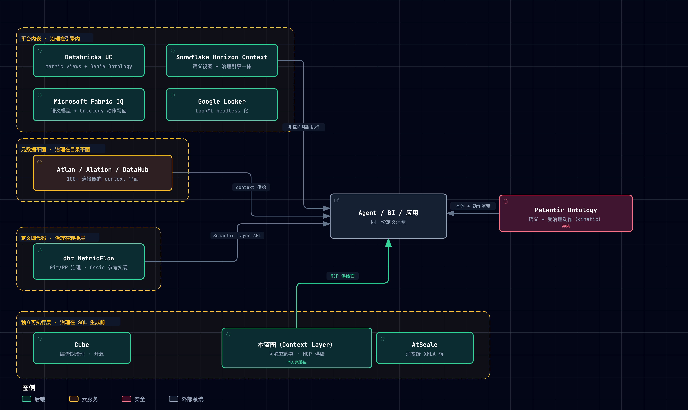
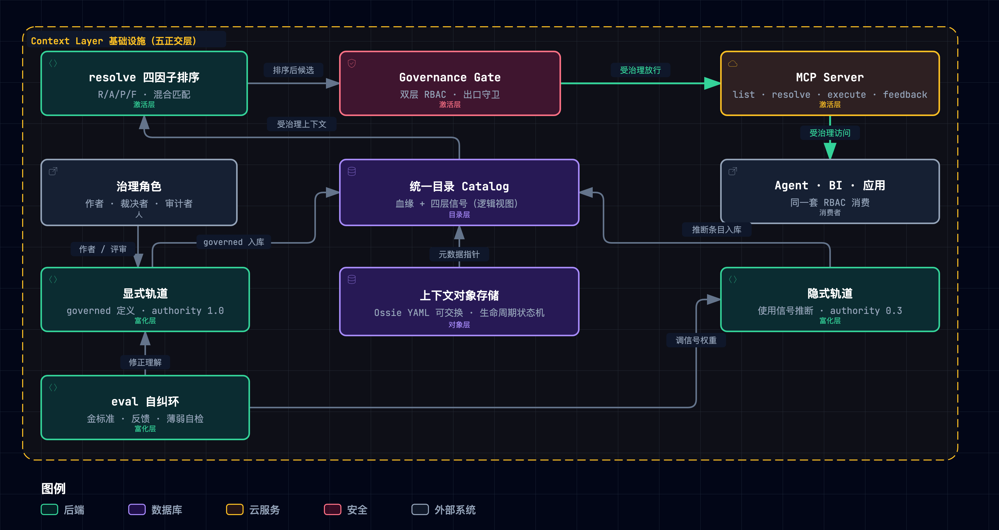
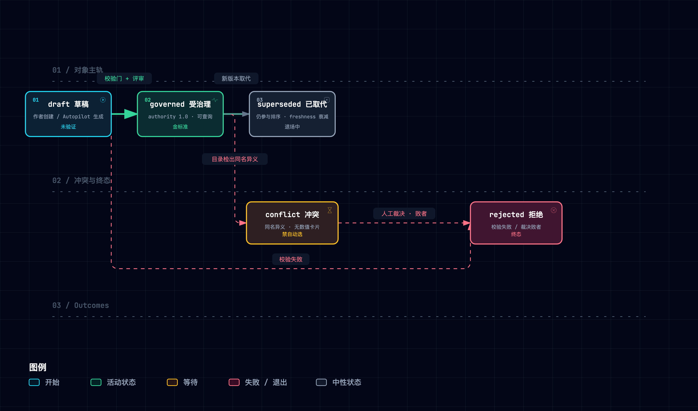
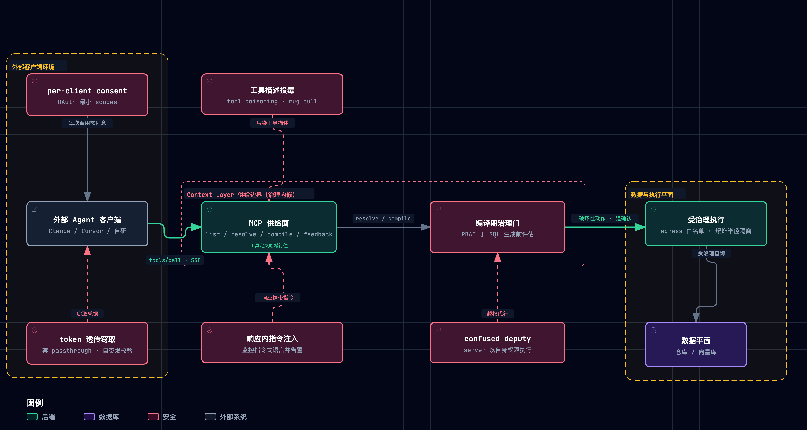

> 以 [Snowflake Horizon Context](https://www.snowflake.com/en/product/features/horizon-context/) 为范本的**通用可复刻架构**：一个可独立部署、面向 Agents 研发与平台集成的治理上下文层——不只复刻 Snowflake，而是吸收全行业实践，可服务任意引擎与 agent 平台。
>
> 循证基础：Horizon 自身机制的详解、Snowflake 官方基准数字与批判性边界见 [Horizon Context 精读笔记](./011-horizon-context.md)（其 M 集已于 2026-09-17 经全局重评选校准：语义视图/行列级策略/语义级治理/验证锚定/血缘/Agent Identity/分类标签七席，富化、检索、互操作降为专章）；与本仓代码的逐条对照见[机制映射报告](./012-horizon-context-mapping-negentropy.md)；negentropy 内部实例化见 [Context Layer 技术方案](../../concepts/design/context-layer.md)；行业格局、第三方实证与失败史的出处见文末参考 [7]–[17]。最小原型（M1–M7 七机制 + MCP 服务，十次破坏性实验）已随笔记入库验证。

> [!TIP] **怎么读本蓝图**
>
> 全文贯穿一个总类比：**为数字化大厦里每天重新入职的「天才实习生（Data Agent）」搭建一套受治理的「中枢带教与风控体系」**。对象层是装订成册的《业务规章手册》（每条定义有责任人、有效边界、版本演进与盖章底稿，白纸黑字写清口径算式，没立项入册的野定义绝不准上岗）；目录层是全楼机房的「统一索引总账」（只维护「索引指针 → 物理单据」的逻辑映射，绝不在各机房外另建孤岛物理账本，从源头杜绝脑裂与对账崩塌）；富化层是带教中枢的「双轨编纂机制」（专家正式编写 5% 核心骨架，见习助教在不窥探机密凭证的前提下暗中观察老法师用数习惯补齐长尾；一旦民间习惯与官方规章冲突，必须亮红灯鸣笛交人工裁决）；治理层是焊在大厦唯一承重墙必经之路上的「生物识别闸机」（不是大堂里立着的塑料告示牌，无论人类分析师、BI 还是实习生直查底层单据，出闸前一律逐页验放脱敏）；激活层是带教大厅的「金牌前台向导与标准工业插座」（面对实习生提问绝不把整座机房档案倒在他桌上撑爆大脑，只精准撕下最相关的两页；遇到考证过的经典 FAQ 直接出示盖章底稿；而对外提供标准工业插座 MCP，让外部特聘专家即插即用协同问数）。后文的「对外业务窗口安检风控」「带教体系定期业务大考」「谁有权拍板官方口径」，全部收敛于这一套严丝合缝的企业带教与风控逻辑。
>
> 每个机制章按四拍展开：**类比** → **设计** → **行业实践** → **边界声明**（仅在有实质边界时出现；格局章第二拍为「格局」、评测章为「方法」）。
>
> 四方文档分工：[精读笔记](./011-horizon-context.md)管 Horizon 自身机制与 Snowflake 官方数字；[机制映射报告](./012-horizon-context-mapping-negentropy.md)管本仓代码锚点；[Context Layer 技术方案](../../concepts/design/context-layer.md)管 negentropy 内部织物；本蓝图管**通用设计 + 行业全景**。

---

## 0. 为什么需要：Agent 在自信地猜数

**要解决的问题**（Horizon 的归因，Snowflake 官方内测与第三方复测同向印证）：Agent 缺业务含义时准确率 ~21–25%（25% 为 Snowflake 内测自报、21% 为 Anthropic 复测）且自信地错；含义散落在 SQL/看板/prompt 里必然漂移；外挂治理层可被绕过。

| 设计规格           | 通俗版                                         | 蓝图对应            |
| ------------------ | ---------------------------------------------- | ------------------- |
| 定义一次、处处生效 | 规章手册只写一遍，处处引用不抄写               | 对象层章 + 目录层章 |
| 治理内嵌、不可绕过 | 闸机焊死在承重墙必经通路上，杜绝大堂告示牌摆设 | 治理与安全章        |
| 双轨养上下文       | 手册编纂（显式）+ 助教偷师（隐式），冲突必见人 | 富化层章            |
| 通用接入           | 任何 agent/BI/应用用标准工业插座消费           | 激活层章（MCP）     |
| 对冲「治理≠验证」  | 规章合法 ≠ 算式无误，底层单据捣碎时出口须对账  | 边界对策章          |

**第三方实证**（每行出处见参考）：

| 证据                                                                                                 | 出处                  | 一句话读法                                                       |
| ---------------------------------------------------------------------------------------------------- | --------------------- | ---------------------------------------------------------------- |
| dbt 2026 复跑（ACME 11 问 × 20 次）：text-to-SQL 全集 32.7%（2023 模型）→ 64.5%（2026 模型）；**语义层覆盖内 100%**；补 3 个 dbt 模型后覆盖全部考题 | dbt Labs [10]（品类卖方基准，COI 标注） | 模型两年大踏步，裸奔仍在「看起来对」区间；进覆盖内则是确定性的   |
| 「语义层失败表现为报错，text-to-SQL 失败表现为看起来对的错数」                                       | dbt Labs [10]         | 本蓝图「报错优于错数」KPI 的出处                                 |
| raw 直查 21% → 先查语义层 ~95%                                                                       | AtScale × Anthropic [9] | 两家独立复测同向：语义层是台阶不是装饰                         |
| context layer 相比仅语义视图 5x                                                                      | Atlan AI Labs         | 光有定义不够——四层信号与治理齐备才有乘数                         |
| 13% 的组织报告过 AI 模型/应用泄露，其中 97% 缺少 AI 访问控制                                          | IBM Newsroom [14]     | 供给面安全不是理论威胁的量化注脚（治理与安全章展开）             |
| 直连库模式 =「一个连接良好的猜测器」                                                                 | Colrows [13]          | 连接得再好，没有含义仍在猜                                       |
| shadow-AI 场景违约成本均值 $4.63M                                                                    | IBM CODB 2025，转引见 [13] | 绕开治理用 AI 的代价已经有了账单                             |
| Spider 2.0：最强模型 21.3% vs Spider 1.0 时代 91.2%                                                  | ICLR 2025 Oral [11]   | 企业真实工作流与教科书基准之间的鸿沟（评测章展开）               |
| 到 2028 年，60% 仅靠 MCP 的 agentic analytics 项目将因缺一致语义层而失败（表格级标转引）             | Gartner D&A Summit 2026 | 分析师口径的时间表                                             |
| 40%+ agentic AI 项目将在 2027 年底前取消（表格级标转引）                                             | Gartner               | 失败史一课的量化预告（组织与运营章）                             |

这些证据共同指向一个结论：**瓶颈不在模型，在含义的供给方式**。

## 1. 它是什么、不是什么：术语与范围

> [!TIP] **类比**
>
> 这份《业务规章守则》在大厦里换过三次叫法（BI 语义层 → headless BI → context layer），但纸上的硬功夫——把业务含义铸成受治理的白纸黑字定义——三十年没变。改名从来不是因为规矩变了，而是因为拿着手册翻看的人，从精通 SQL 的老法师变成了每天都在重新入职的实习生（Agent）。

**三十年术语史**：semantic layer 一词由 Business Objects 在 1990s 创造（AtScale Mariani 的行业史回顾 [17]）；2020–23 年 headless BI 炒作幻灭，证明「指标 API」本身撑不起一门生意；2026-03-10，a16z 发表《Your Data Agents Need Context》[7] 为 **context layer** 定名——context 是 semantic 的超集：在指标口径之外再加 canonical entities、identity resolution、tribal knowledge 与 governance guidance，作者甚至类比「相当于给数据栈配一份 .cursorrules」。随后 Gartner D&A Summit（2026-03）把 context 定调为 "new critical infrastructure"（新关键基础设施）；2026-06-02 Snowflake 以 Horizon Context 将其推到行业顶点。

但行业对「context 到底是什么」远未一致，三派分歧：

| 派别   | 主张                                                             | 代表  |
| ------ | ---------------------------------------------------------------- | ----- |
| 超集派 | context 吃下 semantic，并把实体解析、部族知识一并收编           | Atlan |
| 并行派 | context 是操作状态（怎么用），semantic 是含义（是什么），正交并存 | Airbyte |
| 内核派 | context layer 必须有可执行内核，否则只是更厚的目录              | Cube  |

行业的自嘲一针见血：「每个厂商的 context layer 架构都长成它已经在卖的那个产品的形状」——选型时先看它卖什么，再看它说什么。

**本蓝图的术语立场**：术语上收 a16z 的宽定义当北极星（context ⊃ semantic），工程上落 Cube 的纪律当地基（context layer 必须可执行）——先有 semantic 的骨头，再长 context 的肉。学术先声比这更早：Ground 早已提出「数据上下文服务」的主张（"a data context service"）[5]——把上下文当受治理服务而非随手粘贴的注释，是这条线十年一贯的立场。

> [!WARNING] **边界声明**
>
> **范围外（本蓝图明确不做）**：
>
> - **记忆与实体解析**：a16z 定义内的 identity resolution 与长期记忆机制不纳入本蓝图（negentropy 侧由记忆子系统与知识图谱承担，见 [Context Layer 技术方案](../../concepts/design/context-layer.md)）。其中「部族知识」一类的隐式经验，由对象章的 verified Q&A 与 instructions 字段以受治理方式承接——不建独立记忆系统，只铸带溯源的问答资产。
> - 替代各子系统的检索算法；数据平面本身（仓库/向量库）；模型训练。

## 2. 业界格局：四条路线与一个异类

> [!TIP] **类比**
>
> 为实习生配备这套带教与风控体系有四种路线：**生在大厦地基里**（平台内嵌——云仓厂商直接把规章与闸机铸进自家引擎底座）、**师傅按工程图纸手抄**（定义即代码——规章跟数据转换代码一起放进 Git 版本管理与 PR 评审）、**独立设立专业带教与风控中枢**（独立可执行层——在查询生成前设立独立的带教与校验服务）、**只给全楼机房编一本联合索引总账**（跨系统元数据平面——不设执行关卡，只汇聚各机房元数据做宏观编目）。还有一个异类：Palantir 不止发规章，它把「实习生在业务现场允许做出什么动作（Action）」也铸进了风控网。

> [!NOTE] **格局**
>
> 四条路线的分野不在功能清单，而在**治理发生在哪一层**：

| 路线             | 治理发生处   | 代表与一句定位                                                                                                                                                                                                                                                                                                                                              |
| ---------------- | ------------ | ------------------------------------------------------------------------------------------------------------------------------------------------------------------------------------------------------------------------------------------------------------------------------------------- |
| 平台内嵌         | 引擎内       | Databricks：UC Business Semantics metric views（2026-04 GA）+ Genie Ontology（实现捐入开源；Typedef 批判其同样「governed 但未验证」）。Microsoft：Fabric IQ（Build 2026 GA）——Power BI semantic model + Ontology 实体/关系/规则/**动作写回**，MCP 端点开放。Google：Looker LookML → headless；Conversational Analytics（2026-08）把 verified/golden queries 做成一等机制（核心已 GA——2026-07 官方口径，子功能部分 Preview） |
| 定义即代码       | 转换层       | dbt MetricFlow：2025-10-28 以 Apache 2.0 开源（OSI 初始参考实现），v1.12+ 支持 Ossie；YAML 与转换代码同仓版本化、PR 评审                                                                                                                                                                                                                                    |
| 独立可执行层     | SQL 生成前   | Cube：「治理在 SQL 产生之前发生；post-hoc 扫描被子查询/CTE 绕过」[8]。AtScale：「composite context layer」——Horizon 是 system of record，它是 system of consumption [9]；其名言 "A glossary describes things. A semantic layer executes." [17]                                                                                                                  |
| 跨系统元数据平面 | 元数据平面   | Atlan：自称「runtime enrichment 架构，而非持久 knowledge graph」。Alation：Semantic Model Mastering——「语义层版 MDM」。DataHub：开源双向 context graph                                                                                                                                                                                                       |

**异类 Palantir Ontology**：semantic 层（objects/links）+ kinetic 层（actions 与动态安全）的双层结构，decision lineage 贯穿整条决策链；UBS 2026-04 评其为「AI 护城河」。它证明 context layer 的终点不止「答对数」，还有「做对动作」。

> [!IMPORTANT] **行业实践**
>
> 每条路线都预置了自己的失败模式：平台内嵌绑定单一引擎；定义即代码「不在执行路径上」——价值后置，是失败史三死因之一（见组织与运营章）；元数据平面被 Cube 一派讥为「只描述、不执行」；独立可执行层则要自己挣采用。四条路线的共同收敛点是**把治理往 SQL 生成之前挪**——post-hoc 扫描防不住子查询与 CTE 绕行，已是公认。

**蓝图落位**：本蓝图选**第三条路线**（可独立部署的可执行层），同时吸收其余三条的长处——定义即代码的版本化纪律（对象层章）、元数据平面的四层信号（目录层章）、平台内嵌的出口治理与动作思想（治理与安全章）。理由：不绑引擎，才能服务任意 agent 平台；治理在 SQL 生成前，才防得住绕行。



> 图源（可 diff 文本）：[`context-layer-blueprint--industry-landscape.mmd`](../../assets/mermaid/cognitive-context/context-layer-blueprint--industry-landscape.mmd) · 交互版（下载到本地打开）：[`context-layer-blueprint--industry-landscape.html`](../../assets/architecture/cognitive-context/context-layer-blueprint--industry-landscape.html)

## 3. 总体架构：五个正交层

> [!TIP] **类比**
>
> 企业带教体系的五大正交子系统各司其职：**规章手册（对象层）**管「白纸黑字定义了什么」，**索引总账（目录层）**管「顺藤摸瓜怎么找到」，**助教中枢（富化层）**管「吸纳经验怎么养护」，**承重墙闸机（治理层）**管「验明正身信得过谁」，**前台向导与安全插座（激活层）**管「按需精选怎么使用」。五套系统高度正交——升级前台检索算法不需要重写业务指标定义，调整承重墙闸机策略不需要重修数据管道。这就是「正交」的工程内涵。

> [!NOTE] **设计**
>
> 五个正交层——对象存储（放什么）、目录（怎么找）、富化（怎么养）、治理（怎么信）、激活（怎么用）。为什么拆五层而不是做成一个大层：五个维度各自独立变化——换检索算法不该动权限模型，加富化轨道不该改对象格式；机制（治理/路由）与策略（各源算法）分离，各层可独立演进，也才可以像消费端承诺的那样「升级前台检索算法不需要重写规章手册」。



> 图源（可 diff 文本）：[`context-layer-blueprint--architecture.mmd`](../../assets/mermaid/cognitive-context/context-layer-blueprint--architecture.mmd) · 交互版（下载到本地打开）：[`context-layer-blueprint--architecture.html`](../../assets/architecture/cognitive-context/context-layer-blueprint--architecture.html)

> [!IMPORTANT] **行业实践**
>
> Horizon Context 是五层齐备的范本（逐机制精读见[精读笔记](./011-horizon-context.md)）。对照格局章可见：多数路线只强其中两三层——元数据平面强目录而弱激活，定义即代码强对象而弱治理。本蓝图的核心主张是把五层当一个**正交系统**整体设计，而非挑两三层做成产品。

## 4. 对象层：规章手册

> [!TIP] **类比**
>
> 规章手册为每一条业务定义立下明文法度：责任人是谁（owner）、公开边界在哪（scope/visibility）、历经几版修订（version）、有没有资深前辈的盖章底稿（verified Q&A）。**没登记入册的野规矩绝不准上岗**——结构校验门在注册期就把非法结构拒之门外，不等到实习生拿去算数甚至闯祸时才暴露。

> [!NOTE] **设计**
>
> 对象模型 = 对标 semantic view 五段式的**泛化**——上下文不限于指标，任何「agent 推理所需的受治理含义」都是对象。四个设计要素：YAML 对象模型与三条字段纪律（下）、生命周期状态机（下）、注册期结构校验门（下）、data contract 产权文件（见下文 Data Contract 小节）。

```yaml
# 对齐 Apache Ossie (Incubating) YAML 风格的示意（指标类对象）
id: metrics/net_revenue
kind: metric                      # definition | metric | doc | skill | qa | policy
name: net_revenue
synonyms: [净收入, net sales]      # 召回别名是受治理上下文，不是检索层外挂
spec:                             # 五段式（指标类）：tables/relationships/facts/dimensions/metrics
  tables: [...]
  metrics: [{name: net_revenue, agg: sum, expr: "gross * (1 - discount)",
             non_additive_by: [day]}]
instructions: "聚合先于 join；默认走 buyer 关系"   # 随定义分发的 agent 指令
verified_queries:                 # 人验证过的问答，一等资产
  - question: "net revenue by month"
    answer_ref: "queries/q001"
    verified_by: "( data_governance = data-team@example.com )"
    verified_at: 2026-08-20
visibility: {level: public}       # public | private | roles: [...]
tags: {domain: finance, owner: data-platform}
provenance: {source: governed, authority: 1.0}    # governed | inferred | legacy
version: 12
```

三条字段纪律（[机制映射报告](./012-horizon-context-mapping-negentropy.md) #1 的增量，negentropy definitions 的 `meta` 可承载）：

1. **synonyms 必填意识**——没有同义词的定义在自然语言检索面上是隐形的；
2. **instructions 随对象走**——给 agent 的口径说明内嵌定义、随定义治理与版本化，拒绝 prompt 里硬编码；
3. **verified Q&A 带溯源**——答案样例是信任度最便宜的来源，`VERIFIED_BY/AT` 使其可审计。

**生命周期状态机**：



> 图源（可 diff 文本）：[`context-layer-blueprint--object-lifecycle.mmd`](../../assets/mermaid/cognitive-context/context-layer-blueprint--object-lifecycle.mmd) · 交互版（下载到本地打开）：[`context-layer-blueprint--object-lifecycle.html`](../../assets/architecture/cognitive-context/context-layer-blueprint--object-lifecycle.html)

结构校验门（对标 validation-rules）：引用必须命中键约束、至少一个可用面（维度/指标/正文）、名字唯一、`non_additive_by` 引用的维度存在——**非法结构在注册期被拒，不进运行时**。

> [!IMPORTANT] **行业实践**
>
> - 对象格式对齐 Apache Ossie (Incubating) YAML 风格——已汇聚 50+ 组织的开放规范 [3]，是语义跨系统携带的唯一现实通道（三重边界见激活层章）。
> - dbt 的定义即代码纪律同构 [10]：YAML 同仓版本化、PR 评审、测试先行、可回滚——对象的一等公民身份由 Git 流程背书。
> - a16z 五步架构中最关键的一步是「人工精修」[7]：最重要的 context 是隐式、条件性、历史偶然的——生成辅助之后必须有人把关，机器起草、人类盖章。

### 4.1 Data Contract：业务交接与责任契约

对象不止携带定义，还携带契约。业界 data contract 的五件套 = **schema + 质量阈值 + 语义（绑 canonical 词条）+ lineage + 访问**；per-agent 授权在 context 交付点执行；破坏性变更按 API 弃用纪律走——触发 → 评审 → 弃用窗口 → 通知下游，不许静默改口径。

> [!WARNING] **边界声明**
>
> 业界诚实声明：**「没有结构性工具原生在推理时强制语义契约」**。契约文件的强制力不来自文件本身，而来自本蓝图的激活层与执行层——契约条款写在纸上，执行的锁必须焊在大厦的承重墙闸机与执行层里。

## 5. 目录层：统一索引总账

> [!TIP] **类比**
>
> 带教大厅只编索引总账，不替各个机房重抄原始单据：数据凭证依然留在各自机房（各子系统与源库），总账只维护「索引指针 → 物理单据」的逻辑映射。全楼永远只有一本联合总账——出现第二套割裂账本的那一刻，就是 Split-Brain（脑裂）与口径打架的开始。

> [!NOTE] **设计**
>
> - **逻辑视图而非新物理表**（[context-layer.md ADR-1](../../concepts/design/context-layer.md) 同款决策）：UNION 各来源的元数据 + 轻量指针，杜绝 Split-Brain。
> - **四层信号**入库：Structural（有什么/怎么连，含血缘）、Operational（新鲜度/运行状态）、Semantic（定义/口径/本体）、Behavioral（热度/使用模式）。
> - **血缘**记录「谁喂谁」（观察型）；其边界见边界对策章。

> [!IMPORTANT] **行业实践**
>
> Gartner 在 D&A Summit 2026 给出的分野：knowledge graph 记 what/who（静态），context graph 记 how/why（演化）——本目录按后者设计，Behavioral 与 Operational 是一等信号，不是附录。元数据摄取的周界承诺同款："will only ingest metadata and usage patterns, not your actual data rows"——目录永不碰数据行。

> [!WARNING] **边界声明**
>
> **UNION 到哪为止**——目录的周界是「读方向的元数据联邦」：
>
> - 只 UNION 元数据与指针，不复制数据行，不接管各系统的写路径；
> - DataHub 式「双向 context graph」的野心是把全企业元数据双向同步成一棵树——本蓝图批判性采纳：读方向 UNION 进目录，写方向回各自系统；全量双向同步是集成项目，不是目录职责；
> - 来源因安全域或物理隔离无法 UNION 时，退化为**联邦查询**：目录只做路由与权限标注，不落地数据。

## 6. 富化层：双轨编纂、民间经验与人工裁决

> [!TIP] **类比**
>
> 带教中枢完善规章手册靠两手：**专家正式编纂（显式轨道）**——由资深专家手工梳理，权威严谨但覆盖慢（往往覆盖不足 5%）；**见习助教暗中偷师（隐式轨道）**——在绝不窥探真实机密数据的前提下，观察老法师日常上千次用数习惯与民间经验。偷师提炼的经验可以作为草案，但**转正入册必须经专家裁决**：当官方正规与民间习惯口径打架时，绝不按热度多数票盲目采信，必须亮红灯出示 CONFLICT 卡片，交由业务主管人工裁定。

> [!NOTE] **设计**
>
> - **显式轨道**（金标准，authority=1.0）：人手工 + 生成辅助（对标 Autopilot：从既有 SQL/配置/文档批量生成草稿，人审后转 governed；机制详解见[精读笔记](./011-horizon-context.md)）。
> - **隐式轨道**（长尾，authority<1.0）：从查询日志、使用痕迹、BI 定义自动拼装「同类的理解」——解决显式覆盖不动的问题（Snowflake 实测 9,685 表覆盖 <5%）。
> - **eval 自纠环**：金标准问答集 / 用户反馈 / 系统自检薄弱区三路输入 → 错配 → 修正（定义级：补 synonyms；信号级：调 popularity）→ 重排复测。
> - **冲突浮出（核心契约）**：同名异义 → 双双标 `conflict` → 检索返回 **CONFLICT 卡片（并列两定义、无数值、needs_adjudication=true）** → 执行层拒绝 → 人工裁决恢复。**禁止按 popularity 自动选**（原型 D4 实测：自动选让错误口径 [6,1,2] 胜出——477 vs 48 事故 [6] 的机制复现）。

> [!IMPORTANT] **行业实践**
>
> - DataHub 的晋升流是同款纪律：「被看到 50 次的 join 是晋升 canonical 的候选，不是自动答案」——隐式信号给出候选名单，裁决永远留给人。
> - dbt 复跑同时证明覆盖是动态资产：补 3 个模型就能让语义层覆盖全部考题（见「为什么需要」章）——覆盖缺口榜（组织与运营章）就是富化层的工单队列。

> [!WARNING] **边界声明**
>
> 富化修正的是**含义**，不是数据：本层不修上游数据质量（那归 data contract 的质量阈值），只修定义、口径与别名的理解质量。把两件事混进一个环，会把数据质量问题误诊为语义问题。

## 7. 激活层：前台向导与标准工业插座

> [!TIP] **类比**
>
> 激活层是带教体系对外部消费方的服务窗口：**前台向导（resolve 接口）**绝不把整座机房档案库一股脑倒在实习生桌上撑爆大脑，只精准撕下最相关的 2~3 页递出，并随附「这两页是谁盖章认证的、多久前更新、是否存在争议」；**标准工业插座（MCP 供给面）**则提供统一规范接口，让外部特聘专家工具（Claude、Cursor、BI 工具等）即插即用协同问数。

> [!NOTE] **设计**
>
> **resolve 契约**（agent 侧唯一入口）：`resolve(question, role) → ContextPackage{top-k 条目, instructions, verified_query?, warnings, conflict_card?}`。命中 verified query 即短路重放（带溯源）；无 governed 覆盖时显式 `no_governed_coverage` 警告而非静默用推断口径。
>
> **排序**：`0.4·relevance + 0.3·authority + 0.2·popularity + 0.1·freshness`，三条工程纪律——authority 区分 governed/inferred；popularity 用 log1p 有界变换（防全局归一漂移）；tie-break 显式化 `(-score, -authority, -updated, name)`。

**MCP 供给面四工具**（MCP = Model Context Protocol，模型上下文协议 [4]——平台集成的标准插头，原型已验证纯标准库可行）：

| 工具                                       | 职责                    | 治理要点                                   |
| ------------------------------------------ | ----------------------- | ------------------------------------------ |
| `list_context_objects(role)`               | 目录 + 信任信号         | RBAC 过滤后下发                            |
| `resolve_context(question, role)`          | top-k 上下文包          | 含 CONFLICT 卡片路径                       |
| `execute/compile(metric, dims, via, role)` | 受治理执行              | **引擎层 RBAC 兜底**（检索层泄露也拦得住） |
| `report_feedback(name, verdict)`           | 行为反馈写回 popularity | Behavioral 闭环；同名需带 source 消歧      |

> [!IMPORTANT] **行业实践**
>
> 业界公论：「MCP 是传输层、语义层是逻辑层，两者都要」[13]——MCP 解决怎么接进来，语义层解决接进来之后说什么。把 MCP 当语义层的替代品，等于把电话线当成对话本身。

### 7.1 互操作：三重边界与供给方义务

Ossie 让定义**可携带**，但可携带只是三重边界的第一重：

1. **可携带 ≠ 可执行**——Ossie 解决定义带着走，不解决别家引擎替你执行治理；
2. **可携带 ≠ 已验证**——validator 只查 schema 合法性，不查计算合法性（grain 塌缩照样过门，见边界对策章）；
3. **可携带 ≠ 已普及**——产品化刚刚起步（2026-09 核验）：Strategy One 自 2026-06 起可导入 Ossie YAML（预览）、Strategy 2026-07 起导入/导出开箱即用（GUI），其余产品仍只有 CLI 转换器（Datus："running a CLI command, not clicking a button"）；Datus 实测桥接保真度损失——ASOF/RANGE 等非等值 join 被静默丢弃。

**供给方义务**：因此本蓝图把互操作当**转换器级**能力而非产品级承诺——导出必带 provenance 与 authority 标注；导入一律降 authority、显式标 provenance，过结构校验门后才可注册（对应演进路线 P3）。

> [!WARNING] **边界声明**
>
> 三重边界（可携带 ≠ 可执行 ≠ 已验证）是本蓝图互操作设计的公理。任何「导入即用」「导入即权威」的说法，都是对这三条边界的无知或误导。

## 8. 治理与安全：焊入承重墙的逐页验放闸机

> [!TIP] **类比**
>
> 治理绝不是大堂里立着的塑料告示牌（应用层可选过滤），而是**焊在机房承重墙必经之路上的生物识别闸机**——通往底层凭证的每条物理通路都强制验身，出闸前逐页打码扣行，直查物理底表的绕行照样被拦截。而一旦为外部特聘专家开放了服务窗口（MCP 供给面），就必须设立**严格的外来件安检防线**：凡从窗口递入的外来输入——工具描述、外部指令、第三方定义——一律按不可信输入进行穿透式审查与隔离。

> [!NOTE] **设计**
>
> 治理的默认形态是**双层防线**——检索层过滤（体验）+ 执行层 RBAC（底线，见下文双层防线小节）；再加配套三件：出口 guardrails、per-role context、审计日志（见配套防线小节）。供给面开放后，第三道防线是供给面威胁模型小节。

### 8.1 双层防线

1. **检索层**（体验）：resolve 时对无权角色过滤 private 资产与维度建议；
2. **执行层**（底线）：execute 必经 RBAC 校验——「检索藏起来但执行层照样跑」是外挂治理层的标准死法（原型 C2）。

### 8.2 配套防线

出口 guardrails（PII/敏感信息在**出口**检测/脱敏/拦截，对标 Horizon 出口安检体系，机制辨析见[精读笔记](./011-horizon-context.md)）；per-role context（不同角色解析出不同上下文集——Horizon 私测期尚未交付，属本蓝图的后置项）；审计日志（谁在何时以何角色消费了何定义）。

### 8.3 供给面威胁模型：对外业务窗口的安检风控

经 MCP 对外开放供给面，等于在大厦原本封闭的风控网中开辟了对外窗口——攻击面从「内部数据库」扩展到「客户端 → 供给面 → 执行层」全链路。

> [!IMPORTANT] **行业实践**
>
> 2025 年六起具名事件证明这不是理论威胁 [15][16]；其中 Anthropic 官方 Git MCP Server 的严重缺陷（2025-11）[16] 给出最重要的一条教训：**官方/受信组件也必须当不可信组件**。IBM 2025 的量化注脚（AI 泄露组织中 97% 缺访问控制，见「为什么需要」章证据表 [14]）同向。

**威胁分类与拦截位**：

| 威胁                       | 机理                                             | 拦截位                                        |
| -------------------------- | ------------------------------------------------ | --------------------------------------------- |
| 工具描述投毒 / rug pull    | 工具描述是不可信输入面，指令可藏在描述里；装后偷改定义 | 工具定义哈希钉住（检测 rug pull）+ 注册期评审 |
| 间接注入                   | 外部内容（issue/邮件/文档）被 agent 当作指令执行 | 监控工具响应中的指令式语言并告警              |
| confused deputy            | 供给面 server 持高权限凭证，被诱导替攻击者执行特权动作 | 动作点风险分级强确认 + 编译期 RBAC            |
| token 透传/窃取            | 客户端 token 被供给面转发或盗用                  | 禁 passthrough；server 自签发并校验 audience  |

**事件四代表**（2025）：

| 事件                                                                        | 一句话教训                            |
| --------------------------------------------------------------------------- | ------------------------------------- |
| postmark-mcp——首个野外恶意 server，外发隐抄送                               | 供给链从「装了什么」起就不可信        |
| GitHub MCP 恶意 issue 注入                                                  | 外部内容当指令执行，间接注入是现实攻击 |
| WhatsApp 工具描述投毒                                                       | 官方目录 ≠ 免检通道                   |
| Anthropic 官方 Git MCP Server（2025-11）——路径校验绕过 + 参数注入 + 链接 RCE [16] | **官方/受信组件也必须当不可信组件**   |

**供给面控制清单精选**（按业界控制清单精选 [16]，映射到本蓝图；原文清单随时间增补，项数以源头为准）：

- per-client consent——每个客户端逐一授权接入；
- 最小权限拆工具——读/写/删/执行分离，禁止一个万能工具；
- **动作点风险分级强确认**——破坏性、涉资金、外发内容三类动作必须人工确认；
- 监控工具响应中的指令式语言并告警——间接注入的烟雾报警器；
- egress 白名单 + 爆炸半径隔离——每个供给面进程只可达白名单端点；
- 短命轮转会话——token 暴露窗口最小化；
- 工具定义哈希钉住——检测 rug pull（供给面事后偷改定义）。

**编译期共识**：治理必须在 SQL 产生之前的编译期评估——事后扫描防不住子查询与 CTE 绕行（与格局章 Cube 立场同源）。要害一句话说透：「营销 agent 若有全库 SELECT，会顺理成章地查财务表——不是恶意，是不知道边界在哪」。2026 年事件仍在加码：Anthropic MCP STDIO 设计缺陷波及 LettaAI、LangFlow 等客户端，仿冒 MCP 包与 0-day 命令注入持续出现 [15]——供给面安全没有「做完」的那天，只有「今天做了」的状态。



> 图源（可 diff 文本）：[`context-layer-blueprint--mcp-threat-model.mmd`](../../assets/mermaid/cognitive-context/context-layer-blueprint--mcp-threat-model.mmd) · 交互版（下载到本地打开）：[`context-layer-blueprint--mcp-threat-model.html`](../../assets/architecture/cognitive-context/context-layer-blueprint--mcp-threat-model.html)

## 9. 边界对策：治理 ≠ 验证

> [!TIP] **类比**
>
> 带教中枢验收合格的规章算式，救不了进场前就已被打碎捣乱的原始单据：治理保证的是「规章与算式合法」——指标结构合规、推导语法正确；但它无法自愈「底层原始凭证已遭破坏」——上游数据流水线在汇入语义层之前就丢失了必要的统计粒度（Grain 塌缩）。这一章，正是为「规章之外的物理断层」构筑的第三道对账防线。

> [!NOTE] **设计**
>
> Typedef 批判的核心（详见[精读笔记](./011-horizon-context.md)的批判性边界）[6]：governed 定义在**上游已塌缩的 grain** 上照样产出错误数字（477 vs 48）；`NON ADDITIVE BY` 是人填的声明非推导。Snowflake 官方原话点破本质："that was valid SQL, but it was not valid analytics"——语法合法与答案正确是两回事。蓝图的三级对策：
>
> 1. **表达式级 derived 校验**（便宜，先做）：口径表达式里可见的非可加性（如 `SUM(x)/COUNT(DISTINCT y)`）注册期自动标记，提示消费方；
> 2. **verified Q&A 作为出口对账资产**：验证答案与重算结果不一致时告警（原型 A1b 的对账断言即此机制的雏形）；
> 3. **eval 环事后评分 + 血缘回溯**（贵，后置）：前两级拦不住的，用事后评分兜底并沿血缘定位源头。

> [!IMPORTANT] **行业实践**
>
> Typedef 给这类修复起的名字是 **compiler in the loop**（编译器在环）[6]：「修复不是更多 context，而是 compiler in the loop」。工程上已有局部解法——跨 grain 的 distinct 用 array 聚合或 HLL 近似是通行方案；但「编译期从转换代码推导计算合法性」目前仍无成熟方案——本蓝图以 eval 环兜底，不假装解决。

## 10. 评测：怎么知道它有效

> [!TIP] **类比**
>
> 带教体系必须有严谨的**业务大考与年检**：定期拿一套由资深业务前辈盖章签字的核准考卷（Known-Answer Evals），考核实习生的推导结果；同时还要安排**便衣风控测试员**模拟各种狡黠提问——包括故意索取机密工资单（越权用例），实地验证承重墙闸机与行级列级策略绝非纸面摆设。

> [!NOTE] **方法**
>
> known-answer evals 设计四原则：
>
> 1. **考题 = 业务问题 × 数据团队人工验证的期望值**——期望值必须有人签字，这是与公开基准的本质区别；
> 2. **用例四类齐全**：歧义措辞、隐晦 join、空结果，以及**越权用例**（Cube 的实践 [8]：无权角色试图取私有指标——期望结果是「拒绝 + 审计记录」，不是任何数值）；
> 3. **golden queries 是一等评测资产**（Google Conversational Analytics 已把 verified/golden queries 做成一等机制，核心功能已 GA——2026-07 官方口径，子功能部分 Preview）：命中即短路重放的验证问答，同时是生产资产与评测考题；
> 4. **覆盖内/覆盖外分开判卷**：一张卷子两栏——覆盖内追求确定性命中，覆盖外只考察是否诚实告警 `no_governed_coverage`。
>
> KPI 口径只有一条：**报错优于错数**。企业内基准 ~10 题即可起步（Snowflake 官方建模最佳实践，见[精读笔记](./011-horizon-context.md)），先让考卷活起来再求全。
>
> **P2 验收标尺**（对应演进路线的 P2）：覆盖内题目命中 verified query 且引擎重算一致；覆盖外题目全部显式告警；越权用例全部被拒且留有审计；CONFLICT 卡片全程不出现数值。

> [!IMPORTANT] **行业实践**
>
> - Spider 2.0 鸿沟（数字见「为什么需要」章）：企业真实工作流上的最强模型与教科书基准差距悬殊——用公开榜单外推自家场景会严重高估。
> - 基准自身会错：UIUC 2026 审计发现 Spider2-Snow 金标准标注错误率 62.8% [12]——连基准的答案都要审计，自家 eval 集的期望值更必须有人签字（这正是 verified Q&A 的另一重身份）。
> - Gartner 采纳框架：AI-Ready Data 三维（Alignment / Qualification / Governance），90 天试点 → 12 个月扩展（运营节奏见组织与运营章）。

> [!WARNING] **边界声明**
>
> eval 集会腐化，腐化有两条路：模型升级改变基线（dbt 两年复跑已证明），标注本身出错（UIUC 审计已证明）。eval 集必须当**活资产**运营：随口径 Certify 同步更新，且锁版本运行。

## 11. 组织与运营：谁有权拍板官方口径

> [!TIP] **类比**
>
> 一家企业绝不能允许谁来了都在规章手册里私自加一条口径。**拍板核准权（Certify）必须高度集中**，**起草提案权（Propose）应当充分开放**，**查询使用权（Consume）必须全员普惠**——三权分立，企业带教体系才能既保持秩序井然，又杜绝孤岛与僵化。

### 11.1 治理工作流：Propose → Certify

- **RACI**：业务 metric owner 是 Accountable（口径最终由业务拍板），数据 steward 是 Responsible（起草、测试、走流程）。
- **Propose → Draft → Test → Review → Certify**：每步留全审计（谁、何时、为什么、diff）——Certify 不是盖个章，是一段可回放的决策史。
- **反模式清单**：glossary theatre（术语剧场——只有表演没有执行）、影子查询（绕过目录直查）、无主 metric、过度治理（审批比错误更贵）。

### 11.2 采用处方：从 5 个指标开始

5–10 个指标起步；业务方 day one 参与；执行赞助人拍板——「必须有人有权限说『收入就是这个意思，没得讨论』」；按基础设施运营而非项目制——项目总有结项的一天，但大厦的带教与风控体系永不退役。

### 11.3 失败史公论

> [!IMPORTANT] **行业实践**
>
> Prukalpa Sankar 的三死因：**BI 厂商激励相悖**（语义是护城河非商品）、**迁移数学不成立**、**不在执行路径上**（价值后置）。同向证据还有：Tryolabs 断言「对齐指标定义比微调模型还难」——失败在运营模型不在技术；AtScale 的「要么 100% 要么崩」[17]——缺一角覆盖，用户就自建影子模型，带教体系便从内部被架空；Tanmai Gopal 批判空中楼阁式的集中式语义层是「教条主义的漂亮规章：手册写得很美，一线工位无人问津」，主张从鲜活的业务实践中编译；以及垂直 agent 警告——不做横向 context layer，就会「把孤岛重建到上一层」。Gartner 的量化预告见「为什么需要」章（表格级标转引）。

### 11.4 可观测性：带教中枢运营大屏

三个刻度撑起日常运营：

- **覆盖缺口榜**：resolve 未命中 governed 覆盖的高频问题 Top 榜——直接生成富化层的优先级队列；
- **命中率**：verified/governed 命中占比——信任资产的日活；
- **越权拒绝率**：每次拒绝对应一条审计记录——拒绝是治理在工作，不是系统坏了。

（Horizon 侧 SEMANTIC_* 系统表的可观测面，见[精读笔记](./011-horizon-context.md)。）

## 12. 实例化：蓝图在 negentropy 的一次落地

内部织物是蓝图在 negentropy 的一次实例化——通用层与实例层的逐条对照：

| 蓝图组件   | negentropy 承载                                              | 状态                                    |
| ---------- | ------------------------------------------------------------ | --------------------------------------- |
| 对象层     | `definitions` registry（4 类定义 SSOT + checksum/版本）      | ✅ 已有，补三字段纪律即可（映射 #1）     |
| 目录层     | `context_catalog_unified` 等三视图（context-layer.md §4）    | 🔷 方案已设计                            |
| 富化层     | patrol/Judge 巡检闭环 = eval 环同构物                        | ✅ 已有（映射 #7）；冲突浮出面待补（#8） |
| 激活层     | 三层渐进披露（skills_injector）+ 计划中的 HybridPlanner 扩展 | ✅/🔷                                     |
| MCP 供给面 | 复用 McpClientService 的协议工程经验，方向从消费转供给       | 🔶 新增（映射 #13）                      |
| 治理层     | `accessible_corpus_ids` + 计划中的 ContextGuard              | 🔷 第一层已有，第二层随 Phase 2          |

**独立部署路径**：对象层落 PostgreSQL（或任意带版本化的存储）、激活层以单进程 stdio/HTTP MCP server 起步——原型 [`assets/horizon_context_mcp.py`](./assets/horizon_context_mcp.py) 即其零依赖种子。

## 13. 演进路线

| 阶段                      | 内容                                                                             | 验收                                                                                     |
| ------------------------- | -------------------------------------------------------------------------------- | ---------------------------------------------------------------------------------------- |
| **P0 机制验证（已完成）** | 七机制玩具域 + MCP stdio 原型 + 10 次破坏性实验                                 | selftest 全绿；引擎层 RBAC 经 MCP 仍生效                                                 |
| **P1 最小服务**           | 对象 CRUD + resolve + MCP 四工具 + 双层 RBAC + 审计日志，接一个真实 agent 客户端 | 真实客户端经 MCP 命中 verified query 短路；越权被拒且有审计                             |
| **P2 信任与自纠**         | 四因子归一（有界变换 + 单一 staleness）+ 冲突浮出 + 反馈闭环 + verified QA 沉淀  | 排序可解释；CONFLICT 卡片全程无数字；反馈改变排序可复现（完整标尺定义见评测章）          |
| **P3 互操作（转换器级）** | Ossie 转换器级导入导出 + per-role context + 表达式级 derived 校验                | 第三方语义模型经结构校验导入、显式标 provenance 且降 authority；跨角色上下文隔离         |

## 14. 参考

[1] Snowflake, "Horizon Context — Governed Semantic Layer & Data Catalog," *产品页*, 2026. [Online]. Available: https://www.snowflake.com/en/product/features/horizon-context/

[2] Snowflake Documentation, "CREATE SEMANTIC VIEW," "How Snowflake validates semantic views," *docs.snowflake.com*, 2026. [Online]. Available: https://docs.snowflake.com/en/sql-reference/sql/create-semantic-view

[3] Apache Ossie (Incubating), "Open specification for semantic layer and ontology," 2026. [Online]. Available: https://ossie.apache.org/

[4] Anthropic, "Model Context Protocol," 2024. [Online]. Available: https://modelcontextprotocol.io/

[5] J. M. Hellerstein et al., "Ground: A Data Context Service," in *Proc. CIDR*, 2017.（数据上下文服务的开创性主张）

[6] Typedef, "What Is Horizon Context? Snowflake's Governed Context Layer Explained," 2026. [Online]. Available: https://www.typedef.ai/blog/what-is-horizon-context-snowflakes-governed-context-layer-explained（治理≠验证批判与 477 vs 48 复现）

[7] a16z, "Your Data Agents Need Context," *a16z*, Mar. 10, 2026. [Online]. Available: https://a16z.com/your-data-agents-need-context/（context ⊃ semantic 的定名之作：canonical entities / identity resolution / tribal knowledge / governance guidance）

[8] Cube, "Semantic Layer for AI Agents," *cube.dev*, 2026. [Online]. Available: https://cube.dev/articles/semantic-layer-for-ai-agents-2026（可执行内核与「治理在 SQL 产生之前」立场）

[9] AtScale, "What Is Snowflake Horizon Context?" *AtScale Glossary*, 2026. [Online]. Available: https://snowflake.atscale.com/glossary/snowflake-horizon-context/（composite context layer：system of record × system of consumption；21% → 95% 复测出处）

[10] dbt Labs, "Semantic Layer vs. Text-to-SQL: 2026 Benchmark Update," *dbt Blog*, 2026. [Online]. Available: https://docs.getdbt.com/blog/semantic-layer-vs-text-to-sql-2026（复跑基准与「报错优于错数」金句出处）

[11] F. Lei et al., "Spider 2.0: Evaluating Language Models on Real-World Enterprise Text-to-SQL Workflows," in *Proc. ICLR*, 2025 (Oral). [Online]. Available: https://arxiv.org/abs/2411.07763

[12] T. Jin et al., "Text-to-SQL Benchmarks are Broken: An In-Depth Analysis of Annotation Errors," in *Proc. CIDR*, 2026. [Online]. Available: https://www.vldb.org/cidrdb/papers/2026/p5-jin.pdf（基准金标准标注错误率审计）

[13] Colrows, "MCP Is Not Enough: Why Enterprise AI Agents Need a Governed Semantic Layer," *colrows.com*, 2026. [Online]. Available: https://colrows.com/blogs/mcp-governed-semantic-layer/（「一个连接良好的猜测器」「MCP 是传输层、语义层是逻辑层」与 BIRD/Spider2 错标率转引出处）

[14] IBM, "IBM Report: 13% of Organizations Reported Breaches of AI Models or Applications," *IBM Newsroom*, Jul. 30, 2025. [Online]. Available: https://newsroom.ibm.com/2025-07-30-ibm-report-13-of-organizations-reported-breaches-of-ai-models-or-applications,-97-of-which-reported-lacking-proper-ai-access-controls（CODB 2025 摘要：13% 组织报告 AI 模型/应用泄露，其中 97% 缺 AI 访问控制）

[15] Authzed (S. Maheshwar), "A Timeline of Model Context Protocol (MCP) Security Breaches," *authzed.com*, May 2026. [Online]. Available: https://authzed.com/blog/timeline-mcp-breaches（2025–2026 供给面安全事件时间线）

[16] Checkmarx (S. Boone), "MCP Security: Risks, Real World Incidents and Security Controls," *checkmarx.com*, May 2026. [Online]. Available: https://checkmarx.com/learn/mcp-security-risks-real-world-incidents-and-security-controls/（含 Anthropic 官方 Git MCP Server 缺陷与供给面控制清单）

[17] AtScale (D. Mariani), "The Semantics of the Semantic Layer," *atscale.com*, 2022. [Online]. Available: https://www.atscale.com/blog/the-semantics-of-the-semantic-layer/（semantic layer 三十年行业史；"A glossary describes things. A semantic layer executes." 与「要么 100% 要么崩」出处）
