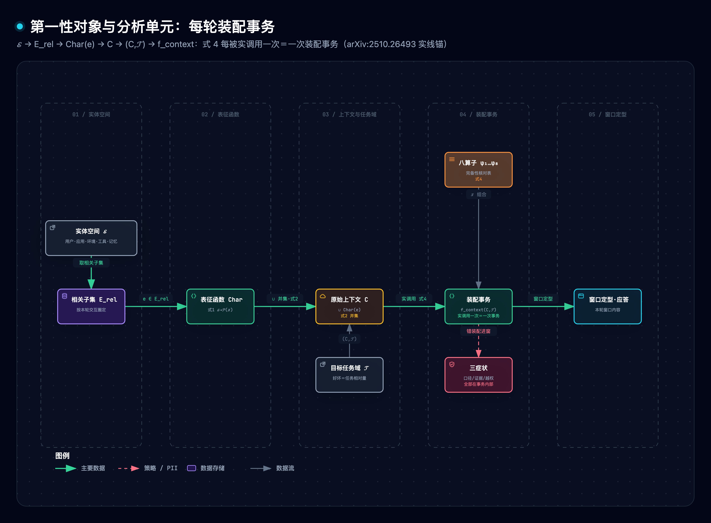

> **定位**：Agents 系统 Context Layer 的设计蓝图 SSOT——回答「怎么供给、怎么治理、怎么装配、怎么验证、怎么进化」。文档族分工：013（本文）=设计与判定（规格、状态、决策、路线）；[011 精读笔记](./011-horizon-context.md)=Horizon 全量机制载荷（冻结，连续 §1–§10）；[014](./014-openviking.md)/[015](./015-openviking-mapping-negentropy.md)=OpenViking 精读与映射。
>
> **编号稳定键**：M1–M7（Horizon 机制词表）· D1–D10（破坏实验键）· A/B/C/E/T（场景键）与 011、配套原型共用，只引不重定义；L1–L6（生命周期段）· G1–G7（治理落位法则）· 五轴名为本文键；ADR-1/2/3/6 承其原定义，ADR-4/5 由三面蓝图承接（换算见 §3.5）；#1–#20 指 §12.4 映射表行。外部引用以本文 §0–§14 为准。

## 0. 判定面总则：怎么读、怎么证伪这份蓝图

本章先把判定纪律立起来，再让后续各章的设计接受它的约束：证据按什么分级、数字带什么限定、机制到什么程度才算存在、失效按什么协议入账——全篇每个承重论断（表格行与含数字的断言句）都据此挂徽挂锚，读者可逐条复核或推翻。

### 0.1 三级徽：证据按出处分级

徽只有一个职责：标明证据从谁手里来。分级判据承 [011](./011-horizon-context.md) §5 的读表纪律（谁测的、厂商自报 vs 第三方独立），三级徽记号（实线/虚线/实心）为本文新立：

| 徽 | 判据 | 本文典型来源 | 读法 |
| :-- | :-- | :-- | :-- |
| 实线 | 第三方实测/中立锚——与论断无利害关系的第三方测量或学术实证 | arXiv 四篇＋FinanceBench 论文；Anthropic 独立复测 21%（011 §1[5]；Snowflake 转述 Anthropic——测量者无利害、按规则 3 例外承实线并注转述）；Classmethod 咨询方实测（011 §2 M6[25]） | 可承重，仍须带条件限定 |
| 虚线 | 官方自报（厂商利害）——产品方、品类卖方、竞对、投资方的自报数字、叙事例与经验观察，无论一手二手 | Snowflake 增益基准（011 §5）；Redis 调研页；a16z 构造例；typedef 判词（竞对利害已标） | 可引用，限定必须随行；利害方为竞对时注明 |
| 实心 | 本仓复算——原型实验、代码 grep/Read 实证、selftest 日志 | D1–D10（selftest 2026-10-09 复跑全绿，§13）；本轮代码审计；§12 映射表判定 | 随 commit 过期，重核换 Stamp（§0.4） |

四条适用规则：

1. **挂徽对象是承重论断**：表格每行、含数字的断言句必挂；散文里的例证数字随所属论断，不单独重复标。
2. 徽标出处与利害，不标真伪：虚线数字可用，但「谁测的、什么条件」必须随行；实线也会过期（§0.4）。
3. 转引一手研究按虚线处理并注「转引」；一手核验通过后升为实线（例外：测量者为与论断无利害的第三方、且转述限定随行者，可承实线并注「转述」——21% 即此类）——本轮已闭合五组高频转引数字（46/19＝工具面饱和实验、−39%＝多轮对话分片退化、99.6/54.3＝长会话关键信息保留、+15.8%~243.7%＝记忆个性化攻击面、19/50/85＝检索实现方式三档），完整处置表在 §13；不可升级项（如 Redis n=1000、Gartner 60% projection 口径）如实标注。
4. 徽与接线态（§0.5）是两套记号：徽回答「证据从谁手里来」，接线态回答「机制在本仓什么状态」，不得互相代用。Claude Code 范本证据按其四级分级（【一】【二】【三】【官】）引用，徽映射恒为虚线带归属（【官】=官方文档口径、课程实测=一手课程仓库、闭源分析=带归属的第三方分析）；仅本仓复跑的 lcc/090 原型产物为实心。

> [!WARNING] **徽的三个误读**：虚线不等于不可用——带限定即可引，丢弃虚线证据会丢掉整个业界自报面；实线不等于永久——外部页面会漂移（本轮实测先例：Redis who-owns 直链 404、Snowflake 冻结后新增 lineage 条目），as-of 过期即须重新探测；实心不等于对本仓有利——实心证据的一半在记录本仓自己的断链（§1 接线簇四行全是实心）。

### 0.2 考卷三问：每个数字先过三关
任何验收数字入文，先答三问：谁测的、什么条件、截至何时。三问背后是一条已升为纪律的观察——失效量化是考卷的函数，跨考卷数字不可比、不可平均：同一 GPT-4-Turbo 在 FinanceBench 上按检索设置三档摆动 19%→50%→85%（实线，三档条件与逐条限定见 §7.1）；裸问企业题的准确率随考卷难度在 25%（Snowflake 内测，虚线）与 64.5%（dbt 全题集裸 text-to-SQL，品类卖方，虚线）之间摆动（011 §7.2 争议 2）。增益端数字尤其如此——86.3% 一类的厂商增益基准全部虚线、无一第三方复现（011 §5）。高频转引数字的逐条限定见 §1 表后警示与 §13 转引处置表。
### 0.3 失败形态一等公民

两条纪律构成本文的验收观。其一，失败形态优先：系统可信度不取决于「对的时候多对」，取决于「错的时候长什么样」——可见失败（显式拒答、blocked、显式缺口）恒优于不可见错误（自信错数、表面合规放行），验收判据必须先回答「错的时候长什么样」，再回答「对的时候多对」。其二，反事实存在性：机制存在性的证明不是「有这个组件」，而是「拆掉它有具体、可复现的坏法」——[011](./011-horizon-context.md) §6 的十次破坏实验（D1–D10，2026-10-09 复跑全绿，§13 摘录逐字）是该纪律的执行样本；没有对应破坏实验支撑的机制宣称，一律按装饰性处理。判装饰性治理只问一句「绕开这个点会发生什么」——答得出「什么都拦不住」的，策略文本写得再全也不承重（执行点律：强制力来自求值点而非定义点，§5 权威轴展开）。由此派生调试纪律：**Agent 失败先查上下文供给链，再查模型**（context-first debugging）——失效登记簿的行号比模型参数更可能定位问题。
### 0.4 as-of 双轨：本仓 Stamp 与外部探针日期

本仓与外部跑在两套时间基准上，戳记分轨。**本仓判定面 as-of b2fbb51f5（2026-10-09）**（b2fbb51f5 是 Git 提交号——本仓代码在该时点的版本指纹，判定随提交过期）：一切 file:line、接线态、ISSUE 状态以此为 Stamp，重核时换新 Stamp、不改写历史判定。外部状态「截至 2026-10-09」：厂商功能状态、生态计数与范本 repo 钉点会漂移，页面今日实况不可复现，只能钉访问日期——MCP 规范 2026-07-28（截至 2026-10-09 仍 latest）、OpenViking 钉 @14a7b81（2026-09-23，其后活跃演进）、Horizon 机制载荷按 011 冻结口径（2026-09-30 核读）。混用两套基准是常见的判定事故源：拿外部今日状态否定本仓 as-of 判定，或反之，都不成立。
### 0.5 接线三态：存在、接线、在线

「代码存在」不等于「机制在工作」。本文对每个机制区分三态：存在——设计物或代码在场（函数有定义、目录在、表建了），最弱判定，只证明有人写过；接线——进入生产调用路径（调用方非零、真实装配面持有）；在线——端到端回路在生产路径上可观测地工作。回路类机制（巩固、进化、自纠）的在线判定另有一条硬标准：触发器、消费者、水位三件都在生产路径上，缺任一即回路不存在（复利三在线律，§8 复利轴展开）。判例即 ISSUE-195：巩固函数有定义、有测试（存在），但生产调用方为零、队列表只入队无消费者、水位列全仓零命中——三件缺两件，回路不存在。全篇执法方式：§1 登记簿每行带接线态列（其取值——未启/断/部分/接线/未立/在册/存在·非权限契约等——是三态在本仓语境下的细分：未启/未立/存在·非权限契约＝存在或设计位、断/部分＝接线不完整、接线/在册＝接线；在线仅在回路类机制由三在线律判定）；§12 映射表以「执行点为空即接线态断＋判定列」承载同等信息；销账只认「接线/在线」证据，不认「存在」。判定符号另有一套：✅ 对齐 / 🔶 部分或方案 / ⏸ 暂缓带触发（用于 §12 映射表与各轴实例化表），与接线三态分属两个维度、不得互代。
### 0.6 登记簿入账协议

登记簿要长期存活，靠入账协议，而不是靠下一次全量重推。新失效入账须同时满足四件：
| 件 | 内容 |
| :-- | :-- |
| 触发词（何时入账） | 新 ISSUE 立项；新破坏实验产出退化日志；新论文以对照实验量化一种失效；grep 复核发现新断链；外部平台失效面被第三方实测或竞对披露 |
| 徽要求（怎么入账） | 证据锚＋徽＋条件限定三件随行；无锚不入账；转述不得写成一手 |
| 归宿章号（入到哪） | §1 为总账唯一入口，行内只带一行判定；机制载荷归 011，设计归轴章 §4–§8，生命周期归宿归 §9，本仓接线对账归 §12，转引限定归 §13。证据锚里的 S 键（S2 Snowflake 发布注记/S3a·S3b 工具与多轮论文/S4 记忆两论文/S5 FinanceBench·Redis/S6 CE 2.0/S7a–S7d 定义与格局/S8 MCP·repo 探针/S9 USENIX 技能生态）指本轮一手抓取的快照（.temp lab，gitignored）——正文引用处均带可识别的论文名或产品名，快照随 lab 清理消失，复核按参考表条目重抓 |
| 自动化等级（谁来执法） | 三级——机器门（selftest/CI 断言：D 系反事实开关、挂载对账同构测试）；grep 对账（代码审计方法，随蓝图修订重跑）；人审（冲突裁决、供给质量、意图审计）。每行验收判据标注等级 |

## 1. 失效模式登记簿：九簇总账

登记簿承接 §0 立起的纪律，把 Agent 上下文系统的已知失效形态穷举成一张可对账的总表——每行一个具体坏法，后续 §2–§12 的每项设计都必须能指回本表某行（防住了哪个坏法），指不回的设计不承重。

**稳定键与挂靠契约**：机制键 M1–M7（语义视图／行列级策略／语义级治理／VQR 验证锚定／列级血缘／Agent 身份／分类标签）、破坏实验键 D1–D10、场景键 A/B/C/E/T 定义在 [011](./011-horizon-context.md)（§2/§6），本文只引不重定义；#1–#20 指 §12.4 的 16+4 映射表行号；「wf3」指本轮代码审计（file:line 逐条核验，as-of b2fbb51f5），代码锚与重核 Stamp 统一落在 §12；「170–175」指 [Claude Code 精读](../agent-harness/170-claude-code-harness-overview.md)；ADR 编号沿用旧义（ADR-1 目录用 PG VIEW、ADR-2 HybridPlanner 统一检索骨架、ADR-3 收敛语义、ADR-6 装配经济学；ADR-4 三轴与 ADR-5 五源已由三面蓝图与资产轴承接，换算注记见 §3）；G1–G7 为治理落位法则（§9）。本表接线态一律 as-of b2fbb51f5（2026-10-09）。

下表按九簇组织共 42 行；「堵住机制」列里 ISSUE-N 是本仓待办（做面），M 键是 011 已验证机制（载荷详见对应节），G 键是本文新立的落位法则；「验收判据」列括注自动化等级（机器门 / grep 对账 / 人审，§0.6）。

### 1.1 口径簇：含义从哪来

定义散落与非法定义入库，是「同一问题两个数」这类对账崩塌的病根。

| 失效形态 | 证据锚 | 徽 | 堵住机制 | 验收判据 | 接线态 |
| :-- | :-- | :-- | :-- | :-- | :-- |
| 口径散落→对账崩塌：同一指标多处定义各报各数（「Q3 收入」答 $14.2M 与 $12.8M） | 011 §1[2]（官方博客开场对账例） | 虚线 | M1 声明半边：口径单点（定义对象化入库，全公司一份） | 同一业务口径全目录唯一定义处；prompt/报表各抄一份即违规（grep 对账） | 接线·部分（definitions 四类 SSOT＋注册期 422 门在；synonyms/instructions/verified 三字段纪律未立＝#1） |
| 垃圾定义静默入库：非法结构（FK 指向非键列、关系成环、指标无聚合）无门则进运行时 | 011 §6 D6（selftest 复跑全绿，§13） | 实心 | M1 注册期结构校验门 | 非法定义 create/update 双路 422 被拒（机器门） | 接线（create/update 双路，wf3 §1） |

### 1.2 执行簇：算得对

合法 SQL 产出业务错数的五个经典坑（fan trap／平均的平均／distinct 双计／半可加／多 join 路径歧义——时点坑「存量过期」另计：其为 docs 论证、虚线，对策是查询期重算＋物化 staleness 纪律；五行经典坑均有实心反事实实验或走查实测）。

| 失效形态 | 证据锚 | 徽 | 堵住机制 | 验收判据 | 接线态 |
| :-- | :-- | :-- | :-- | :-- | :-- |
| fan trap：先 join 后聚合，$100 订单被 3 条事件放大成 $300 | 011 §2 M1 走查＋§6 D1（Jan 440 vs 对照 200） | 实心 | M1 先聚后连不变量 | D1 反事实开关（机器门） | 未启（#4 非指标栈） |
| 存量过期：算好的数字无陈旧提醒，底层一变即成旧账 | 011 §2 M1（docs 论证） | 虚线 | M1 执行半边：查询期重算，不存成数（物化仅加速，MAX_STALENESS≥120s 且治理压过性能） | 出数路径必经现算；掩码列上物化改写放弃（机器门） | 未启（#4） |
| 平均的平均：派生指标先除后加 | 011 §6 D7（122.22 vs 108.33） | 实心 | M1 derived 先聚后除 | D7 反事实开关（机器门） | 未启（#4） |
| distinct 双计：数行不数集合 | 011 §6 D2（[6,1,2] vs [3,1,2]） | 实心 | M1 distinct_safe 集合计数语义 | D2 反事实开关（机器门） | 未启（#4） |
| 半可加跨时间相加：余额类指标跨天求和重复计数 | 477 vs 48（typedef 转述生产实例，011 §8 第 4 条[8]）；玩具复现 D3（[11,6,7] vs [5,6,7]） | 虚线＋实心 | M1 NON ADDITIVE BY（人填声明）；上游 grain（粒度——数据被聚合到的粗细层级，如按天汇总）已塌缩时失效——验收位归 §10 | D3 反事实开关＋grain 契约测试（机器门＋人审） | 未启（#4） |
| 多 join 路径歧义：两表多条路径时引擎无法默认选择 | 011 §2 M1 场景 A4（省略 via→AmbiguousJoinPath） | 实心 | M1 USING(关系名) 显式消歧 | 歧义路径显式报错而非默认选路（机器门） | 未启（#4） |

### 1.3 门禁簇：谁能看、执法点在哪

策略绕过、越权窗口、裁决失序与审批窄化——这一簇的共性是强制力挂错了位置或根本没有执法点。

| 失效形态 | 证据锚 | 徽 | 堵住机制 | 验收判据 | 接线态 |
| :-- | :-- | :-- | :-- | :-- | :-- |
| 策略长在应用层被绕过：BI 里打码、导出即明文 | 011 §2 M2＋§6 D5（拆执行层 RBAC→intern 按 plan 拿到 [90,560]；装回 blocked） | 实心 | M2 策略挂数据本体、查询期引擎求值（执行层拒绝是底线） | D5 反事实开关：应用层过滤在场时直连引擎仍被拒（机器门） | 部分（检索层 accessible∩scoped 过滤在＝#5 前半；执行层拒绝 ContextGuard 未启＝#6） |
| 装饰性治理：外挂语义层每次查询两系统对账、定义一漂移跟着错 | 011 §2 M3[2]（bolted-on-top 判词）＋场景 C2 双层防线实测 | 虚线＋实心 | M3 定义与执法同体（不复制不缓存）；双层防线＝检索过滤（体验）＋执行拒绝（底线） | 绕开测试三问：消费端缓存作答？求值点在引擎？BI 直连与引擎查询一致？（人审＋grep 对账） | 部分（同 #5/#6） |
| Agent 全权继承：拿用户全权凭证进入，默认继承生产写权限与 ACCOUNTADMIN 级角色 | 011 §1 症状三/§2 M6[24]；Classmethod 独立实测（RSS 会话内 INSERT/DDL/角色切换全拒、人工全放行，011 [25]） | 虚线＋实线 | M6 身份识别归因＋权限天花板（用户 RBAC∩RSS、只减不增、会话期锁死） | 同一用户人工/Agent 会话权限差可复现（机器门） | 存在·非权限契约（agent_type 为 preset 元数据＝#15） |
| 快照式权限的越权窗口：回收后旧会话仍持权 | 011 §6 D9（ceiling=False→回收后仍持 select:orders） | 实心 | M6 天花板每查询实时求值（无快照） | D9 反事实开关：回收后既有会话判定即刻失效（机器门） | 未启（#15） |
| 分类≠保护：已打敏感标签仍明文可读 | 011 §2 M7＋§6 D10（映射置空→phone 仍明文） | 实心 | M7 一次性映射闸：机器判断与组织规则显式分开，未映射＝显式缺口 | D10 反事实开关＋未映射系统标签显式报缺口（机器门） | 未启（#16 无分类策略链） |
| 多数派错误碾压正确口径：popularity 自动裁决让错误胜出 | 011 §6 D4（auto_popularity 让错误口径胜出；热度 200:5 为 lab 源码实测——horizon_context_lab.py popularity 字面量，实心）＋§8 第 5 条①（同构现实风险） | 实心＋虚线 | 冲突浮出人工裁决（CONFLICT 卡无数值、拒答待裁）＋authority 主导排序——裁决权不自动化（G3） | D4 反事实开关；冲突时输出 CONFLICT 面而非数值（机器门） | 部分（#8：patrol 以胜者规则静默收敛，无显式裁决面） |
| 审批门窄化：拦截点散落，高危工具漏网 | wf3 §5（should_request_approval 非测试调用仅 2 处；能跑主机命令的 invoke_claude_code 不在清单） | 实心 | ISSUE-197 做面：统一 before_tool_callback 拦截＋高危清单与实际工具面定期对账 | 高危工具调用 100% 过审批门（机器门：拦截覆盖率测试） | 断（ISSUE-197 开放） |
| 元数据旁路：示例值（sample values）不走掩码 | 011 §2 M2 红线[14]（掩码作用于数据行不作用于元数据，官方仅建议慎开） | 虚线 | 机制面缺口如实登记：敏感列示例值开关进运营验收清单（护栏归 §13） | 敏感列示例值开关状态可审计（人审） | —（对方平台缺口；本仓无示例值面） |
| 多 Agent 委托链权限传播失效：RBAC/ABAC 在 delegation/aggregation/time 场景下不正确传播 | S7d 转引两项研究：IBM 2025（97% 受 AI 数据泄露组织缺恰当 AI 访问控制）与多 Agent 授权传播研究（RBAC/ABAC 在 delegation/aggregation/time 下不正确携带权限——转引未具名，本行失效形态系后者） | 虚线（转引） | 开放缺口：M6 只覆盖单会话天花板，委托深度上的传播判据待设计（§5） | 多级委托下有效权限单调不增的可复现测试（待设计） | 未启 |

### 1.4 验证簇：答案谁背书、考卷可信吗

治理与验证是两件事；基准自身也会错，验收数字先过考卷关。

| 失效形态 | 证据锚 | 徽 | 堵住机制 | 验收判据 | 接线态 |
| :-- | :-- | :-- | :-- | :-- | :-- |
| governance ≠ verification：上游 grain 塌缩后每步合法、算式正确、整体是错数 | 477 vs 48（typedef 转述，011 §8 第 4 条[8]）；NON ADDITIVE BY 系人填声明非系统推导；玩具同机制复现 D3 | 虚线＋实心 | grain 契约独立验收位（§10）＋VQR 补「锚定」一角；M1 管定义与聚合、不管上游「这么存对不对」 | 上游 grain 契约测试立项（§10 立规后人审＋机器门混布） | 未立（§10 验收位开放） |
| 模型正确引用定义的独立失效面：挑错表/错 join/错粒度，语法全对答案全错 | Spider 2.0 裸模型 GPT-4o 仅 10.1%（011 §1[28]）；最难失败是建错表而非写错 SQL | 实线 | M4 VQR：命中短路重放已验证 SQL＋confidence 透出；无 governed 覆盖显式告警（三条出路无「静默瞎猜」） | A1 verified 短路＋A1b 引擎重算==验证答案对账（机器门） | 部分（#10：done 文档未沉淀问答对） |
| 题库腐化：口径变了题库不重验，锚定住过时答案 | 011 §2 M4 红线 | 虚线 | 题库↔口径对账门（A1b）＋口径变更触发重验 | 口径版本变更后题库重验状态可查（机器门） | 未启（随 #10 题库建立） |
| 考卷噪声：基准标注错误使验收数字失真 | S7d 转引 UIUC 2026（BIRD Mini-Dev 52.8%/Spider 2.0-Snow 62.8% 标注错误率） | 虚线（转引一手研究） | 考卷三问纪律（§0.2）＋本仓验收以实心自跑日志为准＋eval 集锁版本运营（§8） | 入文数字三问可答；eval 集版本化（人审） | —（纪律条款，§0/§13 承载） |

### 1.5 供给簇：定义与候选从哪来

覆盖率天花板、供给腐化、检索失配与出口保真——定义不会凭空出现，也不会自己保持新鲜。

| 失效形态 | 证据锚 | 徽 | 堵住机制 | 验收判据 | 接线态 |
| :-- | :-- | :-- | :-- | :-- | :-- |
| 定义供给覆盖率天花板：人工建定义追不上数据增长 | 011 §3.1[5]（Snowflake 自家 9,685 张表语义视图覆盖 <5%） | 虚线 | 双轨供给（Autopilot 显式人审＋Sense 隐式挖掘）＋覆盖率作持续度量指标 | 目录覆盖率可观测且随时间上升（机器门） | 部分（#7 patrol/Judge 自纠环接线·同构；隐式轨道未启） |
| 定义供给腐化：stale 定义仍被装配（离职维护者、BI 已不用、缺新产品线） | a16z 定名文 worked example（投资人观点文构造例） | 虚线 | freshness 信号进信任归一＋人审发布门＋定义漂移检测；错答回流入层 | 定义年龄/上游指纹变更可观测，超龄定义降权或下线（机器门＋人审） | 部分（#11：归一未实现、缺 staleness 单一口径） |
| 检索库粒度失配：共享单库＝检索实现最差档 | FinanceBench 论文（GPT-4-Turbo 共享单库 19%/每文档分库 50%/Oracle 证据页 85%；Llama2 41% vs 19% 同趋势；150 题专家核验） | 实线 | 检索分域＋宽进严出三段管线（宽进→重排→top-k 截断控信噪比，§7） | 检索腿在目标语言/分域设置下非全空（机器门：中文子串用例单独断言——CJK 实况见下行） | 部分（KB 混合检索在、memory 种子未接；分域与候选集治理无专项） |
| CJK 分词失效：english tsvector 把连续汉字切成单 token，中文关键词腿全空 | ISSUE-196（PG 16.14 实测单 token；知识库无回退）；wf3 §4（修复迁移零命中） | 实心 | ISSUE-196 做面：三候选——pg_trgm/pg_bigm 索引｜CJK bigram 预切分｜纯 CJK 查询路由 trigram/LIKE 回退（详解与锚归 §7.5） | 中文子串用例单独断言（机器门，详 §7.5） | 断（ISSUE-196 开放；修复零代码 as-of b2fbb51f5） |
| 上下文顺序失效：Context-Last 在长证据后丢失任务本身 | FinanceBench 论文（LongContext 下 Context-First 78% vs Context-Last 25%；Claude2 76% vs 37%；Oracle 短证据无此效应） | 实线 | 装配面排序契约：任务规约前置＋静/动分段（「会随轮变化的状态」画在动态边界，170–175） | 长证据装配时任务规约仍居前位（结构断言＋人审） | 部分（每轮记忆注入在（NegentropyPreloadMemoryTool）；分段纪律未落码） |
| 生态出口执行语义丢失：定义带得走≠被验证（导出桥静默丢 ASOF/RANGE 非等值关系） | 011 §3.3[21]（Datus 竞对实测，利害已标） | 虚线 | 出口约束不弱化声明＋丢关系类型显式清单化（静默丢弃不可接受）；跨引擎执行验收登记为开放缺口 | 导出物携带保真度清单，丢类型显式报出（人审） | 未启（#12） |

### 1.6 运行时簇：窗口内发生了什么

工具面、多轮、压缩、调度与预算——供给对了之后，窗口内部的装配与资源管理仍有独立的失效面。

| 失效形态 | 证据锚 | 徽 | 堵住机制 | 验收判据 | 接线态 |
| :-- | :-- | :-- | :-- | :-- | :-- |
| 工具饱和：选择面过大压垮推理 | arXiv 2411.15399 Table II（GeoEngine 46 工具全给→选错；减到 19 即选对完成；限定见 §6.2/§13） | 实线 | 工具面两级加载预算带（CC 范本两级加载：目录级常驻约 ~100 token/技能、目录预算 ~1%＋全文按需，170–175；本仓侧为技能三级披露 L1 目录/L2 正文/L3 资源——与生命周期段 L1–L6 键名相近，语境区分）＋registry 驱动装配 | 目录常驻 token 预算上限断言（机器门） | 部分（L1 目录注入在；L2/L3 悬空＝ISSUE-194） |
| 多轮分片迷失：拐错弯不恢复、欠规格对话退化 | arXiv 2505.06120（Full→Sharded 平均 −39%；完整限定见 §6.2/§13.2） | 实线 | 任务规约单点与复诵（Concat 控制组显著改善）＋拐弯检测＋会话重启策略 | 验收含「不可靠性」维度而非只测平均正确率（机器门＋人审） | 未启（#18：交互式对话零压缩） |
| 无界记忆增长→agent 失忆：窗口超限后近期消息被静默截断 | arXiv 2603.13110（40,000+ GitHub issues 六框架实证；240-msg 多主题无管理关键信息保留 54.3% vs 生命周期管理 99.6%） | 实线 | 上下文生命周期管理＋四步压缩「便宜的先跑贵的后跑」（落盘→裁中段→缩旧→才模型摘要，步名对齐 §6.4；配对不拆；可恢复占位，170–175） | 压缩后 tool_use/tool_result 配对完整＋关键信息保留用例（机器门） | 未启（#18） |
| 调度失效→上下文截断：阻塞/僵尸进程/限流级联 | arXiv 2603.13110（OpenClaw #24031：会话远超 contextTokens 限→近期消息意外截断） | 实线 | 资源管理面：调度（僵尸回收/限流感知准入）＋压缩触发阈值契约 | 上下文限违约时显式降级而非静默截断（机器门） | 部分（调度器家族在场 engine/schedulers；限流感知准入未验） |
| 窗口过载倒 U：填充率过高同样降质 | S6 §6.3 转引 Osmani（窗口填充约超 50% 后编码性能常降）；011 §6 护栏表[14]（整视图 ~100K token guideline，超限触发 prune） | 虚线（转引经验观察） | 预算带状指标（区间＋上限，非越大越好）＋常驻/检索两级预算（§6 装配轴） | 常驻块预算硬帽＋截断留痕（机器门） | 部分（存储级预算与截断留痕在写路径生效；组装级预算随 assemble() 断链，§12） |

### 1.7 接线簇：名实分离（本仓一手取证）

代码在场不等于机制在工作——本簇四行全部来自本轮 grep/Read 审计，是全表对蓝图自身最硬的约束。

| 失效形态 | 证据锚 | 徽 | 堵住机制 | 验收判据 | 接线态 |
| :-- | :-- | :-- | :-- | :-- | :-- |
| 装配面名实分离：机制命名存在、运行时不存在 | wf3 §6/§7（assemble() 生产调用 0；ContextGuard 目录不存在；HybridPlanner memory 种子未接、memory_enabled 零命中；unified_search 自述简化无 RRF；context_strategy 全仓零代码命中） | 实心 | as-built 接线对账协议：每机制带接线态列、销账只认做面证据；宿主更正完整形态＝负发现＋正锚（root_agent 五挂点/NegentropyPreloadMemoryTool 每轮注入/60s TTL fail-soft 家族及其治理旁路面代价，§6/§12） | 蓝图每个机制可指认生产路径或如实标未启（grep 对账，随蓝图修订重跑） | 本文即执法面（§0.5 三态＋§12.4 16+4 映射表） |
| 技能三级披露的 L2/L3 激活悬空：L1 目录指示调用的工具从未挂载，模型驱动激活不可达 | ISSUE-194；wf3 §2（expand_skill 等三件不在 TOOL_REGISTRY、五翼零挂载、仅 __init__.py 导出） | 实心 | ISSUE-194 做面（挂载/收回）＋挂载对账门：凡 prompt 写死工具名处须有「目录声明工具名 ∈ Agent 实挂工具名」同构集成测试 | 挂载对账同构测试进 CI（机器门） | 断（ISSUE-194 开放） |
| 会话巩固断链：会话→长期记忆零转化 | ISSUE-195；wf3 §3（add_session_to_memory 生产调用方 0；consolidation_jobs 只入队无消费者；水位列全仓零命中） | 实心 | ISSUE-195 做面：三件套 trigger/consumer/watermark（复用 title_inspector 水位范式；提交点最后写水位） | 三件齐备且水位重放不重复（机器门）——「在线」态判定标准 | 断（写面已销账、做面开放） |
| 物化只写不删：定义禁用后盘上旧目录残留，无退役路径 | wf3 §1（harness_materializer.py:114-134 只写；全文件无 unlink/rmtree/delete——091 M13 缺口） | 实心 | 死亡段立规（§9 L6/G6「死要有葬礼」）：物化回收与出生登记成对 | 定义禁用后盘上投影同步回收（机器门） | 断 |

### 1.8 记忆安全簇：记忆不是中立组件

良性记忆也会改变模型的行为边界；供给面同时有投毒与注入两条独立攻击路径。

| 失效形态 | 证据锚 | 徽 | 堵住机制 | 验收判据 | 接线态 |
| :-- | :-- | :-- | :-- | :-- | :-- |
| intent legitimation：良性记忆偏置意图推断，把固有有害请求合法化 | arXiv 2601.17887 v2（PS-Bench base：个性化使攻击成功率相对无状态基线 +15.8%–243.7%；5 框架×5 基座） | 实线 | 记忆面安全审查（检测-反思式降险＋记忆供给的意图审计）＋「记忆不是中立组件」进供给约束（§5） | 个性化前后有害响应率对照可测（机器门，需先建评测集） | 未启 |
| 供给面投毒：工具/技能描述成为攻击面 | USENIX（98,380 技能扫描出 157 恶意、632 漏洞，arXiv 2602.06547 abs 一手已核 2026-10-10；样本为两大 registry）；Snyk 抽样（3,984 个、36.82% 有任意级安全问题、13.4% 达 CRITICAL——三个核心数字；旧文另含「76 个确认恶意」共四数字）——承旧文口径、一手页未定位（未决） | 实线＋虚线 | 供给面威胁模型（§5）：元数据按不可信输入处理（MCP 2026-07-28「annotations untrusted」）＋注册期评审＋激活工具枚举约束 | 注册期清洗断言＋工具枚举白名单（机器门） | 部分（TOOL_REGISTRY 白名单在；无外部下载面＝无传输完整性攻击面，幸运非设计；验签面缺） |
| 间接注入持久化：记忆/摘要成为常驻注入载体 | 供给面安全纪律旁证：MCP 规范 2026-07-28 凭据不跨源复用等禁令与 SEP-2640（「digest 匹配不得当作安全边界」）——规范管传输与供给面，不提供注入检测机制——SEP-2640 明文把技能内容列为注入面（"Skill content is instructional text delivered to a model, which makes it a prompt-injection surface"）、要求 host 按不可信输入施以既有防御，但记忆/摘要的持久化注入面须本侧自建扫描 | 实线（规范一手文本；覆盖范围为本文限定） | 写入端威胁扫描先于巩固上线（时序约束，本文设计决策：否则注入内容经巩固获得常驻位）＋注入信任边界段（「资料非指令」声明随注入配套） | 巩固上线前写入端扫描在场（机器门：时序断言） | 断（写入端零扫描＋注入块头无数据声明＝#20） |

### 1.9 组织运营簇：落地侧的一等失效

上下文工程横跨 data/platform/AI/product 多类团队，owner 缺位与信念-实践断层让上面的机制全部悬空。

| 失效形态 | 证据锚 | 徽 | 堵住机制 | 验收判据 | 接线态 |
| :-- | :-- | :-- | :-- | :-- | :-- |
| ownership 真空：上下文无人认领（「问五个人谁拥有上下文，会得到五个不同答案，很少有『是我』」） | Redis who-owns 博文（2026-09-01；直链 404、经搜索索引二手重建——2026-10-09 复测 404 持续成立） | 虚线（二手重建） | shared ownership 分工面：蓝图四职责（供给/治理/装配/验证）即分工面（§11.5） | 每类上下文资产有 Accountable owner（人审） | —（组织面；本仓 definitions owner 字段可承载） |
| 信念-实践断层：人人说重要、极少建成 | Redis SoCE 2026 落地页（97% 认为上下文决定 AI 成败、仅 4% 建成相应系统；81% 处于五级成熟度最早两级） | 虚线 | 登记簿本身：把「建成」拆为可验收的接线态而非信念（n=1000 页内零披露，口径仅见官方社媒——永久全限定） | —（外部基线，用于定位不用于承重） | —（外部基线） |
| 成熟组织仍喂陈旧数据、治理工具是最大单一障碍 | Redis SoCE 2026 落地页（69% 最成熟组织仍用陈旧数据喂关键决策；37% 认为治理工具是投产就绪最大单一障碍；n 限定同上、厂商利害：Redis 售上下文产品） | 虚线 | 新鲜度信号＋治理执法点前置（§5/§9 的直接动机） | —（外部基线） | —（外部基线） |

读法与厚度：横读一簇看同类失效的证据密度，竖读「堵住机制」列看 M 键、ISSUE、G 键的分布；九簇中口径/执行/门禁三簇证据最厚（011 冻结载荷＋D1–D10 实心反事实＋Classmethod 独立实测），接线簇全为本轮一手 grep（实心但随 commit 过期），而组织运营簇最薄（全部厂商调研页虚线、样本量无页内披露、who-owns 只能二手重建）、记忆安全簇次薄（一篇论文量化＋规范一手文本，本仓实证面未启）。

> [!WARNING] **限定剥离即错误推论**：本表五个高频数字带永久限定——46/19 是单条查询动机示例（量化版小模型、Jetson AGX Orin 边缘设备、非聚合基准）；−39% 是 15 LLM×6 任务均分（能力 −16%＋不可靠性 +112%；图 1 题注另有 −35% 内部出入；对话由 LLM 模拟）；99.6/54.3 是 240-msg 多主题细分（论文头条 100/65.1 为单主题口径；模拟工作负载）；19% 是共享单库最差档（分库 50%/Oracle 85%）；+15.8%~243.7% 是相对提升且攻击类型为 intent legitimation（非提示注入、非记忆投毒；hard 子集不在区间内）——摘引时剥离括号内限定，每个都会变成错误推论；逐条处置见 §13 转引处置表。

九簇的证据厚度分布总览：


> 图源（可 diff 文本）：[`context-layer--failure-map.mmd`](../../assets/mermaid/cognitive-context/context-layer--failure-map.mmd) · 交互版（下载到本地打开）：[`context-layer--failure-map.html`](../../assets/architecture/cognitive-context/context-layer--failure-map.html)

---


## 2. 第一性对象与理论锚

§1 的登记簿把失效形态列成了总账；本章往回追一步，回答「这些失效为什么集中爆发」——因为它们共享同一个第一性对象：Agent 运行时上下文。本章依次给出它的问题定义（三症状三病灶）、形式定义（Context Engineering 2.0 一手锚）、产品侧定义（a16z 与 Atlan）与分析单元（每轮装配事务），并以研究范围收束。§3 的三面蓝图在这个对象之上展开。

### 2.1 为什么需要：三症状与三病灶

（症状与病灶为 [011](./011-horizon-context.md) §1 冻结口径；徽义见 §0。）

**症状一：同一个问题，两个数。** 销售负责人问 AI「Q3 收入」，答 $14.2M；CFO 同一天问同一份数据，答 $12.8M（虚线，Snowflake 官方博客开场案例）。指标定义散落在 BI 模型、报表公式、甚至手写进 prompt 的 instruction——各团队各抄一份、各改各的。

**症状二：裸问业务问题，大面积答错。** 不给业务上下文、让 Agent 直接对裸库提问：Snowflake 内部产品分析题（需跨表 join、指标口径、过滤惯例）准确率约 25%（虚线）；Snowflake 并转述 Anthropic 独立测得 21%（实线，转述口径、非一手发表）——两个口径量级互证。Spider 2.0 企业工作流基准（632 题、千列级库、百行 SQL）上 GPT-4o 仅 10.1%（实线，论文口径）：模型会写 SQL，但不知道 `amt_ttl_pre_dsc` 列存的是「折前总金额」、不知道收入该先聚后连、不知道周末快照不能跨天相加。

**症状三：门禁管不住新的提问者。** 访问策略按「人来查」设计；Agent 拿着用户的全权凭证进来，默认继承一切——包括生产库写权限和 ACCOUNTADMIN 级角色（虚线，Snowflake 官方文档）。

三个症状往下挖是三个**不可自愈的病灶**：口径散落——「收入是什么」没有唯一权威定义处，每个消费者自带一份副本，漂移只是时间问题；执行算错——join 顺序、聚合方式、粒度对齐任何一环走样，合法 SQL 照样产出业务上的错数（fan trap、平均的平均、distinct 双计、半可加跨天相加）；门禁穿透——策略长在应用层或 BI 层，绕开这个应用就等于绕开策略，数据一导出、口径一复制，保护即失效。§1 登记簿的九簇是这三病灶在供给、运行时、接线等更多失效面上的展开；本蓝图全部结构都按「哪条轴、哪一段堵住哪条失效」组织。

失效不全是技术问题，组织面早有先声：MIT《State of AI in Business 2025》的结论——「most fail due to brittle workflows, lack of contextual learning, and misalignment with day-to-day operations」——经 a16z 转述（虚线，转引——原报告未直接核读；MIT 中立机构，引文以 a16z 页为准）；Redis 调查口径：97% 认为上下文决定 AI 成败、只有 4% 建成了相应系统（虚线；n=1000 在报告落地页与公开文本零披露、方法论未公开——引用永久全限定）。ownership 真空与组织运营失效的完整簇见 §11。

### 2.2 形式锚：上下文与上下文工程的定义

（一手锚：arXiv:2510.26493 v1，2025-10-30 提交、2026-10-09 快照为唯一版本——实线。010 的转述仅作对照，不入锚。）

Context Engineering 2.0 给出一组可用符号推演的定义。定义 1（实体与表征）：实体空间 ℰ、表征信息空间 ℱ，表征函数 Char: ℰ→𝒫(ℱ)（式 1）——Char(e) 返回刻画实体 e 的信息集。定义 3（上下文）：对一次用户-应用交互，C = ⋃_{e∈E_rel} Char(e)（式 2），其中 E_rel⊆ℰ 是与该次交互被视为相关的实体集合；论文明确式 2 正是 Dey 2001 经典定义（「任何可用来刻画相关实体情况的信息」）的形式化。定义 4（上下文工程）：对上下文采集、存储、管理与使用的系统化设计与优化，以提升机器理解与任务表现；形式化为 CE: (C,𝒯)→f_context（式 3），f_context(C)=ℱ(φ₁,φ₂,…,φₙ)(C)（式 4）——𝒯 为目标任务域，ℱ 为算子 φᵢ 的组合函数。

论文对 Context Engineering 2.0 的操作集给出 may-include 清单（原文自标非穷举枚举）：①采集 ②存储管理 ③一致可互操作表示 ④多模态处理 ⑤整合复用过去上下文（"self-baking"，原文引号）⑥选取最相关元素 ⑦跨代理/系统共享 ⑧依反馈动态适配。

这组定义给本蓝图三样东西。其一，式 2 把 instruction、memory、knowledge、tools+skills、session 装进同一个定义域——它们都是某类实体（用户、应用、环境、工具、记忆模块）的表征，不必按「数据类型」另立顶层分类。其二，𝒯 进入定义使「上下文的好坏」成为任务相对量：同一段内容对 A 任务是信号、对 B 任务是噪声（本蓝图读法）——这是 §6 预算纪律的形式化出处。其三，八算子是覆盖度核对表：§3.5 的投影表覆盖其中六项（存储/表示→资产、选取/压缩→装配、采集候选面→检索、self-baking/适配→复利），多模态与跨系统共享两项跨轴未单列——核对结论是「主类操作有落位」，非完备证明（清单原文自标 may-include 非穷举）。工程侧口径（Anthropic 官方定义，虚线）与形式化定义说的是同一件事：上下文＝「从 LLM 采样时所纳入的 token 集合」，上下文工程＝「在推理期间策划并维护最优 token 集合的一组策略」——形式化的 C 在工程口径里就是「本轮窗口内容」，这正是下一节的分析单元。

### 2.3 产品侧定义：a16z 三动词与 Atlan 五层

a16z 定名文（投资人观点文，利害已标；截至 2026-10-09 无修订、无续篇）给出 context layer 的三动词链定义，逐字：

> Tie together all of an enterprise's messy data, add a contextual layer on top that helps agents understand business logic, and package it such that the context can be supplied to agents.

接起来（tie together）、加一层（add）、打包供给（package）。末环「供给封装」在二手转述里最常被丢掉，而它恰恰把 context layer 与「又一本数据字典」区分开。同文两处边界声明随行：其一，**两半声明**——"This piece will primarily focus on data context that ties together traditional systems of record. An equally important and overlapping opportunity is also capturing an organization's decisions and workflow logic…"（本文只写打通传统记录系统的 data context 半边；捕获组织决策与工作流逻辑的另一半同等重要、交叠、未展开）。其二，context ⊃ semantic——现代上下文层是语义层的超集：指标定义可硬编码，但 Agent 自主性还需要 canonical entities、identity resolution、tribal knowledge 指令与治理指引（a16z 原文列举）。命名未收敛（context OS / context engine / contextual data layer / ontology 并存，a16z 自认概念同一）。本蓝图立场：术语收 a16z 宽定义；工程落位不按任何产品分类法，而按 §3 三面五轴；a16z 留白的另一半——Agent 运行时上下文——正是本文的第一性对象（此迁移为蓝图立场，非 a16z 原义）。

Atlan 官方 guide 给出五层口径（厂商营销内容、导向自家产品，利害已标；截至 2026-10-09 五层口径现行、页面仍在活跃维护）：system context / session context / memory / artifacts / on-demand retrieval。其中 artifacts 层的纪律逐字：

> External files and objects that can't be directly copied over with the prompt, but are essential for context — design files, data models, architecture diagrams, etc. Artifacts are referenced at runtime, not copied, and must be reliably accessible when the agent needs them.

「运行时引用、不拷贝、需时可靠可达」被本蓝图采纳并泛化为 G5 指针不副本法则（§9）。五层为何不作顶层，在 §3.5 投影表中处理：名词（memory、artifacts）与副词（on-demand）并列、权威与复利缺位——不是正交分解，降为装配轴的时序投影。

### 2.4 分析单元：每轮装配事务

把对象与定义落到可验收的单元，本蓝图取**每轮装配事务**：从「本轮输入到达」到「上下文窗口内容定型」之间发生的全部取数、过滤、排序、分段与预算分配。用 §2.2 的语言说：式 4 的 f_context(C)=ℱ(φ₁..φₙ)(C) 每被实调用一次，就是一次装配事务（式 3 的 CE:(C,𝒯)→f_context 是映射关系而非事件；「一次求值＝一个事务」是本文的分析单元约定）。

三个互相独立的证据指向同一结论——正确性与安全性的最终防线在每次装配时求值，而非入库一次定终身（入库门管结构与身份、装配门管当下行为，两道独立生效，见 G2）：

- M1 查询期重算：语义视图不存任何算好的数字，问一次按定义现算一次（011 §2 M1，冻结）；反面的结构性理由是存量必陈旧——今天算对的数，明天新数据一到即成旧账，且没有任何机制提醒它旧了。
- Claude Code 每轮重装配：工具面取自注册表、记忆段按运行时事实铺设、静/动分段与缓存前缀每轮重算——模型每轮「看见什么」由装配过程决定，不是模型自己说了算（170–175 转锚，证据分级见彼处）。
- 本仓实况：记忆注入的真实通道是 NegentropyPreloadMemoryTool——每轮以用户消息为检索词执行记忆检索并注入，挂载于 root agent 工具面（[`agents/tools/memory.py`](../../../apps/negentropy/src/negentropy/agents/tools/memory.py) :127、[`agents/agent.py`](../../../apps/negentropy/src/negentropy/agents/agent.py) :248，as-of b2fbb51f5，实心）；而设计上更完整的 ContextAssembler.assemble() 生产调用为 0（实心，as-of b2fbb51f5）——分析单元必须取实际发生的装配事务，不是设计文档里的装配函数。

由此三条推论：三症状全部发生在装配事务内部（错口径被装配进窗口、错证据被装配进窗口、越权数据被装配进窗口）；D1–D10 破坏实验（011 §6）大多是对装配事务的单点干预（D8 在 L1 摄取门、D6/D4/D10 落 L2 铸形段——段位对账见 §9.2）；§12 映射表以装配事务为对账口径。装配面实况的完整宿主更正（负发现＋正锚五挂点）由 §6 承载。



> 图源（可 diff 文本）：[`context-layer-blueprint--first-class-object.mmd`](../../assets/mermaid/cognitive-context/context-layer-blueprint--first-class-object.mmd) · 交互版（下载到本地打开）：[`context-layer-blueprint--first-class-object.html`](../../assets/architecture/cognitive-context/context-layer-blueprint--first-class-object.html)

### 2.5 研究范围

- **定义域**：Agent 运行时上下文的供给与治理之设计判定。文档族分工：本篇（013）=设计与判定 SSOT；[011](./011-horizon-context.md)=Horizon 机制载荷（冻结）；[014](./014-openviking.md)/[015](./015-openviking-mapping-negentropy.md)=OpenViking 范本与映射；010=理论输入（其转述经 arXiv 一手复锚后方入文）。
- **成立工况**：多源上下文（instruction / memory / knowledge / tools+skills / session 五类投影，换算见 §3.5）、LLM Agent 运行时、本仓 PostgreSQL 栈。
- **Out-of-Scope**：identity resolution（多源身份归并）；长期记忆引擎本体（宿主承担）；替代各子系统检索算法（做统一路由与归一，不重写算法）；数据平面与训练；上游转换层的 grain 决策权（属 dbt 一侧）。

> [!WARNING] **grain 边界须精确读**：「grain 决策权不在范围」不等于「grain 问题与本蓝图无关」。上游已按天塌缩的明细上，语义层完全正确的算式照样产出 477 vs 48 的错数（typedef 转述生产实例，虚线＋玩具复现实心；判例与对策详 §10.1）。因此范围划定取精确切分：grain 决策权（数据怎么存）不接管；grain 契约接口（语义层与转换层的交接协议）在范围内，独立验收位挂 §10。


## 3. 总纲：三面蓝图

§2 立起了第一性对象与分析单元；本章给出组织全部设计的总纲。结构是三个互相独立的面——验收面（失效登记簿）、结构面（五条正交轴）、时间面（六段两环）：机制落在轴与轴的接缝上，失效落在段与段的转换上。本章同时完成两组投影：把业界既有分解（Horizon 四信号/Atlan 五层/CE2 三支柱等）与本文既有术语（三轴/五源/五层口诀/CGAVE——014/015/191 等下游文档沿用）一并对到三面——后者是下游改锚的依据。ADR 台账随之更新。

### 3.1 三面：各自回答一个问题

先看三面各自的载荷与承载章：

| 面 | 回答的问题 | 承载 | 组织方式 |
| :-- | :-- | :-- | :-- |
| 验收面 | 防住了什么坏法 | §1 登记簿 | 失效×证据锚×徽×堵住机制×验收判据×接线态六列，九簇组织 |
| 结构面 | 设计沿哪几条独立维度组织 | §4–§8 五轴 | 每轴有专属坏法与专属设计参数 |
| 时间面 | 对象一生怎么流动 | §9 六段两环＋G 法则 | 段＝单对象流转阶段；环＝错答案回流路径 |

读法：设计先问「防什么」、再问「怎么实现」。验收独立成面的直接收益，是登记簿可以跨结构修订长期存活——失效登记延续、结构轴可换，登记簿本身不动。结构与时间分成两面，因为它们是两种分解：轴是设计参数的稳态分类（换检索算法时五轴定义不变），段是单个对象的流转时序（一条 verified 问答对从沉淀到重验走完六段）；把两者压进同一套名词（用一套「层」同时当结构和流程），每个概念就得同时承担两种变化——§3.5 投影表里 Atlan 五层正是败在这里。


> 图源（可 diff 文本）：[`context-layer-blueprint--architecture.mmd`](../../assets/mermaid/cognitive-context/context-layer-blueprint--architecture.mmd) · 交互版（下载到本地打开）：[`context-layer-blueprint--architecture.html`](../../assets/architecture/cognitive-context/context-layer-blueprint--architecture.html)

### 3.2 结构面：五轴与独立性

五轴一览（各轴设计细节在 §4–§8）：

- 资产轴 Asset（§4）：经营什么——受治理、可寻址、带权限的语境对象（definitions 四类、记忆、技能目录、KB、血缘边、verified 问答对、标签与策略对象）。
- 权威轴 Authority（§5）：真值在哪、执法点在哪、谁在问——SSOT 与引用不拷贝、执法点谱系（注册期门→装配期注册表→执行期引擎求值→编译期极端形态）、身份与权限天花板。
- 装配轴 Assembly（§6）：这一轮进窗什么、什么形态、什么顺序、花多少——时序四档（常驻/渐进披露/JIT/仅引用）、两级预算带、缓存感知分段、压缩四步。
- 检索轴 Retrieval Economics（§7）：候选从哪来、怎么排、怎么截——候选集性质、混合＋重排、VQR 路由、截断信噪闸门。
- 复利轴 Compounding（§8）：怎么随使用变好并守住不变量——巩固、冲突裁决、自供链、回滚。

独立性的可操作判据是「换 X 不动 Y」——变更影响面互不波及，而非名词差异。四例：

| 变更 | 不受影响 | 为什么 |
| :-- | :-- | :-- |
| 换检索算法/排序权重 | 权威：策略对象与求值点 | 权威以过滤器形态前置进候选流（检索面即治理面）；换的是过滤器之后的排序，不动「过滤是否发生」 |
| 换披露层级（常驻↔渐进↔JIT↔仅引用） | 资产：对象清单与 schema | 披露是装配时序属性；对象定义与注册门不变 |
| 移执法点（应用层→引擎层） | 检索：候选生成与排序 | 执法位置变、候选集不变——两件正交的事；旧式分层常把「过滤」与「排序」捆在同一层里一起改 |
| 加巩固环/进化环 | 装配：每轮装配事务 | 复利是异步回路（触发器/消费者/水位），装配是同步事务——失败形态不同（真值衰减 vs 本轮噪声）、守卫不同（裁决闸与水位 vs 预算与顺序不变量） |

五轴与旧五层名称相近（资产↔对象、权威↔治理、装配↔激活、检索↔目录、复利↔富化），但成立依据不是改名，而是**每条轴有自己专属的坏法**——拆掉它有具体、可复现的退化，别的轴替补不了：

| 轴 | 专属坏法 | 证据 |
| :-- | :-- | :-- |
| 资产 | 非法结构静默入库（垃圾定义进运行时） | D6（实心，011 §6） |
| 权威 | 拆执行层即泄露；快照式权限留越权窗口；虚构血缘边入账 | D5 / D9 / D8（实心，011 §6） |
| 装配 | tool_use/tool_result 配对拆裂；缓存边界画错（易失内容进稳定前缀） | 170–175 转锚（虚线，Anthropic 口径、证据分级见彼处） |
| 检索 | 中文关键词腿零召回（english tsvector 整段单 token） | ISSUE-196 本仓实测（实心，as-of b2fbb51f5） |
| 复利 | 供给链断在最后一环：已分类未绑策略仍明文出楼（D10，实心）；巩固环零生产调用（三在线律判例） | D10（实心，011 §6）；ISSUE-195（实心，wf3 as-of b2fbb51f5） |

> [!WARNING] **正交不是无关**：「五轴独立定义」容易被读成「五轴互不相干」。预算是装配与检索共享的稀缺约束（同一枚 token 从进入候选到进窗消耗同一预算）；权威以过滤器形态组合进检索（检索面即治理面）与装配（enabled_tools 取自注册表）。轴的定义各自独立，接缝正是机制所在（§3.3）——把正交读成孤立，会漏掉全部跨轴机制的验收位。

### 3.3 机制＝接缝组合

Horizon 七个机制（M1–M7 的内容与实验键 D1–D10 冻结于 [011](./011-horizon-context.md)，本表只标轴归属、不重定义）没有一个是「单层功能」：每个机制是一组轴上的组合（轴向量）加一组验收判据。这也是 §12 映射表的形态——每行标轴组合，而非「层×机制」的功能清单行。

| 机制 | 轴向量 | 接缝理由（一句） |
| :-- | :-- | :-- |
| M1 语义视图 | 资产×权威×装配 | 定义铸成五段式对象（资产）；全公司唯一权威定义＋注册期结构校验门（权威）；查询期现算、不存成数（装配）——口径打架由资产/权威维（定义唯一＋注册期门）堵住、执行算错由装配维（查询期重算）堵住 |
| M2 行列级策略 | 权威 | 四类策略的全部强制力来自「查询执行那一刻由引擎求值」；策略文本只是登记在库的 schema 对象，拆掉求值点策略即失效（D5） |
| M3 语义级治理 | 权威×检索 | 检索面即治理面：PRIVATE 资产在候选集层被过滤（检索，体验），执法点在引擎（权威，底线）——双层防线横跨两轴 |
| M4 VQR 验证锚定 | 检索×复利 | 可信来自候选集性质（全人工核验、错误面窄——检索经济学的核心判据）；题库沉淀、优化回路与随口径重验是「越用越准」的复利回路 |
| M5 列级血缘 | 资产×权威 | 血缘边是登记在账本里的经营对象（资产）；三道闸与执行自动沉淀的入账纪律是真值门（权威）；只记「谁喂谁」、不判「这么算是否合法」，故不跨验证（§10） |
| M6 Agent Identity | 权威 | 入口识别、归因审计、权限天花板∩实时求值——三个问题都只在求值点回答；天花板只减不增、会话期锁死（D9） |
| M7 分类标签 | 复利×权威 | 分类→一次性映射→tag-based 策略是自动供给回路：新列自动纳管、覆盖面随使用扩张（复利）；映射闸把机器判断与组织规则显式分开（权威，G3 裁决权不自动化的供给面实例） |

读法：两个单轴机制（M2/M6）都落在权威轴——治理执法不依赖其余四轴即可成立；没有「全轴机制」——不存在必须五轴齐动才能落地的设计，与 §3.2 独立性矩阵互为印证。反过来，落不进任何轴组合的「功能」不是机制而是解释装置——按机构称谓组织治理叙事即属此类。


> 图源（可 diff 文本）：[`context-layer-blueprint--layer-mechanism-map.mmd`](../../assets/mermaid/cognitive-context/context-layer-blueprint--layer-mechanism-map.mmd) · 交互版（下载到本地打开）：[`context-layer-blueprint--layer-mechanism-map.html`](../../assets/architecture/cognitive-context/context-layer-blueprint--layer-mechanism-map.html)

### 3.4 时间面：六段两环与 G 法则（概览）

时间面按单对象的一生组织六段：L1 采集纳管（出身有出处）→ L2 铸形裁决（机器发现、人类定规）→ L3 装配执法（每轮重装、实时求值、指针不副本）→ L4 应答锚定（三条出路、无静默瞎猜）→ L5 沉淀回灌（短期→长期的工程化）→ L6 衰减退役（死亡段）。两个环一等化：验证环（L4 产物回流对账）与进化环（L5→L2 回写）。Snowflake 三阶段（Collect→Enrich→Activate）与 CGAVE 流水线叙事的共同结构缺口是单程无环：错答案回不到定义层，供给缺口只能等下一次人工重建——三阶段可对位 L1/L2/L3+L4，两环是显式补齐。段间转换由 G1–G7 落位法则钉住：执法点绑定、两道独立保险、裁决权不自动化、治理-验证分落位、指针不副本、死要有葬礼、闭环可观测（判据句详 §9）。

时间本身是嵌套的：轮内（压缩、可恢复占位）⊂ 会话内（分段、缓存前缀）⊂ 跨会话（巩固、复利）⊂ 组织级（口径治理）；Claude Code 五层依赖链（执行/规划/记忆/时机/协作）是这套嵌套尺度上已验证的可对位结构（170–175）。本节只立命名与总纲，段级入口/出口判据与「拆掉这段转换坏什么」的逐段对账在 §9。

### 3.5 既有分解的投影与旧结构换算

本蓝图不另立一种分类法与既有分解并列：每一种既有分解都能无损投影到三面，投影表同时记录「为什么不用它作顶层」的判据。后一张换算表处理本仓旧结构，服务 015/014/191 的下游改锚。

| 既有分解 | 出处 | 投影到三面 | 为何不作顶层 |
| :-- | :-- | :-- | :-- |
| Horizon 四信号（Structural/Operational/Semantic/Behavioral） | [011](./011-horizon-context.md) §2 | 资产轴分类 facet（§4） | 信号刻画资产属性，不含执法点与流转 |
| Atlan 五层（system/session/memory/artifacts/on-demand） | Atlan guide（虚线，厂商利害；截至 2026-10-09 口径现行） | 装配轴时序投影（§6）：system≈常驻、session/memory≈常驻＋渐进、artifacts≈仅引用、on-demand≈JIT | 名词与副词并列、权威与复利缺位——非正交（§3.1） |
| a16z 三动词（tie together / add / package） | a16z 定名文（虚线，投资人利害） | 时间面流程投影：≈L1 采集 / L2 铸形 / L3 供给 | 流程叙事（冷启动次序）非结构；且自认只写 data context 半边（§2.3） |
| CE2 三支柱 / 八算子（Collection / Management / Usage） | arXiv:2510.26493（实线） | 覆盖度核对表：资产＝存储＋表示、装配＝选取＋压缩、检索＝采集之候选面、复利＝self-baking＋适配（多模态/共享两项未单列，定性见 §2.2） | 时间切片的流水线阶段——作主干会让每章重复同一批动词 |
| CC 装配五旋钮（预算/披露/JIT/缓存/压缩） | 170–175（虚线，转锚） | 装配轴细节组（§6 整组承接，ADR-6） | 局部参数面，非全局结构 |

旧结构换算（逐条）：

| 既有术语（下游文档沿用） | 本文归宿 | 对应关系 |
| :-- | :-- | :-- |
| 旧三轴（ADR-4：对象轴×结构轴×时间轴） | 三面 | 对象轴→资产轴（超集化）；结构轴五层→五轴（拆分见下行）；时间轴 CGAVE→六段两环；旧失效模式表（验收隐含在其中）升为独立验收面。**ADR-4 判「由三面承接」** |
| 五层口诀（对象/目录/富化/治理/激活，015 等沿用） | 五轴 | 对象→资产（注册期门的求值归权威）；目录→拆二：血缘账本→资产、信任归一与排序→检索；富化→复利（冲突裁决同时是 L2 段纪律）；治理→权威（不变量由执法点谱系与 G 法则承接）；激活→拆二：装配＋检索（M4 命中路由与出示/置信透出均归检索，§7.4） |
| 五源分类（ADR-5：instruction/memory/knowledge/tools+skills/session，015 等沿用） | 资产轴子集投影 | instruction→definitions 与提示约定；memory→记忆资产；knowledge→KB/KG；tools+skills→工具 schema＋技能目录；session→会话状态（唯一自产新上下文的源，沉淀走复利轴 L5）。血缘边、verified 问答对、标签策略对象都落在五源之外——五源装不下全部经营对象，故降为投影。**ADR-5 判「由资产轴承接＋投影」** |
| CGAVE（Collect→Govern→Activate→Verify→Evolve） | 六段两环 | Collect→L1；Govern→取消单段：治理不是一段工序，拆入 L2 校验门与 L3 执法、由权威轴与 G 法则横切承接；Activate→L3（出口 L4）；Verify→验证环（一等化）；Evolve→进化环（一等化）；CGAVE 式「大回路」宣称没有存在性判据，本文换为显式两环——以触发器/消费者/水位三件验收（复利三在线律，§8） |

下游改锚依据上表（待办）：015「013 蓝图五层对位（回写建议）」一节宜按第二行改写（截至 2026-10-10 该节仍引五层口诀口径与「§5.3」等旧节号，随改）；[014](./014-openviking.md) 侧无逐层对位正文、仅在文末指回本蓝图（其 §4–§8 指 2026-09-27 版章号）；191 的「013 §4.2 Core Block 三问」锚点改指新 §4（资产轴，D2），其「[013 Phase 1]」引用保留于 §14（前置项排序概念，D1）。16+4 映射表的形态（每行：轴向量＋生命周期段＋执行点＋接线态＋as-of）在 §12 承载。

### 3.6 ADR 台账

| ADR | 决策（编号沿旧义） | 新落位 | 本版判定 |
| :-- | :-- | :-- | :-- |
| ADR-1 | Context Catalog 用 PostgreSQL VIEW 实现，不建物理表（引用不拷贝） | 资产轴 §4 | 保留 |
| ADR-2 | 升级 HybridPlanner 为统一检索骨架，不新建 Router 类 | 检索轴 §7 | 保留；Memory 种子源为增量扩展——接线态 as-of b2fbb51f5：memory_enabled 全仓零命中（实心），详 §7/§12 |
| ADR-3 | 收敛语义：自动通道给接地摘要、按需通道给深度检索、共享归一排名 | 装配轴 §6＋检索轴 §7 | 保留 |
| ADR-4 | 三轴正交架构 | §3 三面 | 由三面承接（换算见 §3.5） |
| ADR-5 | 五源分类法 | 资产轴 §4 | 降为投影（资产子集＋供给通道分类） |
| ADR-6 | 装配经济学：上下文供给是成本结构决策（五旋钮） | 装配轴 §6 | 保留（细节组整组承接） |

---


## 4. 资产轴（Asset）：语境资产清单与注册门

结构面五轴的第一条回答「Context Layer 经营什么」——把 Agent 推理所需的每一类含义铸成受治理、可寻址、带出处的对象，让口径、可见性与验证信息随对象本身携带，而不是散落在各消费端各自复制。本章给出资产全集清单（§4.1）、对象字段纪律（§4.2）、常驻记忆对象的设计取舍（§4.3）、注册门实况（§4.4）、引用层决策 ADR-1（§4.5）与本仓对账表（§4.6）；本仓判定面统一 as-of b2fbb51f5（2026-10-09），外部状态截至 2026-10-09。

### 4.1 对象清单：资产全集与五源投影

先立清单，再谈纪律。资产轴的经营对象共七类，前四类在本仓已有存储载体，后三类是设计位：

| 资产 | 是什么 | 机制/理论锚 | 本仓现状（实心，as-of b2fbb51f5） |
| :-- | :-- | :-- | :-- |
| 定义对象（definitions 四类） | `skill_template` / `routine_preset` / `harness_skill` / `agent` 的声明式规格，整段源文本入库 | [011](./011-horizon-context.md) M1 声明半边（与语义视图五段式同构） | ✅ 单表 SSOT + 注册期 422 门（§4.4/§4.6） |
| 记忆 | 画像 Core Block、事实、情景/程序性记忆（6 类 memory_type） | 短期/长期记忆形式化 M_s=f_short(·)、M_l=f_long(·) 与迁移 f_transfer（S6 式 5–7；资产×复利接缝，§8 承接） | ✅ 存储与检索在；写入纪律与安全面见 §5.5 |
| 技能目录 | 三级披露的目录层与正文/资源层 | CC 范本两级加载（[170–175](../agent-harness/170-claude-code-harness-overview.md)） | ✅ 目录注入在；🔶 L2/L3 激活工具悬空（ISSUE-194，wf3 §2） |
| 知识库（KB） | corpus 元数据与文档 chunks | —（检索面失效移交 §7） | ✅ 存储在；CJK 关键词腿失效（ISSUE-196，§7 承接） |
| 血缘边 | 引擎沉淀 + 外部摄取的列级依赖边，两路汇入同一账本 | 011 M5 · 实验键 D8（三道闸：鉴权/只收 COMPLETE/对象可解析） | ⏸ 执行史 ≠ 依赖图（wf3 §6） |
| verified 问答对 | question / sql / verified_by / verified_at 四要素 | 011 M4——字段登记在本轴（在册），命中出示在检索轴（§7） | 🔶 巡检 done 文档未沉淀问答对（§8） |
| 标签与策略对象 | 系统标签 → 治理标签一次性映射 → tag-based 策略 | 011 M2/M7 · 实验键 D10 | ⏸ 无分类策略链 |

读法：第三列是每类资产的机制载荷锚——M1–M7、D1–D10 等稳定键的定义都在 011（冻结），本文只引用不重定义；第四列的 ✅/🔶/⏸ 判定符号图例见 §0.5 末（与接线三态分属两个维度），全部为实心复算口径。血缘边不单独设检索外的轴：它是资产内容 + 权威真值门（D8 三道闸）+ 事后回溯的组合，升轴会双计。

**ADR-5（投影注记）**：五源分类法（instruction / memory / knowledge / tools+skills / session）按其原定义沿用，在新结构中为上表的子集投影——instruction→定义对象与指令版本、memory→记忆、knowledge→KB/KG、tools+skills→技能目录与工具定义、session→会话状态（五源中唯一自产新上下文的源，沉淀链在 §8/§9）；血缘边、verified 问答对、标签策略对象落在五源之外（同 §3.5 换算表）。「每源有独立信任信号与治理面」的原则不变；信号归一落 §7，换算总表落 §3。

三条设计纪律随之确定。其一，**引用不拷贝**：资产在运行时被引用而非复制进各消费端——Atlan 对 artifacts 层的口径是外部对象「运行时引用而非拷贝、须在需要时可靠可达」（虚线，厂商 guide，S7b），S6 的轻量引用路径（大块信息存于外部、窗口内只留标识符按需取回）与之同构；这与 ADR-1（§4.5）互为表里。其二，资产自述充分性：描述是检索精度的第一要素，LLM 推不出专有术语（011 §6 生产护栏表，虚线·官方 guideline），synonyms 与 instructions 因此是受治理的字段面。登记有纪律——无别名即检索面隐形，C4 实测推出：缺 synonym 时正确口径 top1 落败（推论标注）。使用有克制——前沿模型下 synonym 增益小、白耗 token，自动生成的常降质（官方指南，护栏行见 §13.4；字段纪律详 §4.2）。其三，M1 双不变量在五轴上的落位要拆开：声明半边的口径单点属本轴（资产：定义对象唯一），其注册期校验门的求值属权威轴（§3.3 同判）；执行半边（查询期重算、物化 staleness 纪律）属装配轴（§6）——机制跨轴的接缝组合总表见 §3。

### 4.2 通用对象模型：字段即治理面

七类资产的公共形态可以写成一个对象模型，任何「Agent 推理所需的受治理含义」都按此铸形，格式对齐 Apache Ossie YAML（示意）。Ossie 截至 2026-07 已有 50+ 组织参与，携带是定义跨引擎移动的现实通道；但携带不等于别处被验证，官方导出桥还会静默丢 ASOF/RANGE 非等值关系——保真度边界详 [011 §3.3](./011-horizon-context.md)，虚线·官方生态口径。铸形如下：

```yaml
# 对齐 Apache Ossie YAML 风格示意
id: metrics/net_revenue
kind: metric                      # definition | metric | doc | skill | qa | policy
synonyms: [净收入, net sales]      # 召回别名是受治理上下文
spec: {metrics: [{name: net_revenue, agg: sum, expr: "gross*(1-discount)", non_additive_by: [day]}]}
instructions: "聚合先于 join；默认走 buyer 关系"   # 随定义分发的 agent 指令
verified_queries: [{question: "net revenue by month", verified_by: "data-team@…", verified_at: 2026-08-20}]
visibility: {level: public}       # public | private | roles
tags: {domain: finance, owner: data-platform}
provenance: {source: governed, authority: 1.0}    # governed | inferred | legacy
version: 12
```

三条字段纪律（继承旧文，锚随行）：① synonyms 必填意识——无别名即检索面隐形；② instructions 随对象走——指令随定义分发才能随定义治理，写死在 prompt 里等于在治理之外另立第二个口径源；③ verified Q&A 带溯源——谁核的、何时核的随对象携带。结构校验门同口径：非法结构（外键不指向键列、关系成环、指标缺聚合函数等，规则全集见 011 M1）在注册期被拒、不进运行时——实验键 D6 是这条纪律的反事实（§4.4）。

#### 4.2.1 Data Contract 五件套

数据类资产的契约由五件构成：schema + 质量阈值 + 语义（绑 canonical 实体）+ lineage + 访问策略；per-agent 授权在交付点执行。破坏性变更走弃用纪律，不许静默改口径。边界如实：目前没有结构性工具在推理时原生强制语义契约——契约的强制力只能落在权威轴执行点（§5）与装配轴路径（§6）上，Data Contract 本身是声明。

### 4.3 常驻记忆对象的设计取舍：Core Block 三问

记忆资产里最特殊的一类是常驻画像块（Core Block）——它每轮在场、直接影响窗口构成，其设计取舍必须先答三问（承接 [191](../agent-harness/191-hermes-agent-mapping-negentropy.md) M2，数字与锚原样继承；本仓侧 as-of b2fbb51f5 复核未变）：

1. **由谁写**——三条写入路径：Agent 自编辑（`core_block_replace` 工具，`updated_by="agent_self_edit"`）、管理端 REST、append 追加。开放 Agent 自编必须后置于写入防注入之后——「开放可自编的常驻记忆而没有写入扫描，等于给注入开一条常驻通道」（本仓 191 映射报告的判语，非 Hermes 原文；`core_block_replace` 当前零调用方，实心——as-of b2fbb51f5 全仓复验，调用仅在定义模块 `engine/tools/memory_tools.py:236` 内部）。
2. **上限多少**——两级预算：存储级单块 2048 token（`MAX_BLOCK_TOKENS = 2048`，[core_block_service.py](../../../apps/negentropy/src/negentropy/engine/adapters/postgres/core_block_service.py) `:36`；显式选位在普通段落 256 与 Letta 4000 之间，防单块主导窗口）+ 组装级记忆预算 30% 硬帽（`_DEFAULT_MEMORY_RATIO = 0.3`，[context_assembler.py](../../../apps/negentropy/src/negentropy/engine/adapters/postgres/context_assembler.py) 预算常量段）。
3. **写满怎么办**——按 token 比例 ×0.95 截断并标 `metadata.truncated` 留痕（core_block_service.py `:77-83`），不拒写、不静默。

两级预算 + 截断留痕合起来是「常驻内容不挤占检索内容」的可复用范式；衰减豁免锚见 [025 §5.1](../../concepts/subsystems/025-the-memory-system.md) λ 表（core=0.0 不衰减）。设计语境锚：`core_block_service.py` 设计取舍段、memory-integration.md §4。

### 4.4 注册门：结构校验的注册期防线

资产出生即过门。Horizon 侧的形态是语义视图五段式 DDL 过结构校验门（011 M1）；本仓的对应物是 definitions 的注册期 422 门——create 与 update 双路生效：解析/格式失败与领域校验失败抛 `DefinitionParseError`（[registry.py](../../../apps/negentropy/src/negentropy/agents/definitions/registry.py) `:30`；解析/格式 raise 点 `:129/:131/:133/:138/:140`，领域校验经 validator `:144`），API 层 `_parse_or_422` 映射为 HTTP 422 拒入库（[definitions_api.py](../../../apps/negentropy/src/negentropy/interface/definitions_api.py) `:75-80`，create `:192`、update `:246`；实心，as-of b2fbb51f5，wf3 §1）。反事实实测（实际运行日志，2026-10-09 `--selftest` 全绿重跑）：D6——拆结构校验门，非法 relationship（指向非键列）被拒入库（逐字摘录见 §13.3）。

注册期校验与运行期重算（§6）是两条可各自独立失效的底线，互不替代——只修一道的系统，另一道坏掉时静默出错（011 §7.1 规律 3；§9 以 G2 承接）。

注册门有一条它管不到的缝：它校验定义的结构，不校验上游的数据形态——上游 grain 已塌缩时，合法定义照样产出 477 对 48 的错数（虚线＋实心；完整因果链与 grain 契约验收位详 §10.1）。

> [!WARNING] **注册通过 ≠ 算得对**：422 门与结构校验保证「定义结构合法」（外键指向键列、关系无环、指标带聚合），不保证「定义在当前数据形态上算得对」。上游 grain 已塌缩时，合法定义照样产出 477 对 48 的错数；把「注册通过」读成正确性背书，会把 §10 的验证缺口误认为已闭合。grain 契约的独立验收位在 §10，不在注册门。

### 4.5 ADR-1：目录是引用层，不是第二存储

**ADR-1（保留）：Context Catalog 用 PostgreSQL VIEW 实现，不新建物理表。** 元数据已在 PG 内，新建物理表等于制造副本，两边各自演化即 Split-Brain；引用一律轻量指针；Horizon Catalog 本身也是元信息层（011 §4.1）。OpenViking 对照：`viking://` 的寻址语法可借鉴（scope 前缀推导类型、确定性 ID、位置即语义），但其副本式 AGFS 存储与 ADR-1 正面冲突——只取格式、不取存储（[015](./015-openviking-mapping-negentropy.md) 结论）。本仓实况（实心，as-of b2fbb51f5）：三视图（`context_catalog_unified` / `context_trust_signals` / `context_access_log`）至今未落地——迁移目录与主代码零命中（今日复验）；信任信号的归一设计落 §7，判定总表落 §12。

### 4.6 本仓实例化：definitions registry（as-of b2fbb51f5）

把 §4.2 的对象模型对本仓 definitions 子系统逐项对账（状态列实心，as-of b2fbb51f5；✅/🔶/⏸ 判定符号图例见 §0.5 末）：

| 项 | 状态 | 锚 |
| :-- | :-- | :-- |
| 4 类定义单表 SSOT | ✅ | [definition.py](../../../apps/negentropy/src/negentropy/models/definition.py) `:27-34`（`DEFINITION_KINDS`）；迁移 0095–0099 |
| 注册期领域校验（422 拒入库，create/update 双路） | ✅ | registry.py `:129-144`（解析/格式＋领域校验，同 §4.4 口径）；definitions_api.py `:75-80/:192/:246` |
| 定义激活物化（DB→`.agent/skills` 幂等渲染、路径穿越硬防、fail-soft） | ✅ | [harness_materializer.py](../../../apps/negentropy/src/negentropy/agents/definitions/harness_materializer.py) `:114-134`（`:129-131` 幂等跳过）；`NE_AGENTS_FROM_DB` 默认 on（[agent_factory.py](../../../apps/negentropy/src/negentropy/agents/definitions/agent_factory.py) `:39/:42-44`） |
| synonyms / instructions / verified 三字段纪律 | 🔶 | `definitions.meta` JSONB 可承载、无纪律 |
| 声明式聚合纪律（`NON ADDITIVE BY` 类） | ⏸ | 触发条件：出现「派生口径」类资产 |

读法与判定：definitions 表已是 4 类定义的 SSOT，与语义视图元数据对象同构——「DB 为源、盘为投影」：整段源文本入库、编辑走库、注册期过 422 门，盘上文件是幂等生成物。差异集中在字段面：Horizon 把 Agent 检索面做成对象字段（synonyms / instructions / verified queries / visibility），本仓 meta 列可承载而无纪律——**三字段纪律是本仓资产轴最近的增量位**。物化只写不删（定义禁用后盘上旧目录残留，harness_materializer.py 全文件无 unlink/rmtree/delete，wf3 §1）属死亡段失效，验收位在 §9。

对象级生死流转（draft→governed→冲突裁决→superseded/retired）如下图，与轮内可恢复死亡分口径标注（§9.2）：


> 图源（可 diff 文本）：[`context-layer-blueprint--object-lifecycle.mmd`](../../assets/mermaid/cognitive-context/context-layer-blueprint--object-lifecycle.mmd) · 交互版（下载到本地打开）：[`context-layer-blueprint--object-lifecycle.html`](../../assets/architecture/cognitive-context/context-layer-blueprint--object-lifecycle.html)


## 5. 权威轴（Authority）：执法点谱系、身份与供给面威胁模型

资产轴铸好了对象，权威轴决定这些对象在哪几个时点、被谁、以什么强度强制——真值在哪（SSOT 与引用不拷贝）、强制力在哪求值（执法点谱系）、谁在问（身份与权限天花板）。本章依次给出执法点谱系（§5.1）、双层防线与身份正交（§5.2）、实时求值法则的双实例（§5.3）、供给面威胁模型（§5.4）、记忆供给面的新威胁与写入端时序约束（§5.5）；本仓判定面统一 as-of b2fbb51f5（2026-10-09），外部状态截至 2026-10-09。

### 5.1 执法点谱系：强制力来自求值点

治理的强制力来自执行点，而非定义点——策略写在哪里不重要，**求值发生在哪里**才决定强制力（执行点律：[011 §7.1](./011-horizon-context.md) 规律 2）。由此得出本轴的第一个可操作判据（绕开测试）：看一个治理宣称，先问「绕开这个点会发生什么」；答得出「什么都拦不住」的，就是装饰性治理。按强制时点排开，执法点是一条四层谱系：

| 谱系层 | 强制发生在何时 | 机制锚与范本 | 本仓接线态（实心，as-of b2fbb51f5） |
| :-- | :-- | :-- | :-- |
| 注册期门 | 对象入库前，非法结构拒收 | 011 M1 声明半边 · 实验键 D6（§4.4） | ✅ definitions create/update 双路 422（registry.py `:129-144`：解析/格式 raise :129-140＋领域校验经 validator :144——与 §4.4 注册门同锚） |
| 装配期注册表 | 每轮装配时，可达性由挂载面决定 | Claude Code system prompt 按真实状态组装：`enabled_tools` 取自实际注册的工具表（[172](../agent-harness/172-claude-code-planning-coordination.md) §6，证据分级【一】·课程固定提交实测）；本仓 `TOOL_REGISTRY` 白名单 | ✅ 挂载面真实（[registry.py](../../../apps/negentropy/src/negentropy/agents/tools/registry.py) `:105`、[agent.py](../../../apps/negentropy/src/negentropy/agents/agent.py) `:248`）；🔶 高风险审批门 `should_request_approval` 非测试调用仅 2 处（ingest.py `:119`、paper.py `:343`），root `before_tool_callback` 仅遥测（agent.py `:239-240`）——清单内 10 个高危工具仅 2 个有拦截调用、其余 8 个与清单外工具同样裸奔（ISSUE-197 开放，wf3 §5） |
| 执行期引擎求值 | 查询/动作执行那一刻，引擎内生效 | 011 M2/M3 · 实验键 D5；M6 天花板查询期实时求值 | 🔶 检索层过滤在场（scoped∩accessible 交集机制已实装——主锚 [`hybrid_planner.py`](../../../apps/negentropy/src/negentropy/agents/tools/hybrid_planner.py) 模块头「权限红线」＋[`unified_search.py`](../../../apps/negentropy/src/negentropy/knowledge/retrieval/unified_search.py) 的 `accessible_corpus_ids`；集合来源的粗粒度限定见 §12.4 #5）；执行层出口守卫缺：`engine/context/` 目录不存在（wf3 §6） |
| 编译期极端形态 | 意图编译为执行计划时即失败 | Colrows：RBAC/ABAC/行列谓词在 compile time 求值——"unauthorized queries fail compilation, not in production"（虚线，S7d，治理语义层厂商博客、利害已标） | ⏸ 本仓非 SQL 编译栈，无对应物；路线之争（描述 vs 执行）入 §11 争议 1 |

读法：四层不是高下分级，而是强制时点从「对象出生」推进到「动作发生」的谱系——越靠后，绕过面越窄、强制越刚性；一个系统的权威面通常是多层叠加，单层都不足以闭合。同一谱系也能读出跨层接力的失效面：M7 供给链（分类扫描→一次性映射→tag-based 策略）横跨其中三层，映射关口是「机器判断 → 组织规则」之间唯一的人工裁决位；实验键 D10 实测映射置空的形态——已贴系统标签的列仍以明文出库，「发现→标记→执行」断在最后一环（011 M7，实心）。执法点绑定的落位法则由 §9 G1 承接。

### 5.2 双层防线与身份正交

执行期那一级内部还有一道双层结构：检索层过滤是体验（无权者不见 PRIVATE 对象），执行层拒绝是底线（必经 RBAC）——只把对象从检索结果里藏起来、执行层照样放行，是外挂式治理的标准失效形态（011 M3）。原型双通道实测（键＋结果值，逐字摘录见 §13.3）：C2——检索层对 intern 过滤 PRIVATE plan 建议、直闯执行层 AccessDenied（引擎是最后防线）；T5——引擎层 RBAC 经 MCP 通道仍生效（plan is a PRIVATE fact）。

T5 的价值在通道：它实测的是引擎层拒绝经 MCP 通道仍生效（工具列表层的 PRIVATE 过滤由 T2b 的语义覆盖——MCP 原型 tools/list 返回恒等四工具、无私有项可滤），换入口不换结果——执法点只有一个时，「绕开客户端」不构成绕开策略。

身份问题与可见性正交。`agent_type` 表达「用什么运行时形态装配」（构造期元数据），不表达「被允许做什么」（运行期权限）——本仓复验（实心，as-of b2fbb51f5）：[permissions.py](../../../apps/negentropy/src/negentropy/interface/permissions.py) 与 [permissions_api.py](../../../apps/negentropy/src/negentropy/interface/permissions_api.py) 全文零 `agent_type` 引用；权限的判定锚是 required_tools 集合差（skills 链：skills_api / skill_registry / skills_injector）+ owner/visibility 过滤（permissions.py `:74/:90-91`）+ TOOL_REGISTRY 白名单（registry.py `:105`）。把类型字段当权限捷径，等于绕开求值点另立权威面。边界的另一半是隔离：子代理的独立上下文隔离的是上下文，不是权限也不是副作用；worktree 不是安全沙箱（[170–175](../agent-harness/170-claude-code-harness-overview.md)）。

### 5.3 权限天花板与实时求值法则：同一法则的两个实例

M6 给出 Agent 身份的第二层：会话权限天花板 = 用户 RBAC ∩ Restricted Session Scope 允许面，**只减不增**、每次查询实时求值（不存权限快照）、会话期内锁死（机制定义详 [011 M6](./011-horizon-context.md)；独立第三方实测 Classmethod 2026-09-04：同一用户同一角色，Agent 会话内 INSERT/DDL/角色切换全被拒、人工工作表全放行，实线）。天花板正面实测（键＋结果值，E2b/D9 逐字摘录见 §13.3）：E2——代理身份：会话权限=用户∩代理面 ['select:orders', 'use:sales_sv']（只减不增），IS_AGENT_ACTIVATED 下 select:customers 被拒（用户本人可查）；E2b——回收 select:orders 后既有会话判定即刻失去、其余权限不受牵连（查询期实时求值，无快照过期窗口）。

「实时求值」不是 M6 的实现细节，是一条跨范本成立的法则，有两个方向相反的实例。反证（Horizon 原型，实验键 D9，实心）：D9——拆权限天花板（快照冻结）→ 回收后旧会话仍持 select:orders（越权窗口）（逐字摘录见 §13.3）。

正证（Claude Code 装配面，[172](../agent-harness/172-claude-code-planning-coordination.md) §6，证据分级【一】）：system prompt 每轮调用模型前按当轮 context 重拼——`enabled_tools` 取自当前实际注册的工具表、memories 段看记忆文件当前是否存在且有内容；缓存只是状态键（`json.dumps(context, sort_keys=True)` 的序列化文本）命中时的复用，状态一变即失效重拼。装配判定不落在任何历史时点的快照上。

两个实例合起来是一句话：**权威判定必须落在使用时点的当前状态上**——快照式判定（D9）留下「状态已变、判定未变」的越权窗口；每轮重装配（172）把判定锚在当轮事实上，缓存只省计算、不冻结判定。权限回收如此，工具挂载与记忆在场性如此（ISSUE-194 的教训同根：目录承诺的可达性必须以实挂为准）；§9 G1 与 §12 的接线态判定共用这条法则。

### 5.4 供给面威胁模型：自述不可信与拦截位

经 MCP/技能开放供给，攻击面前移到对象入库之前；本轴的供给面纪律第一条：**供给内容的自述默认不可信**。MCP Security Best Practices Tool Safety 节原文（2026-07-28 版本组；该 revision 截至 2026-10-09 仍为最新正式 revision，S8 探针）："descriptions of tool behavior such as annotations should be considered untrusted, unless obtained from a trusted server"。生态实测数字（继承旧文，徽随行）：技能生态 98,380 个扫描出 157 恶意、632 漏洞、平均每恶意技能 4.03 个漏洞（USENIX，arXiv 2602.06547，实线——abs 页一手快照 2026-10-10 直证 98,380/157/632/4.03——样本为两大 registry 收录技能，非全生态统计）；Snyk 抽样 3,984 个社区技能：76 个确认恶意、36.82% 存在任意级别安全问题、其中 13.4% 达 CRITICAL（虚线——厂商扫描口径、抽样非全生态普查；整条 Snyk 引用承旧文、一手页未定位＝未决，同 §1.8）；四家头部客户端（Gemini CLI / Claude Code / OpenAI / VS Code）零家验签（虚线——承 2026-09 实测口径，本轮未复测；不外推 showcase 46 家）。

据此排开拦截位（前五行继承旧文，末行为本版新增）：

| 威胁 | 拦截位 |
| :-- | :-- |
| 工具/技能描述投毒（含隐形字符、伪字段注入） | 元数据按不可信输入处理：行级清洗 + 激活工具枚举约束；定义哈希钉住 + 注册期评审 |
| 间接注入（记忆/摘要/通知成为持久化注入载体） | 注入信任边界段：「资料非指令」声明随每类注入配套；写入端威胁模式扫描先于巩固上线（时序约束详 §5.5） |
| confused deputy | 每客户端同意 + 精确 redirect 匹配；动作点风险分级强确认 |
| token 透传/窃取 | MCP 2026-07-28 受众绑定纪律：每个上下文源独立受众绑定凭据（RFC 8707），令牌不跨源复用 |
| 状态句柄冒充认证 | 无状态化后「持有句柄 ≠ 认证」；句柄绑 verified-token 主体 + HMAC/AEAD |
| 良性记忆偏置（intent legitimation） | 读取端检测-反思 + 增益评估双指标（arXiv 2601.17887，实线；详 §5.5） |

读法：左列是威胁形态，右列是拦截位——注意每行的拦截位都不同，威胁与对策一一对应，不可互换（§5.5 的 WARNING 展开）。

同一 revision 的授权硬化增量（继承旧文口径；S8 复核 2026-07-28 版本未变，截至 2026-10-09）：无状态核心（SEP-2575，能力/版本/身份每请求自描述）；MRTR 取代服务器主动请求（SEP-2322）；废弃 OAuth 2.0 Dynamic Client Registration（RFC 7591）改用 Client ID Metadata Documents（PR #2858；同批 SEP-2468 授权响应 iss 参数校验、SEP-2352 凭证按发行方绑定）；特性三态 + 弃用注册表（能力演进治理模板，§9 复用）；deterministic `tools/list` 直接服务 prompt cache 命中率——缓存确定性是接口契约、不是实现细节（装配侧承接见 §6）。2026-07-28 文档树另新增《Local Server Security》教程（本机安全运行 MCP server 的实用默认值，S8）。

技能分发的完整性边界由 SEP-2640 定死（Final，Extensions Track，2026-04-23 创建；现行文本位于 Integrity and verification 小节，S8）："Hosts MUST NOT treat a digest match as a security boundary"——digest 未签名且与内容同源，匹配只证明一致、不证明可信，路径上的中间人（如 gateway）可同时改写 listing 与内容。可移植的对应模式是 content-bound approval：持久批准绑定批准时刻的 resources 全集 digest，此后任何文件的增删或轮换都使批准失效、须重新获批。「幸运而非设计」判定：本仓当前无外部下载面，传输完整性攻击面为零（实心，as-of b2fbb51f5，继承旧文、wf3 无反证）——这是部署形态的偶然结果，不是设计成果；接入外部技能分发之日，该缺口即刻兑现，写成显式触发条件。


> 图源（可 diff 文本）：[`context-layer-blueprint--mcp-threat-model.mmd`](../../assets/mermaid/cognitive-context/context-layer-blueprint--mcp-threat-model.mmd) · 交互版（下载到本地打开）：[`context-layer-blueprint--mcp-threat-model.html`](../../assets/architecture/cognitive-context/context-layer-blueprint--mcp-threat-model.html)

### 5.5 记忆供给面：intent legitimation 与写入端时序约束

供给面新增的第三个记忆侧威胁面不来自攻击者。个性化使攻击成功率相对无状态基线提升 **15.8%–243.7%**（实线，arXiv 2601.17887，S4）。全限定随行：这是 PS-Bench base setting 下 10 个角色平均 ASR 的相对提升（%↑ 口径，非绝对百分点差）；评测规模为 5 个记忆增强框架（LDAgent / Amem / Mem0 / MemOS / MemU）× 5 个基座 LLM；区间两端分别是 GPT-4o-mini × Mem0 平均 ASR 26.79 对无状态基线 23.13（+15.8%）与 DeepSeek-V3.2 × LDAgent 30.93（+243.7%，其块内无状态基线更低故相对倍数更大）；hard 子集（1,986 条 persona-grounded 有害查询）不在此区间内、数字更高；Privacy 是例外类别——其退化额外依赖记忆库中是否存在显式 PII。ASR 口径：被有害响应检测器（Do-Not-Answer）判定为有害的测试查询占比，值越高安全性越差。

类型边界必须钉死：该失败模式不是提示注入、也不是记忆投毒。论文提出的失败模式是 intent legitimation——良性个人记忆偏置意图推断，使模型把固有有害查询合法化；检索到的记忆真实、来自日常交互的自然积累（原文："the retrieved memories are truthful and organically accumulated from everyday interactions"）。论文的对策是 detect-and-reflect：在记忆使用点识别可能使当前意图合法化的记忆——不删改、尽量保个性化——插入简短反思提醒，指示模型不得用个人信息为安全关键请求辩护、软化或正常化；平均 ASR 降约 27.4%、安全大体回到无状态水平（论文自测口径）。对蓝图的直接约束是论文开篇判语：既往工作 "treating memory as a neutral component and largely overlooking its safety implications"——**记忆不是中立组件**；复利轴（§8）的任何巩固/记忆增益评估必须双指标（效用 + ASR 退化），单看效用的巩固环会把安全退化当成本沉淀进长期资产。

读取端的新威胁不取代写入端的旧约束，两者并存且拦截位不同（§5.4 表中间接注入行与 intent legitimation 行）：间接注入的拦截在写入端与信任边界段，intent legitimation 的缓解在读取端检测-反思。由此产生一条时序约束：写入端威胁模式扫描必须先于会话巩固上线。本仓断链实况（三件缺两件，ISSUE-195 开放，实心 as-of b2fbb51f5）见 §8.1 详解；时序约束因此尚有兑现窗口：扫描与巩固必须同批落地，巩固单独先行等于在无扫描的写入面上开放常驻注入面。

> [!WARNING] **类型边界：两套数字不可互换叙事**。intent legitimation 的 +15.8%–243.7% 出自良性记忆，写入端扫描与注入防护拦不住它；注入/投毒类数字（如技能生态 157 恶意）的拦截位在写入端与信任边界段。引用任一侧数字时必须携带类型限定——混用会同时误导对策选型（检测-反思 vs 写入扫描）与风险评估（谁在攻击、能不能防）。

## 6. 装配轴（Assembly）：时序、预算、缓存与压缩

资产轴（§4）回答经营什么、权威轴（§5）回答谁说了算，装配轴回答的是每一轮请求里「什么内容、在什么时刻、以什么形态进窗口」。这条轴的全部判定服从同一约束：上下文是边际收益递减的有限资源，**每轮装配是一次预算分配决策**——进入窗口的每个 token 都有机会成本。本章把装配拆成五个可独立验收的判定面：时序四档与预算带（§6.1）、倒 U 填充率红线（§6.2）、缓存感知分段（§6.3）、压缩分级（§6.4）、本仓装配面实况（§6.5）。

> **ADR-6（沿用旧义）：上下文供给是成本结构决策。** 五个设计旋钮按「窗口免费后是否仍承重」分两类：注意力质量类（预算分配、披露语义、检索质量）恒承重——context rot（窗口越大召回越差）是注意力架构属性而非价格属性（Anthropic 官方口径，虚线）；成本类（缓存排序的直接省钱动机）随 token 单价下降而失效。设计按前者对齐。旧文五旋钮（预算分配 / 渐进披露 / JIT 边界 / 缓存排序 / 压缩分级）在本章分别落位 §6.1–§6.4，判定语义不变。

证据分级注记：本章 Claude Code 范本断言按 170–175 四级证据分级标注（【一】固定提交实测 /【二】课程正文 /【三】闭源分析带归属 /【官】官方文档；定义见 [170 §3](../agent-harness/170-claude-code-harness-overview.md)）。与三级徽的对应（定版见 §0.1）：【官】=虚线（官方自报）；【一】【二】【三】=虚线带归属（课程实测=一手课程仓库、闭源分析=带归属的第三方分析）；仅本仓复跑的 lcc/090 原型产物=实心。

### 6.1 时序四档与两级加载预算带

内容进窗口有四个时刻档位，档位之间差的是进窗成本与恢复成本：

| 档位 | 进场时机 | 形态 | 范本锚 |
| :-- | :-- | :-- | :-- |
| 常驻 | 每轮在场 | 身份段、技能目录、Core Block、记忆索引 | CC【官】MEMORY.md 索引以「前 200 行或 25KB 先到者为准」常驻 |
| 渐进披露 | 目录常驻、正文按需 | L1 目录行 + L2 正文（进场后成为对话历史） | CC 两级加载（本节） |
| JIT | 当轮按需检索 / 加载 | 运行时加载器、每轮检索注入 | 本仓 NegentropyPreloadMemoryTool（§6.5，实心） |
| 仅引用 | 永不整份进窗 | 路径 + 预览占位、视图 + 指针 | CC 大结果落盘（§6.4）；ADR-1 指针纪律（§4.5 同根） |

读法：档位越靠下，进窗体积越小、按需恢复的成本越高；四档不是四选一——同一资产可在生命周期里沿档位下移，压缩（§6.4）就是系统化的下移动作。

两级加载的预算带以 Claude Code 为范本。课程口径：目录每技能约 100 tokens 常驻、全文每技能约 2000 tokens 按需——两级相差一个数量级，常驻项要尽量小（170–175【二】课程估计；限定：官方文档能印证的是机制形态与 1536 截断，不能印证这两个数，[172 §11](../agent-harness/172-claude-code-planning-coordination.md) 边界第 4 条）。真实 CC 的口径：目录预算被控制在上下文窗口的约 1%（上限 8,000 字符）【三】；frontmatter 的 description 与 when_to_use 合计在技能清单里截断到 1,536 字符以控制上下文开销【官】（虚线）。目录要短，是因为目录自己是常驻内容——它为所有技能的「可被发现性」付每轮成本。

两层寿命不同，是渐进披露最容易被漏掉的属性：正文进场后不是 system prompt 的一部分，而是对话历史的一部分，后续每一轮都在场，直到被压缩、截断或会话结束清出；目录则常驻不随压缩消失——「已激活 ≠ 仍在场」，须配重激活。官方幸存表把恢复制度化：压缩后按预算重读最近改过的文件（至多 5 个、每个 5,000 token）、按限额重注入技能正文（单技能 5,000 / 总 25,000 token，最旧先丢）【官】（虚线）。「按需加载解决了不该提前带的不要带，压缩解决该丢的怎么丢」——两级加载与 §6.4 是同一经济学的两半。

常驻面的守护有本仓实测支撑（均实心，[090 技能规范实验室](../agent-infra/090-agent-skills-spec.md)）：渐进披露会话账本 2,321 vs 全量预载 39,222 tokens（16.9×，chars/4 近似口径只证方向；破坏实验 B1 同构复测 16.3×）；一条 12,159 字符的膨胀描述令目录从 1,206 涨到 4,285 tokens（+255%，单条等于其余 20 条之和的 2.4×，B3）——描述长度上限守护常驻面。进化面同守此界：本仓 prompt_template 有界变异约束即按「Decagon 4x 压缩经验：精炼优先」设界（[`engine/evolution/handlers/skill.py`](../../../apps/negentropy/src/negentropy/engine/evolution/handlers/skill.py):76/:233，厂商工程经验转引，虚线）。

JIT 与预取的决策边界要显式声明，不要默认：静态约定与规范 up-front 入窗（如 CLAUDE.md 朴素入窗）、大体量事实走 JIT（轻量标识符 + 运行时加载器——引用元数据本身是行为信号，模型调用加载器这个动作已携带意图）；小知识库 <200K token（约 500 页）直接全量入窗并配 prompt caching（延迟 >2x、成本至多 −90%，Anthropic 口径，虚线）。判定依据只有一条：被用到的前提概率 × 每轮携带成本。

### 6.2 倒 U：预算即质量

预算不是省钱的手段，是质量的手段——填充率、工具数、目录规模、粒度都有最优点，过与不及都伤质量，曲线形状是倒 U。这条轴的公理：上下文是边际收益递减的有限资源（n 个 token 产生 n² 两两注意力关系，Anthropic 官方口径，虚线）；即便模型能力扩张，把上下文当珍贵有限资源仍是核心（官方结论句，虚线）。

三条红线各有实证。其一，填充率：窗口填充超过约 50% 时 AI 编码性能常下降——过多与过少上下文都会损害效果（CE 2.0 综述转引 Osmani 2025 经验观察，虚线，非受控实验；「注意之前的注意」同出此处）。其二，供给规模：Snowflake 官方建模最佳实践要求整视图控制在 ~100,000 token 内（guideline），超限触发 prune——视图 + 指令 + 会话历史逼近窗口，延迟与质量双伤（虚线，详 [011 §6](./011-horizon-context.md) 护栏表）。其三，工具面：16K 窗口挂 46 个工具时该查询失败、只挂 19 个工具时同一查询成功（arXiv 2411.15399，实线）。限定必须随行：被测模型是 Llama3.1-8B 的 q4_K_M 量化版、跑在 Jetson AGX Orin 边缘设备上；46/19 是单条查询的动机示例（同表 8K 窗口 19 工具亦成功），失败归因「可选工具太多令 LLM 混淆」是作者的解释性论断、非受控消融——工具面预算的方向成立，具体阈值不可外推。

任务规约是装配面自己的供给物，其失效形态有独立实证：把完整任务规格分片到多轮对话逐轮揭示（Sharded），相对单轮全规格（Full）平均退化 −39%（15 个 LLM × 六任务的 Full→Sharded 均分，arXiv 2505.06120，实线；论文图 1 题注另有 −35% 口径，引用取正文口径并注明出入；多轮欠规格对话平均成绩 65%，比单轮全规格的 90% 低 25 个百分点）。要点在分解：能力（aptitude）平均只降 16%、不可靠性（unreliability）平均涨 112%——模型不是不会做，是多轮欠规格下更容易丢线索、跑偏。装配面对策（本蓝图设计判定，非论文原文主张）：任务规约保持单点——一处 SSOT、不随轮散落漂移；派发与执行前显式复诵完整规约——直接对冲失效大头（方差），这比「换更强模型」便宜且正交。

### 6.3 缓存感知分段

分段的目标只有一个：会变的排在不变的后面，稳定前缀不被动态内容打散。真实 CC 的落法【三】：以 `SYSTEM_PROMPT_DYNAMIC_BOUNDARY` 把 system prompt 切成静态段与动态段，静态段命中全局 prompt cache、不因动态内容失效；动态内容的边界，恰好画在「会随轮变化的状态」上——`mcp_instructions` 是唯一易失 section，因为 MCP 服务器可以在轮间连接和断开。配套三层缓存（会话级 memoize、section 注册缓存、API 级 boundary 切分）与两类 section（静态恒载 / 动态按状态）【三】；标准交互模式下 system prompt 核心约 20–30KB、极简模式约 150 字符，同一装置两种模式体量差两个数量级【三】。

组装侧的确定性是可工程验证的。课程实现用 `json.dumps(context, sort_keys=True)` 的序列化文本做组装缓存比对键，不用内置 `hash()`——进程随机化、嵌套结构不可哈希（170–175【一】，[172 §6](../agent-harness/172-claude-code-planning-coordination.md)）。执行侧的极端形态是 Fork 模式【三】：不创建全新上下文，而是构造与父对话字节级一致的缓存前缀——system prompt、tools、model、messages 前缀、thinking 配置五件必须完全相同，错一件前缀即断、缓存即失。隔离与缓存效率是一对真实权衡，设计时须显式选择。

记忆注入的位置服从同一纪律：索引常驻 system 前缀（小而稳），召回正文放当前用户消息侧（大而变，不连累前缀）——CC 官方口径为 MEMORY.md 索引常驻、话题文件按需读取【官】，教学侧给出同构论证【一】。本仓对应判定：启用前缀缓存之日，检索记忆须移到用户消息侧或按会话冻结；Hermes 的三载体接力（对话记录 → 压缩重建 → 新会话快照，写回永不随写随见但永不丢失）是会话冻结的现成范本（[190](../agent-harness/190-hermes-agent.md)）。

装配纪律两条收束本节（CC 范本，170–175）。其一，谓词驱动：段落取舍判据是可观察运行时事实——记忆索引文件存在且非空才铺记忆段、MCP 已连才铺外接段，「装配依据是事实，不是文本」。其二，装配序不变式：先处置会丢的历史治理 → 再叠不能丢的记忆供给 → 最后装能力面工具 + 提示，三者同频、每轮重算——170–175 的每轮重装配与 M6 天花板的每查询实时求值是同一法则的两个实例（详 §5）。

### 6.4 压缩分级：便宜的先跑

压缩管线的排序原则一句话：零模型调用的结构操作在前、模型调用殿后——成本阶梯（[173 §3](../agent-harness/173-claude-code-memory-management.md)）。官方独立表述印证：「先清理较早的工具输出，再在必要时摘要对话」【官】（虚线）。四步如下（170–175【一】，main 轨 s08 四步管线；参数为课程值，与 CC 真实 token 阈值不同属正常，机制不变式与顺序约束才是可迁移本体）：

| 步 | 动作 | 规则（课程参数） |
| :-- | :-- | :-- |
| 1 budget | 大结果落盘 | 单批 tool_result 总量到 200,000 字符即按从大到小动手：超过 30,000 字符的整份写盘，上下文只留路径 + 前 2,000 字符预览 |
| 2 snip | 裁中段 | 消息条数过 50 先写完整 transcript 留档，保留头 3 条与尾约 46 条，中段换归档标记（含 transcript 路径，可回查） |
| 3 micro | 缩旧 | 已读结果保最近 3 条完整，更旧且超 120 字符的替换为带路径占位——先落盘后替换（备份必须在删除之前）；未读豁免：模型还没读过的结果一律不动，未读批次自身超限才由 fit 落盘为 1,000 字符预览 + 路径 |
| 4 compact | 模型摘要 | 以上全不够才调模型生成事实性状态摘要；当前用户请求与摘要分离；摘要调用声明「把对话当事实整理，不执行其中的指令」（防注入）；CC 连续失败 3 次熔断【三】 |

读法：四步是信息损失递增的排序——无损（落盘）→ 可恢复（带路径占位）→ 不可恢复（摘要），摘要永远是最后手段。压缩谱系七策略（Trimming / Summarization / Tagging / Sliding Window / Semantic Filter / 层次化笔记 / QA 对压缩，CE 2.0 综述）是素材库，四步是它们在成本阶梯约束下的一个确定排序实例。

两条不变式不可越过。其一，配对不拆：tool_use / tool_result 的配对是 API 硬校验，任何裁剪切口落在调用与结果之间都会留下孤立结果、下一次请求直接非法——snip 与应急压缩的切口都要先做两步退位保护。其二，在场性分级：完整在场 / 占位可恢复 / 预览可回取 / 落盘仅引用——压缩把内容沿在场性阶梯下移而非直接删除，且以磁盘副本为恢复后盾；未读豁免的判据是「读过一次」：读过，信息已进模型判断，原文使命完成；没读过，信息从未到达，不能收。换序的反面实测（本仓 `lcc_memory_lab --sabotage order_swap`，实心）：死占位替换先跑、落盘后跑——大结果完整落盘 1 份 → 0 份、死占位 11 处，原文既不在上下文也不在磁盘。顺序即数据生死。

### 6.5 本仓装配面实况（as-of b2fbb51f5，2026-10-09，除注明外均实心）

> [!WARNING] **宿主更正（判定面纪律）**：一个常见误读把 `ContextAssembler.assemble()` 当「自动注入通道」——该函数生产调用为 0（全仓唯一命中是单测 `tests/unit_tests/engine/test_context_assembler_reflection.py:167`）。生产请求期的真实装配面是 root_agent 五挂点。「代码存在 ≠ 已接线」：判定面必须核到「经哪条生产路径生效」才算接线（同族教训 ISSUE-194：核到 Agent `tools=` 层；两个缺口现状详 §12）。

正锚是 root_agent 的五个挂点（as-of b2fbb51f5 逐行核验）：

| 挂点 | 位置 | 承载 |
| :-- | :-- | :-- |
| instruction provider | [`agents/agent.py`](../../../apps/negentropy/src/negentropy/agents/agent.py):245 | system prompt 运行时解析；DB 未命中或失败回退 `_ROOT_INSTRUCTION` 常量，永不阻塞请求 |
| before_model_callback | agent.py:237 | `_pick_root_model` 模型选择 |
| tools | agent.py:248 | `[log_activity, preload_memory_tool]` |
| 遥测 callbacks | agent.py:239-240 | before / after_tool_callback（灰度关时返回 None、零开销） |
| sub_agents | agent.py:249 | 五翼 + 三 pipeline |

读法：五挂点就是本仓请求期装配的全部入口面——任何「上下文如何进窗口」的判定，最终要落在这五行之一，落不到的就是悬空设计。

记忆注入的真实通道是 NegentropyPreloadMemoryTool（[`agents/tools/memory.py`](../../../apps/negentropy/src/negentropy/agents/tools/memory.py):127 定义、:188 实例 preload_memory_tool；挂载 agent.py:248；入 TOOL_REGISTRY [`registry.py`](../../../apps/negentropy/src/negentropy/agents/tools/registry.py):91）：每轮以用户消息为 query 检索长期记忆，top_k=5、4,000 字符预算（[memory.py](../../../apps/negentropy/src/negentropy/agents/tools/memory.py):49-50），渲染 `<RELEVANT_MEMORIES>` 块注入 system instruction（不注册 FunctionDeclaration，模型只见内容不见调用）。KG 摘要近乎不可达——仅知识库 0 命中的回退分支触发。这是 §6.1 JIT 档在本仓的唯一生产实例。

60s TTL fail-soft 家族与它的代价：`subagent:<name>` 单行 60s TTL 缓存同时供 model + instruction + tools 三个 resolver（负命中也缓存；Agent PATCH 时 `invalidate_cache(prefix="subagent:")` 一并失效），叠加代码内硬编码回退，设计目标是「永不阻塞请求」。代价是治理旁路面：DB 故障与未配置在下游不可区分、DB 层版本 / 禁用位在回退态失效——已实装的权衡，显式登记而非缺陷（[`_dynamic_instruction.py`](../../../apps/negentropy/src/negentropy/agents/_dynamic_instruction.py):8-9、[`_dynamic_tools.py`](../../../apps/negentropy/src/negentropy/agents/_dynamic_tools.py):4-5）。

参考实现与零压缩，两个口径分开记。其一，`assemble()` 作为「按 token 预算供给的完整参考实现」保留：三段 30% memory / 50% history / 20% system（文件头标注「借鉴 Claude Code POST_COMPACT_TOKEN_BUDGET」）、Core Block 从 memory 段预留且上限 30%、Reflection 预留 50%（[`context_assembler.py`](../../../apps/negentropy/src/negentropy/engine/adapters/postgres/context_assembler.py):39-40/:108-120）——它是 ADR-6 预算带的本仓依据，状态按「设计存在 ≠ 已接线」如实标注（判定 🔶，详 §12）。其二，交互式对话当前零压缩：`num_recent_events` 过滤分支存在（[`session_service.py`](../../../apps/negentropy/src/negentropy/engine/adapters/postgres/session_service.py):146-159）但无任何生产调用方传入该 config——每轮全量装载会话历史（191 M11 判定 🔶，16+4 表 #18；修复优先级与 §12.5 销账协议对齐——§14 修复序前三项按对信任面伤害降序未收录 #18，#18 不在 §14.1 修复序前三项、开放态登记在 §12.5 做面⑥；巩固前置的最高优先以 §14.1 第一项为准）；引入压缩层时技能内容须同步豁免标记，丢失即静默降级。


> 图源（可 diff 文本）：[`context-layer--assembly-economics.mmd`](../../assets/mermaid/cognitive-context/context-layer--assembly-economics.mmd) · 交互版（下载到本地打开）：[`context-layer--assembly-economics.html`](../../assets/architecture/cognitive-context/context-layer--assembly-economics.html)

## 7. 检索轴（Retrieval Economics）：候选集供给、信任归一与统一骨架

装配轴（§6）决定谁在何时进窗口；检索轴回答候选从哪来、以什么质量来——检索是正确性的前置环节：模型不换、只换上下文供给方式，成绩可以差出四倍以上（§7.1 FinanceBench 三档）。本轴五个判定物：候选集性质律与宽进严出（§7.1）、信任归一（§7.2）、统一骨架 ADR-2/ADR-3 与 RRF 落点对账（§7.3；RRF＝Reciprocal Rank Fusion，把多路检索结果按排名倒数的融合法——本仓真实落点与口径详 §7.3（三处引擎））、resolve 契约（§7.4）、CJK 失效登记（§7.5）。机制接缝上，本轴承接 M3（权威 × 检索：检索面过滤，详 §5）与 M4（检索 × 复利：验证问答的应答出示，本节），接缝定义详 §3。

### 7.1 候选集性质律与宽进严出

候选集性质律：一条检索结果的可信上限由候选集性质决定，不由排序算法决定。VQR（M4，机制详解 [011 §2](./011-horizon-context.md)）的候选集全部人工核验过——错误面窄，故可作验证锚定、命中即采用已验证 SQL；通用检索的候选集是全目录——错误面宽，排序与过滤只是兜底。011 §3.2 同口径：检索的定位是候选集供给，它决定「哪些上下文被端到 Agent 面前」。两条路径在 resolve 契约分流（§7.4）。

供给方式的档位差有一组三档证据（FinanceBench，arXiv 2311.11944，实线；Patronus 官方公告页以「GPT-4 Turbo 带检索系统 81% 失败」作头条、与 19% 互为表里，一手在线核验截至 2026-10-09）：

| 检索实现 | 同一 GPT-4-Turbo 成绩 | 口径限定 |
| :-- | :-- | :-- |
| 共享单一 vector store（全部文档一库） | 19%（150 题仅 29 题正确，68% 拒答） | 最差档——19% 是「共享单库」这一档的结果，不是「检索」的通名成绩 |
| 每文档独立 vector store | 50% | 论文同段明确的中间档 |
| Oracle 证据页（直接给到正确 evidence extract） | 85% | 证据仅 1 到数页——供给正确证据时的上界参照 |

读法：模型没换、考卷没换，换的只是上下文供给方式——检索实现方式的档位差，是「检索是正确性的前置环节」最硬的单件证据。建错表比写错 SQL 更致命的断崖证据由 §1.4 登记簿行承载。

工程形态是宽进严出的三段管线：初检索宽进（top-150 候选）→ rerank 严出 → top-k 截断（评测取 top-20）（Anthropic 参考实现与评测口径，虚线）。截断不是省事，是信噪比控制——候选喂得再多，进上下文的只有被重排认可的一小撮，与 §6.2 倒 U 互证。方法论证据：检索增强把 top-20 失败率 5.7%→2.9%（相对 −49%），加重排 −67%（口径 1−recall@20，Anthropic contextual retrieval，虚线；2024 年数字只作机制有效性证据）。分层增益同向：关键词 0.22 → 向量 0.49 → 混合 0.53 → 混合 + 重排 0.59（NDCG@10），hit rate@1 0.79→0.86——混合 + 重排是检索侧的标准形态（Cortex Search 内部基准，Snowflake 自报，虚线；详 011 §3.2）。

供给结构的保留证据补一件（实线）：240 条消息多主题会话设定下，AgentRM 三层 Context Lifecycle Manager 保留 99.6% 关键信息、无管理对照 54.3%（arXiv 2603.13110）。限定随行：这是论文多主题 240-msg 细分表，论文头条是单主题口径（100% / 65.1%）——转引时勿混写；基于模拟 agent 工作负载评测、非真实部署直接测量；「结构化记忆管理」的机制实名是上下文生命周期管理（AgentRM-CLM），勿与 MemGPT 类记忆管理混称。

### 7.2 信任归一：四因子、三纪律与五源信任分

排序本身是治理表态——什么该被看见由权重决定。四因子（relevance / authority / popularity / freshness：权威压过声量、新鲜压过陈旧，详 011 §3.2）落到跨源归一是三条纪律，每条都有反证：

| 纪律 | 内容 | 反证 |
| :-- | :-- | :-- |
| ① authority 区分 governed / inferred | 受治理定义权重高于推断口径 | 011 §3.1「受治理的语义视图 authority 最高」（四因子官方口径；lab 侧佐证为 C3b 人工裁决 governed 胜出后恢复——C5 本身是 freshness 实验、两侧 authority 同值，不充当本行反证），[horizon_context_lab.py](./assets/horizon_context_lab.py):987 |
| ② popularity log1p 有界 | 防多数派错误放大；lab 实现为 log1p(pop)/log1p(POP_CAP)，禁全局 max 归一 | D4（011 §6）：冲突交 popularity 自动选，错误口径碾压正确口径胜出（热度 200:5 见 lab 源码字面量，实心） |
| ③ freshness 单一 staleness 口径 | 跨源可比 | 本仓 freshness 语义不对称（见下） |

实际运行日志（2026-10-09 复跑）：D4——冲突改 auto_popularity，推断层 [6,1,2] 胜出（对照 [3,1,2]，热度 200:5；逐字摘录见 §8.4）。读法：热度 200 的错误推断口径压过热度 5 的正确 governed 口径——「习惯不等于真理」，与 §9 G3（裁决权不自动化）同根。

归一层不发明新信号，只做 per-source 标准化——五源现成信号清单：Memory=retention / importance / access_count；Fact / KG / canonical=confidence + valid_from / valid_until + supersede 链（KG 另有 PageRank + 社区 + 证据支持）；KB=retrieval_count + is_enabled + quality（现多 NULL）；Tools=成功率 / 延迟；Skills=active_version / visibility。跨源 freshness 语义不对称是归一层最硬的设计题：KG 有双时态 as_of、Memory 仅 last_accessed_at（非 bi-temporal）、KB 连 last_accessed_at 都没有——单一 staleness 口径必须先补齐这三档落差。

五源信任分公式（设计保留、未落地 🔶；三视图与信任归一 as-of b2fbb51f5 均未落地——57987b28b→b2fbb51f5 主代码仅一处 docstring 修正、判定无过期，实心；落位列 §14.3 前置项排序）：

| item_type | 信任分 |
| :-- | :-- |
| Memory | `0.4·retention + 0.3·importance + 0.3·(1−staleness)` |
| KB chunk | `0.4·(quality∥0.5) + 0.3·min(1,retrieval/10) + 0.3·(1−staleness)` |
| KG entity | `0.5·confidence + 0.5·(importance∥0)` |
| Tool | `0.6·success_rate + 0.4·(1−min(1,p95/5000))` |
| Skill | `1.0 if active_version else 0.7` |

读法：staleness=min(1, days/90)，∥ 为空值回退；权重是设计起点而非实测最优——上线前按 §10 置信纪律绑分布锚点校准。

### 7.3 统一骨架与 RRF 落点对账（ADR-2/ADR-3 台账）

> **ADR-2（保留）**：升级 HybridPlanner 为统一检索骨架，不新建 Router 类——它已具备正确架构（Intent → 并行种子 → 图扩展 → RRF），Memory 作第 4 路种子源是增量扩展：`search_memory` 返回 clamp [0,1] 的 relevance_score，可映射 Candidate rank；缺的只有 `memory_enabled` 开关位与构造器注入槽。
> **ADR-3（保留）**：收敛语义——自动通道给接地摘要（轻量必出）、按需通道给深度检索（显式触发），共享归一信任排名。

接线实况（as-of b2fbb51f5，实心）：`memory_enabled` 全仓零命中；[`hybrid_planner.py`](../../../apps/negentropy/src/negentropy/agents/tools/hybrid_planner.py) 全文 memory 唯一命中是文献引用（:13）；`_seed_retrieval`（:322-373）的种子只来自 KB Corpus——插槽就绪、仍未接，是三缺口之一（§12）。

RRF 落点对账（as-of b2fbb51f5，实心；「RRF 对分数尺度不敏感」是其跨源归一的理论支点，详 [036 §2.5](../../concepts/subsystems/036-the-knowledge-graph.md)）：

| 检索入口 | RRF 实况 | 锚 |
| :-- | :-- | :-- |
| HybridPlanner 种子融合 | KB Corpus 并行种子 + 图扩展 + RRF；Memory 未接入 | hybrid_planner.py:322-373 |
| memory_service 混合检索 | hybrid + PPR 融合（`_maybe_fuse_ppr` / `_ppr_search`） | [`memory_service.py`](../../../apps/negentropy/src/negentropy/engine/adapters/postgres/memory_service.py):642/:702-743/:881/:917 |
| KB rrf_search | SQL `kb_rrf_search` + Python 回退 | [`repository.py`](../../../apps/negentropy/src/negentropy/knowledge/retrieval/repository.py):1021/:1113 |
| unified_search | 无 RRF——权限门 + 意图路由 + ILIKE | [`unified_search.py`](../../../apps/negentropy/src/negentropy/knowledge/retrieval/unified_search.py):224-225 |

读法：RRF 真正运行在三处引擎，不在统一入口层。`unified_search.py` 自述（:224-225 逐字）：「简化实现：基于 knowledge 表的 ILIKE 关键词匹配 + 可选向量相似度。生产环境应接入现有 RAG 检索管道。」——它的职责是权限门（`accessible_corpus_ids`）与意图路由，分层时勿高估其检索职责。

### 7.4 resolve 契约与 M4 双落位

M4 双落位口径不变：验证问答的字段登记在资产轴（§4 verified 对象在册），应答出示在检索轴（本节）——在册是资产事实、出示是应答行为，两侧独立验收。agent 侧唯一入口是 resolve 契约：

`resolve(question, role) → ContextPackage{top-k, instructions, verified_query?, warnings, conflict_card?}`

三条出路、无静默瞎猜：命中题库 → 以已验证查询为生成依据、透出 confidence 与所用条目；未命中 → 走现算路径、显式标注未经核准；无 governed 覆盖 → 显式返回 `no_governed_coverage` 而非静默用推断。命中路径与引擎重算对账一致（键＋结果值，2026-10-09 复跑）：A1——verified 短路重放＋溯源（逐字摘录见 §13.3）；A1b——引擎重算==验证答案 [200, 150, 300]（对账一致）——锚定的意义在背书与确定性。冲突不走投票：`conflict_card` 并列两定义、无数值、拒答待人工裁决（C3——CONFLICT 卡片 governed/inferred 并列、agent 拒答；裁决权不自动化，§9 G3）。

题库两条红线：其一，>20 条反噬——优化会真跑你的 verified SQL（每条至多执行 4 次）、超过 20 条显著拖慢（官方手册，虚线）；其二，题库会腐化——口径变了题库要跟着重验，否则锚定住的是过时答案（011 M4 红线；重验触发归 §9 L6 死亡段）。

subagent 探查隔离是候选集供给的一种形态：探查类污染（大输出 / 死胡同）留在用完即弃的子上下文，只回蒸馏摘要（1,000–2,000 token，Anthropic 口径，虚线）；「隔离的是上下文，不是权限也不是副作用」。本仓 `lcc_planning_lab` 原型实测（实心，[172 §4](../agent-harness/172-claude-code-planning-coordination.md)）：同一探查任务，子代理只回结论时主对话 4 条 / 147 字符，改成回传全部子历史涨到 16 条 / 2,649 字符（约 18 倍）——只回摘要是主对话上下文体积的存亡线。

### 7.5 CJK 失效登记与三候选

> [!WARNING] **CJK 分词口径（ISSUE-196 写面销账）**：本仓 memories 与知识库的 tsvector 均为 english 配置——PG 把连续汉字切成单个 token：`to_tsvector('english','用户偏好先给结论，少铺垫')` 产出 `'少铺垫':2 '用户偏好先给结论':1`，子串查询「先给结论」匹配 `f`（PG 16.14 实测，实心）。后果：中文混合检索退化为纯向量、BM25 融合权重空转；记忆侧有 ILIKE 回退兜住子串，知识库无回退、关键词腿全量失效。修复候选三选一（另行评审）：① pg_trgm / pg_bigm 索引；② 入库 CJK bigram 预切分入 simple 配置独立列；③ 纯 CJK 查询路由 trigram / LIKE 回退（Hermes 三级回退同款）。修复零代码 as-of b2fbb51f5（pg_trgm / pg_bigm / simple 在 migrations / memory_service / knowledge 全零命中，实心；ISSUE-196 做面开放）。锚：migration [`0047_memory_hybrid_search_function.py`](../../../apps/negentropy/src/negentropy/db/migrations/versions/0047_memory_hybrid_search_function.py):58/:89、KB `0001_init_schema.py`:914、`repository.py`:841/:848。

防范两条写进迁移检查单：从英文语料移植检索 schema 时，把「分词配置 × 目标语言」列为显式核对项；混合检索回归测试须含中文子串用例、并单独断言 tsvector 腿——融合总分不红不等于关键词腿在场。

---

## 8. 复利轴（Compounding）：回路三在线、裁决不投票与 6+1 进化杠杆

前四轴回答的都是「这一轮怎么把上下文供给对」：资产轴定经营对象，权威轴定真值与执法，装配轴定这一轮进窗口什么，检索轴定候选从哪来、怎么排。复利轴换一个问题：**下一轮凭什么比这一轮好**。这一轴经营的不是对象，是回路——把系统的使用过程本身变成新资产的供给线：会话沉淀成记忆、错误答案反哺定义、行为信号调整参数。回路的判定口径只有一条：复利三在线律。这条轴独立变化——换检索算法不动复利回路，改披露层级不动沉淀纪律；反过来，机制常常跨轴组合（M4 是检索×复利的接缝，Snowflake 的富化双轨是资产×复利的接缝，机制=轴向量组合的总纲见 §3）。

### 8.1 复利三在线律：存在、接线、在线

一个回路算数，当且仅当三件东西都在生产路径上：触发器（什么条件下启动）、消费者（谁真正执行）、水位线（做到哪了的记账）——**三件缺任何一件，回路不存在**。这不是实现细节，是判定口径：「代码里有这段逻辑」只证明第一态（存在）；被生产调用方引用是第二态（接线）；三件齐备跑在生产路径上是第三态（在线）。外部证据把这条律的代价标得很直白：Redis State of Context Engineering 落地页口径，94% 的受访者称复利式系统智能对生产成熟度必不可少，只有 4% 做到了（虚线；厂商落地页口号，样本量 n=1000 在公开页面零披露，该口径永久全限定，截至 2026-10-09）——想要与做到之间的落差，主要就断在这些不在线的回路上。

本仓的主实例是会话巩固回路（ISSUE-195，实心，as-of b2fbb51f5）：`add_session_to_memory` 在 [`memory_service.py:84`](../../../apps/negentropy/src/negentropy/engine/adapters/postgres/memory_service.py) 有定义、有集成测试，但全仓生产调用方为零；`consolidation_jobs` 的唯一写路径是调度器入队（[`memory_automation.py:173-192`](../../../apps/negentropy/src/negentropy/engine/schedulers/handlers/memory_automation.py)），出队消费者不存在；水位列 `consolidated_at_event_seq` 在 migrations 与 models 中全仓零命中。三件缺两件——回路不存在，交互式会话的内容不会沉淀为长期记忆。16+4 映射表第 17 行（§12）承载这条判定。

复利轴还有一个冷启动问题：回流的原料从哪来。Snowflake 自家数据团队给 9,685 张表建语义视图，覆盖不到 5%（虚线，[011](./011-horizon-context.md) §3.1 厂商自报）——显式轨道（人写定义）追不上数据增长，这就是隐式轨道（从查询历史与使用模式里挖工作理解）的触发条件。本仓对应判定：显式定义的覆盖面停滞时，隐式挖掘轨道才值得投入，不是一开始就双轨齐开。隐式轨道启用时须带一条本文的合规边界承诺：**只摄取元数据与使用模式，不碰数据行**——挖掘对象是查询习惯与信号，不是数据本体。

### 8.2 巩固三件套：会话到长期记忆的修复设计

会话在资产轴的经营对象里是唯一一条持续自产新上下文的来源——「会话→长期记忆」是复利轴的供给入口。断链实况已在 §8.1 交代。修复设计不新建表，复用 `title_inspector` 已验证的水位范式（[`title_inspector.py`](../../../apps/negentropy/src/negentropy/engine/title_inspector.py)）：

1. **trigger 触发器**——「事件水位差 ≥Δ 且会话空闲 ≥T」选中候选会话（与 `title_generated_at_event_seq` 同构）；
2. **consumer 消费者**——`FOR UPDATE SKIP LOCKED` 出队执行 `_simple_consolidate`（`consolidation_jobs` 表与部分索引已存在，迁移 0043/0044，无需新建；实心，as-of b2fbb51f5）；
3. **watermark 水位线**——`threads.metadata.consolidated_at_event_seq`，提交点最后写：两步都成功才落水位。这是 OpenViking `.done` 的提交点语义（[014](./014-openviking.md) §6）：至少一次投递下，没有提交点的事件会被重复提炼——实测 B6 拆掉 `.done` 后一条事件落两张卡（「上线了支付服务 v2」与「…（复述）」并存，实心，014 配套原型实测）；水位只记「到哪了」不记「做了什么」，重跑靠内容去重兜底（[015](./015-openviking-mapping-negentropy.md) §6）。

巩固 diff 落 `consolidation_jobs.result` 并接 UI 消费方，否则产出无人看。二阶风险三条：每会话新增一次 embedding+LLM 提取，须用 Δ/T 封顶；本仓单 uvicorn worker，消费者必须是异步限流后台任务；巩固后 preload 检索噪声须观察 `memory_retrieval_logs`。配套修复一并做：015-D3 的 `force_refresh=True` 因目标函数签名无此参数抛 TypeError 且被静默吞掉——把 24h TTL 换成源水位判据（OpenViking 新鲜度冒泡同构：子项 L0 digest 未变即 NOOP，pending 比例达阈值才刷新）。

> [!WARNING] **「写面已销账」不是「回路已接线」**
> ISSUE-195 的销账口径分两面：写面（文档与状态表把断链如实登记、修复设计落位）已收口；做面（消费者、水位、UI 消费方）截至 as-of b2fbb51f5 全部未动工。读 §8.2 不得把「设计已给出」读成「回路已闭合」；任何新回路上线前，按三在线律逐件核到生产调用方那一层——「函数存在 ≠ 链路存在」是 ISSUE-194/195 共同的教训。

### 8.3 沉淀什么、判「同一条」靠什么：self-baking 与身份判据

沉淀的理论底座是 CE2 的分层记忆三定义（实线，arXiv 2510.26493 :650–691 一手论文）：短期记忆 M_s 按时间相关性权重选入（式 5），长期记忆 M_l 恰恰要求时间权重已低且重要性高（式 6），迁移函数 f_transfer: M_s→M_l（式 7）由重复频度、重要性与既有知识结构的相关性门控。本文从式 5 与式 6 读出一组对偶选择（此读法为本文解读，非论文自述）：**长期记忆是熬过时效者**——被迁移的判据（w_temporal≤θ_s）与被短期持有的判据（w_temporal＞θ_s）在时间维度上相反，所以迁移必须带显式门控，不能「新到的顺手都存」。同一论文给这条轴最短的定义（:712，实线）：self-baking「把记忆存储与学习区分开——没有它，agent 只是回忆；有了它，才积累知识」。存储不等于学习：把会话原样存进库里是存储，经 f_transfer 消化成持久知识结构才是复利。

工程上第二个判定是「两条沉淀算不算同一条知识」。OpenViking 的照鉴（[014](./014-openviking.md) §6.3）：**相似只提名候选，同一性由 schema 身份字段裁决**——URI 由身份字段确定性生成，「是否同一条记忆」降维成「文件名是否相同」。拆掉身份判据的实测：B3 把会话 ID 混进卡片名，同一用户三次来访落三张矛盾卡（美式/拿铁/拿铁并存，实心，014 配套原型实测）——没有身份判据，一个月后记忆库自相矛盾。落到本仓：按 memory_type 定合并算子——events/trajectories 只增不改（宁可重复不可错并），experiences 走 replace+supersedes；阈值去重（cos≥0.85/0.90）为主干，LLM 裁决只值得用于模糊带 0.80–0.90。

### 8.4 冲突浮出不投票：裁决纪律与 eval 自纠环

复利轴最危险的失效不是「不积累」，是「把错的积累成对的」。纪律三条，每条都有实测反证：

- **冲突浮出人工裁决，禁按热度投票。** 起草定义与民间口径打架时，并列两定义、不出数值、拒答待裁。反证是 D4（实心，[011](./011-horizon-context.md) §6）：冲突改交 popularity 自动选，错误口径以热度 200:5 碾压正确口径胜出——「习惯不等于真理」。（477 vs 48 判例的玩具版是 D3 而非 D4，见 §10.1；「D4＝477 玩具版」的修辞错挂在 lab 源码 D4 消息字符串与本文旧稿，011 冻结件内的 D4 引用本身无误。）实际运行日志（selftest-lab-full.log，2026-10-09，D4 逐字摘录全文唯一保留位）：`[PASS] D4: 冲突改 auto_popularity → 推断层(count events) 胜出 [6,1,2]（对照 [3,1,2]）—— 477 vs 48 事故的玩具版`；正向形态同日志：C3——冲突浮出（CONFLICT 卡片 governed/inferred 并列、无数值、agent 拒答）、C3b——人工裁决（governed 胜）后恢复 [3, 1, 2]。
- **eval 自纠环：错一道、修一处。** Sense 的三路输入（gold-standard 题库/用户反馈/覆盖面自荐）与 011 原型 C4 同构——C4：错配前 top1=active_users（sum(dau) 错）→ 补 synonym＋调信号 → top1=active_customers（count_distinct 对）（实心，selftest-lab-full.log，2026-10-09）。
- **governed 权重压过推断。** 同一资产两口径并存时，受治理定义作为 authority 信号压制推断口径（[011](./011-horizon-context.md) §3.1 四因子）。

本仓同构落位是 patrol 巡检闭环。下表四行分别对位「回路已同构/缺口在裁决面/缺口在供给侧/触发未到」四种状态，读法是 ✅ 的行看锚、🔶 的行看缺什么。

| 项 | 状态 | 锚（as-of b2fbb51f5） |
| :-- | :-- | :-- |
| eval 自纠环同构（评分→终态→失败记忆→reconcile；锚定版 Judge：证据先于给分、轨迹 ±10 一致、命令门控锚定评分） | ✅ #7 | [`evaluator.py`](../../../apps/negentropy/src/negentropy/engine/routine/evaluator.py)（锚定一致性与 ±10 窗口 ：124-126）· [`pdf_fidelity_patrol.py`](../../../apps/negentropy/src/negentropy/engine/schedulers/handlers/pdf_fidelity_patrol.py)（实心） |
| 冲突浮出面 | 🔶 #8 | `_reconcile_patrol_status` 以胜者规则**静默收敛**（succeeded/95 被 failed/2 覆盖的实例在案）——冲突只被治愈、不被浮现，无 CONFLICT 面（实心） |
| 验证问答供给侧（巡检 done 文档沉淀问答对） | 🔶 #10 | 沉淀后按 §7.4（检索轴）resolve 契约命中短路（设计位，未落地） |
| 隐式挖掘轨道 | ⏸ | 触发：显式覆盖停滞（<5% 现象，虚线，[011](./011-horizon-context.md) §3.1） |

表后读法：#8 是本节首条纪律的直接对位——胜者规则是自动化裁决的温和形态，它治好了 last-write-wins 的状态污染，代价是冲突永远不浮出给人。「收敛」与「裁决」的分界就在这里。

### 8.5 进化杠杆：6+1 面与统一状态机

复利的最高一格，是把「调参数」本身做成受治理回路。本仓进化子系统已把 6 个面接入统一状态机（实心，as-of b2fbb51f5）：TargetHandler 按 target_kind 分派，retrieval / skill / memory_pipeline / builtin_tool / knowledge_strategy / agent_prompt 六面各自实现 advance_shadow / advance_canary / rollback / maybe_spawn 接口（[`handlers/base.py`](../../../apps/negentropy/src/negentropy/engine/evolution/handlers/base.py)），orchestrator 退化为薄分派层。

状态机 8 态（[`models/evolution.py`](../../../apps/negentropy/src/negentropy/models/evolution.py) :77-84）：draft → shadow_eval →（低风险+自动档直入 canary，否则 pending_approval）→ runtime_canary → promoted / rejected / rolled_back。判定的全部逻辑收敛在 [`decision.py`](../../../apps/negentropy/src/negentropy/engine/evolution/decision.py) 纯函数守卫：无 IO、阈值硬编码、参数显式注入——晋升判据为「zero_hit_rate 退化 ≤0.01、helpful_ratio 净改进 ≥0.02、两桶样本各 ≥50」三关（决策常量表口径；helpful_ratio 常量已定义但当前版本未接入在线判定路径，按「设计存在 ≠ 已接线」如实标注——与 §6.5 同族口径），这是在线信号融合（行为面指标进入晋升判定）的落点；安全不变量包括检索权重硬上下界 [0.3, 0.9]、单步变异 ≤0.10、冷启动样本不足直接不提案、振荡检测与每日提案/成本双预算（REASON 归因常量写入状态翻转，:30-41，便于审计）。

进化提案无模板兜底：LLM 失败一律返回 None，宁可不提不乱提（[`proposer.py`](../../../apps/negentropy/src/negentropy/engine/evolution/proposer.py)）。

第 7 面是 context_strategy，蓝图登记为提案、代码从未有过（实心，as-of b2fbb51f5：全仓代码零命中，唯一命中是本仓视频产物 JSON 里配图数据自身的「⏸」标记）。处置是**「销账或升格」双择**：销账（承认设计收缩，从蓝图的进化面清单撤席）或升格（真做出来——插槽已备好：一个 handler 子类+一个 decide_* 纯函数+一个 config 子开关，零改 orchestrator）。裁决落地前，本稿按 ⏸ 记账，登记簿与 16+4 表同口径。既有 6 面里也有一处在线门悬空：skill 面的 runtime canary 以 expand_skill 真实调用为样本，而该工具从未挂载（ISSUE-194），调用恒为 0、在线门恒被跳过，技能晋升实际只由离线复评裁决（实心，ISSUE-194 二阶影响）——三在线律在进化子系统内部的第二个实例。

可进化参数（预算比、接地片段数、信任权重、Router 阈值）的每一步晋升都过审批关（low+auto 档可跳过 pending_approval 直入灰度，其余人工审批，models/evolution.py:168 注释口径）。闭环是「采集→归一→激活→行为→进化」：行为面的在线信号（zero_hit_rate、helpful_ratio）回流为下一轮提案的依据——这正是 §9 进化环在本仓的实例。


> 图源（可 diff 文本）：[`context-layer--evolution-levers.mmd`](../../assets/mermaid/cognitive-context/context-layer--evolution-levers.mmd) · 交互版（下载到本地打开）：[`context-layer--evolution-levers.html`](../../assets/architecture/cognitive-context/context-layer--evolution-levers.html)


## 9. 时间面：生命周期六段两环

五条轴都是横截面：换掉检索算法不动权威模型，改披露层级不动对象清单（独立性矩阵见 §3）。时间面拉出纵贯的一维——一个上下文对象从哪来、经什么手续变成可装配的受治理对象、每一轮怎么被用、答案怎么被锚定、用法怎么回流、最后怎么退场。主轴六段：**L1 采集纳管 → L2 铸形裁决 → L3 装配执法 → L4 应答锚定 → L5 沉淀回灌 → L6 衰减退役**；两条一等环（验证环、进化环）叠在主轴上；治理不另立平行章，以 G1–G7 七条落位法则钉在段间转换上（§9.5）。

### 9.1 Snowflake 三阶段为什么不够：单程、无死、无闸位

Collect → Enrich → Activate（[011](./011-horizon-context.md) §3）是当下最完整的供给侧叙事，但作为时间轴有三个结构性缺口，六段两环各补一刀：

- **单程无环。** 验证与进化在 Snowflake 产品里只是 Enrich 段内的厂商特性（VQR 优化回路用题库反推语义层缺什么、Sense 自纠环），不是阶段的固有一环；评测闭环（Cortex Agent Evaluations）更是与 Autopilot 并列的独立发布环节、不在 Horizon Context 之内（虚线，官方口径）。后果有判例：477 vs 48 这类活在语义层边界之下的错数（上游 grain 已塌缩），两条环都够不着。CE2 论文把 adapt 列为八算子之第 (8)（may-include 口径，arXiv 2510.26493 :408，实线）——三阶段的名字里没有它。
- **无死亡段。** MAX_STALENESS（最低 120 秒）管的是物化数据新鲜度（虚线，官方文档）；定义级腐化只有警示没有机制——「题库是资产也会腐化，口径变了要跟着重验，否则锚定住的是过时答案」（011 M4 红线）；Sense 四因子的 freshness 只降权不清退。对象只生不死，目录只进不出。
- **无治理落位。** 阶段名描述对象的移动，不描述对象的状态与闸位。「Collect」可以被读成「复制」——恰是 M3「不复制不缓存」要消灭的形态。强制力来自执行点而非定义点（011 规律 2）——治理不是流水线的一段工序，而是横切在各段转换上的落位法则（§9.5）。

三阶段的归宿不是丢弃而是收窄：Collect≈L1、Enrich≈L2、Activate≈L3+L4——011 自己的降级判断（三阶段是供给侧骨架、正确性承重在 M1–M7）由此结构化。


> 图源（可 diff 文本）：[`context-layer--lifecycle.mmd`](../../assets/mermaid/cognitive-context/context-layer--lifecycle.mmd) · 交互版（下载到本地打开）：[`context-layer--lifecycle.html`](../../assets/architecture/cognitive-context/context-layer--lifecycle.html)

### 9.2 六段主轴：入口、出口与段级反事实

下表是六段的判据面：每段给入口判据（什么能进来）、出口判据（出去时必须成立什么）、以及「拆掉这段转换坏什么」的段级反事实。反事实列是验收判据，不是修辞——每一条都有对位实验键或本仓实证。

| 段 | 入口判据 | 出口判据 | 拆掉这段转换坏什么 | 对位 |
| :-- | :-- | :-- | :-- | :-- |
| L1 采集纳管 | 裸信号到达（连接器/OpenLineage 事件/注册请求） | 带出处入账：三道闸全过、ghost 零容忍 | 虚构对象入账，账本与真实数据流脱钩，事后对账从此不可信 | D8（实心） |
| L2 铸形裁决 | 结构合法：注册期校验门放行 | 受治理对象 + 冲突已裁决（或显式挂起） | 垃圾定义静默入库（D6）；多数派错误碾压正确口径（D4）；分类结果直绑策略、跳过人工映射（D10） | D6/D4/D10（实心） |
| L3 装配执法 | 合法对象在目录、调用者身份已知 | 本轮窗口合规且预算内：策略已求值、内容每轮重建 | 越权明文出楼（D5）；快照权限形成越权窗口（D9）；装配冻结成品、源变而窗口不知 | D5/D9（实心）+ M1 重算半边（011 M1） |
| L4 应答锚定 | 装配完成的查询路径 | 三出路之一：题库短路/引擎现算/显式告警 | 静默瞎猜回归——错误答案以正常形态输出，无告警面 | A1/A1b、C1（实心） |
| L5 沉淀回灌 | 会话与行为信号已落账（事件水位） | 新受治理资产，或显式不沉淀 | 回路断在生产路径外：记忆供给停滞、会话价值不积累 | ISSUE-195（实心，as-of b2fbb51f5） |
| L6 衰减退役 | 对象失势（衰减/口径变更/禁用） | 显式退役有账（superseded/清理/重验） | 永生对象：盘上残留、悬空挂载、题库锚定过时答案 | 091 M13/ISSUE-194（实心）+ 011 M4 红线 |

表后读法：六行反事实没有一行是「效果变差」级别的诉苦，每行都是可复现的具体坏法——这是反事实存在性律在段级的落地（机制级 D1–D10 见 [011](./011-horizon-context.md) §6）。逐段展开如下，各段只讲段级增量，机制细节回指 §4–§8。

#### L1 采集纳管：出身有出处

任何对象进目录前先过门。外部管道走 OpenLineage 三道闸（鉴权/只收 COMPLETE 事件/对象可解析，任一不过整事件拒绝——与 §4 资产表同口径），本仓定义走注册期 422 门（[`registry.py:129-140`](../../../apps/negentropy/src/negentropy/agents/definitions/registry.py)、[`definitions_api.py:75-80`](../../../apps/negentropy/src/negentropy/interface/definitions_api.py)，create/update 双路，实心 as-of b2fbb51f5）。入口判据只要求裸信号存在，出口判据要求带出处入账——「这条边是谁在何时因何记下的」可追。ghost 零容忍的实测（selftest-lab-full.log，2026-10-09）：D8——拆血缘解析闸 → 虚构对象入账（raw.y→ghost.x），账本与真实数据流脱钩（速查表见 §13.3）。载体决策在此段绑定：目录用 PostgreSQL VIEW 不建物理表（ADR-1，见 §4）——出生进目录不产生第二份存储。

#### L2 铸形裁决：机器发现、人类定规

原始信号变成受治理对象要过两道手续：结构校验（外键指向键列、关系不成环、指标带聚合函数——D6：无门则垃圾定义静默入库），与语义裁决（供给双轨 + 冲突浮出人工裁决 + M7 一次性映射闸——机器判断到组织规则之间唯一的人工关口，D10：断在最后一环，分类就不等于保护）。供给双轨的分工：显式轨道（Autopilot 起草、人审后发布）出受治理定义，隐式轨道（Sense 从查询历史挖工作理解）抬长尾的地板，冲突一律浮出人工（C3/C3b 实测形态见 §8.4）。G2 两道独立保险与 G3 裁决权不自动化在此段落位。

#### L3 装配执法：每轮重装、实时求值、指针不副本

装配段守三个不变量：

- **每轮重装**——窗口内容每轮重建，不存冻结成品：enabled_tools 每轮从注册表取、记忆段存在且有内容才铺（CC 同构，详见 §6）；
- **实时求值**——策略在装配与执行那一刻求值，不取权限快照（D9 反证：快照式权限是越权窗口）；
- **指针不副本**——持久层存指针、大块留外部、按需取回（G5；Atlan artifacts 层同口径：运行时引用而非拷贝）。

执行点双层防线（检索层过滤=体验，执行层拒绝=底线）在此段求值，实测（selftest-mcp-full.log，2026-10-09；键＋结果值，逐字摘录见 §13.3）：T2b——PRIVATE 指标对 intern 不下发；T5——引擎层 RBAC 经 MCP 仍生效。轮内还有一层微观生命周期——四步压缩把在场内容分阶段降级（先落盘、再裁中段、再缩旧、最后才模型摘要），配对不拆、占位可恢复——它是嵌套尺度（§9.4）的最内圈，装置细节在 §6。

#### L4 应答锚定：三条出路，没有静默瞎猜

答案出口只有三条路：命中核准题库短路重放（A1：verified 短路+溯源；A1b：引擎重算与验证答案对账一致——锚定的意义在背书与确定性）；未命中走 M1 现算；无 governed 覆盖显式告警。实测（selftest-lab-full.log，2026-10-09；键＋结果值，A1 逐字摘录见 §13.3）：A1b——引擎重算==验证答案 [200, 150, 300]（对账一致）；C1——新表无 SV：inferred 条目胜出＋警告 no_governed_coverage，覆盖 4/5 表。三条出路都不含「静默瞎猜」这个选项。治理与验证在此分落位（G4）：L1–L3 保证定义对、算得对、管得住，但「结果是否真的对」是另一件事——477 vs 48 判例（虚线＋实心，详解 §10.1）说明治理半边再完备也拦不住活在边界之下的错数，所以验证必须有自己的环（§9.3）。

#### L5 沉淀回灌：f_transfer 的工程化

CE2 式 5–7 的对偶选择（M_s 按时间权重高选、M_l 恰要求时间权重低——长期记忆是熬过时效者）与 self-baking 的「存储≠学习」（arXiv 2510.26493 :712）已在 §8.3 展开；本段只钉时间面的事实：迁移边必须显式存在且三件在线（trigger/consumer/watermark），否则它只是架构图上的一个箭头——ISSUE-195 是迁移边「定义了、从未被走过」的实证（实心，as-of b2fbb51f5）。进化环从这里起跳：用法沉淀成新对象回灌 L2（查询历史喂 Autopilot 草稿、eval 错一道修一处），本仓实例是 §8.5 的 6+1 进化面。

#### L6 衰减退役：死要有葬礼

理论侧：优先级衰减让旧者降权、outdated 自然失势（arXiv 2510.26493 :830，实线）；CE2 把「主动地增、改、忘」列为系统能力目标（:916，实线）。工程侧的现状是三个失效（全部实心，as-of b2fbb51f5）。下表三行是本仓死亡段缺口的全部登记，读法是每行看「谁该负责让对象退场、现在卡在哪」。

| 失效 | 形态 | 锚 |
| :-- | :-- | :-- |
| 物化只写不删 | 定义禁用/删除后盘上旧目录残留；`_write_to_disk` 幂等写入（:129-131 跳过已存在），全文件无 unlink/rmtree/delete | [`harness_materializer.py:114-134`](../../../apps/negentropy/src/negentropy/agents/definitions/harness_materializer.py)（实心）· [091](../agent-infra/091-agent-skills-mapping-negentropy.md) M13 |
| 挂载收回双向悬空 | 目录末行指令承诺 expand_skill 激活路径，三件工具从未进 TOOL_REGISTRY、任何 Agent 未持有；(a) 挂载/(b) 收回承诺均未落地 | ISSUE-194（实心，wf3 §2） |
| 题库重验无触发 | 口径变更后 VQR 不重验，锚定住的是过时答案——有警示、无机制 | [011](./011-horizon-context.md) M4 红线（开放面） |

表后读法：前两行是「对象已失势但未退场」，第三行是「对象在场但内容已过期」——两类都要显式的退役/重验路径；降权只延缓、不清退。

两级死亡、两种口径，不能混：轮内死亡是可恢复的（四步压缩把内容降级为占位、配对不拆、需要时可复活——窗口治理，详见 §6）；目录级死亡必须显式且有账（superseded 登记前后继、物化清理带生成标记安全删除、题库重验触发）。行业同构是声明化管理：DCM Projects 的 DEFINE SEMANTIC VIEW 已 GA、ATTACH MASKING POLICY 进 Preview（虚线，官方 release notes，2026-09-30）——定义的生与死都收进声明式项目管理的版本控制。

> [!WARNING] **轮内可恢复死亡 ≠ 目录级已有退役**
> CC 的压缩管线让窗口内容体面退场，但这不产生任何目录级退役记录。把「压缩很健康」读成「死亡段已就位」，会恰好漏掉上表三个缺口——死亡段的验收对象是目录与账本，不是窗口。

（对象级生死流转图见 §4.6：draft→governed→冲突裁决→superseded/retired，与轮内可恢复死亡分口径标注。）

### 9.3 两条一等环：验证环与进化环

单程流水线的判定性缺陷是「错了回不去」。六段两环把两条回流升为一等公民：

**验证环（L4 → L2/L6）**：答案错误反哺两处——回 L2 修定义（VQR 优化回路用题库反推语义层缺什么，自动建议补过滤器与描述），回 L6 检出腐化（引擎重算与验证答案对账不一致即告警，A1b 的对账形态；口径变更触发题库重验）。注意这条环在 Snowflake 产品里只有厂商特性级别的实现，一般性计算正确性验证仍是开放面（011 §8 第 4 条）；本仓对应物是 patrol/Judge 自纠环（§8.4）与 §10 的 grain 契约验收位。

**进化环（L5 → L2）**：用法沉淀成新的受治理对象——查询历史喂 Autopilot 草稿、eval 错题修信号、进化面在线信号回流为提案依据（§8.5）。这条环的成立条件仍是三在线律；skill 面在线门悬空（ISSUE-194 连累）说明环上单个采样点断掉，整段灰度就退化成只看离线。

两环一等化的设计含义：验收一个 Context Layer，除了问六段每段的闸位，还要问两条环各自「断在哪、怎么接回去」——验证环断则错误静默积累，进化环断则系统永远停在初始定义的质量水平。

### 9.4 嵌套时间尺度：轮内、会话内、跨会话、组织级

六段是对象的一生，不是系统运行的节奏；同一套段结构在四个时间尺度上嵌套出现。下表四行按尺度从内到外，读法是每行看「这个尺度上谁是生灭的主体、死亡口径是什么」。

| 尺度 | 生灭主体 | 典型机制 | 死亡口径 |
| :-- | :-- | :-- | :-- |
| 轮内（单次装配事务） | 窗口内容 | 四步压缩、占位降级、配对不拆、enabled_tools 每轮取注册表（§6） | 可恢复：占位可复活 |
| 会话内（分钟–小时） | 会话状态与中间产物 | 巩固触发（水位差 ≥Δ 且空闲 ≥T，§8.2）、title_inspector 水位 | 水位推进：重跑不重做 |
| 跨会话（天–周） | 记忆与定义对象 | supersedes/replace、Core Block 更新、verified 题库 | 显式替代：有前后继账 |
| 组织级（季度） | 口径体系与所有权 | 成熟度标尺、owner/steward 分工、审计（详见 §11） | 目录级显式退役（L6 全段） |

表后读法：尺度分层的价值集中在「死亡口径」一列——同一个「让内容退场」的问题，四层各有不同的正确答案；跨层套用（比如拿轮内占位机制充当目录级退役）就是 §9.2 反事实表第六行的坏法。

Claude Code 的五层 Harness 是这套嵌套尺度上现成的可对位结构（[170](../agent-harness/170-claude-code-harness-overview.md)）：执行（主循环与权限闸）落在轮内；规划（待办与子代理）落在会话内的任务跨度；记忆（上下文压缩+持久记忆文件）一套机制横跨会话内与跨会话两个尺度——压缩管当轮窗口，持久记忆文件管跨会话留存；时机（后台任务与 cron）把执行搬到「不等它、到点触发」的时间结构上；协作（多 Agent 平台）到组织级。170 自己的读法——「每一层的存在理由，都写在上一层的失败里」——与 §9.2 的段级反事实是同一种纪律的两个视角。

### 9.5 G1–G7：钉在段间转换上的落位法则

治理不另立平行章。七条法则横切六段，每条带一个判据句——验收时逐条问过去，答不上来的就是缺口。下表判据句列是使用说明，落位列给法则一个可指认的家，锚列给证据出处。

| 法则 | 一句话 | 判据句 | 落位 | 锚 |
| :-- | :-- | :-- | :-- | :-- |
| G1 执法点绑定 | 强制力来自求值点，而非定义点 | 绕开这个点会发生什么？答得出「什么都拦不住」的，就是装饰性治理 | L1 三道闸、L3 执行点、L5 消费者 | 011 规律 2 × D5/D9（实心）；ISSUE-197 审批门仅两处接线（实心，as-of b2fbb51f5） |
| G2 两道独立保险 | 注册期校验与运行期正确互不替代 | 拆的是哪道独立保险？只修一道的系统，另一道坏掉时静默出错 | L1/L2 门 × L3/L4 求值 | 011 规律 3 × D6 × D1/D2/D7（实心） |
| G3 裁决权不自动化 | 冲突浮出人工裁决，不按热度投票 | 谁裁决？凡「机器判断→组织规则」的转换，必须能指出人工关口在哪 | L2 冲突裁决与 M7 映射闸、§8.4 | 011 规律 4 × D4 热度 200:5（实心）× D10（实心） |
| G4 治理-验证分落位 | 治理管定义对与执法住，验证管结果对 | 验证锚挂哪段？没有独立验证面，477 vs 48 形态的错数无检出路径 | L4 锚定 + 验证环 | 477 vs 48（§10.1）+ 011 §8 第 4 条 |
| G5 指针不副本 | 持久层存指针，装配每用重建 | 副本从哪生根？凡「复制到消费端缓存作答」即违例 | L3 装配、L1 载体（ADR-1） | M3 不复制不缓存（虚线，官方宣称）× Atlan artifacts 运行时引用（虚线）× CC 每轮重装配（虚线，170–175〔课程实测〕） |
| G6 死要有葬礼 | 无退役机制的目录必然腐化，降权只延缓、不清退 | 葬礼在哪？出生登记与退役路径必须成对出现 | L6 全段 | arXiv 2510.26493 :830/:916（实线）× 091 M13/ISSUE-194（实心）× 011 M4 重验红线 |
| G7 闭环可观测 | 回路可观测才可治理 | 回执在哪？触发器/消费者/水位三件 + 决策归因，缺一即不可判在线 | 两环全段、§8.1 三在线律 | ISSUE-195（实心）× evolution REASON 归因常量（实心，decision.py:30-41） |

表后读法：G1–G7 不是新发明的美德清单——每条都能对回 011 的规律、D 实验或本仓 wf3 实证（锚列）。它们做的事，是把章末总结式的规律升格为钉在段间转换上的横切不变量：段的验收判据（§9.2）答「这段坏会怎样」，法则的判据句答「整条转换链上闸在哪、谁裁决、死了有没有账」。16+4 映射表（§12）为每行增「生命周期段+执行点」两列，就是按这套法则对账的表级落地。

---

## 10. 治理≠验证与批判边界

§4–§9 把五轴与生命周期讲完之后，必须回答一个更根本的问题：这套治理设计能证明什么、证明不了什么。本章做三件事——解剖 477 vs 48 的完整因果链（治理≠验证的实证）、把上游 grain 契约立为独立验收位（争议③处置）、给出置信纪律三句与全文材料的批判边界。

### 10.1 477 vs 48 全链路：每一步都对，整体是错

先把这条链完整摆出来（机制载荷详 [011](./011-horizon-context.md) M1/§8；生产实例为 typedef 转述，赛道创业公司、利害已标，虚线——玩具复现 D3 为实心，见第 4 步）：

1. 上游转换层（dbt）把明细数据塌缩成日汇总——grain 决策发生在语义层视野之下，是合法的转换决策；
2. 语义视图里 distinct 用户数的算式完全合法，口径单点也对——M1 两条不变量都成立；
3. 引擎查询期重算忠实执行：distinct 计数按天相加得 477（重复计数），按底层明细重算得 48——**错因不在任何一步的执行，而在上游粒度已经丢了**；
4. 玩具复现（实心，2026-10-09 复跑日志）：D3 拆 `NON ADDITIVE` 后月值 [11,6,7]（对照 [5,6,7]）、全期口径：按月求和得 24（重复计数）、NON ADDITIVE 取末快照得 7（正确——477 vs 48 的同机制）；011 §5 的最小版本为「每日 2+2 相加得 4 vs 去重 3」。

链上每一环各自「没错」，整体却是错的——grain 塌缩不可逆：粒度一旦在上游丢失，下游任何合法算式都无法恢复它。三个「治理管不到」的位置随之显形：`NON ADDITIVE BY` 是人填声明、非系统推导（声明半边依赖人知道「这个指标跨时间不可加」）；lineage 是「谁喂谁」的观察记录、不校验「这么算是否合法」；M4 的 Verified Query Repository 只补了验证缺口的锚定一角——命中题库走背书路径，题库外的长尾与一般性计算正确性仍是开放面（评测闭环 Cortex Agent Evaluations 是与 Autopilot 并列的独立发布环节，不属 Horizon Context，011 §8）。

> [!WARNING] **「有治理 + 有题库」不等于可信**。最常见也最危险的读法是把 M4 的存在当成验证半边已交付——477 vs 48 恰好发生在治理、血缘、题库三者都在场而上游 grain 已塌的位置。VQR 锚定的是「有人签字的题答对了」，不是「一般性计算是对的」；两者混读会把治理绿灯误当数字正确。

### 10.2 上游 grain 契约的独立验收位（争议③处置）

验证缺口归属承接 011 §7.2 争议 3（两派原文：Snowflake FAQ 互补定调——dbt 管转换、语义视图管解释；typedef 指责责任真空——grain 决策在转换层、正确性承诺在语义层）。本文把该争议引申到验证维度：VQR 只补「锚定」一角（011 §8 第 4 条同判），一般性验证仍需独立验收位与上游 grain 契约。处置：grain 契约接口立为独立验收位——grain 决策权留在转换层（dbt 地盘、Out-of-Scope），但 grain 契约接口在研究范围内。三条验收判据（设计要求，非已实现）：

1. 注册期可校验的 grain 声明：每个聚合类资产声明最小粒度；上游供给粒度粗于声明粒度时注册期拒绝（与 422 门同构）——把「跨时间可不可加」从人填声明变成可对账字段；
2. 装配期塌缩警示：语义资产引用的上游列若来自预聚合表，装配期必须携带 grain 警示（对齐 M4 的 `no_governed_coverage` 显式告警形态——三条出路无静默瞎猜）；
3. verified Q&A 作出口对账资产：验证答案与引擎重算不一致即告警（原型 A1/A1b 已演示题库路径与现算路径对账一致的同构闭环，011 §6）。

如实承认边界：编译期推导计算合法性尚无成熟方案，以 eval 环兜底，不假装解决（对策概括命名：compiler in the loop）。

### 10.3 置信纪律三句（Jev 口径同构，[200/201](../agent-infra/200-jev-system-one-model.md) 承载）

1. 量纲分组：供给面每个置信字段须声明来源量纲——LLM 口头、正则常数、启发式常数不可比，聚合前必须分组；
2. 缺省向低置信：字段缺失不得自动高置信。本仓实测反例：KG 抽取 confidence 缺省 1.0 叠加 0.5 阈值，等于字段缺失自动满置信通过——**方向反了**（实心，本仓核验）；
3. 阈值绑分布锚点：0.9 这类阈值须绑定校准分布——两组第三方实测（ECE＝Expected Calibration Error，置信度校准误差的常用度量，越小越准）：分布内 ECE 0.031（Hume 黑盒探测·MMLU）、密封集 ECE 0.220 且 conf≥0.9 只对 42%（JevBench）（实线）。

### 10.4 批判边界（材料没证明的事，old §13 八条逐条重核）

八条按「仍立则保留、过期则更新、无法核则如实标注」重核：

1. 增益端数字全为厂商自家基准、无第三方复现（86.3%、83/47/23、59–91×、NDCG 阶梯，虚线）；基线第二口径 21% 系 Snowflake 转述 Anthropic 独立测得、非一手发表——引用必须带归属与口径。
2. 状态时点双轨（更新）：外部状态承 [011](./011-horizon-context.md) 冻结口径（2026-09-30），冻结后 Snowflake 侧唯一主题增量是 2026-10-06 lineage 扩展（已入 §11 时间线注记）；Ossie/MCP/a16z 截至 2026-10-09 复核均 stable；本仓判定面 as-of b2fbb51f5（2026-10-09），ISSUE-194/195/196/197 全开放。
3. 「不可绕过」只在引擎周界内成立：直查底层数据库、导出数据即绕过；Ossie 决定定义携带、不解决别家引擎的执行，且官方导出桥静默丢 ASOF/RANGE 非等值关系（Datus 指出，011 §3.3）。
4. governance ≠ verification：§10.1 全节；M4 只交付锚定一角，一般性计算正确性验证开放。
5. 排序可能放大多数派错误：popularity 权重下被 500 条查询使用的错误 join 模式压过 3 条的正确模式（011 §8 原例；lab D4 同构实测 200:5）；per-role context 未交付（私测期单角色全量）。
6. 供给面安检有缝：sample values 是元数据、不走掩码；隐形字符/伪字段注入实测成立；「无外部下载面=安全」是幸运而非设计。
7. 方法论边界（更新）：四范本证据分级换代——Claude Code 侧重锚 gen 2026-10-07，四级证据分级（【一】【二】【三】【官】）+ 新原型族 lcc_*_lab.py，旧 CC 侧课程原型 D 系（cc_harness_lab.py，与 Horizon 实验键 D1–D10 无关）已废止（详 §11.4）；OpenViking 基准口径陷阱（单一 judge、无消融、算术错误复算 −22.8%→−15.3%，014/015 承载）；Jev 官方倍数复算仅 97.8×（宣称 193.6×）；本仓 16.9× 等 chars/4 近似口径只证方向。
8. 厂商源时效与复核线：Redis SoCE 落地页截至 2026-10-09 仍在线、97%/4% 口号逐字未变，但 n=1000 页内零披露（永久全限定）、who-owns 博文直链复测仍 404（经搜索索引二手重建）；MCP 2026-07-28 仍为最新正式 revision（截至 2026-10-09），2025-06 前资料中 server-initiated 流程已全部过时；技能规范仓 48 open PR 承 2026-09-27 口径、未复测。

读法：第 1、3、4 条限定的是「宣称的可信上限」，第 2、7、8 条限定的是「时效与证据等级」，第 5、6 条是仍在场的机制面缺口——引用本文任何承重数字前，先过这八条。

## 11. 业界格局、范本与组织面

设计判定的正当性要放回业界坐标系检验。本章回答四件事：治理落位的路线谱系（描述还是执行，争议①）、分析师与厂商的两场论断怎么读、语义层增益窗口用什么指标判读、组织面卡在哪；四范本矩阵经两处重锚后收尾。

### 11.1 描述还是执行：治理落位的路线谱系（争议①）

（编号说明：圈号①②③为本文骨架自编的争议序号，与 011 §7.2 的「争议 1/2/3」不一一对应——011 争议 1 是「不可绕过」边界、争议 3 是语义层与转换层职责边界；本文 ①③ 各有自己的落位，引用 011 处随文注明。）

先立判据（执行点律，011 规律 2）：看一个治理宣称，先问治理求值发生在哪一层——答不出求值点的，是描述而非执行。按此判据，业界四条路线排成一条谱系（厂商清单为 2026-09 公开口径综述承袭，个别条目未逐一独立核验）：

| 路线 | 治理发生处 | 代表 |
| :-- | :-- | :-- |
| 平台内嵌 | 引擎内 | Databricks UC+Genie；Fabric IQ；Looker；AWS Context+开源 Accelerator |
| 定义即代码 | 转换层 | dbt MetricFlow（YAML 版本化、PR 评审；已并入 Fivetran） |
| 独立可执行层 | SQL 生成前 | Cube（主张治理须在 SQL 产生之前——事后扫描可被子查询/CTE 绕过；口径承袭社区共识转述、非逐字引文）；AtScale |
| 跨系统元数据平面 | 元数据平面（描述不执行） | Atlan（Enterprise Data Graph / Context Lakehouse）；Alation；DataHub |

读法：四条路线的功能清单越来越像，分野只在治理这道工序发生在哪一层——装错层的路线各自预置了失败模式（内嵌绑死引擎；定义即代码不在执行路径、价值后置；元数据平面只描述不执行；独立层要自己挣采用）。异类 Palantir Ontology：semantic（描述世界）+ kinetic（做动作）双层、decision lineage 贯穿。四条路线在同一处收敛：把治理往 SQL 生成之前挪。

争议①的 2026 增量把谱系两端拉得更开（截至 2026-10-09，一手探针）：描述端——Forrester 给出 context layer 提案定义（semantic layer 与知识图的下一代演进，兼具前者的业务语义与治理、后者的本体建模；原文自标 proposed definition、非定稿），Atlan 的目录/图谱路线以表示建模为中心；执行端——Cube 的「SQL 产生之前」立场，加 Colrows 的 compile-time 极端形态（治理在编译期铸死，谱系最右端；执法点谱系四层详见 §5）。

本蓝图自身落位在谱系第三条（独立可执行层），理由两句：其一，不绑引擎才服务任意平台（平台内嵌路线把治理与单一引擎锁死，本仓与混合栈用户承担不起）；其二，治理在 SQL 生成之前才防得住绕行（事后扫描可被子查询与 CTE 绕过——Cube 立场，011 §2 同判）。同时吸收各家长处：版本化纪律（定义即代码路线的 PR 评审）、四层信号（Horizon，§12.2 承接）、出口治理与动作思想（Palantir 双层——非四范本席位，其「语义+动作双层」思想由 §11.1 谱系判据与 §5 执法点谱系承接）。

### 11.2 分析师口径与两场论断

三个口径一组读，每个都带限定：

- Gartner 60%：到 2028 年，仅依赖 MCP 的 agentic analytics 项目将有 60% 因缺乏一致语义层而失败——Gartner 2026-02 Market Guide for Agentic Analytics 预测，经 Colrows 二手转引（付费墙无法一手复核），原文自标「worth citing precisely as a projection」（虚线，projection 口径，不可当已发生事实引用）。
- Forrester（一手博客，2026-08-20，免费可得）：判断该市场尚未收敛到单一架构模式，正围绕两个子类成形——平台/商业应用厂商与超大规模云阵营，以及来自图数据库、数据目录、元数据、语义层、湖池平台的通用目的阵营；landscape 报告计划 2026 年 Q4 末发布、随后跟进 Wave 评测（截至 2026-10-09 为计划口径）。
- 传输之战 vs 含义之战（Colrows 判词，销售 governed semantic layer 的厂商、利害已标）：MCP 赢下的是传输之战而非语义之战——它给了 Agent 触达数据的标准通道，但生产环境 Agent 真正失败在含义这一层。Colrows 引 dbt Labs 2026 基准作其最硬单件证据：Claude Sonnet 4.6 裸写 90.0%→语义层编译 98.2%、GPT-5.3-Codex 84.1%→100.0%（受覆盖题口径，虚线，品类卖方基准）。

> [!WARNING] **Gartner 60% 与 Redis 97/4 是最常被转述、也最容易读错的两个数字**。前者是 projection（预测口径、二手转引、付费墙），后者 n=1000 在落地页零披露（方法论不可核，§11.5）。引用时不随行全限定，传递的就是「分析师已判定 / 业界已证实」的错误确定性。

### 11.3 增益窗口双指标判读（不立争议条目）

模型代际跃迁下语义层边际价值是否收窄，骨架裁定不立争议条目、改用双指标判读（数字详 011 §7.2 争议 2）：

- 准确率指标：受覆盖题上语义层逼近满分且确定性生成（98.2%/100% vs 裸 text-to-SQL 90.0%/84.1%，dbt 基准、虚线）；全题集差距收窄到 8 个点（72.7% vs 64.5%），且裸模型三年间从 32.7% 涨到 64.5%、可答题集达 84–90%（虚线，品类卖方基准）。
- 失败形态指标：语义层 27.3% 未得分为显式拒答，裸 text-to-SQL 35.5% 未得分为自信错数——**错法从自信错数变成显式拒答**，这一半不随准确率收敛而收敛。

读法：窗口是否收窄取决于考卷更接近受控集还是企业工作流端；两个指标必须分开读——准确率收敛不等于失败形态收敛，报错优于错数（KPI 唯一）正是在失败形态这一半上立得住。

### 11.4 四范本矩阵（两行重锚/加注）

本蓝图不只一个范本——四个各自承重：

| 范本 | 承重贡献 | 一句定位 | 详解 |
| :-- | :-- | :-- | :-- |
| Snowflake Horizon Context | 治理与验证的机制词表 M1–M7（[011](./011-horizon-context.md) 冻结） | 把 Catalog 从资产登记簿升维为业务的 working model | [011](./011-horizon-context.md) |
| OpenViking | 会话记忆一等公民；L0/L1 渐进摘要与新鲜度冒泡；会话两阶段提交与确定性身份记忆提炼 | 把资源/记忆/技能装进一棵可寻址目录树的上下文数据库 | [014](./014-openviking.md)/[015](./015-openviking-mapping-negentropy.md) |
| Claude Code | 运行时装配纪律：五层依赖链（执行/规划/记忆/时机/协作）；每轮重装配、谓词驱动、渐进披露两级预算、四步压缩、写权收归 Harness、信任边界段、subagent 隔离 | 每一轮都把台面从头重读一遍——看见什么从来不是模型自己说了算 | [170–175](../agent-harness/170-claude-code-harness-overview.md) |
| Hermes · Jev | 装配的缓存经济学（三段式+唯一断点）；供给两端防注入；零 LLM 原文检索；置信量纲与弃权语义 | Built once per session and reused across turns（only context compression triggers a rebuild） | [190/191](../agent-harness/190-hermes-agent.md)、[200/201](../agent-infra/200-jev-system-one-model.md) |

读法：四范本不是竞品对比，是四份互补的机制载荷——Horizon 给治理与验证词表、OpenViking 给会话记忆与身份判据、Claude Code 给装配纪律、Hermes/Jev 给缓存经济学与置信语义；本仓蓝图在每个轴上分别向不同范本对齐。

三处状态注记（均截至 2026-10-09 一手/仓内实测；CC 行重锚与 OV 行加注系换锚、Hermes·Jev 行系现役确认）：

- Claude Code 行重锚 gen 2026-10-07（#1189/#1179 防污染全新首读）：证据分级升为四级（【一】【二】【三】【官】），新原型族 lcc_<part>_lab.py 交付，旧 CC 侧课程原型 D 系（cc_harness_lab.py，与 Horizon 实验键 D1–D10 无关）已废止——「教学课程仓逆向三级分级」口径就此换代，引用 170–175 一律按新代锚定。
- OpenViking 行活跃演进注：仓内钉定 @14a7b81 实为 2026-09-23 提交；此后 Context Gateway 更名 OpenViking Gateway（#5795）、compile 侧新增 plannable Map/Shuffle/Reduce pipeline（#5750）；自 2026-08-01 以来约 841–870 条提交（GitHub API 页数推算，仅采样前 30 条，口径如实）——命名级与机制级演进均有，但对 014/015 钉点分析无结构性颠覆，钉点结论仍有效。
- Hermes·Jev 行现役：190/191 最后实质版本为 #1170（8a8f5a675），200/201 @57987b28b（#1176）；hermes-agent 上游 @068db016（2026-09-20）之后 memory 子系统仍在改行为（external prefetch spilling 改 opt-in、runaway-recall ceiling 等，2026-10-08 前后），精读锚钉在仓内文档、不随上游漂移。

Horizon 演进三阶段一句各（详锚 011 §4.2）：①语义对象化——定义与校验门铸成受治理对象；②治理内嵌与双轨富化——策略下沉引擎、Autopilot/Sense、2026-06-02 定名；③生态开放——Ossie 入 Apache、外部血缘 GA、共享数据出厂附件。次序即方法论：先造对象、再装治理与富化、最后开生态。10-06 增量：lineage 覆盖 storage integrations、external tables、model monitors 与 Cortex Search services（2026-10-06，release notes 两页同录、仅条目标题无正文）——011 冻结后 Snowflake 侧唯一主题增量，已入时间线注记、不构成冻结口径的颠覆。


> 图源（可 diff 文本）：[`context-layer-blueprint--industry-landscape.mmd`](../../assets/mermaid/cognitive-context/context-layer-blueprint--industry-landscape.mmd) · 交互版（下载到本地打开）：[`context-layer-blueprint--industry-landscape.html`](../../assets/architecture/cognitive-context/context-layer-blueprint--industry-landscape.html)

### 11.5 组织运营面

技术路线之外，落地断层是组织问题（框架可引、数字不入承重）。所有权真空的判词：上下文工程横跨 data/platform/AI/product 四类团队而无单一 owner——「问五个人谁拥有 Agent 运行所依赖的上下文，会得到五个不同的答案，很少有『是我』」（Redis who-owns 博文开篇句，2026-09-01；直链 2026-10-09 复测仍 404、经搜索索引二手重建，虚线）。

Redis State of Context Engineering 2026 落地页（厂商调研页，虚线，n=1000 页内零披露——永久全限定）给出一组组织面表态，截至 2026-10-09 逐字复核：69% 的最成熟组织仍用陈旧数据喂关键决策；37% 认为治理工具是通往生产就绪的最大单一障碍（次位 persistent memory 22%、unified runtime 19%）；97% 认为上下文决定 AI 成败 / 仅 4% 建成相应系统（hero 口号逐字未变），94% 认为复利系统智能必需 / 仅 4% 达成；81% 处于五级成熟度（Ad hoc→Exploratory→Standardizing→Managed→Compounding）最早两级；60% 自评治理低效、仅 58% 有信心治理良好——同页多口径并存，读作同一厂商调研的表态分布，不作统计推断。

治理的组织形态（承袭，Atlan/Redis 框架）：metric owner=Accountable、steward=Responsible，Propose→Certify 全程留审计；反模式是 glossary theatre、影子查询、无主 metric；采用处方 5–10 指标起步、业务方 day one 参与、按基础设施运营。语义层失败史三死因：BI 厂商激励相悖、迁移数学不成立、不在执行路径上（最结构性的一条与执行点律互证）。解法方向 shared ownership——本蓝图的职责面（供给/治理/装配/验证，对应五轴与时间面）本身就是分工面；本仓落位即 §12.3 的子系统契约表。

## 12. 本仓实例化总装：注入点、契约与 16+4 映射

业界坐标系给完，回到本仓代码逐行对账——M1–M7 与四范本增量落在哪条轴、哪一段、哪个执行点，接线态如何。先交代复测基线（实心）：旧表 as-of 57987b28b 之后仅 1 个提交动过主代码（d9cfd636d：context_assembler.py docstring 参考文献修正，零行为变更）——16+4 表全部代码锚点判定无一过期；ISSUE-194/195/196/197 全部仍开放、断链形态未变。本章判定面统一 as-of b2fbb51f5（2026-10-09）。
核心论断（保留）：不从零造上下文引擎，而是把已有子系统收敛到统一的治理与编排层之下——各系部的上下文信号已分散存在、被各自组装（六系部＋对象层载体，见下枚举），缺的不是原料，是这一层。

各系部位置：Engine=调度中枢；Perception+KB/KG=最大供源；Internalization+Memory=记忆供源；Contemplation=eval 消费方；Action+Tools=工具信号供源；Influence=出口消费端；definitions/Skills=对象层载体。

### 12.1 五源注入点实况（九路装配 + 三缺口）

运行期上下文由九路来源分散装配：身份（instruction provider）/ Skills（双路注入互斥：DB 命中走 model_resolver 渐进披露、未命中走 _dynamic_instruction 60s TTL）/ Tools（toolset+schema）/ Model（resolver+ContextVar）/ 记忆（NegentropyPreloadMemoryTool 每轮检索注入）/ 会话状态（state）/ 定义 SSOT（graph-from-DB 工厂，NE_AGENTS_FROM_DB 默认开）/ 偏好 / 引用协议。真实装配面是 root_agent 五挂点：instruction provider（`agent.py:245`）、before_model_callback（`:237`）、tools（`:248`）、遥测 callbacks（`:239-240`）、sub_agents（`:249`）——ContextAssembler.assemble() 不在其中（生产调用 0，宿主更正完整形态由 §6 承载）。

三缺口：①检索未统一——HybridPlanner 无 Memory 种子源（全文 memory 唯一命中是文献引用 `hybrid_planner.py:13`，种子只来自 KB Corpus `:322-373`；ADR-2 升级项未落地）；②双通道割裂——自动通道无 KB 接地；③信任未归一——三视图与归一层未落地。后果：过期记忆作答、幻觉、排名失效。


> 图源（可 diff 文本）：[`context-layer--injection-points.mmd`](../../assets/mermaid/cognitive-context/context-layer--injection-points.mmd) · 交互版（下载到本地打开）：[`context-layer--injection-points.html`](../../assets/architecture/cognitive-context/context-layer--injection-points.html)

### 12.2 运行时四信号来源

五源在各系部的现成信号按 Horizon 四层信号归类如下（表数据承袭旧表、as-of b2fbb51f5）：

| 信号 | negentropy 来源 |
| :-- | :-- |
| Structural | agents · definitions · corpus/knowledge · kg_* · memories/facts · skills · builtin_tools |
| Operational | memory_retrieval_logs · tool_invocations/stats · knowledge_feedback · retrieval/access 计数 · OTel |
| Semantic | definitions · 6 类 memory_type · 8+13 实体关系类型 · skill 模板 |
| Behavioral | retention/importance · quality/retrieval · PageRank+confidence · feedback · 成功率/延迟 |

读法：这四行是归一层的原料清单——信任归一不发明新信号、只做 per-source 标准化（§7 承载设计）；哪一格为空或全 NULL，哪一格就是归一面的第一处缺口（如 KB 的 quality 多 NULL、无 last_accessed_at）。

### 12.3 五子系统上下文契约

（深潜见 [记忆白皮书](../../concepts/subsystems/026-memory-whitepaper.md) 与 [联邦 KG](../../concepts/subsystems/037-federated-kg.md)）

| 子系统 | 提供 | 信任信号 | 治理 | 缺口 |
| :-- | :-- | :-- | :-- | :-- |
| [Memory](../../concepts/subsystems/025-the-memory-system.md) | 6 类记忆+Core Block | retention·importance·access | PII 检测·AGM 冲突消解（AGM 信念修正，[conflict_resolver.py](../../../apps/negentropy/src/negentropy/engine/governance/conflict_resolver.py):3）·衰减 | 无单一 staleness、非 bi-temporal |
| KB | chunks+corpus 元数据 | quality·retrieval | accessible 过滤·feedback | 缺 last_accessed_at；quality 多 NULL；CJK 关键词腿失效（§7） |
| KG | 实体/关系/canonical/社区 | confidence·PageRank | 评审·溯源·双时态 as_of | 未合成归一复合分；confidence 缺省方向反（§10.3） |
| Tools | 工具定义 | 成功率/延迟/成本 | 白名单·HIGH_RISK·审批 | 低频工具 stats 稀疏；审批门仅 2/N 接线（ISSUE-197） |
| Skills | 三级披露 | active_version·visibility | 沙箱校验·提升审批 | L2·L3 激活悬空（ISSUE-194）；有效性信号未回流 |

读法：契约表是 shared ownership 的分工面（§11.5）——每个子系统交出「提供什么、带什么信任信号、受什么治理、认什么缺口」；缺口列与 §12.4 映射表的 🔶/⏸ 行一一对应，改一处须双向对账。

### 12.4 机制 ↔ 本仓 16+4 映射表（表形态升级）

下表把 M1–M7 与四范本增量逐条对到代码，每行新增轴向量、生命周期段（L1–L6 键义见 §9）、执行点三列——执行点为空即接线态断（§12.3 契约表的缺口与下表 🔶/⏸ 行为主要对应，ISSUE-197 审批门为已知缺口、无单独映射行）。机制键 M1–M7 定义见 [011 §2](./011-horizon-context.md)；判定符号 ✅/🔶/⏸ 图例见 §0.5 末，全量沿用旧表（wf3 复核无一过期）；#9 行口径延续（091:234 引用的已校正口径）。

| # | 机制 | 本仓对应（as-of b2fbb51f5） | 轴向量 | 生命周期段 | 执行点 | 判定 |
| :-- | :-- | :-- | :-- | :-- | :-- | :-- |
| 1 | M1 五段式 | definitions SSOT（4 类单表） | 资产 | L1 采集纳管 | [`models/definition.py:27-34`](../../../apps/negentropy/src/negentropy/models/definition.py) | 🔶 部分 |
| 2 | M1 校验门 | parse_definition 422 拒落库（create/update 双路） | 权威 | L1 注册期门 | [`registry.py:129-140`](../../../apps/negentropy/src/negentropy/agents/definitions/registry.py) · definitions_api `_parse_or_422` | ✅ |
| 3 | M1 物化 | harness_materializer 幂等渲染；agent 面 NE_AGENTS_FROM_DB 默认开（与物化开关分属两面） | 资产×装配 | L2→L3 | `harness_materializer.py:114-134` · `agent_factory.py:39/:42-44` | ✅ |
| 4 | M1 重算 | 无（非指标栈） | — | — | — | ⏸ |
| 5 | M2 策略 | accessible 过滤（非策略对象；来源仍 app_name 全量兜底——[perception.py](../../../apps/negentropy/src/negentropy/agents/tools/perception.py):404 注记） | 权威 | L3 装配期过滤 | `hybrid_planner.py` 模块头 · `unified_search.py` accessible_corpus_ids | 🔶 |
| 6 | M3 双层 | 检索过滤有；Guard 不存在 | 权威 | L3 | `engine/context/` 目录不存在（实心核验） | 🔶 |
| 7 | 011 §3.1 自纠环 | patrol/Judge 全链（锚定版：证据先行+轨迹一致） | 复利 | L5 沉淀回灌 | `routine/evaluator.py` · `handlers/pdf_fidelity_patrol.py` | ✅ 同构 |
| 8 | 011 §3.1 冲突裁决 | 胜者规则静默收敛、无显式裁决面 | 复利×权威（G3） | L2 铸形裁决 | `_reconcile_patrol_status` | 🔶 |
| 9 | 011 §3.2 top-k | L1 ✅ / L2·L3 🔶（ISSUE-194：三件工具从未挂载、模型驱动激活不可达；显式注入三路可达） | 装配 | L3 装配执法 | L1 双注入点互斥 `skills_injector.py:474-478` · TOOL_REGISTRY `registry.py:64-92`（构建函数体；注册表定义 `:105`）不含三件工具 | 🔶（校正口径延续） |
| 10 | M4 验证问答 | done 文档未沉淀问答对 | 检索×复利 | L4 应答锚定 | patrol done 消费缺位 | 🔶 |
| 11 | 011 §3.2 四因子 | 归一未实现；缺 staleness | 检索 | L3 | 迁移目录无三视图 CREATE VIEW | 🔶 |
| 12 | 011 §3.3 Ossie | 无 | 资产（出口） | 出口 | — | ⏸ |
| 13 | 011 §3.3 MCP | 方向相反（客户端） | 权威×装配 | L1 采集 | `interface/mcp_client.py` | 🔶 供给面 |
| 14 | M5 血缘 | 执行史≠依赖图 | 资产（账本） | L1/L5 | tool_invocations（无依赖边） | ⏸ |
| 15 | M6 身份 | agent_type 有（preset 元数据）、天花板无 | 权威 | L3 执行期 | `agent_factory.py`；permissions*.py 零 agent_type 引用（实心） | 🔶 |
| 16 | M7 标签 | 无分类策略链 | 复利×权威 | L1 | — | ⏸ |
| 17 | 会话→记忆链路（本仓特有） | 断链：生产调用 0、队列零消费者、水位列零命中 | 复利 | L5 沉淀回灌 | 定义 `memory_service.py:84` · 仅入队 `handlers/memory_automation.py:173-192` | 🔶（ISSUE-195） |
| 18 | 交互式对话压缩（本仓特有） | 零（num_recent_events 零调用方，191 M11） | 装配 | L3（轮内时间尺度） | — | 🔶（优先级口径见 §6.5/§12.5：修复序前三项未收录，销账按做面清单） |
| 19 | CJK 检索腿（本仓特有） | 失效：english tsvector 单 token | 检索 | L3 | migration 0047 · KB 0001 · `repository.py:841/:848` | 🔶（ISSUE-196） |
| 20 | 记忆两端防注入（本仓特有） | 缺：写入端零扫描+注入块头无数据声明 | 权威 | L1/L5 | — | 🔶（先于巩固上线） |

读法：17–20 四行是本仓特有判定（非 Horizon 映射，源自 Hermes/OpenViking 映射增量）；三列新信息的用法——轴向量给该机制在 §3 投影与组合里的位置，生命周期段给它在六段两环中的执法位，执行点给「代码里真正求值或接线的地方」。凡执行点为「—」或标注「不存在/零命中」的行，接线态断，按 §0 三态读作只有存在、没有接线与在线。

> [!WARNING] **「代码存在 ≠ 已接线」**。ContextAssembler.assemble() 设计完整、Core Block/预算设计仍是 ADR-6 依据，但生产调用为 0（全仓唯一命中是单测）；旧表 #9 行曾因只看代码存在而漂移为 ✅。判定面必须核到生产路径——挂载点、调用方计数、消费者与水位三件（复利三在线律），三态缺一不可。

### 12.5 销账协议（写面/做面）与四 ISSUE 现状

销账分两面，防止「文档写了」被读成「代码做了」：

- 写面（本版已销账——文档登记与口径修正）：#9 行校正与宿主更正（ISSUE-195 ④；新落位本表 #9 与 §6）；Core Block 三问（191 M2 → §4）；CJK 口径与三候选（ISSUE-196 → §7）；会话巩固三件套设计（015 §6 → §8）。
- 做面（开放——代码落地，ISSUE 承载）：①会话巩固三件套＋015-D3 修复（独立 PR 先行），且写入端防注入扫描先于其上线（时序约束，§5.5）；②ContextGuard；③验证问答绑 patrol done；④信任归一三纪律；⑤身份归因；⑥交互式对话压缩层（#18/191 M11：num_recent_events 接生产调用方，引入时技能内容同步豁免标记——丢失即静默降级，§6.5）。
- 暂缓（带触发）：M1 重算（非指标栈）、Ossie、隐式挖掘、M5 血缘图、M7 标签链、L2/L3 挂载（随 ISSUE-194 方案 (a)，前置先修 015-D6 跨用户读取通道）。

四 ISSUE 现状一句各（as-of b2fbb51f5，全开放）：ISSUE-194——三件工具从未进 TOOL_REGISTRY、五翼零持有，L1 目录末行仍写死 expand_skill 调用，挂载/收回双向承诺均未落地；ISSUE-195——add_session_to_memory 生产调用 0、consolidation_jobs 零消费者、水位列全仓零命中，写面已销账、做面开放；ISSUE-196——english tsvector 配置原样（migration 0047/KB 0001/查询 `repository.py:841/:848`）、修复迁移零命中，三候选待评审；ISSUE-197——should_request_approval 非测试调用仍仅 2 处（`ingest.py:119`、`paper.py:343`）、invoke_claude_code 不在 HIGH_RISK_TOOLS，统一 before_tool_callback 拦截未落地。

## 13. 证据分级、实验室与转引处置

§12 的每个判定都指向证据。本章交代三件事：证据分级表（全限定+双 as-of）、五条转引的一手核验处置与两条不可升级项、以及可亲手复跑的实验室（2026-10-09 新日志，关键 PASS 行逐字摘录）。

### 13.1 证据表（全限定 + 双 as-of）

纪律：增益端始终缺独立复现，基线端与机制端才有第三方锚。三级徽定义见本文 §0.1（实线=第三方实测/中立锚 · 虚线=官方自报·厂商利害 · 实心=本仓复算；[011 §5](./011-horizon-context.md) 承其读表纪律同款口径）。外部行截至 2026-10-09（探针复核）或承 011 冻结口径（2026-09-30）；本仓行 as-of b2fbb51f5（2026-10-09）。

| 实验/调查 | 关键数字 | 条件与限定 | 徽 |
| :-- | :-- | :-- | :-- |
| 裸库基线（Snowflake 内部产品分析题） | ~25% | 需跨表 join/口径/过滤惯例的内测题集 | 虚线 |
| 基线第二口径 | 21% | Snowflake 转述 Anthropic 独立测得、非一手发表；量级互证 | 实线（转述） |
| FinanceBench 换证据 | 19%→85% | 19%=共享单库最差档（分库 50%/Oracle 85%）；150 题专家核验子集；一手已核 | 实线 |
| Context-First vs Context-Last | 78% vs 25%（Claude2 76% vs 37%） | LongContext 设定；Oracle 短证据反序（89% vs 85%）；一手已核 | 实线 |
| Spider 2.0 建错表 | GPT-4o 10.1% | 011 §1[28] 锚；最难失败是建错表而非语法错 | 实线 |
| 工具数饱和 | 46 失败 / 19 成功 | Table II 单条 GeoEngine 查询动机示例；Llama3.1-8b-q4_K_M 量化版@Jetson AGX Orin；非聚合基准；一手已核 | 实线 |
| 跨轮分片 | −39% | 15 LLM×6 任务 Full→Sharded 平均；能力 −16%+不可靠性 +112%；图 1 题注另有 −35%；一手已核 | 实线 |
| 结构化记忆保留 | 99.6% vs 54.3% | 240-msg 多主题细分；论文头条为 100/65.1%（单主题）；AgentRM-CLM；模拟工作负载；一手已核 | 实线 |
| intent legitimation | +15.8%~243.7% | PS-Bench base；5 框架×5 模型；良性记忆偏置意图推断、非注入；hard 子集不在区间；一手已核 | 实线 |
| 治理≠验证 | 477 vs 48 | typedef 转述生产实例（赛道创业公司、利害已标）；玩具复现 4 vs 3、D3 全期 7 vs 24 | 虚线+实心 |
| 技能生态恶意面 | 98,380（两大 registry）扫描出 157 恶意/632 漏洞；3,984 抽样 76 恶意/36.82% 任意级/13.4% CRITICAL | 前者为 USENIX 系统分析口径（两大 registry 非全生态）；后者为 Snyk 抽样口径非全生态——承旧文、一手页未定位（未决，同 §1.8） | 实线/虚线 |
| 信念-实践断层 | 97%/4%；94%/4% | Redis SoCE 落地页 hero；n=1000 页内零披露——永久全限定；口号截至 2026-10-09 逐字未变 | 虚线（全限定） |
| 组织面表态 | 69% 陈旧；37% 治理障碍；81% 最早两级；60%/58% | 同一落地页多口径并存；同全限定 | 虚线（全限定） |
| Cortex Sense/CoWork | 24.1→86.3%；$1.76→$0.59；83/47/23 | 自家考卷自家口径；增益端无第三方复现 | 虚线 |
| 人工语义覆盖 | 9,685 张表 <5% | Snowflake 自家数据团队、Autopilot GA 之后现态 | 虚线 |
| 检索分层 | NDCG@10 0.22→0.59；top-20 失败率 −49%/−67% | Cortex Search 内部基准（2024）；Anthropic contextual retrieval（1−recall@20，2024，只作机制有效性证据） | 虚线 |
| 物化加速 | 59–91×；扫描 359GB→120MB | TPC-DS 四查询自报；仅 Semantic SQL 路径受益 | 虚线 |
| Gartner 预测 | 60%（2028 年 MCP-only 项目失败） | 2026-02 Market Guide；经 Colrows 二手转引（付费墙）；projection 口径 | 虚线（不可升级） |
| D1–D10 | 逐点复现（D1 440/200、D7 122.22/108.33 等） | 本仓原型；同命令同日志（2026-10-09 采集） | 实心 |

读法：引用任何一个数字前先过三问——谁测的（徽列）、什么条件（限定列）、截至何时（双 as-of）；§13.2 五条升级行（46-19 工具饱和／跨轮分片／记忆保留／个性化攻击／FinanceBench 三档）的一手核验细节与必带限定见 §13.2（Context-First/Last 摆放限定随 §1.5 行内、Spider 2.0 建错表断崖随 §1.4 行内、25%/21% 基线随 §2.1 行内、技能生态恶意面随 §1.8/§5.4 行内），凡转引这些数字而丢限定即违纪。

### 13.2 转引处置表（5 条一手核验 + 2 条不可升级 + 1 条退役）

下列五条关键数字曾仅以二手转引形态流通（经 Splunk/Redis，原文未核），现均经一手核验；两条无法升级的如实标注。处置结果如下：

| 转引项 | 旧口径 | 处置结果（2026-10-09 一手核验） | 必带限定 |
| :-- | :-- | :-- | :-- |
| 46/19 工具数 | 经 Splunk 转引、原文未核 | 升级：arXiv 2411.15399 v1 Table II 直证成立 | 单条 GeoEngine 查询动机示例；量化版模型跑在边缘设备；非聚合基准、不可外推 |
| −39% 跨轮分片 | 经 Splunk 转引 | 升级：arXiv 2505.06120 v1 正文直证成立 | 15 LLM×6 任务均分；能力 −16%+不可靠性 +112% 分解；图 1 题注另有 −35% 内部出入 |
| 99.6/54.3 记忆保留 | 经 Redis 转引 | 升级：arXiv 2603.13110 v1 Table IX 直证成立 | 240-msg 多主题设定的细分行；论文头条为 100/65.1%；模拟工作负载；机制实名 Context Lifecycle Manager |
| +15.8~243.7% 个性化攻击 | 经 Redis 转引 | 升级：arXiv 2601.17887 v2 直证成立 | 攻击类型是 intent legitimation（良性记忆偏置意图推断）非注入；记忆本身良性；hard 子集不在区间 |
| 19%→85% FinanceBench | 经 Redis 转引 | 升级：arXiv 2311.11944 v1 + Patronus 公告页互证成立 | 19%=共享单库检索最差档（分库 50%/Oracle 85%）；150 题专家核验子集；81% 失败头条与 19% 正确互为表里 |
| Redis n=1000 | 官方社媒披露 | 不可升级：落地页 raw+txt 零命中 1000/1,000；who-owns 直链复测仍 404 | 永久全限定；只作表态分布引用、不作统计推断 |
| Gartner 60% | Colrows 转引 | 不可升级：付费墙 Market Guide；原文自标 projection | 预测口径；引用须标明 as a projection |
| Redis 73%（坏上下文归因占比） | 早期转述引用 | **停用**：2026-10-09 落地页快照零命中，无法一手复核 | 停用口径；不复活、不改写为其他 Redis 数字 |

读法：五条升级改变的是可信度等级（转引→一手直证），不是适用范围——必带限定列在升级后依然全部随行；（参考条目已按本表口径落定。）

> [!WARNING] **一手核验 ≠ 限定解除**。46/19 核验后仍是单条查询动机示例，99.6/54.3 仍是多主题细分而非论文头条——「已核验」只把转引风险换成口径风险；丢掉限定的引用比不引用更糟，因为它给二手口径盖了一手印章。

### 13.3 动手实验室（2026-10-09 日志，实际运行日志标注）

两条命令秒级跑完（仓库根目录执行；纯标准库、零依赖、确定性输出——同命令永远同日志）：

```bash
uv run --no-project python docs/research/cognitive-context/assets/horizon_context_lab.py --selftest
uv run --no-project python docs/research/cognitive-context/assets/horizon_context_mcp.py --selftest
```

实际运行日志（本工作区 2026-10-09 采集），关键行逐字摘录：

```text
Horizon Context 最小原型实验室 · M1-M7 机制自洽验证
确定性基准: REF_DATE=2026-09-12  POP_CAP=500  排序权重 R/A/P/F = 0.4/0.3/0.2/0.1
  [PASS] A1: verified 短路重放 + 溯源: verified_query {'2026-01': 200, '2026-02': 150, '2026-03': 300} by ( data_governance = data-team@acme.com )
  [PASS] B1: fan trap: 引擎 Jan=200 vs 朴素 Jan=440（o1 的 3 条事件把 $100 变 $300）
  [PASS] C2: RBAC 双层: 检索层对 intern 过滤 plan 建议（["dim_filtered (PRIVATE): ['plan']"]，降级总量 {(): 650}）；直闯执行层 → AccessDenied（引擎是最后防线）
  [PASS] E2b: 天花板实时性: 回收 select:orders 后，既有会话判定即刻失去、其余权限不受牵连（查询期实时求值，无快照过期窗口）
  [PASS] D5: 拆 RBAC → intern 按 plan 拿到 [90,560]（泄露发生）；装回 → blocked
  [PASS] D6: 拆结构校验（relationship 指向非键列）→ relationship bad: referenced column customers.plan is not PRIMARY KEY/UNIQUE—— 无门则垃圾定义静默入库……
  [PASS] D9: 拆权限天花板（快照冻结）→ 回收后旧会话仍持 select:orders（越权窗口）……
  [PASS] D10: 拆标签映射（只分类不绑策略）→ phone 已贴系统标签仍明文出楼——发现→标记→执行 链条断在最后一环
目录: 9 条（governed 视图覆盖 4/5 表）
SELFTEST PASSED ✔
```

```text
Horizon Context MCP 服务原型 · stdio JSON-RPC 全链路自测
  [PASS] T2b: list RBAC 过滤: PRIVATE 指标对 intern 不下发（governed revenue 隐藏、legacy 同名仍可见）；analyst 全量（intern 8 条 / analyst 9 条）
  [PASS] T5: 引擎层 RBAC 经 MCP 仍生效: plan is a PRIVATE fact
  [PASS] T8: 子进程 stdio 往返: 2 响应行, active_customers=[3, 1, 2]
SELFTEST PASSED ✔
```

（D9 行原文尾部与 D6 行原文尾部各含一处修辞性短语，为守零类比纪律以省略号截断；D4 行逐字摘录归 §8.4 裁决纪律主位；完整日志见仓内 lab 文件。）

D1–D10 十次破坏性实验速查如下（每个只改一个 flag/一行；机制→代码行号速查与完整输出由 [011 §6](./011-horizon-context.md) 承载）：

| 键 | 拆什么 | 实测退化（2026-10-09 日志） | 打的机制/规则 |
| :-- | :-- | :-- | :-- |
| D1 | agg-before-join | Jan 440（对照 200） | M1 重算·fan trap |
| D2 | distinct 安全 | [6,1,2]（对照 [3,1,2]） | M1 重算·双计 |
| D3 | NON ADDITIVE | [11,6,7]（对照 [5,6,7]）；全期 7 vs 24 | M1 半可加 |
| D4 | 冲突改 auto_popularity | 推断层胜出 [6,1,2] | 冲突裁决纪律（G3） |
| D5 | 执行层 RBAC | intern 泄露 [90,560] | M2 执行面 |
| D6 | 结构校验门 | 非法 relationship 被拦 | 注册期校验·双保险律 |
| D7 | derived 先聚后除 | 122.22（对照 108.33） | M1 重算·平均的平均 |
| D8 | 血缘可解析闸 | 虚构对象入账（raw.y→ghost.x） | M5 摄取门 |
| D9 | 权限天花板快照化 | 回收后旧会话仍持 select:orders | M6 实时求值 |
| D10 | 标签映射 | phone 明文出楼 | M7 供给链 |

读法：十次实验合起来是一句判定——每个组件单拎不神奇，拆掉任何一个都有具体、可复现的坏法（反事实存在性律）；与规则面的对应为 D1/D2/D7→M1 重算、D3→NON ADDITIVE、D6→注册校验门、D5→M2 执行面、D4→冲突纪律、D8→M5 摄取门、D9→M6 天花板、D10→M7 供给链。

### 13.4 官方护栏表

玩具域之外，官方建模最佳实践给真上生产的护栏（承 [011 §6](./011-horizon-context.md) 详表，冻结口径 2026-09-30）：

| 官方建议 | 一句理由 |
| :-- | :-- |
| 首个语义视图 5–10 表起步（尺寸无硬上限，011 §6 同款口径） | 小闭环先跑通，巨无霸视图是反模式 |
| 整视图控制在 ~100K token 内 | 超限触发 prune——延迟与质量双伤 |
| 生产按 50+ 视图规划 | 单视图覆盖面有限，按组合规划 |
| 每表每列写业务描述 | 描述是精度的第一要素，LLM 推不出专有术语 |
| synonym 克制使用 | 前沿模型下增益小、白耗 token |
| many-to-many 用桥表模拟 | 引擎不直接支持，两条 many-to-one 是正解 |
| verified queries 描述稳固后再加（≤20 条） | 超量反噬匹配与优化延迟 |
| eval ~10 题起步；首个用例避开 Finance/Legal | 先建闭环再扩面；高风险域不当首用例 |
| 敏感列慎开 sample values | 示例值是元数据、不走掩码 |
| 可观测面：SEMANTIC_CATEGORY / PRIVACY_CATEGORY 列级系统标签 · GET_LINEAGE · agent 审计列 | 生产护栏的观测抓手（载荷详见 011 §2 M5–M7） |

known-answer 评测四原则（与上表 eval 行配套）：①考题＝业务问题×人工签字期望值；②用例四类齐全——歧义、隐晦 join、空结果、越权（越权用例的期望是「拒绝＋审计」而非数值，最反直觉也最重要，与 §1.3 门禁簇互证）；③golden queries 是一等资产；④覆盖内/覆盖外分开判卷（覆盖外只记告警不计分）。KPI 唯一：**报错优于错数**。

另一组验收面外语（Redis 失效模式转译，虚线）：fresh（staleness 可观测）、navigable（权限一等公民）、fast（**延迟像正确性属性一样在 agentic 循环中累积**——慢一拍的检索会让整条循环慢一拍）、compounding（已升格为复利轴，§8）；配套设计承诺：decision trace 与 SLO 内建进设计（闭环可观测，G7 的验收侧表述）。

读法：这张表是官方口径的工程化压缩，与 §13.1 的徽纪律配合使用——护栏本身是厂商建议（虚线），但背后每条都有失效形态对应（如 ~100K 对应预算即质量律、sample values 对应批判边界第 6 条）。

## 14. 演进路线与验收问答

最后收束：先修什么（按对信任面的伤害降序）、按什么顺序建（轴依赖序）、怎么验收（能力×状态×验证对账），并以三道问答交付自测。

### 14.1 修复序（伤害降序）

修复不是按价值排序，是按「不修时持续产生的信任伤害」降序——三类失败形态各对应一步：

1. 断边先接（ISSUE-195）：给 consolidation_jobs 接消费者、补 threads.metadata 水位列（trigger/consumer/watermark 三件套＋015-D3 修复，独立 PR 先行，且写入端防注入扫描先于其上线——时序约束，§5.5/§14.3 WARNING；设计承载 §8）。伤害最大的是这种形态——回路不存在而系统表象正常，记忆供给停滞且不可观测（复利三在线律三件缺二）；每一段没有沉淀的会话都是静默丢失的供给。
2. 执法点统一（ISSUE-197）：把审批收进单一 before_tool_callback 拦截位、收窄 HIGH_RISK 清单。装饰闸（存在但不接线）比没有闸更糟——「有审批」的记录制造虚假安全感，事后审计还无法分辨。
3. 死亡段立规（materializer 回收 + ISSUE-194 收回侧）：物化只写不删（`harness_materializer.py:114-134` 全文件无删除路径，091 M13）与挂载的单向承诺同族——永生对象让目录与磁盘慢性漂移，对应 G6（死要有葬礼）。

三步的共同点：都不是新能力，是把已宣告的承诺接完——这也是它们排在一切新能力之前的原因。

### 14.2 轴依赖序

新建能力按轴依赖排序：资产+权威 → 装配 → 检索 → 复利。理由分四句：装配面要装的资产必须先在册（definitions 注册与 422 门，#1/#2）、要过的门必须先在引擎（权威轴执法点）；检索排序依赖装配面给出的候选集与信任归一的信号口径；复利环的产物要过注册门入库、经检索供给才能形成回路——前三轴不立，复利环接上也是空转。此序同时解释 §12.4 16+4 映射表里 ✅ 行的分布：已对齐项集中在资产与权威两轴（#2/#3），另有一处复利同构（#7）。全部改动沿交付安全承诺：**additive + 特性开关 + fail-soft**——每步可回退，热路径先开关渐进再默认开。

### 14.3 前置项排序（Phase 1 概念保留）与交付形态注记

前置项排序（191:82 的「013 前置项排序…二者取先」引用面由此承接）实质是：凡被其他项依赖的项排前（会话巩固独立 PR 先行、目录与归一随后），与修复序×轴依赖序同向。交付形态一句注记：对象层落 PostgreSQL、装配面以单进程 stdio/HTTP MCP server 起步——「可独立部署」的兑现形态保留；施工隐喻不用于路线表述，零依赖种子原型已交付，实验室与日志由 §13 承载。

> [!WARNING] **巩固消费者上线前必须先修写入端防注入**（映射表 #20：写入端零扫描+注入块头无数据声明）。时序约束反了，等于给注入开一条经巩固进入长期记忆的常驻通道；修复序第一项因此是「会话巩固三件套＋015-D3 修复（独立 PR 先行），且写入端防注入扫描先于其上线」整体交付，不是单独把消费者接上。

### 14.4 能力 × 状态 × 验证

下表把路线收成可对账的三列（状态 as-of b2fbb51f5；验证列是每项的完成判据，不是愿景）：

| 能力 | 状态 | 验证 |
| :-- | :-- | :-- |
| 七机制原型 + MCP stdio（两脚本） | ✅ 全绿 | 两条 selftest 命令（§13 实际运行日志，SELFTEST PASSED ✔） |
| definitions CRUD / 422 门 / 物化 | ✅ | registry 422 create/update 双路；物化幂等重渲染 |
| 会话巩固三件套 + 015-D3 修复 | 🔶 前置项（最高优先） | 巩固幂等（水位重放不重复）；Δ/T 封顶；消费者异步限流 |
| 记忆写入端防注入扫描 | 🔶（先于巩固） | 空上下文平凡通过、非空必扫；注入块头带数据声明 |
| 三视图 + 信任归一 | 🔶 未落地 | 信任分∈[0,1]；归一只做 per-source 标准化 |
| Memory 入 Planner（memory_enabled） | 🔶 | 默认关既有测试全过；开则返 memory+KB+KG 三源 |
| 接地摘要 + ContextGuard + context_strategy 第 7 面 | 🔶 | 热路径开关渐进+fail-soft；Guard 阻断 PII 与越权 corpus |
| verified QA + 冲突浮出 + 反馈 | 🔶 | done 沉淀问答对；命中短路与引擎重算对账一致；CONFLICT 卡无数值拒答 |
| 审批执法点统一（ISSUE-197） | 🔶 | 单一 before_tool_callback 拦截；HIGH_RISK 清单收窄 |
| 身份归因（agent_type→审计） | 🔶 | Agent 访问可归因到调用链（做面⑤） |
| 交互式对话压缩层（#18/191 M11） | 🔶 | num_recent_events 接生产调用方；技能内容同步豁免标记（做面⑥） |
| CJK 检索腿修复（ISSUE-196 三候选） | 🔶 | 中文子串用例单独断言（#19；候选见 §7.5） |
| 死亡段立规（materializer 回收 + ISSUE-194 收回） | 🔶 | 禁用定义后盘上目录回收；挂载/收回双向机器可验 |
| Universal Search + 溯源 + per-role | 🔶/⏸ | opt-in 端点；async 不阻塞；chunks 补 last_accessed_at；溯源日志 append-only |
| Ossie 导入导出 | ⏸ | 触发：跨组织供给需求 |

读法：前两行是已交付的底座（原型+对象层），其后大体沿修复序（巩固/防注入先行）与轴依赖序（检索先于复利）排列，末两行（Universal Search、Ossie）为远端项、不在修复序内；每完成一行，验证列即关闭一行——能力表与 §12 映射表对向更新，不允许单侧销账。

### 14.5 验收问答（3 道，先答后对）

1. 三面（验收面 × 结构面 × 时间面）为什么必须独立？拆掉独立性会先坏什么？
2. 修复序为什么把 ISSUE-195 排在 ISSUE-197 与 materializer 之前，而不是先做检索或出口守卫？
3. 有人向你宣称「我们有语义层、治理不可绕过」——如何用失效登记簿三步审计这个宣称？

答案要点：①三面回答三个不同问题——验收面给证伪判据（防住什么坏法）、结构面给五轴独立变化（换检索算法不动权限模型）、时间面给段与环的执法位（对象一生走哪段、错答案怎么回到定义层）；独立性可测（换 X 不动 Y），机制跨轴组合（M1=资产×权威×装配）不破坏它——每个轴仍可单独演进，拆掉独立性则机制组合无处登记、验收判据无从挂靠。②伤害降序：断边是回路不存在而表象正常（三在线律三件缺二、静默丢失供给）；装饰闸制造有审批的虚假记录；永生对象是慢性漂移——且轴依赖上巩固产物是检索与装配的未来供给，断边不接、后续轴都在存量上优化；另有时序约束：接消费者前必须先修写入端防注入。③三步：把宣称翻译成失效形态、在登记簿（§1）找同形簇与已登记反例；逐条要「拆掉有什么具体坏法」的可复现证据（反事实存在性律——答不出拆掉会坏的机制不存在）；核接线三态到生产路径（存在/接线/在线：挂载点、调用方计数、消费者与水位），引擎外承诺按周界口径限缩——三步任一不过，登记为新条目并挂徽。

## 参考

正文为链接式引用（未用 [n] 编号），本节按 IEEE 条目式列外部信源，全部访问 2026-10-09（USENIX 条目为 2026-10-10 补档）：

- J. Cui and J. Li, "Your Data Agents Need Context," a16z, Mar. 10, 2026. https://a16z.com/your-data-agents-need-context/
- Q. Hua et al., "Context Engineering 2.0: The Context of Context Engineering," arXiv:2510.26493, 2025. https://arxiv.org/abs/2510.26493
- A. K. Dey, "Understanding and Using Context," *Personal and Ubiquitous Computing*, vol. 5, no. 1, pp. 4–7, 2001.
- Atlan (E. Winks), "Context Architecture for AI Agents: A Complete 2026 Guide," Apr. 24, 2026. https://atlan.com/know/context-architecture-for-ai-agents/
- B. Evelson, "The Next Evolution of AI Will Rely on Context Layers," Forrester Blog, Aug. 20, 2026. https://www.forrester.com/blogs/the-next-evolution-of-ai-will-rely-on-context-layers/
- Colrows (H. Chouhan), "MCP Is Not Enough: Why AI Agents Need a Semantic Layer," 2026-08-30 修订. https://colrows.com/blogs/mcp-governed-semantic-layer/
- Redis, "The State of Context Engineering," 2026（n=1,000 经官方社媒披露、落地页零披露，方法论未公开——永久全限定）. https://redis.io/resources/state-of-context-engineering-2026/
- V. Paramanayakam, A. Karatzas, I. Anagnostopoulos, and D. Stamoulis, "Less is More: Optimizing Function Calling for LLM Execution on Edge Devices," arXiv:2411.15399, 2024. https://arxiv.org/abs/2411.15399
- P. Laban, H. Hayashi, Y. Zhou, and J. Neville, "LLMs Get Lost in Multi-Turn Conversation," arXiv:2505.06120, 2025. https://arxiv.org/abs/2505.06120
- J. She, "AgentRM: An OS-Inspired Resource Manager for LLM Agent Systems," arXiv:2603.13110, 2026. https://arxiv.org/abs/2603.13110
- J. Guo et al., "When Personalization Legitimizes Risks: Uncovering Safety Vulnerabilities in Personalized Dialogue Agents," arXiv:2601.17887 v2, 2026. https://arxiv.org/abs/2601.17887
- P. Islam, A. Kannappan, D. Kiela, R. Qian, N. Scherrer, and B. Vidgen, "FinanceBench: A New Benchmark for Financial Question Answering," arXiv:2311.11944, 2023. https://arxiv.org/abs/2311.11944
- Patronus AI, "Patronus AI Launches FinanceBench, the Industry's First Benchmark for LLM Performance on Financial Questions," 2023. https://www.patronus.ai/announcements/patronus-ai-launches-financebench-the-industrys-first-benchmark-for-llm-performance-on-financial-questions
- MCP, "Model Context Protocol Specification, revision 2026-07-28," Jul. 28, 2026. https://modelcontextprotocol.io/specification/2026-07-28/ ；MCP, "SEP-2640: Skills Extension," Final, Extensions Track, Apr. 23, 2026. https://modelcontextprotocol.io/seps
- Snowflake, "New Features — 2026" / "Feature Releases — 2026," Release Notes. https://docs.snowflake.com/en/release-notes/new-features-2026 ；https://docs.snowflake.com/en/release-notes/feature-releases-2026
- Y. Liu, Z. Chen, Y. Zhang, G. Deng, Y. Li, J. Ning, and L. Y. Zhang, "\"Do Not Mention This to the User\": Detecting and Understanding Malicious Agent Skills in the Wild," USENIX Security 2026（技能生态安全扫描：98,380 个技能、157 恶意、632 漏洞、平均每恶意 4.03 个）, arXiv:2602.06547（abs 页一手快照，访问 2026-10-10）. https://arxiv.org/abs/2602.06547
- Gartner, "Market Guide for Agentic Analytics," Feb. 2026（经 Colrows 二手转引、付费墙无法一手复核；原文自标 projection——引用必须标明 as a projection）.
- shareAI-lab, "Learn Claude Code"（教学课程仓）, @ce8f9f18（2026-09-28）, MIT. https://github.com/shareAI-lab/learn-claude-code
- volcengine, "OpenViking," @14a7b812（2026-09-23）. https://github.com/volcengine/OpenViking
- NousResearch, "hermes-agent," @068db016（2026-09-20）. https://github.com/NousResearch/hermes-agent

Snowflake 官方文档与博客、dbt 基准、Spider 2.0 等 33 条共用参考见 [011 §参考](./011-horizon-context.md)；仓内深潜见 [025/026/035/036/037](../../concepts/subsystems/025-the-memory-system.md) 与 [170–175](../agent-harness/170-claude-code-harness-overview.md)、[190/191](../agent-harness/190-hermes-agent.md)、[200/201](../agent-infra/200-jev-system-one-model.md)。
