> **定位**：Agents 系统 Context Layer 的**设计蓝图 SSOT**——以 Agent 运行时上下文为第一性对象（instruction / memory / knowledge / tools+skills / session 五源），回答「怎么供给、怎么治理、怎么激活、怎么验证、怎么进化」。**文档族分工**：**013（本文）= 设计与判定**（规格、状态、决策、路线）；[011 精读笔记](./011-horizon-context.md) = Horizon **全量机制载荷**（冻结——机制详解、实证、时间线；章号为连续 §1–§10，三专章挂靠 §3 为 §3.1–§3.3）；[014](./014-openviking.md)/[015](./015-openviking-mapping-negentropy.md) = OpenViking 精读与映射（会话记忆路线范本）。`concepts/design/context-layer.md` 内容已并入本文。
>
> **编号稳定键**：M1–M7（Horizon 机制词表）· D1–D10（**Horizon lab 破坏实验**；015/ISSUE-195 另有一套无关的取证漂移编号 D1–D8，本文凡引后者必冠「015-」前缀，两套互不相干）· ADR-1/2/3（既有决策）+ **ADR-4/5/6（本版新增）** · CGAVE（Collect→Govern→Activate→Verify→Evolve 生命周期键）· P0–P3 · Phase 1–3 · #1–#16（映射表）。**2026-09-27 完全重铸**：旧版 §0–§16 编号退役封存勿复用；外部引用以本版 §0–§15 为准（同批入链已更新）。011 §3.1/§3.2/§3.3 三专章在本文落点 §6/§8/§7。

## 0. 为什么需要：Agent 在自信地错

先立靶子。初级 Data Agent 是**每天重新入职、毫无业务常识的天才实习生**——数学逻辑满分，不懂企业方言与合规底线。瓶颈不在模型，在**含义、新鲜度、权限与验证的供给方式**。四组实证（证据分级见 §12，**实线徽 = 第三方实测/中立锚 · 虚线徽 = 官方自报 · 实心徽 = 本仓复算**）：

- **缺含义即瞎猜**：无语义治理的 agent 裸问企业数据，准确率 ~25%（Snowflake 内测，虚线）——同一基线的独立复测 21%（Anthropic，实线：**基线端唯一被独立复现的数字**）；
- **缺对证据即自信地错**：同一 GPT-4-Turbo 在共享 vector store 检索下 FinanceBench 仅答对 19%，拿到正确证据页后 85%（Patronus 实测，实线）——模型没换，换的是上下文；
- **建错表比写错 SQL 更致命**：Spider 2.0 上 GPT-4o 从 86.6%（1.0 时代）崩到 10.1%（实线，论文口径），最难失败不是语法错而是 *queries built on the wrong tables*；
- **从业者已看清**：73% 认为 Agent 失败更多源于坏上下文而非坏模型（同调查，虚线）；97% 认为上下文决定 AI 成败，**只有 4% 建成了相应系统**（Redis 调查，虚线；n=1000 经官方社媒披露、方法论未公开，引用带全限定）。

由此裂出八个**不可自愈**的失效模式——每个都标注「被本蓝图的哪层哪个机制堵住」，这是全文的验收面：

| 失效模式 | 典型实证 | 堵住它的层 · 机制 |
| :--- | :--- | :--- |
| 口径打架（含义散落） | 销售 \$14.2M vs CFO \$12.8M（Snowflake 官方开场，虚线） | 对象层 M1 口径单点 |
| 过期供给（自信地错） | 语义层 YAML 由离职员工维护、BI 已不用（a16z 构造案例）；"An agent acting on stale data will act confidently and wrongly"（Redis） | 目录层 staleness 信号 + 富化层源水位刷新 |
| 检索割裂（通道互不知情） | 本仓自动通道无 KB 接地、按需通道无 Memory；中文关键词检索腿全空（english tsvector 整段单 token，PG 16.14 实测，实心） | 激活层统一骨架 ADR-2 + 目录层信任归一 |
| 权限穿透（防线虚设） | 拆掉执行层 RBAC 即泄露（D5，实心）；外挂层拦不住 agent 直连生成的另一条 SQL | 治理层 M2/M3 双层防线 |
| 代理越权（借用户全权） | 快照式权限天花板回收后仍持权（D9，实心）；「区分代理与人类会话，多数 agentic 部署处理得笨拙或根本没做」（第三方判语） | 治理层 M6 权限天花板 |
| 未验证断言（无人背书） | governed 定义在塌缩 grain 上算出 477 vs 48（typedef 复现，实线） | 激活层 M4 验证锚定 |
| 供给面投毒 | 社区技能生态 98,380 个扫描出 157 恶意、632 漏洞（USENIX，实线）；Snyk 抽样 3,984 个：36.82% 有任意级别安全问题（其中 13.4% 达 CRITICAL）（虚线，详 §7.2） | 治理层供给面威胁模型 |
| 静默退化（预算耗散） | 激活层悬空：目录承诺的工具从未挂载（ISSUE-194，实心）；挂 46 个工具失败、19 个成功（arXiv 2411.15399，实线）；context rot——窗口越大召回越差（Anthropic，虚线） | 激活层预算分配 + 验证层可观测 |

公理一句：**上下文是边际收益递减的有限资源**（attention budget——n 个 token 产生 n² 两两注意力关系，Anthropic 官方口径）。上下文层的全局目标函数：**在注意力预算内供给最小的高信号 token 集**。此约束不随模型升级消失（官方结论句：即便能力扩张，把上下文当珍贵有限资源仍是核心）。调试纪律由此而来：**Agent 失败先查上下文供给链，再查模型**（context-first debugging）。

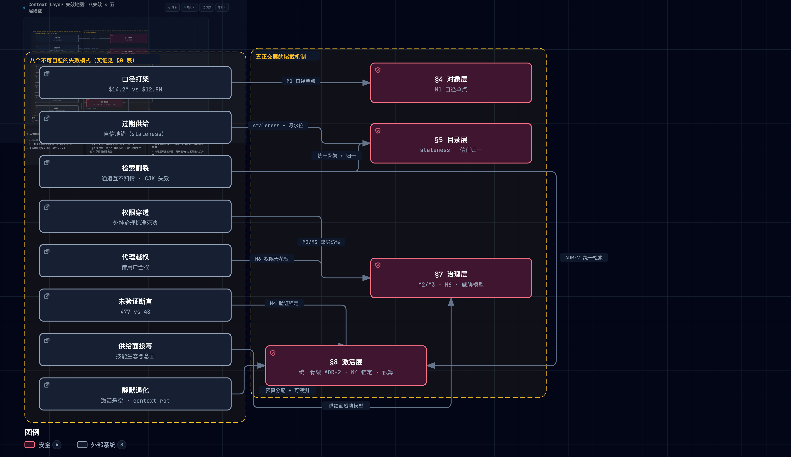

> 图源：[`context-layer--failure-map.mmd`](../../assets/mermaid/cognitive-context/context-layer--failure-map.mmd) · 交互版：[`html`](../../assets/architecture/cognitive-context/context-layer--failure-map.html)

## 1. 术语与范围：五源分类法

三个定义分层：学术侧，上下文 =「任何可用来刻画实体情况的信息」（Dey 2001 经典定义，上下文感知计算公认锚点）；工程侧，上下文 =「从 LLM 采样时所纳入的 token 集合」，上下文工程 =「在推理期间策划并维护最优 token 集合的一组策略」（Anthropic 官方定义）；产品侧，context layer =「把企业所有杂乱数据接起来，在其上加一层帮助 agent 理解业务逻辑的上下文层，并把它**打包成可供给 agent 的形态**」（a16z 2026-03-10 定名文，逐字——注意三动词链 tie together / add / **package**，「供给封装」常被二手转述丢掉）。命名未收敛（context OS / context engine / contextual data layer / ontology 并存，a16z 自认概念同一）；**本文立场**：术语收 a16z 宽定义，工程落「五源 + 三轴」（§3），context ⊃ semantic——指标定义可硬编码的部分只是子集，Agent 自主性所需的 canonical entities、tribal knowledge 指令、治理指引都在超集内（a16z 原文）。

> **ADR-5：Agent 运行时上下文按五源分类。** instruction（身份与规程：system prompt、约定文件、指令版本）· memory（记忆：画像 Core Block、事实 Facts、情景/程序性记忆）· knowledge（知识：文档 chunks、知识图谱实体关系、corpus）· tools+skills（能力：工具 schema、技能三级披露）· session（会话：历史、状态、压缩产物）。每源有独立信任信号与治理面；**归一层做 per-source 标准化，不发明新信号**（信号清单见 §5）。与 Atlan 五层口径（system/session/memory/artifacts/on-demand，2026-04）同构对照：其 artifacts「运行时引用不拷贝」纪律被本蓝图采纳并泛化为运行时资产。

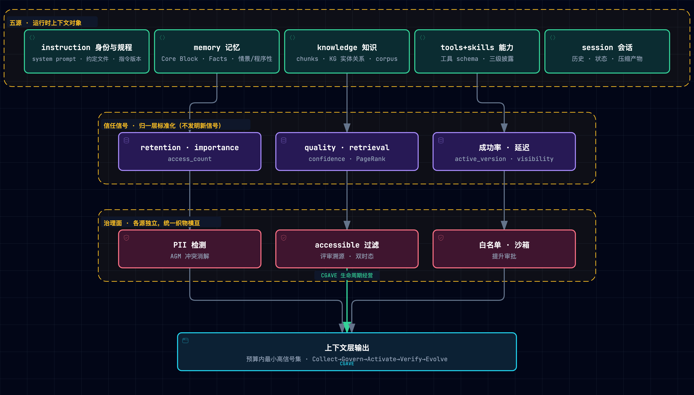

> 图源：[`context-layer--five-sources.mmd`](../../assets/mermaid/cognitive-context/context-layer--five-sources.mmd) · 交互版：[`html`](../../assets/architecture/cognitive-context/context-layer--five-sources.html)

| 维度 | 是什么 | 不是什么 | 本仓口径 |
| :--- | :--- | :--- | :--- |
| 定位 | 五源上下文的治理+编排织物 | 替代各子系统的新引擎 | 横亘 Memory/KB/KG/Tools/Skills |
| 存储 | 复用宿主存储（视图+指针） | 新建向量库/图库 | 复用 PostgreSQL |
| 检索 | 统一路由+归一化排名 | 重写各子系统算法 | Planner 双通道 |
| 数据 | 逻辑视图+指针 | 物理复制（防 Split-Brain） | ADR-1 三视图 |
| 治理 | 引擎级执行（含回退路径） | 应用层可选检查 | ContextGuard 必经（§7，未落地） |

> [!WARNING] **范围外**：identity resolution（多源身份归并）与长期记忆引擎本体不纳入（宿主承担）；不替代各子系统检索；不做数据平面与训练。本仓改动全部 **additive + 特性开关 + fail-soft**（§15）。a16z 在范围声明中自认本文只写「连接传统记录系统的数据上下文」，并把「捕获组织的决策与工作流逻辑，从而构建真正基于组织全部数据与决策上下文的通用 agent」列为同等重要且交叠的另一半（意译，原文见参考[1]）；本文正是把那一半——Agent 运行时上下文——作为第一性对象（此迁移为本蓝图立场，非 a16z 原义）。

## 2. 业界格局与判据（2026-09 快照）

格局判据先立：四条路线的功能清单越来越像，真正分野在**治理这道工序发生在哪一层**——装错层的路线各自预置了失败模式（内嵌绑死引擎；定义即代码不在执行路径、价值后置；元数据平面只描述不执行；独立层要自己挣采用）。

| 路线 | 治理发生处 | 代表 |
| :--- | :--- | :--- |
| 平台内嵌 | 引擎内 | Databricks UC+Genie；Fabric IQ；Looker；AWS Context+开源 Accelerator |
| 定义即代码 | 转换层 | dbt MetricFlow（YAML 版本化、PR 评审；已并入 Fivetran） |
| 独立可执行层 | SQL 生成前 | Cube（主张治理须在 SQL 产生之前——事后扫描可被子查询/CTE 绕过；口径承袭社区共识转述，非逐字引文）；AtScale |
| 跨系统元数据平面 | 元数据平面 | Atlan（Context Lakehouse 产品族）；Alation；DataHub |

异类 **Palantir Ontology**：semantic（描述世界）+ kinetic（做动作）双层、decision lineage 贯穿。（厂商清单为 2026-09 公开口径综述，个别条目如 Fabric IQ/AWS Accelerator 未逐一独立核验，标注承袭。）四条路线在同一处收敛：**把治理往 SQL 生成之前挪**。**本蓝图落位**第三条（可独立部署的可执行层），吸收各家长处——版本化纪律（§4）、四层信号（§5）、出口治理与动作思想（§7）；理由两句：不绑引擎才服务任意平台，治理在生成之前才防得住绕行。

2026 增量：Forrester "The Next Evolution of AI Will Rely on Context Layers"（2026-08，题名即立场：AI 的下一步演化将依赖上下文层）；Gartner「语义连贯的上下文将成为成本控制与信任策略」（2026-05 转引）；**传输之战 vs 含义之战**（Colrows）——MCP/Ossie 等传输件与格式件是可替代商品（竞对全员同构），正确性硬保证必须来自定义层（M1 类）+ 治理执法（M2/M3/M6 类）+ 验证锚定（M4 类），蓝图的承重预算应投在含义侧。落地断层是组织问题（97%/4% 口径见 §0）：上下文工程横跨 data/platform/AI/product 四类团队而无单一 owner——「问五个人谁拥有 Agent 运行所依赖的上下文，会得到五个**不同**的答案，很少有『是我』」（Redis who-owns 博文开篇句，2026-09-01；直链 404、经搜索索引二手重建）——解法方向是 shared ownership（§10）。

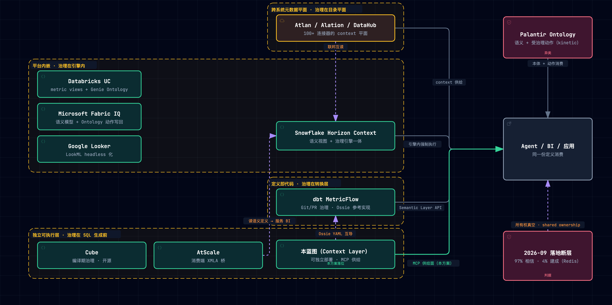

> 图源：[`context-layer-blueprint--industry-landscape.mmd`](../../assets/mermaid/cognitive-context/context-layer-blueprint--industry-landscape.mmd) · 交互版：[`html`](../../assets/architecture/cognitive-context/context-layer-blueprint--industry-landscape.html)

## 3. 总体架构：三轴蓝图

**ADR-4：三轴正交架构。** 对象轴（五源，§1）回答「经营什么」；结构轴（五正交层）回答「怎么组织」；时间轴（CGAVE 生命周期）回答「怎么流动」。三条轴各自独立变化（换检索算法不动权限模型；新增上下文源不动层结构；调演进节奏不动对象定义），失效模式表（§0）是三轴的验收面。

**结构轴五层口诀**：**对象（放什么）、目录（怎么找）、富化（怎么养）、治理（怎么信）、激活（怎么用）**。拆五层的理由与 Horizon 三相同构：五个维度独立变化、机制与策略分离、各层独立演进；治理织物横亘五源（§11 实例化）。

**时间轴五段**：**Collect 采集**（五源汇聚元数据与信号）→ **Govern 治理**（口径单点、可见性、注入纪律）→ **Activate 激活**（预算分配、渐进披露、按需检索）→ **Verify 验证**（应答锚定、可观测、eval）→ **Evolve 进化**（双轨富化、自纠环、冲突裁决）。**辨析**：时间轴的 Govern（工序——何时治理）与结构轴的治理层（§7 四机构——治理机制住在哪里）同名异义：前者说「治理动作在生命周期各段织入执行」，后者说「治理能力作为独立可演进的一层存在」；§9 的「治理 ≠ 验证」指前者管不住后者的验证面。与 a16z 五步（access→auto-construct→human-refine→connect→self-update）、Context Engineering 三支柱（Collection/Management/Usage）同构——**三支柱验证环全缺、进化环仅弱覆盖（self-baking 近似），本蓝图显式补全两环**；与 Horizon 三相（Collect→Enrich→Activate）的关系：Govern 织入三相全程、Verify/Evolve 是显式补环。

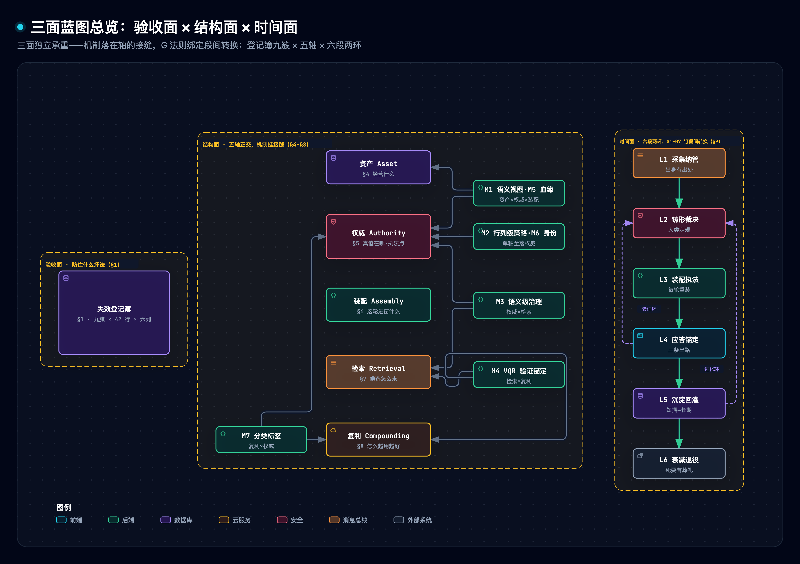

> 图源：[`context-layer-blueprint--architecture.mmd`](../../assets/mermaid/cognitive-context/context-layer-blueprint--architecture.mmd) · 交互版：[`html`](../../assets/architecture/cognitive-context/context-layer-blueprint--architecture.html)

### 3.1 spine：层 × 机制 × 实例总映射

两个易误读判定先讲明：其一，M4 是**双落点**——验证问答的字段登记在对象层（在册），出示行为在激活层（应答）；其二，M5 血缘在 Horizon 是独立承重席，蓝图落位于目录层 Structural 信号位——**归位非降格**：事后问责链职责不变，并进统一索引总账。

| 蓝图层 | 机制锚 | negentropy 承载（核验 2026-09-27 @57987b28b） |
| :--- | :--- | :--- |
| §4 对象层 | M1 | definitions registry ✅；三字段纪律 / verified QA 🔶 |
| §5 目录层 | M5 + 四层信号 | 三视图 + 信任归一 🔶；CJK 分词缺口（ISSUE-196） |
| §6 富化层 | 011 §3.1 | patrol/Judge 闭环 ✅；冲突浮出面 / 会话巩固断链 🔶 |
| §7 治理层 | M2/M3/M6/M7 | scoped∩accessible ✅；ContextGuard / 策略对象化 / 身份天花板 🔶 |
| §8 激活层 | M4 + 011 §3.2/§3.3 | L1 披露 ✅、L2·L3 🔶（ISSUE-194）；Router/统一检索 🔶 |

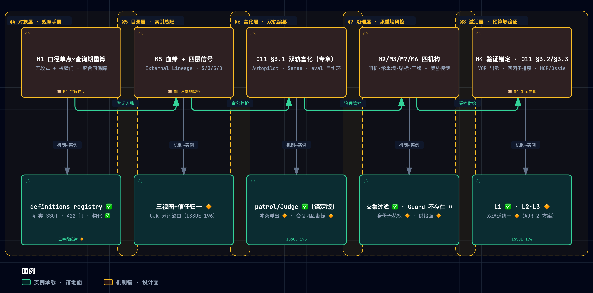

> 图源：[`context-layer-blueprint--layer-mechanism-map.mmd`](../../assets/mermaid/cognitive-context/context-layer-blueprint--layer-mechanism-map.mmd) · 交互版：[`html`](../../assets/architecture/cognitive-context/context-layer-blueprint--layer-mechanism-map.html)

### 3.2 四范本矩阵

本蓝图不只有一个范本——四个各自承重：

| 范本 | 承重贡献 | 一句定位 | 详解 |
| :--- | :--- | :--- | :--- |
| **Snowflake Horizon Context** | 治理与验证的机制词表（M1–M7）；「含义层执法」「验证锚定」「权限天花板」 | 把 Catalog 从资产登记簿升维为「理解系统」（*"a working model of your entire business"*） | [011](./011-horizon-context.md)（冻结） |
| **OpenViking** | 会话记忆一等公民；L0/L1 渐进摘要与新鲜度冒泡；会话两阶段提交与确定性身份记忆提炼 | 把资源/记忆/技能装进一棵可寻址目录树的上下文数据库 | [014](./014-openviking.md)/[015](./015-openviking-mapping-negentropy.md) |
| **Claude Code**（教学课程仓逆向） | 运行时装配纪律：每轮重装配、谓词驱动、渐进披露两层寿命、压缩四步、写权收归 harness、信任边界段、subagent 隔离 | 「每一轮都把台面从头重读一遍——看见什么从来不是模型自己说了算」 | [170–175](../agent-harness/170-claude-code-harness-overview.md)（三级证据：闭源分析须带归属） |
| **Hermes / Jev** | 装配的缓存经济学（三段式+唯一断点）；供给两端防注入；零 LLM 原文检索；置信量纲与弃权语义 | "Built once per session and reused across turns (only context compression triggers a rebuild)" | [190/191](../agent-harness/190-hermes-agent.md)、[200/201](../agent-infra/200-jev-system-one-model.md) |

Horizon 演进三阶段一句各（详锚 011 §4.2）：①语义对象化（定义+校验门铸成受治理对象）→ ②治理内嵌与双轨富化（策略下沉、Autopilot/Sense、2026-06-02 定名）→ ③生态开放（Ossie 入 Apache、外部血缘、出厂附件）。次序启示：**先造对象（定义+校验门）→ 再装治理与富化 → 最后开生态**——本蓝图双轨路线（§15）同序。

### 3.3 时间轴：CGAVE 流水线

Collect 汇聚五源元数据、血缘与行为信号；Govern 把口径、可见性、注入纪律铸进对象与出口；Activate 在预算内装配（预取+按需双通道）；Verify 对产物锚定与观测；Evolve 由反馈与富化回写对象。五段不是串行流水——Govern 织入全程，Verify/Evolve 形成闭环（「采集→治理→激活→验证→进化」大回路）。

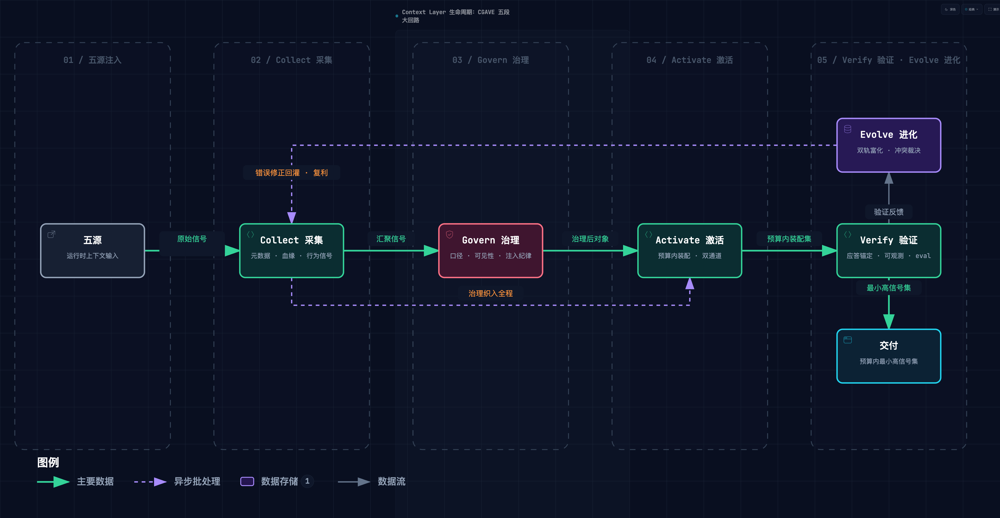

> 图源：[`context-layer--lifecycle.mmd`](../../assets/mermaid/cognitive-context/context-layer--lifecycle.mmd) · 交互版：[`html`](../../assets/architecture/cognitive-context/context-layer--lifecycle.html)

四层信号是流经五段的**原料**：Structural（有什么、怎么连）/ Operational（调用与新鲜度）/ Semantic（定义与口径）/ Behavioral（热度与反馈）（含义详 011）。本仓表级来源见 §11.2。

---

## 4. 对象层：口径单点与定义即对象

### 4.1 机制 · M1 双不变量（口径单点 × 查询期重算）

语义视图这本规章手册是同一册子的两半：**前半「口径单点」**——权威规章只印一本（五段式 `TABLES/RELATIONSHIPS/FACTS/DIMENSIONS/METRICS`），注册期过结构校验门（FK 指向键列、禁循环、跨粒度嵌套声明等——非法结构注册期被拒不进运行时，D6）；**后半「查询期重算」**——手册本身就是计算器：翻到哪条规章当场按底层原始凭证套算，不存冻结数字。为什么两半合一：**声明唯一与计算正确是两条可各自独立失效的底线**（Looker 对称聚合可显式关闭、dbt 遇 fan-out 拒答、Cube 无匹配回退底表——定义层已商品化，**差异化全在执行半边**）。四条聚合保障的因果（D1/D2/D3/D7 逐一实测，详 011 §2 M1）：先聚后连（fan trap：\$100 订单因关联 3 条事件被 join 放大成 \$300）、distinct 数集合不数行、derived 先聚后除、半可加末快照（`NON ADDITIVE BY`——正是 §9 的 477 vs 48 机制）。

**字段五设计**（agent 检索面）：`SYNONYMS`（别名是受治理上下文）、`AI_VERIFIED_QUERIES`（人工核验问答对，§8 主角）、`AI_SQL_GENERATION/QUESTION_CATEGORIZATION`（提示词内嵌定义、随定义治理）、`PRIVATE|PUBLIC`、`NON ADDITIVE BY`。行业实践：对象格式对齐 Apache Ossie YAML（50+ 组织，携带是今日唯一现实通道、保真度边界见 011 §3.3）。

### 4.2 设计 · 通用对象模型与 Core Block 三问

五段式的泛化——任何「agent 推理所需的受治理含义」都是对象：

```yaml
# 对齐 Apache Ossie YAML 风格示意
id: metrics/net_revenue
kind: metric                      # definition | metric | doc | skill | qa | policy
synonyms: [净收入, net sales]      # 召回别名是受治理上下文
spec: {metrics: [{name: net_revenue, agg: sum, expr: "gross*(1-discount)", non_additive_by: [day]}]}
instructions: "聚合先于 join；默认走 buyer 关系"   # 随定义分发的 agent 指令
verified_queries: [{question: "net revenue by month", verified_by: "data-team@…", verified_at: 2026-08-20}]
visibility: {level: public}       # public | private | roles
tags: {domain: finance, owner: data-platform}
provenance: {source: governed, authority: 1.0}    # governed | inferred | legacy
version: 12
```

三条字段纪律：①**synonyms 必填意识**——无别名即检索面隐形；②**instructions 随对象走**——指令随定义分发才能随定义治理，写死 prompt 等于治理外开第二个口径源；③**verified Q&A 带溯源**——谁核的、何时核的随对象携带。结构校验门同 §4.1：非法结构注册期被拒不进运行时。

> **常驻记忆对象的设计取舍（Core Block 三问，承接 191 M2）**：①**由谁写**——三路：Agent 自编辑（`core_block_replace` 工具，`updated_by="agent_self_edit"`）、管理端 REST、append 追加；**开放 Agent 自编必须后置于写入防注入**——「开放可自编的常驻记忆而没有写入扫描，等于给注入开一条常驻通道」（本仓 191 映射报告的判语，非 Hermes 原文；core_block_replace 当前零调用方，如实标注）。②**上限多少**——存储级单块 2048 token（介于普通段落 256 与 Letta 4000 之间的显式选位，防单块主导窗口）+ 组装级记忆预算 30% 硬帽两级预算。③**写满怎么办**——按 token 比例 ×0.95 截断并标 `metadata.truncated` 留痕，**不拒写、不静默**。两级预算 + 截断留痕是「常驻内容不挤占检索内容」的可复用范式。（锚：`core_block_service.py` 设计取舍段、`memory-integration.md §4`、025 §5.1 λ 表 core=0.0 不衰减。）

#### 4.2.1 Data Contract

数据契约五件套 = schema + 质量阈值 + 语义（绑 canonical）+ lineage + 访问；per-agent 授权在交付点执行。破坏性变更走弃用纪律，不许静默改口径。边界如实：**没有结构性工具原生在推理时强制语义契约**——锁必须焊在激活层与治理层执行路径上。

### 4.3 negentropy 实例化：definitions registry

| 项 | 状态（2026-09-27） | 锚 |
| :--- | :--- | :--- |
| 4 类定义 SSOT（skill_template/routine_preset/harness_skill/agent 单表） | ✅ | [`models/definition.py:27`](../../../apps/negentropy/src/negentropy/models/definition.py)；迁移 0095–0099 |
| 注册期领域校验（422 拒入库，create/update 双路） | ✅ #2 | [`registry.py`](../../../apps/negentropy/src/negentropy/agents/definitions/registry.py)；`definitions_api._parse_or_422` |
| 定义激活物化（DB→`.agent/skills` 幂等渲染、路径穿越硬防、fail-soft） | ✅ #3 | [`harness_materializer.py`](../../../apps/negentropy/src/negentropy/agents/definitions/harness_materializer.py)；NE_AGENTS_FROM_DB 已 default-on（旧文「flag-off」口径过期，此为 2026-09-27 修正） |
| synonyms/instructions/verified QA 三字段纪律 | 🔶 #1 | `definitions.meta` JSONB 可承载、无纪律 |
| 声明式聚合纪律 | ⏸ #4 | 触发：出现「派生口径」类资产 |

判定：definitions 表已是 4 类定义 SSOT（与 semantic view 元数据对象同构——**「DB 为源、盘为投影」**：整段源文本入库+编辑器维护+注册期 422 门，盘上文件是幂等生成物）。差异在字段面：Horizon 把 agent 检索面做成对象字段，本仓 meta 可承载但无纪律。物化只写不删——定义禁用后盘上旧目录残留（091 M13 已知缺口）。

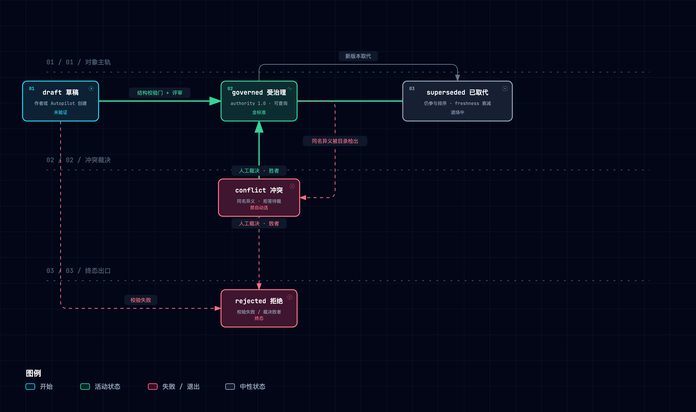

> 图源：[`context-layer-blueprint--object-lifecycle.mmd`](../../assets/mermaid/cognitive-context/context-layer-blueprint--object-lifecycle.mmd) · 交互版：[`html`](../../assets/architecture/cognitive-context/context-layer-blueprint--object-lifecycle.html)

## 5. 目录层：统一索引与信任归一

### 5.1 机制 · M5 端到端血缘

引擎执行语句自动沉淀对象/列级依赖边（执行副产品，非人工登记，ad-hoc 无盲区），`GET_LINEAGE` 程序化取数；外部 OpenLineage 事件经三道闸（INGEST 权限/只收 COMPLETE/对象可解析，任一不满足整事件拒绝——D8：拆掉可解析闸，虚构对象 ghost 入账，账本与真实数据流脱钩）。**预防类机制（§7）拦事前，台账管事后**——答案对不上时能溯源、上游变更时爆炸半径能定位。盲区如实：ML notebook 不进血缘、上游定位止步仓库边界。置信度分轴：官方定调先行、独立确认待积。

### 5.2 设计 · 逻辑视图、四层信号与信任归一

**ADR-1（保留）：Context Catalog 用 PostgreSQL VIEW 实现，不新建物理表。** 元数据已存 PG，新表=副本=Split-Brain 引信；引用一律轻量指针；Horizon Catalog 本身也是元信息层。OpenViking 对照：viking:// 的寻址语法可借鉴（scope 前缀推导类型、确定性 ID、位置即语义），但其副本式 AGFS 存储与 ADR-1 正面冲突——**只取格式不取存储**（015 结论）。

信任归一（未落地，三纪律 #11）：①authority 区分 governed/inferred；②popularity log1p 有界（防多数派错误放大——排序侧反模式与 §6.1 冲突裁决纪律同根：D4 实测被 500 条查询使用的错误 join 压过 3 条的正确模式）；③freshness 单一 staleness 口径。**归一层不发明新信号，做 per-source 标准化**——五源现成信号清单：Memory=retention/importance/access_count；Fact/KG/canonical=confidence+valid_from/valid_until+supersede 链；KG=PageRank+社区+证据支持；KB=retrieval_count+is_enabled+quality（现多 NULL）；Tools=成功率/延迟；Skills=active_version/visibility。跨源 freshness 语义不对称是归一层最硬的设计题：KG 有双时态 as_of、Memory 仅 last_accessed_at 非 bi-temporal、KB 连 last_accessed_at 都没有。

> [!WARNING] **CJK 分词口径（ISSUE-196 销账）**：本仓 memories 与知识库的 tsvector 均为 english 配置——PG 把连续汉字切成**单个 token**，`to_tsvector('english','用户偏好先给结论，少铺垫')` 产出 `'少铺垫':2 '用户偏好先给结论':1`，子串查询 `先给结论` 匹配 `f`（PG 16.14 实测，实心）。后果：中文混合检索退化为纯向量、BM25 融合权重空转；记忆侧有 ILIKE 回退兜住子串，**知识库无回退、关键词腿全量失效**。修复候选三选一（另行评审）：①pg_trgm/pg_bigm 索引；②入库 CJK bigram 预切分入 simple 配置独立列；③纯 CJK 查询路由 trigram/LIKE 回退（Hermes 三级回退同款）。防范：从英文语料移植检索 schema 时把「分词配置 × 目标语言」列为显式核对项；混合检索回归测试须含中文子串用例并单独断言 tsvector 腿。

### 5.3 negentropy 实例化

三视图（`context_catalog_unified` / `context_trust_signals` / `context_access_log`，纯 SQL 只读）与信任归一均未落地（🔶，迁移目录无对应 CREATE VIEW）；五源信任分设计保留为 §15 Phase 1 落地项（`staleness=min(1,days/90)`，`∥` 空值回退）：

| item_type | 信任分 |
| :--- | :--- |
| Memory | `0.4·retention + 0.3·importance + 0.3·(1−staleness)` |
| KB chunk | `0.4·(quality∥0.5) + 0.3·min(1,retrieval/10) + 0.3·(1−staleness)` |
| KG entity | `0.5·confidence + 0.5·(importance∥0)` |
| Tool | `0.6·success_rate + 0.4·(1−min(1,p95/5000))` |
| Skill | `1.0 if active_version else 0.7` |

现状锚：仓内 RRF 真实落点四处——`hybrid_planner.py` 三路融合、`memory_service.py` hybrid+PPR 融合、KB `repository.py` 的 `rrf_search` SQL、`memory_service` 检索配置同款（「RRF 对分数尺度不敏感」是其跨源归一的理论支点，036 §2.5）；`unified_search.py` **无 RRF**——它是权限门+意图路由+ILIKE 简化实现（其自述「简化实现…生产环境应接入现有 RAG 检索管道」），蓝图分层时勿高估其职责。

## 6. 富化层：双轨编纂与冲突契约

### 6.1 机制 · 双轨富化（详解 011 §3.1）

专家手写规章权威但覆盖不动长尾——Snowflake 内部实测全司 9,685 张表人工语义视图覆盖 **<5%**（虚线；Autopilot GA 之后的现态，证明显式轨道单独不闭合供给缺口，不是 Autopilot 无价值）。两条轨道：**显式**（Autopilot：现成报表与历史问答起草规章草案，候选过验证门）与**隐式**（Cortex Sense：从查询习惯提炼暗知识，「只摄取元数据与使用模式，不碰数据行」——隐私边界句可直接沿用）。三层纪律：①eval 自纠环；②**冲突强制浮出人工**——起草规章与民间口径打架时系统绝不准自作主张：CONFLICT 卡片并列两定义、无数值、拒答待裁，**禁按 popularity 自动选**（D4 实测：自动选让错误口径胜出）；③governed 权重压倒推断。

### 6.2 设计 · 会话巩固三件套（015 §6 + ISSUE-195 销账）

会话是五源中唯一**自己产生新上下文**的源——「会话→长期记忆」链路是富化层的供给入口。本仓实测断链：`add_session_to_memory` **零调用方**（含 ADK Runner 与 UI/BFF 逐一核验）、`consolidation_jobs` 只入队无消费者（ISSUE-195，实心）。修复设计（零新表，复用 title_inspector 范式）：

1. **trigger 触发器**——「事件水位差 ≥Δ 且空闲 ≥T」选会话（复用 `title_inspector` 的水位范式）；
2. **consumer 消费者**——`FOR UPDATE SKIP LOCKED` 出队执行 `_simple_consolidate`（表与部分索引已存在，迁移 0043/0044）；
3. **watermark 水位**——`threads.metadata.consolidated_at_event_seq`（同构 `title_generated_at_event_seq`），**提交点最后写**（OpenViking `.done` 语义：两步都成功才落水位，防至少一次投递下事件卡重复——B6 实测）。

巩固 diff 写 `consolidation_jobs.result` 并接 UI 消费方（否则是摆设）。二阶风险：每会话新增一次 embedding+LLM 提取须 Δ/T 封顶；单 uvicorn worker 下消费者须是异步限流后台任务；巩固后 preload 检索噪声观察 `memory_retrieval_logs`。配套修复：015-D3 `force_refresh=True` 因签名无此参数抛 TypeError 被静默吞掉——把 24h TTL 换成源水位判据（OpenViking 新鲜度冒泡同构：子项 L0 digest 未变即 NOOP、pending 比例达阈值才刷新）。

记忆合并的身份判据（OpenViking 照鉴）：**相似只提名候选，同一性由 schema 身份字段裁决**——URI 由身份字段确定性生成，「是否同一条记忆」降维成「文件名是否相同」；OpenViking 实验室 B3 实测拆掉身份判据后三次来访落三张矛盾卡。按 memory_type 定合并算子（events/trajectories 只增不改——宁可重复不可错并；experiences replace+supersedes）。本仓阈值去重（cos≥0.85/0.90）为主干、LLM 裁决只值得用于模糊带 0.80–0.90。

### 6.3 negentropy 实例化：patrol 巡检闭环

| 项 | 状态 | 锚 |
| :--- | :--- | :--- |
| eval 自纠环同构（评分→终态→失败记忆→reconcile；锚定版 Judge：证据先于给分+轨迹 ±10 一致） | ✅ #7 | [`evaluator.py`](../../../apps/negentropy/src/negentropy/engine/routine/evaluator.py) · [`pdf_fidelity_patrol.py`](../../../apps/negentropy/src/negentropy/engine/schedulers/handlers/pdf_fidelity_patrol.py) |
| 冲突浮出面 | 🔶 #8 | `_reconcile_patrol_status` 以胜者规则**静默收敛**（succeeded/95 被 failed/2 覆盖的实例在案）——冲突只被治愈、不被浮现，无 CONFLICT 面 |
| 验证问答供给侧（巡检 done 沉淀问答对） | 🔶 #10 | 沉淀后激活面按 §8 命中短路 |
| 隐式挖掘轨道 | ⏸ | 触发：显式覆盖不动（<5% 现象） |

## 7. 治理层：执法点与供给面

四家机构各守一条正交不变量，每条都配亲手拆坏它的破坏实验：

| 机构（机制） | 不变量 | 破坏实验 |
| :--- | :--- | :--- |
| 闸机（M2 行列级策略） | 客体可见性：策略在引擎层对每个调用方生效（「不存在为 AI 工作负载单独配置的治理」——官方） | D5（拆执行面→intern 泄露） |
| 承重墙（M3 语义级治理） | 定义出口必经同一执法点：语义活在治理引擎内、查询期强制执行而非拷贝缓存；底表策略自动传播到语义视图 | C2（双层防线自证：检索层把 PRIVATE 资产滤出建议、intern 直闯执行层仍 AccessDenied——引擎是最后防线） |
| 贴标（M7 分类标签） | 发现→标记→执行不断链：自动分类打系统标签→一次性映射到治理标签→策略一处绑定全库生效 | D10（映射置空→已贴标仍明文出楼） |
| 工牌（M6 Agent Identity） | 代理会话权限=用户权限∩任务允许面、**只减不增、实时求值**（RSS 官方定义：不替代 RBAC、不能授予用户没有的权限） | D9（快照式→回收后仍持权） |

### 7.1 双层防线与身份正交

**双层防线**：检索层过滤是体验（无权者不见 private 对象），执行层拒绝是底线（必经 RBAC）——「检索藏起来但执行层照样跑」是外挂治理标准死法。**身份正交**：agent_type 表达「用什么运行时形态装配」（构造期元数据），不是「被允许做什么」（运行期权限）——本仓 `permissions*.py` 全文零 agent_type 引用（实心核验）；权限真锚=required_tools 集合差+owner/visibility 过滤+TOOL_REGISTRY 白名单。蓝图谈 Agent Identity 时保持类型学与授权分层，防类型字段被误用为权限捷径。

### 7.2 供给面威胁模型

经 MCP/技能开放供给面，攻击面前移。最重要的纪律：**供给内容的自述默认不可信**——MCP 规范明文「clients MUST consider tool annotations to be untrusted unless they come from trusted servers」（2026-07-28）；技能生态实测：98,380 个技能扫描 157 恶意、632 漏洞、平均每恶意技能 4.03 个漏洞（USENIX，实线）；Snyk 抽样 3,984 个社区技能：76 个确认恶意、36.82% 存在任意级别安全问题、其中 13.4% 含 CRITICAL（虚线，扫描口径非全生态普查）；四家头部客户端（Gemini/CC/OpenAI/VS Code）**零家验签**（实心，四家实测口径不外推 showcase 46 家）。

| 威胁 | 拦截位 |
| :--- | :--- |
| 工具/技能描述投毒（含隐形字符、伪字段注入） | 元数据按不可信输入处理：行级清洗+激活工具枚举约束；定义哈希钉住+注册期评审 |
| 间接注入（记忆/摘要/通知成为持久化注入） | **注入信任边界段**：「资料非指令」声明随每类注入配套；写入端威胁模式扫描（先于巩固上线——否则给注入开常驻通道） |
| confused deputy | 每客户端同意+精确 redirect 匹配；动作点风险分级强确认 |
| token 透传/窃取 | MCP 2026-07-28 三连 MUST NOT 禁令：每个上下文源独立受众绑定凭据（RFC 8707），令牌不跨源复用 |
| 状态句柄冒充认证 | 无状态化后「持有句柄≠认证」；句柄绑 verified-token 主体+HMAC/AEAD |

**SEP-2640 硬边界**（技能/MCP 侧最终文本）：「Hosts MUST NOT treat a digest match as a security boundary」——digest 只证明一致不证明可信（同域自算自存）；content-bound approval（持久批准绑定批准时刻 resources 全集 digest，任何增删即撤销重批）是「批准随内容冻结」的可移植模式。本仓现状：无外部下载面=无传输完整性攻击面（**幸运而非设计**）；接入外部技能分发之日缺口即刻兑现（写成显式触发条件）。MCP 2026-07-28 硬化增量：无状态核心（能力/版本/身份每请求自描述）、MRTR 取代服务器主动请求、DCR→CIMD 注册换代、特性三态+≥12 个月弃用窗口+弃用注册表（能力演进治理模板，§10 复用）、deterministic tools/list 直接服务 prompt cache 命中率（缓存确定性是接口契约非实现细节）。

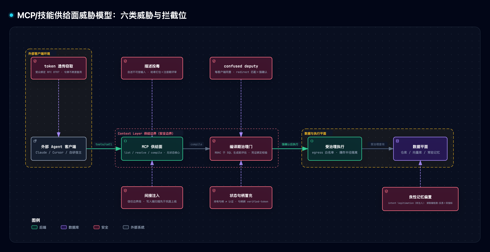

> 图源：[`context-layer-blueprint--mcp-threat-model.mmd`](../../assets/mermaid/cognitive-context/context-layer-blueprint--mcp-threat-model.mmd) · 交互版：[`html`](../../assets/architecture/cognitive-context/context-layer-blueprint--mcp-threat-model.html)

> [!WARNING] **边界**：「不可绕过」只在引擎周界内；per-role 未交付；排序可能放大多数派错误（以 §13 为 SSOT）。

### 7.3 negentropy 实例化

| 项 | 状态 | 锚 |
| :--- | :--- | :--- |
| 检索层过滤（scoped∩accessible 双锚+空集空返） | ✅ #5/6 前半 | [`hybrid_planner.py`](../../../apps/negentropy/src/negentropy/agents/tools/hybrid_planner.py) 模块头「权限红线」· [`unified_search.py`](../../../apps/negentropy/src/negentropy/knowledge/retrieval/unified_search.py) `accessible_corpus_ids` 文档串。注意：accessible 集合现为 app_name 全量兜底（`perception.py:404`），Phase 2 接用户 RBAC——**交集机制已实装、来源仍粗粒度**两层事实分开表述 |
| ContextGuard 出口守卫 | ⏸ #6 | `engine/context/` 目录不存在（2026-09-27 实心核验）；PIIGatekeeper（按消费者 ACL 变形内容）是其直接先例 |
| 策略对象化 | 🔶 #5 | `accessible_corpus_ids` 是调用约定参数非策略对象 |
| 调用方身份天花板 | 🔶 #15 | agent_type 是 preset 元数据非权限契约 |
| 定义敏感分级 | ⏸ #16 | 触发：规模化对外供给 |

## 8. 激活层：预算、检索与验证锚定

### 8.1 装配经济学（ADR-6）

> **ADR-6：上下文供给是成本结构决策。** 五个旋钮（按「窗口免费后是否仍承重」分两类：注意力质量类——①②的预算与披露语义、检索质量——恒承重，因 context rot 是注意力架构属性；成本类——④缓存排序与③的省钱动机——随单价消失而失效；设计按前者对齐）：
> 1. **预算分配**——本仓 ContextAssembler 三段 30% memory/50% history/20% system（标注「借鉴 Claude Code POST_COMPACT_TOKEN_BUDGET」）+ Core Block 30% 硬帽 + Reflection 50% 预留；Horizon 整视图 ~100K token guideline（超限被剪枝、延迟与质量双伤）；工具集是预算面（bloated tool sets 是常见失败——Llama 3.1 8B 在 16k 窗口挂 46 个工具失败、19 个成功，arXiv 2411.15399 经 Splunk 转引，实线）。
> 2. **渐进披露**——L1 目录常驻（预算受控）+ L2 正文按需 + L3 资源挂载；**两层寿命不同**（正文会被压缩清掉、目录不会——「已激活≠仍在场」，须配重激活）；成本按使用数计价而非装机数（方向性实测 16.9×，chars/4 近似口径只证方向）；一条膨胀描述令目录 +255%（skills 规范实验室 B3，090 §9）——描述长度上限守护常驻面。
> 3. **JIT vs 预取的显式决策边界**——静态约定与规范 up-front（CLAUDE.md 朴素入窗）、大体量事实 JIT（轻量标识符+运行时加载器，「引用元数据本身是行为信号」）；小知识库 <200K token（约 500 页）直接全量入窗配 prompt caching（延迟 >2x、成本至多 −90%，Anthropic 口径）。
> 4. **缓存友好排序**——会变的排在不变的后面、缓存断点卡中间（Claude Code 全局断点卡在最后一个内置工具之后——闭源分析口径，社区转述）；启用前缀缓存之日，检索记忆须移到用户消息侧或按会话冻结（Hermes 三载体接力：对话记录→压缩重建→新会话快照，写回永不随写随见但永不丢失）。
> 5. **压缩分级**——零模型调用的结构操作在前、模型调用殿后（Claude Code 四步：按预算落盘→掐中段→占位符化→整体摘要；「裁剪可以丢内容不能丢结构」tool_use/tool_result 配对不拆；「大结果先落盘再占位符化」）；压缩谱系七策略（Trimming/Summarization/Tagging/Sliding Window/Semantic Filter/层次化笔记/QA 对压缩）；**本仓交互式对话零压缩**（num_recent_events 零调用方，191 M11 🔶 最高优先——引入压缩层时技能内容须同步豁免标记，丢失即静默降级）。

每轮装配是**一次预算分配决策**——进入窗口的每个 token 都有机会成本。装配纪律两条（Claude Code 范本）：**谓词驱动**（段落取舍判据是可观察运行时事实——记忆索引文件存在且非空才铺记忆段、MCP 已连才铺外接段——「装配依据是事实，不是文本」）；**装配序不变式**（先处置会丢的历史治理→再叠不能丢的记忆供给→最后装能力面工具+提示，三者同频每轮重算）。

### 8.2 检索是正确性的前置环节

三条证据立论（详 011 §3.2）：Spider 2.0 建错表（§0）；检索增强+重排把 top-20 检索失败率相对降 49%→67%（Anthropic contextual retrieval，虚线；口径 1−recall@20，5.7%→2.9%→1.9%，2024 数字只作机制有效性证据）；结构化记忆管理在 240 条消息会话保留 99.6% 关键信息 vs 无管理 54.3%（arXiv 2603.13110，实线）。机制面：四因子信号排序（relevance/authority/popularity/freshness——权威压过声量）+ top-k 硬约束 + rerank 末级信噪比闸门（初检 top-150→rerank→top-20；「更多上下文≠更好」与 attention budget 互证）。与 M4 的类目边界：VQR 候选集全部人工核验（错误面窄）故晋级验证锚定；通用检索候选集是全目录（错误面宽）——**候选集性质之别**。

### 8.3 M4 验证锚定与 resolve 契约

**核准题库**：把人工核验问答对沉淀为库内一等资产（question/sql/verified_at/verified_by），命中时以已验证查询为生成依据并透出 confidence，题库外可现算但必须显式标注「未经核准」、绝不冒充已背书；**>20 条反噬**（验证题参与匹配与生成，过量拖慢优化）。它守护「语义视图完全正确但 LLM 错引它」的独立失效面——"Governing a definition, and labeling it, is still not the same as verifying the calculation an agent runs against it"（typedef）。**resolve 契约**是 agent 侧唯一入口：`resolve(question, role) → ContextPackage{top-k, instructions, verified_query?, warnings, conflict_card?}`；无 governed 覆盖时显式返回 `no_governed_coverage` 而非静默用推断。排序公式与三纪律（authority 区分 governed/inferred、popularity log1p 有界、tie-break 显式声明）见 §5.2。**subagent 隔离**：探查类污染（大输出/死胡同）留在用完即弃的子上下文，只回蒸馏摘要（1,000–2,000 token，Anthropic 口径）——「隔离的是上下文，不是权限也不是副作用」。

### 8.4 双通道统一（ADR-2/3）与宿主更正

> **ADR-2（保留）：升级 HybridPlanner 为统一检索骨架，不新建 Router 类**——它已具备正确架构（Intent→并行种子→图扩展→RRF），Memory 作第 4 路种子源是增量扩展（接入面已就绪：search_memory 返回 clamp [0,1] 的 relevance_score 可映射 Candidate rank；缺的只有 `memory_enabled` 开关位与构造器注入槽）。
> **ADR-3（保留）：收敛语义**——自动通道给接地摘要（轻量必出）、按需通道给深度检索（显式触发），共享归一信任排名。

> [!WARNING] **宿主更正（ISSUE-195 D1 销账，2026-09-27 实心核验）**：旧版本把 `ContextAssembler.assemble()` 写成「自动注入通道」——**该函数生产调用为 0**（全仓唯一调用点是单测）。生产请求期上下文的真实装配面是 root_agent **五挂点**（instruction provider / before_model_callback / tools / telemetry callbacks / sub_agents），记忆注入的真实通道是 **NegentropyPreloadMemoryTool**（每轮以用户消息为 query 检索、top_k=5、4000 字符预算、渲染 `<RELEVANT_MEMORIES>` 块注入 system instruction）；KG 摘要近乎不可达（仅知识库 0 命中的回退分支触发）。60s TTL 三元组缓存（`subagent:<name>` 单行供 model+instruction+tools 三 resolver，负命中也缓存）+ 代码硬编码回退是「永不阻塞请求」的 fail-soft 家族设计——**代价是治理旁路面**（DB 故障与未配置下游不可区分、DB 层版本/禁用位在回退态失效），显式登记为已实装的权衡而非缺陷。assemble() 作为「按 token 预算供给的完整参考实现」保留（其 Core Block/Reflection/预算设计仍为 ADR-6 依据），但状态表按「设计存在 ≠ 已接线」口径如实标注。

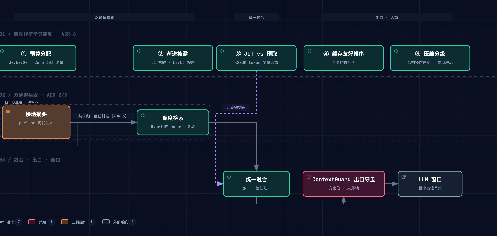

> 图源：[`context-layer--assembly-economics.mmd`](../../assets/mermaid/cognitive-context/context-layer--assembly-economics.mmd) · 交互版：[`html`](../../assets/architecture/cognitive-context/context-layer--assembly-economics.html)

### 8.5 negentropy 实例化

三层渐进披露 **L1 ✅ / L2·L3 🔶**（ISSUE-194，2026-09-27 仍未修复）：L1 目录注入运行时真实生效（`skills_injector.py` 双注入点互斥+strict 降级）；L2/L3 三件工具（expand_skill/list_available_skills/fetch_skill_resource）**从未进 TOOL_REGISTRY、无 Agent 持有**——L1 目录末行却写死「call expand_skill(name)」，模型驱动激活不可达（「只能看不能用的菜单」）；显式注入三路（REST invoke/调度器/翻译管线）可达。**教训上升为蓝图纪律：目录承诺的激活路径必须机器可验**（凡 prompt 写死工具名处，须有「目录声明工具名 ∈ Agent 实挂工具名」同构集成测试）。R6-b 二阶影响已消解（在线门重设计为离线 eval-suite holdout 优先，expand_skill 有数据时在线门自动复活）。MCP 供给面 🔶 #13（本仓是客户端 [`mcp_client.py`](../../../apps/negentropy/src/negentropy/interface/mcp_client.py)）；Ossie ⏸ #12。

## 9. 边界：治理 ≠ 验证

上游 dbt 已把明细塌缩成日汇总，distinct 用户数按天相加——semantic view 里完全正确的算式照样算出 477（重复计数）vs 真实 48（typedef 生产复现，玩具版 4 vs 3，实线）——**governed 定义在塌缩粒度上照样错**；`NON ADDITIVE BY` 是人填声明非系统推导；lineage 是「谁喂谁」的观察记录、不是「这么算合法吗」的校验；M4 只交付了验证缺口的一半（另一半 Agent Evaluations 墙外 opt-in）。三级对策：①表达式级 derived 校验（注册期标记）；②verified Q&A 作出口对账资产（验证答案 vs 引擎重算不一致即告警）；③eval 事后评分+血缘回溯（兜底）。对策思路（概括性命名，承旧版沿用）：**compiler in the loop**——编译期推导计算合法性尚无成熟方案，以 eval 环兜底，不假装解决。

**置信纪律三句**（Jev 映射，判断面同构）：供给面每个置信字段须声明来源量纲（LLM 口头/正则常数/启发式常数不可比，聚合须分组）；缺省方向必须向低置信（本仓 KG 抽取 confidence 缺省 1.0 叠加 0.5 阈值=字段缺失自动满置信通过——**方向反了**）；阈值须绑定分布锚点（校准有领地：分布内 ECE 0.031（Hume 黑盒探测·MMLU）、密封集 ECE 0.220 与 conf≥0.9 只对 42%（JevBench）——两组第三方实测）。

## 10. 评测、运营与组织

**known-answer 评测四原则**：①考题=业务问题×人工签字期望值；②用例四类齐全（歧义/隐晦 join/空结果/**越权**——期望「拒绝+审计」而非数值，最反直觉也最重要）；③golden queries 一等资产；④覆盖内/外分开判卷。KPI 唯一：**报错优于错数**。~10 题起步即可建闭环。警示：基准自身会错（Spider2-Snow 错标 62.8%、修正前后排名 Spearman 仅 0.32，CIDR 论文口径；承自 011 冻结参考，本版未重核）；eval 集会腐化，当活资产运营、锁版本。

**验收四支柱**（Redis 失效模式转译，虚线——厂商源框架可引、数字不入正文承重）：**fresh**（时效性：staleness 可观测）、**navigable**（可导航：权限是一等公民）、**fast**（延迟像正确性属性一样在 agentic 循环中累积）、**compounding**（复利：上下文越用越准）。配套观测：decision trace 与 SLO 内建进设计（「A system you cannot observe is a system you cannot govern, and a system you cannot assemble is one you cannot observe.」——Redis State of Context Engineering 报告页，直抓成功）。

**组织与运营**：metric owner=Accountable、steward=Responsible，Propose→Certify 全程留审计；反模式：glossary theatre、影子查询、无主 metric。采用处方：5–10 指标起步、业务方 day one 参与、按基础设施运营。失败史三死因：BI 厂商激励相悖；迁移数学不成立；**不在执行路径上**（最结构性——与 §2 判据互为呼应）。所有权真空的解法方向：shared ownership——上下文工程横跨四类团队，蓝图四职责（供给/治理/激活/验证）本身就是分工面。

## 11. negentropy 实例化总装：治理织物横亘五系部

核心论断（保留）：**不从零造上下文引擎，而是把已有子系统收敛到一个治理织物（Context Fabric）之下**——五系部的上下文信号已分散存在、被各自组装，缺的不是原料，是统一的治理与编排层。各系部位置：Engine=调度中枢；Perception+KB/KG=最大供源；Internalization+Memory=记忆供源；Contemplation=eval 消费方；Action+Tools=工具信号供源；Influence=出口消费端；definitions/Skills=对象层载体（✅）。

### 11.1 五源注入点现状（015-D1 修正版）

运行期上下文由**九路来源分散装配**：身份（instruction provider）/Skills（双路注入互斥）/Tools（toolset+schema）/Model（resolver+ContextVar）/记忆（preload 工具）/会话状态（state）/定义 SSOT（graph-from-DB 工厂）/偏好/引用协议。三缺口（以 §8.4 宿主更正为 SSOT）：①检索未统一（Planner 无 Memory 种子源）；②双通道割裂（无 KB 接地）；③信任未归一（§5.3 未落地）。后果：过期记忆作答、幻觉、排名失效。

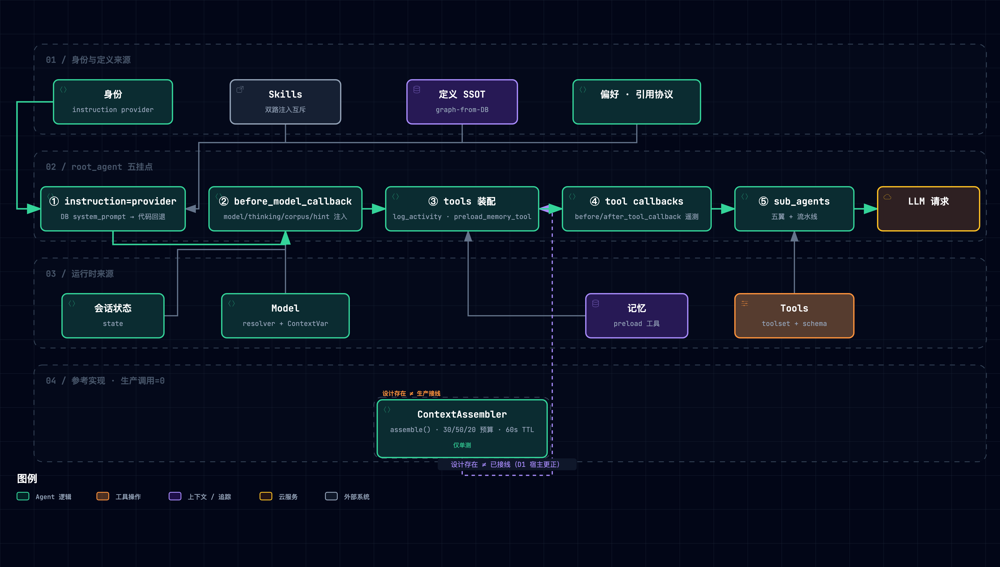

> 图源：[`context-layer--injection-points.mmd`](../../assets/mermaid/cognitive-context/context-layer--injection-points.mmd) · 交互版：[`html`](../../assets/architecture/cognitive-context/context-layer--injection-points.html)

### 11.2 运行时分层与四信号来源

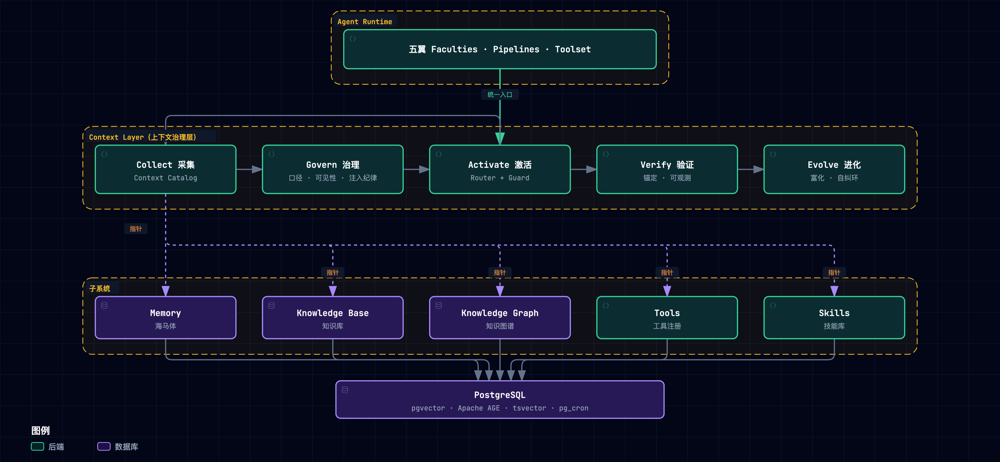

> 图源：[`context-layer--runtime-layering.mmd`](../../assets/mermaid/cognitive-context/context-layer--runtime-layering.mmd) · 交互版：[`html`](../../assets/architecture/cognitive-context/context-layer--runtime-layering.html)

| 信号 | negentropy 来源 |
| :--- | :--- |
| Structural | agents · definitions · corpus/knowledge · kg_* · memories/facts · skills · builtin_tools |
| Operational | memory_retrieval_logs · tool_invocations/stats · knowledge_feedback · retrieval/access 计数 · OTel |
| Semantic | definitions · 6 类 memory_type · 8+13 实体关系类型 · skill 模板 |
| Behavioral | retention/importance · quality/retrieval · PageRank+confidence · feedback · 成功率/延迟 |

### 11.3 五子系统上下文契约

（深潜见 [记忆白皮书](../../concepts/subsystems/026-memory-whitepaper.md) 与 [联邦 KG](../../concepts/subsystems/037-federated-kg.md)）

| 子系统 | 提供 | 信任信号 | 治理 | 缺口 |
| :--- | :--- | :--- | :--- | :--- |
| [Memory](../../concepts/subsystems/025-the-memory-system.md) | 6 类记忆+Core Block | retention·importance·access | PII 检测·AGM 冲突消解·衰减 | 无单一 staleness、非 bi-temporal |
| KB | chunks+corpus 元数据 | quality·retrieval | accessible 过滤·feedback | 缺 last_accessed_at；quality 多 NULL；**CJK 关键词腿失效（§5.2）** |
| KG | 实体/关系/canonical/社区 | confidence·PageRank | 评审·溯源·双时态 as_of | 未合成归一复合分；confidence 缺省方向反（§9） |
| Tools | 工具定义 | 成功率/延迟/成本 | 白名单·HIGH_RISK·审批 | 低频工具 stats 稀疏；审批门仅 2/N 接线（ISSUE-197） |
| Skills | 三层披露 | active_version·visibility | 沙箱校验·提升审批 | L2·L3 激活悬空（ISSUE-194）；有效性信号未回流 |

### 11.4 SSOT 边界与进化杠杆

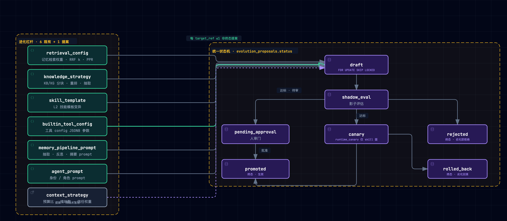

> 图源：[`context-layer--evolution-levers.mmd`](../../assets/mermaid/cognitive-context/context-layer--evolution-levers.mmd) · 交互版：[`html`](../../assets/architecture/cognitive-context/context-layer--evolution-levers.html)

复用：ContextAssembler（参考实现+`get_memory_summary`）/ HybridPlanner（统一骨架 ADR-2）/ definitions Registry / model_resolver / UnifiedRetrievalService（意图路由）。新增：三视图 / 信任归一 / ContextGuard / 会话巩固三件套。进化杠杆：6 个 TargetHandler（retrieval/skill/memory_pipeline/builtin_tool/knowledge_strategy/agent_prompt）天然映射为进化面，统一状态机（8 态：draft→shadow_eval→pending_approval|canary→[runtime_canary]→promoted/rejected/rolled_back）+ `decision.py` 纯函数守卫（无 IO、阈值硬编码、参数显式注入）；**第 7 面 context_strategy ⏸**（全仓零命中，2026-09-27 核验）——落地方案有明确插槽：一个 handler 子类+一个 decide_* 纯函数+一个 config 子开关，零改 orchestrator。可进化参数：预算比·接地片段数·信任权重·Router 阈值，每步人工审批，闭环「采集→归一→激活→行为→进化」。

### 11.5 机制 ↔ 本仓 16 条映射总表（as-of 57987b28b，2026-09-27 重核）

（源自 012（2026-09-17）→ 013 旧表（2026-09-20）→ 本表（2026-09-27）；✅ 对齐 / 🔶 部分或方案 / ⏸ 暂缓。**本表完成 ISSUE-195 ④ 的 #9 行校正**）

| # | 机制 | 本仓对应 | 判定 |
| :--- | :--- | :--- | :--- |
| 1 | M1 五段式（§4） | definitions SSOT | 🔶 部分 |
| 2 | M1 校验门（§4） | parse_definition 422 拒落库（create/update 双路） | ✅ |
| 3 | M1 物化（§4） | harness_materializer 幂等渲染；agent 面 NE_AGENTS_FROM_DB default-on（root_agent 自 DB 构造，与物化开关分属两面） | ✅ |
| 4 | M1 重算（§4） | 无（非指标栈） | ⏸ |
| 5 | M2 策略（§7） | accessible 过滤（非策略对象；来源仍 app_name 兜底） | 🔶 |
| 6 | M3 双层（§7） | 检索过滤有；Guard 不存在（engine/context/ 无此目录） | 🔶 |
| 7 | 011 §3.1 自纠环（§6） | patrol/Judge 全链（锚定版：证据先行+轨迹一致） | ✅ 同构 |
| 8 | 011 §3.1 冲突裁决（§6） | 胜者规则静默收敛、无显式裁决面 | 🔶 |
| 9 | 011 §3.2 top-k（§8） | **L1 ✅ / L2·L3 🔶（ISSUE-194：三件工具从未挂载，模型驱动激活不可达；显式注入三路可达）** | 🔶（旧表 ✅ 系漂移，本行即校正） |
| 10 | M4 验证问答 | done 文档未沉淀问答对 | 🔶 |
| 11 | 011 §3.2 四因子 | 归一未实现；缺 staleness | 🔶 |
| 12 | 011 §3.3 Ossie | 无 | ⏸ |
| 13 | 011 §3.3 MCP | 方向相反（客户端） | 🔶 供给面 |
| 14 | M5 血缘 | 执行史≠依赖图 | ⏸ |
| 15 | M6 身份 | agent_type 有（preset 元数据）、天花板无 | 🔶 |
| 16 | M7 标签 | 无分类策略链 | ⏸ |

**新增本仓特有判定行**（非 Horizon 映射，源自 Hermes/OpenViking 映射的真增量）：17 会话→记忆链路=断链（ISSUE-195，修复设计 §6.2）🔶；18 交互式对话压缩=零（191 M11，最高优先 🔶）；19 CJK 检索腿=失效（ISSUE-196 §5.2）🔶；20 记忆两端防注入=缺（写入端零扫描+注入块头无数据声明，**先于巩固上线**）🔶。

**做**：①会话巩固三件套+D3 修复（独立 PR 先于 Phase 1，ISSUE-195 建议）②Guard 随 Phase 2 ③验证问答绑 patrol done ④信任归一三纪律 ⑤身份归因。**写**（本版已销账）：⑥#9 状态行校正+§8.4 宿主更正（ISSUE-195 ④）⑦Core Block 三问（191 M2）⑧CJK 口径（ISSUE-196）⑨会话巩固设计（015 §6）。**暂缓**（带触发）：⑩#4 ⑪#12 ⑫隐式挖掘 ⑬#14 ⑭#16 ⑮L2/L3 挂载（随 ISSUE-194 方案 (a)，前置先修 015-D6 跨用户读取通道）。

## 12. 实证数字与动手实验室

### 12.1 证据分级纪律与关键实证

纪律：增益端**始终缺独立复现**（86.3% 等全为厂商自家基准）；中立锚是 arXiv 与第三方实测；引用必须逐数字带归属与口径。三级徽：**实线=第三方实测/中立锚 · 虚线=官方自报 · 实心=本仓复算**。

| 实验/调查 | 数据 | 徽 |
| :--- | :--- | :--- |
| 无 Context 基线 | ~25%（Snowflake 内测）| 虚线 |
| 同基线独立复测 | 21%（Anthropic） | 实线 |
| 换证据页同一模型 | 19%→85%（FinanceBench，Patronus） | 实线 |
| 建错表崩崖 | GPT-4o 86.6%→10.1%（Spider 2.0） | 实线 |
| 工具数饱和 | 46 失败/19 成功（arXiv 2411.15399） | 实线 |
| 跨轮分片 | −39%（arXiv 2505.06120） | 实线 |
| 结构化记忆保留 | 99.6% vs 54.3%（240 条消息，arXiv 2603.13110） | 实线 |
| 治理 ≠ 验证 | 477 vs 48（typedef 复现） | 实线 |
| 技能生态恶意面 | 98,380 扫描 157 恶意/632 漏洞（USENIX）；3,984 抽样 76 恶意/36.82% 任意级/13.4% CRITICAL（Snyk） | 实线/虚线 |
| 信念-实践断层 | 97%/4%（Redis，n=1000 经社媒披露） | 虚线（全限定） |
| CoCo+Sense | 24.1→86.3%；\$1.76→\$0.59 | 虚线 |
| 人工覆盖 | 9,685 表 <5% | 虚线 |
| 检索分层 | NDCG 0.22→0.59；失败率 −49%/−67%（1−recall@20） | 虚线 |
| D1–D10 | 逐点复现（D1 对照 200 / 退化 440 等，退化值口径见 §12.2） | 实心 |

### 12.2 动手实验室

```bash
uv run --no-project python docs/research/cognitive-context/assets/horizon_context_lab.py --selftest
uv run --no-project python docs/research/cognitive-context/assets/horizon_context_mcp.py --selftest
```

十次破坏性实验速查（每个只改一个 flag；机制→代码行号速查与完整输出见 011 §6）：D1 fan trap（440 vs 200）· D2 distinct（[6,1,2]）· D3 半可加（[11,6,7]）· D4 冲突自动选（错误口径胜出）· D5 拆执行面（泄露）· D6 跳过校验（垃圾入库）· D7 derived（122.22）· D8 ghost 入账 · D9 快照天花板（越权窗口）· D10 标签映射断链（明文出楼）。心得：每个组件单拎不神奇，拆掉任何一个都有具体可复现的坏法——判别「工程组合创新」成色的试金石。

### 12.3 生产护栏

首个语义视图 5–10 表 ≤50 列；整视图 ~100K token 内；生产按 50+ 视图规划；eval ~10 题；VQR ≤20 条；首个用例避开 Finance/Legal。可观测面：SEMANTIC_CATEGORY/PRIVACY_CATEGORY 列级系统标签 · `GET_LINEAGE` · agent 审计列。

## 13. 批判性边界

1. **增益端数字全为厂商自家基准**——86.3%、NDCG 阶梯、38%（Atlan 自家基准）、97%/4%（Redis 调查方法论未公开——n=1000 仅见社媒帖、号称的完整 PDF 直链 404——且报告页自相矛盾一处：81% vs 58% 阶段口径）——引用必须带归属与全限定。
2. **状态时点**——外部厂商状态（Sense 无验证入口、物化 Preview、Ossie 首 release 未切出）承 011 冻结口径（2026-09-17）；本仓判定面 as-of 2026-09-27 @57987b28b（ISSUE-194/195/196/197 均开放）；技能规范仓冻结（48 open PR，2026-09-27 gh api 实测）。
3. **「不可绕过」只在引擎周界内成立**——直查底层数据库、导出数据即绕过；Ossie 只决定定义可携带、不解决别家执行，且桥接静默丢 ASOF/RANGE（Datus 实测：「The export succeeded; the AI behavior diverged.」）。
4. **governance ≠ verification**——§9 全节；M4 只交付一半。
5. **排序可能放大多数派错误**——popularity 权重下的错误 join 压制正确模式（D4）；per-role 未交付。
6. **供给面安检有缝**——sample values 不脱敏；隐形字符/伪字段注入实测成立；「无外部下载面=安全」是幸运非设计。
7. **方法论边界**——四范本中 Claude Code 侧证据为教学课程仓逆向（三级分级：固定提交实测/官方文档/闭源分析，引用带归属）；OpenViking 基准口径陷阱（单一 judge、无消融、算术错误复算 −22.8%→−15.3%）；Jev 官方倍数复算仅 97.8×（宣称 193.6×）；本仓 16.9× 等 chars/4 近似口径只证方向。
8. **厂商源时效**——Redis/Atlan/Splunk/MCP 生态数字按 48h 复核线（221 先例）；MCP 2025-06 前资料中 server-initiated 流程已全部过时（MRTR 取代）。

边界索引：§1 范围外 · §4.2.1 契约锁在执行层 · §5 UNION 周界与 CJK 口径 · §6 修含义不修数据 · §7.2 引擎周界与信任域 · §8.4 宿主更正 · §9 治理≠验证 · §10 eval 腐化。

## 14. 验收问答（要点）

1. **三轴为什么正交 / M4 双落点 / M2 vs M3**：五源（对象）、五层（结构）、CGAVE（时间）各自独立变化（换源不动层、换算法不动权限、调速率不动定义）；M4 字段登记在对象层、出示在激活层；M2 是闸机里的规则（客体轴），M3 是闸机焊在哪的拓扑（定义出口轴）。
2. **D9/D10 教训 / ADR-1/2**：快照式天花板留越权窗口（回收后仍持权）；分类不等于保护（映射断链明文出楼）；新表即 Split-Brain 引信故目录用逻辑视图；HybridPlanner 扩展是增量。
3. **宿主更正为什么重要（§8.4）**：「代码存在 ≠ 已接线」——assemble() 设计完整但生产零调用；判定面必须核到「经哪条生产路径生效」（ISSUE-194 同族教训：核到 Agent tools= 层）。
4. **装配经济学五旋钮**（§8.1）：预算分配/渐进披露/JIT 边界/缓存排序/压缩分级——每轮装配是一次预算分配决策。
5. **会话巩固为什么先于其他富化**：会话是唯一自产新上下文的源；断链状态下记忆供给停滞；且巩固上线前必须先修写入端防注入（时序约束）。

## 15. 双轨演进路线：样板间与本楼改造

**同一张图纸（§4–§8）的两种施工**：「样板间」（P0–P3，[`assets/horizon_context_mcp.py`](./assets/horizon_context_mcp.py) 零依赖种子原型——先在独立小屋把七机制全验证一遍）与「本楼改造」（Phase 1–3，全部 additive+开关+fail-soft——在住着人的生产仓里动工，每步可回退）。

| 能力 | 样板间 | 本楼 | 状态 |
| :--- | :--- | :--- | :--- |
| 七机制原型 + MCP stdio | P0 | — | ✅ 全绿 |
| CRUD+resolve+四工具+RBAC+审计 | P1 | 复用 definitions | 🔶 |
| 三视图+信任归一 | P2 前置 | Phase 1 ①② | 🔶 |
| 会话巩固三件套+D3 修复 | — | **Phase 1 前置（独立 PR，先于 Phase 1 批次）** | 🔶（本版新增前置位） |
| Memory 入 Planner | — | Phase 1 ③ | 🔶 |
| 接地+Guard+context_strategy | P2 | Phase 2 | 🔶 |
| verified QA+冲突浮出+反馈 | P2 | Phase 2 | 🔶 |
| Universal Search+溯源+per-role | P3 | Phase 3 | 🔶/⏸ |
| Ossie 导入导出 | P3 | — | ⏸ |

| Phase | 改动 | 风险/验证 |
| :--- | :--- | :--- |
| **1 目录+归一+Memory**（低风险；前置=巩固三件套独立 PR 已先行） | 三视图；`trust.py` 归一；Planner 接 Memory（`memory_enabled` 默认关） | `=False` 既有测试全过；`=True` 返 memory+KB+KG；信任分∈[0,1]；巩固幂等（水位重放不重复） |
| **2 接地+Guard+context_strategy**（核心，中险） | kb_grounding / guard 接两路径 / context_strategy 第 7 杠杆 | 热路径→开关渐进+fail-soft；Guard 阻断 PII 与越权 corpus；空上下文平凡通过、非空必扫 |
| **3 深度治理+溯源**（中高险） | Universal Search（opt-in）；进化参数（shadow+canary）；chunks 增 last_accessed_at；溯源日志 append-only async | opt-in 端点；async 不阻塞 |

独立部署：对象层落 PostgreSQL、激活层以单进程 stdio/HTTP MCP server 起步——「可独立部署」的兑现，也是那套「终极入职包」的交付形态。

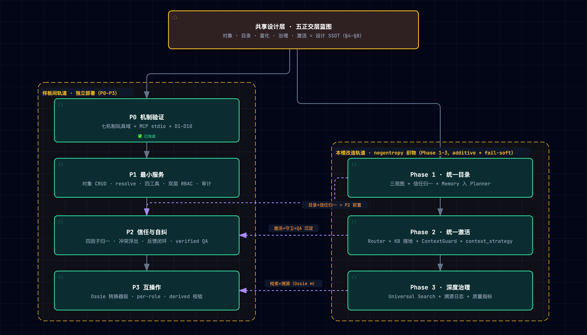

> 图源：[`context-layer-blueprint--dual-track-roadmap.mmd`](../../assets/mermaid/cognitive-context/context-layer-blueprint--dual-track-roadmap.mmd) · 交互版：[`html`](../../assets/architecture/cognitive-context/context-layer-blueprint--dual-track-roadmap.html)

## 参考

[1] a16z (J. Cui, J. Li), "Your Data Agents Need Context," Mar. 10, 2026. https://a16z.com/your-data-agents-need-context/

[2] Anthropic, "Effective Context Engineering for AI Agents," Sep. 29, 2025. https://www.anthropic.com/engineering/effective-context-engineering-for-ai-agents

[3] Anthropic, "Introducing Contextual Retrieval," Sep. 19, 2024. https://www.anthropic.com/engineering/contextual-retrieval

[4] A. K. Dey, "Understanding and Using Context," *Pers. Ubiquitous Comput.*, vol. 5, no. 1, pp. 4–7, 2001.

[5] Atlan (E. Winks), "Context Architecture for AI Agents: A Complete 2026 Guide," Apr. 24, 2026. https://atlan.com/know/context-architecture-for-ai-agents/

[6] Splunk (P. Bhavsar), "Context Engineering for AI Agents in Production," Aug. 11, 2026. https://www.splunk.com/en_us/blog/artificial-intelligence/context-engineering-production-agents.html

[7] Redis, "State of Context Engineering 2026," Aug. 2026（n=1,000 经官方社媒披露，方法论未公开）. https://redis.io/resources/state-of-context-engineering-2026/

[8] MCP, "Specification revision 2026-07-28," Jul. 28, 2026. https://modelcontextprotocol.io/specification/2026-07-28/

[9] MCP, "Security Best Practices," 2026. https://modelcontextprotocol.io/docs/2026-07-28/tutorials/security/security_best_practices

[10] Q. Hua et al., "Context Engineering 2.0: The Context of Context Engineering," arXiv:2510.26493, 2025.（经 010 转引）. https://arxiv.org/abs/2510.26493

[11] arXiv:2411.15399, 2024（工具数饱和实证：Llama 3.1 8B 挂 46 工具失败/19 成功；经 Splunk 转引，原文未核）. https://arxiv.org/abs/2411.15399

[12] arXiv:2505.06120, 2025（跨轮任务分片 −39% 退化实证；经 Splunk 转引，原文未核）. https://arxiv.org/abs/2505.06120

[13] arXiv:2603.13110, 2026（240 条消息会话结构化记忆保留 99.6% vs 54.3%；经 Redis 转引，原文未核）. https://arxiv.org/abs/2603.13110

[14] arXiv:2602.06547, USENIX Security 2026（98,380 技能扫描 157 恶意/632 漏洞）. https://arxiv.org/abs/2602.06547

[15] arXiv:2606.07131, 2026（MalSkillBench：703 样本 86.3% 假前置依赖）. https://arxiv.org/abs/2606.07131

[16] arXiv:2601.17887, 2026（个性化记忆使攻击成功率相对 +15.8%~243.7%；经 Redis 转引，原文未核）. https://arxiv.org/abs/2601.17887

[17] Patronus AI FinanceBench 检索研究, 2026（同模型 19%→85%；经 Redis 转引，原文未核）

[18] shareAI-lab, "Learn Claude Code," @f9e8b280, MIT（教学课程仓，三级证据分级）. https://github.com/shareAI-lab/learn-claude-code

[19] Colrows, "MCP Is Not Enough," 2026. https://colrows.com/blogs/mcp-governed-semantic-layer/

[20] T. Jin et al., "Pervasive Annotation Errors Break Text-to-SQL Benchmarks," *CIDR* 2026. https://arxiv.org/abs/2601.08778

[21] Apache Ossie (Incubating), 2026. https://ossie.apache.org/

[22] volcengine, "OpenViking," @14a7b81, AGPL-3.0. https://github.com/volcengine/OpenViking

[23] NousResearch, "hermes-agent," @068db016. https://github.com/NousResearch/hermes-agent

[24] TypeSafe, "Introducing System One Models and Jev," 2026（精读详见 200/201）. https://typesafe.ai/blog/introducing-system-one-models-and-jev

[25] Gartner, "D&A Predicts," 2025–2026.（付费墙，转引）

[26] Forrester (B. Evelson, I. Bandyopadhyay), "The Next Evolution of AI Will Rely on Context Layers," Aug. 20, 2026. https://www.forrester.com/blogs/the-next-evolution-of-ai-will-rely-on-context-layers/

> Horizon 精读共用参考（Snowflake 官方文档与博客、dbt 基准、Spider 2.0 等 30 条）见 [011 §参考](./011-horizon-context.md)；本仓子系统深潜见 [025](../../concepts/subsystems/025-the-memory-system.md)/[026](../../concepts/subsystems/026-memory-whitepaper.md)/[035](../../concepts/subsystems/035-the-knowledge-base.md)/[036](../../concepts/subsystems/036-the-knowledge-graph.md)/[037](../../concepts/subsystems/037-federated-kg.md)。
