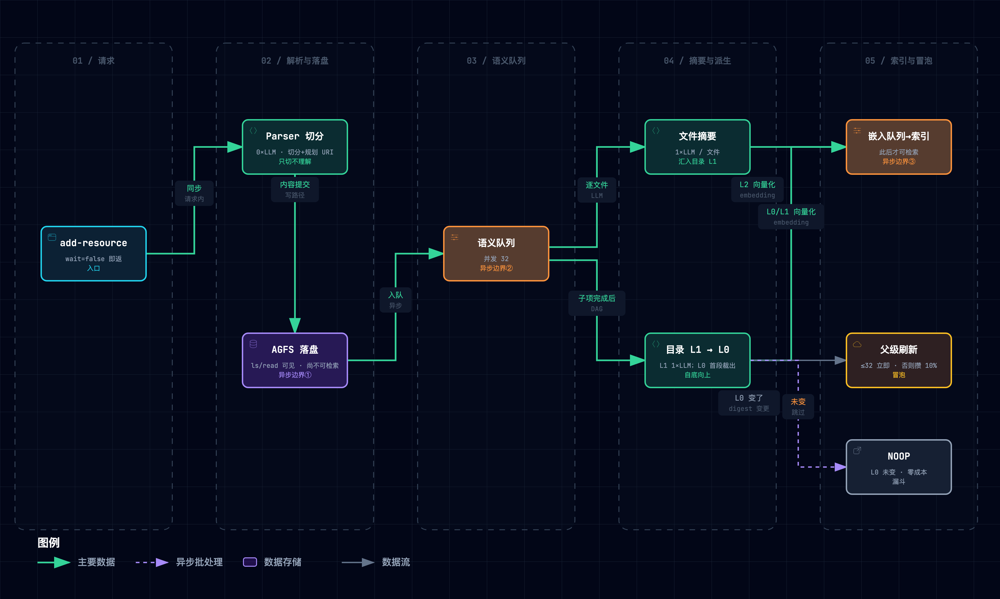
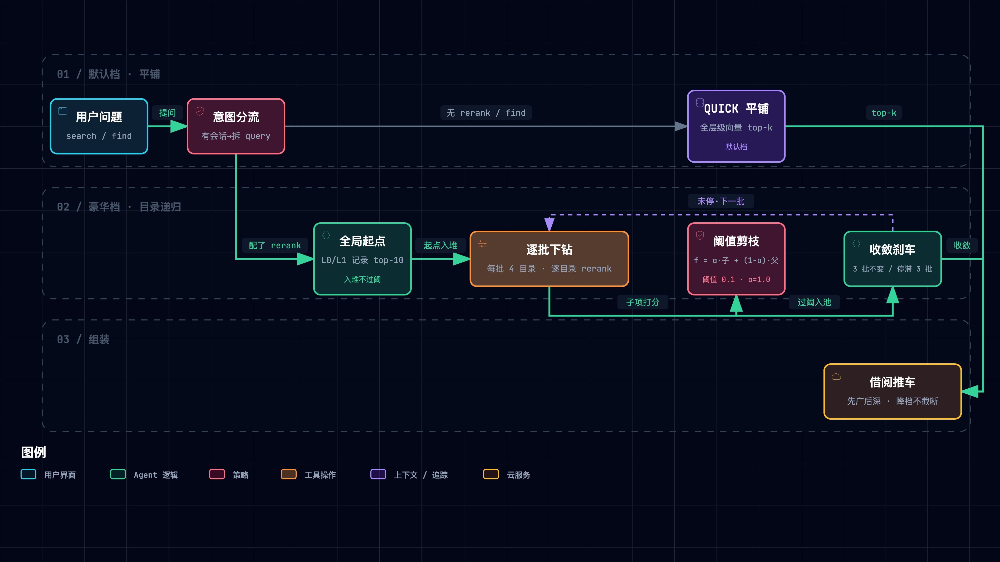

# OpenViking 精读笔记

> [OpenViking, "One filesystem for everything an agent knows," GitHub 仓库](https://github.com/volcengine/OpenViking)，固定提交 [`14a7b812`](https://github.com/volcengine/OpenViking/tree/14a7b8126ed517336d219d084343fb473132e53d)（2026-09-23，最新 release v0.4.21）。文档站 [docs.openviking.ai](https://docs.openviking.ai/) · 官方博客 [blog.openviking.ai](https://blog.openviking.ai/)。许可证 **AGPL-3.0**（2026-03-30 由 Apache-2.0 变更，`ce998873`；`crates/ov_cli`、`crates/ragfs`、`examples/` 仍为 Apache-2.0）。团队为火山引擎 Viking 系（VikingDB 内部运营 2019–2023），三篇关联论文 VikingMem（arXiv 2605.29640）/ TrieHI（2606.16903）/ VikingRAG（2609.11390）。

**一句话定位**：OpenViking 是一个**把 Agent 的资源、记忆、技能全部装进一棵 `viking://` 目录树的开源上下文数据库**——每个目录由 LLM 自底向上写两层摘要（L0 一句话 / L1 一页导览），检索可以「先看摘要、按目录圈范围、按需读原文」，会话结束后再把对话提炼成记忆写回同一棵树。

**总类比**：**一座会自己编目的图书馆**。编目员（SemanticProcessor）自下而上给每个书架写一句话标签（L0）和一页导览（L1）；读者（Agent）提问时，参考馆员（HierarchicalRetriever）要么直接翻卡片柜（默认平铺检索），要么——只有请得起专家（rerank）时——从卡片柜挑出起点书架逐架巡查（目录递归）；借书受推车容量限制（token 预算），先装薄的、装不下换薄本、绝不撕书；每次接待完读者，馆员先把谈话原样装订归档（commit 第一阶段），再在后台把要点整理进读者的个人档案卡（第二阶段记忆提炼），同一主题永远是同一张卡（确定性身份），整理完才盖「已整理」章（`.done`）。

> [!TIP] **怎么读这篇笔记**
> - **三拍结构**：每个机制按「类比 → 机制 → 原型实景」走；原型实景取自配套最小原型 [`assets/openviking_lab.py`](./assets/openviking_lab.py)（纯标准库、493 行、clean-room 自写——上游 AGPL-3.0，本仓 Apache-2.0，不含任何上游代码），`--selftest` 秒级跑完，`--break B1..B6` 复现破坏性实验。文中日志均为实际运行输出。
> - **裁决口径**：文档与代码冲突时**代码胜出**；本文数字全部以钉点 `14a7b81` 代码实值为准，文档旧口径进矛盾清单（§9.3）。
> - **证据分级**：【一】钉点代码实测可复现 /【二】官方文档陈述 /【三】厂商自报基准与营销表述 /【四】第三方分析。凡【三】必标注，口播引用必须带归属（§9）。
> - **引用记号**（行号均以钉点为准）：`HR:` = `openviking/retrieve/hierarchical_retriever.py`；`SP:` = `storage/queuefs/semantic_processor.py`；`FS:` = `storage/viking_fs/_semantic.py`；`SS:` = `session/session.py`；`CFG:` = `openviking_cli/utils/config/*`。完整路径随文标注。
> - **配套产物**：[OpenViking ↔ negentropy 机制映射报告](./015-openviking-mapping-negentropy.md)。

---

## 1. 它要解决什么问题：散页箱里的研究员

官方博客的开场（【二】）：Agent 的上下文散在四处——记忆在各家记忆库、文档在各家向量库、技能躺在 prompt 里；平铺向量检索随语料变大而「区分度下降、topK 小时漏召回致命」，而 reranker「救不回从未进入候选集的证据」（架构博客 llm.txt L24-25、L47）。共同根因是**信息组织缺位**（上下文博客 L44）。

由此推出五条设计规格，后文每个机制都能映射回其中一条：

| 设计规格 | 通俗版 | 对应机制 |
| --- | --- | --- |
| 可寻址 | 每样东西有馆藏位置编号，报编号就能找到 | `viking://` 统一命名空间（§3） |
| 可分层 | 先看书架标签，再翻导览页，最后才读整本 | 目录级 L0/L1/L2 sidecar（§4） |
| 可导航 | 先圈对书架，再逐架细看 | 两档检索 + token 预算组装（§5） |
| 可回写 | 接待完读者，档案室自动更新 | 会话两阶段提交 + 记忆提炼（§6） |
| 可追溯 | 找过哪些书架、为什么命中，要有账可查 | query_plan / provenance / 日志（§5.4） |

作者同时强调边界（【二】，架构博客 L98-107）：**OV 不是文件系统**——上传内容会被解析成 AI-ready 数据，原始文件默认不保留；它自称 context database。

## 2. 全貌：两相与因果脉络

OpenViking 天然分两相：**编目相**（资源入库 → 切分 → 自底向上摘要 → 向量化 → 新鲜度冒泡）与**检索相**（意图分析 → 起点书架 → 逐架巡查 → 预算组装）。


*图 1 · 编目相：Parser 切分（无 LLM）→ R/N/F/V 快照与差异计划 → 异步语义队列（文件摘要 + 目录 L1，各 1 次 LLM）→ 嵌入队列（此后才可检索）→ 新鲜度冒泡（L0 变了才上报）。图源：[.mmd](../../assets/mermaid/cognitive-context/openviking--ingest-phase.mmd) · 交互版 [HTML](../../assets/architecture/cognitive-context/openviking--ingest-phase.html)（下载到本地打开）*


*图 2 · 检索相：find 固定平铺（默认档）；search 配了 rerank 才走「意图分析 → 全局起点（L0/L1 记录 top-10）→ 每批 4 个目录下钻 + rerank + 阈值剪枝 → 收敛/停滞刹车 → 预算组装（先广后深、降档不截断）」。图源：[.mmd](../../assets/mermaid/cognitive-context/openviking--retrieval-phase.mmd) · 交互版 [HTML](../../assets/architecture/cognitive-context/openviking--retrieval-phase.html)（下载到本地打开）*

### 2.1 最重要的几个部分（分层矩阵）

| 层级 | 部分 | 回答的问题 | 性质 |
| --- | --- | --- | --- |
| Tier 1 地基 | `viking://` URI + 三类上下文（§3） | 东西放哪、是什么、谁能看 | 【一】URI 结构推导类型；前缀替换映射物理存储 |
| Tier 1 地基 | L0/L1/L2 目录 sidecar + 自底向上生成 + 冒泡（§4） | 怎么「先看摘要」 | 【一】256/4000 字符软上限；L0 从 L1 截取零 LLM；10% 判据 |
| Tier 1 核心 | 两档检索 + 意图分析 + 预算组装（§5） | 怎么找、拿多少 | 【一】递归只在 search+rerank 运行；α=1.0 |
| Tier 1 核心 | 会话两阶段提交 + 记忆提炼（§6） | 怎么学会用户 | 【一】原子写集协议、top-5 预取、`.done` 提交点 |
| Tier 2 证据 | LoCoMo / tau2 / HotpotQA / 单轮 RAG / ClawWork（§9） | 真的更好吗 | 【三】厂商自报；无消融；有反例与两处算术错 |
| Tier 2 证据 | 三篇论文（§9.2） | 学术支撑 | 【三】实验均不在开源版上跑 |
| Tier 3 坐标 | 对 MemGPT/Mem0/RAPTOR/LightRAG/Agent Skills/013 蓝图的坐标（§7–§8） | 在领域地图的哪里 | 本笔记综合 |
| Tier 3 坐标 | 许可证史与引入约束 | 能不能拿来用 | 【一】git 史；映射报告 §结论 5 |

### 2.2 核心关系与因果脉络链

```
观察：上下文散在三处；平铺向量检索随语料变大而变钝，召回漏掉的 rerank 救不回；窗口有限全塞太贵
  ↓ 归因
信息组织缺位：切块平铺丢了「属于哪个书架」；没有渐进披露；没有写回路径
  ↓ 设计规格
可寻址 × 可分层 × 可导航 × 可回写 × 可追溯
  ↓ 机制
viking:// 统一命名空间（§3）
  → 目录级 L0/L1 + 自底向上编目 + 新鲜度冒泡（§4）
  → find 平铺 / search 递归（意图 → 起点 → 优先队列 → rerank → 收敛）+ 推车预算（§5）
  → 会话两阶段提交 + 确定性身份记忆提炼 + .done（§6）
  → query_plan / provenance / 计数器 / 日志（§5.4）
  ↓ 证据闭环
厂商自报（LoCoMo 24.20%→82.08%，【三】，无消融）＋反例（单轮 RAG 66.87% < LightRAG 76.00%）
＋本仓 lab 六次破坏性实验（【一】，机制自洽性，§10）
```

### 2.3 基础层 vs 学习焦点

**(a) 前置基础**（Phase 0 学徒自测暴露的盲区，补课三句）：①召回管「别漏」、重排管「排准」——重排只能在召回给的候选里挑；②层级摘要是有损压缩，也是导航路标——摘要错则整棵子树被剪；③记忆巩固的核心是**身份**问题——相似 ≠ 同一，需要身份字段裁决而非相似度阈值。

**(b) 最值得学的四个焦点**：①「豪华档/默认档」之分——讲任何算法前先讲它什么时候才运行（§5.1）；②L0 是 L1 的开头一段——目录只付一次 LLM，摘要既是被检索对象又是路标（§4.2）；③「相似 ≠ 同一」——身份降维成文件名（§6.3）；④提交点语义——`.done` 最后写、失败终态、审计只记不撤（§6.4）。

**(c) 总类比遴选纪要**：候选池 40 个（11 个生活域）→ 一票否决 12 项（代表：文件夹 README 不是类比是机制本身；蚁群硬比；地铁/河流只承载单一机制）→ 决赛圈加权评分：**图书馆（编目员+参考馆员+读者档案）4.90** ＞ 私人秘书的文件柜 3.75 ＞ 医院病历 3.45；映射压力测试断点 1/3/4，图书馆最少胜出。失配边界：编目员 ≠ 真人（LLM 会写错漏写）；向量指纹数学、token 估算、TrieHI 位图、AGPL 进入术语直讲区。完整《类比计划》单射表随各机制首登。

## 3. 机制一：`viking://` 寻址——位置即语义

**类比**：馆藏位置编号。「三楼东区 12 架」这句话本身就说明了它是公共馆藏、属于哪个分区、旁边是什么。三个分区：公共馆藏区（`resources`）、读者个人档案室（`user/{uid}`）、馆员工作手册室（`agent`）。

**机制**（【一】）：
- **URI = 纯前缀替换的租户化路径**：`viking://{rest}` → AGFS `/local/{account_id}/{rest}` → localfs `{data}/viking/{account_id}/{rest}`；唯一非纯变换是单段超 255 字节加 sha256 前 8 位后缀（`storage/viking_fs/_access.py:660`）。
- **类型由 URI 结构推导，不按关键字**：`user/{uid}/memories/**` → memory；`user/{uid}/skills/**`、`agent/skills/**` → skill；**其余一律 resource**——包括 `agent/tools|endpoints|payments`（与文档宣称的 Skill 子类型相反）和 `viking://resources/memories/x`（`core/namespace.py:114-144`）。同仓反例：`Context._derive_category` 仍用子串匹配（`core/context.py:121`），可作「结构化 vs 关键字」教具。
- **`~` 只在请求边界展开**成 `viking://user/{uid}`；服务端内部解析遇到 `~` 直接报错（fail closed，`core/namespace.py:238`）。向量主键 `md5(f"{account}:{seed}")`，L0/L1 的 seed 追加 sidecar 文件名（`storage/vector_ids.py:52`）——**id 由位置决定，`mv` 必须重算主键**。
- **访问控制**：`resources` 全账户可见；`user` 只能进自己的 uid；`temp` 只放行自己的 space（`storage/viking_fs/_access.py:1020`）。

**原型实景**（实际运行输出，`openviking_lab.py --selftest` S1）：

```
✔ memory/skill/resource 推导正确；L0/L1 记录 ID 不撞；未知 scope 被拒
```

## 4. 机制二：目录级 L0/L1/L2——先付小钱看摘要

**类比**：书架侧面的一句话标签（L0）和一页导览（L1）长在**书架**上，不是长在每本书上；书（L2）只有正文。新书进馆，编目员先写封底简介（汇进导览页的 `###` 小节），再汇总成导览，最后从导览首段裁出标签。

**机制**（【一】）：
- **目录级而非文件级**：只有目录可有 `.abstract.md`（L0）与 `.overview.md`（L1）；文件摘要只作为输入汇入所在目录的 L1，并写进该文件 L2 向量记录的 `abstract` 标量。
- **体量上限是字符不是 token，且是软上限**：`abstract_max_chars=256`、`overview_max_chars=4000`（`CFG parser_config.py:715/718`）；截断只落在句末，首句超长则整句保留（`SP:1352-1380`）。文档写的「~100 / ~2k tokens」是旧口径（矛盾 C1）。
- **L1 是 LLM 产物，L0 是从 L1 里剪出来的**：目录 L1 输入 = 采样后的「直接文件摘要 + 直接子目录 L0」，调 `semantic.overview_generation` 一次；L0 取 L1 中 H1 之后、第一个 `##` 之前的正文段再按句界截断，**零 LLM**（`SP:1382-1422`）。
- **自底向上、DAG 事件驱动**：目录节点等全部子项完成才调度（`storage/queuefs/semantic_executor.py:647`）；直接子项 >32 时确定性等距采样（含首尾、保序），采样只限 prompt 宽度——**首次入库所有文件仍会被摘要**（自己的 L2 要用）。
- **新鲜度冒泡 = 「L0 变了才上报」的漏斗**：子目录 L0 正文 digest 未变 → NOOP；父目录无基线或子项 ≤32 → 立即刷新；否则 `pending/total ≥ 0.10` 才刷新（`storage/queuefs/semantic_ops/freshness_policy.py:28-62`）。OKF frontmatter 记 `total/sampled/unsampled/pending_child_changes` 四项计数。
- **成本公式**（【一】推导，未实测）：一次入库 `LLM ≈ 非代码文件数 + 目录数`（L0 零次），`Embedding ≈ 文件数 + 2×目录数`；冒泡默认必经 `viking://resources` 一层。**隐藏放大器**：祖先刷新会把被采样的兄弟文件（≤32）全部重新摘要——深层一次小改，账单沿祖先链逐层结算（`semantic_executor.py:1077`）。

**原型实景**（实际运行输出，S2/S5）：

```
── S2 编目：72 本书、53 个书架，LLM 调用 125 次（文件 1 次 + 目录 1 次，L0 零次）
  ✔ 每个书架 L0≤256、L1≤4000，L0 是 L1 首段
── S5 新鲜度冒泡：标签变了才上报；宽分区攒够一成才重印
  MARK_PENDING viking://resources/customers  (1/40=0.025)
  MARK_PENDING viking://resources/customers  (2/40=0.050)
  MARK_PENDING viking://resources/customers  (3/40=0.075)
  REFRESH_NOW  viking://resources/customers  (4/40=0.100 ≥ 0.1)
```

## 5. 机制三：两档检索与借阅推车——先圈范围再排序

**类比**：翻卡片柜（平铺）谁都会；「参考馆员逐架巡查」是豪华档——**只有请得起专家（配了 rerank）才开**。巡查规则：先从卡片柜挑出最像的几个书架（起点，可以直达深层）；每次同时进 4 个书架，每个书架只看最像的 20 条，请专家读导览打分；专家打分不过线的书架不进；候选名单连续三批不变就收工。书架好坏**只决定进不进、先进谁，不给书加分**（α=1.0）。借书受推车容量限制：先每样放薄的（摘要），有余量再换厚本（全文），装不下换薄本，绝不撕书。

**机制**（【一】）：
- **5.1 默认档其实是平铺**：`find()` 自 #4472 起强制 QUICK 平铺（`FS:290`）；`search()` 未显式给 mode 时「有 rerank 才 THINKING」（`HR:126-127`）；`search(mode="context")`/`/recall` 内部也走 find。**默认配置 `RerankConfig.provider=None` ⇒ 开箱部署的所有检索入口都是平铺向量检索，目录只起作用域过滤的作用。**
- **5.2 意图分析**：`IntentAnalyzer` 只产出 `{skill, resource, memory}` 三类 typed query；「0–5 条」只是 Prompt 软约定，代码不设上限；`priority`/`intent` 字段不参与任何排序，只记日志（`retrieve/intent_analyzer.py:108-123`）。触发条件要求会话里至少有摘要或最近消息——**没有会话就用原始 query**（文档称仍做意图分析，属硬错误）。
- **5.3 目录递归逐步**（`HR`）：全局只查 L0/L1 记录取 `max(limit,10)` 条（一个目录可占 2 个名额）→ 起点 rerank 后入堆（**入口不过阈值**）→ 每批弹 4 个目录、每目录取 `max(2L,20)` 条子项向量预选再逐目录 rerank → 分数 `f = α·child + (1−α)·parent`，**α 默认 1.0 = 完全忽略父分**（FAQ 仍写 0.5，属过时）→ 唯一剪枝是阈值 0.1 严格大于 → 两条刹车各 3 批：top-k 集合不变（且已满 limit）或候选池大小停滞 → L2 是终点，**检索期从不读 L2 正文**。
- **5.4 检索轨迹兑现程度**：实际落地 = `query_plan` + `provenance`（命中清单）+ telemetry 计数器 + INFO/DEBUG 日志；结构化 `ThinkingTrace` 定义了 11 种事件但**全仓无生产者**，`searched_directories` 填的是起点根目录；`rerank_fallback` 指标恒为 0（无生产者）。FAQ 的「fully traceable」名不副实。
- **5.5 借阅推车**（context_assembler）：默认预算 1600 token；单条上限 `(预算//n)×2`；先广后深：每条从默认层级起步，放不下**降一档而不是截断**，剩余预算按分数顺序做「overview → full（受限）→ full（不受限）」三轮加深；`uri < abstract < overview < full` 的 tier 阶梯与 L0/L1/L2 **同名不同义**（文件候选的 overview 层是从 L2 正文现场提取的标题树/骨架，不是 L1 sidecar）。

**原型实景**（实际运行输出，S3/S4）：

```
QUICK   recall@3 = 0.75
  [陷阱] ✘ 客户退款审批流程是什么 → ['legacy-refund/v12.md', 'legacy-refund/v03.md', …]
THINKING recall@3 = 1.00（展开 43 个书架、专家 47 次、读 33839 token）
  [陷阱] ✔ 客户退款审批流程是什么 → ['refund/refund-flow.md', …]
── S4 借阅推车
  full      61 tok  refund-fail.md
  abstract  54 tok  refund-flow.md
```

12 份「已废弃」旧流程措辞与现行高度重合：平铺档 top-3 全被旧文档占据（向量只看像不像），豪华档靠专家读简介认出「已废弃」降权——这正是「召回漏掉的 rerank 救不回、但**进入候选后的甄别**是 rerank 的主场」的正面演示。

## 6. 机制四：会话两阶段提交与记忆提炼——归档是事实，提炼是派生

**类比**：读者来访结束，馆员先把谈话记录**原样装订**归档（同步、必成）；后台再整理：写来访小结（L0/L1）＋更新读者档案卡（长期记忆）。档案室里有九种卡片；卡片名按规则生成——**同一主题永远是同一张卡**；事件卡只增不改；整理完才在卷宗上盖「已整理」章；中途失败贴「整理失败」封条（**不再重试**）；变更登记簿只记不撤。

**机制**（【一】）：
- **6.1 两阶段**：Phase 1 加锁写意图标记 → 写 `messages.jsonl` → 入持久队列 → 重写根消息（`SS:1898-2148`）；Phase 2 出队执行：并行「Working Memory 摘要（L0/L1）」与「长期记忆提炼」，**两步都成功才最后写 `.done`**（提交点，`SS:2908`）。`.failed.json` 是终态：无自动重试、无重试 API、已应用的记忆不回滚。
- **6.2 提炼协议已换代**：文档写的「向量预过滤 → skip/create/none + merge/delete」在代码中**已不存在**；现行是 ReAct 式 `ExtractLoop` 一次输出原子「写集」：新建 `create/set`，已有对象走 `edit/drop/update` 字段级补丁或 `delete(replacement=…)`（折叠独有事实后才准删）；写前必读护栏：写入一个存在但没读过的 URI 会触发代读再迭代一轮（`session/memory/extract_loop.py:364`）。
- **6.3 身份判据**：找「相似的已有记忆」只做**一次跨类型合并向量检索 top-5** + 单文件直读；但**相似只提名候选，同一性由 schema 身份字段裁决**——URI 由身份字段确定性生成（preferences = `(user, topic)`），「是否同一条记忆」被降维成「文件名是否相同」（`session/memory/merge_policy.py:7`）。残余风险：topic 命名不同（「咖啡」vs「饮品」）即两条并存，无时间戳后写优先规则。
- **6.4 九类记忆 × 合并算子**（全部在 `viking://user/{uid}/memories/`）：profile/identity/soul 单文件 `patch`；preferences/entities 按 `{topic}/{name}` 分文件 `patch`；**events/trajectories 只增不改**（add_only，宁可重复不可错并）；cases 全字段 immutable（首写即冻结）；experiences 整篇 `replace`＋`supersedes` 删除旧档。`memory_diff.json` 记 adds/updates/deletes 的 before/after——**只写不读，无回滚实现**；真正可回退的只有 experiences 的 git 快照。
- **6.5 Agent Evolution 的闭环与断点**：开关开启后「case → rollout → trajectory → gradient → experience」，但 `/recall` 默认 `experiences=0`——**只写不用**，闭环最后一公里要靠显式配额或 Agent 主动 read；「读过哪些 experience」靠下次 commit 从工具调用记录里考古回收。

**原型实景**（实际运行输出，S6/S7）：

```
── S6 会话两阶段提交：同一主题永远是同一张卡
  偏好卡 1 张：{'…/preferences/alice/咖啡.md': '拿铁'}；事件卡 1 张
  memory_diff[s2].updates = [{'uri': '…/咖啡.md', 'before': '喝美式咖啡', 'after': '拿铁'}]
── S7 提交点：队列重投同一条消息（至少一次投递）
  重投 s1 → {'skipped': True}；LLM 调用 7 次不变；事件卡仍 1 张
```

三次来访（美式 → 拿铁 → 拿铁）只落一张卡，且 diff 里能看到 before/after——身份判据让「学会用户」变成可审计的增量更新。

## 7. 五条底层规律

（类比均取自《类比计划》：图书馆剧场。理论锚点与一手演示见 §3–§6 与 §10。）

| # | 规律 | 最简解释 | 一手演示（正面 / 反面实测） |
| --- | --- | --- | --- |
| 1 | **位置即语义**（Addressability as Organization） | 放在哪，就决定了它是什么、谁能看、跟谁是邻居 | `resources/memories/x` 仍是 resource（结构推导）；反例：`_derive_category` 子串匹配 |
| 2 | **先付小钱看摘要**（Progressive Disclosure） | 先看一句话标签，有戏再看导览页，最后才读整本 | 256/4000 字符 + 推车降档不截断；反面 B1：拔掉 L0/L1，THINKING recall 1.00→0.50，QUICK 不受影响——**豪华档更依赖 sidecar 质量** |
| 3 | **先圈范围再排序，早剪错不可逆**（Scope-then-Rank） | 先用结构缩小候选再请专家；但门口看走眼的书架后面进不去 | 起点直达 + 每批 4 架 + 阈值 0.1；α=1.0：层级只管可达性与顺序，不管名次（B5：α=0 时排序反转、展开 43→62 个书架） |
| 4 | **相似不等于同一**（Identity-based Consolidation） | 该不该合并看「它是谁」，不看「它像谁」 | 三次来访一张卡；反面 B3：身份关闭后 3 张矛盾卡并存；上游残余：topic 漂移同样并存 |
| 5 | **派生物要跟上源头，且有提交点**（Derived-View Consistency） | 摘要/记忆是算出来的副本，要按规矩刷新，还要能说清算完没有 | L0 变了才冒泡、≤32 立刷 / >32 攒 10%；`.done` 最后写；反面 B4：关冒泡，祖先标签过期、浏览式导航致盲；B6：无 `.done`，重投事件卡 ×2 |

五条恰好覆盖**放在哪 / 压成什么样 / 怎么找 / 怎么学 / 怎么保鲜**五个独立变化的维度——换检索算法不动寻址，换记忆 schema 不动分层。

## 8. 三个核心争议

**争议 1 · 书架还是关系网**。层级派看到的失败：平铺检索大语料区分度下降、结果没有结构；平铺/图派看到的失败：门口看走眼整棵子树丢失、跨目录多跳难。OpenViking 自报单轮 RAG 均值 66.87% 输给 LightRAG 76.00%，而 HotpotQA top-20 91.00% 又赢——两派取样不同，所以都对。本质是**选址问题**：信息天然是树还是网，因查询而异；工程可对冲（多起点、平铺兜底——OV 自己把 find 默认设为平铺就是对冲），单一层级无法同时满足所有查询视角是本质难题。

**争议 2 · 让 LLM 写的摘要当索引，值不值**。支持方：读取侧节省、导航可解释；反对方：写路径放大（每目录 1 次 LLM＋冒泡重摘要兄弟文件）、陈旧窗口（10% 阈值下 161 子项里 3 个文件变动可能长期不刷新）、摘要质量无人评测。本质是**成本结构经济学**（读多写少才划算）叠加**验证信号缺失**；摘要必然有损是本质，只能对冲（保留平铺路径兜底）。

**争议 3 · 厂商自报基准能信几分**。方向一致、幅度巨大（三个 Agent 都提升）；但单一 Doubao judge、宽松判分、**失败题不进分母**、无方差、无消融、「0.3.22」是事后补标（详见 §9）。本质是**验证信号的信度**问题；公开逐题产物与多 judge 是资源问题，不是本质难题——但在补齐之前，数字只能当「厂商自报」引用。

## 9. 关键实证数字（证据分级）

### 9.1 厂商自报基准（全部【三】，2026-05-29 博客 + README）

| 实验 | 关键数字 | 一句话读法 |
| --- | --- | --- |
| LoCoMo · OpenClaw | 原生 24.20% → 82.08%（×3.39）；输入 token 392.6M → 37.4M（−90.5%，博客写 −91.0%） | 团队自报；judge=doubao-seed-2-0-pro、判分提示偏宽松、失败题不进分母 |
| LoCoMo · Hermes / Claude Code | 33.38% → 82.86% / 57.21% → 80.32% | 「Claude Code 组」答题模型实为 doubao-seed-2-0-code-preview，验证的是 harness 不是 Claude 模型 |
| tau2-bench | Retail +6.87pp、Airline +11.87pp | test 子集（40/20 题 × 8 次）＋未合并上游 PR 的改版用户模拟器，不能与官方榜单比较 |
| HotpotQA | OV top-20 91.00%（0.23s）vs LightRAG 89.00%（75s） | 「延迟」一列混口径（OV 是检索延迟，对比项像端到端）；仓内无 HotpotQA 适配器 |
| 单轮 RAG 五数据集均值 | **OV 66.87% vs LightRAG 76.00%（−9.13pp）**；建库 token 8.67M（13.8%）；检索 0.19s vs 9.19s | **自报材料里唯一的负向结果**（钉点 README 已不再展示）；便宜、快，但单轮均值不敌图 RAG |
| ClawWork | 净收入 +69.34%；「每小时 token −22.8%」 | **算术错误**：复算 −15.3%；仓内无脚本 |

旧口径（v0.3.16 README）：OpenClaw 35.65% → OV 52.08%、token 24.6M → 4.26M——答题模型、OV 版本、脚本仓全换了，**新旧两组数字不能连成进步曲线**；当时 README_CN 还列过 Mem0 56.62%（比 OV 更快）后被删除。

### 9.2 论文（同团队，实验均【三】且不在开源版上跑）

VikingMem（arXiv 2605.29640，VLDB26）：实验跑在生产 VikingDB 实现；LoCoMo GPT-4o-mini 88.83%、去 rerank 降至 85.19（论文里唯一接近消融的数据）；单次抽取成本 $0.35→$0.07；存储占原始 token 16.82%。TrieHI（2606.16903）：端到端表格照搬博客数字、无 TrieHI 开/关消融；开源内嵌 DirIndex（trie+bitmap，`src/index/.../dir_index.cpp:57`）与论文结构不同、且早于论文存在。VikingRAG（2609.11390）：token 占基线 11.6–51.9%，E/E+ 模式未声明进入 OV。

### 9.3 矛盾清单（文档 vs 代码，选录；完整 66 条见取证底稿）

| # | 文档说 | 代码是 |
| --- | --- | --- |
| C1 | L0/L1「~100 / ~2k tokens」 | **256 / 4000 字符**软上限（句末截断、超长首句整句保留） |
| C2 | 切分「≤1024 整体保留、>1024 拆子目录」 | **≤2048 估算 token 且 ≤6000 字符**整体保留；token 靠启发式估算（CJK×0.7+其他×0.3） |
| C3 | find「hierarchical retrieval, recursively」 | find 固定 QUICK 平铺（#4472 起） |
| C4 | FAQ「Final Score = 0.5×嵌入 + 0.5×父分」 | α 默认 1.0，忽略父分；#1770 前才是硬编码 0.5 |
| C5 | 提炼决策「skip/create/none + merge/delete」 | 已改为原子写集 create/edit/drop/update/delete(replacement) |
| C6 | memory_diff「auditing and rollback」 | 只写不读，无回滚实现 |
| C7 | 「Fully traceable retrieval trajectory」 | ThinkingTrace 无生产者；searched_directories 填起点根 |
| C8 | 文件摘要并发 10 | `vlm.max_concurrent` 默认 32 |

## 10. 动手实验室

```bash
uv run --no-project python docs/research/cognitive-context/assets/openviking_lab.py --selftest   # 秒级，SELFTEST PASSED ✔
uv run --no-project python docs/research/cognitive-context/assets/openviking_lab.py --break B1   # B1..B6
```

机制 → 代码行号速查（`assets/openviking_lab.py`）：URI 类型推导/记录 ID `:46-74` · 向量/专家/token 替身 `:77-123` · 编目员+冒泡 `Viking` `:126-198` · 两档检索 `find/search` `:201-278` · 借阅推车 `assemble` `:281-291` · 会话提交 `Session` `:294-345` · 玩具语料 `build` `:348-371`。

破坏性实验实测退化对照（每项「改了什么 / 实测 / 教训」）：

| 实验 | 改动 | 实测退化（对照正常值） | 教训 |
| --- | --- | --- | --- |
| B1 拔掉书架标签 | 退款书架不写 L0/L1 | THINKING recall 1.00→**0.50**（QUICK 0.75 不变；陷阱查询命中归零） | 豪华档的可达性押在 sidecar 上；平铺档反而免疫 |
| B2 收敛刹车砍到 1 轮 | `CONV_ROUNDS=1` | recall 1.00 不变，展开 43→**33** 个书架 | 玩具域起点可直达深层，刹车是成本闸不是精度闸；香味弱、须多跳时才会把没轮到的书架拦在门外 |
| B3 身份不再由字段决定 | 卡片名混入会话 ID | 偏好卡 1 → **3 张矛盾并存**（美式/拿铁/拿铁） | 「相似 ≠ 同一」不是学术洁癖：没有身份判据，一个月后记忆库自相矛盾 |
| B4 关掉冒泡 | 祖先层不刷新 | engineering/resources L0 不含新内容；**浏览式导航致盲**（THINKING 靠 oncall 自己的新 L0 兜底仍命中） | 冒泡喂的是「祖先标签」——直接检索有起点直达兜底，靠 ls/abstract 逐层浏览的 Agent 拿到过期地图 |
| B5 父分完全遗传 | α=1.0 → 0 | recall 1.00 不变但**排序反转**（vpn 排到 laptop 前、handover 排到 postgres 前）；展开 43→**62**、读 token 33839→**41082** | 父分遗传把「好目录里的差文件」抬高，还放大探索成本——上游把 α 从 0.5 改 1.0 的动机在玩具域即可复现 |
| B6 去掉 `.done` | 重投不查提交点 | 事件卡 1 → **2 张**（措辞漂移产生「上线了支付服务 v2」与「…（复述）」两份） | 至少一次投递下没有提交点，add_only 记忆被重复提炼；偏好卡因确定性 URI 天然幂等 |

## 11. 批判性边界（材料没有证明的事）

1. **提升来自哪个机制**：无任何消融——分层、递归、记忆提炼各贡献多少无法拆开；TrieHI 论文把整机数字归因到 TrieHI 却无开/关对照。
2. **头条机制在默认部署里在工作**：默认无 rerank ⇒ 全部入口平铺检索；`/recall` 默认 `experiences=0` ⇒ 经验进化只写不用。
3. **基准可复现、可比**：单一 judge、宽松判分、失败题不进分母、无方差；KB QA 与 ClawWork 在钉点上无脚本；「0.3.22」为事后补标；tau2 用未合并的改版模拟器。
4. **论文结论适用于开源版**：三篇论文实验都跑在生产 VikingDB / 内部引擎 / 独立仓；开源 DirIndex 与论文 TrieHI 结构不同。
5. **「全链路可追溯」与「可回滚」**：ThinkingTrace 无生产者；memory_diff 只写不读；失败归档不重试不回滚，其上下文从滚动摘要中永久缺失。

另：分布式一致性（作者自认最终一致、悲观锁、单进程 CPU 隔离未解决）、单实例约 100 万向量上限（作者自述）、加密拖慢远程 grep、原始文件默认不保留——均为【二】作者自认局限，引用时注明出处。

## 12. 双 Agent 费曼考评与推演实录（Feynman Mastery Archive）

> 考评在 Mentor（本笔记作者）与 Learner 子代理间完成：白话机制转述 / 最近邻本质差异 / 极限场景退化预测三维出题，缺陷诊断归因四类（行话复读、因果断裂、边界模糊、方案混淆），针对性补课后同构变式复考至全绿。

（考评实录见附录 A：三轮对抗、薄弱点诊断与变式复考结论。）

## 13. 用户自测与费曼研讨套件（Self-Assessment Kit for User）

1. **不查笔记**：为什么「目录递归检索」反而比平铺检索**更依赖**摘要质量？如果要给这个悖论设计一个兜底，你会把它放在检索侧还是编目侧？
2. **费曼对练**：把「`.done` 最后写」讲给只懂数据库事务的人听——它和两阶段提交（2PC）的 commit point 有什么同与不同？`.failed.json` 为什么敢做终态？
3. **极限推演**：你的团队把 20 万份工单按 `年/月/日` 三级目录入库并配好 rerank。问「上季度退款失败最常见原因」时系统表现会怎样？第一个退化点在哪？这类聚合型问题本质上该交给什么机制？

## 14. 与本仓的关联

机制 ↔ negentropy 的 13 条映射（✅4 / 🔶5 / ⏸4）、最大真增量（会话→记忆触发断链修复）与本仓 8 处取证发现见 [OpenViking ↔ negentropy 机制映射报告](./015-openviking-mapping-negentropy.md)；设计蓝图层面对位见 [013 Context Layer 蓝图](./013-context-layer-blueprint.md) §5–§8；渐进披露的规范侧先例见 [Agent Skills 规范精读](../agent-infra/090-agent-skills-spec.md)。

## 附录 A · 费曼考评实录

对抗全程底稿存于会话工作区（`.temp/openviking-study/P2c-learner-round{1,2}.md`），此处存档结论。

**第一轮（三维正题）**：
- **R1 主线复述（✔）**：五步因果链完整（散页箱 → 丢了书架 → 五条规格 → 编目/巡查/推车/归档 → 馆方自报）。
- **R2 递归更依赖导览页（✔，优秀）**：学徒自发给出四环因果链「证据被替换（专家读的也是导览页）→ 有损且同源（L0 从 L1 裁出，两层出自同一次写作）→ 门是串联的（三层 90% 可靠率只剩约 73%，叠加陈旧窗口）→ 错判不可逆且无补偿（α=1.0 无父分补偿）」，并点出悖论本质「越聪明的档位，越是拿一份有损压缩当证据，再把它变成撤不回的门」。
- **R3 身份降维（✔，优秀）**：给出「像不像是连续会漂移的尺子，是不是同一条必须是可重复的是/否」，并推演相似度合并的四类坏法（错并「妈妈过敏 vs 女儿过敏」／漏并「回答简短点 vs 别啰嗦」／链式漂移成黑洞卡／合并不可逆）与取舍「把风险从不可逆丢信息挪到可修复的冗余」。
- **Q1 长辈版（✔）**：438 字零禁词，完整覆盖两档检索、推车、两阶段提交、规则起名、盖章。
- **Q2 最近邻（✔，含一处轻度混淆）**：正确指出平铺 RAG 死在「切块丢结构 + top-k 挤出」、Mem0 式死在「找相似旧记忆」；正确划出真增量（统一寻址/目录级自底向上摘要/确定性卡名/提交点）与非创新（两段式检索、渐进披露、从对话抽记忆）。
- **Q3 20 万工单（✔，优秀）**：量化推演 1333 个日架、命中目标季度≈7%，判定第一个退化点在「起点选择」（日期在向量比对里不占分），并正确指出统计题应交给结构化查询；卷末单列三条「讲义未明说、推演所依赖」的显式假设。

**《薄弱点诊断》**：
1. **方案混淆（轻度）**：把「树形摘要检索」整体划入非创新——压平了与 RAPTOR 的差异。
2. **边界模糊（轻度）**：对「文件有没有自己的卡」不确定（假设 1）。

**针对性教授（三板斧）**：①微类比点醒——RAPTOR 的树是聚类出来的内部索引，OV 的目录是用户建的、可 ls/read 的一等实体；②第一性溯源——若没有「可寻址」，上一轮已拿到地址的 Agent 只能重新检索，「知道在哪却够不着」；③反例剖析——聚类把「退款」与「物流破损」并成巨簇后无法拆开，人为目录随时可改。另补两条第一轮未考机制：typed query 各自完整递归 + 结果直接拼接不去重不归一；宽目录向量预选只取 20 条、预选淘汰者 rerank 永远看不到。

**同构变式复考（全绿出闸）**：
- **V1（✔）**：向客服主管解释「搜单张准、统计题错」——正确归因「检索只承诺最像的别漏，从不承诺数得全」，补法是结构化台账 + 按元数据圈范围全量读取。
- **V2（✔）**：按「来源/实体性/维护」三维度各给出 A 坏 B 不坏的具体失败场景（巨簇摘要挤掉细节 / 知道在哪却够不着 / 周增 200 份只能整树重建 vs 增量冒泡），并主动标注 B 的边界（宽目录 10% 阈值是延迟非重付）。
- **V3（✔）**：成本公式 3×C(单条)、拼接的「假排序信号」（分数无跨查询归一）、第一个退化点在各 query 独立的向量召回、宽目录第 25 名「预选即淘汰、静默无提示」——全部命中补课要点。

**判定：门禁全绿，Phase 3 放行。** 学徒两条盲区的修正均在变式中被独立复现验证。

## 参考（IEEE）

[1] Volcano Engine Viking Team, "OpenViking: One filesystem for everything an agent knows," GitHub repository, commit 14a7b81, Sep. 2026. [Online]. Available: https://github.com/volcengine/OpenViking
[2] OpenViking Team, "OpenViking benchmark results," blog, May 29, 2026. [Online]. Available: https://blog.openviking.ai/post/openviking-benchmark-results/
[3] maojia, "The database paradigm for context engineering," blog, Mar. 10, 2026. [Online]. Available: https://blog.openviking.ai/post/openviking-context-database/
[4] OpenViking Team, "Inside the context database architecture," blog, May 12, 2026. [Online]. Available: https://blog.openviking.ai/post/openviking-context-database-architecture/
[5] VikingMem Team, "VikingMem: A memory base management system for stateful LLM-based applications," arXiv:2605.29640, 2026（VLDB26）.
[6] "Directory-aware query and maintenance in vector databases," arXiv:2606.16903, 2026.
[7] "VikingRAG," arXiv:2609.11390, 2026.
[8] P. Pirolli and S. Card, "Information foraging," *Psychological Review*, vol. 106, no. 4, pp. 643–675, 1999.
[9] P. Sarthi *et al.*, "RAPTOR: Recursive abstractive processing for tree-organized retrieval," in *Proc. ICLR*, 2024.
[10] P. Chhikara *et al.*, "Mem0: Building production-ready AI agents with scalable long-term memory," arXiv:2504.19413, 2025.
[11] A. Gupta and I. S. Mumick, "Maintenance of materialized views," *IEEE Data Eng. Bull.*, vol. 18, no. 2, 1995.
[12] D. M. Ritchie and K. Thompson, "The UNIX time-sharing system," *Commun. ACM*, vol. 17, no. 7, 1974.
