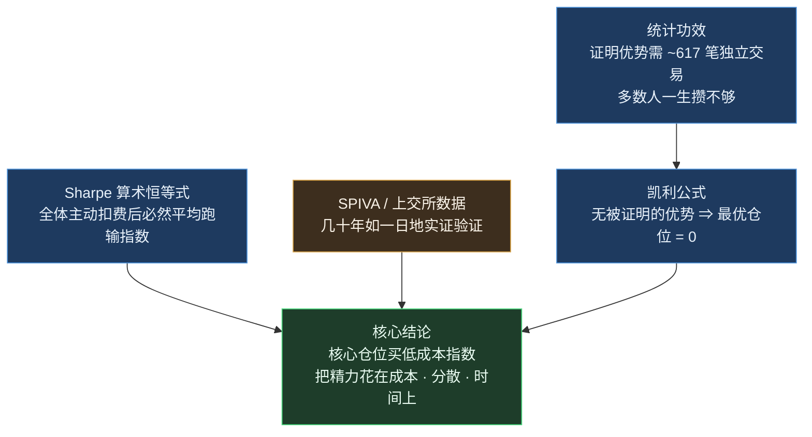

# 凯利公式与股市投资的数学基石：定理、实证与可执行操作

> **摘要**：本报告以凯利公式 f\* = (bp − q)/b 为起点，系统梳理「应用于股市投资、在其假设下数学上严格成立」的七块定理基石（凯利仓位、统计功效、期望值与破产风险、波动拖累、复利与年金、Markowitz 分散化、Sharpe 主动管理算术），配合经独立核验的公开实证数据（SPIVA、巴菲特十年赌局、Barber & Odean、上交所全账户研究等），推导出面向普通投资者的可执行操作路径，并给出常见误区的数学拆解。全文严格区分 **A 类**（数学恒等式/定理，附成立假设）与 **B 类**(实证统计，附样本与时间范围)两类结论，所有数字均经多来源交叉核验与独立复算。
>
> **免责声明**：本文为教育与科普性质的调研文献，不构成投资建议。费率、限购、收益率等均为 2023–2026 年间公开报道的时点快照。

---

## 0. 结论先行："绝对正确"在股市里分两种

**没有任何公式能"绝对正确地预测市场"**——若有人如此宣称，其本身就违反本文 §1.7 的算术恒等式。真正严格成立的只有两类：

- **A 类 · 数学恒等式/定理**：只要假设成立，结论必然成立。它们不预测明天涨跌，只约束"怎么下注、怎么付钱、怎么复利"。
- **B 类 · 实证统计**：被反复核验的历史数据，高度可信但依赖样本期，不是定律。

七块 A 类数学拼起来，推出一个明确到有点扫兴的操作答案：

---

## 1. 七块数学基石（A 类，附成立假设与算例）

### 1.1 凯利公式：决定"押多少"，而非"押哪边"

**离散形式**（Kelly 1956 [1]）：

$$f^* = \frac{bp - q}{b}$$

其中 p 为胜率、q = 1 − p、b 为净赔率（每冒 1 元亏损风险能赢几元）。f\* 是最大化长期对数财富增长率 g(f) = p·ln(1+bf) + q·ln(1−f) 的唯一解。

**成立假设**：各次下注独立同分布且可无限重复；p、b 已知且精确；以最大化 E[ln W] 为目标；资金可无限细分。

**算例**：胜率 55%、赔率 1:1（b = 1）⇒ f\* = (0.55 − 0.45)/1 = **10%**。此时每注对数增长率 ≈ +0.50%；若押到 2 倍凯利（20%），增长率变为 **−0.014%** —— 从最优直接跌穿零，长期几乎必然归零（数值经复算）。

两条最反直觉的性质：

1. **期望不正就别玩**：bp ≤ q 时 f\* ≤ 0，最优仓位是**零**。凯利从不告诉你买什么，它只在你已证明有优势之后才开口。
2. **押过头的惩罚不对称**：少押损失的是速度，多押赌上的是生死。

**连续形式**（Thorp 2006 [2]）：资产漂移 μ、波动 σ、无风险利率 r 下，g(f) = r + f(μ−r) − f²σ²/2，最优杠杆

$$f^* = \frac{\mu - r}{\sigma^2}$$

**算例**：μ = 8%、r = 2%、σ = 20% ⇒ f\* = 0.06/0.04 = **150% 仓位**——全凯利在股市根本不可执行，这正是实务采用分数凯利的入口。

**分数凯利性质**（MacLean-Thorp-Ziemba 2010 [3]，由 g(f) 二次型可直接推出 c(2−c) 系数关系）：下注 c·f\* 时超额增长率 = c(2−c)·(μ−r)²/(2σ²)。

| 凯利倍数 c | 超额增长率保留 | 波动率 | 方差 |
|:---:|:---:|:---:|:---:|
| 1.0（全凯利） | 100% | 1× | 1× |
| **0.5（半凯利）** | **75%** | **0.5×** | **0.25×** |
| 2.0 | **0%**（= 无风险利率） | 2× | 4× |
| > 2.0 | 为负（若 r=0 则长期归零） | — | — |

### 1.2 统计功效：你凭什么相信自己有优势？

凯利的前提"p 已知"恰是最难的一环。检验 H₀: p = 0.5 vs H₁: p = 0.55，所需独立交易笔数（单比例检验样本量公式，Penn State STAT 507 [14]；经正态近似与精确二项分布双重复算）：

| 检验设定 | 所需笔数 |
|:---|:---:|
| 仅 5% 显著性（功效 ≈ 50%） | ≈ 271 笔 |
| 5% 显著性 + 80% 功效 | **≈ 617 笔**（精确二项：n=617 时功效 78.7%，n=650 达 80.7%） |
| 5% 显著性 + 95% 功效 | ≈ 1077 笔 |

**操作含义**：绝大多数散户十年也攒不出 617 笔独立交易——即**多数人终其一生无法在统计上证明自己有选股优势，只能"感觉有"**。在攒够样本之前，f\* 的诚实估计就是 0。

**成立假设**：各笔交易独立同分布、真实胜率恒定；若交易相关（同一行情下的连环止损/止盈）或胜率漂移，所需样本更大。

### 1.3 期望值与破产风险：正期望也可能死在半路

- **期望值**（概率论定义，无条件成立）：E = p·W − q·L。E ≤ 0 的系统玩得越久亏得越多，没有仓位技巧能挽救。
- **赌徒破产定理**（Grinstead & Snell [15]）：固定注额 1:1 下注、胜率 p > q、初始资金 z 个单位，破产概率 R = (q/p)^z；p ≤ q 时 R = 1。

**算例**：p = 0.55 时，本金 10 个单位 ⇒ 破产概率 (0.45/0.55)¹⁰ ≈ **13.4%**；本金 20 个单位 ⇒ ≈ **1.8%**。同样的优势，单笔仓位小一半，存活概率完全不同——这就是"单笔风险不超过总资金 1%–2%"纪律的数学出处。

### 1.4 波动拖累与回本恒等式：亏 50% 要赚 100% 才回本

- **回本恒等式**（纯代数，无条件成立）：亏损 L 后需涨 L/(1−L) 回本。亏 20% → 需 +25%；亏 50% → 需 **+100%**；亏 70% → 需 +233%。
- **波动拖累**（Messmore 1995 [4]）：几何平均 G ≈ 算术平均 A − σ²/2（对数正态下有精确式 1+G = (1+A)·e^{−s²/2}）。

**算例**：先 +50% 再 −50%，算术平均 0%，实际 100 → 150 → 75，**亏 25%**（每期几何平均 −13.4%）。A = 10%、σ = 20% ⇒ G ≈ 8%（精确 7.82%）。

**操作含义**：两个平均收益相同的策略，波动小者长期更值钱。控制回撤不是胆小，是算术。

### 1.5 复利与定投公式：时间是唯一免费的杠杆

普通年金终值（等比数列求和，纯代数 [16]）：

$$FV = PMT \times \frac{(1+i)^n - 1}{i}$$

**算例**：每月末定投 1000 元、年化 6%（i = 0.5%）、20 年（n = 240）⇒ 终值 ≈ **462,041 元**，其中本金 24 万、复利收益约 22.2 万（经逐月现金流模拟复核）。公式对"早开始"的奖励远大于"多聪明"。

### 1.6 Markowitz 分散化：唯一的"免费午餐"

组合方差 σp² = ΣΣ wᵢwⱼρᵢⱼσᵢσⱼ（方差定义的直接推论 [5]）。当任意两资产 ρ < 1 时，组合波动率**严格小于**成分波动率的加权平均，而期望收益按权重线性保留——收益不牺牲、风险白降。

**算例**：两资产各 50%、σ 均为 30%、ρ = 0.3 ⇒ σp = **24.19%**（ρ=1 时 30%、ρ=0 时 21.21%、ρ=−1 时 0%；经复算）。反过来说：满仓一只股票 = 主动放弃这份免费午餐。

> 注："分散化是唯一免费午餐"一语广为归于 Markowitz，但 1952 原文并无此原话；本文仅对 ρ<1 ⇒ 波动严格下降这一数学内核负责。

### 1.7 Sharpe 主动管理算术：全体跑赢市场在算术上不可能

会计恒等式（Sharpe 1991 [6]，"only on the laws of addition, subtraction, multiplication and division"）：**市场收益 = 全体投资者收益的资金加权平均**（市场本来就是所有人持仓的总和）。故：

1. 主动资金**扣费前**的资金加权平均收益必然等于市场收益；
2. 主动交易成本更高 ⇒ **扣费后**全体主动资金平均必然跑输指数。

**算例**：市场涨 10%，80% 资金被动、20% 主动 ⇒ 10% = 0.8×10% + 0.2×X ⇒ X = 10%（被加法锁定）；扣 1.5% 成本后剩 8.5%。

**成立边界**（Pedersen 2018 [7]）：须先选定"市场"且主动+被动完整覆盖其市值；按资金而非人数加权；被动部分持有市场组合本身。它不排除个别人跑赢——但"大家一起跑赢"在算术上不存在。

---

## 2. 实证数据（B 类，数字均经独立核验）

| 数据点 | 数字 | 含义 |
|:---|:---|:---|
| SPIVA 美国记分卡（截至 2024 年底）[10] | 15 年期 **89.50%** 大盘主动基金费后跑输 S&P 500 | 主动选股长期赢是少数例外 |
| SPIVA 持续性记分卡（截至 2024 年底） | 2020-12 业绩头部四分位的大盘主动基金，**4 年后无一**仍在头部（随机基准 ≈ 0.39%） | 今年的冠军不可外推 |
| 巴菲特 vs Protégé 十年赌局（2008–2017，伯克希尔 2017 股东信原表） | 指数基金累计 **+125.8%**（年化 8.5%）vs 五只 FoF 平均 **+36.3%**（各自年化 0.3%–6.5%） | 费率 + 主动管理的十年复利差距（n=1 案例而非统计证明） |
| Morningstar 费率研究（Kinnel 2016 [12]） | 费率最低五分位基金 5 年"存活且跑赢同类"比例 **62%**，最贵五分位 **20%** | 费率是挑基金最可靠的预测变量 |
| Barber & Odean 2000 [8]（66,465 账户，1991–1996） | 换手最高组年化 **11.4%** vs 最低组 **18.5%**（市场 17.9%），费前收益几乎无差 | 频繁交易者费前不比人笨，费后差 7 个点/年 |
| 上交所全账户研究（施东辉、Jones、张晓燕，SSRN 3628809 [13]；2016.1–2019.6） | 市值 10 万以下散户平均 **−20.53%**，机构 **+11.22%**，同期上证指数约 +9% | A 股小散整体倒亏；"七亏二平一赚"的精确比例无官方出处，但方向被账户级数据支持 |
| Vanguard 一次性 vs 定投（1976–2022 [11]） | 一次性投入在 **61.6%–73.7%** 的 12 个月窗口胜出，中位多赚 1.2–2.2 个点；仅第 5 百分位尾部定投更优 | 钱越早入场期望越高；定投的价值主要是行为纪律 |
| 行为差距 | DALBAR 口径 2024 年差 8.5 个点（其方法论被 Edesess/Pfau/Kitces 批评为系统性夸大）；Morningstar《Mind the Gap》IRR 口径 10 年年均约 **1.1 个点** | 追涨杀跌的代价真实存在，但常被夸大；引用须并述两口径 |

---

## 3. 可执行操作路径（结合中国市场 2026 时点）

> 以下费率与制度为 2024–2026 年公开报道/公告快照，实操以最新法律文件为准。

### Step 0 · 入场前——收益率"有保证"的两件事

先还清高息债务（还掉 18% 的信用卡债 = 无风险赚 18%）；留 6–12 个月生活费于货币基金（2026-03 全市场 7 日年化均值约 1.10%）或国债逆回购（门槛 1000 元；GC001 平时约 1%–1.5%，长假前冲高，2025-12-30 达 2.28%）。

### Step 1 · 个人养老金账户（政策白送的钱）

每年 **12,000 元**税前抵扣、领取时按 3% 单独计税——边际税率高于 3% 即为确定性正收益（边际 20% 者年省税 2,400 元）。账户内指数基金 **Y 份额**管理费五折且免销售服务费（最低 0.15% + 0.05%/年）；2024-12 起制度全国推广并纳入首批 85 只指数基金。**注意**：资金锁定至法定退休；边际税率 ≤ 3% 的低收入者税收上可能不划算。

### Step 2 · 核心仓位 = 最低费率的宽基指数

2024-11 费率改革后主流宽基 ETF 最低档合计 **0.20%/年**（管理费 0.15% + 托管费 0.05%；旧档 0.60%）。持有 10 万元，费率差每年 400 元——§2 中 Morningstar 的数据说明这是全场最可靠的一笔"投资"。

看长期收益必须用**全收益指数**（含股息再投资）：沪深300 全收益自 2004-12-31 基日至 2024 年初年化约 **8.8%**（Wind 口径），价格指数同期仅约 7.3%——差出的 2–2.5 个点/年就是被"忽略分红"吃掉的。

### Step 3 · 定投自动化，用纪律代替判断

设置每月自动扣款（遇非交易日顺延；扣款失败不影响征信，连续 3 次失败协议通常自动终止）。数学上一次性投入胜率约 2/3（§2 Vanguard），但定投把"这次是不是高点"这个无法回答的问题从流程里删掉——行为差距主要死于择时。

### Step 4 · 跨市场分散，看清跨境工具的溢价

A 股 + 海外（QDII）兑现 §1.6 的免费午餐。但 2025–2026 年 QDII 额度紧张：场外限购低至单日 10–100 元；场内 QDII-ETF 溢价常态 1%–3%，高峰散点见 4% 以上直至个别 ~20%（2026-06 曾有 12 只纳指 ETF 集体停牌提示风险）。**溢价买入 = 先输一笔**：净值 1.00 元的 ETF 按 1.05 元买入，溢价收敛到 1% 时即使指数不跌也浮亏约 4%。

### Step 5 · 每年再平衡一次，只多不少

60/40 股债组合放任不管会漂成 80/20，组合波动上升约 1/3。年度再平衡或偏离 5% 阈值触发即可——Vanguard 研究：月/季/年频率的风险调整后收益无实质差异，更频繁只增加成本；再平衡的作用是**控风险**，不是抓收益。

### Step 6 · 把交易频率压到最低

A 股一买一卖成本约 **0.08%–0.12%**（印花税 0.05% 卖出单边 + 佣金典型万 1–万 2.5 + 经手费 0.00341% + 证管费 0.002% + 过户费 0.001%；**ETF 免印花税**，成本约低一半）。看似小钱，§2 的 Barber & Odean 数据说明高换手者正是被这些小钱千刀万剐。

场外基金 A/C 份额按持有期选：临界持有期 t = A 类实付申购费率 ÷ C 类年销售服务费率（费用结构恒等式）。典型参数下约 4–5 个月：短于此选 C，长于此选 A；2027-01 起指数基金持有超 1 年免收销售服务费，C 类适用面扩大。

---

## 4. 若坚持主动交易：凯利给出的三道门

1. **先证明优势**：完整记录扣费后交易，区分 55% vs 50% 胜率需约 617 笔（§1.2）；样本外（非回测调参所得）期望 E = pW − qL 必须 > 0。
2. **警惕自己的回测**：97 个学术发表的选股因子，样本外收益平均衰减 26%、发表后再衰减 58%（McLean & Pontiff 2016 [9]）；纯噪声试得够多也必然出漂亮曲线——从 N 次尝试挑出的最大样本内 Sharpe 按 √(2·ln N) 膨胀（Bailey et al. 2014 [17]），因子研究界已把显著性门槛提高到 t > 3.0（Harvey-Liu-Zhu 2016）。
3. **仓位 ≤ 1/4 凯利、单笔风险 ≤ 总资金 1%–2%**：参数是估计值，估计误差只会让真实凯利更低（§1.1 押过头惩罚不对称 + §1.3 破产风险）。

---

## 5. 避坑清单（每条背后都是上文的数学）

| 坑 | 一句话拆穿 | 数学/证据锚点 |
|:---|:---|:---|
| 长期持有杠杆 ETF | 每日重置：标的 +10% 再 −10% 剩 0.99，3 倍基金剩 0.91；真实案例 2008.12–2009.4 指数 +8% 而 3 倍做多 ETF **−53%**（FINRA 09-31） | §1.4 波动拖累（杠杆放大 σ²） |
| 亏损加倍摊平（马丁格尔） | 100 元起注连输 10 次后下一注需 10,240 元；有限资金下破产概率随轮次趋近 1（可选停时定理：公平赌局任何策略期望不变，负期望下严格为负） | §1.3 破产风险 |
| 追热点"拿着总会回来" | 纳指 2000-03 峰值后跌 78%，价格口径 **15 年**回本；日经 225 用了 **34 年**（1989-12 → 2024-02）。含股息口径回本更早，引用须注明 | §1.4 回本恒等式 |
| "感觉不对就清仓躲躲" | 2003–2022 持有 S&P 500 的 1 万美元变 6.48 万；错过最好 10 天只剩 2.97 万。但须并述批评：约 76%–78% 的最好交易日聚集在熊市或牛市头两个月，"错过最好 N 天"与"避开最差 N 天"都是事后反事实（Estrada 2008：前者 −50.8%、后者 +150.4%） | §2 行为差距 |
| 技术分析稳赚/全无效 | 学术综述（Park & Irwin 2007）：95 篇现代研究 56 正/20 负/19 混合，多数有数据窥探缺陷，经校正后显著性普遍减弱——既非"全玄学"也绝非"稳赚" | §4 回测过拟合 |
| 迷信历史冠军基金 | 幸存者偏差：>15 年样本的基金数据库业绩虚高约 1%/年（Carhart et al. 2002）；SPIVA 20 年期近 64% 的基金已清盘消失 | §2 SPIVA 持续性 |

---

## 6. 一句话收尾

凯利公式教你的不是怎么赢，而是**在没有被证明的优势面前保持零仓位，在有优势时押多少才不会死在证明成立之前**——而对绝大多数人，这条公式的输出就是：低成本指数基金 + 定投 + 分散 + 再平衡 + 别动。

---

## 参考文献（IEEE）

[1] J. L. Kelly Jr., "A New Interpretation of Information Rate," *Bell System Technical Journal*, vol. 35, no. 4, pp. 917–926, 1956. [Online]. Available: https://www.princeton.edu/~wbialek/rome/refs/kelly_56.pdf

[2] E. O. Thorp, "The Kelly Criterion in Blackjack, Sports Betting, and the Stock Market," in *Handbook of Asset and Liability Management*, vol. 1, Elsevier, 2006, pp. 385–428. [Online]. Available: https://gwern.net/doc/statistics/decision/2006-thorp.pdf

[3] L. C. MacLean, E. O. Thorp, and W. T. Ziemba, "Long-term capital growth: the good and bad properties of the Kelly and fractional Kelly criteria," *Quantitative Finance*, vol. 10, no. 7, pp. 681–687, 2010. [Online]. Available: https://www.stat.berkeley.edu/~aldous/157/Papers/Good_Bad_Kelly.pdf

[4] T. E. Messmore, "Variance Drain," *Journal of Portfolio Management*, vol. 21, no. 4, pp. 104–110, 1995.

[5] H. Markowitz, "Portfolio Selection," *Journal of Finance*, vol. 7, no. 1, pp. 77–91, 1952.

[6] W. F. Sharpe, "The Arithmetic of Active Management," *Financial Analysts Journal*, vol. 47, no. 1, pp. 7–9, 1991. [Online]. Available: https://web.stanford.edu/~wfsharpe/art/active/active.htm

[7] L. H. Pedersen, "Sharpening the Arithmetic of Active Management," *Financial Analysts Journal*, vol. 74, no. 1, pp. 21–36, 2018.

[8] B. M. Barber and T. Odean, "Trading Is Hazardous to Your Wealth: The Common Stock Investment Performance of Individual Investors," *Journal of Finance*, vol. 55, no. 2, pp. 773–806, 2000. [Online]. Available: https://faculty.haas.berkeley.edu/odean/papers%20current%20versions/individual_investor_performance_final.pdf

[9] R. D. McLean and J. Pontiff, "Does Academic Research Destroy Stock Return Predictability?" *Journal of Finance*, vol. 71, no. 1, pp. 5–32, 2016.

[10] S&P Dow Jones Indices, *SPIVA U.S. Scorecard Year-End 2024*. [Online]. Available: https://www.spglobal.com/spdji/en/spiva/article/spiva-us/

[11] Vanguard, *Cost averaging: Invest now or temporarily hold your cash?* 2023. [Online]. Available: https://www.nl.vanguard/professional/vanguard-365/cost-averaging

[12] R. Kinnel, *Predictive Power of Fees: Why Mutual Fund Fees Are So Important*, Morningstar, 2016. [Online]. Available: https://www.morningstar.com/funds/fund-fees-predict-future-success-or-failure

[13] C. M. Jones, D. Shi, X. Zhang, and X. Zhang, "Retail Trading and Return Predictability in China," SSRN Working Paper 3628809（基于上交所全样本账户数据，2016.1–2019.6）. [Online]. Available: https://papers.ssrn.com/sol3/papers.cfm?abstract_id=3628809

[14] Penn State University, *STAT 507: Epidemiological Research Methods — Lesson 10: Power and Sample Size*. [Online]. Available: https://online.stat.psu.edu/stat507/Lesson10.html

[15] C. M. Grinstead and J. L. Snell, *Introduction to Probability*, §12.2 Gambler's Ruin. [Online]. Available: https://stats.libretexts.org/Bookshelves/Probability_Theory/Introductory_Probability_(Grinstead_and_Snell)/12:_Random_Walks/12.02:_Gambler's_Ruin

[16] OpenStax, *Principles of Finance*, Ch. 8.2 Annuities. [Online]. Available: https://openstax.org/books/principles-finance/pages/8-2-annuities

[17] D. H. Bailey, J. M. Borwein, M. López de Prado, and Q. J. Zhu, "Pseudo-Mathematics and Financial Charlatanism: The Effects of Backtest Overfitting on Out-of-Sample Performance," *Notices of the AMS*, vol. 61, no. 5, pp. 458–471, 2014. [Online]. Available: https://www.ams.org/notices/201405/rnoti-p458.pdf

[18] FINRA, *Regulatory Notice 09-31: Leveraged and Inverse ETFs*. [Online]. Available: https://www.finra.org/rules-guidance/notices/09-31
