> [!IMPORTANT]
>
> **调研范围**：基于 Snowflake 官方文档（docs.snowflake.com）及权威资料，以**正交分解**为方法论，将 Snowflake 数据云平台拆解为 10 个独立变化的维度——架构、存储、计算、数据工程、开发、AI/ML、安全治理、数据共享、业务连续性、成本管理——逐一深入梳理，最后以能力全景矩阵、主流方案横向对比与选型建议收束。面向"非数据库专家也能读懂"的受众，关键术语配白话解释与生活类比。

> **方法论说明**：所谓**正交分解**，就是找出系统中"彼此独立变化"的维度，像坐标系一样分开讨论——存储扩容不影响计算、安全策略不耦合数据共享——从而避免"一锅炖"式理解。本文第一部分先给全景（总），第二部分按 10 维度展开（分），第三部分综合对比（总）。

---

## 第一部分 · 总（Overview）

### 1. 背景：为什么需要重新理解数据平台

数据基础设施在过去三十年经历了一条清晰的演进脉络：

| 阶段 | 代表 | 核心特征 | 痛点 |
|---|---|---|---|
| 单机数据库 | Oracle/MySQL | OLTP，存储计算绑定 | 分析能力弱 |
| MPP 数仓 | Teradata/Greenplum | 专用硬件并行分析 | 扩容昂贵、运维重 |
| 大数据湖 | Hadoop/Spark | 廉价存储 + 分布式计算 | 治理弱、性能不稳 |
| 云数仓 | Redshift/BigQuery/Snowflake | 云原生、按需弹性 | 早期仍偏"云上的数仓" |
| **数据云 / AI 数据云** | **Snowflake** | **跨云跨组织、结构化到 AI 统一平台** | — |

Snowflake 的定位不是"部署在云上的数据库"，而是一个 **SaaS 化的"数据云（Data Cloud）"**<sup>[[ref-d1-1]](#ref-d1-1)</sup>——它把存储、计算、共享、治理、AI 统一在一个全托管服务里，跨越 AWS、Azure、GCP 三大云，让数据可以在账户之间、云之间、组织之间零拷贝流动。

> 白话一句话：**Snowflake = 存储计算分离 + 全托管 SaaS + 零拷贝共享 + 原生 AI 的数据云**。你不再"买服务器跑数据库"，而是"按用量订阅一个数据平台"。

### 2. 核心架构总览

Snowflake 自我定义为"共享磁盘（shared-disk）与无共享（shared-nothing）架构的混合体"<sup>[[ref-d1-1]](#ref-d1-1)</sup>——底层是统一的中央存储（共享磁盘的简洁），上层是多个独立计算集群并行处理（无共享的性能），中间由智能服务层协调全局。

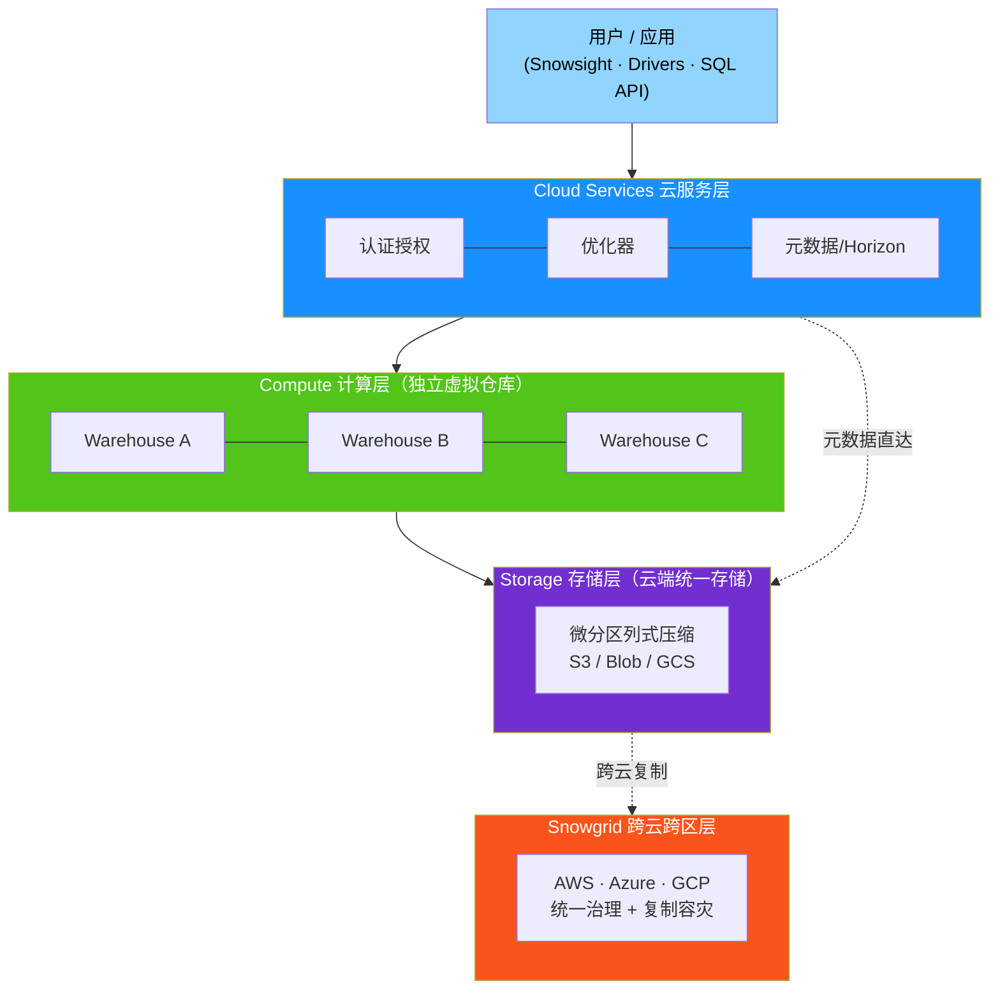

**三层各司其职**：

| 层 | 职责 | 白话类比 |
|---|---|---|
| **Cloud Services** | 认证授权、查询优化、元数据管理、Horizon 治理目录、基础设施管理 | 图书馆的"管理员 + 借阅系统" |
| **Compute（虚拟仓库）** | 执行 SQL 与代码，多个仓库彼此隔离、互不干扰 | 独立的"快递分拣中心" |
| **Storage** | 微分区列式压缩，落在云对象存储 | 图书馆的"书架格" |

**第一性原理——存储计算分离**：传统数据库把存储和计算"焊"在同一台机器上，扩存储必须连带买 CPU，反之亦然。Snowflake 把二者彻底拆开，存储在云端统一存放，计算按需起停，各自独立扩缩、独立计费<sup>[[ref-d1-1]](#ref-d1-1)</sup>。这是后续所有特性（弹性、零拷贝克隆/共享、按秒计费、多工作负载隔离）的物理基础。

> 全托管 SaaS：无需选硬件、装软件、调运维，升级和维护由 Snowflake 负责<sup>[[ref-d1-1]](#ref-d1-1)</sup>。三层架构的深度展开（含三级缓存体系与 Snowgrid 跨云细节）见后文 [D1](#d1--架构基石三层分离与多云)。

### 3. 与传统数据库/数仓的本质区别

| 传统数仓痛点 | Snowflake 解法 | 对应维度 |
|---|---|---|
| 存储计算耦合，扩缩牵一发动全身 | 三层分离，独立弹性 | D1 |
| 分区只能按一个键裁剪，调优重 | 微分区 + 全列 min/max 自动裁剪 | D2 |
| 加大机器只为扛并发 | 多集群仓库，按并发水平扩展 | D3 |
| 数据搬运靠 ETL，慢且贵 | 零拷贝克隆 / 共享，元数据指针 | D2 / D8 |
| 共享数据要复制导出 | 零拷贝数据共享，消费者零存储成本 | D8 |
| 容灾要自建备库 | Time Travel + Fail-safe + 跨云复制 | D9 |
| 代码要把数据搬到外部算 | Snowpark pushdown，代码下沉到数据侧 | D5 |
| AI 要把数据导出去训 | Cortex 在治理边界内运行，数据不出域 | D6 |

> 一句话差异化清单：**自动微分区裁剪、存储计算分离、按秒计费、零拷贝克隆与共享、Time Travel、Snowpark pushdown、Cortex 原生 AI**——这七点是 Snowflake 区别于传统数仓的标志。

---

## 第二部分 · 分（正交维度深入）

> 下面 10 个维度彼此正交：每个解决一类独立问题，可单独理解、单独演进。每节先一句话说清"解决什么问题"，再展开机制、表格与图。

### D1 · 架构基石：三层分离与多云

> **解决什么问题**：传统数据库把"存储"和"计算"焊死在同一台机器上——数据量增大要换更大的服务器，查询变多又要换更大的服务器，两者互相牵制、无法独立伸缩。Snowflake 用三层分离架构拆开了这个死结，让你能像独立调音量大小和屏幕亮度一样，分别按需扩缩存储和算力。

Snowflake 被定义为"共享磁盘（shared-disk）与无共享（shared-nothing）数据库架构的混合体"<sup>[[ref-d1-1]](#ref-d1-1)</sup>：底层是统一的中央数据存储（共享磁盘的简洁性），上层是多个独立计算集群并行处理（无共享的高性能），中间由智能服务层协调全局。

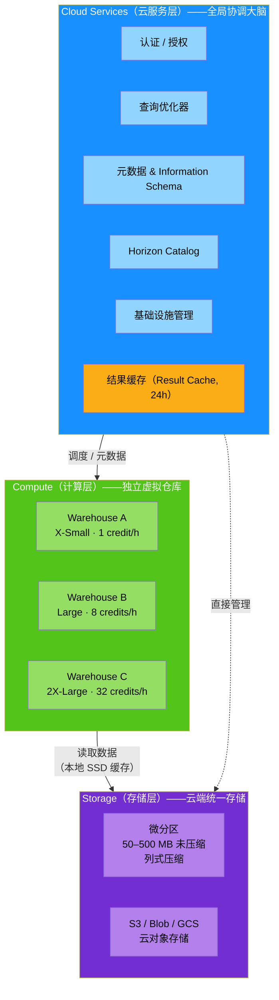

#### 第一性原理：存储计算分离

传统数据库架构中，存储和计算绑定在同一物理节点上（如 Hadoop/HDFS 生态）。这带来三个根本矛盾：

- **扩缩瓶颈耦合**：数据增长需要更多磁盘，但买磁盘就必须连带买 CPU 和内存；反之亦然。
- **多工作负载互相干扰**：BI 报表、ETL 批处理、Ad-hoc 分析挤在同一集群，互相抢占资源。
- **运维复杂度高**：分区策略、索引调优、磁盘容量规划都成为 DBA 的沉重负担。

> [!TIP]
> 把存储计算分离想象成**共享单车 vs 私家车**。传统数据库像私家车——车（计算）和车库（存储）绑定在一起，车位不够就得连车一起换。Snowflake 更像共享单车模式：所有数据停在统一的"公共停车桩"（云存储），你需要骑车（查询）时，从最近的"仓库"（虚拟仓库）取一辆车，骑完还回去。停车桩和单车可以各自独立扩容。

Snowflake 的架构将"任何任务的成本"解耦为三种独立的用量类型：**计算（Compute）、存储（Storage）、数据传输（Data Transfer）**，各自独立计量和计费<sup>[[ref-d1-2]](#ref-d1-2)</sup>。

---

#### Cloud Services 层：全局协调大脑

Cloud Services 是 Snowflake 的"中枢神经系统"——它不在存储层，也不在计算层，而是独立运行在 Snowflake 从云厂商调配的计算实例上，负责统筹全局<sup>[[ref-d1-1]](#ref-d1-1)</sup>。

> 白话解释：如果把 Snowflake 比作一座图书馆，Cloud Services 就是"图书管理员 + 借阅系统"——你不直接去书架翻书，而是告诉管理员你要什么书，管理员帮你定位、检索、授权，然后派"取书员"（虚拟仓库）去取。

**核心服务一览**：

| 服务 | 职责 | 生活类比 |
|---|---|---|
| 认证与授权 | 验证用户身份、执行 RBAC 角色权限控制 | 图书馆门禁 + 借阅证 |
| 查询优化器 | 解析 SQL，生成最优执行计划，决定用哪个仓库、扫描哪些分区 | 导航软件规划最优路线 |
| 元数据管理 | 维护所有对象的元数据（表结构、分区统计、用户角色等），含 SNOWFLAKE 数据库和 Information Schema | 图书馆的索书号目录 |
| Snowflake Horizon Catalog | 统一的数据治理目录，覆盖分类、标签、访问策略 | 图书馆的分类索引系统 |
| 基础设施管理 | 与底层云平台（AWS/Azure/GCP）交互，调配和管理资源 | 图书馆的物业设施管理 |
| 合规管理 | 支持 SOC 2、HIPAA、PCI DSS 等合规标准 | 图书馆的安全审计规章 |

Cloud Services 层还承载了一个关键的"免费"功能：**结果缓存**（详见缓存体系小节），以及全部元数据的读写<sup>[[ref-d1-1]](#ref-d1-1)</sup><sup>[[ref-d1-3]](#ref-d1-3)</sup>。

**计费特点**：Cloud Services 的用量只有当"每日消费超过当日仓库计算用量的 10%"时才开始计费——也就是说，绝大多数场景下 Cloud Services 是**免费的**<sup>[[ref-d1-2]](#ref-d1-2)</sup>。

---

#### Compute 层：独立虚拟仓库

Compute 层由多个**虚拟仓库（Virtual Warehouse）** 组成，每个仓库是"Snowflake 中的一组计算资源集群"<sup>[[ref-d1-1]](#ref-d1-1)</sup>。

> [!TIP]
> 虚拟仓库就像**快递分拣中心**——每个分拣中心独立运作，有自己的传送带（CPU）、分拣架（内存）和暂存区（本地 SSD 缓存）。一个分拣中心忙不过来不会影响另一个；不需要时可以关停（auto-suspend），有新包裹来了自动开门（auto-resume）。

**两个核心特性**<sup>[[ref-d1-1]](#ref-d1-1)</sup>：

1. **完全隔离**：每个虚拟仓库是独立的计算集群，彼此不共享计算资源。
2. **互不干扰**：一个仓库上的工作负载对其他仓库的性能没有任何影响。

**仓库规格矩阵**（Gen1 标准仓库）<sup>[[ref-d1-4]](#ref-d1-4)</sup>：

| 规格 | Credits/Hour | 相对算力 | 典型场景 |
|---|---|---|---|
| X-Small | 1 | 1x | 开发测试、轻量查询 |
| Small | 2 | 2x | 小规模数据加载 |
| Medium | 4 | 4x | 中等规模 BI 查询 |
| Large | 8 | 8x | ETL 批处理 |
| X-Large | 16 | 16x | 大规模数据分析 |
| 2X-Large | 32 | 32x | 复杂报表 |
| 3X-Large | 64 | 64x | 大规模机器学习 |
| 4X-Large | 128 | 128x | 超大规模数据处理 |
| 5X-Large | 256 | 256x | 极端计算密集型 |
| 6X-Large | 512 | 512x | 超大规模并行处理 |

**计费规则**<sup>[[ref-d1-4]](#ref-d1-4)</sup>：

- 按秒计费（per-second billing），每次启动有 **60 秒最低消费**。
- 仓库仅在实际消耗 credits 时计费。
- 自动挂起（Auto-suspend）和自动恢复（Auto-resume）默认开启——仓库空闲时自动关闭停止计费，收到查询时自动启动。
- **多集群仓库**（Multi-cluster Warehouse）：单个仓库可包含多个集群以处理并发，为 Enterprise 版功能。例如，3X-Large 多集群仓库运行 1 个集群 1 小时 + 2 个集群 1 小时 = 64 + 128 = 192 credits<sup>[[ref-d1-4]](#ref-d1-4)</sup>。

---

#### Storage 层：云端统一存储

存储层是 Snowflake 的"地基"——所有数据最终落地在底层云厂商的对象存储中（如 Amazon S3、Azure Blob Storage、Google Cloud Storage），但 Snowflake 在上层做了大量透明优化<sup>[[ref-d1-1]](#ref-d1-1)</sup>。

> 白话解释：存储层就像图书馆的**书架格**——每本书（微分区）都有固定的格位，书的内容被压缩收纳，目录卡片（元数据）记录了每格的书目信息。你查书时，管理员先看目录卡片判断"这个格子里有没有我要的内容"，有的话才去取——这就是"裁剪"。

**微分区（Micro-partitions）** 是存储层的最小管理单元，也是 Snowflake 性能优势的物理基础<sup>[[ref-d1-5]](#ref-d1-5)</sup>：

| 特性 | 说明 |
|---|---|
| 大小 | 每个微分区包含 **50–500 MB 未压缩数据**，实际存储时始终压缩 |
| 存储格式 | **列式存储**——列在微分区内部独立存储，可按需扫描特定列 |
| 压缩 | 每个微分区按列**独立压缩**，Snowflake 自动选择最优压缩算法 |
| 不可变性 | 微分区本质不可变——DML 操作（UPDATE/DELETE）创建新微分区，而非修改旧分区（Copy-on-Write 模型） |
| 自动分区 | 数据加载时**自动透明分区**，无需 DDL 定义分区策略 |
| 元数据 | 每个微分区记录每列的**值范围（min/max）、去重值数量等**统计信息 |
| 规模 | 单张表可包含数百万乃至上亿个微分区 |

**数据裁剪（Pruning）机制**<sup>[[ref-d1-5]](#ref-d1-5)</sup>：

查询执行时，优化器利用每个微分区的 min/max 元数据，在扫描前"裁剪"掉不可能包含目标数据的微分区。例如：一张包含全年数据的表（8760 小时），查询某 1 小时数据时，理想情况下只需扫描 1/8760 的微分区。再叠加列式扫描，只有相关列的数据被读取——这就是 Snowflake 能实现"亚秒级时间范围查询"的关键。

> [!TIP]
> 微分区裁剪就像**快递分拣中心的条码扫描**——包裹（查询条件）到分拣线，扫描器（优化器）读取每个格子的条码范围（min/max 元数据），一看"这格没有目标包裹"就跳过，只有匹配的格子才打开检查。全自动化，无需人工配置。

---

#### 三级缓存体系

Snowflake 的缓存设计精妙地利用了三层架构，形成从快到慢的三级缓存层级：

| 缓存层级 | 位置 | 内容 | 有效期 | 触发条件 |
|---|---|---|---|---|
| **结果缓存**（Result Cache） | Cloud Services 层 | 完整查询结果集 | **24 小时**（每次命中重置，最长 31 天） | 完全相同的查询 + 底层数据未变 + 无非确定性函数 |
| **本地缓存**（Local Cache） | 虚拟仓库计算节点 SSD | 表数据（微分区数据） | 仓库运行期间 | 仓库运行时自动积累；仓库挂起时**清空** |
| **远程磁盘**（Cloud Storage） | 云对象存储 | 全量数据（压缩微分区） | 永久 | 数据写入即持久化 |

**结果缓存细节**<sup>[[ref-d1-3]](#ref-d1-3)</sup>：

- 命中条件极为严格：SQL 文本必须**完全一致**（大小写、空格、别名差异均导致 miss）；不能包含 `RANDOM`、`UUID_STRING` 等非确定性函数；不能引用外部函数；底层数据未变化；用户角色有对应权限。
- 每次命中缓存，24 小时计时器重置，最长保留 31 天。
- 大结果（>100KB）的访问令牌 6 小时过期，可重新获取。
- 可通过 `USE_CACHED_RESULT` 会话参数控制开关。
- `RESULT_SCAN` 函数可对缓存结果做后处理，将上次查询结果当作虚拟表进一步分析。

**本地缓存细节**<sup>[[ref-d1-6]](#ref-d1-6)</sup>：

- 仓库运行时在计算节点本地 SSD 上缓存频繁访问的表数据。
- **仓库挂起时缓存全部清空**——这是 auto-suspend 设置的核心权衡。
- 推荐配置：BI/查询密集型仓库 auto-suspend 至少 10 分钟（保缓存）；任务型仓库立即挂起；DevOps/Data Science 约 5 分钟。

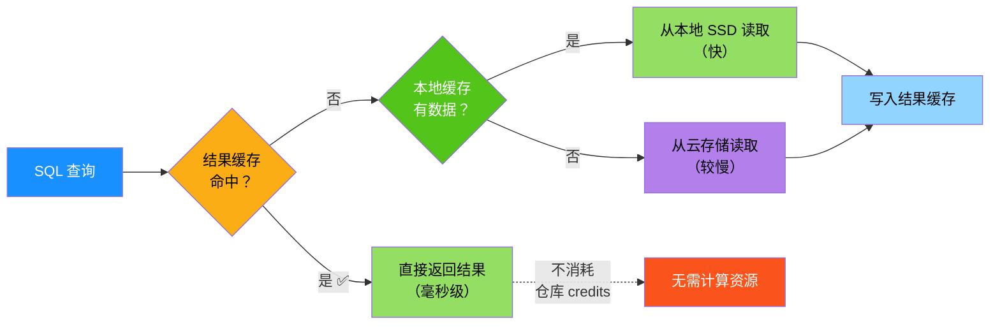

> [!TIP]
> 三级缓存就像**厨房做菜的三个食材存放点**：结果缓存是"做好的成品菜放保温柜"（直接端上桌，最快）；本地缓存是"冰箱里的常用食材"（拿来就切，很快）；云存储是"超市仓库"（需要出门采购，最慢但储量无限）。

---

#### Snowgrid：跨云跨区技术层

Snowgrid 是 Snowflake 的**跨区域、跨云技术层**，使数据生态系统能够跨越 AWS、Azure、GCP 三大云平台和全球多个区域连通<sup>[[ref-d1-1]](#ref-d1-1)</sup>。

> 白话解释：Snowgrid 就像一个**全球连锁酒店的会员体系**——不管你住的是哪个品牌的酒店（AWS/ Azure/GCP 酒店），你的会员权益（安全策略、治理规则）在所有酒店通用，你甚至可以把行李（数据）从一家酒店复制到另一家以防万一（容灾）。

**核心能力**：

| 能力 | 说明 |
|---|---|
| 跨云连通 | 跨 AWS、Microsoft Azure、Google Cloud 区域连接数据生态系统 |
| 统一治理 | 在不同云和区域间保持一致的安全与治理策略 |
| 容灾恢复 | 通过复制实现灾难恢复和业务连续性 |

**复制机制**<sup>[[ref-d1-7]](#ref-d1-7)</sup>：

Snowflake 支持在**同一组织内**跨区域、跨云平台复制对象。两种核心组：

| 组类型 | 读/写能力 | 版本要求 |
|---|---|---|
| **复制组**（Replication Group） | 目标侧**只读** | 全部版本 |
| **故障转移组**（Failover Group） | 故障转移后目标侧可读**可写** | Business Critical+ |

复制组将一组对象作为整体单元从源账户复制到目标账户，提供时间点一致性。故障转移组在复制能力基础上增加故障转移功能——当源账户不可用时，可将目标账户中的次要组提升为主组，获得读写权限。

**可复制的对象**覆盖极广，包括：表、视图、存储过程、UDF、管道、流、任务、安全策略、标签、网络规则、用户、角色、仓库、集成等<sup>[[ref-d1-7]](#ref-d1-7)</sup>。

**版本限制**：Snowflake 默认阻止从 Business Critical 账户向更低版本账户复制数据（尤其是签有 HIPAA/HITRUST 协议的场景），除非显式使用 `IGNORE EDITION CHECK` 覆盖<sup>[[ref-d1-7]](#ref-d1-7)</sup>。

---

#### 全托管 SaaS

Snowflake 是一个**完全自管理的服务**，运行在云基础设施上<sup>[[ref-d1-8]](#ref-d1-8)</sup>。这意味着：

| 传统数据库 / 自建方案 | Snowflake 全托管 |
|---|---|
| 需要购买、安装、配置硬件 | 无硬件——零基础设施投入 |
| 需要安装、升级数据库软件 | 无软件运维——Snowflake 自动管理 |
| 需要规划磁盘容量、内存分配 | 存储和计算自动弹性伸缩 |
| 需要手动配置高可用和备份 | 内置容灾（Time Travel + Fail-safe） |
| 需要停机维护窗口 | 自动升级——无停机更新 |

**多云部署**<sup>[[ref-d1-8]](#ref-d1-8)</sup>：

三层架构（存储、计算、云服务）均完全部署和管理在选定的云平台上。每个账户完全运行在单一云平台上，但不同账户可以选择不同云平台——这使组织能按区域或业务需求灵活选云。支持三大平台：

- **Amazon Web Services（AWS）**
- **Google Cloud Platform（GCP）**
- **Microsoft Azure**

不同区域和平台的 credit 单价和存储单价有所差异<sup>[[ref-d1-8]](#ref-d1-8)</sup>。

---

#### 四版次体系

Snowflake 提供四个功能层级，各版本在上层功能和安全等级上递进<sup>[[ref-d1-9]](#ref-d1-9)</sup>：

| 维度 | Standard | Enterprise | Business Critical | VPS |
|---|---|---|---|---|
| Time Travel | 1 天 | 最长 **90 天** | 最长 90 天 | 最长 90 天 |
| Fail-safe | 7 天 | 7 天 | 7 天 | 7 天 |
| 多集群仓库 | — | ✔ | ✔ | ✔ |
| 物化视图 / 搜索优化 | — | ✔ | ✔ | ✔ |
| HIPAA / HITRUST 合规 | — | — | ✔ | ✔ |
| PCI DSS 合规 | — | — | ✔ | ✔ |
| 列级 / 行级安全 | — | — | ✔ | ✔ |
| Tri-Secret Secure（客户管理密钥） | — | — | ✔ | ✔ |
| 账户故障转移/恢复 | — | — | ✔ | ✔ |
| 专用硬件隔离 | — | — | — | ✔ |
| FedRAMP / ITAR | — | — | — | ✔ |

**数据生命周期**（Time Travel + Fail-safe）<sup>[[ref-d1-10]](#ref-d1-10)</sup><sup>[[ref-d1-11]](#ref-d1-11)</sup>：

1. **活跃数据** → 当前正在使用的数据
2. **Time Travel** → 可配置的保留期（Standard 1 天，Enterprise+ 最长 90 天），用户可直接查询或恢复历史版本
3. **Fail-safe** → 固定 **7 天**缓冲期，由 Snowflake 全权管理，用户无法自助恢复
4. **永久删除** → Fail-safe 到期后数据彻底移除

> [!TIP]
> Time Travel + Fail-safe 就像**图书馆的图书流转机制**：在架的书是"活跃数据"；下架的书先放到"退书暂存区"（Time Travel），你还能去找回来（UNDROP）；暂存期过了移到"损毁处理间"（Fail-safe），只有馆长（Snowflake）能从里面抢救；过了处理间保留期，书就彻底销毁了。

---

#### 零拷贝：克隆与共享

Snowflake 的"零拷贝"能力是其架构分离带来的标志性特性——**克隆和共享均通过元数据指针实现，不移动任何实际数据**<sup>[[ref-d1-12]](#ref-d1-12)</sup>。

> [!TIP]
> 零拷贝克隆就像在电脑上创建一个**快捷方式**——你并没有复制文件本身，只是创建了一个指向原始文件的指针。无论原始文件多大，创建快捷方式都是瞬间完成的，也不占用额外磁盘空间。

| 操作 | 机制 | 数据移动 | 耗时 | 额外存储 |
|---|---|---|---|---|
| **克隆**（CLONE） | 元数据指针指向源微分区 | 无 | 近乎瞬时 | 零（仅元数据） |
| **共享**（Share） | 消费方通过元数据引用提供方数据 | 无 | 近乎瞬时 | 零（消费方不产生存储费） |

**Secure Data Sharing**<sup>[[ref-d1-12]](#ref-d1-12)</sup>：提供方创建 Share（一个命名的 Snowflake 对象，封装共享所需的所有信息），消费方从 Share 创建只读数据库。共享的数据在消费方账户中**零存储消耗**，消费方仅需为查询时使用的虚拟仓库计算资源付费。提供方对数据的更新实时对消费方可见，且可随时撤销访问。

---

#### 一次查询的层间流转

以一个典型的 `SELECT` 查询为例，追踪其在三层架构中的完整流转路径：

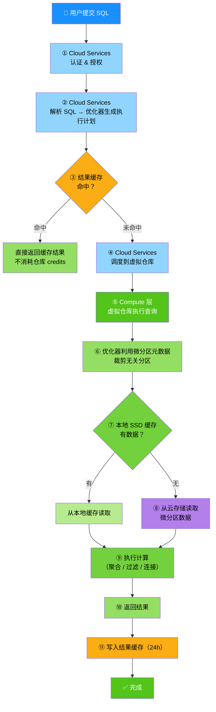

**关键要点**：

- 步骤 ③：如果结果缓存命中，查询**完全不消耗仓库 credits**——这是"免费"的查询<sup>[[ref-d1-3]](#ref-d1-3)</sup>。
- 步骤 ⑥：微分区裁剪在优化器阶段完成，实际扫描的微分区可能仅占总量的极小比例<sup>[[ref-d1-5]](#ref-d1-5)</sup>。
- 步骤 ⑦-⑧：本地缓存命中时从 SSD 读取（快），未命中时从云存储读取（较慢但透明）<sup>[[ref-d1-6]](#ref-d1-6)</sup>。
- 步骤 ⑪：查询结果写入结果缓存后，后续相同查询可直接复用<sup>[[ref-d1-3]](#ref-d1-3)</sup>。

---

#### 成本总览

Snowflake 的总成本由三部分构成<sup>[[ref-d1-2]](#ref-d1-2)</sup>：

> **总成本 = 计算成本（Compute） + 存储成本（Storage） + 数据传输成本（Data Transfer）**

| 成本类型 | 计量方式 | 关键规则 |
|---|---|---|
| **仓库计算** | Credits（按秒，60 秒起） | 仅实际使用时计费；auto-suspend 空闲即停止 |
| **Serverless 计算** | Credits（Snowflake 管理） | 自动伸缩，按实际用量计费 |
| **Cloud Services 计算** | Credits | 日用量 ≤ 仓库计算 10% 部分免费 |
| **存储** | 美元/TB/月 | 按每日平均磁盘字节计算 |
| **数据入站** | 免费 | 不收取数据导入费用 |
| **数据出站** | 美元/TB | 跨区域或跨云传输时收取 |

### D2 · 存储引擎：微分区、聚簇与数据模型

> **这一维度解决的核心问题是**：当数据量从 GB 级涨到 PB 级时，如何让查询仍然"快、省、不丢数据"？Snowflake 的答案是——把数据切成极小的列式块（微分区），自动维护每块每列的统计信息来实现全列裁剪，再叠加 Time Travel / Fail-safe 的生命周期保护和零拷贝克隆的元数据共享，让存储层在"高性能"与"高安全"之间不需要做取舍。

---

#### 微分区（Micro-Partitions）：全列裁剪的列式存储单元

微分区是 Snowflake 存储引擎的最小物理单元——数据加载时自动将行按连续顺序切分为 50–500 MB（未压缩）的数据块，以压缩列式格式存储，用户无需手动定义或维护<sup>[[ref-d2-1]](#ref-d2-1)</sup>。

> [!TIP]
> **生活类比——图书馆书架格**：传统数据库的分区像是图书馆按"年份"分区，你只能按年份找书架。微分区则像是每个书架格上贴了**所有维度**的标签（作者首字母范围、类别、出版社……），找书时可以按**任意维度**跳过不相关的书架格。

微分区与传统数据库分区的关键区别<sup>[[ref-d2-1]](#ref-d2-1)</sup>：

| 特性 | 传统分区 | Snowflake 微分区 |
|------|---------|-----------------|
| **大小** | 手动设定，大小不均 | 50–500 MB（未压缩），自动切分，尺寸均匀防倾斜 |
| **定义方式** | 需显式指定分区键和 DDL | 加载时自动生成，无需用户定义 |
| **裁剪范围** | 仅能按**单个分区键**裁剪 | 可对**任意列**（含半结构化数据列）裁剪 |
| **维护成本** | 需手动 Rebalance / Split / Merge | 完全自动 |
| **数据格式** | 行存储或按分区列组织 | 列式存储，每列独立压缩 |
| **不可变性** | 可原地更新 | **不可变**：任何 DML 操作生成新微分区，旧分区保留供 Time Travel |

每个微分区维护的**逐列元数据**<sup>[[ref-d2-1]](#ref-d2-1)</sup>：

| 元数据 | 作用 |
|--------|------|
| Min / Max 值范围 | 根据查询谓词跳过不可能命中数据的微分区 |
| 不同值数量（Distinct Count） | 辅助优化连接和聚合 |
| 额外统计属性 | 支持高效查询处理 |

**裁剪工作原理**：Snowflake 在查询时执行两层裁剪<sup>[[ref-d2-1]](#ref-d2-1)</sup>——

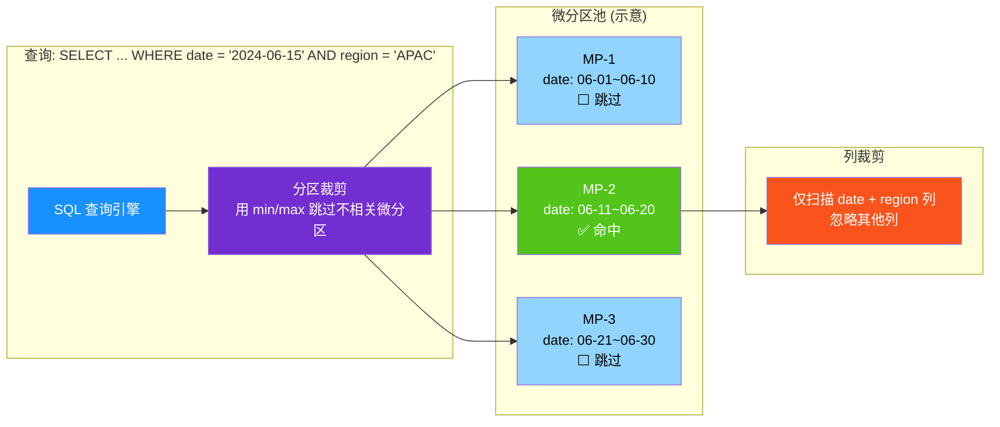

> [!TIP]
> **为什么全列裁剪很重要？** 传统数据库如果按 `date` 分区，查 `WHERE region = 'APAC'` 时无法跳过分区，必须全表扫描。微分区对**每一列**都维护了 min/max 范围，所以无论你按日期查还是按地区查，都能跳过不相关的数据块。文档原话："对微分区中列的精确裁剪发生在查询运行时，包括包含半结构化数据的列"<sup>[[ref-d2-1]](#ref-d2-1)</sup>。

---

#### 聚簇键与自动聚簇（Clustering Keys & Automatic Clustering）

聚簇键是用户在表上指定的一组列（或列表达式），用于将相关数据物理上聚集到相同的微分区中，从而进一步提升裁剪效率<sup>[[ref-d2-2]](#ref-d2-2)</sup>。

> [!TIP]
> **生活类比——快递分拣中心**：微分区自动裁剪像是快递按目的地省份分拣（天然就能跳过其他省份）。聚簇键则是进一步在"同省"内按城市再排好序，让"找某个城市的包裹"只需翻一个格子而非一整面墙。

**何时需要聚簇键**——并非所有表都需要<sup>[[ref-d2-2]](#ref-d2-2)</sup>：

| 适用条件 | 说明 |
|---------|------|
| 表足够大 | 通常需要 **多 TB 级**数据，微分区数量庞大 |
| 查询有选择性 | 查询只读取小比例的行或分区 |
| 高比例查询受益 | 大多数查询都能利用同一组聚簇键列 |
| 读多写少 | 查询频率远高于 DML 操作频率（高查询/DML 比率） |

**聚簇深度（Clustering Depth）** 是衡量表聚簇质量的核心指标<sup>[[ref-d2-1]](#ref-d2-1)</sup>：

- 深度 = 1 表示最优（微分区间值范围无重叠，称为"恒定状态"）
- 深度越大表示重叠越严重，查询时需扫描更多微分区
- 可通过 `SYSTEM$CLUSTERING_INFORMATION('表名')` 或 `SYSTEM$CLUSTERING_DEPTH('表名')` 查看

**聚簇键选择策略**<sup>[[ref-d2-2]](#ref-d2-2)</sup>：

| 优先级 | 策略 | 示例 |
|--------|------|------|
| 第一优先 | 最常用于**选择性过滤**的列 | 日期列（`order_date`） |
| 第二优先 | 常用于**连接谓词**的列 | 外键列（`customer_id`） |
| 列数上限 | 最多 **3–4 列** | `CLUSTER BY (date, region, product_id)` |
| 排序原则 | 从**低基**到**高基**排列 | 低基数列在前 |
| 高基降基 | 用表达式降低基数 | `TO_DATE(ts)` 代替原始时间戳 |

> [!TIP]
> **基数的平衡**：聚簇键不能太"窄"也不能太"宽"。布尔列（只有 true/false）基太低，几乎无法裁剪；纳秒时间戳基太高，维护聚簇代价极大。最佳实践是用 `TO_DATE()` 把高基列降为日期粒度<sup>[[ref-d2-2]](#ref-d2-2)</sup>。

**自动聚簇 vs 手动聚簇**<sup>[[ref-d2-2]](#ref-d2-2)</sup>：

| 特性 | 手动聚簇（Manual Reclustering） | 自动聚簇（Automatic Clustering） |
|------|------|------|
| 状态 | **已弃用**（部分账户仍允许但不推荐） | **推荐方式** |
| 维护 | 需手动触发 `ALTER TABLE ... RECLUSTER` | 完全自动，后台异步执行 |
| 计费 | 按虚拟仓库消耗 | 按 **Snowflake 无服务器计算（serverless compute）** 信用点计费 |
| 触发时机 | 手动 | 仅当聚簇操作**有实际收益**时执行 |
| DDL | `ALTER TABLE t CLUSTER BY (col)` | 同左（定义键后自动启用） |

定义聚簇键后，Snowflake 在 DML 操作导致聚簇退化时自动重组数据——将受影响的行删除并重新插入到聚簇更好的微分区中<sup>[[ref-d2-2]](#ref-d2-2)</sup>。聚簇操作会产生新微分区，旧微分区在 Time Travel + Fail-safe 保留期过后才被清除（最少 8 天，最长可达 97 天）<sup>[[ref-d2-2]](#ref-d2-2)</sup>。

---

#### 对象层级：从组织到表

Snowflake 的所有数据对象严格遵循四级嵌套容器结构<sup>[[ref-d2-3]](#ref-d2-3)</sup><sup>[[ref-d2-4]](#ref-d2-4)</sup>：

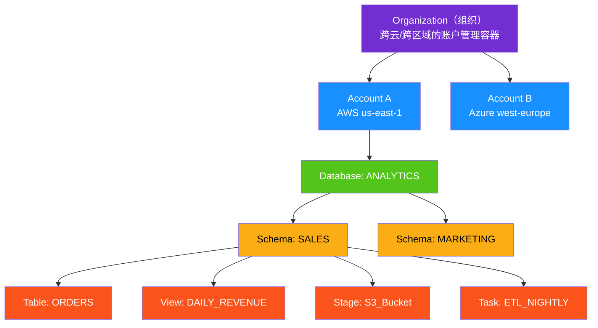

| 层级 | 说明 | 关键特性 |
|------|------|---------|
| **Organization** | 最高级容器，链接同一业务实体的所有账户 | 跨云（AWS/Azure/GCP）跨区域管理 |
| **Account** | 一组数据库、用户和计算资源的逻辑隔离单元 | 可分布于不同云和区域 |
| **Database** | Schema 的容器 | 权限和计费的基本单位 |
| **Schema** | 表、视图、Stage 等对象的容器 | 默认有 `PUBLIC` 和 `INFORMATION_SCHEMA` |
| **Object** | 表、视图、Stage、Stream、Task、Pipe、Function 等 | Schema 级对象 |

---

#### 表类型矩阵：七种表，各司其职

Snowflake 提供多种表类型以适应不同的工作负载和存储需求<sup>[[ref-d2-5]](#ref-d2-5)</sup><sup>[[ref-d2-6]](#ref-d2-6)</sup>：

| 表类型 | 存储位置 | 核心特征 | 典型场景 | Time Travel | Fail-safe |
|--------|---------|---------|---------|-------------|-----------|
| **Snowflake 表**（永久表） | Snowflake 托管 | 内部优化压缩列式，默认类型 | 生产数仓、维度/事实表 | 最长 90 天<sup>[[ref-d2-7]](#ref-d2-7)</sup> | 7 天<sup>[[ref-d2-8]](#ref-d2-8)</sup> |
| **Iceberg 表** | 外部云存储（用户管理） | 开放 Apache Iceberg 格式，跨引擎兼容 | 数据湖仓、避免厂商锁定 | 最长 90 天 | 7 天 |
| **Hybrid 表** | Snowflake 托管 | 行级锁 + 唯一/引用完整性约束 | OLTP 事务型工作负载 | 最长 90 天 | 7 天 |
| **External 表** | 外部云存储（只读引用） | 不加载数据，直接查询外部文件 | 查询数据湖、合规场景 | 不支持 | 不支持 |
| **Dynamic 表** | Snowflake 托管 | 声明式物化，按目标 Lag 定时刷新 | 增量数据管道、替代复杂 ETL | 最长 90 天 | 7 天 |
| **Transient 表** | Snowflake 托管 | 降低数据保护级别 | 可重建数据、开发/测试 | 0 或 1 天 | **无** |
| **Temporary 表** | Snowflake 托管（会话级） | 仅存在于创建它的会话中 | 会话级临时中间结果 | 0 或 1 天 | **无** |

> [!TIP]
> **如何选型？** 需要事务 ACID 和行级锁选 **Hybrid 表**；需要开放格式和多引擎兼容选 **Iceberg 表**；只想查询外部数据湖不想导入选 **External 表**；想用 SQL 声明数据管道选 **Dynamic 表**；其余场景默认选 **Snowflake 表**。

**Hybrid 表的特殊性**<sup>[[ref-d2-5]](#ref-d2-5)</sup>：
- 支持二级索引（`CREATE INDEX`）和主键/外键约束
- 数据始终按主键排序，**不能定义聚簇键**
- 克隆是**数据复制操作**（非元数据操作），不同于标准表的零拷贝克隆<sup>[[ref-d2-6]](#ref-d2-6)</sup>

---

#### 数据类型：结构化、半结构化、非结构化与地理空间

Snowflake 的数据类型体系覆盖从传统关系型到现代分析的全谱系<sup>[[ref-d2-9]](#ref-d2-9)</sup><sup>[[ref-d2-10]](#ref-d2-10)</sup><sup>[[ref-d2-11]](#ref-d2-11)</sup>：

| 类型族 | 具体类型 | 说明 |
|--------|---------|------|
| **数值型** | NUMBER(p,s), INTEGER, FLOAT, DECIMAL | 精度与标度可配置 |
| **字符串型** | VARCHAR, CHAR, TEXT, BINARY | 变长/定长字符串与二进制 |
| **逻辑型** | BOOLEAN | true / false / NULL |
| **日期时间型** | DATE, TIME, TIMESTAMP, TIMESTAMP_LTZ/TZ/NTZ | 支持多种时区语义 |
| **半结构化** | **VARIANT**, **ARRAY**, **OBJECT** | 灵活 Schema，原生支持 JSON/Avro/ORC/Parquet/XML |
| **地理空间** | **GEOGRAPHY**, **GEOMETRY** | 球面坐标系 vs 平面笛卡尔坐标系 |
| **非结构化** | 目录表（Directory Table） | 直接存储和查询 PDF、图片等文件 |
| **其他** | UUID, VECTOR | 唯一标识符与 AI/ML 向量 |

**半结构化类型详解**<sup>[[ref-d2-10]](#ref-d2-10)</sup>：

| 类型 | 说明 | 最大大小 | 类比 |
|------|------|---------|------|
| **VARIANT** | 可存储任意类型的值（含 OBJECT 和 ARRAY） | 128 MB（未压缩） | 一个万能容器 |
| **OBJECT** | 键值对集合（键为 VARCHAR，值为 VARIANT） | 128 MB | JSON 对象 |
| **ARRAY** | 按位置索引的 VARIANT 元素序列 | 索引范围 0 ~ 134,217,727 | JSON 数组 |

> [!TIP]
> **性能提示**：对于 JSON 中的原生类型（字符串、数字），存储在 VARIANT 列中的查询性能与关系列**几乎一致**。但日期/时间戳等**非原生类型**在 VARIANT 中存储为字符串，操作更慢且占用更多空间——建议提取为独立的类型化列<sup>[[ref-d2-10]](#ref-d2-10)</sup>。

**地理空间类型对比**<sup>[[ref-d2-11]](#ref-d2-11)</sup>：

| 特性 | GEOGRAPHY | GEOMETRY |
|------|-----------|---------|
| 地球模型 | 完美球体 | 平面（欧几里得/笛卡尔） |
| 坐标系统 | WGS-84（SRID 4326） | 任意 SRID（默认 0） |
| 线段解释 | 大圆弧 | 直线 |
| 距离单位 | 米 | 取决于坐标系统 |
| 适用场景 | 真实地理距离计算 | 局部投影、平面绘图 |

两种类型均支持 WKT、WKB、EWKT、EWKB 和 GeoJSON 格式的输入输出<sup>[[ref-d2-11]](#ref-d2-11)</sup>。

---

#### 数据生命周期：Time Travel → Fail-safe → 清除

数据在 Snowflake 中经历四个阶段，从活跃状态到最终清除<sup>[[ref-d2-7]](#ref-d2-7)</sup><sup>[[ref-d2-8]](#ref-d2-8)</sup>：


**Time Travel（时间旅行）**<sup>[[ref-d2-7]](#ref-d2-7)</sup>：

| 参数 | 说明 |
|------|------|
| `DATA_RETENTION_TIME_IN_DAYS` | 控制保留天数，可在账户/数据库/Schema/表级别设置 |
| Standard 版 | 默认 1 天，可设为 0 |
| Enterprise+ 版 | 永久表：0 到 **90 天**；Transient/Temporary 表：仅 0 或 1 天 |
| 设为 0 | 等效于关闭 Time Travel |

Time Travel 支持三种操作<sup>[[ref-d2-7]](#ref-d2-7)</sup>：

```sql
-- 1. 查询历史数据（支持 TIMESTAMP / OFFSET / STATEMENT）
SELECT * FROM orders AT(TIMESTAMP => '2024-06-26 09:00:00'::timestamp_tz);
SELECT * FROM orders AT(OFFSET => -60*5);  -- 5 分钟前
SELECT * FROM orders BEFORE(STATEMENT => '8e5d0ca9-...');

-- 2. 克隆历史状态
CREATE TABLE orders_backup CLONE orders AT(TIMESTAMP => ...);

-- 3. 恢复已删除对象
UNDROP TABLE orders;
UNDROP SCHEMA sales;
UNDROP DATABASE analytics;
```

**Fail-safe（安全网）**<sup>[[ref-d2-8]](#ref-d2-8)</sup>：

| 特性 | 说明 |
|------|------|
| 保留期 | **7 天，不可配置** |
| 起始时间 | Time Travel 保留期结束后立即开始 |
| 可用性 | **仅限 Snowflake 内部恢复**，不提供用户查询/克隆接口 |
| 适用场景 | 极端灾难恢复的最后手段——"当所有其他恢复方式都已尝试且失败后" |
| 恢复时间 | 数小时到数天 |
| 计算模型 | 使用 Snowflake 管理的无服务器计算，按标准无服务器费率计费 |

> [!TIP]
> **生活类比——保险箱 vs 快递柜**：Time Travel 像是快递柜（24~90 天自取，随时可拿回）；Fail-safe 像是银行保险箱（7 天，需要找银行经理开锁，仅限极端情况，自己拿不到）。

**最低总保留天数一览**（Standard 版 + 0 天保留）：

| 保留设置 | Active | Time Travel | Fail-safe | 总保留 |
|---------|--------|-------------|-----------|--------|
| Standard, 保留=0 | 当前 | 0 天 | 7 天 | ~7 天 |
| Standard, 保留=1 | 当前 | 1 天 | 7 天 | ~8 天 |
| Enterprise+, 保留=90 | 当前 | 90 天 | 7 天 | ~97 天 |

---

#### 零拷贝克隆：元数据指针的魔法

零拷贝克隆通过 `CREATE ... CLONE` 命令创建数据库、Schema 或表的完整副本——**不复制任何实际数据**，仅复制元数据指针<sup>[[ref-d2-6]](#ref-d2-6)</sup>。

> [!TIP]
> **生活类比——共享单车**：克隆一张表像是给一组共享单车拍了一张快照，另起一个停车桩标记"这些车从现在起也属于这个桩"。在你实际骑走（修改）某辆车之前，两根桩指向的是同一批车，不需要额外造一辆新车。

**工作原理（Copy-on-Write）**<sup>[[ref-d2-6]](#ref-d2-6)</sup>：

| 阶段 | 行为 | 存储开销 |
|------|------|---------|
| 克隆瞬间 | 复制元数据指针，指向源表的同一批微分区 | **几乎为零** |
| 源表被修改 | 源表受影响的行写入新微分区，旧微分区继续被克隆共享 | 仅增量部分 |
| 克隆被修改 | 克隆的修改写入新微分区，源表不受影响 | 仅增量部分 |

**典型用途**<sup>[[ref-d2-6]](#ref-d2-6)</sup>：

- **开发/测试环境**：秒级复制生产库用于测试，零额外存储成本
- **时间点恢复**：结合 Time Travel 克隆某个历史时刻的表状态
- **数据共享**：与零拷贝克隆机制类似，Snowflake 的数据共享也基于元数据指针而非数据复制

**克隆限制摘要**<sup>[[ref-d2-6]](#ref-d2-6)</sup>：

| 可克隆 | 不可克隆/有限制 |
|--------|---------------|
| 数据库（递归克隆所有子对象） | External 表（克隆数据库/Schema 时自动跳过） |
| Schema（递归克隆所有对象） | Hybrid 表（Schema 级不可克隆，数据库级可克隆但为数据复制） |
| 表、Iceberg 表、Dynamic 表 | 内部 Pipe（不克隆） |
| Stream、Task、Alert | 加载历史（Load History 不克隆） |

克隆后的表会继承源表的聚簇键定义，但**自动聚簇默认暂停**，需手动恢复<sup>[[ref-d2-6]](#ref-d2-6)</sup><sup>[[ref-d2-2]](#ref-d2-2)</sup>。

### D3 · 计算引擎：虚拟仓库与弹性

> **这一维度解决的核心问题是**：如何让"算力"像自来水一样——用时拧开、不用关闭、高峰自动扩、低谷自动缩，并只为真正消耗的部分付费。

在 Snowflake 的三层架构（Cloud Services / Compute / Storage）中，**计算层**由"虚拟仓库（Virtual Warehouse）"承载。虚拟仓库是一组由 Snowflake 管理的 CPU + 内存 + 本地缓存的计算资源集群，负责执行所有 SQL 查询、数据加载/卸载及 Snowpark 作业。它独立于存储层存在——存储计算分离意味着你可以在不移动数据的前提下，任意伸缩计算能力<sup>[[ref-d3-1]](#ref-d3-1)</sup>。

> [!TIP]
> 把虚拟仓库想象成**共享单车**：扫码（提交查询）即用，还车（查询完成）即停。停着不骑不收费，重新扫码时秒级"唤醒"。<sup>[[ref-d3-1]](#ref-d3-1)</sup>

---

#### 仓库规格：T-shirt 尺码与积分计费

虚拟仓库提供 10 档"T-shirt"规格，从小到大呈倍数递增。规格越大，可用的计算节点和并发度越高，每小时的积分（Credit）消耗也翻倍<sup>[[ref-d3-1]](#ref-d3-1)</sup>。

**关键术语：Credit（积分）** — Snowflake 的计算计量单位，1 Credit ≈ 一个计算单元运行 1 小时的费用，不同仓库规格消耗不同数量的积分。

| 仓库规格 | Credits/Hour | 适用场景（参考） |
|:---------|:------------:|:-----------------|
| **X-Small** | 1 | 开发测试、轻量查询 |
| **Small** | 2 | 小规模 ETL、BI 报表 |
| **Medium** | 4 | 中等数据量加载与分析 |
| **Large** | 8 | 常规生产负载 |
| **X-Large** | 16 | 大型查询、复杂分析 |
| **2X-Large** | 32 | 重负载报表 |
| **3X-Large** | 64 | 大规模数据转换 |
| **4X-Large** | 128 | 超大数据集扫描 |
| **5X-Large** | 256 | 海量数据处理 |
| **6X-Large** | 512 | 极端规模计算 |

> [!NOTE]
> 5X-Large 和 6X-Large 在 AWS / Azure 全区域正式可用（GA），在部分政府区域仍为预览状态<sup>[[ref-d3-1]](#ref-d3-1)</sup>。

**按秒计费，60 秒起步**：仓库每次启动后，计费精确到秒，最低收费为 60 秒。这意味着运行 5 秒和运行 60 秒的费用相同。之后每多一秒按比例计算<sup>[[ref-d3-1]](#ref-d3-1)</sup>。

| 运行时长 | X-Small (1 cr/h) | X-Large (16 cr/h) | 5X-Large (256 cr/h) |
|:---------|:-----------------:|:------------------:|:--------------------:|
| 0–60 秒 | 0.017 | 0.267 | 4.268 |
| 1 分钟 | 0.017 | 0.267 | 4.268 |
| 2 分钟 | 0.033 | 0.533 | 8.532 |
| 10 分钟 | 0.167 | 2.667 | 42.668 |
| 1 小时 | 1.000 | 16.000 | 256.000 |

---

#### Auto-Suspend 与 Auto-Resume：自动启停

仓库默认启用两个自动化行为，做到"用时即启、闲时即停"<sup>[[ref-d3-1]](#ref-d3-1)</sup>：

| 行为 | 说明 | 默认状态 |
|:-----|:-----|:---------|
| **Auto-Suspend** | 仓库无活动达到指定时长后自动暂停，停止计费 | 默认开启（通常 60 秒） |
| **Auto-Resume** | 新查询提交后自动恢复运行 | 默认开启 |

> [!IMPORTANT]
> 对于多集群仓库，Auto-Suspend 仅在**整个仓库**的最小集群数正在运行且无活动时触发；Auto-Resume 同样作用于整仓库级别，而非单个集群<sup>[[ref-d3-2]](#ref-d3-2)</sup>。

---

#### 多集群仓库：并发扩缩容

当大量用户同时连接同一个仓库时，单仓库的资源会被排队等待占满。**多集群仓库（Multi-Cluster Warehouse）** 通过自动增减集群数量来应对并发高峰，而不需要人工拆分仓库<sup>[[ref-d3-2]](#ref-d3-2)</sup>。

> [!TIP]
> 单仓库扩容（X-Small → Large）解决的是**单个查询跑得多快**（性能）；多集群扩容（1 cluster → 4 clusters）解决的是**多少查询能同时跑**（并发）。两者正交，不能混用<sup>[[ref-d3-2]](#ref-d3-2)</sup>。

**前置条件**：多集群仓库需要 **Enterprise Edition**（或更高版次）<sup>[[ref-d3-2]](#ref-d3-2)</sup>。

**两种运行模式**：

| 模式 | Min/Max 配置 | 行为 |
|:-----|:-------------|:-----|
| **Maximized（最大化）** | min = max（且 > 1） | 启动时全部集群同时拉起，始终保持最大算力；适合并发稳定且高位 |
| **Auto-Scale（弹性伸缩）** | min < max | 按需增减集群；低负载时自动缩减以节省积分 |

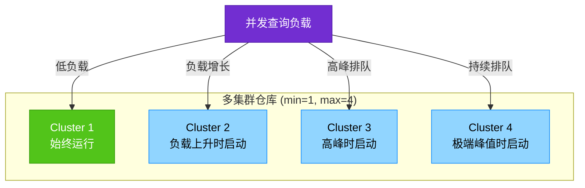

**扩缩容策略（仅 Auto-Scale 模式）**<sup>[[ref-d3-2]](#ref-d3-2)</sup>：

| 策略 | 目标 | 扩容触发条件 | 缩容触发条件 |
|:-----|:-----|:-------------|:-------------|
| **Standard**（默认） | 最小化排队，优先启动集群 | 查询排队或预估资源不足时立即启动新集群 | 持续低负载后关闭空闲集群 |
| **Economy** | 节省积分，优先充分利用现有集群 | 仅当预估新集群可被"至少忙 6 分钟"才启动 | 剩余工作 < 6 分钟时关闭集群 |

> [!TIP]
> 类比**快递分拣站**：Standard 策略是"只要看到包裹排队就开新传送带"；Economy 策略是"确认这批货足够多、新传送带能开满 6 分钟才开"。

**集群数上限（按仓库规格）**<sup>[[ref-d3-2]](#ref-d3-2)</sup>：

| 仓库规格 | 最大集群数 |
|:---------|:----------:|
| X-Small ~ Medium | 300 |
| Large | 160 |
| X-Large | 80 |
| 2X-Large | 40 |
| 3X-Large | 20 |
| 4X-Large ~ 6X-Large | 10 |

> [!NOTE]
> Snowsight UI 中集群数上限为 10；超过需通过 `ALTER WAREHOUSE` SQL 命令设置<sup>[[ref-d3-2]](#ref-d3-2)</sup>。

**计费示例（Medium, 4 credits/h, 3 clusters, Auto-Scale）**：集群 1 全程运行 2 小时 + 集群 2 运行 1 小时 + 集群 3 运行 30 分钟 → 总计 **14 credits**（而非 24 credits 的最大化模式费用）<sup>[[ref-d3-2]](#ref-d3-2)</sup>。

---

#### "仓库越大越快"的误区

这是 Snowflake 文档中反复强调的一点：**更大的仓库不一定带来更好的性能**，尤其在数据加载场景<sup>[[ref-d3-1]](#ref-d3-1)</sup>。

| 场景 | 仓库大小的影响 | 建议 |
|:-----|:-------------|:-----|
| **批量数据加载** | 性能主要取决于文件数量和大小，而非仓库规格 | Small/Medium/Large 通常足够；超大仓库多花积分但未必更快 |
| **大型复杂查询** | 大仓库拥有更多并行计算资源，可缩短执行时间 | 根据数据量选择；可先用 X-Large 测试 |
| **小型简单查询** | 大仓库**不会**更快 | 用小仓库即可，避免浪费 |

> [!IMPORTANT]
> 仓库可以在运行时随时调整大小（resize）。调整后的新资源对**正在执行的查询无效**，但会立即作用于排队中和新提交的查询<sup>[[ref-d3-1]](#ref-d3-1)</sup>。

---

#### Query Acceleration Service（QAS）：查询卸载

**关键术语：Serverless Compute** — 由 Snowflake 全托管的共享计算资源池，无需用户配置或管理仓库，按实际用量（秒级）计费。

QAS 将仓库中**大型扫描类查询**的计算负载自动卸载到 Snowflake 的 serverless 计算资源上，从而加速查询并减少对仓库其他作业的干扰<sup>[[ref-d3-3]](#ref-d3-3)</sup>。

**适用场景**：

| 加速类型 | 典型查询模式 |
|:---------|:-------------|
| 大范围扫描 + 高选择性过滤 | 对海量数据进行精确过滤（如 `WHERE` 窄条件） |
| 批量 DML | 大量 INSERT / COPY / UPDATE / DELETE |

> [!TIP]
> QAS 像是**快递公司的临时外包团队**：当你自己的分拣员（仓库）忙不过来时，系统自动把部分包裹（查询）外包给共享运力（serverless），做完即散，按件按秒付费。

**配置与费用控制**：

| 配置项 | 说明 | 默认值 |
|:-------|:-----|:-------|
| `ENABLE_QUERY_ACCELERATION` | 启用/禁用 QAS | Gen2 仓库和多集群仓库**自动启用**；单仓库默认关闭 |
| `QUERY_ACCELERATION_MAX_SCALE_FACTOR` | QAS 可租用的最大资源倍数（相对仓库规格） | 显式启用时为 **8**；自动启用时为 **2** |

- Scale Factor = 0 表示**不设上限**，查询可按需无限租用资源<sup>[[ref-d3-3]](#ref-d3-3)</sup>
- 计费：QAS 作为 **serverless 功能独立计费**（按秒），与仓库 credits 分开<sup>[[ref-d3-3]](#ref-d3-3)</sup>
- **前置条件**：Enterprise Edition（或更高）<sup>[[ref-d3-3]](#ref-d3-3)</sup>

**费用估算公式**：`QAS 额外积分/hour ≤ 仓库规格 credits/hour × Scale Factor`。例如 Medium 仓库（4 credits/h）设 Scale Factor = 5，则 QAS 最多额外消耗 20 credits/h<sup>[[ref-d3-3]](#ref-d3-3)</sup>。

---

#### Search Optimization Service：点查加速

Search Optimization Service 通过为表构建持久化的"搜索访问路径（Search Access Path）"，在查询时跳过不可能包含目标数据的微分区（micro-partition pruning），大幅加速**点查（Point Lookup）**类查询<sup>[[ref-d3-4]](#ref-d3-4)</sup>。

> [!TIP]
> 类比**图书馆书架格**：没有索引时，找一本书要从第一排翻到最后一排（全表扫描）；有了书架格标签（搜索访问路径），你直接走到正确的那一排，其余的跳过。Snowflake 的微分区裁剪本身就是"书架标签"，Search Optimization 把它做得更细——精确到"哪一格的哪一本"。

**加速的查询类型**<sup>[[ref-d3-4]](#ref-d3-4)</sup>：

| 查询类型 | 示例 |
|:---------|:-----|
| 等值 / IN 点查 | `WHERE user_id = 12345` |
| NULL 检查 | `WHERE email IS NULL` |
| 子串 / 正则匹配 | `WHERE name LIKE '%张%'`、`RLIKE` |
| 半结构化数据（VARIANT / OBJECT / ARRAY） | JSON 字段的等值、IN、子串查询 |
| 地理空间函数 | GEOGRAPHY 类型上的特定函数 |
| 文本 / IP 搜索 | `SEARCH()`、`SEARCH_IP()` |

**工作机制与费用**：

- 启用后，后台自动构建搜索访问路径（不阻塞表操作）<sup>[[ref-d3-4]](#ref-d3-4)</sup>
- 构建期间查询**不会被加速**（但结果正确）<sup>[[ref-d3-4]](#ref-d3-4)</sup>
- 数据变更时自动增量更新搜索路径<sup>[[ref-d3-4]](#ref-d3-4)</sup>
- **无需单独仓库**，但产生两类费用：搜索路径的**存储费用** + 后台维护的**计算积分**<sup>[[ref-d3-4]](#ref-d3-4)</sup>
- **前置条件**：Enterprise Edition（或更高）<sup>[[ref-d3-4]](#ref-d3-4)</sup>

> [!NOTE]
| QAS 与 Search Optimization 可以协同工作：Search Optimization 先裁剪掉不相关的微分区，然后 QAS 将剩余计算卸载到 serverless 资源——两层加速叠加<sup>[[ref-d3-3]](#ref-d3-3)</sup>。

---

#### Snowpark-Optimized 仓库：大内存专用

Snowpark-Optimized 仓库是专为内存密集型工作负载设计的仓库类型，默认提供比标准仓库**多 16 倍的内存**，适合机器学习训练、大内存 UDF 等 Snowpark 作业<sup>[[ref-d3-5]](#ref-d3-5)</sup>。

> [!TIP]
> 如果标准仓库是**经济型轿车**（够用即可），Snowpark-Optimized 就是**重型卡车**——同样的马力（CPU），但装载空间（内存）大得多，适合拉"大件"（大模型、大数据集）。

**资源配置（Resource Constraint）**<sup>[[ref-d3-5]](#ref-d3-5)</sup>：

| 内存上限 | 配置值 | 最小仓库规格 | 可用性 |
|:---------|:-------|:------------|:-------|
| 16 GB | `MEMORY_1X` / `MEMORY_1X_x86` | X-Small | GA（全云） |
| **256 GB**（默认） | `MEMORY_16X` / `MEMORY_16X_x86` | Medium | GA（全云） |
| 1 TB | `MEMORY_64X` / `MEMORY_64X_x86` | Large | **预览**，仅 AWS |

- 首次创建或恢复 Snowpark-Optimized 仓库可能比标准仓库**耗时更长**<sup>[[ref-d3-5]](#ref-d3-5)</sup>
- 非 Snowpark 工作负载（纯 SQL 查询）通常**不会受益**于 Snowpark-Optimized 仓库<sup>[[ref-d3-5]](#ref-d3-5)</sup>

---

#### Gen2 仓库（下一代标准仓库）

Gen2 是 Snowflake 新一代标准仓库，引入了更优的计算架构。目前并非默认选项，也尚未在所有云平台和区域可用。值得注意的是，Gen2 仓库在创建时**默认自动启用 QAS**（Scale Factor = 2）<sup>[[ref-d3-3]](#ref-d3-3)</sup>。

---

#### 弹性计算全景一览

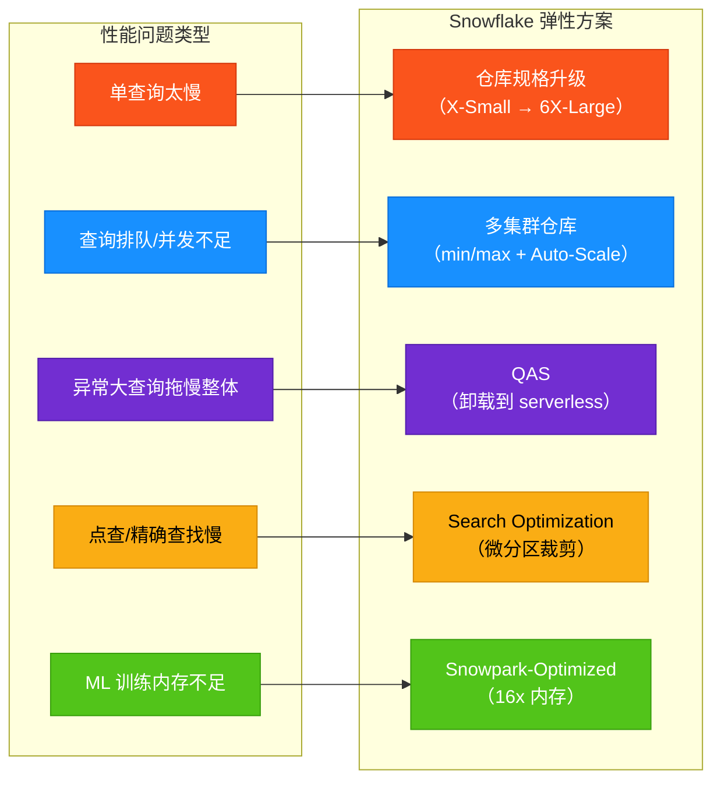

| 弹性能力 | 解决的问题 | 版次要求 | 计费模式 |
|:---------|:-----------|:---------|:---------|
| 仓库规格升级 | 单查询性能 | Standard | 仓库 credits（按秒） |
| 多集群 Auto-Scale | 并发能力 | Enterprise | 仓库 credits × 集群数 |
| Auto-Suspend / Resume | 闲置计费 | Standard（默认开启） | 自动暂停即停费 |
| QAS | 异常大查询卸载 | Enterprise | Serverless 独立计费 |
| Search Optimization | 点查裁剪 | Enterprise | 存储 + 维护计算 |
| Snowpark-Optimized | 大内存 ML | Standard | 仓库 credits（同规格） |
| Gen2 仓库 | 架构优化 | Standard | 仓库 credits（费率见服务消费表） |

### D4 · 数据工程：加载、流式与管道

> **这一维度解决的核心问题是：数据从哪里来、以什么节奏进来、进来后怎么加工流转——即"数据进出的物流系统"。**

无论你的数据来自本地 CSV、云上数据湖，还是 Kafka 的实时事件流，Snowflake 提供了一套从"手动搬运"到"全自动管道"的完整工具链。下图展示了数据在 Snowflake 中的完整生命周期：

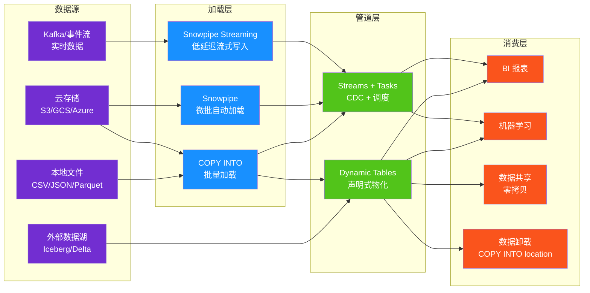

---

#### D4.1 批量加载：COPY INTO 与 Stage

批量加载是数据进入 Snowflake 最基础的方式——你把文件放到一个"暂存区"（Stage），然后执行一条 `COPY INTO` 命令把数据灌入目标表<sup>[[ref-d4-1]](#ref-d4-1)</sup>。

**Stage（暂存区）** 是 Snowflake 和外部文件之间的中间地带。可以理解为"快递分拣中心"——货物先到这里集中，再分发到最终目的地：

| 类型 | 说明 | 适用场景 |
|------|------|----------|
| **内部 Named Stage** | Snowflake 管理的存储，通过 `PUT` 上传文件 | 本地文件上传 |
| **内部 Table Stage** | 隐式绑定到特定表，不可修改/删除 | 单表快速加载 |
| **内部 User Stage** | 绑定到单个用户 | 单用户多表加载 |
| **外部 Stage（S3/GCS/Azure）** | 指向你自己云存储桶的命名对象 | 云上数据湖批量导入 |

> [!TIP]
> 把 Stage 想象成**快递分拣中心**：文件（包裹）先到这里集中分拣，然后由 `COPY INTO`（分拣员）决定每包裹去哪个货架（表）。

**外部 Stage 跨云支持**：无论 Snowflake 账号托管在哪个云平台，都可以访问 S3、GCS 或 Azure 存储中的文件<sup>[[ref-d4-1]](#ref-d4-1)</sup>。但不能访问归档存储类（如 S3 Glacier、Azure Archive），因为它们需要先恢复才能读取<sup>[[ref-d4-1]](#ref-d4-1)</sup>。

**文件格式支持**：CSV、JSON、Apache Parquet、Apache Avro、ORC<sup>[[ref-d4-1]](#ref-d4-1)</sup>。对于半结构化数据（如 JSON），可支持数千列。

**COPY INTO 的转换能力**：加载数据时可以同时做列重排、列省略、类型转换、文本截断等操作，不要求源文件列数与目标表一致<sup>[[ref-d4-1]](#ref-d4-1)</sup>。在 Snowpipe 的 pipe 定义中，COPY 同样支持这些转换<sup>[[ref-d4-1]](#ref-d4-1)</sup>。

**Schema Detection（模式检测）** 与 **Schema Evolution（模式演进）** 是批量加载的两大自动化利器<sup>[[ref-d4-1]](#ref-d4-1)</sup>：

| 功能 | 机制 | 用途 |
|------|------|------|
| `INFER_SCHEMA` | 自动扫描暂存文件，推断列名、类型和顺序 | 不知道文件结构时快速建表 |
| `CREATE TABLE ... USING TEMPLATE` | 基于推断结果直接创建目标表 | 一条 SQL 完成建表 |
| `MATCH_BY_COLUMN_NAME` | 按列名自动匹配加载 | Parquet/JSON 列名与表列对齐 |
| 自动模式演进 | 新数据文件新增列时，表结构自动适配 | 无需手动 `ALTER TABLE` |

> [!TIP]
> Schema Detection 就像**OCR 扫描仪**——不需要人工看文件内容，自动识别有哪些列、什么类型，连建表带加载一条龙。

批量加载使用用户指定的虚拟仓库（Virtual Warehouse）执行 `COPY` 语句，用户需自行评估仓库规格以匹配预期数据量<sup>[[ref-d4-1]](#ref-d4-1)</sup>。

---

#### D4.2 Snowpipe：微批自动加载

Snowpipe 是 Snowflake 的**连续自动化文件加载服务**——文件一旦到达 Stage，Snowpipe 就自动将其加载到目标表中，无需手动执行 `COPY INTO`<sup>[[ref-d4-2]](#ref-d4-2)</sup>。

> [!TIP]
> 如果说批量 `COPY INTO` 是你亲自去快递柜取件，那么 Snowpipe 就像**送货上门的快递订阅**——包裹一到，自动送到你家门口。

**核心机制**：

1. **Pipe 对象**：一个命名数据库对象，内嵌一条 `COPY INTO` 语句，定义了源 Stage 和目标表<sup>[[ref-d4-2]](#ref-d4-2)</sup>。
2. **Serverless 计算**：Snowpipe 使用 Snowflake 提供的计算资源，不需要用户指定仓库<sup>[[ref-d4-2]](#ref-d4-2)</sup>。
3. **事件触发**：通过云存储事件通知（而非轮询）自动检测新文件<sup>[[ref-d4-2]](#ref-d4-2)</sup>。

**云事件通知支持矩阵**<sup>[[ref-d4-2]](#ref-d4-2)</sup>：

| 云存储 | 事件通知服务 | 跨平台支持 |
|--------|-------------|-----------|
| Amazon S3 | SQS 队列通知 | 支持跨云/跨区域 |
| Google Cloud Storage | Pub/Sub 消息 | 支持跨云/跨区域 |
| Azure Blob / Data Lake Gen2 | Event Grid 事件 | 支持跨云/跨区域 |

Snowpipe 也可以通过 **REST API** 手动触发——客户端应用调用公共端点，传入 pipe 名称和文件列表，Snowpipe 即排队加载<sup>[[ref-d4-2]](#ref-d4-2)</sup>。REST API 需要密钥对认证（RSA 公私钥对 + JWT）<sup>[[ref-d4-2]](#ref-d4-2)</sup>。

**批量加载 vs Snowpipe 对比**<sup>[[ref-d4-2]](#ref-d4-2)</sup>：

| 维度 | 批量 COPY INTO | Snowpipe |
|------|---------------|----------|
| **触发方式** | 手动执行 SQL | 文件到达自动触发 |
| **计算资源** | 用户指定的虚拟仓库 | Snowflake 提供的 serverless 计算 |
| **计费** | 按仓库活跃时间 | 按实际加载消耗的计算资源（按秒） |
| **加载粒度** | 大批量、定期 | 微批、近实时（分钟级） |
| **加载历史** | 64 天 | 14 天 |
| **防重机制** | 无内建防重 | 按 pipe 记录已加载文件路径和名称，防止重复加载 |

**最佳实践**：Snowflake 建议每分钟暂存一批文件，在成本和延迟之间取得平衡<sup>[[ref-d4-2]](#ref-d4-2)</sup>。Snowpipe 适合"文件落地后尽快加载"的场景；如果数据源本身就是行级实时流，则应使用 Snowpipe Streaming。

---

#### D4.3 Snowpipe Streaming：低延迟流式写入

Snowpipe Streaming 是 Snowflake 的**实时行级摄入服务**——应用程序直接将数据行写入 Snowflake 表，无需先落地成文件<sup>[[ref-d4-3]](#ref-d4-3)</sup>。

> [!TIP]
> Snowpipe Streaming 就像**拧开水龙头接水**——水（数据行）直接流入杯子（表），不需要先装进瓶子（文件）再倒出来。

**关键性能指标**<sup>[[ref-d4-3]](#ref-d4-3)</sup>：

| 指标 | 数值 |
|------|------|
| 端到端摄入到查询延迟 | 低至 **5 秒** |
| 单表写入吞吐量 | 最高 **10 GB/s** |
| 计费方式 | 按摄入的未压缩数据量（credits/GB） |

**SDK 与接口**<sup>[[ref-d4-3]](#ref-d4-3)</sup>：

| 接口 | 要求 | 适用场景 |
|------|------|----------|
| **Java SDK** | Java 11+ | 高吞吐自定义应用 |
| **Python SDK** | Python 3.9+ | 数据工程 / Python 工作流 |
| **Node.js SDK** | Node.js 20+ | JavaScript / TypeScript 应用 |
| **REST API** | 轻量级 | IoT 设备、边缘部署 |

Java、Python、Node.js 三个 SDK 共享一个 **Rust 核心引擎**，以获得更高的客户端性能和更低的资源消耗<sup>[[ref-d4-3]](#ref-d4-3)</sup>。

**Channel（通道）模型**：行在通道内按顺序写入，通道天然映射到数据源分区（如 Kafka 分区），实现确定性重放和零丢失恢复<sup>[[ref-d4-3]](#ref-d4-3)</sup>。

**Snowpipe Streaming vs 文件版 Snowpipe 对比**<sup>[[ref-d4-3]](#ref-d4-3)</sup>：

| 维度 | Snowpipe Streaming | Snowpipe（文件版） |
|------|-------------------|-------------------|
| **数据形态** | 行 | 云存储中的文件 |
| **排序保证** | 通道内有序插入 | 不保证加载顺序 |
| **中间存储** | 无需暂存文件 | 需要文件落地到云存储 |
| **延迟** | 秒级 | 分钟级 |
| **适用场景** | Kafka/IoT/应用事件 | 数据管道生成文件 |

**Snowflake Connector for Kafka** 是 Snowpipe Streaming 的集成路径之一，专门用于 Apache Kafka topic 摄入<sup>[[ref-d4-3]](#ref-d4-3)</sup>。通道模型与 Kafka 分区天然对齐，通过 offset token 追踪实现 **精确一次（exactly-once）** 消息投递<sup>[[ref-d4-3]](#ref-d4-3)</sup>。

**附加能力**：Snowpipe Streaming 支持摄入时做行内转换（COPY 语法）、摄入时预聚簇、自动模式演进，以及对 Snowflake 管理的 Iceberg 表（v2/v3）的写入支持<sup>[[ref-d4-3]](#ref-d4-3)</sup>。

---

#### D4.4 Dynamic Tables：声明式物化管道

Dynamic Table（动态表）是一种**声明式物化机制**——你只管定义"我要什么数据"（SELECT 语句）和"要有多新鲜"（TARGET_LAG），Snowflake 自动完成依赖追踪、调度和增量刷新<sup>[[ref-d4-4]](#ref-d4-4)</sup>。

> [!TIP]
> Dynamic Table 就像**自动补货的智能货架**——你设定好"货架不能空超过 10 分钟"，系统就自动在货架快空时补货，全程不需要你操心。

**核心参数**<sup>[[ref-d4-4]](#ref-d4-4)</sup>：

| 参数 | 说明 | 示例值 |
|------|------|--------|
| `TARGET_LAG` | 数据相对于源表的最大延迟目标 | `'10 minutes'` / `'1 hour'` / `DOWNSTREAM` |
| `REFRESH_MODE` | 刷新策略 | `AUTO` / `FULL` / `INCREMENTAL` / `ADAPTIVE` / `CUSTOM_INCREMENTAL` |
| `WAREHOUSE` | 执行刷新的仓库 | 仓库名或 serverless |

**TARGET_LAG 详解**<sup>[[ref-d4-4]](#ref-d4-4)</sup>：
- 时间值（如 `'10 minutes'`）：Snowflake 尽量保持数据延迟不超过该值，但实际延迟可能超出（如刷新耗时较长）。
- `DOWNSTREAM`：中间管道表专用——仅当下游依赖需要新鲜数据时才刷新，避免不必要的刷新开销。
- **最小延迟为 60 秒**<sup>[[ref-d4-4]](#ref-d4-4)</sup>。

**刷新模式对比**<sup>[[ref-d4-4]](#ref-d4-4)</sup>：

| 模式 | 行为 | 适用场景 |
|------|------|----------|
| **AUTO** | Snowflake 根据查询定义自动选择增量或全量 | 默认推荐 |
| **INCREMENTAL** | 仅处理自上次刷新后变化的行 | 追加写入或小变更负载 |
| **FULL** | 每次重算整个结果集 | 复杂转换无法增量时 |
| **ADAPTIVE** | 默认增量，上游检测到大变更时自动回退全量重初始化 | 兼顾效率与鲁棒性 |
| **CUSTOM_INCREMENTAL** | 用户自定义 DML 刷新逻辑 | 高级定制增量场景 |

**声明式管道**：多个 Dynamic Table 互相引用时，Snowflake **自动从查询语句推断依赖图**，无需手动声明执行顺序——下游表总是在上游刷新完成后才刷新，保证一致性快照<sup>[[ref-d4-4]](#ref-d4-4)</sup>。

**成本三要素**<sup>[[ref-d4-4]](#ref-d4-4)</sup>：

| 成本类别 | 驱动因素 |
|----------|----------|
| 仓库计算 | 仓库规格、刷新频率、查询复杂度、数据量 |
| 云服务 | 查询编译、依赖追踪、变更监控、调度协调 |
| 存储 | 微分区增删改、Time Travel 保留期 |

> [!TIP]
> TARGET_LAG 越短，云服务层的调度工作越多，成本越高——就像你要求快递"1 小时达"比"次日达"贵得多。`DOWNSTREAM` 模式好比"按需补货"，避免中间环节的无效刷新。

**限制**<sup>[[ref-d4-4]](#ref-d4-4)</sup>：不支持低于 60 秒的延迟需求、不支持存储过程和外部函数、不支持 UDTF（lateral join 除外）。核心原则：只要逻辑能表达为一条 `SELECT` 语句，就可以用 Dynamic Table。

---

#### D4.5 Streams + Tasks：CDC 与 SQL 调度

Streams + Tasks 是 Snowflake 的**命令式管道工具**——你需要自己编写变更捕获逻辑和调度编排，但获得了最大的灵活性。

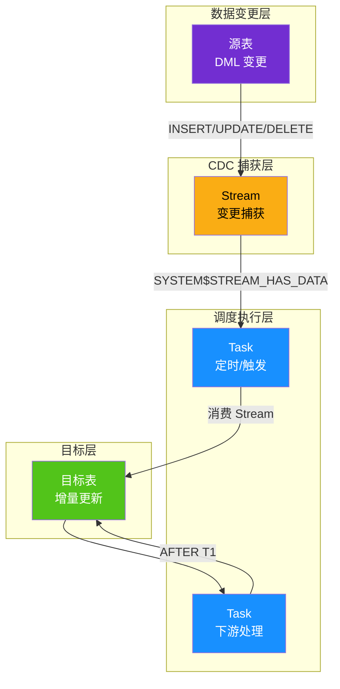

**Streams（变更流）** 记录表上的 DML 变更（INSERT、UPDATE、DELETE），实现变更数据捕获（CDC）<sup>[[ref-d4-5]](#ref-d4-5)</sup>。

> [!TIP]
> Stream 就像一枚**书签**——它不存储数据本身，只记录"你读到了哪一页"（偏移量 offset）。每次翻到书签位置，就能看到自上次以来新增的内容<sup>[[ref-d4-5]](#ref-d4-5)</sup>。

**Stream 的三种类型**<sup>[[ref-d4-5]](#ref-d4-5)</sup>：

| 类型 | 追踪范围 | 支持对象 |
|------|----------|----------|
| **Standard（标准流）** | INSERT + UPDATE（拆为 DELETE+INSERT 对）+ DELETE + TRUNCATE | 标准表、动态表、视图、Iceberg 表（Snowflake 管理） |
| **Append-Only（仅追加流）** | 仅 INSERT，忽略 UPDATE/DELETE | 标准表、动态表、视图 |
| **Insert-Only（仅插入流）** | 仅 INSERT，不记录删除 | 外部管理 Iceberg 表、外部表 |

**CDC 元数据列**<sup>[[ref-d4-5]](#ref-d4-5)</sup>：查询 Stream 时，除了源表列，还返回三列元数据：

| 元数据列 | 说明 |
|----------|------|
| `METADATA$ACTION` | DML 操作类型：`INSERT` 或 `DELETE` |
| `METADATA$ISUPDATE` | 是否属于 UPDATE 操作（UPDATE = DELETE + INSERT 对，均标记 `TRUE`） |
| `METADATA$ROW_ID` | 行的唯一不可变 ID，用于跨时间追踪变更 |

**关键行为**<sup>[[ref-d4-5]](#ref-d4-5)</sup>：
- 仅查询 Stream **不会推进偏移量**——必须在 DML 语句中消费（INSERT、UPDATE、MERGE 等）才会推进。
- 支持**可重复读隔离**：同一事务内多次查询 Stream 看到相同的变更集。
- 偏移量超出源表数据保留期时 Stream 变为 **stale（过期）**，必须重建。
- Snowflake 会在未消费时自动延长数据保留期至最长 14 天（`MAX_DATA_EXTENSION_TIME_IN_DAYS`）<sup>[[ref-d4-5]](#ref-d4-5)</sup>。

**Tasks（任务）** 是 Snowflake 的 SQL 调度引擎，可定时或按事件触发执行 SQL 语句和存储过程<sup>[[ref-d4-6]](#ref-d4-6)</sup>。

**调度模式**<sup>[[ref-d4-6]](#ref-d4-6)</sup>：

| 模式 | 语法 | 说明 |
|------|------|------|
| 间隔调度 | `SCHEDULE = '60 MINUTES'` | 固定间隔运行（最小 10 秒） |
| CRON 调度 | `SCHEDULE = 'USING CRON 7 3 * * SUN America/Los_Angeles'` | 精确时间运行 |
| 事件触发 | `WHEN SYSTEM$STREAM_HAS_DATA('my_stream')` | Stream 有数据时触发 |
| 组合模式 | `SCHEDULE + WHEN` | 定时检查 Stream 是否有数据 |

**计算模式**<sup>[[ref-d4-6]](#ref-d4-6)</sup>：

| 模式 | 仓库指定 | 计费 | 适用场景 |
|------|----------|------|----------|
| **Serverless** | 不指定 `WAREHOUSE` | 按实际计算用量 | 仓库利用率低、调度精确性要求高 |
| **用户管理** | 指定 `WAREHOUSE` | 按仓库规格和时间 | 仓库利用率高、多任务并发 |

Serverless 任务的仓库规格可通过 `SERVERLESS_TASK_MIN_STATEMENT_SIZE`（默认 XSMALL）和 `SERVERLESS_TASK_MAX_STATEMENT_SIZE`（默认 XXLARGE）限制范围，最大不超过 XXLARGE<sup>[[ref-d4-6]](#ref-d4-6)</sup>。

**Task Graph（任务图 / DAG）**：通过 `AFTER` 子句定义任务间依赖，Snowflake 按依赖顺序执行。同时只有一个任务实例在运行——如果上一个还没跑完，下一个计划触发会跳过<sup>[[ref-d4-6]](#ref-d4-6)</sup>。

**Streams + Tasks 管道范式**：典型的增量 ELT 管道 = **Stream 捕获变更 → Task 定时或触发消费 → DML 写入下游表 → Stream 偏移量推进**<sup>[[ref-d4-5]](#ref-d4-5)</sup>。每个变更被精确处理一次（exactly-once 语义），因为只有 DML 事务提交后才推进偏移量。

**Dynamic Tables vs Streams + Tasks 选择指南**<sup>[[ref-d4-4]](#ref-d4-4)</sup>：

| 维度 | Dynamic Tables | Streams + Tasks |
|------|---------------|-----------------|
| **声明方式** | 声明式（只写 SELECT） | 命令式（写完整 DML 逻辑） |
| **依赖管理** | 自动推断 | 手动编排 DAG |
| **灵活性** | 仅 SELECT | 支持存储过程、复杂逻辑 |
| **开发速度** | 快（几行 SQL） | 慢（需编写完整管道代码） |
| **推荐场景** | 标准转换管道 | 需要自定义逻辑的复杂管道 |

---

#### D4.6 数据卸载

数据卸载是加载的逆操作——用 `COPY INTO <location>` 将表数据导出到 Stage<sup>[[ref-d4-8]](#ref-d4-8)</sup>。

> [!TIP]
> 数据卸载就像**打包发货**——把仓库里（表中）的数据打好包（文件），送到目的地（另一个 Stage / 云存储 / 本地）。

**核心能力**<sup>[[ref-d4-8]](#ref-d4-8)</sup>：

| 功能 | 机制 |
|------|------|
| **SELECT 嵌入** | COPY 中嵌入完整 SELECT（支持 JOIN），导出时即做转换 |
| **分区卸载** | `PARTITION BY` 表达式按值分文件，输出目录结构 |
| **并行卸载** | 多线程并行写入，文件名加唯一后缀防冲突 |
| **文件控制** | `SINGLE = TRUE` 单文件；`MAX_FILE_SIZE` 控制分片大小 |
| **格式支持** | CSV、JSON、Parquet 等 |

**下载方式**：卸载到内部 Stage 后用 `GET` 命令下载到本地；卸载到外部 Stage（S3/Azure/GCS）则用各云平台工具获取<sup>[[ref-d4-8]](#ref-d4-8)</sup>。

---

#### D4.7 Apache Iceberg 表与开放目录

Apache Iceberg 表让 Snowflake 能够直接读写**开放格式的数据湖**——数据以 Apache Parquet 文件存储在你的云存储中，元数据遵循 Iceberg 规范<sup>[[ref-d4-7]](#ref-d4-7)</sup>。

> [!TIP]
> Iceberg 表就像**开放标准的集装箱**——货物（数据）不在 Snowflake 自己的仓库里，而是在你自己的码头（云存储）上，任何支持 Iceberg 的引擎（Spark、Trino、Snowflake）都能开箱取用。

**两种管理模式对比**<sup>[[ref-d4-7]](#ref-d4-7)</sup>：

| 特性 | Snowflake 管理型 | 外部目录型 |
|------|-----------------|-----------|
| **目录来源** | Snowflake 作为目录 | 外部目录（AWS Glue / Open Catalog / REST） |
| **存储位置** | Snowflake 存储 或 外部云存储 | 客户管理的外部云存储 |
| **读写** | 完整支持 | 读取完整；写入通过 REST 目录支持 |
| **聚簇键** | 支持 | 不支持 |
| **复制** | 支持 | 不支持 |
| **克隆** | 支持 | 不支持 |
| **生命周期管理** | Snowflake 自动维护（含 compaction） | 不由 Snowflake 管理 |
| **Fail-safe** | 不提供 | 不提供 |
| **Snowflake 平台支持** | 完整 | 有限 |

**Snowflake Open Catalog（原 Polaris Catalog）** 是一个**Iceberg REST 兼容的开放目录服务**<sup>[[ref-d4-7]](#ref-d4-7)</sup>：

- Snowflake 管理的 Iceberg 表可同步到 Open Catalog，让**第三方计算引擎**（如 Apache Spark）也能查询<sup>[[ref-d4-7]](#ref-d4-7)</sup>。
- **Catalog-linked 数据库**可自动发现并同步远程目录中的命名空间和表，实现双向读写<sup>[[ref-d4-7]](#ref-d4-7)</sup>。
- 支持通过 Apache Spark 访问时应用掩码策略和行访问策略<sup>[[ref-d4-7]](#ref-d4-7)</sup>。

**Iceberg 开放格式的核心能力**<sup>[[ref-d4-7]](#ref-d4-7)</sup>：ACID 事务、模式演进、隐藏分区、表快照、支持规范 v1/v2/v3（v3 含删除向量）。

**Snowflake Openflow** 是 Snowflake 数据集成产品线下的另一个组件，与 Iceberg 表并列，用于更广泛的数据集成场景<sup>[[ref-d4-7]](#ref-d4-7)</sup>。

**计费差异**<sup>[[ref-d4-7]](#ref-d4-7)</sup>：Iceberg 表使用外部云存储时不产生 Snowflake 存储费用——存储由云供应商直接计费，Snowflake 仅收取仓库计算、云服务、自动刷新和跨区域数据传输（管理型表）费用。

---

#### D4.8 dbt on Snowflake

dbt（data build tool）是数据转换领域的领先开源框架，与 Snowflake 有深度集成。Dynamic Tables 可以直接在 dbt 模型中定义——用声明式 SQL 声明物化策略和 TARGET_LAG，dbt 负责模型依赖和编译，Snowflake 负责自动刷新<sup>[[ref-d4-4]](#ref-d4-4)</sup>。

> [!TIP]
> dbt + Dynamic Tables 的组合就像**设计图纸 + 智能工厂**——dbt 负责画设计图（模型定义和依赖），Snowflake 这座智能工厂自动按图纸生产（物化和刷新），你不需要操心生产线的调度细节。

Streams + Tasks 同样可以在 dbt 中编排为增量模型管道。选择 Dynamic Tables 还是 Streams + Tasks 取决于转换复杂度：纯 SELECT 用前者，需要存储过程或复杂逻辑用后者<sup>[[ref-d4-4]](#ref-d4-4)</sup>。

---

#### D4.9 数据加载方式速查矩阵

| 维度 | COPY INTO 批量 | Snowpipe | Snowpipe Streaming | Dynamic Tables | Streams+Tasks | Iceberg 表 |
|------|:---:|:---:|:---:|:---:|:---:|:---:|
| **延迟** | 手动 | 分钟级 | 秒级 | 分钟级（≥60s lag） | 定时/触发 | 外部引擎管理 |
| **触发** | 手动 | 文件事件 | 应用写入 | 自动调度 | 定时/Stream | 外部引擎 |
| **计算** | 用户仓库 | Serverless | Serverless | 用户仓库/Serverless | 用户仓库/Serverless | 用户仓库 |
| **适用场景** | 一次性大批量 | 文件管道 | 实时事件流 | 声明式转换管道 | 自定义增量管道 | 开放数据湖 |
| **开发复杂度** | 低 | 低 | 中（SDK 编码） | 低（声明式） | 高（命令式） | 中 |
| **数据形态** | 文件 | 文件 | 行 | 表查询 | 表变更 | Parquet 文件 |

### D5 · 开发与可编程性：SQL、Snowpark、UDF

> 这一维度解决的核心问题是：**如何让不同技术栈的开发者（SQL 工程师、Python 数据科学家、Java 后端、前端 BI）都能用自己熟悉的工具「驱动」Snowflake，而不需要把数据搬来搬去。**

Snowflake 的可编程性技术栈分为四个层次，从底层到顶层依次为：标准 SQL 引擎 → Snowpark 编程框架 → UDF/存储过程扩展 → Streamlit 数据应用。所有计算都在 Snowflake 引擎内完成，数据无需离开平台<sup>[[ref-d5-1]](#ref-d5-1)</sup>。

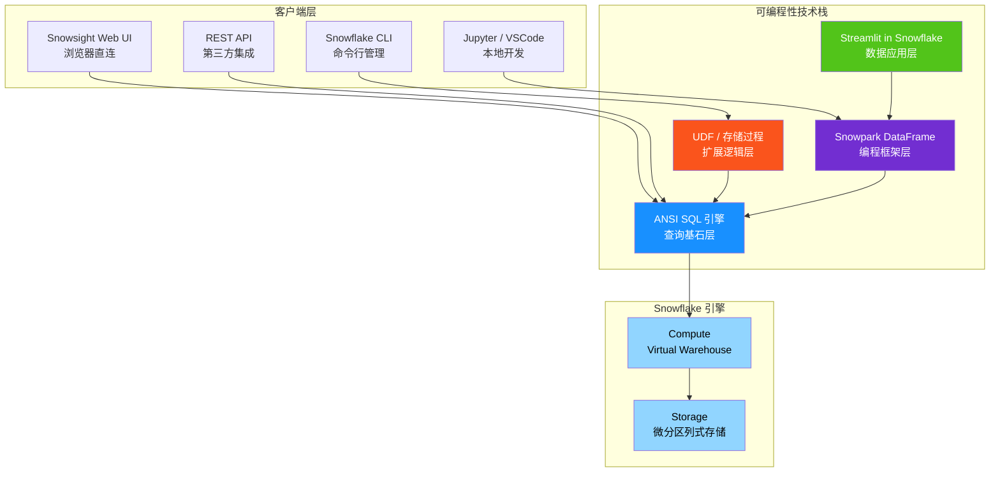

---

#### 一、ANSI SQL：查询基石

Snowflake SQL 基于 **ANSI SQL 标准**，完整支持 DDL（建表、改表、删表）、DML（增删改查）、DCL（权限授予与回收）以及丰富的查询构造（JOIN、子查询、CTE、集合运算）<sup>[[ref-d5-9]](#ref-d5-9)</sup>。

> [!TIP] 白话类比
> ANSI SQL 就像「普通话」——全国通用的标准语言。Snowflake 不仅说标准普通话，还加了一些「方言」扩展（如 Time Travel 的 `AT(TIMESTAMP => ...)` 子句、`QUALIFY` 窗口函数过滤、`COPY INTO` 批量加载），让日常数据操作更省事。

**核心 DML 语句一览：**

| 语句 | 用途 | 典型场景 |
|------|------|----------|
| `SELECT` | 查询数据 | 报表、分析、探索 |
| `INSERT` | 插入行（含多表插入） | 数据写入、ETL 落地 |
| `UPDATE` | 修改已有行 | 字段修正、状态更新 |
| `DELETE` | 删除行 | 清理过期数据 |
| `MERGE` | 按条件 upsert（插入/更新/删除） | 增量同步、SCD2 |
| `COPY INTO` | 批量加载/卸载 | 数据湖导入导出 |

**窗口函数**（SQL:2003 分析扩展）是数据分析的利器。Snowflake 支持完整的窗口函数族，包括排名函数（`ROW_NUMBER`、`RANK`、`DENSE_RANK`）、聚合窗口（`SUM(...) OVER(...)`）、偏移函数（`LAG`、`LEAD`）等，配合 `PARTITION BY` 分区和 `ORDER BY` 排序，能在单条 SQL 中完成复杂的分组排名、累计求和、环比同比等计算<sup>[[ref-d5-9]](#ref-d5-9)</sup>。

Snowflake 还扩展了 `QUALIFY` 子句——它在 `HAVING` 之后执行，专门用于过滤窗口函数结果，无需嵌套子查询：

```sql
-- 找每个部门薪资 Top 3 的员工，一句搞定
SELECT dept, name, salary
FROM employees
QUALIFY ROW_NUMBER() OVER (PARTITION BY dept ORDER BY salary DESC) <= 3;
```

---

#### 二、Snowflake Scripting：SQL 里的过程化编程

**解决的问题：** 纯 SQL 没有变量、循环、异常处理，复杂逻辑只能拼字符串或依赖外部脚本。Snowflake Scripting 在 SQL 里加入了过程化能力，让你能用 SQL 写出「带控制流」的存储过程和匿名块<sup>[[ref-d5-4]](#ref-d5-4)</sup>。

> [!TIP] 白话类比
> 如果标准 SQL 是「点菜单」（一次说一个需求），Snowflake Scripting 就是「写食谱」——可以定义步骤、反复翻炒（循环）、出错时补救（异常处理），一气呵成做一道菜。

Snowflake Scripting 的块结构遵循经典的 `DECLARE → BEGIN → EXCEPTION → END` 模式<sup>[[ref-d5-4]](#ref-d5-4)</sup>：

```sql
DECLARE
  counter INTEGER DEFAULT 0;
  total   NUMBER(10,2);
BEGIN
  SELECT SUM(amount) INTO :total FROM orders WHERE status = 'PAID';
  -- 条件分支
  IF :total > 10000 THEN
    LET bonus FLOAT := :total * 0.05;
    RETURN :bonus;
  ELSE
    RETURN 0;
  END IF;
EXCEPTION
  WHEN OTHER THEN
    RETURN -1;
END;
```

**核心构造一览：**

| 构造 | 语法 | 用途 |
|------|------|------|
| 变量声明 | `DECLARE x FLOAT;` 或块内 `LET x FLOAT;` | 定义局部变量 |
| 条件分支 | `IF ... THEN ... ELSE ... END IF;` / `CASE` | 按条件走不同逻辑 |
| 循环 | `FOR`、`WHILE`、`LOOP`、`REPEAT` | 重复执行 |
| 游标 | `DECLARE CURSOR FOR SELECT ...; OPEN; FETCH; CLOSE;` | 逐行遍历结果集 |
| 异常处理 | `EXCEPTION WHEN <name> THEN ...` | 捕获并处理运行时错误 |
| 返回值 | `RETURN <expr>;` | 从块或过程中返回结果 |

> [!NOTE]
> 在 Snowsight（Web UI）中可直接执行匿名块；在 SnowSQL / Python Connector 中需要用 `EXECUTE IMMEDIATE $$ ... $$` 包裹<sup>[[ref-d5-4]](#ref-d5-4)</sup>。

---

#### 三、Snowpark：零搬运的数据编程框架

**解决的问题：** 传统做法里，Python/Java/Scala 应用要处理数据库里的数据，得先 `SELECT *` 拉到本地，处理完再写回去——数据量大时根本拉不动。Snowpark 让你在本地用熟悉的语言写代码，但**所有计算自动下沉（pushdown）到 Snowflake 引擎执行**，数据不用搬家<sup>[[ref-d5-1]](#ref-d5-1)</sup>。

> [!TIP] 白话类比
> 想象你是一个项目经理（开发者），手底下有 100 个工人（Snowflake 引擎）。传统方式是你把 100 箱货搬回办公室（拉数据到本地），自己拆箱检查，再搬回去——累死你也搬不完。Snowpark 的做法是：你写一份「操作指南」（DataFrame 代码），用微信发给仓库的工人（pushdown），工人在仓库现场拆箱、分拣、打包，最后只把「结果报告」寄给你。

**三种语言，一套模式：** Snowpark 提供 Python、Java、Scala 三种语言的客户端库，核心抽象都是 **DataFrame**——一个代表「数据集 + 操作链」的惰性对象<sup>[[ref-d5-1]](#ref-d5-1)</sup>。

**DataFrame 惰性执行模型：**

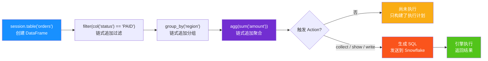

关键点：`filter`、`select`、`join` 等转换操作不会立即执行，它们只是「记账」——累积成一个优化的执行计划。只有当调用 `collect()`、`show()` 等 **Action** 方法时，整条链才会编译成一条 SQL，一次性发送到 Snowflake 执行<sup>[[ref-d5-1]](#ref-d5-1)</sup>。这种模式减少了客户端与服务器之间的往返通信，也避免了中间结果的传输。

**Pushdown 的边界——所有操作含 UDF 全部下沉：** Snowpark 最核心的设计是 **全量 pushdown**。不仅标准的 `select`/`filter`/`join`/`aggregate` 下沉到引擎执行，连你在代码里用 lambda 定义的 UDF 也会被自动编译并推送到服务器端执行<sup>[[ref-d5-1]](#ref-d5-1)</sup>。这意味着：

- 无需维护外部 Spark 集群
- 无需在客户端和数据库之间传输大量数据
- 自定义逻辑（如用 Python 写的数据清洗函数）在 Snowflake 的弹性计算资源上并行执行

**Snowpark vs 传统 Spark 连接器对比：**

| 维度 | Snowpark | Snowflake Connector for Spark |
|------|----------|-------------------------------|
| **计算位置** | 所有操作在 Snowflake 引擎内执行<sup>[[ref-d5-1]](#ref-d5-1)</sup> | 部分操作在 Spark 集群，部分 pushdown 到 Snowflake |
| **外部集群** | 不需要<sup>[[ref-d5-1]](#ref-d5-1)</sup> | 需要维护 Spark 集群 |
| **数据搬运** | 数据不离开 Snowflake | 数据可能经 Spark 集群中转 |
| **开发体验** | 原生语言 API（非拼 SQL 字符串），支持 IDE 代码补全<sup>[[ref-d5-1]](#ref-d5-1)</sup> | 需配置 Spark + 连接器 |
| **本地工具** | Jupyter / VSCode / IntelliJ<sup>[[ref-d5-1]](#ref-d5-1)</sup> | Spark 生态工具链 |
| **语言支持** | Python、Java、Scala<sup>[[ref-d5-1]](#ref-d5-1)</sup> | Scala、Python、R（via Spark） |
| **弹性扩缩** | 仓库按秒计费，自动挂起 | 需手动管理 Spark 集群规模 |

---

#### 四、UDF：在 SQL 中嵌入任意语言逻辑

**解决的问题：** 有些业务逻辑（如解析 JSON 自定义格式、调用机器学习模型推理、执行复杂正则匹配）用纯 SQL 写起来极其痛苦。UDF（User-Defined Function）让你可以用 Java、Python、JavaScript、Scala 或 SQL 本身编写函数，然后在 SQL 查询中像调用内置函数一样使用它<sup>[[ref-d5-2]](#ref-d5-2)</sup>。

> [!TIP] 白话类比
> UDF 就像给 SQL 引擎装了一个「插座适配器」——SQL 世界用的是标准插头，但你手里有个 Python 电器。UDF 就是那个转接头，让你在 SQL 里直接「插上」Python/Java/JS 写的逻辑。

**UDF 类型矩阵：**

| UDF 类型 | 含义 | 举例 |
|----------|------|------|
| **标量 UDF** | 每行输入 → 一个输出值 | `calculate_tax(price)` |
| **UDAF（聚合）** | 多行输入 → 一个输出值 | 自定义加权平均 |
| **UDTF（表值）** | 每行输入 → 多行多列输出 | `flatten_json(json_col)` 展开嵌套数组 |
| **向量化 UDF** | 一批行（Pandas DataFrame）→ 一批输出 | 批量 ML 推理，减少逐行开销 |

**语言支持与能力对比：**

| 语言 | 标量 | 聚合 | 表值 | 向量化 | 代码位置 | 可共享 |
|------|:----:|:----:|:----:|:------:|----------|:------:|
| **Python** | ✓ | ✓ | ✓ | ✓ | 内联 / 暂存区 | ✗<sup>[[ref-d5-2]](#ref-d5-2)</sup> |
| **Java** | ✓ | — | ✓ | — | 内联 / 暂存区 | ✗<sup>[[ref-d5-2]](#ref-d5-2)</sup> |
| **JavaScript** | ✓ | — | ✓ | — | 仅内联 | ✓<sup>[[ref-d5-2]](#ref-d5-2)</sup> |
| **Scala** | ✓ | — | — | — | 内联 / 暂存区 | ✗<sup>[[ref-d5-2]](#ref-d5-2)</sup> |
| **SQL** | ✓ | — | ✓ | — | 仅内联 | ✓<sup>[[ref-d5-2]](#ref-d5-2)</sup> |

> [!NOTE]
> Python 的支持最为全面——它是唯一支持聚合函数和向量化处理的 UDF 语言<sup>[[ref-d5-2]](#ref-d5-2)</sup>。向量化 UDF 接收 Pandas DataFrame 批量输入，大幅降低逐行调用的开销，非常适合机器学习推理场景。

**代码部署方式：**

- **内联（In-line）：** 代码直接嵌在 `CREATE FUNCTION` 语句中——适合简短逻辑
- **暂存区（Staged）：** 代码打包上传到 Snowflake 内部暂存区——适合复杂项目、多文件依赖。JavaScript 和 SQL 仅支持内联<sup>[[ref-d5-2]](#ref-d5-2)</sup>

**外部函数（External Functions）：** 当逻辑需要调用 Snowflake 外部的远程服务时（如第三方 API、自建微服务），可使用外部函数。它通过 **API 集成**对象建立认证通道，Snowflake 将数据以 JSON 批量发送到远程端点，获取处理结果后返回 SQL 查询<sup>[[ref-d5-2]](#ref-d5-2)</sup>。

> [!IMPORTANT]
> 外部函数需要经过代理服务（如 AWS API Gateway）中转到远程服务。数据会离开 Snowflake 平台，适用于必须调用外部 API 的场景（如实时风控、第三方数据增强）。

---

#### 五、存储过程：带控制流的可复用逻辑

**解决的问题：** UDF 只能「算一个值返回」，不能执行 DDL、不能控制流程、不能管理事务。存储过程把「一组 SQL 操作 + 控制流 + 异常处理」封装成一个可命名、可调度、可权限管理的单元<sup>[[ref-d5-3]](#ref-d5-3)</sup>。

**五语言支持：**

| 语言 | 代码位置 | 返回表值 | 特色 |
|------|----------|:--------:|------|
| **Snowflake Scripting (SQL)** | 仅内联 | ✓ | 原生 SQL，无需额外运行时<sup>[[ref-d5-4]](#ref-d5-4)</sup> |
| **Python** | 内联 / 暂存区 | ✓ | Snowpark 集成，ML 首选 |
| **Java** | 内联 / 暂存区 | ✓ | 企业级逻辑 |
| **Scala** | 内联 / 暂存区 | ✓ | 函数式风格 |
| **JavaScript** | 仅内联 | ✓ | 轻量级逻辑 |

**Owner's Rights vs Caller's Rights：** 存储过程有两种权限模型——

- **Owner's Rights（所有者权限）：** 过程以**拥有者角色**的权限执行，而非调用者的权限。这样拥有者可以把特定操作的权力「委托」给本来没权限的用户<sup>[[ref-d5-3]](#ref-d5-3)</sup>
- **Caller's Rights（调用者权限）：** 过程以**调用者角色**的权限执行，调用者必须拥有所涉及对象的权限

> [!TIP] 白话类比
> Owner's Rights 就像「持卡人授权的副卡」——信用卡持卡人（拥有者）给家人（调用者）一张副卡，家人能刷卡但不能查额度。调用者能执行这个过程，但没法绕过过程直接操作底层数据。

**Snowpark-Optimized Warehouse（内存增强型仓库）：** 专为内存密集型 Snowpark 工作负载设计。标准仓库每节点内存有限，而 Snowpark-optimized 仓库默认提供 **16 倍内存**，最高可配置到 **1 TB** 每节点<sup>[[ref-d5-5]](#ref-d5-5)</sup>。

| 内存配置 | CPU 架构 | 最小仓库规格 | 状态 |
|----------|----------|:------------:|------|
| 16 GB | 默认 / x86 | X-Small | GA<sup>[[ref-d5-5]](#ref-d5-5)</sup> |
| 256 GB | 默认 / x86 | M | GA<sup>[[ref-d5-5]](#ref-d5-5)</sup> |
| 1 TB | 默认 / x86 | L | Preview（仅 AWS）<sup>[[ref-d5-5]](#ref-d5-5)</sup> |

适用场景：ML 模型训练（存储过程中加载大数据集）、大数据量 UDF/UDTF 处理<sup>[[ref-d5-5]](#ref-d5-5)</sup>。

**临时与匿名过程：** 不需要 `CREATE PROCEDURE` 权限的两种捷径——

- **临时过程：** `CREATE TEMP PROCEDURE ...`，仅当前会话有效，会话结束自动删除<sup>[[ref-d5-3]](#ref-d5-3)</sup>
- **匿名过程：** `CALL (WITH ... SELECT ...)` 语法，调用即执行、执行完即丢弃，适合一次性任务<sup>[[ref-d5-3]](#ref-d5-3)</sup>

---

#### 六、Streamlit in Snowflake：数据应用的原生栖息地

**解决的问题：** 做完数据分析后，要把结果变成可交互的 Web 应用给业务方使用。传统做法是数据导出 → 搭后端 → 搭前端 → 部署服务器 → 配置权限——链路太长。Streamlit in Snowflake 让你用纯 Python 写 Web 应用，应用直接「住」在 Snowflake 里，自动继承 RBAC 权限<sup>[[ref-d5-7]](#ref-d5-7)</sup>。

> [!TIP] 白话类比
> Streamlit in Snowflake 就像「精装房」——你不用自己买地皮（服务器）、拉水电（网络配置）、请保安（权限管理），拎包入住就行。你只需要写 Python 代码（布置家具），应用直接跑在 Snowflake 的安全边界内。

**核心特性：**

| 特性 | 说明 |
|------|------|
| **数据不搬家** | 应用直接处理 Snowflake 内的数据，无需导出到外部系统<sup>[[ref-d5-7]](#ref-d5-7)</sup> |
| **RBAC 保护** | 源码和配置存储在 Snowflake 对象中，通过角色访问控制管理<sup>[[ref-d5-7]](#ref-d5-7)</sup> |
| **双运行时** | 可选择传统 **仓库运行时**或 **容器运行时**（Snowpark Container Services）<sup>[[ref-d5-7]](#ref-d5-7)</sup> |
| **生态集成** | 无缝调用 Snowpark、UDF、存储过程、Native App Framework<sup>[[ref-d5-7]](#ref-d5-7)</sup> |
| **Git 集成** | 支持 Git 版本控制<sup>[[ref-d5-7]](#ref-d5-7)</sup> |
| **行访问策略** | 支持行级数据治理<sup>[[ref-d5-7]](#ref-d5-7)</sup> |
| **日志追踪** | 内建 logging/tracing 能力<sup>[[ref-d5-7]](#ref-d5-7)</sup> |

> [!NOTE]
> Streamlit 是一个开源 Python 库，用几十行代码就能创建带交互控件（滑块、下拉框、图表）的 Web 应用。在 Snowflake 里运行时，所有计算和存储由 Snowflake 管理，应用天然继承企业级安全策略。

---

#### 七、Snowflake CLI：命令行开发利器

Snowflake CLI 是一个开源命令行工具，专为开发者工作流设计，超越了传统 SQL 客户端的能力<sup>[[ref-d5-8]](#ref-d5-8)</sup>。

**核心管理能力：**

| 管理对象 | 说明 |
|----------|------|
| Streamlit 应用 | 创建、部署、管理 Streamlit 应用<sup>[[ref-d5-8]](#ref-d5-8)</sup> |
| Snowpark 项目 | Snowpark 代码开发与部署<sup>[[ref-d5-8]](#ref-d5-8)</sup> |
| 存储过程 / UDF | 创建和管理函数与过程<sup>[[ref-d5-8]](#ref-d5-8)</sup> |
| 容器服务 | Snowpark Container Services 管理<sup>[[ref-d5-8]](#ref-d5-8)</sup> |
| SQL 执行 | 直接运行 SQL 语句<sup>[[ref-d5-8]](#ref-d5-8)</sup> |
| Snowflake 对象 | 数据库、表、视图、暂存区等通用对象管理<sup>[[ref-d5-8]](#ref-d5-8)</sup> |
| Git 仓库 | Snowflake 内 Git 仓库管理<sup>[[ref-d5-8]](#ref-d5-8)</sup> |
| 项目模板 | 从模板初始化项目脚手架<sup>[[ref-d5-8]](#ref-d5-8)</sup> |

> [!TIP] 白话类比
> 如果 Snowsight 是「网页版邮箱」，那 Snowflake CLI 就是「邮件客户端」——功能更全、可脚本化、适合 CI/CD 管道集成，一条命令就能部署整套应用栈。

---

#### 八、Snowflake SQL REST API：无驱动集成

**解决的问题：** 有些场景无法安装客户端驱动（如 Serverless 函数、低代码平台、浏览器端直接调用），需要一个纯 HTTP 接口来执行 SQL<sup>[[ref-d5-6]](#ref-d5-6)</sup>。

**三种核心操作：**

| 操作 | 说明 |
|------|------|
| **提交 SQL** | 将 SQL 语句发送到 Snowflake 执行<sup>[[ref-d5-6]](#ref-d5-6)</sup> |
| **查询状态** | 轮询已提交语句的执行状态<sup>[[ref-d5-6]](#ref-d5-6)</sup> |
| **取消执行** | 终止正在运行的语句<sup>[[ref-d5-6]](#ref-d5-6)</sup> |

**认证方式：** OAuth（令牌认证）或 Key Pair（密钥对认证）<sup>[[ref-d5-6]](#ref-d5-6)</sup>。

**支持的高级特性：**

- 单请求提交**多条 SQL 语句**<sup>[[ref-d5-6]](#ref-d5-6)</sup>
- 显式事务控制（指定事务开始/结束）<sup>[[ref-d5-6]](#ref-d5-6)</sup>
- 在请求体中创建和调用**存储过程**<sup>[[ref-d5-6]](#ref-d5-6)</sup>
- 支持标准查询、DDL、DML 语句<sup>[[ref-d5-6]](#ref-d5-6)</sup>

> [!NOTE]
> SQL REST API 适合构建自定义集成应用、自动化部署管理（创建用户/角色/表）以及从任何支持 HTTP 的语言调用 Snowflake。

---

#### 九、多语言驱动：连接 Snowflake 的八扇门

Snowflake 提供全套官方驱动和连接器，覆盖主流编程语言和生态：

| 驱动 / 连接器 | 语言 | 典型用途 |
|---------------|------|----------|
| **Python Connector** | Python | 数据分析、机器学习、ETL 脚本 |
| **JDBC Driver** | Java | Java 企业应用、BI 工具（Tableau 等） |
| **ODBC Driver** | C/C++ | Excel、通用 BI 工具、Windows 生态 |
| **Node.js Driver** | JavaScript | Web 后端、API 服务 |
| **Go Driver** | Go | 云原生微服务、高并发后端 |
| **.NET Driver** | C# | .NET 企业应用、Azure 生态 |
| **PHP Driver (PDO)** | PHP | 传统 Web 应用 |
| **Spark Connector** | Scala/Python | Spark 生态集成（已逐步被 Snowpark 替代） |

> [!TIP] 白话类比
> 八个驱动就像「八扇不同方向的门」——无论你从哪个技术栈走来（Java 大楼、Python 小区、Go 新城），都有一扇直接通往 Snowflake 的门。选哪扇取决于你的出发地（技术栈），进去之后看到的数据风景一模一样。

---

#### 十、技术栈选择指南：什么场景用什么工具

| 场景 | 推荐工具 | 理由 |
|------|----------|------|
| 日常查询与报表 | ANSI SQL（Snowsight） | 最直接，零代码 |
| 复杂数据转换管道 | Snowpark Python | DataFrame 链式操作 + 全量 pushdown |
| 自定义业务计算逻辑 | Python UDF（向量化） | 嵌入 SQL，批量高效 |
| 带事务的多步操作 | Snowflake Scripting 存储过程 | 原生控制流 + 异常处理 |
| ML 模型训练 | Snowpark Python + Snowpark-Optimized Warehouse | 大内存支持模型加载<sup>[[ref-d5-5]](#ref-d5-5)</sup> |
| 给业务方做交互式看板 | Streamlit in Snowflake | 纯 Python 写 Web 应用，RBAC 继承<sup>[[ref-d5-7]](#ref-d5-7)</sup> |
| CI/CD 自动化部署 | Snowflake CLI | 脚本化全生命周期管理<sup>[[ref-d5-8]](#ref-d5-8)</sup> |
| Serverless 函数调用 | SQL REST API | 纯 HTTP，无需驱动<sup>[[ref-d5-6]](#ref-d5-6)</sup> |
| 调用第三方 API | 外部函数 | API 集成 + 远程服务<sup>[[ref-d5-2]](#ref-d5-2)</sup> |
| Java 企业系统集成 | JDBC Driver | 标准 Java 数据库连接 |

> [!IMPORTANT]
> 贯穿所有工具的核心设计原则是 **Pushdown**：无论你用哪种语言、哪种工具编写逻辑，最终都会编译成 SQL 并在 Snowflake 引擎内执行。数据不搬家，计算找数据——而不是数据找计算。这是 Snowflake 可编程性体系与 Hadoop/Spark 传统模式的根本区别<sup>[[ref-d5-1]](#ref-d5-1)</sup>。

### D6 · AI 与机器学习：Cortex 全家桶

> 这一维度解决的核心问题是：**如何在不把数据搬出 Snowflake 安全边界的前提下，一站式完成从 SQL 内 LLM 调用、自然语言查数、语义搜索、私有数据微调，到 AI Agent 编排、机器学习建模与运维的全链路 AI/ML 工作？**

---

#### 设计哲学：AI 运行在 Snowflake 安全与治理边界内

Snowflake Cortex 是 Snowflake 原生构建的 AI/ML 能力集合，其设计围绕三条不可妥协的原则<sup>[[ref-d6-1]](#ref-d6-1)</sup>：

1. **全安全（Full Security）**：除非客户主动选择，所有 AI 模型均在 Snowflake 的安全与治理边界内运行。数据不离开 Snowflake 平台。
2. **数据隐私（Data Privacy）**：Snowflake 永远不会使用客户数据来训练面向全体客户的通用模型。
3. **统一管控（Control）**：AI 功能的访问通过 Snowflake 既有 RBAC（角色访问控制）机制管理——与管表、管视图的权限体系完全一致。

> [!TIP]
> **生活类比**：想象一家拥有严格门禁系统的智能图书馆——你把书（数据）存在馆内的保险柜里，图书管理员（AI 模型）在馆内帮你阅读、摘要、翻译，但书永远不出馆，管理员也不会把你的读书笔记拿去训练别的读者。门禁卡（RBAC）一张卡管所有房间，无需额外系统。

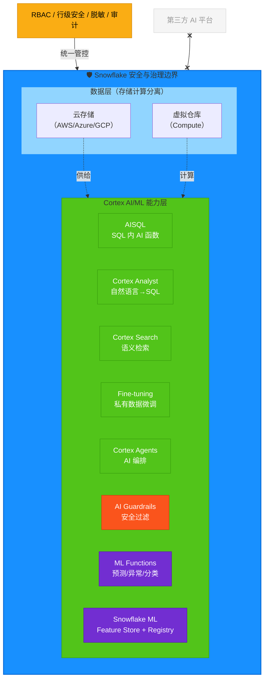

因为所有 AI 能力都在同一个安全边界内运行，Cortex 天然继承了 Snowflake 的全部治理能力<sup>[[ref-d6-1]](#ref-d6-1)</sup><sup>[[ref-d6-12]](#ref-d6-12)</sup>：

| 治理能力 | 说明 |
|---------|------|
| RBAC（角色访问控制） | 通过 `SNOWFLAKE.CORTEX_USER` 等数据库角色统一管控 AI 功能访问 |
| 行级安全（Row Access） | AI 查询同样受行级策略约束 |
| 动态数据脱敏 | LLM 看到的是脱敏后的数据 |
| 审计日志 | 所有 AI 调用可追溯 |
| 跨区域推理 | 模型不在本区域时，可在其他区域执行推理，数据仍受 Snowflake 管控 |
| 成本治理 | 通过 `ACCOUNT_USAGE` 视图和 Resource Budgets 监控 AI 消费 |

---

#### Cortex 能力全景矩阵

Cortex 是一个覆盖从「SQL 内一行代码调 LLM」到「端到端 ML 运维」的完整能力集。下表按功能层归纳<sup>[[ref-d6-1]](#ref-d6-1)</sup>：

| 能力 | 一句话用途 | 典型场景 | 计费维度 |
|------|-----------|---------|---------|
| **AISQL（AI Functions）** | 在 SQL 中直接调用 LLM 进行摘要、翻译、情感、抽取、分类等 | 批量处理文本列；对表内数据做 unstructured analytics | 按 token/页计费<sup>[[ref-d6-2]](#ref-d6-2)</sup> |
| **Cortex Analyst** | 自然语言→SQL，让非技术用户用对话查询结构化数据 | 自助 BI；对话式数据探索 | 按成功消息数计费<sup>[[ref-d6-3]](#ref-d6-3)</sup> |
| **Cortex Search** | 对企业数据做向量+关键词混合语义检索 | RAG 检索引擎；企业搜索 | 按仓库计算 + 嵌入 token + 服务存储计费<sup>[[ref-d6-4]](#ref-d6-4)</sup> |
| **Cortex Fine-tuning** | 用私有数据微调开源 LLM | 领域专属模型；特定任务优化 | 按训练 token 计费<sup>[[ref-d6-6]](#ref-d6-6)</sup> |
| **Cortex Agents** | AI Agent 编排平台，推理+规划+调工具 | 跨结构化/非结构化数据的复杂问答 | 编排 token + 各工具成本叠加<sup>[[ref-d6-5]](#ref-d6-5)</sup> |
| **AI Guardrails** | 运行时防护提示注入和越狱攻击 | 生产级 AI 安全；合规审计 | 按扫描 token 计费<sup>[[ref-d6-7]](#ref-d6-7)</sup> |
| **Snowflake-managed MCP Server** | 标准化接口让外部 AI Agent 安全访问 Snowflake 数据 | Claude/Cursor/ChatGPT 连接 Snowflake | 无额外 MCP 计费，底层工具各自计费<sup>[[ref-d6-13]](#ref-d6-13)</sup> |
| **Cortex Inference** | REST API 方式调用 LLM 推理 | 低延迟交互式应用 | 按 token 计费<sup>[[ref-d6-15]](#ref-d6-15)</sup> |
| **Provisioned Throughput** | 预留专属推理容量 | 高并发生产场景 | 按 PTU/小时计费，无论是否使用<sup>[[ref-d6-15]](#ref-d6-15)</sup> |
| **Cortex Code** | Snowflake 内嵌的 AI 编码助手 | SQL/Python 开发；ML 流水线生成 | 随 Snowflake 授权提供<sup>[[ref-d6-16]](#ref-d6-16)</sup> |
| **AI Observability** | 生成式 AI 应用的评估与追踪 | RAG 质量评估；生产监控 | AI_COMPLETE 调用 + 仓库费用<sup>[[ref-d6-14]](#ref-d6-14)</sup> |
| **Knowledge Extensions (CKE)** | 扩展 Cortex 的知识获取能力 | 增强型 RAG；知识增强 | 见官方定价 |
| **Snowflake CoWork** | 智能协作工作空间 | 对话式数据工作 | 随 Snowflake 授权提供 |

---

#### AISQL：SQL 内一行代码调 LLM

AISQL（也称 Cortex AI Functions）是 Cortex 最基础也最高频的入口——它让你在普通 `SELECT` 语句里直接调用大语言模型，处理文本和图像<sup>[[ref-d6-2]](#ref-d6-2)</sup>。

> [!TIP]
> **生活类比**：就像 Excel 里的 `=SUM()` 函数一样简单——你不需要懂 LLM 怎么工作，只需要在 SQL 里写 `AI_SENTIMENT(comment)` 就能得到情感分析结果。

**核心函数清单**<sup>[[ref-d6-2]](#ref-d6-2)</sup>：

| 函数 | 输入类型 | 功能 | 可用性 |
|------|---------|------|--------|
| `AI_COMPLETE` | 文本/图像/文件 | 通用 LLM 补全（对话、生成、结构化输出） | GA |
| `AI_SUMMARIZE_AGG` | 文本列 | 跨多行汇总摘要（不受上下文窗口限制） | GA |
| `AI_SENTIMENT` | 文本 | 提取情感倾向 | GA |
| `AI_TRANSLATE` | 文本 | 多语言互译 | GA |
| `AI_CLASSIFY` | 文本/图像 | 按用户定义的类别分类 | Preview |
| `AI_EXTRACT` | 文本/图像/文档 | 信息抽取（实体、元数据） | GA |
| `AI_FILTER` | 文本/图像 | 返回 True/False，可在 WHERE 子句中使用 | Preview |
| `AI_AGG` | 文本列 | 按用户 prompt 跨行聚合洞察（不受上下文窗口限制） | Preview |
| `AI_EMBED` | 文本/图像 | 生成嵌入向量 | GA |
| `AI_SIMILARITY` | 文本对 | 计算两个输入的嵌入相似度 | Preview |
| `AI_REDACT` | 文本 | 脱敏 PII（个人敏感信息） | GA |
| `AI_TRANSCRIBE` | 音频/视频 | 语音转文字（含时间戳和说话人识别） | Preview |
| `AI_PARSE_DOCUMENT` | 文档 | OCR 提取文本/布局信息 | GA |
| `AI_COUNT_TOKENS` | 文本 | 预计算 token 数（用于成本估算） | GA |

所有函数背后是来自 OpenAI、Anthropic、Meta、Mistral AI 和 DeepSeek 等厂商的模型，均部署在 Snowflake 服务边界内<sup>[[ref-d6-2]](#ref-d6-2)</sup>。使用前需要 `USE AI FUNCTIONS` 账户级权限和 `SNOWFLAKE.CORTEX_USER` 或 `AI_FUNCTIONS_USER` 数据库角色。

```sql
-- 示例：批量分析客户评论的情感
SELECT
    review_id,
    AI_SENTIMENT(review_text) AS sentiment,
    AI_SUMMARIZE_AGG(review_text) AS overall_summary
FROM customer_reviews
WHERE product_category = 'electronics';
```

---

#### Cortex Analyst：用大白话查数据库

Cortex Analyst 是一个完全托管的自然语言→SQL 系统——业务用户用英语提问，系统自动生成并执行 SQL，直接返回答案<sup>[[ref-d6-3]](#ref-d6-3)</sup>。

> [!TIP]
> **生活类比**：就像一个懂你公司业务术语的数据库翻译官。你说"上个月亚太区销售额多少？"，它翻译成正确的 SQL，执行后告诉你答案——你全程不用写一行 SQL。

**工作流程**<sup>[[ref-d6-3]](#ref-d6-3)</sup>：

1. 用户通过 REST API 提交自然语言问题
2. Cortex Analyst 参考**语义模型**（Semantic View 或 YAML 文件）理解业务上下文
3. LLM 根据问题和语义元数据（表名、列描述、同义词、指标定义、表间关系）生成 SQL
4. SQL 在用户的虚拟仓库中执行
5. 结果通过应用返回给用户

**模型路由**：系统运行时自动选择最佳模型组合，优先级依次为 Claude Sonnet 4.6 > Claude Sonnet 4.5 > GPT 4.1 > Arctic Text2SQL R1.5 > Mistral Large 2 + Llama 3.1 70b<sup>[[ref-d6-3]](#ref-d6-3)</sup>。所有模型均由 Snowflake 托管，数据不离开治理边界。

**语义模型**是连接业务语言与数据库模式的关键桥梁，定义了逻辑表（业务实体）、维度（分类上下文）、事实（行级数据）、指标（聚合 KPI）和关系（表间连接）<sup>[[ref-d6-3]](#ref-d6-3)</sup>。Snowflake 推荐使用原生的 **Semantic Views**，它具备完整的 RBAC、权限管理和共享能力。

---

#### Cortex Search：企业级语义检索引擎

Cortex Search 提供低延迟、高质量的「模糊」搜索能力，可对 Snowflake 中的数据做语义检索，是构建 RAG（检索增强生成）应用的核心引擎<sup>[[ref-d6-4]](#ref-d6-4)</sup>。

> [!TIP]
> **生活类比**：传统搜索像只看书名找书——搜"高兴"找不到写着"开心"的文档。Cortex Search 像一个理解语义的图书管理员——搜"高兴"也能找到"愉悦""满意"的内容，因为它理解词背后的含义。

**三路混合检索**<sup>[[ref-d6-4]](#ref-d6-4)</sup>：

| 检索方式 | 原理 | 擅长场景 |
|---------|------|---------|
| 向量检索 | 将文本编码为向量，在向量空间中找最近邻 | 语义相似（同义不同词） |
| 关键词检索 | 基于词法匹配 | 精确匹配（产品编码、专有名词） |
| 语义重排序 | 对初步结果做二次相关性排序 | 综合精度提升 |

**支持的嵌入模型**<sup>[[ref-d6-4]](#ref-d6-4)</sup>：

| 模型 | 维度 | 上下文窗口 | 语言 |
|------|------|-----------|------|
| `snowflake-arctic-embed-m-v1.5`（默认） | 768 | 512 tokens | 仅英语 |
| `snowflake-arctic-embed-l-v2.0` | 1024 | 512 tokens | 多语言 |
| `snowflake-arctic-embed-l-v2.0-8k` | 1024 | 8192 tokens | 多语言 |
| `voyage-multilingual-2` | 1024 | 32000 tokens | 多语言 |

用户也可以提供预计算的嵌入向量（多索引模式），省去嵌入成本<sup>[[ref-d6-4]](#ref-d6-4)</sup>。

**计费构成**<sup>[[ref-d6-4]](#ref-d6-4)</sup>：

| 费用类别 | 计费基础 |
|---------|---------|
| 仓库计算 | 刷新查询和索引构建消耗的 credits |
| 嵌入 token 计算 | 每个嵌入 token 的 credit 成本（仅对新增/变更文档） |
| 服务计算 | 按未压缩索引数据 GB/月 计费（服务可用期间持续计费） |
| 存储 | 物化查询结果和优化数据结构的 TB 费率 |
| 云服务计算 | 变更检测和编排（仅当每日云服务费用超过每日仓库费用 10% 时计费） |

---

#### Cortex Fine-tuning：用私有数据定制模型

当提示工程和 RAG 不够用时，Cortex Fine-tuning 让你用自己的数据在 Snowflake 内微调开源 LLM，找到「提示工程」与「从零训练」之间的最佳平衡<sup>[[ref-d6-6]](#ref-d6-6)</sup>。

> [!TIP]
> **生活类比**：RAG 像给模型一本「参考手册」临时翻阅——灵活但翻多了会慢。微调像送模型去「岗前培训」——把领域知识内化到模型权重里，回答更快更准，但需要花时间训练。

**技术机制**：使用 **PEFT（参数高效微调）** 技术，不修改基础模型全部参数，而是训练一个轻量级适配器（adaptor），训练完成后通过 `AI_COMPLETE` 调用<sup>[[ref-d6-6]](#ref-d6-6)</sup>。

**支持的基座模型**<sup>[[ref-d6-6]](#ref-d6-6)</sup>：

| 模型 | 上下文窗口 | 输入上限 | 输出上限 | 3 Epochs 最大行数 |
|------|-----------|---------|---------|------------------|
| llama3-8b | 8K | 6K | 2K | 62K |
| llama3-70b | 8K | 6K | 2K | 7K |
| llama3.1-8b | 24K | 20K | 4K | 50K |
| llama3.1-70b | 8K | 6K | 2K | 4.5K |
| mistral-7b | 32K | 28K | 4K | 15K |
| mixtral-8x7b | 32K | 28K | 4K | 9K |

训练数据须为 Snowflake 表或视图，列名必须为 `prompt` 和 `completion`，建议从几百条样本起步<sup>[[ref-d6-6]](#ref-d6-6)</sup>。

**关键限制**：微调模型不支持跨区域推理——推理必须在模型对象所在区域执行<sup>[[ref-d6-6]](#ref-d6-6)</sup>。但可通过数据库复制将模型对象复制到其他区域进行推理。

---

#### Cortex Agents：AI 智能体编排平台

Cortex Agents 是一个完全托管的智能体平台，让 AI 能够推理、规划、调用工具、执行代码，并返回综合回答——开发者无需自建编排循环或沙箱基础设施<sup>[[ref-d6-5]](#ref-d6-5)</sup>。

> [!TIP]
> **生活类比**：如果说 AISQL 是「单兵作战」（一次调一个函数），Cortex Analyst 是「翻译官」（只管语言→SQL），那 Cortex Agents 就是「项目经理」——接到一个复杂需求后，它自己拆任务、选工具、执行、反思、迭代，直到给出完整答案。

**三步推理循环**<sup>[[ref-d6-5]](#ref-d6-5)</sup>：

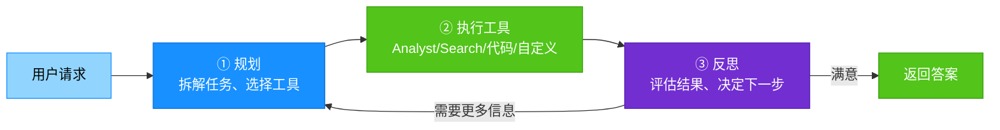

**可用工具**<sup>[[ref-d6-5]](#ref-d6-5)</sup>：

| 工具 | 能力 |
|------|------|
| Cortex Analyst | 结构化数据查询（NL→SQL） |
| Cortex Search | 非结构化数据语义检索 |
| 代码执行 | 隔离沙箱中运行 Python |
| Data to Chart | 根据工具返回数据生成可视化 |
| 自定义工具 | 存储过程和 UDF |
| Agent Skills | 模块化指令+脚本包 |
| MCP 连接器 | 连接外部 MCP 服务器（Jira、Salesforce 等） |
| Agent Toolsets | 从其他 Agent 继承工具，实现可组合架构 |
| Web 搜索 | 实时公共互联网信息（账户级 opt-in） |

Agent 支持有状态对话（**Threads**），跨轮次保持上下文，无需客户端管理状态<sup>[[ref-d6-5]](#ref-d6-5)</sup>。模型选择建议设为 `auto`，让系统自动选择最高质量模型；支持的模型家族包括 Claude、GPT、Grok 和 Gemini<sup>[[ref-d6-5]](#ref-d6-5)</sup>。

---

#### AI Guardrails：生产级 AI 安全防护

AI Guardrails 是 Snowflake Horizon Catalog 的一部分，提供运行时防护，对抗提示注入（prompt injection）和越狱（jailbreak）攻击<sup>[[ref-d6-7]](#ref-d6-7)</sup>。该功能已于 2026 年 4 月 20 日正式发布（GA）<sup>[[ref-d6-17]](#ref-d6-17)</sup>。

**三层防护**<sup>[[ref-d6-7]](#ref-d6-7)</sup>：

| 防护层 | 机制 | 说明 |
|-------|------|------|
| 提示注入检测 | 识别并阻断覆盖系统指令的恶意尝试 | 包括隐藏在工具调用中的间接注入 |
| 越狱防护 | 捕获绕过模型安全协议的行为 | 防止用户突破安全边界 |
| 零日式防护 | 上下文推理识别未知攻击模式 | 不依赖已知攻击特征库，实时检测新型威胁 |

**配置方式**：账户级通过 `AI_SETTINGS` 参数集中管理，仅 ACCOUNTADMIN 可修改<sup>[[ref-d6-7]](#ref-d6-7)</sup>：

```sql
ALTER ACCOUNT SET AI_SETTINGS = $$
advanced_prompt_injection:
  enabled: true
$$;
```

Guardrails 当前保护 Cortex Code、Snowflake CoWork 和 Cortex Agents 三个交互入口<sup>[[ref-d6-7]](#ref-d6-7)</sup>。审计日志通过 `CORTEX_AI_GUARDRAILS_USAGE_HISTORY` 视图查询。

---

#### Snowflake-managed MCP Server：让外部 AI Agent 安全接入

Snowflake-managed MCP Server 是一个已 GA 的功能，让外部 AI Agent（如 Claude Desktop、ChatGPT、Cursor）通过标准的 **Model Context Protocol (MCP)** 安全检索 Snowflake 账户中的数据，无需部署额外基础设施<sup>[[ref-d6-13]](#ref-d6-13)</sup>。

> [!TIP]
> **生活类比**：MCP 就像给外部 AI 助手办了一张「访客门禁卡」——它能进入 Snowflake 大楼，但只能在有权限的区域活动，每个房间（工具）的权限都需要单独授权。

**可暴露的五类工具**<sup>[[ref-d6-13]](#ref-d6-13)</sup>：

| 工具类型 | MCP 方法 | 说明 |
|---------|---------|------|
| Cortex Agent | `CORTEX_AGENT_RUN` | 暴露一个 Cortex Agent，内部编排多个工具（推荐方式） |
| Cortex Analyst | `CORTEX_ANALYST_MESSAGE` | NL→SQL，仅支持 Semantic Views |
| Cortex Search | `CORTEX_SEARCH_SERVICE_QUERY` | 非结构化搜索 |
| SQL 执行 | `SYSTEM_EXECUTE_SQL` | 直接执行 SQL（默认只读） |
| 通用工具 | `GENERIC` | 将 UDF 和存储过程暴露为 MCP 工具 |

**认证方式**：默认 Snowflake OAuth，也支持外部 OAuth（Okta、Microsoft Entra ID 等）<sup>[[ref-d6-13]](#ref-d6-13)</sup>。关键设计原则：连接 MCP Server 本身不等于获得工具访问权——每个工具需要独立的权限授予。

**推荐架构**：将单个 Cortex Agent 作为唯一面向客户端的 MCP 工具暴露，由 Agent 内部编排 Analyst、Search 和自定义工具，提供「一个受管接口」<sup>[[ref-d6-13]](#ref-d6-13)</sup>。直接 SQL 执行应放在独立的 MCP Server 上并分配最小权限角色。

**限制**：每个 MCP Server 最多 50 个工具；不支持流式响应；通用工具和 SQL 执行响应在 250KB 处截断<sup>[[ref-d6-13]](#ref-d6-13)</sup>。

---

#### Cortex Inference 与 Provisioned Throughput：REST 推理与预留容量

**Cortex Inference** 提供直接调用 LLM 的 REST API，适合低延迟交互式场景（与面向批量处理的 AISQL SQL 函数形成互补）<sup>[[ref-d6-1]](#ref-d6-1)</sup>。

**Provisioned Throughput** 则是为高并发生产场景预留专属推理容量的选项<sup>[[ref-d6-15]](#ref-d6-15)</sup>：

| 特性 | 按用量付费（默认） | Provisioned Throughput |
|------|------------------|----------------------|
| 计费方式 | 按 token 量 | 按 PTU/小时，无论是否使用 |
| 适用场景 | 波动负载、开发测试 | 稳定高并发、需保证 SLA |
| 容量单位 | N/A | PTU（Provisioned Throughput Unit） |
| 合同期限 | 无 | 一个月起 |
| 自动续约 | N/A | 否，需手动创建新 PT ID |

**支持模型与 PTU 规格**<sup>[[ref-d6-15]](#ref-d6-15)</sup>：

| 模型 | 最小 PTU | 递增 PTU |
|------|---------|---------|
| Llama 3.1-8B | 64 | 32 |
| Llama 3.1-70B | 128 | 64 |
| Snowflake-Llama3.3-70B | 128 | 64 |
| Mistral Large 2 | 256 | 128 |
| Llama 3.1-405B | 512 | 256 |
| Snowflake-Llama3.1-405B | 512 | 256 |

---

#### Cortex Code：内嵌的 AI 编码助手

Cortex Code 是 Snowflake 平台内嵌的智能体编码助手，支持 SQL/Python 开发、ML 工作流、数据探索和账户管理<sup>[[ref-d6-16]](#ref-d6-16)</sup>。

**交付形态与时间线**<sup>[[ref-d6-16]](#ref-d6-16)</sup>：

| 形态 | 说明 | GA 时间 |
|------|------|--------|
| Cortex Code in Snowsight | 在 Snowsight/Workspaces 中内嵌的对话式编码助手 | 2026-03-09 |
| Cortex Code CLI | 命令行独立工具 | 2026-02-02 |
| Data Science & ML Skill | ML 流水线生成能力（Preview） | 2026-02-06 起 |
| Cortex Code Agent SDK | 用于构建 Agent 式代码方案的 SDK | 见官方文档 |
| Cortex Code CLI MCP 支持 | CLI 对 MCP 的集成 | 见官方文档 |
| Cortex Code CLI ACP 支持 | Agent Client Protocol 集成 | 见官方文档 |
| Cortex Code CLI 插件 | 可扩展插件架构 | 见官方文档 |

**核心能力**：生成/修改/优化/解释 SQL 和 Python 代码；SQL 执行失败时提供修复建议；生成可直接运行的 ML 流水线（Notebook）；支持 dbt 项目（探索数据、脚手架模型、生成测试和文档）；利用 Horizon Catalog 元数据帮助发现数据（标签、脱敏策略、血缘）<sup>[[ref-d6-16]](#ref-d6-16)</sup>。

---

#### AI Observability：生成式 AI 应用的可观测性

AI Observability 让生成式 AI 应用变得可评估、可追踪、可信赖<sup>[[ref-d6-14]](#ref-d6-14)</sup>。

**两大核心能力**<sup>[[ref-d6-14]](#ref-d6-14)</sup>：

| 能力 | 监控维度 | 说明 |
|------|---------|------|
| **追踪（Tracing）** | 准确性、延迟、成本 | 捕获输入 prompt、检索上下文、工具调用、LLM 推理步骤 |
| **评估（Evaluation）** | 质量、正确性、运营指标 | 使用 LLM-as-Judge 技术系统化打分 |

评估指标覆盖：上下文相关性、答案相关性、事实准确性（groundedness）、幻觉频率、全面性等<sup>[[ref-d6-14]](#ref-d6-14)</sup>。数据存储在用户 Snowflake 账户的事件表中，可通过 Snowsight 可视化或 SQL 查询。支持 Cortex Agents 和 External Agent 对象。

---

#### ML Functions：无代码机器学习

ML Functions 是一组 SQL 级别的内置机器学习函数，无需写 Python、无需调参——创建一个模型对象，训练，预测，全部通过 SQL 完成<sup>[[ref-d6-9]](#ref-d6-9)</sup><sup>[[ref-d6-10]](#ref-d6-10)</sup><sup>[[ref-d6-11]](#ref-d6-11)</sup>。

> [!TIP]
> **生活类比**：ML Functions 就像「自动挡汽车」——你不需要懂变速箱怎么工作，只需要说"去哪"（给数据），它自动选择最佳算法、训练模型、输出预测。而后面的 Snowflake ML 则是「手动挡」——给你全部控制权来自定义模型。

**三大核心函数**：

**1. 预测（Forecasting）** — `SNOWFLAKE.ML.FORECAST`<sup>[[ref-d6-9]](#ref-d6-9)</sup>

用历史时序数据预测未来数值。`best` 模式自动集成 Prophet、ARIMA、指数平滑和梯度提升机四种算法；`fast` 模式仅用 GBM 加速。每条序列最少 12 行才能使用主算法，2-11 行退化为朴素预测（重复最后一个观测值）。输出含预测值和置信区间（默认 95%）。

**2. 异常检测（Anomaly Detection）** — `SNOWFLAKE.ML.ANOMALY_DETECTION`<sup>[[ref-d6-10]](#ref-d6-10)</sup>

基于梯度提升机（GBM），使用差分变换处理非平稳趋势，自动生成日历特征。默认预测区间 99%——任何落在区间外的点标记为异常。支持监督模式（通过布尔标签列标注已知异常）和多序列检测。

**3. 分类（Classification）** — `SNOWFLAKE.ML.CLASSIFICATION`<sup>[[ref-d6-11]](#ref-d6-11)</sup>

二分类使用 AUC 损失函数，多分类使用逻辑损失。支持数值、字符串、布尔、TIMESTAMP_NTZ 类型。自动从时间戳中派生特征。目标列最多 255 个不同类别。测试规模可达 1000 列 × 6 亿行（Medium Snowpark-optimized 仓库）<sup>[[ref-d6-11]](#ref-d6-11)</sup>。

**通用特性**<sup>[[ref-d6-9]](#ref-d6-9)</sup><sup>[[ref-d6-10]](#ref-d6-10)</sup><sup>[[ref-d6-11]](#ref-d6-11)</sup>：

| 特性 | 说明 |
|------|------|
| 算法不可调 | 无法手动选择或调整底层算法参数 |
| 模型不可变 | 模型训练后不可原地更新，需删除重建 |
| 不可克隆/复制 | 模型对象在数据库/模式克隆时被跳过 |
| 特征重要性 | 提供归一化（0-1）的特征重要性评分 |
| 评估指标 | 提供交叉验证评估（MAE、MAPE、F1、AUC 等） |
| 自动化集成 | 可与 Snowflake Tasks（定时重训练）和 Alerts（邮件通知）集成 |

---

#### Snowflake ML：自定义模型开发与运维

Snowflake ML 是一组端到端机器学习能力，在一个统一的受管平台上覆盖特征工程、模型训练、注册管理和推理部署的全生命周期<sup>[[ref-d6-8]](#ref-d6-8)</sup>。

> [!TIP]
> **生活类比**：如果说前面的 ML Functions 是「外卖」（开箱即用但选择有限），Snowflake ML 就是「全套厨房」——从食材仓库（Feature Store）到菜谱管理（Model Registry），从灶台（Container Runtime）到质检室（Observability），你拥有全部控制权来烹饪任何模型。

**核心组件**<sup>[[ref-d6-8]](#ref-d6-8)</sup>：

```mermaid
graph TB
    subgraph SnowflakeML["Snowflake ML 全生命周期"]
        direction LR
        subgraph 开发["开发与训练"]
            FS["Feature Store<br/>特征工程与管理"]
            CR["Container Runtime<br/>PyTorch/XGBoost/sklearn"]
            NB["Snowflake Notebooks<br/>Jupyter 式开发环境"]
        end
        subgraph 运维["注册与部署"]
            MR["Model Registry<br/>模型生命周期管理"]
            Jobs["ML Jobs<br/>自动化流水线"]
            Deploy["Snowpark Container Services<br/>生产推理服务"]
        end
        subgraph 监控["监控与治理"]
            Obs["Model Observability<br/>性能与漂移监控"]
            Explain["Explainability<br/>Shapley 值可解释性"]
            Lineage["ML Lineage<br/>端到端血缘追踪"]
        end
    end

    开发 --> 运维 --> 监控

    style SnowflakeML fill:#f0f5ff,stroke:#1890ff,stroke-width:2px
    style 开发 fill:#91d5ff,stroke:#1890ff
    style 运维 fill:#52c41a,stroke:#389e0d
    style 监控 fill:#722ed1,stroke:#531dab
    style FS fill:#91d5ff,color:#000,stroke:#1890ff
    style CR fill:#91d5ff,color:#000,stroke:#1890ff
    style NB fill:#91d5ff,color:#000,stroke:#1890ff
    style MR fill:#52c41a,color:#fff,stroke:#389e0d
    style Jobs fill:#52c41a,color:#fff,stroke:#389e0d
    style Deploy fill:#52c41a,color:#fff,stroke:#389e0d
    style Obs fill:#722ed1,color:#fff,stroke:#531dab
    style Explain fill:#722ed1,color:#fff,stroke:#531dab
    style Lineage fill:#722ed1,color:#fff,stroke:#531dab
```

**Feature Store（特征商店）**<sup>[[ref-d6-8]](#ref-d6-8)</sup>：
- 定义、管理、存储和发现 ML 特征
- 支持批量和流式数据源的自动增量刷新
- 支持批量与低延迟在线特征检索
- 确保训练-推理一致性，减少训练偏斜
- 与 ML Lineage 集成，可追溯特征到源数据

**Model Registry（模型注册表）**<sup>[[ref-d6-8]](#ref-d6-8)</sup>：
- 无论模型在 Snowflake 内还是外部平台训练，均可注册管理
- 支持外部训练模型导入 Snowflake 做推理，也支持 Snowflake 内开发模型部署到外部
- 支持内置模型类型和自定义模型类型
- 提供 SQL API 和 Snowsight UI
- 可部署到 Snowpark Container Services 做生产推理

**Container Runtime**<sup>[[ref-d6-8]](#ref-d6-8)</sup>：
- 预构建 ML 环境，优化大数据加载和分布式训练
- 预装 PyTorch、XGBoost、Scikit-learn
- 支持从 HuggingFace 或 PyPI 安装任意包
- 支持 CPU 和 GPU 计算，无需手动配置
- 通过 Snowflake Notebooks 访问，类似 Jupyter 体验

**框架连接器与集成**<sup>[[ref-d6-8]](#ref-d6-8)</sup>：
- Snowpark Connect for Apache Spark
- Ray 分布式计算集成
- NVIDIA CUDA-X 库支持
- Streamlit in Snowflake 构建 ML 应用和仪表板

**Agentic ML（CoCo）**：Snowflake CoCo 可从自然语言提示自主规划、执行和迭代 ML 工作流——探索数据、工程特征、训练评估模型、调试问题、准备部署<sup>[[ref-d6-8]](#ref-d6-8)</sup>。

---

#### 模型生命周期管理与行为变更

**模型生命周期**<sup>[[ref-d6-1]](#ref-d6-1)</sup>：

| 阶段 | 稳定性 | 弃用通知 |
|------|--------|---------|
| **Private Preview** | 早期评估，可能频繁变更 | 无保证 |
| **Public Preview** | 更广泛评估 | 无保证时间线 |
| **General Availability (GA)** | 稳定，适合生产使用 | 至少 60 天提前通知 |
| **Legacy** | 弃用过渡期 | 正在执行弃用 |
| **End of Life (EOL)** | 模型不再可用 | 已停服 |

**行为变更管理（BCR）**<sup>[[ref-d6-1]](#ref-d6-1)</sup>：当模型更新导致以下任一情况时，即被归类为**行为变更（Behavior Change）**：
- 需要语法变更（包括模型/版本指定方式改变）
- 模型输出结构变化
- 模型弃用

行为变更通过 **Behavior Change Releases (BCR)** 传达（需用户操作的变更），非破坏性改进通过 **What's New** 通知。弃用通知独立于捆绑发布单独发送<sup>[[ref-d6-1]](#ref-d6-1)</sup>。

> [!TIP]
> **实务建议**：生产环境使用 Cortex 时，应（1）定期检查 What's New 和 BCR 公告；（2）GA 模型在生产中优先使用；（3）为关键工作流建立模型替代方案（如多模型路由）；（4）利用 AI Observability 追踪模型输出质量变化，及时发现行为漂移。

---

#### 小结

Snowflake Cortex 的核心差异化在于：**所有 AI/ML 能力都在 Snowflake 的安全与治理边界内原生运行**，无需将数据外传到第三方 AI 平台。从一行 SQL 调用 LLM（AISQL），到自然语言查数（Cortex Analyst）、语义搜索（Cortex Search）、私有微调（Fine-tuning）、AI 编排（Agents），再到完整的 ML 生命周期管理（Snowflake ML），Cortex 覆盖了从「非工程师也能用 AI」到「ML 工程师全链路建模」的完整光谱。配合 AI Guardrails（安全）、AI Observability（可观测性）和 Snowflake-managed MCP Server（外部 Agent 接入），形成了一个闭环的 AI/ML 治理生态。

### D7 · 安全与治理：访问控制、加密、合规

本维度解决的核心问题是：**谁能访问什么数据、以何种方式访问、数据是否始终加密、如何满足行业合规要求**。Snowflake 将安全内建为平台底座而非外挂组件——从认证到加密、从角色权限到数据脱敏，构成一条贯穿"身份→权限→数据→审计"的完整防线<sup>[[ref-d7-1]](#ref-d7-1)</sup>。

---

#### 三合一访问控制模型

Snowflake 的访问控制不是单一机制，而是三种模型的融合体，协同工作<sup>[[ref-d7-1]](#ref-d7-1)</sup>：

| 模型 | 全称 | 白话解释 | 核心机制 |
|------|------|----------|----------|
| **DAC** | Discretionary Access Control（自主访问控制） | 像"谁创建的东西就归谁管"——每个数据库对象都有 owner，owner 可以决定把权限授予谁 | 每个安全对象由唯一角色持有 `OWNERSHIP`；owner 自主授权 |
| **RBAC** | Role-Based Access Control（基于角色的访问控制） | 像"公司岗位制"——权限不直接给人，而是给岗位（角色），人被分配到岗位上 | 权限授角色、角色可继承、用户激活角色 |
| **UBAC** | User-Based Access Control（基于用户的访问控制） | 像"个人特别通行证"——极少数情况下权限直接打在个人身上 | 仅当 `USE SECONDARY ROLES` 设为 `ALL` 时，直接授予用户的权限才生效 |

> [!TIP]
> 想象一栋办公楼：DAC 是"房间归部门经理管，经理决定谁能进"；RBAC 是"工牌上写着你属于哪个部门，部门权限决定你能进哪些门"；UBAC 是"个别员工额外拿到了一张万能卡"。

**默认拒绝（deny-by-default）原则**：除非有明确的授权（grant），否则一切访问都被拒绝。更重要的是——**Snowflake 不存在超级用户或超级角色**，没有任何角色可以绕过权限检查<sup>[[ref-d7-1]](#ref-d7-1)</sup>。

#### 系统角色层级

Snowflake 预置了不可删除的系统角色，构成自上而下的权限层级<sup>[[ref-d7-1]](#ref-d7-1)</sup>：

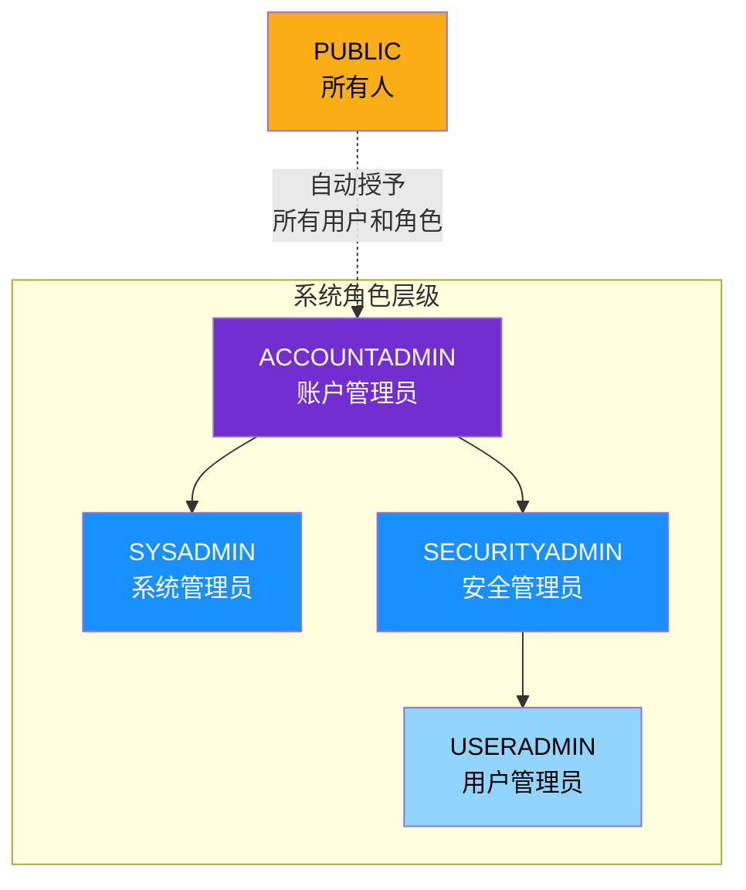

| 系统角色 | 职责范围 | 关键权限 |
|----------|----------|----------|
| **ACCOUNTADMIN** | 账户最高权限，封装 SYSADMIN + SECURITYADMIN | 仅授予极少数人；不应混入业务权限 |
| **SYSADMIN** | 创建和管理仓库、数据库等对象 | 按最佳实践，所有自定义顶层角色应挂在其下 |
| **SECURITYADMIN** | 管理用户、角色和全局授权 | 持有 `MANAGE GRANTS`，可修改任何 grant；继承 USERADMIN |
| **USERADMIN** | 专管用户和角色创建 | 仅持 `CREATE USER` 和 `CREATE ROLE` |
| **PUBLIC** | 伪角色，自动授予所有用户和角色 | 由 PUBLIC 拥有的对象对所有人可见 |

> [!TIP]
> `MANAGE GRANTS` 让 SECURITYADMIN 能授予或撤销权限，但**不能**用它来创建对象——"掌管钥匙的人不负责盖房子"，职责分离防止权力集中<sup>[[ref-d7-1]](#ref-d7-1)</sup>。

#### 主角色与次角色

每个会话（session）有且仅有**一个主角色（primary role）**，决定当前"你是谁"（`CURRENT_ROLE`）。此外可同时激活**多个次角色（secondary roles）**，扩展你的操作权限<sup>[[ref-d7-1]](#ref-d7-1)</sup>。

| 维度 | 主角色 | 次角色 |
|------|--------|--------|
| 数量 | 恰好 1 个 | 可多个（`USE SECONDARY ROLES ALL` 激活全部） |
| **能否创建对象** | **能**（CREATE 语句仅由主角色授权） | **不能** |
| 非 CREATE 操作 | 授权 | 授权（主、次角色的权限合并生效） |
| 切换方式 | `USE ROLE <role>` | `USE SECONDARY ROLES ALL / NONE` |

> [!TIP]
> 想象你的主角色是"当前佩戴的工牌"——进出受限区域只认这张牌。次角色则是"口袋里的补充证件"——做查询时它们一起帮你通过权限检查，但你只能用主角色工牌去"注册新资产"。

#### 认证方式矩阵

Snowflake 支持多种认证方式，可组合使用以覆盖从人工登录到自动化集成的全场景<sup>[[ref-d7-9]](#ref-d7-9)</sup>：

| 认证方式 | 适用场景 | 说明 |
|----------|----------|------|
| **用户名/密码** | 基础登录 | 标准凭据认证 |
| **SAML SSO** | 企业单点登录 | 联邦认证，对接 Okta / Azure AD 等 IdP |
| **SCIM** | 自动化用户供给 | 从 IdP 自动同步用户/组到 Snowflake，减少手动管理<sup>[[ref-d7-9]](#ref-d7-9)</sup> |
| **MFA** | 增强登录安全 | 基于 Duo 的双因子认证，可针对特定用户/角色强制<sup>[[ref-d7-9]](#ref-d7-9)</sup> |
| **Key-Pair** | 服务/程序认证 | 公私钥对认证，适合自动化脚本和 ETL 管道<sup>[[ref-d7-9]](#ref-d7-9)</sup> |
| **Snowflake OAuth** | 第三方应用授权 | 无需暴露密码，适合 BI 工具和原生应用接入<sup>[[ref-d7-9]](#ref-d7-9)</sup> |
| **External OAuth** | 外部 IdP 驱动的 OAuth | 对接外部 OAuth 提供商（如 Azure AD、Okta）<sup>[[ref-d7-9]](#ref-d7-9)</sup> |
| **Programmatic Access Tokens (PAT)** | 无需密码的程序化访问 | 专为自动化场景设计的令牌认证<sup>[[ref-d7-9]](#ref-d7-9)</sup> |
| **Network Policies** | 网络层访问控制 | IP 白名单/网段规则，限制连接来源 IP |

> [!TIP]
> Network Policy 像"办公楼入口的闸机"——即使你有工牌，不在允许的楼层范围内也进不来。它可以按 IP / 网段定义允许或阻断列表。

#### 加密体系

**所有 Snowflake 数据在静止时（at-rest）和传输中（in-transit）均被自动加密**，无需客户配置<sup>[[ref-d7-10]](#ref-d7-10)</sup><sup>[[ref-d7-7]](#ref-d7-7)</sup>。

**密钥层级（四层包裹）**：每层父密钥加密下一层子密钥，逐层缩小影响范围<sup>[[ref-d7-4]](#ref-d7-4)</sup>：

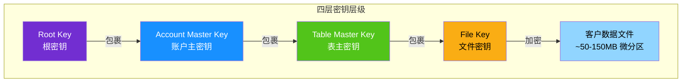

| 密钥层 | 存储位置 | 加密范围 |
|--------|----------|----------|
| **Root Key** | 云提供商 HSM（硬件安全模块） | 包裹账户主密钥 |
| **Account Master Key (AMK)** | Snowflake 元数据存储（加密态） | 每账户独立，包裹表主密钥 |
| **Table Master Key (TMK)** | Snowflake 元数据存储（加密态） | 每表独立，包裹文件密钥 |
| **File Key** | 微分区文件元数据 | 加密单个数据文件 |

> [!TIP]
> 四层密钥像"俄罗斯套娃"——打开最外层才能看到下一层，即使某一层被攻破，上层密钥仍然保护着整体安全。

**自动密钥轮换**：表主密钥超过 **30 天**后自动轮换——旧密钥标记为"退役"（仅用于解密历史数据），新密钥用于加密新写入的数据<sup>[[ref-d7-4]](#ref-d7-4)</sup>。

**定期重加密（Periodic Rekeying，Enterprise+）**：当退役密钥超过**一年**时，Snowflake 自动用全新随机密钥重新加密该密钥保护的所有历史数据，并销毁旧密钥<sup>[[ref-d7-4]](#ref-d7-4)</sup>。此过程在线后台执行，对运行中的工作负载无影响。

```sql
-- ACCOUNTADMIN 可启用定期重加密
ALTER ACCOUNT SET PERIODIC_DATA_REKEYING = TRUE;
```

| 密钥生命周期阶段 | 持续时间 | 状态 |
|------------------|----------|------|
| Active（活跃） | ~30 天 | 可加密和解密 |
| Retired（退役） | ~12 个月（启用 rekey 时） | 仅可解密 |
| Destroyed（销毁） | — | 不可加解密 |

#### Tri-Secret Secure（客户托管密钥 / BYOK）

**Tri-Secret Secure（TSS）**是 Business Critical 及以上版本的增强功能，允许客户使用自己的云 KMS 密钥（Customer-Managed Key, CMK）与 Snowflake 管理的密钥组合成**复合主密钥**<sup>[[ref-d7-5]](#ref-d7-5)</sup><sup>[[ref-d7-7]](#ref-d7-7)</sup>。

| 组成部分 | 来源 | 作用 |
|----------|------|------|
| Snowflake 维护密钥 | Snowflake（经 SOC 2 / PCI DSS / HIPAA / HITRUST 认证） | 与 CMK 组合成复合主密钥 |
| 客户托管密钥（CMK） | 客户的云 KMS | 客户完全掌控，可随时禁用 |
| 用户认证 | Snowflake 内置认证 | 第三层保护 |

> [!TIP]
> TSS 像"银行保险箱需要两把钥匙同时转动才能打开"——一把在银行（Snowflake）手里，一把在你手里。你随时可以拔走自己的钥匙，让所有数据立即不可访问。

**支持的云 KMS 平台**<sup>[[ref-d7-5]](#ref-d7-5)</sup>：

| 云平台 | KMS 服务 |
|--------|----------|
| AWS | AWS KMS（另支持 Thales HSM / CipherTrust 外部密钥库） |
| Microsoft Azure | Azure Key Vault |
| Google Cloud | Cloud KMS |

**关键约束**：Snowflake 可容忍最多 **10 分钟**的 CMK 临时不可用（如网络问题）。超过 10 分钟后，账户内所有数据操作将完全停止；恢复密钥访问后自动恢复<sup>[[ref-d7-4]](#ref-d7-4)</sup>。客户**绝不能删除或撤销旧版本 CMK 的权限**——旧数据仍需旧版本密钥解密，否则将导致永久性数据丢失<sup>[[ref-d7-4]](#ref-d7-4)</sup>。

#### 数据治理策略矩阵

Snowflake 提供一组**在查询引擎层**执行的治理策略对象，无论访问来源是人工查询、BI 工具还是 AI Agent，策略都自动生效<sup>[[ref-d7-6]](#ref-d7-6)</sup>。

| 策略对象 | 保护粒度 | 功能 | 最低版次 |
|----------|----------|------|----------|
| **对象标签（Tagging）** | 对象/列级 | 为对象打标签，关联策略，追踪敏感数据 | Enterprise+<sup>[[ref-d7-7]](#ref-d7-7)</sup> |
| **动态数据脱敏（Masking Policy）** | 列级 | 查询时动态脱敏，不改原始数据；支持条件脱敏 | Enterprise+<sup>[[ref-d7-2]](#ref-d7-2)</sup> |
| **行访问策略（Row Access Policy）** | 行级 | 按角色/用户过滤可见行 | Enterprise+<sup>[[ref-d7-3]](#ref-d7-3)</sup> |
| **聚合策略（Aggregation Policy）** | 查询结果级 | 限制查询必须包含 GROUP BY，防止个体记录暴露 | Enterprise+<sup>[[ref-d7-7]](#ref-d7-7)</sup> |
| **投影策略（Projection Policy）** | 列级 | 阻止特定列被 SELECT，防止高敏字段暴露 | Enterprise+<sup>[[ref-d7-7]](#ref-d7-7)</sup> |
| **差分隐私（Differential Privacy）** | 查询结果级 | 在结果中注入噪声，防止定向隐私攻击 | Enterprise+<sup>[[ref-d7-7]](#ref-d7-7)</sup> |
| **数据分类（Classification）** | 列级 | 自动发现并分类含敏感信息的列（PII/PHI 等） | Enterprise+<sup>[[ref-d7-7]](#ref-d7-7)</sup> |

> [!TIP]
> 这些策略对象像"快递分拣中心的自动分拣带"——数据在上层流动时，策略引擎逐件检查：这行数据这个角色能看吗？（行访问策略）这个列需要打码吗？（脱敏策略）聚合粒度够不够保护隐私？（聚合策略）全部在查询引擎层自动执行，用户和 AI Agent 无需（也无法）绕过。

**动态数据脱敏示例**：脱敏策略在查询运行时改写 SQL，将策略表达式注入到列被引用的所有位置（SELECT、WHERE、JOIN、ORDER BY 等），防止通过"创造性查询"绕过脱敏<sup>[[ref-d7-2]](#ref-d7-2)</sup>：

```sql
CREATE MASKING POLICY ssn_mask AS (val string) RETURNS string ->
  CASE
    WHEN CURRENT_ROLE() IN ('PAYROLL') THEN val   -- 薪资角色可见原文
    ELSE '***-**-****'                              -- 其他角色看打码
  END;
```

关键安全设计：**对象 owner 也无法绕过脱敏策略查看原始数据**——安全团队（而非数据 owner）定义脱敏规则，实现职责分离（SoD）<sup>[[ref-d7-2]](#ref-d7-2)</sup>。

**行访问策略评估**：策略表达式以**策略 owner 的角色**执行（而非查询发起者的角色），这意味着查询者无需访问映射表即可被过滤<sup>[[ref-d7-3]](#ref-d7-3)</sup>。当同时存在行访问策略和列脱敏策略时，**行访问策略先执行**<sup>[[ref-d7-3]](#ref-d7-3)</sup>。

#### 数据血缘与审计

**ACCESS_HISTORY**（访问历史）是 Snowflake 的 Account Usage 视图，记录每个查询读写了哪些列、哪些对象，提供列级数据血缘追踪<sup>[[ref-d7-7]](#ref-d7-7)</sup>。结合 Time Travel，可回溯数据的历史状态与访问路径。

#### Snowflake Horizon Catalog

Snowflake Horizon Catalog 是内建的统一数据治理套件，覆盖**发现、理解、信任**数据三个维度<sup>[[ref-d7-6]](#ref-d7-6)</sup>：

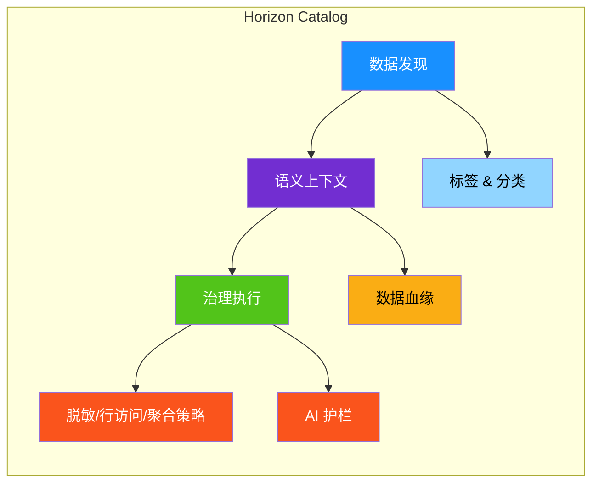

Horizon 的核心架构特点是：**治理策略在查询引擎层执行**，而非应用层。这意味着无论访问者是人工分析师、BI 工具还是 AI Agent，策略都自动生效，无需额外配置<sup>[[ref-d7-6]](#ref-d7-6)</sup>。治理策略还可跨引擎延伸——通过 Iceberg REST Catalog API，策略跟随数据到 Spark、Flink、Trino 等外部引擎<sup>[[ref-d7-6]](#ref-d7-6)</sup>。

| Horizon 能力 | 说明 |
|-------------|------|
| 数据发现与分类 | 自动发现敏感列并分类打标，schema 变化时自动适配<sup>[[ref-d7-6]](#ref-d7-6)</sup> |
| 端到端数据血缘 | 跨 Snowflake、外部数据库、BI 工具的列级血缘追踪<sup>[[ref-d7-6]](#ref-d7-6)</sup> |
| 语义视图（Semantic Views） | 为 AI Agent 提供业务语义层，确保回答基于权威数据<sup>[[ref-d7-6]](#ref-d7-6)</sup> |
| 数据质量监控 | 持续监控并根因分析，确保查询返回新鲜准确数据<sup>[[ref-d7-6]](#ref-d7-6)</sup> |
| AI 护栏 | 检测、脱敏、阻断 AI 输出中的 PII 和 PHI<sup>[[ref-d7-6]](#ref-d7-6)</sup> |
| Trust Center | 持续监控角色配置错误和未保护列<sup>[[ref-d7-6]](#ref-d7-6)</sup> |

#### 合规认证矩阵

Snowflake 已通过多项国际和区域合规认证<sup>[[ref-d7-8]](#ref-d7-8)</sup>。不同版次支持的合规能力有所不同<sup>[[ref-d7-7]](#ref-d7-7)</sup>：

| 合规框架 | 所有版次 | Enterprise+ | Business Critical+ | VPS |
|----------|:--------:|:-----------:|:------------------:|:---:|
| SOC 2 Type II | ✓ | ✓ | ✓ | ✓ |
| ISO 27001 / 27017 / 27018 | ✓ | ✓ | ✓ | ✓ |
| PCI DSS | — | — | ✓ | ✓ |
| HIPAA / HITRUST CSF | — | — | ✓ | ✓ |
| FedRAMP (Moderate & High) | — | — | — | ✓ |
| ITAR | — | — | — | ✓ |
| DoD IL5 | — | — | — | ✓ |

> [!TIP]
> 合规认证版次对应关系像"保险套餐"：基础版（Standard/Enterprise）覆盖通用的 SOC 2 和 ISO 安全认证；要处理医疗数据（HIPAA）或支付数据（PCI DSS），需升级到 Business Critical；而美国政府合规（FedRAMP / ITAR）则需 VPS（Virtual Private Snowflake）这一完全隔离环境。

GDPR 虽不作为独立认证列出，但 Snowflake 通过 ISO 27001 / 27018 认证和数据处理协议（DPA）满足 GDPR 要求<sup>[[ref-d7-8]](#ref-d7-8)</sup>。

#### 安全能力版次对照

| 安全能力 | Standard | Enterprise | Business Critical | VPS |
|----------|:--------:|:----------:|:-----------------:|:---:|
| 自动加密（at-rest + TLS） | ✓ | ✓ | ✓ | ✓ |
| MFA / SSO / OAuth / Key-Pair | ✓ | ✓ | ✓ | ✓ |
| Network Policies | ✓ | ✓ | ✓ | ✓ |
| 定期重加密（Periodic Rekeying） | — | ✓ | ✓ | ✓ |
| 列脱敏 / 行访问策略 | — | ✓ | ✓ | ✓ |
| 聚合 / 投影策略 / 差分隐私 | — | ✓ | ✓ | ✓ |
| Tri-Secret Secure（BYOK） | — | — | ✓ | ✓ |
| 私有连接（PrivateLink / Private Link） | — | — | ✓ | ✓ |
| FedRAMP / ITAR / DoD IL5 | — | — | — | ✓ |


**解决什么问题**：让不同组织之间直接共享数据，但既不复制、也不搬运任何一行数据——提供方更新一秒后，消费方立即可见，消费方无需为存储付一分钱。

---

### D8 · 数据共享与协作：零拷贝共享

传统数据共享需要把数据导出、传输、导入到对方系统，不仅耗时耗钱，还导致"同一份数据有多个副本"，同步与治理噩梦无休无止。Snowflake 的零拷贝共享（Zero-Copy Sharing）从根上消除了这个问题：它不移动数据，只传递"数据在哪"的元数据指针<sup>[[ref-d8-1]](#ref-d8-1)</sup>。

> [!TIP]
> **生活类比——图书馆的快捷方式**
> 想象图书馆有一本书（数据）。传统方式是把书复印一份寄给对方（ETL 导出 → 传输 → 导入）。零拷贝共享则是在对方的书架上放一张"请去 3 楼 A 区取阅"的指引卡（元数据指针）——对方随时能读到书的内容，但书始终只有一本，作者修订后立刻生效。

#### 核心机制：元数据指针而非数据搬运

Snowflake 的三层架构（Cloud Services / Compute / Storage）中，**存储与计算分离**是零拷贝共享的物理基础。共享数据时，Cloud Services 层记录的是"消费方账户有权访问提供方账户的哪些微观分区（micro-partitions）"——这条元数据就是全部，没有任何字节被复制<sup>[[ref-d8-1]](#ref-d8-1)</sup>。

这意味着：

| 特性 | 说明 |
|------|------|
| **无数据复制** | 提供方和消费方看到的是同一份物理存储，不存在副本 |
| **消费者零存储成本** | 共享数据不占用消费方的任何存储配额<sup>[[ref-d8-1]](#ref-d8-1)</sup> |
| **只付查询计算** | 消费方仅需为查询数据时启动的虚拟仓库（Virtual Warehouse）计算资源付费 |
| **实时更新即时可见** | 提供方修改数据后，消费方无需任何刷新操作，立即看到最新值<sup>[[ref-d8-1]](#ref-d8-1)</sup> |
| **跨区域 / 跨云** | 支持跨 AWS、Azure、GCP 不同区域共享，通过复制（Replication）实现跨区元数据同步<sup>[[ref-d8-2]](#ref-d8-2)</sup> |

**成本分担模型**：

| 角色 | 存储费用 | 计算费用 |
|------|---------|---------|
| **提供方（Provider）** | 承担全部共享数据的存储费用 | 不承担消费方的查询计算 |
| **消费方（Consumer）** | 零存储费用 | 承担自己查询时产生的仓库计算费用<sup>[[ref-d8-1]](#ref-d8-1)</sup> |

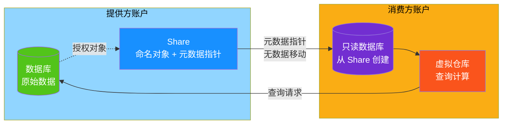

> **图解**：提供方的数据库数据不离开原账户。Share 对象如同一份"授权目录"，记录哪些消费方可以读哪些表。消费方用 `CREATE DATABASE ... FROM SHARE` 创建一个只读数据库后，查询时由消费方自己的虚拟仓库执行计算，结果直接从提供方存储读取——全程零拷贝。

#### Shares：共享的基本单元

**Share** 是一个命名的 Snowflake 对象，封装了共享所需的全部信息：包含哪些数据库对象、授权给哪些消费方账户<sup>[[ref-d8-1]](#ref-d8-1)</sup>。创建 Share 后，提供方通过两种方式授予对象访问权限：

1. **通过数据库角色（Database Role）**：将对象权限授予数据库角色，再把角色权限授予 Share——推荐方式，便于批量管理
2. **直接授予 Share**：将对象权限直接绑定到 Share 上<sup>[[ref-d8-1]](#ref-d8-1)</sup>

**可共享的对象类型**：

| 对象类型 | 说明 |
|---------|------|
| 表（Table） | 标准表，最常用的共享对象 |
| 动态表（Dynamic Table） | 声明式物化视图，自动刷新 |
| 外部表（External Table） | 引用外部存储（S3 / Azure Blob / GCS）中的数据 |
| Apache Iceberg 表 | 外部管理型和 Snowflake 管理型均支持<sup>[[ref-d8-1]](#ref-d8-1)</sup> |
| 视图（View） | 普通视图、安全视图（Secure View）、安全物化视图、语义视图 |
| Cortex Search 服务 | AI 驱动的全文检索服务 |
| 用户定义函数（UDF） | 安全 UDF 和非安全 UDF 均可 |
| 模型（Model） | 支持 `USER_MODEL`、`CORTEX_FINETUNED`、`DOC_AI` 类型<sup>[[ref-d8-1]](#ref-d8-1)</sup> |

> [!TIP]
> **生活类比——快递分拣中心**
> Share 就像一个快递分拣中心的"发货单"：上面写清楚了发什么（共享对象）、发给谁（消费方账户），但货物本身（数据）始终在仓库里不动——快递员（虚拟仓库）按发货单去取货时才产生运费（计算费用）。

#### Provider / Consumer 模型

零拷贝共享基于清晰的双方角色模型：

| 角色 | 权限 | 关键约束 |
|------|------|---------|
| **提供方（Provider）** | 创建 Share、选择消费方账户、管理包含的对象、随时撤销访问 | 承担存储费用；可创建无限数量的 Share 并添加无限数量的消费方<sup>[[ref-d8-1]](#ref-d8-1)</sup> |
| **消费方（Consumer）** | 从 Share 创建只读数据库，用标准 RBAC 控制内部用户访问 | **所有共享对象均为只读**，不可执行 INSERT / UPDATE / DELETE；**每个 Share 只能创建一个数据库**<sup>[[ref-d8-1]](#ref-d8-1)</sup> |

任何完整的 Snowflake 账户都可以同时扮演提供方和消费方角色。提供方可以在单个 Share 中包含来自**多个数据库**的对象（需属于同一账户），消费方侧以单一只读数据库统一呈现<sup>[[ref-d8-1]](#ref-d8-1)</sup>。

#### 四种共享机制

Snowflake 提供四种递进式的共享途径，从最简单的点对点直发到最严格的隐私计算协作<sup>[[ref-d8-2]](#ref-d8-2)</sup>：

| 维度 | Direct Share | Listing | Data Exchange | Clean Room |
|------|-------------|---------|---------------|------------|
| **覆盖范围** | 同区域账户 | 任意区域的多个账户 | 受邀账户群组 | 任意区域协作方 |
| **跨云自动复制** | 否 | 是 | 是（跨区需 Auto-Fulfillment） | 是 |
| **数据商品化** | 否 | 是（付费 Listing） | 否 | 否 |
| **公开发现** | 否 | 可发布至 Marketplace | 仅群组内可见 | 否 |
| **消费方数据访问** | 直接只读访问 | 直接只读访问 | 直接只读访问 | **受控查询，不可见原始数据** |
| **使用指标** | 否 | 是 | 是 | — |

```mermaid
graph TB
    subgraph Layer0["Tier 0 · 基础层"]
        DS["Direct Share<br/>同区域点对点"]
    end

    subgraph Layer1["Tier 1 · 产品化层"]
        LI["Listing<br/>跨云 + 元数据 + 商品化"]
    end

    subgraph Layer2["Tier 2 · 治理层"]
        DE["Data Exchange<br/>受邀群组 + 审计"]
    end

    subgraph Layer3["Tier 3 · 隐私层"]
        CR["Clean Room<br/>受控查询 + 不暴露原始数据"]
    end

    DS -->|"升级"| LI
    LI -->|"加入群组治理"| DE
    DE -->|"需要隐私保护"| CR

    RA["Reader Accounts<br/>面向非 Snowflake 客户"]
    RA -.->|"横跨所有层级"| DS
    RA -.-> LI
    RA -.-> DE

    style DS fill:#91d5ff,color:#000
    style LI fill:#1890ff,color:#fff
    style DE fill:#722ed1,color:#fff
    style CR fill:#fa541c,color:#fff
    style RA fill:#faad14,color:#000
    style Layer0 fill:#f0f8ff,color:#000
    style Layer1 fill:#f0f8ff,color:#000
    style Layer2 fill:#f9f0ff,color:#000
    style Layer3 fill:#fff7e6,color:#000
```

> **图解**：四种机制呈递进关系。Direct Share 是最基础的"点对点直发"；Listing 在其上增加了跨云复制、商品化和元数据描述；Data Exchange 再加一层群组治理和审计；Clean Room 则走了一条不同的路——消费方根本看不到原始数据，只能在提供方允许的模板中运行分析。Reader Accounts 横跨所有层级，让没有 Snowflake 账户的外部用户也能接收共享数据。

##### 1. Direct Shares（直接共享）

最简单的方式：同区域的两个账户之间直接共享数据库对象，无需复制、无需中间环节<sup>[[ref-d8-2]](#ref-d8-2)</sup>。适合"我知道对方账户名，直接发"的场景。已有的 Direct Share 可以随时升级为 Listing<sup>[[ref-d8-2]](#ref-d8-2)</sup>。

##### 2. Listings（数据产品列表）

Listing = Share + 丰富的元数据，是 Snowflake 把"共享"升级为"数据产品"的核心载体<sup>[[ref-d8-3]](#ref-d8-3)</sup>。每个 Listing 可以包含标题、描述、示例 SQL 查询和数据提供方信息<sup>[[ref-d8-3]](#ref-d8-3)</sup>。

**Listing 类型**：

| 类型 | 访问方式 | 适用场景 |
|------|---------|---------|
| **免费（Free）** | 即时获取完整数据集 | 开放数据、推广引流 |
| **限时试用（Limited Trial）** | 1–90 天限期访问<sup>[[ref-d8-3]](#ref-d8-3)</sup> | 先试后买 |
| **付费（Paid）** | 消费方在 Snowsight 中查看报价、接受合同条款后获取 | 数据商业化 |

付费 Listing 支持**定价计划（Pricing Plans）**——单个 Listing 下可定义多个 SKU，以及针对每个消费方定制的报价（Offers），包含独立的计费方式、付款周期和合同起止日期<sup>[[ref-d8-3]](#ref-d8-3)</sup>。

Listing 可选择**公开发布**到 Snowflake Marketplace，或**私下定向**发送给特定账户<sup>[[ref-d8-3]](#ref-d8-3)</sup>。

##### 3. Data Exchanges（数据交换中心）

Data Exchange 是一个面向**受邀群组**的数据协作中心，介于"一对一 Direct Share"和"对全世界公开的 Marketplace"之间<sup>[[ref-d8-5]](#ref-d8-5)</sup>。

> [!TIP]
> **生活类比——共享单车 vs 私人车库**
> Direct Share 是"借你我的车"（点对点）；Marketplace 是"路边共享单车，谁都能扫码"（完全公开）；Data Exchange 则是"公司内部车队，只有员工能用"（受邀群组）。

**核心治理能力**：

| 能力 | 说明 |
|------|------|
| **成员管理** | ACCOUNTADMIN 管理员添加/移除成员，指定为提供方、消费方或双重角色<sup>[[ref-d8-5]](#ref-d8-5)</sup> |
| **访问控制** | Listing 可设为"个性化"（需审批）或"免费"（即时获取）<sup>[[ref-d8-5]](#ref-d8-5)</sup> |
| **审计** | 管理员可审计数据使用情况 |
| **安全控制** | 可对 Exchange 内共享的数据施加安全策略<sup>[[ref-d8-5]](#ref-d8-5)</sup> |

Data Exchange 默认不启用，需要联系 Snowflake Support 申请开通<sup>[[ref-d8-5]](#ref-d8-5)</sup>。

##### 4. Clean Rooms（数据净室）

Clean Rooms 与前三种机制有本质区别：消费方**看不到原始数据**，只能在提供方预先批准的分析模板中运行查询<sup>[[ref-d8-4]](#ref-d8-4)</sup>。它解决的是"我想跟合作伙伴联合分析，但谁也不能看到对方的原始明细数据"这一核心矛盾。

**三种协作角色**：

| 角色 | 职责 | 关键约束 |
|------|------|---------|
| **Owner（所有者）** | 创建和管理协作、分配角色、定义数据共享权限 | 每个协作仅一位 Owner；无分析执行权<sup>[[ref-d8-4]](#ref-d8-4)</sup> |
| **Data Provider（数据提供方）** | 以"数据产品（Data Offering）"形式提供表/视图 | 控制暴露哪些列、施加什么策略<sup>[[ref-d8-4]](#ref-d8-4)</sup> |
| **Analysis Runner（分析执行方）** | 执行被授权的模板查询 | 承担分析的计算费用；只能运行批准的模板<sup>[[ref-d8-4]](#ref-d8-4)</sup> |

> [!TIP]
> **生活类比——密封信封 vs 透明玻璃**
> Direct Share / Listing / Data Exchange 是"透明玻璃"——数据虽然只读，但消费方能看到全部内容。Clean Room 是"密封信封"——你只能按照允许的方式去"掂量"信封（运行模板查询得到聚合结果），永远不能拆开看里面的原文（原始明细行）。

**隐私控制层级**：

1. **列级控制**：数据产品规格定义哪些列可见、适用什么策略<sup>[[ref-d8-4]](#ref-d8-4)</sup>
2. **模板限制**：分析执行方只能运行明确分配的 JinjaSQL 模板<sup>[[ref-d8-4]](#ref-d8-4)</sup>
3. **策略执行**：Enterprise Edition 及以上支持策略强制执行（Policy Enforcement）<sup>[[ref-d8-4]](#ref-d8-4)</sup>
4. **审批流程**：所有协作方必须审阅并批准协作规格才能加入，修改也需受影响方一致同意<sup>[[ref-d8-4]](#ref-d8-4)</sup>

支持的分析类型包括重叠分析（Overlap/Activation）、库存预测（Inventory Forecasting）、归因分析（Last-touch Attribution）、相似人群扩展（Lookalike Modeling）等<sup>[[ref-d8-2]](#ref-d8-2)</sup>。

#### Reader Accounts：面向非 Snowflake 客户

如果消费方根本不是 Snowflake 用户，以上所有机制都需要对方先注册 Snowflake 账户。**Reader Account** 解决这个问题：由提供方创建和管理，让没有 Snowflake 账户的外部用户也能查询共享数据<sup>[[ref-d8-6]](#ref-d8-6)</sup>。

| 特性 | 说明 |
|------|------|
| **创建方式** | `CREATE MANAGED ACCOUNT ... TYPE = READER`（需 ACCOUNTADMIN 或 CREATE ACCOUNT 权限）<sup>[[ref-d8-6]](#ref-d8-6)</sup> |
| **默认上限** | 每个提供方账户最多 20 个 Reader Account，需提升联系 Snowflake Support<sup>[[ref-d8-6]](#ref-d8-6)</sup> |
| **数据来源** | 只能消费创建它的提供方账户的数据，不可接收其他来源<sup>[[ref-d8-6]](#ref-d8-6)</sup> |
| **费用承担** | 提供方承担全部费用，包括消费方的仓库计算<sup>[[ref-d8-6]](#ref-d8-6)</sup> |
| **操作限制** | 禁止 INSERT / UPDATE / DELETE / MERGE / COPY INTO table；不能创建 Share / Stage / Pipe / Policy 等<sup>[[ref-d8-6]](#ref-d8-6)</sup> |
| **删除冷却期** | 删除后需等待 7 天才能释放配额<sup>[[ref-d8-6]](#ref-d8-6)</sup> |
| **支持模型** | Reader Account 用户无 Snowflake 官方支持，由提供方作为第一支持方<sup>[[ref-d8-6]](#ref-d8-6)</sup> |

> [!TIP]
> **生活类比——免费 Wi-Fi 热点**
> Reader Account 就像商场提供的免费 Wi-Fi：顾客（外部用户）无需自己拉网线（注册 Snowflake），连上就能用（查询数据），但带宽费用（计算成本）全部由商场（提供方）买单，而且只能访问商场允许的网站（只读 + 仅限该提供方数据）。

#### Snowflake Marketplace：数据商品化

Marketplace 是 Snowflake 的**公共数据市场**，提供方可以在此发布 Listing（数据产品或 Snowflake Native Apps），消费方通过 Snowsight 浏览、发现和获取<sup>[[ref-d8-3]](#ref-d8-3)</sup>。

**发布流程**：

1. 提供方将 Share 或 Native App 附加到 Listing
2. 填写元数据（标题、描述、示例 SQL）
3. 选择可用性：公开发布到 Marketplace 或私下发给特定账户
4. 选择访问类型：免费 / 限时试用 / 付费<sup>[[ref-d8-3]](#ref-d8-3)</sup>

**消费方获取方式**：

| Listing 类型 | 获取流程 |
|-------------|---------|
| 免费 | 即时获取完整数据集 |
| 限时试用 | 即时获取限期访问（1–90 天），到期后可申请无限访问<sup>[[ref-d8-3]](#ref-d8-3)</sup> |
| 付费 | 在 Snowsight 中查看定价报价 → 接受合同条款 → 获取访问权<sup>[[ref-d8-3]](#ref-d8-3)</sup> |

提供方可以通过 Marketplace 监控 Listing 的**使用指标**（Usage Metrics），了解消费方的兴趣和实际使用情况<sup>[[ref-d8-3]](#ref-d8-3)</sup>。

#### 零拷贝克隆 vs 零拷贝共享：统一原理

Snowflake 中有两个"零拷贝"能力，它们共享同一底层原理，但解决的是不同问题<sup>[[ref-d8-1]](#ref-d8-1)</sup><sup>[[ref-d8-7]](#ref-d8-7)</sup>。

**统一原理**：两者都依赖 Snowflake 存储层的**微观分区**（Micro-Partition，约 50–150MB 压缩列式、不可变）和 Cloud Services 层的**元数据管理**。无论是克隆还是共享，底层操作只是在元数据中创建一条新的引用指针，指向同一批物理微观分区——没有任何字节被复制<sup>[[ref-d8-1]](#ref-d8-1)</sup><sup>[[ref-d8-7]](#ref-d8-7)</sup>。

| 维度 | 零拷贝克隆（Clone） | 零拷贝共享（Share） |
|------|-------------------|-------------------|
| **解决的问题** | 在同一账户内快速创建可写副本（测试 / 开发 / 分析） | 在不同账户间共享只读数据 |
| **读写权限** | 克隆副本**可读可写**，写操作触发 Copy-on-Write<sup>[[ref-d8-7]](#ref-d8-7)</sup> | 消费方**严格只读**<sup>[[ref-d8-1]](#ref-d8-1)</sup> |
| **数据修改隔离** | 源和克隆各自修改只影响自己——Copy-on-Write 生成新数据文件<sup>[[ref-d8-7]](#ref-d8-7)</sup> | 提供方修改实时反映到消费方——无 Write 隔离<sup>[[ref-d8-1]](#ref-d8-1)</sup> |
| **存储费用** | 克隆后新增的数据文件产生额外存储费用 | 消费方零存储费用<sup>[[ref-d8-1]](#ref-d8-1)</sup> |
| **跨账户** | 否，同一账户内 | 是，跨账户、跨区域、跨云<sup>[[ref-d8-2]](#ref-d8-2)</sup> |
| **创建速度** | 快但不等于瞬时，大对象克隆仍需时间<sup>[[ref-d8-7]](#ref-d8-7)</sup> | 消费方 `CREATE DATABASE FROM SHARE` 近乎瞬时<sup>[[ref-d8-1]](#ref-d8-1)</sup> |
| **底层机制** | 元数据指针 + Copy-on-Write | 元数据指针 + 只读授权 |

> [!TIP]
> **生活类比——同一面墙的两扇窗**
> 克隆和共享就像一栋房子（Snowflake 存储层）面对同一面数据墙开的两扇窗。**克隆**这扇窗装了"可写玻璃"——你可以在自己这面涂改（Copy-on-Write），涂改内容只有你能看到，不影响对面。**共享**这扇窗是"单向透明玻璃"——你只能看不能改，但对面（提供方）每次重新粉刷墙壁（更新数据），你立刻就能看到新颜色。

**Copy-on-Write 详解**（仅适用于克隆）：当源对象或克隆对象中的任一方执行 DML（INSERT / UPDATE / DELETE）时，Snowflake 为发生变化的微观分区生成新的物理数据文件。变化仅影响执行修改的一方，另一方的指针仍指向原始分区——这就是"写时复制"的核心语义<sup>[[ref-d8-7]](#ref-d8-7)</sup>。共享场景下不存在 Copy-on-Write，因为消费方根本无写权限，所有修改只在提供方发生并实时可见。

---

**小结**：Snowflake 的零拷贝共享建立在"存储与计算分离 + 元数据指针"的架构基础之上，以 Share 为基本单元，通过 Direct Share → Listing → Data Exchange → Clean Room 四级递进机制覆盖从简单到复杂的协作场景，并以 Reader Account 和 Marketplace 将触角延伸到 Snowflake 生态之外。与零拷贝克隆共享同一"元数据指针"原理，但通过"只读 vs Copy-on-Write"的权限设计实现了截然不同的使用范式。

### D9 · 业务连续性：复制、容灾、恢复

**解决什么问题**：当整个云区域宕机、人为误删关键表、或需要在跨云跨区之间做容灾切换时，如何让数据"不丢"、业务"不停"。

Snowflake 的业务连续性体系由五条防线层层递进，覆盖从"整个区域不可用"到"单张表被误删"的全频谱故障场景：

| 防线 | 解决的问题 | 谁来操作 | 版本要求 |
|------|-----------|---------|---------|
| 跨区/跨云复制 | 区域级灾难（云厂商整体宕机） | 用户配置，自动执行 | 数据库复制全版本；账户复制+Failover 需 BC+ |
| Client Redirect | 业务连接无需改配置即可切到备用区 | 管理员一条命令 | Business Critical+ |
| Time Travel — AT/BEFORE | 恢复到误操作前的时间点 | 用户自行查询/克隆 | Standard 1 天；Enterprise+ 最多 90 天 |
| Time Travel — UNDROP | 恢复被 DROP 的表/库/schema | 用户一行命令 | 同上 |
| Fail-safe | 上述手段全部失效后的最后兜底 | 仅 Snowflake 协助恢复 | 全版本，固定 7 天 |

---

#### 一、跨区跨云复制：Replication Group 与 Failover Group

> [!TIP]
> **生活类比**：复制就像"快递分拣中心"——你在北京仓（主账户）有一批货物（数据库、用户、角色等），可以定期同步打包发往上海仓和东京仓（目标账户）。上海仓收到的是**只读副本**（Replication Group）；但如果你给上海仓配备了"接管权"（Failover Group），北京仓出问题时上海仓可以立刻升级为新的主仓，开始读写。

Snowflake 复制分为两个层级<sup>[[ref-d9-1]](#ref-d9-1)</sup>：

| 维度 | Replication Group（复制组） | Failover Group（故障转移组） |
|------|---------------------------|--------------------------|
| 核心能力 | 将源账户对象**单向异步**复制到目标账户 | 在复制组基础上增加**故障转移**能力 |
| 目标账户权限 | **只读**——可查询但不可写入 | 只读；被提升为主节点后变为**读写** |
| Failover | 不支持 | 支持（手动或自动） |
| 版本要求 | 数据库/共享复制：全版本；账户对象复制：BC+ | **Business Critical+ 专属** |
| 典型用途 | 跨区只读分析、数据分发 | 灾难恢复（DR）、高可用 |

**版本要求矩阵**<sup>[[ref-d9-1]](#ref-d9-1)</sup>：

| 能力 | Standard | Enterprise | Business Critical | VPS |
|------|---------|-----------|-------------------|-----|
| 数据库复制 | ✓ | ✓ | ✓ | ✓ |
| 共享复制 | ✓ | ✓ | ✓ | ✓ |
| Replication Group | ✓ | ✓ | ✓ | ✓ |
| 账户对象复制（用户/角色/仓库等） | — | — | ✓ | ✓ |
| Failover Group | — | — | ✓ | ✓ |
| Tri-Secret Secure | — | — | ✓ | ✓ |

**可复制对象一览**：Failover Group 几乎覆盖全部账户级对象——数据库、用户、角色、仓库、集成（安全/API/通知/存储）、网络策略、资源监控器、参数、共享，以及阶段（Stage）、管道（Pipe）等数据管道组件<sup>[[ref-d9-1]](#ref-d9-1)</sup>。

**Snowgrid 跨云编排**：Snowflake 的 Snowgrid 服务层跨 AWS、Azure、GCP 三大云的**所有区域**支持复制<sup>[[ref-d9-1]](#ref-d9-1)</sup>。同一区域组（Region Group）内可自由复制；跨区域组（如商业区到政府区或 VPS）需联系 Snowflake 支持开通。

```mermaid
graph TB
    subgraph 主区域["主区域（如 AWS us-east-1）"]
        A1["主账户<br/>读写 + 复制源"]
        A1 --> A2["Failover Group<br/>包含：DB/Users/Roles/Warehouses"]
    end
    subgraph 备用区域A["备用区域 A（如 Azure eastus2）"]
        B1["目标账户 A<br/>只读副本 → 可提升为读写"]
    end
    subgraph 备用区域B["备用区域 B（如 GCP us-central1）"]
        C1["目标账户 B<br/>只读副本 → 可提升为读写"]
    end
    A2 -->|"异步复制"| B1
    A2 -->|"异步复制"| C1
    B1 -.->|"Client Redirect<br/>连接 URL 自动切换"| Clients["客户端应用"]
    C1 -.->|"Client Redirect<br/>连接 URL 自动切换"| Clients

    style A1 fill:#1890ff,color:#fff
    style A2 fill:#1890ff,color:#fff
    style B1 fill:#52c41a,color:#fff
    style C1 fill:#52c41a,color:#fff
    style Clients fill:#722ed1,color:#fff
```

**复制调度**：通过 `REPLICATION_SCHEDULE` 参数设置刷新间隔（如每 30 分钟一次）。同一时刻只执行一个刷新任务；若上一个尚未完成，下一个自动延后<sup>[[ref-d9-1]](#ref-d9-1)</sup>。

---

#### 二、Failover / Failback：灾难切换与回切

> [!TIP]
> **生活类比**：Failover 就像"消防演习中的 B 计划"——A 楼着火了，所有人有序撤到 B 楼继续办公。等 A 楼修好了（Failback），再有序搬回去。关键在于"搬"的过程不能丢东西（RPO），也不能太久没人干活（RTO）。

**RPO 定量公式**<sup>[[ref-d9-3]](#ref-d9-3)</sup>：

> 辅助副本对象最多落后主对象 **2 倍调度间隔** 的时间。

即：如果复制间隔为 30 分钟，极端情况下辅助副本最多落后主节点 **60 分钟**。这是因为在最坏情况下，最后一次成功的刷新刚完成，下一次刷新刚开始时主节点就宕机了，因此丢失的数据窗口约为两个间隔周期。

**三种恢复策略**<sup>[[ref-d9-3]](#ref-d9-3)</sup>：

| 策略 | 思路 | 读 RTO | 写 RTO | 适用场景 |
|------|------|--------|--------|---------|
| **先读后写** | 先用旧数据顶上，再追平 | 接近零（改连接 URL） | 较慢（需 Failover + 追数据） | 短暂中断、可容忍脏读 |
| **先写后读** | 先恢复写入（ETL），数据追平再开放读 | 较慢 | 快（Failover + 恢复 ETL） | 对数据一致性要求高 |
| **读写并行** | 同时切换读写，接受短暂脏读 | 接近零 | 接近零 | 最高可用性要求 |

**Failover 操作步骤**<sup>[[ref-d9-1]](#ref-d9-1)</sup>：
1. 在目标账户**暂停调度复制**（正在刷新时无法 Failover）；
2. 执行 `ALTER FAILOVER GROUP ... PRIMARY`，将目标账户提升为主节点；
3. 原主节点自动降级为辅助副本；
4. 恢复调度复制，业务切换到新主节点。

**Failback（回切）**：原区域恢复后，刷新原主节点的 Failover Group，再次提升为主节点，Client Redirect 连接 URL 指回原账户<sup>[[ref-d9-3]](#ref-d9-3)</sup>。

---

#### 三、Client Redirect：业务无感切换

> [!TIP]
> **生活类比**：Client Redirect 就像"快递公司的统一客服电话"——不管包裹实际从哪个仓库发出，客户拨的永远是同一个号码。当主仓库换到另一个城市，客服号码不变，客户完全无感知。

**核心机制**：Snowflake 创建一个 **Connection（连接）对象**，生成一个**不含具体账户名**的连接 URL<sup>[[ref-d9-2]](#ref-d9-2)</sup>：

```
_组织名_-_连接名_.snowflakecomputing.com
```

客户端使用此 URL 连接，Snowflake 自动解析到当前持有主连接的账户。Failover 时管理员只需执行<sup>[[ref-d9-2]](#ref-d9-2)</sup>：

```sql
ALTER CONNECTION myconnection PRIMARY;
```

连接 URL 即刻指向新提升的账户，**客户端无需修改任何配置**。

**版本要求**：Business Critical+（与 Failover Group 一致）<sup>[[ref-d9-2]](#ref-d9-2)</sup>。

**支持的客户端**（最低版本）<sup>[[ref-d9-2]](#ref-d9-2)</sup>：

| 客户端 | 最低版本 |
|--------|---------|
| SnowSQL | 1.1.82 |
| Python Connector | 1.8.3 |
| JDBC Driver | 3.8.4 |
| ODBC Driver | 2.19.4 |
| Node.js Driver | 1.2.0 |
| Go Driver | 1.2.0 |
| .NET Driver | 1.0.0 |
| Snowpark / Spark | 全版本 |

```mermaid
graph LR
    subgraph 正常状态["正常状态"]
        Client1["客户端应用<br/>连接 URL: org-myconn.snowflake.com"]
        URL1["Snowflake DNS 解析"]
        Primary1["主账户 A（区域 1）<br/>读写"]
        Secondary1["辅助账户 B（区域 2）<br/>只读副本"]
        Client1 --> URL1 --> Primary1
        Primary1 -.->|"异步复制"| Secondary1
    end

    style Client1 fill:#722ed1,color:#fff
    style URL1 fill:#91d5ff,color:#000
    style Primary1 fill:#1890ff,color:#fff
    style Secondary1 fill:#52c41a,color:#fff
```

> [!NOTE]
> Client Redirect 仅支持**跨区域**的账户切换，同区域内的两个账户不能配置 Client Redirect<sup>[[ref-d9-2]](#ref-d9-2)</sup>。使用 AWS PrivateLink 等私有连接时，Failover 需要网络管理员手动更新 DNS CNAME 记录<sup>[[ref-d9-2]](#ref-d9-2)</sup>。

---

#### 四、Time Travel：时间旅行查询与恢复

> [!TIP]
> **生活类比**：Time Travel 就像"图书馆的借阅记录"——每本书每次改动都被记下来，你在保留期内可以翻到任意一天的状态。Standard 版记 1 天的流水账，Enterprise+ 版最多记 90 天。

Time Travel 让你在保留期内做三件事<sup>[[ref-d9-4]](#ref-d9-4)</sup>：
- **查询历史数据**（`SELECT ... AT/BEFORE`）
- **从历史时间点克隆对象**（`CREATE ... CLONE ... AT/BEFORE`）
- **恢复被删除的对象**（`UNDROP`）

**保留期规格**<sup>[[ref-d9-4]](#ref-d9-4)</sup>：

| 版本 | 默认保留期 | 可配置范围（永久对象） | 临时/临时表 |
|------|-----------|---------------------|------------|
| Standard | 1 天（24 小时） | 0 或 1 天 | 0 或 1 天 |
| Enterprise+ | 1 天（可调默认值） | **0–90 天** | 0 或 1 天 |

保留期通过 `DATA_RETENTION_TIME_IN_DAYS` 参数控制，支持账户 → 数据库 → Schema → 表的**层级继承**，子对象可覆盖父级设置<sup>[[ref-d9-4]](#ref-d9-4)</sup>。设为 0 即关闭该对象的 Time Travel。

**AT / BEFORE 查询语法**<sup>[[ref-d9-4]](#ref-d9-4)</sup>：

```sql
-- 查询 5 分钟前的数据
SELECT * FROM orders AT(OFFSET => -300);

-- 查询指定时间点的数据
SELECT * FROM orders AT(TIMESTAMP => '2026-08-01 10:00:00'::timestamp_tz);

-- 查询某条 SQL 执行之前的数据（用 Statement ID）
SELECT * FROM orders BEFORE(STATEMENT => '8e5d0ca9-005e-...');

-- 从历史时间点克隆整张表
CREATE TABLE orders_backup CLONE orders AT(OFFSET => -3600);
```

**UNDROP 恢复**<sup>[[ref-d9-4]](#ref-d9-4)</sup>：

```sql
UNDROP TABLE orders;       -- 恢复误删的表
UNDROP SCHEMA sales;       -- 恢复误删的 schema
UNDROP DATABASE my_db;     -- 恢复误删的数据库
```

UNDROP 会将对象恢复到**被 DROP 之前的最新状态**。如果已有同名对象存在，需先重命名现有对象才能 UNDROP<sup>[[ref-d9-4]](#ref-d9-4)</sup>。

---

#### 五、Fail-safe：最后灾备防线

> [!TIP]
> **生活类比**：Fail-safe 就像"银行的金库保险箱"——你自己打不开，只有银行（Snowflake）能打开。它是 Time Travel 过期后的最后一道安全网，你日常不会接触到它，但极端情况下它能救命。

Fail-safe 是 Snowflake 提供的**最后手段数据恢复服务**，具有以下特征<sup>[[ref-d9-5]](#ref-d9-5)</sup>：

| 属性 | 说明 |
|------|------|
| 时长 | **固定 7 天**，不可配置 |
| 起始点 | Time Travel 保留期结束之后立即开始 |
| 访问方式 | **仅限 Snowflake 操作**，用户无法自行查询或恢复 |
| 恢复时间 | 数小时到数天不等 |
| 计费方式 | 使用 Snowflake 管理的 serverless 计算资源，按标准 serverless 费率计费 |
| 存储计费 | Fail-safe 数据计入账户总存储量 |

> [!WARNING]
> Fail-safe 明确声明以"best effort"方式提供，仅当其他所有恢复手段均已尝试后才应使用<sup>[[ref-d9-5]](#ref-d9-5)</sup>。Snowpipe Streaming Classic 写入的表**不受 Fail-safe 保护**，无法通过此方式恢复<sup>[[ref-d9-5]](#ref-d9-5)</sup>。

---

#### 六、数据保护四层模型

Snowflake 的每一条数据从写入到最终物理清除，经历四个阶段<sup>[[ref-d9-4]](#ref-d9-4)</sup><sup>[[ref-d9-5]](#ref-d9-5)</sup>：

```mermaid
graph LR
    L1["1. Active<br/>当前活跃数据<br/>可读写查询"]
    L2["2. Time Travel<br/>历史保留区<br/>用户可查询/克隆/UNDROP"]
    L3["3. Fail-safe<br/>灾备缓冲区<br/>仅 Snowflake 可恢复"]
    L4["4. Purged<br/>物理清除<br/>不可恢复"]

    L1 -->|"保留期结束"| L2
    L2 -->|"保留期结束"| L3
    L3 -->|"7 天结束"| L4

    style L1 fill:#52c41a,color:#fff
    style L2 fill:#1890ff,color:#fff
    style L3 fill:#faad14,color:#fff
    style L4 fill:#fa541c,color:#fff
```

以 Enterprise 版、保留期设为 30 天的永久表为例：

| 阶段 | 天数 | 用户操作 | 计费 |
|------|------|---------|------|
| Active | 第 0–30 天 | 正常读写查询 | 存储费 |
| Time Travel | 第 1–30 天（与 Active 并行） | AT/BEFORE 查询、CLONE、UNDROP | 存储费（Time Travel 存储） |
| Fail-safe | 第 31–37 天 | 不可操作（联系 Snowflake 支持） | 存储费 + 恢复时 serverless 计算费 |
| Purged | 第 38 天起 | 不存在 | — |

> [!NOTE]
> 一个长时间运行的 Time Travel 查询会**延迟**数据进入 Fail-safe 阶段，直到查询完成后才继续流转<sup>[[ref-d9-4]](#ref-d9-4)</sup>。

---

#### 七、恢复手段全景对比

| 手段 | 适用故障 | RPO | RTO | 用户可操作 | 版本要求 |
|------|---------|-----|-----|-----------|---------|
| **Failover Group 切换** | 整个区域/云不可用 | ≤ 2× 复制间隔（如 30 min 间隔 → 最多 1 h）<sup>[[ref-d9-3]](#ref-d9-3)</sup> | 分钟级（暂停复制→提升→恢复）<sup>[[ref-d9-3]](#ref-d9-3)</sup> | ✓ | Business Critical+ |
| **Client Redirect** | 配合 Failover 的连接切换 | 同上（依赖复制） | 接近零（URL 自动解析）<sup>[[ref-d9-2]](#ref-d9-2)</sup> | ✓（管理员一条命令） | Business Critical+ |
| **Time Travel — AT/BEFORE** | 误操作（UPDATE/DELETE 写错） | 0（恢复到精确时间点） | 秒级（一条 SQL）<sup>[[ref-d9-4]](#ref-d9-4)</sup> | ✓ | Standard 1 天；Enterprise+ 最多 90 天 |
| **Time Travel — UNDROP** | 误删表/库/schema | 0（恢复到删除前状态） | 秒级（一条 SQL）<sup>[[ref-d9-4]](#ref-d9-4)</sup> | ✓ | 同上 |
| **Fail-safe** | 极端故障，Time Travel 已过期 | ≤ 7 天（Time Travel 结束后）<sup>[[ref-d9-5]](#ref-d9-5)</sup> | 数小时到数天<sup>[[ref-d9-5]](#ref-d9-5)</sup> | ✗（仅 Snowflake 协助） | 全版本 |

> [!TIP]
> **选型决策树**：如果整个区域挂了 → Failover Group + Client Redirect；如果是手滑删了表/改错了数据 → Time Travel（UN)DROP / AT 查询）；如果 Time Travel 也过期了，才需要联系 Snowflake 走 Fail-safe。日常容灾规划应以前两者为主，Fail-safe 仅作为最后兜底。

---

#### 小结：RPO ≈ 0 与 RTO 分钟级的实现路径

| 目标 | 实现方式 | 关键配置 |
|------|---------|---------|
| **RPO ≈ 0**（几乎不丢数据） | 缩短复制间隔至最短可接受值 | `REPLICATION_SCHEDULE = '10 MINUTE'` 配合 Failover Group<sup>[[ref-d9-1]](#ref-d9-1)</sup> |
| **RTO 分钟级**（快速恢复业务） | Client Redirect 连接 URL + 自动/手动 Failover | `ALTER CONNECTION ... PRIMARY` 一条命令完成切换<sup>[[ref-d9-2]](#ref-d9-2)</sup> |
| **数据零丢失**（单点误操作） | Time Travel AT/BEFORE 恢复到精确时间点 | `DATA_RETENTION_TIME_IN_DAYS` 设为足够长的值（Enterprise+ 最高 90 天）<sup>[[ref-d9-4]](#ref-d9-4)</sup> |
| **极端兜底** | Fail-safe 7 天缓冲 | 无需配置，自动启用<sup>[[ref-d9-5]](#ref-d9-5)</sup> |

### D10 · 管理与成本：版本、计费、监控

本维度解决的核心问题是：**Snowflake 如何按版本分层定价、按用量计费，以及你用什么工具守住预算底线。**

Snowflake 的商业模型建立在"存算分离 + 按需付费"之上。你选择的版本（Edition）决定了可用功能和单价基础，实际账单则由计算（Compute）、存储（Storage）、云服务（Cloud Services）三层用量叠加而成<sup>[[ref-d10-1]](#ref-d10-1)</sup>。以下逐一拆解。

---

#### 四版次能力差异

Snowflake 提供 **Standard → Enterprise → Business Critical → Virtual Private Snowflake (VPS)** 四个版本，每个版本在前一个的基础上叠加功能并提升服务等级<sup>[[ref-d10-1]](#ref-d10-1)</sup>。

> [!TIP]
> 可以把四个版本想象成**图书馆的借阅等级**：Standard 是普通读者证（基础借阅），Enterprise 是高级会员（更多权限、更长借期），Business Critical 是 VIP 保险柜（加密钥匙自己掌管、合规认证齐全），VPS 则是整栋独立图书馆——不与任何人共享空间。

**版本特性矩阵（按能力域分组）**<sup>[[ref-d10-1]](#ref-d10-1)</sup>：

| 能力域 | 具体能力 | Standard | Enterprise | Business Critical | VPS |
|---|---|:---:|:---:|:---:|:---:|
| **基础功能** | 虚拟仓库、Snowpark、Streamlit、Cortex AI | ✔ | ✔ | ✔ | ✔ |
| | Time Travel 最长天数 | 1 天 | 90 天 | 90 天 | 90 天 |
| | Fail-safe 灾难恢复 | 7 天 | 7 天 | 7 天 | 7 天 |
| **性能与规模** | 多集群虚拟仓库（并发扩展） | ✗ | ✔ | ✔ | ✔ |
| | 物化视图（自动维护） | ✗ | ✔ | ✔ | ✔ |
| | 搜索优化（点查加速） | ✗ | ✔ | ✔ | ✔ |
| | 查询加速服务（Query Acceleration） | ✗ | ✔ | ✔ | ✔ |
| | Snowflake Optima（自动工作负载优化） | ✗ | ✔ | ✔ | ✔ |
| **安全与治理** | 列级 / 行级安全策略 | ✗ | ✔ | ✔ | ✔ |
| | 聚合策略 / 投影策略 | ✗ | ✔ | ✔ | ✔ |
| | 差分隐私（Differential Privacy） | ✗ | ✔ | ✔ | ✔ |
| | 数据分类（Data Classification） | ✗ | ✔ | ✔ | ✔ |
| | 访问历史审计（Access History） | ✗ | ✔ | ✔ | ✔ |
| | 数据质量与指标函数 | ✗ | ✔ | ✔ | ✔ |
| | Iceberg Tables（外部数据湖） | ✗ | ✔ | ✔ | ✔ |
| | 跨云自动履行（Cross-Cloud Auto-Fulfillment） | ✗ | ✔ | ✔ | ✔ |
| **密钥与合规** | Tri-Secret Secure（客户自管密钥） | ✗ | ✗ | ✔ | ✔ |
| | 私有连接（AWS PrivateLink / Azure Private Link / GCP PSC） | ✗ | ✗ | ✔ | ✔ |
| | HIPAA / HITRUST 合规 | ✗ | ✗ | ✔ | ✔ |
| | PCI DSS 合规 | ✗ | ✗ | ✔ | ✔ |
| | FedRAMP / ITAR（指定区域） | ✗ | ✗ | ✔ | ✔ |
| **容灾与高可用** | Failover / Failback（账户级切换） | ✗ | ✗ | ✔ | ✔ |
| | Client Redirect（客户端连接重定向） | ✗ | ✗ | ✔ | ✔ |
| **完全隔离** | 硬件资源完全不与其他账户共享 | ✗ | ✗ | ✗ | ✔ |
| | 专用元数据存储与计算资源池 | ✗ | ✗ | ✗ | ✔ |
| | 环境内传输全加密 | ✗ | ✗ | ✗ | ✔ |

> [!TIP]
> Business Critical 曾用名 "Enterprise for Sensitive Data (ESD)"，核心增值是把**加密钥匙交给客户自己管理**（Tri-Secret Secure）并补齐医疗（HIPAA）、支付（PCI DSS）、政府（FedRAMP）等合规认证<sup>[[ref-d10-1]](#ref-d10-1)</sup>。

**Time Travel 与 Fail-safe 按表类型的差异**<sup>[[ref-d10-2]](#ref-d10-2)</sup>：

| 表类型 | Time Travel | Fail-safe | 最短 / 最长历史数据保留 |
|---|---|---|---|
| Permanent（Standard 版） | 0 或 1 天 | 7 天 | 7–8 天 |
| Permanent（Enterprise+ 版） | 0–90 天 | 7 天 | 7–97 天 |
| Transient（临时 ETL 表） | 0 或 1 天 | 0 天 | 0–1 天 |
| Temporary（会话级临时表） | 0 或 1 天 | 0 天 | 0–1 天 |

> [!TIP]
> Transient 表就像**快递包装**——用完即弃，不需要 Fail-safe 保险。对于生命周期不到一天的 ETL 中间表，声明为 Transient 可以直接省掉 7 天的 Fail-safe 存储费用<sup>[[ref-d10-2]](#ref-d10-2)</sup>。

---

#### 计费三维度

Snowflake 的月度账单由三个独立维度构成<sup>[[ref-d10-3]](#ref-d10-3)</sup>：

```mermaid
graph TB
    subgraph Bill["月度账单总成本"]
        direction TB
        C["<b>Compute 计算层</b><br/>虚拟仓库 + Serverless<br/>按 credit × 单价"]
        S["<b>Storage 存储层</b><br/>表数据 + Time Travel + Fail-safe<br/>按月均 TB × 单价"]
        CS["<b>Cloud Services 云服务层</b><br/>认证 / 元数据 / 优化<br/>含 10% 计算用量免费额度"]
    end

    C ---|"按秒计费<br/>60 秒起步"| Bill
    S ---|"按日均体积<br/>月度结算"| Bill
    CS ---|"超出免费额度<br/>才扣 credit"| Bill

    style C fill:#1890ff,color:#fff
    style S fill:#52c41a,color:#fff
    style CS fill:#722ed1,color:#fff
    style Bill fill:#91d5ff,color:#000
```

**计费三维度构成说明**：

| 维度 | 计费单位 | 扣费触发 | 包含内容 |
|---|---|---|---|
| **Compute（计算）** | Credit（1 credit = 运行 1 小时 X-Small 仓库） | 仓库运行即扣费，按秒计、60 秒起步<sup>[[ref-d10-4]](#ref-d10-4)</sup> | 虚拟仓库（用户管理）、Serverless 计算（Snowpipe / 搜索优化等，Snowflake 自动管理）<sup>[[ref-d10-3]](#ref-d10-3)</sup> |
| **Storage（存储）** | TB / 月 | 按每日平均字节数计算月度体积<sup>[[ref-d10-2]](#ref-d10-2)</sup> | 表数据（压缩后体积）、Time Travel 历史数据、Fail-safe 数据、暂存文件（Staged Files）、克隆数据<sup>[[ref-d10-2]](#ref-d10-2)</sup> |
| **Cloud Services（云服务）** | Credit | **仅当**每日云服务用量 > 每日计算用量的 10% 时，超出部分才扣 credit<sup>[[ref-d10-3]](#ref-d10-3)</sup> | 认证、元数据管理、访问控制、查询优化、自动聚类等后台服务<sup>[[ref-d10-3]](#ref-d10-3)</sup> |

> [!TIP]
> Cloud Services 的 10% 免费额度就像**手机套餐的免费通话时长**：如果你的云服务用量不到计算用量的十分之一，完全免费；超出了才按 credit 另收。对大多数工作负载来说，云服务费用几乎可以忽略<sup>[[ref-d10-3]](#ref-d10-3)</sup>。

**仓库规格与 Credit 消耗**（Gen1 标准仓库）<sup>[[ref-d10-4]](#ref-d10-4)</sup>：

| 仓库规格 | Credits / 小时 | Credits / 秒 | 适用场景 |
|---|---|---|---|
| X-Small | 1 | 0.0003 | 轻量查询、UI 操作、开发测试 |
| Small | 2 | 0.0006 | 小批量加载、日常分析 |
| Medium | 4 | 0.0011 | 中等规模数据加载 |
| Large | 8 | 0.0022 | 批量加载、中等复杂查询 |
| X-Large | 16 | 0.0044 | 大规模查询、生产工作负载 |
| 2X-Large | 32 | 0.0089 | 大数据集复杂分析 |
| 3X-Large | 64 | 0.0178 | 重型 ETL、大规模报表 |
| 4X-Large | 128 | 0.0356 | 极大型数据集处理 |
| 5X-Large | 256 | 0.0711 | 超大规模工作负载 |
| 6X-Large | 512 | 0.1422 | 极端性能需求 |

> [!TIP]
> 每升一级，Credit 消耗翻倍——就像**楼梯**，每上一阶代价加倍。但按秒计费意味着，大仓库跑短任务可能比小仓库跑长任务更划算<sup>[[ref-d10-4]](#ref-d10-4)</sup>。

---

#### 账户类型：On Demand vs Capacity

Snowflake 提供两种账户（计费）类型，影响所有维度的单价<sup>[[ref-d10-3]](#ref-d10-3)</sup>：

| 类型 | 模式 | 特点 | 适合场景 |
|---|---|---|---|
| **On Demand** | 按量付费 | 无长期承诺，用多少付多少，单价较高 | 初创团队、不确定用量、PoC 验证 |
| **Capacity** | 预付承诺 | 签订长期承诺换取折扣价，预付额度内消费 | 用量稳定可预测的成熟团队 |

版本（Edition）和账户类型共同决定最终单价：同一规格的 Credit 在 Enterprise + On Demand 下与 Business Critical + Capacity 下价格不同<sup>[[ref-d10-3]](#ref-d10-3)</sup>。

---

#### 区域与云平台对单价的影响

具体单价因**云平台**（AWS / Azure / GCP）和**区域**（如美国 vs 欧洲 vs 亚太）而异<sup>[[ref-d10-3]](#ref-d10-3)</sup>。同一版本的 Credit 单价和 TB 存储单价在不同区域存在差异，原因是 Snowflake 需将底层云厂商的基础设施成本传递给客户<sup>[[ref-d10-3]](#ref-d10-3)</sup>。

> [!TIP]
> 选择区域就像选**数据中心的地段**：离数据源和用户越近，延迟越低，但某些区域（如欧洲）的基础设施成本可能更高，导致单价上浮。在成本敏感的场景下，跨区域比价是值得的<sup>[[ref-d10-3]](#ref-d10-3)</sup>。

数据传输方面：Snowflake **不收取入站（Ingress）费用**，但出站（Egress）数据传输按 TB 计费，费率取决于账户所在区域<sup>[[ref-d10-3]](#ref-d10-3)</sup>。

---

#### 资源监控（Resource Monitors）

Resource Monitor 是 Snowflake 的一等对象，专门用于**追踪和控制虚拟仓库的 Credit 消耗**，防止意外超支<sup>[[ref-d10-5]](#ref-d10-5)</sup>。

> [!TIP]
> Resource Monitor 就像**预付费电表**：你设定本月用电额度（Credit Quota），当用电量达到设定的百分比阈值时，系统会通知你；如果设了"断电"动作，超额就会自动拉闸（挂起仓库）。

**监控层级**<sup>[[ref-d10-5]](#ref-d10-5)</sup>：

| 层级 | 作用范围 | 数量限制 | 关键规则 |
|---|---|---|---|
| **Account Monitor** | 账户内所有仓库 | 每账户仅 1 个 | 不覆盖 Serverless 功能（Snowpipe 等）；不覆盖 Serverless 功能（Snowpipe 等）；与仓库级监控独立运作，任一触发即生效 |
| **Warehouse Monitor** | 指定仓库（可多选） | 每账户多个 | 每个仓库只能绑定 1 个监控器；单监控器最多绑定 500 个仓库 |

**阈值动作类型**<sup>[[ref-d10-5]](#ref-d10-5)</sup>：

| 动作 | 行为 | 限制 |
|---|---|---|
| **Notify** | 仅发送通知，不暂停仓库 | 最多 5 个 |
| **Notify & Suspend** | 通知 + 等当前查询结束后暂停 | 最多 1 个 |
| **Notify & Suspend Immediately** | 通知 + 立即暂停（取消正在执行的查询） | 最多 1 个 |

```mermaid
graph LR
    subgraph RM["Resource Monitor 运作流程"]
        Q["设置 Credit 预算<br/>（如 1000 credits / 月）"]
        T1["阈值 70%<br/>→ Notify"]
        T2["阈值 90%<br/>→ Notify"]
        T3["阈值 100%<br/>→ Suspend"]
        EX["超额<br/>仓库挂起"]
    end

    Q --> T1 --> T2 --> T3 --> EX

    style Q fill:#1890ff,color:#fff
    style T1 fill:#91d5ff,color:#000
    style T2 fill:#faad14,color:#fff
    style T3 fill:#fa541c,color:#fff
    style EX fill:#722ed1,color:#fff
```

**调度选项**<sup>[[ref-d10-5]](#ref-d10-5)</sup>：

| 频率 | 重置周期 | 说明 |
|---|---|---|
| Daily | 每天 UTC 00:00 重置 | 高频预算控制 |
| Weekly | 每周重置 | 周期性工作负载 |
| Monthly（默认） | 每月初重置 | 对齐 Snowflake 账单周期 |
| Yearly | 每年重置 | 年度预算 |
| Never | 不重置 | 一次性额度，用完即止 |

> [!IMPORTANT]
> Resource Monitor **仅适用于虚拟仓库**，无法追踪 Serverless 功能（如 Snowpipe、自动聚类、物化视图维护）和 AI 服务的费用。对于这些，Snowflake 推荐使用 **Budgets** 功能来设置单独的支出上限和通知<sup>[[ref-d10-5]](#ref-d10-5)[[ref-d10-6]](#ref-d10-6)</sup>。

**关键注意事项**<sup>[[ref-d10-5]](#ref-d10-5)</sup>：

1. Resource Monitor 统计的 Credit 包含云服务层用量，**不扣除 10% 免费额度**——即使部分用量最终未计入账单，也会消耗监控器配额。
2. 仓库挂起后，后续查询仍可能产生云服务费用——云服务层无法被仓库级监控器暂停。
3. 建议将暂停阈值设在 **100% 以下**（如 90%），因为从触发暂停到实际挂起有延迟，在途查询可能继续消耗 Credit。

---

#### 成本管理最佳实践

**1. 合理配置 Auto-Suspend**<sup>[[ref-d10-7]](#ref-d10-7)</sup>

Auto-Suspend 默认启用，会在仓库空闲指定时间后自动暂停。推荐设置为 **5–10 分钟**以避免空转浪费。但需注意：如果查询间隔仅 2–3 分钟，将 Auto-Suspend 设为 1 分钟会导致频繁的挂起/恢复循环——**每次恢复都会触发 60 秒最低计费**<sup>[[ref-d10-7]](#ref-d10-7)</sup>。

> [!TIP]
> Auto-Suspend 就像**共享单车的自动锁车**：你不骑了它就锁上（停止计费），但每次解锁都收一笔起步费。如果骑骑停停很频繁，不如一直骑下去更划算。

**2. 选择合适的仓库规格**<sup>[[ref-d10-7]](#ref-d10-7)</sup>

- 简单查询和 UI 操作用 X-Small 即可；大批量加载通常 Small–Large 足够<sup>[[ref-d10-4]](#ref-d10-4)</sup>。
- "越大越快"不绝对——小查询在大仓库上几乎无性能提升，反而浪费 Credit<sup>[[ref-d10-7]](#ref-d10-7)</sup>。
- 建议用同一工作负载在多个规格上跑对比测试，找到性价比拐点<sup>[[ref-d10-7]](#ref-d10-7)</sup>。

**3. 向上扩展 vs 向外扩展**<sup>[[ref-d10-7]](#ref-d10-7)</sup>

| 策略 | 含义 | 解决的问题 | 前提条件 |
|---|---|---|---|
| **Scale Up（升规格）** | 将仓库从 Large 改为 X-Large 等 | 单个大查询的性能 | 无（Standard 即可） |
| **Scale Out（加集群）** | 多集群仓库增加并发集群数 | 多用户同时查询的排队 | Enterprise+ 版本 |

多集群仓库建议将最小集群数设为 1（除非有高可用需求），并使用 **Auto-Scale 模式**而非 Maximized 模式，让额外集群仅在需要时启动<sup>[[ref-d10-7]](#ref-d10-7)</sup>。

**4. 利用结果缓存**<sup>[[ref-d10-7]](#ref-d10-7)</sup>

每个运行中的仓库维护本地数据缓存，可加速对相同数据的重复查询。但**仓库挂起后缓存丢失**，恢复后首轮查询会更慢。在决定是否频繁挂起仓库时，需要在 Credit 节省与缓存收益之间权衡<sup>[[ref-d10-7]](#ref-d10-7)</sup>。

**5. 用 Serverless 替代手动管理**<sup>[[ref-d10-3]](#ref-d10-3)</sup>

Snowpipe、搜索优化维护等 Serverless 功能由 Snowflake 自动管理计算资源的分配和弹性伸缩，无需手动调整仓库规格。适合间歇性、难以预测工作量的任务——你只为实际消耗的 Credit 付费<sup>[[ref-d10-3]](#ref-d10-3)</sup>。

**6. Snowpark Pushdown 减少数据移动**<sup>[[ref-d10-1]](#ref-d10-1)</sup>

Snowpark 允许在 Snowflake 引擎内直接执行 Python / Java / Scala 代码，数据无需导出到外部计算环境。这从两个维度降低成本：减少出站数据传输费（Egress），同时避免在外部集群上重复存储和处理数据<sup>[[ref-d10-1]](#ref-d10-1)</sup>。

**7. 用 Transient 表降低存储成本**<sup>[[ref-d10-2]](#ref-d10-2)</sup>

对于生命周期短的 ETL 中间表，声明为 Transient 类型可省去 7 天 Fail-safe 的存储费用。永久事实表（Fact Table）则应保持 Permanent 类型以获得 Fail-safe 保护<sup>[[ref-d10-2]](#ref-d10-2)</sup>。

**8. 零拷贝克隆不产生额外数据费用**<sup>[[ref-d10-2]](#ref-d10-2)</sup>

克隆创建的是元数据指针，初始不复制数据。只有当原始对象或克隆被修改后，新增的微分区才产生独立存储费用。这意味着创建开发/测试环境的克隆几乎零成本——前提是不大量修改数据<sup>[[ref-d10-2]](#ref-d10-2)</sup>。

## 第三部分 · 总（综合）

### 11. 全景能力矩阵

> 一张表速查 10 个维度的核心能力、关键机制与版本门槛。

| 维度 | 核心能力 | 关键机制 | 最低版本 |
|---|---|---|---|
| **D1 架构** | 三层分离 + 多云 | Cloud Services / Compute / Storage + Snowgrid | Standard |
| **D2 存储** | 微分区 + 多种表型 | 全列 min/max 裁剪、Time Travel/Fail-safe、Iceberg/Hybrid | Standard |
| **D3 计算** | 弹性虚拟仓库 | T-shirt 规格、多集群、auto-suspend/resume、QAS、搜索优化 | QAS/搜索优化/多集群需 Enterprise |
| **D4 数据工程** | 加载 + 流式 + 管道 | COPY/Snowpipe/Snowpipe Streaming、Dynamic Tables、Streams+Tasks | Standard |
| **D5 开发** | SQL + Snowpark + 应用 | ANSI SQL、Snowpark pushdown、UDF/存储过程、Streamlit | Standard |
| **D6 AI/ML** | Cortex 全家桶 + Snowflake ML | AI Functions/Analyst/Search/Fine-tuning、Feature Store/Model Registry | Standard（部分 Preview） |
| **D7 安全治理** | RBAC + 加密 + 治理 | DAC+RBAC、Tri-Secret Secure、脱敏/行访问/标签/血缘 | 行列级安全需 Enterprise；Tri-Secret 需 Business Critical |
| **D8 共享** | 零拷贝数据共享 | 元数据指针、Listings/Marketplace/Clean Rooms、Reader Accounts | Standard（Clean Rooms 需 Enterprise） |
| **D9 业务连续性** | 复制 + 容灾 + 恢复 | 跨云复制、Failover/Failback、Client Redirect、Time Travel | 复制 Standard；Failover 需 Business Critical |
| **D10 成本** | 版本 + 计费 + 监控 | Compute/Storage/Cloud Services 三维计费、Resource Monitors | Standard |

### 12. 与主流方案横向对比

> 以下为架构层面的定性对比（基于各平台公开文档与权威分析<sup>[[ref-s-1]](#ref-s-1)</sup><sup>[[ref-s-2]](#ref-s-2)</sup>），具体性能/价格随负载与区域差异很大，宜以 POC 实测为准。

| 对比维度 | **Snowflake** | **BigQuery** | **Redshift** | **Databricks** | **OceanBase** |
|---|---|---|---|---|---|
| **架构范式** | 三层分离数据云 | Serverless 数仓 | MPP（RA3 托管存储） | Lakehouse（Spark + Delta） | Shared-Nothing HTAP |
| **存储计算分离** | 原生、彻底 | 彻底（Serverless） | 部分（RA3/Nova；旧版耦合） | 经 Delta Lake 分离 | 节点内耦合（Paxos 副本） |
| **部署形态** | 全托管 SaaS，多云 | 全托管 Serverless，GCP | AWS 托管 | 全托管/自托管，多云 | 自托管/云，多云 |
| **半结构化数据** | VARIANT/JSON/XML，原生 | 原生（JSON/ARRAY） | 支持（Spectrum 较弱） | 原生（Spark 处理） | JSON 支持 |
| **数据共享** | 零拷贝共享 + Marketplace | 数据交换/Analytics Hub | Data Sharing（同区） | Delta Sharing（开放） | 无原生平替 |
| **AI/ML** | Cortex 原生（治理边界内） | Vertex AI 集成 | SageMaker 集成 | MLflow/Spark 强项 | 向量/AI 函数（V4.4） |
| **事务/HTAP** | Hybrid 表（事务型，较新） | 有限 | 单行事务弱 | 弱（侧重分析） | 强（金融级 OLTP + AP） |
| **定价模型** | Credits（厂商直付） | 按查询/存储（GCP 账单） | 实例时长（AWS 账单） | DBU + 云资源 | 许可/订阅 |
| **强项场景** | 弹性分析、共享、跨云治理、AI in-place | Serverless 即席查询、GCP 生态 | AWS 深度集成、成本可控 | 湖仓一体、ML/数据科学 | TP+AP+Vector 一体、私有部署 |

> **选型直觉**：
> - 想要"什么都不用管、按量付费、即席查询"→ **BigQuery**；
> - 已深度绑定 AWS、追求成本可控 → **Redshift**；
> - 数据科学/ML 重度、开放湖仓 → **Databricks**；
> - 需要强事务 + 分析 + 向量一体、可私有部署 → **OceanBase**；
> - 想要弹性分析 + 零拷贝共享 + 跨云统一治理 + 原生 AI 的平衡型平台 → **Snowflake**。

### 13. 适用场景与选型建议

**✅ Snowflake 特别适合**：

- **弹性分析负载**：负载峰谷明显、难以预测，按秒计费 + auto-suspend 能显著降本。
- **数据共享与数据产品化**：跨组织/跨企业共享数据，零拷贝共享 + Marketplace 是杀手锏。
- **跨云统一治理**：业务分布在 AWS/Azure/GCP，需要统一安全策略与容灾。
- **AI/ML 就地化**：希望数据不出域地在平台内做 LLM/搜索/预测（Cortex）。
- **半结构化数据为主**：JSON/Parquet 大量，VARIANT + 自动 Schema 演化省心。
- **团队能力以 SQL/Python 为主**：Snowpark + Streamlit 降低工程门槛。

**⚠️ 需要权衡的场景**：

- **纯高并发 OLTP**：Snowflake 本质偏分析；事务型负载建议用 Hybrid 表或外部 OLTP（如 OceanBase/Postgres）。
- **强单机低延迟敏感**：云数仓的网络/优化器开销对毫秒级点查不占优。
- **成本敏感的稳定大批量**：若负载恒定且可预测，预留 Capacity 或自托管方案可能更经济；中小规模尤其要警惕仓库空转与 Cloud Services 超 10% 阈值。
- **极致定制化内核**：全托管意味着无法深入调内核参数，重度定制需求受限。

> **成本红线提示**：Snowflake 最常见的"账单刺客"是仓库空转（忘记 auto-suspend）与过多大仓库常驻。落地务必为每个仓库设 auto-suspend、按负载匹配合适规格、善用结果缓存与 serverless（Snowpipe/Dynamic Tables/Automatic Clustering）<sup>[[ref-d1-2]](#ref-d1-2)</sup>。

### 14. 总结与启示

**Snowflake 的工程哲学**可以浓缩为一句话：**用"分离 + 元数据驱动 + 全托管"对抗数据基础设施的熵增**。

- **分离**：存储、计算、服务三层各自独立变化（正交），再加上"零拷贝"让数据本身也"只此一份、处处可用"。
- **元数据驱动**：无论是微分区裁剪、Time Travel、克隆还是共享，本质都是"操作元数据而非搬数据"——这是 Snowflake 用最小代价实现最大灵活性的根因。
- **全托管**：把所有运维负担（升级、备份、调优、容灾）收进平台，让用户只关心数据与业务。

**对数据平台设计的启示**：

1. **正交分解是降低复杂度的利器**：Snowflake 的成功很大程度上归功于把"传统一体化数据库"拆成了独立伸缩的维度。这对任何系统设计都有借鉴——识别独立变化的轴，让它们解耦。
2. **"指针胜于副本"**：零拷贝克隆/共享证明了"维护单一事实源 + 元数据指针"远优于"复制多份"。这与本项目 AGENTS.md 强调的"单一事实源（SSOT）"理念完全一致。
3. **AI 的未来是"数据在哪里，计算到哪里"**：Cortex 的 pushdown 哲学与 Snowpark 一脉相承——把算力推向数据，而非把数据搬向算力，既安全又高效。这对 RAG/Agent 系统的架构选型同样适用。

> 一句话收尾：**Snowflake 不是最快的、不是最便宜的、也不是无所不能的，但它可能是"把易用性、弹性、共享与 AI 统一得最好"的数据平台**——而这正是"数据云"这个定位的价值所在。

## References

<a id="ref-d1-1"></a>[D1-1] Snowflake, "Snowflake key concepts," Snowflake Documentation, 2026. [Online]. Available: https://docs.snowflake.com/en/user-guide/intro-key-concepts

<a id="ref-d1-10"></a>[D1-10] Snowflake, "Time Travel," Snowflake Documentation, 2026. [Online]. Available: https://docs.snowflake.com/en/user-guide/data-time-travel

<a id="ref-d1-11"></a>[D1-11] Snowflake, "Fail-safe," Snowflake Documentation, 2026. [Online]. Available: https://docs.snowflake.com/en/user-guide/data-failsafe

<a id="ref-d1-12"></a>[D1-12] Snowflake, "Introduction to Secure Data Sharing," Snowflake Documentation, 2026. [Online]. Available: https://docs.snowflake.com/en/user-guide/data-sharing-intro

<a id="ref-d1-2"></a>[D1-2] Snowflake, "Understanding overall cost," Snowflake Documentation, 2026. [Online]. Available: https://docs.snowflake.com/en/user-guide/cost-understanding-overall

<a id="ref-d1-3"></a>[D1-3] Snowflake, "Using persisted query results," Snowflake Documentation, 2026. [Online]. Available: https://docs.snowflake.com/en/user-guide/querying-persisted-results

<a id="ref-d1-4"></a>[D1-4] Snowflake, "Overview of warehouses," Snowflake Documentation, 2026. [Online]. Available: https://docs.snowflake.com/en/user-guide/warehouses-overview

<a id="ref-d1-5"></a>[D1-5] Snowflake, "Micro-partitions & data clustering," Snowflake Documentation, 2026. [Online]. Available: https://docs.snowflake.com/en/user-guide/tables-clustering-micropartitions

<a id="ref-d1-6"></a>[D1-6] Snowflake, "Optimizing the warehouse cache," Snowflake Documentation, 2026. [Online]. Available: https://docs.snowflake.com/en/user-guide/performance-query-warehouse-cache

<a id="ref-d1-7"></a>[D1-7] Snowflake, "Introduction to database replication," Snowflake Documentation, 2026. [Online]. Available: https://docs.snowflake.com/en/user-guide/database-replication-intro

<a id="ref-d1-8"></a>[D1-8] Snowflake, "Supported cloud platforms," Snowflake Documentation, 2026. [Online]. Available: https://docs.snowflake.com/en/user-guide/intro-cloud-platforms

<a id="ref-d1-9"></a>[D1-9] Snowflake, "Editions," Snowflake Documentation, 2026. [Online]. Available: https://docs.snowflake.com/en/user-guide/intro-editions

<a id="ref-d10-1"></a>[D10-1] Snowflake, "Snowflake Editions," Snowflake Documentation, 2026. [Online]. Available: https://docs.snowflake.com/en/user-guide/intro-editions

<a id="ref-d10-2"></a>[D10-2] Snowflake, "Understanding Storage Cost," Snowflake Documentation, 2026. [Online]. Available: https://docs.snowflake.com/en/user-guide/cost-understanding-data-storage

<a id="ref-d10-3"></a>[D10-3] Snowflake, "Understanding Overall Cost," Snowflake Documentation, 2026. [Online]. Available: https://docs.snowflake.com/en/user-guide/cost-understanding-overall

<a id="ref-d10-4"></a>[D10-4] Snowflake, "Virtual Warehouses Overview," Snowflake Documentation, 2026. [Online]. Available: https://docs.snowflake.com/en/user-guide/warehouses-overview

<a id="ref-d10-5"></a>[D10-5] Snowflake, "Working with Resource Monitors," Snowflake Documentation, 2026. [Online]. Available: https://docs.snowflake.com/en/user-guide/resource-monitors

<a id="ref-d10-6"></a>[D10-6] Snowflake, "Controlling Cost," Snowflake Documentation, 2026. [Online]. Available: https://docs.snowflake.com/en/user-guide/cost-controlling

<a id="ref-d10-7"></a>[D10-7] Snowflake, "Considerations for Virtual Warehouses," Snowflake Documentation, 2026. [Online]. Available: https://docs.snowflake.com/en/user-guide/warehouses-considerations

<a id="ref-d2-1"></a>[D2-1] Snowflake, "Micro-partitions & Data Clustering," Snowflake Documentation, 2026. [Online]. Available: https://docs.snowflake.com/en/user-guide/tables-clustering-micropartitions

<a id="ref-d2-10"></a>[D2-10] Snowflake, "Semi-structured Data Types," Snowflake Documentation, 2026. [Online]. Available: https://docs.snowflake.com/en/sql-reference/data-types-semistructured

<a id="ref-d2-11"></a>[D2-11] Snowflake, "Geospatial Data Types," Snowflake Documentation, 2026. [Online]. Available: https://docs.snowflake.com/en/sql-reference/data-types-geospatial

<a id="ref-d2-2"></a>[D2-2] Snowflake, "Clustering Keys & Automatic Clustering," Snowflake Documentation, 2026. [Online]. Available: https://docs.snowflake.com/en/user-guide/tables-clustering-keys

<a id="ref-d2-3"></a>[D2-3] Snowflake, "Introduction to Organizations," Snowflake Documentation, 2026. [Online]. Available: https://docs.snowflake.com/en/user-guide/organizations

<a id="ref-d2-4"></a>[D2-4] Snowflake, "Overview of Access Control," Snowflake Documentation, 2026. [Online]. Available: https://docs.snowflake.com/en/user-guide/security-access-control-overview

<a id="ref-d2-5"></a>[D2-5] Snowflake, "CREATE TABLE," Snowflake Documentation, 2026. [Online]. Available: https://docs.snowflake.com/en/sql-reference/sql/create-table

<a id="ref-d2-6"></a>[D2-6] Snowflake, "CREATE <object> ... CLONE," Snowflake Documentation, 2026. [Online]. Available: https://docs.snowflake.com/en/sql-reference/sql/create-clone

<a id="ref-d2-7"></a>[D2-7] Snowflake, "Working with Time Travel," Snowflake Documentation, 2026. [Online]. Available: https://docs.snowflake.com/en/user-guide/data-time-travel

<a id="ref-d2-8"></a>[D2-8] Snowflake, "Fail-safe," Snowflake Documentation, 2026. [Online]. Available: https://docs.snowflake.com/en/user-guide/data-failsafe

<a id="ref-d2-9"></a>[D2-9] Snowflake, "Summary of Data Types," Snowflake Documentation, 2026. [Online]. Available: https://docs.snowflake.com/en/sql-reference/data-types

<a id="ref-d3-1"></a>[D3-1] Snowflake, "Virtual warehouses overview," Snowflake Documentation, 2026. [Online]. Available: https://docs.snowflake.com/en/user-guide/warehouses-overview

<a id="ref-d3-2"></a>[D3-2] Snowflake, "Managing multi-cluster warehouses," Snowflake Documentation, 2026. [Online]. Available: https://docs.snowflake.com/en/user-guide/warehouses-multicluster

<a id="ref-d3-3"></a>[D3-3] Snowflake, "Query Acceleration Service," Snowflake Documentation, 2026. [Online]. Available: https://docs.snowflake.com/en/user-guide/query-acceleration-service

<a id="ref-d3-4"></a>[D3-4] Snowflake, "Search Optimization Service," Snowflake Documentation, 2026. [Online]. Available: https://docs.snowflake.com/en/user-guide/search-optimization-service

<a id="ref-d3-5"></a>[D3-5] Snowflake, "Snowpark-optimized warehouses," Snowflake Documentation, 2026. [Online]. Available: https://docs.snowflake.com/en/user-guide/warehouses-snowpark-optimized

<a id="ref-d4-1"></a>[D4-1] Snowflake, "Loading data into Snowflake," Snowflake Documentation, 2026. [Online]. Available: https://docs.snowflake.com/en/user-guide/data-load-overview

<a id="ref-d4-2"></a>[D4-2] Snowflake, "Snowpipe," Snowflake Documentation, 2026. [Online]. Available: https://docs.snowflake.com/en/user-guide/data-load-snowpipe-intro

<a id="ref-d4-3"></a>[D4-3] Snowflake, "Snowpipe Streaming overview," Snowflake Documentation, 2026. [Online]. Available: https://docs.snowflake.com/en/user-guide/snowpipe-streaming/data-load-snowpipe-streaming-overview

<a id="ref-d4-4"></a>[D4-4] Snowflake, "Dynamic tables," Snowflake Documentation, 2026. [Online]. Available: https://docs.snowflake.com/en/user-guide/dynamic-tables-intro

<a id="ref-d4-5"></a>[D4-5] Snowflake, "Introduction to streams," Snowflake Documentation, 2026. [Online]. Available: https://docs.snowflake.com/en/user-guide/streams-intro

<a id="ref-d4-6"></a>[D4-6] Snowflake, "Introduction to tasks," Snowflake Documentation, 2026. [Online]. Available: https://docs.snowflake.com/en/user-guide/tasks-intro

<a id="ref-d4-7"></a>[D4-7] Snowflake, "Apache Iceberg tables," Snowflake Documentation, 2026. [Online]. Available: https://docs.snowflake.com/en/user-guide/tables-iceberg

<a id="ref-d4-8"></a>[D4-8] Snowflake, "Unloading data from Snowflake," Snowflake Documentation, 2026. [Online]. Available: https://docs.snowflake.com/en/user-guide/data-unload-overview

<a id="ref-d5-1"></a>[D5-1] Snowflake, "Snowpark API Developer Guide," Snowflake Documentation, 2026. [Online]. Available: https://docs.snowflake.com/en/developer-guide/snowpark/index

<a id="ref-d5-2"></a>[D5-2] Snowflake, "User-Defined Functions Overview," Snowflake Documentation, 2026. [Online]. Available: https://docs.snowflake.com/en/developer-guide/udf/udf-overview

<a id="ref-d5-3"></a>[D5-3] Snowflake, "Stored Procedures Overview," Snowflake Documentation, 2026. [Online]. Available: https://docs.snowflake.com/en/developer-guide/stored-procedure/stored-procedures-overview

<a id="ref-d5-4"></a>[D5-4] Snowflake, "Writing Blocks in Snowflake Scripting," Snowflake Documentation, 2026. [Online]. Available: https://docs.snowflake.com/en/developer-guide/snowflake-scripting/blocks

<a id="ref-d5-5"></a>[D5-5] Snowflake, "Snowpark-Optimized Warehouses," Snowflake Documentation, 2026. [Online]. Available: https://docs.snowflake.com/en/user-guide/warehouses-snowpark-optimized

<a id="ref-d5-6"></a>[D5-6] Snowflake, "Snowflake SQL REST API Overview," Snowflake Documentation, 2026. [Online]. Available: https://docs.snowflake.com/en/developer-guide/sql-api/index

<a id="ref-d5-7"></a>[D5-7] Snowflake, "About Streamlit in Snowflake," Snowflake Documentation, 2026. [Online]. Available: https://docs.snowflake.com/en/developer-guide/streamlit/about-streamlit

<a id="ref-d5-8"></a>[D5-8] Snowflake, "Snowflake CLI Documentation," Snowflake Documentation, 2026. [Online]. Available: https://docs.snowflake.com/en/developer-guide/snowflake-cli/index

<a id="ref-d5-9"></a>[D5-9] Snowflake, "SQL Command Reference," Snowflake Documentation, 2026. [Online]. Available: https://docs.snowflake.com/en/sql-reference/sql-all

<a id="ref-d6-1"></a>[D6-1] Snowflake, "Snowflake Cortex Overview," Snowflake Documentation, 2026. [Online]. Available: https://docs.snowflake.com/en/user-guide/snowflake-cortex/overview

<a id="ref-d6-10"></a>[D6-10] Snowflake, "Anomaly Detection (Snowflake ML)," Snowflake Documentation, 2026. [Online]. Available: https://docs.snowflake.com/en/user-guide/ml-functions/anomaly-detection

<a id="ref-d6-11"></a>[D6-11] Snowflake, "Classification (Snowflake ML)," Snowflake Documentation, 2026. [Online]. Available: https://docs.snowflake.com/en/user-guide/ml-functions/classification

<a id="ref-d6-12"></a>[D6-12] Snowflake, "Governance and Availability for Snowflake AI Features," Snowflake Documentation, 2026. [Online]. Available: https://docs.snowflake.com/en/user-guide/snowflake-cortex/governance-and-availability

<a id="ref-d6-13"></a>[D6-13] Snowflake, "Snowflake-managed MCP server," Snowflake Documentation, 2026. [Online]. Available: https://docs.snowflake.com/en/user-guide/snowflake-cortex/cortex-agents-mcp

<a id="ref-d6-14"></a>[D6-14] Snowflake, "AI Observability," Snowflake Documentation, 2026. [Online]. Available: https://docs.snowflake.com/en/user-guide/snowflake-cortex/ai-observability

<a id="ref-d6-15"></a>[D6-15] Snowflake, "Provisioned Throughput for Snowflake Cortex," Snowflake Documentation, 2026. [Online]. Available: https://docs.snowflake.com/en/user-guide/snowflake-cortex/provisioned-throughput

<a id="ref-d6-16"></a>[D6-16] Snowflake, "Cortex Code in Snowsight – General availability," Snowflake Release Notes, Mar. 9, 2026. [Online]. Available: https://docs.snowflake.com/en/release-notes/2026/other/2026-03-09-cortex-code-snowsight-ga

<a id="ref-d6-17"></a>[D6-17] Snowflake, "Cortex AI Guardrails – General availability," Snowflake Release Notes, Apr. 20, 2026. [Online]. Available: https://docs.snowflake.com/en/release-notes/2026/other/2026-04-20-cortex-ai-guardrails-ga

<a id="ref-d6-2"></a>[D6-2] Snowflake, "Snowflake Cortex AI Functions (including LLM functions)," Snowflake Documentation, 2026. [Online]. Available: https://docs.snowflake.com/en/user-guide/snowflake-cortex/aisql

<a id="ref-d6-3"></a>[D6-3] Snowflake, "Cortex Analyst," Snowflake Documentation, 2026. [Online]. Available: https://docs.snowflake.com/en/user-guide/snowflake-cortex/cortex-analyst

<a id="ref-d6-4"></a>[D6-4] Snowflake, "Cortex Search Overview," Snowflake Documentation, 2026. [Online]. Available: https://docs.snowflake.com/en/user-guide/snowflake-cortex/cortex-search/cortex-search-overview

<a id="ref-d6-5"></a>[D6-5] Snowflake, "Cortex Agents," Snowflake Documentation, 2026. [Online]. Available: https://docs.snowflake.com/en/user-guide/snowflake-cortex/cortex-agents

<a id="ref-d6-6"></a>[D6-6] Snowflake, "Cortex Fine-tuning," Snowflake Documentation, 2026. [Online]. Available: https://docs.snowflake.com/en/user-guide/snowflake-cortex/cortex-finetuning

<a id="ref-d6-7"></a>[D6-7] Snowflake, "Cortex AI Guardrails," Snowflake Documentation, 2026. [Online]. Available: https://docs.snowflake.com/en/user-guide/snowflake-cortex/cortex-ai-guardrails

<a id="ref-d6-8"></a>[D6-8] Snowflake, "Snowflake ML Overview," Snowflake Documentation, 2026. [Online]. Available: https://docs.snowflake.com/en/developer-guide/snowflake-ml/overview

<a id="ref-d6-9"></a>[D6-9] Snowflake, "Forecasting (Snowflake ML)," Snowflake Documentation, 2026. [Online]. Available: https://docs.snowflake.com/en/user-guide/ml-functions/forecasting

<a id="ref-d7-1"></a>[D7-1] Snowflake, "Overview of Access Control," Snowflake Documentation, 2026. [Online]. Available: https://docs.snowflake.com/en/user-guide/security-access-control-overview

<a id="ref-d7-10"></a>[D7-10] Snowflake, "Understanding End-to-End Encryption in Snowflake," Snowflake Documentation, 2026. [Online]. Available: https://docs.snowflake.com/en/user-guide/security-encryption

<a id="ref-d7-2"></a>[D7-2] Snowflake, "Introduction to Column-Level Security," Snowflake Documentation, 2026. [Online]. Available: https://docs.snowflake.com/en/user-guide/security-column-intro

<a id="ref-d7-3"></a>[D7-3] Snowflake, "Introduction to Row Access Policies," Snowflake Documentation, 2026. [Online]. Available: https://docs.snowflake.com/en/user-guide/security-row-intro

<a id="ref-d7-4"></a>[D7-4] Snowflake, "Understanding Encryption Key Management in Snowflake," Snowflake Documentation, 2026. [Online]. Available: https://docs.snowflake.com/en/user-guide/security-encryption-manage

<a id="ref-d7-5"></a>[D7-5] Snowflake, "Tri-Secret Secure in Snowflake," Snowflake Documentation, 2026. [Online]. Available: https://docs.snowflake.com/en/user-guide/security-encryption-tss

<a id="ref-d7-6"></a>[D7-6] Snowflake, "Snowflake Horizon Catalog," Snowflake Documentation, 2026. [Online]. Available: https://docs.snowflake.com/en/user-guide/snowflake-horizon

<a id="ref-d7-7"></a>[D7-7] Snowflake, "Snowflake Editions," Snowflake Documentation, 2026. [Online]. Available: https://docs.snowflake.com/en/user-guide/intro-editions

<a id="ref-d7-8"></a>[D7-8] Snowflake, "Regulatory Compliance," Snowflake Documentation, 2026. [Online]. Available: https://docs.snowflake.com/en/user-guide/intro-compliance

<a id="ref-d7-9"></a>[D7-9] Snowflake, "Overview of Key Features," Snowflake Documentation, 2026. [Online]. Available: https://docs.snowflake.com/en/user-guide/intro-supported-features

<a id="ref-d8-1"></a>[D8-1] Snowflake, "About Secure Data Sharing," Snowflake Documentation, 2026. [Online]. Available: https://docs.snowflake.com/en/user-guide/data-sharing-intro

<a id="ref-d8-2"></a>[D8-2] Snowflake, "Data Sharing and Collaboration in Snowflake," Snowflake Documentation, 2026. [Online]. Available: https://docs.snowflake.com/en/guides-overview-sharing

<a id="ref-d8-3"></a>[D8-3] Snowflake, "About Snowflake Marketplace," Snowflake Documentation, 2026. [Online]. Available: https://docs.snowflake.com/en/collaboration/collaboration-marketplace-about

<a id="ref-d8-4"></a>[D8-4] Snowflake, "Overview of Snowflake Data Clean Rooms," Snowflake Documentation, 2026. [Online]. Available: https://docs.snowflake.com/en/user-guide/cleanrooms/overview

<a id="ref-d8-5"></a>[D8-5] Snowflake, "About Data Exchange," Snowflake Documentation, 2026. [Online]. Available: https://docs.snowflake.com/en/user-guide/data-exchange

<a id="ref-d8-6"></a>[D8-6] Snowflake, "Manage Reader Accounts," Snowflake Documentation, 2026. [Online]. Available: https://docs.snowflake.com/en/user-guide/data-sharing-reader-create

<a id="ref-d8-7"></a>[D8-7] Snowflake, "Cloning Considerations," Snowflake Documentation, 2026. [Online]. Available: https://docs.snowflake.com/en/user-guide/object-clone

<a id="ref-d9-1"></a>[D9-1] Snowflake, "Introduction to replication and failover across multiple accounts," Snowflake Documentation, 2026. [Online]. Available: https://docs.snowflake.com/en/user-guide/account-replication-intro

<a id="ref-d9-2"></a>[D9-2] Snowflake, "Redirecting client connections," Snowflake Documentation, 2026. [Online]. Available: https://docs.snowflake.com/en/user-guide/client-redirect

<a id="ref-d9-3"></a>[D9-3] Snowflake, "Introduction to business continuity & disaster recovery," Snowflake Documentation, 2026. [Online]. Available: https://docs.snowflake.com/en/user-guide/replication-intro

<a id="ref-d9-4"></a>[D9-4] Snowflake, "Understanding & using Time Travel," Snowflake Documentation, 2026. [Online]. Available: https://docs.snowflake.com/en/user-guide/data-time-travel

<a id="ref-d9-5"></a>[D9-5] Snowflake, "Understanding & using Fail-safe," Snowflake Documentation, 2026. [Online]. Available: https://docs.snowflake.com/en/user-guide/data-failsafe

<a id="ref-s-1"></a>[S-1] Estuary, "Snowflake vs Redshift vs BigQuery: Major Differences Explained," Estuary Blog, 2026. [Online]. Available: https://estuary.dev/blog/snowflake-vs-redshift-vs-bigquery/

<a id="ref-s-2"></a>[S-2] Definite, "Snowflake Alternatives 2026: BigQuery vs Redshift vs Databricks," Definite Blog, 2026. [Online]. Available: https://www.definite.app/blog/snowflake-alternatives-for-startups
