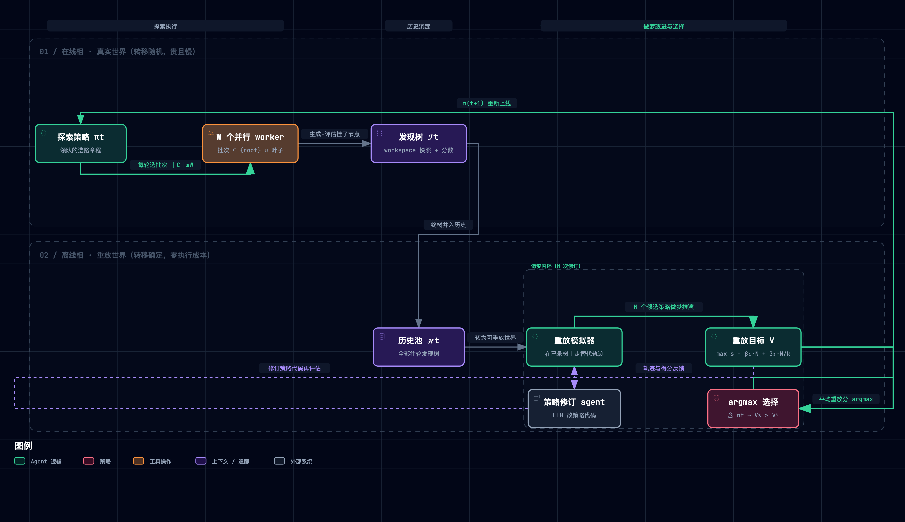
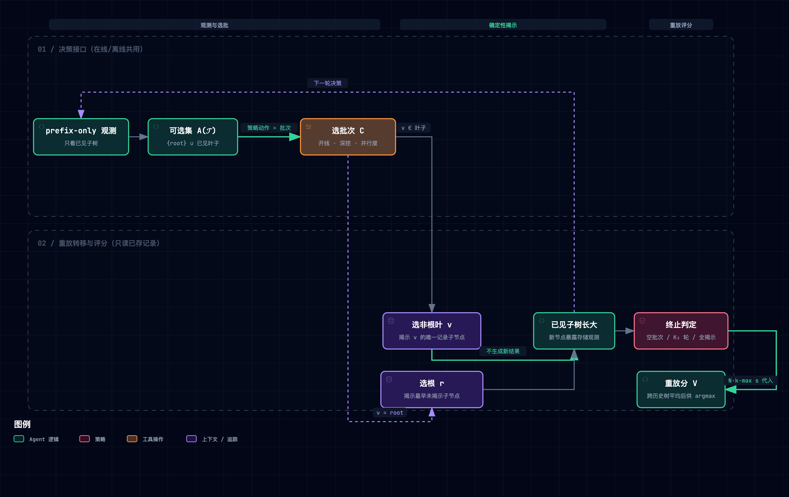

# Dream-RSI 论文精读笔记

> [T. Zheng, X. Wu, Z. Zhang, Z. He, C. Zhang, B. Coleman, et al., "Dream-RSI: Recursive Self-Improvement through Evolving Worlds," arXiv:2609.14858, Sep. 2026.](https://arxiv.org/abs/2609.14858)（University of Maryland / Google DeepMind / University of Virginia；代码 [github.com/zhengkid/Dream-RSI](https://github.com/zhengkid/Dream-RSI)）

**一句话定位**：把 LLM 智能体累积的发现历史（发现树）当作**重放模拟器**——在其中「做梦」（离线确定性重放）即可近零成本地评估和改进**探索策略**，改进后的策略再上线收集新历史，形成元探索层的递归自我改进闭环。

**总类比**：一支寻宝探险队和一张越铺越大的航拍地图沙盘。探险队每趟真实进山（**在线推演**，贵且慢）都留下完整的路线与收获台账（**发现树**）；把历趟台账钉在沙盘上（**历史池 → 重放模拟器**），领队就能对着沙盘兵棋推演「当初若先走 B 山谷、三队并行、到五百米就撤会怎样」（**做梦**）——翻旧账免费，重走一遍烧钱。被评估和改进的从来不是宝物，而是**领队的选路章程**（探索策略，一段可执行代码）；每趟回来由幕僚长照推演结果改章程（**policy-development agent**），候选名单里永远保留现任章程，改不动就不换（**V\*≥V⁰ 防回退下界**），然后带着新章程再进山（**递归闭环**）。

**怎么读这篇笔记**：每个机制按「类比 → 机制 → 原型实景」三拍走。实景全部取自配套最小原型 [`assets/dream_rsi_lab.py`](./assets/dream_rsi_lab.py)（配方工坊玩具域，纯标准库 489 行，已随笔记入库；`--selftest` 秒级，`--break D1..D5` 复现破坏性实验）；所有代码与日志均为实际运行输出。配套产物：[Dream-RSI ↔ negentropy 机制映射报告](./145-dream-rsi-mapping-negentropy.md)。前序同域精读：[142 Procedural Graph](./142-procedural-graphs.md)（对象级知识外置自进化）——Dream-RSI 是它的元级对偶：不改「怎么做」的知识，改「怎么探索」的策略。

---

## 1. 它要解决什么问题：章程写死的探险队

递归自我改进（RSI）系统的进展依赖在高价值解的浩瀚空间里做**长程探索**——动辄数千次「提案-评估」循环。论文 §1 的诊断是一个两难：

- **固定探索策略**：人工设计、全程不变，无法从累积的发现经验里变聪明，反复把算力砸向无效方向（论文该句引 AlphaEvolve / PACEvolve / MLEvolve / DeltaEvolve / SimpleTES 等系统的现状）；
- **在线优化策略**：理论上能自适应，但元级反馈**延迟且昂贵**——评估一个探索策略要看它如何塑造后续数千次生成-评估；且元策略空间巨大，试错多个候选每个都要一趟完整在线推演。

两难背后是一个成本结构事实：**元级评估的最忠实模拟器就是真实环境本身**。论文的破局直觉只有一句话——*a fast and inexpensive simulator of discovery would allow many exploration policies to be evaluated before costly online deployment*，而已完成的发现历史**恰好已经是这样一个模拟器**。由此四条设计规格，全文每个决策都能映射回其中一条：

| 设计规格 | 通俗版 | 对应机制 |
| --- | --- | --- |
| 探索显式化、可编程 | 把「怎么探索」从 agent 脑子里抽成一段代码 | §3 轻量编排层：决策接口 + 策略代码 |
| 历史复用为模拟器 | 旧台账不是用来翻着看的，是用来推演的 | §3 重放模拟器（确定性转移） |
| 离线改进带下界保证 | 改章程免费，但改坏了不许上线 | §3 重放目标 + argmax 含当前策略 |
| 递归闭环 | 每趟回来沙盘更大、章程更好，循环往复 | §3 外层迭代 t |

## 2. 全貌：两相循环与因果脉络


*图源：[.mmd](../../assets/mermaid/self-evolution/dream-rsi--two-phase-loop.mmd) · 交互版 [HTML](../../assets/architecture/self-evolution/dream-rsi--two-phase-loop.html)*

**因果脉络链**（先梳理、后总结的骨架）：

```
观察：RSI 依赖长程探索，数千次提案-评估循环
  ↓ 归因
探索策略固定不自适应 → 算力反复流向无效方向；
在线改策略 → 元级反馈延迟昂贵 × 元空间巨大 = 改不起
  ↓ 设计规格（四要求，全文总纲）
探索显式可编程 × 历史即模拟器 × 离线改进带下界 × 递归闭环
  ↓ 机制
发现树（workspace 快照+分数）→ 共享决策接口（在线/离线同一套）
                     ↕ 两相解耦
        离线做梦（确定性重放 → V 三分量 → LLM 修订 → argmax 含 πt）
  ↓ 证据闭环
广度（8 任务 × 3 域）+ 受控对照（Recursive Fixed Exploration 同预算同初始化）
+ 效率（162×/50×/2.43× 调用节省）+ 行为分析（§5.2 先省后探的自适应）
```

**分层阅读矩阵**：

| 层级 | 部分 | 回答的问题 |
| --- | --- | --- |
| Tier 1 地基（精读） | §3 发现树 / 决策接口 / 在线推演 / 离线重放 / 重放目标 / 改进与选择 | 机制如何运转 |
| Tier 2 证据链（评判真伪） | §4 三域实验 + §5 两个分析 + 附录 B 实现 prompt | 机制是否有效、边界在哪 |
| Tier 3 领域地图 | §6 Related Work（AlphaEvolve 谱系 / 自进化智能体的对象级 vs 元级分野 / 记忆-历史-经验复用三用法） | 这项工作在版图上的位置 |

## 3. 机制一：发现树与共享决策接口

**类比**：台账的记法。每页记一次「从哪个营地出发、带了什么装备、挖到了什么、值多少分」；每页唯一指认它的前一页（**primary parent**），所以整本台账天然长成一棵树，树根是出发前的空营地。

**机制**（§3.1）：发现树根于 r（初始 workspace 状态）。每个非根节点 v 有**唯一** primary parent，标识 v 的尝试从哪开始——discovery agent 恢复父节点的保存 workspace、以其累积观测为上下文产出新尝试；节点 v 保存继承的历史与这次生成-评估的结果（filesystem 快照、产物、评估诊断、分数 s_v，越大越好）。策略在两个世界里共用同一决策接口：

- 可选节点集 **A(𝒯) = {r} ∪ 已见叶子**（叶子由当前观测到的树决定）；
- 动作是批次 **C ⊆ A(𝒯)，|C| ≤ W**（W 为并行 worker 数，如并发 API 调用）——批次同时决定「从哪继续」与「并行排几个」，这是探索策略的全部自由度。

**原型实景**——[`DiscoveryTree`](./assets/dream_rsi_lab.py)（L66）以 `nodes/children` 双字典实现树，`eligible()`（L90）即 A(𝒯)，五个策略类共用 `select_batch(tree, view)` 签名（L200）——「在线/离线同一接口」在原型里就是同一个方法被 `online_rollout`（L130）与 `replay`（L156）调用：

```text
  [online r3] π1-parallel_refine batch={0,2,3} → #4(初始 s=0.50), #5(陷阱方向 s=0.35), #6(稳定突破 s=0.80)
```
（实际运行日志：批次 {root, B 叶, A 叶} 一次排三个 worker，B 分支拿到 0.35、A 分支拿到 0.80。）

## 4. 机制二：重放模拟器——确定性的「做梦」


*图源：[.mmd](../../assets/mermaid/self-evolution/dream-rsi--replay-simulator.mmd) · 交互版 [HTML](../../assets/architecture/self-evolution/dream-rsi--replay-simulator.html)*

**类比**：沙盘兵棋推演。章程说「先去 B 山谷」，推演员只是把台账翻到 B 山谷那页、**抄下当年真实结果**——没有人重新进山，没有方案被重写，没有验收被重跑。同一张沙盘可以让成千上万种新章程各自走出自己的时间线，全部免费。

**机制**（§3.3）：离线阶段历史 ℋt 固定。对每个（策略版本 m, 历史树 i）对：重置到只含根，此后每轮策略选批次，转移**确定性**——

- 选**非根**节点 v → 揭示 v 的**唯一记录子节点**（若存在）；
- 选**根** → 揭示**最早创建的**未揭示根子节点（开一条已录分支）；
- 上限 K₂ 轮；策略选空批次、轮数耗尽或 𝒯i 全部揭示即终止。

关键保真度声明（论文原话：*"a grounded model of the portion of the discovery space that has already been observed"*）：重放**不产生超出 𝒯i 的任何结果**，分支严格按记录的 parent–child 序遍历。这带来一个结构性边界——每个非根节点只有一条记录链，策略无法「想象」同一起点的其他可能结果；在线转移是随机的（同一起点 agent 可产出不同结果），重放把这种随机性冻结成了单次抽样。

**原型实景**——[`replay()`](./assets/dream_rsi_lab.py)（L156）：selftest 断言「同一策略同一树两次重放逐位一致」（L437-440）验证确定性；根与非根的差异化转移即 L162-174 的 if/else。T1 上的重放对比（实际运行输出）：

```text
── 策略重放分对比（T1 上）──
  π1-parallel_refine     V=0.8280
  π*-adaptive            V=0.8520
  π-stop_early           V=0.7600
  π-serial_depth         V=0.7700
```

同一棵 12 节点的树上，四种章程分出高下——这就是「一次在线运行支撑多次零成本元评估」的最小演示。

## 5. 机制三：重放目标 V 与策略改进选择

**类比**：章程的性价比总分。最好收获值多少钱（质量），减去翻页数折算的工钱罚款（成本——推演虽免费，但每页台账在真实世界对应一次计费的「生成+评估」，**假装你花了钱**，才不会选出只在沙盘上好看的章程），加上多队并排开工的效率奖励（并行度——同 样的活，一批干完比串行干完墙钟时间短）。

**机制**（§3.4-3.5）：设 N = 揭示的非根节点数，k = 决策轮数：

$$V_i^m = \underbrace{\max_{v} s_v}_{\text{发现质量}} - \underbrace{\beta_1 N_i^m}_{\text{执行成本}} + \underbrace{\beta_2 \frac{N_i^m}{\max\{1,k_i^{m,\star}\}}}_{\text{并行度奖励}}$$

策略版本 πtm 的评估分 V^m 是全部 t 棵历史树上的平均。**policy-development agent**（LLM）查看各版本的重放轨迹与得分（连同早前修订的反馈）修订可执行策略代码，共 M 版；最终 **πt+1 = argmax_m V^m**。因为候选集包含当前策略 πt，选择满足 **V^m\* ≥ V⁰**——选中策略在固定历史上的平均重放分不低于现任，这是零成本的防回退下界（elitism 的最小形态）。整个闭环里**只有探索策略代码在变**：模型、评估器、执行接口全部冻结。

**实现口径的分裂**（附录 B.2，如实记录）：正文 Eq.1 是单轨迹三项代数和，而 B.2 的评估器实际为 `pareto.reward = pareto.auc − λ·parallel_penalty`（对策略内单一 beta 旋钮做网格扫描、按 pareto.reward = AUC−λ·并行罚 排名、并行罚 = effective_sequential_rounds/total_probes 的均值）。B.2 还揭示了大量工程细节：prefix-only 约束（禁用未揭示分数/真最优/硬编码获胜格子）、动态组合批次（exploit 强方向 + explore 未证方向 + 至多一个 recovery，恰好是原型 `AdaptivePolicy` 的规则来源）、beta 的三重角色（episode 内固定 / 离线扫描 / 下版默认选择）、`plan_grid` 的宽深规划。正文与实现的术语也有漂移（policy-development vs controller-development agent）。

**原型实景**——[`dream_loop()`](./assets/dream_rsi_lab.py)（L301）跑通两轮递归（实际运行日志节选）：

```text
── 外层 t=1：π1 上线探索 ──        # parallel_refine 铺满 3 分支，12 探测，best=0.90
── 离线做梦：在 T1 上重放评估策略版本 ──
  [replay] π1-parallel_refine: N=12 rounds=5 max=0.90 V=0.8280
  [replay] π*-adaptive:        N=8  rounds=5 max=0.90 V=0.8520
── 外层 t=2：胜出策略 π*-adaptive 上线探索 ──
  [online r5] π*-adaptive batch={7,8,0} → #9(后期爆发 s=0.90), #10(快速突破 s=0.92), #11(初始 s=0.52)
t=1 终局 max=0.90 → t=2 终局 max=0.92（探测数 12 → 11）
```

注意 t=2 第 5 轮的批次构成：`{C 分支叶, E 分支叶, root}`——**exploit + explore + 开新根**的动态组合批次，正对应 B.2 的 portfolio 规则；改进后的章程以更少探测拿到更高发现（0.92 > 0.90）。

## 6. 关键实证数字

| 实验 | 关键数字 | 一句话读法 |
| --- | --- | --- |
| Lasso 路径求解器（Gemini-3.1-Pro） | **317** 次 agent 调用 vs 受控基线 550 vs SimpleTES 51,200（≈**162×**）；六留出集平均运行时 **2931.0 ms** vs 3587.1（受控）vs 3804.8（SimpleTES） | 同质量下发现成本砍两个数量级——但 317/51,200 两边口径（agent calls vs generations）论文未做定义级对齐 |
| Lasso 数据集分解 | Gisette 2841.0 / RCV1 14616.0 大胜；但 DNA 49.9、Leukemia 30.2、Colon 16.4、Duke 32.5 **全部劣于 SimpleTES**（15.9/15.5/11.6/18.1） | 平均优势由大矩阵驱动，小生物数据集全败——「Gemini-3.1-Pro 解特别适配大规模矩阵」是论文自己的解释 |
| 数学优化（Table 1） | Sum Diff **1.145427**（最佳）；Circle Packing 2.635983（并列最佳）；Autocorrelation **1.456375 劣于** SimpleTES 1.453675 与受控基线 1.456001（越低越好） | 「matches or surpasses」的主张在 Autocorrelation 上不成立；且与受控基线差距在小数第 4 位量级（0.0004 级）、无方差报告 |
| GPU 内核（KernelBench） | VGG16/LayerNorm 少 **2.43×/1.79×** 代数达同性能；ConvDiv/ConvMax 同预算性能高 **2.09×/1.44×** | 全部结果只有曲线图、无绝对数值——倍率的比较基准点未量化 |
| §5.1 语义引导消融 | 历史摘要成方向性洞见注入 prompt，**两种范式下都劣于无引导版**（等预算，ConvDiv） | 强语义归纳偏置 over-constrain 搜索空间：历史当可交互的重放模拟器 > 当 prompt 引导 |
| §5.2 探索行为演化 | 评估次数 **110→50**（性能上升期省算力）→ 停滞后回升至约 **80-92**/轮（图 6b 逐轮 110,110,87,80,50,92,80,91,86）；性能 0.427→**1.898**（ConvDiv） | 学到的策略真在自适应：先经济后加码，不是摆设 |
| 受控基线设计 | Recursive Fixed Exploration：同 discovery agent/评估器/初始化/预算，唯一差异是策略固定 vs 递归改进；首轮两法同轨 | 干净的因果隔离——收益确实来自「做梦改章程」这一层 |

## 7. 动手实验室：把机制亲手拆坏五次

运行方式（已随笔记入库，纯标准库、确定性、秒级）：

```bash
uv run --no-project python docs/research/self-evolution/assets/dream_rsi_lab.py --selftest
uv run --no-project python docs/research/self-evolution/assets/dream_rsi_lab.py --break D1  # D1..D5
```

机制 → 代码行号速查：

| 机制 | 实现单元 | 行号 |
| --- | --- | --- |
| 发现树（节点/primary parent/创建序） | `Node` / `DiscoveryTree` | [L55](./assets/dream_rsi_lab.py#L55) / [L66](./assets/dream_rsi_lab.py#L66) |
| 共享决策接口 A(𝒯)、批次 | `eligible()` / `select_batch()` | L90 / L200 |
| 在线推演（脚本化随机性） | `World.attempt()` / `online_rollout()` | L113 / L130 |
| 重放确定性转移（非根唯一子/根最早未揭示） | `replay()` | [L156](./assets/dream_rsi_lab.py#L156) |
| 重放目标 V 三分量 | `replay()` 末段 | L182 |
| 策略池（初始/串行/浅尝/全展开/自适应） | 五个 `Policy` 子类 | L204-285 |
| 修订 + argmax 含当前策略 | `develop_versions()` / `select_policy()` | L287 / L292 |
| 两轮递归主循环 | `dream_loop()` | [L301](./assets/dream_rsi_lab.py#L301) |

**破坏性实验三件套实录**（改动 / 实测观察 / 教训，均为真实运行输出）：

| # | 拆掉什么 | 实测退化 | 教训 |
| --- | --- | --- | --- |
| D1 | 候选包含保证（argmax 池排除 π1） | 被迫选中 serial_depth（V=0.7700），π1 的 0.8280 本应兜底——V\*≥V⁰ 失守，下轮上线即退化 | 零成本的防回退保险，elitism 的最小形态 |
| D2 | 并行度奖励 β₂=0 | V(parallel) 0.8280→0.5400，V(serial) 0.7700→0.6500，排名翻转为 serial≥parallel | V 里唯一反映「批次即省墙钟」的项，拔掉后满批策略被系统性低估 |
| D3 | 成本惩罚 β₁=0 | 胜者翻成 reveal_all（N=10）：铺张扩张不再被罚，被误判为优 | 成本惩罚是 V 里唯一约束预算的项，拔掉后目标退化为只看 max 分 |
| D4 | 重放越权（跳读最优记录后代，违反 parent–child 序） | stop_early 评估分 0.7600→**0.8600**，反超真正的最优 adaptive 0.8520——**排名反转** | 重放的价值恰在 grounded：评估必须对「策略真实会花的探测成本」负责 |
| D5 | 语义引导替代重放（历史摘要成「深耕香料最有前途」注入） | 引导版终局 max=0.80（锁死分支 A）；重放改进版 0.92（可达 E 分支） | §5.1 的 over-constrain 实证在玩具域复现：洞见锁方向，重放保多样 |

D4 的初版实现曾把「越权」写成想象分支最高分，实测 V=0.788 **并未**反超 adaptive——纸面预期与实测不符，按实测修正为「跳读最优记录后代」后才真正复现排名反转。这个插曲本身即是教训：**退化实验的断言必须以真跑输出为准**。

## 8. 批判性边界（论文未证明的事）

1. **重放分与在线性能的相关性零消融**。V\*≥V⁰ 只保证固定历史池上的重放分单调，不构成对在线表现的任何保证；重放过拟合（策略学会讨好历史分布）无留出验证、无线上-重放偏差监控。受控基线能证明整体有效，分离不出「重放排序可信度」本身。
2. **做梦自身的成本与超参零报告**。M / K₁ / K₂ / β₁ / β₂ 全文无实验取值（W 有事实值：Pro 每轮 10 并行 × 11 步、Flash 32 × 20）；policy-development agent 的 M 次 LLM 调用与重放计算**不计入** discovery cost（论文口径只数 discovery-agent calls）——总系统成本被系统性低估。
3. **正文与实现的评估口径未统一**。Eq.1（三项代数和）与 B.2（pareto.auc − λ·parallel_penalty + beta 网格扫描）符号、结构、语义三不同；附录 A（任务形式化定义）在 HTML 版为空壳，正文却引用之。
4. **增益不一致且无方差报告**。Autocorrelation 劣于 SimpleTES 与受控基线；Lasso 四个小生物数据集全败；数学任务与受控基线的差距在第 5 位小数级——单次运行、无多种子重复，显著性不可判断；SimpleTES†（dagger）行的含义全文未解释。
5. **重放保真度缺口无定量刻画**。realized-space 偏置（未记录区域零梯度）、根只能按 earliest-created 顺序开枝（策略无法选择开哪条未开分支——该自由度在重放里不可评估，正文未讨论）、单链记录把随机转移冻结成单次抽样——三者都以一句话带过，无实验隔离。

## 9. 双 Agent 费曼考评与推演实录（Feynman Mastery Archive）

**研究范围界定**（Mentor 出题前的定义域解剖）：目标任务 = agent 驱动的科学/算法发现中的**元探索策略改进**；成立工况 = 长程（数千次提案-评估）× 在线评估昂贵 × 探索已显式化为可编程接口 × 递归多轮部署；Out-of-Scope = 对象级能力提升（模型/评估器/agent 本体）、非递归一次性任务、评估近零成本的场景、分布式容错——论文均未触及。

### 9.1 第一轮：三维盲答（Mentor 出题 → Learner 独立作答）

- **Q1 白话机制转述**（向不懂 AI 的餐饮老板讲清全循环）：学徒完整讲出「免费的本质 = 读档案是查账、重跑是重做实验」「评估对象是章程不是菜谱」「翻页假装花钱故选出真上场也划算的章程」，并主动推演出三条失真（单链记录把骰子当必然 / 偏心恋旧章程 / 口径是手调旋钮）。**诊断：轻度边界模糊**——162×/317/550 等数字未交代统计口径即当事实引用（self_doubt 里自己补上了）。
- **Q2 因果与最近邻差异**（vs EvoX 在线元进化 / ReasoningBank 语义记忆）：学徒给出「甲死于成本结构（元级评估成本与视界长度成正比、与对象级争预算）、乙死于开环无定价+摘要压平条件结构、丁=信号真实性与成本结构解耦」的骨架，并点出丁的三条近似缺口与最脆弱点（转移方差与分支间信号差之比）。**诊断：轻度方案混淆**——对 EvoX/ReasoningBank 的机制断言（如「甲需多趟重复压方差」）基于论文一句话引用外推，未读两篇原文。
- **Q3 极限场景退化预测**（历史畸形+目标在外 / 重放过拟合）：学徒的推演超出预期——场景一定性为**本质难题**（「重放的梯度场定义在已实现空间上，逃逸所需信息恰在支撑集外；且改进器会选压制探索的策略让支撑集越收越窄」= 删失样本上的自我实现预言）；场景二定性为**工程问题为主**（「训练集就是测试集」+ winner's curse + Goodhart：V\*≥V⁰ 拦的是方差不是偏差，防回退保证同时是过拟合放大器）。**诊断：轻度因果断裂**——「过拟合策略以 1/(t+1) 权重在新树上暴露」的时间线假设新树必供反例，未推演自确认回路下反例不存在的分支。

### 9.2 针对性补课（三板斧）与同构变式复考

Mentor 对三个薄弱点分别实施「世界观微类比点醒 + 第一性因果溯源 + 破坏性反例」：数字口径纪律（配 D4 实测反例）、证据等级三分法（论文原文明说 / 自家文献可查 / 范式推演，不得混装）、自确认回路的暴露条件双分支推演。随后以**全新场景同构变式**复考：R1 换建筑总包剧场（硬门 = 无口径数字不许入汇报）、R2 换 MCTS/TTS-Discovery 对比集（硬门 = 逐条标注证据等级）、R3 换评估器静默漂移场景（硬门 = 形式上/实质上分别裁决 V\*≥V⁰）。**复考全绿通过**——三份变式作答均落实硬门纪律，因果链完整、边界明确、表达通俗（实录全文见本节交付的考评归档，关键论断已编入 §5-§8 各节）。

### 9.3 归档说明

盲答全文与复考全文（含各 6-7 条诚实 self_doubt）已随工作过程归档；本笔记 §6 的口径警示、§8 的边界清单、§5 的实现口径分裂记录均源自这轮对抗中暴露与修正的内容。

## 10. 用户自测与费曼研讨套件（Self-Assessment Kit）

通览本笔记后，可用这三道题自我考核（无标准答案，欢迎带着作答来对练）：

1. **口径题**：Dream-RSI 宣称的 162× 节省，其分子分母各是什么统计口径？如果 SimpleTES 的一次 generation 内部包含多次模型调用，这个倍数会怎么变？——考核点：§6 第一行的口径纪律。
2. **反事实题**：若把重放目标的并行度奖励从 β₂·N/max(1,k) 改为 β₂·|C|_max（每轮批大小的最大值），学到的策略会有什么系统性变化？哪个真实世界成本被错误定价了？——考核点：V 三分量各自「管什么」的第一性理解（可对照 D2 实测）。
3. **迁移题**：本仓的 patrol Judge 每轮独立重打分、无历史锚点（±振荡）；Dream-RSI 的重放评估是有历史锚点的极端形式。两者的中间形态是什么？给 negentropy 设计一个「用执行历史锚定 Judge 评分」的最小机制，说明它落在 Dream-RSI 保真度光谱的哪一段、牺牲了什么。——考核点：从论文机制到自家系统的映射能力（可对照 [145 映射报告](./145-dream-rsi-mapping-negentropy.md) M2）。

## 11. 与本仓的关联

- [Dream-RSI ↔ negentropy 机制映射报告](./145-dream-rsi-mapping-negentropy.md)：六条机制对照本仓 evolution / routine / eval 体系（含「历史即重放模拟器」对本仓 140 号诊断的 Judge 锚定问题的极强形式回应）。
- 前序：[142 Procedural Graph](./142-procedural-graphs.md) 改的是「怎么做」的对象级知识；Dream-RSI 改的是「怎么探索」的元级策略——两者恰好构成自进化系统的正交两轴。
- 谱系：[130 自进化 Agents Team 调研](./130-self-evolving-agents-team.md)（AlphaEvolve / GEPA 谱系）与 [140 经验时代综述](./140-experience-era-self-improvement.md)（经验基础设施）是本文的直接上游语境。

## 参考

- [1] T. Zheng, X. Wu, Z. Zhang, Z. He, C. Zhang, B. Coleman, R. Wei, D. Bai, H. Liu, R. Liu, X. Wang, Y. Zhuan, W.-C. Kang, R. Xiang, H. Huang, X. Cheng, and Y. Guo, "Dream-RSI: Recursive Self-Improvement through Evolving Worlds," arXiv:2609.14858, Sep. 2026.
- [2] D. Hafner, J. Pasukonis, J. Ba, and T. Lillicrap, "Mastering diverse domains through world models," arXiv:2301.04104, 2023.（World Models / Dreamer 谱系——「在模型里想象轨迹」的理论源头）
- [3] A. Novikov *et al.*, "AlphaEvolve: A coding agent for scientific and algorithmic discovery," arXiv:2506.13131, 2025.（固定探索策略的代表与主基线谱系上游）
- [4] H. Ye *et al.*, "Evaluation-driven scaling for scientific discovery"（SimpleTES）, arXiv:2604.19341, 2026.（主要效率对比基线）
- [5] S. Liu *et al.*, "EvoX: Meta-evolution for automated discovery," arXiv:2602.23413, 2026.（在线元进化的最近邻方案）
