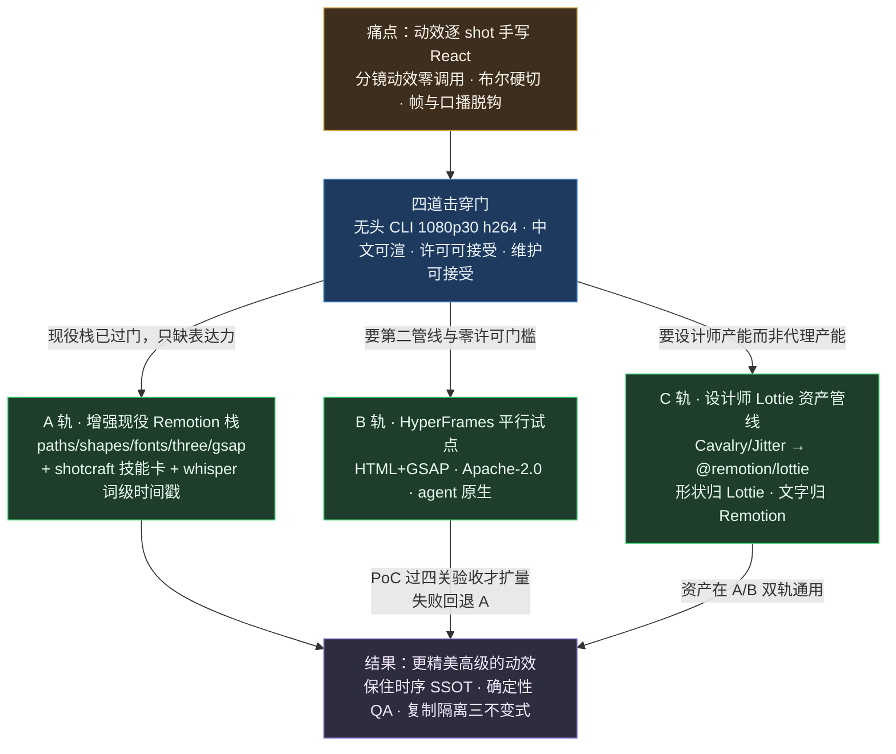
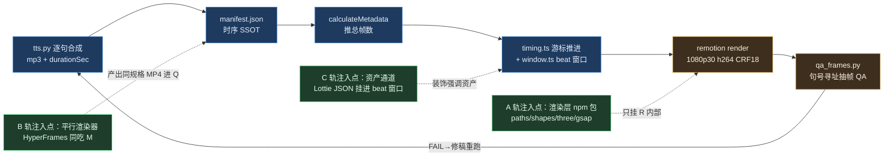
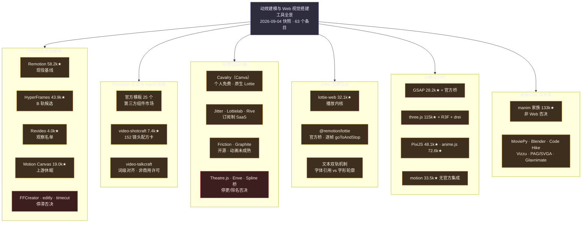
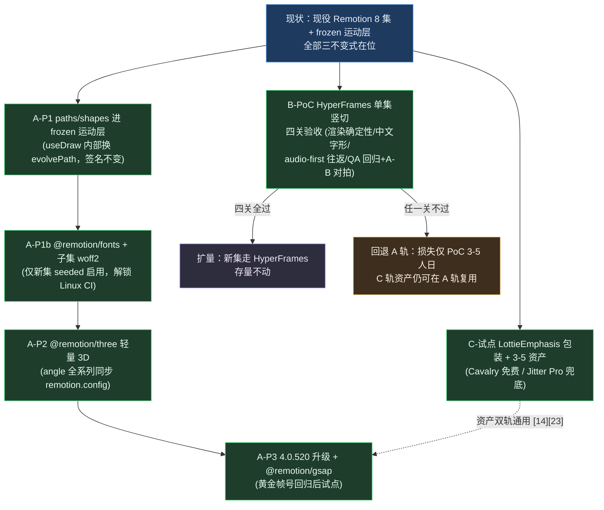

# 视频动效建模与 Web 可视化搭建工具全景调研

> **摘要**：本报告以现役科普视频管线（Python 编排 SSOT + IndexTTS 实测时长 + Remotion 4.0.512 渲染 + frozen 运动层 16 动效模型）为评估基线，对全网与 GitHub 上的「动效建模与 Web 视觉搭建」工具做全景调研：五路类别扫略收录 **54 个候选**，对 4 个短名单候选做源码级深评，全部 87 条事实主张经双反驳者独立核验（绝大多数 confirmed，2 条 corrected）。结论为 **A/B/C 三轨推荐**——A 轨以 `@remotion/paths`/`shapes`/`three`/`gsap`/`fonts` 官方增强簇即刻提升现役栈表达力（8–13 人日分期）；B 轨以 HyperFrames（HeyGen 开源，Apache-2.0，agent 原生，确定性机制与现役铁律逐字同构）做单集平行试点（PoC 3–5 人日四关验收）；C 轨以 Cavalry/Jitter → Lottie → `@remotion/lottie` 打通设计师资产管线（工程侧 1.5–3 人日），且该资产通道经实证在 A/B 双轨通用。Revideo 列为观察名单；Theatre.js、Motion Canvas 上游、manim、Spline 桥等给出带证据的否决清单。
>
> **数据快照声明**：GitHub 星数、推送日期、npm 版本与全部定价均为 **2026-09-04 写入时点**的实测快照（gh api / registry.npmjs.org / 官网定价页即时核验），随时间自然漂移；引用时请注意时点。

---

## 0. 结论先行：三轨推荐，先增强、再平行验证、设计师资产解耦

「更轻松搭建更精美高级的视频动效」在本管线的准确翻译不是换栈，而是**分三类缺口、走三条正交轨道**：

| 轨道 | 回答的缺口 | 推荐方案 | 首步成本 | 判据锚点 |
|:---|:---|:---|:---|:---|
| **A · 增强现役栈** | 16 个动效模型之外的表达力（路径动画、真 3D 镜头、复杂时间线编排、词级对齐）与 Linux CI 解锁 | `@remotion/paths`+`shapes`（零依赖纯函数，4.0.512 直装）→ `@remotion/fonts`+自托管子集 woff2 → `@remotion/three` 轻量 3D → 升级 4.0.520 后 `@remotion/gsap`；配 `@remotion/install-whisper-cpp` 词级时间戳与 [video-shotcraft][44] 技能卡 | 8–13 人日，四期独立止损 | §5.4 |
| **B · 平行试点一集** | 渲染与动效创作范式的整体换代选项；「为 agent 而生」的第二管线 | **HyperFrames**（Apache-2.0 无公司规模门槛；audio-first 时序有原生等价物；确定性机制与现役铁律同构）单集竖切 PoC | PoC 3–5 人日 | §5.1 |
| **C · 设计师资产管线** | 动效创作从代码域移回设计域：GUI 产出高质感装饰强调资产 | Cavalry（个人免费）或 Jitter（Pro $15/席/月）导出 Lottie JSON → `@remotion/lottie` 挂进 beat 窗口；**文字永不进 Lottie** | 工程 1.5–3 + 设计师 2–5 人日 | §5.3 |

三轨**并行不互斥**：A 是现役栈的增量、零范式迁移；B 是可选的第二渲染器（失败即回退 A，损失仅 PoC 成本）；C 的 Lottie 资产经实证在 A 轨（`@remotion/lottie`）与 B 轨（HyperFrames 一方 Lottie 运行时适配器 [14]）**双轨通用**，不被任何一轨锁定。任何轨道都必须保住四道击穿门（§4）与「复制隔离 + frozen 冻结门」不变式（§1）。

**明确不引入**（证据见 §6 否决清单）：`@remotion/spline`（已从 npm 完全除名）、`@remotion/transitions`（重叠缩短时长的模型与现役 audio-first 游标推进正面冲突 [39]）、`remotion-motion-transitions`（npm/GitHub/域名三路核实**不存在**）、Theatre.js（停更约两年 [47]）、Motion Canvas 上游（v3 无 CLI 渲染入口且代码停更 18 个月 [15]）、manim 家族（非 Web 栈，记录性否决）、Spline 整线（官方桥已死 [31]）。

---

## 1. 评估基线：现役 Remotion 流水线的资产、痛点与击穿门

### 1.1 必须被任何候选保住的资产

现役管线（[pipeline README](../../../apps/negentropy-influence/pipeline/README.md)、[skills/06 运动层规格](../../../apps/negentropy-influence/pipeline/skills/06-remotion-implementation.md)）的核心资产不是 Remotion 本身，而是三层契约：

1. **audio-first 时序 SSOT**：`tts.py` 产出逐句 mp3 + `manifest.json`（含 `durationSec` 实测时长）→ `calculateMetadata` 推总帧数 → 运动层 `window.ts` 以「父持绝对时间、子为 beat 窗口」实现 **TTS 重测后全片自动重定时、零手工对轨**。任何需要人工对轨的时间轴都是对该缺陷类的回归。
2. **渲染器无关的 QA 契约**：`qa_frames.py` 对成片 MP4 用 ffmpeg 按句号寻址抽帧（黑帧/重复/字幕安全带/WCAG ≥4.5:1/`--beat-heads` 入场瞬态/`--compare` A-B JND 对拍）。**候选渲染器只要产出同规格 MP4，整套 QA 原样适用**——这放宽了候选池。
3. **复制隔离 + frozen 冻结门**：每集独立 pnpm 工程（`--ignore-workspace`），`skeleton.toml` 五档（frozen/overridable/regioned/structured/seeded）由 `verify_skeleton.py` 按系列 md5 执法；运动层六文件（tokens/window/schedule/hooks/gallery + 单测）跨集字节级一致，「共享怎么动、不共享画什么」。

### 1.2 五条已记录痛点 → 工具能力缺口

| 痛点（README 评审实录） | 对工具的能力缺口 |
|:---|:---|
| 动效逐 shot 手写 React：全 8 集累计约 356 处 `frame-i*N` 错峰散写、82 处描线、71 处计数散写（ISSUE-176） | 需要比手写 hooks 更高层、仍可 git diff 审计、可由代理批量生成与重构的**动效声明层**（时间轴/关键帧/编排原语）；纯可视化产物若不可文本化即违反「渲染确定性 + 代码可审」底线 |
| 「分镜写了动效但代码零调用」（复用组件打不进 svg/`<g>`/absolute 布局） | 需要分镜→实现的**可执行转译链**：承诺即代码（声明式动效从分镜生成）或承诺可机检（`--check-motion` 等价门） |
| 布尔硬切弹跳（EP1 审计约 50 处 `frame >= X ? <el/> : null`） | 时序语汇须内建「一切出现皆有过渡」（时长+缓动标尺、spatial/effects 二分、令牌化时长档） |
| 硬编码帧与口播脱钩（分幕真实时长复检修 9 处、3 处仅在真实时长下暴露） | 必须支持 **audio-first 自动重定时**（外部实测时长驱动全片时间轴、动画时点由句边界推导） |
| 自动判据盲区（`--check` 对朝向/几何锚点/图层遮挡全盲，FAIL 0 不是视觉正确性证据） | 最好提供高保真预览、像素级 diff、入场瞬态自动覆盖，缩小逐帧目视面 |

### 1.3 四道击穿门

对每个候选逐项回答，任一门不过即出局或降级为「记录性否决」：

- **门 a · 离线无头 CLI** 能否产出 1920×1080@30fps h264（yuv420p、CRF18、AAC、enforceAudioTrack 交付硬化）；
- **门 b · 中文文本** 能否高质量渲染并跨机可复现（现役锁 macOS PingFang SC/Songti SC/SF Mono 系统栈，未内嵌 CJK 字体，渲染仅限 macOS）；
- **门 c · 许可** 是否可接受（事实陈述，不做法律结论）；
- **门 d · 维护** 是否活跃可托付（以 push 脉搏与发版节奏为准，星数仅参考）。

---

## 2. 调研方法与信源

- **多代理工作流（4 波 13 代理）**：Wave 1 = 基线审计（把现役管线提炼为约束卡）+ 五路类别扫略（代码优先框架 / 可视化设计器 / Lottie 生态 / 动画运行时 / 讲解 DNA 与模板生态），每路内嵌四道击穿门淘汰；Wave 2 = 短名单四路深评（源码级，行号证据）；Wave 3 = 双反驳者对全部 87 条主张台账独立核验（29 条许可/定价/维护 + 58 条技术，`confirmed/refuted/corrected/unverifiable` 四值判定）；Wave 4 = 完备性批判者查覆盖缺口并补录 9 个遗漏候选。
- **信源纪律**：二手 roundup（wireflow/pkgpulse/rendercomp/lottiefiles 榜单）仅用于**发现**；短名单上每条主张一律一手信源——仓库源码（浅克隆 + 行号）、LICENSE 原文（与 apache.org 权威全文词级 diff）、官方文档原文、官方定价页（Playwright 实渲染读取动态定价）、npm registry JSON。无法一手证实者标「待验证/待 POC」，绝不编造。
- **明确排除**（收录标准声明）：**生成式 AI 视频**（Runway/Sora/Kling 类）——产出不可控、不满足确定性击穿门，与「可版本化动效建模」正交；**云端渲染 API SaaS**（Shotstack/Creatomate/JSON2Video）——本地管线、可控性与长视频成本均不利。两者均不进长表。
- **本地实测**：Revideo 无头渲染在本机完成最小工程冒烟（两次连渲 md5 逐字节一致、ffprobe 规格核验、中文段落视觉核验），HyperFrames 未做本地渲染冒烟（其确定性证据为文档五处原文 + 源码链，渲染冒烟列入 POC 验收第一项）。

---

## 3. 全景长表（54 + 9 补录候选）

### 3.1 代码优先视频框架

| 工具 | 形态 | 维护快照（2026-09-04） | 许可 · 费用 | 击穿门初判 | 管线契合点 |
|:---|:---|:---|:---|:---|:---|
| Remotion [1] | React 组件 + 无头 CLI | 58.2k★ · 推送 09-03 · 4.0.520 | Remotion License：个人与 ≤3 人公司免费商用；4+ 人公司 Creators $25/席/月 或 Automators $0.01/渲染（$100/月起）[2][3] | 全过（现役 8 集实证） | 即基线；官方 Claude Code 插件 + Agent Skills [41] |
| **HyperFrames** [5] | HTML/CSS/JS + GSAP + 无头 CLI | 43.9k★ · 推送 09-04 · v0.8.27（0.x 高速迭代） | **Apache-2.0 全文，无规模/席位/渲染量门槛** [6] | 全过（门 b 字形验收留 POC） | agent 原生第二管线；audio-first 有原生等价物（§5.1） |
| Motion Canvas [15] | TS generator + 编辑器 | 19.0k★ · 代码止于 2025-02-16，npm stable 3.17.2 停在 2024-12 | MIT | **门 a 不过**：v3 无 CLI 渲染入口（编辑器 RENDER 按钮）[22] | generator/beat 范式思想同源；仅作语汇来源 |
| Revideo [16] | TS generator + renderVideo API + React Player | 4.0k★ · 推送 07-15 · 0.11.0 | MIT；默认匿名遥测可关 [79] | 过（本地冒烟实证） | MC 血统补齐无头渲染；CRF 无入口、上游滞后（§5.2） |
| html-video [46] | Agent 元层 + 可插拔引擎 + 21 模板 | 4.5k★ · 推送 06-21 | Apache-2.0 | 过（默认引擎即 HyperFrames） | `render(input, ctx)` 引擎适配契约可借鉴为分镜→多引擎路由 |
| OpenMontage [62] | Agent 技能编排 + 治理切换渲染运行时 | 56.0k★ · 推送 08-22 | **AGPL-3.0 强传染** | 部分过（素材依赖外部 AI 供应商） | 门禁/决策日志/渲染运行时治理思路可借鉴；只可隔离参考 |
| FFCreator [71] | Node 库（node-canvas，无浏览器） | 3.2k★ · **停更 2024-12-19** | MIT | 门 a 过 / 门 d 不过 | 中文生态原生但与现役零复用；停滞否决 |
| editly [70] | 声明式剪辑 CLI/API | 5.5k★ · **停更 2025-05-12** | MIT | 门 a 过 / 门 d 不过 | NLE 剪辑与动效管线互补面窄；停滞否决 |
| timecut [72] | 网页帧捕获器（虚拟时间） | 651★ · **停更 2023-07-18** | BSD-3 | CSS 动画页面不保证正确 | 应急兜底；停滞否决 |
| MotionForge | React + WebCodecs | 80★ · 单人早期 | MIT | 待验证（无成熟 CLI 实证） | 观察即可 |
| Rendervid [93] | JSON 模板渲染引擎 | 63★ | FlowHunt Attribution（强制署名链接） | 门 c 不过（署名不可接受） | 「分镜 JSON→直渲」架构参考 |

### 3.2 Remotion 生态与 Agent 技能

| 条目 | 维护快照 | 许可 | 要点 |
|:---|:---|:---|:---|
| 官方模板库 [60] | 持续更新（25 个：22 免费 + 3 付费） | 模板仓无 LICENSE（脚手架取用）；运行时随 Remotion License | Code Hike 代码讲解、TikTok 字幕、AI 动效 SaaS 起点模板 |
| 第三方组件市场（SwiftClip/RenderComp/Onda 等） | 分化大 | 多 MIT；Remotion Bits 无许可证 | `topic:remotion` 792 仓；「blocks for you and your agents」正中动效词表缺口 |
| **video-shotcraft** [44] | 7.4k★ · 推送 09-01 | **Apache-2.0** | 152 镜头 recipe 卡 + 209 动效预览 Gallery + 生产级 Remotion 模板；直接对症「分镜写了动效但代码零调用」 |
| video-talkcraft [45] | 647★ · 推送 09-04 | **PolyForm Noncommercial（商用需授权）** | 词级配音时间戳（中位 20–40ms/字）+ 防 PPT 七层镜头系统 + 三重 QA 门——方法论与现役时序 SSOT 同构且更细，**仅借鉴不采用** |

### 3.3 可视化设计器

| 工具 | 形态 | 维护与定价（2026-09-04 实测） | 击穿门初判 | 管线契合点 |
|:---|:---|:---|:---|:---|
| **Cavalry**（Canva） [28] | 桌面 · 程序化/数据驱动 | 个人版**全功能免费**（官方 FAQ「非阉割版」）；企业走 Canva Enterprise；`/pricing` 已 404 | 门 a 不过（CLI 已 legacy，仅 GUI 出片） | C 轨主候选：原生 Lottie 导出（文本恒转形状）[27]；Duplicator/数据驱动适合信息图 |
| Jitter [29] | 网页 SaaS + Figma 插件 | Free：720p30 带水印；Pro $15/席/月（年付，月付 $19）；Max $35/$49；Ultra $59/$89 | 门 a 不过（无无头导出 API） | C 轨候选：2024-10 重写 Lottie 导出器宣称与编辑器 1:1 [30]；Figma 往返最顺 |
| Rive | 编辑器 + MIT 运行时 | 编辑器「免费创建、付费交付」：Free 不能导出 `.riv`，Cadet $9/席/月起 [57]；runtime 日更 [58] | 条件过：`@remotion/rive` 官方桥同步时间轴 [56]，但 CJK 编辑器显示问题有社区报告 | 状态机驱动交互动画的补充形态；`enableRiveAssetCdn` 默认 true 须显式关闭 |
| Lottielab [69] | 网页 · Lottie 专用 | Free 带水印；Pro $12/席/月（年付） | 门 a 不过 | Lottie 导出锁 Pro；与 Jitter 定位重叠 |
| Friction [61] | 桌面（Enve 续作） | 1.8k★ · 活跃 · GPL-3.0（内容生产无传染） | 门 a 不过（仅 GUI） | 内置 ffmpeg 出 MP4/ProRes；**Lottie 导出仍在路线图未落地** |
| Graphite [59] | 节点式程序化 2D（Rust/WASM） | 27.1k★ · 日更 · Apache-2.0 · **alpha** | 今天不过：无 MP4/成熟时间线（关键帧 2026 末规划） | 远期关注：Lottie authoring 排期 LTS 里程碑 |
| Theatre.js [47] | 关键帧 Studio + core 库 | 12.6k★ · **停更 2024-08-14**（npm 0.7.2/2024-05） | 门 d 不过 | 「可视化调关键帧→确定性回放」概念最贴合痛点，但休眠不可托付；否决 |
| Enve [86] / Motionity [87] | 桌面 / 网页 | **已归档 2022-09** / **停更 2022-09** | 门 d 不过 | 前者能力由 Friction 继承；否决 |
| Spline + `@remotion/spline` | 3D 设计器 + 官方桥 | 桥**已从 npm 完全除名**（registry 404）[31]，官方教程标注过期 [90] | 桥已死 | 唯一残余路径是 Code 导出 R3F 代码；整线否决 |

### 3.4 Lottie 互换生态

| 条目 | 维护快照 | 击穿门初判 | 关键事实 |
|:---|:---|:---|:---|
| lottie-web [33] | 32.1k★ · MIT · **主线约 12 个月无推送**（功能冻结的稳定标准） | 不独立击穿（纯播放器） | `@remotion/lottie` 的渲染内核 |
| `@remotion/lottie` [23][25] | 随主仓日更（4.0.520） | 随 Remotion 全过 | `autoplay:false` + 每帧 `goToAndStop` 逐帧寻址；仅 svg 支持面；表达式有闪烁风险（官方明示无法上游修复）[23] |
| AE + Bodymovin | 商业软件 + 免费插件 | 门 a/c 不适用直接产线 | Lottie 唯一主流产源；需 Adobe 订阅 |
| 文本双轨机制 [26] | 规范文档活跃（2026-04） | 机制条目 | 字体引用（依赖播放端）vs 字形轮廓（实测 Songti SC/STHeiti 汉字平均 174–182 贝塞尔点 ≈ 13–14KB/字——**中文体积爆炸**）；两大设计器导出器事实上都轮廓化 [27][32] |
| dotLottie [89] | 活跃（MIT） | 不击穿（容器格式） | ZIP 打包分发；进 Remotion 前须解包回 JSON，徒增一层 |

### 3.5 动画运行时（可嵌入视频管线者）

| 运行时 | 维护快照 | 确定性路线 | 嵌入方式 |
|:---|:---|:---|:---|
| **GSAP** [48] | 28.2k★ · 3.15.0（2026-04，维持型） | 官方桥 `@remotion/gsap`：paused 时间线 + 每帧从零前向重放 + 方法级禁令（「The Remotion frame is the only clock」）[36][37] | 需 remotion ≥4.0.517（升级触发器）；Webflow 收购后全插件免费商用、AI 生成代码明确不禁 [40] |
| three.js + R3F + drei [49][50][51] | 115.1k★ / 32.0k★ / 9.8k★ · 全 MIT 日更 | `@remotion/three`：必须全声明式 `useCurrentFrame`、禁 `useFrame`、无头须 `gl:angle` [34][35] | R3F v9 官方配对 React 19；drei 无官方确定性清单（须逐组件 still 对拍） |
| PixiJS [52] | 48.1k★ · v8 日更 | `autoStart:false` + 手动 `render`，由 `useCurrentFrame` 驱动 | 自封装（无官方桥）；v8 文本走 Canvas2D 光栅**直接吃系统 PingFang** |
| anime.js [53] | 72.6k★ · v4 复兴 | `autoplay:false` + `seek(ms)` 薄封装 | 轻量备选（与 GSAP 重叠） |
| motion（原 Framer Motion） [54] | 33.5k★ · 日更 · MIT | **Remotion 官方明确「尚无集成」**：rAF 时间制与帧时钟冲突 [55] | 仅可复用其 spring/插值数学；交互/手势/layout 动画不可用于离线渲染 |

### 3.6 讲解 DSL 与批判者补录

| 条目 | 维护快照 | 判定 | 一句话理由 |
|:---|:---|:---|:---|
| ManimCommunity/manim [73] / 3b1b ManimGL [74] | 40.6k★ / 93.0k★ · 双线活跃 · MIT | 记录性否决 | Python+OpenGL/Pango 栈，无 HTML/CSS 排版；公式/几何镜头可作子渲染器经 ffmpeg 混入，但那是「素材」不是「管线」 |
| MoviePy [65] | 14.9k★ · MIT · 推送 08-26 | 记录性否决 | Python 剪辑/合成事实标准——剪辑合成非动效建模（与 editly/FFCreator 对称收录） |
| Blender [66] | 镜像 20.0k★ · GPL | 待评估 | `blender -b -a` 纯 CLI 可出 1080p h264 + Geometry Nodes 程序化动画——轻量 3D 的另一条重管线航线，与 three/R3F 并列；仅当 3D 权重上调再议 |
| Code Hike [68] | 5.4k★ · MIT · 推送 2026-03 | 待验证 | 代码讲解框架，V2 基于 Remotion 构建——Harness Engineering 类「代码讲解镜头」刚需；V2 成熟度待核 |
| PAG（libpag） [67] / SVGA | 5.8k★ 日更 / 972★ | 记录性否决 | AE 全特性动效格式、特性覆盖超 Lottie，但运行时面向 App 而非视频管线；libpag 许可字段需核读原文 |
| Glaxnimate [91] | 83★（KDE 35★） | 待评估 | **开源 Lottie 生产端**的唯一候选（零订阅成本）；体量小形态独特 |
| OpenToonz / Synfig | 7.7k★ / 2.3k★ | 记录性否决 | 传统逐帧/关键帧动画软件，与代码驱动管线范式不合 |
| Vizzu [92] | 2.0k★ | 记录性否决 | 数据故事动画库——图表动效形态可关注，暂不入轨 |
| `@remotion/install-whisper-cpp` [43] | 官方包 · 文档现行 | **A 轨第一优先补充** | 词级时间戳官方方案——直击「硬编码帧与口播脱钩」痛点的词级对齐增强 |

### 3.7 AI 流水线（素材混剪型，对照参考）

MoneyPrinterTurbo [63]（120.3k★ · MIT）：中文圈最大 AI 短视频流水线，LLM 文案→TTS→素材混剪，动效基因弱；NarratoAI [64]（11.0k★ · MIT）：**与本项目同用 IndexTTS 声音克隆**，其 TTS 接入矩阵与解说编排可互鉴；ShortGPT [88]（7.9k★ · 停更 2025-02）：先行者已停摆。三者均不改变渲染层选型，仅作编排模式参考。

---

## 4. 评估框架：八维加权 + 迁移成本单列

**先过四道击穿门（§1.3）再打分**；门未过者不进入加权矩阵。权重按本管线的真实约束分配：

| # | 维度 | 权重 | 本管线特有含义（0–5 分锚点：5=有原生等价物且实证；3=可等价实现但需自建；1=范式冲突） |
|:---|:---|:---:|:---|
| 1 | 集成与时序 SSOT 契合 | 20% | manifest→总帧数→beat 窗口自动重定时的等价机制是否存在 |
| 2 | 动效表现力上限与默认美学 | 20% | 直击布尔硬切与逐 shot 手写：弹簧/缓动语汇、3D、路径、编排原语、模板审美 |
| 3 | 确定性无头渲染与 QA 钩子 | 15% | 帧级可复现（同输入同字节）、beat-heads/A-B 对拍元数据对等 |
| 4 | 创作生产效率（含 AI 代理友好度） | 15% | 「分镜动效零调用」的转译链；代理生成/重构动效代码的正确率 |
| 5 | 中文排版 | 10% | 字形/换行/加载/子集；Linux 无头可迁移性（现役的 macOS 锁是重启级触发器） |
| 6 | 许可与成本 | 10% | 公司规模门槛、席位、渲染量计费（预算口径：可接受订阅付费） |
| 7 | 维护/社区/模板生态 | 5% | push 脉搏、issue 响应、模板量级 |
| 8 | 跨集参数化复用 | 5% | 「共享怎么动、不共享画什么」不变式在新工具下的存活度 |

**两点框架说明**：① **渲染吞吐未单独设维**——改稿→重渲→QA 循环速度是 8 集量产的真实约束，但它主要由「草渲通道（`--scale 0.5`）+ 渲染器并行度」决定且各候选同数量级，故并入维度 3 的证据描述而不单列权重；② **迁移成本（人日）单列不打分**，且统一拆成「PoC 验证成本」与「全量采用成本」两列——高分工具若迁移代价不可承受同样不应入选，这是独立决策变量而非加权项。

---

## 5. 候选深评（源码级证据 + 最锐问题逐答）

### 5.1 D1 · HyperFrames——最强挑战者 / B 轨候选

**定位**：HeyGen 2026-03 开源的「Write HTML. Render video. Built for agents.」框架 [5]。约半年 43.9k★；GSAP 为官方主推动画运行时 [8]；20 个 agent SKILL（含 faceless-explainer 口播讲解工作流）；catalog 目录 155 blocks + 219 components（`hyperframes add` 即装）；ADOPTERS 含 tldraw/TanStack。

**击穿门核验**（全部一手信源）：

- **门 a（无头 CLI）**：`npx hyperframes render -c comp.html -o out.mp4 --fps 30 --crf 18`；`--resolution landscape` 即 1920×1080；退出码 0/1 契约清晰；`lint --json / compositions / doctor / snapshot / compare` 辅助命令齐备 [9][84]。CRF 默认：standard 档 18（draft 28 / high 15）——与现役 CRF18 恰好同档。
- **门 b（中文）**：排版引擎面强（headless Chrome 完整 CJK 断行/标点压缩 + `fitText` 等价物）；字体路线是弱项——内嵌 42 字体面只有日文 noto-sans-jp 无简体，Noto Sans SC 走编译期 Google Fonts `text=` 子集化（预算 1700 URL 编码字符 ≈190 唯一汉字，超出退 unicode-range 全分片）→ data URI 内嵌 → 渲染期离线 [11]；官方 Docker 镜像钉死 Chromium/字体集/FFmpeg 实现跨机复现 [12]。**字形从 PingFang 切到 Noto 需全量重新审美验收——留 POC 第一关**。
- **门 c（许可）**：LICENSE 为标准 Apache-2.0 全文 190 行（Copyright 2026 HeyGen, Inc.），与 apache.org 权威全文词级 diff 仅 5 处非实质字词差异，**无任何规模/席位/渲染量附加条款** [6]——与 Remotion 的公司规模门槛形成结构性差异 [3]。
- **门 d（维护）**：评估当日仍在推送；v0.8.23→27 三天五连发；风险是 0.x 未到 1.0、API/HTML 契约仍可能漂移（对策：锁死 CLI 版本 + 黄金帧基线）。

**最锐问题逐答**（完整版见主张台账，全部 confirmed）：

1. *外部逐句实测时长如何驱动全片？* 三条互补通道：**通道 A（原生最强）**——composition 里写 duration-less 的 `<audio class="clip">`，编译期对媒体做 ffprobe 实测并回填 `data-duration/data-end`（`htmlCompiler.ts` L523，配套测试用 10s sine wav 钉死行为）[11]——**媒体文件本身即事实源，TTS 重测后重跑 render 全片自动重定时**，比现役 manifest 间接层更直接；**通道 B**——probe 期在浏览器内求值 GSAP 时间线 `duration()` 得 totalFrames（`calculateMetadata` 的渲染期等价物）；**通道 C**——`--variables-file` 注入参数（不绑时长，时序仍走 A/B）。边界：官方 remotion-to-hyperframes 迁移 skill 把 async `calculateMetadata` 列为机械翻译 blocker [75]——这是翻译期限制，平台原生机制覆盖同一需求。
2. *帧捕获会不会漂移？* 机制四层证据：`time = floor(frame)/fps` 整数运算、从不播放 [7]；Chrome `HeadlessExperimental.beginFrame` 原子捕获（`Page.captureScreenshot` 回退）[10]；GSAP 3.x `totalTime` 缓存缺陷的工程级处理（+0.001 双步 nudge 强制 dirty 再精确 seek）；禁令清单「No wall clock. No `Date.now()`, no `requestAnimationFrame`… No unseeded randomness」与现役铁律**逐字同构** [7]。
3. *逐句 mp3 对齐？* 音频混音由 FFmpeg 离线完成，AAC priming delay 以 MP4 edit list 显式处理防 21.33ms 系统性偏移（`audioMixer.ts` 注释原文论证）[85]。
4. *Python 编排接入？* 子进程 + CLI + 退出码即门；成品时长照现役纪律 ffprobe 复算；`qa_frames.py` 对其 MP4 句号寻址抽帧原样适用（QA 与渲染器无关）。
5. *16 运动模型与 md5 冻结门怎么办？* 分层处置：`window/schedule/tokens` 为零依赖纯函数可**直接平移**（文本文件比 React 组件更适合字节级冻结）；16 个 hooks 需按语义重写为 GSAP tween 组合（`useStagger`→stagger、`useDraw`→attr tween 驱 `strokeDasharray`、`useSpring`→物理弹簧/自定义 ease——`wiggleEase/customEase` 基建现成）。时序语汇（DUR 6 档 ±3 帧、spatial/effects 二分）在 GSAP 的 ease/tween 分离下**全部可表达**。

**迁移**：PoC 3–5 人日（模板生成器 1.5 + 中文字体验收 1 + audio-first 往返验证 0.5 + QA 回归与 A/B 对拍 1）；全量另需 2–3 周建冻结门与 catalog 化运动层，存量 8 集不动。风险：0.x 演进、字形切换重验收、渲染路径分支多（drawElement/WebGL/BeginFrame 有自验证回退保障）。

### 5.2 D2 · Motion Canvas + Revideo——观察名单（不推荐即刻投入）

**核心事实**：**Motion Canvas 上游单独不可用**——v3 无 CLI 渲染入口（渲染=编辑器 RENDER 按钮 [22]，npm 无 `@motion-canvas/cli` 发版），且代码提交止于 2025-02-16（其后仅一条 docs 域名修复，npm stable 3.17.2 停在 2024-12-14）——**「停更 18 个月」**。**Revideo 是其 MIT 分叉**（LICENSE 保留 motion-canvas 版权行，合规衍生署名），补齐 `renderVideo()` 无头 API [78]；但团队主力已转闭源 Midrender，官方自述「改动尚未 upstream 到 OSS 仓」[17]——选它等于按「自持 fork」的心理价位定价。

**过门实证（本地冒烟，2026-09-04）**：`renderVideo` 产出 1080p30 h264(Main)/yuv420p/aac 48kHz；同工程两连渲 md5 逐字节一致；中文长段落（PingFang SC）换行/避头尾/混排基线视觉核验无瑕疵——Txt 组件并非裸 `fillText`：隐藏 DOM 做真实 CSS 布局 + `Intl.Segmenter` grapheme 分段换行 + `Range.getBoundingClientRect` 测量 [19]，Revideo 另在 `applyFont/tweenText` 显式 `await document.fonts.ready` 消除 webfont 竞态（MC 3.17.2 无此等待）。

**为什么只进观察名单**：① **CRF/码率零配置入口**（MC+Revideo 全仓 grep 零命中 [80]，wasm 默认导出码率 ~2.75Mbps 低于 CRF18 档）——视觉无损档须自 patch 导出器或二次编码（双代损失）；② 默认导出链依赖 2022-11 起停更的 mp4-wasm [81]；③ 16 运动模型需范式改写（React hooks → generator/tween）且 `Code` 组件有 CJK 文本重叠 open bug（MC #476，2023-03 起 open，上游停更大概率不修）[21]；④ pnpm 12 拦 build scripts、无头仍强制安装 `@revideo/ui`、ffmpeg 二进制须 `chmod +x`（冒烟实测）；⑤ MC 编辑器的 time events 拖拽会写 `.meta` 副文件形成第二事实源（对本管线正确姿势=不写 `waitUntil`；Revideo 已删除该机制，时序只剩 `waitFor`+signals+variables，与 audio-first 契约最合拍 [83][77]）。

**加权 3.85 / 5**；迁移口径：试点竖切 10–15 人日，全量另计每集 2–4 人日 ×7。

### 5.3 D3 · Cavalry / Jitter → Lottie → `@remotion/lottie`——设计师资产管线 / C 轨

**定位**：不换渲染器、不动时序 SSOT，向现役管线注入「设计师制作的装饰强调资产」。动效创作从代码域移回人工设计域——这正是其价值（补设计师产能而非代理产能）。

**机制证据（桥的行为面）**：`@remotion/lottie` 以 `autoplay:false` 加载 lottie-web，每帧 `goToAndStop(getLottieFrame(...))` 逐帧寻址（同帧号恒同画面）；`delayRender` 等待 DOMLoaded 与图片加载 [23][25]。控制面只有三个旋钮：`playbackRate`（正有限数）/`loop`/`direction`；`getLottieMetadata` 从 JSON 的 `w/h/fr/op` 现读时长（fresh-derive，符合「再存即第二事实源」纪律）[24]。官方不支持清单：非 svg 渲染器、`setSubFrame/setLocationHref`、**表达式确定性闪烁（官方明示无法上游修复）**——Cavalry/Jitter 导出器不产表达式，风险集中在 AE/Bodymovin 来源资产，准入规则禁表达式即可。

**关键分工：形状归 Lottie、文字归 Remotion**（事实上的唯一模式）：Lottie 文本双轨——字体引用（无头渲染依赖渲染机字体面或远程 URL）或字形轮廓（实测汉字平均 174–182 贝塞尔点 ≈13–14KB/字，体积爆炸且不可编辑）[26]；而 **Cavalry 官方原文「Text will export as Shapes and not editable Text」[27]、Jitter 原文「texts are now exported as real vector shapes」[32]**——两大导出器都轮廓化，等于「中文文案留在 Remotion（PingFang 路线不变）、Lottie 只承载无文本装饰形状」是格式与工具面的既成事实。设计器侧负面清单：Cavalry 的 Filters/Shaders/锥形渐变/Stroke Dash/Track Mattes 不被 Lottie 支持 [27]。

**时序接缝（必须由薄包装组件封死）**：Lottie 内部时间线固定于 JSON——窗口长于资产**静默冻结末帧**、短于资产硬切。正确定位：默认「固定时长装饰强调」资产（时长远小于 beat 窗口或声明 `loop`）；需占满窗口时按 `meta.durationInFrames / 窗口帧数` 现算 `playbackRate`。TTS 重测后所有 beat 窗口自动平移（父持绝对时间不变式继承），资产内部时间线不变。

**定价（2026-09-04 实测）**：Cavalry 个人版**全功能免费**（Canva 收购后官方 FAQ「非阉割版」，含 Lottie 导出；`/pricing` 已 404，企业走 Canva Enterprise）[28]；Jitter Free 720p30 带水印（Lottie JSON 是否带水印官方未明示→预算按 Pro 兜底），Pro $15/席/月年付 [29]；Figma→Jitter 有官方插件（复制粘贴往返），Cavalry 无 Figma 插件。**资产双轨通用**：HyperFrames 有一方 Lottie 运行时适配器 [14]，C 轨资产不被 A/B 任何一轨锁定。

**迁移**：工程侧 1.5–3 人日（依赖安装 + `LottieEmphasis` 薄包装组件含断言 + 首批资产 QA 走查）+ 设计师侧 2–5 人日；frozen 运动层零改动（本轨是新增消费端）。入库治理：Lottie JSON 入库前统一 pretty-print + sidecar 说明；`structured` 档门 `package.json` 依赖面（引入 `@remotion/lottie + lottie-web` 须整系列同步或 `[[drift]]` 登记）。

### 5.4 D4 · `@remotion` 增强簇——A 轨增强现役栈

全部候选是**渲染层 npm 包，不新增任何时序事实源**：manifest→`calculateMetadata`→游标推进链路原样，TTS 重测后 3D/GSAP 动画随全片自动重定时。逐包结论：

| 包 | 收益（机制证据） | 成本/触发器 | 判定 |
|:---|:---|:---|:---|
| `@remotion/paths` + `@remotion/shapes` [42] | `evolvePath` 等零依赖纯函数（官方自述可脱离 Remotion 使用），是 `useDraw` 手写 `strokeDasharray` 数学的直接升级；进 frozen 运动层**对外签名不变** | 4.0.512 同版本直装、零升级 | **P1 立即引入**（1–2 人日） |
| `@remotion/fonts`（MIT）+ 自托管子集 woff2 | 本地字体 + `delayRender` 等待——**完全离线跨平台正解**，解锁 Linux CI（现役 macOS 字体锁的重启级触发器） | 2–3 人日（子集工具链 + 字幕/排版全量重排，只宜新集 seeded 启用） | **P1b 择机** |
| `@remotion/three` [34][35] | 真 3D 镜头（光影/景深/推拉）；官方文档强制全声明式 `useCurrentFrame`、禁 `useFrame`、无头须 `gl:angle`、Sequence 须 `layout=none`；drei `Html` 官方范式在 3D 场景内嵌 Remotion DOM | `remotion.config.ts` 属 frozen 档——加 `angle` 须 8 集全系列同步；包体显著增重 | **P2 轻量 3D 点缀**（3–5 人日） |
| `@remotion/gsap` [36][37] | 工业级时间线编排（stagger/label/重叠/keyframes 超过现役 schedule 三模式）；构造性确定性：每帧从零前向重放 + 方法级禁令（play/seek/random/ticker 全抛错，「The Remotion frame is the only clock」）；**仅 DOM/SVG 元素目标**（纯对象 tween 在 render 冻结——数值派生仍走 `useCurrentFrame()+interpolate()`） | **仅存 4.0.517–4.0.520 ⇒ 触发 remotion 全家 4.0.512→4.0.520 对齐升级** + structured 指纹变化 | **P3 升级后试点**（2–3 人日） |
| `@remotion/install-whisper-cpp` [43] | 词级时间戳官方方案——直击「硬编码帧与口播脱钩」（词级 karaoke 字幕/对齐校验） | 随用随装 | A 轨第一优先补充 |
| `@remotion/google-fonts` [37][38][82] | Noto Sans SC 经 gstatic 拉取 | 单字重 ≈97 个网络请求、包 51.6MiB、渲染期联网；v5 将强制显式 weights+subsets [94]；**docs 自标 MIT 与包内 Remotion License 不一致（以包内为准）** | **不引入**（离线正解走 `@remotion/fonts`） |
| `@remotion/transitions` [39] | — | TransitionSeries 重叠缩短总时长，与现役游标推进模型（`cursor=Σ(实测时长+gap)`）正面冲突，且 `SceneFade` 已覆盖同需求 | **判不引入**（维持既有决策） |
| `@remotion/spline` [31][90] | — | **已从 npm 完全除名**（registry 404），官方教程标注过期 | **判不引入** |

**许可事实陈述**：Remotion License 免费资格=个人、≤3 人营利组织、非营利、评估期；4+ 人公司触发 Company License（Creators $25/席/月 或 Automators $0.01/渲染 + $100/月最低；Enterprise $500/月起）[2][3]。本管线当前为个人创作者形态，落在 Free License（事实陈述，非法律结论；5.0 将微调条款 [94]）。GSAP 为 GreenSock Standard no-charge：商业免费、AI 生成代码明确不属禁用，禁用仅限与 Webflow 可视化动效构建竞争的用途 [40]。官方 Claude Code 插件 + Agent Skills 是 A 轨代理友好性的一手证据 [41]。

---

## 6. 短名单横向对比

### 6.1 加权矩阵（0–5 分 × §4 权重）

| 维度（权重） | D1 HyperFrames | D2 Revideo(+MC) | D3 Lottie 管线 | D4 增强簇 |
|:---|:---:|:---:|:---:|:---:|
| 集成与时序 SSOT（20%） | **5** | 3.5 | 3.5 | 4 |
| 表现力上限与默认美学（20%） | **4.5** | 4 | 4 | 4 |
| 确定性无头渲染与 QA（15%） | **5** | 4 | **4.5** | 4 |
| 创作生产效率·代理友好（15%） | **5** | 3.5 | 2.5 | 4 |
| 中文排版（10%） | 3.5（字形验收待 POC） | **4**（本地实测干净） | 2（文字归 Remotion 分工规避） | 3 |
| 许可与成本（10%） | **5** | **5** | 4 | 4 |
| 维护/社区/模板（5%） | **4.5** | 2.5（上游滞后） | 4 | **4.5** |
| 跨集参数化复用（5%） | 4 | 4 | 2.5 | 4 |
| **加权总分** | **4.68** | 3.85 | 3.48 | 3.93 |

**分数语义必须成对读**：现役 Remotion 基线未被独立深评（它是锚不是候选），其集成/确定性/中文/复用四维均为实证满分、表现力与效率两维即 §1.2 痛点——**A 轨终态 ≈ 基线全保留 + D4 增量**，D4 行的低分（集成 4/中文 3）衡量的是「新增包各自引入的接缝」而非终态回退。D3 按「完整方案」口径评了个「补充型方案」，其效率/复用低分恰是设计定位使然——它不与 D1/D2 竞争渲染器之位。**因此排序不构成「B 优于 A」的结论**：D1 的 4.68 证明它值得一次 PoC，而 A 轨的边际成本与风险显著更低、且与现役 8 集零冲突。

### 6.2 迁移成本（统一两列口径）

| 候选 | PoC 验证成本 | 全量采用成本 |
|:---|:---|:---|
| D4 增强簇（A 轨） | P1 `paths/shapes` 1–2 人日（其余各期即各自 PoC） | 四期合计 8–13 人日，独立止损 |
| D1 HyperFrames（B 轨） | 3–5 人日（单集竖切四关验收） | 2–3 周基建（冻结门 + catalog 化运动层）+ 新集增量推进；存量 8 集不动、重制另计 |
| D3 Lottie 管线（C 轨） | 工程 1.5–3 + 设计师 2–5 人日 | 资产按需生产；无全量迁移概念 |
| D2 Revideo | 10–15 人日（单集竖切含 QA 回归） | 另计每集 2–4 人日 ×7 + 冻结门移植 2 人日 |

### 6.3 否决清单（排他性审计）

| 被否决项 | 否决原因（一手证据） |
|:---|:---|
| Theatre.js | 停更约两年：仓库最后推送 2024-08-14、npm `@theatre/core` 0.7.2 停在 2024-05-19 [47] |
| Motion Canvas 上游 | v3 无 CLI 渲染入口（编辑器 RENDER 按钮）[22]；代码止于 2025-02-16、npm stable 2024-12 [15] |
| manim 家族 | 非 Web 栈、无 HTML/CSS 排版（Pango/LaTeX 路线）；公式镜头可作素材混入但非管线 [73][74] |
| Spline 整线 | `@remotion/spline` 已从 npm 完全除名（registry 404）[31]，官方教程标注过期 [90] |
| `remotion-motion-transitions` | **不存在**：npm 404 + GitHub 同名搜索 0 结果 + 相关域名 DNS 不解析（三路验证） |
| `@remotion/transitions` | 重叠缩短总时长与 audio-first 游标模型冲突；`SceneFade` 已覆盖需求 [39] |
| `@remotion/google-fonts` | 渲染期 ≈97 网络请求/字重 + 51.6MiB 包体；离线正解是 `@remotion/fonts` [38][82] |
| FFCreator / editly / timecut / Motionity / Enve / ShortGPT | 维护停滞（2024-12 / 2025-05 / 2023-07 / 2022-09 / 归档 2022-09 / 2025-02）[71][70][72][87][86][88] |
| video-talkcraft | PolyForm Noncommercial：商用需作者授权，B 站/YouTube 投放属商用——仅借鉴方法论 [45] |
| OpenMontage | AGPL-3.0 强传染：作为服务对外提供需开源整套——只可隔离参考 [62] |
| Rendervid | FlowHunt Attribution License 强制可见署名链接，客户交付物不可接受 [93] |
| PAG / SVGA / OpenToonz / Synfig / Vizzu | 运行时面向 App / 传统动画范式 / 图表动画边缘——记录性否决 [67][92] |

**一句话用法**：要立刻更精美→A 轨 P1；要零许可门槛的第二管线与 agent 原生工作流→B 轨 PoC；要把部分动效交还给设计师→C 轨试点；Revideo→观察名单等上游化信号。

---

## 7. 集成决策：三轨推进与回退路径

三轨关系的三条硬规则：① **并行不互斥**——A 轨每期独立交付止损，B 轨 PoC 与 A 轨 P1 可同窗口进行；② **B 失败默认回退 A**，不做第三轮渲染器选型（Revideo 的上游化信号未出现前不动）；③ **C 轨资产是轨间公共财产**——Lottie JSON 在 A 轨经 `@remotion/lottie` [23]、在 B 轨经 HyperFrames 一方适配器 [14] 均可消费，设计师产能投入不存在被单轨锁定的风险。

---

## 8. 推荐路线与 POC 验收清单

### 8.1 A 轨（即刻可做，不动范式）

P1 `@remotion/paths + shapes`（1–2 人日）→ P1b `@remotion/fonts + 自托管子集 Noto Sans SC`（2–3 人日，只新集启用）→ P2 `@remotion/three` 轻量 3D 点缀（3–5 人日，`angle` 配置 8 集同步）→ P3 升级 4.0.520 + `@remotion/gsap`（2–3 人日，黄金帧号回归）。另两件零风险补充：`@remotion/install-whisper-cpp` 词级时间戳 [43]；引入 [video-shotcraft][44] 的 152 张镜头配方卡作为代理动效词表（Apache-2.0，可渐进映射到 frozen 运动层 16 模型）。

### 8.2 B 轨 PoC（单集竖切四关，任一关不过即回退）

取 `claude-code-explained-video` 的单幕 3–5 句垂直切片：

1. **渲染确定性关**：同输入两次 `hyperframes render` 产物 md5 逐字节一致；`ffprobe` 断言 `codec=h264 / pix_fmt=yuv420p / 1920x1080 / 30fps / aac`。
2. **中文字形关**：Noto Sans SC 编译期子集内嵌渲染 vs 现役 PingFang SC 成片，做对照排版 diff（字宽/行高/断行/标点）+ 字形评审。
3. **audio-first 往返关**：改一句 TTS 重测 → 仅替换音频文件重渲 → 全片总帧数与 beat 窗口自动位移（等价现役「重测即重定时」），零手工对轨。
4. **QA 回归关**：`qa_frames.py` 对 HyperFrames 成品按句号寻址抽帧原样跑通（黑帧/字幕带/WCAG）；`--compare` 对同 manifest 的 Remotion 版 vs HyperFrames 版做 A/B JND 对拍并归因。

### 8.3 C 轨试点

选 3–5 个现有动效点（`useImpulse/useBreathe` 类强调、`useDraw` 类装饰、转场流动件）由 Cavalry（个人免费优先）或 Jitter 制作导出 Lottie JSON，替换为 `LottieEmphasis` 薄包装放置：读 JSON → `getLottieMetadata` 断言（无 `fonts/chars` 键=零文本、无表达式）→ `playbackRate` 归一 → 套 beatWindow 与字幕安全带几何钳制；逐资产 `remotion still` 目视走查（`--check` 对图层遮挡全盲）。

### 8.4 统一验收判据（三轨通用）

- **门 a**：`ffprobe -v error -show_entries stream=codec_name,pix_fmt,width,height,r_frame_rate,sample_rate` 断言交付规格；
- **门 b**：对照排版 diff（换字体轨）或视觉模型核验（同字体轨）+ 字形评审记录；
- **门 c**：LICENSE 原文核读（对照权威全文 diff），定价页 URL + 核验日期留档；
- **门 d**：`gh api` push 脉搏快照 + npm 发版节奏；
- **回归底线**：`verify_skeleton --strict` 零漂移、`tests/test_timeline.py` 黄金帧号不变、时长一律 `total_duration_in_frames` 复算。

---

## 9. 风险与边界

- **定价与条款时效**：Cavalry/Jitter/Rive/Lottielab/Spline 全部为 2026-09-04 定价页实测快照；免费档限制（水印/分辨率/导出权）是最易过期的事实，采用前重访。Remotion 5.0 将微调许可条款 [94]，升级窗口须复读 LICENSE。
- **单一公司依赖**：HyperFrames 系 HeyGen、Cavalry 系 Canva、Revideo 系 Midrender——开源承诺与商业化边界都可能移动；对策是锁版本 + 黄金帧基线 + 「回退 A 轨」始终在线。
- **待 POC 项（诚实清单）**：Lottie 中文轮廓化体积量级为推断（实测每字 13–14KB 基于 Songti/STHeiti 采样）；HyperFrames 中文字形质量与 `text=` 子集预算在长片（>190 唯一汉字）下的编译时长；`@remotion/three` + drei 组合的确定性无官方背书清单（须逐组件 still 对拍）；Jitter 免费档 Lottie JSON 是否带水印官方未明示。
- **已知债务**：lottie-web 主线停更约 12 个月——格式极稳但播放器修复冻结，表达式闪烁类问题 Remotion 官方明示无法上游修复 [23]；MC `Code` 组件 CJK 重叠 bug 在 Revideo 同源存在 [21]。
- **本报告不构成**：对 Remotion Company License 适用情形的法律判断（仅事实陈述条款原文 [2][3]）；对任何闭源工具服务可用性的承诺。

---

## 参考文献（IEEE）

[1] Remotion GmbH, "Remotion — Make videos programmatically," GitHub repository. [Online]. Available: https://github.com/remotion-dev/remotion (accessed Sep. 4, 2026).

[2] Remotion GmbH, "LICENSE.md (Remotion License)." [Online]. Available: https://github.com/remotion-dev/remotion/blob/main/LICENSE.md (accessed Sep. 4, 2026).

[3] Remotion AG, "Company Licensing." [Online]. Available: https://www.remotion.pro/license (accessed Sep. 4, 2026).

[5] HeyGen, "HyperFrames: Write HTML. Render video. Built for agents," GitHub repository. [Online]. Available: https://github.com/heygen-com/hyperframes (accessed Sep. 4, 2026).

[6] HeyGen, "HyperFrames LICENSE (Apache License 2.0)." [Online]. Available: https://raw.githubusercontent.com/heygen-com/hyperframes/main/LICENSE (accessed Sep. 4, 2026).

[7] HeyGen, "Determinism," HyperFrames Docs. [Online]. Available: https://hyperframes.heygen.com/concepts/determinism (accessed Sep. 4, 2026).

[8] HeyGen, "GSAP animation," HyperFrames Docs. [Online]. Available: https://hyperframes.heygen.com/guides/gsap-animation (accessed Sep. 4, 2026).

[9] HeyGen, "hyperframes CLI," packages/cli README. [Online]. Available: https://github.com/heygen-com/hyperframes/blob/main/packages/cli/README.md (accessed Sep. 4, 2026).

[10] HeyGen, "Frame Capture Service (BeginFrame/seek protocol)," packages/engine/src/services/frameCapture.ts. [Online]. Available: https://github.com/heygen-com/hyperframes/blob/main/packages/engine/src/services/frameCapture.ts (accessed Sep. 4, 2026).

[11] HeyGen, "htmlCompiler (duration-less 媒体实测回填 + resolveCompositionDurations)," packages/producer/src/services/htmlCompiler.ts. [Online]. Available: https://github.com/heygen-com/hyperframes/blob/main/packages/producer/src/services/htmlCompiler.ts (accessed Sep. 4, 2026).

[12] HeyGen, "Dockerfile.test (生产同构渲染镜像，fonts-noto-cjk)." [Online]. Available: https://github.com/heygen-com/hyperframes/blob/main/Dockerfile.test (accessed Sep. 4, 2026).

[14] HeyGen, "Lottie runtime adapter," packages/core/src/runtime/adapters/lottie.ts. [Online]. Available: https://github.com/heygen-com/hyperframes/blob/main/packages/core/src/runtime/adapters/lottie.ts (accessed Sep. 4, 2026).

[15] Motion Canvas, "Visualize Your Ideas With Code," GitHub repository. [Online]. Available: https://github.com/motion-canvas/motion-canvas (accessed Sep. 4, 2026).

[16] Midrender, "Revideo: Create Videos with Code," GitHub repository. [Online]. Available: https://github.com/midrender/revideo (accessed Sep. 4, 2026).

[17] Midrender, "The next chapter of Revideo." [Online]. Available: https://midrender.com/revideo (accessed Sep. 4, 2026).

[19] Motion Canvas, "TxtLeaf (Segmenter grapheme 分段 + Range 测量 + fillText)," packages/2d/src/lib/components/TxtLeaf.ts. [Online]. Available: https://github.com/motion-canvas/motion-canvas/blob/main/packages/2d/src/lib/components/TxtLeaf.ts (accessed Sep. 4, 2026).

[21] Motion Canvas, "Issue #476: Text overlap when using Chinese in codeblock" (open since Mar. 2023). [Online]. Available: https://github.com/motion-canvas/motion-canvas/issues/476 (accessed Sep. 4, 2026).

[22] Motion Canvas, "Rendering (编辑器 RENDER 按钮，无 CLI)," packages/docs rendering docs. [Online]. Available: https://github.com/motion-canvas/motion-canvas/blob/main/packages/docs/docs/getting-started/rendering/index.mdx (accessed Sep. 4, 2026).

[23] Remotion, "@remotion/lottie" (docs). [Online]. Available: https://www.remotion.dev/docs/lottie (accessed Sep. 4, 2026).

[24] Remotion, "<Lottie> (props 表)." [Online]. Available: https://www.remotion.dev/docs/lottie/lottie (accessed Sep. 4, 2026).

[25] Remotion, "packages/lottie" (source). [Online]. Available: https://github.com/remotion-dev/remotion/tree/main/packages/lottie (accessed Sep. 4, 2026).

[26] LottieFiles, "Lottie Docs — Text." [Online]. Available: https://lottiefiles.github.io/lottie-docs/text/ (CC-BY-4.0, accessed Sep. 4, 2026).

[27] Cavalry (Canva), "Lottie Export" (docs). [Online]. Available: https://cavalry.studio/docs/user-interface/menus/window-menu/render-manager/lottie-export/ (accessed Sep. 4, 2026).

[28] Cavalry (Canva), homepage & FAQ. [Online]. Available: https://cavalry.studio (accessed Sep. 4, 2026).

[29] Jitter, "Pricing." [Online]. Available: https://jitter.video/pricing (accessed Sep. 4, 2026).

[30] Jitter, "New Lottie exporter" (changelog, Oct. 30, 2024). [Online]. Available: https://jitter.video/changelog/2024-10-30-new-lottie-exporter/ (accessed Sep. 4, 2026).

[31] npm registry, "@remotion/spline" (已除名，HTTP 404). [Online]. Available: https://registry.npmjs.org/@remotion%2Fspline (accessed Sep. 4, 2026).

[32] Jitter, "Better text support in Lottie" (changelog, May 10, 2022). [Online]. Available: https://jitter.video/changelog/2022-05-10-crisp-texts-in-lottie/ (accessed Sep. 4, 2026).

[33] Airbnb, "lottie-web," GitHub repository (gh api 快照 2026-09-04). [Online]. Available: https://github.com/airbnb/lottie-web (accessed Sep. 4, 2026).

[34] Remotion, "Getting started with @remotion/three." [Online]. Available: https://www.remotion.dev/docs/three (accessed Sep. 4, 2026).

[35] Remotion, "ThreeCanvas — synchronizes with Remotion's useCurrentFrame()." [Online]. Available: https://www.remotion.dev/docs/three-canvas (accessed Sep. 4, 2026).

[36] Remotion, "useGsapTimeline() — seeks a paused GSAP timeline to the current Remotion frame." [Online]. Available: https://www.remotion.dev/docs/gsap/use-gsap-timeline (accessed Sep. 4, 2026).

[37] Remotion, "useGsapTimeline source," packages/gsap/src/use-gsap-timeline.ts. [Online]. Available: https://github.com/remotion-dev/remotion/blob/main/packages/gsap/src/use-gsap-timeline.ts (accessed Sep. 4, 2026).

[38] Remotion, "@remotion/google-fonts." [Online]. Available: https://www.remotion.dev/docs/google-fonts (accessed Sep. 4, 2026).

[39] Remotion, "<TransitionSeries>." [Online]. Available: https://www.remotion.dev/docs/transitions/transitionseries (accessed Sep. 4, 2026).

[40] Webflow/GreenSock, "GSAP Standard 'No Charge' License." [Online]. Available: https://gsap.com/standard-license/ (accessed Sep. 4, 2026).

[41] Remotion, "Claude Code plugin" (AI section). [Online]. Available: https://www.remotion.dev/docs/ai/claude-code-plugin (accessed Sep. 4, 2026).

[42] Remotion, "@remotion/paths — Utility functions for SVG paths." [Online]. Available: https://www.remotion.dev/docs/paths (accessed Sep. 4, 2026).

[43] Remotion, "@remotion/install-whisper-cpp." [Online]. Available: https://www.remotion.dev/docs/install-whisper-cpp (accessed Sep. 4, 2026).

[44] V. Wei, "video-shotcraft: Remotion 影视产品片 agent 技能（152 shot 配方卡 + 209 动效预览）," GitHub repository. [Online]. Available: https://github.com/Vincentwei1021/video-shotcraft (accessed Sep. 4, 2026).

[45] V. Wei, "video-talkcraft: 口播讲解视频 agent 技能（PolyForm Noncommercial）," GitHub repository. [Online]. Available: https://github.com/Vincentwei1021/video-talkcraft (accessed Sep. 4, 2026).

[46] nexu-io, "html-video: Programmatic video for coding agents — HTML to video on your laptop," GitHub repository. [Online]. Available: https://github.com/nexu-io/html-video (accessed Sep. 4, 2026).

[47] Theatre.js, "theatre-js/theatre," GitHub repository (gh api 快照 2026-09-04：pushed 2024-08-14). [Online]. Available: https://github.com/theatre-js/theatre (accessed Sep. 4, 2026).

[48] GreenSock, "GSAP," GitHub repository (gh api 快照 2026-09-04). [Online]. Available: https://github.com/greensock/GSAP (accessed Sep. 4, 2026).

[49] mrdoob, "three.js," GitHub repository. [Online]. Available: https://github.com/mrdoob/three.js (accessed Sep. 4, 2026).

[50] pmndrs, "react-three-fiber — React renderer for three.js," GitHub repository. [Online]. Available: https://github.com/pmndrs/react-three-fiber (accessed Sep. 4, 2026).

[51] pmndrs, "drei — helpful helpers for react-three-fiber," GitHub repository. [Online]. Available: https://github.com/pmndrs/drei (accessed Sep. 4, 2026).

[52] PixiJS, "pixijs v8," GitHub repository. [Online]. Available: https://github.com/pixijs/pixijs (accessed Sep. 4, 2026).

[53] J. Garnier, "anime.js v4," GitHub repository. [Online]. Available: https://github.com/juliangarnier/anime (accessed Sep. 4, 2026).

[54] Motion Division, "motion (原 Framer Motion)," GitHub repository. [Online]. Available: https://github.com/motiondivision/motion (accessed Sep. 4, 2026).

[55] Remotion, "Third-party integrations (Framer Motion 尚无集成的官方说明)." [Online]. Available: https://www.remotion.dev/docs/third-party (accessed Sep. 4, 2026).

[56] Remotion, "@remotion/rive (RemotionRiveCanvas)." [Online]. Available: https://www.remotion.dev/docs/rive (accessed Sep. 4, 2026).

[57] Rive, "Pricing." [Online]. Available: https://rive.app/pricing (accessed Sep. 4, 2026).

[58] Rive, "rive-runtime," GitHub repository. [Online]. Available: https://github.com/rive-app/rive-runtime (accessed Sep. 4, 2026).

[59] GraphiteEditor, "Graphite," GitHub repository. [Online]. Available: https://github.com/GraphiteEditor/Graphite (accessed Sep. 4, 2026).

[60] Remotion, "Templates." [Online]. Available: https://www.remotion.dev/templates (accessed Sep. 4, 2026).

[61] Friction, "friction2d/friction (Enve 续作)," GitHub repository. [Online]. Available: https://github.com/friction2d/friction (accessed Sep. 4, 2026).

[62] Calesthio, "OpenMontage (AGPL-3.0)," GitHub repository. [Online]. Available: https://github.com/calesthio/OpenMontage (accessed Sep. 4, 2026).

[63] harry0703, "MoneyPrinterTurbo," GitHub repository. [Online]. Available: https://github.com/harry0703/MoneyPrinterTurbo (accessed Sep. 4, 2026).

[64] linyqh, "NarratoAI," GitHub repository. [Online]. Available: https://github.com/linyqh/NarratoAI (accessed Sep. 4, 2026).

[65] Zulko, "MoviePy," GitHub repository (gh api 快照 2026-09-04). [Online]. Available: https://github.com/Zulko/moviepy (accessed Sep. 4, 2026).

[66] Blender Foundation, "blender/blender," GitHub mirror. [Online]. Available: https://github.com/blender/blender (accessed Sep. 4, 2026).

[67] Tencent, "libpag," GitHub repository. [Online]. Available: https://github.com/Tencent/libpag (accessed Sep. 4, 2026).

[68] Code Hike, "code-hike/codehike," GitHub repository. [Online]. Available: https://github.com/code-hike/codehike (accessed Sep. 4, 2026).

[69] Lottielab, "Pricing." [Online]. Available: https://www.lottielab.com/pricing (accessed Sep. 4, 2026).

[70] mifi, "editly," GitHub repository. [Online]. Available: https://github.com/mifi/editly (accessed Sep. 4, 2026).

[71] TNFE, "FFCreator," GitHub repository. [Online]. Available: https://github.com/tnfe/FFCreator (accessed Sep. 4, 2026).

[72] tungs, "timecut," GitHub repository. [Online]. Available: https://github.com/tungs/timecut (accessed Sep. 4, 2026).

[73] Manim Community, "ManimCommunity/manim," GitHub repository. [Online]. Available: https://github.com/ManimCommunity/manim (accessed Sep. 4, 2026).

[74] 3Blue1Brown, "3b1b/manim (ManimGL)," GitHub repository. [Online]. Available: https://github.com/3b1b/manim (accessed Sep. 4, 2026).

[75] HeyGen, "remotion-to-hyperframes SKILL," skills/remotion-to-hyperframes/SKILL.md. [Online]. Available: https://github.com/heygen-com/hyperframes/blob/main/skills/remotion-to-hyperframes/SKILL.md (accessed Sep. 4, 2026).

[77] Revideo, "Parameterized Videos," packages/docs guide. [Online]. Available: https://github.com/midrender/revideo/blob/main/packages/docs/src/content/guide/parameterized-video.mdx (accessed Sep. 4, 2026).

[78] Revideo, "renderVideo() API," packages/renderer/server/render-video.ts. [Online]. Available: https://github.com/midrender/revideo/blob/main/packages/renderer/server/render-video.ts (accessed Sep. 4, 2026).

[79] Revideo, "README (Telemetry 节：DISABLE_TELEMETRY=true)." [Online]. Available: https://github.com/midrender/revideo/blob/main/README.md (accessed Sep. 4, 2026).

[80] Revideo, "ffmpeg-exporter-server.ts (yuv420p 固定，无 CRF 入口)." [Online]. Available: https://github.com/midrender/revideo/blob/main/packages/ffmpeg/src/ffmpeg-exporter-server.ts (accessed Sep. 4, 2026).

[81] mattdesl, "mp4-wasm," GitHub repository (最后提交 2022-11-15). [Online]. Available: https://github.com/mattdesl/mp4-wasm (accessed Sep. 4, 2026).

[82] Remotion, "NotoSansSC.ts (882 gstatic 条目，≈97 编号切片/字重)," packages/google-fonts/src/NotoSansSC.ts. [Online]. Available: https://github.com/remotion-dev/remotion/blob/main/packages/google-fonts/src/NotoSansSC.ts (accessed Sep. 4, 2026).

[83] Motion Canvas, "Time Events (.meta 副文件写回)," packages/docs. [Online]. Available: https://github.com/motion-canvas/motion-canvas/blob/main/packages/docs/docs/getting-started/time-events.mdx (accessed Sep. 4, 2026).

[84] HeyGen, "render CLI (--fps/--crf/--resolution/--variables/--batch)," packages/cli/src/commands/render.ts. [Online]. Available: https://github.com/heygen-com/hyperframes/blob/main/packages/cli/src/commands/render.ts (accessed Sep. 4, 2026).

[85] HeyGen, "audioMixer (AAC priming delay 经 edit list 处理)," packages/engine/src/services/audioMixer.ts. [Online]. Available: https://github.com/heygen-com/hyperframes/blob/main/packages/engine/src/services/audioMixer.ts (accessed Sep. 4, 2026).

[86] M. Liebner, "enve (已归档)," GitHub repository. [Online]. Available: https://github.com/MaurycyLiebner/enve (accessed Sep. 4, 2026).

[87] A. Xuu, "motionity (web-based motion graphics editor)," GitHub repository. [Online]. Available: https://github.com/alyssaxuu/motionity (accessed Sep. 4, 2026).

[88] R. Ventura, "ShortGPT," GitHub repository. [Online]. Available: https://github.com/RayVentura/ShortGPT (accessed Sep. 4, 2026).

[89] LottieFiles, "dotlottie-rs," GitHub repository. [Online]. Available: https://github.com/LottieFiles/dotlottie-rs (accessed Sep. 4, 2026).

[90] Remotion, "Spline tutorial (标注过时，改用 r3f 代码导出)." [Online]. Available: https://www.remotion.dev/docs/spline (accessed Sep. 4, 2026).

[91] mbasaglia, "glaxnimate," GitHub repository. [Online]. Available: https://github.com/mbasaglia/glaxnimate (accessed Sep. 4, 2026).

[92] Vizzu HQ, "vizzu-lib," GitHub repository. [Online]. Available: https://github.com/vizzuhq/vizzu-lib (accessed Sep. 4, 2026).

[93] QualityUnit, "rendervid (FlowHunt Attribution License)," GitHub repository. [Online]. Available: https://github.com/QualityUnit/rendervid (accessed Sep. 4, 2026).

[94] Remotion, "Remotion v5.0 Migration." [Online]. Available: https://www.remotion.dev/docs/5-0-migration (accessed Sep. 4, 2026).
