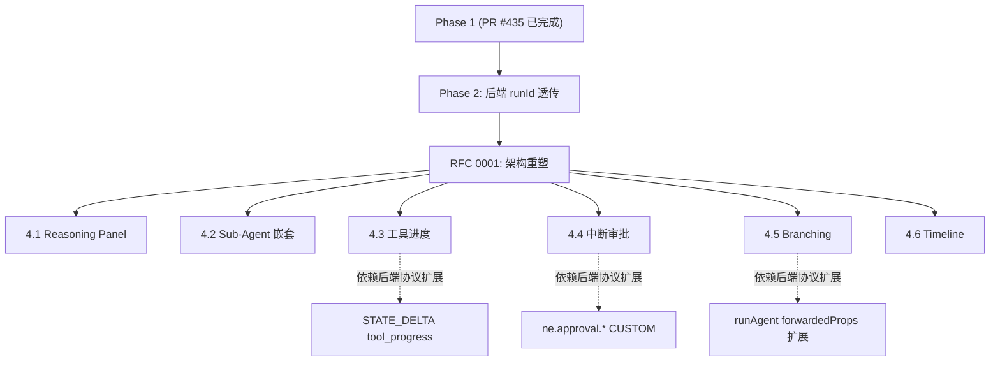

# RFC 0002: Home Chat UI 交互能力增强（Phase 4 backlog）

| 字段 | 值 |
|---|---|
| **状态** | Draft（待评审；依赖 RFC 0001 的 Turn/Item 数据模型落地） |
| **作者** | Aurelius Huang (cm.huang@aftership.com) |
| **创建时间** | 2026-04-29 |
| **关联** | [RFC 0001](./0001-conversation-architecture-refactor.md) |

---

## 1. 背景

完成 Phase 1 ISSUE-041 双气泡 hotfix + Phase 2 协议合规 + Phase 3 架构重塑后，Home 页交互能力可以借鉴 Codex / Claude / ChatGPT 等成熟产品进一步升级。本 RFC 列出 6 个增强子项，按用户优先级分组：

| 优先级 | 子项 | 估算工时 |
|---|---|---|
| 1 | [4.1 Reasoning Panel](#41-reasoning-panel) + [4.2 Sub-Agent 嵌套卡片](#42-sub-agent-嵌套卡片) | 5-7 天 |
| 2 | [4.3 工具进度可视化](#43-工具进度可视化) + [4.4 中断/审批门](#44-中断审批门) | 4-6 天 |
| 3 | [4.5 Conversation Branching](#45-conversation-branching) + [4.6 Timeline Inspector 增强](#46-timeline-inspector-增强) | 4-6 天 |

---

## 4.1 Reasoning Panel

### 现状
- 推理段（`step` / `reasoning` 节点）显示在气泡内，与正文混排，长链路时挤占视觉空间
- 用户对推理过程是否展开缺乏控制

### 目标
- 借鉴 Claude / ChatGPT 的「Thinking...」展开模式：右侧固定 `<ReasoningPanel>` 显示当前 turn 的 step-by-step 思考链
- 气泡内仅显示「思考完成 · X 步」状态徽章，可点击展开 panel
- 历史推理可折叠归档

### 设计
```typescript
// components/ui/ReasoningPanel.tsx
type ReasoningPanelProps = {
  turn: Turn;
  expanded: boolean;
  onToggle: () => void;
};
```

依赖 RFC 0001 的 `Turn.items` 中过滤 `type === "reasoning"` / `"step"`。

### Acceptance Criteria
- [ ] 推理段从气泡内移除，徽章替换
- [ ] 右侧 panel 显示当前 turn 推理；可固定 / 浮动
- [ ] 切换 turn 时 panel 自动跟随
- [ ] panel 展开状态在刷新后保留（localStorage）

---

## 4.2 Sub-Agent 嵌套卡片

### 现状
- `transfer_to_agent` 工具调用只显示「TOOL Transfer To Agent」一行，看不出是哪个 sub-agent、其响应是什么
- 父 agent 与 sub-agent 的对话边界不清晰

### 目标
- 父 agent 触发 transfer 时显示嵌套卡片：父 agent 头像 → transfer 边 → sub-agent 头像
- sub-agent 的回复嵌套在内部"子气泡"中（视觉缩进 + 不同色调）
- 多级 transfer（A → B → C）显示树形

### 设计
```typescript
// types/conversation.ts (依赖 RFC 0001)
SubAgentTransferItem.childTurnId: string;  // 子 agent 的 turn 嵌套引用

// components/ui/SubAgentTransferCard.tsx
type SubAgentTransferCardProps = {
  transferItem: SubAgentTransferItem;
  childTurn?: Turn;
};
```

### Acceptance Criteria
- [ ] transfer_to_agent 显示父→子卡片视觉
- [ ] 子 agent 文本以缩进 + 不同色调嵌套显示
- [ ] 多级 transfer 显示树形（最多 3 层不影响布局）
- [ ] 子 agent 推理段在 ReasoningPanel 中正确归属

---

## 4.3 工具进度可视化

### 现状
- 工具调用显示 `已完成 N 个工具`，无中间进度
- 长耗时工具（如 LLM 调用、网络抓取）用户感觉"卡住"

### 目标
- 工具启动时显示进度条（如果工具支持 streaming progress 事件）
- 工具结果以可折叠 JSON / 富文本展示（默认折叠，点击展开）
- 失败工具显示重试按钮（如果协议支持）

### 设计
- 后端在工具内部通过 `STATE_DELTA` 推送 `{ tool_progress: { tool_call_id, percent, eta } }`
- 前端 `<ToolExecutionGroup>` 监听该 STATE_DELTA 并渲染进度条
- 工具结果 JSON 用 `react-json-view` 类似组件折叠

### Acceptance Criteria
- [ ] 长耗时工具显示进度条 + ETA（如有）
- [ ] 工具结果默认折叠，点击展开 JSON / 富文本
- [ ] 失败工具显示错误详情 + 可选重试
- [ ] 后端协议扩展 STATE_DELTA `tool_progress` 字段

---

## 4.4 中断/审批门

### 现状
- 用户无法中断流式响应（即使已经知道答错方向，只能等完成）
- 工具调用前无审批环节，agent 可能执行用户未明确授权的副作用操作（如发邮件、修改文件）

### 目标
- **Stop 按钮**：流式中显示，点击发送 `RUN_STOP` 信号，后端中断；类似 ChatGPT 的"Stop generating"
- **审批门**：高风险工具（write_file / send_email / db_write 等）调用前弹审批 modal，用户点 Approve 才执行；类似 Codex 的 ApprovalPolicy
- 审批策略可配置：always / never / per-tool / per-agent

### 设计
```typescript
// agent.runAgent 增加 approvalPolicy 参数
// 后端在执行高风险工具前 emit CUSTOM 事件 ne.approval.request
// 前端弹 modal 等待用户响应，发送 ne.approval.response
```

### Acceptance Criteria
- [ ] 流式中显示 Stop 按钮，点击立即中断
- [ ] 高风险工具调用前弹审批 modal
- [ ] 审批策略配置 UI（Settings 中）
- [ ] 后端协议支持 ne.approval.request / response

---

## 4.5 Conversation Branching

### 现状
- 用户对某次回答不满意只能"再问一次"，无法从某 turn 重新生成
- 不同 LLM / reasoning effort 配置无法对比

### 目标
- 每个 turn 提供「Retry with...」菜单：
  - 不同 LLM 模型（gpt-5.4 / claude-opus-4.7 / gemini-2.5）
  - 不同 reasoning effort（low / medium / high）
  - 不同 temperature
- 重生成的 turn 作为 branch 显示，原 turn 保留
- 分支可对比、切换、删除

### 设计
- 数据模型：Turn 增加 `branches?: Turn[]` 字段
- UI：turn 右上角「⋮」菜单 + 分支选择 tabs

### Acceptance Criteria
- [ ] 每个 turn 有 Retry with... 菜单
- [ ] 选择不同配置后重新生成产出 branch turn
- [ ] 分支可切换显示，原 turn 不丢失
- [ ] 分支元数据（用了哪个模型 / effort）可见

---

## 4.6 Timeline Inspector 增强

### 现状
- `EventTimeline` 是纯 debug 视图，仅按时间排列所有事件
- 大量事件（>200）时滚动困难，无法快速定位关键节点

### 目标
- 按事件类型筛选（TEXT_MESSAGE / TOOL_CALL / STEP / RUN / CUSTOM / ERROR）
- 按时间窗收缩（最近 1 分钟 / 最近 5 分钟 / 当前 turn）
- 点击事件跳转到对应气泡（高亮）
- 事件密度热力图（显示哪个时间窗事件最密）

### 设计
- `<EventTimelineFilters>` 组件：复选框 + 时间窗 selector
- 跳转逻辑：事件 onClick → setSelectedNodeId(event.messageId or event.toolCallId)
- 热力图：用 `<canvas>` 或简单 div 矩阵

### Acceptance Criteria
- [ ] 按事件类型筛选
- [ ] 按时间窗收缩
- [ ] 点击事件跳转气泡 + 高亮
- [ ] 事件密度热力图

---

## 5. 实施依赖



---

## 6. 评审要点

请评审者重点关注：
1. **优先级合理性**：是否同意三组优先级排序？是否有更紧急的子项被遗漏（如可访问性 / 国际化）？
2. **后端协议扩展**：4.3 / 4.4 / 4.5 都需要后端配合扩展协议字段，是否有更轻量的实现路径？
3. **A2UI 协议对齐**：4.1 Reasoning Panel 与 A2UI 的 declarative UI 模型是否冲突？是否应该把 ReasoningPanel 实现为 A2UI surface？
4. **AB 测试 / 灰度**：哪些子项需要灰度上线（用 GrowthBook 等）？

---

## 7. 决议（评审后填）

- [ ] 优先级 1 子项（4.1 + 4.2）评审通过 → 开始实施
- [ ] 优先级 2 子项（4.3 + 4.4）评审通过 → 等待优先级 1 完成
- [ ] 优先级 3 子项（4.5 + 4.6）评审通过 → 视用户反馈决定
- [ ] 后端协议扩展评审：
- [ ] AB 测试 / 灰度方案：
