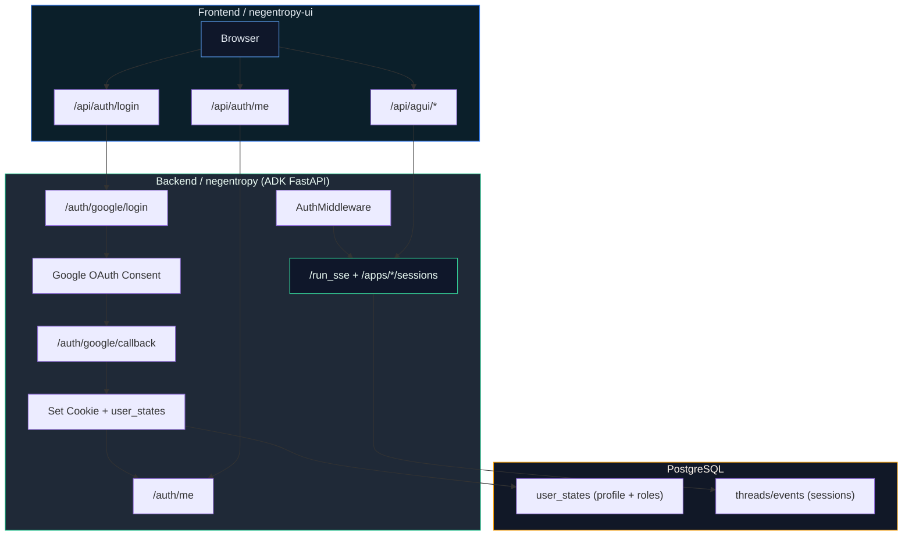

# 单点登录 (SSO) 方案：Google OAuth + 用户权限管理

> 本文遵循 [AGENTS.md](../AGENTS.md) 的协作协议与循证要求。设计核心锚定：
> - 用户状态与权限的权威数据源：`user_states`（参见 [pulse.py](../apps/negentropy/src/negentropy/models/pulse.py)）
> - 会话生命周期与用户 ID 的持久化一致性：`PostgresSessionService`（参见 [session_service.py](../apps/negentropy/src/negentropy/engine/adapters/postgres/session_service.py)）

## 1. 目标与约束

- **目标**：提供可用于前后端集成的 Google OAuth SSO 方案，支持“登录态 + 角色权限”管理。
- **约束**：
  - **Single Source of Truth**：用户身份、角色信息落地在 `user_states`（不复制到其他表）。
  - **最小干预**：不侵入 ADK 核心逻辑，仅在入口层添加 Auth Middleware 与 Auth Router。
  - **一致性**：前端通过 `X-User-ID` 与后端保持会话一致性，避免 Split-Brain。

## 2. 架构总览



## 3. 登录流程与状态机

1. **前端触发登录**：`GET /api/auth/login` → 跳转后端 `/auth/google/login`。
2. **Google OAuth**：用户授权后回调 `/auth/google/callback`（OAuth 2.0 授权码流程）。<sup>[[1]](#ref1)</sup>
3. **后端交换 Token**：后端验证 `id_token`，生成会话 Cookie（OpenID Connect）。<sup>[[2]](#ref2)</sup>
4. **写入 user_states**：以 `user_id` 作为主键落地 `profile + roles`。
5. **前端获取用户态**：`GET /api/auth/me` 获取当前登录态。

## 4. 用户模型与权限

### 4.1 用户状态存储（Single Source of Truth）

- **表**：`negentropy.user_states`
- **结构**：`user_id + app_name` 主键
- **用途**：统一承载用户 `profile`、`roles`、`auth` 元数据

示例结构（`UserState.state`）：

```json
{
  "profile": {
    "email": "alice@example.com",
    "name": "Alice",
    "picture": "https://...",
    "given_name": "Alice",
    "family_name": "Chen",
    "locale": "zh-CN"
  },
  "auth": {
    "provider": "google",
    "subject": "1234567890",
    "email_verified": true,
    "domain": "example.com",
    "last_login_at": 1700000000
  },
  "roles": ["admin"]
}
```

### 4.2 角色与权限策略

- **角色**：
  - `admin`：可管理用户角色
  - `user`：默认角色
- **来源**：
  - `NE_AUTH_ADMIN_EMAILS` 中的邮箱自动获得 `admin`
  - 其他用户为 `user`
- **角色变更**：
  - `/auth/users/{user_id}/roles` 可更新 `user_states.roles`
  - **注意**：角色更新后需重新登录以刷新会话 Token

## 5. 接口清单（Backend）

| 接口 | 方法 | 说明 |
| --- | --- | --- |
| `/auth/google/login` | GET | 发起 Google OAuth 登录 |
| `/auth/google/callback` | GET | OAuth 回调与 Cookie 写入 |
| `/auth/me` | GET | 获取当前登录用户 |
| `/auth/logout` | POST | 清理 Cookie 并返回 `{ status: "ok" }` |
| `/auth/users/{user_id}` | GET | 查询用户状态（Admin） |
| `/auth/users/{user_id}/roles` | PATCH | 更新用户角色（Admin） |

## 5.1 接口事件说明（前后端联动）

SSO 相关接口自身不产生 AG-UI 事件流；事件流仍由 `/run_sse` 与 Session 接口产生。前端处理逻辑如下：

- `/api/agui`：接收 ADK 事件，转换为 AG-UI `EventType`，用于 UI 与日志面板展示。
- `/api/agui/sessions/*`：加载历史事件，转换为消息与状态快照。

映射实现参考：
- `[adk.ts](../apps/negentropy-ui/lib/adk.ts)`（ADK → AG-UI 事件转换）
- `[agui route](../apps/negentropy-ui/app/api/agui/route.ts)`（事件流转发）

## 5.2 JSON Patch（状态 Delta）语义示例

当 ADK 事件中的 `stateDelta` 为对象时，前端会将其转换为 RFC6902 JSON Patch 并输出 `STATE_DELTA` 事件：

输入（ADK `stateDelta`）：

```json
{
  "profile": {
    "timezone": "Asia/Shanghai",
    "language": "zh-CN"
  },
  "flags": {
    "beta": true
  }
}
```

转换后（AG-UI `STATE_DELTA`，`delta` 为 JSON Patch）：

```json
[
  { "op": "replace", "path": "/profile/timezone", "value": "Asia/Shanghai" },
  { "op": "replace", "path": "/profile/language", "value": "zh-CN" },
  { "op": "replace", "path": "/flags/beta", "value": true }
]
```

路径规则遵循 JSON Pointer 转义（`~` → `~0`，`/` → `~1`），以保证嵌套字段在 UI 端可被准确更新。

### 删除语义示例

当上游状态需要删除字段时，Patch 应使用 `remove`：

```json
[
  { "op": "remove", "path": "/flags/beta" },
  { "op": "remove", "path": "/profile/language" }
]
```

### 数组语义示例

数组的追加/替换需使用索引或 `-`：

```json
[
  { "op": "add", "path": "/notifications/-", "value": "new-alert" },
  { "op": "replace", "path": "/notifications/0", "value": "first-alert" }
]
```

## 6. 前端集成（negentropy-ui）

关键对接点：

- **登录入口**：`/api/auth/login`
- **用户态拉取**：`/api/auth/me`
- **请求透传**：
  - `app/api/agui/*`、`app/api/knowledge/*` 自动转发 `Authorization`（来源 Cookie）
  - 业务请求携带 `X-User-ID` 与后端对齐

代码锚点：

- 登录/登出入口：`[auth/login](../apps/negentropy-ui/app/api/auth/login/route.ts)`、`[auth/logout](../apps/negentropy-ui/app/api/auth/logout/route.ts)`
- 用户态获取：`[auth/me](../apps/negentropy-ui/app/api/auth/me/route.ts)`
- UI 集成：`[Home](../apps/negentropy-ui/app/page.tsx)`

## 7. 后端集成（negentropy）

关键对接点：

- **Auth Router**：`[auth/api.py](../apps/negentropy/src/negentropy/auth/api.py)`
- **Auth Middleware**：`[auth/middleware.py](../apps/negentropy/src/negentropy/auth/middleware.py)`
- **Bootstrap 注入**：`[engine/bootstrap.py](../apps/negentropy/src/negentropy/engine/bootstrap.py)`

与会话服务的关联：

- Session 创建/读取依赖 `user_id`，并持久化到 `threads`（参见 [session_service.py](../apps/negentropy/src/negentropy/engine/adapters/postgres/session_service.py)）。
- 用户状态统一落地 `user_states`（参见 [pulse.py](../apps/negentropy/src/negentropy/models/pulse.py)）。

## 8. 环境变量（最小集）

### Backend (negentropy)

```
NE_AUTH_ENABLED=true
NE_AUTH_MODE=optional           # off | optional | strict
NE_AUTH_TOKEN_SECRET=...         # HMAC secret
NE_AUTH_GOOGLE_CLIENT_ID=...
NE_AUTH_GOOGLE_CLIENT_SECRET=...
NE_AUTH_GOOGLE_REDIRECT_URI=https://<host>/auth/google/callback
NE_AUTH_COOKIE_NAME=ne_sso
NE_AUTH_COOKIE_SECURE=true
NE_AUTH_COOKIE_SAME_SITE=lax
NE_AUTH_SESSION_TTL_SECONDS=604800
NE_AUTH_STATE_TTL_SECONDS=600
NE_AUTH_ALLOWED_DOMAINS=example.com
NE_AUTH_ADMIN_EMAILS=admin@example.com
```

### Frontend (negentropy-ui)

```
AUTH_BASE_URL=https://<backend-host>
NEXT_PUBLIC_AGUI_BASE_URL=https://<backend-host>
NEXT_PUBLIC_AGUI_APP_NAME=agents
```

## 9. 安全与运维要点

- **State Token**：用于 OAuth 回调校验，过期时间 `NE_AUTH_STATE_TTL_SECONDS`。
- **Session Token**：HMAC 签名，`NE_AUTH_SESSION_TTL_SECONDS` 控制 TTL。
- **User ID 校验**：`AuthMiddleware` 会校验 `X-User-ID`/`user_id` 与登录用户一致。
- **域名策略**：`NE_AUTH_ALLOWED_DOMAINS` 控制企业域登录（Google Identity 建议实践）。<sup>[[3]](#ref3)</sup>

## 10. 参考文献（IEEE）

描述 OAuth / OpenID Connect 流程时，请引用权威标准：

<a id="ref1"></a>[1] D. Hardt, "The OAuth 2.0 Authorization Framework," *IETF RFC 6749*, Oct. 2012.  
<a id="ref2"></a>[2] N. Sakimura et al., "OpenID Connect Core 1.0," *OpenID Foundation*, Nov. 2014.  
<a id="ref3"></a>[3] Google, "Google Identity Services: OAuth 2.0," *Google Developers*, 2024.
