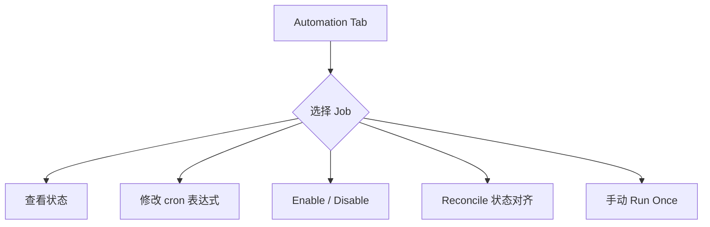

# Memory Automation Guide：自动化与运维

> 运维侧手册。前置阅读 [`memory-basics.md`](./memory-basics.md)。

---

## 1. 自动化任务清单

| 任务 Key | 频率（默认）| 作用 | 实现入口 |
|----|----|----|----|
| `cleanup_low_value_memories` | 每天 03:00 | 清理 `retention_score < 0.05` 且 `access_count = 0` 的记忆 | `apps/negentropy/src/negentropy/engine/adapters/postgres/memory_automation_service.py` |
| `trigger_consolidation` | 每小时 | 巩固未处理 thread | `engine/schedulers/async_scheduler.py` |
| `compute_importance` | 每 6 小时 | 批量更新 `importance_score`（ACT-R）| `memory_automation_service.py` |
| `proactive_recall_warmup` | 每天 04:00 | 主动召回缓存预热 | `proactive_recall_service.py` |

> 这些任务通过 `pg_cron`（推荐）或 `AsyncScheduler` 应用层调度执行；状态可在 UI Automation 页面查看。

---

## 2. UI 配置入口



UI 路径：`/admin/memory?tab=automation`，操作均需 Admin 权限。

---

## 3. 通过 REST API 配置

```bash
# 查看自动化快照
curl -H "Authorization: Bearer $TOKEN" \
  "http://localhost:8000/api/memory/automation?app_name=negentropy"

# 启用某个任务
curl -X POST -H "Authorization: Bearer $TOKEN" \
  "http://localhost:8000/api/memory/automation/jobs/cleanup_low_value_memories/enable?app_name=negentropy"

# 立即运行一次
curl -X POST -H "Authorization: Bearer $TOKEN" \
  "http://localhost:8000/api/memory/automation/jobs/cleanup_low_value_memories/run?app_name=negentropy"

# 调整 cron / 阈值
curl -X POST -H "Authorization: Bearer $TOKEN" \
  -H "Content-Type: application/json" \
  -d '{
    "app_name": "negentropy",
    "config": {
      "cleanup_low_value_memories": {
        "enabled": true,
        "schedule": "0 3 * * *",
        "min_retention_threshold": 0.03,
        "min_age_days": 30
      }
    }
  }' \
  http://localhost:8000/api/memory/automation/config
```

---

## 4. pg_cron 直接接入（高级）

如果环境支持 `pg_cron`，可绕过应用层调度直接在 DB 端注册：

```sql
-- 在 negentropy schema 下查询自动生成的 SQL 函数
SELECT proname FROM pg_proc
WHERE proname LIKE 'memory_automation_%';

-- 例：每天 03:07 跑清理（避开 :00 / :30 拥塞）
SELECT cron.schedule(
  'memory_cleanup_daily',
  '7 3 * * *',
  $$ SELECT negentropy.memory_automation_cleanup_low_value('negentropy', 0.05, 14); $$
);
```

> 与应用层任务**互斥使用**：先在 UI 把对应任务 Disable，再走 pg_cron，避免双跑。

---

## 5. 监控指标（可观测性）

### 5.1 检索效果 Metrics

```bash
curl -H "Authorization: Bearer $TOKEN" \
  "http://localhost:8000/api/memory/retrieval/metrics?user_id=alice&days=30"
# → {total_retrievals, precision_at_k, utilization_rate, noise_rate}
```

- `utilization_rate` < 30% 提示有大量召回未被引用，可能需要调整 `memory_ratio`
- `noise_rate` > 50% 提示触发了显式 `irrelevant` 反馈，需检查 query embedding 质量

### 5.2 自动化日志

```bash
curl -H "Authorization: Bearer $TOKEN" \
  "http://localhost:8000/api/memory/automation/logs?app_name=negentropy&limit=20"
```

### 5.3 评测基线（CI 周报）

每周一凌晨 04:37 自动跑 [`memory-eval` workflow](../../.github/workflows/memory-eval.yml)，产出 markdown 报告作为 artifact 保存 30 天。

---

## 6. Phase 4 — Core Block 维护策略

Core Block 不参与衰减，但仍可被治理：
- **量化控制**：单条 Core Block ≤ 2048 tokens（超限自动截断 + `metadata.truncated=true`）
- **版本审计**：每次 upsert `version+1`，`updated_by` 记录主体（user / agent）
- **GDPR 合规**：用户请求遗忘时 `DELETE /core-blocks` 物理删除（与 `Memory.delete` 决策一致）

---

## 7. 反馈闭环

显式反馈可用于改进检索：
```bash
# 标记某次检索结果有用 / 无关 / 有害
curl -X POST -H "Content-Type: application/json" \
  -H "Authorization: Bearer $TOKEN" \
  -d '{"log_id": "<uuid>", "outcome": "helpful"}' \
  http://localhost:8000/api/memory/retrieval/feedback
```

`outcome` ∈ {`helpful` / `irrelevant` / `harmful`} 写入 `memory_retrieval_logs.outcome_feedback`，由 Rocchio 风格重排<sup>[[27]](#ref27)</sup>下游消费。

---

## 8. 备份与还原

```bash
# 备份 Memory schema 全部数据
pg_dump -h localhost -U postgres negentropy_db \
  -n negentropy --data-only > memory_backup_$(date +%Y%m%d).sql

# 仅备份 Core Blocks（建议每天单独备份）
pg_dump -h localhost -U postgres negentropy_db \
  -t negentropy.memory_core_blocks --data-only > core_blocks_$(date +%Y%m%d).sql
```

> 数据迁移操作严禁直接删除现有数据，参考 [`AGENTS.md`](../../CLAUDE.md) "Database Management" 章节。
