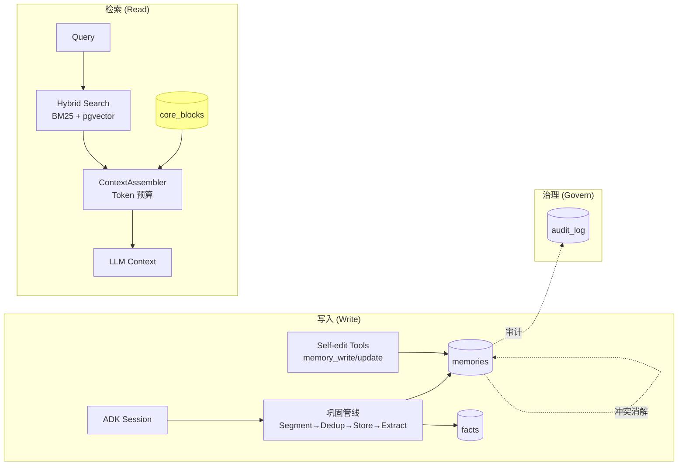

# Memory User-Guide：5 分钟上手

> 本文聚焦"概念入门 + UI 导航"。深入设计原理见 [`memory.md`](../memory.md)；理论支撑见 [`memory-whitepaper.md`](../memory-whitepaper.md)；API 集成见 [`memory-integration.md`](./memory-integration.md)。

---

## 1. 一图认识 Memory 模块

---

## 2. 6 类记忆类型

| 类型 | 衰减率 (λ/天) | 重要性权重 | 何时使用 |
|----|----|----|----|
| `core` | 0.0 | 1.0 | 用户/Agent 主动维护的常驻摘要（Phase 4 新增）|
| `semantic` | 0.005 | 0.95 | 概念性事实（"用户是 Rust 工程师"）|
| `preference` | 0.05 | 0.9 | 偏好（"用户喜欢深色主题"）|
| `procedural` | 0.06 | 0.75 | 流程/技能（"如何部署服务"）|
| `fact` | 0.08 | 0.6 | 通用事实（事件、数据点）|
| `episodic` | 0.10 | 0.4 | 情景对话（默认；快衰减）|

> 衰减率/权重定义见 `apps/negentropy/src/negentropy/engine/governance/memory.py` `_MEMORY_TYPE_DECAY_RATES`。

---

## 3. UI 导航（4 个页面）

| 页面 | 路径 | 核心功能 |
|---|---|---|
| Dashboard | `/admin/memory` | 用户数 / 记忆总数 / 平均 retention / 平均 importance |
| Timeline | `/admin/memory?tab=timeline` | 按时间倒序的卡片，含 retention 红绿灯 + PII 锁标 |
| Facts | `/admin/memory?tab=facts` | 结构化事实表，支持 supersede 链查看 |
| Audit | `/admin/memory?tab=audit` | 审计历史 + retain/delete/anonymize 决策 |
| Automation | `/admin/memory?tab=automation` | pg_cron 任务管理 + Core Block 维护 |

> Dashboard / Timeline / Facts / Audit / Automation 页面源自 `apps/negentropy-ui/`，详细操作步骤见原 `docs/user-guide.md` 第 5 章。

### Retention 红绿灯
- 🟢 ≥ 50%：健康
- 🟠 ≥ 10%：将衰减
- 🔴 < 10%：候选清理（自动化任务会处理）

### PII 锁标
- 🔒 表示 metadata.pii_flags 命中（regex 级，仅提示，不阻断）
- 命中类型：`email` / `phone` / `id_card` / `credit_card`

---

## 4. 常见操作清单

| 任务 | 入口 | 文档 |
|---|---|---|
| 程序化写入记忆 | API `/api/memory/self-edit/write` | [`memory-integration.md`](./memory-integration.md#self-edit-tools) |
| Agent 工具调用 | `memory_search` / `memory_write` 等 5 工具 | [`memory-integration.md`](./memory-integration.md#agent-tools) |
| 配置定时清理 | UI Automation tab | [`memory-automation.md`](./memory-automation.md) |
| 维护 Core Block | API `/api/memory/core-blocks` 或 Agent 工具 | [`memory-integration.md`](./memory-integration.md#core-block) |
| 查询低 retention 原因 | UI Timeline → 卡片详情 | [`memory-troubleshooting.md`](./memory-troubleshooting.md) |
| 跑评测基线 | `pytest -m eval` | [`memory-integration.md`](./memory-integration.md#eval) |

---

## 5. 下一步

- 工程师 → [`memory-integration.md`](./memory-integration.md)
- 运维 → [`memory-automation.md`](./memory-automation.md)
- 故障排除 → [`memory-troubleshooting.md`](./memory-troubleshooting.md)
- 架构师 → [`memory.md`](../memory.md) + [`memory-whitepaper.md`](../memory-whitepaper.md)
