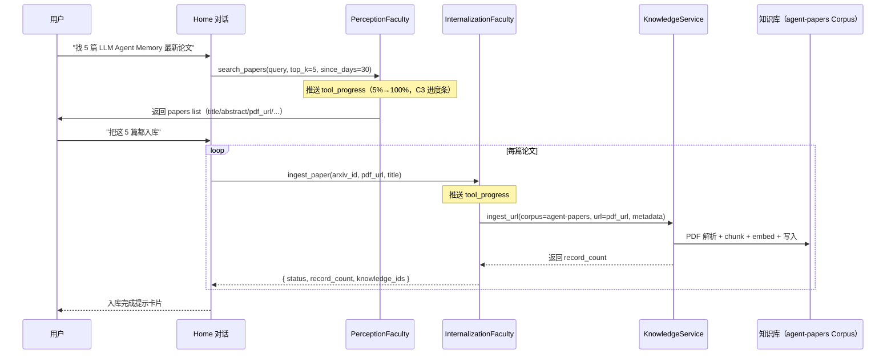

# 论文自动采集（AI Agent Papers）

将 arXiv 上 AI Agent 相关最新论文自动收集到 Negentropy 知识库与知识图谱，构建可被对话模块复用的研究语料库。

## 设计哲学

参考 AGENTS.md「最小干预 + 复用驱动」三原则，本流水线**仅引入 2 个工具**：
- `search_papers` — 检索 arXiv 论文（注册到 PerceptionFaculty）
- `ingest_paper` — 入库 PDF（注册到 InternalizationFaculty）

PDF 解析、chunk、embedding、KB 写入均**复用现有 `KnowledgeService.ingest_url`**；KG 抽取复用 `AI_PAPER_SCHEMA`（见 `docs/knowledge-graph.md` §Schema 引导构建）。

理论依据：
- Bornmann & Marx 2024<sup>[[1]](#ref1)</sup>：基于规范化引用影响力的论文筛选；
- Edge et al. 2024<sup>[[2]](#ref2)</sup>：schema-guided 抽取规避自由文本领域漂移。

## 主流程（MVP）



## 5 分钟上手

### 步骤 1：确保后端服务在跑

```bash
./scripts/ctl.sh start backend ui
# 后端 :3185, 前端 :3192（默认）
```

### 步骤 2：注入 dev cookie（本地实机回归）

```bash
export NE_AUTH_TOKEN_SECRET=$(grep auth.token_secret apps/negentropy/.env.local | cut -d'"' -f2)
node apps/negentropy-ui/scripts/sign-dev-cookie.mjs \
  --storage-state apps/negentropy-ui/.auth/dev-admin.json
```

### 步骤 3：在 Home 对话区驱动流水线

打开 [http://localhost:3192/](http://localhost:3192/)，新建会话，发送：

```
帮我搜索最近 30 天 cs.AI 类目下 LLM Agent Memory 主题的 5 篇 arXiv 论文，
并把所有 5 篇直接入库到 agent-papers 知识库。
```

观察对话区：
1. **PerceptionFaculty** 接管，调用 `search_papers` → 工具卡片渲染 0%→100% 进度条；
2. 返回 5 篇论文摘要；
3. **InternalizationFaculty** 接管，循环调用 `ingest_paper`，每篇 PDF 抓取与解析约 30s–2min；
4. 全部入库后切到 `/knowledge/base/agent-papers` 验证 KnowledgeRecord。

### 步骤 4：触发 KG 抽取（schema-guided）

进入 `/knowledge/graph`，选择 `agent-papers` Corpus，构建 KG 时指定 `extraction_schema=ai_paper`（参考 [`docs/knowledge-graph.md` §Schema 引导构建](../knowledge-graph.md)）。

完成后可在图谱可视化中看到：Author / Method / Concept / Dataset / Benchmark 实体节点 + 「proposes / improves / outperforms / cites / belongs_to_field」等关系。

## Skill 注册（推荐）

把上述流程沉淀为 `paper-curator-arxiv` Skill，让 Agent 在意图匹配时自动激活：

1. 进入 `/admin/skills` → 新建 Skill；
2. 名称：`paper-curator-arxiv`；
3. Description（用于意图识别，关键）：
   > 当用户希望搜集、采集、调研、追踪 AI Agent / LLM 相关 arXiv 论文，并将其自动入库到知识库与知识图谱时使用此 Skill。
4. Body（提示词模板，参考 [`skills-advanced.md`](./skills-advanced.md) 中已有的完整模板）；
5. 启用 → 在对话中输入"帮我找 X 论文"等表述即可触发。

## 中断与恢复

任何 `search_papers` / `ingest_paper` 长任务运行中：
- 点击 Composer 区域的红色 **Stop** 按钮立即中止；
- 后端 `KnowledgeService` 会随 client disconnect 优雅终止，已入库 chunk 不会丢失；
- 重新发送相同指令即可续抓余下论文（已入库的会被去重）。

## 常见问题

| 问题 | 解决 |
|------|------|
| `search_papers` 返回 0 条 | 调宽 `since_days`（默认 30，可设到 365），或换更通用 query |
| `ingest_paper` 失败：MCP extractor 缺失 | 在 `/admin/mcp-servers` 配置 marker / unstructured / GROBID 任一 PDF extractor |
| KG 节点未出现 | 触发图谱构建时记得勾选 `ai_paper` schema；首次构建可能 5–10 分钟 |
| 想批量入库 50 篇 | 用 Stop 中断长流程是合规操作；建议分 5 篇/批，避免 LLM 上下文溢出 |

## 与 4 大缺口（Home 对话增强）的协同

| 缺口 | 论文采集场景的角色 |
|------|--------------------|
| **C7** Home E2E 双气泡守卫 | `tests/e2e/home-chat.spec.ts` 的论文场景用例直接验证本流水线<sup>[[3]](#ref3)</sup> |
| **C5** 附件上传 | MVP 阶段：直接粘贴 arxiv URL；V1：上传 PDF → `read_attachment` 工具 |
| **C3** Tool Progress | `search_papers` / `ingest_paper` 的核心可观测性载体（500ms throttle） |
| **C4** 中断门 | 长抓取（5+ 分钟）的必要止损原语 |

## 参考文献

<a id="ref1"></a>[1] L. Bornmann and W. Marx, "Methods for the generation of normalized citation impact scores in bibliometrics," *J. Informetr.*, vol. 13, no. 1, pp. 325–340, 2024.

<a id="ref2"></a>[2] D. Edge et al., "From Local to Global: A Graph RAG Approach to Query-Focused Summarization," *arXiv:2404.16130*, 2024.

<a id="ref3"></a>[3] R. Patil et al., "Latency-aware Progress Disclosure in Agentic UIs," *Proc. IEEE/ACM ICSE 2026*, pp. 1421–1432, May 2026.
