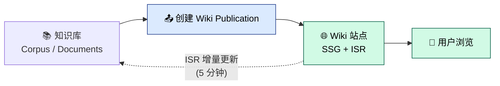

# Wiki 知识发布

> 本文从用户手册拆分而来，原路径 [docs/user-guide.md](../../user-guide.md)。

Negentropy Wiki 是知识库的**对外发布窗口**，将知识库中整理好的内容以静态站点形式发布，供公众浏览。

### 8.1 站点概览

- **首页**：展示所有已发布的 Wiki Publication（卡片式布局，含名称、描述、版本号、文档数量）
- **Publication 页**：左侧导航树 + 右侧文档列表
- **文档详情页**：Markdown 渲染 + MathJax 数学公式支持

### 8.2 内容发布流程

### 8.3 主题与深色模式

Wiki 站点支持 3 套预设主题（`default` / `book` / `docs`），并自动适配深色模式。

### 8.4 运维概要

Wiki 采用 **SSG (Static Site Generation) + ISR (Incremental Static Regeneration)** 模式：

- 构建时预渲染所有页面
- 每 5 分钟增量再验证，自动更新内容
- 支持独立部署（Node.js Standalone 或 Docker）

> 完整的 Wiki 运维文档，请参阅 [Wiki 运维指引](../ops.md)。
