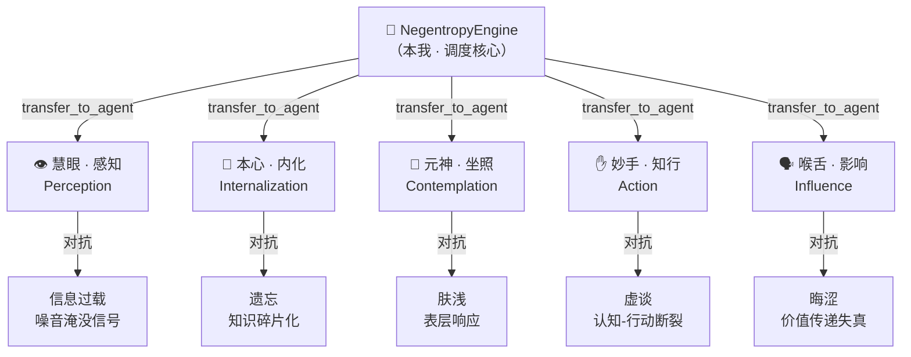
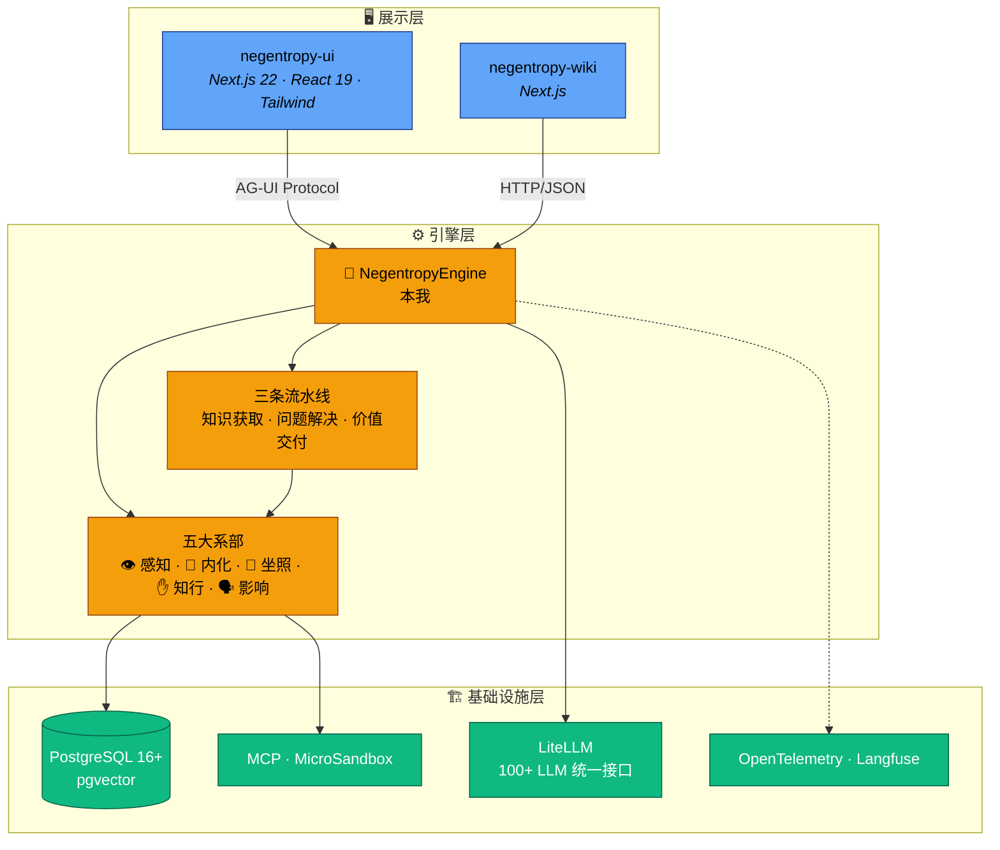

[English](../../README.md) | [简体中文](./README.md)

<h1 align="center">🔮 Negentropy (熵减引擎)</h1>

<p align="center">
  <strong>一个「一核五翼」架构的智能体系统，致力于对抗知识的无序趋势（熵增），实现持续自我进化的认知体系。</strong>
</p>

<div align="center">

[](https://www.python.org/)
[](../../LICENSE)
[](https://docs.astral.sh/uv/)
[](https://google.github.io/adk-docs/)
[](https://nextjs.org/)

</div>

<p align="center">
  <b>🔮 本我 · 调度核心 | 不参与原子任务执行，依据<strong>正交分解</strong> 原则，将意图精准委派给最合适的系部。</b> <br/> <b>👁️ 慧眼 · 感知</b> | <b>💎 本心 · 内化</b> | <b>🧠 元神 · 坐照</b> | <b>✋ 妙手 · 知行</b> | <b>🗣️ 喉舌：影响</b>
  <br/>
</p>

---

<p align="center">
<b><small><small><strong>免责声明</strong> · 本项目提供的所有工具与方法论仅供参考。用户在使用过程中产生的任何结果，项目组不承担直接或间接责任。这里的「修行」指代系统的自我演化与优化过程，不涉及任何宗教含义。</small></small></b>
</p>

---

## 🤔 为什么需要熵减引擎？

你或许已经用过了不少智能体系统，但大概率踩过这些坑：

- 🌀 **信息过载** —— Agent 获取了海量信息，但信号和噪音齐飞，你只得到一堆「有用的废话」
- 🕳️ **金鱼记忆** —— 上一轮对话的结论，下一轮就被忘得一干二净，仿佛每次都在重启人生
- 🏄 **浅尝辄止** —— Agent 只会表面回答，从不会深挖二阶问题——「为什么」永远没人替你问
- 💬 **纸上谈兵** —— 分析得头头是道，真正需要执行代码、操作文件时就开始「建议您手动操作」
- 🌫️ **晦涩难懂** —— 明明是专业的洞察，输出却像天书，价值传递的损耗率直逼 80%

**Negentropy 的回答**：逐一对抗这些熵增形态。不在于造一个 Agent，而是构建一个**持续自我进化的认知系统**。



---

## ✨ 核心特性

- 🏗️ **「一核五翼」智能体编排** —— 一个编排者 + 五个正交系部的分工协作架构。根智能体负责调度决策，五大系部分别对抗信息过载、遗忘、肤浅、虚谈和晦涩

- 🔄 **三条标准流水线** —— 预封装的知识获取、问题解决、价值交付流水线，告别手动编排多步骤任务的繁琐，开箱即用

- 🧠 **动态记忆系统** —— 基于艾宾浩斯遗忘曲线的记忆衰减机制，结构化事实存储，记忆审计与治理，让 Agent 真正「记住」而不是「复读」

- 📚 **知识管理引擎** —— 文档摄入、语义分块、向量检索、知识图谱、语义搜索，一套完整的知识生命周期管理

- 🐱 **沙箱代码执行** —— MCP 协议 + MicroSandbox 双通道隔离执行，安全地让 Agent 真正「动手」而不是只动嘴

- 🔧 **可插拔后端** —— Session / Memory / Artifact / Credential 全部支持 inmemory / PostgreSQL / VertexAI / GCS 切换，开发用 inmemory，生产上 postgres，平滑迁移零代码修改

- 📡 **全链路可观测** —— structlog 结构化日志 + OpenTelemetry 分布式追踪 + Langfuse Trace 分析，Agent 的每一次「思考」都有据可查

---

## ✨ 快速上手

### 前置要求

<center>

| 依赖                             | 最低版本          | 用途          |
| :------------------------------- | :---------------- | :------------ |
| Python                           | 3.13+             | 后端运行时    |
| [uv](https://docs.astral.sh/uv/) | 最新              | Python 包管理 |
| Node.js                          | 22+               | 前端运行时    |
| [pnpm](https://pnpm.io/)         | 最新              | 前端包管理    |
| PostgreSQL                       | 16+ (含 pgvector) | 数据持久化    |

</center>

### 1. 克隆项目

```bash
git clone https://github.com/ThreeFish-AI/negentropy.git
cd negentropy
```

### 2. 启动后端

```bash
cd apps/negentropy
uv sync --dev                  # 安装全部依赖（含开发依赖）
uv run negentropy init         # 生成 ~/.negentropy/config.yaml
# 密钥/敏感项通过 shell 环境变量（或 .env.local 本地覆盖）提供：
#   export NE_DB_URL=postgresql+asyncpg://...
#   export OPENAI_API_KEY=...
#   export ANTHROPIC_API_KEY=...
uv run alembic upgrade head    # 应用数据库迁移
uv run negentropy serve --port 8000  # 启动引擎
```

### 3. 启动前端

```bash
cd apps/negentropy-ui
pnpm install                   # 安装依赖
pnpm run dev                   # 启动开发服务器 (localhost:3192)
```

### 4. 开始对话

打开浏览器访问 `http://localhost:3192`，开始与 NegentropyEngine 对话。

> 完整的环境搭建指南、数据库迁移、前后端对接、故障排查详见 [docs/development.md](../development.md)。

---

## 🏛️ 架构概览

<p align="center">
  <b><strong>设计哲学</strong> | 系统的命名源自薛定谔 (Erwin Schrödinger) 在《生命是什么？》中提出的概念——生命以<strong>负熵 (Negentropy)</strong> 为食<sup><link url=#ref1>1</link></sup>。
</p>

### 一核五翼

**NegentropyEngine** 不直接执行原子任务，只做调度决策。五个系部各司其职，三条流水线封装常见的多系部协作模式。架构遵循**正交分解**原则，确保系部间职责独立、变更局部化。

<center>

| 图腾  | 系部        | Agent 名称               | 对抗目标 | 核心职责                             | 专属工具                                   |
| :---: | :---------- | :----------------------- | :------- | :----------------------------------- | :----------------------------------------- |
|   👁️   | 慧眼 · 感知 | `PerceptionFaculty`      | 信息过载 | 广域扫描、噪音过滤、多源交叉验证     | `search_knowledge_base`, `search_web`      |
|   💎   | 本心 · 内化 | `InternalizationFaculty` | 遗忘     | 知识结构化、长期记忆管理、一致性维护 | `save_to_memory`, `update_knowledge_graph` |
|   🧠   | 元神 · 坐照 | `ContemplationFaculty`   | 肤浅     | 二阶思维、策略规划、错误根因分析     | `analyze_context`, `create_plan`           |
|   ✋   | 妙手 · 知行 | `ActionFaculty`          | 虚谈     | 精准执行、代码生成、安全变更         | `execute_code`, `read_file`, `write_file`  |
|   🗣️   | 喉舌 · 影响 | `InfluenceFaculty`       | 晦涩     | 价值传递、格式适配、说服与教育       | `publish_content`, `send_notification`     |

</center>

> 完整的架构设计方案、流水线编排机制、设计模式目录详见 [docs/framework.md](../framework.md)。

### 三层架构



---

## 📚 文档导航

<center>

| 文档                                        | 说明                                                                 |
| :------------------------------------------ | :------------------------------------------------------------------- |
| [开发指南](../development.md)               | 环境搭建、日常开发工作流、数据库迁移、前后端对接、故障排查           |
| [架构设计](../framework.md)                 | 一核五翼详解、流水线编排、设计模式目录、引擎层、数据持久化、前端架构 |
| [知识系统](../knowledges.md)                | 知识管理模块的详细设计与使用                                         |
| [记忆系统](../memory.md)                    | 记忆生命周期、遗忘曲线、治理机制                                     |
| [知识图谱](../knowledge-graph.md)           | 知识图谱建模与查询                                                   |
| [QA 流水线](../qa-delivery-pipeline.md)     | 质量门禁与发布流程                                                   |
| [SSO 集成](../sso.md)                       | Google OAuth 认证配置                                                |
| [工程变更日志](../engineering-changelog.md) | 里程碑与基线变更记录                                                 |
| [AI 协作协议](../../AGENTS.md)              | Agent 协作行为准则与工程规范                                         |

</center>

---

## 🤝 社区与贡献

如果您手中正握有将混沌拉回秩序的灵感，或在使用过程中遇到任何问题，请务必不吝赐教：

1. 动键盘前，烦请顺路翻转一页 [开发指南](../development.md)
2. 将您的重磅想法掷向 [Issue](https://github.com/ThreeFish-AI/negentropy/issues) 或直接提送带有改变战局力量的 [Pull Request](https://github.com/ThreeFish-AI/negentropy/pulls)

请以「熵减」、「上下文驱动」、「循证工程」为**核心原则**，确保所有变更符合 Systemic Integrity (系统完整性) 要求。

---

<a id="ref1"></a>[1] E. Schrödinger, "What is Life? The Physical Aspect of the Living Cell," _Cambridge University Press_, 1944.

---

<p align="center">
  <a href="../../LICENSE">Apache License 2.0</a>, © 2026 <a href="https://github.com/ThreeFish-AI">ThreeFish-AI</a>
</p>
