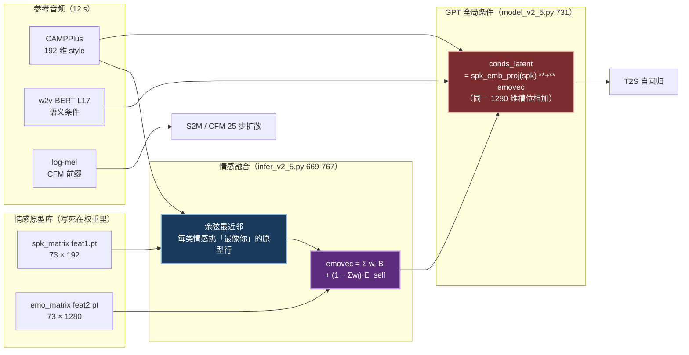

# IndexTTS-2.5 进阶用法：上游能力面 · 机制循证 · 配音质量提升路线图

> **文档定位与边界**：[VOICE-CLONING.md](./VOICE-CLONING.md) 是操作与参数的**单一参考**，回答
> 「怎么用现有能力做完一集」（部署／样本／风格档／合成／缓存／排障）。本文回答另一个正交问题：
> **上游到底有什么能力、机制为何、还能怎么更好**。
>
> **本文不复制任何本仓参数值**——风格预设数值一律以 `tts.py --list-styles` 与
> [VOICE-CLONING.md](./VOICE-CLONING.md) §4.1 为准，可执行参数一律以各集 `pipeline.toml` 为准。
> 本文只写「上游事实」（源码坐标 + 论文表号）与「二者的映射关系」。
>
> **证据锚点**：上游为本机 clone `~/tools/index-tts`<sup>[[8]](#ref8)</sup>，**HEAD `4f8792f`**；权重为 HF 公开发布的
> `IndexTeam/IndexTTS-2.5` 基座（`gpt.pth` 字节数与 HF 发布版逐字节一致）。所有 `file:line`
> 均指该 HEAD；升级上游后需复核。实测数据一律标注日期与口径（机器空闲／有负载、单句／整集）。

## 目录

1. [能力矩阵：上游有什么 / 本管线用了什么](#一能力矩阵)
2. [文本前端：读法的真正控制点](#二文本前端读法的真正控制点)
3. [情感与音色解耦的数学机制](#三情感与音色解耦的数学机制)
4. [自回归采样参数族](#四自回归采样参数族)
5. [参考音频工程](#五参考音频工程)
6. [性能：本机口径与论文口径为何不可互推](#六性能本机口径与论文口径为何不可互推)
7. [提升路线图（ROI 排序）](#七提升路线图roi-排序)
8. [迁移地雷](#八迁移地雷)
9. [上游追踪与参考文献](#九上游追踪与参考文献)

## 一、能力矩阵

`infer()` 的完整签名在 `indextts/infer_v2_5.py:505-508`。下表逐项对照上游能力与本管线现状。

| 能力 | 上游默认 | 本管线 | 说明 |
|---|---|---|---|
| `spk_audio_prompt` | 必填 | ✅ `--ref` | 硬截断 15 s，见 §5 |
| `text` | 必填 | ✅ | 预处理仅 2 条替换 + 发音标注，见 §2 |
| `lang` | 位置必填 | ✅ 恒 `ZH` | 只影响 4 件事，见 §2.1 |
| `emo_vector` (8 维) | `None` | ✅ `--style`/`--emo-vector` | 上游**不做归一化**，见 §3.2 |
| `emo_alpha` | `1.0` | ✅ `--emo-alpha` | 物理含义有前提，见 §3.1 |
| `emo_audio_prompt` | `None` | ✅ `--emo-ref` | 与向量互斥（理由见 §3.1） |
| `use_emo_text`/`emo_text` | `False`/`None` | ✅ `--emo-text` | 需服务端 `--use-qwen-emo` |
| `duration_factor` | `1.0` | ✅ `--duration-factor` | v2.5 专属；方向易搞反，见 §3.4 |
| `use_random` | `False` | 🔒 硬编码 `False` | 开启必掉保真度，见 §3.3 |
| `interval_silence` | `200` ms | ✅ `--interval-silence`（本轮接通） | 仅作用于**单请求内分段之间**，本管线逐句合成故默认不生效 |
| `max_text_tokens_per_segment` | `120` | ❌ 不暴露（刻意） | 对本仓完全惰性，见 §4.4 |
| `text_normalization` | `True` | ✅ `--no-text-normalization`（本轮接通） | **不要关**，见 §2.2 |
| `temperature`/`top_p`/`top_k` | `0.8`/`0.8`/`30` | ✅（本轮接通） | 束搜索下仍生效，见 §4.1 |
| `length_penalty` | `0.0` | ✅（本轮接通） | **0.0 不是中性**，见 §4.2 |
| `repetition_penalty` | `10.0` | ✅（本轮接通） | 与音色耦合、不可迁移，见 §4.3 |
| `max_mel_tokens` | `1500` | ✅（本轮接通） | ≈30 s 天花板，见 §4.4 |
| `do_sample` | `True` | ❌ 不暴露（**上游失效**） | `:780` 用字面量 `True` 覆盖 `:731` 弹出的值，webui 的复选框是装饰性控件 |
| 随机种子 | **无** | ✅ `--seed`（本轮接通） | A/B 可信的前提，见 §4.5 |
| `stream_return` / `more_segment_before` | `False` / `0` | ❌ 不暴露 | 流式与分段前瞻，长视频批处理无收益 |
| `use_bf16` / `use_cuda_kernel` / `use_deepspeed` / `use_accel` | — | ❌ Apple Silicon 不可达 | 见 §6、§8 |

## 二、文本前端：读法的真正控制点

### 2.1 中文归一化链路（wetext，不是 NeMo）

```mermaid
flowchart TD
    A["narration.md 逐字稿<br/>（含可选 &lt;原文｜读音&gt; 标注）"] --> B["build_narration.py<br/>剥离标注 → text ／ 保留 → ttsText"]
    B --> C["tts.py tts_text()<br/>—— 逗号 · 省略号 → 句号"]
    C --> D["POST /synthesize"]

    subgraph UP["上游 infer_v2_5.py 文本管线（顺序即坑位）"]
        direction TB
        E["`:699` 构造 lang_prefix<br/>'&lt;|zh|&gt; ' = 2 个 token"]
        F["`:701` clean_pattern<br/>标点半角化"]
        G["`:703-707` **归一化分支**<br/>zh/en → front.py TextNormalizer<br/>ja/es → nemo_tn（zh 走不到）"]
        H["`:711` 全局 text.lower()"]
        I["`:714` 发音标注展开<br/>→ &lt;|SPECIAL_TOKEN_1/2|&gt;"]
        J["`:719` split_text_by_tokens<br/>预算 118 token"]
        K["`:723` tiktoken encode"]
        E --> F --> G --> H --> I --> J --> K
    end

    D --> E
    K --> L["T2S 自回归 → 语义码"]

    style G fill:#7a2d2d,stroke:#f0a0a0,stroke-width:2px,color:#fff
    style I fill:#1a3a5c,stroke:#8ab8e0,stroke-width:2px,color:#fff
    style B fill:#1a4d3a,stroke:#7fd1a8,stroke-width:2px,color:#fff
```

三条容易踩空的事实：

- **中文不走 NeMo**。`:703-707` 是 `if/elif`：`zh`/`zhen`/`en` 走 `front.py` 的 `TextNormalizer`，
  只有 `ja`/`es` 走 `nemo_tn`。本管线 `lang` 恒为 `ZH`，故 `nemo_tn.py` 是**死路径**——
  按它排查等于调一个到不了的模块。macOS 上 `TextNormalizer` 的实际引擎是 **wetext**
  （`front.py:116-142` 按 platform 分叉，Linux 才用 `tn.chinese.normalizer`）。
- **`lang` 只影响 4 件事**：归一化分支选择、大小写折叠、是否跑日语 g2p、以及 `lang_prefix`/lang id。
  它**不影响发音标注的通道选择**（§2.3）。合法取值 `ZH/EN/JA/AR/ES`（`webui.py:800-804`）；
  代码里出现的 `zhen` 是历史死分支，tokenizer 未注册该语言，写它会让前缀退化成 7 个普通 token。
- **`:711` 对 zh 无条件 `text.lower()`**：逐字稿里刻意大写缩写零收益。

### 2.2 实测读法矩阵：什么写法正确、什么写法错

2026-08-20 在本机 index-tts venv 直接调 `TextNormalizer.normalize()` 的输出（非推断）：

| 写法 | 归一化输出 | 判定 |
|---|---|---|
| `2026 年` | 两千零二十六 年 | ❌ **唯一被空格击穿的规则** |
| `2026年` | 二零二六年 | ✅ |
| `2.5.1` | 二.五点一 | ❌ 残留字面小数点 |
| `3-5 倍` | 三减五 倍 | ❌ 读成「减」 |
| `±3%` | 百分之正负三 | ❌ 顺序颠倒 |
| `10x` | 十x | ❌ 裸字母 |
| `1080P` | 一千零八十P | ⚠️ 按基数读 |
| `47.6%` → `71.3%` | 百分之四十七点六 → 百分之七十一点三 | ✅ |
| `16.2 个百分点` | 十六点二个百分点 | ✅ |
| `6 月 20 日` | 六月 二十日 | ✅ |
| `第 3 章第 1.2 节` | 第 三 章第 一点二 节 | ✅ |
| `0.5~1.0 秒` | 零点五到一点零秒 | ✅ |
| `9:30` | 九点三十分 | ✅ |
| `AI 与 LLM` | 原样透传 | ✅ |
| `IndexTTS 2.5`（整句无汉字） | IndexTTS **two point five** | ❌ 路由到英文 normalizer |

最后一条的机制是 `use_chinese()`（`front.py:106-114`）**逐句嗅探**：整句无汉字即走英文
归一化。逐字稿为字幕可读性把句子拆到 ≤43 字，反而**提高**了出现纯 ASCII 短句的概率——
两个既有约束的隐性冲突。

已上线三集曾有 8 句年份读错，修复与成门记于 [issue.md ISSUE-164](../../docs/.agents/issue.md)；
禁写清单是 [check_script.py](./scripts/check_script.py) 的 `READING_TRAPS`，写稿侧规约见
[skills/03-narration.md](./skills/03-narration.md)。

**为什么不关 `text_normalization`**：关掉后链路上**再无任何后备读法模块**（`:703-708`
整块跳过），`%`/小数/量词/月日/章节这些**已经正确**的能力全部丢失，等于用大面积返工换一个
小面积 bug。归一化又是**幂等**的（预写汉字读法后再过一遍结果不变），故正确策略是
「保持开关 + 逐句预归一化」，可增量推进。

### 2.3 发音控制标记：唯一的精确读音手段

语法、校验规则与三个失效模式集中在 [scripts/pron_marks.py](./scripts/pron_marks.py) 的模块
文档（那是单一事实源，本节不复制）。这里只记**机制与验证结论**：

- 通道由**标记左侧是否含汉字**二分（`:66`），**与 `lang` 无关**。写法陷阱：
  `<AI|AI4 AI1>` 左侧纯 ASCII ⇒ 被当成音素通道。
- 标记**免疫归一化**：`front.py:178/220` 先换占位符再还原。故不需要为保标记而关归一化，
  且 `<行|HANG2>` 与 `2026年→二零二六年` 可在同句共存（已实测）。
- **2026-08-20 A/B 验证（拼音通道，生效）**：把多音字读音**故意互换**，再与「用汉字写出
  目标读音」的对照组比 MFCC-DTW 距离（同 ref、同 style、`--seed 20260820` 固定）：

  | 档 | 文本 | 期望读音 |
  |---|---|---|
  | A 基线 | `他在银行里行走。` | yín háng lǐ xíng zǒu |
  | B 标注 | `他在银<行\|XING2>里<行\|HANG2>走。` | yín xíng lǐ háng zǒu |
  | C 汉字对照 | `他在银形里航走。` | yín xíng lǐ háng zǒu |

  结果 `d(B,C)=0.133` ≪ `d(A,B)=0.320`、`d(A,C)=0.342` —— **分离度 2.4×，标注确实生效**。

- **CMU 音素通道：语法可用，模型响应未经证实**。同样设计（`<Claude|K AE1 T>` 对照
  `Cat`）的距离差仅 2%，且判定随分析窗口翻转（前 0.6 s「生效」、前 1.0 s「未生效」）——
  差异只在首词、被共享句尾稀释。**结论：中文句内英文专名继续沿用「进角标不口播」的既有
  纪律**；CMU 标注属未验证选项，用前必须人耳小样对比。

## 三、情感与音色解耦的数学机制

### 3.1 融合公式与 alpha 的物理含义



`emovec = Σ(wᵢ·Bᵢ) + (1 − Σwᵢ)·E_self`（`:766-767`），其中 `wᵢ` 是 alpha 缩放后的分量。
把它写成 `Σ(wᵢ°·α)·Bᵢ + (1 − α·Σwᵢ°)·E_self` 就能看清：

> **alpha 恰好等于「把自己的语调替换成合成原型的百分比」，当且仅当名义向量和 Σwᵢ° = 1.0。**

`sunny`/`passionate` 刚好是 1.00，故「alpha 0.35 留 65% 给本人真实语调」成立；而
`lively`(0.85)/`confident`(0.90)/`positive`(0.95) 的名义和不是 1，其 alpha 被稀释成
`α·Σw°`，**跨预设不可直接比较**。比 alpha 更该盯的是**残差保留率** `1 − Σ(w·α)`：
想保住 ≥60% 本人语调，就让 `Σ(w·α) ≤ 0.40`。这与实测「≥0.6 开始像另一个人、
0.3–0.45 是自然与风格的平衡带」互相印证。

「注入越多越像别人」是**两级叠加**，不是单纯「挤占」：第一级是 `:767` 的**凸组合替换**
（Σw 的比例直接把 `E_self` 换成 73 个「他人 × 情感」实例的加权和）；第二级是
`model_v2_5.py:731` 的**同槽位求和污染**（`c + e` 共用一个 1280 维条件 token，e 的模长越大，
GPT 看到的条件方向越偏离说话人身份）。论文的 GRL 只保证 e 在**训练分布上**对音色不变，
无法保证「他人原型的加权和」对未见说话人也音色中性——`find_most_similar_cosine`
（`:901-907`）正是为弥补这一残差而存在的工程补丁。

`emo_audio_prompt` 与 `emo_vector` 被本服务显式拒绝同传。**理由不是**「上游会静默丢弃音频」
（那是误读：`:611` 的 `if emo_audio_prompt is None` 不成立，音频仍会以 `(1−Σw)` 权重混进
最终 emovec），而是 **`emo_alpha` 被消费两次**——先在 `:605-608` 缩放向量，又在 `:763`
用作参考音频的隐空间插值系数，语义混乱且不可预测。

### 3.2 emo_bias 的 8 维不等权，与本仓口径的显式差异

`emo_bias` 硬编码在 `infer_v2_5.py:493`（不在 `config.yaml`）：

| 维度 | sad / afraid | happy / disgusted / melancholic | angry | surprised | calm |
|---|---|---|---|---|---|
| bias | 1.0 | 0.9375 | 0.875 | 0.6875 | **0.5625** |

即**同样填 0.5，`calm` 的实际强度只有 `sad` 的 56.25%、`surprised` 只有 68.75%**——
这两个维度「每单位 Σw 预算最贵、见效最差」。

**关键事实**：`normalize_emo_vec`（含 bias 与 0.8 上限）**在 `infer()` 内从不被调用**。
全仓唯一调用点是 `webui.py:665` 的「自定义向量」分支；`apply_bias=False` 那条分支
**没有任何调用者**（死路径）。因此：

- 本管线的 `Σvec×alpha ≤ 0.8` 是**我们自定的护栏**，不是上游行为（上游直调 `infer` 零归一化）；
- 上游 webui 的 0.8 作用在**已乘 bias 的和**上、且**在 alpha 之前**；
- 上游 `emo_text` 路径**既无 bias 也无上限**（Qwen 每维只 clamp 到 `[0, 1.2]`，8 维理论可达 9.6，
  会让 `(1−Σw)` 变成大负数）。本服务的 `_qwen_vector_sync` 是**我们补的**修补。

**后果（按上游 webui 口径复算本仓 5 个非中性预设）**：实际注入比本仓口径**弱 15.8%–33.3%**
（`confident` 最失真，因其 `calm` 占比最重），且成分构成会移位。**从社区/WebUI/HF Space
抄来的任何 `(vec, alpha)` 数值，经本仓 API 复现时都不是原意——跨来源参数迁移当前不可靠，
必须重新试听定档。**

「不采用 emo_bias」是一个**显式的设计选择**而非遗漏：bias 是上游为 WebUI 交互体验做的感知
补偿，而本管线要的是可复现、可缓存、可折算的线性口径。代价就是上述迁移不可靠性。

### 3.3 73 个情感原型：为何「换选段则标定失效」是必然

情感原型不是「每种情感一个均值」，而是 **73 个「(情感, 具体说话人)」实例**：
`emo_num=[3,17,2,8,4,5,10,24]`（Σ=73），`feat2.pt` 为 `[73, 1280]`、`feat1.pt` 为
`[73, 192]`（CAMPPlus 空间），二者按 `emo_num` 平行切分（`config.yaml:108-110`、`:245-253`）。

默认路径用**参考音频的 CAMPPlus style 做余弦最近邻**，为每个情感组挑「说话人风格最像你」
的那一行（`:669-679`）。这就是 `voices/refs.toml` 那条警告的**代码级机制解释**：
换参考样本会**同时移动**基底 `E_self` 与原型基向量 `Bᵢ`，所以在某个选段上标定的 alpha
换段即失效。分工的正确表述是——**样本决定音色 + 韵律基线 + 情感空间的局部基底；
向量只决定在该基底上挤掉多少本人真实情感**。

附带边界：`happy` 只有 **3 个原型**。全押 happy 的「明快」天花板由这 3 位说话人的表达
风格决定，靠加权重是加不出来的；能调的只有 `(1−Σw)` 那一侧（即换样本）。

`use_random=True` 的实现是**每个情感维度独立均匀随机抽一行原型**（`:668-673`），完全丢弃
说话人匹配——等于「随机找个陌生人来演这个情绪」，且 24 个 calm 原型里抽中风格远离你的
概率很高。这是它降低克隆保真度的直接机制，生产必须恒 `False`。

### 3.4 duration_factor 的真实作用面（方向勘误）

`:832` `target_lengths = int(S_infer.shape[1] * 1.72 * duration_factor)`。常数 **1.72 不是语速
系数**，而是帧率换算比：梅尔帧率 `22050/256 = 86.13` fps ÷ 语义特征帧率 `50` Hz = 1.7227
（源码取 1.72，系统性缩短 0.15%；对一整集约累计 1.2 s）。

作用面是 **S2M 阶段的时间轴重采样**：GPT 已生成完的语义 token 序列（内容与数量固定不变）被
`F.interpolate(mode='nearest')` 拉伸/压缩到目标梅尔帧数。因此：

- 语速与总时长是同一件事、**无法解耦**，且是**整段均匀**伸缩（塞音爆破与元音稳态被同比压缩，
  而自然加速时元音压缩得多、辅音几乎不变——所以 `df≠1` 的失真是「非自然的均匀伸缩」）；
- 不做信号域重采样、`f0_condition: false` ⇒ **不会出现「花栗鼠」式音高偏移**；
- **不消耗 mel token 预算**（`duration_factor` 只出现在 `target_lengths`）⇒ 放慢语速不会提高
  溢出风险；真正决定溢出的是参考音色的内在语速。

**方向勘误**：`df<1` = 更快 = 每个音素分到的时间更短 = 咬字**更紧更糊**。护密集技术句
清晰度的正确方向是 `df>1`（可试 1.03/1.05，建议上限 1.10）。本仓 `passionate` 档原注释
「df 0.97 护清晰度」方向写反，已更正（数值本身与「激情=略快」自洽，故未改）。

**本管线永远运行在论文的「自由时长模式」**：v2.5 的 GPT 里没有论文<sup>[[2]](#ref2)</sup>
描述的时长嵌入 `p`（`W_num` 表），故 `duration_factor` 不是论文的时长控制，而是 S2M 阶段的
事后时间缩放。论文宣称的 token 数精度对本管线不适用——**不存在「指定秒数直接生成」的能力**，
严格画面对齐只能靠事后 df 微调 + 逐句实测。

## 四、自回归采样参数族

### 4.1 七个生效参数 + 一个失效参数

`:731-739` 从 `**generation_kwargs` 弹出 8 项。**唯一失效的是 `do_sample`**：`:780` 传的是
字面量 `True`，弹出的局部变量此后再无读取点（webui 的复选框对 v2.5 结果零影响）。

底层走仓库内 vendored 的 HF `generate`。`num_beams>1` + `do_sample=True` ⇒ **beam-sample**
（束搜索 + 多项式采样），而非纯 beam search；`top_p`/`top_k`/`temperature` 在束搜索下
**仍然生效**（`_get_logits_processor` 只在 `do_sample` 为真时追加这三个 warper，而它恒为真）。
生效顺序：RepetitionPenalty → Temperature → TopK → TopP。

`top_k` 在 `num_beams>1` 下的安全下界是 **2**（`min_tokens_to_keep = n_eos+1 = 2`）；`top_k=1`
会踩到 multinomial 的非零元素数下界，本仓客户端与服务端均已禁用该值（`0` = 关闭 TopK，合法）。

### 4.2 `length_penalty=0.0` 不是中性

束打分 `score = sum_logprobs / (len ** 0) = sum_logprobs`。对数概率恒负 ⇒ 序列越长累加越负
⇒ **系统性偏好更短的假设**。这是 `num_beams>1` 时「吞尾 / 漏字 / 收尾急」的直接机制来源，
而不是一个中性设置。webui 允许区间 `[-2.0, 2.0]`。

> ⚠️ **本轮未能证实「抬高 length_penalty 有收益」**。第一句长句上曾观测到 `beams=3` 时
> `lp=0.0` 的 GPT 段耗时 180.5 s vs `lp=0.8` 的 19.3 s（4.9×，输出时长几乎相同），但在第二句
> 长句上**没有复现**（13.2 s vs 14.1 s，基本相同），且同一批测量里 `s2mel_time` 在同等音频
> 长度下从 18.3 s 跳到 33.1 s——而 `length_penalty` 根本不作用于 S2M。结论：那次 180 s 是
> **机器噪声**（测量期间交换区仅剩 0.5–1.2 GB，另有一个工作区的常驻实例）。
> `length_penalty>0` 仍是机制上有理据的候选项（尤其对 30–49 字的长句），但**必须在机器空闲、
> 固定 `--seed`、n≥20 句的条件下重测**，判据是尾部字词完整率而非墙钟。

### 4.3 `repetition_penalty=10.0` 为何能成立、为何不可跨音色迁移

它作用在 **GPT 的语义码头（8194 类）** 上，不是文本词表；实现是对**原始 logit 的符号相关
缩放**而非概率乘法。三条机制解释了为何能取到远超文本 LM 常用 `1.0–1.2` 的值：
(1) logit 接近 0 的 token 几乎不受影响（`0/10≈0`），强正 logit 只是被压回 0 附近而**不会被
推到 -inf**——本质是软降权而非硬禁；(2) 出射词表宽达 8194，一句约 500 token 只触及极小
一部分；(3) 惩罚之后还要过 temperature 与 `top_k` 重新归一化。

它**不是** Tortoise 血统（Tortoise/XTTS 默认 2.0）；IndexTTS 自 v1<sup>[[1]](#ref1)</sup> 起自选
10.0，在 v2、v2.5、TRT 后端一路沿用，仓库内**找不到任何选择依据**（无测试、无注释、无文档）。

**关键约束**：其有效强度**依赖 logit 的绝对尺度**，因而换音色、换 `emo_vector`（都会改变
`conds_latent`）都会改变同一个 10.0 的实际惩罚力度——**它不是音色无关的旋钮，跨音色迁移
调参结论必须重新验证**。

与 `length_penalty=0.0` 构成一对**方向相反**的失效模式压力：前者偏好短序列（吞尾/漏字），
后者压制码复用（抑制拖音，但也压制持续元音与自然停顿所需的稳态码）。上游把两者同时拉到
极端，等于把「宁可短促、不要拖长」写进了默认口径——这解释了为何 IndexTTS 的典型抱怨是
「吞字/收尾急」而非「拖音」。

### 4.4 溢出天花板：`max_mel_tokens ≈ 30 s`，且后果不是「裁短」

语义码率 **50 Hz**（两路独立佐证：`:832` 的 1.72 倍展开 ÷ 86.13 mel fps = 50.08；
w2v-BERT-2.0 的 `preprocessor_config.json` 中 `sampling_rate=16000` + `stride=2` = 20 ms 帧）。
折算：`1500 × 1.72 × 256 / 22050 ≈ **29.95 s**`；架构上限 `gpt.max_mel_tokens=1815` ≈ 36.2 s。

> 命名陷阱：`max_mel_tokens` 在 v2.5 里是**语义码**数量，不是 mel 帧数。`config.yaml` 的
> `gpt.mel_length_compression: 1024` 是 v1 遗留字段，v2.5 推理路径完全不用——用它折算会
> 得到错误答案。

**溢出后果不是音频被裁短，而是文本尾部根本没被念出**：`:792-799` 的 WARN 触发条件是「返回
序列末位不是 `stop_mel_token`」（束搜索到 `max_length` 仍无束自然收束），紧随的 `code_lens`
循环在找不到 stop token 时直接取全长，输出一段在上限处**突然断掉**的完整长度音频。

`max_text_tokens_per_segment=120` 对本仓**完全惰性**：段预算 = `min(120, 600-2) − len(lang_prefix)`
= 118 字，而三集单行最长 49/43/38 字 ⇒ `split_text_by_tokens` 从不分段（`:430-431` 直接返回）。
**明确记录为「不要动」**，以阻止未来在此参数上浪费实验轮次。这也意味着 `interval_silence`
在本管线默认不生效（句间停顿由 `video/src/timing.json` 的 `sentenceGapSec` 提供，二者不是
同一件事）。

**若将来改为「多句合并成一次请求」以摊薄固定开销**，这两个参数会立刻同时变成活约束：
118 字 ≈ 30 s 天花板，余量仅 10–30%，且 1815 是硬上限 ⇒ **单次请求最多约 36 s 语音**。

### 4.5 确定性：为什么必须加种子

上游全链路**无任何随机种子设置**（`indextts/` 与 `webui.py` 中 `set_seed`/`manual_seed`/
`random.seed` 均零命中），叠加 `do_sample` 恒 `True` + beam-multinomial 采样 ⇒ **同一句每次
合成的韵律都不同**。此前是按句缓存掩盖了这一点，一旦 `--force` 重合成就换一条不同的 take。

**2026-08-20 实测**（同文本、`sunny`、8767 服务）：

| 条件 | 两次输出 sha256 |
|---|---|
| `--seed 777` × 2 | **完全一致**（`50680908557300b7…`） |
| 不给种子 × 2 | 不同（`5ac01e62…` / `f17dd01e…`） |

MPS 上的算子非确定性并未破坏可复现性。种子在 `_infer_sync` 内、每次 infer 之前设置，故
**逐句确定性不受合成顺序与断点续跑影响**。

这是**元收益**：所有后续参数 A/B 才第一次变得可信（否则听到的差异可能只是采样噪声），
`--force` 重合成可复现，QA 复听与成片可对齐。`--seed-offset` 是逃生口——固定种子会把某句
锁死在一条可能不佳的 take 上，偏移一位即换一条而仍可复现。

## 五、参考音频工程

| 约束 | 事实 | 坐标 |
|---|---|---|
| 时长 | **硬截断 15 s，保前段丢尾部**，`verbose=False` 时无日志 | `:396-408`（spk `:626/:642`、emo `:685` 均传 15） |
| 采样率 | spk 路径 `librosa.load` 不传 `sr` ⇒ **恒 22050 Hz 单声道**；再降 16 kHz 喂 CAMPPlus/w2v-BERT（Nyquist 8 kHz） | `:398` |
| 双路差异 | emo 路径单次重采样到 16 k，spk 路径 22050 → 再 Resample 16 k（双重）⇒ 同一文件的 `base_vec` 与 `emo_vec` 数值略有差异 | `:685` vs `:626-628` |
| 静音/降噪 | 全链路**无** trim/VAD、无响度归一化、无降噪 | 全文 grep |
| 增益敏感性 | CAMPPlus 有 CMVN、w2v-BERT 有逐 bin CMVN ⇒ 两条**相似度主路径对全局增益免疫**；只有无 CMVN 的 `ref_mel` 受影响 | `:643-648`、`:281-289` |
| 逐句成本 | `ref_mel` 是 CFM 的**前缀 mel**，每句都进 25 步扩散；条件提取按路径缓存、每样本只算一次 | `:839-845` vs `:619-664` |

三条推论：

1. **录制时必须把最好的一段放在文件开头**。截断保前丢后 + 无 VAD ⇒ 文件头部每一秒静音/
   清嗓/口水音都会占用 15 秒预算并作为低能量帧进入 `ref_mel`；30 秒录音里第 20 秒的黄金句
   永远不会被模型看到。
2. **采样率收益在 22.05 kHz 就封顶**。录 96 kHz 无收益；录 44.1/48 kHz 的价值只在于给
   重采样留干净过渡带。反面风险是低码率 mp3（64 kbps 在 ~11 kHz 滚降，正好落在模型可见
   频带边缘）。**削波是唯一真正伤相似度的电平问题**——它产生的宽带谐波落在 8 kHz 以内，
   CMVN 抵消不掉。
3. **12 秒是有依据的选择，不应为提速缩短**。硬上限 15 s；文献侧 speaker similarity 随 prompt
   时长上升后在 ~10 s 饱和<sup>[[6]](#ref6)</sup><sup>[[7]](#ref7)</sup>；WildSpoof
   <sup>[[5]](#ref5)</sup> Table 2 显示事后增强让 UTMOS/DNSMOS 上升但 **SECS 下降**
   （0.35→0.28）⇒ 保真度问题**事后无法弥补，只能录得干净**。故可用区间实为 `[10, 15)`，
   12 s 落在中部。

> **官方从未给出参考音频规格**。上游 README 与两篇论文<sup>[[2]](#ref2)</sup>
> <sup>[[3]](#ref3)</sup> 均无 prompt 时长/采样率/质量要求，也无相关消融。论文里的 **25 秒是
> 训练侧** Segment Merging 的片段上限，把它当推理侧建议是误读。网络聚合站流传的
> 「官方推荐 16–48 kHz」在上游全文 grep **不存在**。

### 已知缺陷：客户端内容寻址 vs 服务端路径寻址

上游按**路径字符串**缓存条件张量（`:619`、`:681`），本仓客户端按**内容 sha1**
（`tts.py` 的 `ref_sha1`）。**服务常驻期间原地覆盖同一个 `voices/*.wav`，会产出「sha1 是新的、
音色是旧的」音频**——而这正好命中 §3.3 定式里「裁 3–4 份候选各跑小样」这个高频动作。
规避：给每个候选用不同文件名（或内容寻址路径），不要原地覆盖。

## 六、性能：本机口径与论文口径为何不可互推

### 6.1 本机跑的不是论文里的快变体

`checkpoints/config.yaml` 是 `dit_type: "DiT"` + `uvit_skip_connection: true`（**U-DiT**），
全仓 grep `zipformer` **零命中**，`flow_matching.py:168-171` 对非 DiT 直接 `NotImplementedError`。

论文<sup>[[3]](#ref3)</sup> Table 4（NVIDIA A10 + Xeon 8350C）：

| 模型 | T2S RTF | S2M RTF |
|---|---|---|
| IndexTTS 2 | 0.232 | 0.078 |
| IndexTTS 2.5 (U-DiT) | 0.119 | **0.081** |
| IndexTTS 2.5 (Zipformer) | 0.119 | **0.017** |

即 **S2M 的 4.8× 提速完全来自 Zipformer<sup>[[4]](#ref4)</sup> 这一个变量**（与 codec 降帧率无关），
而本机对应的是 `0.081` 那一列。**论文头条的「RTF 提升 2.28 倍」不适用于本机**；Zipformer 版
s2mel 权重截至 2026-08-20 未公开发布。

### 6.2 分段 profile：S2M 主导，束宽在 MPS 上近乎免费

`infer()` 内建三段计时器 `gpt_gen_time`/`s2mel_time`/`bigvgan_time`，`:870-875` **无条件打印**
且不受 `verbose` 控制 ⇒ **服务端 stdout 天然就是 profile 源，零改动**。启动时
`> .temp/tts-server.log 2>&1` 即可逐句取数。

**2026-08-20 实测**（M4 base / 24 GB / MPS fp32 / 机器有负载，13 个样本）：

| 音频时长 | gpt (T2S) | s2mel (S2M) | bigvgan | gpt 占比 | s2mel 占比 |
|---|---|---|---|---|---|
| 2.0–2.2 s | 2.0–5.5 s | 8.0–8.7 s | 0.9 s | 18–37% | **57–73%** |
| 4.1–4.3 s | 4.1–6.6 s | 9.5–11.0 s | 1.4–1.7 s | 25–37% | **55–65%** |
| 7.3–8.2 s | 13.2–19.3 s | 14.7–33.1 s | 2.8–6.0 s | 25–46% | **45–47%** |

两条结论：

- **S2M 是 MPS 上的主导段（45–73%），不是 T2S**。这与 CUDA/A10 画像（T2S 占 87.5%）相反。
  合理机制：MPS 上 `use_cuda_kernel` 被强制 `False`，BigVGAN 的反锯齿激活退化为上百次分组
  `conv_transpose1d`/`conv1d`；而 CFM 每句都要在「参考 prompt + 目标」的完整拼接序列上跑
  25 步欧拉、CFG=0.7 还把 batch 堆到 2。
- **s2mel 有巨大的固定成分**：2 s 音频要 8.0 s、4.3 s 音频才 9.6 s ⇒ 约 7.3 s 固定 + 约 0.8 s
  每秒音频。这个固定成分正是 12 s 参考音频作为扩散前缀（1034 梅尔帧 vs 2 s 目标的 172 帧）。
  **交错 3 组复现**（同文本、`--seed 555`）：参考 12 s → 6 s，`s2mel_time` 中位数
  **21.81 s → 10.02 s（−54%）**，逐对 34.07→11.81 / 21.81→10.02 / 19.87→9.48。
  ⚠️ 但音频时长也从 2.16 s 变成 1.78 s（音色与语速随之改变），故降幅含「目标更短」的贡献，
  **不可为提速缩短参考**（§5 推论 3）。
- **束宽只作用于 T2S**（S2M 入口的 `codes` 形状与束宽无关）。T2S 既然只占 18–46%，
  「按束宽线性放大整集墙钟」就不成立：整集实测 1→3 束仅 **+4%**。正确表述是
  **CUDA 上近线性，MPS 上近乎免费**。

### 6.3 同口径重算：3–4× 的「未解缺口」已基本解释完（2026-08-20）

社区 MLX 移植 `index-tts-2.5-mlx`<sup>[[9]](#ref9)</sup> 0.1.1 报 PyTorch-MPS 基线 RTF
**1.11–1.17**（M5 Pro），而本仓整集折算 **8.8–9.2**（M4 base）——曾记为「剩余 3–4× 无解释」。
按其 README 的确切口径（**RTF = synth ÷ 音频时长，`load`(权重加载) 与 `clone`(说话人嵌入)
均排除**；warm、3 次均值；该移植主动砍掉全部情感控制）重算本机：

| 档 | 配置 | 音频 | synth 中位 | **RTF** | gpt / cfm / vocoder |
|---|---|---|---|---|---|
| **L1 对齐档** | 直调 `infer()`、无 HTTP/无 mp3、neutral 无情感向量、1 束、12 s 参考、预热后 | 3.34 s | 14.60 s | **4.37** | 2.75 / **10.10** / 1.41 |

缺口分解：

| 分项 | 倍数 | 依据 |
|---|---|---|
| 本仓管线开销（HTTP + mp3 编码 + 情感向量 + 长跑降频 + 逐句往返） | **2.1×** | 整集 9.0 → 对齐档 4.37 |
| 硬件（M4 base 120 GB/s / 10 GPU 核 vs M5 Pro 273+ GB/s / ~20 核） | 2–3×（估） | 带宽与核数比 |
| **残差** | **约 1.3–1.9×** | 4.37 ÷ 1.14 = 3.8×，扣掉硬件 |

**结论：缺口不再是「无解释」的 3–4×，而是可归因的 2.1×（管线）× 2–3×（硬件），残差仅
1.3–1.9×**——最可能来自对方未披露的 fixture 与**参考音频长度**。旁证是分段占比：本机 cfm
占 70.8%（10.10 s / 3.34 s 音频 = 3.02× 实时），而对方 int8 分段 cfm 仅 0.46 s / ~3 s 音频
= 0.15× 实时（占其总量 35%）。**cfm 成本正比于「参考帧 + 目标帧」**，我们用 12 s 参考
（1034 梅尔帧）而其 benchmark 参考长度未披露——这是残差最合理的落点。

> **因此「换栈」不被 RTF 数字支持**：没有大块未解释的性能余量，而 MLX 移植要付出砍掉全部
> 情感控制的代价（§七 #16）。真正的杠杆仍是 cfm 前缀长度，那是管线侧的事、不需要换栈；
> 但 §5 已论证**不可为提速缩短参考**（会改音色与语速）。

### 6.4 ⚠️ 本机当前无法支撑性能 A/B（这条比上面任何数字都重要）

同一份 neutral 工作量在 **6 次连续调用**内从 14.49 s 漂到 **48.74 s（3.4×）**。交错设计
（neutral / emo_vector 交替 3 轮）本意是让漂移对两组同等作用，结果逐对比值摆动
**0.75× / 1.60× / 0.75×**，把 1.0 夹在中间——**任何真实效应都被漂移淹没**。

同一批顺序阶梯数据里有两条机制上讲不通的读数，可作漂移的独立证据：
`num_beams` 不作用于 S2M，却让 cfm 从 10.10 s 涨到 19.01 s；6 s 参考的归一化 cfm
（3.72 s/音频秒）反而**高于** 12 s 参考的（3.02）——与交错实验的结论相反。

**唯一可信的是「冷起第一块」**：两次独立冷起测同一工作量得 14.60 s 与 14.49 s，**相差 0.8%**。
测量期间交换区仅剩 0.8–1.5 GB（37 GB 已用），叠加另一工作区的常驻服务实例。

**性能测量协议（今后做任何 §七 的 A/B 都必须遵守）**：
1. 先看 `sysctl vm.swapusage`——空闲 < 4 GB 就不要测；
2. 每次只测**一个冷起块**（重启进程 + 1 次预热 + 3 次计时），块间充分冷却；
3. **绝不用同一进程内的顺序阶梯做参数归因**；必须交错，且交错也要先验证 A/A 复现性
   （同配置跑两轮，比值应 ≈1.0，否则环境不合格、当轮数据作废）；
4. 判据优先用**分段计时器**而非总墙钟（分段能暴露「不该变的段变了」这类漂移指纹）。

### 6.4 Apple Silicon 上不可用的加速面（逐条已核实）

`use_bf16`（MPS 分支 `:106-109` 硬编码 `False`，注释称 bf16 在 MPS 上是开销）、
`use_cuda_kernel`（同处置 `False`）、`use_deepspeed`（三条分支都以 `torch.cuda.is_available()`
为合取条件）、`use_accel`（要求 CUDA + flash_attn）、`backends/trt`（要求 NVIDIA GPU +
TensorRT-LLM）。仓库内**无 vLLM 后端**，README 只给外链 recipe。

`PYTORCH_ENABLE_MPS_FALLBACK` **未设置**且合成能跑通 ⇒ **热路径没有静默回落到 CPU 的算子**，
「fallback 拖慢」这条常见嫌疑可以排除。`kv_cache` 在 MPS 路径上确实启用（`:155` 硬编码
`kv_cache=True`），但是「每步 `torch.cat` 增长」的动态缓存而非预分配 `StaticCache`。

**把 dtype 改成 fp16/bf16 的收益上限可算**：AR 常驻权重 1.93 GB → 0.96 GB，按 25 tok/s 折算
最多省 0.20–0.30 个 RTF，相对总 RTF 8.8–9.2 即 **2–3%**；而 S2M+BigVGAN 段的 autocast 被
`:826-827` 硬编码 `dtype=None`，低精度根本覆盖不到那两段。叠加本仓已记录的 NaN 失效模式，
**风险收益不对称，明确不做**。旁证：4090 上 2.5 的 bf16（0.2065）本身就不比 fp32（0.2060）快
——说明 2.5 架构里已经没有对低精度友好的 compute-bound 块了。

## 七、提升路线图（ROI 排序）

每项都给「依据 / 代价 / 验证方法」。**未验证的一律标注**，不要当成结论执行。

| # | 动作 | 依据 | 代价 | 验证方法 | 状态 |
|---|---|---|---|---|---|
| 1 | **读法陷阱成门 + 8 句年份修复** | 亲测 8 句读错；归一化幂等 | 改稿 8 行；重合成牵动 beat 与渐黑窗口 | `check_script.py` 读法陷阱门 + 正反例单测 | ✅ 已落地（重合成待排期） |
| 2 | **发音标注接通（多音字）** | A/B 分离度 2.4× 证实生效 | `text`/`ttsText` 拆分 + lint；标注句失效缓存 | DTW 对照 + 全链路集成验证 | ✅ 已落地 |
| 3 | **固定 `--seed`** | 亲测带种子字节一致、不带则不同 | 零 | 同句 ×2 比 sha256 | ✅ 已落地 |
| 4 | **同口径重算本机 RTF** | 与 MLX 报告差 3–4× 无解释 | 一次单句实验 | 排除 load/clone，只计 synth | ✅ **已做**：对齐档 RTF 4.37，缺口分解为 2.1×（管线）× 2–3×（硬件），残差仅 1.3–1.9×（§6.3）⇒ **换栈不被数字支持** |
| 5 | 分段 profile 常态化 | 内建计时器零改动可取（§6.2） | 服务重启时加重定向 | `grep gpt_gen_time\|s2mel_time\|bigvgan_time` | ✅ 本轮已用；且它是识别热漂移的主要手段（§6.4） |
| 6 | **建立可用的性能测量环境** | 本机同一工作量 6 次连续调用漂 3.4×，A/B 不可做（§6.4） | 清内存/停其它实例，或换机 | A/A 复现性检查：同配置两轮比值须 ≈1.0 | ⬜ **待做（现为 #7/#8/#15 的前置）** |
| 7 | `length_penalty>0`（长句吞尾） | 机制明确（§4.2），但**本轮未复现收益** | 进缓存摘要 ⇒ 改档即重录 | 需先满足 #6；固定 seed + n≥20 长句，判据=尾部字词完整率（非墙钟） | ⬜ 待验证（受阻于 #6） |
| 8 | `repetition_penalty` 定向扫描 | 上游自 v1 沿用 10.0 且无任何测试支撑（§4.3） | 同上；且**与音色耦合**不可迁移 | 需先满足 #6；固定 seed + beams=1，30 句覆盖长/短/数字/英文 | ⬜ 待验证（受阻于 #6） |
| 9 | 预设名义向量归一到 Σvec°=1.0 | 让 alpha 跨预设可比（§3.1） | 改预设 ⇒ 整集重录 | `α_new = α_old × Σvec°_old` 折算后波形应近乎一致 | ⬜ 待验证 |
| 10 | 砍掉 `calm`/`surprised` 配料 | bias 只 0.5625/0.6875，占预算却不兑付表达力（§3.2） | 同上 | 三档 A/B 比 F0 中位/起伏/音节率/质心 | ⬜ 待验证 |
| 11 | 密集技术句改 `df>1` | 方向勘误（§3.4） | 拉长时长 ⇒ 牵动 beat | 5 句最糊的技术句跑 df ∈ {0.95,1.0,1.05,1.08}，用 ASR 回转写 CER 作清晰度代理 | ⬜ 待验证 |
| 12 | 重录目标风格参考样本 | 换段落即 F0 +12~16%、起伏 +25~40%（VOICE-CLONING §3.3）；好段落必须放开头（§5） | 一次录制 + 定档 | 纯克隆小样比对，合格线取现有最佳候选的九成 | ⬜ 待做 |
| 13 | `prospect_ref.py` 增保真度门 | 现公式 5 项全是「风格」、0 项「保真度」；谱质心把「亮」与「噪」混淆 | 改评分 ⇒ 历史排名口径失效 | 干净候选 + 人工注入 -45 dBFS 白噪，旧公式总分应上升（暴露缺陷） | ⬜ 待做 |
| 14 | 进程级分片并行（双实例） | 瓶颈是发射/同步而非带宽饱和 | **本机内存不允许**（实测起第二实例后交换区仅剩 0.5 GB） | 先测稳态 RSS 与 swap 余量 | ⛔ 本机受限 |
| 15 | 降 `diffusion_steps` / 关 CFG | s2mel 占 45–73%，步数 25→12 可省该段一半 | **直接动音质**；需改服务端 | 10 句 A/B，谱质心掉 >5% 或出现齿音即否决 | ⬜ 高风险待验证 |
| 16 | 迁 MLX / 换栈 | 见 §6.3 | 砍掉全部情感控制 ⇒ 7 档风格体系失效 | — | ⛔ **不推荐**：#4 已完成分母校准，缺口基本可归因，无大块性能余量支持换栈 |
| 17 | 升级到 2.5-RL 权重 | 论文中文 WER 4.36→3.93、SS 77.10→77.92 | 整集重录 | — | ⛔ **权重未公开**（见下） |

**IndexTTS2.5-RL 权重未公开发布**（2026-08-20 核验）：GitHub Model Zoo 4 条无 RL 行；
HF `IndexTeam` 组织 14 个 repo 无 RL/GRPO 命名；全 Hub 搜索 97 个 IndexTTS repo，2.5 血统仅
7 个且全是格式转换/量化；`IndexTeam/IndexTTS-2.5` 文件树只有一个 `gpt.pth`。**订阅 upstream
release 比自行复现 GRPO 经济得多**——同时也在等 Zipformer 版 s2mel 权重（§6.1）。

## 八、迁移地雷

| 场景 | 地雷 | 表现 |
|---|---|---|
| 迁 CUDA + 开 `--accel` | `model_v2_5.py:761-772` 的 accel 旁路**只认 `temperature`**，其余采样参数全部静默失效 | 「参数明明传了却毫无效果」 |
| 迁小显存 CUDA（<10 GB） | `low_vram` 触发，`:509` 把 >40 字符的行按标点**硬切并插 200 ms 静音** | 旁白行中间莫名多出停顿 |
| 迁 Linux | 中文归一化引擎从 wetext 换成 `tn.chinese.normalizer`（`front.py:130-142`） | 读法行为可能变化——**必须在 Linux 上重跑空格矩阵**（§2.2） |
| 换 MLX 栈 | 主动放弃 `emo_vector`/`emo_audio_prompt`/`emo_text` 与束搜索 | 本仓 7 档风格体系、alpha 标定、`sunny`/`sunny-steady` 双档全部失效 |
| 原地覆盖参考样本 | 上游按路径缓存条件张量 | 「sha1 是新的、音色是旧的」（§5 末） |
| 合并多句成单请求 | 118 字段预算与 1815 mel token 同时变成活约束 | 单请求上限约 36 s 语音；溢出表现为**文本尾部未被念出** |

## 九、上游追踪与参考文献

**值得订阅而非自研的两件事**：Zipformer 版 s2mel 权重（S2M 0.081 → 0.017，§6.1）、
IndexTTS2.5-RL 权重（§七 #16）。二者都无需本仓做任何工程。

本机 `~/tools/index-tts` 是 **depth-1 浅克隆**（`git log` 只有 1 条，不代表上游历史）。
升级上游后须复核本文全部 `file:line` 锚点。

### 参考文献（IEEE）

<a id="ref1"></a>[1] B. Si et al., "IndexTTS: An Industrial-Level Controllable and Efficient Zero-Shot Text-To-Speech System," *arXiv preprint arXiv:2502.05512*, 2025.

<a id="ref2"></a>[2] B. Si et al., "IndexTTS-2: Breakthrough Emotionally Expressive and Duration-Controlled Auto-Regressive Zero-Shot Text-To-Speech," *arXiv preprint arXiv:2506.21619*, 2025.

<a id="ref3"></a>[3] Index Speech Team, "IndexTTS 2.5 Technical Report," *arXiv preprint arXiv:2601.03888*, 2026.

<a id="ref4"></a>[4] Z. Yao et al., "Zipformer: A faster and better encoder for automatic speech recognition," in *Proc. ICLR*, 2024.

<a id="ref5"></a>[5] WildSpoof Challenge submission, "On the role of speech enhancement for spoofed speech detection and synthesis," *arXiv preprint arXiv:2602.05770*, 2026. —— prompt 质量增强提升 UTMOS/DNSMOS 但**降低** SECS 的对照数据（Table 1–2）。

<a id="ref6"></a>[6] M. Le et al., "Voicebox: Text-guided multilingual universal speech generation at scale," in *Proc. NeurIPS*, 2023. —— speaker similarity 随 prompt 时长饱和的基线。

<a id="ref7"></a>[7] S. E. Eskimez et al., "E2 TTS: Embarrassingly easy fully non-autoregressive zero-shot TTS," in *Proc. IEEE SLT*, 2024. —— 含 "Impact of audio prompt length" 专节。

<a id="ref8"></a>[8] 上游仓库与许可：[index-tts/index-tts](https://github.com/index-tts/index-tts)（本文锚点 HEAD `4f8792f`）；模型按 [bilibili 模型使用许可协议](https://github.com/index-tts/index-tts/blob/main/LICENSE) 发布——个人/研究可用，**商用需联系 indexspeech@bilibili.com**。

<a id="ref9"></a>[9] 社区 MLX 移植：[index-tts-2.5-mlx](https://pypi.org/project/index-tts-2.5-mlx/) 0.1.1（2026-08-14）——本文 §6.3 的 PyTorch-MPS 基线数据来源。
