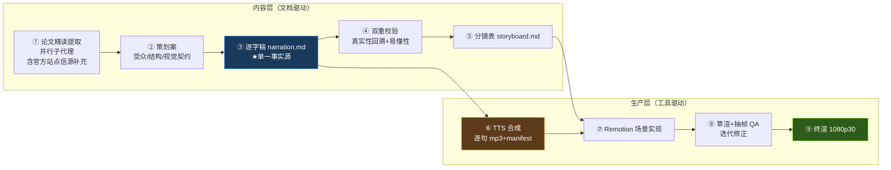

# 科普视频制作 Pipeline（公共基建）

> 从「论文精读 → 逐字稿 → 配音 → 代码动画 → 终渲」全链路中沉淀的**仓库级可复用流水线**。
> 首个建成的完整范例：[《AI 如何自己变强？》](../self-improving-agents-video/README.md)（建成时间上的第一个，非系列首集；发布顺序见 [../series.json](../series.json)）。

## 一、Pipeline 总览（9 Stages）



每个 Stage 的代理提示词规格见 [skills/](./skills/)（01–05 覆盖内容层，06 覆盖生产层 Stage ⑦ 的 Remotion 实现），可直接作为子代理 prompt 或未来挂载为 `.claude/skills/` 的底稿。

## 二、工程目录约定

每集视频一个 `media/<slug>-video/` 工程：

```
media/<slug>-video/
├── README.md               # 本集说明（目录表/复现流水线/视觉契约/许可）
├── research/paper-notes.md # 事实源：全部口播断言须可回溯至此
├── script/
│   ├── planning.md         # 策划案
│   ├── narration.md        # 逐字稿（唯一维护处，勿改 narration.json）
│   ├── narration.json      # 派生物（build_narration.py 生成）
│   └── storyboard.md       # 分镜表（镜号↔句 id 区间↔画面↔动效）
├── scripts/*.py            # 薄包装 → ../../pipeline/scripts/（保 CLI 契约）
├── video/                  # Remotion 独立 pnpm 工程（--ignore-workspace 隔离）
└── out/                    # 渲染产物（gitignored）
```

**格式契约**（`build_narration.py` 的解析规则）：
- narration.md：`## P0 标题` 分幕 + `- [p0-01] 文本` 一句一行；句 id 必须以幕名小写为前缀、全片唯一。
- `>` 引用块为画面备注，不进配音；英文方法名做角标不口播。

## 三、公共脚本（单一事实源）与编排入口

**单入口 `pipeline.py`**（参数读各集 `pipeline.toml`；阶段契约见下表）：

```
uv run --no-project media/pipeline/scripts/pipeline.py --project media/<slug>-video     {status|doctor|build|check|tts|captions|render|qa|all|clean-samples}
```

| Stage | 命令 | 输入 → 产出 | 幂等/续跑 |
|---|---|---|---|
| ③ | `build` | narration.md → narration.json | 纯函数 |
| ④⑤ | `check` | narration.json + storyboard.md + pipeline.toml → 门 | — |
| ⑥ | `tts [--plan]` | narration.json + 参考样本 → 逐句 mp3 + manifest | sidecar 摘要 / 逐句续跑 |
| ⑥+ | `captions` | manifest + timing.json → out/captions.{srt,vtt} | 纯函数 |
| ⑧ | `render` + `qa` | src + audio → draft.mp4 + 抽帧体检 | 渲染否 / 抽帧是 |
| ⑨ | `render --final` | 同上 → final.mp4（前置：⑧ 零 FAIL） | 否 |

`status` 为派生式新鲜度表（无状态文件——幂等已由内容摘要提供，再存阶段状态即第二事实源）；`doctor` 自检配置/时序 SSOT/样本指纹/IndexTTS 服务。

| 脚本                                                       | 用途                                                                                                                    | 工程内等价调用                                                                                                                                   |
| ---------------------------------------------------------- | ----------------------------------------------------------------------------------------------------------------------- | ------------------------------------------------------------------------------------------------------------------------------------------------ |
| [scripts/build_narration.py](./scripts/build_narration.py) | narration.md → narration.json + 时长估算                                                                                | `uv run --no-project scripts/build_narration.py`                                                                                                 |
| [scripts/tts.py](./scripts/tts.py)                         | 逐句配音合成 + 时长 manifest（幂等，双引擎：edge 预置音色 / indextts 声音克隆；风格推荐位 sunny 明快阳光，`--steady` 混合档让关键句单独升束宽，`--plan` 预演排期） | `uv run --no-project --with edge-tts --with mutagen scripts/tts.py`（克隆模式免 edge-tts，见 [VOICE-CLONING.md](./VOICE-CLONING.md)）            |
| [scripts/tts_server.py](./scripts/tts_server.py)           | IndexTTS 推理服务（声音克隆后端，**运行于 index-tts 环境**，非本仓）                                                    | 在 `~/tools/index-tts` 内启动，见 [VOICE-CLONING.md §二](./VOICE-CLONING.md)                                                                     |
| [scripts/tts_sample.py](./scripts/tts_sample.py)           | 单句声音小样试听（直调 IndexTTS 服务合成一句话 + 全风格 A/B，定稿风格前的必经关口）                                      | 无工程薄包装，从仓库根调用：`uv run --no-project --with mutagen media/pipeline/scripts/tts_sample.py --ref <样本.wav> --all-styles --play`，见 [VOICE-CLONING.md §5.1](./VOICE-CLONING.md) |
| [scripts/prepare_ref.py](./scripts/prepare_ref.py)         | 参考音色样本裁剪/规范化（长录音 → 5–15s 干净 WAV）                                                                      | 无工程薄包装（与具体工程无关），从仓库根调用：`uv run --no-project --with soundfile --with numpy media/pipeline/scripts/prepare_ref.py <源音频>` |
| [scripts/prospect_ref.py](./scripts/prospect_ref.py)       | 参考样本选段勘探（按 F0/起伏/音节率/谱质心筛「更亮更轻快」的候选起点，喂给 prepare_ref.py）                              | 无工程薄包装，从仓库根调用：`uv run --no-project --with soundfile --with numpy media/pipeline/scripts/prospect_ref.py <源音频…>`，见 [VOICE-CLONING.md §3.2](./VOICE-CLONING.md) |
| [scripts/pipeline.py](./scripts/pipeline.py)             | **单入口编排**（上表）                                                                                                  | `uv run --no-project media/pipeline/scripts/pipeline.py --project media/<工程> tts --plan`                                                      |
| [scripts/timeline.py](./scripts/timeline.py)             | 时间轴 Python 侧实现（与 timing.ts 同构，直读 timing.json）                                                            | 被 qa_frames/captions/check_script 复用                                                                                                          |
| [scripts/check_script.py](./scripts/check_script.py)     | ④⑤ 内容门：beat 覆盖性 / 时长预算双口径 / SceneFade 不变式 / `--check-scenes` 分镜↔代码互比                            | `uv run --no-project scripts/check_script.py --check-scenes`                                                                                   |
| [scripts/check_series.py](./scripts/check_series.py)     | 系列一致性五规则（口播反串线 / 多标题顺序 / 序号绑定 / 清单完整性 / 死链），执法 [../series.json](../series.json)         | 仓库根：`uv run --no-project media/pipeline/scripts/check_series.py`（已挂 pre-commit）                                                          |
| [scripts/captions.py](./scripts/captions.py)             | 导出 srt/vtt（cue 终点不含句间停顿——外挂字幕静默期不留字）                                                             | `uv run --no-project scripts/captions.py`                                                                                                        |
| [scripts/qa_frames.py](./scripts/qa_frames.py)           | 抽帧 QA（幕/句/`--last-n` 末 N 句）+ `--check` 四项自动体检 + `--check-theme` WCAG 对比度                               | `uv run --no-project --with pillow --with numpy scripts/qa_frames.py out/draft.mp4 --last-n 6 --check`（工程根；视频路径按 CWD 解析，仓库根调用写全 `media/<工程>/out/draft.mp4`）                                          |
| [scripts/paper_extract.py](./scripts/paper_extract.py)   | Stage ① 取证工具箱（§→页映射 / 分栏取文 / caption 收割 / 定点 find / 页面光栅化）                                       | `uv run --no-project --with pymupdf media/pipeline/scripts/paper_extract.py "<PDF>" find "原文措辞"`                                             |
| [scripts/refs.py](./scripts/refs.py)                     | 参考样本可复现清单（verify/rebuild；指纹在 [voices/refs.toml](./voices/refs.toml)，只存哈希不存音频）                    | `uv run --no-project media/pipeline/scripts/refs.py verify`                                                                                     |
| [scripts/source_ledger.py](./scripts/source_ledger.py)   | Stage ① **B 型信源**可复现清单（fetch/list/verify；`repo` 类固定提交 raw 指纹漂移即 FAIL，`site` 类只比归一正文、漂移报 WARN） | `uv run --no-project media/pipeline/scripts/source_ledger.py --project media/<slug>-video verify`                                               |

中心脚本以 `--project <工程根>` 参数化；工程内 `scripts/*.py` 为薄包装（透传参数、保持原 CLI）。改造/迭代只改 `media/pipeline/scripts/`，验证门 = 受影响工程的 `narration.json` / `manifest.json` 字节级不变。

## 四、复用边界（显式权衡）

- **Python 脚本：集中共享（SSOT）**——三个纯文本变换工具，跨集零差异，中心化防 split-brain。
- **Remotion 工程原语：复制适配，不做共享包**——`timing.ts` / `Subtitle` / `cards.tsx` / `theme.ts` 等每集复制后按本集视觉契约修改。理由：每集工程须保持 pnpm `--ignore-workspace` 独立可渲染（嵌套 workspace 隔离 + Remotion 版本自由），共享 TS 包会把「一集的视觉改动」泄漏进其他集。复用时以任一既有集工程为模板复制 `video/` 骨架（发布顺序见 [../series.json](../series.json)，与模板选择无关）。
- **每集视觉契约独立设计**（色彩语义映射到本集核心概念），但底层规范复用：深色底 `#0E1116` 系、警示红 `#FF5C5C`、确认绿 `#7ED321`、金句卡衬线体、公式只作角标彩蛋。

## 五、音画同步机制（零手工对轨）

每句一段 MP3；`tts.py` 产出 `video/public/audio/manifest.json`（含每句实测时长）；Remotion `calculateMetadata` 读取 manifest 计算全片时间轴。**改稿后只需重跑：build → tts → render**。引擎可选 edge 预置音色（默认）或用自己的声音克隆（[VOICE-CLONING.md](./VOICE-CLONING.md)），两种引擎的 manifest 契约完全一致。

**时序常数单一事实源** = 每集 `video/src/timing.json`（句间/幕间/片头/片尾/幕间淡入淡出）：`timing.ts` 经 `resolveJsonModule` 同步 import，Python 侧（qa_frames/captions/check_script）经 `timeline.py` 直读同一文件——改节奏只动 JSON，双语言镜像漂移结构性不存在。**渲染主机约束**：三集未内嵌 CJK 字体（PingFang SC/Songti SC/SF Mono 系统栈），渲染仅限 macOS；两个重启触发器见 [skills/06 事实条](./skills/06-remotion-implementation.md)。

## 六、新集脚手架清单

1. `cp -r` 任一既有集工程目录骨架（README/research/script/scripts/video/pipeline.toml），改 slug 与内容。
2. `video/package.json` 改 `name`；清空 scenes 重建；`theme.ts` 换本集色板。
3. 根 `.gitignore` 追加本集产物规则（**不能放工程内**——根级裸 `.gitignore` 规则会挡住嵌套 ignore 文件）：
   ```
   media/<slug>-video/video/public/audio/
   media/<slug>-video/out/
   media/<slug>-video/**/*.mp4
   media/<slug>-video/**/*.mp3
   media/<slug>-video/**/*.wav
   ```
4. `cd video && pnpm install --ignore-workspace`（必须显式忽略根 workspace；`onlyBuiltDependencies: [esbuild]` 已在 package.json）；装完检查根 lockfile 零变更。
   > pnpm ≥ 11 会提示 `package.json` 的 `pnpm` 字段不再被读取，并报 `ERR_PNPM_IGNORED_BUILDS: esbuild`
   > （[ISSUE-076](../../docs/.agents/issue.md)）。**已实测确认对本工程无害**：esbuild 的平台二进制
   > 是 optionalDependency，落地不依赖 postinstall —— 旧写法下 `remotion bundle` 端到端通过。
   > 故**刻意不改** `.npmrc`/`package.json` 去消掉这条提示（改了会让 A 档冻结文件产生一处
   > 只为静音噪声的跨集差异）。真正需要 postinstall 的依赖若将来出现，再按官方新家
   > `pnpm-workspace.yaml` 的 `allowBuilds` 处理。
5. **登记到 [../series.json](../series.json)**：顶层是 `seriesList[]`，新系列追加一个 series 对象
   （`id` / `title` / `sourceKind` / `rule` / `episodes`），既有系列的新集追加到其 `episodes`。
   同步 [../series.md](../series.md) 的分节表格。`check_series.py` 已挂 pre-commit，漏登即 FAIL。
6. 按 [skills/](./skills/) 01→05 顺序走内容层，再进生产层。Stage ① 先判**信源型别**：
   论文型走 A 型（`paper_extract.py` + `paper-notes.md`），文档/代码/课程站点型走 B 型
   （`source_ledger.py` + `source-notes.md` + 证据三级），见 [skills/01](./skills/01-source-extraction.md)。

## 七、工程模式

本仓统一采用 **Remotion 工程模式**（全代码动画 + manifest 自动对轨、可编程复渲）。早期的单文件 Canvas 轻量制作包模式已于 2026-08 废弃移除（见 commit `f7d72814`）。

## 八、许可注意

Remotion 对超过 3 人的公司需商业授权（个人/小团队免费）；edge-tts 为微软在线语音，发布前确认平台对合成语音的标注要求；**IndexTTS-2.5 按 bilibili 模型使用许可发布，个人/研究可用，商用需联系 indexspeech@bilibili.com**（详见 [VOICE-CLONING.md §八](./VOICE-CLONING.md)）；不使用任何未经授权的第三方图片/音频素材。
