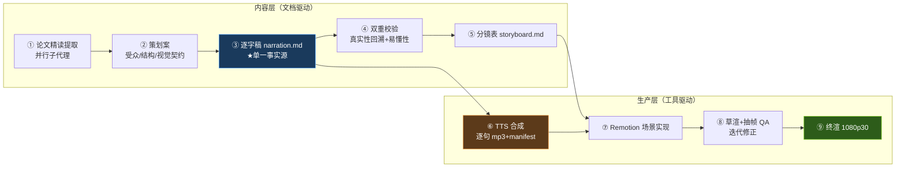

# 科普视频制作 Pipeline（公共基建）

> 从「论文精读 → 逐字稿 → 配音 → 代码动画 → 终渲」全链路中沉淀的**仓库级可复用流水线**。
> 首个完整范例：[《AI 如何自己变强？》](../self-improving-agents-video/README.md)（Remotion 工程模式）；轻量替代：[video-package 制作包模式](../../video-package/README.md)。

## 一、Pipeline 总览（9 Stages）



每个 Stage 的代理提示词规格见 [skills/](./skills/)（01–05 覆盖内容层，06 覆盖生产层 Stage ⑦ 的 Remotion 实现），可直接作为子代理 prompt 或未来挂载为 `.claude/skills/` 的底稿。

## 二、工程目录约定

每集视频一个 `media/<slug>-video/` 工程：

```
media/<slug>-video/
├── README.md               # 本集说明（目录表/复现流水线/视觉契约/许可）
├── research/paper-notes.md # 事实源：全部口播断言须可回溯至此
├── script/
│   ├── planning.md         # 策划案
│   ├── narration.md        # 逐字稿（唯一维护处，勿改 narration.json）
│   ├── narration.json      # 派生物（build_narration.py 生成）
│   └── storyboard.md       # 分镜表（镜号↔句 id 区间↔画面↔动效）
├── scripts/*.py            # 薄包装 → ../../pipeline/scripts/（保 CLI 契约）
├── video/                  # Remotion 独立 pnpm 工程（--ignore-workspace 隔离）
└── out/                    # 渲染产物（gitignored）
```

**格式契约**（`build_narration.py` 的解析规则）：
- narration.md：`## P0 标题` 分幕 + `- [p0-01] 文本` 一句一行；句 id 必须以幕名小写为前缀、全片唯一。
- `>` 引用块为画面备注，不进配音；英文方法名做角标不口播。

## 三、公共脚本（单一事实源）

| 脚本 | 用途 | 工程内等价调用 |
|---|---|---|
| [scripts/build_narration.py](./scripts/build_narration.py) | narration.md → narration.json + 时长估算 | `uv run --no-project scripts/build_narration.py` |
| [scripts/tts.py](./scripts/tts.py) | 逐句配音合成 + 时长 manifest（幂等，双引擎：edge 预置音色 / indextts 声音克隆） | `uv run --no-project --with edge-tts --with mutagen scripts/tts.py`（克隆模式免 edge-tts，见 [VOICE-CLONING.md](./VOICE-CLONING.md)） |
| [scripts/tts_server.py](./scripts/tts_server.py) | IndexTTS 推理服务（声音克隆后端，**运行于 index-tts 环境**，非本仓） | 在 `~/tools/index-tts` 内启动，见 [VOICE-CLONING.md §二](./VOICE-CLONING.md) |
| [scripts/prepare_ref.py](./scripts/prepare_ref.py) | 参考音色样本裁剪/规范化（长录音 → 5–15s 干净 WAV） | 无工程薄包装（与具体工程无关），从仓库根调用：`uv run --no-project --with soundfile --with numpy media/pipeline/scripts/prepare_ref.py <源音频>` |
| [scripts/qa_frames.py](./scripts/qa_frames.py) | 按句 id 抽帧视觉 QA | `uv run --no-project scripts/qa_frames.py out/draft.mp4 --scene P2` |

中心脚本以 `--project <工程根>` 参数化；工程内 `scripts/*.py` 为薄包装（透传参数、保持原 CLI）。改造/迭代只改 `media/pipeline/scripts/`，验证门 = 受影响工程的 `narration.json` / `manifest.json` 字节级不变。

## 四、复用边界（显式权衡）

- **Python 脚本：集中共享（SSOT）**——三个纯文本变换工具，跨集零差异，中心化防 split-brain。
- **Remotion 工程原语：复制适配，不做共享包**——`timing.ts` / `Subtitle` / `cards.tsx` / `theme.ts` 等每集复制后按本集视觉契约修改。理由：每集工程须保持 pnpm `--ignore-workspace` 独立可渲染（嵌套 workspace 隔离 + Remotion 版本自由），共享 TS 包会把「一集的视觉改动」泄漏进其他集。复用时以首集工程为模板复制 `video/` 骨架。
- **每集视觉契约独立设计**（色彩语义映射到本集核心概念），但底层规范复用：深色底 `#0E1116` 系、警示红 `#FF5C5C`、确认绿 `#7ED321`、金句卡衬线体、公式只作角标彩蛋。

## 五、音画同步机制（零手工对轨）

每句一段 MP3；`tts.py` 产出 `video/public/audio/manifest.json`（含每句实测时长）；Remotion `calculateMetadata` 读取 manifest 计算全片时间轴（默认句间 0.32s、幕间 +0.9s、片头 0.6s、片尾 2s）。**改稿后只需重跑：build → tts → render**。引擎可选 edge 预置音色（默认）或用自己的声音克隆（[VOICE-CLONING.md](./VOICE-CLONING.md)），两种引擎的 manifest 契约完全一致。

⚠️ 若工程自定义了 `timing.ts` 常量，须同步 `qa_frames.py` 顶部的镜像常量，否则抽帧时间错位。

## 六、新集脚手架清单

1. `cp -r` 上一集工程目录骨架（README/research/script/scripts/video），改 slug 与内容。
2. `video/package.json` 改 `name`；清空 scenes 重建；`theme.ts` 换本集色板。
3. 根 `.gitignore` 追加本集产物规则（**不能放工程内**——根级裸 `.gitignore` 规则会挡住嵌套 ignore 文件）：
   ```
   media/<slug>-video/video/public/audio/
   media/<slug>-video/out/
   media/<slug>-video/**/*.mp4
   media/<slug>-video/**/*.mp3
   media/<slug>-video/**/*.wav
   ```
4. `cd video && pnpm install --ignore-workspace`（必须显式忽略根 workspace；`onlyBuiltDependencies: [esbuild]` 已在 package.json）；装完检查根 lockfile 零变更。
5. 按 [skills/](./skills/) 01→05 顺序走内容层，再进生产层。

## 七、两种工程模式

| | Remotion 工程模式 | 轻量制作包模式 |
|---|---|---|
| 载体 | `media/<slug>-video/video/`（Remotion + React） | `video-package/`（单文件 Canvas HTML） |
| 动画 | 全代码动画，可编程复渲 | 浏览器手动录屏 |
| 配音 | edge-tts + manifest 自动对轨 | 人工录音/剪辑对齐 |
| 适用 | 中长视频、多轮迭代、可复现 | 快速产出、低工程成本 |
| 范例 | [《AI 如何自己变强？》](../self-improving-agents-video/README.md) | [《当 AI 开始给自己当老师》](../../video-package/README.md) |

## 八、许可注意

Remotion 对超过 3 人的公司需商业授权（个人/小团队免费）；edge-tts 为微软在线语音，发布前确认平台对合成语音的标注要求；**IndexTTS-2.5 按 bilibili 模型使用许可发布，个人/研究可用，商用需联系 indexspeech@bilibili.com**（详见 [VOICE-CLONING.md §八](./VOICE-CLONING.md)）；不使用任何未经授权的第三方图片/音频素材。
