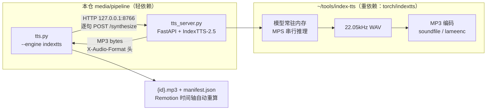

# 科普视频配音 · 声音克隆操作手册（IndexTTS-2.5）

> **文档定位**：本文是公共视频管线声音克隆能力（用自己的声音配音 + 轻快/自信/正能量等风格控制）的**单一参考**。
> 管线总纲见 [README.md](./README.md)；参考音色样本目录约定见 [voices/README.md](./voices/README.md)。

## 目录

1. [总览与架构](#一总览与架构)
2. [一次性部署（index-tts + 模型）](#二一次性部署index-tts--模型)
3. [参考音色样本](#三参考音色样本)
4. [风格与参数](#四风格与参数)
5. [逐集使用](#五逐集使用)
6. [缓存与幂等](#六缓存与幂等)
7. [故障排查](#七故障排查)
8. [许可与合规](#八许可与合规)
9. [备选方案与参考文献](#九备选方案与参考文献)

## 一、总览与架构

**能力**：用一段 5–15 秒的本人录音作为参考音色，零样本（zero-shot）克隆出本人音色，逐句合成整集配音；并通过情感向量注入轻快、自信、正能量等风格。

**架构**（管线脚本轻依赖 与 重型推理环境 完全解耦）：



**契约不变**：无论哪个引擎，输出仍是 `<工程>/video/public/audio/{id}.mp3` 与 `manifest.json`（`durationSec` 为实测时长），下游（Remotion 场景、字幕、抽帧 QA）零改动。

## 二、一次性部署（index-tts + 模型）

### 2.1 磁盘预算

| 项 | 占用 |
|---|---|
| index-tts 仓库 + uv 虚拟环境（含 torch） | ~4.5 GB |
| IndexTTS-2.5 checkpoints（含首跑自动下载的辅助模型） | ~6.5 GB |
| **合计** | **~11 GB**（本机部署前请确认剩余磁盘 ≥ 15 GB）


### 2.2 步骤

```bash
# 1) clone 仓库（仓库外，避免污染本仓）
mkdir -p ~/tools && cd ~/tools
git clone https://github.com/index-tts/index-tts.git
cd index-tts

# 2) 创建环境（uv 自动安装 Python 3.11 并锁定依赖；--all-extras 会装 webui 依赖，此处省磁盘不装）
uv sync

# 3) 下载模型（~6 GB，支持断点续传：中断后重跑同一命令即继续）
uv run hf download IndexTeam/IndexTTS-2.5 --local-dir checkpoints
# 网络不通时换 ModelScope 镜像：
#   git clone https://www.modelscope.cn/models/IndexTeam/IndexTTS-2.5.git checkpoints
```

### 2.3 启动推理服务

在 index-tts 根目录：

```bash
cd ~/tools/index-tts
uv run --frozen --with fastapi --with uvicorn --with soundfile --with numpy --with lameenc \
    python <本仓绝对路径>/media/pipeline/scripts/tts_server.py \
    --model-dir checkpoints --indextts-version 2.5 --host 127.0.0.1 --port 8766
```

- 启动即加载模型（约 30–60 秒），出现 `>> 就绪：IndexTTS-2.5 device=mps ...` 后可服务请求；
- 健康检查：`curl http://127.0.0.1:8766/health` → `{"ok": true, "version": "2.5", "device": "mps", "synthesizing": false, "dtype": "fp32", "encoder": "soundfile", "supports_duration_factor": true}`（MPS 上 dtype 恒为 fp32，属预期）；
- **仅监听 127.0.0.1、无鉴权，勿暴露公网**；`ref_path` 为服务端本地绝对路径。


### 2.4 部署问题与兜底

| 症状 | 处理 |
|---|---|
| `uv run --with` 报依赖解析冲突（与 gradio/torch 锁冲突） | 先 `uv pip install fastapi uvicorn soundfile lameenc` 装进 checkout 的 venv，再 `uv run --no-sync python ...` 启动 |
| `uv run --frozen` 报锁不同步 | 去掉 `--frozen`（仅当 checkout 的 uv.lock 与 pyproject 状态异常时） |
| HF 下载超时/中断 | 重跑 `hf download` 即续传；或改用 ModelScope（见 2.2） |
| 下载中途「假死」（进程在但字节零增长，连接 CLOSE_WAIT） | 强杀进程重跑即可续传：`pkill -f "hf download"` 后重复 `uv run hf download ...`；可循环重试直至完成 |
| 磁盘不足 | checkpoints 可与其它 index-tts 部署共享（启动时 `--model-dir` 指向同一目录） |

## 三、参考音色样本

### 3.1 要求

| 项 | 要求 |
|---|---|
| 时长 | **5–15 秒**（上限 30s） |
| 内容 | 自然说话，与目标成片语速/语调一致（韵律风格会被一并克隆） |
| 环境 | 安静房间、固定麦克风距离、无 BGM/混响/系统降噪痕迹 |
| 说话人 | 仅本人一人 |
| 格式 | WAV 16-bit ≥22.05kHz 优先（mp3/flac 经 `prepare_ref.py` 转换；m4a 需先 `ffmpeg -i in.m4a out.wav`） |

### 3.2 长录音裁剪（prepare_ref.py）

```bash
# 从长录音截取 [8s, 22s) 共 14s，归一化峰值、转 16-bit 单声道 WAV，输出到 voices/
uv run --no-project --with soundfile --with numpy \
    media/pipeline/scripts/prepare_ref.py ~/Documents/dify/me-1.mp3 --start 8 --duration 14
# → media/pipeline/voices/me-1.wav
```

裁剪段须试听确认：该段人声干净、无背景音乐、语句完整。样本 SHA1 参与缓存摘要（见 §六），替换样本自动失效缓存。

## 四、风格与参数

### 4.1 风格预设（--style）

| 预设 | 定位 | emo_vector（顺序：happy, angry, sad, afraid, disgusted, melancholic, surprised, calm） | alpha | df |
|---|---|---|---|---|
| neutral | 中性（默认） | 不注入情感，纯克隆参考音色 | — | 1.0 |
| passionate 激情 | 充满激情与轻快 | happy=.70, surprised=.20, calm=.10 | 0.7 | 0.97 |
| lively 轻快 | 明快跳跃 | happy=.55, surprised=.15, calm=.15 | 0.6 | 0.95 |
| confident 自信 | 沉稳有力 | calm=.65, happy=.25 | 0.7 | 1.05 |
| positive 正能量 | 昂扬向上 | happy=.75, calm=.20 | 0.7 | 1.0 |

### 4.2 自定义向量（--emo-vector）

`--emo-vector "happy:0.6,calm:0.2"` 语法覆盖预设；与 `--style` 非默认值互斥。**各分量非负，且有效和（Σ分量×emo-alpha）≤ 0.8**（客户端与服务端双重校验；管线直调 `infer` 不做自动归一，超界会拒绝请求；如 `happy:1.0` 在 alpha=0.6 下有效和 0.6，可放行）。alpha ≤0.8 推荐（官方建议）。

### 4.3 语速（--duration-factor）

0.5–2.0（>1 变慢、<1 变快）。仅 v2.5 支持；`--emo-vector` 模式默认 1.0（手动传 df 需服务为 v2.5）。

### 4.4 调参建议

风格向量是 8 维情感空间中的方向+强度，首次使用建议：固定一句文本，`--style` 各档合成一次试听对比；同风格微调用 `--emo-alpha 0.5`（更含蓄）或 `--duration-factor 0.92`（更紧凑）。**先跑 3 句小样确认，再全量合成**。科普长视频推荐 `passionate`（充满激情与轻快：高唤醒正价 happy 主载 + surprised 跳跃感 + 少量 calm 锚定咬字）；数字/术语密集的段落若嫌糊，可 `--duration-factor 1.0` 重跑该集。

## 五、逐集使用

```bash
# 0) 确认服务在线
curl -s http://127.0.0.1:8766/health

# 1) 全量合成（工程内薄包装等价）
cd media/<工程>
uv run --no-project --with mutagen scripts/tts.py --engine indextts \
    --ref <绝对路径>/media/pipeline/voices/me-1.wav --style passionate

# 2) 小样试听（先只跑 3 句：临时 narration.json 或 --force 单句验证均可）
# 3) 全量后重渲染（render 脚本定义在 video/package.json，须进入 video/）
cd video && pnpm run render:draft && pnpm run render
```

- 服务启动一次可服务多集；管线客户端不常驻模型；
- 每句 5–30 秒（MPS fp32，与文本长度相关），整集（约 100 句）预计 20–60 分钟，按句缓存可断点续跑（见 §六）；
- 引擎/风格/样本任一变化都会改写时长，合成后**必须重跑草渲**让时间轴重算；
- 超长句（>120 token）服务端内部自动分段；极端长句推理可达数分钟。客户端并发为 1（与服务端串行推理对齐，避免排队时间计入超时），HTTP 超时 600s；万一超时——重跑即续传，无需干预。


## 六、缓存与幂等

| 引擎 | 摘要公式 |
|---|---|
| edge（历史不变） | `sha1(voice\|rate\|text)` |
| indextts | `sha1(indextts\|engine_tag\|ref_sha1前12位\|lang\|style\|vec\|alpha\|df\|text)` |

- sidecar `{id}.sha` 与 `{id}.mp3` 一一对应、单槽位：换引擎/风格/样本/语速 = 全量重合成（一个句 id 只有一个 mp3 槽位，这是 Remotion 契约决定的）；
- 模型/服务升级后想强制刷新全部音频：`--engine-tag v2.5b`（自定义标记进摘要）；
- 中断后续跑：直接重跑同命令（已完成句子全部命中缓存跳过）。


## 七、故障排查

| 症状 | 原因 | 处理 |
|---|---|---|
| 合成请求全部失败，报「服务不可用」 | 服务未启动/端口错 | `curl 127.0.0.1:8766/health`；按 §2.3 启动；`lsof -ti:8766` 查占用 |
| 生成音频含 NaN（HTTP 500，detail 提示） | MPS 数值问题 | 客户端自动重试常可清；持续则服务加 `--device cpu` 重启（速度大幅下降，仅救急） |
| 合成极慢 / 内存飙高 | fp32 + 长句 | 服务串行推理已是缓解；进一步可 `--device cpu` 换稳定；句长已由 max_text_tokens_per_segment=120 内部切分 |
| 服务日志 `QwenEmotion not loaded` | 正常 | 仅向量模式，不加载 Qwen（省内存） |
| `X-Audio-Format=wav` | 服务端 MP3 编码器探测失败 | 按 §2.3 带 `--with lameenc` 重启服务 |
| `/health` 报 `supports_duration_factor=false` | 服务为 IndexTTS-2 | 语速控制需 v2.5：重启服务 `--indextts-version 2.5` |
| 生成音色「不像我」 | 样本质量问题 | 按 §三 重录/重裁：换更干净段落、保证单说话人、5–15s |
| 长句合成失败 | 超时（HTTP_TIMEOUT=600s） | 重跑（缓存续传）；超长句在逐字稿层面拆句 |
| edge 模式失败 | 网络 | 与历史行为一致（重试 4 次后报错） |

## 八、许可与合规

- **模型许可**：IndexTTS-2.5 按 [bilibili 模型使用许可协议](https://github.com/index-tts/index-tts/blob/main/LICENSE)（bilibili Model Use License）发布——**个人/研究用途可用；商用需联系 indexspeech@bilibili.com**。制作对外发布的视频前请自行评估许可范围。
- **声音权利**：克隆他人声音必须获得本人书面同意；本仓 `media/pipeline/voices/` 下样本已被根 `.gitignore` 忽略，绝不入库。
- **edge-tts 义务**：edge-tts 为微软服务免费接口，成品需遵守微软服务条款；当前默认引擎仍为 edge，行为与历史完全一致。

## 九、备选方案与参考文献

### 9.1 方案对比（为何选 IndexTTS-2.5）

| 方案 | 克隆 | 风格控制 | Mac 部署 | 备注 |
|---|---|---|---|---|
| edge-tts | ❌ 仅预置 | 仅 rate | 无需部署 | 本管线默认引擎（零成本回退） |
| **IndexTTS-2.5** | ✅ 单样本零样本 | ✅ 向量+强度+语速 | ✅ MPS fp32 | **主方案**；中英日西阿 |
| IndexTTS-2 | ✅ | ✅ 向量（无语速） | ✅ fp16 成熟 | 服务端一键回退档（`--indextts-version 2`） |
| mlx-indextts（社区 MLX 移植） | ✅ | 仅 2.0 | ✅ 最省内存 | 不支持 2.5，需自行转换权重 |
| GPT-SoVITS | ✅ 微调最佳 | 依赖参考音频 | 推理可/训练差 | 需训练工作流，过重 |
| CosyVoice 2 | ✅ 3–10s | instruct 指令 | ✅ | 克隆相似度略逊 |
| 云端（Azure Custom Voice 等） | ✅ | ✅ | 无需 | 收费/审核/隐私，不采纳 |

### 9.2 参考文献（IEEE）

<a id="ref1"></a>[1] B. Si et al., "IndexTTS: An Industrial-Level Controllable and Efficient Zero-Shot Text-To-Speech System," *arXiv preprint arXiv:2502.05512*, 2025.

<a id="ref2"></a>[2] B. Si et al., "IndexTTS-2: Breakthrough Emotionally Expressive and Duration-Controlled Auto-Regressive Zero-Shot Text-To-Speech," *arXiv preprint arXiv:2506.21619*, 2025.

<a id="ref3"></a>[3] B. Si et al., "IndexTTS-2.5 Technical Report," *arXiv preprint arXiv:2601.03888*, 2026.

<a id="ref4"></a>[4] Skywork 博客：[Index-TTS 2 on Mac](https://skywork.ai/blog/index-tts-2-on-mac-how-i-got-emotion-aware-lip-sync-ready-tts-running-without-cuda/) —— Mac MPS 部署实测（NaN clamp 等补丁）。

<a id="ref5"></a>[5] macOS 部署参考：[张洪Heo：Mac 部署 IndexTTS2](https://blog.zhheo.com/p/gulzh21p.html)。
